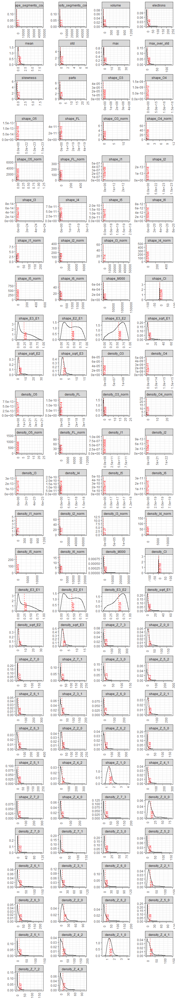

#Podsumowanie

(poni¿sze komentarze dostêpne s¹ równie¿ w miejscu ich dotycz¹cym)

##a.d.3. Kod pozwalaj¹cy wczytaæ dane z pliku.
Do wczytania danych wykorzysta³em funkcjê fread z pakietu data.table. Funkcja ta jest znacznie szybsza ni¿ read.table i pozwala na usuwanie zbêdnych kolumn ju¿ na etapie wczytywania danych. Dodatkowo prawid³owo rozpoznaje kolumny o typie Integer

##a.d.5. Kod przetwarzaj¹cy brakuj¹ce dane.
Dane zostaj¹ podzielone na 3 czêœci (part_00, part_01 i part_02). Prefisky kolumn usuniête, dodana kolumna part z wartoœci¹ odpowiedniego partu bêd¹cego Ÿród³em danych. Nastêpnie dane s¹ ³¹czone w jeden data frame. Proces ten usuwa wszystkie wartoœci NA - uzyskane dane s¹ wiêc wyczyszczone.

Je¿eli any_meas* = 0, to zak³adam, ¿e nie nast¹pi³‚ pomiar (w kolejnych kolumnach dane NA, gdy¿ nie by³o podstawy do obliczeñ). W takiej sytuacji zamiana NA na np. œredni¹ nie ma sensu (0 elektronów nie mo¿e mieæ kszta³tu itp.) dlatego te¿ dane dotycz¹ce danego part zostaj¹ usuniête.

*any_meas = shape_segments_count + density_segments_count + volume + electrons + mean + std + max + max_over_std + skewness + parts) [¿adna z tych zmiennych nie przyjmuje wartoœci < 0, wiêc suma == 0 jednoznacznie wskazuje na brak tych danych]

##a.d.8. Sekcjê sprawdzaj¹c¹ korelacje miêdzy zmiennymi
Poni¿ej znajduje siê wykres korelacji miêdzy zmiennymi. Zauwa¿yæ mo¿na, ¿e:

* Du¿a czêœæ zmiennych jest w silnej korelacji z innymi zmiennymi

* Zmienne density_Z* i shape_z* s¹ w bardzo silnej korelacji (du¿e czerwone prostok¹ty)

* Zmienne local* koreluj¹ z zmiennymi z part (by³y obliczane na ich podstawie)

##a.d.14 i 15
Spoœród testowanych metod najlepiej sprawdzi³y siê:

* Linear Regression (lm) dla regresji

* Random Forest (rf) dla klasyfikacji

Z racji du¿ego zbioru danych (ok. 1 mln rekordów) za metodê wybierania zbioru walidacyjnego wybra³em bootstrap (losowanie ze zwracaniem) - metoda zapewnia stratyfikacjê danych (https://machinelearningmastery.com/how-to-estimate-model-accuracy-in-r-using-the-caret-package/)

##a.d.14.Sekcjê sprawdzaj¹c¹ czy na podstawie wartoœci innych kolumn mo¿na przewidzieæ:
Na podstawie obliczeñ usatli³em, ¿e odpowiednio 3% i 1% danych powinien wystarczyæ jako zbiór testowy (z obliczeniami mo¿na zapoznaæ siê w sekcji 14)

Liczba elektronów zosta³a okreœlona z miarami:

RMSE = 64,453

r^2 = 0,48


Liczba elektronów zosta³a okreœlona z miarami:

RMSE = 9,45

r^2 = 0,49

##a.d.15.Sekcjê próbuj¹c¹ stworzyæ klasyfikator przewiduj¹cy wartoœæ atrybutu res_name 
Na podstawie obliczeñ usatli³em, ¿e 1% danych powinien wystarczyæ jako zbiór testowy (z obliczeniami mo¿na zapoznaæ siê w sekcji 15)

Random Forest uzyska³ precyzjê = 0,6

Klasyfikator naiwny (wskazuj¹cy najliczniejsz¹ klasê) dokona³by predykcji res_name = SO4. Miara Accuracy = 0,15.

# 1. Kod wyliczaj¹cy wykorzystane biblioteki.

```r
library(data.table)
library(DT)
library(ggplot2)
library(plotly)
library(dplyr)
library(reshape)
library(caret)
```


# 2. Kod zapewniaj¹cy powtarzalnoœæ wyników.

```r
set.seed(123)
```

# 3. Kod pozwalaj¹cy wczytaæ dane z pliku.
Do wczytania danych wykorzysta³em funkcjê fread z pakietu data.table. Funkcja ta jest znacznie szybsza ni¿ read.table i pozwala na usuwanie zbêdnych kolumn ju¿ na etapie wczytywania danych. Dodatkowo prawid³owo rozpoznaje kolumny o typie Integer 

```r
out_columns <- c("blob_coverage", "res_coverage", "title", "pdb_code", "res_id", "chain_id", "blob_volume_coverage", "blob_volume_coverage_second", "res_volume_coverage", "res_volume_coverage_second", "skeleton_cycle_4", "skeleton_diameter", "skeleton_cycle_6", "skeleton_cycle_7", "skeleton_closeness_006_008", "skeleton_closeness_002_004", "skeleton_cycle_3", "skeleton_avg_degree", "skeleton_closeness_004_006", "skeleton_closeness_010_012", "skeleton_closeness_012_014", "skeleton_edges", "skeleton_radius", "skeleton_cycle_8_plus", "skeleton_closeness_020_030", "skeleton_deg_5_plus", "skeleton_closeness_016_018", "skeleton_closeness_008_010", "skeleton_closeness_018_020", "skeleton_average_clustering", "skeleton_closeness_040_050", "skeleton_closeness_014_016", "skeleton_center", "skeleton_closeness_000_002", "skeleton_density", "skeleton_closeness_030_040", "skeleton_deg_4", "skeleton_deg_0", "skeleton_deg_1", "skeleton_deg_2", "skeleton_deg_3", "skeleton_graph_clique_number", "skeleton_nodes", "skeleton_cycles", "skeleton_cycle_5", "skeleton_closeness_050_plus", "skeleton_periphery", "local_cut_by_mainchain_volume", "local_near_cut_count_C", "local_near_cut_count_other", "local_near_cut_count_S", "local_near_cut_count_O", "local_near_cut_count_N", "fo_col", "fc_col", "weight_col", "grid_space", "solvent_radius", "solvent_opening_radius", "resolution_max_limit", "part_step_FoFc_std_min", "part_step_FoFc_std_max", "part_step_FoFc_std_step", "skeleton_data", "local_res_atom_count", "local_res_atom_non_h_occupancy_sum", "local_res_atom_non_h_electron_occupancy_sum", "local_res_atom_C_count", "local_res_atom_N_count", "local_res_atom_O_count", "local_res_atom_S_count", "dict_atom_C_count", "dict_atom_N_count", "dict_atom_O_count", "dict_atom_S_count")

file = "C:/Users/Developer/Desktop/all_summary.csv"
data <- fread(file = file, 
             sep = ";", 
             header = TRUE,
             na.string = c(",,", "NAN", "nan"),
             drop = out_columns
            )
```

# 4. Kod usuwaj¹cy z danych wiersze posiadaj¹ce wartoœæ zmiennej res_name

```r
out_res_names = c("UNK", "UNX", "UNL", "DUM", "N", "BLOB", "ALA", "ARG", "ASN", "ASP", "CYS", "GLN", "GLU", "GLY", "HIS", "ILE", "LEU", "LYS", "MET", "MSE", "PHE", "PRO", "SEC", "SER", "THR", "TRP", "TYR", "VAL", "DA", "DG", "DT", "DC", "DU", "A", "G", "T", "C", "U", "HOH", "H20", "WAT")
data <- data %>% filter(!res_name %in% out_res_names)
```

# 5. Kod przetwarzaj¹cy brakuj¹ce dane.
Dane zostaj¹ podzielone na 3 czêœci (part_00, part_01 i part_02). Prefisky kolumn usuniête, dodana kolumna part z wartoœci¹ odpowiedniego partu bêd¹cego Ÿród³em danych. Nastêpnie dane s¹ ³¹czone w jeden data frame. Proces ten usuwa wszystkie wartoœci NA - uzyskane dane s¹ wiêc wyczyszczone.

Je¿eli any_meas* = 0, to zak³adam, ¿e nie nast¹pi³‚ pomiar (w kolejnych kolumnach dane NA, gdy¿ nie by³o podstawy do obliczeñ). W takiej sytuacji zamiana NA na np. œredni¹ nie ma sensu (0 elektronów nie mo¿e mieæ kszta³tu itp.) dlatego te¿ dane dotycz¹ce danego part zostaj¹ usuniête.

*any_meas = shape_segments_count + density_segments_count + volume + electrons + mean + std + max + max_over_std + skewness + parts) [¿adna z tych zmiennych nie przyjmuje wartoœci < 0, wiêc suma == 0 jednoznacznie wskazuje na brak tych danych]


```r
data_part00 <- data %>% 
    select(-starts_with("part_01"), -starts_with("part_02")) %>% 
    rename_at(.vars = vars(starts_with("part_00_")), .funs = funs(sub("^part_00_", "", .))) %>%
    mutate(any_meas = shape_segments_count + density_segments_count + volume + electrons + mean + std + max + max_over_std + skewness + parts) %>%       
    filter(any_meas != 0) %>% 
    select(-any_meas) %>%
    mutate(part = "part_00")

data_part01 <- data %>% 
    select(-starts_with("part_00"), -starts_with("part_02")) %>% 
    rename_at(.vars = vars(starts_with("part_01_")), .funs = funs(sub("^part_01_", "", .))) %>%
    mutate(any_meas = shape_segments_count + density_segments_count + volume + electrons + mean + std + max + max_over_std + skewness + parts) %>%       
    filter(any_meas != 0) %>% 
    select(-any_meas) %>%  
    mutate(part = "part_01")

data_part02 <- data %>% 
    select(-starts_with("part_00"), -starts_with("part_01")) %>% 
    rename_at(.vars = vars(starts_with("part_02_")), .funs = funs(sub("^part_02_", "", .))) %>%
    mutate(any_meas = shape_segments_count + density_segments_count + volume + electrons + mean + std + max + max_over_std + skewness + parts) %>%       
    filter(any_meas != 0) %>% 
    select(-any_meas) %>%  
    mutate(part = "part_02")
data <- rbind(data_part00, data_part01, data_part02) 
```
W kolumnach znajduje siê local_min - kolumna ta ma 0 we wszystkich wierszach - jest wiêc zbêdna

```r
data %>% select(local_min) %>% distinct()
```

```
##   local_min
## 1         0
```

```r
data <- data %>% select(-local_min)
rm(data_part00, data_part01, data_part02)
```

# 6. Sekcjê podsumowuj¹c¹ rozmiar zbioru i podstawowe statystyki.
##Wymiary:

```r
dim(data)
```

```
## [1] 1710450     125
```

##Liczba unikalnych res_name

```r
data %>% select(res_name) %>% distinct() %>% nrow()
```

```
## [1] 19603
```

##Przyk³adów/part

```r
data %>% group_by(part) %>% summarize(n = n()) %>% arrange(desc(n)) %>% prettyTable()
```

<!--html_preserve--><div id="htmlwidget-49c968e2f00b87e48d74" style="width:100%;height:auto;" class="datatables html-widget"></div>
<script type="application/json" data-for="htmlwidget-49c968e2f00b87e48d74">{"x":{"style":"bootstrap","filter":"none","data":[["part_00","part_01","part_02"],[585330,579844,545276]],"container":"<table class=\"table table-striped table-hover\">\n  <thead>\n    <tr>\n      <th>part<\/th>\n      <th>n<\/th>\n    <\/tr>\n  <\/thead>\n<\/table>","options":{"dom":"Bfrtip","buttons":["copy","csv","excel","pdf","print"],"scrollX":true,"columnDefs":[{"className":"dt-right","targets":1}],"order":[],"autoWidth":false,"orderClasses":false,"rowCallback":"function(row, data) {\n}"}},"evals":["options.rowCallback"],"jsHooks":[]}</script><!--/html_preserve-->

##Podstawowe statystyki pozosta³ych kolumn

```r
data %>% select(-res_name, -starts_with("part")) %>%
  summary() %>% 
  unclass() %>%
  data.frame(check.names = FALSE, stringsAsFactors = FALSE) %>% 
  prettyTable()
```

<!--html_preserve--><div id="htmlwidget-f474ad921ae63e0a53f4" style="width:100%;height:auto;" class="datatables html-widget"></div>
<script type="application/json" data-for="htmlwidget-f474ad921ae63e0a53f4">{"x":{"style":"bootstrap","filter":"none","data":[["Min.   :  1.0  ","1st Qu.:  4.0  ","Median :  6.0  ","Mean   : 13.4  ","3rd Qu.: 19.0  ","Max.   :111.0  ",null],["Min.   :   3.00  ","1st Qu.:  30.00  ","Median :  48.00  ","Mean   :  99.63  ","3rd Qu.: 132.00  ","Max.   :1848.00  ",null],["Min.   :  1.00  ","1st Qu.:  4.00  ","Median :  6.00  ","Mean   : 13.69  ","3rd Qu.: 19.00  ","Max.   :128.00  ","NA's   :32268  "],["Min.   :   3.0  ","1st Qu.:  30.0  ","Median :  48.0  ","Mean   : 101.8  ","3rd Qu.: 132.0  ","Max.   :1223.0  ","NA's   :32268  "],["Min.   :   57.76  ","1st Qu.:  215.49  ","Median :  351.65  ","Mean   :  868.86  ","3rd Qu.:  807.84  ","Max.   :90952.51  ",null],["Min.   :  0.0149  ","1st Qu.:  3.6652  ","Median :  8.0314  ","Mean   : 18.0497  ","3rd Qu.: 20.1175  ","Max.   :442.4445  ",null],["Min.   :0.0001147  ","1st Qu.:0.0125222  ","Median :0.0189848  ","Mean   :0.0239262  ","3rd Qu.:0.0288933  ","Max.   :0.4264420  ",null],["Min.   :0.0006606  ","1st Qu.:0.0702120  ","Median :0.1001600  ","Mean   :0.1245312  ","3rd Qu.:0.1450440  ","Max.   :1.9595600  ",null],["Min.   : 0.00452  ","1st Qu.: 0.58407  ","Median : 0.91041  ","Mean   : 1.37753  ","3rd Qu.: 1.53524  ","Max.   :44.63360  ",null],["Min.   :  2.861  ","1st Qu.:  5.372  ","Median :  7.383  ","Mean   :  9.911  ","3rd Qu.: 11.451  ","Max.   :173.252  ",null],["Min.   :0.001174  ","1st Qu.:0.123960  ","Median :0.177284  ","Mean   :0.226270  ","3rd Qu.:0.259701  ","Max.   :4.035155  ",null],["Min.   :     0.0  ","1st Qu.:     3.0  ","Median :    16.0  ","Mean   :   291.1  ","3rd Qu.:   103.0  ","Max.   :114577.0  ",null],["Min.   :     0.0  ","1st Qu.:     3.0  ","Median :    16.0  ","Mean   :   291.1  ","3rd Qu.:   103.0  ","Max.   :114577.0  ",null],["Min.   :   0.256  ","1st Qu.:   4.624  ","Median :  10.888  ","Mean   :  26.466  ","3rd Qu.:  27.072  ","Max.   :2427.944  ",null],["Min.   :  0.0037  ","1st Qu.:  2.5256  ","Median :  6.4615  ","Mean   : 15.4715  ","3rd Qu.: 17.0854  ","Max.   :441.1374  ",null],["Min.   :0.0039  ","1st Qu.:0.4017  ","Median :0.5683  ","Mean   :0.6627  ","3rd Qu.:0.7932  ","Max.   :9.7635  ",null],["Min.   :0.000109  ","1st Qu.:0.055897  ","Median :0.112755  ","Mean   :0.204077  ","3rd Qu.:0.228158  ","Max.   :8.262894  ",null],["Min.   : 0.00452  ","1st Qu.: 0.58406  ","Median : 0.91040  ","Mean   : 1.37753  ","3rd Qu.: 1.53523  ","Max.   :44.63357  ",null],["Min.   :  2.861  ","1st Qu.:  5.372  ","Median :  7.383  ","Mean   :  9.911  ","3rd Qu.: 11.451  ","Max.   :173.252  ",null],["Min.   : 0.000073  ","1st Qu.: 0.047416  ","Median : 0.101692  ","Mean   : 0.207922  ","3rd Qu.: 0.225486  ","Max.   :10.891565  ",null],["Min.   :7.400e+01  ","1st Qu.:1.421e+04  ","Median :6.181e+04  ","Mean   :1.319e+06  ","3rd Qu.:4.073e+05  ","Max.   :2.629e+09  ",null],["Min.   :1.809e+03  ","1st Qu.:4.912e+07  ","Median :9.455e+08  ","Mean   :6.755e+12  ","3rd Qu.:3.370e+10  ","Max.   :4.338e+17  ",null],["Min.   :1.229e+04  ","1st Qu.:4.734e+10  ","Median :3.973e+12  ","Mean   :9.053e+19  ","3rd Qu.:6.675e+14  ","Max.   :2.908e+25  ",null],["Min.   :-6.100e+01  ","1st Qu.: 1.148e+08  ","Median : 1.177e+10  ","Mean   : 3.909e+16  ","3rd Qu.: 2.430e+12  ","Max.   : 8.380e+21  ",null],["Min.   : 0.2269  ","1st Qu.: 0.2594  ","Median : 0.3641  ","Mean   : 0.5311  ","3rd Qu.: 0.6554  ","Max.   :68.8837  ",null],["Min.   : 0.01699  ","1st Qu.: 0.02043  ","Median : 0.03105  ","Mean   : 0.07336  ","3rd Qu.: 0.07688  ","Max.   :21.69251  ",null],["Min.   :0.000366  ","1st Qu.:0.000486  ","Median :0.000701  ","Mean   :0.002645  ","3rd Qu.:0.001965  ","Max.   :6.417807  ",null],["Min.   :   0.000  ","1st Qu.:   0.000  ","Median :   0.004  ","Mean   :   0.177  ","3rd Qu.:   0.042  ","Max.   :3374.842  ",null],["Min.   :2.060e+02  ","1st Qu.:4.706e+05  ","Median :4.138e+06  ","Mean   :2.310e+09  ","3rd Qu.:8.185e+07  ","Max.   :1.633e+14  ",null],["Min.   :1.088e+04  ","1st Qu.:3.359e+10  ","Median :2.516e+12  ","Mean   :1.810e+20  ","3rd Qu.:7.258e+14  ","Max.   :3.583e+25  ",null],["Min.   :9.187e+03  ","1st Qu.:7.858e+10  ","Median :6.865e+12  ","Mean   :5.905e+22  ","3rd Qu.:3.435e+15  ","Max.   :2.665e+28  ",null],["Min.   :-2.200e+01  ","1st Qu.: 5.590e+07  ","Median : 6.551e+09  ","Mean   : 2.227e+16  ","3rd Qu.: 1.532e+12  ","Max.   : 4.527e+21  ",null],["Min.   :0.000e+00  ","1st Qu.:6.394e+06  ","Median :1.846e+09  ","Mean   :1.106e+16  ","3rd Qu.:6.960e+11  ","Max.   :1.957e+21  ",null],["Min.   :5.232e+03  ","1st Qu.:2.945e+09  ","Median :1.153e+11  ","Mean   :1.127e+18  ","3rd Qu.:1.715e+13  ","Max.   :3.743e+23  ",null],["Min.   :   0.060  ","1st Qu.:   0.088  ","Median :   0.210  ","Mean   :   0.769  ","3rd Qu.:   0.701  ","Max.   :8356.552  ",null],["Min.   :    0.00  ","1st Qu.:    0.00  ","Median :    0.01  ","Mean   :    0.37  ","3rd Qu.:    0.05  ","Max.   :48073.17  ",null],["Min.   :       0  ","1st Qu.:       0  ","Median :       0  ","Mean   :      82  ","3rd Qu.:       0  ","Max.   :69819221  ",null],["Min.   :   0.000  ","1st Qu.:   0.000  ","Median :   0.002  ","Mean   :   0.151  ","3rd Qu.:   0.027  ","Max.   :3367.004  ",null],["Min.   :   0.000  ","1st Qu.:   0.000  ","Median :   0.001  ","Mean   :   0.134  ","3rd Qu.:   0.014  ","Max.   :3361.778  ",null],["Min.   :     0.0  ","1st Qu.:     0.0  ","Median :     0.0  ","Mean   :     1.7  ","3rd Qu.:     0.3  ","Max.   :575558.1  ",null],["Min.   :    32  ","1st Qu.:   578  ","Median :  1361  ","Mean   :  3308  ","3rd Qu.:  3384  ","Max.   :303493  ",null],["Min.   :-153.74770  ","1st Qu.:  -0.61122  ","Median :   0.00013  ","Mean   :   0.03824  ","3rd Qu.:   0.64455  ","Max.   : 147.03809  ",null],["Min.   :0.0000309  ","1st Qu.:0.0816411  ","Median :0.1815433  ","Mean   :0.2560914  ","3rd Qu.:0.3958677  ","Max.   :0.9950984  ",null],["Min.   :0.0000494  ","1st Qu.:0.2104655  ","Median :0.3970670  ","Mean   :0.4316316  ","3rd Qu.:0.6381183  ","Max.   :1.0000000  ",null],["Min.   :0.009098  ","1st Qu.:0.381592  ","Median :0.595127  ","Mean   :0.565965  ","3rd Qu.:0.760363  ","Max.   :1.000000  ",null],["Min.   :  0.9297  ","1st Qu.:  3.4369  ","Median :  5.3158  ","Mean   :  7.5060  ","3rd Qu.:  9.5529  ","Max.   :202.7615  ",null],["Min.   : 0.528  ","1st Qu.: 2.254  ","Median : 3.189  ","Mean   : 4.080  ","3rd Qu.: 4.886  ","Max.   :34.516  ",null],["Min.   : 0.3033  ","1st Qu.: 1.7274  ","Median : 2.3752  ","Mean   : 2.6994  ","3rd Qu.: 3.2510  ","Max.   :20.3426  ",null],["Min.   :        3  ","1st Qu.:     7624  ","Median :    34098  ","Mean   :   682152  ","3rd Qu.:   199697  ","Max.   :567372596  ",null],["Min.   :2.000e+00  ","1st Qu.:1.402e+07  ","Median :2.824e+08  ","Mean   :1.035e+12  ","3rd Qu.:8.073e+09  ","Max.   :2.006e+16  ",null],["Min.   :1.000e+00  ","1st Qu.:7.148e+09  ","Median :6.350e+11  ","Mean   :1.152e+18  ","3rd Qu.:7.879e+13  ","Max.   :1.808e+23  ",null],["Min.   :-2.300e+01  ","1st Qu.: 2.743e+07  ","Median : 3.145e+09  ","Mean   : 2.832e+15  ","3rd Qu.: 6.405e+11  ","Max.   : 4.049e+20  ",null],["Min.   :  0.0329  ","1st Qu.:  0.3492  ","Median :  0.5615  ","Mean   :  0.7608  ","3rd Qu.:  0.9594  ","Max.   :412.3283  ",null],["Min.   :  0.00036  ","1st Qu.:  0.03507  ","Median :  0.07681  ","Mean   :  0.15403  ","3rd Qu.:  0.17312  ","Max.   :115.54759  ",null],["Min.   :0.00e+00  ","1st Qu.:1.01e-03  ","Median :2.70e-03  ","Mean   :8.42e-03  ","3rd Qu.:7.11e-03  ","Max.   :1.13e+02  ",null],["Min.   :    -0.04  ","1st Qu.:     0.00  ","Median :     0.01  ","Mean   :     1.10  ","3rd Qu.:     0.14  ","Max.   :197912.79  ",null],["Min.   :1.800e+01  ","1st Qu.:2.431e+05  ","Median :2.102e+06  ","Mean   :8.896e+08  ","3rd Qu.:3.965e+07  ","Max.   :1.282e+13  ",null],["Min.   :7.500e+01  ","1st Qu.:8.968e+09  ","Median :6.562e+11  ","Mean   :1.017e+19  ","3rd Qu.:1.656e+14  ","Max.   :1.509e+24  ",null],["Min.   :7.500e+01  ","1st Qu.:2.063e+10  ","Median :1.740e+12  ","Mean   :7.561e+20  ","3rd Qu.:8.401e+14  ","Max.   :1.643e+26  ",null],["Min.   :-6.000e+00  ","1st Qu.: 1.381e+07  ","Median : 1.881e+09  ","Mean   : 1.746e+15  ","3rd Qu.: 4.432e+11  ","Max.   : 2.342e+20  ",null],["Min.   :0.000e+00  ","1st Qu.:2.336e+06  ","Median :6.826e+08  ","Mean   :1.022e+15  ","3rd Qu.:2.376e+11  ","Max.   :1.203e+20  ",null],["Min.   :1.600e+01  ","1st Qu.:8.221e+08  ","Median :3.205e+10  ","Mean   :3.134e+16  ","3rd Qu.:4.148e+12  ","Max.   :5.255e+21  ",null],["Min.   :     0.00  ","1st Qu.:     0.17  ","Median :     0.49  ","Mean   :     2.54  ","3rd Qu.:     1.56  ","Max.   :298590.95  ",null],["Min.   :      0.0  ","1st Qu.:      0.0  ","Median :      0.0  ","Mean   :      4.6  ","3rd Qu.:      0.2  ","Max.   :2154055.6  ",null],["Min.   :0.000e+00  ","1st Qu.:0.000e+00  ","Median :0.000e+00  ","Mean   :1.220e+05  ","3rd Qu.:1.000e+00  ","Max.   :8.912e+10  ",null],["Min.   :    -0.02  ","1st Qu.:     0.00  ","Median :     0.01  ","Mean   :     1.07  ","3rd Qu.:     0.09  ","Max.   :264833.31  ",null],["Min.   :     0.00  ","1st Qu.:     0.00  ","Median :     0.00  ","Mean   :     1.05  ","3rd Qu.:     0.06  ","Max.   :309447.00  ",null],["Min.   :        0  ","1st Qu.:        0  ","Median :        0  ","Mean   :      218  ","3rd Qu.:        1  ","Max.   :123080053  ",null],["Min.   :    0.47  ","1st Qu.:  315.70  ","Median :  807.68  ","Mean   : 1933.94  ","3rd Qu.: 2135.68  ","Max.   :55142.18  ",null],["Min.   :-166.92892  ","1st Qu.:  -0.65125  ","Median :   0.00010  ","Mean   :   0.03832  ","3rd Qu.:   0.68048  ","Max.   : 167.53733  ",null],["Min.   :0.0000308  ","1st Qu.:0.0790912  ","Median :0.1821246  ","Mean   :0.2588727  ","3rd Qu.:0.4038948  ","Max.   :0.9967620  ",null],["Min.   :0.000049  ","1st Qu.:0.206639  ","Median :0.398185  ","Mean   :0.432130  ","3rd Qu.:0.642270  ","Max.   :1.000000  ",null],["Min.   :0.009933  ","1st Qu.:0.381986  ","Median :0.599260  ","Mean   :0.568147  ","3rd Qu.:0.765049  ","Max.   :1.000000  ",null],["Min.   :  0.9252  ","1st Qu.:  3.2311  ","Median :  5.0006  ","Mean   :  7.2324  ","3rd Qu.:  9.2722  ","Max.   :202.4823  ",null],["Min.   : 0.5272  ","1st Qu.: 2.1540  ","Median : 2.9887  ","Mean   : 3.8909  ","3rd Qu.: 4.6287  ","Max.   :33.1408  ",null],["Min.   : 0.3032  ","1st Qu.: 1.6675  ","Median : 2.2476  ","Mean   : 2.5643  ","3rd Qu.: 3.0394  ","Max.   :19.3785  ",null],["Min.   :  5.84  ","1st Qu.: 12.33  ","Median : 22.31  ","Mean   : 36.38  ","3rd Qu.: 47.29  ","Max.   :558.71  ",null],["Min.   :  2.764  ","1st Qu.: 11.747  ","Median : 18.025  ","Mean   : 22.892  ","3rd Qu.: 28.423  ","Max.   :269.172  ",null],["Min.   :  0.6818  ","1st Qu.:  6.6323  ","Median :  8.9127  ","Mean   : 16.1343  ","3rd Qu.: 19.8933  ","Max.   :366.9917  ",null],["Min.   :  3.662  ","1st Qu.:  8.694  ","Median : 14.601  ","Mean   : 25.323  ","3rd Qu.: 32.854  ","Max.   :446.136  ",null],["Min.   :  0.4922  ","1st Qu.:  4.7826  ","Median :  9.1547  ","Mean   : 13.5958  ","3rd Qu.: 17.7525  ","Max.   :208.1280  ",null],["Min.   :  3.978  ","1st Qu.: 11.077  ","Median : 20.870  ","Mean   : 30.788  ","3rd Qu.: 40.102  ","Max.   :455.101  ",null],["Min.   :  0.7943  ","1st Qu.:  9.2495  ","Median : 17.2526  ","Mean   : 27.7495  ","3rd Qu.: 37.1749  ","Max.   :476.2128  ",null],["Min.   :  2.476  ","1st Qu.:  8.868  ","Median : 15.664  ","Mean   : 21.633  ","3rd Qu.: 27.611  ","Max.   :297.276  ",null],["Min.   :  0.00243  ","1st Qu.:  4.30560  ","Median :  8.30746  ","Mean   : 13.21473  ","3rd Qu.: 17.13906  ","Max.   :299.01325  ",null],["Min.   :  1.588  ","1st Qu.: 15.509  ","Median : 24.622  ","Mean   : 33.282  ","3rd Qu.: 42.215  ","Max.   :420.809  ",null],["Min.   :  3.178  ","1st Qu.: 14.280  ","Median : 26.125  ","Mean   : 40.756  ","3rd Qu.: 53.948  ","Max.   :608.431  ",null],["Min.   :  0.0522  ","1st Qu.: 11.2541  ","Median : 18.4752  ","Mean   : 24.2844  ","3rd Qu.: 31.0972  ","Max.   :326.5259  ",null],["Min.   :  2.17  ","1st Qu.: 12.38  ","Median : 23.10  ","Mean   : 36.64  ","3rd Qu.: 48.83  ","Max.   :562.20  ",null],["Min.   :  0.7449  ","1st Qu.:  5.4942  ","Median :  9.9844  ","Mean   : 16.6032  ","3rd Qu.: 21.9382  ","Max.   :315.5733  ",null],["Min.   :  2.692  ","1st Qu.:  8.492  ","Median : 17.013  ","Mean   : 25.411  ","3rd Qu.: 33.349  ","Max.   :407.494  ",null],["Min.   :  2.174  ","1st Qu.: 14.591  ","Median : 26.231  ","Mean   : 38.001  ","3rd Qu.: 49.903  ","Max.   :534.474  ",null],["Min.   :0.673  ","1st Qu.:1.296  ","Median :1.479  ","Mean   :1.540  ","3rd Qu.:1.718  ","Max.   :5.053  ",null],["Min.   :  0.8848  ","1st Qu.: 11.6501  ","Median : 22.2761  ","Mean   : 32.4719  ","3rd Qu.: 43.2435  ","Max.   :465.6008  ",null],["Min.   :  4.534  ","1st Qu.: 10.606  ","Median : 19.246  ","Mean   : 32.272  ","3rd Qu.: 42.101  ","Max.   :530.322  ",null],["Min.   :  0.000  ","1st Qu.:  6.055  ","Median : 11.989  ","Mean   : 17.711  ","3rd Qu.: 23.916  ","Max.   :313.093  ",null],["Min.   :  2.597  ","1st Qu.:  9.565  ","Median : 16.809  ","Mean   : 28.317  ","3rd Qu.: 36.569  ","Max.   :211.119  ",null],["Min.   :  0.334  ","1st Qu.:  8.681  ","Median : 13.886  ","Mean   : 17.533  ","3rd Qu.: 22.580  ","Max.   :114.735  ",null],["Min.   :  0.6197  ","1st Qu.:  6.2461  ","Median :  8.0175  ","Mean   : 14.3717  ","3rd Qu.: 17.6041  ","Max.   :126.9188  ",null],["Min.   :  1.906  ","1st Qu.:  7.530  ","Median : 11.831  ","Mean   : 21.007  ","3rd Qu.: 27.021  ","Max.   :159.919  ",null],["Min.   : 0.4221  ","1st Qu.: 4.1533  ","Median : 6.9654  ","Mean   :10.7682  ","3rd Qu.:13.7894  ","Max.   :88.5386  ",null],["Min.   :  2.151  ","1st Qu.:  8.331  ","Median : 15.600  ","Mean   : 23.710  ","3rd Qu.: 30.959  ","Max.   :182.183  ",null],["Min.   :  0.1964  ","1st Qu.:  5.9587  ","Median : 14.2866  ","Mean   : 22.3958  ","3rd Qu.: 31.0394  ","Max.   :196.0675  ",null],["Min.   :  1.001  ","1st Qu.:  6.467  ","Median : 11.295  ","Mean   : 16.230  ","3rd Qu.: 20.766  ","Max.   :120.864  ",null],["Min.   :  0.00053  ","1st Qu.:  2.90179  ","Median :  6.41665  ","Mean   : 11.48210  ","3rd Qu.: 15.82929  ","Max.   :122.49338  ",null],["Min.   :  0.3559  ","1st Qu.: 12.0308  ","Median : 19.4040  ","Mean   : 25.6229  ","3rd Qu.: 32.4154  ","Max.   :176.3805  ",null],["Min.   :  0.3606  ","1st Qu.:  9.4249  ","Median : 20.2085  ","Mean   : 31.2807  ","3rd Qu.: 42.0616  ","Max.   :282.8048  ",null],["Min.   :  0.02937  ","1st Qu.:  9.07551  ","Median : 15.12503  ","Mean   : 19.59048  ","3rd Qu.: 25.80373  ","Max.   :135.27674  ",null],["Min.   :  0.2664  ","1st Qu.:  8.1433  ","Median : 18.3868  ","Mean   : 28.5944  ","3rd Qu.: 38.8146  ","Max.   :263.8942  ",null],["Min.   :  0.6353  ","1st Qu.:  5.2433  ","Median :  8.4113  ","Mean   : 14.1454  ","3rd Qu.: 18.2614  ","Max.   :118.2292  ",null],["Min.   :  1.683  ","1st Qu.:  6.984  ","Median : 13.156  ","Mean   : 20.244  ","3rd Qu.: 26.615  ","Max.   :167.080  ",null],["Min.   :  0.2699  ","1st Qu.: 11.0095  ","Median : 20.6910  ","Mean   : 29.2589  ","3rd Qu.: 38.5569  ","Max.   :236.6704  ",null],["Min.   :0.6087  ","1st Qu.:1.2838  ","Median :1.4695  ","Mean   :1.5314  ","3rd Qu.:1.7144  ","Max.   :5.0508  ",null],["Min.   :  0.1952  ","1st Qu.:  9.4088  ","Median : 18.2436  ","Mean   : 25.6412  ","3rd Qu.: 34.2142  ","Max.   :204.5134  ",null],["Min.   :  2.256  ","1st Qu.:  8.640  ","Median : 14.947  ","Mean   : 25.710  ","3rd Qu.: 33.289  ","Max.   :195.119  ",null],["Min.   :  0.00512  ","1st Qu.:  4.92828  ","Median : 10.78334  ","Mean   : 15.20029  ","3rd Qu.: 21.08573  ","Max.   :122.57626  ",null],["Min.   :0.4801  ","1st Qu.:1.7996  ","Median :2.0510  ","Mean   :2.1389  ","3rd Qu.:2.4500  ","Max.   :8.9997  ",null],["Min.   :-1.942e-07  ","1st Qu.:-4.640e-11  ","Median : 8.000e-13  ","Mean   : 4.570e-11  ","3rd Qu.: 5.040e-11  ","Max.   : 3.621e-07  ",null],["Min.   :0.00125  ","1st Qu.:0.09093  ","Median :0.12314  ","Mean   :0.12955  ","3rd Qu.:0.15969  ","Max.   :0.94189  ",null],["Min.   :0.0000016  ","1st Qu.:0.0082679  ","Median :0.0151631  ","Mean   :0.0196832  ","3rd Qu.:0.0255021  ","Max.   :0.8871492  ",null],["Min.   :-10.82110  ","1st Qu.: -0.85198  ","Median : -0.66846  ","Mean   : -0.70352  ","3rd Qu.: -0.50348  ","Max.   : -0.01075  ",null],["Min.   : 0.00718  ","1st Qu.: 1.15784  ","Median : 1.87047  ","Mean   : 2.63039  ","3rd Qu.: 3.10925  ","Max.   :45.26153  ",null]],"container":"<table class=\"table table-striped table-hover\">\n  <thead>\n    <tr>\n      <th>local_res_atom_non_h_count<\/th>\n      <th>local_res_atom_non_h_electron_sum<\/th>\n      <th>dict_atom_non_h_count<\/th>\n      <th>dict_atom_non_h_electron_sum<\/th>\n      <th> local_volume<\/th>\n      <th>local_electrons<\/th>\n      <th>  local_mean<\/th>\n      <th>  local_std<\/th>\n      <th>  local_max<\/th>\n      <th>local_max_over_std<\/th>\n      <th>local_skewness<\/th>\n      <th>shape_segments_count<\/th>\n      <th>density_segments_count<\/th>\n      <th>    volume<\/th>\n      <th>  electrons<\/th>\n      <th>     mean<\/th>\n      <th>     std<\/th>\n      <th>     max<\/th>\n      <th> max_over_std<\/th>\n      <th>   skewness<\/th>\n      <th>   shape_O3<\/th>\n      <th>   shape_O4<\/th>\n      <th>   shape_O5<\/th>\n      <th>   shape_FL<\/th>\n      <th>shape_O3_norm<\/th>\n      <th>shape_O4_norm<\/th>\n      <th>shape_O5_norm<\/th>\n      <th>shape_FL_norm<\/th>\n      <th>   shape_I1<\/th>\n      <th>   shape_I2<\/th>\n      <th>   shape_I3<\/th>\n      <th>   shape_I4<\/th>\n      <th>   shape_I5<\/th>\n      <th>   shape_I6<\/th>\n      <th>shape_I1_norm<\/th>\n      <th>shape_I2_norm<\/th>\n      <th>shape_I3_norm<\/th>\n      <th>shape_I4_norm<\/th>\n      <th>shape_I5_norm<\/th>\n      <th>shape_I6_norm<\/th>\n      <th>  shape_M000<\/th>\n      <th>   shape_CI<\/th>\n      <th> shape_E3_E1<\/th>\n      <th> shape_E2_E1<\/th>\n      <th> shape_E3_E2<\/th>\n      <th>shape_sqrt_E1<\/th>\n      <th>shape_sqrt_E2<\/th>\n      <th>shape_sqrt_E3<\/th>\n      <th>  density_O3<\/th>\n      <th>  density_O4<\/th>\n      <th>  density_O5<\/th>\n      <th>  density_FL<\/th>\n      <th>density_O3_norm<\/th>\n      <th>density_O4_norm<\/th>\n      <th>density_O5_norm<\/th>\n      <th>density_FL_norm<\/th>\n      <th>  density_I1<\/th>\n      <th>  density_I2<\/th>\n      <th>  density_I3<\/th>\n      <th>  density_I4<\/th>\n      <th>  density_I5<\/th>\n      <th>  density_I6<\/th>\n      <th>density_I1_norm<\/th>\n      <th>density_I2_norm<\/th>\n      <th>density_I3_norm<\/th>\n      <th>density_I4_norm<\/th>\n      <th>density_I5_norm<\/th>\n      <th>density_I6_norm<\/th>\n      <th> density_M000<\/th>\n      <th>  density_CI<\/th>\n      <th>density_E3_E1<\/th>\n      <th>density_E2_E1<\/th>\n      <th>density_E3_E2<\/th>\n      <th>density_sqrt_E1<\/th>\n      <th>density_sqrt_E2<\/th>\n      <th>density_sqrt_E3<\/th>\n      <th> shape_Z_7_3<\/th>\n      <th> shape_Z_0_0<\/th>\n      <th> shape_Z_7_0<\/th>\n      <th> shape_Z_7_1<\/th>\n      <th> shape_Z_3_0<\/th>\n      <th> shape_Z_5_2<\/th>\n      <th> shape_Z_6_1<\/th>\n      <th> shape_Z_3_1<\/th>\n      <th> shape_Z_6_0<\/th>\n      <th> shape_Z_2_1<\/th>\n      <th> shape_Z_6_3<\/th>\n      <th> shape_Z_2_0<\/th>\n      <th> shape_Z_6_2<\/th>\n      <th> shape_Z_5_0<\/th>\n      <th> shape_Z_5_1<\/th>\n      <th> shape_Z_4_2<\/th>\n      <th> shape_Z_1_0<\/th>\n      <th> shape_Z_4_1<\/th>\n      <th> shape_Z_7_2<\/th>\n      <th> shape_Z_4_0<\/th>\n      <th>density_Z_7_3<\/th>\n      <th>density_Z_0_0<\/th>\n      <th>density_Z_7_0<\/th>\n      <th>density_Z_7_1<\/th>\n      <th>density_Z_3_0<\/th>\n      <th>density_Z_5_2<\/th>\n      <th>density_Z_6_1<\/th>\n      <th>density_Z_3_1<\/th>\n      <th>density_Z_6_0<\/th>\n      <th>density_Z_2_1<\/th>\n      <th>density_Z_6_3<\/th>\n      <th>density_Z_2_0<\/th>\n      <th>density_Z_6_2<\/th>\n      <th>density_Z_5_0<\/th>\n      <th>density_Z_5_1<\/th>\n      <th>density_Z_4_2<\/th>\n      <th>density_Z_1_0<\/th>\n      <th>density_Z_4_1<\/th>\n      <th>density_Z_7_2<\/th>\n      <th>density_Z_4_0<\/th>\n      <th>  resolution<\/th>\n      <th>  FoFc_mean<\/th>\n      <th>   FoFc_std<\/th>\n      <th>FoFc_square_std<\/th>\n      <th>   FoFc_min<\/th>\n      <th>   FoFc_max<\/th>\n    <\/tr>\n  <\/thead>\n<\/table>","options":{"dom":"Bfrtip","buttons":["copy","csv","excel","pdf","print"],"scrollX":true,"order":[],"autoWidth":false,"orderClasses":false,"rowCallback":"function(row, data) {\n}"}},"evals":["options.rowCallback"],"jsHooks":[]}</script><!--/html_preserve-->

# 7. Kod ograniczaj¹cy liczbê klas (res_name) do 50 najpopularniejszych wartoœci.

```r
res_name50 <- data %>% group_by(res_name) %>% summarize(n = n()) %>% arrange(desc(n)) %>% head(50)
data <- data %>% filter(res_name %in% res_name50$res_name)
rm(res_name50)
```

# 8. Sekcjê sprawdzaj¹c¹ korelacje miêdzy zmiennymi
Poni¿ej znajduje siê wykres korelacji miêdzy zmiennymi. Zauwa¿yæ mo¿na, ¿e:
* Du¿a czêœæ zmiennych jest w silnej korelacji z innymi zmiennymi
* Zmienne density_Z* i shape_z* s¹ w bardzo silnej korelacji (du¿e czerwone prostok¹ty)
* Zmienne local* koreluj¹ z zmiennymi z part (by³y obliczane na ich podstawie)

```r
melted <- data %>% select(-res_name, -part) %>% cor() %>% melt
breaks <- sort(colnames(data))[seq(1, ncol(data), by = 6)]

(ggplot(data = melted, aes(x=X1, y=X2, fill=value)) + 
    theme(
        axis.title.x = element_blank(),
        axis.title.y = element_blank(),
        axis.text.x = element_text(angle=45)
      ) + 
    scale_x_discrete(breaks = breaks) + 
    scale_y_discrete(breaks = breaks) + 
    geom_tile() +
    scale_fill_gradient2(
        low = "blue", high = "red", mid = "white", 
        midpoint = 0, limit = c(-1,1))
      ) %>%
   ggplotly()
```

<!--html_preserve--><div id="htmlwidget-e3b1a3fea7b58b984a25" style="width:672px;height:480px;" class="plotly html-widget"></div>
<script type="application/json" data-for="htmlwidget-e3b1a3fea7b58b984a25">{"x":{"data":[{"x":[1,2,3,4,5,6,7,8,9,10,11,12,13,14,15,16,17,18,19,20,21,22,23,24,25,26,27,28,29,30,31,32,33,34,35,36,37,38,39,40,41,42,43,44,45,46,47,48,49,50,51,52,53,54,55,56,57,58,59,60,61,62,63,64,65,66,67,68,69,70,71,72,73,74,75,76,77,78,79,80,81,82,83,84,85,86,87,88,89,90,91,92,93,94,95,96,97,98,99,100,101,102,103,104,105,106,107,108,109,110,111,112,113,114,115,116,117,118,119,120,121,122,123],"y":[1,2,3,4,5,6,7,8,9,10,11,12,13,14,15,16,17,18,19,20,21,22,23,24,25,26,27,28,29,30,31,32,33,34,35,36,37,38,39,40,41,42,43,44,45,46,47,48,49,50,51,52,53,54,55,56,57,58,59,60,61,62,63,64,65,66,67,68,69,70,71,72,73,74,75,76,77,78,79,80,81,82,83,84,85,86,87,88,89,90,91,92,93,94,95,96,97,98,99,100,101,102,103,104,105,106,107,108,109,110,111,112,113,114,115,116,117,118,119,120,121,122,123],"z":[[1,0.466789156438098,0.468452640084238,0.470520668119344,0.474363690820478,0.469645096302185,0.459512928887636,0.46997291698577,0.471486612269969,0.470218116938704,0.469533870786832,0.469980046129325,0.473896451343089,0.46948023200252,0.472486039890959,0.469381409693481,0.466786103616468,0.46971655278822,0.472094953098687,0.464436499423204,0.472917815485814,0.468330132512939,0.474167087641992,0.472019810097172,0.470645837121251,0.468262634162194,0.475624069362925,0.477936448636919,0.481425108620436,0.474905864510877,0.465542265011747,0.475082349493407,0.47465087809483,0.479308321414523,0.480519059256434,0.473864173948682,0.475646314581729,0.474287826811306,0.476986232269158,0.477194743542999,0.478055268289067,0.471301725003489,0.476266360922607,0.474805863669828,0.474114423903616,0.473122065105892,0.475376283917081,0.477217794905773,0.477003587077119,0.466906069584925,0.467216266014706,0.472094953098625,0.464938191044801,0.47097521132132,0.473133368308319,0.468051879707221,0.467129889702777,0.472233250040015,0.468133991137308,0.46904403914006,0.468930974363071,0.466980443186085,0.46731192972153,0.468581535267074,0.468718991876626,0.473609689873848,0.46813373374647,0.469043739201,0.468575880014435,0.470606780661594,0.473402010875563,0.993192292184843,0.467073166894798,0.468549885163836,0.470331701792565,0.472587848047564,0.470041321591832,0.463000053159629,0.467922168830929,0.47125536981751,0.47053626225302,0.470641486571594,0.469961842003854,0.471954035477299,0.469755782646672,0.470735238334371,0.46957849603818,0.470000985045492,0.468990716875134,0.474126163516295,0.465782444780358,0.471049528119786,0.470707256451936,0.473670200270309,0.470412798286402,0.473757079534202,0.468262634162194,0.475123318857779,0.47777828944711,0.480966855785477,0.476738807987942,0.466156845712621,0.476831379471259,0.476282711861683,0.480603904257851,0.482353358712919,0.475725095208306,0.477036333188769,0.475575817418681,0.479496626334445,0.479286030710886,0.48019028640804,0.473884574805315,0.477324830142006,0.475842489001263,0.475031857065256,0.475168606437745,0.476550716297929,0.479038733324346,0.478761963319181,0.468580304885029,0.469143522337466,0.474126163516295],[0.466789156438098,1,0.924891217571648,0.608540296359937,0.451775101644275,0.457368296950549,0.393923855068314,0.364525863157131,0.455586141652091,0.466363286651377,0.461206821157895,0.464031419458665,0.449600037854446,0.457940214712221,0.448491337917705,0.45839684534537,0.448714502136928,0.451663376775968,0.405254288869254,0.368898759663072,0.184510076594786,0.428272037751125,0.34003759696902,0.460910169832584,0.453697491702647,0.398426641604188,0.21687767203563,0.413534384220228,0.453053491408315,0.42860934697116,0.714156762327534,0.400363017724718,0.347929335338324,0.278230650095596,0.318907343635905,0.340397940734449,0.283330068311651,0.283819044261125,0.277632675293022,0.317186677858362,0.308298592243935,0.331354998523324,0.277762392741326,0.276945086717472,0.27796475084792,0.297837337454343,0.306958685813954,0.29968969380968,0.296891146398101,0.342684568619928,0.357273108007292,0.405254288869166,0.5056294855836,0.467663245714502,0.455452611158099,0.494521491526372,0.494019837109211,0.396938874687653,0.570262729666716,0.587414775988131,0.662119544179111,0.343390593083357,0.358857870925804,0.617106707387142,0.633837843015932,0.344182443601198,0.570263613393499,0.58741551284743,0.594287523457091,0.366189440974358,0.466500581909983,0.465544284821015,0.997736276574755,0.924055311619622,0.60583818567431,0.464675002078538,0.449956643726879,0.411759977688277,0.328255920826982,0.465319621024058,0.463210191294463,0.465129382088128,0.462300636460321,0.464571389206803,0.451928037128149,0.46464279072014,0.453348022057607,0.460665526461514,0.441942948456744,0.376945265424741,0.376892954731415,0.189175576997771,0.457012433647059,0.328269649839899,0.468598531200199,0.413325074536118,0.398426641604188,0.224754506069115,0.424838081300563,0.46790264009165,0.382390573650243,0.711998874628249,0.340252267358798,0.301720782514969,0.258702029447103,0.309405602390929,0.307157995484827,0.258273798905816,0.261368671097556,0.256785419455338,0.301560981578385,0.294383858565107,0.319253415227606,0.27443065965057,0.269615185312217,0.27016597265546,0.280228309988688,0.294122876214386,0.288741920124628,0.286073682700938,0.574905630249626,0.597732449825194,0.376945265424741],[0.468452640084238,0.924891217571648,1,0.821669183487189,0.448407915544187,0.458730427090964,0.38892232729296,0.367246633023447,0.452700646100263,0.466726604365142,0.462144593896801,0.465328761336001,0.447140219422452,0.459767743072571,0.448058272829525,0.460501630759636,0.44991640205254,0.454538500816613,0.364204159967294,0.348001864316724,0.166472482398091,0.418726902267018,0.310338274577638,0.457481899549774,0.449381470977567,0.343199699888098,0.181864750405946,0.297488056518774,0.44471405024981,0.388399341999548,0.74701568510365,0.353782471004787,0.304431051289266,0.227534988782685,0.262826592465033,0.284272571417998,0.229835432370819,0.232222926117761,0.229158994873783,0.257594893528797,0.249809735083096,0.2729167787986,0.217585060863005,0.220429714635401,0.221740142192077,0.253940460770377,0.250927146295508,0.242947111093623,0.239983022126267,0.278761611674294,0.299541008045865,0.364204159967241,0.511487868198654,0.468379444476905,0.452436499771567,0.499682053294279,0.500280998277455,0.352839137928065,0.580613323847062,0.597804657135826,0.708645700333561,0.279329796424143,0.301346479978548,0.654935745046601,0.676609478008929,0.300402721394498,0.580614204582538,0.5978054174588,0.631661195275495,0.328403756703348,0.461064692739522,0.467401039094028,0.919718942538838,0.998521900223691,0.819450801972654,0.462931444333404,0.450774459034578,0.408231396640238,0.323541185648553,0.463252233594961,0.463023173032076,0.465545708472882,0.463666891140485,0.46334362095763,0.453786672423931,0.464391931252875,0.455845340096218,0.460967090127921,0.444737287110362,0.335323101886446,0.359823674972018,0.164936559104416,0.453361208805076,0.279190294786316,0.46780239053411,0.393292651416938,0.343199699888098,0.189339360182579,0.309461276696872,0.463146603279678,0.332429384705747,0.746010558380797,0.282409183381916,0.25170951220301,0.208133045699573,0.251409557553008,0.250468727627774,0.205082457477823,0.21023489878179,0.209355467208808,0.238468032025175,0.233758135458075,0.2669175099834,0.21720354537391,0.214769174211501,0.215424121164503,0.242099612733664,0.237948628887859,0.231563126029538,0.229276521089223,0.591285898006434,0.629029562450509,0.335323101886446],[0.470520668119344,0.608540296359937,0.821669183487189,1,0.444333029312108,0.461481038583793,0.382070794100841,0.388703688031699,0.449332994927544,0.467609574832949,0.463153444975962,0.466967345743525,0.444358637322442,0.463220142273877,0.448062396178198,0.464366490187186,0.450350580388547,0.459418366721831,0.31282467721932,0.329306266362499,0.22892590625831,0.409126950522623,0.303044485355506,0.455187959847393,0.44791446937545,0.296013041637324,0.205428809444309,0.175168226330133,0.410714474544175,0.323212934557858,0.680100732948867,0.309547892233873,0.279923958479829,0.2392768821658,0.241285613290651,0.280819307421212,0.238877858626773,0.23766143766762,0.241449870588543,0.234149344260133,0.229521947227521,0.273627036767039,0.223992772844505,0.222238322244208,0.221433716863254,0.254218751004667,0.230914655133785,0.22414832002904,0.22201528161718,0.25407395895214,0.270218529104789,0.312824677219369,0.488737076664108,0.471608370221993,0.471213759405885,0.479577177990284,0.479818385645402,0.301108022338606,0.517745144197748,0.524115895990395,0.628498126315641,0.254171321794702,0.271550159917597,0.589207590453167,0.60570874493007,0.272943291199128,0.517745776436988,0.524116512409368,0.574133394971741,0.321628049575563,0.468246716500231,0.469356542929273,0.600348645203408,0.818900465318023,0.998250360923611,0.461354076091725,0.452492854745051,0.405090860679257,0.339752009788904,0.461839960568555,0.46304777582487,0.466561356612168,0.464668846953795,0.462296176663393,0.456963637787167,0.464338168327464,0.459911773696298,0.461860333142008,0.449012601827827,0.306207375957213,0.348851328416647,0.208191149411883,0.451107786855734,0.246654274012437,0.467605997893906,0.378692298221359,0.296013041637324,0.210885742194087,0.183864185918928,0.42399710186341,0.290231326414509,0.682825399594486,0.266060214184432,0.252108336883066,0.227276097693292,0.23356800069828,0.252295002379365,0.224174896364483,0.225829977451211,0.225223160484297,0.2189024442577,0.21841919317939,0.262548984901549,0.219198609723273,0.217065940758108,0.216764113680377,0.243439653911883,0.219870867159608,0.21604028503422,0.215563212880241,0.534290157178743,0.569607332098387,0.306207375957213],[0.474363690820478,0.451775101644275,0.448407915544187,0.444333029312108,1,0.472306014625779,0.79624604674359,0.493722329439137,0.895568243053456,0.470610514147046,0.634155381309311,0.47026242641157,0.985988885361812,0.471352663555031,0.886676533220412,0.470743994228066,0.715738564046231,0.472787771507936,0.591158935971136,0.703650855458902,0.521589088638248,0.891095663617334,0.522613549445885,0.818359289199931,0.481075508250746,0.626613570308345,0.574254209303299,0.572567263125892,0.567620259120201,0.557615983601556,0.439325989747969,0.554225659327749,0.560706680177765,0.561471544304148,0.571659371659627,0.545647757433611,0.557566679225482,0.559765729581762,0.562471674453552,0.571536713255649,0.57228305537377,0.539550497608534,0.554642646675802,0.558319825307221,0.560189934559749,0.567543184824867,0.570354256389769,0.572021351096644,0.57166827520368,0.518774184593087,0.519996476679286,0.591158935971476,0.466489858141632,0.469764964569253,0.472367100398394,0.465613399430848,0.464631220168801,0.589692076335775,0.477322564576885,0.487523365636542,0.461443700939836,0.519780533282528,0.52087610149416,0.466832563505008,0.464859337686788,0.632091654720755,0.477322614359135,0.487523389053528,0.467485344372703,0.489962373891335,0.478668533391927,0.474958217146613,0.451964478975455,0.448569187992445,0.44521255291321,0.801774182345138,0.475483980363786,0.812676411177974,0.510947747050276,0.758778237683765,0.472228247428392,0.639604036691255,0.471053736867349,0.776068358168996,0.473073608039076,0.715941319791233,0.471523359026114,0.699825317506347,0.477304204868054,0.608961752858199,0.737336974165722,0.531105408568377,0.768817735256544,0.5381689179862,0.639856805299185,0.517149883670423,0.626613570308345,0.573664681518849,0.569846098126491,0.564518864296067,0.564532537699523,0.438849123544131,0.561243029240046,0.56573104343149,0.570060242468522,0.578846261226357,0.554813764283592,0.562878267950896,0.565016512212723,0.573020821926914,0.579787924272799,0.579756746369597,0.551839715381856,0.562383146945173,0.565101843887487,0.566984599493156,0.579926451741559,0.579072986829763,0.579378680296077,0.57876237976651,0.4742021591269,0.471115762149467,0.608961752858199],[0.469645096302185,0.457368296950549,0.458730427090964,0.461481038583793,0.472306014625779,1,0.472198886595495,0.828596396268666,0.471489163128903,0.827506263130508,0.470546557258259,0.859402325746558,0.472545296024938,0.995806296695768,0.4726327269829,0.988930507479941,0.470843038747978,0.862307785900616,0.468444358804825,0.471475216963605,0.583972950609386,0.471367554682984,0.612427664051448,0.470782214315433,0.57953635221386,0.471353150528923,0.485762556544519,0.473731442783158,0.469024456224934,0.466392672968698,0.45985330291314,0.466915121166034,0.4680166787871,0.472851015815372,0.471720281183039,0.469394224455549,0.469378162444447,0.469824429286995,0.472244622396939,0.471093218157371,0.471502675666722,0.470769482045435,0.470946518184198,0.470633318219514,0.471015661700462,0.472128763507292,0.472125219484121,0.471674462959288,0.472045345934162,0.477948343331123,0.477194187314318,0.468444358804834,0.465301976535574,0.4701955380606,0.476565639548826,0.464816495033238,0.462861642224339,0.470241688628418,0.4649912644788,0.464747863320507,0.462249909319565,0.477159004046258,0.476333374997821,0.463468974346075,0.462838986468299,0.477426082899916,0.464991270998953,0.464747872339812,0.463614307513672,0.48716772619699,0.478912492964572,0.46958537155207,0.457307060016069,0.458704425910408,0.461607189636966,0.471482074416354,0.887591998666851,0.472802442488649,0.701272767501408,0.47117319213977,0.792017672223926,0.470556122360226,0.730002276971053,0.471479383219087,0.882632566089662,0.471407915180547,0.875495232786604,0.470836268125816,0.728386420202591,0.470480425366093,0.472647770032746,0.548557607229342,0.471231022753166,0.539060219361118,0.47034946872205,0.559037641066438,0.471353150528923,0.485196185867746,0.473098362465501,0.468448085972032,0.469249698890009,0.459658319996428,0.47014635296124,0.471096404724767,0.477245231315361,0.475301604061525,0.473004604166694,0.4723146750359,0.472768474536494,0.476921007843244,0.47474504786176,0.474983336128855,0.474450148250179,0.474090324338473,0.473467242888262,0.473937752473336,0.476913326578057,0.476212915870903,0.475097222338643,0.475461195539893,0.465480635701404,0.465031522828206,0.470480425366093],[0.459512928887636,0.393923855068314,0.38892232729296,0.382070794100841,0.79624604674359,0.472198886595495,1,0.529552170373815,0.820178441532047,0.471441097842888,0.740457591589199,0.470613428177654,0.794530432463843,0.47116692126715,0.745184594010557,0.470510425483776,0.83105513578667,0.476768123022922,0.799094841272164,0.947525827667572,0.613974424127766,0.917526316890408,0.569379304001829,0.750619857686261,0.485884008356844,0.816043111374216,0.780189418285232,0.720953670600367,0.710621221177373,0.731971398853533,0.367046554182443,0.72089410790333,0.751001400099496,0.71731373124558,0.731952631915311,0.701088257787228,0.745506306008354,0.755066010796822,0.732492632833127,0.743713136410837,0.748662005896435,0.702032443708453,0.734465044487227,0.751555494208945,0.756842229464026,0.763824900615112,0.75952645193364,0.760423179157801,0.761809740744246,0.650538941515622,0.656212321390166,0.799094841272161,0.46879722954122,0.467666784867814,0.465828726221934,0.464881882242556,0.46494438414632,0.796029940668369,0.513673089507598,0.542870628836112,0.450186999565073,0.65463396092261,0.659964932329621,0.469969904551269,0.46252298408502,0.8362187703618,0.513673259057946,0.542870691201343,0.472562724650899,0.52749635819809,0.481470086173105,0.464075778465654,0.393945756116804,0.3892495676022,0.385688939519961,0.634987847284608,0.478394589665519,0.937786584948861,0.602050528328814,0.682922043798802,0.476842367384751,0.70482020623013,0.473733809360802,0.62020738595088,0.474684036345191,0.586840788724343,0.47229775217316,0.738144418699312,0.495139426117,0.782988363237456,0.922725120184587,0.669330889718493,0.710325453096476,0.647057316718333,0.563949886813369,0.572231000687864,0.816043111374216,0.781504898915674,0.714625337130485,0.704833438581515,0.726827994270923,0.365171482000009,0.716095931646617,0.741725173909919,0.713741190501838,0.722979493384513,0.701024154917329,0.738709048836229,0.747957617366913,0.725166093834674,0.733117984941262,0.738792692521229,0.707917338695042,0.734200408115307,0.749446255579753,0.754079752286224,0.761829116534184,0.754273834037597,0.751787942838292,0.753766947775682,0.4991084120839,0.483996726972888,0.782988363237456],[0.46997291698577,0.364525863157131,0.367246633023447,0.388703688031699,0.493722329439137,0.828596396268666,0.529552170373815,1,0.492814087372025,0.696543180662312,0.483914320506167,0.835258536537853,0.495116853203599,0.826000931544285,0.494126929489309,0.821498807190864,0.492771541743667,0.903162702532662,0.508581882914657,0.533310415897505,0.827388354617777,0.504220327941042,0.80436544231026,0.483178408829566,0.601592667394935,0.52544640948271,0.612251635968469,0.54483079993053,0.514577376150317,0.498829111251323,0.383176853735027,0.500273597541659,0.51588291008641,0.53760604287471,0.531585049358738,0.512199500551842,0.52731175923209,0.531203084856909,0.536733118695083,0.530870851384646,0.534405548803447,0.521408185188709,0.533944444117468,0.537155389489736,0.539327834974235,0.538290297076433,0.540034479090095,0.53941886128875,0.541381668085438,0.538471597884926,0.534819918667419,0.508581882914683,0.436955397800951,0.469652920174164,0.51027774321958,0.433671083859976,0.423019811858455,0.518245499946102,0.436756276370504,0.440381721686306,0.406614471186178,0.537556022465416,0.533499662743655,0.41831998685034,0.412690719859797,0.567570663310491,0.436756323645952,0.440381741265259,0.420350140454708,0.577224837529709,0.516890655932684,0.470741080306376,0.364777186530734,0.367516223990669,0.390232535131989,0.481449570283134,0.77111535264579,0.525301753695904,0.866317965992481,0.48348544358611,0.683627472387578,0.480909800990755,0.744401086284429,0.480776983459236,0.765312576618495,0.479076789521156,0.758782817671556,0.485130402768098,0.789168518408478,0.529314263351972,0.539183829758635,0.747354449933791,0.487663271120146,0.686419424198504,0.473918181586003,0.618140456870333,0.52544640948271,0.608762656694248,0.539666541258988,0.508976820223323,0.526477303405664,0.381865560127652,0.530473385881943,0.543486224318284,0.566074615644152,0.555465322186013,0.542855463975625,0.553362516216532,0.556630851835016,0.567720841420767,0.556461638595658,0.558745916213822,0.551897470353765,0.559441963630273,0.561614850301009,0.563631221898903,0.570936152249375,0.567754948029113,0.563749299955016,0.565301943015019,0.437790510499543,0.431364799853916,0.529314263351972],[0.471486612269969,0.455586141652091,0.452700646100263,0.449332994927544,0.895568243053456,0.471489163128903,0.820178441532047,0.492814087372025,1,0.471947126386819,0.797359941902743,0.470694069191001,0.869546871512903,0.470783526631485,0.764611612147699,0.470334878836735,0.856092580993468,0.473752364462904,0.571300993990825,0.69099454079605,0.51514713894585,0.899959984543905,0.514256569705688,0.867615259981732,0.479254339209954,0.606113081364928,0.558181576044735,0.552008651163142,0.546136885887782,0.54124492123088,0.446598671223705,0.536631870001664,0.54465199182313,0.536178872233873,0.545221633488046,0.527278689458008,0.541641087621892,0.544602981547055,0.53848524167731,0.547560985807517,0.548432538681411,0.523046918021004,0.537898134975845,0.54348749668452,0.545254243134141,0.54386766683106,0.547758240813786,0.549774034456213,0.549685075779627,0.508348779276434,0.509274820301712,0.57130099399056,0.467911576207058,0.469707103509585,0.471174145339407,0.467335048245069,0.466405274322813,0.569370054051309,0.476797263377121,0.484330148987718,0.462688111481214,0.509129604809514,0.509951623919755,0.467644845555676,0.465842586402704,0.615000300840439,0.476797301552422,0.484330165753712,0.468563856316801,0.484876777077021,0.476254301390101,0.4719296060949,0.455847045501743,0.452851584825956,0.450169382228648,0.727131645476532,0.473481726832491,0.849518700281634,0.508585599072033,0.822483698531224,0.475113853897155,0.787398322688137,0.471639258188469,0.697877505206141,0.4718111769882,0.635078235811186,0.470740006454758,0.817631011265461,0.478346420394114,0.588404215277637,0.729287431590124,0.52304444021489,0.789626759089427,0.525845431107808,0.635980567682925,0.506802208980695,0.606113081364928,0.557386725569061,0.549879469222386,0.543877680447,0.547199750744045,0.446166503690263,0.542449407246487,0.54896762591587,0.542974753198552,0.551241996537801,0.534817207834557,0.54601197549808,0.549110293943931,0.546372264410309,0.554265472973339,0.554713075062561,0.53345557858373,0.544549447974459,0.549264478388807,0.551074044427542,0.553999094787647,0.55490794804341,0.555876808571776,0.555716963177687,0.473910290390042,0.471354725003104,0.588404215277637],[0.470218116938704,0.466363286651377,0.466726604365142,0.467609574832949,0.470610514147046,0.827506263130508,0.471441097842888,0.696543180662312,0.471947126386819,1,0.470537819264488,0.814883608520483,0.470641515124103,0.802239420704891,0.470614991765473,0.783704125324265,0.470580238197174,0.811761692581158,0.469509080369112,0.470713636174858,0.53348053804159,0.470461320416522,0.605229042761043,0.470259691197009,0.688503939149148,0.470634741601393,0.476077571111012,0.471525615325854,0.4700133370874,0.468726599751924,0.467213186069893,0.46870605920051,0.469249394141541,0.470343839725152,0.470061201652132,0.469330194772373,0.469606843390074,0.469811437000317,0.470078608831366,0.469990868597962,0.470133273395151,0.469687710340616,0.469961773930864,0.470044175062835,0.470185898666228,0.470075435001579,0.470269012221671,0.470229403877051,0.470352254087011,0.472929896065413,0.472580693575813,0.469509080369109,0.468466892232193,0.4701645310789,0.4723025610634,0.468235316707989,0.467571014528291,0.470141648103454,0.46844858803181,0.468372514684384,0.467537544757279,0.472608829999441,0.472278866655983,0.467941447154836,0.467726884733458,0.473221265485505,0.468448593166762,0.468372520510237,0.467947941476241,0.476605209088424,0.472799381030681,0.47023003897184,0.466357242863975,0.466721329298819,0.467643318591998,0.470463938370639,0.782815888100671,0.471907858924902,0.627929866966957,0.471455397514898,0.938273384522654,0.470581552268225,0.737743545956027,0.470444116786484,0.766495668968445,0.470390484061902,0.753318101233164,0.47059428254333,0.723615378197922,0.470173348725661,0.471263038264347,0.514381494648344,0.470476669332405,0.528577484879135,0.470156299391511,0.63299504397521,0.470634741601393,0.475839596963542,0.471317356226456,0.469807635268604,0.469614791227954,0.467140441015562,0.469614080104026,0.470220845365219,0.471591158432485,0.471118291584411,0.470279254927479,0.470508101944628,0.4707523438133,0.471280663099556,0.471064211648743,0.471183468953986,0.470589258755063,0.470863067850937,0.4709450962047,0.471132238418116,0.471323374295803,0.47144475432834,0.471268162433316,0.471403513798258,0.468621995420969,0.468480038388957,0.470173348725661],[0.469533870786832,0.461206821157895,0.462144593896801,0.463153444975962,0.634155381309311,0.470546557258259,0.740457591589199,0.483914320506167,0.797359941902743,0.470537819264488,1,0.470470609479328,0.628396422347256,0.47034681413556,0.595221081439905,0.470219111316594,0.983728546567446,0.472895066160044,0.512826741276796,0.592332411202323,0.493616785694101,0.713114300829552,0.488438696390942,0.740866489448038,0.473644215034455,0.517310383078261,0.513251773022325,0.497967447734787,0.500630478834813,0.499988783558361,0.460258050425873,0.496898365194702,0.503092104778176,0.495578704300447,0.497859835025796,0.492843994403171,0.501437271464126,0.504098441500394,0.498542409036522,0.500125516320487,0.500836595580754,0.494736084272887,0.499353877776801,0.503317684449778,0.504575920103167,0.502543492078049,0.501353295793144,0.502350928138274,0.502654249874154,0.48581660240603,0.486287927593898,0.512826741276275,0.469075045079152,0.469864128537124,0.471011678625247,0.468528590307405,0.467910639173259,0.511857217076097,0.473098193445185,0.476961030080953,0.466754745318112,0.486136222554129,0.486566762305664,0.4689842877333,0.468158382268574,0.543072463286982,0.473098210091679,0.476961035323812,0.469362174857799,0.474830672467549,0.472598089466397,0.46994471835678,0.461199809673985,0.462184201669465,0.463652369343083,0.563786230115293,0.471269175479744,0.779618346931802,0.491308065334219,0.707461297482914,0.471423448988682,0.965497954128511,0.471092929796955,0.553287930265817,0.470763799379462,0.530682433733647,0.470438007106527,0.919062033002637,0.475492215043866,0.521856153660699,0.622246172369468,0.496388121699042,0.658899355401516,0.49221864164737,0.565878796168972,0.482976394695116,0.517310383078261,0.512727980376804,0.49718035709122,0.499969538572702,0.502970278659214,0.460057788365933,0.499498197514982,0.505711785536002,0.497981342028272,0.499876331510756,0.496917921831886,0.503979491683756,0.50699989550694,0.501654654561537,0.502569634458074,0.50336426566793,0.500824679640303,0.503235803541589,0.506570766744034,0.507907244349693,0.507256850337122,0.504050496720055,0.504718227223045,0.505296807750814,0.471945416944696,0.470809557777668,0.521856153660699],[0.469980046129325,0.464031419458665,0.465328761336001,0.466967345743525,0.47026242641157,0.859402325746558,0.470613428177654,0.835258536537853,0.470694069191001,0.814883608520483,0.470470609479328,1,0.470332123282232,0.856375418703567,0.470421133885074,0.851357371620732,0.470453251026697,0.977964955535047,0.468596689611966,0.470029801519338,0.567679387767846,0.470071585085266,0.579892244680531,0.470118732327339,0.533773844592996,0.469999300451416,0.478547848341385,0.469732694410456,0.468033256083357,0.467314725585434,0.466088188684661,0.467292569208975,0.468070155750829,0.469596263524968,0.469068540032501,0.468399422448473,0.468547032760552,0.468883606817825,0.469283690663117,0.469021924820413,0.469198220581089,0.468989985358313,0.46906152581481,0.469163757315411,0.469409265877191,0.469334374226262,0.469486325995407,0.469348293620393,0.469533022503644,0.473795878732365,0.473407659002314,0.468596689611967,0.467659814893764,0.470140945723353,0.47360213665947,0.467387934669445,0.466257151430854,0.469465213861461,0.467691625960581,0.467518087319995,0.466565760722986,0.473336236551807,0.472929509140069,0.467052093591501,0.466774038809171,0.473147569532015,0.467691634407905,0.46751809909936,0.466971706143388,0.477716607446127,0.475158405562632,0.469978338952119,0.464001327994151,0.465312952889617,0.467008795172038,0.470205369868914,0.769788839362386,0.470965454314206,0.705263056076418,0.470524998631779,0.790482676250133,0.470431960429566,0.874449039580826,0.470228328408602,0.763722935363366,0.470261046360939,0.757042590093067,0.470412826684193,0.828493664777559,0.469255461287567,0.470496287962843,0.534510307845781,0.47017549290094,0.521515903640217,0.47008651789518,0.521011325951756,0.469999300451416,0.478198685907221,0.469514945385654,0.467832014527125,0.468446686096348,0.465978092761589,0.468442908193414,0.469382777724484,0.471343622705581,0.47047794447898,0.469756981654073,0.469753472308363,0.470182365255778,0.47094599763009,0.470433305405347,0.470585610107728,0.470286957847154,0.470278945809605,0.470376527982468,0.470722628708542,0.471043395019099,0.471092379570259,0.470697369566416,0.470928829067164,0.467985200737109,0.467810625078879,0.469255461287567],[0.473896451343089,0.449600037854446,0.447140219422452,0.444358637322442,0.985988885361812,0.472545296024938,0.794530432463843,0.495116853203599,0.869546871512903,0.470641515124103,0.628396422347256,0.470332123282232,1,0.471651822881627,0.950475369658649,0.471078308398212,0.705401397859467,0.473082925114879,0.593950601890247,0.701966854042007,0.522888798091757,0.865241641142963,0.521866645096356,0.790602684310954,0.480614358102279,0.623556168261902,0.577846509363474,0.572016467148832,0.569564703649572,0.560521034805729,0.437369996012268,0.558498611494303,0.564099689749505,0.569021844758795,0.575715902284232,0.552022599889254,0.561653985895485,0.563562221824672,0.570057354590467,0.574675828684274,0.575328132555728,0.546597444580477,0.560028719732512,0.562329724628348,0.564092100011858,0.575020099262996,0.574909114360394,0.575193161817504,0.574955496677651,0.522497768669188,0.523773533315623,0.59395060189025,0.466644125282276,0.469680175268288,0.472961153368252,0.46484236460036,0.463801794274339,0.592525359300709,0.478646437387086,0.490543025640757,0.461253791947392,0.523648093163061,0.524800276210268,0.466917037303286,0.464766509276878,0.635379442170347,0.478646489132474,0.490543046257602,0.467276554507768,0.490723546835107,0.47921255301716,0.474475645544678,0.449698056674214,0.447273347230758,0.445234951993047,0.803992436356347,0.475836703467498,0.810170716452338,0.513308996599489,0.749659384293146,0.472319697486252,0.635457166919958,0.471226099028326,0.788883101134601,0.473553943311848,0.747048465585764,0.472079549028171,0.695219001413926,0.477945059578323,0.612238344820832,0.736563585502238,0.533173231801608,0.765133753457349,0.538057781038359,0.652543857921858,0.516022597851533,0.623556168261902,0.577625714261321,0.569503533488553,0.566628510668442,0.567621388637416,0.436988925385063,0.565548305095856,0.569396085718632,0.577549632359309,0.582803320926477,0.561107188935358,0.56724244922833,0.569134564848374,0.580500902341978,0.582679429898383,0.58269852082192,0.558544110069559,0.567924789445458,0.569394459916855,0.571164884807467,0.586462259817483,0.583236989848354,0.582361121770072,0.581956955047979,0.475262710220527,0.471610549633699,0.612238344820832],[0.46948023200252,0.457940214712221,0.459767743072571,0.463220142273877,0.471352663555031,0.995806296695768,0.47116692126715,0.826000931544285,0.470783526631485,0.802239420704891,0.47034681413556,0.856375418703567,0.471651822881627,1,0.471977048660249,0.998352975382764,0.470457892376006,0.857706380269735,0.467867212877724,0.470478507654466,0.579958152581104,0.47052720127401,0.585781772730808,0.470349739436406,0.540070100350678,0.470437259675198,0.483853604273692,0.471598986327784,0.467882171146917,0.465839046904844,0.460791183748913,0.466405622539272,0.467324963639036,0.471952265073563,0.470676299576967,0.468853924506324,0.468609528149668,0.469002919656001,0.471362477039195,0.470067895398032,0.470421332342745,0.470177948231407,0.470127643248732,0.469751614873872,0.470097818887559,0.47121521862294,0.471103494079876,0.470569661037889,0.470921348566273,0.477250829492526,0.476517500383136,0.467867212877731,0.465657050888071,0.470217444479089,0.476162817373082,0.465194997897418,0.463338242674365,0.469478181721459,0.465353766447327,0.465076044543814,0.462908458568194,0.476478582049273,0.475683608474824,0.46400215107504,0.463428405155014,0.475720002757333,0.465353774754801,0.465076054939626,0.464115564911765,0.485120358108514,0.478684554752962,0.469395130738422,0.457874360020089,0.459736326902238,0.463319312060881,0.470892842537805,0.881231916395541,0.471685580114974,0.696564201168587,0.470647093247955,0.775830790277596,0.470356110044869,0.724610733394487,0.47097043159365,0.882451085432245,0.471065867349222,0.879214100569034,0.470495369241464,0.722071478859529,0.469527100786744,0.471404033642896,0.545017356804606,0.47063628034432,0.525503154011627,0.470198684594426,0.527580786290292,0.470437259675198,0.483347747695018,0.471095213546877,0.46740030613547,0.46831271560778,0.460622183589881,0.46922789300006,0.470042185316393,0.47594412144997,0.473865447966235,0.472050250019208,0.471197972911994,0.471609142267582,0.475568806675009,0.473285106277381,0.473492397292425,0.473428074869022,0.472905564156848,0.472239745176929,0.472677636059804,0.475471927946688,0.474748893957835,0.473575149150004,0.473935950366627,0.465833321921357,0.465437995125393,0.469527100786744],[0.472486039890959,0.448491337917705,0.448058272829525,0.448062396178198,0.886676533220412,0.4726327269829,0.745184594010557,0.494126929489309,0.764611612147699,0.470614991765473,0.595221081439905,0.470421133885074,0.950475369658649,0.471977048660249,1,0.471550111320467,0.652807720264509,0.473197092396029,0.581477650887086,0.665851913514856,0.517771516281409,0.761228288205086,0.513112934536009,0.693695270020463,0.478259191197226,0.59606177363473,0.56914476241184,0.556488450259137,0.558996486050525,0.553014880207073,0.438406535724051,0.553807974135987,0.5569859526967,0.568889807017433,0.56817519701696,0.552137579612402,0.556171265570095,0.55727055640309,0.56984333341583,0.565587863988441,0.56597356917239,0.548726429850899,0.557177246121953,0.556607802499632,0.557920300002953,0.573898857313222,0.568404068155975,0.566091993641865,0.566101414776906,0.521915153151335,0.52310817772493,0.581477650886464,0.467414240634102,0.46957649159147,0.47364497864928,0.464159040441161,0.463158651512726,0.580332133994108,0.479869821356295,0.493207041761034,0.462154996727941,0.523167827412439,0.524260663497087,0.467519345810291,0.465347221307032,0.617927632129761,0.479869869365569,0.493207054269636,0.467285786153716,0.489188469257706,0.478914302508405,0.472954478611344,0.448406588727806,0.448120447760138,0.448808075089158,0.760569385923591,0.475665369033413,0.757139179256231,0.511516585881174,0.693018759213269,0.472166058785344,0.604255970928957,0.47137760300917,0.767191219154687,0.473943273991781,0.765112054904132,0.472818867050009,0.654664254854517,0.478006121989769,0.598058996080819,0.697207973929686,0.528011778143914,0.716333980451818,0.528174771546238,0.65001810191424,0.507397640588529,0.59606177363473,0.56963676038501,0.554717911338839,0.556783407562533,0.559444440345034,0.438256712617138,0.55991417441096,0.562031315123318,0.5760914722464,0.574070213667354,0.559778914488344,0.56147607923253,0.56264411758896,0.578605551942608,0.571994941370843,0.572104206076958,0.558340002382932,0.564237119813164,0.563189599186731,0.564500506290998,0.581973665932459,0.574824573903303,0.571889969019988,0.571935315196231,0.476481037672927,0.472303145491964,0.598058996080819],[0.469381409693481,0.45839684534537,0.460501630759636,0.464366490187186,0.470743994228066,0.988930507479941,0.470510425483776,0.821498807190864,0.470334878836735,0.783704125324265,0.470219111316594,0.851357371620732,0.471078308398212,0.998352975382764,0.471550111320467,1,0.470212962806932,0.851689679782593,0.467522729396758,0.469849690672794,0.576551812917504,0.469996095622659,0.568128693493964,0.470075987052126,0.514742009909544,0.469859484681052,0.482544427771915,0.470248506794442,0.467182974210362,0.465525694451612,0.461454419162616,0.466115383505127,0.466912972133214,0.471373013687811,0.470016225115692,0.468524593929571,0.468138903793175,0.468495943130078,0.470798406024387,0.469424440029416,0.469739873911053,0.469805782299035,0.469613239803152,0.46920082589846,0.469521559500068,0.470632635026417,0.470453935322879,0.469872286192614,0.470209090449745,0.47675506681891,0.476040725672393,0.467522729396763,0.465915325574731,0.470229858567192,0.475860740632695,0.465471702858007,0.463691488123257,0.469003761754961,0.465619149995968,0.465322135860985,0.463379336250003,0.475999777989823,0.475230456909002,0.464385535103449,0.463851709741397,0.474603780618581,0.465619159357818,0.46532214703655,0.464478005769513,0.48371410687821,0.478471849442478,0.469281073142871,0.45832862492636,0.460467070617869,0.464447930152523,0.470516349503455,0.873921821546119,0.470971629060055,0.691781185391629,0.470312196540707,0.763205854341679,0.470228163275712,0.71917276490424,0.470643683468479,0.879007869399847,0.470843071402909,0.878244264095346,0.470277899900252,0.716074630484917,0.468933186089746,0.470612749315826,0.542190850424581,0.470258401025724,0.516549206329188,0.470102896631362,0.507378965149077,0.469859484681052,0.482080624196887,0.46982993416705,0.46676429602594,0.467738858037007,0.461303086067693,0.468658269413055,0.469380806503804,0.475080185802628,0.472933559889603,0.471435319611419,0.470488058921709,0.470869160860119,0.474675844104536,0.472342979332985,0.472529147846609,0.472759531130082,0.472139161995181,0.471451902888624,0.471865792239239,0.474523781152641,0.473792389488825,0.47259169660118,0.472947594782117,0.466088675131321,0.465730287566867,0.468933186089746],[0.466786103616468,0.448714502136928,0.44991640205254,0.450350580388547,0.715738564046231,0.470843038747978,0.83105513578667,0.492771541743667,0.856092580993468,0.470580238197174,0.983728546567446,0.470453251026697,0.705401397859467,0.470457892376006,0.652807720264509,0.470212962806932,1,0.473643999291378,0.570468089285051,0.682358214154033,0.516598817353849,0.803224964730387,0.504146509037182,0.788797511369457,0.476122736150008,0.581008631725464,0.564923265943244,0.53812602738283,0.540041004683784,0.543336750602053,0.444606965665699,0.53788802005654,0.549782679878106,0.534746314278179,0.540543736071009,0.529811451747789,0.546871372355097,0.551405326504141,0.540863845626912,0.545393471861228,0.546937048665353,0.531809989177455,0.542126357995464,0.549744465467593,0.552038586136875,0.551427409548623,0.549412783090736,0.550557620722663,0.551036348318494,0.514761375590918,0.516183071341566,0.570468089284649,0.469145747016754,0.469474068247466,0.469568892633347,0.468281160457445,0.467682243083598,0.568207266984172,0.480107749664206,0.488357942267808,0.463644659861748,0.515774289277893,0.517104891382764,0.469203849540049,0.467205504553242,0.603926141640906,0.480107790924688,0.488357955368801,0.470283186540935,0.482751008201607,0.473912609347999,0.468091431106333,0.448684733614312,0.450011478261804,0.451510523117751,0.609332473929501,0.472640243233233,0.853222677552807,0.513488228707681,0.740522707334169,0.472380016568942,0.948900710499452,0.47166139108249,0.593996440124598,0.471458569064749,0.560864141690618,0.470699295627524,0.924950509248285,0.479788456782476,0.576354254082866,0.705557996027008,0.529335269165763,0.70578399338947,0.521469339767943,0.584463671527367,0.500146238562986,0.581008631725464,0.56455809522811,0.536172985541035,0.538470365172955,0.545015195618283,0.444061037290114,0.539398845003733,0.550316726624123,0.537051847858424,0.541219825599754,0.533562462670097,0.54790885010361,0.552598744604044,0.542676587424978,0.545783541057317,0.547554994955677,0.538544303093602,0.545751731139071,0.552270373570291,0.554484053945543,0.555956054750772,0.551098334142739,0.551173634139166,0.552012025754341,0.476443837390891,0.473183155576534,0.576354254082866],[0.46971655278822,0.451663376775968,0.454538500816613,0.459418366721831,0.472787771507936,0.862307785900616,0.476768123022922,0.903162702532662,0.473752364462904,0.811761692581158,0.472895066160044,0.977964955535047,0.473082925114879,0.857706380269735,0.473197092396029,0.851689679782593,0.473643999291378,1,0.470233879047601,0.475330122835134,0.630236137600797,0.473134084032831,0.641601052317691,0.471507117172338,0.566722388865776,0.474147148926976,0.494888818435713,0.474885367924346,0.46995634812553,0.467451686984051,0.457577685634531,0.46719141722605,0.470112046916272,0.474221222478969,0.472886886224132,0.469683574525049,0.471676109931028,0.472695708433923,0.473464132040545,0.47263899313207,0.473281667040541,0.471394105427238,0.472766413914451,0.473586040552181,0.474220369600452,0.47366079719737,0.474244785592548,0.473957855441406,0.474451233535914,0.479900830739768,0.479092534780247,0.470233879047603,0.463937860349437,0.470177497978652,0.478447302069207,0.463317071928064,0.46073854000306,0.472402883311968,0.463661044417927,0.463523645904608,0.459652872852225,0.479322923823693,0.47845684736883,0.461389284464266,0.460506962714674,0.482567091136187,0.463661061378326,0.463523666290447,0.461594784108015,0.491690124430936,0.48074285620925,0.46977012315365,0.451624920263526,0.454526281435674,0.459611555955606,0.471564393624444,0.77816629784298,0.477325471558831,0.755911332361056,0.472522501780223,0.787500151359009,0.472441504185238,0.854153061738758,0.471542160438668,0.771426163454525,0.471432919953882,0.764245557787703,0.472773919148447,0.842534874216106,0.473197483849497,0.477043605487625,0.580627016136368,0.472078351155928,0.556876869231166,0.470533238588192,0.55190725869085,0.474147148926976,0.493979967043269,0.474100937042446,0.469196659564905,0.471491947999354,0.457294882694709,0.471354293175538,0.474514115378602,0.479382203015115,0.477106205068041,0.474137652612202,0.475851365008104,0.477001607885225,0.478642986618608,0.4770013544194,0.47752056683937,0.475770531142371,0.476844958979775,0.477735603712612,0.47851225219423,0.479091519195863,0.479165821574626,0.478202428349267,0.478729801518625,0.464201479242698,0.463519481206903,0.473197483849497],[0.472094953098687,0.405254288869254,0.364204159967294,0.31282467721932,0.591158935971136,0.468444358804825,0.799094841272164,0.508581882914657,0.571300993990825,0.469509080369112,0.512826741276796,0.468596689611966,0.593950601890247,0.467867212877724,0.581477650887086,0.467522729396758,0.570468089285051,0.470233879047601,1,0.91954689931311,0.597420213116632,0.726699704034645,0.553944345638565,0.568757560869007,0.480516381080089,0.877205739322382,0.895550290388777,0.913391760913252,0.885630926472154,0.972864902148873,0.236099116464016,0.963088618076052,0.97359639028013,0.918292275062982,0.938438482366574,0.919197736477158,0.953384051564769,0.959007716462853,0.919443056134518,0.943012420302855,0.946951295360195,0.894447941921493,0.939213181997776,0.952686399277623,0.954990316164164,0.922365263003344,0.946712156090844,0.949498547226977,0.951485720629807,0.747018308030685,0.767702401201778,1,0.513273486339409,0.465055209535502,0.44501208993452,0.483373437258936,0.48529042734602,0.994898393556381,0.655837790032089,0.730609210813252,0.589959542063642,0.753419893877646,0.773779442518924,0.588547143093956,0.584851654625615,0.901628216122408,0.65583841475322,0.730609478085958,0.557703329611591,0.563456318540518,0.482194870508041,0.47517024563927,0.406010752321801,0.362070583477389,0.312769894474319,0.513215238620751,0.473763544753458,0.715251372257815,0.593936350083238,0.512858316165756,0.473865099713568,0.497381306754618,0.470673538500488,0.510164351104363,0.47057234529205,0.50285098568194,0.468553707129901,0.519112145454745,0.485849491131948,0.922299586429704,0.853340177729381,0.705359691843732,0.557655248247723,0.688256939241866,0.489668907001184,0.585530849558776,0.877205739322382,0.903579238919511,0.917375583461209,0.885984728728687,0.922974193111173,0.235316490672234,0.906943563706256,0.918374927350467,0.876029104648982,0.896661122783036,0.869909871877552,0.902880004044089,0.912055283889272,0.869869528057459,0.895107786809752,0.90337388132033,0.854528166646525,0.897288266669181,0.913049471458407,0.916737879398514,0.875318286531323,0.904160202392328,0.908819173534057,0.913379124846336,0.635052047691987,0.603595775434791,0.922299586429704],[0.464436499423204,0.368898759663072,0.348001864316724,0.329306266362499,0.703650855458902,0.471475216963605,0.947525827667572,0.533310415897505,0.69099454079605,0.470713636174858,0.592332411202323,0.470029801519338,0.701966854042007,0.470478507654466,0.665851913514856,0.469849690672794,0.682358214154033,0.475330122835134,0.91954689931311,1,0.646787255412746,0.86065799298819,0.587029417668502,0.664259091668562,0.487262734807757,0.900778429086259,0.879020545772537,0.833060802498078,0.804258545347608,0.847045237294324,0.312030126947279,0.833687511631712,0.868699777070902,0.83242871460996,0.848571576276296,0.803733546488863,0.861881075993238,0.87169815593975,0.845840935712175,0.859411688351645,0.866160697330266,0.796574229189285,0.849041220591771,0.868169650713489,0.873484227599609,0.873549293642233,0.876706869497552,0.879587318707892,0.881550017602274,0.729664327878174,0.738512669327063,0.919546899313293,0.473184723006057,0.466493576567269,0.462874403934032,0.464566671378619,0.465336610669481,0.915773859023672,0.546326656869868,0.5904368060482,0.45651909994848,0.735295472179741,0.743655905034095,0.479814737668952,0.46997293091772,0.915710941175303,0.546326934850856,0.590436909951484,0.47817320338467,0.551391207891594,0.485530576184891,0.469112077289249,0.370039710034501,0.348637958415327,0.333174736430727,0.570685081770046,0.478546580780653,0.851237404483798,0.623433512613661,0.584560781048362,0.476473751293901,0.56555559604495,0.473107813007778,0.561501020417666,0.474385265754476,0.540854746802117,0.471717461546721,0.60134668965147,0.495500088925704,0.878717763911727,0.939615619789769,0.726292561188657,0.635554386751733,0.700357630184987,0.521123021623073,0.598717369579915,0.900778429086259,0.881172179788866,0.826987522126004,0.796890409836709,0.832212604857642,0.309775936343262,0.818853056381419,0.847788567024319,0.814999875817643,0.826494194140081,0.794324483031468,0.843352362589062,0.853161607822689,0.823991119451961,0.83554775430983,0.843778938275856,0.792491357954256,0.837452676832963,0.855244122545811,0.859972006377973,0.856183350987352,0.859003335813606,0.859064568281973,0.861926306627561,0.524080905802737,0.498519025735996,0.878717763911727],[0.472917815485814,0.184510076594786,0.166472482398091,0.22892590625831,0.521589088638248,0.583972950609386,0.613974424127766,0.827388354617777,0.51514713894585,0.53348053804159,0.493616785694101,0.567679387767846,0.522888798091757,0.579958152581104,0.517771516281409,0.576551812917504,0.516598817353849,0.630236137600797,0.597420213116632,0.646787255412746,1,0.561029263943379,0.861532714738948,0.502153241696789,0.562053519549172,0.632010634468554,0.815050960046867,0.691400779619184,0.608113723712582,0.569529175591524,0.248552958238102,0.572434246840495,0.620625101726231,0.673776914561488,0.660767658053297,0.595242831021528,0.656752874612197,0.66535412949544,0.674062056214699,0.663097329706573,0.671856774993377,0.61185461269578,0.669565415112053,0.681299482145942,0.684917418771267,0.671996699478909,0.682040005519622,0.68615990050712,0.689500944260161,0.664203638427174,0.652400927710415,0.597420213116736,0.367047234982963,0.467653471538139,0.58289205881269,0.359442127067701,0.335692555303492,0.614409533285657,0.353698082456619,0.365834023201581,0.266918056869507,0.663144398614301,0.650234578398235,0.294540559100148,0.2795686475797,0.710187577473397,0.353698115451152,0.365833983806363,0.299015083677546,0.675004902965766,0.590801827124052,0.474908319075302,0.18850483633034,0.169853145532698,0.234103118920866,0.491824476290764,0.589715766450779,0.59241265503589,0.821786115847026,0.493218929990417,0.540664491395427,0.486963863027938,0.555450167053996,0.490013691060652,0.582078645951116,0.485852736165144,0.576171480810813,0.497131677837954,0.620724101573505,0.651731684942778,0.64737427178084,0.919764491614538,0.509447019028231,0.799545363124876,0.477883264231089,0.643685781984154,0.632010634468554,0.804959229392039,0.676996617573152,0.590922307827883,0.651731053240347,0.245270044672047,0.662538213281658,0.697506789766806,0.734176110395387,0.714367135498451,0.67604635697497,0.722692700762367,0.728048127339887,0.740308684623258,0.721156795592677,0.72669149421609,0.683031776444093,0.727643929364002,0.736733554246474,0.739233187338335,0.739903845346718,0.74016045504558,0.738307093560571,0.740384549551816,0.352680857539871,0.329254127349875,0.651731684942778],[0.468330132512939,0.428272037751125,0.418726902267018,0.409126950522623,0.891095663617334,0.471367554682984,0.917526316890408,0.504220327941042,0.899959984543905,0.470461320416522,0.713114300829552,0.470071585085266,0.865241641142963,0.47052720127401,0.761228288205086,0.469996095622659,0.803224964730387,0.473134084032831,0.726699704034645,0.86065799298819,0.561029263943379,1,0.543452701457086,0.906855984407918,0.483560774056341,0.7785003452555,0.680689596180902,0.67010353657708,0.660746711242794,0.664106438047741,0.401536164176227,0.654392503666607,0.672737877737794,0.652296450006485,0.66927059309071,0.633311661272585,0.665865017002874,0.671703274411675,0.658969059568499,0.676132542435177,0.678738484359353,0.62430502055177,0.656449683161577,0.668287910583351,0.671897686275158,0.673969340136614,0.681481705146575,0.684151332516992,0.684355282475027,0.587494355408765,0.590905584843286,0.726699704034867,0.472056919316098,0.468877372992507,0.464178241708413,0.469335128150087,0.469613853613713,0.721605047361932,0.503484263955581,0.522795087196134,0.458298578742349,0.590069548623321,0.593222187869428,0.472186370334484,0.466985511583717,0.749490826499955,0.503484375541791,0.522795122287311,0.473592585111123,0.507950012388515,0.475237296097969,0.470650342337629,0.428768803315206,0.419138769413637,0.411385012941945,0.698041624298522,0.475662758290606,0.887537012726674,0.54912122666657,0.747180893822796,0.473661836383193,0.701242776143975,0.47166561129897,0.674419445105184,0.472755698845904,0.622756845421701,0.470895137617307,0.745164770252952,0.483460893284341,0.717880387291087,0.853952404835581,0.597768448415526,0.780352111347311,0.598424160779758,0.619792975688839,0.552941319900836,0.7785003452555,0.680565540343879,0.665334013980017,0.655600982774901,0.659797045204739,0.400267676821509,0.65047975732663,0.664745980510718,0.647963690765529,0.662313073472611,0.633043981537641,0.659287339518241,0.664950959511534,0.653669845741994,0.669279781401769,0.67183826623203,0.627939070583155,0.654763995368616,0.665094576526906,0.668326859741483,0.671758960465906,0.677524822924316,0.678039272914352,0.67831403361912,0.491899002899341,0.481159735856219,0.717880387291087],[0.474167087641992,0.34003759696902,0.310338274577638,0.303044485355506,0.522613549445885,0.612427664051448,0.569379304001829,0.80436544231026,0.514256569705688,0.605229042761043,0.488438696390942,0.579892244680531,0.521866645096356,0.585781772730808,0.513112934536009,0.568128693493964,0.504146509037182,0.641601052317691,0.553944345638565,0.587029417668502,0.861532714738948,0.543452701457086,1,0.503054440406293,0.786258398133009,0.588027655475428,0.695856714548777,0.657598895060217,0.591522816036283,0.541693773229584,0.337300282017003,0.541363621102315,0.566141222527998,0.598162701801731,0.596692796860763,0.550058704629968,0.583560800952354,0.588396328913129,0.597508426087444,0.598531797388314,0.603003754571423,0.556786463916595,0.591677627885045,0.597680143077507,0.600221340857678,0.596969704813729,0.607243311666471,0.610456324388816,0.611969604309716,0.591868373962578,0.585509673452586,0.553944345638605,0.404086520196695,0.468319947240525,0.552432891772636,0.395405816302693,0.373743332282054,0.568514254261753,0.40684657557841,0.417350477832666,0.355990798367017,0.590858617576552,0.583771310036691,0.371782330479409,0.362824757557601,0.649100203518158,0.406846683678937,0.417350488345554,0.370120489805761,0.637119125679841,0.564793670030614,0.475342941294342,0.342211017824548,0.312022984131079,0.306112936474672,0.498232251316776,0.588598654805393,0.564493160127454,0.744660977248831,0.499352808997503,0.561571250062648,0.485891858439103,0.552357857096882,0.495155035625286,0.566048074896883,0.488496074829964,0.55088651713561,0.495069568267611,0.601883366066015,0.599242878035649,0.599527834240737,0.773309221210668,0.511804828314707,0.819140157381407,0.480481027977434,0.79403481894438,0.588027655475428,0.689506728332366,0.647257841856059,0.580211544999713,0.600572682224681,0.33486050360012,0.60381751730329,0.621271468194849,0.648119696202568,0.643599242257063,0.607891476054471,0.633121937372429,0.636326380106784,0.652091505098084,0.648625491239783,0.650549972748092,0.610310833946401,0.638921557610347,0.642722651148105,0.644714245476474,0.653463146040884,0.657661418295164,0.656730022773314,0.657048738327394,0.408818148768751,0.395927334938306,0.599242878035649],[0.472019810097172,0.460910169832584,0.457481899549774,0.455187959847393,0.818359289199931,0.470782214315433,0.750619857686261,0.483178408829566,0.867615259981732,0.470259691197009,0.740866489448038,0.470118732327339,0.790602684310954,0.470349739436406,0.693695270020463,0.470075987052126,0.788797511369457,0.471507117172338,0.568757560869007,0.664259091668562,0.502153241696789,0.906855984407918,0.503054440406293,1,0.477909450474219,0.628290680435783,0.540916420728001,0.547407161889655,0.553757209677118,0.53709634598366,0.449659168664974,0.532964702530954,0.537433634183386,0.531850587368274,0.541815559139277,0.522663878807171,0.532870489702151,0.535072636189092,0.531811293267264,0.5439183984926,0.543988594467882,0.514514816117534,0.528782782006018,0.533401770859365,0.53489943231673,0.533027069311431,0.542639175297399,0.544334928052536,0.543803745388666,0.499039898548122,0.499626758290458,0.568757560868707,0.468696051150495,0.46990101727439,0.469688106201507,0.468916550868436,0.468444041156308,0.566093131029938,0.476106761588489,0.481712102309227,0.465009529203001,0.499505300109592,0.499984031274269,0.468697284464356,0.467374854884264,0.590782251127093,0.476106795777503,0.481712119471201,0.469265201844163,0.483912081267213,0.474479547924228,0.472475530999783,0.461276453379476,0.457736423622007,0.455766214681648,0.70259780276984,0.472462602569356,0.777130591037246,0.493957042861414,0.767866251375314,0.471285981903003,0.756006942213514,0.470506310550282,0.684488522055567,0.471167620447683,0.642183703521789,0.470339678178937,0.78245406406482,0.473955302006688,0.582175811355948,0.693937629163263,0.508987336355767,0.785407810305025,0.51636804518911,0.677529687175216,0.50870699519446,0.628290680435783,0.539983481531566,0.545382613480282,0.550852018094021,0.541235837395529,0.449267807478005,0.537211654011995,0.539964209615792,0.535572509071429,0.545022389351947,0.52866239740033,0.535429372489194,0.537721723087441,0.536955438411803,0.548164714469292,0.547766176712384,0.522949312269911,0.533500373772895,0.537251862954925,0.538703265564326,0.539525762352614,0.547307590672675,0.548106191515614,0.547431305898184,0.473360468017216,0.471249547374753,0.582175811355948],[0.470645837121251,0.453697491702647,0.449381470977567,0.44791446937545,0.481075508250746,0.57953635221386,0.485884008356844,0.601592667394935,0.479254339209954,0.688503939149148,0.473644215034455,0.533773844592996,0.480614358102279,0.540070100350678,0.478259191197226,0.514742009909544,0.476122736150008,0.566722388865776,0.480516381080089,0.487262734807757,0.562053519549172,0.483560774056341,0.786258398133009,0.477909450474219,1,0.48820445371788,0.505843062561225,0.502649869892582,0.497198723690926,0.47872991576611,0.451081215847771,0.478571464812528,0.481795732628074,0.487327396836898,0.487639493226073,0.47967555567359,0.484150968984696,0.484812732973424,0.487083748968127,0.488055179476771,0.488554611094904,0.480345215252912,0.485531296740682,0.486234984422766,0.486629708625971,0.487085303999847,0.489125689924474,0.489625027218492,0.48973307424605,0.485964155469537,0.485029189349714,0.480516381080102,0.457472932668432,0.469888970803155,0.487385803422668,0.455631603510323,0.45031910425029,0.483538659956805,0.458603605868175,0.460562462072991,0.451868042950947,0.485729960748092,0.484678471909951,0.453814931356175,0.452510726900365,0.501534967939977,0.458603633455725,0.460562468235549,0.452708665247044,0.504197130741379,0.490356483575751,0.470720697303308,0.453990157511137,0.449659170400392,0.448388369970798,0.477040041677563,0.533043692261427,0.48739219912894,0.546699854946836,0.477364057814089,0.569932063136716,0.473625096340501,0.498283879646735,0.476119101603,0.510612164497661,0.474193798048237,0.496064260404271,0.475549694516817,0.517985195463341,0.491156136097793,0.492408358367734,0.529027864752987,0.47997722940036,0.605714319101682,0.473060474610813,0.847287212485973,0.48820445371788,0.504690007720349,0.500738566540502,0.495001332429046,0.490777759508094,0.450673319612387,0.490926621169315,0.493076245701355,0.49825799748093,0.498378600854164,0.491064683087376,0.494381864040121,0.494868375615835,0.498719835492929,0.499234017979214,0.499281555072635,0.491113556755212,0.495537017663787,0.495848365762459,0.496229643441437,0.499192515087027,0.500286588268066,0.500077302744615,0.499973583183033,0.459745402148382,0.458194843946058,0.491156136097793],[0.468262634162194,0.398426641604188,0.343199699888098,0.296013041637324,0.626613570308345,0.471353150528923,0.816043111374216,0.52544640948271,0.606113081364928,0.470634741601393,0.517310383078261,0.469999300451416,0.623556168261902,0.470437259675198,0.59606177363473,0.469859484681052,0.581008631725464,0.474147148926976,0.877205739322382,0.900778429086259,0.632010634468554,0.7785003452555,0.588027655475428,0.628290680435783,0.48820445371788,1,0.832038114425298,0.852954407765048,0.772637105964939,0.820482421858317,0.314096365522008,0.812700251295374,0.834103280710979,0.811908432341057,0.823928295188826,0.793482036231506,0.829243780303829,0.835891982082743,0.81240966158322,0.827229956683778,0.833958162038536,0.790033192297468,0.824796705140839,0.836791480986175,0.841180930734065,0.822437433250942,0.838184078730145,0.841836450529488,0.845545069887618,0.719491222643527,0.720000288181885,0.877205739322709,0.490367147400296,0.467857297884637,0.447218018037785,0.476687794205753,0.482419836615052,0.878873072110336,0.562775428616143,0.600162975300232,0.448096840150012,0.724179022819152,0.723942084904726,0.480965425537389,0.467363863769372,0.875021573160698,0.562775622957523,0.600162972282813,0.480302795542157,0.573886297542256,0.454560429896022,0.471175501767731,0.400785419191091,0.343680642598903,0.298443390080086,0.510415505503129,0.478436380392743,0.712765277158,0.610572870322997,0.512913212042848,0.476308715165069,0.493402853315379,0.472338311750771,0.505750064259506,0.474369511809748,0.495764573112318,0.471761454635058,0.512884928690312,0.491033037400388,0.811341731303028,0.818524494327957,0.714860650106424,0.557451579184918,0.714155428159223,0.486195727222678,0.609277385597014,1,0.834494141544359,0.849863620467942,0.763928247570868,0.793567156690315,0.31177087502646,0.78641272906635,0.80155742578453,0.779627481771094,0.789365661917337,0.771841977736882,0.799184364436966,0.805782065790618,0.77826866703832,0.795570075041763,0.802346692864682,0.769805612020499,0.800670419710634,0.812415001528779,0.816100902984255,0.78866290082475,0.812240910971515,0.8139414530533,0.817408817365288,0.535105329607334,0.500828352527414,0.811341731303028],[0.475624069362925,0.21687767203563,0.181864750405946,0.205428809444309,0.574254209303299,0.485762556544519,0.780189418285232,0.612251635968469,0.558181576044735,0.476077571111012,0.513251773022325,0.478547848341385,0.577846509363474,0.483853604273692,0.56914476241184,0.482544427771915,0.564923265943244,0.494888818435713,0.895550290388777,0.879020545772537,0.815050960046867,0.680689596180902,0.695856714548777,0.540916420728001,0.505843062561225,0.832038114425298,1,0.920136975185809,0.85946033664341,0.887081680454865,0.13297172685061,0.884942565913794,0.928235238423661,0.923198706469832,0.929424741089647,0.871801054423403,0.943219422890723,0.950504011195012,0.925635072181874,0.932715951320998,0.941840529480793,0.861445972016896,0.939539303169262,0.953983852079267,0.95688571168127,0.924830646314087,0.944091261057695,0.951474028896594,0.954592235026349,0.778732032575656,0.783265908341836,0.895550290388853,0.429400893062852,0.465082426635417,0.514769032026657,0.416446900245869,0.407243167071297,0.904766093767043,0.506117343022286,0.565322504169676,0.412081092891637,0.782430955721263,0.785949350137291,0.427407807202604,0.416992791638826,0.920661445763395,0.506118051500681,0.56532303935235,0.415476944744052,0.649294300546251,0.542160647334789,0.479306650484478,0.220564530211266,0.18305672865852,0.208749880551899,0.508698897059564,0.49747977267189,0.713093711298556,0.69763155317141,0.509241634793021,0.48380412460532,0.498375770188929,0.482264137385546,0.505927011914252,0.491734511660784,0.499309044698036,0.487898726490108,0.518788988107111,0.515373843599444,0.896706116112644,0.841807983692295,0.866961793271176,0.547265318022725,0.786589014406049,0.484854529684054,0.631182540700075,0.832038114425298,0.999009100993091,0.913003423523689,0.848032735678104,0.916033369943064,0.131041310081044,0.915542761517122,0.948625568706339,0.937286740651962,0.939023442361278,0.898922323839492,0.957158958581762,0.964383513077422,0.939039404491391,0.943564088587327,0.952947582981974,0.888937737445617,0.952567002096977,0.967051075970123,0.970014157776228,0.942614960004433,0.958476319172164,0.962719288084953,0.966377951523944,0.492078394238433,0.458024417963779,0.896706116112644],[0.477936448636919,0.413534384220228,0.297488056518774,0.175168226330133,0.572567263125892,0.473731442783158,0.720953670600367,0.54483079993053,0.552008651163142,0.471525615325854,0.497967447734787,0.469732694410456,0.572016467148832,0.471598986327784,0.556488450259137,0.470248506794442,0.53812602738283,0.474885367924346,0.913391760913252,0.833060802498078,0.691400779619184,0.67010353657708,0.657598895060217,0.547407161889655,0.502649869892582,0.852954407765048,0.920136975185809,1,0.899468789916082,0.92414143495597,0.15994167265352,0.920957614393887,0.930882371947866,0.901766920104002,0.927751637603024,0.892247334824736,0.925436996771577,0.928381572326476,0.896442048264633,0.930174512768995,0.934283434482628,0.870390748556177,0.922006314651879,0.929224817181708,0.931051947497044,0.887632853880346,0.926135644277647,0.932960559280195,0.935149439484913,0.764065877248968,0.771694797525595,0.913391760913167,0.437052804486676,0.463996499777474,0.523506263497391,0.41025079427881,0.398313015213068,0.920574472945021,0.550378370581083,0.629533808272483,0.476348714331834,0.768216745975052,0.774963423302866,0.469316490933754,0.464132424811526,0.899125904498053,0.550379428324167,0.629534611821683,0.438439646508839,0.635355137754659,0.556896717347447,0.480203695453339,0.417099742765691,0.297776689063459,0.177156357681324,0.511123024128918,0.481313450653425,0.668781574654687,0.615347466098737,0.510283512263415,0.476942759352237,0.489296306403439,0.47194080542326,0.506900133756363,0.47570134054569,0.497649873615289,0.472105325931819,0.506850710467184,0.488511243905623,0.904157386215816,0.800296313688838,0.749768457574904,0.547658950028753,0.757522121346467,0.486895869168241,0.623971629707226,0.852954407765048,0.924290745230187,0.998615583735442,0.892807478248084,0.943289370406129,0.157008511900055,0.935953046972671,0.937843508440007,0.9098645708776,0.938591169867475,0.902398594674614,0.926788403176506,0.931485187970607,0.901086871697343,0.939765110817408,0.944078532208747,0.883540571423157,0.928327654470527,0.93577228348565,0.938215827092785,0.892395220462083,0.936507644294242,0.942598993780996,0.945092520363271,0.535262060028315,0.497768860052757,0.904157386215816],[0.481425108620436,0.453053491408315,0.44471405024981,0.410714474544175,0.567620259120201,0.469024456224934,0.710621221177373,0.514577376150317,0.546136885887782,0.4700133370874,0.500630478834813,0.468033256083357,0.569564703649572,0.467882171146917,0.558996486050525,0.467182974210362,0.540041004683784,0.46995634812553,0.885630926472154,0.804258545347608,0.608113723712582,0.660746711242794,0.591522816036283,0.553757209677118,0.497198723690926,0.772637105964939,0.85946033664341,0.899468789916082,1,0.91651890391408,0.177916496330182,0.908675140790013,0.903491147339032,0.841579943297031,0.879190218606973,0.857850240129548,0.877043676213429,0.878344496861982,0.840993140647848,0.884150046911011,0.883953767777581,0.818294675760974,0.859846314727403,0.867049178770918,0.86705945659565,0.836416838574604,0.873435578067542,0.878617884568726,0.877406778224021,0.666845926598355,0.689094722346699,0.885630926472157,0.404868628004029,0.462126176012894,0.570751098697557,0.370547985686437,0.350072076584073,0.885845779154967,0.542483752108299,0.649555475566845,0.558943337901376,0.670882148259859,0.692883724788018,0.505354995652502,0.514967680910267,0.85035964269456,0.542485365677265,0.649556825832297,0.452328774914629,0.575502042826826,0.610208722996657,0.483715436686354,0.452882834288492,0.443679072818478,0.411305772565083,0.509030528437417,0.471881263338012,0.665428802787281,0.561489678683226,0.507066784292548,0.472645073500522,0.492165407019093,0.468916234596881,0.506039285280144,0.46852133521078,0.499025004980339,0.466416156927099,0.50960448305296,0.479038668105577,0.897861406745564,0.787131390789009,0.646042369655935,0.546877305953805,0.654089162543767,0.488360387151375,0.597798694319,0.772637105964939,0.866403226578674,0.901504974429371,0.998368404025658,0.944997329724116,0.176112177392562,0.925855023282101,0.917903497880461,0.863807292616628,0.908446298484815,0.870532009602156,0.88591359312935,0.891222881937225,0.855131719088037,0.903870542657774,0.906654269105156,0.847003616680238,0.878069595648516,0.885030535777232,0.886683873969027,0.856130522645992,0.894018657389385,0.900089074350198,0.900814965745397,0.544110659798953,0.526654324997294,0.897861406745564],[0.474905864510877,0.42860934697116,0.388399341999548,0.323212934557858,0.557615983601556,0.466392672968698,0.731971398853533,0.498829111251323,0.54124492123088,0.468726599751924,0.499988783558361,0.467314725585434,0.560521034805729,0.465839046904844,0.553014880207073,0.465525694451612,0.543336750602053,0.467451686984051,0.972864902148873,0.847045237294324,0.569529175591524,0.664106438047741,0.541693773229584,0.53709634598366,0.47872991576611,0.820482421858317,0.887081680454865,0.92414143495597,0.91651890391408,1,0.171212863631451,0.991916761262184,0.990112601875184,0.917954374392781,0.947457220384454,0.942009531709088,0.962844341647729,0.965387735228889,0.913165609803379,0.946895915478081,0.949430053979748,0.904592700129144,0.943625586831797,0.953525531188055,0.954356782882144,0.903761818772414,0.937428027711035,0.942136404404382,0.943981109042109,0.710946536250917,0.735549946377084,0.972864902148788,0.528740393101511,0.464512261972371,0.438785952355007,0.493948191463622,0.495396862497459,0.970109103467885,0.699355573349659,0.787161605797912,0.669844331736744,0.71680361819671,0.741175128986348,0.650020143550859,0.652970465484292,0.866959653215884,0.699356715323811,0.787162347379271,0.605374301356643,0.572100925743108,0.48006044854269,0.477483315557935,0.428001912347632,0.383847334922987,0.320720959495005,0.500337324907781,0.471123414771409,0.666796619728585,0.57729241242201,0.499386374947476,0.472547970994314,0.488391111962263,0.469256490319912,0.498263340924914,0.468169789778683,0.493247678498317,0.466324396495269,0.504784766915765,0.481131055784549,0.902576482431683,0.796800818458997,0.68507215617162,0.535398416453395,0.67284968088582,0.482621018889369,0.576707014991148,0.820482421858317,0.897770366931463,0.932618101003713,0.922016168219935,0.944066753301957,0.171357905663826,0.925831970446976,0.929248235330394,0.879518451907607,0.910515804943673,0.883292953546559,0.908085924529331,0.916192418612801,0.866565828393807,0.903829030264584,0.910906652142604,0.861724632774322,0.900195197857174,0.913932377097022,0.917025118268613,0.861160939425485,0.900147354974974,0.90734915121035,0.911912101899463,0.686731316680527,0.66163292089201,0.902576482431683],[0.465542265011747,0.714156762327534,0.74701568510365,0.680100732948867,0.439325989747969,0.45985330291314,0.367046554182443,0.383176853735027,0.446598671223705,0.467213186069893,0.460258050425873,0.466088188684661,0.437369996012268,0.460791183748913,0.438406535724051,0.461454419162616,0.444606965665699,0.457577685634531,0.236099116464016,0.312030126947279,0.248552958238102,0.401536164176227,0.337300282017003,0.449659168664974,0.451081215847771,0.314096365522008,0.13297172685061,0.15994167265352,0.177916496330182,0.171212863631451,1,0.144657825109269,0.145279026196607,0.167598166042905,0.15762899614977,0.124419606973291,0.122881870383512,0.128684070881303,0.177249927731704,0.160746278487203,0.156758895930175,0.146364324730308,0.125717011647893,0.132368129707108,0.135178594960101,0.210554221496598,0.176635787588551,0.169407517679609,0.166130828459853,0.334739434611382,0.329748970220352,0.236099116464034,0.491377661580194,0.472449336339547,0.432879206804289,0.514674981562904,0.519563254435635,0.235038998751748,0.423384421745925,0.365555245168417,0.432239800414474,0.332770358602677,0.328284318846329,0.458534630473201,0.455166288860121,0.264138273897514,0.423381956211888,0.365552889986105,0.500840889283233,0.3184072687112,0.430122136984154,0.464552526414468,0.717850872044935,0.754020183645091,0.682514327048481,0.459580599650564,0.45185057142735,0.390078164160897,0.336507151851584,0.460443188741367,0.46341880500904,0.464317214722588,0.46419968462734,0.460102066519341,0.454806046206822,0.46149668564856,0.456819010107085,0.458134039196969,0.44752769008269,0.232266998677528,0.324715847753387,0.208823127051666,0.446539345389815,0.28488207497256,0.466327428426818,0.384315053944453,0.314096365522008,0.12773471378372,0.158769294791666,0.180733806480509,0.149213230521355,0.999518885344859,0.124304304633839,0.130201414109809,0.142172455960939,0.136101775455156,0.1231426124425,0.121405338417465,0.124380720220391,0.160354068454754,0.142252133020094,0.138408665472019,0.146750518858185,0.129412477090653,0.131204361112398,0.131711012526542,0.198168210797597,0.16126557375553,0.153791526516228,0.149489204107974,0.417476015536578,0.4398025775033,0.232266998677528],[0.475082349493407,0.400363017724718,0.353782471004787,0.309547892233873,0.554225659327749,0.466915121166034,0.72089410790333,0.500273597541659,0.536631870001664,0.46870605920051,0.496898365194702,0.467292569208975,0.558498611494303,0.466405622539272,0.553807974135987,0.466115383505127,0.53788802005654,0.46719141722605,0.963088618076052,0.833687511631712,0.572434246840495,0.654392503666607,0.541363621102315,0.532964702530954,0.478571464812528,0.812700251295374,0.884942565913794,0.920957614393887,0.908675140790013,0.991916761262184,0.144657825109269,1,0.988548138187445,0.925644011387117,0.94593635920781,0.974414419486296,0.974355353009982,0.97122945525257,0.922775097847943,0.948698631626195,0.949064748635526,0.938084175071888,0.96166546431182,0.961248804526665,0.959705913970528,0.912418234952365,0.941486176117924,0.942683458024205,0.943678362840939,0.712678403053038,0.735207127489965,0.963088618075936,0.520286716823274,0.464896446463988,0.450068838638089,0.482118526825863,0.48297987673831,0.961584333336138,0.686821033169899,0.778300412597654,0.647085418983121,0.718404312717538,0.740638310930382,0.632873693004715,0.633378609991092,0.865091504198609,0.686822138557503,0.778301121389687,0.586967722121816,0.581252147248705,0.485998625578867,0.477575837548965,0.396942378983453,0.346500885482509,0.305934020552805,0.499464082164655,0.471638142067749,0.660203307900583,0.575958415374618,0.497644249767231,0.472198388149898,0.486316296455597,0.468948858879937,0.497869426698687,0.468855974448313,0.493726707594395,0.467112101691415,0.502262020172062,0.479914080836887,0.901820666801655,0.789476369419729,0.683530113153011,0.533015903544516,0.666577270848499,0.482227818397596,0.571780194732778,0.812700251295374,0.897993162594502,0.930085801745978,0.913847188572539,0.944357732830708,0.145878144123786,0.942429950151272,0.93598069384584,0.89447104483136,0.916090959555478,0.914510228220244,0.922549471754009,0.925856626058076,0.88103694752058,0.912771707003314,0.917483739894638,0.889671267014574,0.917331896344607,0.923807435530522,0.925205955686783,0.870292245174364,0.908490538233489,0.913458837383773,0.917333215719224,0.678021877887653,0.650084949098896,0.901820666801655],[0.47465087809483,0.347929335338324,0.304431051289266,0.279923958479829,0.560706680177765,0.4680166787871,0.751001400099496,0.51588291008641,0.54465199182313,0.469249394141541,0.503092104778176,0.468070155750829,0.564099689749505,0.467324963639036,0.5569859526967,0.466912972133214,0.549782679878106,0.470112046916272,0.97359639028013,0.868699777070902,0.620625101726231,0.672737877737794,0.566141222527998,0.537433634183386,0.481795732628074,0.834103280710979,0.928235238423661,0.930882371947866,0.903491147339032,0.990112601875184,0.145279026196607,0.988548138187445,1,0.945715035451868,0.965808045837675,0.954725619120206,0.989267184729442,0.991311678294567,0.942989345468843,0.966976636625623,0.971268376630323,0.922099154276437,0.972100618549714,0.981566257969981,0.982308775238556,0.932889049826532,0.961783992919645,0.967643940376406,0.969876879175757,0.738689252876524,0.757812906117549,0.973596390280086,0.513241111995668,0.464887999987765,0.447091683580475,0.483652800709555,0.484972546042286,0.972822753181233,0.662068556045911,0.743191297561284,0.604085461434666,0.744364165006597,0.76303670852541,0.59934544662263,0.597031467179374,0.889615575166675,0.662069542748471,0.743191935218229,0.56342870446098,0.58886629640897,0.483274206752485,0.477554116450356,0.347883391343305,0.300175958289232,0.278049142512144,0.500899180789801,0.47399390367376,0.680658301792252,0.601670285727633,0.500270454809157,0.473737367586425,0.490144275363905,0.470461208900899,0.498903841356244,0.470608886556733,0.493998456051767,0.468467597991577,0.507507411753606,0.485910209691443,0.912978832512552,0.815685766952404,0.732320245111363,0.537534967212507,0.698929601960411,0.482585138918543,0.586740035549766,0.834103280710979,0.936819319066681,0.936271085602324,0.90488896090188,0.948735351286756,0.145693388302397,0.940368729502346,0.952645137420572,0.911801456329188,0.93180031877959,0.905456349590816,0.941446649600152,0.948317819262021,0.900984526845342,0.928983350113487,0.937094386928084,0.882805595419809,0.93041636129287,0.944753122769373,0.947751165547696,0.893693100067255,0.928323089643088,0.935979771083768,0.940696832747141,0.647970530610977,0.617121073455701,0.912978832512552],[0.479308321414523,0.278230650095596,0.227534988782685,0.2392768821658,0.561471544304148,0.472851015815372,0.71731373124558,0.53760604287471,0.536178872233873,0.470343839725152,0.495578704300447,0.469596263524968,0.569021844758795,0.471952265073563,0.568889807017433,0.471373013687811,0.534746314278179,0.474221222478969,0.918292275062982,0.83242871460996,0.673776914561488,0.652296450006485,0.598162701801731,0.531850587368274,0.487327396836898,0.811908432341057,0.923198706469832,0.901766920104002,0.841579943297031,0.917954374392781,0.167598166042905,0.925644011387117,0.945715035451868,1,0.984941583709828,0.924321442081674,0.95572584062195,0.958672234211952,0.988382337072949,0.971936545723051,0.975587414310346,0.910454299045361,0.957160273853384,0.958715429251865,0.961261703084378,0.955272953509495,0.965229145630246,0.966380345716892,0.969599679324699,0.743038384202871,0.752525399742519,0.91829227506291,0.504571738073738,0.466895041154728,0.444512869622394,0.484660134348589,0.486745342340303,0.922170196064939,0.613683186997379,0.675270304548058,0.506001824088118,0.747808349862457,0.756608456778846,0.532045221246153,0.519723200522759,0.867809068436268,0.613683628955638,0.675270446057208,0.51438798181549,0.625427335777253,0.470907411699761,0.480823085392648,0.278851049976142,0.224373282986976,0.237762398731277,0.501892584694695,0.482173099879519,0.656004042027906,0.624062809199614,0.497412863382636,0.475432459903293,0.485347043924434,0.472326413333836,0.500703622543369,0.478259883836969,0.497151731207258,0.475710985481675,0.500529199352089,0.490555286718707,0.871534316145111,0.786173051393316,0.77597278751425,0.531581525955495,0.726573407503393,0.482108659126948,0.599192972070104,0.811908432341057,0.929396121242225,0.902944706300093,0.836887220856426,0.891996533185298,0.171037957037753,0.895017776195996,0.914791631647897,0.955623583825095,0.942773821516142,0.883219638225558,0.919517500832692,0.925568116178377,0.941014678454545,0.9319024902132,0.938502838997102,0.859576286081016,0.91281232644456,0.923721665196251,0.928443652075865,0.90455242228046,0.927046104311888,0.932168755714999,0.937302488494375,0.597851698222356,0.557684533349744,0.871534316145111],[0.480519059256434,0.318907343635905,0.262826592465033,0.241285613290651,0.571659371659627,0.471720281183039,0.731952631915311,0.531585049358738,0.545221633488046,0.470061201652132,0.497859835025796,0.469068540032501,0.575715902284232,0.470676299576967,0.56817519701696,0.470016225115692,0.540543736071009,0.472886886224132,0.938438482366574,0.848571576276296,0.660767658053297,0.66927059309071,0.596692796860763,0.541815559139277,0.487639493226073,0.823928295188826,0.929424741089647,0.927751637603024,0.879190218606973,0.947457220384454,0.15762899614977,0.94593635920781,0.965808045837675,0.984941583709828,1,0.924330881032048,0.964203423570443,0.969527885514662,0.975324648882032,0.989543322584559,0.993219903744372,0.900508670669146,0.955787640164066,0.965261149528644,0.968745522411392,0.948221209001665,0.973158227294254,0.979849280326887,0.982675988503858,0.739352139040178,0.751879554614588,0.938438482366569,0.509013575837702,0.466241552274196,0.436919317289854,0.492471517103422,0.495306297070421,0.940947887165808,0.627902781702594,0.692409666449497,0.542803567925153,0.74419609426862,0.756097020164464,0.554658568700255,0.547265471934779,0.878676131798737,0.627903417192361,0.69240999333804,0.533256335072617,0.61673637293492,0.465863613410263,0.482447476001781,0.321072674478133,0.26115253307996,0.240840270229719,0.50552278950192,0.480812686333331,0.667096231151116,0.619489592448681,0.501076488665672,0.475153807633781,0.486793348139628,0.471725561543177,0.503163887158437,0.476444710776064,0.497411289874806,0.473626500980666,0.5033360989115,0.48927455064629,0.885660960612107,0.799079041129515,0.769141715025741,0.537714874638979,0.731069388941192,0.483416352824832,0.605944703529987,0.823928295188826,0.934919643160702,0.928844268366612,0.876068476681682,0.913983905023219,0.159360738655279,0.907855654275868,0.926728670731341,0.944744538816899,0.958560025473384,0.880096846835536,0.92200258243293,0.930755414794281,0.931070504451392,0.948061692204045,0.954266730543137,0.85595893930854,0.912543467343248,0.928302153761633,0.933774194814559,0.904285962627187,0.935325553392044,0.943912346491817,0.948590099825261,0.610571414118237,0.574289998613378,0.885660960612107],[0.473864173948682,0.340397940734449,0.284272571417998,0.280819307421212,0.545647757433611,0.469394224455549,0.701088257787228,0.512199500551842,0.527278689458008,0.469330194772373,0.492843994403171,0.468399422448473,0.552022599889254,0.468853924506324,0.552137579612402,0.468524593929571,0.529811451747789,0.469683574525049,0.919197736477158,0.803733546488863,0.595242831021528,0.633311661272585,0.550058704629968,0.522663878807171,0.47967555567359,0.793482036231506,0.871801054423403,0.892247334824736,0.857850240129548,0.942009531709088,0.124419606973291,0.974414419486296,0.954725619120206,0.924321442081674,0.924330881032048,1,0.966078364807847,0.956603852992127,0.924683084788814,0.929508688427681,0.928468448250344,0.97643483993882,0.967153374834287,0.951806737308016,0.948290436175681,0.913883589757053,0.928753036072177,0.924372161753887,0.925576989650427,0.713402088185936,0.728147695826396,0.919197736477014,0.510445732813513,0.4663838023295,0.460337759798607,0.471586943308882,0.471558278448432,0.921129991451989,0.654806240623009,0.739299850634364,0.578176302894421,0.718673046527994,0.732945025880797,0.587104047975878,0.579655217139613,0.849837428142374,0.654807125275096,0.739300371332785,0.548412108108931,0.606357307730399,0.484745934650194,0.476253228808553,0.332830104909857,0.273222034460246,0.275889828267527,0.496439107561916,0.475261586889127,0.645976613464155,0.586710776279826,0.49341349587171,0.473020874043918,0.483335399657658,0.470152787919453,0.495726002842055,0.472486422604416,0.493255049962878,0.470711700719593,0.49787224763642,0.482434767764316,0.873314906112859,0.767073196540193,0.697562552777386,0.525760351802762,0.666587873220304,0.480622581385856,0.567682709576615,0.793482036231506,0.887560991804948,0.900911944588952,0.860653535425851,0.909898331366055,0.127059157550263,0.93439876452103,0.918401772660166,0.903974238125175,0.90331599259208,0.942849999150877,0.922938814349021,0.919996088733944,0.891829604540985,0.905263843488843,0.907274598502073,0.918085507852764,0.922178454000358,0.918664445186526,0.918684490995118,0.871574469327268,0.902790843231356,0.903486018653633,0.907235228532424,0.649603688844614,0.615128872869381,0.873314906112859],[0.475646314581729,0.283330068311651,0.229835432370819,0.238877858626773,0.557566679225482,0.469378162444447,0.745506306008354,0.52731175923209,0.541641087621892,0.469606843390074,0.501437271464126,0.468547032760552,0.561653985895485,0.468609528149668,0.556171265570095,0.468138903793175,0.546871372355097,0.471676109931028,0.953384051564769,0.861881075993238,0.656752874612197,0.665865017002874,0.583560800952354,0.532870489702151,0.484150968984696,0.829243780303829,0.943219422890723,0.925436996771577,0.877043676213429,0.962844341647729,0.122881870383512,0.974355353009982,0.989267184729442,0.95572584062195,0.964203423570443,0.966078364807847,1,0.997974771230633,0.955920843108289,0.969510795580752,0.973112449097756,0.93754350450783,0.990580565677313,0.993185552780249,0.991938722158196,0.944968838491955,0.969091671563513,0.973655337562179,0.975159549328763,0.753646210303515,0.766507362340038,0.953384051564743,0.497400362761762,0.465566009353077,0.458535217146663,0.470983666749621,0.471604474019507,0.954946165734616,0.623330755561864,0.697849168679031,0.538250392177194,0.758857777518521,0.771059857569791,0.549151654058434,0.541307097321502,0.89245852391912,0.623331575335028,0.697849690280087,0.520384653210772,0.605929939558669,0.486590488022397,0.478533794190479,0.283249697373997,0.225218572907785,0.236898659757768,0.50004580011567,0.475835337736098,0.67812473065307,0.613038365744149,0.499199290354394,0.474152330270708,0.489054528968318,0.470794029878034,0.498289364220408,0.472306532722605,0.49383860388548,0.470058024767347,0.506294158663371,0.487389908482363,0.907404000376605,0.813285316057721,0.758864142048427,0.535941859842585,0.70999609062636,0.482026773975939,0.58935129512218,0.829243780303829,0.950852914173768,0.928877574757401,0.875205021550929,0.938292745003136,0.12400677576709,0.946009134853178,0.958171675740963,0.930212029136168,0.937573484294392,0.926486678349606,0.961326376891172,0.963656138413224,0.921870026145004,0.940814908456309,0.947414845087124,0.899276296502787,0.950751543275597,0.960510325517768,0.961857888088021,0.910394326320683,0.941865866261772,0.948552765593364,0.952365352097208,0.610269226543417,0.574054017114212,0.907404000376605],[0.474287826811306,0.283819044261125,0.232222926117761,0.23766143766762,0.559765729581762,0.469824429286995,0.755066010796822,0.531203084856909,0.544602981547055,0.469811437000317,0.504098441500394,0.468883606817825,0.563562221824672,0.469002919656001,0.55727055640309,0.468495943130078,0.551405326504141,0.472695708433923,0.959007716462853,0.87169815593975,0.66535412949544,0.671703274411675,0.588396328913129,0.535072636189092,0.484812732973424,0.835891982082743,0.950504011195012,0.928381572326476,0.878344496861982,0.965387735228889,0.128684070881303,0.97122945525257,0.991311678294567,0.958672234211952,0.969527885514662,0.956603852992127,0.997974771230633,1,0.95812512548813,0.97388618357837,0.978667965485764,0.932195695720686,0.987392475648289,0.995660012641575,0.996024643331984,0.947304741115195,0.973250801297111,0.978784139884023,0.981157708111542,0.757513407216515,0.770797869557229,0.959007716462838,0.501059817425836,0.465612414485577,0.45164585824203,0.477228213248361,0.478345172299428,0.960518897392022,0.625511450730231,0.696519901184254,0.538748777778598,0.762800423093147,0.775430059606016,0.549947261108161,0.542118057489699,0.896978963668286,0.625512242689123,0.696520397384552,0.52345762912275,0.609406635200969,0.481481562918458,0.477310062646345,0.284618827522439,0.228533062490755,0.236262549140848,0.500451766258789,0.476859957725971,0.68402995148143,0.620773953670156,0.500158071034647,0.474771876230295,0.490717020902762,0.471505345609127,0.498576210210275,0.473140209426347,0.493899681474753,0.470763120945331,0.508249170405883,0.4896528212586,0.907763924224254,0.819121505461913,0.770644413496669,0.53717746790597,0.719497272619306,0.482257196371503,0.594166306176265,0.835891982082743,0.957085994706504,0.931036687683193,0.875818965052884,0.937376404275486,0.129364277815433,0.940227108306562,0.957156707638562,0.92998055217559,0.938939058742681,0.91744998861827,0.958015122278048,0.963710075120801,0.921696502095159,0.940823710858284,0.948567248060765,0.893998066878663,0.946683917245933,0.96087489944449,0.963528270594056,0.911403873982851,0.942590830665404,0.949679325307184,0.954345483675208,0.609999528226961,0.573291835122754,0.907763924224254],[0.476986232269158,0.277632675293022,0.229158994873783,0.241449870588543,0.562471674453552,0.472244622396939,0.732492632833127,0.536733118695083,0.53848524167731,0.470078608831366,0.498542409036522,0.469283690663117,0.570057354590467,0.471362477039195,0.56984333341583,0.470798406024387,0.540863845626912,0.473464132040545,0.919443056134518,0.845840935712175,0.674062056214699,0.658969059568499,0.597508426087444,0.531811293267264,0.487083748968127,0.81240966158322,0.925635072181874,0.896442048264633,0.840993140647848,0.913165609803379,0.177249927731704,0.922775097847943,0.942989345468843,0.988382337072949,0.975324648882032,0.924683084788814,0.955920843108289,0.95812512548813,1,0.978579381354656,0.978063373440178,0.915839107310619,0.960280262203392,0.961110330116271,0.962425257508711,0.980802977951532,0.97626928765493,0.974650243662581,0.974796759539937,0.745811084472117,0.755348593369776,0.919443056134417,0.500593305938165,0.466598134185841,0.448018962633864,0.480602702710482,0.482166365864322,0.922891459953555,0.608019761509088,0.668950940758645,0.494165600508416,0.750634642247286,0.759493849629362,0.526003022619015,0.51203790381263,0.875281384704689,0.608020173581921,0.668951050629098,0.509563667106413,0.624464836723209,0.473584036783461,0.479017908532193,0.277804658395331,0.225918945081515,0.239940045603365,0.502037258492295,0.480727789200197,0.66781210611143,0.623069456419647,0.498118151036813,0.474826125226048,0.487152245077496,0.471775159613706,0.500927689485979,0.47687849870469,0.497506868586491,0.47438335571906,0.503233086753426,0.489658193567748,0.875943835541256,0.799253677423231,0.774518671743195,0.533691297046661,0.723160416037816,0.482160049383569,0.597656455724954,0.81240966158322,0.932419252992676,0.896769056916445,0.836021587667773,0.890059223292696,0.180494521832916,0.895855143628698,0.915042733020859,0.948117109234637,0.936069076501298,0.888517119524727,0.923581085958231,0.928140125447164,0.953885327629199,0.939287419102896,0.941915330736631,0.863542342038859,0.918285206191046,0.928152869141244,0.9314928491723,0.928671831983268,0.938456656115524,0.940647464289527,0.94297220524217,0.594298164311842,0.55434146458342,0.875943835541255],[0.477194743542999,0.317186677858362,0.257594893528797,0.234149344260133,0.571536713255649,0.471093218157371,0.743713136410837,0.530870851384646,0.547560985807517,0.469990868597962,0.500125516320487,0.469021924820413,0.574675828684274,0.470067895398032,0.565587863988441,0.469424440029416,0.545393471861228,0.47263899313207,0.943012420302855,0.859411688351645,0.663097329706573,0.676132542435177,0.598531797388314,0.5439183984926,0.488055179476771,0.827229956683778,0.932715951320998,0.930174512768995,0.884150046911011,0.946895915478081,0.160746278487203,0.948698631626195,0.966976636625623,0.971936545723051,0.989543322584559,0.929508688427681,0.969510795580752,0.97388618357837,0.978579381354656,1,0.998234154368548,0.906195457608521,0.962739781700315,0.972690054121495,0.974559812006703,0.964185471402396,0.988646699142594,0.99215615917489,0.99131287727699,0.745045009808875,0.758076552327541,0.943012420302849,0.503125340990447,0.465869111011158,0.441452018618612,0.486225512111936,0.488707025137691,0.945278111414296,0.618421255166726,0.682795304111491,0.530870100680988,0.749778478039533,0.762168754131764,0.544760617403618,0.536547480511443,0.886592374528417,0.618421835356024,0.682795581388014,0.523330893641041,0.617632694588517,0.468102528915904,0.47974332074741,0.319315088087802,0.256001877863356,0.234040689170908,0.505261602340251,0.479345031341438,0.676625497186088,0.618260026896103,0.501782728425894,0.474913396129956,0.488163920969438,0.471619874044023,0.50276654857762,0.475081889165711,0.496789789877214,0.472343066504894,0.505486273350905,0.489026912979697,0.892397136840948,0.809878389248654,0.768190473603932,0.540136838406126,0.729747043173836,0.483500008308286,0.606195327311076,0.827229956683778,0.938108705031269,0.93025117628916,0.880516153329555,0.916752425608989,0.162254449200258,0.91566133974599,0.931290943918154,0.936296336997429,0.952479212268815,0.88879366863458,0.92946413489753,0.936751163578643,0.937127620645627,0.959926503881571,0.960718375364824,0.861944593899763,0.920354747992698,0.936076362558424,0.94004054641711,0.922424902764765,0.950239949973091,0.955865092715827,0.957254561059015,0.602721890873354,0.566119070465462,0.892397136840948],[0.478055268289067,0.308298592243935,0.249809735083096,0.229521947227521,0.57228305537377,0.471502675666722,0.748662005896435,0.534405548803447,0.548432538681411,0.470133273395151,0.500836595580754,0.469198220581089,0.575328132555728,0.470421332342745,0.56597356917239,0.469739873911053,0.546937048665353,0.473281667040541,0.946951295360195,0.866160697330266,0.671856774993377,0.678738484359353,0.603003754571423,0.543988594467882,0.488554611094904,0.833958162038536,0.941840529480793,0.934283434482628,0.883953767777581,0.949430053979748,0.156758895930175,0.949064748635526,0.971268376630323,0.975587414310346,0.993219903744372,0.928468448250344,0.973112449097756,0.978667965485764,0.978063373440178,0.998234154368548,1,0.906570243135038,0.965389390492661,0.976754532875424,0.97943392648071,0.962824457947983,0.98812994021489,0.993946851423635,0.994794078541574,0.751079241705208,0.76351689969824,0.946951295360223,0.503931573893735,0.465917929186937,0.439411844043819,0.488429428650117,0.491001430322707,0.949477799160445,0.617560652693035,0.679770588042821,0.526079015206021,0.755914363623505,0.767682858325354,0.541497439453286,0.532848433602683,0.892124944379922,0.617561251240384,0.679770890032119,0.522022034578729,0.620591633207977,0.467303484700379,0.480615478445258,0.310597341090137,0.248358886539817,0.229686777247721,0.50532540947042,0.480312198771517,0.679111510181772,0.625148338453125,0.50192680060728,0.475380875389132,0.488507094278136,0.471976154063998,0.502783691072567,0.475842518861064,0.496722938617783,0.472965985478059,0.505969021217589,0.490514518222867,0.894404672673955,0.813499547984758,0.778894443837764,0.540254293664403,0.738267861880084,0.483458704061178,0.610177528365999,0.833958162038536,0.946681016187048,0.933921994990251,0.879570155893265,0.919079164528636,0.157849417703979,0.91630843865355,0.935255870972452,0.939962873298276,0.95548381955409,0.889502233276774,0.933207227219641,0.941421223502362,0.937300479853807,0.958436254395621,0.96251471935262,0.86501074824938,0.923802089154566,0.940390624761736,0.944913691470854,0.922066891079098,0.950654695270518,0.95796071471892,0.960786298026839,0.599973008958728,0.562766827850563,0.894404672673955],[0.471301725003489,0.331354998523324,0.2729167787986,0.273627036767039,0.539550497608534,0.470769482045435,0.702032443708453,0.521408185188709,0.523046918021004,0.469687710340616,0.494736084272887,0.468989985358313,0.546597444580477,0.470177948231407,0.548726429850899,0.469805782299035,0.531809989177455,0.471394105427238,0.894447941921493,0.796574229189285,0.61185461269578,0.62430502055177,0.556786463916595,0.514514816117534,0.480345215252912,0.790033192297468,0.861445972016896,0.870390748556177,0.818294675760974,0.904592700129144,0.146364324730308,0.938084175071888,0.922099154276437,0.910454299045361,0.900508670669146,0.97643483993882,0.93754350450783,0.932195695720686,0.915839107310619,0.906195457608521,0.906570243135038,1,0.955707086625816,0.93863973148477,0.936009277068475,0.911685550945501,0.91424768589267,0.907069075810941,0.909525610535087,0.714777032318352,0.725746367644993,0.894447941921376,0.510814808895141,0.466977642949595,0.455555667141582,0.475505899986206,0.47469599624863,0.898597427646078,0.640649504329091,0.713313508067137,0.533905317434314,0.72004436378953,0.730482257744926,0.560538516070668,0.547178635586576,0.843109683219212,0.640650259851736,0.713313923665186,0.530922385565222,0.628215292036442,0.481998174352867,0.474015739108591,0.322979561450396,0.261622553191798,0.268612453427106,0.493783729029453,0.477370246460886,0.646104469873297,0.599130384522618,0.490867595383931,0.473775065360701,0.484535207922088,0.4709753573569,0.493504958948028,0.47449528921824,0.491912111736316,0.472638084589708,0.498543135320438,0.485153015899382,0.848798038749952,0.75991434585506,0.712625825329012,0.521279842501251,0.673751779281414,0.478956727499503,0.567784498191405,0.790033192297468,0.877750530610523,0.878144070928444,0.818348044469325,0.875882746124456,0.148813928383551,0.903794872842484,0.890273605295639,0.892206195655683,0.879274741361588,0.932162322901419,0.901609792780534,0.900325254043746,0.886696287194765,0.881304266440591,0.884218980004879,0.933838149091843,0.910869179403075,0.905213105529346,0.905647940715175,0.865186616628686,0.886960263922449,0.884489425273895,0.889305474364252,0.63352352265791,0.593674577957535,0.848798038749952],[0.476266360922607,0.277762392741326,0.217585060863005,0.223992772844505,0.554642646675802,0.470946518184198,0.734465044487227,0.533944444117468,0.537898134975845,0.469961773930864,0.499353877776801,0.46906152581481,0.560028719732512,0.470127643248732,0.557177246121953,0.469613239803152,0.542126357995464,0.472766413914451,0.939213181997776,0.849041220591771,0.669565415112053,0.656449683161577,0.591677627885045,0.528782782006018,0.485531296740682,0.824796705140839,0.939539303169262,0.922006314651879,0.859846314727403,0.943625586831797,0.125717011647893,0.96166546431182,0.972100618549714,0.957160273853384,0.955787640164066,0.967153374834287,0.990580565677313,0.987392475648289,0.960280262203392,0.962739781700315,0.965389390492661,0.955707086625816,1,0.993748404166973,0.990993972814651,0.95236952847556,0.971300537825379,0.971150037740411,0.972168018788698,0.758141487991757,0.768396533029174,0.939213181997757,0.494442555489208,0.465700348690016,0.458390541615441,0.470876472980069,0.470819752868296,0.94284042914403,0.610726543484483,0.679604577901928,0.506511909573218,0.763098657802103,0.772608547880511,0.528862233295824,0.517173613721061,0.890480003918208,0.610727267069523,0.679605018515912,0.505698132287637,0.626668634785887,0.486301095960984,0.479002535608462,0.277193627509644,0.21295846984882,0.221991468463888,0.499533711444671,0.478300702982143,0.671305663491694,0.619952479689854,0.49815660159255,0.474623162085653,0.48795755957612,0.471345912611252,0.49810849300957,0.474665399198693,0.494256671820111,0.472326777169236,0.504535048329714,0.488508152843395,0.898035613229122,0.80466216382017,0.768885981346599,0.533748721186982,0.716410328616779,0.48168429002144,0.591440778189005,0.824796705140839,0.94775555009483,0.924776814696262,0.856250729511564,0.924437961738012,0.127276270751121,0.939887726426488,0.947074253983769,0.934350332624751,0.931669977047734,0.939760850211975,0.95987350669501,0.959543206017803,0.930415490390321,0.937167089967097,0.942456285695167,0.914189244203882,0.960817048501283,0.962854901643448,0.962597834124453,0.916831767724297,0.945255845326941,0.948189072897757,0.95136234415345,0.59738812453386,0.557681698610175,0.898035613229122],[0.474805863669828,0.276945086717472,0.220429714635401,0.222238322244208,0.558319825307221,0.470633318219514,0.751555494208945,0.537155389489736,0.54348749668452,0.470044175062835,0.503317684449778,0.469163757315411,0.562329724628348,0.469751614873872,0.556607802499632,0.46920082589846,0.549744465467593,0.473586040552181,0.952686399277623,0.868169650713489,0.681299482145942,0.668287910583351,0.597680143077507,0.533401770859365,0.486234984422766,0.836791480986175,0.953983852079267,0.929224817181708,0.867049178770918,0.953525531188055,0.132368129707108,0.961248804526665,0.981566257969981,0.958715429251865,0.965261149528644,0.951806737308016,0.993185552780249,0.995660012641575,0.961110330116271,0.972690054121495,0.976754532875424,0.93863973148477,0.993748404166973,1,0.999405506107663,0.953068198750179,0.977988323820119,0.981429835228125,0.983201206346324,0.764951827454739,0.776331297724816,0.952686399277613,0.497516600689407,0.465680569479784,0.451287801891978,0.476590512958438,0.477605557324366,0.955478738576262,0.613142399044836,0.679241583189381,0.513489992986218,0.770016819006234,0.780662938429152,0.531991910178084,0.521673403992149,0.899094773940012,0.613143101701339,0.679242007277059,0.510147312517982,0.622392233540259,0.480293575529117,0.477797702904737,0.278332142845364,0.217516814012052,0.221206160935761,0.500205346949969,0.477932036847404,0.682718118476582,0.62687946347589,0.500033644168612,0.475044390754118,0.490341696711025,0.471696200719787,0.498358904793135,0.474104700534155,0.493744433748749,0.471650356390166,0.507827607377067,0.490452861398136,0.904110600937948,0.817722750495275,0.783382100528943,0.536735022075667,0.727270570681445,0.482054207529905,0.596796471560832,0.836791480986175,0.959899744324769,0.930916881515078,0.8629105646651,0.929567159600934,0.133034179576192,0.935881896549509,0.951943837358444,0.932133789013561,0.936218706406491,0.923039292612532,0.959258954292974,0.964126152037303,0.928220800864329,0.94120044900757,0.947992544035802,0.90101617264007,0.954476903580504,0.966594098363049,0.968105535539251,0.918321736320973,0.947848400403814,0.95308661189784,0.957122713712031,0.596475081121469,0.557327918824004,0.904110600937948],[0.474114423903616,0.27796475084792,0.221740142192077,0.221433716863254,0.560189934559749,0.471015661700462,0.756842229464026,0.539327834974235,0.545254243134141,0.470185898666228,0.504575920103167,0.469409265877191,0.564092100011858,0.470097818887559,0.557920300002953,0.469521559500068,0.552038586136875,0.474220369600452,0.954990316164164,0.873484227599609,0.684917418771267,0.671897686275158,0.600221340857678,0.53489943231673,0.486629708625971,0.841180930734065,0.95688571168127,0.931051947497044,0.86705945659565,0.954356782882144,0.135178594960101,0.959705913970528,0.982308775238556,0.961261703084378,0.968745522411392,0.948290436175681,0.991938722158196,0.996024643331984,0.962425257508711,0.974559812006703,0.97943392648071,0.936009277068475,0.990993972814651,0.999405506107663,1,0.953904010744669,0.979207212271239,0.983120195236513,0.985579195113199,0.766997230868239,0.778318943040202,0.954990316164161,0.499942572154252,0.465748499634286,0.447441155935635,0.480327714796709,0.481623835269116,0.957854073112759,0.614966371409462,0.679195834192473,0.51345986643379,0.772136582525286,0.782724747163793,0.532727812799832,0.522261689279077,0.901491835132131,0.61496705974798,0.679196244432108,0.512278601895897,0.624105540599893,0.477115610810373,0.477172056594934,0.279583192491125,0.219112213531272,0.220682197940675,0.500588658100742,0.478811423068549,0.68557881978705,0.631547758733844,0.500446760175718,0.475482066606776,0.491009921364975,0.472197705870884,0.498679543980777,0.474845480238886,0.493938360129289,0.472296481571454,0.508608885851531,0.491897115847539,0.903598492112822,0.82040852096456,0.789236684675501,0.537247656310736,0.733030758761809,0.482119593482965,0.599908921012965,0.841180930734065,0.962444087538311,0.932366267832472,0.86263864823308,0.928479964481189,0.135632721017269,0.932687916502389,0.950871277290484,0.932879167843125,0.937486098014739,0.918410069927914,0.956761290066021,0.963056048016648,0.928055869505843,0.941110853069757,0.948573124158588,0.898402224378737,0.951342490410848,0.965121203875799,0.967649147481637,0.918202517830422,0.947649196159341,0.953009051217522,0.957608351463814,0.596933970983621,0.557452817528594,0.903598492112821],[0.473122065105892,0.297837337454343,0.253940460770377,0.254218751004667,0.567543184824867,0.472128763507292,0.763824900615112,0.538290297076433,0.54386766683106,0.470075435001579,0.502543492078049,0.469334374226262,0.575020099262996,0.47121521862294,0.573898857313222,0.470632635026417,0.551427409548623,0.47366079719737,0.922365263003344,0.873549293642233,0.671996699478909,0.673969340136614,0.596969704813729,0.533027069311431,0.487085303999847,0.822437433250942,0.924830646314087,0.887632853880346,0.836416838574604,0.903761818772414,0.210554221496598,0.912418234952365,0.932889049826532,0.955272953509495,0.948221209001665,0.913883589757053,0.944968838491955,0.947304741115195,0.980802977951532,0.964185471402396,0.962824457947983,0.911685550945501,0.95236952847556,0.953068198750179,0.953904010744669,1,0.979166817715942,0.972696373106309,0.970712688124883,0.755176422382537,0.765103010284518,0.922365263003193,0.49872909999879,0.465997562328252,0.447453687251153,0.48132778023107,0.482574837936113,0.926318063291994,0.603591359184072,0.659563329904336,0.481323199384027,0.760349259085789,0.769625348086217,0.520495054640381,0.504645411315667,0.889511460889693,0.603591669675682,0.659563352020533,0.509003646789829,0.626181865071724,0.474459327223397,0.476330895784415,0.297531571064269,0.251232055476571,0.253619338070327,0.502892591398746,0.48099028775888,0.689133542893199,0.631290609012183,0.499149654016613,0.475223893281988,0.488676890508393,0.47198824673313,0.501700148258186,0.476886330425723,0.498095486319925,0.474230421207842,0.506671756060681,0.491612574359535,0.875613228250338,0.820125857001938,0.77522524213205,0.536716199333856,0.727518361721547,0.481623291993171,0.602380623645426,0.822437433250942,0.932162643057448,0.88641831628439,0.830749637673005,0.879082938725216,0.212710891751284,0.885021522990191,0.903625193292997,0.920685608516543,0.911782530806911,0.883043945376313,0.914242010679397,0.918125308635996,0.940614512914704,0.926248122368507,0.927549031620469,0.865873347876187,0.915950232911842,0.922907198674413,0.925037149289823,0.949851028729149,0.941906810071876,0.937940244433954,0.938019196901083,0.589410635817006,0.550661633168603,0.875613228250338],[0.475376283917081,0.306958685813954,0.250927146295508,0.230914655133785,0.570354256389769,0.472125219484121,0.75952645193364,0.540034479090095,0.547758240813786,0.470269012221671,0.501353295793144,0.469486325995407,0.574909114360394,0.471103494079876,0.568404068155975,0.470453935322879,0.549412783090736,0.474244785592548,0.946712156090844,0.876706869497552,0.682040005519622,0.681481705146575,0.607243311666471,0.542639175297399,0.489125689924474,0.838184078730145,0.944091261057695,0.926135644277647,0.873435578067542,0.937428027711035,0.176635787588551,0.941486176117924,0.961783992919645,0.965229145630246,0.973158227294254,0.928753036072177,0.969091671563513,0.973250801297111,0.97626928765493,0.988646699142594,0.98812994021489,0.91424768589267,0.971300537825379,0.977988323820119,0.979207212271239,0.979166817715942,1,0.996752823624413,0.995259810957206,0.762953762083904,0.774932793724277,0.946712156090811,0.499591036728809,0.465663783245353,0.44216493751513,0.484830569599793,0.486823980293223,0.950310402017966,0.607312453179882,0.665985066388279,0.501470742933765,0.767799815122996,0.77907576863905,0.526944957390842,0.515161067406727,0.900950453188141,0.607312913774032,0.66598524188732,0.512042842549735,0.630815089347032,0.469643363624474,0.478460301019692,0.308515900993042,0.24950625644485,0.231489315780478,0.50391910741184,0.481132926168387,0.686822054508499,0.633376921008621,0.500815440174785,0.475655669067605,0.488091006898243,0.472325080563728,0.501848731743745,0.47677267001315,0.496671967191603,0.473956145049747,0.50611874640711,0.492248567743974,0.894974849793508,0.822647167447281,0.786912622250208,0.540105117103734,0.741381162452749,0.482640250902569,0.611339751042374,0.838184078730145,0.949176648244001,0.924654014783412,0.867869658531429,0.90992783253936,0.177749321779315,0.912803146375062,0.929249918084669,0.931699935289097,0.937730594118952,0.898380481561188,0.934335400291102,0.940172140263291,0.938749983171045,0.951142612626027,0.952780036158356,0.874876174074107,0.931869221022981,0.943912774836706,0.946745051187126,0.939531465984706,0.962603314561883,0.961253402279876,0.961770875888355,0.589887132882257,0.551658353519825,0.894974849793508],[0.477217794905773,0.29968969380968,0.242947111093623,0.22414832002904,0.572021351096644,0.471674462959288,0.760423179157801,0.53941886128875,0.549774034456213,0.470229403877051,0.502350928138274,0.469348293620393,0.575193161817504,0.470569661037889,0.566091993641865,0.469872286192614,0.550557620722663,0.473957855441406,0.949498547226977,0.879587318707892,0.68615990050712,0.684151332516992,0.610456324388816,0.544334928052536,0.489625027218492,0.841836450529488,0.951474028896594,0.932960559280195,0.878617884568726,0.942136404404382,0.169407517679609,0.942683458024205,0.967643940376406,0.966380345716892,0.979849280326887,0.924372161753887,0.973655337562179,0.978784139884023,0.974650243662581,0.99215615917489,0.993946851423635,0.907069075810941,0.971150037740411,0.981429835228125,0.983120195236513,0.972696373106309,0.996752823624413,1,0.999289649772566,0.764504669753428,0.776009862870058,0.949498547227006,0.498382342868567,0.465661564298001,0.442472701539613,0.484738200128517,0.486746814321659,0.95260493205924,0.604449453513958,0.662331595647129,0.501549231638747,0.769288036457725,0.780061766901926,0.524684181261318,0.513708551957684,0.90361943579414,0.604449960164379,0.662331824947274,0.509862019094424,0.625950945191256,0.47026134010191,0.480236090962343,0.302080847040268,0.241941180700893,0.22497167102277,0.504910337304267,0.480430242187121,0.688062026583229,0.632481942539415,0.50223934269119,0.475617061316722,0.489313054618267,0.472173893461187,0.502398239204067,0.475888160509923,0.4964083042482,0.472965499539385,0.507515357486084,0.491828560911892,0.89888305395229,0.825102451816532,0.790080172998611,0.541687385426889,0.745135883271487,0.483224723961541,0.613644245266921,0.841836450529488,0.955409054276075,0.931077792893833,0.87253952630479,0.916114470856631,0.170052805698014,0.916035616497513,0.936081004411196,0.934651778739917,0.94560230701175,0.89617716489225,0.93947856579352,0.94617827253989,0.939341433202363,0.956254069991977,0.959971268762187,0.872135554972656,0.933512668443901,0.948252200007124,0.951434809794133,0.936543729457148,0.961903645313171,0.966188629099447,0.967277095725947,0.585946583194713,0.548205298897316,0.89888305395229],[0.477003587077119,0.296891146398101,0.239983022126267,0.22201528161718,0.57166827520368,0.472045345934162,0.761809740744246,0.541381668085438,0.549685075779627,0.470352254087011,0.502654249874154,0.469533022503644,0.574955496677651,0.470921348566273,0.566101414776906,0.470209090449745,0.551036348318494,0.474451233535914,0.951485720629807,0.881550017602274,0.689500944260161,0.684355282475027,0.611969604309716,0.543803745388666,0.48973307424605,0.845545069887618,0.954592235026349,0.935149439484913,0.877406778224021,0.943981109042109,0.166130828459853,0.943678362840939,0.969876879175757,0.969599679324699,0.982675988503858,0.925576989650427,0.975159549328763,0.981157708111542,0.974796759539937,0.99131287727699,0.994794078541574,0.909525610535087,0.972168018788698,0.983201206346324,0.985579195113199,0.970712688124883,0.995259810957206,0.999289649772566,1,0.766932308646946,0.778152860997742,0.951485720629848,0.500506439457454,0.465768262828014,0.439953784080773,0.487367772131121,0.489540737939112,0.954826348647974,0.606840325127545,0.663776810766797,0.501444984513924,0.771817869245898,0.78229896742607,0.525232321358975,0.514018522639401,0.905153182392973,0.60684084149922,0.663777050766057,0.511202090093707,0.628582996948241,0.468364341690811,0.479978222890191,0.29927708524066,0.23892121600176,0.22285544998304,0.504591150440998,0.481233962604625,0.688078373146371,0.6365495310356,0.501989291538968,0.475969494791861,0.489412134870284,0.4725225267463,0.502131560851673,0.476608665408557,0.496247698079005,0.473626497588577,0.507497616630634,0.492898846488238,0.898533871671724,0.825088123425314,0.795492847250837,0.541090879268237,0.749631665113394,0.483078570308069,0.615383171249068,0.845545069887618,0.958496647569358,0.933352410354981,0.871157436129458,0.916608010717898,0.166596815120566,0.915788634924955,0.937024375514983,0.936860932628589,0.947031264208056,0.896281731517012,0.939905157659594,0.947462341292863,0.93859154568313,0.954483288758044,0.959800313158055,0.874235994473375,0.933919165844309,0.949283495454457,0.953070212845562,0.933785580268571,0.95997592093674,0.964847427852996,0.967254461837496,0.58708829095036,0.548622387715495,0.898533871671724],[0.466906069584925,0.342684568619928,0.278761611674294,0.25407395895214,0.518774184593087,0.477948343331123,0.650538941515622,0.538471597884926,0.508348779276434,0.472929896065413,0.48581660240603,0.473795878732365,0.522497768669188,0.477250829492526,0.521915153151335,0.47675506681891,0.514761375590918,0.479900830739768,0.747018308030685,0.729664327878174,0.664203638427174,0.587494355408765,0.591868373962578,0.499039898548122,0.485964155469537,0.719491222643527,0.778732032575656,0.764065877248968,0.666845926598355,0.710946536250917,0.334739434611382,0.712678403053038,0.738689252876524,0.743038384202871,0.739352139040178,0.713402088185936,0.753646210303515,0.757513407216515,0.745811084472117,0.745045009808875,0.751079241705208,0.714777032318352,0.758141487991757,0.764951827454739,0.766997230868239,0.755176422382537,0.762953762083904,0.764504669753428,0.766932308646946,1,0.994749982545897,0.747018308030651,0.434095964744361,0.466048730181568,0.481765100888676,0.449252010489199,0.444965559782203,0.756671612154958,0.46846632500542,0.484174114228132,0.37696489377231,0.9971255462554,0.991017323133074,0.40018131580898,0.388351508309572,0.757160380817076,0.468466115190399,0.484173911339118,0.404829880466249,0.568999598543451,0.559628611006265,0.468811949027153,0.346437181401388,0.281776639689286,0.258408243069121,0.485741225429994,0.486050027026049,0.603494411062761,0.600927077792993,0.48436918802554,0.478147174151824,0.477895063421039,0.47666307597651,0.484907643406118,0.482887663924348,0.48272741679054,0.480767583424729,0.488802917737154,0.49439136301348,0.738425658560904,0.694634116660879,0.699263522530259,0.506316201199474,0.668759773446708,0.474441818837359,0.566594400756334,0.719491222643527,0.777591628229454,0.75757765066465,0.655271192531597,0.729641569713906,0.331701297767618,0.735591425983842,0.751649877021383,0.743236634293215,0.736666244863617,0.731120105663787,0.761312175797103,0.763866226788533,0.747132929660465,0.74546685932677,0.750792789839697,0.727215722403203,0.764048751246928,0.770522436080239,0.771663351781957,0.757315077609411,0.765138159084327,0.764595462491567,0.76670282796532,0.449555283096876,0.41844191677704,0.738425658560904],[0.467216266014706,0.357273108007292,0.299541008045865,0.270218529104789,0.519996476679286,0.477194187314318,0.656212321390166,0.534819918667419,0.509274820301712,0.472580693575813,0.486287927593898,0.473407659002314,0.523773533315623,0.476517500383136,0.52310817772493,0.476040725672393,0.516183071341566,0.479092534780247,0.767702401201778,0.738512669327063,0.652400927710415,0.590905584843286,0.585509673452586,0.499626758290458,0.485029189349714,0.720000288181885,0.783265908341836,0.771694797525595,0.689094722346699,0.735549946377084,0.329748970220352,0.735207127489965,0.757812906117549,0.752525399742519,0.751879554614588,0.728147695826396,0.766507362340038,0.770797869557229,0.755348593369776,0.758076552327541,0.76351689969824,0.725746367644993,0.768396533029174,0.776331297724816,0.778318943040202,0.765103010284518,0.774932793724277,0.776009862870058,0.778152860997742,0.994749982545897,1,0.767702401201726,0.443713654868037,0.465462202231477,0.47710804284976,0.454812391277445,0.450089149219837,0.776406267134211,0.488940998223191,0.510127659400061,0.41047248371549,0.992624088739984,0.997182889516231,0.425802548704491,0.416505539954849,0.763303557088196,0.488940823188439,0.51012746497339,0.425656451482139,0.566886209997833,0.558564328153827,0.469174635473547,0.36014095454788,0.301717767078406,0.274012867038382,0.486059773950592,0.485256906132794,0.607341394364477,0.598849256233324,0.484653820993351,0.477751364230556,0.478104000886173,0.476317301811023,0.48520856943987,0.482106784696416,0.482982864419458,0.480002014341579,0.48931250106151,0.49383804041534,0.750408037401931,0.701315284873887,0.694078912198176,0.50714413497221,0.666605166873272,0.474467883242983,0.566737428353126,0.720000288181885,0.783286745353159,0.766280861448084,0.679035680861304,0.74521511431314,0.326903312665181,0.747634672574259,0.762272492576168,0.748329387619325,0.74536152950508,0.737378652048703,0.767446997403194,0.771068901614313,0.751575017775289,0.752738282282294,0.758259580025147,0.733140242575602,0.769790036813357,0.777279227572774,0.778595138086641,0.763442083262097,0.771981601266026,0.771566070997128,0.773838470897859,0.470926695465648,0.441754029666939,0.750408037401931],[0.472094953098625,0.405254288869166,0.364204159967241,0.312824677219369,0.591158935971476,0.468444358804834,0.799094841272161,0.508581882914683,0.57130099399056,0.469509080369109,0.512826741276275,0.468596689611967,0.59395060189025,0.467867212877731,0.581477650886464,0.467522729396763,0.570468089284649,0.470233879047603,1,0.919546899313293,0.597420213116736,0.726699704034867,0.553944345638605,0.568757560868707,0.480516381080102,0.877205739322709,0.895550290388853,0.913391760913167,0.885630926472157,0.972864902148788,0.236099116464034,0.963088618075936,0.973596390280086,0.91829227506291,0.938438482366569,0.919197736477014,0.953384051564743,0.959007716462838,0.919443056134417,0.943012420302849,0.946951295360223,0.894447941921376,0.939213181997757,0.952686399277613,0.954990316164161,0.922365263003193,0.946712156090811,0.949498547227006,0.951485720629848,0.747018308030651,0.767702401201726,1,0.513273486339404,0.465055209535421,0.445012089934534,0.483373437258932,0.485290427346024,0.994898393556394,0.65583779003195,0.730609210813066,0.589959542063558,0.753419893877602,0.773779442518861,0.58854714309384,0.584851654625509,0.901628216122323,0.65583841475308,0.730609478085773,0.557703329611508,0.563456318540828,0.482194870507948,0.475170245639167,0.406010752321721,0.362070583477333,0.312769894474367,0.513215238620081,0.473763544753487,0.715251372257755,0.593936350083309,0.512858316165164,0.473865099713558,0.497381306753901,0.470673538500497,0.510164351103522,0.47057234529207,0.502850985680834,0.468553707129915,0.519112145454073,0.485849491131971,0.922299586429642,0.853340177729447,0.70535969184385,0.557655248247054,0.688256939242028,0.489668906999959,0.585530849558997,0.877205739322709,0.903579238919565,0.917375583461121,0.885984728728674,0.922974193111086,0.235316490672246,0.906943563706167,0.91837492735042,0.876029104648852,0.89666112278295,0.869909871877476,0.902880004044082,0.912055283889254,0.869869528057353,0.895107786809725,0.903373881320322,0.85452816664646,0.897288266669181,0.913049471458395,0.916737879398501,0.875318286531205,0.904160202392285,0.908819173534062,0.913379124846344,0.635052047691826,0.60359577543464,0.922299586429642],[0.464938191044801,0.5056294855836,0.511487868198654,0.488737076664108,0.466489858141632,0.465301976535574,0.46879722954122,0.436955397800951,0.467911576207058,0.468466892232193,0.469075045079152,0.467659814893764,0.466644125282276,0.465657050888071,0.467414240634102,0.465915325574731,0.469145747016754,0.463937860349437,0.513273486339409,0.473184723006057,0.367047234982963,0.472056919316098,0.404086520196695,0.468696051150495,0.457472932668432,0.490367147400296,0.429400893062852,0.437052804486676,0.404868628004029,0.528740393101511,0.491377661580194,0.520286716823274,0.513241111995668,0.504571738073738,0.509013575837702,0.510445732813513,0.497400362761762,0.501059817425836,0.500593305938165,0.503125340990447,0.503931573893735,0.510814808895141,0.494442555489208,0.497516600689407,0.499942572154252,0.49872909999879,0.499591036728809,0.498382342868567,0.500506439457454,0.434095964744361,0.443713654868037,0.513273486339404,1,0.477861987200084,0.119977617309701,0.830641462673434,0.836731761797734,0.507271200683663,0.816779584198165,0.711934289657163,0.694468643665188,0.436341840045846,0.446323615293003,0.801659178754623,0.779630763374764,0.440539277072893,0.816778133997625,0.711932810569898,0.845118958509903,0.542307477683782,0.159912876601272,0.465084109010366,0.503244764445516,0.506045637301139,0.483807981437923,0.466030198515465,0.473155259062004,0.454986918785113,0.491602076707465,0.466179486275959,0.472970980896017,0.467847063724984,0.472161763888164,0.466343770127054,0.472221793832464,0.467076101167078,0.471611721357646,0.465972843947344,0.475976429714056,0.407450097890789,0.442834330648772,0.504555525160785,0.462416284861834,0.522028828890533,0.468166028692079,0.502438804667111,0.490367147400296,0.433873067026129,0.445038149211005,0.415055017994498,0.390240714636723,0.495098638978336,0.384807415465886,0.391334988650223,0.415598193356031,0.410445173404556,0.401888315296666,0.400344388462291,0.404695825271168,0.417935603149149,0.413423104742575,0.413491482288669,0.403627048303708,0.403295212856541,0.410237573604548,0.412630448186236,0.417088165718159,0.417466746150331,0.416845122305785,0.418102924611792,0.79354333273026,0.790840449996152,0.407450097890789],[0.47097521132132,0.467663245714502,0.468379444476905,0.471608370221993,0.469764964569253,0.4701955380606,0.467666784867814,0.469652920174164,0.469707103509585,0.4701645310789,0.469864128537124,0.470140945723353,0.469680175268288,0.470217444479089,0.46957649159147,0.470229858567192,0.469474068247466,0.470177497978652,0.465055209535502,0.466493576567269,0.467653471538139,0.468877372992507,0.468319947240525,0.46990101727439,0.469888970803155,0.467857297884637,0.465082426635417,0.463996499777474,0.462126176012894,0.464512261972371,0.472449336339547,0.464896446463988,0.464887999987765,0.466895041154728,0.466241552274196,0.4663838023295,0.465566009353077,0.465612414485577,0.466598134185841,0.465869111011158,0.465917929186937,0.466977642949595,0.465700348690016,0.465680569479784,0.465748499634286,0.465997562328252,0.465663783245353,0.465661564298001,0.465768262828014,0.466048730181568,0.465462202231477,0.465055209535421,0.477861987200084,1,0.465325899996569,0.477465319772802,0.47781030420433,0.464931790774414,0.473222609079664,0.47138938243845,0.47042474348112,0.465921753108439,0.465326564215643,0.473562751892394,0.472954045405607,0.465865546078293,0.473222309891214,0.471389171277223,0.475233226546012,0.471168417792872,0.461341657625779,0.470877093880173,0.467505342194504,0.468184833622575,0.471576454921407,0.469884160245846,0.470279331309791,0.468262352558741,0.4698792934093,0.469819677645498,0.470186950652672,0.46994128616975,0.470167187085148,0.469892390644504,0.470304542003526,0.469914548976288,0.470318001834609,0.469802158580268,0.470231147643962,0.464008711313186,0.466693981490006,0.469601833682172,0.46959605653768,0.469370136740029,0.469985516555585,0.469799226183374,0.467857297884637,0.465053983035381,0.464033863412455,0.462292746714596,0.46247392268516,0.472503561434786,0.46316229306807,0.46332971188993,0.465762006937186,0.464716753481885,0.46463206997055,0.464325814047866,0.464318317598602,0.465800359795472,0.464686562539147,0.464610188190579,0.465342792080245,0.464461475199351,0.464478049887534,0.46450458942924,0.464932916916508,0.464598967833589,0.464491389371902,0.464535453175647,0.472763537960151,0.472974904102262,0.464008711313186],[0.473133368308319,0.455452611158099,0.452436499771567,0.471213759405885,0.472367100398394,0.476565639548826,0.465828726221934,0.51027774321958,0.471174145339407,0.4723025610634,0.471011678625247,0.47360213665947,0.472961153368252,0.476162817373082,0.47364497864928,0.475860740632695,0.469568892633347,0.478447302069207,0.44501208993452,0.462874403934032,0.58289205881269,0.464178241708413,0.552432891772636,0.469688106201507,0.487385803422668,0.447218018037785,0.514769032026657,0.523506263497391,0.570751098697557,0.438785952355007,0.432879206804289,0.450068838638089,0.447091683580475,0.444512869622394,0.436919317289854,0.460337759798607,0.458535217146663,0.45164585824203,0.448018962633864,0.441452018618612,0.439411844043819,0.455555667141582,0.458390541615441,0.451287801891978,0.447441155935635,0.447453687251153,0.44216493751513,0.442472701539613,0.439953784080773,0.481765100888676,0.47710804284976,0.445012089934534,0.119977617309701,0.465325899996569,1,0.0214625136106048,0,0.448961883025582,0.202212016761547,0.340186285478729,0.290749048075152,0.47990187145109,0.475047349580655,0.197238961053448,0.211193956339696,0.50969547239671,0.202214622995666,0.340188347276957,0.116202632050729,0.398497977555169,0.82031134977566,0.47323579933054,0.455121657234991,0.453924033865602,0.473206157869358,0.476449008676443,0.465298435624942,0.488677375626923,0.43561189352732,0.476454791902468,0.466905361495563,0.473793847899972,0.467713836467632,0.476036580294232,0.466631615128456,0.475021696724786,0.467506060296488,0.476608700658307,0.461844774007668,0.565928381498271,0.506642270875815,0.413806497074549,0.481995483075537,0.403153344226817,0.473390009417251,0.428797091899727,0.447218018037785,0.514226392033253,0.520710182457567,0.565829810074086,0.593121298079133,0.430435146937294,0.593815504840078,0.582309316130191,0.547394231378425,0.555777972954949,0.569946439135819,0.565983116880228,0.561117390652226,0.538892035494321,0.546603470943727,0.547514517980152,0.564403119465165,0.560752251769215,0.55194287842361,0.549337457113349,0.533003642839157,0.537240261639046,0.539419648188075,0.538944303022803,0.2440537407402,0.241250080994736,0.565928381498271],[0.468051879707221,0.494521491526372,0.499682053294279,0.479577177990284,0.465613399430848,0.464816495033238,0.464881882242556,0.433671083859976,0.467335048245069,0.468235316707989,0.468528590307405,0.467387934669445,0.46484236460036,0.465194997897418,0.464159040441161,0.465471702858007,0.468281160457445,0.463317071928064,0.483373437258936,0.464566671378619,0.359442127067701,0.469335128150087,0.395405816302693,0.468916550868436,0.455631603510323,0.476687794205753,0.416446900245869,0.41025079427881,0.370547985686437,0.493948191463622,0.514674981562904,0.482118526825863,0.483652800709555,0.484660134348589,0.492471517103422,0.471586943308882,0.470983666749621,0.477228213248361,0.480602702710482,0.486225512111936,0.488429428650117,0.475505899986206,0.470876472980069,0.476590512958438,0.480327714796709,0.48132778023107,0.484830569599793,0.484738200128517,0.487367772131121,0.449252010489199,0.454812391277445,0.483373437258932,0.830641462673434,0.477465319772802,0.0214625136106048,1,0.975092107225153,0.480135816711617,0.763758540335108,0.600152791951547,0.663597423209127,0.45113674506514,0.456939969006785,0.767122090583687,0.750697201034046,0.422875463888509,0.76375497028406,0.600150285905355,0.85627670887048,0.54855578084714,0.139392041202866,0.46773681849054,0.494468820807803,0.497922729470879,0.477351912271405,0.464836780484426,0.476749073976373,0.448327046769713,0.503802531428929,0.465023153328411,0.474483171542783,0.466987858013571,0.474294219476505,0.46514440650035,0.475322197509516,0.465922180653786,0.474370672531546,0.464408614567124,0.480671387473137,0.375901695284868,0.429170726967662,0.518348979980404,0.459547493235033,0.535112907946036,0.467714162129897,0.51245065067012,0.476687794205753,0.417115609475931,0.413301405014998,0.375685267484079,0.347876835860358,0.517184524467069,0.346282215826972,0.3562768033339,0.388902943595215,0.38091110633889,0.369652755297826,0.371368418264859,0.375302259432757,0.396609690905763,0.388908855663179,0.38787299697808,0.373761173580034,0.376127604336722,0.383160117155168,0.385419788487296,0.401762392567445,0.39696530858954,0.394930982294297,0.395206831144691,0.720794663947537,0.724505413331266,0.375901695284868],[0.467129889702777,0.494019837109211,0.500280998277455,0.479818385645402,0.464631220168801,0.462861642224339,0.46494438414632,0.423019811858455,0.466405274322813,0.467571014528291,0.467910639173259,0.466257151430854,0.463801794274339,0.463338242674365,0.463158651512726,0.463691488123257,0.467682243083598,0.46073854000306,0.48529042734602,0.465336610669481,0.335692555303492,0.469613853613713,0.373743332282054,0.468444041156308,0.45031910425029,0.482419836615052,0.407243167071297,0.398313015213068,0.350072076584073,0.495396862497459,0.519563254435635,0.48297987673831,0.484972546042286,0.486745342340303,0.495306297070421,0.471558278448432,0.471604474019507,0.478345172299428,0.482166365864322,0.488707025137691,0.491001430322707,0.47469599624863,0.470819752868296,0.477605557324366,0.481623835269116,0.482574837936113,0.486823980293223,0.486746814321659,0.489540737939112,0.444965559782203,0.450089149219837,0.485290427346024,0.836731761797734,0.47781030420433,0,0.975092107225153,1,0.481540608143249,0.762519272074824,0.605840574553665,0.677011054725912,0.446966579348902,0.452366053016757,0.77463888274399,0.761516421476193,0.413715669567118,0.762516438782287,0.605838421945132,0.865269052272395,0.540191365248332,0.0794804354199163,0.4668089946702,0.494020832141279,0.49836763418845,0.477354386893353,0.462611735529416,0.475165101595355,0.44299861221844,0.502541400230296,0.462672899503811,0.473419025313106,0.465603766697553,0.472882353030887,0.463076344860857,0.473831872666277,0.464230620129156,0.472953915392799,0.462042471590739,0.478711040551205,0.354128613796018,0.419822901100675,0.520790849216648,0.455542024528711,0.534384226028108,0.466438923822962,0.510530407354075,0.482419836615052,0.407840303243764,0.401648335618188,0.355866536197459,0.324041830641875,0.522324034801797,0.323064640450494,0.334965059959199,0.373502068720645,0.36428562836408,0.350018009509547,0.352824221971177,0.357538647415459,0.382639947399375,0.373991897224263,0.372745488877517,0.355062308213651,0.358356021993193,0.367139533298844,0.369757115622111,0.388927353990141,0.38346276042757,0.381122760140646,0.381430296539711,0.715611510799971,0.72101514234221,0.354128613796018],[0.472233250040015,0.396938874687653,0.352839137928065,0.301108022338606,0.589692076335775,0.470241688628418,0.796029940668369,0.518245499946102,0.569370054051309,0.470141648103454,0.511857217076097,0.469465213861461,0.592525359300709,0.469478181721459,0.580332133994108,0.469003761754961,0.568207266984172,0.472402883311968,0.994898393556381,0.915773859023672,0.614409533285657,0.721605047361932,0.568514254261753,0.566093131029938,0.483538659956805,0.878873072110336,0.904766093767043,0.920574472945021,0.885845779154967,0.970109103467885,0.235038998751748,0.961584333336138,0.972822753181233,0.922170196064939,0.940947887165808,0.921129991451989,0.954946165734616,0.960518897392022,0.922891459953555,0.945278111414296,0.949477799160445,0.898597427646078,0.94284042914403,0.955478738576262,0.957854073112759,0.926318063291994,0.950310402017966,0.95260493205924,0.954826348647974,0.756671612154958,0.776406267134211,0.994898393556394,0.507271200683663,0.464931790774414,0.448961883025582,0.480135816711617,0.481540608143249,1,0.648291570292826,0.723106589205511,0.581061027083398,0.762872475299049,0.782209339215826,0.579383994649415,0.575506206960788,0.912669167104945,0.648292111378912,0.723106789563428,0.553249677766214,0.592704666861823,0.490024757164336,0.475405940609406,0.397700289990196,0.350672182574889,0.301036441804186,0.512127256611173,0.476841451688647,0.711829102180971,0.608589149694135,0.511373339876407,0.475198983063721,0.496402892534673,0.471846332796787,0.509201178053121,0.473127747994744,0.502155325723466,0.470754594607224,0.517422527313874,0.489372638490227,0.917005244597061,0.848509157621614,0.724330109479261,0.554934011333659,0.708041267588927,0.488579570602578,0.598116364069854,0.878873072110336,0.912333491284458,0.923731692238779,0.884791528931344,0.920813840977104,0.234125893683758,0.906893712499883,0.918260876858383,0.880333786836124,0.898759179966433,0.873479144003448,0.904971323062706,0.913817772330064,0.874889398117101,0.898142285650812,0.906119349622544,0.860561114953996,0.901548376161336,0.916110675140519,0.919684229643802,0.880969919228293,0.908742090978593,0.912383951119328,0.916870344090977,0.626753862872496,0.59469716052059,0.917005244597061],[0.468133991137308,0.570262729666716,0.580613323847062,0.517745144197748,0.477322564576885,0.4649912644788,0.513673089507598,0.436756276370504,0.476797263377121,0.46844858803181,0.473098193445185,0.467691625960581,0.478646437387086,0.465353766447327,0.479869821356295,0.465619149995968,0.480107749664206,0.463661044417927,0.655837790032089,0.546326656869868,0.353698082456619,0.503484263955581,0.40684657557841,0.476106761588489,0.458603605868175,0.562775428616143,0.506117343022286,0.550378370581083,0.542483752108299,0.699355573349659,0.423384421745925,0.686821033169899,0.662068556045911,0.613683186997379,0.627902781702594,0.654806240623009,0.623330755561864,0.625511450730231,0.608019761509088,0.618421255166726,0.617560652693035,0.640649504329091,0.610726543484483,0.613142399044836,0.614966371409462,0.603591359184072,0.607312453179882,0.604449453513958,0.606840325127545,0.46846632500542,0.488940998223191,0.65583779003195,0.816779584198165,0.473222609079664,0.202212016761547,0.763758540335108,0.762519272074824,0.648291570292826,1,0.943624781407575,0.864924009002437,0.472000832534812,0.493042470446885,0.966778547370833,0.943694443997533,0.522314818918796,0.999999972953027,0.943624295029621,0.949706083622883,0.553338620807478,0.239629479111581,0.469005454178374,0.563940068722798,0.569084108400487,0.507936630024604,0.468710265293364,0.468591824437498,0.483694649395775,0.492318717888823,0.468654513946413,0.471489714556366,0.469468107910799,0.469690798635346,0.468930711092236,0.467889666564459,0.469376139105412,0.467467629421093,0.469458568455905,0.472344048205217,0.503918558743874,0.497524569909187,0.505192355418394,0.469695849729037,0.538210183649817,0.468974055872885,0.510824608478584,0.562775428616143,0.518983078458908,0.568123248880579,0.561737885309971,0.523371622157683,0.428692880917009,0.502881714799235,0.503286963377679,0.503992741637344,0.513881399592973,0.502286234686729,0.496420297304464,0.503868454923856,0.496897733438478,0.507121597588141,0.509502366236064,0.49732728520139,0.495456689831465,0.505710176181099,0.509486337749113,0.490713570188376,0.50387536848448,0.505740805457366,0.509475833832927,0.992149522888706,0.980724055378188,0.503918558743874],[0.46904403914006,0.587414775988131,0.597804657135826,0.524115895990395,0.487523365636542,0.464747863320507,0.542870628836112,0.440381721686306,0.484330148987718,0.468372514684384,0.476961030080953,0.467518087319995,0.490543025640757,0.465076044543814,0.493207041761034,0.465322135860985,0.488357942267808,0.463523645904608,0.730609210813252,0.5904368060482,0.365834023201581,0.522795087196134,0.417350477832666,0.481712102309227,0.460562462072991,0.600162975300232,0.565322504169676,0.629533808272483,0.649555475566845,0.787161605797912,0.365555245168417,0.778300412597654,0.743191297561284,0.675270304548058,0.692409666449497,0.739299850634364,0.697849168679031,0.696519901184254,0.668950940758645,0.682795304111491,0.679770588042821,0.713313508067137,0.679604577901928,0.679241583189381,0.679195834192473,0.659563329904336,0.665985066388279,0.662331595647129,0.663776810766797,0.484174114228132,0.510127659400061,0.730609210813066,0.711934289657163,0.47138938243845,0.340186285478729,0.600152791951547,0.605840574553665,0.723106589205511,0.943624781407575,1,0.874643083549233,0.48868686288749,0.515281360101762,0.91839273808784,0.907924124578181,0.585559810890292,0.943625462782607,0.999999979678667,0.860017852266342,0.528774408683939,0.332921293169264,0.470049417875537,0.579164437673705,0.583529759205485,0.512318687975266,0.474115164521112,0.465506215022488,0.516190092451378,0.482582889379729,0.474207062415517,0.469866162796043,0.473381487366376,0.468226990791703,0.474081184575958,0.46523373763396,0.473832360952637,0.465108622181593,0.476814342245438,0.468604719893774,0.602648923653802,0.554249303370882,0.495495869263969,0.482101874946731,0.525129284499934,0.470949651710181,0.500130315643511,0.600162975300232,0.583189796913286,0.65266986117283,0.67391494062438,0.641105527078427,0.371254051657471,0.614205391570952,0.60704775438527,0.586485153917562,0.607115327340492,0.596218436138056,0.586322043180329,0.594144006020087,0.570987826494442,0.592570100517206,0.595963525445729,0.585080545397066,0.582019439175723,0.591795939174962,0.59550732554679,0.558647249346417,0.582135104140392,0.585692514968172,0.590415269292623,0.949569816879454,0.938741467256579,0.602648923653802],[0.468930974363071,0.662119544179111,0.708645700333561,0.628498126315641,0.461443700939836,0.462249909319565,0.450186999565073,0.406614471186178,0.462688111481214,0.467537544757279,0.466754745318112,0.466565760722986,0.461253791947392,0.462908458568194,0.462154996727941,0.463379336250003,0.463644659861748,0.459652872852225,0.589959542063642,0.45651909994848,0.266918056869507,0.458298578742349,0.355990798367017,0.465009529203001,0.451868042950947,0.448096840150012,0.412081092891637,0.476348714331834,0.558943337901376,0.669844331736744,0.432239800414474,0.647085418983121,0.604085461434666,0.506001824088118,0.542803567925153,0.578176302894421,0.538250392177194,0.538748777778598,0.494165600508416,0.530870100680988,0.526079015206021,0.533905317434314,0.506511909573218,0.513489992986218,0.51345986643379,0.481323199384027,0.501470742933765,0.501549231638747,0.501444984513924,0.37696489377231,0.41047248371549,0.589959542063558,0.694468643665188,0.47042474348112,0.290749048075152,0.663597423209127,0.677011054725912,0.581061027083398,0.864924009002437,0.874643083549233,1,0.378888882454187,0.413453657501224,0.944067845558104,0.969941458144606,0.418240665388161,0.864924460578801,0.874643109499634,0.887504837544375,0.434276538336696,0.334608303692881,0.46871768684118,0.654880827684802,0.698370914989086,0.61991795436923,0.465828693347308,0.459713011612869,0.449606400209671,0.413239625312561,0.465829442640863,0.466229210325613,0.467413547915652,0.466251382114798,0.466165270086345,0.460938123962765,0.466946954977204,0.461799690321251,0.465549853560739,0.457956000501653,0.475047713557811,0.443804048411837,0.369343295392909,0.4626134145837,0.410252182159806,0.468420847408056,0.444343833605218,0.448096840150012,0.424974086540547,0.495600453174799,0.584801822191145,0.515950521637993,0.435731308316329,0.479406805984156,0.465658429577707,0.43023842302638,0.465290190860242,0.448049832733951,0.43439181768425,0.442490076761663,0.415831904549415,0.448586768072454,0.448914572711372,0.437624261549551,0.426932961630846,0.437065527182431,0.439527716847121,0.412217556375697,0.430675777316508,0.434652973526238,0.437073310102826,0.872693079696033,0.89967995522112,0.475047713557811],[0.466980443186085,0.343390593083357,0.279329796424143,0.254171321794702,0.519780533282528,0.477159004046258,0.65463396092261,0.537556022465416,0.509129604809514,0.472608829999441,0.486136222554129,0.473336236551807,0.523648093163061,0.476478582049273,0.523167827412439,0.475999777989823,0.515774289277893,0.479322923823693,0.753419893877646,0.735295472179741,0.663144398614301,0.590069548623321,0.590858617576552,0.499505300109592,0.485729960748092,0.724179022819152,0.782430955721263,0.768216745975052,0.670882148259859,0.71680361819671,0.332770358602677,0.718404312717538,0.744364165006597,0.747808349862457,0.74419609426862,0.718673046527994,0.758857777518521,0.762800423093147,0.750634642247286,0.749778478039533,0.755914363623505,0.72004436378953,0.763098657802103,0.770016819006234,0.772136582525286,0.760349259085789,0.767799815122996,0.769288036457725,0.771817869245898,0.9971255462554,0.992624088739984,0.753419893877602,0.436341840045846,0.465921753108439,0.47990187145109,0.45113674506514,0.446966579348902,0.762872475299049,0.472000832534812,0.48868686288749,0.378888882454187,1,0.994551255303668,0.402607764421849,0.390620196158367,0.761799704411126,0.472000604617387,0.488686636347204,0.40742540871213,0.56997659355307,0.555930044385027,0.468925742884917,0.347140883854093,0.282291818959748,0.258443444269602,0.48603273922259,0.485450984332116,0.606341082186361,0.601837765361462,0.484627844490537,0.477943915237876,0.478013106622933,0.476380668814136,0.485192598940203,0.482271292224786,0.482987365249835,0.480146265199795,0.48916908467074,0.494284769305181,0.74309883007154,0.699093902533441,0.70105459107462,0.507004445100226,0.67092565699148,0.474484424367502,0.567722878808653,0.724179022819152,0.78155264319008,0.761983625153198,0.659430608571228,0.733963820067601,0.329735762158613,0.739610084658055,0.755754760073854,0.746824743865286,0.740263769167116,0.734734457481352,0.765083539094035,0.767794334939543,0.750553415831055,0.748846285985394,0.754346455314714,0.730929233309145,0.767775287228518,0.774434857209488,0.77566759281913,0.760984945909074,0.768757199062006,0.768173790219386,0.77042176978738,0.452571775711225,0.421031597049684,0.74309883007154],[0.46731192972153,0.358857870925804,0.301346479978548,0.271550159917597,0.52087610149416,0.476333374997821,0.659964932329621,0.533499662743655,0.509951623919755,0.472278866655983,0.486566762305664,0.472929509140069,0.524800276210268,0.475683608474824,0.524260663497087,0.475230456909002,0.517104891382764,0.47845684736883,0.773779442518924,0.743655905034095,0.650234578398235,0.593222187869428,0.583771310036691,0.499984031274269,0.484678471909951,0.723942084904726,0.785949350137291,0.774963423302866,0.692883724788018,0.741175128986348,0.328284318846329,0.740638310930382,0.76303670852541,0.756608456778846,0.756097020164464,0.732945025880797,0.771059857569791,0.775430059606016,0.759493849629362,0.762168754131764,0.767682858325354,0.730482257744926,0.772608547880511,0.780662938429152,0.782724747163793,0.769625348086217,0.77907576863905,0.780061766901926,0.78229896742607,0.991017323133074,0.997182889516231,0.773779442518861,0.446323615293003,0.465326564215643,0.475047349580655,0.456939969006785,0.452366053016757,0.782209339215826,0.493042470446885,0.515281360101762,0.413453657501224,0.994551255303668,1,0.429077471250597,0.419704800828493,0.767132837540133,0.493042278554451,0.515281142600803,0.428982631663826,0.567391385250873,0.554724286330283,0.46930317802968,0.361690748809931,0.303440808121758,0.275252892307366,0.486302366114088,0.484563114077819,0.609897687157594,0.5992402671097,0.48486566449943,0.477547327978769,0.478193812679491,0.476009786212826,0.48544910684747,0.481413299558702,0.483208499033199,0.479315459746609,0.489628547464577,0.49363956231153,0.75446525420572,0.705270254441735,0.694898165287862,0.50772669021053,0.668010499158441,0.474487008221209,0.567509780065468,0.723942084904726,0.786274541640839,0.769862572700012,0.683024262438231,0.748946932407405,0.325455673857158,0.750946273944857,0.765598862681756,0.75104644122943,0.748161836522793,0.740155457834973,0.770288758494895,0.774094112447678,0.75409983455874,0.755245364831354,0.760936455089615,0.736038165871501,0.772557254457978,0.780250998287987,0.781667674790232,0.766252240787037,0.774675975450311,0.77421260689241,0.776630889579563,0.474569875754784,0.445088367333285,0.75446525420572],[0.468581535267074,0.617106707387142,0.654935745046601,0.589207590453167,0.466832563505008,0.463468974346075,0.469969904551269,0.41831998685034,0.467644845555676,0.467941447154836,0.4689842877333,0.467052093591501,0.466917037303286,0.46400215107504,0.467519345810291,0.464385535103449,0.469203849540049,0.461389284464266,0.588547143093956,0.479814737668952,0.294540559100148,0.472186370334484,0.371782330479409,0.468697284464356,0.453814931356175,0.480965425537389,0.427407807202604,0.469316490933754,0.505354995652502,0.650020143550859,0.458534630473201,0.632873693004715,0.59934544662263,0.532045221246153,0.554658568700255,0.587104047975878,0.549151654058434,0.549947261108161,0.526003022619015,0.544760617403618,0.541497439453286,0.560538516070668,0.528862233295824,0.531991910178084,0.532727812799832,0.520495054640381,0.526944957390842,0.524684181261318,0.525232321358975,0.40018131580898,0.425802548704491,0.58854714309384,0.801659178754623,0.473562751892394,0.197238961053448,0.767122090583687,0.77463888274399,0.579383994649415,0.966778547370833,0.91839273808784,0.944067845558104,0.402607764421849,0.429077471250597,1,0.995294605871913,0.444821324379294,0.966778471258743,0.918392276295629,0.976234828096304,0.488347706853208,0.23960827903716,0.468881911487321,0.609170893289967,0.642865158507474,0.579350034915027,0.466486905738019,0.464479221069688,0.458821524216386,0.447759675983003,0.466531516467876,0.468633879133094,0.468016220277232,0.468111181023486,0.466761379579084,0.464820632163985,0.46740449424892,0.465086882324624,0.466545464252123,0.464827359225042,0.452605456530604,0.45333630211342,0.427588582116692,0.463877992439124,0.461403546679395,0.468352930212631,0.471187369376224,0.480965425537389,0.439969266270398,0.487470624825678,0.528916460691535,0.471618772250034,0.463707652565894,0.44546090541283,0.441177473421408,0.435391604298403,0.452286291871646,0.440214076503941,0.428938735162781,0.435696489513832,0.43009061050315,0.444457790406649,0.444509305251581,0.432832396408026,0.425816441669151,0.435121090723807,0.43797323907385,0.427549892711422,0.436599455234584,0.43808996579097,0.440181693026524,0.970374129412545,0.985532651558379,0.452605456530604],[0.468718991876626,0.633837843015932,0.676609478008929,0.60570874493007,0.464859337686788,0.462838986468299,0.46252298408502,0.412690719859797,0.465842586402704,0.467726884733458,0.468158382268574,0.466774038809171,0.464766509276878,0.463428405155014,0.465347221307032,0.463851709741397,0.467205504553242,0.460506962714674,0.584851654625615,0.46997293091772,0.2795686475797,0.466985511583717,0.362824757557601,0.467374854884264,0.452510726900365,0.467363863769372,0.416992791638826,0.464132424811526,0.514967680910267,0.652970465484292,0.455166288860121,0.633378609991092,0.597031467179374,0.519723200522759,0.547265471934779,0.579655217139613,0.541307097321502,0.542118057489699,0.51203790381263,0.536547480511443,0.532848433602683,0.547178635586576,0.517173613721061,0.521673403992149,0.522261689279077,0.504645411315667,0.515161067406727,0.513708551957684,0.514018522639401,0.388351508309572,0.416505539954849,0.584851654625509,0.779630763374764,0.472954045405607,0.211193956339696,0.750697201034046,0.761516421476193,0.575506206960788,0.943694443997533,0.907924124578181,0.969941458144606,0.390620196158367,0.419704800828493,0.995294605871913,1,0.431659659990354,0.943694488206217,0.907923784733233,0.964583001732863,0.469377059427672,0.255264873304007,0.468815495368203,0.625990715965235,0.664983835476165,0.596219791307461,0.466051082946519,0.462830388832471,0.454637917451696,0.43566835546295,0.466083611442935,0.467742353800856,0.467686314788772,0.467442671500271,0.466350406725851,0.46346066371604,0.467057026919573,0.46392239314007,0.465975186109929,0.462432647630167,0.452423738730252,0.447352947343212,0.407201870989185,0.462944977408622,0.443230116010941,0.468253978467654,0.461939055396867,0.467363863769372,0.429550281630388,0.482564431498465,0.53955453814627,0.476664664119176,0.459884201375276,0.447160035237133,0.440525427259139,0.427297759524405,0.449387734365149,0.43545791104027,0.423410536452734,0.430549928247295,0.420152188986267,0.439469866268825,0.4394001495259,0.427017405032862,0.419052943639467,0.428719074291141,0.43146070507326,0.417967896319477,0.428947970084913,0.431010344464064,0.433042749168678,0.948051676375781,0.96911620617488,0.452423738730252],[0.473609689873848,0.344182443601198,0.300402721394498,0.272943291199128,0.632091654720755,0.477426082899916,0.8362187703618,0.567570663310491,0.615000300840439,0.473221265485505,0.543072463286982,0.473147569532015,0.635379442170347,0.475720002757333,0.617927632129761,0.474603780618581,0.603926141640906,0.482567091136187,0.901628216122408,0.915710941175303,0.710187577473397,0.749490826499955,0.649100203518158,0.590782251127093,0.501534967939977,0.875021573160698,0.920661445763395,0.899125904498053,0.85035964269456,0.866959653215884,0.264138273897514,0.865091504198609,0.889615575166675,0.867809068436268,0.878676131798737,0.849837428142374,0.89245852391912,0.896978963668286,0.875281384704689,0.886592374528417,0.892124944379922,0.843109683219212,0.890480003918208,0.899094773940012,0.901491835132131,0.889511460889693,0.900950453188141,0.90361943579414,0.905153182392973,0.757160380817076,0.763303557088196,0.901628216122323,0.440539277072893,0.465865546078293,0.50969547239671,0.422875463888509,0.413715669567118,0.912669167104945,0.522314818918796,0.585559810890292,0.418240665388161,0.761799704411126,0.767132837540133,0.444821324379294,0.431659659990354,1,0.522315229622968,0.585560040191367,0.440313923974817,0.615799419249106,0.538419196366576,0.477761503345868,0.345906784408719,0.300752675189489,0.276026067209981,0.541689004422176,0.484417496500439,0.776872047828945,0.640246708024978,0.546811858683968,0.478823697252972,0.526588034154166,0.475099144787684,0.535906713188335,0.479523245319754,0.522520992178341,0.47634305863877,0.553519974801728,0.498079531909766,0.907944332954382,0.894151279037355,0.760902062550298,0.594393809570492,0.733682425763349,0.502291426928628,0.615897266075554,0.875021573160698,0.923517146061271,0.894665741275225,0.841890525089797,0.888683303645729,0.262076617717554,0.886010595740507,0.903306852682117,0.880421853843501,0.889568994832145,0.871417032221376,0.904002441733021,0.909056629293959,0.886470029569316,0.898147211412787,0.904148125463163,0.868405854840085,0.90621799766325,0.914556297473765,0.916820051017065,0.902956209295963,0.916198214291659,0.91663703098098,0.918588181694274,0.507322573793593,0.477704782551457,0.907944332954382],[0.46813373374647,0.570263613393499,0.580614204582538,0.517745776436988,0.477322614359135,0.464991270998953,0.513673259057946,0.436756323645952,0.476797301552422,0.468448593166762,0.473098210091679,0.467691634407905,0.478646489132474,0.465353774754801,0.479869869365569,0.465619159357818,0.480107790924688,0.463661061378326,0.65583841475322,0.546326934850856,0.353698115451152,0.503484375541791,0.406846683678937,0.476106795777503,0.458603633455725,0.562775622957523,0.506118051500681,0.550379428324167,0.542485365677265,0.699356715323811,0.423381956211888,0.686822138557503,0.662069542748471,0.613683628955638,0.627903417192361,0.654807125275096,0.623331575335028,0.625512242689123,0.608020173581921,0.618421835356024,0.617561251240384,0.640650259851736,0.610727267069523,0.613143101701339,0.61496705974798,0.603591669675682,0.607312913774032,0.604449960164379,0.60684084149922,0.468466115190399,0.488940823188439,0.65583841475308,0.816778133997625,0.473222309891214,0.202214622995666,0.76375497028406,0.762516438782287,0.648292111378912,0.999999972953027,0.943625462782607,0.864924460578801,0.472000604617387,0.493042278554451,0.966778471258743,0.943694488206217,0.522315229622968,1,0.943625019656687,0.949705243756711,0.553338602573114,0.239631148495403,0.469005156185301,0.563940937373174,0.569084979644072,0.507937248325503,0.468710283648719,0.468591776563699,0.483694789508903,0.492318560641854,0.46865453108202,0.471489713111377,0.469468118522903,0.469690800645196,0.468930728289876,0.46788963453983,0.469376153435504,0.467467607708107,0.469458589747879,0.472344031547999,0.503919234061601,0.497524846437637,0.505191963277021,0.469695892981957,0.538209987163144,0.468974062924684,0.510824547866578,0.562775622957523,0.518983828703498,0.56812433879199,0.56173951402604,0.523372942399402,0.428690400670029,0.502882917431326,0.503288079821911,0.503993368417859,0.513882265099837,0.502287189868634,0.496421220415398,0.50386937852109,0.49689825328474,0.50712233774809,0.509503150802022,0.497328201296987,0.495457548968075,0.505711023782357,0.509487184590868,0.490713971752149,0.503875965113218,0.505741468466923,0.509476525584957,0.992149885736135,0.980724443758768,0.503919234061601],[0.469043739201,0.58741551284743,0.5978054174588,0.524116512409368,0.487523389053528,0.464747872339812,0.542870691201343,0.440381741265259,0.484330165753712,0.468372520510237,0.476961035323812,0.46751809909936,0.490543046257602,0.465076054939626,0.493207054269636,0.46532214703655,0.488357955368801,0.463523666290447,0.730609478085958,0.590436909951484,0.365833983806363,0.522795122287311,0.417350488345554,0.481712119471201,0.460562468235549,0.600162972282813,0.56532303935235,0.629534611821683,0.649556825832297,0.787162347379271,0.365552889986105,0.778301121389687,0.743191935218229,0.675270446057208,0.69240999333804,0.739300371332785,0.697849690280087,0.696520397384552,0.668951050629098,0.682795581388014,0.679770890032119,0.713313923665186,0.679605018515912,0.679242007277059,0.679196244432108,0.659563352020533,0.66598524188732,0.662331824947274,0.663777050766057,0.484173911339118,0.51012746497339,0.730609478085773,0.711932810569898,0.471389171277223,0.340188347276957,0.600150285905355,0.605838421945132,0.723106789563428,0.943624295029621,0.999999979678667,0.874643109499634,0.488686636347204,0.515281142600803,0.918392276295629,0.907923784733233,0.585560040191367,0.943625019656687,1,0.860016882582963,0.52877428051676,0.332922771683245,0.470049073240768,0.579165171885828,0.583530531191658,0.512319306600402,0.474115175672901,0.465506168123732,0.516190159625533,0.482582685906062,0.474207071997548,0.469866161446592,0.473381491702607,0.468226995411847,0.474081194656764,0.465233707857786,0.473832368653069,0.46510860349872,0.476814351399333,0.468604702994782,0.602649388684046,0.554249447942484,0.495495381307996,0.482101897480308,0.525128970797523,0.470949656781548,0.500130199447564,0.600162972282813,0.583190349272522,0.652670665358549,0.673916272711053,0.641106582066772,0.371251677111922,0.614206365709331,0.607048648607935,0.58648555768223,0.607115949992487,0.596219182226812,0.586322773044987,0.594144723389765,0.570988142457133,0.592570620851277,0.595964084235586,0.585081264698905,0.582020107006212,0.591796583576244,0.595507962338138,0.558647472509027,0.582135496179995,0.585692969307236,0.590415745897977,0.949569614271079,0.938741312793776,0.602649388684046],[0.468575880014435,0.594287523457091,0.631661195275495,0.574133394971741,0.467485344372703,0.463614307513672,0.472562724650899,0.420350140454708,0.468563856316801,0.467947941476241,0.469362174857799,0.466971706143388,0.467276554507768,0.464115564911765,0.467285786153716,0.464478005769513,0.470283186540935,0.461594784108015,0.557703329611591,0.47817320338467,0.299015083677546,0.473592585111123,0.370120489805761,0.469265201844163,0.452708665247044,0.480302795542157,0.415476944744052,0.438439646508839,0.452328774914629,0.605374301356643,0.500840889283233,0.586967722121816,0.56342870446098,0.51438798181549,0.533256335072617,0.548412108108931,0.520384653210772,0.52345762912275,0.509563667106413,0.523330893641041,0.522022034578729,0.530922385565222,0.505698132287637,0.510147312517982,0.512278601895897,0.509003646789829,0.512042842549735,0.509862019094424,0.511202090093707,0.404829880466249,0.425656451482139,0.557703329611508,0.845118958509903,0.475233226546012,0.116202632050729,0.85627670887048,0.865269052272395,0.553249677766214,0.949706083622883,0.860017852266342,0.887504837544375,0.40742540871213,0.428982631663826,0.976234828096304,0.964583001732863,0.440313923974817,0.949705243756711,0.860016882582963,1,0.517813408017948,0.169266841111439,0.468710745259656,0.587615984358083,0.621540180868582,0.566046593824906,0.465518812734869,0.469346254117352,0.455908840099556,0.470432923594855,0.465590092958221,0.470953482178464,0.467518855611247,0.47040548895176,0.465830069337682,0.468962968220062,0.466582276982175,0.46873170688048,0.465518637492978,0.47123341989318,0.415940398153418,0.443717402773702,0.458697257010916,0.461551920277215,0.489324282858502,0.46777225523262,0.488535851470342,0.480302795542157,0.424956698486302,0.452612501246259,0.471849366612471,0.415702156466127,0.505617150877689,0.394977044961516,0.39674679695561,0.408586313402975,0.416023658670032,0.403559880010548,0.394938734482868,0.401391660385366,0.410151198504483,0.414299391880663,0.413750594851997,0.401845749328761,0.396176395382983,0.405065139605816,0.407994149233769,0.413707243853523,0.414396360670582,0.413511427013612,0.414895896213887,0.937976176015872,0.955830754976896,0.415940398153418],[0.470606780661594,0.366189440974358,0.328403756703348,0.321628049575563,0.489962373891335,0.48716772619699,0.52749635819809,0.577224837529709,0.484876777077021,0.476605209088424,0.474830672467549,0.477716607446127,0.490723546835107,0.485120358108514,0.489188469257706,0.48371410687821,0.482751008201607,0.491690124430936,0.563456318540518,0.551391207891594,0.675004902965766,0.507950012388515,0.637119125679841,0.483912081267213,0.504197130741379,0.573886297542256,0.649294300546251,0.635355137754659,0.575502042826826,0.572100925743108,0.3184072687112,0.581252147248705,0.58886629640897,0.625427335777253,0.61673637293492,0.606357307730399,0.605929939558669,0.609406635200969,0.624464836723209,0.617632694588517,0.620591633207977,0.628215292036442,0.626668634785887,0.622392233540259,0.624105540599893,0.626181865071724,0.630815089347032,0.625950945191256,0.628582996948241,0.568999598543451,0.566886209997833,0.563456318540828,0.542307477683782,0.471168417792872,0.398497977555169,0.54855578084714,0.540191365248332,0.592704666861823,0.553338620807478,0.528774408683939,0.434276538336696,0.56997659355307,0.567391385250873,0.488347706853208,0.469377059427672,0.615799419249106,0.553338602573114,0.52877428051676,0.517813408017948,1,0.414566178155682,0.471736442591378,0.36593966125718,0.326072030966432,0.320057136003233,0.47563460838151,0.506676902136768,0.507631748492366,0.669557064136692,0.475199261523952,0.488496906558258,0.472344206717833,0.483986443531151,0.475165641464992,0.499844355690709,0.474090658634937,0.49524372981164,0.475115828362451,0.515602123426739,0.530659425067351,0.528658322844927,0.758782002527876,0.479846371887174,0.769442834766789,0.471271284822728,0.663721892410472,0.573886297542256,0.649981594179325,0.6338648582804,0.569751931360886,0.544964202292692,0.318114594401657,0.559093967496295,0.562963647714743,0.605623500139009,0.589376589015097,0.587328821065835,0.581223490242076,0.58302384473914,0.610407964959169,0.596600107825331,0.59631699168396,0.605419271110025,0.600045272646741,0.59535436299915,0.596555104638656,0.609716204180654,0.610885107407205,0.603297036210067,0.604347552322889,0.537415865789129,0.511803176366965,0.530659425067351],[0.473402010875563,0.466500581909983,0.461064692739522,0.468246716500231,0.478668533391927,0.478912492964572,0.481470086173105,0.516890655932684,0.476254301390101,0.472799381030681,0.472598089466397,0.475158405562632,0.47921255301716,0.478684554752962,0.478914302508405,0.478471849442478,0.473912609347999,0.48074285620925,0.482194870508041,0.485530576184891,0.590801827124052,0.475237296097969,0.564793670030614,0.474479547924228,0.490356483575751,0.454560429896022,0.542160647334789,0.556896717347447,0.610208722996657,0.48006044854269,0.430122136984154,0.485998625578867,0.483274206752485,0.470907411699761,0.465863613410263,0.484745934650194,0.486590488022397,0.481481562918458,0.473584036783461,0.468102528915904,0.467303484700379,0.481998174352867,0.486301095960984,0.480293575529117,0.477115610810373,0.474459327223397,0.469643363624474,0.47026134010191,0.468364341690811,0.559628611006265,0.558564328153827,0.482194870507948,0.159912876601272,0.461341657625779,0.82031134977566,0.139392041202866,0.0794804354199163,0.490024757164336,0.239629479111581,0.332921293169264,0.334608303692881,0.555930044385027,0.554724286330283,0.23960827903716,0.255264873304007,0.538419196366576,0.239631148495403,0.332922771683245,0.169266841111439,0.414566178155682,1,0.473793931820988,0.466210386324587,0.462886324576412,0.470649974706462,0.481604766265635,0.467406182210493,0.504438952968139,0.445021232159274,0.481126800606329,0.468226214679422,0.475675790697511,0.469027834854751,0.481091347907397,0.468488934572036,0.479660226835926,0.469187321771103,0.480544969462966,0.464903943951833,0.612013667884442,0.534007510953255,0.422425293775356,0.490388515458533,0.417631699662039,0.477026357156344,0.438274905188247,0.454560429896022,0.541443893000923,0.552903901083839,0.602781587975784,0.637438120530037,0.426950146048935,0.63334652680765,0.621313781559154,0.575819662245715,0.586128231514754,0.602660043358115,0.599728301557718,0.595375011719431,0.566978469467575,0.574373821444678,0.576587733299534,0.598680761936867,0.595030113236641,0.585502914459721,0.582844687393315,0.563161741192672,0.566941765925958,0.569184859433491,0.569079255562152,0.27450794655196,0.272002290574395,0.612013667884442],[0.993192292184843,0.465544284821015,0.467401039094028,0.469356542929273,0.474958217146613,0.46958537155207,0.464075778465654,0.470741080306376,0.4719296060949,0.47023003897184,0.46994471835678,0.469978338952119,0.474475645544678,0.469395130738422,0.472954478611344,0.469281073142871,0.468091431106333,0.46977012315365,0.47517024563927,0.469112077289249,0.474908319075302,0.470650342337629,0.475342941294342,0.472475530999783,0.470720697303308,0.471175501767731,0.479306650484478,0.480203695453339,0.483715436686354,0.477483315557935,0.464552526414468,0.477575837548965,0.477554116450356,0.480823085392648,0.482447476001781,0.476253228808553,0.478533794190479,0.477310062646345,0.479017908532193,0.47974332074741,0.480615478445258,0.474015739108591,0.479002535608462,0.477797702904737,0.477172056594934,0.476330895784415,0.478460301019692,0.480236090962343,0.479978222890191,0.468811949027153,0.469174635473547,0.475170245639167,0.465084109010366,0.470877093880173,0.47323579933054,0.46773681849054,0.4668089946702,0.475405940609406,0.469005454178374,0.470049417875537,0.46871768684118,0.468925742884917,0.46930317802968,0.468881911487321,0.468815495368203,0.477761503345868,0.469005156185301,0.470049073240768,0.468710745259656,0.471736442591378,0.473793931820988,1,0.465800127720507,0.467498225589012,0.469219892097538,0.472600423534408,0.470056760115275,0.466256608728723,0.469822793291503,0.471295859532301,0.470646455134189,0.470769054029825,0.47000555800166,0.471955132009014,0.469724484269188,0.470715819187404,0.469518011573875,0.470398755716421,0.469354661569788,0.477049598776999,0.469796551528672,0.473689532513473,0.471307907658241,0.475664302461741,0.470365347567956,0.474731142114264,0.471175501767731,0.478861548587227,0.479922531943198,0.483202784500741,0.479349546899139,0.465006963606362,0.47941747629553,0.479173156169226,0.482512972288517,0.484456354613096,0.478337055902097,0.479971547867124,0.478616076239491,0.481695386680911,0.481857837494542,0.482772049739098,0.47687354786183,0.480252695167781,0.478931641678703,0.478173654641279,0.478495638516654,0.47972341477331,0.482029836787458,0.481721143630958,0.469489107936909,0.469798414598264,0.477049598776999],[0.467073166894798,0.997736276574755,0.919718942538838,0.600348645203408,0.451964478975455,0.457307060016069,0.393945756116804,0.364777186530734,0.455847045501743,0.466357242863975,0.461199809673985,0.464001327994151,0.449698056674214,0.457874360020089,0.448406588727806,0.45832862492636,0.448684733614312,0.451624920263526,0.406010752321801,0.370039710034501,0.18850483633034,0.428768803315206,0.342211017824548,0.461276453379476,0.453990157511137,0.400785419191091,0.220564530211266,0.417099742765691,0.452882834288492,0.428001912347632,0.717850872044935,0.396942378983453,0.347883391343305,0.278851049976142,0.321072674478133,0.332830104909857,0.283249697373997,0.284618827522439,0.277804658395331,0.319315088087802,0.310597341090137,0.322979561450396,0.277193627509644,0.278332142845364,0.279583192491125,0.297531571064269,0.308515900993042,0.302080847040268,0.29927708524066,0.346437181401388,0.36014095454788,0.406010752321721,0.503244764445516,0.467505342194504,0.455121657234991,0.494468820807803,0.494020832141279,0.397700289990196,0.563940068722798,0.579164437673705,0.654880827684802,0.347140883854093,0.361690748809931,0.609170893289967,0.625990715965235,0.345906784408719,0.563940937373174,0.579165171885828,0.587615984358083,0.36593966125718,0.466210386324587,0.465800127720507,1,0.92151346651212,0.597150285484433,0.464818536084183,0.449840366529178,0.411933598346153,0.328449405061252,0.465497394966786,0.463220374618579,0.465167540494125,0.462259339222619,0.464664227618528,0.451801439674345,0.464640912017218,0.453216142544605,0.4607512854345,0.441869062325131,0.378810176672725,0.377920662324295,0.191758282914441,0.457379095712404,0.330730517832674,0.468697142084256,0.414340977171013,0.400785419191091,0.226942703960213,0.428714153950335,0.467269353176884,0.383802907015729,0.715365091281897,0.339514745061778,0.303085546262061,0.25841158472869,0.311075903496326,0.303132789508717,0.259474043881121,0.263058110352676,0.256583166427598,0.303380222333912,0.296292014905129,0.315039789350504,0.275264035483391,0.271571003747478,0.272165615707992,0.280609504839069,0.295605298767546,0.290732970133919,0.288003454500847,0.566969282022527,0.588783184020459,0.378810176672725],[0.468549885163836,0.924055311619622,0.998521900223691,0.818900465318023,0.448569187992445,0.458704425910408,0.3892495676022,0.367516223990669,0.452851584825956,0.466721329298819,0.462184201669465,0.465312952889617,0.447273347230758,0.459736326902238,0.448120447760138,0.460467070617869,0.450011478261804,0.454526281435674,0.362070583477389,0.348637958415327,0.169853145532698,0.419138769413637,0.312022984131079,0.457736423622007,0.449659170400392,0.343680642598903,0.18305672865852,0.297776689063459,0.443679072818478,0.383847334922987,0.754020183645091,0.346500885482509,0.300175958289232,0.224373282986976,0.26115253307996,0.273222034460246,0.225218572907785,0.228533062490755,0.225918945081515,0.256001877863356,0.248358886539817,0.261622553191798,0.21295846984882,0.217516814012052,0.219112213531272,0.251232055476571,0.24950625644485,0.241941180700893,0.23892121600176,0.281776639689286,0.301717767078406,0.362070583477333,0.506045637301139,0.468184833622575,0.453924033865602,0.497922729470879,0.49836763418845,0.350672182574889,0.569084108400487,0.583529759205485,0.698370914989086,0.282291818959748,0.303440808121758,0.642865158507474,0.664983835476165,0.300752675189489,0.569084979644072,0.583530531191658,0.621540180868582,0.326072030966432,0.462886324576412,0.467498225589012,0.92151346651212,1,0.818030707387085,0.463040119465978,0.450710444917113,0.408661442325616,0.323367678412008,0.463378419162602,0.46300862258811,0.465600527311048,0.463645362566375,0.463426757366139,0.453716416624488,0.464425653034421,0.45577182841099,0.461083976358749,0.444696139284153,0.335799552349994,0.360687021266873,0.165469685227051,0.453665329287757,0.279668737160867,0.467876796479597,0.393706561094019,0.343680642598903,0.189220097336236,0.309000191550874,0.461690632123591,0.331453798067121,0.752579444679722,0.279493243741,0.250486992255485,0.205469087324341,0.250279690197835,0.244986309685275,0.203513163563457,0.209079507016557,0.207311158100159,0.237588687863407,0.232924088139863,0.262001981996835,0.215842525968977,0.214078335349797,0.214721335049646,0.241812826889701,0.237619935412183,0.23124500930303,0.228814074524351,0.578102346688198,0.615402424981457,0.335799552349994],[0.470331701792565,0.60583818567431,0.819450801972654,0.998250360923611,0.44521255291321,0.461607189636966,0.385688939519961,0.390232535131989,0.450169382228648,0.467643318591998,0.463652369343083,0.467008795172038,0.445234951993047,0.463319312060881,0.448808075089158,0.464447930152523,0.451510523117751,0.459611555955606,0.312769894474319,0.333174736430727,0.234103118920866,0.411385012941945,0.306112936474672,0.455766214681648,0.448388369970798,0.298443390080086,0.208749880551899,0.177156357681324,0.411305772565083,0.320720959495005,0.682514327048481,0.305934020552805,0.278049142512144,0.237762398731277,0.240840270229719,0.275889828267527,0.236898659757768,0.236262549140848,0.239940045603365,0.234040689170908,0.229686777247721,0.268612453427106,0.221991468463888,0.221206160935761,0.220682197940675,0.253619338070327,0.231489315780478,0.22497167102277,0.22285544998304,0.258408243069121,0.274012867038382,0.312769894474367,0.483807981437923,0.471576454921407,0.473206157869358,0.477351912271405,0.477354386893353,0.301036441804186,0.507936630024604,0.512318687975266,0.61991795436923,0.258443444269602,0.275252892307366,0.579350034915027,0.596219791307461,0.276026067209981,0.507937248325503,0.512319306600402,0.566046593824906,0.320057136003233,0.470649974706462,0.469219892097538,0.597150285484433,0.818030707387085,1,0.461730078106787,0.452705397659639,0.408181951871115,0.341461741032114,0.462276299161027,0.46311921136765,0.466914798281925,0.464740702770067,0.462646023853909,0.457114704106352,0.46462503989572,0.460022581861377,0.462550002402101,0.449369591590032,0.308824626238428,0.352853739409594,0.210885780203025,0.452085452380615,0.248620743063393,0.467772733802074,0.379895516145857,0.298443390080086,0.213550293968178,0.184186012640377,0.424577956315267,0.29110284837816,0.684850431148643,0.266556420661722,0.253401868189262,0.228152940777849,0.234832467060738,0.252264329741914,0.225392756346793,0.227254466010163,0.226719575154437,0.220694328798076,0.220260309021894,0.263054726128486,0.220691890566412,0.218805491051329,0.218534466580257,0.24666394041038,0.222620934903962,0.218557482332111,0.217959017055409,0.523194706087802,0.558674520755753,0.308824626238428],[0.472587848047564,0.464675002078538,0.462931444333404,0.461354076091725,0.801774182345138,0.471482074416354,0.634987847284608,0.481449570283134,0.727131645476532,0.470463938370639,0.563786230115293,0.470205369868914,0.803992436356347,0.470892842537805,0.760569385923591,0.470516349503455,0.609332473929501,0.471564393624444,0.513215238620751,0.570685081770046,0.491824476290764,0.698041624298522,0.498232251316776,0.70259780276984,0.477040041677563,0.510415505503129,0.508698897059564,0.511123024128918,0.509030528437417,0.500337324907781,0.459580599650564,0.499464082164655,0.500899180789801,0.501892584694695,0.50552278950192,0.496439107561916,0.50004580011567,0.500451766258789,0.502037258492295,0.505261602340251,0.50532540947042,0.493783729029453,0.499533711444671,0.500205346949969,0.500588658100742,0.502892591398746,0.50391910741184,0.504910337304267,0.504591150440998,0.485741225429994,0.486059773950592,0.513215238620081,0.466030198515465,0.469884160245846,0.476449008676443,0.464836780484426,0.462611735529416,0.512127256611173,0.468710265293364,0.474115164521112,0.465828693347308,0.48603273922259,0.486302366114088,0.466486905738019,0.466051082946519,0.541689004422176,0.468710283648719,0.474115175672901,0.465518812734869,0.47563460838151,0.481604766265635,0.472600423534408,0.464818536084183,0.463040119465978,0.461730078106787,1,0.471551881769497,0.755088761231094,0.4797236082531,0.897934094345232,0.470524818661602,0.688977065084278,0.470212650899608,0.995041928703609,0.4708750936948,0.961671547606394,0.470440062406061,0.783354944283429,0.47151808502082,0.560242633744209,0.667909543488068,0.486219979213529,0.924121919971157,0.487971262272476,0.929882152566362,0.481036126187147,0.510415505503129,0.508384273331442,0.51027389845242,0.508344803270468,0.515671970052148,0.459425078968638,0.514574083643656,0.515033742797205,0.518080969419463,0.522260627095275,0.511733383175982,0.513542883684612,0.514021543262654,0.519410772878813,0.522188712550412,0.521828797772718,0.5097816898549,0.51383270660129,0.51392972124222,0.514425894176432,0.520390265234672,0.51957498677473,0.520598942625662,0.520115520024674,0.468947747358775,0.468356310289034,0.560242633744209],[0.470041321591832,0.449956643726879,0.450774459034578,0.452492854745051,0.475483980363786,0.887591998666851,0.478394589665519,0.77111535264579,0.473481726832491,0.782815888100671,0.471269175479744,0.769788839362386,0.475836703467498,0.881231916395541,0.475665369033413,0.873921821546119,0.472640243233233,0.77816629784298,0.473763544753458,0.478546580780653,0.589715766450779,0.475662758290606,0.588598654805393,0.472462602569356,0.533043692261427,0.478436380392743,0.49747977267189,0.481313450653425,0.471881263338012,0.471123414771409,0.45185057142735,0.471638142067749,0.47399390367376,0.482173099879519,0.480812686333331,0.475261586889127,0.475835337736098,0.476859957725971,0.480727789200197,0.479345031341438,0.480312198771517,0.477370246460886,0.478300702982143,0.477932036847404,0.478811423068549,0.48099028775888,0.481132926168387,0.480430242187121,0.481233962604625,0.486050027026049,0.485256906132794,0.473763544753487,0.473155259062004,0.470279331309791,0.465298435624942,0.476749073976373,0.475165101595355,0.476841451688647,0.468591824437498,0.465506215022488,0.459713011612869,0.485450984332116,0.484563114077819,0.464479221069688,0.462830388832471,0.484417496500439,0.468591776563699,0.465506168123732,0.469346254117352,0.506676902136768,0.467406182210493,0.470056760115275,0.449840366529178,0.450710444917113,0.452705397659639,0.471551881769497,1,0.475507661191666,0.805997836008087,0.471084218848976,0.809404790139042,0.47054936902788,0.810202446508117,0.471528642616506,0.994991951280066,0.471418240363256,0.986732423226535,0.47091232496155,0.830066207398096,0.472311596074774,0.476191669450479,0.594143200024432,0.471416168692502,0.604702148380959,0.470215903212544,0.575416863559305,0.478436380392743,0.496779361278123,0.480242881495127,0.470898231919141,0.470515753872404,0.45158235612574,0.471859712142448,0.473561212904633,0.482447459684304,0.479889949135958,0.476102886879246,0.475557019464899,0.476285560559644,0.48201489495734,0.479289531814232,0.479758045724348,0.478120833571647,0.478166612889045,0.477417565015582,0.478149180758092,0.482573749210556,0.481594505161539,0.480170513867507,0.480714761925073,0.467116417452963,0.465901635664696,0.472311596074774],[0.463000053159629,0.411759977688277,0.408231396640238,0.405090860679257,0.812676411177974,0.472802442488649,0.937786584948861,0.525301753695904,0.849518700281634,0.471907858924902,0.779618346931802,0.470965454314206,0.810170716452338,0.471685580114974,0.757139179256231,0.470971629060055,0.853222677552807,0.477325471558831,0.715251372257815,0.851237404483798,0.59241265503589,0.887537012726674,0.564493160127454,0.777130591037246,0.48739219912894,0.712765277158,0.713093711298556,0.668781574654687,0.665428802787281,0.666796619728585,0.390078164160897,0.660203307900583,0.680658301792252,0.656004042027906,0.667096231151116,0.645976613464155,0.67812473065307,0.68402995148143,0.66781210611143,0.676625497186088,0.679111510181772,0.646104469873297,0.671305663491694,0.682718118476582,0.68557881978705,0.689133542893199,0.686822054508499,0.688062026583229,0.688078373146371,0.603494411062761,0.607341394364477,0.715251372257755,0.454986918785113,0.468262352558741,0.488677375626923,0.448327046769713,0.44299861221844,0.711829102180971,0.483694649395775,0.516190092451378,0.449606400209671,0.606341082186361,0.609897687157594,0.458821524216386,0.454637917451696,0.776872047828945,0.483694789508903,0.516190159625533,0.455908840099556,0.507631748492366,0.504438952968139,0.466256608728723,0.411933598346153,0.408661442325616,0.408181951871115,0.755088761231094,0.475507661191666,1,0.555210948547202,0.822705611312602,0.474513185748604,0.799004629064386,0.472247612576708,0.736171286008209,0.473074575337516,0.690010648983689,0.471509985103024,0.857708684940445,0.4854103870256,0.772256013984575,0.936488906987295,0.605754491802796,0.849806807142599,0.583713741228824,0.677856240023348,0.532007283468272,0.712765277158,0.714064851987212,0.664804360813354,0.662703325829439,0.694674619145525,0.388754372639334,0.68674981316751,0.705104453232295,0.681749953184798,0.690846258126585,0.673870189858518,0.702450750809551,0.708932815236234,0.692397147973236,0.699656947066002,0.702930685999134,0.678381599795083,0.699567258159533,0.710288910910729,0.713165457016312,0.719275008982764,0.713436562835403,0.712362239169639,0.712996312645746,0.478952557516606,0.470400253442048,0.772256013984575],[0.467922168830929,0.328255920826982,0.323541185648553,0.339752009788904,0.510947747050276,0.701272767501408,0.602050528328814,0.866317965992481,0.508585599072033,0.627929866966957,0.491308065334219,0.705263056076418,0.513308996599489,0.696564201168587,0.511516585881174,0.691781185391629,0.513488228707681,0.755911332361056,0.593936350083238,0.623433512613661,0.821786115847026,0.54912122666657,0.744660977248831,0.493957042861414,0.546699854946836,0.610572870322997,0.69763155317141,0.615347466098737,0.561489678683226,0.57729241242201,0.336507151851584,0.575958415374618,0.601670285727633,0.624062809199614,0.619489592448681,0.586710776279826,0.613038365744149,0.620773953670156,0.623069456419647,0.618260026896103,0.625148338453125,0.599130384522618,0.619952479689854,0.62687946347589,0.631547758733844,0.631290609012183,0.633376921008621,0.632481942539415,0.6365495310356,0.600927077792993,0.598849256233324,0.593936350083309,0.491602076707465,0.4698792934093,0.43561189352732,0.503802531428929,0.502541400230296,0.608589149694135,0.492318717888823,0.482582889379729,0.413239625312561,0.601837765361462,0.5992402671097,0.447759675983003,0.43566835546295,0.640246708024978,0.492318560641854,0.482582685906062,0.470432923594855,0.669557064136692,0.445021232159274,0.469822793291503,0.328449405061252,0.323367678412008,0.341461741032114,0.4797236082531,0.805997836008087,0.555210948547202,1,0.48086980651799,0.695398855394043,0.47984218153082,0.793498432934459,0.479305562070696,0.7999897012366,0.4781279131317,0.792993492606037,0.484850265681415,0.875994680318641,0.564706161802956,0.583456548452225,0.877755031558569,0.48788023315042,0.848744510130433,0.472044129330814,0.704321056297223,0.610572870322997,0.695047499944241,0.608990983040689,0.553772601084972,0.56500646242717,0.335121927112935,0.568427756409078,0.589040551471191,0.614002901445309,0.602048965350331,0.583065829137101,0.601715844647765,0.607766986337586,0.616501387021767,0.605095451638754,0.609832128938015,0.595580483556098,0.609495439489036,0.615068832707273,0.618714016337337,0.626880757270293,0.623680913660779,0.619031945640331,0.62199242791439,0.477628657322712,0.461107394044484,0.564706161802956],[0.47125536981751,0.465319621024058,0.463252233594961,0.461839960568555,0.758778237683765,0.47117319213977,0.682922043798802,0.48348544358611,0.822483698531224,0.471455397514898,0.707461297482914,0.470524998631779,0.749659384293146,0.470647093247955,0.693018759213269,0.470312196540707,0.740522707334169,0.472522501780223,0.512858316165756,0.584560781048362,0.493218929990417,0.747180893822796,0.499352808997503,0.767866251375314,0.477364057814089,0.512913212042848,0.509241634793021,0.510283512263415,0.507066784292548,0.499386374947476,0.460443188741367,0.497644249767231,0.500270454809157,0.497412863382636,0.501076488665672,0.49341349587171,0.499199290354394,0.500158071034647,0.498118151036813,0.501782728425894,0.50192680060728,0.490867595383931,0.49815660159255,0.500033644168612,0.500446760175718,0.499149654016613,0.500815440174785,0.50223934269119,0.501989291538968,0.48436918802554,0.484653820993351,0.512858316165164,0.466179486275959,0.469819677645498,0.476454791902468,0.465023153328411,0.462672899503811,0.511373339876407,0.468654513946413,0.474207062415517,0.465829442640863,0.484627844490537,0.48486566449943,0.466531516467876,0.466083611442935,0.546811858683968,0.46865453108202,0.474207071997548,0.465590092958221,0.475199261523952,0.481126800606329,0.471295859532301,0.465497394966786,0.463378419162602,0.462276299161027,0.897934094345232,0.471084218848976,0.822705611312602,0.48086980651799,1,0.471751038880805,0.813247092745909,0.47054589383524,0.881086447217685,0.470562237602625,0.831844389587717,0.47022792586237,0.887706785929226,0.472343173691836,0.562358314778651,0.694340262054734,0.486520569032036,0.970391417175036,0.486856790947457,0.892143729980617,0.479817332134501,0.512913212042848,0.508752570057864,0.509469944389148,0.506644042674405,0.515440057124198,0.460306192184862,0.513093167190208,0.515118694586803,0.512392308413626,0.517004389492325,0.508646529376977,0.513258793691303,0.514555710320803,0.514686714954201,0.518334985887631,0.518183631881551,0.506421570948449,0.513002965676814,0.51466458621403,0.515169594545354,0.516553062823137,0.51654824864286,0.518055733613481,0.517708898621757,0.46894126885127,0.468405001827864,0.562358314778651],[0.47053626225302,0.463210191294463,0.463023173032076,0.46304777582487,0.472228247428392,0.792017672223926,0.476842367384751,0.683627472387578,0.475113853897155,0.938273384522654,0.471423448988682,0.790482676250133,0.472319697486252,0.775830790277596,0.472166058785344,0.763205854341679,0.472380016568942,0.787500151359009,0.473865099713568,0.476473751293901,0.540664491395427,0.473661836383193,0.561571250062648,0.471285981903003,0.569932063136716,0.476308715165069,0.48380412460532,0.476942759352237,0.472645073500522,0.472547970994314,0.46341880500904,0.472198388149898,0.473737367586425,0.475432459903293,0.475153807633781,0.473020874043918,0.474152330270708,0.474771876230295,0.474826125226048,0.474913396129956,0.475380875389132,0.473775065360701,0.474623162085653,0.475044390754118,0.475482066606776,0.475223893281988,0.475655669067605,0.475617061316722,0.475969494791861,0.478147174151824,0.477751364230556,0.473865099713558,0.472970980896017,0.470186950652672,0.466905361495563,0.474483171542783,0.473419025313106,0.475198983063721,0.471489714556366,0.469866162796043,0.466229210325613,0.477943915237876,0.477547327978769,0.468633879133094,0.467742353800856,0.478823697252972,0.471489713111377,0.469866161446592,0.470953482178464,0.488496906558258,0.468226214679422,0.470646455134189,0.463220374618579,0.46300862258811,0.46311921136765,0.470524818661602,0.809404790139042,0.474513185748604,0.695398855394043,0.471751038880805,1,0.470741432652008,0.80767287732169,0.47050558792648,0.798724678588476,0.47045013618644,0.788792826583589,0.470827081850635,0.809989450078131,0.472123581423292,0.474316782988608,0.542718878485365,0.470681886630278,0.57282442405379,0.470107318078688,0.596799051879972,0.476308715165069,0.483496323760548,0.476567416529623,0.472213378022572,0.471505625216701,0.463290717080734,0.471461657446071,0.472717013199388,0.474613635538228,0.473946678270728,0.472507175406953,0.473250964574686,0.473744875388263,0.474213767744118,0.473980547499464,0.474290132166456,0.473193064793381,0.473819483649536,0.474104709431106,0.474471296681153,0.47472434707373,0.474883275991112,0.474635701936009,0.474900129746482,0.47044696573098,0.46956367494475,0.472123581423292],[0.470641486571594,0.465129382088128,0.465545708472882,0.466561356612168,0.639604036691255,0.470556122360226,0.70482020623013,0.480909800990755,0.787398322688137,0.470581552268225,0.965497954128511,0.470431960429566,0.635457166919958,0.470356110044869,0.604255970928957,0.470228163275712,0.948900710499452,0.472441504185238,0.497381306754618,0.56555559604495,0.486963863027938,0.701242776143975,0.485891858439103,0.756006942213514,0.473625096340501,0.493402853315379,0.498375770188929,0.489296306403439,0.492165407019093,0.488391111962263,0.464317214722588,0.486316296455597,0.490144275363905,0.485347043924434,0.486793348139628,0.483335399657658,0.489054528968318,0.490717020902762,0.487152245077496,0.488163920969438,0.488507094278136,0.484535207922088,0.48795755957612,0.490341696711025,0.491009921364975,0.488676890508393,0.488091006898243,0.489313054618267,0.489412134870284,0.477895063421039,0.478104000886173,0.497381306753901,0.467847063724984,0.46994128616975,0.473793847899972,0.466987858013571,0.465603766697553,0.496402892534673,0.469468107910799,0.473381487366376,0.467413547915652,0.478013106622933,0.478193812679491,0.468016220277232,0.467686314788772,0.526588034154166,0.469468118522903,0.473381491702607,0.467518855611247,0.472344206717833,0.475675790697511,0.470769054029825,0.465167540494125,0.465600527311048,0.466914798281925,0.688977065084278,0.47054936902788,0.799004629064386,0.47984218153082,0.813247092745909,0.470741432652008,1,0.47051810981659,0.683427772592615,0.470332759297461,0.663564203952937,0.470193360713658,0.981891832714924,0.47252237570258,0.523729703860412,0.632325801177266,0.483066585691351,0.770205200709828,0.480375990301768,0.708829279586559,0.475698137722045,0.493402853315379,0.49789534535267,0.48897030102654,0.492050433451586,0.496997000535547,0.464236303589041,0.49433840156459,0.498539356974578,0.492543931314256,0.494330611262365,0.492264266527451,0.496949479210914,0.499103516383246,0.495717505282159,0.496279312343222,0.496749629835306,0.495028625509561,0.496684316648492,0.498659915375013,0.499476352540691,0.498335361200954,0.495871033927956,0.497247532417049,0.49761941259752,0.469623023846233,0.469264563383596,0.523729703860412],[0.469961842003854,0.462300636460321,0.463666891140485,0.464668846953795,0.471053736867349,0.730002276971053,0.473733809360802,0.744401086284429,0.471639258188469,0.737743545956027,0.471092929796955,0.874449039580826,0.471226099028326,0.724610733394487,0.47137760300917,0.71917276490424,0.47166139108249,0.854153061738758,0.470673538500488,0.473107813007778,0.555450167053996,0.47166561129897,0.552357857096882,0.470506310550282,0.498283879646735,0.472338311750771,0.482264137385546,0.47194080542326,0.468916234596881,0.469256490319912,0.46419968462734,0.468948858879937,0.470461208900899,0.472326413333836,0.471725561543177,0.470152787919453,0.470794029878034,0.471505345609127,0.471775159613706,0.471619874044023,0.471976154063998,0.4709753573569,0.471345912611252,0.471696200719787,0.472197705870884,0.47198824673313,0.472325080563728,0.472173893461187,0.4725225267463,0.47666307597651,0.476317301811023,0.470673538500497,0.472161763888164,0.470167187085148,0.467713836467632,0.474294219476505,0.472882353030887,0.471846332796787,0.469690798635346,0.468226990791703,0.466251382114798,0.476380668814136,0.476009786212826,0.468111181023486,0.467442671500271,0.475099144787684,0.469690800645196,0.468226995411847,0.47040548895176,0.483986443531151,0.469027834854751,0.47000555800166,0.462259339222619,0.463645362566375,0.464740702770067,0.470212650899608,0.810202446508117,0.472247612576708,0.793498432934459,0.47054589383524,0.80767287732169,0.47051810981659,1,0.470235542461703,0.815904717277686,0.47026780391594,0.816142955019795,0.470543645070426,0.974124438809753,0.469930157342768,0.471899526714955,0.559468558908798,0.470267229464895,0.584644681646474,0.470066190655421,0.541236824792251,0.472338311750771,0.481866670838094,0.471605409256841,0.468634300698211,0.468829014402964,0.464065068335597,0.468818420211736,0.470084315689363,0.4721557520035,0.47119212253534,0.470170159456961,0.470503228312678,0.471091002028588,0.471778026461892,0.471282100917963,0.471503883644154,0.470882725716444,0.471089159730523,0.4712935636351,0.471749620245741,0.472067936448241,0.472126006657215,0.47174736803919,0.47203255276147,0.468953583820301,0.468581879982388,0.469930157342768],[0.471954035477299,0.464571389206803,0.46334362095763,0.462296176663393,0.776068358168996,0.471479383219087,0.62020738595088,0.480776983459236,0.697877505206141,0.470444116786484,0.553287930265817,0.470228328408602,0.788883101134601,0.47097043159365,0.767191219154687,0.470643683468479,0.593996440124598,0.471542160438668,0.510164351104363,0.561501020417666,0.490013691060652,0.674419445105184,0.495155035625286,0.684488522055567,0.476119101603,0.505750064259506,0.505927011914252,0.506900133756363,0.506039285280144,0.498263340924914,0.460102066519341,0.497869426698687,0.498903841356244,0.500703622543369,0.503163887158437,0.495726002842055,0.498289364220408,0.498576210210275,0.500927689485979,0.50276654857762,0.502783691072567,0.493504958948028,0.49810849300957,0.498358904793135,0.498679543980777,0.501700148258186,0.501848731743745,0.502398239204067,0.502131560851673,0.484907643406118,0.48520856943987,0.510164351103522,0.466343770127054,0.469892390644504,0.476036580294232,0.46514440650035,0.463076344860857,0.509201178053121,0.468930711092236,0.474081184575958,0.466165270086345,0.485192598940203,0.48544910684747,0.466761379579084,0.466350406725851,0.535906713188335,0.468930728289876,0.474081194656764,0.465830069337682,0.475165641464992,0.481091347907397,0.471955132009014,0.464664227618528,0.463426757366139,0.462646023853909,0.995041928703609,0.471528642616506,0.736171286008209,0.479305562070696,0.881086447217685,0.47050558792648,0.683427772592615,0.470235542461703,1,0.470936392589965,0.984076234041222,0.470554107784623,0.774978130544575,0.471525413569253,0.555153735778317,0.654421957910662,0.485044590059347,0.913440150245083,0.486174900007485,0.945306095844358,0.479753797850334,0.505750064259506,0.505762707055133,0.506155278839437,0.505414846347741,0.512672199398239,0.459972256086306,0.512151537129342,0.512266182097439,0.516287251532917,0.518939720993065,0.510302070759228,0.511131187973568,0.511455255432858,0.517444396558434,0.51852909381506,0.518176713897341,0.508684250625594,0.511762686243653,0.51137137664632,0.511770872773238,0.517877397603365,0.516360288147457,0.516954219803062,0.51657242518351,0.469132058793648,0.46852647853428,0.555153735778317],[0.469755782646672,0.451928037128149,0.453786672423931,0.456963637787167,0.473073608039076,0.882632566089662,0.474684036345191,0.765312576618495,0.4718111769882,0.766495668968445,0.470763799379462,0.763722935363366,0.473553943311848,0.882451085432245,0.473943273991781,0.879007869399847,0.471458569064749,0.771426163454525,0.47057234529205,0.474385265754476,0.582078645951116,0.472755698845904,0.566048074896883,0.471167620447683,0.510612164497661,0.474369511809748,0.491734511660784,0.47570134054569,0.46852133521078,0.468169789778683,0.454806046206822,0.468855974448313,0.470608886556733,0.478259883836969,0.476444710776064,0.472486422604416,0.472306532722605,0.473140209426347,0.47687849870469,0.475081889165711,0.475842518861064,0.47449528921824,0.474665399198693,0.474104700534155,0.474845480238886,0.476886330425723,0.47677267001315,0.475888160509923,0.476608665408557,0.482887663924348,0.482106784696416,0.47057234529207,0.472221793832464,0.470304542003526,0.466631615128456,0.475322197509516,0.473831872666277,0.473127747994744,0.467889666564459,0.46523373763396,0.460938123962765,0.482271292224786,0.481413299558702,0.464820632163985,0.46346066371604,0.479523245319754,0.46788963453983,0.465233707857786,0.468962968220062,0.499844355690709,0.468488934572036,0.469724484269188,0.451801439674345,0.453716416624488,0.457114704106352,0.4708750936948,0.994991951280066,0.473074575337516,0.7999897012366,0.470562237602625,0.798724678588476,0.470332759297461,0.815904717277686,0.470936392589965,1,0.471004377132326,0.998011796729835,0.470502860685404,0.832186633294056,0.469908383328839,0.47311440596433,0.584795207947415,0.470667601814964,0.584615698439825,0.470112804515337,0.549233628642723,0.474369511809748,0.491141493307731,0.474907804812471,0.467787978079668,0.467988287372758,0.454594508215342,0.469356303512027,0.470632619514956,0.478880628078465,0.476065660530543,0.473429086620723,0.472429570703436,0.473027048495505,0.478337778034182,0.475413925557365,0.47576403827271,0.475291450921959,0.474855799215407,0.473988635527295,0.474620422627431,0.478527417658066,0.47754209095932,0.47604127263336,0.476552091955597,0.466828706907419,0.465970408664121,0.469908383328839],[0.470735238334371,0.46464279072014,0.464391931252875,0.464338168327464,0.715941319791233,0.471407915180547,0.586840788724343,0.479076789521156,0.635078235811186,0.470390484061902,0.530682433733647,0.470261046360939,0.747048465585764,0.471065867349222,0.765112054904132,0.470843071402909,0.560864141690618,0.471432919953882,0.50285098568194,0.540854746802117,0.485852736165144,0.622756845421701,0.488496074829964,0.642183703521789,0.474193798048237,0.495764573112318,0.499309044698036,0.497649873615289,0.499025004980339,0.493247678498317,0.46149668564856,0.493726707594395,0.493998456051767,0.497151731207258,0.497411289874806,0.493255049962878,0.49383860388548,0.493899681474753,0.497506868586491,0.496789789877214,0.496722938617783,0.491912111736316,0.494256671820111,0.493744433748749,0.493938360129289,0.498095486319925,0.496671967191603,0.4964083042482,0.496247698079005,0.48272741679054,0.482982864419458,0.502850985680834,0.467076101167078,0.469914548976288,0.475021696724786,0.465922180653786,0.464230620129156,0.502155325723466,0.469376139105412,0.473832360952637,0.466946954977204,0.482987365249835,0.483208499033199,0.46740449424892,0.467057026919573,0.522520992178341,0.469376153435504,0.473832368653069,0.466582276982175,0.474090658634937,0.479660226835926,0.470715819187404,0.464640912017218,0.464425653034421,0.46462503989572,0.961671547606394,0.471418240363256,0.690010648983689,0.4781279131317,0.831844389587717,0.47045013618644,0.663564203952937,0.47026780391594,0.984076234041222,0.471004377132326,1,0.470733990718135,0.745795832472976,0.471469657658441,0.542104824014313,0.621761524424932,0.482248597723525,0.873678694735393,0.482219033687194,0.950596355539389,0.477014380010901,0.495764573112318,0.499420402664074,0.497125715344543,0.498539004091436,0.505332779543032,0.461418776575686,0.50586550943362,0.505359713304264,0.510929036370008,0.510734924405635,0.505869614688053,0.504912182830998,0.50494550396026,0.511724299509301,0.509739634855527,0.50941715362387,0.504922612745901,0.506123304681078,0.504879705618335,0.505088181056684,0.511162794394236,0.508465365468242,0.508264906277431,0.508082132055792,0.469503658822524,0.468901161396477,0.542104824014313],[0.46957849603818,0.453348022057607,0.455845340096218,0.459911773696298,0.471523359026114,0.875495232786604,0.47229775217316,0.758782817671556,0.470740006454758,0.753318101233164,0.470438007106527,0.757042590093067,0.472079549028171,0.879214100569034,0.472818867050009,0.878244264095346,0.470699295627524,0.764245557787703,0.468553707129901,0.471717461546721,0.576171480810813,0.470895137617307,0.55088651713561,0.470339678178937,0.496064260404271,0.471761454635058,0.487898726490108,0.472105325931819,0.466416156927099,0.466324396495269,0.456819010107085,0.467112101691415,0.468467597991577,0.475710985481675,0.473626500980666,0.470711700719593,0.470058024767347,0.470763120945331,0.47438335571906,0.472343066504894,0.472965985478059,0.472638084589708,0.472326777169236,0.471650356390166,0.472296481571454,0.474230421207842,0.473956145049747,0.472965499539385,0.473626497588577,0.480767583424729,0.480002014341579,0.468553707129915,0.471611721357646,0.470318001834609,0.467506060296488,0.474370672531546,0.472953915392799,0.470754594607224,0.467467629421093,0.465108622181593,0.461799690321251,0.480146265199795,0.479315459746609,0.465086882324624,0.46392239314007,0.47634305863877,0.467467607708107,0.46510860349872,0.46873170688048,0.49524372981164,0.469187321771103,0.469518011573875,0.453216142544605,0.45577182841099,0.460022581861377,0.470440062406061,0.986732423226535,0.471509985103024,0.792993492606037,0.47022792586237,0.788792826583589,0.470193360713658,0.816142955019795,0.470554107784623,0.998011796729835,0.470733990718135,1,0.470240121929406,0.830006620751489,0.468393400556946,0.471142964404062,0.577782123775139,0.470189295091387,0.570828586174954,0.470047166090327,0.53194327600339,0.471761454635058,0.487379232091663,0.471494302088218,0.465847463959742,0.466413555571922,0.456645289461835,0.467783462153214,0.468779095480175,0.476544261773823,0.473594189626142,0.47170916605621,0.470433115999624,0.470942091010192,0.47593709723083,0.472916405446936,0.473188407976927,0.473455268695697,0.472720074906612,0.47178680637346,0.472349465896761,0.475891926866981,0.474912334114536,0.473377619074071,0.473862383100589,0.466678485229444,0.466053459596366,0.468393400556946],[0.470000985045492,0.460665526461514,0.460967090127921,0.461860333142008,0.699825317506347,0.470836268125816,0.738144418699312,0.485130402768098,0.817631011265461,0.47059428254333,0.919062033002637,0.470412826684193,0.695219001413926,0.470495369241464,0.654664254854517,0.470277899900252,0.924950509248285,0.472773919148447,0.519112145454745,0.60134668965147,0.497131677837954,0.745164770252952,0.495069568267611,0.78245406406482,0.475549694516817,0.512884928690312,0.518788988107111,0.506850710467184,0.50960448305296,0.504784766915765,0.458134039196969,0.502262020172062,0.507507411753606,0.500529199352089,0.5033360989115,0.49787224763642,0.506294158663371,0.508249170405883,0.503233086753426,0.505486273350905,0.505969021217589,0.498543135320438,0.504535048329714,0.507827607377067,0.508608885851531,0.506671756060681,0.50611874640711,0.507515357486084,0.507497616630634,0.488802917737154,0.48931250106151,0.519112145454073,0.465972843947344,0.469802158580268,0.476608700658307,0.464408614567124,0.462042471590739,0.517422527313874,0.469458568455905,0.476814342245438,0.465549853560739,0.48916908467074,0.489628547464577,0.466545464252123,0.465975186109929,0.553519974801728,0.469458589747879,0.476814351399333,0.465518637492978,0.475115828362451,0.480544969462966,0.470398755716421,0.4607512854345,0.461083976358749,0.462550002402101,0.783354944283429,0.47091232496155,0.857708684940445,0.484850265681415,0.887706785929226,0.470827081850635,0.981891832714924,0.470543645070426,0.774978130544575,0.470502860685404,0.745795832472976,0.470240121929406,1,0.473183496038641,0.560305710232559,0.693659826198431,0.492263561208359,0.86107834718224,0.487945569603711,0.786124675640679,0.479666451523103,0.512884928690312,0.518391778592051,0.506253998577536,0.509535785047127,0.519003431900492,0.457947135385253,0.515723765737528,0.521106088212198,0.513305946151984,0.5163983694581,0.511978125653503,0.519270650140657,0.521743867256132,0.517231450560318,0.518908305159485,0.519598825127372,0.514300166343279,0.518573216747261,0.521456351751992,0.522390432125782,0.522283728136183,0.519430184172205,0.520818257918453,0.521080206281752,0.469572388765039,0.468758304552045,0.560305710232559],[0.468990716875134,0.441942948456744,0.444737287110362,0.449012601827827,0.477304204868054,0.728386420202591,0.495139426117,0.789168518408478,0.478346420394114,0.723615378197922,0.475492215043866,0.828493664777559,0.477945059578323,0.722071478859529,0.478006121989769,0.716074630484917,0.479788456782476,0.842534874216106,0.485849491131948,0.495500088925704,0.620724101573505,0.483460893284341,0.601883366066015,0.473955302006688,0.517985195463341,0.491033037400388,0.515373843599444,0.488511243905623,0.479038668105577,0.481131055784549,0.44752769008269,0.479914080836887,0.485910209691443,0.490555286718707,0.48927455064629,0.482434767764316,0.487389908482363,0.4896528212586,0.489658193567748,0.489026912979697,0.490514518222867,0.485153015899382,0.488508152843395,0.490452861398136,0.491897115847539,0.491612574359535,0.492248567743974,0.491828560911892,0.492898846488238,0.49439136301348,0.49383804041534,0.485849491131971,0.475976429714056,0.470231147643962,0.461844774007668,0.480671387473137,0.478711040551205,0.489372638490227,0.472344048205217,0.468604719893774,0.457956000501653,0.494284769305181,0.49363956231153,0.464827359225042,0.462432647630167,0.498079531909766,0.472344031547999,0.468604702994782,0.47123341989318,0.515602123426739,0.464903943951833,0.469354661569788,0.441869062325131,0.444696139284153,0.449369591590032,0.47151808502082,0.830066207398096,0.4854103870256,0.875994680318641,0.472343173691836,0.809989450078131,0.47252237570258,0.974124438809753,0.471525413569253,0.832186633294056,0.471469657658441,0.830006620751489,0.473183496038641,1,0.480354990351603,0.487442519948981,0.636043368406207,0.472588852872237,0.654093294232529,0.47031062272377,0.590817210250079,0.491033037400388,0.514424122910227,0.487160857384827,0.477674207876933,0.478444323153322,0.447136310665131,0.478203553809666,0.483254215638149,0.488644111330075,0.485865804926265,0.481486906974182,0.485148705717849,0.486997574165952,0.488245999074198,0.486329540120109,0.48736112070745,0.484215927884285,0.486529178658224,0.488103258212927,0.489310151487557,0.490687228472873,0.490241111688248,0.489016989228618,0.489847785295661,0.469319114090435,0.466959590765977,0.480354990351603],[0.474126163516295,0.376945265424741,0.335323101886446,0.306207375957213,0.608961752858199,0.470480425366093,0.782988363237456,0.529314263351972,0.588404215277637,0.470173348725661,0.521856153660699,0.469255461287567,0.612238344820832,0.469527100786744,0.598058996080819,0.468933186089746,0.576354254082866,0.473197483849497,0.922299586429704,0.878717763911727,0.651731684942778,0.717880387291087,0.599242878035649,0.582175811355948,0.491156136097793,0.811341731303028,0.896706116112644,0.904157386215816,0.897861406745564,0.902576482431683,0.232266998677528,0.901820666801655,0.912978832512552,0.871534316145111,0.885660960612107,0.873314906112859,0.907404000376605,0.907763924224254,0.875943835541256,0.892397136840948,0.894404672673955,0.848798038749952,0.898035613229122,0.904110600937948,0.903598492112822,0.875613228250338,0.894974849793508,0.89888305395229,0.898533871671724,0.738425658560904,0.750408037401931,0.922299586429642,0.407450097890789,0.464008711313186,0.565928381498271,0.375901695284868,0.354128613796018,0.917005244597061,0.503918558743874,0.602648923653802,0.475047713557811,0.74309883007154,0.75446525420572,0.452605456530604,0.452423738730252,0.907944332954382,0.503919234061601,0.602649388684046,0.415940398153418,0.530659425067351,0.612013667884442,0.477049598776999,0.378810176672725,0.335799552349994,0.308824626238428,0.560242633744209,0.472311596074774,0.772256013984575,0.564706161802956,0.562358314778651,0.472123581423292,0.523729703860412,0.469930157342768,0.555153735778317,0.469908383328839,0.542104824014313,0.468393400556946,0.560305710232559,0.480354990351603,1,0.917603421565067,0.665747128076574,0.624807512617862,0.633535408804772,0.527914505546336,0.55135274862113,0.811341731303028,0.902342993707732,0.905121379428607,0.896018488865886,0.968297266638513,0.230376532552003,0.959901290275702,0.965873527179954,0.918764649480943,0.938455800858396,0.922179022037918,0.951982201434758,0.955129589202865,0.915636041324349,0.93922493369387,0.94434544387271,0.899777241971189,0.94438588092358,0.952178521352013,0.952961899765779,0.915620705722472,0.941740763140257,0.946728199812306,0.948378273211122,0.501397280099174,0.478207432928112,1],[0.465782444780358,0.376892954731415,0.359823674972018,0.348851328416647,0.737336974165722,0.472647770032746,0.922725120184587,0.539183829758635,0.729287431590124,0.471263038264347,0.622246172369468,0.470496287962843,0.736563585502238,0.471404033642896,0.697207973929686,0.470612749315826,0.705557996027008,0.477043605487625,0.853340177729381,0.939615619789769,0.64737427178084,0.853952404835581,0.599527834240737,0.693937629163263,0.492408358367734,0.818524494327957,0.841807983692295,0.800296313688838,0.787131390789009,0.796800818458997,0.324715847753387,0.789476369419729,0.815685766952404,0.786173051393316,0.799079041129515,0.767073196540193,0.813285316057721,0.819121505461913,0.799253677423231,0.809878389248654,0.813499547984758,0.75991434585506,0.80466216382017,0.817722750495275,0.82040852096456,0.820125857001938,0.822647167447281,0.825102451816532,0.825088123425314,0.694634116660879,0.701315284873887,0.853340177729447,0.442834330648772,0.466693981490006,0.506642270875815,0.429170726967662,0.419822901100675,0.848509157621614,0.497524569909187,0.554249303370882,0.443804048411837,0.699093902533441,0.705270254441735,0.45333630211342,0.447352947343212,0.894151279037355,0.497524846437637,0.554249447942484,0.443717402773702,0.528658322844927,0.534007510953255,0.469796551528672,0.377920662324295,0.360687021266873,0.352853739409594,0.667909543488068,0.476191669450479,0.936488906987295,0.583456548452225,0.694340262054734,0.474316782988608,0.632325801177266,0.471899526714955,0.654421957910662,0.47311440596433,0.621761524424932,0.471142964404062,0.693659826198431,0.487442519948981,0.917603421565067,1,0.67132566432766,0.759582856666205,0.638802862796314,0.605158356777816,0.559207580491582,0.818524494327957,0.84408561619816,0.796010637365271,0.782871963434768,0.837326004056688,0.322790740941034,0.827339813732666,0.849609434656953,0.818338755316029,0.830258086232998,0.804261598001007,0.845557107340416,0.852334672357511,0.828664980856953,0.839591059958304,0.844797428772888,0.799989617424913,0.840583190075448,0.853711511483427,0.856539716041171,0.854125646064386,0.856350531766091,0.856795052467716,0.857785490168488,0.489325486026863,0.472377703354694,0.917603421565067],[0.471049528119786,0.189175576997771,0.164936559104416,0.208191149411883,0.531105408568377,0.548557607229342,0.669330889718493,0.747354449933791,0.52304444021489,0.514381494648344,0.496388121699042,0.534510307845781,0.533173231801608,0.545017356804606,0.528011778143914,0.542190850424581,0.529335269165763,0.580627016136368,0.705359691843732,0.726292561188657,0.919764491614538,0.597768448415526,0.773309221210668,0.508987336355767,0.529027864752987,0.714860650106424,0.866961793271176,0.749768457574904,0.646042369655935,0.68507215617162,0.208823127051666,0.683530113153011,0.732320245111363,0.77597278751425,0.769141715025741,0.697562552777386,0.758864142048427,0.770644413496669,0.774518671743195,0.768190473603932,0.778894443837764,0.712625825329012,0.768885981346599,0.783382100528943,0.789236684675501,0.77522524213205,0.786912622250208,0.790080172998611,0.795492847250837,0.699263522530259,0.694078912198176,0.70535969184385,0.504555525160785,0.469601833682172,0.413806497074549,0.518348979980404,0.520790849216648,0.724330109479261,0.505192355418394,0.495495869263969,0.369343295392909,0.70105459107462,0.694898165287862,0.427588582116692,0.407201870989185,0.760902062550298,0.505191963277021,0.495495381307996,0.458697257010916,0.758782002527876,0.422425293775356,0.473689532513473,0.191758282914441,0.165469685227051,0.210885780203025,0.486219979213529,0.594143200024432,0.605754491802796,0.877755031558569,0.486520569032036,0.542718878485365,0.483066585691351,0.559468558908798,0.485044590059347,0.584795207947415,0.482248597723525,0.577782123775139,0.492263561208359,0.636043368406207,0.665747128076574,0.67132566432766,1,0.502924461842342,0.9002973899813,0.474079499754164,0.703195062062006,0.714860650106424,0.861532193564828,0.739488076407777,0.63246536032588,0.672506852928991,0.207323777698093,0.67954675675772,0.718818715860938,0.7602636516837,0.742054011096038,0.696151174410999,0.744681828463559,0.753816269410024,0.765668530669026,0.749389481222089,0.756826061194904,0.705527697600975,0.751633969936176,0.765462683414407,0.770096075064205,0.769257672767024,0.772713669234798,0.770540953963657,0.774436557127822,0.481506425895977,0.449581216771386,0.665747128076574],[0.470707256451936,0.457012433647059,0.453361208805076,0.451107786855734,0.768817735256544,0.471231022753166,0.710325453096476,0.487663271120146,0.789626759089427,0.470476669332405,0.658899355401516,0.47017549290094,0.765133753457349,0.47063628034432,0.716333980451818,0.470258401025724,0.70578399338947,0.472078351155928,0.557655248247723,0.635554386751733,0.509447019028231,0.780352111347311,0.511804828314707,0.785407810305025,0.47997722940036,0.557451579184918,0.547265318022725,0.547658950028753,0.546877305953805,0.535398416453395,0.446539345389815,0.533015903544516,0.537534967212507,0.531581525955495,0.537714874638979,0.525760351802762,0.535941859842585,0.53717746790597,0.533691297046661,0.540136838406126,0.540254293664403,0.521279842501251,0.533748721186982,0.536735022075667,0.537247656310736,0.536716199333856,0.540105117103734,0.541687385426889,0.541090879268237,0.506316201199474,0.50714413497221,0.557655248247054,0.462416284861834,0.46959605653768,0.481995483075537,0.459547493235033,0.455542024528711,0.554934011333659,0.469695849729037,0.482101874946731,0.4626134145837,0.507004445100226,0.50772669021053,0.463877992439124,0.462944977408622,0.594393809570492,0.469695892981957,0.482101897480308,0.461551920277215,0.479846371887174,0.490388515458533,0.471307907658241,0.457379095712404,0.453665329287757,0.452085452380615,0.924121919971157,0.471416168692502,0.849806807142599,0.48788023315042,0.970391417175036,0.470681886630278,0.770205200709828,0.470267229464895,0.913440150245083,0.470667601814964,0.873678694735393,0.470189295091387,0.86107834718224,0.472588852872237,0.624807512617862,0.759582856666205,0.502924461842342,1,0.501074304538002,0.92077921014272,0.488293729966546,0.557451579184918,0.546993105237626,0.546465434099376,0.546234948790344,0.560021285627721,0.446183525085922,0.556649506099627,0.559892676947801,0.554104322863859,0.56146610284034,0.548472430748516,0.557069978795307,0.558693291300661,0.55706051589788,0.564275646714493,0.564174336266531,0.543878190689606,0.555988979604655,0.558698128631659,0.559313393755395,0.560903837934462,0.56361356885073,0.564982433971424,0.564304595405834,0.469592860851215,0.467718494241426,0.624807512617862],[0.473670200270309,0.328269649839899,0.279190294786316,0.246654274012437,0.5381689179862,0.539060219361118,0.647057316718333,0.686419424198504,0.525845431107808,0.528577484879135,0.49221864164737,0.521515903640217,0.538057781038359,0.525503154011627,0.528174771546238,0.516549206329188,0.521469339767943,0.556876869231166,0.688256939241866,0.700357630184987,0.799545363124876,0.598424160779758,0.819140157381407,0.51636804518911,0.605714319101682,0.714155428159223,0.786589014406049,0.757522121346467,0.654089162543767,0.67284968088582,0.28488207497256,0.666577270848499,0.698929601960411,0.726573407503393,0.731069388941192,0.666587873220304,0.70999609062636,0.719497272619306,0.723160416037816,0.729747043173836,0.738267861880084,0.673751779281414,0.716410328616779,0.727270570681445,0.733030758761809,0.727518361721547,0.741381162452749,0.745135883271487,0.749631665113394,0.668759773446708,0.666605166873272,0.688256939242028,0.522028828890533,0.469370136740029,0.403153344226817,0.535112907946036,0.534384226028108,0.708041267588927,0.538210183649817,0.525129284499934,0.410252182159806,0.67092565699148,0.668010499158441,0.461403546679395,0.443230116010941,0.733682425763349,0.538209987163144,0.525128970797523,0.489324282858502,0.769442834766789,0.417631699662039,0.475664302461741,0.330730517832674,0.279668737160867,0.248620743063393,0.487971262272476,0.604702148380959,0.583713741228824,0.848744510130433,0.486856790947457,0.57282442405379,0.480375990301768,0.584644681646474,0.486174900007485,0.584615698439825,0.482219033687194,0.570828586174954,0.487945569603711,0.654093294232529,0.633535408804772,0.638802862796314,0.9002973899813,0.501074304538002,1,0.47418965550603,0.854439928105154,0.714155428159223,0.783351110391851,0.749346494873742,0.642697624826709,0.644541776100601,0.283038306101628,0.644453636245358,0.668957509429514,0.697668767045481,0.694446402059865,0.649271098747827,0.681850437539394,0.689161454265136,0.700216972496178,0.700252316511239,0.705658408432545,0.654522421173879,0.689669568819473,0.698947555481402,0.703311020316924,0.70673839219904,0.715838139094986,0.715584237410262,0.718267600251389,0.511692654817638,0.481083097296283,0.633535408804772],[0.470412798286402,0.468598531200199,0.46780239053411,0.467605997893906,0.639856805299185,0.47034946872205,0.563949886813369,0.473918181586003,0.635980567682925,0.470156299391511,0.565878796168972,0.47008651789518,0.652543857921858,0.470198684594426,0.65001810191424,0.470102896631362,0.584463671527367,0.470533238588192,0.489668907001184,0.521123021623073,0.477883264231089,0.619792975688839,0.480481027977434,0.677529687175216,0.473060474610813,0.486195727222678,0.484854529684054,0.486895869168241,0.488360387151375,0.482621018889369,0.466327428426818,0.482227818397596,0.482585138918543,0.482108659126948,0.483416352824832,0.480622581385856,0.482026773975939,0.482257196371503,0.482160049383569,0.483500008308286,0.483458704061178,0.478956727499503,0.48168429002144,0.482054207529905,0.482119593482965,0.481623291993171,0.482640250902569,0.483224723961541,0.483078570308069,0.474441818837359,0.474467883242983,0.489668906999959,0.468166028692079,0.469985516555585,0.473390009417251,0.467714162129897,0.466438923822962,0.488579570602578,0.468974055872885,0.470949651710181,0.468420847408056,0.474484424367502,0.474487008221209,0.468352930212631,0.468253978467654,0.502291426928628,0.468974062924684,0.470949656781548,0.46777225523262,0.471271284822728,0.477026357156344,0.470365347567956,0.468697142084256,0.467876796479597,0.467772733802074,0.929882152566362,0.470215903212544,0.677856240023348,0.472044129330814,0.892143729980617,0.470107318078688,0.708829279586559,0.470066190655421,0.945306095844358,0.470112804515337,0.950596355539389,0.470047166090327,0.786124675640679,0.47031062272377,0.527914505546336,0.605158356777816,0.474079499754164,0.92077921014272,0.47418965550603,1,0.472701917392413,0.486195727222678,0.484669557830988,0.486555867969176,0.488077275576399,0.493174816938906,0.466263695060812,0.492661319352379,0.492343746430897,0.492404098009793,0.494189532815321,0.490835035556705,0.491282111283354,0.491581399420763,0.49291947147738,0.494276536651923,0.494022160072399,0.488961475959071,0.491410399263219,0.49137260879633,0.4914063048943,0.491448198610049,0.492149427508158,0.493119621208511,0.492915028553704,0.469242670564875,0.469087041334247,0.527914505546336],[0.473757079534202,0.413325074536118,0.393292651416938,0.378692298221359,0.517149883670423,0.559037641066438,0.572231000687864,0.618140456870333,0.506802208980695,0.63299504397521,0.482976394695116,0.521011325951756,0.516022597851533,0.527580786290292,0.507397640588529,0.507378965149077,0.500146238562986,0.55190725869085,0.585530849558776,0.598717369579915,0.643685781984154,0.552941319900836,0.79403481894438,0.50870699519446,0.847287212485973,0.609277385597014,0.631182540700075,0.623971629707226,0.597798694319,0.576707014991148,0.384315053944453,0.571780194732778,0.586740035549766,0.599192972070104,0.605944703529987,0.567682709576615,0.58935129512218,0.594166306176265,0.597656455724954,0.606195327311076,0.610177528365999,0.567784498191405,0.591440778189005,0.596796471560832,0.599908921012965,0.602380623645426,0.611339751042374,0.613644245266921,0.615383171249068,0.566594400756334,0.566737428353126,0.585530849558997,0.502438804667111,0.469799226183374,0.428797091899727,0.51245065067012,0.510530407354075,0.598116364069854,0.510824608478584,0.500130315643511,0.444343833605218,0.567722878808653,0.567509780065468,0.471187369376224,0.461939055396867,0.615897266075554,0.510824547866578,0.500130199447564,0.488535851470342,0.663721892410472,0.438274905188247,0.474731142114264,0.414340977171013,0.393706561094019,0.379895516145857,0.481036126187147,0.575416863559305,0.532007283468272,0.704321056297223,0.479817332134501,0.596799051879972,0.475698137722045,0.541236824792251,0.479753797850334,0.549233628642723,0.477014380010901,0.53194327600339,0.479666451523103,0.590817210250079,0.55135274862113,0.559207580491582,0.703195062062006,0.488293729966546,0.854439928105154,0.472701917392413,1,0.609277385597014,0.629285223227944,0.618747926512835,0.590733556588703,0.557144783115889,0.383310790795389,0.555646032260933,0.566195723459437,0.580272288606253,0.582830705529782,0.555384387159013,0.57039619187387,0.573959470038864,0.582165388411578,0.586695764362257,0.588797731609996,0.556073403923313,0.574173137662051,0.578268776504845,0.580542502967378,0.588524629848928,0.593791923975864,0.593888100836179,0.594560485134262,0.495780635886224,0.481183367238043,0.55135274862113],[0.468262634162194,0.398426641604188,0.343199699888098,0.296013041637324,0.626613570308345,0.471353150528923,0.816043111374216,0.52544640948271,0.606113081364928,0.470634741601393,0.517310383078261,0.469999300451416,0.623556168261902,0.470437259675198,0.59606177363473,0.469859484681052,0.581008631725464,0.474147148926976,0.877205739322382,0.900778429086259,0.632010634468554,0.7785003452555,0.588027655475428,0.628290680435783,0.48820445371788,1,0.832038114425298,0.852954407765048,0.772637105964939,0.820482421858317,0.314096365522008,0.812700251295374,0.834103280710979,0.811908432341057,0.823928295188826,0.793482036231506,0.829243780303829,0.835891982082743,0.81240966158322,0.827229956683778,0.833958162038536,0.790033192297468,0.824796705140839,0.836791480986175,0.841180930734065,0.822437433250942,0.838184078730145,0.841836450529488,0.845545069887618,0.719491222643527,0.720000288181885,0.877205739322709,0.490367147400296,0.467857297884637,0.447218018037785,0.476687794205753,0.482419836615052,0.878873072110336,0.562775428616143,0.600162975300232,0.448096840150012,0.724179022819152,0.723942084904726,0.480965425537389,0.467363863769372,0.875021573160698,0.562775622957523,0.600162972282813,0.480302795542157,0.573886297542256,0.454560429896022,0.471175501767731,0.400785419191091,0.343680642598903,0.298443390080086,0.510415505503129,0.478436380392743,0.712765277158,0.610572870322997,0.512913212042848,0.476308715165069,0.493402853315379,0.472338311750771,0.505750064259506,0.474369511809748,0.495764573112318,0.471761454635058,0.512884928690312,0.491033037400388,0.811341731303028,0.818524494327957,0.714860650106424,0.557451579184918,0.714155428159223,0.486195727222678,0.609277385597014,1,0.834494141544359,0.849863620467942,0.763928247570868,0.793567156690315,0.31177087502646,0.78641272906635,0.80155742578453,0.779627481771094,0.789365661917337,0.771841977736882,0.799184364436966,0.805782065790618,0.77826866703832,0.795570075041763,0.802346692864682,0.769805612020499,0.800670419710634,0.812415001528779,0.816100902984255,0.78866290082475,0.812240910971515,0.8139414530533,0.817408817365288,0.535105329607334,0.500828352527414,0.811341731303028],[0.475123318857779,0.224754506069115,0.189339360182579,0.210885742194087,0.573664681518849,0.485196185867746,0.781504898915674,0.608762656694248,0.557386725569061,0.475839596963542,0.512727980376804,0.478198685907221,0.577625714261321,0.483347747695018,0.56963676038501,0.482080624196887,0.56455809522811,0.493979967043269,0.903579238919511,0.881172179788866,0.804959229392039,0.680565540343879,0.689506728332366,0.539983481531566,0.504690007720349,0.834494141544359,0.999009100993091,0.924290745230187,0.866403226578674,0.897770366931463,0.12773471378372,0.897993162594502,0.936819319066681,0.929396121242225,0.934919643160702,0.887560991804948,0.950852914173768,0.957085994706504,0.932419252992676,0.938108705031269,0.946681016187048,0.877750530610523,0.94775555009483,0.959899744324769,0.962444087538311,0.932162643057448,0.949176648244001,0.955409054276075,0.958496647569358,0.777591628229454,0.783286745353159,0.903579238919565,0.433873067026129,0.465053983035381,0.514226392033253,0.417115609475931,0.407840303243764,0.912333491284458,0.518983078458908,0.583189796913286,0.424974086540547,0.78155264319008,0.786274541640839,0.439969266270398,0.429550281630388,0.923517146061271,0.518983828703498,0.583190349272522,0.424956698486302,0.649981594179325,0.541443893000923,0.478861548587227,0.226942703960213,0.189220097336236,0.213550293968178,0.508384273331442,0.496779361278123,0.714064851987212,0.695047499944241,0.508752570057864,0.483496323760548,0.49789534535267,0.481866670838094,0.505762707055133,0.491141493307731,0.499420402664074,0.487379232091663,0.518391778592051,0.514424122910227,0.902342993707732,0.84408561619816,0.861532193564828,0.546993105237626,0.783351110391851,0.484669557830988,0.629285223227944,0.834494141544359,1,0.918396225949073,0.856154500518892,0.923312367276505,0.126154341779948,0.923771083342696,0.954024290484602,0.942216708486332,0.943616628545514,0.908820618623117,0.961797429546881,0.968624089294792,0.943425134509502,0.947472918737713,0.956673432372673,0.899192778478762,0.957831635022486,0.971128412378969,0.97402380138008,0.946218811947406,0.961827893964226,0.965612613291819,0.969462303047111,0.506254232174711,0.471876160271722,0.902342993707732],[0.47777828944711,0.424838081300563,0.309461276696872,0.183864185918928,0.569846098126491,0.473098362465501,0.714625337130485,0.539666541258988,0.549879469222386,0.471317356226456,0.49718035709122,0.469514945385654,0.569503533488553,0.471095213546877,0.554717911338839,0.46982993416705,0.536172985541035,0.474100937042446,0.917375583461209,0.826987522126004,0.676996617573152,0.665334013980017,0.647257841856059,0.545382613480282,0.500738566540502,0.849863620467942,0.913003423523689,0.998615583735442,0.901504974429371,0.932618101003713,0.158769294791666,0.930085801745978,0.936271085602324,0.902944706300093,0.928844268366612,0.900911944588952,0.928877574757401,0.931036687683193,0.896769056916445,0.93025117628916,0.933921994990251,0.878144070928444,0.924776814696262,0.930916881515078,0.932366267832472,0.88641831628439,0.924654014783412,0.931077792893833,0.933352410354981,0.75757765066465,0.766280861448084,0.917375583461121,0.445038149211005,0.464033863412455,0.520710182457567,0.413301405014998,0.401648335618188,0.923731692238779,0.568123248880579,0.65266986117283,0.495600453174799,0.761983625153198,0.769862572700012,0.487470624825678,0.482564431498465,0.894665741275225,0.56812433879199,0.652670665358549,0.452612501246259,0.6338648582804,0.552903901083839,0.479922531943198,0.428714153950335,0.309000191550874,0.184186012640377,0.51027389845242,0.480242881495127,0.664804360813354,0.608990983040689,0.509469944389148,0.476567416529623,0.48897030102654,0.471605409256841,0.506155278839437,0.474907804812471,0.497125715344543,0.471494302088218,0.506253998577536,0.487160857384827,0.905121379428607,0.796010637365271,0.739488076407777,0.546465434099376,0.749346494873742,0.486555867969176,0.618747926512835,0.849863620467942,0.918396225949073,1,0.896716199307245,0.946538569261943,0.156177350809237,0.938307489995594,0.938136690887234,0.908025797458516,0.937671698585552,0.904048161982534,0.925580109663235,0.930235780476928,0.897384844784349,0.937293291274946,0.94163683042099,0.884991522065107,0.926928712482796,0.934163217044871,0.936583786173663,0.886368427225955,0.932306298474289,0.938718018632962,0.941550051876881,0.554200488079138,0.516490658202677,0.905121379428607],[0.480966855785477,0.46790264009165,0.463146603279678,0.42399710186341,0.564518864296067,0.468448085972032,0.704833438581515,0.508976820223323,0.543877680447,0.469807635268604,0.499969538572702,0.467832014527125,0.566628510668442,0.46740030613547,0.556783407562533,0.46676429602594,0.538470365172955,0.469196659564905,0.885984728728687,0.796890409836709,0.590922307827883,0.655600982774901,0.580211544999713,0.550852018094021,0.495001332429046,0.763928247570868,0.848032735678104,0.892807478248084,0.998368404025658,0.922016168219935,0.180733806480509,0.913847188572539,0.90488896090188,0.836887220856426,0.876068476681682,0.860653535425851,0.875205021550929,0.875818965052884,0.836021587667773,0.880516153329555,0.879570155893265,0.818348044469325,0.856250729511564,0.8629105646651,0.86263864823308,0.830749637673005,0.867869658531429,0.87253952630479,0.871157436129458,0.655271192531597,0.679035680861304,0.885984728728674,0.415055017994498,0.462292746714596,0.565829810074086,0.375685267484079,0.355866536197459,0.884791528931344,0.561737885309971,0.67391494062438,0.584801822191145,0.659430608571228,0.683024262438231,0.528916460691535,0.53955453814627,0.841890525089797,0.56173951402604,0.673916272711053,0.471849366612471,0.569751931360886,0.602781587975784,0.483202784500741,0.467269353176884,0.461690632123591,0.424577956315267,0.508344803270468,0.470898231919141,0.662703325829439,0.553772601084972,0.506644042674405,0.472213378022572,0.492050433451586,0.468634300698211,0.505414846347741,0.467787978079668,0.498539004091436,0.465847463959742,0.509535785047127,0.477674207876933,0.896018488865886,0.782871963434768,0.63246536032588,0.546234948790344,0.642697624826709,0.488077275576399,0.590733556588703,0.763928247570868,0.856154500518892,0.896716199307245,1,0.944259894423762,0.179234978041963,0.923219839561929,0.913514711816849,0.856731730952054,0.903461270548236,0.866462641099026,0.879504041573665,0.884936404229944,0.847060614185264,0.897865269957902,0.900346701631333,0.842226571053006,0.871182825343688,0.878237557837936,0.879917040419008,0.847482798297835,0.886332390666865,0.89237874460566,0.893178198130084,0.565085908708494,0.549421479657121,0.896018488865886],[0.476738807987942,0.382390573650243,0.332429384705747,0.290231326414509,0.564532537699523,0.469249698890009,0.726827994270923,0.526477303405664,0.547199750744045,0.469614791227954,0.502970278659214,0.468446686096348,0.567621388637416,0.46831271560778,0.559444440345034,0.467738858037007,0.545015195618283,0.471491947999354,0.922974193111173,0.832212604857642,0.651731053240347,0.659797045204739,0.600572682224681,0.541235837395529,0.490777759508094,0.793567156690315,0.916033369943064,0.943289370406129,0.944997329724116,0.944066753301957,0.149213230521355,0.944357732830708,0.948735351286756,0.891996533185298,0.913983905023219,0.909898331366055,0.938292745003136,0.937376404275486,0.890059223292696,0.916752425608989,0.919079164528636,0.875882746124456,0.924437961738012,0.929567159600934,0.928479964481189,0.879082938725216,0.90992783253936,0.916114470856631,0.916608010717898,0.729641569713906,0.74521511431314,0.922974193111086,0.390240714636723,0.46247392268516,0.593121298079133,0.347876835860358,0.324041830641875,0.920813840977104,0.523371622157683,0.641105527078427,0.515950521637993,0.733963820067601,0.748946932407405,0.471618772250034,0.476664664119176,0.888683303645729,0.523372942399402,0.641106582066772,0.415702156466127,0.544964202292692,0.637438120530037,0.479349546899139,0.383802907015729,0.331453798067121,0.29110284837816,0.515671970052148,0.470515753872404,0.694674619145525,0.56500646242717,0.515440057124198,0.471505625216701,0.496997000535547,0.468829014402964,0.512672199398239,0.467988287372758,0.505332779543032,0.466413555571922,0.519003431900492,0.478444323153322,0.968297266638513,0.837326004056688,0.672506852928991,0.560021285627721,0.644541776100601,0.493174816938906,0.557144783115889,0.793567156690315,0.923312367276505,0.946538569261943,0.944259894423762,1,0.147445198484786,0.989789993775191,0.989795551958929,0.931567467574411,0.960798633497859,0.943343926275519,0.969035668140753,0.972265803309444,0.919205060957324,0.955114583868288,0.961116955552434,0.917317879073922,0.959133837076861,0.966310710405938,0.967136779753176,0.909492196047035,0.947909302456873,0.955792782235563,0.958675732555522,0.525360190369018,0.500011935614355,0.968297266638513],[0.466156845712621,0.711998874628249,0.746010558380797,0.682825399594486,0.438849123544131,0.459658319996428,0.365171482000009,0.381865560127652,0.446166503690263,0.467140441015562,0.460057788365933,0.465978092761589,0.436988925385063,0.460622183589881,0.438256712617138,0.461303086067693,0.444061037290114,0.457294882694709,0.235316490672234,0.309775936343262,0.245270044672047,0.400267676821509,0.33486050360012,0.449267807478005,0.450673319612387,0.31177087502646,0.131041310081044,0.157008511900055,0.176112177392562,0.171357905663826,0.999518885344859,0.145878144123786,0.145693388302397,0.171037957037753,0.159360738655279,0.127059157550263,0.12400677576709,0.129364277815433,0.180494521832916,0.162254449200258,0.157849417703979,0.148813928383551,0.127276270751121,0.133034179576192,0.135632721017269,0.212710891751284,0.177749321779315,0.170052805698014,0.166596815120566,0.331701297767618,0.326903312665181,0.235316490672246,0.495098638978336,0.472503561434786,0.430435146937294,0.517184524467069,0.522324034801797,0.234125893683758,0.428692880917009,0.371254051657471,0.435731308316329,0.329735762158613,0.325455673857158,0.463707652565894,0.459884201375276,0.262076617717554,0.428690400670029,0.371251677111922,0.505617150877689,0.318114594401657,0.426950146048935,0.465006963606362,0.715365091281897,0.752579444679722,0.684850431148643,0.459425078968638,0.45158235612574,0.388754372639334,0.335121927112935,0.460306192184862,0.463290717080734,0.464236303589041,0.464065068335597,0.459972256086306,0.454594508215342,0.461418776575686,0.456645289461835,0.457947135385253,0.447136310665131,0.230376532552003,0.322790740941034,0.207323777698093,0.446183525085922,0.283038306101628,0.466263695060812,0.383310790795389,0.31177087502646,0.126154341779948,0.156177350809237,0.179234978041963,0.147445198484786,1,0.122956740213165,0.128900360685423,0.143032213264851,0.135868973806646,0.122177737234261,0.12042576419073,0.123279578180568,0.160582164697452,0.141505416774302,0.13758931875431,0.144910880221742,0.127941540698656,0.129685011681221,0.130216593666794,0.196984493489477,0.159926445745661,0.15252044702167,0.148229154628796,0.423520851287702,0.445591209755068,0.230376532552003],[0.476831379471259,0.340252267358798,0.282409183381916,0.266060214184432,0.561243029240046,0.47014635296124,0.716095931646617,0.530473385881943,0.542449407246487,0.469614080104026,0.499498197514982,0.468442908193414,0.565548305095856,0.46922789300006,0.55991417441096,0.468658269413055,0.539398845003733,0.471354293175538,0.906943563706256,0.818853056381419,0.662538213281658,0.65047975732663,0.60381751730329,0.537211654011995,0.490926621169315,0.78641272906635,0.915542761517122,0.935953046972671,0.925855023282101,0.925831970446976,0.124304304633839,0.942429950151272,0.940368729502346,0.895017776195996,0.907855654275868,0.93439876452103,0.946009134853178,0.940227108306562,0.895855143628698,0.91566133974599,0.91630843865355,0.903794872842484,0.939887726426488,0.935881896549509,0.932687916502389,0.885021522990191,0.912803146375062,0.916035616497513,0.915788634924955,0.735591425983842,0.747634672574259,0.906943563706167,0.384807415465886,0.46316229306807,0.593815504840078,0.346282215826972,0.323064640450494,0.906893712499883,0.502881714799235,0.614205391570952,0.479406805984156,0.739610084658055,0.750946273944857,0.44546090541283,0.447160035237133,0.886010595740507,0.502882917431326,0.614206365709331,0.394977044961516,0.559093967496295,0.63334652680765,0.47941747629553,0.339514745061778,0.279493243741,0.266556420661722,0.514574083643656,0.471859712142448,0.68674981316751,0.568427756409078,0.513093167190208,0.471461657446071,0.49433840156459,0.468818420211736,0.512151537129342,0.469356303512027,0.50586550943362,0.467783462153214,0.515723765737528,0.478203553809666,0.959901290275702,0.827339813732666,0.67954675675772,0.556649506099627,0.644453636245358,0.492661319352379,0.555646032260933,0.78641272906635,0.923771083342696,0.938307489995594,0.923219839561929,0.989789993775191,0.122956740213165,1,0.990417710918995,0.9440356292535,0.960971596768064,0.973168473179453,0.981493916804384,0.979320382933208,0.933493759004385,0.961813047855581,0.964832079147404,0.944580989602376,0.975375109939584,0.974673573296154,0.973516146234522,0.919640317715378,0.955934431114631,0.960865711702221,0.962682911656319,0.505624174215104,0.477508095593314,0.959901290275702],[0.476282711861683,0.301720782514969,0.25170951220301,0.252108336883066,0.56573104343149,0.471096404724767,0.741725173909919,0.543486224318284,0.54896762591587,0.470220845365219,0.505711785536002,0.469382777724484,0.569396085718632,0.470042185316393,0.562031315123318,0.469380806503804,0.550316726624123,0.474514115378602,0.918374927350467,0.847788567024319,0.697506789766806,0.664745980510718,0.621271468194849,0.539964209615792,0.493076245701355,0.80155742578453,0.948625568706339,0.937843508440007,0.917903497880461,0.929248235330394,0.130201414109809,0.93598069384584,0.952645137420572,0.914791631647897,0.926728670731341,0.918401772660166,0.958171675740963,0.957156707638562,0.915042733020859,0.931290943918154,0.935255870972452,0.890273605295639,0.947074253983769,0.951943837358444,0.950871277290484,0.903625193292997,0.929249918084669,0.936081004411196,0.937024375514983,0.751649877021383,0.762272492576168,0.91837492735042,0.391334988650223,0.46332971188993,0.582309316130191,0.3562768033339,0.334965059959199,0.918260876858383,0.503286963377679,0.60704775438527,0.465658429577707,0.755754760073854,0.765598862681756,0.441177473421408,0.440525427259139,0.903306852682117,0.503288079821911,0.607048648607935,0.39674679695561,0.562963647714743,0.621313781559154,0.479173156169226,0.303085546262061,0.250486992255485,0.253401868189262,0.515033742797205,0.473561212904633,0.705104453232295,0.589040551471191,0.515118694586803,0.472717013199388,0.498539356974578,0.470084315689363,0.512266182097439,0.470632619514956,0.505359713304264,0.468779095480175,0.521106088212198,0.483254215638149,0.965873527179954,0.849609434656953,0.718818715860938,0.559892676947801,0.668957509429514,0.492343746430897,0.566195723459437,0.80155742578453,0.954024290484602,0.938136690887234,0.913514711816849,0.989795551958929,0.128900360685423,0.990417710918995,1,0.955010797745655,0.970828594562112,0.955446497836826,0.991521577838434,0.993776072850969,0.945927594265074,0.969815423971094,0.976659144108534,0.929186222296241,0.97899297441688,0.987255427851953,0.98805682781172,0.934474114784521,0.966575216158411,0.974526268520719,0.97762966866953,0.502817532628263,0.473236226134816,0.965873527179954],[0.480603904257851,0.258702029447103,0.208133045699573,0.227276097693292,0.570060242468522,0.477245231315361,0.713741190501838,0.566074615644152,0.542974753198552,0.471591158432485,0.497981342028272,0.471343622705581,0.577549632359309,0.47594412144997,0.5760914722464,0.475080185802628,0.537051847858424,0.479382203015115,0.876029104648982,0.814999875817643,0.734176110395387,0.647963690765529,0.648119696202568,0.535572509071429,0.49825799748093,0.779627481771094,0.937286740651962,0.9098645708776,0.863807292616628,0.879518451907607,0.142172455960939,0.89447104483136,0.911801456329188,0.955623583825095,0.944744538816899,0.903974238125175,0.930212029136168,0.92998055217559,0.948117109234637,0.936296336997429,0.939962873298276,0.892206195655683,0.934350332624751,0.932133789013561,0.932879167843125,0.920685608516543,0.931699935289097,0.934651778739917,0.936860932628589,0.743236634293215,0.748329387619325,0.876029104648852,0.415598193356031,0.465762006937186,0.547394231378425,0.388902943595215,0.373502068720645,0.880333786836124,0.503992741637344,0.586485153917562,0.43023842302638,0.746824743865286,0.75104644122943,0.435391604298403,0.427297759524405,0.880421853843501,0.503993368417859,0.58648555768223,0.408586313402975,0.605623500139009,0.575819662245715,0.482512972288517,0.25841158472869,0.205469087324341,0.228152940777849,0.518080969419463,0.482447459684304,0.681749953184798,0.614002901445309,0.512392308413626,0.474613635538228,0.492543931314256,0.4721557520035,0.516287251532917,0.478880628078465,0.510929036370008,0.476544261773823,0.513305946151984,0.488644111330075,0.918764649480943,0.818338755316029,0.7602636516837,0.554104322863859,0.697668767045481,0.492404098009793,0.580272288606253,0.779627481771094,0.942216708486332,0.908025797458516,0.856731730952054,0.931567467574411,0.143032213264851,0.9440356292535,0.955010797745655,1,0.98428892953846,0.939202767943149,0.962333464527657,0.96400929093955,0.984716654062839,0.972771242229964,0.977157837267166,0.913934867010951,0.95786741258112,0.961107538154305,0.963819953917545,0.945274905416593,0.964508046683615,0.96811403994739,0.971751133209206,0.501168036876903,0.469550554022113,0.918764649480943],[0.482353358712919,0.309405602390929,0.251409557553008,0.23356800069828,0.578846261226357,0.475301604061525,0.722979493384513,0.555465322186013,0.551241996537801,0.471118291584411,0.499876331510756,0.47047794447898,0.582803320926477,0.473865447966235,0.574070213667354,0.472933559889603,0.541219825599754,0.477106205068041,0.896661122783036,0.826494194140081,0.714367135498451,0.662313073472611,0.643599242257063,0.545022389351947,0.498378600854164,0.789365661917337,0.939023442361278,0.938591169867475,0.908446298484815,0.910515804943673,0.136101775455156,0.916090959555478,0.93180031877959,0.942773821516142,0.958560025473384,0.90331599259208,0.937573484294392,0.938939058742681,0.936069076501298,0.952479212268815,0.95548381955409,0.879274741361588,0.931669977047734,0.936218706406491,0.937486098014739,0.911782530806911,0.937730594118952,0.94560230701175,0.947031264208056,0.736666244863617,0.74536152950508,0.89666112278295,0.410445173404556,0.464716753481885,0.555777972954949,0.38091110633889,0.36428562836408,0.898759179966433,0.513881399592973,0.607115327340492,0.465290190860242,0.740263769167116,0.748161836522793,0.452286291871646,0.449387734365149,0.889568994832145,0.513882265099837,0.607115949992487,0.416023658670032,0.589376589015097,0.586128231514754,0.484456354613096,0.311075903496326,0.250279690197835,0.234832467060738,0.522260627095275,0.479889949135958,0.690846258126585,0.602048965350331,0.517004389492325,0.473946678270728,0.494330611262365,0.47119212253534,0.518939720993065,0.476065660530543,0.510734924405635,0.473594189626142,0.5163983694581,0.485865804926265,0.938455800858396,0.830258086232998,0.742054011096038,0.56146610284034,0.694446402059865,0.494189532815321,0.582830705529782,0.789365661917337,0.943616628545514,0.937671698585552,0.903461270548236,0.960798633497859,0.135868973806646,0.960971596768064,0.970828594562112,0.98428892953846,1,0.933680482220163,0.965074648940373,0.969508511965999,0.970258543698134,0.988509325419519,0.992884067235376,0.90654532373101,0.956334278435102,0.964826742110859,0.968259427426359,0.940236580714115,0.970806902133217,0.979269950481721,0.982378876953548,0.512147383710394,0.482940250816239,0.938455800858396],[0.475725095208306,0.307157995484827,0.250468727627774,0.252295002379365,0.554813764283592,0.473004604166694,0.701024154917329,0.542855463975625,0.534817207834557,0.470279254927479,0.496917921831886,0.469756981654073,0.561107188935358,0.472050250019208,0.559778914488344,0.471435319611419,0.533562462670097,0.474137652612202,0.869909871877552,0.794324483031468,0.67604635697497,0.633043981537641,0.607891476054471,0.52866239740033,0.491064683087376,0.771841977736882,0.898922323839492,0.902398594674614,0.870532009602156,0.883292953546559,0.1231426124425,0.914510228220244,0.905456349590816,0.883219638225558,0.880096846835536,0.942849999150877,0.926486678349606,0.91744998861827,0.888517119524727,0.88879366863458,0.889502233276774,0.932162322901419,0.939760850211975,0.923039292612532,0.918410069927914,0.883043945376313,0.898380481561188,0.89617716489225,0.896281731517012,0.731120105663787,0.737378652048703,0.869909871877476,0.401888315296666,0.46463206997055,0.569946439135819,0.369652755297826,0.350018009509547,0.873479144003448,0.502286234686729,0.596218436138056,0.448049832733951,0.734734457481352,0.740155457834973,0.440214076503941,0.43545791104027,0.871417032221376,0.502287189868634,0.596219182226812,0.403559880010548,0.587328821065835,0.602660043358115,0.478337055902097,0.303132789508717,0.244986309685275,0.252264329741914,0.511733383175982,0.476102886879246,0.673870189858518,0.583065829137101,0.508646529376977,0.472507175406953,0.492264266527451,0.470170159456961,0.510302070759228,0.473429086620723,0.505869614688053,0.47170916605621,0.511978125653503,0.481486906974182,0.922179022037918,0.804261598001007,0.696151174410999,0.548472430748516,0.649271098747827,0.490835035556705,0.555384387159013,0.771841977736882,0.908820618623117,0.904048161982534,0.866462641099026,0.943343926275519,0.122177737234261,0.973168473179453,0.955446497836826,0.939202767943149,0.933680482220163,1,0.969337518287846,0.961227838398843,0.93756257922431,0.94062764953993,0.941351581061643,0.966291867514891,0.972972353505481,0.961031616917408,0.95820680293735,0.919175832721114,0.945973853315403,0.94429689251536,0.945429356450348,0.503912492239008,0.475282320843215,0.922179022037918],[0.477036333188769,0.258273798905816,0.205082457477823,0.224174896364483,0.562878267950896,0.4723146750359,0.738709048836229,0.553362516216532,0.54601197549808,0.470508101944628,0.503979491683756,0.469753472308363,0.56724244922833,0.471197972911994,0.56147607923253,0.470488058921709,0.54790885010361,0.475851365008104,0.902880004044089,0.843352362589062,0.722692700762367,0.659287339518241,0.633121937372429,0.535429372489194,0.494381864040121,0.799184364436966,0.957158958581762,0.926788403176506,0.88591359312935,0.908085924529331,0.121405338417465,0.922549471754009,0.941446649600152,0.919517500832692,0.92200258243293,0.922938814349021,0.961326376891172,0.958015122278048,0.923581085958231,0.92946413489753,0.933207227219641,0.901609792780534,0.95987350669501,0.959258954292974,0.956761290066021,0.914242010679397,0.934335400291102,0.93947856579352,0.939905157659594,0.761312175797103,0.767446997403194,0.902880004044082,0.400344388462291,0.464325814047866,0.565983116880228,0.371368418264859,0.352824221971177,0.904971323062706,0.496420297304464,0.586322043180329,0.43439181768425,0.765083539094035,0.770288758494895,0.428938735162781,0.423410536452734,0.904002441733021,0.496421220415398,0.586322773044987,0.394938734482868,0.581223490242076,0.599728301557718,0.479971547867124,0.259474043881121,0.203513163563457,0.225392756346793,0.513542883684612,0.475557019464899,0.702450750809551,0.601715844647765,0.513258793691303,0.473250964574686,0.496949479210914,0.470503228312678,0.511131187973568,0.472429570703436,0.504912182830998,0.470433115999624,0.519270650140657,0.485148705717849,0.951982201434758,0.845557107340416,0.744681828463559,0.557069978795307,0.681850437539394,0.491282111283354,0.57039619187387,0.799184364436966,0.961797429546881,0.925580109663235,0.879504041573665,0.969035668140753,0.12042576419073,0.981493916804384,0.991521577838434,0.962333464527657,0.965074648940373,0.969337518287846,1,0.998106042844115,0.959472390679014,0.970610935505584,0.975870172545857,0.937069117198633,0.990460012674566,0.994181177421856,0.993284954403741,0.946544780094882,0.973330182874639,0.979089686186111,0.981076936864335,0.494368624364206,0.463165257166423,0.951982201434758],[0.475575817418681,0.261368671097556,0.21023489878179,0.225829977451211,0.565016512212723,0.472768474536494,0.747957617366913,0.556630851835016,0.549110293943931,0.4707523438133,0.50699989550694,0.470182365255778,0.569134564848374,0.471609142267582,0.56264411758896,0.470869160860119,0.552598744604044,0.477001607885225,0.912055283889272,0.853161607822689,0.728048127339887,0.664950959511534,0.636326380106784,0.537721723087441,0.494868375615835,0.805782065790618,0.964383513077422,0.931485187970607,0.891222881937225,0.916192418612801,0.124380720220391,0.925856626058076,0.948317819262021,0.925568116178377,0.930755414794281,0.919996088733944,0.963656138413224,0.963710075120801,0.928140125447164,0.936751163578643,0.941421223502362,0.900325254043746,0.959543206017803,0.964126152037303,0.963056048016648,0.918125308635996,0.940172140263291,0.94617827253989,0.947462341292863,0.763866226788533,0.771068901614313,0.912055283889254,0.404695825271168,0.464318317598602,0.561117390652226,0.375302259432757,0.357538647415459,0.913817772330064,0.503868454923856,0.594144006020087,0.442490076761663,0.767794334939543,0.774094112447678,0.435696489513832,0.430549928247295,0.909056629293959,0.50386937852109,0.594144723389765,0.401391660385366,0.58302384473914,0.595375011719431,0.478616076239491,0.263058110352676,0.209079507016557,0.227254466010163,0.514021543262654,0.476285560559644,0.708932815236234,0.607766986337586,0.514555710320803,0.473744875388263,0.499103516383246,0.471091002028588,0.511455255432858,0.473027048495505,0.50494550396026,0.470942091010192,0.521743867256132,0.486997574165952,0.955129589202865,0.852334672357511,0.753816269410024,0.558693291300661,0.689161454265136,0.491581399420763,0.573959470038864,0.805782065790618,0.968624089294792,0.930235780476928,0.884936404229944,0.972265803309444,0.123279578180568,0.979320382933208,0.993776072850969,0.96400929093955,0.969508511965999,0.961227838398843,0.998106042844115,1,0.959757535927785,0.972709297285668,0.979299643440201,0.933420225303566,0.987268523515635,0.995934910821079,0.996541802577785,0.947468721799728,0.974743644090558,0.98127474980659,0.984391117608703,0.500532000546984,0.468893245552112,0.955129589202865],[0.479496626334445,0.256785419455338,0.209355467208808,0.225223160484297,0.573020821926914,0.476921007843244,0.725166093834674,0.567720841420767,0.546372264410309,0.471280663099556,0.501654654561537,0.47094599763009,0.580500902341978,0.475568806675009,0.578605551942608,0.474675844104536,0.542676587424978,0.478642986618608,0.869869528057459,0.823991119451961,0.740308684623258,0.653669845741994,0.652091505098084,0.536955438411803,0.498719835492929,0.77826866703832,0.939039404491391,0.901086871697343,0.855131719088037,0.866565828393807,0.160354068454754,0.88103694752058,0.900984526845342,0.941014678454545,0.931070504451392,0.891829604540985,0.921870026145004,0.921696502095159,0.953885327629199,0.937127620645627,0.937300479853807,0.886696287194765,0.930415490390321,0.928220800864329,0.928055869505843,0.940614512914704,0.938749983171045,0.939341433202363,0.93859154568313,0.747132929660465,0.751575017775289,0.869869528057353,0.417935603149149,0.465800359795472,0.538892035494321,0.396609690905763,0.382639947399375,0.874889398117101,0.496897733438478,0.570987826494442,0.415831904549415,0.750553415831055,0.75409983455874,0.43009061050315,0.420152188986267,0.886470029569316,0.49689825328474,0.570988142457133,0.410151198504483,0.610407964959169,0.566978469467575,0.481695386680911,0.256583166427598,0.207311158100159,0.226719575154437,0.519410772878813,0.48201489495734,0.692397147973236,0.616501387021767,0.514686714954201,0.474213767744118,0.495717505282159,0.471778026461892,0.517444396558434,0.478337778034182,0.511724299509301,0.47593709723083,0.517231450560318,0.488245999074198,0.915636041324349,0.828664980856953,0.765668530669026,0.55706051589788,0.700216972496178,0.49291947147738,0.582165388411578,0.77826866703832,0.943425134509502,0.897384844784349,0.847060614185264,0.919205060957324,0.160582164697452,0.933493759004385,0.945927594265074,0.984716654062839,0.970258543698134,0.93756257922431,0.959472390679014,0.959757535927785,1,0.977854647182325,0.977162278651894,0.913495114320044,0.958705428086258,0.960736954105609,0.961866498122598,0.972676475531675,0.97500583557697,0.975191687095527,0.975238310091714,0.493954283188602,0.46421569866982,0.915636041324349],[0.479286030710886,0.301560981578385,0.238468032025175,0.2189024442577,0.579787924272799,0.47474504786176,0.733117984941262,0.556461638595658,0.554265472973339,0.471064211648743,0.502569634458074,0.470433305405347,0.582679429898383,0.473285106277381,0.571994941370843,0.472342979332985,0.545783541057317,0.4770013544194,0.895107786809752,0.83554775430983,0.721156795592677,0.669279781401769,0.648625491239783,0.548164714469292,0.499234017979214,0.795570075041763,0.943564088587327,0.939765110817408,0.903870542657774,0.903829030264584,0.142252133020094,0.912771707003314,0.928983350113487,0.9319024902132,0.948061692204045,0.905263843488843,0.940814908456309,0.940823710858284,0.939287419102896,0.959926503881571,0.958436254395621,0.881304266440591,0.937167089967097,0.94120044900757,0.941110853069757,0.926248122368507,0.951142612626027,0.956254069991977,0.954483288758044,0.74546685932677,0.752738282282294,0.895107786809725,0.413423104742575,0.464686562539147,0.546603470943727,0.388908855663179,0.373991897224263,0.898142285650812,0.507121597588141,0.592570100517206,0.448586768072454,0.748846285985394,0.755245364831354,0.444457790406649,0.439469866268825,0.898147211412787,0.50712233774809,0.592570620851277,0.414299391880663,0.596600107825331,0.574373821444678,0.481857837494542,0.303380222333912,0.237588687863407,0.220694328798076,0.522188712550412,0.479289531814232,0.699656947066002,0.605095451638754,0.518334985887631,0.473980547499464,0.496279312343222,0.471282100917963,0.51852909381506,0.475413925557365,0.509739634855527,0.472916405446936,0.518908305159485,0.486329540120109,0.93922493369387,0.839591059958304,0.749389481222089,0.564275646714493,0.700252316511239,0.494276536651923,0.586695764362257,0.795570075041763,0.947472918737713,0.937293291274946,0.897865269957902,0.955114583868288,0.141505416774302,0.961813047855581,0.969815423971094,0.972771242229964,0.988509325419519,0.94062764953993,0.970610935505584,0.972709297285668,0.977854647182325,1,0.997892850513041,0.910552902910894,0.962761617538146,0.970578608516953,0.972282509568751,0.960462712002255,0.986482802701704,0.991403367202612,0.990577877402514,0.504601934096562,0.475510357178852,0.93922493369387],[0.48019028640804,0.294383858565107,0.233758135458075,0.21841919317939,0.579756746369597,0.474983336128855,0.738792692521229,0.558745916213822,0.554713075062561,0.471183468953986,0.50336426566793,0.470585610107728,0.58269852082192,0.473492397292425,0.572104206076958,0.472529147846609,0.547554994955677,0.47752056683937,0.90337388132033,0.843778938275856,0.72669149421609,0.67183826623203,0.650549972748092,0.547766176712384,0.499281555072635,0.802346692864682,0.952947582981974,0.944078532208747,0.906654269105156,0.910906652142604,0.138408665472019,0.917483739894638,0.937094386928084,0.938502838997102,0.954266730543137,0.907274598502073,0.947414845087124,0.948567248060765,0.941915330736631,0.960718375364824,0.96251471935262,0.884218980004879,0.942456285695167,0.947992544035802,0.948573124158588,0.927549031620469,0.952780036158356,0.959971268762187,0.959800313158055,0.750792789839697,0.758259580025147,0.903373881320322,0.413491482288669,0.464610188190579,0.547514517980152,0.38787299697808,0.372745488877517,0.906119349622544,0.509502366236064,0.595963525445729,0.448914572711372,0.754346455314714,0.760936455089615,0.444509305251581,0.4394001495259,0.904148125463163,0.509503150802022,0.595964084235586,0.413750594851997,0.59631699168396,0.576587733299534,0.482772049739098,0.296292014905129,0.232924088139863,0.220260309021894,0.521828797772718,0.479758045724348,0.702930685999134,0.609832128938015,0.518183631881551,0.474290132166456,0.496749629835306,0.471503883644154,0.518176713897341,0.47576403827271,0.50941715362387,0.473188407976927,0.519598825127372,0.48736112070745,0.94434544387271,0.844797428772888,0.756826061194904,0.564174336266531,0.705658408432545,0.494022160072399,0.588797731609996,0.802346692864682,0.956673432372673,0.94163683042099,0.900346701631333,0.961116955552434,0.13758931875431,0.964832079147404,0.976659144108534,0.977157837267166,0.992884067235376,0.941351581061643,0.975870172545857,0.979299643440201,0.977162278651894,0.997892850513041,1,0.913505408051948,0.967093152737468,0.976341889444835,0.978725283898223,0.959088540452881,0.986367387135794,0.993544480626052,0.994580301620392,0.506002872789356,0.475909198569625,0.94434544387271],[0.473884574805315,0.319253415227606,0.2669175099834,0.262548984901549,0.551839715381856,0.474450148250179,0.707917338695042,0.551897470353765,0.53345557858373,0.470589258755063,0.500824679640303,0.470286957847154,0.558544110069559,0.473428074869022,0.558340002382932,0.472759531130082,0.538544303093602,0.475770531142371,0.854528166646525,0.792491357954256,0.683031776444093,0.627939070583155,0.610310833946401,0.522949312269911,0.491113556755212,0.769805612020499,0.888937737445617,0.883540571423157,0.847003616680238,0.861724632774322,0.146750518858185,0.889671267014574,0.882805595419809,0.859576286081016,0.85595893930854,0.918085507852764,0.899276296502787,0.893998066878663,0.863542342038859,0.861944593899763,0.86501074824938,0.933838149091843,0.914189244203882,0.90101617264007,0.898402224378737,0.865873347876187,0.874876174074107,0.872135554972656,0.874235994473375,0.727215722403203,0.733140242575602,0.85452816664646,0.403627048303708,0.465342792080245,0.564403119465165,0.373761173580034,0.355062308213651,0.860561114953996,0.49732728520139,0.585080545397066,0.437624261549551,0.730929233309145,0.736038165871501,0.432832396408026,0.427017405032862,0.868405854840085,0.497328201296987,0.585081264698905,0.401845749328761,0.605419271110025,0.598680761936867,0.47687354786183,0.315039789350504,0.262001981996835,0.263054726128486,0.5097816898549,0.478120833571647,0.678381599795083,0.595580483556098,0.506421570948449,0.473193064793381,0.495028625509561,0.470882725716444,0.508684250625594,0.475291450921959,0.504922612745901,0.473455268695697,0.514300166343279,0.484215927884285,0.899777241971189,0.799989617424913,0.705527697600975,0.543878190689606,0.654522421173879,0.488961475959071,0.556073403923313,0.769805612020499,0.899192778478762,0.884991522065107,0.842226571053006,0.917317879073922,0.144910880221742,0.944580989602376,0.929186222296241,0.913934867010951,0.90654532373101,0.966291867514891,0.937069117198633,0.933420225303566,0.913495114320044,0.910552902910894,0.913505408051948,1,0.958012077232424,0.943565370741336,0.941419350828819,0.907256125456054,0.921863431627204,0.91780590190407,0.920864622494861,0.49672676951271,0.46770914972882,0.899777241971189],[0.477324830142006,0.27443065965057,0.21720354537391,0.219198609723273,0.562383146945173,0.474090324338473,0.734200408115307,0.559441963630273,0.544549447974459,0.470863067850937,0.503235803541589,0.470278945809605,0.567924789445458,0.472905564156848,0.564237119813164,0.472139161995181,0.545751731139071,0.476844958979775,0.897288266669181,0.837452676832963,0.727643929364002,0.654763995368616,0.638921557610347,0.533500373772895,0.495537017663787,0.800670419710634,0.952567002096977,0.928327654470527,0.878069595648516,0.900195197857174,0.129412477090653,0.917331896344607,0.93041636129287,0.91281232644456,0.912543467343248,0.922178454000358,0.950751543275597,0.946683917245933,0.918285206191046,0.920354747992698,0.923802089154566,0.910869179403075,0.960817048501283,0.954476903580504,0.951342490410848,0.915950232911842,0.931869221022981,0.933512668443901,0.933919165844309,0.764048751246928,0.769790036813357,0.897288266669181,0.403295212856541,0.464461475199351,0.560752251769215,0.376127604336722,0.358356021993193,0.901548376161336,0.495456689831465,0.582019439175723,0.426932961630846,0.767775287228518,0.772557254457978,0.425816441669151,0.419052943639467,0.90621799766325,0.495457548968075,0.582020107006212,0.396176395382983,0.600045272646741,0.595030113236641,0.480252695167781,0.275264035483391,0.215842525968977,0.220691890566412,0.51383270660129,0.478166612889045,0.699567258159533,0.609495439489036,0.513002965676814,0.473819483649536,0.496684316648492,0.471089159730523,0.511762686243653,0.474855799215407,0.506123304681078,0.472720074906612,0.518573216747261,0.486529178658224,0.94438588092358,0.840583190075448,0.751633969936176,0.555988979604655,0.689669568819473,0.491410399263219,0.574173137662051,0.800670419710634,0.957831635022486,0.926928712482796,0.871182825343688,0.959133837076861,0.127941540698656,0.975375109939584,0.97899297441688,0.95786741258112,0.956334278435102,0.972972353505481,0.990460012674566,0.987268523515635,0.958705428086258,0.962761617538146,0.967093152737468,0.958012077232424,1,0.994157442125976,0.991518457990234,0.951288091748636,0.973497928487742,0.974733874609259,0.976219214846494,0.491988583559833,0.460452264105928,0.94438588092358],[0.475842489001263,0.269615185312217,0.214769174211501,0.217065940758108,0.565101843887487,0.473467242888262,0.749446255579753,0.561614850301009,0.549264478388807,0.4709450962047,0.506570766744034,0.470376527982468,0.569394459916855,0.472239745176929,0.563189599186731,0.471451902888624,0.552270373570291,0.477735603712612,0.913049471458407,0.855244122545811,0.736733554246474,0.665094576526906,0.642722651148105,0.537251862954925,0.495848365762459,0.812415001528779,0.967051075970123,0.93577228348565,0.885030535777232,0.913932377097022,0.131204361112398,0.923807435530522,0.944753122769373,0.923721665196251,0.928302153761633,0.918664445186526,0.960510325517768,0.96087489944449,0.928152869141244,0.936076362558424,0.940390624761736,0.905213105529346,0.962854901643448,0.966594098363049,0.965121203875799,0.922907198674413,0.943912774836706,0.948252200007124,0.949283495454457,0.770522436080239,0.777279227572774,0.913049471458395,0.410237573604548,0.464478049887534,0.55194287842361,0.383160117155168,0.367139533298844,0.916110675140519,0.505710176181099,0.591795939174962,0.437065527182431,0.774434857209488,0.780250998287987,0.435121090723807,0.428719074291141,0.914556297473765,0.505711023782357,0.591796583576244,0.405065139605816,0.59535436299915,0.585502914459721,0.478931641678703,0.271571003747478,0.214078335349797,0.218805491051329,0.51392972124222,0.477417565015582,0.710288910910729,0.615068832707273,0.51466458621403,0.474104709431106,0.498659915375013,0.4712935636351,0.51137137664632,0.473988635527295,0.504879705618335,0.47178680637346,0.521456351751992,0.488103258212927,0.952178521352013,0.853711511483427,0.765462683414407,0.558698128631659,0.698947555481402,0.49137260879633,0.578268776504845,0.812415001528779,0.971128412378969,0.934163217044871,0.878237557837936,0.966310710405938,0.129685011681221,0.974673573296154,0.987255427851953,0.961107538154305,0.964826742110859,0.961031616917408,0.994181177421856,0.995934910821079,0.960736954105609,0.970578608516953,0.976341889444835,0.943565370741336,0.994157442125976,1,0.999393116942933,0.953238640046057,0.978021397130105,0.982227119119322,0.984769275500565,0.50035382223134,0.468020640447791,0.952178521352013],[0.475031857065256,0.27016597265546,0.215424121164503,0.216764113680377,0.566984599493156,0.473937752473336,0.754079752286224,0.563631221898903,0.551074044427542,0.471132238418116,0.507907244349693,0.470722628708542,0.571164884807467,0.472677636059804,0.564500506290998,0.471865792239239,0.554484053945543,0.47851225219423,0.916737879398514,0.859972006377973,0.739233187338335,0.668326859741483,0.644714245476474,0.538703265564326,0.496229643441437,0.816100902984255,0.970014157776228,0.938215827092785,0.886683873969027,0.917025118268613,0.131711012526542,0.925205955686783,0.947751165547696,0.928443652075865,0.933774194814559,0.918684490995118,0.961857888088021,0.963528270594056,0.9314928491723,0.94004054641711,0.944913691470854,0.905647940715175,0.962597834124453,0.968105535539251,0.967649147481637,0.925037149289823,0.946745051187126,0.951434809794133,0.953070212845562,0.771663351781957,0.778595138086641,0.916737879398501,0.412630448186236,0.46450458942924,0.549337457113349,0.385419788487296,0.369757115622111,0.919684229643802,0.509486337749113,0.59550732554679,0.439527716847121,0.77566759281913,0.781667674790232,0.43797323907385,0.43146070507326,0.916820051017065,0.509487184590868,0.595507962338138,0.407994149233769,0.596555104638656,0.582844687393315,0.478173654641279,0.272165615707992,0.214721335049646,0.218534466580257,0.514425894176432,0.478149180758092,0.713165457016312,0.618714016337337,0.515169594545354,0.474471296681153,0.499476352540691,0.471749620245741,0.511770872773238,0.474620422627431,0.505088181056684,0.472349465896761,0.522390432125782,0.489310151487557,0.952961899765779,0.856539716041171,0.770096075064205,0.559313393755395,0.703311020316924,0.4914063048943,0.580542502967378,0.816100902984255,0.97402380138008,0.936583786173663,0.879917040419008,0.967136779753176,0.130216593666794,0.973516146234522,0.98805682781172,0.963819953917545,0.968259427426359,0.95820680293735,0.993284954403741,0.996541802577785,0.961866498122598,0.972282509568751,0.978725283898223,0.941419350828819,0.991518457990234,0.999393116942933,1,0.953401235763833,0.978738866005695,0.983278915293375,0.986510672217231,0.503507897800538,0.470705976207854,0.952961899765779],[0.475168606437745,0.280228309988688,0.242099612733664,0.243439653911883,0.579926451741559,0.476913326578057,0.761829116534184,0.570936152249375,0.553999094787647,0.471323374295803,0.507256850337122,0.471043395019099,0.586462259817483,0.475471927946688,0.581973665932459,0.474523781152641,0.555956054750772,0.479091519195863,0.875318286531323,0.856183350987352,0.739903845346718,0.671758960465906,0.653463146040884,0.539525762352614,0.499192515087027,0.78866290082475,0.942614960004433,0.892395220462083,0.856130522645992,0.861160939425485,0.198168210797597,0.870292245174364,0.893693100067255,0.90455242228046,0.904285962627187,0.871574469327268,0.910394326320683,0.911403873982851,0.928671831983268,0.922424902764765,0.922066891079098,0.865186616628686,0.916831767724297,0.918321736320973,0.918202517830422,0.949851028729149,0.939531465984706,0.936543729457148,0.933785580268571,0.757315077609411,0.763442083262097,0.875318286531205,0.417088165718159,0.464932916916508,0.533003642839157,0.401762392567445,0.388927353990141,0.880969919228293,0.490713570188376,0.558647249346417,0.412217556375697,0.760984945909074,0.766252240787037,0.427549892711422,0.417967896319477,0.902956209295963,0.490713971752149,0.558647472509027,0.413707243853523,0.609716204180654,0.563161741192672,0.478495638516654,0.280609504839069,0.241812826889701,0.24666394041038,0.520390265234672,0.482573749210556,0.719275008982764,0.626880757270293,0.516553062823137,0.47472434707373,0.498335361200954,0.472067936448241,0.517877397603365,0.478527417658066,0.511162794394236,0.475891926866981,0.522283728136183,0.490687228472873,0.915620705722472,0.854125646064386,0.769257672767024,0.560903837934462,0.70673839219904,0.491448198610049,0.588524629848928,0.78866290082475,0.946218811947406,0.886368427225955,0.847482798297835,0.909492196047035,0.196984493489477,0.919640317715378,0.934474114784521,0.945274905416593,0.940236580714115,0.919175832721114,0.946544780094882,0.947468721799728,0.972676475531675,0.960462712002255,0.959088540452881,0.907256125456054,0.951288091748636,0.953238640046057,0.953401235763833,1,0.979580618192365,0.972662893225395,0.969924527785437,0.4857366624464,0.459299984883893,0.915620705722472],[0.476550716297929,0.294122876214386,0.237948628887859,0.219870867159608,0.579072986829763,0.476212915870903,0.754273834037597,0.567754948029113,0.55490794804341,0.47144475432834,0.504050496720055,0.471092379570259,0.583236989848354,0.474748893957835,0.574824573903303,0.473792389488825,0.551098334142739,0.479165821574626,0.904160202392328,0.859003335813606,0.74016045504558,0.677524822924316,0.657661418295164,0.547307590672675,0.500286588268066,0.812240910971515,0.958476319172164,0.936507644294242,0.894018657389385,0.900147354974974,0.16126557375553,0.908490538233489,0.928323089643088,0.927046104311888,0.935325553392044,0.902790843231356,0.941865866261772,0.942590830665404,0.938456656115524,0.950239949973091,0.950654695270518,0.886960263922449,0.945255845326941,0.947848400403814,0.947649196159341,0.941906810071876,0.962603314561883,0.961903645313171,0.95997592093674,0.765138159084327,0.771981601266026,0.904160202392285,0.417466746150331,0.464598967833589,0.537240261639046,0.39696530858954,0.38346276042757,0.908742090978593,0.50387536848448,0.582135104140392,0.430675777316508,0.768757199062006,0.774675975450311,0.436599455234584,0.428947970084913,0.916198214291659,0.503875965113218,0.582135496179995,0.414396360670582,0.610885107407205,0.566941765925958,0.47972341477331,0.295605298767546,0.237619935412183,0.222620934903962,0.51957498677473,0.481594505161539,0.713436562835403,0.623680913660779,0.51654824864286,0.474883275991112,0.495871033927956,0.472126006657215,0.516360288147457,0.47754209095932,0.508465365468242,0.474912334114536,0.519430184172205,0.490241111688248,0.941740763140257,0.856350531766091,0.772713669234798,0.56361356885073,0.715838139094986,0.492149427508158,0.593791923975864,0.812240910971515,0.961827893964226,0.932306298474289,0.886332390666865,0.947909302456873,0.159926445745661,0.955934431114631,0.966575216158411,0.964508046683615,0.970806902133217,0.945973853315403,0.973330182874639,0.974743644090558,0.97500583557697,0.986482802701704,0.986367387135794,0.921863431627204,0.973497928487742,0.978021397130105,0.978738866005695,0.979580618192365,1,0.996381076681049,0.994711205297179,0.497881326757774,0.468079928479668,0.941740763140257],[0.479038733324346,0.288741920124628,0.231563126029538,0.21604028503422,0.579378680296077,0.475097222338643,0.751787942838292,0.563749299955016,0.555876808571776,0.471268162433316,0.504718227223045,0.470697369566416,0.582361121770072,0.473575149150004,0.571889969019988,0.47259169660118,0.551173634139166,0.478202428349267,0.908819173534057,0.859064568281973,0.738307093560571,0.678039272914352,0.656730022773314,0.548106191515614,0.500077302744615,0.8139414530533,0.962719288084953,0.942598993780996,0.900089074350198,0.90734915121035,0.153791526516228,0.913458837383773,0.935979771083768,0.932168755714999,0.943912346491817,0.903486018653633,0.948552765593364,0.949679325307184,0.940647464289527,0.955865092715827,0.95796071471892,0.884489425273895,0.948189072897757,0.95308661189784,0.953009051217522,0.937940244433954,0.961253402279876,0.966188629099447,0.964847427852996,0.764595462491567,0.771566070997128,0.908819173534062,0.416845122305785,0.464491389371902,0.539419648188075,0.394930982294297,0.381122760140646,0.912383951119328,0.505740805457366,0.585692514968172,0.434652973526238,0.768173790219386,0.77421260689241,0.43808996579097,0.431010344464064,0.91663703098098,0.505741468466923,0.585692969307236,0.413511427013612,0.603297036210067,0.569184859433491,0.482029836787458,0.290732970133919,0.23124500930303,0.218557482332111,0.520598942625662,0.480170513867507,0.712362239169639,0.619031945640331,0.518055733613481,0.474635701936009,0.497247532417049,0.47174736803919,0.516954219803062,0.47604127263336,0.508264906277431,0.473377619074071,0.520818257918453,0.489016989228618,0.946728199812306,0.856795052467716,0.770540953963657,0.564982433971424,0.715584237410262,0.493119621208511,0.593888100836179,0.8139414530533,0.965612613291819,0.938718018632962,0.89237874460566,0.955792782235563,0.15252044702167,0.960865711702221,0.974526268520719,0.96811403994739,0.979269950481721,0.94429689251536,0.979089686186111,0.98127474980659,0.975191687095527,0.991403367202612,0.993544480626052,0.91780590190407,0.974733874609259,0.982227119119322,0.983278915293375,0.972662893225395,0.996381076681049,1,0.999181229409998,0.499785851179334,0.469468913732586,0.946728199812306],[0.478761963319181,0.286073682700938,0.229276521089223,0.215563212880241,0.57876237976651,0.475461195539893,0.753766947775682,0.565301943015019,0.555716963177687,0.471403513798258,0.505296807750814,0.470928829067164,0.581956955047979,0.473935950366627,0.571935315196231,0.472947594782117,0.552012025754341,0.478729801518625,0.913379124846336,0.861926306627561,0.740384549551816,0.67831403361912,0.657048738327394,0.547431305898184,0.499973583183033,0.817408817365288,0.966377951523944,0.945092520363271,0.900814965745397,0.911912101899463,0.149489204107974,0.917333215719224,0.940696832747141,0.937302488494375,0.948590099825261,0.907235228532424,0.952365352097208,0.954345483675208,0.94297220524217,0.957254561059015,0.960786298026839,0.889305474364252,0.95136234415345,0.957122713712031,0.957608351463814,0.938019196901083,0.961770875888355,0.967277095725947,0.967254461837496,0.76670282796532,0.773838470897859,0.913379124846344,0.418102924611792,0.464535453175647,0.538944303022803,0.395206831144691,0.381430296539711,0.916870344090977,0.509475833832927,0.590415269292623,0.437073310102826,0.77042176978738,0.776630889579563,0.440181693026524,0.433042749168678,0.918588181694274,0.509476525584957,0.590415745897977,0.414895896213887,0.604347552322889,0.569079255562152,0.481721143630958,0.288003454500847,0.228814074524351,0.217959017055409,0.520115520024674,0.480714761925073,0.712996312645746,0.62199242791439,0.517708898621757,0.474900129746482,0.49761941259752,0.47203255276147,0.51657242518351,0.476552091955597,0.508082132055792,0.473862383100589,0.521080206281752,0.489847785295661,0.948378273211122,0.857785490168488,0.774436557127822,0.564304595405834,0.718267600251389,0.492915028553704,0.594560485134262,0.817408817365288,0.969462303047111,0.941550051876881,0.893178198130084,0.958675732555522,0.148229154628796,0.962682911656319,0.97762966866953,0.971751133209206,0.982378876953548,0.945429356450348,0.981076936864335,0.984391117608703,0.975238310091714,0.990577877402514,0.994580301620392,0.920864622494861,0.976219214846494,0.984769275500565,0.986510672217231,0.969924527785437,0.994711205297179,0.999181229409998,1,0.502950246260089,0.471780033321319,0.948378273211122],[0.468580304885029,0.574905630249626,0.591285898006434,0.534290157178743,0.4742021591269,0.465480635701404,0.4991084120839,0.437790510499543,0.473910290390042,0.468621995420969,0.471945416944696,0.467985200737109,0.475262710220527,0.465833321921357,0.476481037672927,0.466088675131321,0.476443837390891,0.464201479242698,0.635052047691987,0.524080905802737,0.352680857539871,0.491899002899341,0.408818148768751,0.473360468017216,0.459745402148382,0.535105329607334,0.492078394238433,0.535262060028315,0.544110659798953,0.686731316680527,0.417476015536578,0.678021877887653,0.647970530610977,0.597851698222356,0.610571414118237,0.649603688844614,0.610269226543417,0.609999528226961,0.594298164311842,0.602721890873354,0.599973008958728,0.63352352265791,0.59738812453386,0.596475081121469,0.596933970983621,0.589410635817006,0.589887132882257,0.585946583194713,0.58708829095036,0.449555283096876,0.470926695465648,0.635052047691826,0.79354333273026,0.472763537960151,0.2440537407402,0.720794663947537,0.715611510799971,0.626753862872496,0.992149522888706,0.949569816879454,0.872693079696033,0.452571775711225,0.474569875754784,0.970374129412545,0.948051676375781,0.507322573793593,0.992149885736135,0.949569614271079,0.937976176015872,0.537415865789129,0.27450794655196,0.469489107936909,0.566969282022527,0.578102346688198,0.523194706087802,0.468947747358775,0.467116417452963,0.478952557516606,0.477628657322712,0.46894126885127,0.47044696573098,0.469623023846233,0.468953583820301,0.469132058793648,0.466828706907419,0.469503658822524,0.466678485229444,0.469572388765039,0.469319114090435,0.501397280099174,0.489325486026863,0.481506425895977,0.469592860851215,0.511692654817638,0.469242670564875,0.495780635886224,0.535105329607334,0.506254232174711,0.554200488079138,0.565085908708494,0.525360190369018,0.423520851287702,0.505624174215104,0.502817532628263,0.501168036876903,0.512147383710394,0.503912492239008,0.494368624364206,0.500532000546984,0.493954283188602,0.504601934096562,0.506002872789356,0.49672676951271,0.491988583559833,0.50035382223134,0.503507897800538,0.4857366624464,0.497881326757774,0.499785851179334,0.502950246260089,1,0.993017224741707,0.501397280099174],[0.469143522337466,0.597732449825194,0.629029562450509,0.569607332098387,0.471115762149467,0.465031522828206,0.483996726972888,0.431364799853916,0.471354725003104,0.468480038388957,0.470809557777668,0.467810625078879,0.471610549633699,0.465437995125393,0.472303145491964,0.465730287566867,0.473183155576534,0.463519481206903,0.603595775434791,0.498519025735996,0.329254127349875,0.481159735856219,0.395927334938306,0.471249547374753,0.458194843946058,0.500828352527414,0.458024417963779,0.497768860052757,0.526654324997294,0.66163292089201,0.4398025775033,0.650084949098896,0.617121073455701,0.557684533349744,0.574289998613378,0.615128872869381,0.574054017114212,0.573291835122754,0.55434146458342,0.566119070465462,0.562766827850563,0.593674577957535,0.557681698610175,0.557327918824004,0.557452817528594,0.550661633168603,0.551658353519825,0.548205298897316,0.548622387715495,0.41844191677704,0.441754029666939,0.60359577543464,0.790840449996152,0.472974904102262,0.241250080994736,0.724505413331266,0.72101514234221,0.59469716052059,0.980724055378188,0.938741467256579,0.89967995522112,0.421031597049684,0.445088367333285,0.985532651558379,0.96911620617488,0.477704782551457,0.980724443758768,0.938741312793776,0.955830754976896,0.511803176366965,0.272002290574395,0.469798414598264,0.588783184020459,0.615402424981457,0.558674520755753,0.468356310289034,0.465901635664696,0.470400253442048,0.461107394044484,0.468405001827864,0.46956367494475,0.469264563383596,0.468581879982388,0.46852647853428,0.465970408664121,0.468901161396477,0.466053459596366,0.468758304552045,0.466959590765977,0.478207432928112,0.472377703354694,0.449581216771386,0.467718494241426,0.481083097296283,0.469087041334247,0.481183367238043,0.500828352527414,0.471876160271722,0.516490658202677,0.549421479657121,0.500011935614355,0.445591209755068,0.477508095593314,0.473236226134816,0.469550554022113,0.482940250816239,0.475282320843215,0.463165257166423,0.468893245552112,0.46421569866982,0.475510357178852,0.475909198569625,0.46770914972882,0.460452264105928,0.468020640447791,0.470705976207854,0.459299984883893,0.468079928479668,0.469468913732586,0.471780033321319,0.993017224741707,1,0.478207432928112],[0.474126163516295,0.376945265424741,0.335323101886446,0.306207375957213,0.608961752858199,0.470480425366093,0.782988363237456,0.529314263351972,0.588404215277637,0.470173348725661,0.521856153660699,0.469255461287567,0.612238344820832,0.469527100786744,0.598058996080819,0.468933186089746,0.576354254082866,0.473197483849497,0.922299586429704,0.878717763911727,0.651731684942778,0.717880387291087,0.599242878035649,0.582175811355948,0.491156136097793,0.811341731303028,0.896706116112644,0.904157386215816,0.897861406745564,0.902576482431683,0.232266998677528,0.901820666801655,0.912978832512552,0.871534316145111,0.885660960612107,0.873314906112859,0.907404000376605,0.907763924224254,0.875943835541255,0.892397136840948,0.894404672673955,0.848798038749952,0.898035613229122,0.904110600937948,0.903598492112821,0.875613228250338,0.894974849793508,0.89888305395229,0.898533871671724,0.738425658560904,0.750408037401931,0.922299586429642,0.407450097890789,0.464008711313186,0.565928381498271,0.375901695284868,0.354128613796018,0.917005244597061,0.503918558743874,0.602648923653802,0.475047713557811,0.74309883007154,0.75446525420572,0.452605456530604,0.452423738730252,0.907944332954382,0.503919234061601,0.602649388684046,0.415940398153418,0.530659425067351,0.612013667884442,0.477049598776999,0.378810176672725,0.335799552349994,0.308824626238428,0.560242633744209,0.472311596074774,0.772256013984575,0.564706161802956,0.562358314778651,0.472123581423292,0.523729703860412,0.469930157342768,0.555153735778317,0.469908383328839,0.542104824014313,0.468393400556946,0.560305710232559,0.480354990351603,1,0.917603421565067,0.665747128076574,0.624807512617862,0.633535408804772,0.527914505546336,0.55135274862113,0.811341731303028,0.902342993707732,0.905121379428607,0.896018488865886,0.968297266638513,0.230376532552003,0.959901290275702,0.965873527179954,0.918764649480943,0.938455800858396,0.922179022037918,0.951982201434758,0.955129589202865,0.915636041324349,0.93922493369387,0.94434544387271,0.899777241971189,0.94438588092358,0.952178521352013,0.952961899765779,0.915620705722472,0.941740763140257,0.946728199812306,0.948378273211122,0.501397280099174,0.478207432928112,1]],"text":[["X1: density_CI<br />X2: density_CI<br />value:  1.000000e+00","X1: density_E2_E1<br />X2: density_CI<br />value: -6.158021e-03","X1: density_E3_E1<br />X2: density_CI<br />value: -3.019061e-03","X1: density_E3_E2<br />X2: density_CI<br />value:  8.832662e-04","X1: density_FL<br />X2: density_CI<br />value:  8.134972e-03","X1: density_FL_norm<br />X2: density_CI<br />value: -7.689201e-04","X1: density_I1<br />X2: density_CI<br />value: -1.988811e-02","X1: density_I1_norm<br />X2: density_CI<br />value: -1.503291e-04","X1: density_I2<br />X2: density_CI<br />value:  2.705983e-03","X1: density_I2_norm<br />X2: density_CI<br />value:  3.123582e-04","X1: density_I3<br />X2: density_CI<br />value: -9.788003e-04","X1: density_I3_norm<br />X2: density_CI<br />value: -1.368765e-04","X1: density_I4<br />X2: density_CI<br />value:  7.253300e-03","X1: density_I4_norm<br />X2: density_CI<br />value: -1.080016e-03","X1: density_I5<br />X2: density_CI<br />value:  4.591883e-03","X1: density_I5_norm<br />X2: density_CI<br />value: -1.266491e-03","X1: density_I6<br />X2: density_CI<br />value: -6.163781e-03","X1: density_I6_norm<br />X2: density_CI<br />value: -6.340831e-04","X1: density_M000<br />X2: density_CI<br />value:  3.853910e-03","X1: density_O3<br />X2: density_CI<br />value: -1.059744e-02","X1: density_O3_norm<br />X2: density_CI<br />value:  5.406634e-03","X1: density_O4<br />X2: density_CI<br />value: -3.250230e-03","X1: density_O4_norm<br />X2: density_CI<br />value:  7.763986e-03","X1: density_O5<br />X2: density_CI<br />value:  3.712117e-03","X1: density_O5_norm<br />X2: density_CI<br />value:  1.119458e-03","X1: density_segments_count<br />X2: density_CI<br />value: -3.377598e-03","X1: density_sqrt_E1<br />X2: density_CI<br />value:  1.051328e-02","X1: density_sqrt_E2<br />X2: density_CI<br />value:  1.487669e-02","X1: density_sqrt_E3<br />X2: density_CI<br />value:  2.145972e-02","X1: density_Z_0_0<br />X2: density_CI<br />value:  9.158043e-03","X1: density_Z_1_0<br />X2: density_CI<br />value: -8.510879e-03","X1: density_Z_2_0<br />X2: density_CI<br />value:  9.491066e-03","X1: density_Z_2_1<br />X2: density_CI<br />value:  8.676888e-03","X1: density_Z_3_0<br />X2: density_CI<br />value:  1.746539e-02","X1: density_Z_3_1<br />X2: density_CI<br />value:  1.975003e-02","X1: density_Z_4_0<br />X2: density_CI<br />value:  7.192394e-03","X1: density_Z_4_1<br />X2: density_CI<br />value:  1.055526e-02","X1: density_Z_4_2<br />X2: density_CI<br />value:  7.991818e-03","X1: density_Z_5_0<br />X2: density_CI<br />value:  1.308365e-02","X1: density_Z_5_1<br />X2: density_CI<br />value:  1.347711e-02","X1: density_Z_5_2<br />X2: density_CI<br />value:  1.510090e-02","X1: density_Z_6_0<br />X2: density_CI<br />value:  2.357105e-03","X1: density_Z_6_1<br />X2: density_CI<br />value:  1.172527e-02","X1: density_Z_6_2<br />X2: density_CI<br />value:  8.969343e-03","X1: density_Z_6_3<br />X2: density_CI<br />value:  7.664610e-03","X1: density_Z_7_0<br />X2: density_CI<br />value:  5.792049e-03","X1: density_Z_7_1<br />X2: density_CI<br />value:  1.004571e-02","X1: density_Z_7_2<br />X2: density_CI<br />value:  1.352061e-02","X1: density_Z_7_3<br />X2: density_CI<br />value:  1.311640e-02","X1: dict_atom_non_h_count<br />X2: density_CI<br />value: -5.937408e-03","X1: dict_atom_non_h_electron_sum<br />X2: density_CI<br />value: -5.352073e-03","X1: electrons<br />X2: density_CI<br />value:  3.853910e-03","X1: FoFc_max<br />X2: density_CI<br />value: -9.650755e-03","X1: FoFc_mean<br />X2: density_CI<br />value:  1.740980e-03","X1: FoFc_min<br />X2: density_CI<br />value:  5.813378e-03","X1: FoFc_square_std<br />X2: density_CI<br />value: -3.775287e-03","X1: FoFc_std<br />X2: density_CI<br />value: -5.515064e-03","X1: local_electrons<br />X2: density_CI<br />value:  4.114873e-03","X1: local_max<br />X2: density_CI<br />value: -3.620345e-03","X1: local_max_over_std<br />X2: density_CI<br />value: -1.903103e-03","X1: local_mean<br />X2: density_CI<br />value: -2.116454e-03","X1: local_res_atom_non_h_count<br />X2: density_CI<br />value: -5.797066e-03","X1: local_res_atom_non_h_electron_sum<br />X2: density_CI<br />value: -5.171558e-03","X1: local_skewness<br />X2: density_CI<br />value: -2.775838e-03","X1: local_std<br />X2: density_CI<br />value: -2.516460e-03","X1: local_volume<br />X2: density_CI<br />value:  6.712187e-03","X1: max<br />X2: density_CI<br />value: -3.620830e-03","X1: max_over_std<br />X2: density_CI<br />value: -1.903669e-03","X1: mean<br />X2: density_CI<br />value: -2.786509e-03","X1: parts<br />X2: density_CI<br />value:  1.045759e-03","X1: resolution<br />X2: density_CI<br />value:  6.320301e-03","X1: shape_CI<br />X2: density_CI<br />value:  9.871540e-01","X1: shape_E2_E1<br />X2: density_CI<br />value: -5.622099e-03","X1: shape_E3_E1<br />X2: density_CI<br />value: -2.835561e-03","X1: shape_E3_E2<br />X2: density_CI<br />value:  5.266905e-04","X1: shape_FL<br />X2: density_CI<br />value:  4.783993e-03","X1: shape_FL_norm<br />X2: density_CI<br />value: -2.125099e-05","X1: shape_I1<br />X2: density_CI<br />value: -1.330798e-02","X1: shape_I1_norm<br />X2: density_CI<br />value: -4.020049e-03","X1: shape_I2<br />X2: density_CI<br />value:  2.269633e-03","X1: shape_I2_norm<br />X2: density_CI<br />value:  9.126920e-04","X1: shape_I3<br />X2: density_CI<br />value:  1.111248e-03","X1: shape_I3_norm<br />X2: density_CI<br />value: -1.712274e-04","X1: shape_I4<br />X2: density_CI<br />value:  3.588001e-03","X1: shape_I4_norm<br />X2: density_CI<br />value: -5.600572e-04","X1: shape_I5<br />X2: density_CI<br />value:  1.288156e-03","X1: shape_I5_norm<br />X2: density_CI<br />value: -8.945934e-04","X1: shape_I6<br />X2: density_CI<br />value: -9.736524e-05","X1: shape_I6_norm<br />X2: density_CI<br />value: -2.003721e-03","X1: shape_M000<br />X2: density_CI<br />value:  7.686763e-03","X1: shape_O3<br />X2: density_CI<br />value: -8.057665e-03","X1: shape_O3_norm<br />X2: density_CI<br />value:  1.881214e-03","X1: shape_O4<br />X2: density_CI<br />value:  1.235355e-03","X1: shape_O4_norm<br />X2: density_CI<br />value:  6.826369e-03","X1: shape_O5<br />X2: density_CI<br />value:  6.797180e-04","X1: shape_O5_norm<br />X2: density_CI<br />value:  6.990309e-03","X1: shape_segments_count<br />X2: density_CI<br />value: -3.377598e-03","X1: shape_sqrt_E1<br />X2: density_CI<br />value:  9.568375e-03","X1: shape_sqrt_E2<br />X2: density_CI<br />value:  1.457825e-02","X1: shape_sqrt_E3<br />X2: density_CI<br />value:  2.059501e-02","X1: shape_Z_0_0<br />X2: density_CI<br />value:  1.261677e-02","X1: shape_Z_1_0<br />X2: density_CI<br />value: -7.351178e-03","X1: shape_Z_2_0<br />X2: density_CI<br />value:  1.279145e-02","X1: shape_Z_2_1<br />X2: density_CI<br />value:  1.175613e-02","X1: shape_Z_3_0<br />X2: density_CI<br />value:  1.991013e-02","X1: shape_Z_3_1<br />X2: density_CI<br />value:  2.321131e-02","X1: shape_Z_4_0<br />X2: density_CI<br />value:  1.070391e-02","X1: shape_Z_4_1<br />X2: density_CI<br />value:  1.317819e-02","X1: shape_Z_4_2<br />X2: density_CI<br />value:  1.042223e-02","X1: shape_Z_5_0<br />X2: density_CI<br />value:  1.782072e-02","X1: shape_Z_5_1<br />X2: density_CI<br />value:  1.742333e-02","X1: shape_Z_5_2<br />X2: density_CI<br />value:  1.912964e-02","X1: shape_Z_6_0<br />X2: density_CI<br />value:  7.230890e-03","X1: shape_Z_6_1<br />X2: density_CI<br />value:  1.372258e-02","X1: shape_Z_6_2<br />X2: density_CI<br />value:  1.092543e-02","X1: shape_Z_6_3<br />X2: density_CI<br />value:  9.395788e-03","X1: shape_Z_7_0<br />X2: density_CI<br />value:  9.653831e-03","X1: shape_Z_7_1<br />X2: density_CI<br />value:  1.226184e-02","X1: shape_Z_7_2<br />X2: density_CI<br />value:  1.695668e-02","X1: shape_Z_7_3<br />X2: density_CI<br />value:  1.643442e-02","X1: skewness<br />X2: density_CI<br />value: -2.778160e-03","X1: std<br />X2: density_CI<br />value: -1.715380e-03","X1: volume<br />X2: density_CI<br />value:  7.686763e-03"],["X1: density_CI<br />X2: density_E2_E1<br />value: -6.158021e-03","X1: density_E2_E1<br />X2: density_E2_E1<br />value:  1.000000e+00","X1: density_E3_E1<br />X2: density_E2_E1<br />value:  8.582713e-01","X1: density_E3_E2<br />X2: density_E2_E1<br />value:  2.613235e-01","X1: density_FL<br />X2: density_E2_E1<br />value: -3.448924e-02","X1: density_FL_norm<br />X2: density_E2_E1<br />value: -2.393499e-02","X1: density_I1<br />X2: density_E2_E1<br />value: -1.436534e-01","X1: density_I1_norm<br />X2: density_E2_E1<br />value: -1.991268e-01","X1: density_I2<br />X2: density_E2_E1<br />value: -2.729788e-02","X1: density_I2_norm<br />X2: density_E2_E1<br />value: -6.961628e-03","X1: density_I3<br />X2: density_E2_E1<br />value: -1.669177e-02","X1: density_I3_norm<br />X2: density_E2_E1<br />value: -1.136181e-02","X1: density_I4<br />X2: density_E2_E1<br />value: -3.859354e-02","X1: density_I4_norm<br />X2: density_E2_E1<br />value: -2.285579e-02","X1: density_I5<br />X2: density_E2_E1<br />value: -4.068563e-02","X1: density_I5_norm<br />X2: density_E2_E1<br />value: -2.199414e-02","X1: density_I6<br />X2: density_E2_E1<br />value: -4.026453e-02","X1: density_I6_norm<br />X2: density_E2_E1<br />value: -3.470006e-02","X1: density_M000<br />X2: density_E2_E1<br />value: -1.222731e-01","X1: density_O3<br />X2: density_E2_E1<br />value: -1.908752e-01","X1: density_O3_norm<br />X2: density_E2_E1<br />value: -5.388129e-01","X1: density_O4<br />X2: density_E2_E1<br />value: -7.883904e-02","X1: density_O4_norm<br />X2: density_E2_E1<br />value: -2.453356e-01","X1: density_O5<br />X2: density_E2_E1<br />value: -1.725155e-02","X1: density_O5_norm<br />X2: density_E2_E1<br />value: -3.086173e-02","X1: density_segments_count<br />X2: density_E2_E1<br />value: -1.351567e-01","X1: density_sqrt_E1<br />X2: density_E2_E1<br />value: -4.777359e-01","X1: density_sqrt_E2<br />X2: density_E2_E1<br />value: -1.066487e-01","X1: density_sqrt_E3<br />X2: density_E2_E1<br />value: -3.207694e-02","X1: density_Z_0_0<br />X2: density_E2_E1<br />value: -7.820254e-02","X1: density_Z_1_0<br />X2: density_E2_E1<br />value:  4.606196e-01","X1: density_Z_2_0<br />X2: density_E2_E1<br />value: -1.315028e-01","X1: density_Z_2_1<br />X2: density_E2_E1<br />value: -2.304441e-01","X1: density_Z_3_0<br />X2: density_E2_E1<br />value: -3.619641e-01","X1: density_Z_3_1<br />X2: density_E2_E1<br />value: -2.852080e-01","X1: density_Z_4_0<br />X2: density_E2_E1<br />value: -2.446557e-01","X1: density_Z_4_1<br />X2: density_E2_E1<br />value: -3.523416e-01","X1: density_Z_4_2<br />X2: density_E2_E1<br />value: -3.514189e-01","X1: density_Z_5_0<br />X2: density_E2_E1<br />value: -3.630925e-01","X1: density_Z_5_1<br />X2: density_E2_E1<br />value: -2.884549e-01","X1: density_Z_5_2<br />X2: density_E2_E1<br />value: -3.052265e-01","X1: density_Z_6_0<br />X2: density_E2_E1<br />value: -2.617195e-01","X1: density_Z_6_1<br />X2: density_E2_E1<br />value: -3.628477e-01","X1: density_Z_6_2<br />X2: density_E2_E1<br />value: -3.643899e-01","X1: density_Z_6_3<br />X2: density_E2_E1<br />value: -3.624658e-01","X1: density_Z_7_0<br />X2: density_E2_E1<br />value: -3.249667e-01","X1: density_Z_7_1<br />X2: density_E2_E1<br />value: -3.077549e-01","X1: density_Z_7_2<br />X2: density_E2_E1<br />value: -3.214713e-01","X1: density_Z_7_3<br />X2: density_E2_E1<br />value: -3.267521e-01","X1: dict_atom_non_h_count<br />X2: density_E2_E1<br />value: -2.403409e-01","X1: dict_atom_non_h_electron_sum<br />X2: density_E2_E1<br />value: -2.128126e-01","X1: electrons<br />X2: density_E2_E1<br />value: -1.222731e-01","X1: FoFc_max<br />X2: density_E2_E1<br />value:  6.713289e-02","X1: FoFc_mean<br />X2: density_E2_E1<br />value: -4.508632e-03","X1: FoFc_min<br />X2: density_E2_E1<br />value: -2.754985e-02","X1: FoFc_square_std<br />X2: density_E2_E1<br />value:  4.617233e-02","X1: FoFc_std<br />X2: density_E2_E1<br />value:  4.522572e-02","X1: local_electrons<br />X2: density_E2_E1<br />value: -1.379641e-01","X1: local_max<br />X2: density_E2_E1<br />value:  1.890945e-01","X1: local_max_over_std<br />X2: density_E2_E1<br />value:  2.214601e-01","X1: local_mean<br />X2: density_E2_E1<br />value:  3.624264e-01","X1: local_res_atom_non_h_count<br />X2: density_E2_E1<br />value: -2.390086e-01","X1: local_res_atom_non_h_electron_sum<br />X2: density_E2_E1<br />value: -2.098222e-01","X1: local_skewness<br />X2: density_E2_E1<br />value:  2.774881e-01","X1: local_std<br />X2: density_E2_E1<br />value:  3.090595e-01","X1: local_volume<br />X2: density_E2_E1<br />value: -2.375144e-01","X1: max<br />X2: density_E2_E1<br />value:  1.890962e-01","X1: max_over_std<br />X2: density_E2_E1<br />value:  2.214615e-01","X1: mean<br />X2: density_E2_E1<br />value:  2.344288e-01","X1: parts<br />X2: density_E2_E1<br />value: -1.959876e-01","X1: resolution<br />X2: density_E2_E1<br />value: -6.702555e-03","X1: shape_CI<br />X2: density_E2_E1<br />value: -8.507068e-03","X1: shape_E2_E1<br />X2: density_E2_E1<br />value:  9.957284e-01","X1: shape_E3_E1<br />X2: density_E2_E1<br />value:  8.566939e-01","X1: shape_E3_E2<br />X2: density_E2_E1<br />value:  2.562247e-01","X1: shape_FL<br />X2: density_E2_E1<br />value: -1.014739e-02","X1: shape_FL_norm<br />X2: density_E2_E1<br />value: -3.792063e-02","X1: shape_I1<br />X2: density_E2_E1<br />value: -1.099970e-01","X1: shape_I1_norm<br />X2: density_E2_E1<br />value: -2.675674e-01","X1: shape_I2<br />X2: density_E2_E1<br />value: -8.931004e-03","X1: shape_I2_norm<br />X2: density_E2_E1<br />value: -1.291145e-02","X1: shape_I3<br />X2: density_E2_E1<br />value: -9.289981e-03","X1: shape_I3_norm<br />X2: density_E2_E1<br />value: -1.462777e-02","X1: shape_I4<br />X2: density_E2_E1<br />value: -1.034290e-02","X1: shape_I4_norm<br />X2: density_E2_E1<br />value: -3.420065e-02","X1: shape_I5<br />X2: density_E2_E1<br />value: -1.020817e-02","X1: shape_I5_norm<br />X2: density_E2_E1<br />value: -3.152117e-02","X1: shape_I6<br />X2: density_E2_E1<br />value: -1.771319e-02","X1: shape_I6_norm<br />X2: density_E2_E1<br />value: -5.304231e-02","X1: shape_M000<br />X2: density_E2_E1<br />value: -1.756916e-01","X1: shape_O3<br />X2: density_E2_E1<br />value: -1.757903e-01","X1: shape_O3_norm<br />X2: density_E2_E1<br />value: -5.300092e-01","X1: shape_O4<br />X2: density_E2_E1<br />value: -2.460650e-02","X1: shape_O4_norm<br />X2: density_E2_E1<br />value: -2.675415e-01","X1: shape_O5<br />X2: density_E2_E1<br />value: -2.743767e-03","X1: shape_O5_norm<br />X2: density_E2_E1<br />value: -1.070437e-01","X1: shape_segments_count<br />X2: density_E2_E1<br />value: -1.351567e-01","X1: shape_sqrt_E1<br />X2: density_E2_E1<br />value: -4.628725e-01","X1: shape_sqrt_E2<br />X2: density_E2_E1<br />value: -8.531885e-02","X1: shape_sqrt_E3<br />X2: density_E2_E1<br />value: -4.056900e-03","X1: shape_Z_0_0<br />X2: density_E2_E1<br />value: -1.654164e-01","X1: shape_Z_1_0<br />X2: density_E2_E1<br />value:  4.565477e-01","X1: shape_Z_2_0<br />X2: density_E2_E1<br />value: -2.449306e-01","X1: shape_Z_2_1<br />X2: density_E2_E1<br />value: -3.176387e-01","X1: shape_Z_3_0<br />X2: density_E2_E1<br />value: -3.988142e-01","X1: shape_Z_3_1<br />X2: density_E2_E1<br />value: -3.031376e-01","X1: shape_Z_4_0<br />X2: density_E2_E1<br />value: -3.073788e-01","X1: shape_Z_4_1<br />X2: density_E2_E1<br />value: -3.996223e-01","X1: shape_Z_4_2<br />X2: density_E2_E1<br />value: -3.937823e-01","X1: shape_Z_5_0<br />X2: density_E2_E1<br />value: -4.024308e-01","X1: shape_Z_5_1<br />X2: density_E2_E1<br />value: -3.179402e-01","X1: shape_Z_5_2<br />X2: density_E2_E1<br />value: -3.314833e-01","X1: shape_Z_6_0<br />X2: density_E2_E1<br />value: -2.845550e-01","X1: shape_Z_6_1<br />X2: density_E2_E1<br />value: -3.691346e-01","X1: shape_Z_6_2<br />X2: density_E2_E1<br />value: -3.782213e-01","X1: shape_Z_6_3<br />X2: density_E2_E1<br />value: -3.771820e-01","X1: shape_Z_7_0<br />X2: density_E2_E1<br />value: -3.581945e-01","X1: shape_Z_7_1<br />X2: density_E2_E1<br />value: -3.319758e-01","X1: shape_Z_7_2<br />X2: density_E2_E1<br />value: -3.421295e-01","X1: shape_Z_7_3<br />X2: density_E2_E1<br />value: -3.471644e-01","X1: skewness<br />X2: density_E2_E1<br />value:  1.978556e-01","X1: std<br />X2: density_E2_E1<br />value:  2.409293e-01","X1: volume<br />X2: density_E2_E1<br />value: -1.756916e-01"],["X1: density_CI<br />X2: density_E3_E1<br />value: -3.019061e-03","X1: density_E2_E1<br />X2: density_E3_E1<br />value:  8.582713e-01","X1: density_E3_E1<br />X2: density_E3_E1<br />value:  1.000000e+00","X1: density_E3_E2<br />X2: density_E3_E1<br />value:  6.634934e-01","X1: density_FL<br />X2: density_E3_E1<br />value: -4.084305e-02","X1: density_FL_norm<br />X2: density_E3_E1<br />value: -2.136468e-02","X1: density_I1<br />X2: density_E3_E1<br />value: -1.530911e-01","X1: density_I1_norm<br />X2: density_E3_E1<br />value: -1.939927e-01","X1: density_I2<br />X2: density_E3_E1<br />value: -3.274275e-02","X1: density_I2_norm<br />X2: density_E3_E1<br />value: -6.276055e-03","X1: density_I3<br />X2: density_E3_E1<br />value: -1.492222e-02","X1: density_I3_norm<br />X2: density_E3_E1<br />value: -8.913756e-03","X1: density_I4<br />X2: density_E3_E1<br />value: -4.323517e-02","X1: density_I4_norm<br />X2: density_E3_E1<br />value: -1.940728e-02","X1: density_I5<br />X2: density_E3_E1<br />value: -4.150282e-02","X1: density_I5_norm<br />X2: density_E3_E1<br />value: -1.802245e-02","X1: density_I6<br />X2: density_E3_E1<br />value: -3.799656e-02","X1: density_I6_norm<br />X2: density_E3_E1<br />value: -2.927476e-02","X1: density_M000<br />X2: density_E3_E1<br />value: -1.997338e-01","X1: density_O3<br />X2: density_E3_E1<br />value: -2.303072e-01","X1: density_O3_norm<br />X2: density_E3_E1<br />value: -5.728495e-01","X1: density_O4<br />X2: density_E3_E1<br />value: -9.685052e-02","X1: density_O4_norm<br />X2: density_E3_E1<br />value: -3.013777e-01","X1: density_O5<br />X2: density_E3_E1<br />value: -2.372063e-02","X1: density_O5_norm<br />X2: density_E3_E1<br />value: -3.900597e-02","X1: density_segments_count<br />X2: density_E3_E1<br />value: -2.393688e-01","X1: density_sqrt_E1<br />X2: density_E3_E1<br />value: -5.438046e-01","X1: density_sqrt_E2<br />X2: density_E3_E1<br />value: -3.256258e-01","X1: density_sqrt_E3<br />X2: density_E3_E1<br />value: -4.781330e-02","X1: density_Z_0_0<br />X2: density_E3_E1<br />value: -1.540780e-01","X1: density_Z_1_0<br />X2: density_E3_E1<br />value:  5.226237e-01","X1: density_Z_2_0<br />X2: density_E3_E1<br />value: -2.193993e-01","X1: density_Z_2_1<br />X2: density_E3_E1<br />value: -3.125245e-01","X1: density_Z_3_0<br />X2: density_E3_E1<br />value: -4.576258e-01","X1: density_Z_3_1<br />X2: density_E3_E1<br />value: -3.910312e-01","X1: density_Z_4_0<br />X2: density_E3_E1<br />value: -3.505631e-01","X1: density_Z_4_1<br />X2: density_E3_E1<br />value: -4.532849e-01","X1: density_Z_4_2<br />X2: density_E3_E1<br />value: -4.487797e-01","X1: density_Z_5_0<br />X2: density_E3_E1<br />value: -4.545613e-01","X1: density_Z_5_1<br />X2: density_E3_E1<br />value: -4.009033e-01","X1: density_Z_5_2<br />X2: density_E3_E1<br />value: -4.155938e-01","X1: density_Z_6_0<br />X2: density_E3_E1<br />value: -3.719913e-01","X1: density_Z_6_1<br />X2: density_E3_E1<br />value: -4.764011e-01","X1: density_Z_6_2<br />X2: density_E3_E1<br />value: -4.710333e-01","X1: density_Z_6_3<br />X2: density_E3_E1<br />value: -4.685605e-01","X1: density_Z_7_0<br />X2: density_E3_E1<br />value: -4.077992e-01","X1: density_Z_7_1<br />X2: density_E3_E1<br />value: -4.134852e-01","X1: density_Z_7_2<br />X2: density_E3_E1<br />value: -4.285434e-01","X1: density_Z_7_3<br />X2: density_E3_E1<br />value: -4.341366e-01","X1: dict_atom_non_h_count<br />X2: density_E3_E1<br />value: -3.609622e-01","X1: dict_atom_non_h_electron_sum<br />X2: density_E3_E1<br />value: -3.217519e-01","X1: electrons<br />X2: density_E3_E1<br />value: -1.997338e-01","X1: FoFc_max<br />X2: density_E3_E1<br />value:  7.818754e-02","X1: FoFc_mean<br />X2: density_E3_E1<br />value: -3.157179e-03","X1: FoFc_min<br />X2: density_E3_E1<br />value: -3.324119e-02","X1: FoFc_square_std<br />X2: density_E3_E1<br />value:  5.591021e-02","X1: FoFc_std<br />X2: density_E3_E1<br />value:  5.704040e-02","X1: local_electrons<br />X2: density_E3_E1<br />value: -2.211794e-01","X1: local_max<br />X2: density_E3_E1<br />value:  2.086259e-01","X1: local_max_over_std<br />X2: density_E3_E1<br />value:  2.410656e-01","X1: local_mean<br />X2: density_E3_E1<br />value:  4.502204e-01","X1: local_res_atom_non_h_count<br />X2: density_E3_E1<br />value: -3.598900e-01","X1: local_res_atom_non_h_electron_sum<br />X2: density_E3_E1<br />value: -3.183450e-01","X1: local_skewness<br />X2: density_E3_E1<br />value:  3.488708e-01","X1: local_std<br />X2: density_E3_E1<br />value:  3.897687e-01","X1: local_volume<br />X2: density_E3_E1<br />value: -3.201258e-01","X1: max<br />X2: density_E3_E1<br />value:  2.086275e-01","X1: max_over_std<br />X2: density_E3_E1<br />value:  2.410670e-01","X1: mean<br />X2: density_E3_E1<br />value:  3.049522e-01","X1: parts<br />X2: density_E3_E1<br />value: -2.672885e-01","X1: resolution<br />X2: density_E3_E1<br />value: -1.695997e-02","X1: shape_CI<br />X2: density_E3_E1<br />value: -5.003410e-03","X1: shape_E2_E1<br />X2: density_E3_E1<br />value:  8.485113e-01","X1: shape_E3_E1<br />X2: density_E3_E1<br />value:  9.972109e-01","X1: shape_E3_E2<br />X2: density_E3_E1<br />value:  6.593073e-01","X1: shape_FL<br />X2: density_E3_E1<br />value: -1.343744e-02","X1: shape_FL_norm<br />X2: density_E3_E1<br />value: -3.637743e-02","X1: shape_I1<br />X2: density_E3_E1<br />value: -1.166553e-01","X1: shape_I1_norm<br />X2: density_E3_E1<br />value: -2.764640e-01","X1: shape_I2<br />X2: density_E3_E1<br />value: -1.283212e-02","X1: shape_I2_norm<br />X2: density_E3_E1<br />value: -1.326435e-02","X1: shape_I3<br />X2: density_E3_E1<br />value: -8.504382e-03","X1: shape_I3_norm<br />X2: density_E3_E1<br />value: -1.204967e-02","X1: shape_I4<br />X2: density_E3_E1<br />value: -1.265968e-02","X1: shape_I4_norm<br />X2: density_E3_E1<br />value: -3.069344e-02","X1: shape_I5<br />X2: density_E3_E1<br />value: -1.068154e-02","X1: shape_I5_norm<br />X2: density_E3_E1<br />value: -2.680878e-02","X1: shape_I6<br />X2: density_E3_E1<br />value: -1.714414e-02","X1: shape_I6_norm<br />X2: density_E3_E1<br />value: -4.776945e-02","X1: shape_M000<br />X2: density_E3_E1<br />value: -2.542318e-01","X1: shape_O3<br />X2: density_E3_E1<br />value: -2.079997e-01","X1: shape_O3_norm<br />X2: density_E3_E1<br />value: -5.757477e-01","X1: shape_O4<br />X2: density_E3_E1<br />value: -3.149628e-02","X1: shape_O4_norm<br />X2: density_E3_E1<br />value: -3.601533e-01","X1: shape_O5<br />X2: density_E3_E1<br />value: -4.246068e-03","X1: shape_O5_norm<br />X2: density_E3_E1<br />value: -1.448444e-01","X1: shape_segments_count<br />X2: density_E3_E1<br />value: -2.393688e-01","X1: shape_sqrt_E1<br />X2: density_E3_E1<br />value: -5.297001e-01","X1: shape_sqrt_E2<br />X2: density_E3_E1<br />value: -3.030325e-01","X1: shape_sqrt_E3<br />X2: density_E3_E1<br />value: -1.303144e-02","X1: shape_Z_0_0<br />X2: density_E3_E1<br />value: -2.596922e-01","X1: shape_Z_1_0<br />X2: density_E3_E1<br />value:  5.207271e-01","X1: shape_Z_2_0<br />X2: density_E3_E1<br />value: -3.540793e-01","X1: shape_Z_2_1<br />X2: density_E3_E1<br />value: -4.120089e-01","X1: shape_Z_3_0<br />X2: density_E3_E1<br />value: -4.942368e-01","X1: shape_Z_3_1<br />X2: density_E3_E1<br />value: -4.125749e-01","X1: shape_Z_4_0<br />X2: density_E3_E1<br />value: -4.143503e-01","X1: shape_Z_4_1<br />X2: density_E3_E1<br />value: -4.999932e-01","X1: shape_Z_4_2<br />X2: density_E3_E1<br />value: -4.902707e-01","X1: shape_Z_5_0<br />X2: density_E3_E1<br />value: -4.919302e-01","X1: shape_Z_5_1<br />X2: density_E3_E1<br />value: -4.369953e-01","X1: shape_Z_5_2<br />X2: density_E3_E1<br />value: -4.458828e-01","X1: shape_Z_6_0<br />X2: density_E3_E1<br />value: -3.833118e-01","X1: shape_Z_6_1<br />X2: density_E3_E1<br />value: -4.771210e-01","X1: shape_Z_6_2<br />X2: density_E3_E1<br />value: -4.817146e-01","X1: shape_Z_6_3<br />X2: density_E3_E1<br />value: -4.804787e-01","X1: shape_Z_7_0<br />X2: density_E3_E1<br />value: -4.301426e-01","X1: shape_Z_7_1<br />X2: density_E3_E1<br />value: -4.379754e-01","X1: shape_Z_7_2<br />X2: density_E3_E1<br />value: -4.500248e-01","X1: shape_Z_7_3<br />X2: density_E3_E1<br />value: -4.543395e-01","X1: skewness<br />X2: density_E3_E1<br />value:  2.287648e-01","X1: std<br />X2: density_E3_E1<br />value:  2.999863e-01","X1: volume<br />X2: density_E3_E1<br />value: -2.542318e-01"],["X1: density_CI<br />X2: density_E3_E2<br />value:  8.832662e-04","X1: density_E2_E1<br />X2: density_E3_E2<br />value:  2.613235e-01","X1: density_E3_E1<br />X2: density_E3_E2<br />value:  6.634934e-01","X1: density_E3_E2<br />X2: density_E3_E2<br />value:  1.000000e+00","X1: density_FL<br />X2: density_E3_E2<br />value: -4.853228e-02","X1: density_FL_norm<br />X2: density_E3_E2<br />value: -1.617433e-02","X1: density_I1<br />X2: density_E3_E2<br />value: -1.660198e-01","X1: density_I1_norm<br />X2: density_E3_E2<br />value: -1.535037e-01","X1: density_I2<br />X2: density_E3_E2<br />value: -3.909744e-02","X1: density_I2_norm<br />X2: density_E3_E2<br />value: -4.609908e-03","X1: density_I3<br />X2: density_E3_E2<br />value: -1.301853e-02","X1: density_I3_norm<br />X2: density_E3_E2<br />value: -5.821781e-03","X1: density_I4<br />X2: density_E3_E2<br />value: -4.848395e-02","X1: density_I4_norm<br />X2: density_E3_E2<br />value: -1.289268e-02","X1: density_I5<br />X2: density_E3_E2<br />value: -4.149504e-02","X1: density_I5_norm<br />X2: density_E3_E2<br />value: -1.072954e-02","X1: density_I6<br />X2: density_E3_E2<br />value: -3.717728e-02","X1: density_I6_norm<br />X2: density_E3_E2<br />value: -2.006655e-02","X1: density_M000<br />X2: density_E3_E2<br />value: -2.966859e-01","X1: density_O3<br />X2: density_E3_E2<br />value: -2.655854e-01","X1: density_O3_norm<br />X2: density_E3_E2<br />value: -4.550011e-01","X1: density_O4<br />X2: density_E3_E2<br />value: -1.149654e-01","X1: density_O4_norm<br />X2: density_E3_E2<br />value: -3.151409e-01","X1: density_O5<br />X2: density_E3_E2<br />value: -2.804924e-02","X1: density_O5_norm<br />X2: density_E3_E2<br />value: -4.177417e-02","X1: density_segments_count<br />X2: density_E3_E2<br />value: -3.284091e-01","X1: density_sqrt_E1<br />X2: density_E3_E2<br />value: -4.993397e-01","X1: density_sqrt_E2<br />X2: density_E3_E2<br />value: -5.564408e-01","X1: density_sqrt_E3<br />X2: density_E3_E2<br />value: -1.119698e-01","X1: density_Z_0_0<br />X2: density_E3_E2<br />value: -2.770834e-01","X1: density_Z_1_0<br />X2: density_E3_E2<br />value:  3.963566e-01","X1: density_Z_2_0<br />X2: density_E3_E2<br />value: -3.028691e-01","X1: density_Z_2_1<br />X2: density_E3_E2<br />value: -3.587688e-01","X1: density_Z_3_0<br />X2: density_E3_E2<br />value: -4.354691e-01","X1: density_Z_3_1<br />X2: density_E3_E2<br />value: -4.316786e-01","X1: density_Z_4_0<br />X2: density_E3_E2<br />value: -3.570793e-01","X1: density_Z_4_1<br />X2: density_E3_E2<br />value: -4.362220e-01","X1: density_Z_4_2<br />X2: density_E3_E2<br />value: -4.385174e-01","X1: density_Z_5_0<br />X2: density_E3_E2<br />value: -4.313687e-01","X1: density_Z_5_1<br />X2: density_E3_E2<br />value: -4.451446e-01","X1: density_Z_5_2<br />X2: density_E3_E2<br />value: -4.538764e-01","X1: density_Z_6_0<br />X2: density_E3_E2<br />value: -3.706510e-01","X1: density_Z_6_1<br />X2: density_E3_E2<br />value: -4.643099e-01","X1: density_Z_6_2<br />X2: density_E3_E2<br />value: -4.676205e-01","X1: density_Z_6_3<br />X2: density_E3_E2<br />value: -4.691387e-01","X1: density_Z_7_0<br />X2: density_E3_E2<br />value: -4.072741e-01","X1: density_Z_7_1<br />X2: density_E3_E2<br />value: -4.512484e-01","X1: density_Z_7_2<br />X2: density_E3_E2<br />value: -4.640163e-01","X1: density_Z_7_3<br />X2: density_E3_E2<br />value: -4.680413e-01","X1: dict_atom_non_h_count<br />X2: density_E3_E2<br />value: -4.075473e-01","X1: dict_atom_non_h_electron_sum<br />X2: density_E3_E2<br />value: -3.770828e-01","X1: electrons<br />X2: density_E3_E2<br />value: -2.966859e-01","X1: FoFc_max<br />X2: density_E3_E2<br />value:  3.525726e-02","X1: FoFc_mean<br />X2: density_E3_E2<br />value:  2.935738e-03","X1: FoFc_min<br />X2: density_E3_E2<br />value:  2.191115e-03","X1: FoFc_square_std<br />X2: density_E3_E2<br />value:  1.797272e-02","X1: FoFc_std<br />X2: density_E3_E2<br />value:  1.842787e-02","X1: local_electrons<br />X2: density_E3_E2<br />value: -3.187950e-01","X1: local_max<br />X2: density_E3_E2<br />value:  8.999489e-02","X1: local_max_over_std<br />X2: density_E3_E2<br />value:  1.020164e-01","X1: local_mean<br />X2: density_E3_E2<br />value:  2.989835e-01","X1: local_res_atom_non_h_count<br />X2: density_E3_E2<br />value: -4.073636e-01","X1: local_res_atom_non_h_electron_sum<br />X2: density_E3_E2<br />value: -3.745700e-01","X1: local_skewness<br />X2: density_E3_E2<br />value:  2.248431e-01","X1: local_std<br />X2: density_E3_E2<br />value:  2.559804e-01","X1: local_volume<br />X2: density_E3_E2<br />value: -3.719412e-01","X1: max<br />X2: density_E3_E2<br />value:  8.999609e-02","X1: max_over_std<br />X2: density_E3_E2<br />value:  1.020175e-01","X1: mean<br />X2: density_E3_E2<br />value:  1.963984e-01","X1: parts<br />X2: density_E3_E2<br />value: -2.800741e-01","X1: resolution<br />X2: density_E3_E2<br />value: -3.407634e-03","X1: shape_CI<br />X2: density_E3_E2<br />value: -1.313414e-03","X1: shape_E2_E1<br />X2: density_E3_E2<br />value:  2.458660e-01","X1: shape_E3_E1<br />X2: density_E3_E2<br />value:  6.582689e-01","X1: shape_E3_E2<br />X2: density_E3_E2<br />value:  9.966985e-01","X1: shape_FL<br />X2: density_E3_E2<br />value: -1.641391e-02","X1: shape_FL_norm<br />X2: density_E3_E2<br />value: -3.313485e-02","X1: shape_I1<br />X2: density_E3_E2<br />value: -1.225815e-01","X1: shape_I1_norm<br />X2: density_E3_E2<br />value: -2.458745e-01","X1: shape_I2<br />X2: density_E3_E2<br />value: -1.549705e-02","X1: shape_I2_norm<br />X2: density_E3_E2<br />value: -1.321793e-02","X1: shape_I3<br />X2: density_E3_E2<br />value: -6.587874e-03","X1: shape_I3_norm<br />X2: density_E3_E2<br />value: -1.015900e-02","X1: shape_I4<br />X2: density_E3_E2<br />value: -1.463618e-02","X1: shape_I4_norm<br />X2: density_E3_E2<br />value: -2.469857e-02","X1: shape_I5<br />X2: density_E3_E2<br />value: -1.078299e-02","X1: shape_I5_norm<br />X2: density_E3_E2<br />value: -1.913550e-02","X1: shape_I6<br />X2: density_E3_E2<br />value: -1.545861e-02","X1: shape_I6_norm<br />X2: density_E3_E2<br />value: -3.970202e-02","X1: shape_M000<br />X2: density_E3_E2<br />value: -3.091726e-01","X1: shape_O3<br />X2: density_E3_E2<br />value: -2.287043e-01","X1: shape_O3_norm<br />X2: density_E3_E2<br />value: -4.941272e-01","X1: shape_O4<br />X2: density_E3_E2<br />value: -3.574845e-02","X1: shape_O4_norm<br />X2: density_E3_E2<br />value: -4.215481e-01","X1: shape_O5<br />X2: density_E3_E2<br />value: -4.616657e-03","X1: shape_O5_norm<br />X2: density_E3_E2<br />value: -1.723950e-01","X1: shape_segments_count<br />X2: density_E3_E2<br />value: -3.284091e-01","X1: shape_sqrt_E1<br />X2: density_E3_E2<br />value: -4.890426e-01","X1: shape_sqrt_E2<br />X2: density_E3_E2<br />value: -5.400317e-01","X1: shape_sqrt_E3<br />X2: density_E3_E2<br />value: -8.690576e-02","X1: shape_Z_0_0<br />X2: density_E3_E2<br />value: -3.393191e-01","X1: shape_Z_1_0<br />X2: density_E3_E2<br />value:  4.014980e-01","X1: shape_Z_2_0<br />X2: density_E3_E2<br />value: -3.849295e-01","X1: shape_Z_2_1<br />X2: density_E3_E2<br />value: -4.112564e-01","X1: shape_Z_3_0<br />X2: density_E3_E2<br />value: -4.581143e-01","X1: shape_Z_3_1<br />X2: density_E3_E2<br />value: -4.462416e-01","X1: shape_Z_4_0<br />X2: density_E3_E2<br />value: -4.109041e-01","X1: shape_Z_4_1<br />X2: density_E3_E2<br />value: -4.639662e-01","X1: shape_Z_4_2<br />X2: density_E3_E2<br />value: -4.608431e-01","X1: shape_Z_5_0<br />X2: density_E3_E2<br />value: -4.619881e-01","X1: shape_Z_5_1<br />X2: density_E3_E2<br />value: -4.739152e-01","X1: shape_Z_5_2<br />X2: density_E3_E2<br />value: -4.748271e-01","X1: shape_Z_6_0<br />X2: density_E3_E2<br />value: -3.915551e-01","X1: shape_Z_6_1<br />X2: density_E3_E2<br />value: -4.733563e-01","X1: shape_Z_6_2<br />X2: density_E3_E2<br />value: -4.773807e-01","X1: shape_Z_6_3<br />X2: density_E3_E2<br />value: -4.779502e-01","X1: shape_Z_7_0<br />X2: density_E3_E2<br />value: -4.276140e-01","X1: shape_Z_7_1<br />X2: density_E3_E2<br />value: -4.720878e-01","X1: shape_Z_7_2<br />X2: density_E3_E2<br />value: -4.793160e-01","X1: shape_Z_7_3<br />X2: density_E3_E2<br />value: -4.802163e-01","X1: skewness<br />X2: density_E3_E2<br />value:  1.212150e-01","X1: std<br />X2: density_E3_E2<br />value:  1.878578e-01","X1: volume<br />X2: density_E3_E2<br />value: -3.091726e-01"],["X1: density_CI<br />X2: density_FL<br />value:  8.134972e-03","X1: density_E2_E1<br />X2: density_FL<br />value: -3.448924e-02","X1: density_E3_E1<br />X2: density_FL<br />value: -4.084305e-02","X1: density_E3_E2<br />X2: density_FL<br />value: -4.853228e-02","X1: density_FL<br />X2: density_FL<br />value:  1.000000e+00","X1: density_FL_norm<br />X2: density_FL<br />value:  4.252179e-03","X1: density_I1<br />X2: density_FL<br />value:  6.155204e-01","X1: density_I1_norm<br />X2: density_FL<br />value:  4.466433e-02","X1: density_I2<br />X2: density_FL<br />value:  8.029394e-01","X1: density_I2_norm<br />X2: density_FL<br />value:  1.052804e-03","X1: density_I3<br />X2: density_FL<br />value:  3.096586e-01","X1: density_I3_norm<br />X2: density_FL<br />value:  3.959693e-04","X1: density_I4<br />X2: density_FL<br />value:  9.735613e-01","X1: density_I4_norm<br />X2: density_FL<br />value:  2.453225e-03","X1: density_I5<br />X2: density_FL<br />value:  7.861609e-01","X1: density_I5_norm<br />X2: density_FL<br />value:  1.304678e-03","X1: density_I6<br />X2: density_FL<br />value:  4.636044e-01","X1: density_I6_norm<br />X2: density_FL<br />value:  5.161244e-03","X1: density_M000<br />X2: density_FL<br />value:  2.285252e-01","X1: density_O3<br />X2: density_FL<br />value:  4.407952e-01","X1: density_O3_norm<br />X2: density_FL<br />value:  9.724834e-02","X1: density_O4<br />X2: density_FL<br />value:  7.944997e-01","X1: density_O4_norm<br />X2: density_FL<br />value:  9.918147e-02","X1: density_O5<br />X2: density_FL<br />value:  6.572477e-01","X1: density_O5_norm<br />X2: density_FL<br />value:  2.080003e-02","X1: density_segments_count<br />X2: density_FL<br />value:  2.954274e-01","X1: density_sqrt_E1<br />X2: density_FL<br />value:  1.966263e-01","X1: density_sqrt_E2<br />X2: density_FL<br />value:  1.934431e-01","X1: density_sqrt_E3<br />X2: density_FL<br />value:  1.841082e-01","X1: density_Z_0_0<br />X2: density_FL<br />value:  1.652304e-01","X1: density_Z_1_0<br />X2: density_FL<br />value: -5.798046e-02","X1: density_Z_2_0<br />X2: density_FL<br />value:  1.588329e-01","X1: density_Z_2_1<br />X2: density_FL<br />value:  1.710624e-01","X1: density_Z_3_0<br />X2: density_FL<br />value:  1.725057e-01","X1: density_Z_3_1<br />X2: density_FL<br />value:  1.917299e-01","X1: density_Z_4_0<br />X2: density_FL<br />value:  1.426466e-01","X1: density_Z_4_1<br />X2: density_FL<br />value:  1.651373e-01","X1: density_Z_4_2<br />X2: density_FL<br />value:  1.692869e-01","X1: density_Z_5_0<br />X2: density_FL<br />value:  1.743929e-01","X1: density_Z_5_1<br />X2: density_FL<br />value:  1.914985e-01","X1: density_Z_5_2<br />X2: density_FL<br />value:  1.929068e-01","X1: density_Z_6_0<br />X2: density_FL<br />value:  1.311412e-01","X1: density_Z_6_1<br />X2: density_FL<br />value:  1.596197e-01","X1: density_Z_6_2<br />X2: density_FL<br />value:  1.665585e-01","X1: density_Z_6_3<br />X2: density_FL<br />value:  1.700873e-01","X1: density_Z_7_0<br />X2: density_FL<br />value:  1.839628e-01","X1: density_Z_7_1<br />X2: density_FL<br />value:  1.892672e-01","X1: density_Z_7_2<br />X2: density_FL<br />value:  1.924130e-01","X1: density_Z_7_3<br />X2: density_FL<br />value:  1.917467e-01","X1: dict_atom_non_h_count<br />X2: density_FL<br />value:  9.193667e-02","X1: dict_atom_non_h_electron_sum<br />X2: density_FL<br />value:  9.424311e-02","X1: electrons<br />X2: density_FL<br />value:  2.285252e-01","X1: FoFc_max<br />X2: density_FL<br />value: -6.722790e-03","X1: FoFc_mean<br />X2: density_FL<br />value: -5.427311e-04","X1: FoFc_min<br />X2: density_FL<br />value:  4.367446e-03","X1: FoFc_square_std<br />X2: density_FL<br />value: -8.376650e-03","X1: FoFc_std<br />X2: density_FL<br />value: -1.023000e-02","X1: local_electrons<br />X2: density_FL<br />value:  2.257573e-01","X1: local_max<br />X2: density_FL<br />value:  1.371831e-02","X1: local_max_over_std<br />X2: density_FL<br />value:  3.296701e-02","X1: local_mean<br />X2: density_FL<br />value: -1.624479e-02","X1: local_res_atom_non_h_count<br />X2: density_FL<br />value:  9.383563e-02","X1: local_res_atom_non_h_electron_sum<br />X2: density_FL<br />value:  9.590295e-02","X1: local_skewness<br />X2: density_FL<br />value: -6.076112e-03","X1: local_std<br />X2: density_FL<br />value: -9.799549e-03","X1: local_volume<br />X2: density_FL<br />value:  3.057644e-01","X1: max<br />X2: density_FL<br />value:  1.371840e-02","X1: max_over_std<br />X2: density_FL<br />value:  3.296705e-02","X1: mean<br />X2: density_FL<br />value: -4.844328e-03","X1: parts<br />X2: density_FL<br />value:  3.756937e-02","X1: resolution<br />X2: density_FL<br />value:  1.625812e-02","X1: shape_CI<br />X2: density_FL<br />value:  9.256831e-03","X1: shape_E2_E1<br />X2: density_FL<br />value: -3.413189e-02","X1: shape_E3_E1<br />X2: density_FL<br />value: -4.053873e-02","X1: shape_E3_E2<br />X2: density_FL<br />value: -4.687263e-02","X1: shape_FL<br />X2: density_FL<br />value:  6.259519e-01","X1: shape_FL_norm<br />X2: density_FL<br />value:  1.024894e-02","X1: shape_I1<br />X2: density_FL<br />value:  6.465242e-01","X1: shape_I1_norm<br />X2: density_FL<br />value:  7.716834e-02","X1: shape_I2<br />X2: density_FL<br />value:  5.448194e-01","X1: shape_I2_norm<br />X2: density_FL<br />value:  4.105434e-03","X1: shape_I3<br />X2: density_FL<br />value:  3.199401e-01","X1: shape_I3_norm<br />X2: density_FL<br />value:  1.889156e-03","X1: shape_I4<br />X2: density_FL<br />value:  5.774455e-01","X1: shape_I4_norm<br />X2: density_FL<br />value:  5.700612e-03","X1: shape_I5<br />X2: density_FL<br />value:  4.639870e-01","X1: shape_I5_norm<br />X2: density_FL<br />value:  2.775324e-03","X1: shape_I6<br />X2: density_FL<br />value:  4.335765e-01","X1: shape_I6_norm<br />X2: density_FL<br />value:  1.368366e-02","X1: shape_M000<br />X2: density_FL<br />value:  2.621188e-01","X1: shape_O3<br />X2: density_FL<br />value:  5.043602e-01","X1: shape_O3_norm<br />X2: density_FL<br />value:  1.152054e-01","X1: shape_O4<br />X2: density_FL<br />value:  5.637638e-01","X1: shape_O4_norm<br />X2: density_FL<br />value:  1.285341e-01","X1: shape_O5<br />X2: density_FL<br />value:  3.204171e-01","X1: shape_O5_norm<br />X2: density_FL<br />value:  8.887165e-02","X1: shape_segments_count<br />X2: density_FL<br />value:  2.954274e-01","X1: shape_sqrt_E1<br />X2: density_FL<br />value:  1.955139e-01","X1: shape_sqrt_E2<br />X2: density_FL<br />value:  1.883083e-01","X1: shape_sqrt_E3<br />X2: density_FL<br />value:  1.782560e-01","X1: shape_Z_0_0<br />X2: density_FL<br />value:  1.782818e-01","X1: shape_Z_1_0<br />X2: density_FL<br />value: -5.888029e-02","X1: shape_Z_2_0<br />X2: density_FL<br />value:  1.720745e-01","X1: shape_Z_2_1<br />X2: density_FL<br />value:  1.805433e-01","X1: shape_Z_3_0<br />X2: density_FL<br />value:  1.887124e-01","X1: shape_Z_3_1<br />X2: density_FL<br />value:  2.052915e-01","X1: shape_Z_4_0<br />X2: density_FL<br />value:  1.599426e-01","X1: shape_Z_4_1<br />X2: density_FL<br />value:  1.751602e-01","X1: shape_Z_4_2<br />X2: density_FL<br />value:  1.791950e-01","X1: shape_Z_5_0<br />X2: density_FL<br />value:  1.942990e-01","X1: shape_Z_5_1<br />X2: density_FL<br />value:  2.070684e-01","X1: shape_Z_5_2<br />X2: density_FL<br />value:  2.070095e-01","X1: shape_Z_6_0<br />X2: density_FL<br />value:  1.543307e-01","X1: shape_Z_6_1<br />X2: density_FL<br />value:  1.742259e-01","X1: shape_Z_6_2<br />X2: density_FL<br />value:  1.793560e-01","X1: shape_Z_6_3<br />X2: density_FL<br />value:  1.829087e-01","X1: shape_Z_7_0<br />X2: density_FL<br />value:  2.073298e-01","X1: shape_Z_7_1<br />X2: density_FL<br />value:  2.057193e-01","X1: shape_Z_7_2<br />X2: density_FL<br />value:  2.062961e-01","X1: shape_Z_7_3<br />X2: density_FL<br />value:  2.051332e-01","X1: skewness<br />X2: density_FL<br />value:  7.830165e-03","X1: std<br />X2: density_FL<br />value:  2.006196e-03","X1: volume<br />X2: density_FL<br />value:  2.621188e-01"],["X1: density_CI<br />X2: density_FL_norm<br />value: -7.689201e-04","X1: density_E2_E1<br />X2: density_FL_norm<br />value: -2.393499e-02","X1: density_E3_E1<br />X2: density_FL_norm<br />value: -2.136468e-02","X1: density_E3_E2<br />X2: density_FL_norm<br />value: -1.617433e-02","X1: density_FL<br />X2: density_FL_norm<br />value:  4.252179e-03","X1: density_FL_norm<br />X2: density_FL_norm<br />value:  1.000000e+00","X1: density_I1<br />X2: density_FL_norm<br />value:  4.050030e-03","X1: density_I1_norm<br />X2: density_FL_norm<br />value:  6.765649e-01","X1: density_I2<br />X2: density_FL_norm<br />value:  2.710797e-03","X1: density_I2_norm<br />X2: density_FL_norm<br />value:  6.745078e-01","X1: density_I3<br />X2: density_FL_norm<br />value:  9.321184e-04","X1: density_I3_norm<br />X2: density_FL_norm<br />value:  7.346950e-01","X1: density_I4<br />X2: density_FL_norm<br />value:  4.703698e-03","X1: density_I4_norm<br />X2: density_FL_norm<br />value:  9.920866e-01","X1: density_I5<br />X2: density_FL_norm<br />value:  4.868678e-03","X1: density_I5_norm<br />X2: density_FL_norm<br />value:  9.791121e-01","X1: density_I6<br />X2: density_FL_norm<br />value:  1.491573e-03","X1: density_I6_norm<br />X2: density_FL_norm<br />value:  7.401776e-01","X1: density_M000<br />X2: density_FL_norm<br />value: -3.034687e-03","X1: density_O3<br />X2: density_FL_norm<br />value:  2.684480e-03","X1: density_O3_norm<br />X2: density_FL_norm<br />value:  2.149654e-01","X1: density_O4<br />X2: density_FL_norm<br />value:  2.481324e-03","X1: density_O4_norm<br />X2: density_FL_norm<br />value:  2.686589e-01","X1: density_O5<br />X2: density_FL_norm<br />value:  1.376799e-03","X1: density_O5_norm<br />X2: density_FL_norm<br />value:  2.065936e-01","X1: density_segments_count<br />X2: density_FL_norm<br />value:  2.454144e-03","X1: density_sqrt_E1<br />X2: density_FL_norm<br />value:  2.964440e-02","X1: density_sqrt_E2<br />X2: density_FL_norm<br />value:  6.941933e-03","X1: density_sqrt_E3<br />X2: density_FL_norm<br />value: -1.940055e-03","X1: density_Z_0_0<br />X2: density_FL_norm<br />value: -6.906177e-03","X1: density_Z_1_0<br />X2: density_FL_norm<br />value: -1.924584e-02","X1: density_Z_2_0<br />X2: density_FL_norm<br />value: -5.920328e-03","X1: density_Z_2_1<br />X2: density_FL_norm<br />value: -3.841711e-03","X1: density_Z_3_0<br />X2: density_FL_norm<br />value:  5.280585e-03","X1: density_Z_3_1<br />X2: density_FL_norm<br />value:  3.146912e-03","X1: density_Z_4_0<br />X2: density_FL_norm<br />value: -1.242310e-03","X1: density_Z_4_1<br />X2: density_FL_norm<br />value: -1.272619e-03","X1: density_Z_4_2<br />X2: density_FL_norm<br />value: -4.305224e-04","X1: density_Z_5_0<br />X2: density_FL_norm<br />value:  4.136333e-03","X1: density_Z_5_1<br />X2: density_FL_norm<br />value:  1.963656e-03","X1: density_Z_5_2<br />X2: density_FL_norm<br />value:  2.736294e-03","X1: density_Z_6_0<br />X2: density_FL_norm<br />value:  1.352773e-03","X1: density_Z_6_1<br />X2: density_FL_norm<br />value:  1.686837e-03","X1: density_Z_6_2<br />X2: density_FL_norm<br />value:  1.095835e-03","X1: density_Z_6_3<br />X2: density_FL_norm<br />value:  1.817309e-03","X1: density_Z_7_0<br />X2: density_FL_norm<br />value:  3.917709e-03","X1: density_Z_7_1<br />X2: density_FL_norm<br />value:  3.911022e-03","X1: density_Z_7_2<br />X2: density_FL_norm<br />value:  3.060454e-03","X1: density_Z_7_3<br />X2: density_FL_norm<br />value:  3.760302e-03","X1: dict_atom_non_h_count<br />X2: density_FL_norm<br />value:  1.489914e-02","X1: dict_atom_non_h_electron_sum<br />X2: density_FL_norm<br />value:  1.347606e-02","X1: electrons<br />X2: density_FL_norm<br />value: -3.034687e-03","X1: FoFc_max<br />X2: density_FL_norm<br />value: -8.964299e-03","X1: FoFc_mean<br />X2: density_FL_norm<br />value:  2.697523e-04","X1: FoFc_min<br />X2: density_FL_norm<br />value:  1.229000e-02","X1: FoFc_square_std<br />X2: density_FL_norm<br />value: -9.880392e-03","X1: FoFc_std<br />X2: density_FL_norm<br />value: -1.356916e-02","X1: local_electrons<br />X2: density_FL_norm<br />value:  3.568375e-04","X1: local_max<br />X2: density_FL_norm<br />value: -9.550606e-03","X1: local_max_over_std<br />X2: density_FL_norm<br />value: -1.000990e-02","X1: local_mean<br />X2: density_FL_norm<br />value: -1.472349e-02","X1: local_res_atom_non_h_count<br />X2: density_FL_norm<br />value:  1.340967e-02","X1: local_res_atom_non_h_electron_sum<br />X2: density_FL_norm<br />value:  1.185173e-02","X1: local_skewness<br />X2: density_FL_norm<br />value: -1.242314e-02","X1: local_std<br />X2: density_FL_norm<br />value: -1.361191e-02","X1: local_volume<br />X2: density_FL_norm<br />value:  1.391364e-02","X1: max<br />X2: density_FL_norm<br />value: -9.550594e-03","X1: max_over_std<br />X2: density_FL_norm<br />value: -1.000988e-02","X1: mean<br />X2: density_FL_norm<br />value: -1.214890e-02","X1: parts<br />X2: density_FL_norm<br />value:  3.229593e-02","X1: resolution<br />X2: density_FL_norm<br />value:  1.671847e-02","X1: shape_CI<br />X2: density_FL_norm<br />value: -8.816194e-04","X1: shape_E2_E1<br />X2: density_FL_norm<br />value: -2.405054e-02","X1: shape_E3_E1<br />X2: density_FL_norm<br />value: -2.141374e-02","X1: shape_E3_E2<br />X2: density_FL_norm<br />value: -1.593629e-02","X1: shape_FL<br />X2: density_FL_norm<br />value:  2.697420e-03","X1: shape_FL_norm<br />X2: density_FL_norm<br />value:  7.878884e-01","X1: shape_I1<br />X2: density_FL_norm<br />value:  5.188928e-03","X1: shape_I1_norm<br />X2: density_FL_norm<br />value:  4.363078e-01","X1: shape_I2<br />X2: density_FL_norm<br />value:  2.114566e-03","X1: shape_I2_norm<br />X2: density_FL_norm<br />value:  6.075416e-01","X1: shape_I3<br />X2: density_FL_norm<br />value:  9.501676e-04","X1: shape_I3_norm<br />X2: density_FL_norm<br />value:  4.905198e-01","X1: shape_I4<br />X2: density_FL_norm<br />value:  2.692342e-03","X1: shape_I4_norm<br />X2: density_FL_norm<br />value:  7.785300e-01","X1: shape_I5<br />X2: density_FL_norm<br />value:  2.557483e-03","X1: shape_I5_norm<br />X2: density_FL_norm<br />value:  7.650620e-01","X1: shape_I6<br />X2: density_FL_norm<br />value:  1.478797e-03","X1: shape_I6_norm<br />X2: density_FL_norm<br />value:  4.874707e-01","X1: shape_M000<br />X2: density_FL_norm<br />value:  8.073289e-04","X1: shape_O3<br />X2: density_FL_norm<br />value:  4.897064e-03","X1: shape_O3_norm<br />X2: density_FL_norm<br />value:  1.481374e-01","X1: shape_O4<br />X2: density_FL_norm<br />value:  2.223691e-03","X1: shape_O4_norm<br />X2: density_FL_norm<br />value:  1.302160e-01","X1: shape_O5<br />X2: density_FL_norm<br />value:  5.602164e-04","X1: shape_O5_norm<br />X2: density_FL_norm<br />value:  1.679130e-01","X1: shape_segments_count<br />X2: density_FL_norm<br />value:  2.454144e-03","X1: shape_sqrt_E1<br />X2: density_FL_norm<br />value:  2.857567e-02","X1: shape_sqrt_E2<br />X2: density_FL_norm<br />value:  5.747323e-03","X1: shape_sqrt_E3<br />X2: density_FL_norm<br />value: -3.027654e-03","X1: shape_Z_0_0<br />X2: density_FL_norm<br />value: -1.515027e-03","X1: shape_Z_1_0<br />X2: density_FL_norm<br />value: -1.961376e-02","X1: shape_Z_2_0<br />X2: density_FL_norm<br />value:  1.769411e-04","X1: shape_Z_2_1<br />X2: density_FL_norm<br />value:  1.969669e-03","X1: shape_Z_3_0<br />X2: density_FL_norm<br />value:  1.357238e-02","X1: shape_Z_3_1<br />X2: density_FL_norm<br />value:  9.904795e-03","X1: shape_Z_4_0<br />X2: density_FL_norm<br />value:  5.570403e-03","X1: shape_Z_4_1<br />X2: density_FL_norm<br />value:  4.268521e-03","X1: shape_Z_4_2<br />X2: density_FL_norm<br />value:  5.124831e-03","X1: shape_Z_5_0<br />X2: density_FL_norm<br />value:  1.296058e-02","X1: shape_Z_5_1<br />X2: density_FL_norm<br />value:  8.854585e-03","X1: shape_Z_5_2<br />X2: density_FL_norm<br />value:  9.304230e-03","X1: shape_Z_6_0<br />X2: density_FL_norm<br />value:  8.298115e-03","X1: shape_Z_6_1<br />X2: density_FL_norm<br />value:  7.619135e-03","X1: shape_Z_6_2<br />X2: density_FL_norm<br />value:  6.443393e-03","X1: shape_Z_6_3<br />X2: density_FL_norm<br />value:  7.331235e-03","X1: shape_Z_7_0<br />X2: density_FL_norm<br />value:  1.294608e-02","X1: shape_Z_7_1<br />X2: density_FL_norm<br />value:  1.162442e-02","X1: shape_Z_7_2<br />X2: density_FL_norm<br />value:  9.519131e-03","X1: shape_Z_7_3<br />X2: density_FL_norm<br />value:  1.020594e-02","X1: skewness<br />X2: density_FL_norm<br />value: -8.627173e-03","X1: std<br />X2: density_FL_norm<br />value: -9.474639e-03","X1: volume<br />X2: density_FL_norm<br />value:  8.073289e-04"],["X1: density_CI<br />X2: density_I1<br />value: -1.988811e-02","X1: density_E2_E1<br />X2: density_I1<br />value: -1.436534e-01","X1: density_E3_E1<br />X2: density_I1<br />value: -1.530911e-01","X1: density_E3_E2<br />X2: density_I1<br />value: -1.660198e-01","X1: density_FL<br />X2: density_I1<br />value:  6.155204e-01","X1: density_FL_norm<br />X2: density_I1<br />value:  4.050030e-03","X1: density_I1<br />X2: density_I1<br />value:  1.000000e+00","X1: density_I1_norm<br />X2: density_I1<br />value:  1.122745e-01","X1: density_I2<br />X2: density_I1<br />value:  6.606804e-01","X1: density_I2_norm<br />X2: density_I1<br />value:  2.620098e-03","X1: density_I3<br />X2: density_I1<br />value:  5.102488e-01","X1: density_I3_norm<br />X2: density_I1<br />value:  1.058303e-03","X1: density_I4<br />X2: density_I1<br />value:  6.122831e-01","X1: density_I4_norm<br />X2: density_I1<br />value:  2.102733e-03","X1: density_I5<br />X2: density_I1<br />value:  5.191685e-01","X1: density_I5_norm<br />X2: density_I1<br />value:  8.639385e-04","X1: density_I6<br />X2: density_I1<br />value:  6.812045e-01","X1: density_I6_norm<br />X2: density_I1<br />value:  1.267209e-02","X1: density_M000<br />X2: density_I1<br />value:  6.208961e-01","X1: density_O3<br />X2: density_I1<br />value:  9.009823e-01","X1: density_O3_norm<br />X2: density_I1<br />value:  2.715776e-01","X1: density_O4<br />X2: density_I1<br />value:  8.443738e-01","X1: density_O4_norm<br />X2: density_I1<br />value:  1.874275e-01","X1: density_O5<br />X2: density_I1<br />value:  5.294247e-01","X1: density_O5_norm<br />X2: density_I1<br />value:  2.987358e-02","X1: density_segments_count<br />X2: density_I1<br />value:  6.528771e-01","X1: density_sqrt_E1<br />X2: density_I1<br />value:  5.852219e-01","X1: density_sqrt_E2<br />X2: density_I1<br />value:  4.734453e-01","X1: density_sqrt_E3<br />X2: density_I1<br />value:  4.539481e-01","X1: density_Z_0_0<br />X2: density_I1<br />value:  4.942355e-01","X1: density_Z_1_0<br />X2: density_I1<br />value: -1.943703e-01","X1: density_Z_2_0<br />X2: density_I1<br />value:  4.733329e-01","X1: density_Z_2_1<br />X2: density_I1<br />value:  5.301447e-01","X1: density_Z_3_0<br />X2: density_I1<br />value:  4.665768e-01","X1: density_Z_3_1<br />X2: density_I1<br />value:  4.942001e-01","X1: density_Z_4_0<br />X2: density_I1<br />value:  4.359596e-01","X1: density_Z_4_1<br />X2: density_I1<br />value:  5.197756e-01","X1: density_Z_4_2<br />X2: density_I1<br />value:  5.378145e-01","X1: density_Z_5_0<br />X2: density_I1<br />value:  4.952190e-01","X1: density_Z_5_1<br />X2: density_I1<br />value:  5.163919e-01","X1: density_Z_5_2<br />X2: density_I1<br />value:  5.257303e-01","X1: density_Z_6_0<br />X2: density_I1<br />value:  4.377413e-01","X1: density_Z_6_1<br />X2: density_I1<br />value:  4.989409e-01","X1: density_Z_6_2<br />X2: density_I1<br />value:  5.311903e-01","X1: density_Z_6_3<br />X2: density_I1<br />value:  5.411662e-01","X1: density_Z_7_0<br />X2: density_I1<br />value:  5.543424e-01","X1: density_Z_7_1<br />X2: density_I1<br />value:  5.462313e-01","X1: density_Z_7_2<br />X2: density_I1<br />value:  5.479234e-01","X1: density_Z_7_3<br />X2: density_I1<br />value:  5.505398e-01","X1: dict_atom_non_h_count<br />X2: density_I1<br />value:  3.405741e-01","X1: dict_atom_non_h_electron_sum<br />X2: density_I1<br />value:  3.512796e-01","X1: electrons<br />X2: density_I1<br />value:  6.208961e-01","X1: FoFc_max<br />X2: density_I1<br />value: -2.368827e-03","X1: FoFc_mean<br />X2: density_I1<br />value: -4.501954e-03","X1: FoFc_min<br />X2: density_I1<br />value: -7.970333e-03","X1: FoFc_square_std<br />X2: density_I1<br />value: -9.757008e-03","X1: FoFc_std<br />X2: density_I1<br />value: -9.639068e-03","X1: local_electrons<br />X2: density_I1<br />value:  6.151126e-01","X1: local_max<br />X2: density_I1<br />value:  8.231101e-02","X1: local_max_over_std<br />X2: density_I1<br />value:  1.374062e-01","X1: local_mean<br />X2: density_I1<br />value: -3.748595e-02","X1: local_res_atom_non_h_count<br />X2: density_I1<br />value:  3.483013e-01","X1: local_res_atom_non_h_electron_sum<br />X2: density_I1<br />value:  3.583607e-01","X1: local_skewness<br />X2: density_I1<br />value: -1.560135e-04","X1: local_std<br />X2: density_I1<br />value: -1.420820e-02","X1: local_volume<br />X2: density_I1<br />value:  6.909481e-01","X1: max<br />X2: density_I1<br />value:  8.231133e-02","X1: max_over_std<br />X2: density_I1<br />value:  1.374063e-01","X1: mean<br />X2: density_I1<br />value:  4.736585e-03","X1: parts<br />X2: density_I1<br />value:  1.083952e-01","X1: resolution<br />X2: density_I1<br />value:  2.154460e-02","X1: shape_CI<br />X2: density_I1<br />value: -1.127811e-02","X1: shape_E2_E1<br />X2: density_I1<br />value: -1.436120e-01","X1: shape_E3_E1<br />X2: density_I1<br />value: -1.524736e-01","X1: shape_E3_E2<br />X2: density_I1<br />value: -1.591925e-01","X1: shape_FL<br />X2: density_I1<br />value:  3.112295e-01","X1: shape_FL_norm<br />X2: density_I1<br />value:  1.574120e-02","X1: shape_I1<br />X2: density_I1<br />value:  8.826046e-01","X1: shape_I1_norm<br />X2: density_I1<br />value:  2.490774e-01","X1: shape_I2<br />X2: density_I1<br />value:  4.016803e-01","X1: shape_I2_norm<br />X2: density_I1<br />value:  1.281218e-02","X1: shape_I3<br />X2: density_I1<br />value:  4.430017e-01","X1: shape_I3_norm<br />X2: density_I1<br />value:  6.946398e-03","X1: shape_I4<br />X2: density_I1<br />value:  2.833391e-01","X1: shape_I4_norm<br />X2: density_I1<br />value:  8.739457e-03","X1: shape_I5<br />X2: density_I1<br />value:  2.203770e-01","X1: shape_I5_norm<br />X2: density_I1<br />value:  4.236588e-03","X1: shape_I6<br />X2: density_I1<br />value:  5.058838e-01","X1: shape_I6_norm<br />X2: density_I1<br />value:  4.733836e-02","X1: shape_M000<br />X2: density_I1<br />value:  5.905035e-01","X1: shape_O3<br />X2: density_I1<br />value:  8.541839e-01","X1: shape_O3_norm<br />X2: density_I1<br />value:  3.760341e-01","X1: shape_O4<br />X2: density_I1<br />value:  4.533900e-01","X1: shape_O4_norm<br />X2: density_I1<br />value:  3.340043e-01","X1: shape_O5<br />X2: density_I1<br />value:  1.771823e-01","X1: shape_O5_norm<br />X2: density_I1<br />value:  1.928086e-01","X1: shape_segments_count<br />X2: density_I1<br />value:  6.528771e-01","X1: shape_sqrt_E1<br />X2: density_I1<br />value:  5.877042e-01","X1: shape_sqrt_E2<br />X2: density_I1<br />value:  4.615038e-01","X1: shape_sqrt_E3<br />X2: density_I1<br />value:  4.430267e-01","X1: shape_Z_0_0<br />X2: density_I1<br />value:  4.845300e-01","X1: shape_Z_1_0<br />X2: density_I1<br />value: -1.979085e-01","X1: shape_Z_2_0<br />X2: density_I1<br />value:  4.642788e-01","X1: shape_Z_2_1<br />X2: density_I1<br />value:  5.126407e-01","X1: shape_Z_3_0<br />X2: density_I1<br />value:  4.598354e-01","X1: shape_Z_3_1<br />X2: density_I1<br />value:  4.772679e-01","X1: shape_Z_4_0<br />X2: density_I1<br />value:  4.358387e-01","X1: shape_Z_4_1<br />X2: density_I1<br />value:  5.069493e-01","X1: shape_Z_4_2<br />X2: density_I1<br />value:  5.244011e-01","X1: shape_Z_5_0<br />X2: density_I1<br />value:  4.813940e-01","X1: shape_Z_5_1<br />X2: density_I1<br />value:  4.963991e-01","X1: shape_Z_5_2<br />X2: density_I1<br />value:  5.071071e-01","X1: shape_Z_6_0<br />X2: density_I1<br />value:  4.488460e-01","X1: shape_Z_6_1<br />X2: density_I1<br />value:  4.984416e-01","X1: shape_Z_6_2<br />X2: density_I1<br />value:  5.272102e-01","X1: shape_Z_6_3<br />X2: density_I1<br />value:  5.359535e-01","X1: shape_Z_7_0<br />X2: density_I1<br />value:  5.505764e-01","X1: shape_Z_7_1<br />X2: density_I1<br />value:  5.363197e-01","X1: shape_Z_7_2<br />X2: density_I1<br />value:  5.316289e-01","X1: shape_Z_7_3<br />X2: density_I1<br />value:  5.353632e-01","X1: skewness<br />X2: density_I1<br />value:  5.482776e-02","X1: std<br />X2: density_I1<br />value:  2.631232e-02","X1: volume<br />X2: density_I1<br />value:  5.905035e-01"],["X1: density_CI<br />X2: density_I1_norm<br />value: -1.503291e-04","X1: density_E2_E1<br />X2: density_I1_norm<br />value: -1.991268e-01","X1: density_E3_E1<br />X2: density_I1_norm<br />value: -1.939927e-01","X1: density_E3_E2<br />X2: density_I1_norm<br />value: -1.535037e-01","X1: density_FL<br />X2: density_I1_norm<br />value:  4.466433e-02","X1: density_FL_norm<br />X2: density_I1_norm<br />value:  6.765649e-01","X1: density_I1<br />X2: density_I1_norm<br />value:  1.122745e-01","X1: density_I1_norm<br />X2: density_I1_norm<br />value:  1.000000e+00","X1: density_I2<br />X2: density_I1_norm<br />value:  4.295050e-02","X1: density_I2_norm<br />X2: density_I1_norm<br />value:  4.273832e-01","X1: density_I3<br />X2: density_I1_norm<br />value:  2.615682e-02","X1: density_I3_norm<br />X2: density_I1_norm<br />value:  6.891362e-01","X1: density_I4<br />X2: density_I1_norm<br />value:  4.729577e-02","X1: density_I4_norm<br />X2: density_I1_norm<br />value:  6.716673e-01","X1: density_I5<br />X2: density_I1_norm<br />value:  4.542780e-02","X1: density_I5_norm<br />X2: density_I1_norm<br />value:  6.631719e-01","X1: density_I6<br />X2: density_I1_norm<br />value:  4.287021e-02","X1: density_I6_norm<br />X2: density_I1_norm<br />value:  8.172700e-01","X1: density_M000<br />X2: density_I1_norm<br />value:  7.270400e-02","X1: density_O3<br />X2: density_I1_norm<br />value:  1.193662e-01","X1: density_O3_norm<br />X2: density_I1_norm<br />value:  6.742853e-01","X1: density_O4<br />X2: density_I1_norm<br />value:  6.447384e-02","X1: density_O4_norm<br />X2: density_I1_norm<br />value:  6.308416e-01","X1: density_O5<br />X2: density_I1_norm<br />value:  2.476817e-02","X1: density_O5_norm<br />X2: density_I1_norm<br />value:  2.482135e-01","X1: density_segments_count<br />X2: density_I1_norm<br />value:  1.045270e-01","X1: density_sqrt_E1<br />X2: density_I1_norm<br />value:  2.683267e-01","X1: density_sqrt_E2<br />X2: density_I1_norm<br />value:  1.411050e-01","X1: density_sqrt_E3<br />X2: density_I1_norm<br />value:  8.401738e-02","X1: density_Z_0_0<br />X2: density_I1_norm<br />value:  5.430072e-02","X1: density_Z_1_0<br />X2: density_I1_norm<br />value: -1.639327e-01","X1: density_Z_2_0<br />X2: density_I1_norm<br />value:  5.702644e-02","X1: density_Z_2_1<br />X2: density_I1_norm<br />value:  8.648089e-02","X1: density_Z_3_0<br />X2: density_I1_norm<br />value:  1.274720e-01","X1: density_Z_3_1<br />X2: density_I1_norm<br />value:  1.161105e-01","X1: density_Z_4_0<br />X2: density_I1_norm<br />value:  7.953038e-02","X1: density_Z_4_1<br />X2: density_I1_norm<br />value:  1.080469e-01","X1: density_Z_4_2<br />X2: density_I1_norm<br />value:  1.153898e-01","X1: density_Z_5_0<br />X2: density_I1_norm<br />value:  1.258248e-01","X1: density_Z_5_1<br />X2: density_I1_norm<br />value:  1.147628e-01","X1: density_Z_5_2<br />X2: density_I1_norm<br />value:  1.214327e-01","X1: density_Z_6_0<br />X2: density_I1_norm<br />value:  9.690698e-02","X1: density_Z_6_1<br />X2: density_I1_norm<br />value:  1.205626e-01","X1: density_Z_6_2<br />X2: density_I1_norm<br />value:  1.266216e-01","X1: density_Z_6_3<br />X2: density_I1_norm<br />value:  1.307210e-01","X1: density_Z_7_0<br />X2: density_I1_norm<br />value:  1.287632e-01","X1: density_Z_7_1<br />X2: density_I1_norm<br />value:  1.320544e-01","X1: density_Z_7_2<br />X2: density_I1_norm<br />value:  1.308928e-01","X1: density_Z_7_3<br />X2: density_I1_norm<br />value:  1.345965e-01","X1: dict_atom_non_h_count<br />X2: density_I1_norm<br />value:  1.291053e-01","X1: dict_atom_non_h_electron_sum<br />X2: density_I1_norm<br />value:  1.222146e-01","X1: electrons<br />X2: density_I1_norm<br />value:  7.270400e-02","X1: FoFc_max<br />X2: density_I1_norm<br />value: -6.245372e-02","X1: FoFc_mean<br />X2: density_I1_norm<br />value: -7.541566e-04","X1: FoFc_min<br />X2: density_I1_norm<br />value:  7.590406e-02","X1: FoFc_square_std<br />X2: density_I1_norm<br />value: -6.865115e-02","X1: FoFc_std<br />X2: density_I1_norm<br />value: -8.874988e-02","X1: local_electrons<br />X2: density_I1_norm<br />value:  9.093905e-02","X1: local_max<br />X2: density_I1_norm<br />value: -6.282945e-02","X1: local_max_over_std<br />X2: density_I1_norm<br />value: -5.598831e-02","X1: local_mean<br />X2: density_I1_norm<br />value: -1.197064e-01","X1: local_res_atom_non_h_count<br />X2: density_I1_norm<br />value:  1.273776e-01","X1: local_res_atom_non_h_electron_sum<br />X2: density_I1_norm<br />value:  1.197233e-01","X1: local_skewness<br />X2: density_I1_norm<br />value: -9.761836e-02","X1: local_std<br />X2: density_I1_norm<br />value: -1.082407e-01","X1: local_volume<br />X2: density_I1_norm<br />value:  1.840146e-01","X1: max<br />X2: density_I1_norm<br />value: -6.282937e-02","X1: max_over_std<br />X2: density_I1_norm<br />value: -5.598828e-02","X1: mean<br />X2: density_I1_norm<br />value: -9.378750e-02","X1: parts<br />X2: density_I1_norm<br />value:  2.022319e-01","X1: resolution<br />X2: density_I1_norm<br />value:  8.838249e-02","X1: shape_CI<br />X2: density_I1_norm<br />value:  1.299179e-03","X1: shape_E2_E1<br />X2: density_I1_norm<br />value: -1.986525e-01","X1: shape_E3_E1<br />X2: density_I1_norm<br />value: -1.934840e-01","X1: shape_E3_E2<br />X2: density_I1_norm<br />value: -1.506188e-01","X1: shape_FL<br />X2: density_I1_norm<br />value:  2.150588e-02","X1: shape_FL_norm<br />X2: density_I1_norm<br />value:  5.680993e-01","X1: shape_I1<br />X2: density_I1_norm<br />value:  1.042541e-01","X1: shape_I1_norm<br />X2: density_I1_norm<br />value:  7.477447e-01","X1: shape_I2<br />X2: density_I1_norm<br />value:  2.534753e-02","X1: shape_I2_norm<br />X2: density_I1_norm<br />value:  4.030115e-01","X1: shape_I3<br />X2: density_I1_norm<br />value:  2.048735e-02","X1: shape_I3_norm<br />X2: density_I1_norm<br />value:  5.176900e-01","X1: shape_I4<br />X2: density_I1_norm<br />value:  2.023672e-02","X1: shape_I4_norm<br />X2: density_I1_norm<br />value:  5.571496e-01","X1: shape_I5<br />X2: density_I1_norm<br />value:  1.702849e-02","X1: shape_I5_norm<br />X2: density_I1_norm<br />value:  5.448281e-01","X1: shape_I6<br />X2: density_I1_norm<br />value:  2.845154e-02","X1: shape_I6_norm<br />X2: density_I1_norm<br />value:  6.021653e-01","X1: shape_M000<br />X2: density_I1_norm<br />value:  1.118256e-01","X1: shape_O3<br />X2: density_I1_norm<br />value:  1.304493e-01","X1: shape_O3_norm<br />X2: density_I1_norm<br />value:  5.232630e-01","X1: shape_O4<br />X2: density_I1_norm<br />value:  3.323101e-02","X1: shape_O4_norm<br />X2: density_I1_norm<br />value:  4.082798e-01","X1: shape_O5<br />X2: density_I1_norm<br />value:  7.294305e-03","X1: shape_O5_norm<br />X2: density_I1_norm<br />value:  2.794388e-01","X1: shape_segments_count<br />X2: density_I1_norm<br />value:  1.045270e-01","X1: shape_sqrt_E1<br />X2: density_I1_norm<br />value:  2.617431e-01","X1: shape_sqrt_E2<br />X2: density_I1_norm<br />value:  1.313601e-01","X1: shape_sqrt_E3<br />X2: density_I1_norm<br />value:  7.344924e-02","X1: shape_Z_0_0<br />X2: density_I1_norm<br />value:  1.064723e-01","X1: shape_Z_1_0<br />X2: density_I1_norm<br />value: -1.664071e-01","X1: shape_Z_2_0<br />X2: density_I1_norm<br />value:  1.140128e-01","X1: shape_Z_2_1<br />X2: density_I1_norm<br />value:  1.385678e-01","X1: shape_Z_3_0<br />X2: density_I1_norm<br />value:  1.811916e-01","X1: shape_Z_3_1<br />X2: density_I1_norm<br />value:  1.611721e-01","X1: shape_Z_4_0<br />X2: density_I1_norm<br />value:  1.373776e-01","X1: shape_Z_4_1<br />X2: density_I1_norm<br />value:  1.572041e-01","X1: shape_Z_4_2<br />X2: density_I1_norm<br />value:  1.633714e-01","X1: shape_Z_5_0<br />X2: density_I1_norm<br />value:  1.842980e-01","X1: shape_Z_5_1<br />X2: density_I1_norm<br />value:  1.630521e-01","X1: shape_Z_5_2<br />X2: density_I1_norm<br />value:  1.673625e-01","X1: shape_Z_6_0<br />X2: density_I1_norm<br />value:  1.544396e-01","X1: shape_Z_6_1<br />X2: density_I1_norm<br />value:  1.686759e-01","X1: shape_Z_6_2<br />X2: density_I1_norm<br />value:  1.727761e-01","X1: shape_Z_6_3<br />X2: density_I1_norm<br />value:  1.765810e-01","X1: shape_Z_7_0<br />X2: density_I1_norm<br />value:  1.903652e-01","X1: shape_Z_7_1<br />X2: density_I1_norm<br />value:  1.843624e-01","X1: shape_Z_7_2<br />X2: density_I1_norm<br />value:  1.768038e-01","X1: shape_Z_7_3<br />X2: density_I1_norm<br />value:  1.797336e-01","X1: skewness<br />X2: density_I1_norm<br />value: -6.087788e-02","X1: std<br />X2: density_I1_norm<br />value: -7.300306e-02","X1: volume<br />X2: density_I1_norm<br />value:  1.118256e-01"],["X1: density_CI<br />X2: density_I2<br />value:  2.705983e-03","X1: density_E2_E1<br />X2: density_I2<br />value: -2.729788e-02","X1: density_E3_E1<br />X2: density_I2<br />value: -3.274275e-02","X1: density_E3_E2<br />X2: density_I2<br />value: -3.909744e-02","X1: density_FL<br />X2: density_I2<br />value:  8.029394e-01","X1: density_FL_norm<br />X2: density_I2<br />value:  2.710797e-03","X1: density_I1<br />X2: density_I2<br />value:  6.606804e-01","X1: density_I1_norm<br />X2: density_I2<br />value:  4.295050e-02","X1: density_I2<br />X2: density_I2<br />value:  1.000000e+00","X1: density_I2_norm<br />X2: density_I2<br />value:  3.574964e-03","X1: density_I3<br />X2: density_I2<br />value:  6.176223e-01","X1: density_I3_norm<br />X2: density_I2<br />value:  1.210470e-03","X1: density_I4<br />X2: density_I2<br />value:  7.538376e-01","X1: density_I4_norm<br />X2: density_I2<br />value:  1.379275e-03","X1: density_I5<br />X2: density_I2<br />value:  5.558269e-01","X1: density_I5_norm<br />X2: density_I2<br />value:  5.326856e-04","X1: density_I6<br />X2: density_I2<br />value:  7.284496e-01","X1: density_I6_norm<br />X2: density_I2<br />value:  6.981411e-03","X1: density_M000<br />X2: density_I2<br />value:  1.910537e-01","X1: density_O3<br />X2: density_I2<br />value:  4.169130e-01","X1: density_O3_norm<br />X2: density_I2<br />value:  8.509251e-02","X1: density_O4<br />X2: density_I2<br />value:  8.112265e-01","X1: density_O4_norm<br />X2: density_I2<br />value:  8.341202e-02","X1: density_O5<br />X2: density_I2<br />value:  7.501927e-01","X1: density_O5_norm<br />X2: density_I2<br />value:  1.736353e-02","X1: density_segments_count<br />X2: density_I2<br />value:  2.567434e-01","X1: density_sqrt_E1<br />X2: density_I2<br />value:  1.662976e-01","X1: density_sqrt_E2<br />X2: density_I2<br />value:  1.546494e-01","X1: density_sqrt_E3<br />X2: density_I2<br />value:  1.435695e-01","X1: density_Z_0_0<br />X2: density_I2<br />value:  1.343385e-01","X1: density_Z_1_0<br />X2: density_I2<br />value: -4.425706e-02","X1: density_Z_2_0<br />X2: density_I2<br />value:  1.256338e-01","X1: density_Z_2_1<br />X2: density_I2<br />value:  1.407676e-01","X1: density_Z_3_0<br />X2: density_I2<br />value:  1.247790e-01","X1: density_Z_3_1<br />X2: density_I2<br />value:  1.418425e-01","X1: density_Z_4_0<br />X2: density_I2<br />value:  1.079845e-01","X1: density_Z_4_1<br />X2: density_I2<br />value:  1.350861e-01","X1: density_Z_4_2<br />X2: density_I2<br />value:  1.406751e-01","X1: density_Z_5_0<br />X2: density_I2<br />value:  1.291310e-01","X1: density_Z_5_1<br />X2: density_I2<br />value:  1.462568e-01","X1: density_Z_5_2<br />X2: density_I2<br />value:  1.479014e-01","X1: density_Z_6_0<br />X2: density_I2<br />value:  9.999923e-02","X1: density_Z_6_1<br />X2: density_I2<br />value:  1.280232e-01","X1: density_Z_6_2<br />X2: density_I2<br />value:  1.385702e-01","X1: density_Z_6_3<br />X2: density_I2<br />value:  1.419040e-01","X1: density_Z_7_0<br />X2: density_I2<br />value:  1.392876e-01","X1: density_Z_7_1<br />X2: density_I2<br />value:  1.466290e-01","X1: density_Z_7_2<br />X2: density_I2<br />value:  1.504328e-01","X1: density_Z_7_3<br />X2: density_I2<br />value:  1.502649e-01","X1: dict_atom_non_h_count<br />X2: density_I2<br />value:  7.226414e-02","X1: dict_atom_non_h_electron_sum<br />X2: density_I2<br />value:  7.401156e-02","X1: electrons<br />X2: density_I2<br />value:  1.910537e-01","X1: FoFc_max<br />X2: density_I2<br />value: -4.040037e-03","X1: FoFc_mean<br />X2: density_I2<br />value: -6.519137e-04","X1: FoFc_min<br />X2: density_I2<br />value:  2.116364e-03","X1: FoFc_square_std<br />X2: density_I2<br />value: -5.127934e-03","X1: FoFc_std<br />X2: density_I2<br />value: -6.882398e-03","X1: local_electrons<br />X2: density_I2<br />value:  1.874100e-01","X1: local_max<br />X2: density_I2<br />value:  1.272707e-02","X1: local_max_over_std<br />X2: density_I2<br />value:  2.694148e-02","X1: local_mean<br />X2: density_I2<br />value: -1.389661e-02","X1: local_res_atom_non_h_count<br />X2: density_I2<br />value:  7.373754e-02","X1: local_res_atom_non_h_electron_sum<br />X2: density_I2<br />value:  7.528868e-02","X1: local_skewness<br />X2: density_I2<br />value: -4.543353e-03","X1: local_std<br />X2: density_I2<br />value: -7.944179e-03","X1: local_volume<br />X2: density_I2<br />value:  2.735134e-01","X1: max<br />X2: density_I2<br />value:  1.272715e-02","X1: max_over_std<br />X2: density_I2<br />value:  2.694151e-02","X1: mean<br />X2: density_I2<br />value: -2.809198e-03","X1: parts<br />X2: density_I2<br />value:  2.797295e-02","X1: resolution<br />X2: density_I2<br />value:  1.170252e-02","X1: shape_CI<br />X2: density_I2<br />value:  3.541903e-03","X1: shape_E2_E1<br />X2: density_I2<br />value: -2.680556e-02","X1: shape_E3_E1<br />X2: density_I2<br />value: -3.245793e-02","X1: shape_E3_E2<br />X2: density_I2<br />value: -3.751920e-02","X1: shape_FL<br />X2: density_I2<br />value:  4.851030e-01","X1: shape_FL_norm<br />X2: density_I2<br />value:  6.470724e-03","X1: shape_I1<br />X2: density_I2<br />value:  7.160448e-01","X1: shape_I1_norm<br />X2: density_I2<br />value:  7.271102e-02","X1: shape_I2<br />X2: density_I2<br />value:  6.650303e-01","X1: shape_I2_norm<br />X2: density_I2<br />value:  9.550514e-03","X1: shape_I3<br />X2: density_I2<br />value:  5.988250e-01","X1: shape_I3_norm<br />X2: density_I2<br />value:  2.994023e-03","X1: shape_I4<br />X2: density_I2<br />value:  4.299010e-01","X1: shape_I4_norm<br />X2: density_I2<br />value:  3.318430e-03","X1: shape_I5<br />X2: density_I2<br />value:  3.114001e-01","X1: shape_I5_norm<br />X2: density_I2<br />value:  1.297153e-03","X1: shape_I6<br />X2: density_I2<br />value:  6.558734e-01","X1: shape_I6_norm<br />X2: density_I2<br />value:  1.565030e-02","X1: shape_M000<br />X2: density_I2<br />value:  2.233271e-01","X1: shape_O3<br />X2: density_I2<br />value:  4.891709e-01","X1: shape_O3_norm<br />X2: density_I2<br />value:  9.999456e-02","X1: shape_O4<br />X2: density_I2<br />value:  6.030300e-01","X1: shape_O4_norm<br />X2: density_I2<br />value:  1.052800e-01","X1: shape_O5<br />X2: density_I2<br />value:  3.131027e-01","X1: shape_O5_norm<br />X2: density_I2<br />value:  6.934580e-02","X1: shape_segments_count<br />X2: density_I2<br />value:  2.567434e-01","X1: shape_sqrt_E1<br />X2: density_I2<br />value:  1.647978e-01","X1: shape_sqrt_E2<br />X2: density_I2<br />value:  1.506317e-01","X1: shape_sqrt_E3<br />X2: density_I2<br />value:  1.393065e-01","X1: shape_Z_0_0<br />X2: density_I2<br />value:  1.455751e-01","X1: shape_Z_1_0<br />X2: density_I2<br />value: -4.507255e-02","X1: shape_Z_2_0<br />X2: density_I2<br />value:  1.366113e-01","X1: shape_Z_2_1<br />X2: density_I2<br />value:  1.489111e-01","X1: shape_Z_3_0<br />X2: density_I2<br />value:  1.376027e-01","X1: shape_Z_3_1<br />X2: density_I2<br />value:  1.532028e-01","X1: shape_Z_4_0<br />X2: density_I2<br />value:  1.222095e-01","X1: shape_Z_4_1<br />X2: density_I2<br />value:  1.433338e-01","X1: shape_Z_4_2<br />X2: density_I2<br />value:  1.491803e-01","X1: shape_Z_5_0<br />X2: density_I2<br />value:  1.440137e-01","X1: shape_Z_5_1<br />X2: density_I2<br />value:  1.589080e-01","X1: shape_Z_5_2<br />X2: density_I2<br />value:  1.597526e-01","X1: shape_Z_6_0<br />X2: density_I2<br />value:  1.196402e-01","X1: shape_Z_6_1<br />X2: density_I2<br />value:  1.405741e-01","X1: shape_Z_6_2<br />X2: density_I2<br />value:  1.494712e-01","X1: shape_Z_6_3<br />X2: density_I2<br />value:  1.528858e-01","X1: shape_Z_7_0<br />X2: density_I2<br />value:  1.584054e-01","X1: shape_Z_7_1<br />X2: density_I2<br />value:  1.601203e-01","X1: shape_Z_7_2<br />X2: density_I2<br />value:  1.619486e-01","X1: shape_Z_7_3<br />X2: density_I2<br />value:  1.616469e-01","X1: skewness<br />X2: density_I2<br />value:  7.279414e-03","X1: std<br />X2: density_I2<br />value:  2.457115e-03","X1: volume<br />X2: density_I2<br />value:  2.233271e-01"],["X1: density_CI<br />X2: density_I2_norm<br />value:  3.123582e-04","X1: density_E2_E1<br />X2: density_I2_norm<br />value: -6.961628e-03","X1: density_E3_E1<br />X2: density_I2_norm<br />value: -6.276055e-03","X1: density_E3_E2<br />X2: density_I2_norm<br />value: -4.609908e-03","X1: density_FL<br />X2: density_I2_norm<br />value:  1.052804e-03","X1: density_FL_norm<br />X2: density_I2_norm<br />value:  6.745078e-01","X1: density_I1<br />X2: density_I2_norm<br />value:  2.620098e-03","X1: density_I1_norm<br />X2: density_I2_norm<br />value:  4.273832e-01","X1: density_I2<br />X2: density_I2_norm<br />value:  3.574964e-03","X1: density_I2_norm<br />X2: density_I2_norm<br />value:  1.000000e+00","X1: density_I3<br />X2: density_I2_norm<br />value:  9.156300e-04","X1: density_I3_norm<br />X2: density_I2_norm<br />value:  6.506891e-01","X1: density_I4<br />X2: density_I2_norm<br />value:  1.111302e-03","X1: density_I4_norm<br />X2: density_I2_norm<br />value:  6.268298e-01","X1: density_I5<br />X2: density_I2_norm<br />value:  1.061253e-03","X1: density_I5_norm<br />X2: density_I2_norm<br />value:  5.918541e-01","X1: density_I6<br />X2: density_I2_norm<br />value:  9.956737e-04","X1: density_I6_norm<br />X2: density_I2_norm<br />value:  6.447981e-01","X1: density_M000<br />X2: density_I2_norm<br />value: -1.025579e-03","X1: density_O3<br />X2: density_I2_norm<br />value:  1.247393e-03","X1: density_O3_norm<br />X2: density_I2_norm<br />value:  1.196873e-01","X1: density_O4<br />X2: density_I2_norm<br />value:  7.712782e-04","X1: density_O4_norm<br />X2: density_I2_norm<br />value:  2.550752e-01","X1: density_O5<br />X2: density_I2_norm<br />value:  3.908080e-04","X1: density_O5_norm<br />X2: density_I2_norm<br />value:  4.122133e-01","X1: density_segments_count<br />X2: density_I2_norm<br />value:  1.098520e-03","X1: density_sqrt_E1<br />X2: density_I2_norm<br />value:  1.136903e-02","X1: density_sqrt_E2<br />X2: density_I2_norm<br />value:  2.779581e-03","X1: density_sqrt_E3<br />X2: density_I2_norm<br />value: -7.405718e-05","X1: density_Z_0_0<br />X2: density_I2_norm<br />value: -2.502104e-03","X1: density_Z_1_0<br />X2: density_I2_norm<br />value: -5.357885e-03","X1: density_Z_2_0<br />X2: density_I2_norm<br />value: -2.540864e-03","X1: density_Z_2_1<br />X2: density_I2_norm<br />value: -1.515602e-03","X1: density_Z_3_0<br />X2: density_I2_norm<br />value:  5.495946e-04","X1: density_Z_3_1<br />X2: density_I2_norm<br />value:  1.626228e-05","X1: density_Z_4_0<br />X2: density_I2_norm<br />value: -1.363133e-03","X1: density_Z_4_1<br />X2: density_I2_norm<br />value: -8.411025e-04","X1: density_Z_4_2<br />X2: density_I2_norm<br />value: -4.550385e-04","X1: density_Z_5_0<br />X2: density_I2_norm<br />value:  4.910927e-05","X1: density_Z_5_1<br />X2: density_I2_norm<br />value: -1.164548e-04","X1: density_Z_5_2<br />X2: density_I2_norm<br />value:  1.522602e-04","X1: density_Z_6_0<br />X2: density_I2_norm<br />value: -6.885082e-04","X1: density_Z_6_1<br />X2: density_I2_norm<br />value: -1.713558e-04","X1: density_Z_6_2<br />X2: density_I2_norm<br />value: -1.586655e-05","X1: density_Z_6_3<br />X2: density_I2_norm<br />value:  2.515630e-04","X1: density_Z_7_0<br />X2: density_I2_norm<br />value:  4.312032e-05","X1: density_Z_7_1<br />X2: density_I2_norm<br />value:  4.083966e-04","X1: density_Z_7_2<br />X2: density_I2_norm<br />value:  3.336565e-04","X1: density_Z_7_3<br />X2: density_I2_norm<br />value:  5.654723e-04","X1: dict_atom_non_h_count<br />X2: density_I2_norm<br />value:  5.429430e-03","X1: dict_atom_non_h_electron_sum<br />X2: density_I2_norm<br />value:  4.770492e-03","X1: electrons<br />X2: density_I2_norm<br />value: -1.025579e-03","X1: FoFc_max<br />X2: density_I2_norm<br />value: -2.992167e-03","X1: FoFc_mean<br />X2: density_I2_norm<br />value:  2.112428e-04","X1: FoFc_min<br />X2: density_I2_norm<br />value:  4.245662e-03","X1: FoFc_square_std<br />X2: density_I2_norm<br />value: -3.429145e-03","X1: FoFc_std<br />X2: density_I2_norm<br />value: -4.682670e-03","X1: local_electrons<br />X2: density_I2_norm<br />value:  1.680631e-04","X1: local_max<br />X2: density_I2_norm<br />value: -3.026707e-03","X1: local_max_over_std<br />X2: density_I2_norm<br />value: -3.170256e-03","X1: local_mean<br />X2: density_I2_norm<br />value: -4.745827e-03","X1: local_res_atom_non_h_count<br />X2: density_I2_norm<br />value:  4.823585e-03","X1: local_res_atom_non_h_electron_sum<br />X2: density_I2_norm<br />value:  4.200951e-03","X1: local_skewness<br />X2: density_I2_norm<br />value: -3.983671e-03","X1: local_std<br />X2: density_I2_norm<br />value: -4.388546e-03","X1: local_volume<br />X2: density_I2_norm<br />value:  5.979238e-03","X1: max<br />X2: density_I2_norm<br />value: -3.026697e-03","X1: max_over_std<br />X2: density_I2_norm<br />value: -3.170245e-03","X1: mean<br />X2: density_I2_norm<br />value: -3.971417e-03","X1: parts<br />X2: density_I2_norm<br />value:  1.236467e-02","X1: resolution<br />X2: density_I2_norm<br />value:  5.183151e-03","X1: shape_CI<br />X2: density_I2_norm<br />value:  3.348549e-04","X1: shape_E2_E1<br />X2: density_I2_norm<br />value: -6.973033e-03","X1: shape_E3_E1<br />X2: density_I2_norm<br />value: -6.286009e-03","X1: shape_E3_E2<br />X2: density_I2_norm<br />value: -4.546234e-03","X1: shape_FL<br />X2: density_I2_norm<br />value:  7.762183e-04","X1: shape_FL_norm<br />X2: density_I2_norm<br />value:  5.901780e-01","X1: shape_I1<br />X2: density_I2_norm<br />value:  3.500867e-03","X1: shape_I1_norm<br />X2: density_I2_norm<br />value:  2.979112e-01","X1: shape_I2<br />X2: density_I2_norm<br />value:  2.647082e-03","X1: shape_I2_norm<br />X2: density_I2_norm<br />value:  8.835231e-01","X1: shape_I3<br />X2: density_I2_norm<br />value:  9.981533e-04","X1: shape_I3_norm<br />X2: density_I2_norm<br />value:  5.051274e-01","X1: shape_I4<br />X2: density_I2_norm<br />value:  7.388153e-04","X1: shape_I4_norm<br />X2: density_I2_norm<br />value:  5.593821e-01","X1: shape_I5<br />X2: density_I2_norm<br />value:  6.376115e-04","X1: shape_I5_norm<br />X2: density_I2_norm<br />value:  5.345163e-01","X1: shape_I6<br />X2: density_I2_norm<br />value:  1.022175e-03","X1: shape_I6_norm<br />X2: density_I2_norm<br />value:  4.784678e-01","X1: shape_M000<br />X2: density_I2_norm<br />value:  2.278815e-04","X1: shape_O3<br />X2: density_I2_norm<br />value:  2.284104e-03","X1: shape_O3_norm<br />X2: density_I2_norm<br />value:  8.364775e-02","X1: shape_O4<br />X2: density_I2_norm<br />value:  8.002413e-04","X1: shape_O4_norm<br />X2: density_I2_norm<br />value:  1.104353e-01","X1: shape_O5<br />X2: density_I2_norm<br />value:  1.957098e-04","X1: shape_O5_norm<br />X2: density_I2_norm<br />value:  3.074691e-01","X1: shape_segments_count<br />X2: density_I2_norm<br />value:  1.098520e-03","X1: shape_sqrt_E1<br />X2: density_I2_norm<br />value:  1.091998e-02","X1: shape_sqrt_E2<br />X2: density_I2_norm<br />value:  2.386600e-03","X1: shape_sqrt_E3<br />X2: density_I2_norm<br />value: -4.622123e-04","X1: shape_Z_0_0<br />X2: density_I2_norm<br />value: -8.261051e-04","X1: shape_Z_1_0<br />X2: density_I2_norm<br />value: -5.495154e-03","X1: shape_Z_2_0<br />X2: density_I2_norm<br />value: -8.274470e-04","X1: shape_Z_2_1<br />X2: density_I2_norm<br />value:  3.175067e-04","X1: shape_Z_3_0<br />X2: density_I2_norm<br />value:  2.903260e-03","X1: shape_Z_3_1<br />X2: density_I2_norm<br />value:  2.010969e-03","X1: shape_Z_4_0<br />X2: density_I2_norm<br />value:  4.277244e-04","X1: shape_Z_4_1<br />X2: density_I2_norm<br />value:  8.595540e-04","X1: shape_Z_4_2<br />X2: density_I2_norm<br />value:  1.320433e-03","X1: shape_Z_5_0<br />X2: density_I2_norm<br />value:  2.317361e-03","X1: shape_Z_5_1<br />X2: density_I2_norm<br />value:  1.908922e-03","X1: shape_Z_5_2<br />X2: density_I2_norm<br />value:  2.133958e-03","X1: shape_Z_6_0<br />X2: density_I2_norm<br />value:  1.012695e-03","X1: shape_Z_6_1<br />X2: density_I2_norm<br />value:  1.529367e-03","X1: shape_Z_6_2<br />X2: density_I2_norm<br />value:  1.684153e-03","X1: shape_Z_6_3<br />X2: density_I2_norm<br />value:  2.037287e-03","X1: shape_Z_7_0<br />X2: density_I2_norm<br />value:  2.397956e-03","X1: shape_Z_7_1<br />X2: density_I2_norm<br />value:  2.626998e-03","X1: shape_Z_7_2<br />X2: density_I2_norm<br />value:  2.293773e-03","X1: shape_Z_7_3<br />X2: density_I2_norm<br />value:  2.549178e-03","X1: skewness<br />X2: density_I2_norm<br />value: -2.699491e-03","X1: std<br />X2: density_I2_norm<br />value: -2.967361e-03","X1: volume<br />X2: density_I2_norm<br />value:  2.278815e-04"],["X1: density_CI<br />X2: density_I3<br />value: -9.788003e-04","X1: density_E2_E1<br />X2: density_I3<br />value: -1.669177e-02","X1: density_E3_E1<br />X2: density_I3<br />value: -1.492222e-02","X1: density_E3_E2<br />X2: density_I3<br />value: -1.301853e-02","X1: density_FL<br />X2: density_I3<br />value:  3.096586e-01","X1: density_FL_norm<br />X2: density_I3<br />value:  9.321184e-04","X1: density_I1<br />X2: density_I3<br />value:  5.102488e-01","X1: density_I1_norm<br />X2: density_I3<br />value:  2.615682e-02","X1: density_I2<br />X2: density_I3<br />value:  6.176223e-01","X1: density_I2_norm<br />X2: density_I3<br />value:  9.156300e-04","X1: density_I3<br />X2: density_I3<br />value:  1.000000e+00","X1: density_I3_norm<br />X2: density_I3<br />value:  7.888065e-04","X1: density_I4<br />X2: density_I3<br />value:  2.987916e-01","X1: density_I4_norm<br />X2: density_I3<br />value:  5.552072e-04","X1: density_I5<br />X2: density_I3<br />value:  2.361904e-01","X1: density_I5_norm<br />X2: density_I3<br />value:  3.142346e-04","X1: density_I6<br />X2: density_I3<br />value:  9.692961e-01","X1: density_I6_norm<br />X2: density_I3<br />value:  5.363707e-03","X1: density_M000<br />X2: density_I3<br />value:  8.071397e-02","X1: density_O3<br />X2: density_I3<br />value:  2.307395e-01","X1: density_O3_norm<br />X2: density_I3<br />value:  4.446517e-02","X1: density_O4<br />X2: density_I3<br />value:  4.586525e-01","X1: density_O4_norm<br />X2: density_I3<br />value:  3.469422e-02","X1: density_O5<br />X2: density_I3<br />value:  5.110203e-01","X1: density_O5_norm<br />X2: density_I3<br />value:  6.777336e-03","X1: density_segments_count<br />X2: density_I3<br />value:  8.917451e-02","X1: density_sqrt_E1<br />X2: density_I3<br />value:  8.151599e-02","X1: density_sqrt_E2<br />X2: density_I3<br />value:  5.267478e-02","X1: density_sqrt_E3<br />X2: density_I3<br />value:  5.769987e-02","X1: density_Z_0_0<br />X2: density_I3<br />value:  5.648900e-02","X1: density_Z_1_0<br />X2: density_I3<br />value: -1.848208e-02","X1: density_Z_2_0<br />X2: density_I3<br />value:  5.065744e-02","X1: density_Z_2_1<br />X2: density_I3<br />value:  6.234490e-02","X1: density_Z_3_0<br />X2: density_I3<br />value:  4.816727e-02","X1: density_Z_3_1<br />X2: density_I3<br />value:  5.247172e-02","X1: density_Z_4_0<br />X2: density_I3<br />value:  4.300693e-02","X1: density_Z_4_1<br />X2: density_I3<br />value:  5.922227e-02","X1: density_Z_4_2<br />X2: density_I3<br />value:  6.424384e-02","X1: density_Z_5_0<br />X2: density_I3<br />value:  5.375972e-02","X1: density_Z_5_1<br />X2: density_I3<br />value:  5.674701e-02","X1: density_Z_5_2<br />X2: density_I3<br />value:  5.808880e-02","X1: density_Z_6_0<br />X2: density_I3<br />value:  4.657726e-02","X1: density_Z_6_1<br />X2: density_I3<br />value:  5.529095e-02","X1: density_Z_6_2<br />X2: density_I3<br />value:  6.277057e-02","X1: density_Z_6_3<br />X2: density_I3<br />value:  6.514483e-02","X1: density_Z_7_0<br />X2: density_I3<br />value:  6.130968e-02","X1: density_Z_7_1<br />X2: density_I3<br />value:  5.906381e-02","X1: density_Z_7_2<br />X2: density_I3<br />value:  6.094632e-02","X1: density_Z_7_3<br />X2: density_I3<br />value:  6.151868e-02","X1: dict_atom_non_h_count<br />X2: density_I3<br />value:  2.974638e-02","X1: dict_atom_non_h_electron_sum<br />X2: density_I3<br />value:  3.063576e-02","X1: electrons<br />X2: density_I3<br />value:  8.071397e-02","X1: FoFc_max<br />X2: density_I3<br />value: -1.844595e-03","X1: FoFc_mean<br />X2: density_I3<br />value: -3.556107e-04","X1: FoFc_min<br />X2: density_I3<br />value:  1.809793e-03","X1: FoFc_square_std<br />X2: density_I3<br />value: -2.875744e-03","X1: FoFc_std<br />X2: density_I3<br />value: -4.041805e-03","X1: local_electrons<br />X2: density_I3<br />value:  7.888449e-02","X1: local_max<br />X2: density_I3<br />value:  5.747004e-03","X1: local_max_over_std<br />X2: density_I3<br />value:  1.303610e-02","X1: local_mean<br />X2: density_I3<br />value: -6.222954e-03","X1: local_res_atom_non_h_count<br />X2: density_I3<br />value:  3.034950e-02","X1: local_res_atom_non_h_electron_sum<br />X2: density_I3<br />value:  3.116192e-02","X1: local_skewness<br />X2: density_I3<br />value: -2.015852e-03","X1: local_std<br />X2: density_I3<br />value: -3.574319e-03","X1: local_volume<br />X2: density_I3<br />value:  1.377870e-01","X1: max<br />X2: density_I3<br />value:  5.747035e-03","X1: max_over_std<br />X2: density_I3<br />value:  1.303611e-02","X1: mean<br />X2: density_I3<br />value: -1.302787e-03","X1: parts<br />X2: density_I3<br />value:  9.016157e-03","X1: resolution<br />X2: density_I3<br />value:  4.803318e-03","X1: shape_CI<br />X2: density_I3<br />value: -2.035393e-04","X1: shape_E2_E1<br />X2: density_I3<br />value: -1.670500e-02","X1: shape_E3_E1<br />X2: density_I3<br />value: -1.484748e-02","X1: shape_E3_E2<br />X2: density_I3<br />value: -1.207707e-02","X1: shape_FL<br />X2: density_I3<br />value:  1.768735e-01","X1: shape_FL_norm<br />X2: density_I3<br />value:  2.295684e-03","X1: shape_I1<br />X2: density_I3<br />value:  5.841443e-01","X1: shape_I1_norm<br />X2: density_I3<br />value:  4.010866e-02","X1: shape_I2<br />X2: density_I3<br />value:  4.479854e-01","X1: shape_I2_norm<br />X2: density_I3<br />value:  2.586795e-03","X1: shape_I3<br />X2: density_I3<br />value:  9.348953e-01","X1: shape_I3_norm<br />X2: density_I3<br />value:  1.963112e-03","X1: shape_I4<br />X2: density_I3<br />value:  1.570634e-01","X1: shape_I4_norm<br />X2: density_I3<br />value:  1.342050e-03","X1: shape_I5<br />X2: density_I3<br />value:  1.144073e-01","X1: shape_I5_norm<br />X2: density_I3<br />value:  7.272865e-04","X1: shape_I6<br />X2: density_I3<br />value:  8.472717e-01","X1: shape_I6_norm<br />X2: density_I3<br />value:  1.026447e-02","X1: shape_M000<br />X2: density_I3<br />value:  9.775228e-02","X1: shape_O3<br />X2: density_I3<br />value:  2.871862e-01","X1: shape_O3_norm<br />X2: density_I3<br />value:  4.969463e-02","X1: shape_O4<br />X2: density_I3<br />value:  3.563500e-01","X1: shape_O4_norm<br />X2: density_I3<br />value:  4.182690e-02","X1: shape_O5<br />X2: density_I3<br />value:  1.808221e-01","X1: shape_O5_norm<br />X2: density_I3<br />value:  2.438697e-02","X1: shape_segments_count<br />X2: density_I3<br />value:  8.917451e-02","X1: shape_sqrt_E1<br />X2: density_I3<br />value:  8.052761e-02","X1: shape_sqrt_E2<br />X2: density_I3<br />value:  5.118956e-02","X1: shape_sqrt_E3<br />X2: density_I3<br />value:  5.645269e-02","X1: shape_Z_0_0<br />X2: density_I3<br />value:  6.211502e-02","X1: shape_Z_1_0<br />X2: density_I3<br />value: -1.885998e-02","X1: shape_Z_2_0<br />X2: density_I3<br />value:  5.556327e-02","X1: shape_Z_2_1<br />X2: density_I3<br />value:  6.728819e-02","X1: shape_Z_3_0<br />X2: density_I3<br />value:  5.270100e-02","X1: shape_Z_3_1<br />X2: density_I3<br />value:  5.627681e-02","X1: shape_Z_4_0<br />X2: density_I3<br />value:  5.069435e-02","X1: shape_Z_4_1<br />X2: density_I3<br />value:  6.401939e-02","X1: shape_Z_4_2<br />X2: density_I3<br />value:  6.971883e-02","X1: shape_Z_5_0<br />X2: density_I3<br />value:  5.963247e-02","X1: shape_Z_5_1<br />X2: density_I3<br />value:  6.135901e-02","X1: shape_Z_5_2<br />X2: density_I3<br />value:  6.285847e-02","X1: shape_Z_6_0<br />X2: density_I3<br />value:  5.806632e-02","X1: shape_Z_6_1<br />X2: density_I3<br />value:  6.261606e-02","X1: shape_Z_6_2<br />X2: density_I3<br />value:  6.890907e-02","X1: shape_Z_6_3<br />X2: density_I3<br />value:  7.143098e-02","X1: shape_Z_7_0<br />X2: density_I3<br />value:  7.020370e-02","X1: shape_Z_7_1<br />X2: density_I3<br />value:  6.415337e-02","X1: shape_Z_7_2<br />X2: density_I3<br />value:  6.541336e-02","X1: shape_Z_7_3<br />X2: density_I3<br />value:  6.650513e-02","X1: skewness<br />X2: density_I3<br />value:  3.571738e-03","X1: std<br />X2: density_I3<br />value:  1.428395e-03","X1: volume<br />X2: density_I3<br />value:  9.775228e-02"],["X1: density_CI<br />X2: density_I3_norm<br />value: -1.368765e-04","X1: density_E2_E1<br />X2: density_I3_norm<br />value: -1.136181e-02","X1: density_E3_E1<br />X2: density_I3_norm<br />value: -8.913756e-03","X1: density_E3_E2<br />X2: density_I3_norm<br />value: -5.821781e-03","X1: density_FL<br />X2: density_I3_norm<br />value:  3.959693e-04","X1: density_FL_norm<br />X2: density_I3_norm<br />value:  7.346950e-01","X1: density_I1<br />X2: density_I3_norm<br />value:  1.058303e-03","X1: density_I1_norm<br />X2: density_I3_norm<br />value:  6.891362e-01","X1: density_I2<br />X2: density_I3_norm<br />value:  1.210470e-03","X1: density_I2_norm<br />X2: density_I3_norm<br />value:  6.506891e-01","X1: density_I3<br />X2: density_I3_norm<br />value:  7.888065e-04","X1: density_I3_norm<br />X2: density_I3_norm<br />value:  1.000000e+00","X1: density_I4<br />X2: density_I3_norm<br />value:  5.274859e-04","X1: density_I4_norm<br />X2: density_I3_norm<br />value:  7.289833e-01","X1: density_I5<br />X2: density_I3_norm<br />value:  6.954471e-04","X1: density_I5_norm<br />X2: density_I3_norm<br />value:  7.195144e-01","X1: density_I6<br />X2: density_I3_norm<br />value:  7.560515e-04","X1: density_I6_norm<br />X2: density_I3_norm<br />value:  9.584203e-01","X1: density_M000<br />X2: density_I3_norm<br />value: -2.747242e-03","X1: density_O3<br />X2: density_I3_norm<br />value: -4.298914e-05","X1: density_O3_norm<br />X2: density_I3_norm<br />value:  1.842198e-01","X1: density_O4<br />X2: density_I3_norm<br />value:  3.585560e-05","X1: density_O4_norm<br />X2: density_I3_norm<br />value:  2.072652e-01","X1: density_O5<br />X2: density_I3_norm<br />value:  1.248215e-04","X1: density_O5_norm<br />X2: density_I3_norm<br />value:  1.202407e-01","X1: density_segments_count<br />X2: density_I3_norm<br />value: -1.005440e-04","X1: density_sqrt_E1<br />X2: density_I3_norm<br />value:  1.603039e-02","X1: density_sqrt_E2<br />X2: density_I3_norm<br />value: -6.036242e-04","X1: density_sqrt_E3<br />X2: density_I3_norm<br />value: -3.810430e-03","X1: density_Z_0_0<br />X2: density_I3_norm<br />value: -5.166282e-03","X1: density_Z_1_0<br />X2: density_I3_norm<br />value: -7.480732e-03","X1: density_Z_2_0<br />X2: density_I3_norm<br />value: -5.208091e-03","X1: density_Z_2_1<br />X2: density_I3_norm<br />value: -3.740801e-03","X1: density_Z_3_0<br />X2: density_I3_norm<br />value: -8.610665e-04","X1: density_Z_3_1<br />X2: density_I3_norm<br />value: -1.856870e-03","X1: density_Z_4_0<br />X2: density_I3_norm<br />value: -3.119481e-03","X1: density_Z_4_1<br />X2: density_I3_norm<br />value: -2.840944e-03","X1: density_Z_4_2<br />X2: density_I3_norm<br />value: -2.205835e-03","X1: density_Z_5_0<br />X2: density_I3_norm<br />value: -1.450885e-03","X1: density_Z_5_1<br />X2: density_I3_norm<br />value: -1.944832e-03","X1: density_Z_5_2<br />X2: density_I3_norm<br />value: -1.612165e-03","X1: density_Z_6_0<br />X2: density_I3_norm<br />value: -2.005101e-03","X1: density_Z_6_1<br />X2: density_I3_norm<br />value: -1.870106e-03","X1: density_Z_6_2<br />X2: density_I3_norm<br />value: -1.677197e-03","X1: density_Z_6_3<br />X2: density_I3_norm<br />value: -1.213927e-03","X1: density_Z_7_0<br />X2: density_I3_norm<br />value: -1.355246e-03","X1: density_Z_7_1<br />X2: density_I3_norm<br />value: -1.068516e-03","X1: density_Z_7_2<br />X2: density_I3_norm<br />value: -1.328981e-03","X1: density_Z_7_3<br />X2: density_I3_norm<br />value: -9.804010e-04","X1: dict_atom_non_h_count<br />X2: density_I3_norm<br />value:  7.063522e-03","X1: dict_atom_non_h_electron_sum<br />X2: density_I3_norm<br />value:  6.330959e-03","X1: electrons<br />X2: density_I3_norm<br />value: -2.747242e-03","X1: FoFc_max<br />X2: density_I3_norm<br />value: -4.515106e-03","X1: FoFc_mean<br />X2: density_I3_norm<br />value:  1.667377e-04","X1: FoFc_min<br />X2: density_I3_norm<br />value:  6.697935e-03","X1: FoFc_square_std<br />X2: density_I3_norm<br />value: -5.028138e-03","X1: FoFc_std<br />X2: density_I3_norm<br />value: -7.161903e-03","X1: local_electrons<br />X2: density_I3_norm<br />value: -1.108355e-03","X1: local_max<br />X2: density_I3_norm<br />value: -4.455079e-03","X1: local_max_over_std<br />X2: density_I3_norm<br />value: -4.782543e-03","X1: local_mean<br />X2: density_I3_norm<br />value: -6.579564e-03","X1: local_res_atom_non_h_count<br />X2: density_I3_norm<br />value:  6.196187e-03","X1: local_res_atom_non_h_electron_sum<br />X2: density_I3_norm<br />value:  5.428700e-03","X1: local_skewness<br />X2: density_I3_norm<br />value: -5.661863e-03","X1: local_std<br />X2: density_I3_norm<br />value: -6.186547e-03","X1: local_volume<br />X2: density_I3_norm<br />value:  5.840176e-03","X1: max<br />X2: density_I3_norm<br />value: -4.455063e-03","X1: max_over_std<br />X2: density_I3_norm<br />value: -4.782521e-03","X1: mean<br />X2: density_I3_norm<br />value: -5.813553e-03","X1: parts<br />X2: density_I3_norm<br />value:  1.446186e-02","X1: resolution<br />X2: density_I3_norm<br />value:  9.634582e-03","X1: shape_CI<br />X2: density_I3_norm<br />value: -1.400980e-04","X1: shape_E2_E1<br />X2: density_I3_norm<br />value: -1.141860e-02","X1: shape_E3_E1<br />X2: density_I3_norm<br />value: -8.943587e-03","X1: shape_E3_E2<br />X2: density_I3_norm<br />value: -5.743567e-03","X1: shape_FL<br />X2: density_I3_norm<br />value:  2.883048e-04","X1: shape_FL_norm<br />X2: density_I3_norm<br />value:  5.655962e-01","X1: shape_I1<br />X2: density_I3_norm<br />value:  1.722569e-03","X1: shape_I1_norm<br />X2: density_I3_norm<br />value:  4.438374e-01","X1: shape_I2<br />X2: density_I3_norm<br />value:  8.914377e-04","X1: shape_I2_norm<br />X2: density_I3_norm<br />value:  6.046451e-01","X1: shape_I3<br />X2: density_I3_norm<br />value:  7.158766e-04","X1: shape_I3_norm<br />X2: density_I3_norm<br />value:  7.630879e-01","X1: shape_I4<br />X2: density_I3_norm<br />value:  3.316271e-04","X1: shape_I4_norm<br />X2: density_I3_norm<br />value:  5.541500e-01","X1: shape_I5<br />X2: density_I3_norm<br />value:  3.933652e-04","X1: shape_I5_norm<br />X2: density_I3_norm<br />value:  5.415443e-01","X1: shape_I6<br />X2: density_I3_norm<br />value:  6.797716e-04","X1: shape_I6_norm<br />X2: density_I3_norm<br />value:  6.763710e-01","X1: shape_M000<br />X2: density_I3_norm<br />value: -1.504153e-03","X1: shape_O3<br />X2: density_I3_norm<br />value:  8.372613e-04","X1: shape_O3_norm<br />X2: density_I3_norm<br />value:  1.216304e-01","X1: shape_O4<br />X2: density_I3_norm<br />value:  2.319275e-04","X1: shape_O4_norm<br />X2: density_I3_norm<br />value:  9.711024e-02","X1: shape_O5<br />X2: density_I3_norm<br />value:  6.403351e-05","X1: shape_O5_norm<br />X2: density_I3_norm<br />value:  9.615811e-02","X1: shape_segments_count<br />X2: density_I3_norm<br />value: -1.005440e-04","X1: shape_sqrt_E1<br />X2: density_I3_norm<br />value:  1.537153e-02","X1: shape_sqrt_E2<br />X2: density_I3_norm<br />value: -1.014512e-03","X1: shape_sqrt_E3<br />X2: density_I3_norm<br />value: -4.190169e-03","X1: shape_Z_0_0<br />X2: density_I3_norm<br />value: -3.030296e-03","X1: shape_Z_1_0<br />X2: density_I3_norm<br />value: -7.688481e-03","X1: shape_Z_2_0<br />X2: density_I3_norm<br />value: -3.037425e-03","X1: shape_Z_2_1<br />X2: density_I3_norm<br />value: -1.263910e-03","X1: shape_Z_3_0<br />X2: density_I3_norm<br />value:  2.436165e-03","X1: shape_Z_3_1<br />X2: density_I3_norm<br />value:  8.026475e-04","X1: shape_Z_4_0<br />X2: density_I3_norm<br />value: -5.577947e-04","X1: shape_Z_4_1<br />X2: density_I3_norm<br />value: -5.644167e-04","X1: shape_Z_4_2<br />X2: density_I3_norm<br />value:  2.448955e-04","X1: shape_Z_5_0<br />X2: density_I3_norm<br />value:  1.685854e-03","X1: shape_Z_5_1<br />X2: density_I3_norm<br />value:  7.184145e-04","X1: shape_Z_5_2<br />X2: density_I3_norm<br />value:  1.005810e-03","X1: shape_Z_6_0<br />X2: density_I3_norm<br />value:  4.422596e-04","X1: shape_Z_6_1<br />X2: density_I3_norm<br />value:  4.271411e-04","X1: shape_Z_6_2<br />X2: density_I3_norm<br />value:  6.112767e-04","X1: shape_Z_6_3<br />X2: density_I3_norm<br />value:  1.264362e-03","X1: shape_Z_7_0<br />X2: density_I3_norm<br />value:  1.869641e-03","X1: shape_Z_7_1<br />X2: density_I3_norm<br />value:  1.962074e-03","X1: shape_Z_7_2<br />X2: density_I3_norm<br />value:  1.216698e-03","X1: shape_Z_7_3<br />X2: density_I3_norm<br />value:  1.653458e-03","X1: skewness<br />X2: density_I3_norm<br />value: -3.901109e-03","X1: std<br />X2: density_I3_norm<br />value: -4.230530e-03","X1: volume<br />X2: density_I3_norm<br />value: -1.504153e-03"],["X1: density_CI<br />X2: density_I4<br />value:  7.253300e-03","X1: density_E2_E1<br />X2: density_I4<br />value: -3.859354e-02","X1: density_E3_E1<br />X2: density_I4<br />value: -4.323517e-02","X1: density_E3_E2<br />X2: density_I4<br />value: -4.848395e-02","X1: density_FL<br />X2: density_I4<br />value:  9.735613e-01","X1: density_FL_norm<br />X2: density_I4<br />value:  4.703698e-03","X1: density_I1<br />X2: density_I4<br />value:  6.122831e-01","X1: density_I1_norm<br />X2: density_I4<br />value:  4.729577e-02","X1: density_I2<br />X2: density_I4<br />value:  7.538376e-01","X1: density_I2_norm<br />X2: density_I4<br />value:  1.111302e-03","X1: density_I3<br />X2: density_I4<br />value:  2.987916e-01","X1: density_I3_norm<br />X2: density_I4<br />value:  5.274859e-04","X1: density_I4<br />X2: density_I4<br />value:  1.000000e+00","X1: density_I4_norm<br />X2: density_I4<br />value:  3.017732e-03","X1: density_I5<br />X2: density_I4<br />value:  9.065480e-01","X1: density_I5_norm<br />X2: density_I4<br />value:  1.935522e-03","X1: density_I6<br />X2: density_I4<br />value:  4.440984e-01","X1: density_I6_norm<br />X2: density_I4<br />value:  5.718193e-03","X1: density_M000<br />X2: density_I4<br />value:  2.337930e-01","X1: density_O3<br />X2: density_I4<br />value:  4.376175e-01","X1: density_O3_norm<br />X2: density_I4<br />value:  9.970086e-02","X1: density_O4<br />X2: density_I4<br />value:  7.457137e-01","X1: density_O4_norm<br />X2: density_I4<br />value:  9.777208e-02","X1: density_O5<br />X2: density_I4<br />value:  6.048715e-01","X1: density_O5_norm<br />X2: density_I4<br />value:  1.992985e-02","X1: density_segments_count<br />X2: density_I4<br />value:  2.896581e-01","X1: density_sqrt_E1<br />X2: density_I4<br />value:  2.034049e-01","X1: density_sqrt_E2<br />X2: density_I4<br />value:  1.924038e-01","X1: density_sqrt_E3<br />X2: density_I4<br />value:  1.877773e-01","X1: density_Z_0_0<br />X2: density_I4<br />value:  1.707121e-01","X1: density_Z_1_0<br />X2: density_I4<br />value: -6.167138e-02","X1: density_Z_2_0<br />X2: density_I4<br />value:  1.668959e-01","X1: density_Z_2_1<br />X2: density_I4<br />value:  1.774650e-01","X1: density_Z_3_0<br />X2: density_I4<br />value:  1.867530e-01","X1: density_Z_3_1<br />X2: density_I4<br />value:  1.993845e-01","X1: density_Z_4_0<br />X2: density_I4<br />value:  1.546758e-01","X1: density_Z_4_1<br />X2: density_I4<br />value:  1.728500e-01","X1: density_Z_4_2<br />X2: density_I4<br />value:  1.764508e-01","X1: density_Z_5_0<br />X2: density_I4<br />value:  1.887070e-01","X1: density_Z_5_1<br />X2: density_I4<br />value:  1.974219e-01","X1: density_Z_5_2<br />X2: density_I4<br />value:  1.986528e-01","X1: density_Z_6_0<br />X2: density_I4<br />value:  1.444386e-01","X1: density_Z_6_1<br />X2: density_I4<br />value:  1.697831e-01","X1: density_Z_6_2<br />X2: density_I4<br />value:  1.741251e-01","X1: density_Z_6_3<br />X2: density_I4<br />value:  1.774507e-01","X1: density_Z_7_0<br />X2: density_I4<br />value:  1.980716e-01","X1: density_Z_7_1<br />X2: density_I4<br />value:  1.978621e-01","X1: density_Z_7_2<br />X2: density_I4<br />value:  1.983981e-01","X1: density_Z_7_3<br />X2: density_I4<br />value:  1.979497e-01","X1: dict_atom_non_h_count<br />X2: density_I4<br />value:  9.896300e-02","X1: dict_atom_non_h_electron_sum<br />X2: density_I4<br />value:  1.013703e-01","X1: electrons<br />X2: density_I4<br />value:  2.337930e-01","X1: FoFc_max<br />X2: density_I4<br />value: -6.431691e-03","X1: FoFc_mean<br />X2: density_I4<br />value: -7.027268e-04","X1: FoFc_min<br />X2: density_I4<br />value:  5.488412e-03","X1: FoFc_square_std<br />X2: density_I4<br />value: -9.831577e-03","X1: FoFc_std<br />X2: density_I4<br />value: -1.179511e-02","X1: local_electrons<br />X2: density_I4<br />value:  2.311036e-01","X1: local_max<br />X2: density_I4<br />value:  1.621643e-02","X1: local_max_over_std<br />X2: density_I4<br />value:  3.866505e-02","X1: local_mean<br />X2: density_I4<br />value: -1.660314e-02","X1: local_res_atom_non_h_count<br />X2: density_I4<br />value:  1.011336e-01","X1: local_res_atom_non_h_electron_sum<br />X2: density_I4<br />value:  1.033078e-01","X1: local_skewness<br />X2: density_I4<br />value: -5.916712e-03","X1: local_std<br />X2: density_I4<br />value: -9.974715e-03","X1: local_volume<br />X2: density_I4<br />value:  3.119684e-01","X1: max<br />X2: density_I4<br />value:  1.621653e-02","X1: max_over_std<br />X2: density_I4<br />value:  3.866509e-02","X1: mean<br />X2: density_I4<br />value: -5.238310e-03","X1: parts<br />X2: density_I4<br />value:  3.900569e-02","X1: resolution<br />X2: density_I4<br />value:  1.728468e-02","X1: shape_CI<br />X2: density_I4<br />value:  8.346228e-03","X1: shape_E2_E1<br />X2: density_I4<br />value: -3.840858e-02","X1: shape_E3_E1<br />X2: density_I4<br />value: -4.298396e-02","X1: shape_E3_E2<br />X2: density_I4<br />value: -4.683037e-02","X1: shape_FL<br />X2: density_I4<br />value:  6.301377e-01","X1: shape_FL_norm<br />X2: density_I4<br />value:  1.091452e-02","X1: shape_I1<br />X2: density_I4<br />value:  6.417960e-01","X1: shape_I1_norm<br />X2: density_I4<br />value:  8.162397e-02","X1: shape_I2<br />X2: density_I4<br />value:  5.276123e-01","X1: shape_I2_norm<br />X2: density_I4<br />value:  4.277998e-03","X1: shape_I3<br />X2: density_I4<br />value:  3.121151e-01","X1: shape_I3_norm<br />X2: density_I4<br />value:  2.214400e-03","X1: shape_I4<br />X2: density_I4<br />value:  6.016267e-01","X1: shape_I4_norm<br />X2: density_I4<br />value:  6.606995e-03","X1: shape_I5<br />X2: density_I4<br />value:  5.226856e-01","X1: shape_I5_norm<br />X2: density_I4<br />value:  3.824843e-03","X1: shape_I6<br />X2: density_I4<br />value:  4.248845e-01","X1: shape_I6_norm<br />X2: density_I4<br />value:  1.489294e-02","X1: shape_M000<br />X2: density_I4<br />value:  2.683016e-01","X1: shape_O3<br />X2: density_I4<br />value:  5.029008e-01","X1: shape_O3_norm<br />X2: density_I4<br />value:  1.191074e-01","X1: shape_O4<br />X2: density_I4<br />value:  5.568122e-01","X1: shape_O4_norm<br />X2: density_I4<br />value:  1.283244e-01","X1: shape_O5<br />X2: density_I4<br />value:  3.443573e-01","X1: shape_O5_norm<br />X2: density_I4<br />value:  8.674448e-02","X1: shape_segments_count<br />X2: density_I4<br />value:  2.896581e-01","X1: shape_sqrt_E1<br />X2: density_I4<br />value:  2.029883e-01","X1: shape_sqrt_E2<br />X2: density_I4<br />value:  1.876619e-01","X1: shape_sqrt_E3<br />X2: density_I4<br />value:  1.822368e-01","X1: shape_Z_0_0<br />X2: density_I4<br />value:  1.841104e-01","X1: shape_Z_1_0<br />X2: density_I4<br />value: -6.239045e-02","X1: shape_Z_2_0<br />X2: density_I4<br />value:  1.801985e-01","X1: shape_Z_2_1<br />X2: density_I4<br />value:  1.874592e-01","X1: shape_Z_3_0<br />X2: density_I4<br />value:  2.028447e-01","X1: shape_Z_3_1<br />X2: density_I4<br />value:  2.127583e-01","X1: shape_Z_4_0<br />X2: density_I4<br />value:  1.718182e-01","X1: shape_Z_4_1<br />X2: density_I4<br />value:  1.833953e-01","X1: shape_Z_4_2<br />X2: density_I4<br />value:  1.869657e-01","X1: shape_Z_5_0<br />X2: density_I4<br />value:  2.084137e-01","X1: shape_Z_5_1<br />X2: density_I4<br />value:  2.125246e-01","X1: shape_Z_5_2<br />X2: density_I4<br />value:  2.125606e-01","X1: shape_Z_6_0<br />X2: density_I4<br />value:  1.669817e-01","X1: shape_Z_6_1<br />X2: density_I4<br />value:  1.846829e-01","X1: shape_Z_6_2<br />X2: density_I4<br />value:  1.874561e-01","X1: shape_Z_6_3<br />X2: density_I4<br />value:  1.907969e-01","X1: shape_Z_7_0<br />X2: density_I4<br />value:  2.196627e-01","X1: shape_Z_7_1<br />X2: density_I4<br />value:  2.135767e-01","X1: shape_Z_7_2<br />X2: density_I4<br />value:  2.119239e-01","X1: shape_Z_7_3<br />X2: density_I4<br />value:  2.111613e-01","X1: skewness<br />X2: density_I4<br />value:  9.831403e-03","X1: std<br />X2: density_I4<br />value:  2.939850e-03","X1: volume<br />X2: density_I4<br />value:  2.683016e-01"],["X1: density_CI<br />X2: density_I4_norm<br />value: -1.080016e-03","X1: density_E2_E1<br />X2: density_I4_norm<br />value: -2.285579e-02","X1: density_E3_E1<br />X2: density_I4_norm<br />value: -1.940728e-02","X1: density_E3_E2<br />X2: density_I4_norm<br />value: -1.289268e-02","X1: density_FL<br />X2: density_I4_norm<br />value:  2.453225e-03","X1: density_FL_norm<br />X2: density_I4_norm<br />value:  9.920866e-01","X1: density_I1<br />X2: density_I4_norm<br />value:  2.102733e-03","X1: density_I1_norm<br />X2: density_I4_norm<br />value:  6.716673e-01","X1: density_I2<br />X2: density_I4_norm<br />value:  1.379275e-03","X1: density_I2_norm<br />X2: density_I4_norm<br />value:  6.268298e-01","X1: density_I3<br />X2: density_I4_norm<br />value:  5.552072e-04","X1: density_I3_norm<br />X2: density_I4_norm<br />value:  7.289833e-01","X1: density_I4<br />X2: density_I4_norm<br />value:  3.017732e-03","X1: density_I4_norm<br />X2: density_I4_norm<br />value:  1.000000e+00","X1: density_I5<br />X2: density_I4_norm<br />value:  3.631427e-03","X1: density_I5_norm<br />X2: density_I4_norm<br />value:  9.968921e-01","X1: density_I6<br />X2: density_I4_norm<br />value:  7.648096e-04","X1: density_I6_norm<br />X2: density_I4_norm<br />value:  7.314948e-01","X1: density_M000<br />X2: density_I4_norm<br />value: -4.123750e-03","X1: density_O3<br />X2: density_I4_norm<br />value:  8.037102e-04","X1: density_O3_norm<br />X2: density_I4_norm<br />value:  2.073896e-01","X1: density_O4<br />X2: density_I4_norm<br />value:  8.955941e-04","X1: density_O4_norm<br />X2: density_I4_norm<br />value:  2.183786e-01","X1: density_O5<br />X2: density_I4_norm<br />value:  5.607272e-04","X1: density_O5_norm<br />X2: density_I4_norm<br />value:  1.321216e-01","X1: density_segments_count<br />X2: density_I4_norm<br />value:  7.258761e-04","X1: density_sqrt_E1<br />X2: density_I4_norm<br />value:  2.604225e-02","X1: density_sqrt_E2<br />X2: density_I4_norm<br />value:  2.918031e-03","X1: density_sqrt_E3<br />X2: density_I4_norm<br />value: -4.095524e-03","X1: density_Z_0_0<br />X2: density_I4_norm<br />value: -7.950858e-03","X1: density_Z_1_0<br />X2: density_I4_norm<br />value: -1.747607e-02","X1: density_Z_2_0<br />X2: density_I4_norm<br />value: -6.881741e-03","X1: density_Z_2_1<br />X2: density_I4_norm<br />value: -5.146963e-03","X1: density_Z_3_0<br />X2: density_I4_norm<br />value:  3.584661e-03","X1: density_Z_3_1<br />X2: density_I4_norm<br />value:  1.176940e-03","X1: density_Z_4_0<br />X2: density_I4_norm<br />value: -2.261845e-03","X1: density_Z_4_1<br />X2: density_I4_norm<br />value: -2.723016e-03","X1: density_Z_4_2<br />X2: density_I4_norm<br />value: -1.980694e-03","X1: density_Z_5_0<br />X2: density_I4_norm<br />value:  2.471742e-03","X1: density_Z_5_1<br />X2: density_I4_norm<br />value:  2.889324e-05","X1: density_Z_5_2<br />X2: density_I4_norm<br />value:  6.958216e-04","X1: density_Z_6_0<br />X2: density_I4_norm<br />value:  2.365607e-04","X1: density_Z_6_1<br />X2: density_I4_norm<br />value:  1.416362e-04","X1: density_Z_6_2<br />X2: density_I4_norm<br />value: -5.679217e-04","X1: density_Z_6_3<br />X2: density_I4_norm<br />value:  8.535825e-05","X1: density_Z_7_0<br />X2: density_I4_norm<br />value:  2.193869e-03","X1: density_Z_7_1<br />X2: density_I4_norm<br />value:  1.983047e-03","X1: density_Z_7_2<br />X2: density_I4_norm<br />value:  9.757148e-04","X1: density_Z_7_3<br />X2: density_I4_norm<br />value:  1.639342e-03","X1: dict_atom_non_h_count<br />X2: density_I4_norm<br />value:  1.358294e-02","X1: dict_atom_non_h_electron_sum<br />X2: density_I4_norm<br />value:  1.219917e-02","X1: electrons<br />X2: density_I4_norm<br />value: -4.123750e-03","X1: FoFc_max<br />X2: density_I4_norm<br />value: -8.294281e-03","X1: FoFc_mean<br />X2: density_I4_norm<br />value:  3.110893e-04","X1: FoFc_min<br />X2: density_I4_norm<br />value:  1.152989e-02","X1: FoFc_square_std<br />X2: density_I4_norm<br />value: -9.166165e-03","X1: FoFc_std<br />X2: density_I4_norm<br />value: -1.266982e-02","X1: local_electrons<br />X2: density_I4_norm<br />value: -1.083884e-03","X1: local_max<br />X2: density_I4_norm<br />value: -8.866572e-03","X1: local_max_over_std<br />X2: density_I4_norm<br />value: -9.390628e-03","X1: local_mean<br />X2: density_I4_norm<br />value: -1.348082e-02","X1: local_res_atom_non_h_count<br />X2: density_I4_norm<br />value:  1.212573e-02","X1: local_res_atom_non_h_electron_sum<br />X2: density_I4_norm<br />value:  1.062563e-02","X1: local_skewness<br />X2: density_I4_norm<br />value: -1.141704e-02","X1: local_std<br />X2: density_I4_norm<br />value: -1.249969e-02","X1: local_volume<br />X2: density_I4_norm<br />value:  1.069430e-02","X1: max<br />X2: density_I4_norm<br />value: -8.866557e-03","X1: max_over_std<br />X2: density_I4_norm<br />value: -9.390608e-03","X1: mean<br />X2: density_I4_norm<br />value: -1.120303e-02","X1: parts<br />X2: density_I4_norm<br />value:  2.843258e-02","X1: resolution<br />X2: density_I4_norm<br />value:  1.628835e-02","X1: shape_CI<br />X2: density_I4_norm<br />value: -1.240600e-03","X1: shape_E2_E1<br />X2: density_I4_norm<br />value: -2.298006e-02","X1: shape_E3_E1<br />X2: density_I4_norm<br />value: -1.946657e-02","X1: shape_E3_E2<br />X2: density_I4_norm<br />value: -1.270555e-02","X1: shape_FL<br />X2: density_I4_norm<br />value:  1.585552e-03","X1: shape_FL_norm<br />X2: density_I4_norm<br />value:  7.758870e-01","X1: shape_I1<br />X2: density_I4_norm<br />value:  3.081431e-03","X1: shape_I1_norm<br />X2: density_I4_norm<br />value:  4.274228e-01","X1: shape_I2<br />X2: density_I4_norm<br />value:  1.121828e-03","X1: shape_I2_norm<br />X2: density_I4_norm<br />value:  5.769973e-01","X1: shape_I3<br />X2: density_I4_norm<br />value:  5.727484e-04","X1: shape_I3_norm<br />X2: density_I4_norm<br />value:  4.803461e-01","X1: shape_I4<br />X2: density_I4_norm<br />value:  1.731961e-03","X1: shape_I4_norm<br />X2: density_I4_norm<br />value:  7.781876e-01","X1: shape_I5<br />X2: density_I4_norm<br />value:  1.912046e-03","X1: shape_I5_norm<br />X2: density_I4_norm<br />value:  7.720795e-01","X1: shape_I6<br />X2: density_I4_norm<br />value:  8.355277e-04","X1: shape_I6_norm<br />X2: density_I4_norm<br />value:  4.755545e-01","X1: shape_M000<br />X2: density_I4_norm<br />value: -9.915752e-04","X1: shape_O3<br />X2: density_I4_norm<br />value:  2.550159e-03","X1: shape_O3_norm<br />X2: density_I4_norm<br />value:  1.414570e-01","X1: shape_O4<br />X2: density_I4_norm<br />value:  1.101424e-03","X1: shape_O4_norm<br />X2: density_I4_norm<br />value:  1.046341e-01","X1: shape_O5<br />X2: density_I4_norm<br />value:  2.756898e-04","X1: shape_O5_norm<br />X2: density_I4_norm<br />value:  1.085545e-01","X1: shape_segments_count<br />X2: density_I4_norm<br />value:  7.258761e-04","X1: shape_sqrt_E1<br />X2: density_I4_norm<br />value:  2.508770e-02","X1: shape_sqrt_E2<br />X2: density_I4_norm<br />value:  1.967422e-03","X1: shape_sqrt_E3<br />X2: density_I4_norm<br />value: -5.004793e-03","X1: shape_Z_0_0<br />X2: density_I4_norm<br />value: -3.283095e-03","X1: shape_Z_1_0<br />X2: density_I4_norm<br />value: -1.779497e-02","X1: shape_Z_2_0<br />X2: density_I4_norm<br />value: -1.556174e-03","X1: shape_Z_2_1<br />X2: density_I4_norm<br />value: -1.962116e-05","X1: shape_Z_3_0<br />X2: density_I4_norm<br />value:  1.111721e-02","X1: shape_Z_3_1<br />X2: density_I4_norm<br />value:  7.194798e-03","X1: shape_Z_4_0<br />X2: density_I4_norm<br />value:  3.769556e-03","X1: shape_Z_4_1<br />X2: density_I4_norm<br />value:  2.161327e-03","X1: shape_Z_4_2<br />X2: density_I4_norm<br />value:  2.937195e-03","X1: shape_Z_5_0<br />X2: density_I4_norm<br />value:  1.040900e-02","X1: shape_Z_5_1<br />X2: density_I4_norm<br />value:  6.099705e-03","X1: shape_Z_5_2<br />X2: density_I4_norm<br />value:  6.490859e-03","X1: shape_Z_6_0<br />X2: density_I4_norm<br />value:  6.369484e-03","X1: shape_Z_6_1<br />X2: density_I4_norm<br />value:  5.383516e-03","X1: shape_Z_6_2<br />X2: density_I4_norm<br />value:  4.127130e-03","X1: shape_Z_6_3<br />X2: density_I4_norm<br />value:  4.953421e-03","X1: shape_Z_7_0<br />X2: density_I4_norm<br />value:  1.022619e-02","X1: shape_Z_7_1<br />X2: density_I4_norm<br />value:  8.861842e-03","X1: shape_Z_7_2<br />X2: density_I4_norm<br />value:  6.647010e-03","X1: shape_Z_7_3<br />X2: density_I4_norm<br />value:  7.327834e-03","X1: skewness<br />X2: density_I4_norm<br />value: -7.961661e-03","X1: std<br />X2: density_I4_norm<br />value: -8.707634e-03","X1: volume<br />X2: density_I4_norm<br />value: -9.915752e-04"],["X1: density_CI<br />X2: density_I5<br />value:  4.591883e-03","X1: density_E2_E1<br />X2: density_I5<br />value: -4.068563e-02","X1: density_E3_E1<br />X2: density_I5<br />value: -4.150282e-02","X1: density_E3_E2<br />X2: density_I5<br />value: -4.149504e-02","X1: density_FL<br />X2: density_I5<br />value:  7.861609e-01","X1: density_FL_norm<br />X2: density_I5<br />value:  4.868678e-03","X1: density_I1<br />X2: density_I5<br />value:  5.191685e-01","X1: density_I1_norm<br />X2: density_I5<br />value:  4.542780e-02","X1: density_I2<br />X2: density_I5<br />value:  5.558269e-01","X1: density_I2_norm<br />X2: density_I5<br />value:  1.061253e-03","X1: density_I3<br />X2: density_I5<br />value:  2.361904e-01","X1: density_I3_norm<br />X2: density_I5<br />value:  6.954471e-04","X1: density_I4<br />X2: density_I5<br />value:  9.065480e-01","X1: density_I4_norm<br />X2: density_I5<br />value:  3.631427e-03","X1: density_I5<br />X2: density_I5<br />value:  1.000000e+00","X1: density_I5_norm<br />X2: density_I5<br />value:  2.825805e-03","X1: density_I6<br />X2: density_I5<br />value:  3.448552e-01","X1: density_I6_norm<br />X2: density_I5<br />value:  5.933624e-03","X1: density_M000<br />X2: density_I5<br />value:  2.102568e-01","X1: density_O3<br />X2: density_I5<br />value:  3.694694e-01","X1: density_O3_norm<br />X2: density_I5<br />value:  9.004466e-02","X1: density_O4<br />X2: density_I5<br />value:  5.494426e-01","X1: density_O4_norm<br />X2: density_I5<br />value:  8.125401e-02","X1: density_O5<br />X2: density_I5<br />value:  4.220092e-01","X1: density_O5_norm<br />X2: density_I5<br />value:  1.548570e-02","X1: density_segments_count<br />X2: density_I5<br />value:  2.377768e-01","X1: density_sqrt_E1<br />X2: density_I5<br />value:  1.869849e-01","X1: density_sqrt_E2<br />X2: density_I5<br />value:  1.631027e-01","X1: density_sqrt_E3<br />X2: density_I5<br />value:  1.678353e-01","X1: density_Z_0_0<br />X2: density_I5<br />value:  1.565482e-01","X1: density_Z_1_0<br />X2: density_I5<br />value: -5.971545e-02","X1: density_Z_2_0<br />X2: density_I5<br />value:  1.580447e-01","X1: density_Z_2_1<br />X2: density_I5<br />value:  1.640415e-01","X1: density_Z_3_0<br />X2: density_I5<br />value:  1.865038e-01","X1: density_Z_3_1<br />X2: density_I5<br />value:  1.851554e-01","X1: density_Z_4_0<br />X2: density_I5<br />value:  1.548927e-01","X1: density_Z_4_1<br />X2: density_I5<br />value:  1.625042e-01","X1: density_Z_4_2<br />X2: density_I5<br />value:  1.645785e-01","X1: density_Z_5_0<br />X2: density_I5<br />value:  1.883031e-01","X1: density_Z_5_1<br />X2: density_I5<br />value:  1.802731e-01","X1: density_Z_5_2<br />X2: density_I5<br />value:  1.810009e-01","X1: density_Z_6_0<br />X2: density_I5<br />value:  1.484559e-01","X1: density_Z_6_1<br />X2: density_I5<br />value:  1.644025e-01","X1: density_Z_6_2<br />X2: density_I5<br />value:  1.633279e-01","X1: density_Z_6_3<br />X2: density_I5<br />value:  1.658046e-01","X1: density_Z_7_0<br />X2: density_I5<br />value:  1.959558e-01","X1: density_Z_7_1<br />X2: density_I5<br />value:  1.855873e-01","X1: density_Z_7_2<br />X2: density_I5<br />value:  1.812244e-01","X1: density_Z_7_3<br />X2: density_I5<br />value:  1.812422e-01","X1: dict_atom_non_h_count<br />X2: density_I5<br />value:  9.786361e-02","X1: dict_atom_non_h_electron_sum<br />X2: density_I5<br />value:  1.001148e-01","X1: electrons<br />X2: density_I5<br />value:  2.102568e-01","X1: FoFc_max<br />X2: density_I5<br />value: -4.978499e-03","X1: FoFc_mean<br />X2: density_I5<br />value: -8.983758e-04","X1: FoFc_min<br />X2: density_I5<br />value:  6.778777e-03","X1: FoFc_square_std<br />X2: density_I5<br />value: -1.112100e-02","X1: FoFc_std<br />X2: density_I5<br />value: -1.300871e-02","X1: local_electrons<br />X2: density_I5<br />value:  2.080953e-01","X1: local_max<br />X2: density_I5<br />value:  1.852493e-02","X1: local_max_over_std<br />X2: density_I5<br />value:  4.369199e-02","X1: local_mean<br />X2: density_I5<br />value: -1.490259e-02","X1: local_res_atom_non_h_count<br />X2: density_I5<br />value:  1.002274e-01","X1: local_res_atom_non_h_electron_sum<br />X2: density_I5<br />value:  1.022895e-01","X1: local_skewness<br />X2: density_I5<br />value: -4.780168e-03","X1: local_std<br />X2: density_I5<br />value: -8.878923e-03","X1: local_volume<br />X2: density_I5<br />value:  2.790372e-01","X1: max<br />X2: density_I5<br />value:  1.852502e-02","X1: max_over_std<br />X2: density_I5<br />value:  4.369202e-02","X1: mean<br />X2: density_I5<br />value: -5.220890e-03","X1: parts<br />X2: density_I5<br />value:  3.610903e-02","X1: resolution<br />X2: density_I5<br />value:  1.672188e-02","X1: shape_CI<br />X2: density_I5<br />value:  5.475817e-03","X1: shape_E2_E1<br />X2: density_I5<br />value: -4.084555e-02","X1: shape_E3_E1<br />X2: density_I5<br />value: -4.138549e-02","X1: shape_E3_E2<br />X2: density_I5<br />value: -4.008796e-02","X1: shape_FL<br />X2: density_I5<br />value:  5.481993e-01","X1: shape_FL_norm<br />X2: density_I5<br />value:  1.059121e-02","X1: shape_I1<br />X2: density_I5<br />value:  5.417266e-01","X1: shape_I1_norm<br />X2: density_I5<br />value:  7.824173e-02","X1: shape_I2<br />X2: density_I5<br />value:  4.207326e-01","X1: shape_I2_norm<br />X2: density_I5<br />value:  3.988085e-03","X1: shape_I3<br />X2: density_I5<br />value:  2.532391e-01","X1: shape_I3_norm<br />X2: density_I5<br />value:  2.500285e-03","X1: shape_I4<br />X2: density_I5<br />value:  5.606946e-01","X1: shape_I4_norm<br />X2: density_I5<br />value:  7.341654e-03","X1: shape_I5<br />X2: density_I5<br />value:  5.567712e-01","X1: shape_I5_norm<br />X2: density_I5<br />value:  5.219921e-03","X1: shape_I6<br />X2: density_I5<br />value:  3.483585e-01","X1: shape_I6_norm<br />X2: density_I5<br />value:  1.500817e-02","X1: shape_M000<br />X2: density_I5<br />value:  2.415455e-01","X1: shape_O3<br />X2: density_I5<br />value:  4.286376e-01","X1: shape_O3_norm<br />X2: density_I5<br />value:  1.093678e-01","X1: shape_O4<br />X2: density_I5<br />value:  4.647280e-01","X1: shape_O4_norm<br />X2: density_I5<br />value:  1.096754e-01","X1: shape_O5<br />X2: density_I5<br />value:  3.395913e-01","X1: shape_O5_norm<br />X2: density_I5<br />value:  7.046936e-02","X1: shape_segments_count<br />X2: density_I5<br />value:  2.377768e-01","X1: shape_sqrt_E1<br />X2: density_I5<br />value:  1.879133e-01","X1: shape_sqrt_E2<br />X2: density_I5<br />value:  1.597618e-01","X1: shape_sqrt_E3<br />X2: density_I5<br />value:  1.636593e-01","X1: shape_Z_0_0<br />X2: density_I5<br />value:  1.686806e-01","X1: shape_Z_1_0<br />X2: density_I5<br />value: -5.999816e-02","X1: shape_Z_2_0<br />X2: density_I5<br />value:  1.695670e-01","X1: shape_Z_2_1<br />X2: density_I5<br />value:  1.735620e-01","X1: shape_Z_3_0<br />X2: density_I5<br />value:  2.000932e-01","X1: shape_Z_3_1<br />X2: density_I5<br />value:  1.962792e-01","X1: shape_Z_4_0<br />X2: density_I5<br />value:  1.693118e-01","X1: shape_Z_4_1<br />X2: density_I5<br />value:  1.725143e-01","X1: shape_Z_4_2<br />X2: density_I5<br />value:  1.747183e-01","X1: shape_Z_5_0<br />X2: density_I5<br />value:  2.048372e-01","X1: shape_Z_5_1<br />X2: density_I5<br />value:  1.923632e-01","X1: shape_Z_5_2<br />X2: density_I5<br />value:  1.925693e-01","X1: shape_Z_6_0<br />X2: density_I5<br />value:  1.665966e-01","X1: shape_Z_6_1<br />X2: density_I5<br />value:  1.777243e-01","X1: shape_Z_6_2<br />X2: density_I5<br />value:  1.757477e-01","X1: shape_Z_6_3<br />X2: density_I5<br />value:  1.782213e-01","X1: shape_Z_7_0<br />X2: density_I5<br />value:  2.111928e-01","X1: shape_Z_7_1<br />X2: density_I5<br />value:  1.977026e-01","X1: shape_Z_7_2<br />X2: density_I5<br />value:  1.921651e-01","X1: shape_Z_7_3<br />X2: density_I5<br />value:  1.922506e-01","X1: skewness<br />X2: density_I5<br />value:  1.213036e-02","X1: std<br />X2: density_I5<br />value:  4.246765e-03","X1: volume<br />X2: density_I5<br />value:  2.415455e-01"],["X1: density_CI<br />X2: density_I5_norm<br />value: -1.266491e-03","X1: density_E2_E1<br />X2: density_I5_norm<br />value: -2.199414e-02","X1: density_E3_E1<br />X2: density_I5_norm<br />value: -1.802245e-02","X1: density_E3_E2<br />X2: density_I5_norm<br />value: -1.072954e-02","X1: density_FL<br />X2: density_I5_norm<br />value:  1.304678e-03","X1: density_FL_norm<br />X2: density_I5_norm<br />value:  9.791121e-01","X1: density_I1<br />X2: density_I5_norm<br />value:  8.639385e-04","X1: density_I1_norm<br />X2: density_I5_norm<br />value:  6.631719e-01","X1: density_I2<br />X2: density_I5_norm<br />value:  5.326856e-04","X1: density_I2_norm<br />X2: density_I5_norm<br />value:  5.918541e-01","X1: density_I3<br />X2: density_I5_norm<br />value:  3.142346e-04","X1: density_I3_norm<br />X2: density_I5_norm<br />value:  7.195144e-01","X1: density_I4<br />X2: density_I5_norm<br />value:  1.935522e-03","X1: density_I4_norm<br />X2: density_I5_norm<br />value:  9.968921e-01","X1: density_I5<br />X2: density_I5_norm<br />value:  2.825805e-03","X1: density_I5_norm<br />X2: density_I5_norm<br />value:  1.000000e+00","X1: density_I6<br />X2: density_I5_norm<br />value:  3.026325e-04","X1: density_I6_norm<br />X2: density_I5_norm<br />value:  7.201414e-01","X1: density_M000<br />X2: density_I5_norm<br />value: -4.773783e-03","X1: density_O3<br />X2: density_I5_norm<br />value: -3.828546e-04","X1: density_O3_norm<br />X2: density_I5_norm<br />value:  2.009619e-01","X1: density_O4<br />X2: density_I5_norm<br />value: -1.065915e-04","X1: density_O4_norm<br />X2: density_I5_norm<br />value:  1.850676e-01","X1: density_O5<br />X2: density_I5_norm<br />value:  4.416203e-05","X1: density_O5_norm<br />X2: density_I5_norm<br />value:  8.432804e-02","X1: density_segments_count<br />X2: density_I5_norm<br />value: -3.643735e-04","X1: density_sqrt_E1<br />X2: density_I5_norm<br />value:  2.357186e-02","X1: density_sqrt_E2<br />X2: density_I5_norm<br />value:  3.697033e-04","X1: density_sqrt_E3<br />X2: density_I5_norm<br />value: -5.414894e-03","X1: density_Z_0_0<br />X2: density_I5_norm<br />value: -8.542148e-03","X1: density_Z_1_0<br />X2: density_I5_norm<br />value: -1.622456e-02","X1: density_Z_2_0<br />X2: density_I5_norm<br />value: -7.429416e-03","X1: density_Z_2_1<br />X2: density_I5_norm<br />value: -5.924383e-03","X1: density_Z_3_0<br />X2: density_I5_norm<br />value:  2.491625e-03","X1: density_Z_3_1<br />X2: density_I5_norm<br />value: -6.860753e-05","X1: density_Z_4_0<br />X2: density_I5_norm<br />value: -2.883285e-03","X1: density_Z_4_1<br />X2: density_I5_norm<br />value: -3.611075e-03","X1: density_Z_4_2<br />X2: density_I5_norm<br />value: -2.937349e-03","X1: density_Z_5_0<br />X2: density_I5_norm<br />value:  1.407352e-03","X1: density_Z_5_1<br />X2: density_I5_norm<br />value: -1.185294e-03","X1: density_Z_5_2<br />X2: density_I5_norm<br />value: -5.900766e-04","X1: density_Z_6_0<br />X2: density_I5_norm<br />value: -4.657088e-04","X1: density_Z_6_1<br />X2: density_I5_norm<br />value: -8.290326e-04","X1: density_Z_6_2<br />X2: density_I5_norm<br />value: -1.607249e-03","X1: density_Z_6_3<br />X2: density_I5_norm<br />value: -1.002031e-03","X1: density_Z_7_0<br />X2: density_I5_norm<br />value:  1.094545e-03","X1: density_Z_7_1<br />X2: density_I5_norm<br />value:  7.573427e-04","X1: density_Z_7_2<br />X2: density_I5_norm<br />value: -3.402174e-04","X1: density_Z_7_3<br />X2: density_I5_norm<br />value:  2.953254e-04","X1: dict_atom_non_h_count<br />X2: density_I5_norm<br />value:  1.264745e-02","X1: dict_atom_non_h_electron_sum<br />X2: density_I5_norm<br />value:  1.129950e-02","X1: electrons<br />X2: density_I5_norm<br />value: -4.773783e-03","X1: FoFc_max<br />X2: density_I5_norm<br />value: -7.806922e-03","X1: FoFc_mean<br />X2: density_I5_norm<br />value:  3.345144e-04","X1: FoFc_min<br />X2: density_I5_norm<br />value:  1.095987e-02","X1: FoFc_square_std<br />X2: density_I5_norm<br />value: -8.644029e-03","X1: FoFc_std<br />X2: density_I5_norm<br />value: -1.200326e-02","X1: local_electrons<br />X2: density_I5_norm<br />value: -1.979105e-03","X1: local_max<br />X2: density_I5_norm<br />value: -8.365799e-03","X1: local_max_over_std<br />X2: density_I5_norm<br />value: -8.926259e-03","X1: local_mean<br />X2: density_I5_norm<br />value: -1.259228e-02","X1: local_res_atom_non_h_count<br />X2: density_I5_norm<br />value:  1.122224e-02","X1: local_res_atom_non_h_electron_sum<br />X2: density_I5_norm<br />value:  9.770542e-03","X1: local_skewness<br />X2: density_I5_norm<br />value: -1.069361e-02","X1: local_std<br />X2: density_I5_norm<br />value: -1.170092e-02","X1: local_volume<br />X2: density_I5_norm<br />value:  8.588016e-03","X1: max<br />X2: density_I5_norm<br />value: -8.365781e-03","X1: max_over_std<br />X2: density_I5_norm<br />value: -8.926237e-03","X1: mean<br />X2: density_I5_norm<br />value: -1.051911e-02","X1: parts<br />X2: density_I5_norm<br />value:  2.577902e-02","X1: resolution<br />X2: density_I5_norm<br />value:  1.588698e-02","X1: shape_CI<br />X2: density_I5_norm<br />value: -1.455824e-03","X1: shape_E2_E1<br />X2: density_I5_norm<br />value: -2.212287e-02","X1: shape_E3_E1<br />X2: density_I5_norm<br />value: -1.808767e-02","X1: shape_E3_E2<br />X2: density_I5_norm<br />value: -1.057587e-02","X1: shape_FL<br />X2: density_I5_norm<br />value:  8.751170e-04","X1: shape_FL_norm<br />X2: density_I5_norm<br />value:  7.620930e-01","X1: shape_I1<br />X2: density_I5_norm<br />value:  1.734220e-03","X1: shape_I1_norm<br />X2: density_I5_norm<br />value:  4.183974e-01","X1: shape_I2<br />X2: density_I5_norm<br />value:  4.898845e-04","X1: shape_I2_norm<br />X2: density_I5_norm<br />value:  5.531743e-01","X1: shape_I3<br />X2: density_I5_norm<br />value:  3.313155e-04","X1: shape_I3_norm<br />X2: density_I5_norm<br />value:  4.700847e-01","X1: shape_I4<br />X2: density_I5_norm<br />value:  1.115394e-03","X1: shape_I4_norm<br />X2: density_I5_norm<br />value:  7.716903e-01","X1: shape_I5<br />X2: density_I5_norm<br />value:  1.491635e-03","X1: shape_I5_norm<br />X2: density_I5_norm<br />value:  7.702494e-01","X1: shape_I6<br />X2: density_I5_norm<br />value:  4.251675e-04","X1: shape_I6_norm<br />X2: density_I5_norm<br />value:  4.642386e-01","X1: shape_M000<br />X2: density_I5_norm<br />value: -2.112280e-03","X1: shape_O3<br />X2: density_I5_norm<br />value:  1.057022e-03","X1: shape_O3_norm<br />X2: density_I5_norm<br />value:  1.361234e-01","X1: shape_O4<br />X2: density_I5_norm<br />value:  3.883735e-04","X1: shape_O4_norm<br />X2: density_I5_norm<br />value:  8.773818e-02","X1: shape_O5<br />X2: density_I5_norm<br />value:  9.493985e-05","X1: shape_O5_norm<br />X2: density_I5_norm<br />value:  7.043412e-02","X1: shape_segments_count<br />X2: density_I5_norm<br />value: -3.643735e-04","X1: shape_sqrt_E1<br />X2: density_I5_norm<br />value:  2.269667e-02","X1: shape_sqrt_E2<br />X2: density_I5_norm<br />value: -4.201348e-04","X1: shape_sqrt_E3<br />X2: density_I5_norm<br />value: -6.204932e-03","X1: shape_Z_0_0<br />X2: density_I5_norm<br />value: -4.365953e-03","X1: shape_Z_1_0<br />X2: density_I5_norm<br />value: -1.651012e-02","X1: shape_Z_2_0<br />X2: density_I5_norm<br />value: -2.631042e-03","X1: shape_Z_2_1<br />X2: density_I5_norm<br />value: -1.267630e-03","X1: shape_Z_3_0<br />X2: density_I5_norm<br />value:  9.486983e-03","X1: shape_Z_3_1<br />X2: density_I5_norm<br />value:  5.436344e-03","X1: shape_Z_4_0<br />X2: density_I5_norm<br />value:  2.609195e-03","X1: shape_Z_4_1<br />X2: density_I5_norm<br />value:  8.217333e-04","X1: shape_Z_4_2<br />X2: density_I5_norm<br />value:  1.540865e-03","X1: shape_Z_5_0<br />X2: density_I5_norm<br />value:  8.723999e-03","X1: shape_Z_5_1<br />X2: density_I5_norm<br />value:  4.321930e-03","X1: shape_Z_5_2<br />X2: density_I5_norm<br />value:  4.673227e-03","X1: shape_Z_6_0<br />X2: density_I5_norm<br />value:  5.107955e-03","X1: shape_Z_6_1<br />X2: density_I5_norm<br />value:  3.937331e-03","X1: shape_Z_6_2<br />X2: density_I5_norm<br />value:  2.640487e-03","X1: shape_Z_6_3<br />X2: density_I5_norm<br />value:  3.421488e-03","X1: shape_Z_7_0<br />X2: density_I5_norm<br />value:  8.437059e-03","X1: shape_Z_7_1<br />X2: density_I5_norm<br />value:  7.056938e-03","X1: shape_Z_7_2<br />X2: density_I5_norm<br />value:  4.791255e-03","X1: shape_Z_7_3<br />X2: density_I5_norm<br />value:  5.462827e-03","X1: skewness<br />X2: density_I5_norm<br />value: -7.479814e-03","X1: std<br />X2: density_I5_norm<br />value: -8.156085e-03","X1: volume<br />X2: density_I5_norm<br />value: -2.112280e-03"],["X1: density_CI<br />X2: density_I6<br />value: -6.163781e-03","X1: density_E2_E1<br />X2: density_I6<br />value: -4.026453e-02","X1: density_E3_E1<br />X2: density_I6<br />value: -3.799656e-02","X1: density_E3_E2<br />X2: density_I6<br />value: -3.717728e-02","X1: density_FL<br />X2: density_I6<br />value:  4.636044e-01","X1: density_FL_norm<br />X2: density_I6<br />value:  1.491573e-03","X1: density_I1<br />X2: density_I6<br />value:  6.812045e-01","X1: density_I1_norm<br />X2: density_I6<br />value:  4.287021e-02","X1: density_I2<br />X2: density_I6<br />value:  7.284496e-01","X1: density_I2_norm<br />X2: density_I6<br />value:  9.956737e-04","X1: density_I3<br />X2: density_I6<br />value:  9.692961e-01","X1: density_I3_norm<br />X2: density_I6<br />value:  7.560515e-04","X1: density_I4<br />X2: density_I6<br />value:  4.440984e-01","X1: density_I4_norm<br />X2: density_I6<br />value:  7.648096e-04","X1: density_I5<br />X2: density_I6<br />value:  3.448552e-01","X1: density_I5_norm<br />X2: density_I6<br />value:  3.026325e-04","X1: density_I6<br />X2: density_I6<br />value:  1.000000e+00","X1: density_I6_norm<br />X2: density_I6<br />value:  6.776929e-03","X1: density_M000<br />X2: density_I6<br />value:  1.894820e-01","X1: density_O3<br />X2: density_I6<br />value:  4.006164e-01","X1: density_O3_norm<br />X2: density_I6<br />value:  8.783180e-02","X1: density_O4<br />X2: density_I6<br />value:  6.286895e-01","X1: density_O4_norm<br />X2: density_I6<br />value:  6.433454e-02","X1: density_O5<br />X2: density_I6<br />value:  6.014652e-01","X1: density_O5_norm<br />X2: density_I6<br />value:  1.145425e-02","X1: density_segments_count<br />X2: density_I6<br />value:  2.093718e-01","X1: density_sqrt_E1<br />X2: density_I6<br />value:  1.790190e-01","X1: density_sqrt_E2<br />X2: density_I6<br />value:  1.284532e-01","X1: density_sqrt_E3<br />X2: density_I6<br />value:  1.320667e-01","X1: density_Z_0_0<br />X2: density_I6<br />value:  1.382857e-01","X1: density_Z_1_0<br />X2: density_I6<br />value: -4.801536e-02","X1: density_Z_2_0<br />X2: density_I6<br />value:  1.280041e-01","X1: density_Z_2_1<br />X2: density_I6<br />value:  1.504491e-01","X1: density_Z_3_0<br />X2: density_I6<br />value:  1.220758e-01","X1: density_Z_3_1<br />X2: density_I6<br />value:  1.330154e-01","X1: density_Z_4_0<br />X2: density_I6<br />value:  1.127638e-01","X1: density_Z_4_1<br />X2: density_I6<br />value:  1.449555e-01","X1: density_Z_4_2<br />X2: density_I6<br />value:  1.535110e-01","X1: density_Z_5_0<br />X2: density_I6<br />value:  1.336194e-01","X1: density_Z_5_1<br />X2: density_I6<br />value:  1.421667e-01","X1: density_Z_5_2<br />X2: density_I6<br />value:  1.450794e-01","X1: density_Z_6_0<br />X2: density_I6<br />value:  1.165350e-01","X1: density_Z_6_1<br />X2: density_I6<br />value:  1.360017e-01","X1: density_Z_6_2<br />X2: density_I6<br />value:  1.503770e-01","X1: density_Z_6_3<br />X2: density_I6<br />value:  1.547059e-01","X1: density_Z_7_0<br />X2: density_I6<br />value:  1.535526e-01","X1: density_Z_7_1<br />X2: density_I6<br />value:  1.497511e-01","X1: density_Z_7_2<br />X2: density_I6<br />value:  1.519114e-01","X1: density_Z_7_3<br />X2: density_I6<br />value:  1.528147e-01","X1: dict_atom_non_h_count<br />X2: density_I6<br />value:  8.436458e-02","X1: dict_atom_non_h_electron_sum<br />X2: density_I6<br />value:  8.704729e-02","X1: electrons<br />X2: density_I6<br />value:  1.894820e-01","X1: FoFc_max<br />X2: density_I6<br />value: -1.711182e-03","X1: FoFc_mean<br />X2: density_I6<br />value: -1.091647e-03","X1: FoFc_min<br />X2: density_I6<br />value: -9.127148e-04","X1: FoFc_square_std<br />X2: density_I6<br />value: -3.342639e-03","X1: FoFc_std<br />X2: density_I6<br />value: -4.472784e-03","X1: local_electrons<br />X2: density_I6<br />value:  1.852159e-01","X1: local_max<br />X2: density_I6<br />value:  1.897389e-02","X1: local_max_over_std<br />X2: density_I6<br />value:  3.454184e-02","X1: local_mean<br />X2: density_I6<br />value: -1.209162e-02","X1: local_res_atom_non_h_count<br />X2: density_I6<br />value:  8.627593e-02","X1: local_res_atom_non_h_electron_sum<br />X2: density_I6<br />value:  8.878675e-02","X1: local_skewness<br />X2: density_I6<br />value: -1.601544e-03","X1: local_std<br />X2: density_I6<br />value: -5.372380e-03","X1: local_volume<br />X2: density_I6<br />value:  2.526167e-01","X1: max<br />X2: density_I6<br />value:  1.897397e-02","X1: max_over_std<br />X2: density_I6<br />value:  3.454186e-02","X1: mean<br />X2: density_I6<br />value:  4.351432e-04","X1: parts<br />X2: density_I6<br />value:  2.396167e-02","X1: resolution<br />X2: density_I6<br />value:  7.283790e-03","X1: shape_CI<br />X2: density_I6<br />value: -3.700655e-03","X1: shape_E2_E1<br />X2: density_I6<br />value: -4.032070e-02","X1: shape_E3_E1<br />X2: density_I6<br />value: -3.781716e-02","X1: shape_E3_E2<br />X2: density_I6<br />value: -3.498849e-02","X1: shape_FL<br />X2: density_I6<br />value:  2.628183e-01","X1: shape_FL_norm<br />X2: density_I6<br />value:  4.882861e-03","X1: shape_I1<br />X2: density_I6<br />value:  7.230342e-01","X1: shape_I1_norm<br />X2: density_I6<br />value:  8.196218e-02","X1: shape_I2<br />X2: density_I6<br />value:  5.103716e-01","X1: shape_I2_norm<br />X2: density_I6<br />value:  4.391819e-03","X1: shape_I3<br />X2: density_I6<br />value:  9.035767e-01","X1: shape_I3_norm<br />X2: density_I6<br />value:  3.035787e-03","X1: shape_I4<br />X2: density_I6<br />value:  2.338795e-01","X1: shape_I4_norm<br />X2: density_I6<br />value:  2.653066e-03","X1: shape_I5<br />X2: density_I6<br />value:  1.713596e-01","X1: shape_I5_norm<br />X2: density_I6<br />value:  1.220333e-03","X1: shape_I6<br />X2: density_I6<br />value:  8.583831e-01","X1: shape_I6_norm<br />X2: density_I6<br />value:  1.837139e-02","X1: shape_M000<br />X2: density_I6<br />value:  2.005891e-01","X1: shape_O3<br />X2: density_I6<br />value:  4.443939e-01","X1: shape_O3_norm<br />X2: density_I6<br />value:  1.118652e-01","X1: shape_O4<br />X2: density_I6<br />value:  4.448204e-01","X1: shape_O4_norm<br />X2: density_I6<br />value:  9.702237e-02","X1: shape_O5<br />X2: density_I6<br />value:  2.158914e-01","X1: shape_O5_norm<br />X2: density_I6<br />value:  5.678612e-02","X1: shape_segments_count<br />X2: density_I6<br />value:  2.093718e-01","X1: shape_sqrt_E1<br />X2: density_I6<br />value:  1.783300e-01","X1: shape_sqrt_E2<br />X2: density_I6<br />value:  1.247679e-01","X1: shape_sqrt_E3<br />X2: density_I6<br />value:  1.291030e-01","X1: shape_Z_0_0<br />X2: density_I6<br />value:  1.414529e-01","X1: shape_Z_1_0<br />X2: density_I6<br />value: -4.904552e-02","X1: shape_Z_2_0<br />X2: density_I6<br />value:  1.308550e-01","X1: shape_Z_2_1<br />X2: density_I6<br />value:  1.514568e-01","X1: shape_Z_3_0<br />X2: density_I6<br />value:  1.264262e-01","X1: shape_Z_3_1<br />X2: density_I6<br />value:  1.342911e-01","X1: shape_Z_4_0<br />X2: density_I6<br />value:  1.198419e-01","X1: shape_Z_4_1<br />X2: density_I6<br />value:  1.469132e-01","X1: shape_Z_4_2<br />X2: density_I6<br />value:  1.557629e-01","X1: shape_Z_5_0<br />X2: density_I6<br />value:  1.370400e-01","X1: shape_Z_5_1<br />X2: density_I6<br />value:  1.429028e-01","X1: shape_Z_5_2<br />X2: density_I6<br />value:  1.462455e-01","X1: shape_Z_6_0<br />X2: density_I6<br />value:  1.292425e-01","X1: shape_Z_6_1<br />X2: density_I6<br />value:  1.428428e-01","X1: shape_Z_6_2<br />X2: density_I6<br />value:  1.551433e-01","X1: shape_Z_6_3<br />X2: density_I6<br />value:  1.593205e-01","X1: shape_Z_7_0<br />X2: density_I6<br />value:  1.620981e-01","X1: shape_Z_7_1<br />X2: density_I6<br />value:  1.529317e-01","X1: shape_Z_7_2<br />X2: density_I6<br />value:  1.530738e-01","X1: shape_Z_7_3<br />X2: density_I6<br />value:  1.546558e-01","X1: skewness<br />X2: density_I6<br />value:  1.206017e-02","X1: std<br />X2: density_I6<br />value:  5.907326e-03","X1: volume<br />X2: density_I6<br />value:  2.005891e-01"],["X1: density_CI<br />X2: density_I6_norm<br />value: -6.340831e-04","X1: density_E2_E1<br />X2: density_I6_norm<br />value: -3.470006e-02","X1: density_E3_E1<br />X2: density_I6_norm<br />value: -2.927476e-02","X1: density_E3_E2<br />X2: density_I6_norm<br />value: -2.006655e-02","X1: density_FL<br />X2: density_I6_norm<br />value:  5.161244e-03","X1: density_FL_norm<br />X2: density_I6_norm<br />value:  7.401776e-01","X1: density_I1<br />X2: density_I6_norm<br />value:  1.267209e-02","X1: density_I1_norm<br />X2: density_I6_norm<br />value:  8.172700e-01","X1: density_I2<br />X2: density_I6_norm<br />value:  6.981411e-03","X1: density_I2_norm<br />X2: density_I6_norm<br />value:  6.447981e-01","X1: density_I3<br />X2: density_I6_norm<br />value:  5.363707e-03","X1: density_I3_norm<br />X2: density_I6_norm<br />value:  9.584203e-01","X1: density_I4<br />X2: density_I6_norm<br />value:  5.718193e-03","X1: density_I4_norm<br />X2: density_I6_norm<br />value:  7.314948e-01","X1: density_I5<br />X2: density_I6_norm<br />value:  5.933624e-03","X1: density_I5_norm<br />X2: density_I6_norm<br />value:  7.201414e-01","X1: density_I6<br />X2: density_I6_norm<br />value:  6.776929e-03","X1: density_I6_norm<br />X2: density_I6_norm<br />value:  1.000000e+00","X1: density_M000<br />X2: density_I6_norm<br />value:  3.421010e-04","X1: density_O3<br />X2: density_I6_norm<br />value:  9.958609e-03","X1: density_O3_norm<br />X2: density_I6_norm<br />value:  3.022631e-01","X1: density_O4<br />X2: density_I6_norm<br />value:  5.814729e-03","X1: density_O4_norm<br />X2: density_I6_norm<br />value:  3.237085e-01","X1: density_O5<br />X2: density_I6_norm<br />value:  2.744675e-03","X1: density_O5_norm<br />X2: density_I6_norm<br />value:  1.824140e-01","X1: density_segments_count<br />X2: density_I6_norm<br />value:  7.726362e-03","X1: density_sqrt_E1<br />X2: density_I6_norm<br />value:  4.686547e-02","X1: density_sqrt_E2<br />X2: density_I6_norm<br />value:  9.119366e-03","X1: density_sqrt_E3<br />X2: density_I6_norm<br />value: -1.815942e-04","X1: density_Z_0_0<br />X2: density_I6_norm<br />value: -4.907839e-03","X1: density_Z_1_0<br />X2: density_I6_norm<br />value: -2.353988e-02","X1: density_Z_2_0<br />X2: density_I6_norm<br />value: -5.398963e-03","X1: density_Z_2_1<br />X2: density_I6_norm<br />value:  1.122063e-04","X1: density_Z_3_0<br />X2: density_I6_norm<br />value:  7.866137e-03","X1: density_Z_3_1<br />X2: density_I6_norm<br />value:  5.348272e-03","X1: density_Z_4_0<br />X2: density_I6_norm<br />value: -6.963124e-04","X1: density_Z_4_1<br />X2: density_I6_norm<br />value:  3.063561e-03","X1: density_Z_4_2<br />X2: density_I6_norm<br />value:  4.987523e-03","X1: density_Z_5_0<br />X2: density_I6_norm<br />value:  6.437523e-03","X1: density_Z_5_1<br />X2: density_I6_norm<br />value:  4.880502e-03","X1: density_Z_5_2<br />X2: density_I6_norm<br />value:  6.093215e-03","X1: density_Z_6_0<br />X2: density_I6_norm<br />value:  2.531425e-03","X1: density_Z_6_1<br />X2: density_I6_norm<br />value:  5.120943e-03","X1: density_Z_6_2<br />X2: density_I6_norm<br />value:  6.667562e-03","X1: density_Z_6_3<br />X2: density_I6_norm<br />value:  7.864528e-03","X1: density_Z_7_0<br />X2: density_I6_norm<br />value:  6.808626e-03","X1: density_Z_7_1<br />X2: density_I6_norm<br />value:  7.910600e-03","X1: density_Z_7_2<br />X2: density_I6_norm<br />value:  7.369169e-03","X1: density_Z_7_3<br />X2: density_I6_norm<br />value:  8.300163e-03","X1: dict_atom_non_h_count<br />X2: density_I6_norm<br />value:  1.858344e-02","X1: dict_atom_non_h_electron_sum<br />X2: density_I6_norm<br />value:  1.705820e-02","X1: electrons<br />X2: density_I6_norm<br />value:  3.421010e-04","X1: FoFc_max<br />X2: density_I6_norm<br />value: -1.153836e-02","X1: FoFc_mean<br />X2: density_I6_norm<br />value:  2.357111e-04","X1: FoFc_min<br />X2: density_I6_norm<br />value:  1.584066e-02","X1: FoFc_square_std<br />X2: density_I6_norm<br />value: -1.270977e-02","X1: FoFc_std<br />X2: density_I6_norm<br />value: -1.757541e-02","X1: local_electrons<br />X2: density_I6_norm<br />value:  4.434968e-03","X1: local_max<br />X2: density_I6_norm<br />value: -1.206070e-02","X1: local_max_over_std<br />X2: density_I6_norm<br />value: -1.231997e-02","X1: local_mean<br />X2: density_I6_norm<br />value: -1.962404e-02","X1: local_res_atom_non_h_count<br />X2: density_I6_norm<br />value:  1.749294e-02","X1: local_res_atom_non_h_electron_sum<br />X2: density_I6_norm<br />value:  1.585868e-02","X1: local_skewness<br />X2: density_I6_norm<br />value: -1.634747e-02","X1: local_std<br />X2: density_I6_norm<br />value: -1.801239e-02","X1: local_volume<br />X2: density_I6_norm<br />value:  2.361462e-02","X1: max<br />X2: density_I6_norm<br />value: -1.206067e-02","X1: max_over_std<br />X2: density_I6_norm<br />value: -1.231993e-02","X1: mean<br />X2: density_I6_norm<br />value: -1.595970e-02","X1: parts<br />X2: density_I6_norm<br />value:  4.082960e-02","X1: resolution<br />X2: density_I6_norm<br />value:  2.017233e-02","X1: shape_CI<br />X2: density_I6_norm<br />value: -5.329969e-04","X1: shape_E2_E1<br />X2: density_I6_norm<br />value: -3.477263e-02","X1: shape_E3_E1<br />X2: density_I6_norm<br />value: -2.929782e-02","X1: shape_E3_E2<br />X2: density_I6_norm<br />value: -1.970201e-02","X1: shape_FL<br />X2: density_I6_norm<br />value:  2.852755e-03","X1: shape_FL_norm<br />X2: density_I6_norm<br />value:  5.814043e-01","X1: shape_I1<br />X2: density_I6_norm<br />value:  1.372379e-02","X1: shape_I1_norm<br />X2: density_I6_norm<br />value:  5.394096e-01","X1: shape_I2<br />X2: density_I6_norm<br />value:  4.660686e-03","X1: shape_I2_norm<br />X2: density_I6_norm<br />value:  5.990171e-01","X1: shape_I3<br />X2: density_I6_norm<br />value:  4.507845e-03","X1: shape_I3_norm<br />X2: density_I6_norm<br />value:  7.247898e-01","X1: shape_I4<br />X2: density_I6_norm<br />value:  2.810801e-03","X1: shape_I4_norm<br />X2: density_I6_norm<br />value:  5.686858e-01","X1: shape_I5<br />X2: density_I6_norm<br />value:  2.604667e-03","X1: shape_I5_norm<br />X2: density_I6_norm<br />value:  5.551362e-01","X1: shape_I6<br />X2: density_I6_norm<br />value:  5.135105e-03","X1: shape_I6_norm<br />X2: density_I6_norm<br />value:  7.028665e-01","X1: shape_M000<br />X2: density_I6_norm<br />value:  5.934363e-03","X1: shape_O3<br />X2: density_I6_norm<br />value:  1.319192e-02","X1: shape_O3_norm<br />X2: density_I6_norm<br />value:  2.086517e-01","X1: shape_O4<br />X2: density_I6_norm<br />value:  3.822582e-03","X1: shape_O4_norm<br />X2: density_I6_norm<br />value:  1.638357e-01","X1: shape_O5<br />X2: density_I6_norm<br />value:  9.069864e-04","X1: shape_O5_norm<br />X2: density_I6_norm<br />value:  1.544581e-01","X1: shape_segments_count<br />X2: density_I6_norm<br />value:  7.726362e-03","X1: shape_sqrt_E1<br />X2: density_I6_norm<br />value:  4.515049e-02","X1: shape_sqrt_E2<br />X2: density_I6_norm<br />value:  7.639161e-03","X1: shape_sqrt_E3<br />X2: density_I6_norm<br />value: -1.615111e-03","X1: shape_Z_0_0<br />X2: density_I6_norm<br />value:  2.716052e-03","X1: shape_Z_1_0<br />X2: density_I6_norm<br />value: -2.407352e-02","X1: shape_Z_2_0<br />X2: density_I6_norm<br />value:  2.456300e-03","X1: shape_Z_2_1<br />X2: density_I6_norm<br />value:  8.418820e-03","X1: shape_Z_3_0<br />X2: density_I6_norm<br />value:  1.760480e-02","X1: shape_Z_3_1<br />X2: density_I6_norm<br />value:  1.331004e-02","X1: shape_Z_4_0<br />X2: density_I6_norm<br />value:  7.708442e-03","X1: shape_Z_4_1<br />X2: density_I6_norm<br />value:  1.094218e-02","X1: shape_Z_4_2<br />X2: density_I6_norm<br />value:  1.311267e-02","X1: shape_Z_5_0<br />X2: density_I6_norm<br />value:  1.620992e-02","X1: shape_Z_5_1<br />X2: density_I6_norm<br />value:  1.311219e-02","X1: shape_Z_5_2<br />X2: density_I6_norm<br />value:  1.409193e-02","X1: shape_Z_6_0<br />X2: density_I6_norm<br />value:  1.078965e-02","X1: shape_Z_6_1<br />X2: density_I6_norm<br />value:  1.281707e-02","X1: shape_Z_6_2<br />X2: density_I6_norm<br />value:  1.449770e-02","X1: shape_Z_6_3<br />X2: density_I6_norm<br />value:  1.596322e-02","X1: shape_Z_7_0<br />X2: density_I6_norm<br />value:  1.705629e-02","X1: shape_Z_7_1<br />X2: density_I6_norm<br />value:  1.719649e-02","X1: shape_Z_7_2<br />X2: density_I6_norm<br />value:  1.537859e-02","X1: shape_Z_7_3<br />X2: density_I6_norm<br />value:  1.637373e-02","X1: skewness<br />X2: density_I6_norm<br />value: -1.104091e-02","X1: std<br />X2: density_I6_norm<br />value: -1.232783e-02","X1: volume<br />X2: density_I6_norm<br />value:  5.934363e-03"],["X1: density_CI<br />X2: density_M000<br />value:  3.853910e-03","X1: density_E2_E1<br />X2: density_M000<br />value: -1.222731e-01","X1: density_E3_E1<br />X2: density_M000<br />value: -1.997338e-01","X1: density_E3_E2<br />X2: density_M000<br />value: -2.966859e-01","X1: density_FL<br />X2: density_M000<br />value:  2.285252e-01","X1: density_FL_norm<br />X2: density_M000<br />value: -3.034687e-03","X1: density_I1<br />X2: density_M000<br />value:  6.208961e-01","X1: density_I1_norm<br />X2: density_M000<br />value:  7.270400e-02","X1: density_I2<br />X2: density_M000<br />value:  1.910537e-01","X1: density_I2_norm<br />X2: density_M000<br />value: -1.025579e-03","X1: density_I3<br />X2: density_M000<br />value:  8.071397e-02","X1: density_I3_norm<br />X2: density_M000<br />value: -2.747242e-03","X1: density_I4<br />X2: density_M000<br />value:  2.337930e-01","X1: density_I4_norm<br />X2: density_M000<br />value: -4.123750e-03","X1: density_I5<br />X2: density_M000<br />value:  2.102568e-01","X1: density_I5_norm<br />X2: density_M000<br />value: -4.773783e-03","X1: density_I6<br />X2: density_M000<br />value:  1.894820e-01","X1: density_I6_norm<br />X2: density_M000<br />value:  3.421010e-04","X1: density_M000<br />X2: density_M000<br />value:  1.000000e+00","X1: density_O3<br />X2: density_M000<br />value:  8.481866e-01","X1: density_O3_norm<br />X2: density_M000<br />value:  2.403401e-01","X1: density_O4<br />X2: density_M000<br />value:  4.842879e-01","X1: density_O4_norm<br />X2: density_M000<br />value:  1.583020e-01","X1: density_O5<br />X2: density_M000<br />value:  1.862543e-01","X1: density_O5_norm<br />X2: density_M000<br />value:  1.974497e-02","X1: density_segments_count<br />X2: density_M000<br />value:  7.682897e-01","X1: density_sqrt_E1<br />X2: density_M000<br />value:  8.029055e-01","X1: density_sqrt_E2<br />X2: density_M000<br />value:  8.365720e-01","X1: density_sqrt_E3<br />X2: density_M000<br />value:  7.841879e-01","X1: density_Z_0_0<br />X2: density_M000<br />value:  9.487966e-01","X1: density_Z_1_0<br />X2: density_M000<br />value: -4.414654e-01","X1: density_Z_2_0<br />X2: density_M000<br />value:  9.303490e-01","X1: density_Z_2_1<br />X2: density_M000<br />value:  9.501769e-01","X1: density_Z_3_0<br />X2: density_M000<br />value:  8.458192e-01","X1: density_Z_3_1<br />X2: density_M000<br />value:  8.838347e-01","X1: density_Z_4_0<br />X2: density_M000<br />value:  8.475278e-01","X1: density_Z_4_1<br />X2: density_M000<br />value:  9.120367e-01","X1: density_Z_4_2<br />X2: density_M000<br />value:  9.226484e-01","X1: density_Z_5_0<br />X2: density_M000<br />value:  8.479907e-01","X1: density_Z_5_1<br />X2: density_M000<br />value:  8.924656e-01","X1: density_Z_5_2<br />X2: density_M000<br />value:  8.998982e-01","X1: density_Z_6_0<br />X2: density_M000<br />value:  8.008254e-01","X1: density_Z_6_1<br />X2: density_M000<br />value:  8.852965e-01","X1: density_Z_6_2<br />X2: density_M000<br />value:  9.107202e-01","X1: density_Z_6_3<br />X2: density_M000<br />value:  9.150676e-01","X1: density_Z_7_0<br />X2: density_M000<br />value:  8.535048e-01","X1: density_Z_7_1<br />X2: density_M000<br />value:  8.994469e-01","X1: density_Z_7_2<br />X2: density_M000<br />value:  9.047048e-01","X1: density_Z_7_3<br />X2: density_M000<br />value:  9.084545e-01","X1: dict_atom_non_h_count<br />X2: density_M000<br />value:  5.226287e-01","X1: dict_atom_non_h_electron_sum<br />X2: density_M000<br />value:  5.616592e-01","X1: electrons<br />X2: density_M000<br />value:  1.000000e+00","X1: FoFc_max<br />X2: density_M000<br />value:  8.155696e-02","X1: FoFc_mean<br />X2: density_M000<br />value: -9.429943e-03","X1: FoFc_min<br />X2: density_M000<br />value: -4.725090e-02","X1: FoFc_square_std<br />X2: density_M000<br />value:  2.513618e-02","X1: FoFc_std<br />X2: density_M000<br />value:  2.875350e-02","X1: local_electrons<br />X2: density_M000<br />value:  9.903734e-01","X1: local_max<br />X2: density_M000<br />value:  3.505729e-01","X1: local_max_over_std<br />X2: density_M000<br />value:  4.916651e-01","X1: local_mean<br />X2: density_M000<br />value:  2.262620e-01","X1: local_res_atom_non_h_count<br />X2: density_M000<br />value:  5.347084e-01","X1: local_res_atom_non_h_electron_sum<br />X2: density_M000<br />value:  5.731264e-01","X1: local_skewness<br />X2: density_M000<br />value:  2.235968e-01","X1: local_std<br />X2: density_M000<br />value:  2.166235e-01","X1: local_volume<br />X2: density_M000<br />value:  8.143744e-01","X1: max<br />X2: density_M000<br />value:  3.505741e-01","X1: max_over_std<br />X2: density_M000<br />value:  4.916656e-01","X1: mean<br />X2: density_M000<br />value:  1.653952e-01","X1: parts<br />X2: density_M000<br />value:  1.762509e-01","X1: resolution<br />X2: density_M000<br />value:  2.291225e-02","X1: shape_CI<br />X2: density_M000<br />value:  9.656924e-03","X1: shape_E2_E1<br />X2: density_M000<br />value: -1.208456e-01","X1: shape_E3_E1<br />X2: density_M000<br />value: -2.037598e-01","X1: shape_E3_E2<br />X2: density_M000<br />value: -2.967892e-01","X1: shape_FL<br />X2: density_M000<br />value:  8.144705e-02","X1: shape_FL_norm<br />X2: density_M000<br />value:  7.002508e-03","X1: shape_I1<br />X2: density_M000<br />value:  4.626851e-01","X1: shape_I1_norm<br />X2: density_M000<br />value:  2.337661e-01","X1: shape_I2<br />X2: density_M000<br />value:  8.077355e-02","X1: shape_I2_norm<br />X2: density_M000<br />value:  7.194141e-03","X1: shape_I3<br />X2: density_M000<br />value:  5.156875e-02","X1: shape_I3_norm<br />X2: density_M000<br />value:  1.171729e-03","X1: shape_I4<br />X2: density_M000<br />value:  7.569009e-02","X1: shape_I4_norm<br />X2: density_M000<br />value:  9.807799e-04","X1: shape_I5<br />X2: density_M000<br />value:  6.188992e-02","X1: shape_I5_norm<br />X2: density_M000<br />value: -2.828349e-03","X1: shape_I6<br />X2: density_M000<br />value:  9.257440e-02","X1: shape_I6_norm<br />X2: density_M000<br />value:  2.980844e-02","X1: shape_M000<br />X2: density_M000<br />value:  8.533809e-01","X1: shape_O3<br />X2: density_M000<br />value:  7.232559e-01","X1: shape_O3_norm<br />X2: density_M000<br />value:  4.440197e-01","X1: shape_O4<br />X2: density_M000<br />value:  1.653044e-01","X1: shape_O4_norm<br />X2: density_M000<br />value:  4.117472e-01","X1: shape_O5<br />X2: density_M000<br />value:  3.701560e-02","X1: shape_O5_norm<br />X2: density_M000<br />value:  2.179051e-01","X1: shape_segments_count<br />X2: density_M000<br />value:  7.682897e-01","X1: shape_sqrt_E1<br />X2: density_M000<br />value:  8.180560e-01","X1: shape_sqrt_E2<br />X2: density_M000<br />value:  8.440894e-01","X1: shape_sqrt_E3<br />X2: density_M000<br />value:  7.848555e-01","X1: shape_Z_0_0<br />X2: density_M000<br />value:  8.546539e-01","X1: shape_Z_1_0<br />X2: density_M000<br />value: -4.429422e-01","X1: shape_Z_2_0<br />X2: density_M000<br />value:  8.244044e-01","X1: shape_Z_2_1<br />X2: density_M000<br />value:  8.459751e-01","X1: shape_Z_3_0<br />X2: density_M000<br />value:  7.660694e-01","X1: shape_Z_3_1<br />X2: density_M000<br />value:  8.050016e-01","X1: shape_Z_4_0<br />X2: density_M000<br />value:  7.545226e-01","X1: shape_Z_4_1<br />X2: density_M000<br />value:  8.167365e-01","X1: shape_Z_4_2<br />X2: density_M000<br />value:  8.340501e-01","X1: shape_Z_5_0<br />X2: density_M000<br />value:  7.544464e-01","X1: shape_Z_5_1<br />X2: density_M000<br />value:  8.020705e-01","X1: shape_Z_5_2<br />X2: density_M000<br />value:  8.176685e-01","X1: shape_Z_6_0<br />X2: density_M000<br />value:  7.254976e-01","X1: shape_Z_6_1<br />X2: density_M000<br />value:  8.061850e-01","X1: shape_Z_6_2<br />X2: density_M000<br />value:  8.359261e-01","X1: shape_Z_6_3<br />X2: density_M000<br />value:  8.428861e-01","X1: shape_Z_7_0<br />X2: density_M000<br />value:  7.647281e-01","X1: shape_Z_7_1<br />X2: density_M000<br />value:  8.191523e-01","X1: shape_Z_7_2<br />X2: density_M000<br />value:  8.279436e-01","X1: shape_Z_7_3<br />X2: density_M000<br />value:  8.365482e-01","X1: skewness<br />X2: density_M000<br />value:  3.113506e-01","X1: std<br />X2: density_M000<br />value:  2.519933e-01","X1: volume<br />X2: density_M000<br />value:  8.533809e-01"],["X1: density_CI<br />X2: density_O3<br />value: -1.059744e-02","X1: density_E2_E1<br />X2: density_O3<br />value: -1.908752e-01","X1: density_E3_E1<br />X2: density_O3<br />value: -2.303072e-01","X1: density_E3_E2<br />X2: density_O3<br />value: -2.655854e-01","X1: density_FL<br />X2: density_O3<br />value:  4.407952e-01","X1: density_FL_norm<br />X2: density_O3<br />value:  2.684480e-03","X1: density_I1<br />X2: density_O3<br />value:  9.009823e-01","X1: density_I1_norm<br />X2: density_O3<br />value:  1.193662e-01","X1: density_I2<br />X2: density_O3<br />value:  4.169130e-01","X1: density_I2_norm<br />X2: density_O3<br />value:  1.247393e-03","X1: density_I3<br />X2: density_O3<br />value:  2.307395e-01","X1: density_I3_norm<br />X2: density_O3<br />value: -4.298914e-05","X1: density_I4<br />X2: density_O3<br />value:  4.376175e-01","X1: density_I4_norm<br />X2: density_O3<br />value:  8.037102e-04","X1: density_I5<br />X2: density_O3<br />value:  3.694694e-01","X1: density_I5_norm<br />X2: density_O3<br />value: -3.828546e-04","X1: density_I6<br />X2: density_O3<br />value:  4.006164e-01","X1: density_I6_norm<br />X2: density_O3<br />value:  9.958609e-03","X1: density_M000<br />X2: density_O3<br />value:  8.481866e-01","X1: density_O3<br />X2: density_O3<br />value:  1.000000e+00","X1: density_O3_norm<br />X2: density_O3<br />value:  3.334947e-01","X1: density_O4<br />X2: density_O3<br />value:  7.370645e-01","X1: density_O4_norm<br />X2: density_O3<br />value:  2.207329e-01","X1: density_O5<br />X2: density_O3<br />value:  3.664637e-01","X1: density_O5_norm<br />X2: density_O3<br />value:  3.247521e-02","X1: density_segments_count<br />X2: density_O3<br />value:  8.127709e-01","X1: density_sqrt_E1<br />X2: density_O3<br />value:  7.717142e-01","X1: density_sqrt_E2<br />X2: density_O3<br />value:  6.849891e-01","X1: density_sqrt_E3<br />X2: density_O3<br />value:  6.306399e-01","X1: density_Z_0_0<br />X2: density_O3<br />value:  7.113775e-01","X1: density_Z_1_0<br />X2: density_O3<br />value: -2.981852e-01","X1: density_Z_2_0<br />X2: density_O3<br />value:  6.861717e-01","X1: density_Z_2_1<br />X2: density_O3<br />value:  7.522391e-01","X1: density_Z_3_0<br />X2: density_O3<br />value:  6.837964e-01","X1: density_Z_3_1<br />X2: density_O3<br />value:  7.142576e-01","X1: density_Z_4_0<br />X2: density_O3<br />value:  6.296492e-01","X1: density_Z_4_1<br />X2: density_O3<br />value:  7.393724e-01","X1: density_Z_4_2<br />X2: density_O3<br />value:  7.578970e-01","X1: density_Z_5_0<br />X2: density_O3<br />value:  7.091050e-01","X1: density_Z_5_1<br />X2: density_O3<br />value:  7.347127e-01","X1: density_Z_5_2<br />X2: density_O3<br />value:  7.474480e-01","X1: density_Z_6_0<br />X2: density_O3<br />value:  6.161397e-01","X1: density_Z_6_1<br />X2: density_O3<br />value:  7.151439e-01","X1: density_Z_6_2<br />X2: density_O3<br />value:  7.512388e-01","X1: density_Z_6_3<br />X2: density_O3<br />value:  7.612673e-01","X1: density_Z_7_0<br />X2: density_O3<br />value:  7.613901e-01","X1: density_Z_7_1<br />X2: density_O3<br />value:  7.673484e-01","X1: density_Z_7_2<br />X2: density_O3<br />value:  7.727837e-01","X1: density_Z_7_3<br />X2: density_O3<br />value:  7.764873e-01","X1: dict_atom_non_h_count<br />X2: density_O3<br />value:  4.898821e-01","X1: dict_atom_non_h_electron_sum<br />X2: density_O3<br />value:  5.065787e-01","X1: electrons<br />X2: density_O3<br />value:  8.481866e-01","X1: FoFc_max<br />X2: density_O3<br />value:  5.910284e-03","X1: FoFc_mean<br />X2: density_O3<br />value: -6.715774e-03","X1: FoFc_min<br />X2: density_O3<br />value: -1.354508e-02","X1: FoFc_square_std<br />X2: density_O3<br />value: -1.035180e-02","X1: FoFc_std<br />X2: density_O3<br />value: -8.898945e-03","X1: local_electrons<br />X2: density_O3<br />value:  8.410670e-01","X1: local_max<br />X2: density_O3<br />value:  1.439276e-01","X1: local_max_over_std<br />X2: density_O3<br />value:  2.271626e-01","X1: local_mean<br />X2: density_O3<br />value: -2.553741e-02","X1: local_res_atom_non_h_count<br />X2: density_O3<br />value:  5.005079e-01","X1: local_res_atom_non_h_electron_sum<br />X2: density_O3<br />value:  5.162839e-01","X1: local_skewness<br />X2: density_O3<br />value:  1.842099e-02","X1: local_std<br />X2: density_O3<br />value: -1.503028e-04","X1: local_volume<br />X2: density_O3<br />value:  8.409483e-01","X1: max<br />X2: density_O3<br />value:  1.439282e-01","X1: max_over_std<br />X2: density_O3<br />value:  2.271628e-01","X1: mean<br />X2: density_O3<br />value:  1.532344e-02","X1: parts<br />X2: density_O3<br />value:  1.534843e-01","X1: resolution<br />X2: density_O3<br />value:  2.920666e-02","X1: shape_CI<br />X2: density_O3<br />value: -1.774716e-03","X1: shape_E2_E1<br />X2: density_O3<br />value: -1.887223e-01","X1: shape_E3_E1<br />X2: density_O3<br />value: -2.291069e-01","X1: shape_E3_E2<br />X2: density_O3<br />value: -2.582857e-01","X1: shape_FL<br />X2: density_O3<br />value:  1.898915e-01","X1: shape_FL_norm<br />X2: density_O3<br />value:  1.602800e-02","X1: shape_I1<br />X2: density_O3<br />value:  7.192880e-01","X1: shape_I1_norm<br />X2: density_O3<br />value:  2.894267e-01","X1: shape_I2<br />X2: density_O3<br />value:  2.160746e-01","X1: shape_I2_norm<br />X2: density_O3<br />value:  1.211661e-02","X1: shape_I3<br />X2: density_O3<br />value:  1.802122e-01","X1: shape_I3_norm<br />X2: density_O3<br />value:  5.765156e-03","X1: shape_I4<br />X2: density_O3<br />value:  1.725613e-01","X1: shape_I4_norm<br />X2: density_O3<br />value:  8.175683e-03","X1: shape_I5<br />X2: density_O3<br />value:  1.336022e-01","X1: shape_I5_norm<br />X2: density_O3<br />value:  3.141591e-03","X1: shape_I6<br />X2: density_O3<br />value:  2.477493e-01","X1: shape_I6_norm<br />X2: density_O3<br />value:  4.801893e-02","X1: shape_M000<br />X2: density_O3<br />value:  7.711429e-01","X1: shape_O3<br />X2: density_O3<br />value:  8.860559e-01","X1: shape_O3_norm<br />X2: density_O3<br />value:  4.835196e-01","X1: shape_O4<br />X2: density_O3<br />value:  3.122985e-01","X1: shape_O4_norm<br />X2: density_O3<br />value:  4.345809e-01","X1: shape_O5<br />X2: density_O3<br />value:  9.636888e-02","X1: shape_O5_norm<br />X2: density_O3<br />value:  2.427878e-01","X1: shape_segments_count<br />X2: density_O3<br />value:  8.127709e-01","X1: shape_sqrt_E1<br />X2: density_O3<br />value:  7.757743e-01","X1: shape_sqrt_E2<br />X2: density_O3<br />value:  6.735290e-01","X1: shape_sqrt_E3<br />X2: density_O3<br />value:  6.167363e-01","X1: shape_Z_0_0<br />X2: density_O3<br />value:  6.833886e-01","X1: shape_Z_1_0<br />X2: density_O3<br />value: -3.024388e-01","X1: shape_Z_2_0<br />X2: density_O3<br />value:  6.581794e-01","X1: shape_Z_2_1<br />X2: density_O3<br />value:  7.127801e-01","X1: shape_Z_3_0<br />X2: density_O3<br />value:  6.509085e-01","X1: shape_Z_3_1<br />X2: density_O3<br />value:  6.725981e-01","X1: shape_Z_4_0<br />X2: density_O3<br />value:  6.118945e-01","X1: shape_Z_4_1<br />X2: density_O3<br />value:  7.044091e-01","X1: shape_Z_4_2<br />X2: density_O3<br />value:  7.229189e-01","X1: shape_Z_5_0<br />X2: density_O3<br />value:  6.678748e-01","X1: shape_Z_5_1<br />X2: density_O3<br />value:  6.896820e-01","X1: shape_Z_5_2<br />X2: density_O3<br />value:  7.052140e-01","X1: shape_Z_6_0<br />X2: density_O3<br />value:  6.084354e-01","X1: shape_Z_6_1<br />X2: density_O3<br />value:  6.932765e-01","X1: shape_Z_6_2<br />X2: density_O3<br />value:  7.268486e-01","X1: shape_Z_6_3<br />X2: density_O3<br />value:  7.357700e-01","X1: shape_Z_7_0<br />X2: density_O3<br />value:  7.286209e-01","X1: shape_Z_7_1<br />X2: density_O3<br />value:  7.339422e-01","X1: shape_Z_7_2<br />X2: density_O3<br />value:  7.340577e-01","X1: shape_Z_7_3<br />X2: density_O3<br />value:  7.394577e-01","X1: skewness<br />X2: density_O3<br />value:  1.019503e-01","X1: std<br />X2: density_O3<br />value:  5.371560e-02","X1: volume<br />X2: density_O3<br />value:  7.711429e-01"],["X1: density_CI<br />X2: density_O3_norm<br />value:  5.406634e-03","X1: density_E2_E1<br />X2: density_O3_norm<br />value: -5.388129e-01","X1: density_E3_E1<br />X2: density_O3_norm<br />value: -5.728495e-01","X1: density_E3_E2<br />X2: density_O3_norm<br />value: -4.550011e-01","X1: density_FL<br />X2: density_O3_norm<br />value:  9.724834e-02","X1: density_FL_norm<br />X2: density_O3_norm<br />value:  2.149654e-01","X1: density_I1<br />X2: density_O3_norm<br />value:  2.715776e-01","X1: density_I1_norm<br />X2: density_O3_norm<br />value:  6.742853e-01","X1: density_I2<br />X2: density_O3_norm<br />value:  8.509251e-02","X1: density_I2_norm<br />X2: density_O3_norm<br />value:  1.196873e-01","X1: density_I3<br />X2: density_O3_norm<br />value:  4.446517e-02","X1: density_I3_norm<br />X2: density_O3_norm<br />value:  1.842198e-01","X1: density_I4<br />X2: density_O3_norm<br />value:  9.970086e-02","X1: density_I4_norm<br />X2: density_O3_norm<br />value:  2.073896e-01","X1: density_I5<br />X2: density_O3_norm<br />value:  9.004466e-02","X1: density_I5_norm<br />X2: density_O3_norm<br />value:  2.009619e-01","X1: density_I6<br />X2: density_O3_norm<br />value:  8.783180e-02","X1: density_I6_norm<br />X2: density_O3_norm<br />value:  3.022631e-01","X1: density_M000<br />X2: density_O3_norm<br />value:  2.403401e-01","X1: density_O3<br />X2: density_O3_norm<br />value:  3.334947e-01","X1: density_O3_norm<br />X2: density_O3_norm<br />value:  1.000000e+00","X1: density_O4<br />X2: density_O3_norm<br />value:  1.716711e-01","X1: density_O4_norm<br />X2: density_O3_norm<br />value:  7.387150e-01","X1: density_O5<br />X2: density_O3_norm<br />value:  6.057329e-02","X1: density_O5_norm<br />X2: density_O3_norm<br />value:  1.736039e-01","X1: density_segments_count<br />X2: density_O3_norm<br />value:  3.056115e-01","X1: density_sqrt_E1<br />X2: density_O3_norm<br />value:  6.510049e-01","X1: density_sqrt_E2<br />X2: density_O3_norm<br />value:  4.176795e-01","X1: density_sqrt_E3<br />X2: density_O3_norm<br />value:  2.605186e-01","X1: density_Z_0_0<br />X2: density_O3_norm<br />value:  1.877103e-01","X1: density_Z_1_0<br />X2: density_O3_norm<br />value: -4.179653e-01","X1: density_Z_2_0<br />X2: density_O3_norm<br />value:  1.931921e-01","X1: density_Z_2_1<br />X2: density_O3_norm<br />value:  2.841273e-01","X1: density_Z_3_0<br />X2: density_O3_norm<br />value:  3.844237e-01","X1: density_Z_3_1<br />X2: density_O3_norm<br />value:  3.598755e-01","X1: density_Z_4_0<br />X2: density_O3_norm<br />value:  2.362315e-01","X1: density_Z_4_1<br />X2: density_O3_norm<br />value:  3.522997e-01","X1: density_Z_4_2<br />X2: density_O3_norm<br />value:  3.685300e-01","X1: density_Z_5_0<br />X2: density_O3_norm<br />value:  3.849617e-01","X1: density_Z_5_1<br />X2: density_O3_norm<br />value:  3.642715e-01","X1: density_Z_5_2<br />X2: density_O3_norm<br />value:  3.808004e-01","X1: density_Z_6_0<br />X2: density_O3_norm<br />value:  2.675775e-01","X1: density_Z_6_1<br />X2: density_O3_norm<br />value:  3.764767e-01","X1: density_Z_6_2<br />X2: density_O3_norm<br />value:  3.986186e-01","X1: density_Z_6_3<br />X2: density_O3_norm<br />value:  4.054456e-01","X1: density_Z_7_0<br />X2: density_O3_norm<br />value:  3.810644e-01","X1: density_Z_7_1<br />X2: density_O3_norm<br />value:  4.000160e-01","X1: density_Z_7_2<br />X2: density_O3_norm<br />value:  4.077901e-01","X1: density_Z_7_3<br />X2: density_O3_norm<br />value:  4.140946e-01","X1: dict_atom_non_h_count<br />X2: density_O3_norm<br />value:  3.663591e-01","X1: dict_atom_non_h_electron_sum<br />X2: density_O3_norm<br />value:  3.440876e-01","X1: electrons<br />X2: density_O3_norm<br />value:  2.403401e-01","X1: FoFc_max<br />X2: density_O3_norm<br />value: -1.943690e-01","X1: FoFc_mean<br />X2: density_O3_norm<br />value: -4.527075e-03","X1: FoFc_min<br />X2: density_O3_norm<br />value:  2.129258e-01","X1: FoFc_square_std<br />X2: density_O3_norm<br />value: -2.087197e-01","X1: FoFc_std<br />X2: density_O3_norm<br />value: -2.535346e-01","X1: local_electrons<br />X2: density_O3_norm<br />value:  2.723986e-01","X1: local_max<br />X2: density_O3_norm<br />value: -2.195586e-01","X1: local_max_over_std<br />X2: density_O3_norm<br />value: -1.966583e-01","X1: local_mean<br />X2: density_O3_norm<br />value: -3.833107e-01","X1: local_res_atom_non_h_count<br />X2: density_O3_norm<br />value:  3.643603e-01","X1: local_res_atom_non_h_electron_sum<br />X2: density_O3_norm<br />value:  3.399998e-01","X1: local_skewness<br />X2: density_O3_norm<br />value: -3.311876e-01","X1: local_std<br />X2: density_O3_norm<br />value: -3.594393e-01","X1: local_volume<br />X2: density_O3_norm<br />value:  4.531299e-01","X1: max<br />X2: density_O3_norm<br />value: -2.195585e-01","X1: max_over_std<br />X2: density_O3_norm<br />value: -1.966584e-01","X1: mean<br />X2: density_O3_norm<br />value: -3.227443e-01","X1: parts<br />X2: density_O3_norm<br />value:  3.867409e-01","X1: resolution<br />X2: density_O3_norm<br />value:  2.278514e-01","X1: shape_CI<br />X2: density_O3_norm<br />value:  9.162674e-03","X1: shape_E2_E1<br />X2: density_O3_norm<br />value: -5.312749e-01","X1: shape_E3_E1<br />X2: density_O3_norm<br />value: -5.664702e-01","X1: shape_E3_E2<br />X2: density_O3_norm<br />value: -4.452318e-01","X1: shape_FL<br />X2: density_O3_norm<br />value:  4.108312e-02","X1: shape_FL_norm<br />X2: density_O3_norm<br />value:  2.258020e-01","X1: shape_I1<br />X2: density_O3_norm<br />value:  2.308910e-01","X1: shape_I1_norm<br />X2: density_O3_norm<br />value:  6.637140e-01","X1: shape_I2<br />X2: density_O3_norm<br />value:  4.371442e-02","X1: shape_I2_norm<br />X2: density_O3_norm<br />value:  1.332432e-01","X1: shape_I3<br />X2: density_O3_norm<br />value:  3.191124e-02","X1: shape_I3_norm<br />X2: density_O3_norm<br />value:  1.611435e-01","X1: shape_I4<br />X2: density_O3_norm<br />value:  3.766620e-02","X1: shape_I4_norm<br />X2: density_O3_norm<br />value:  2.113909e-01","X1: shape_I5<br />X2: density_O3_norm<br />value:  2.981457e-02","X1: shape_I5_norm<br />X2: density_O3_norm<br />value:  2.002442e-01","X1: shape_I6<br />X2: density_O3_norm<br />value:  5.109770e-02","X1: shape_I6_norm<br />X2: density_O3_norm<br />value:  2.843141e-01","X1: shape_M000<br />X2: density_O3_norm<br />value:  3.428248e-01","X1: shape_O3<br />X2: density_O3_norm<br />value:  3.346024e-01","X1: shape_O3_norm<br />X2: density_O3_norm<br />value:  8.485972e-01","X1: shape_O4<br />X2: density_O3_norm<br />value:  7.433650e-02","X1: shape_O4_norm<br />X2: density_O3_norm<br />value:  6.217462e-01","X1: shape_O5<br />X2: density_O3_norm<br />value:  1.477634e-02","X1: shape_O5_norm<br />X2: density_O3_norm<br />value:  3.276423e-01","X1: shape_segments_count<br />X2: density_O3_norm<br />value:  3.056115e-01","X1: shape_sqrt_E1<br />X2: density_O3_norm<br />value:  6.319620e-01","X1: shape_sqrt_E2<br />X2: density_O3_norm<br />value:  3.904992e-01","X1: shape_sqrt_E3<br />X2: density_O3_norm<br />value:  2.280787e-01","X1: shape_Z_0_0<br />X2: density_O3_norm<br />value:  3.428236e-01","X1: shape_Z_1_0<br />X2: density_O3_norm<br />value: -4.241601e-01","X1: shape_Z_2_0<br />X2: density_O3_norm<br />value:  3.632165e-01","X1: shape_Z_2_1<br />X2: density_O3_norm<br />value:  4.292015e-01","X1: shape_Z_3_0<br />X2: density_O3_norm<br />value:  4.983957e-01","X1: shape_Z_3_1<br />X2: density_O3_norm<br />value:  4.610166e-01","X1: shape_Z_4_0<br />X2: density_O3_norm<br />value:  3.887061e-01","X1: shape_Z_4_1<br />X2: density_O3_norm<br />value:  4.767268e-01","X1: shape_Z_4_2<br />X2: density_O3_norm<br />value:  4.868323e-01","X1: shape_Z_5_0<br />X2: density_O3_norm<br />value:  5.099678e-01","X1: shape_Z_5_1<br />X2: density_O3_norm<br />value:  4.738285e-01","X1: shape_Z_5_2<br />X2: density_O3_norm<br />value:  4.842724e-01","X1: shape_Z_6_0<br />X2: density_O3_norm<br />value:  4.018874e-01","X1: shape_Z_6_1<br />X2: density_O3_norm<br />value:  4.860696e-01","X1: shape_Z_6_2<br />X2: density_O3_norm<br />value:  5.032216e-01","X1: shape_Z_6_3<br />X2: density_O3_norm<br />value:  5.079383e-01","X1: shape_Z_7_0<br />X2: density_O3_norm<br />value:  5.092038e-01","X1: shape_Z_7_1<br />X2: density_O3_norm<br />value:  5.096881e-01","X1: shape_Z_7_2<br />X2: density_O3_norm<br />value:  5.061908e-01","X1: shape_Z_7_3<br />X2: density_O3_norm<br />value:  5.101109e-01","X1: skewness<br />X2: density_O3_norm<br />value: -2.214781e-01","X1: std<br />X2: density_O3_norm<br />value: -2.656838e-01","X1: volume<br />X2: density_O3_norm<br />value:  3.428248e-01"],["X1: density_CI<br />X2: density_O4<br />value: -3.250230e-03","X1: density_E2_E1<br />X2: density_O4<br />value: -7.883904e-02","X1: density_E3_E1<br />X2: density_O4<br />value: -9.685052e-02","X1: density_E3_E2<br />X2: density_O4<br />value: -1.149654e-01","X1: density_FL<br />X2: density_O4<br />value:  7.944997e-01","X1: density_FL_norm<br />X2: density_O4<br />value:  2.481324e-03","X1: density_I1<br />X2: density_O4<br />value:  8.443738e-01","X1: density_I1_norm<br />X2: density_O4<br />value:  6.447384e-02","X1: density_I2<br />X2: density_O4<br />value:  8.112265e-01","X1: density_I2_norm<br />X2: density_O4<br />value:  7.712782e-04","X1: density_I3<br />X2: density_O4<br />value:  4.586525e-01","X1: density_I3_norm<br />X2: density_O4<br />value:  3.585560e-05","X1: density_I4<br />X2: density_O4<br />value:  7.457137e-01","X1: density_I4_norm<br />X2: density_O4<br />value:  8.955941e-04","X1: density_I5<br />X2: density_O4<br />value:  5.494426e-01","X1: density_I5_norm<br />X2: density_O4<br />value: -1.065915e-04","X1: density_I6<br />X2: density_O4<br />value:  6.286895e-01","X1: density_I6_norm<br />X2: density_O4<br />value:  5.814729e-03","X1: density_M000<br />X2: density_O4<br />value:  4.842879e-01","X1: density_O3<br />X2: density_O4<br />value:  7.370645e-01","X1: density_O3_norm<br />X2: density_O4<br />value:  1.716711e-01","X1: density_O4<br />X2: density_O4<br />value:  1.000000e+00","X1: density_O4_norm<br />X2: density_O4<br />value:  1.385045e-01","X1: density_O5<br />X2: density_O4<br />value:  8.242391e-01","X1: density_O5_norm<br />X2: density_O4<br />value:  2.548968e-02","X1: density_segments_count<br />X2: density_O4<br />value:  5.820347e-01","X1: density_sqrt_E1<br />X2: density_O4<br />value:  3.974678e-01","X1: density_sqrt_E2<br />X2: density_O4<br />value:  3.774921e-01","X1: density_sqrt_E3<br />X2: density_O4<br />value:  3.598359e-01","X1: density_Z_0_0<br />X2: density_O4<br />value:  3.661757e-01","X1: density_Z_1_0<br />X2: density_O4<br />value: -1.292891e-01","X1: density_Z_2_0<br />X2: density_O4<br />value:  3.478457e-01","X1: density_Z_2_1<br />X2: density_O4<br />value:  3.824630e-01","X1: density_Z_3_0<br />X2: density_O4<br />value:  3.438905e-01","X1: density_Z_3_1<br />X2: density_O4<br />value:  3.759203e-01","X1: density_Z_4_0<br />X2: density_O4<br />value:  3.080666e-01","X1: density_Z_4_1<br />X2: density_O4<br />value:  3.694941e-01","X1: density_Z_4_2<br />X2: density_O4<br />value:  3.805108e-01","X1: density_Z_5_0<br />X2: density_O4<br />value:  3.564815e-01","X1: density_Z_5_1<br />X2: density_O4<br />value:  3.888687e-01","X1: density_Z_5_2<br />X2: density_O4<br />value:  3.937861e-01","X1: density_Z_6_0<br />X2: density_O4<br />value:  2.910712e-01","X1: density_Z_6_1<br />X2: density_O4<br />value:  3.517275e-01","X1: density_Z_6_2<br />X2: density_O4<br />value:  3.740660e-01","X1: density_Z_6_3<br />X2: density_O4<br />value:  3.808776e-01","X1: density_Z_7_0<br />X2: density_O4<br />value:  3.847868e-01","X1: density_Z_7_1<br />X2: density_O4<br />value:  3.989625e-01","X1: density_Z_7_2<br />X2: density_O4<br />value:  4.040000e-01","X1: density_Z_7_3<br />X2: density_O4<br />value:  4.043848e-01","X1: dict_atom_non_h_count<br />X2: density_O4<br />value:  2.216102e-01","X1: dict_atom_non_h_electron_sum<br />X2: density_O4<br />value:  2.280472e-01","X1: electrons<br />X2: density_O4<br />value:  4.842879e-01","X1: FoFc_max<br />X2: density_O4<br />value:  3.782141e-03","X1: FoFc_mean<br />X2: density_O4<br />value: -2.217598e-03","X1: FoFc_min<br />X2: density_O4<br />value: -1.108476e-02","X1: FoFc_square_std<br />X2: density_O4<br />value: -1.353824e-03","X1: FoFc_std<br />X2: density_O4<br />value: -8.278744e-04","X1: local_electrons<br />X2: density_O4<br />value:  4.746744e-01","X1: local_max<br />X2: density_O4<br />value:  6.308490e-02","X1: local_max_over_std<br />X2: density_O4<br />value:  9.952403e-02","X1: local_mean<br />X2: density_O4<br />value: -2.217957e-02","X1: local_res_atom_non_h_count<br />X2: density_O4<br />value:  2.264696e-01","X1: local_res_atom_non_h_electron_sum<br />X2: density_O4<br />value:  2.324185e-01","X1: local_skewness<br />X2: density_O4<br />value:  4.026412e-03","X1: local_std<br />X2: density_O4<br />value: -5.787502e-03","X1: local_volume<br />X2: density_O4<br />value:  5.272943e-01","X1: max<br />X2: density_O4<br />value:  6.308511e-02","X1: max_over_std<br />X2: density_O4<br />value:  9.952410e-02","X1: mean<br />X2: density_O4<br />value:  6.679911e-03","X1: parts<br />X2: density_O4<br />value:  7.151168e-02","X1: resolution<br />X2: density_O4<br />value:  9.783447e-03","X1: shape_CI<br />X2: density_O4<br />value:  1.127959e-03","X1: shape_E2_E1<br />X2: density_O4<br />value: -7.790165e-02","X1: shape_E3_E1<br />X2: density_O4<br />value: -9.607333e-02","X1: shape_E3_E2<br />X2: density_O4<br />value: -1.107045e-01","X1: shape_FL<br />X2: density_O4<br />value:  4.302107e-01","X1: shape_FL_norm<br />X2: density_O4<br />value:  1.058629e-02","X1: shape_I1<br />X2: density_O4<br />value:  7.877846e-01","X1: shape_I1_norm<br />X2: density_O4<br />value:  1.492009e-01","X1: shape_I2<br />X2: density_O4<br />value:  5.229355e-01","X1: shape_I2_norm<br />X2: density_O4<br />value:  6.810587e-03","X1: shape_I3<br />X2: density_O4<br />value:  4.362512e-01","X1: shape_I3_norm<br />X2: density_O4<br />value:  3.043751e-03","X1: shape_I4<br />X2: density_O4<br />value:  3.856361e-01","X1: shape_I4_norm<br />X2: density_O4<br />value:  5.100724e-03","X1: shape_I5<br />X2: density_O4<br />value:  2.881498e-01","X1: shape_I5_norm<br />X2: density_O4<br />value:  1.589882e-03","X1: shape_I6<br />X2: density_O4<br />value:  5.191311e-01","X1: shape_I6_norm<br />X2: density_O4<br />value:  2.530121e-02","X1: shape_M000<br />X2: density_O4<br />value:  4.676460e-01","X1: shape_O3<br />X2: density_O4<br />value:  7.244112e-01","X1: shape_O3_norm<br />X2: density_O4<br />value:  2.409972e-01","X1: shape_O4<br />X2: density_O4<br />value:  5.855289e-01","X1: shape_O4_norm<br />X2: density_O4<br />value:  2.422346e-01","X1: shape_O5<br />X2: density_O4<br />value:  2.825571e-01","X1: shape_O5_norm<br />X2: density_O4<br />value:  1.564094e-01","X1: shape_segments_count<br />X2: density_O4<br />value:  5.820347e-01","X1: shape_sqrt_E1<br />X2: density_O4<br />value:  3.972337e-01","X1: shape_sqrt_E2<br />X2: density_O4<br />value:  3.684921e-01","X1: shape_sqrt_E3<br />X2: density_O4<br />value:  3.501261e-01","X1: shape_Z_0_0<br />X2: density_O4<br />value:  3.580439e-01","X1: shape_Z_1_0<br />X2: density_O4<br />value: -1.316827e-01","X1: shape_Z_2_0<br />X2: density_O4<br />value:  3.404624e-01","X1: shape_Z_2_1<br />X2: density_O4<br />value:  3.673825e-01","X1: shape_Z_3_0<br />X2: density_O4<br />value:  3.357146e-01","X1: shape_Z_3_1<br />X2: density_O4<br />value:  3.627916e-01","X1: shape_Z_4_0<br />X2: density_O4<br />value:  3.075615e-01","X1: shape_Z_4_1<br />X2: density_O4<br />value:  3.570821e-01","X1: shape_Z_4_2<br />X2: density_O4<br />value:  3.677693e-01","X1: shape_Z_5_0<br />X2: density_O4<br />value:  3.464820e-01","X1: shape_Z_5_1<br />X2: density_O4<br />value:  3.759377e-01","X1: shape_Z_5_2<br />X2: density_O4<br />value:  3.807655e-01","X1: shape_Z_6_0<br />X2: density_O4<br />value:  2.979286e-01","X1: shape_Z_6_1<br />X2: density_O4<br />value:  3.485467e-01","X1: shape_Z_6_2<br />X2: density_O4<br />value:  3.680403e-01","X1: shape_Z_6_3<br />X2: density_O4<br />value:  3.741395e-01","X1: shape_Z_7_0<br />X2: density_O4<br />value:  3.806158e-01","X1: shape_Z_7_1<br />X2: density_O4<br />value:  3.914959e-01","X1: shape_Z_7_2<br />X2: density_O4<br />value:  3.924667e-01","X1: shape_Z_7_3<br />X2: density_O4<br />value:  3.929851e-01","X1: skewness<br />X2: density_O4<br />value:  4.122375e-02","X1: std<br />X2: density_O4<br />value:  2.095897e-02","X1: volume<br />X2: density_O4<br />value:  4.676460e-01"],["X1: density_CI<br />X2: density_O4_norm<br />value:  7.763986e-03","X1: density_E2_E1<br />X2: density_O4_norm<br />value: -2.453356e-01","X1: density_E3_E1<br />X2: density_O4_norm<br />value: -3.013777e-01","X1: density_E3_E2<br />X2: density_O4_norm<br />value: -3.151409e-01","X1: density_FL<br />X2: density_O4_norm<br />value:  9.918147e-02","X1: density_FL_norm<br />X2: density_O4_norm<br />value:  2.686589e-01","X1: density_I1<br />X2: density_O4_norm<br />value:  1.874275e-01","X1: density_I1_norm<br />X2: density_O4_norm<br />value:  6.308416e-01","X1: density_I2<br />X2: density_O4_norm<br />value:  8.341202e-02","X1: density_I2_norm<br />X2: density_O4_norm<br />value:  2.550752e-01","X1: density_I3<br />X2: density_O4_norm<br />value:  3.469422e-02","X1: density_I3_norm<br />X2: density_O4_norm<br />value:  2.072652e-01","X1: density_I4<br />X2: density_O4_norm<br />value:  9.777208e-02","X1: density_I4_norm<br />X2: density_O4_norm<br />value:  2.183786e-01","X1: density_I5<br />X2: density_O4_norm<br />value:  8.125401e-02","X1: density_I5_norm<br />X2: density_O4_norm<br />value:  1.850676e-01","X1: density_I6<br />X2: density_O4_norm<br />value:  6.433454e-02","X1: density_I6_norm<br />X2: density_O4_norm<br />value:  3.237085e-01","X1: density_M000<br />X2: density_O4_norm<br />value:  1.583020e-01","X1: density_O3<br />X2: density_O4_norm<br />value:  2.207329e-01","X1: density_O3_norm<br />X2: density_O4_norm<br />value:  7.387150e-01","X1: density_O4<br />X2: density_O4_norm<br />value:  1.385045e-01","X1: density_O4_norm<br />X2: density_O4_norm<br />value:  1.000000e+00","X1: density_O5<br />X2: density_O4_norm<br />value:  6.227383e-02","X1: density_O5_norm<br />X2: density_O4_norm<br />value:  5.966739e-01","X1: density_segments_count<br />X2: density_O4_norm<br />value:  2.226166e-01","X1: density_sqrt_E1<br />X2: density_O4_norm<br />value:  4.260878e-01","X1: density_sqrt_E2<br />X2: density_O4_norm<br />value:  3.538961e-01","X1: density_sqrt_E3<br />X2: density_O4_norm<br />value:  2.292119e-01","X1: density_Z_0_0<br />X2: density_O4_norm<br />value:  1.351855e-01","X1: density_Z_1_0<br />X2: density_O4_norm<br />value: -2.505009e-01","X1: density_Z_2_0<br />X2: density_O4_norm<br />value:  1.345625e-01","X1: density_Z_2_1<br />X2: density_O4_norm<br />value:  1.813173e-01","X1: density_Z_3_0<br />X2: density_O4_norm<br />value:  2.417412e-01","X1: density_Z_3_1<br />X2: density_O4_norm<br />value:  2.389675e-01","X1: density_Z_4_0<br />X2: density_O4_norm<br />value:  1.509699e-01","X1: density_Z_4_1<br />X2: density_O4_norm<br />value:  2.141877e-01","X1: density_Z_4_2<br />X2: density_O4_norm<br />value:  2.233122e-01","X1: density_Z_5_0<br />X2: density_O4_norm<br />value:  2.405066e-01","X1: density_Z_5_1<br />X2: density_O4_norm<br />value:  2.424377e-01","X1: density_Z_5_2<br />X2: density_O4_norm<br />value:  2.508762e-01","X1: density_Z_6_0<br />X2: density_O4_norm<br />value:  1.636651e-01","X1: density_Z_6_1<br />X2: density_O4_norm<br />value:  2.295040e-01","X1: density_Z_6_2<br />X2: density_O4_norm<br />value:  2.408306e-01","X1: density_Z_6_3<br />X2: density_O4_norm<br />value:  2.456258e-01","X1: density_Z_7_0<br />X2: density_O4_norm<br />value:  2.394900e-01","X1: density_Z_7_1<br />X2: density_O4_norm<br />value:  2.588761e-01","X1: density_Z_7_2<br />X2: density_O4_norm<br />value:  2.649390e-01","X1: density_Z_7_3<br />X2: density_O4_norm<br />value:  2.677945e-01","X1: dict_atom_non_h_count<br />X2: density_O4_norm<br />value:  2.298639e-01","X1: dict_atom_non_h_electron_sum<br />X2: density_O4_norm<br />value:  2.178652e-01","X1: electrons<br />X2: density_O4_norm<br />value:  1.583020e-01","X1: FoFc_max<br />X2: density_O4_norm<br />value: -1.244766e-01","X1: FoFc_mean<br />X2: density_O4_norm<br />value: -3.269449e-03","X1: FoFc_min<br />X2: density_O4_norm<br />value:  1.554500e-01","X1: FoFc_square_std<br />X2: density_O4_norm<br />value: -1.408569e-01","X1: FoFc_std<br />X2: density_O4_norm<br />value: -1.817336e-01","X1: local_electrons<br />X2: density_O4_norm<br />value:  1.857952e-01","X1: local_max<br />X2: density_O4_norm<br />value: -1.192685e-01","X1: local_max_over_std<br />X2: density_O4_norm<br />value: -9.944780e-02","X1: local_mean<br />X2: density_O4_norm<br />value: -2.152323e-01","X1: local_res_atom_non_h_count<br />X2: density_O4_norm<br />value:  2.279585e-01","X1: local_res_atom_non_h_electron_sum<br />X2: density_O4_norm<br />value:  2.145849e-01","X1: local_skewness<br />X2: density_O4_norm<br />value: -1.854340e-01","X1: local_std<br />X2: density_O4_norm<br />value: -2.023367e-01","X1: local_volume<br />X2: density_O4_norm<br />value:  3.378592e-01","X1: max<br />X2: density_O4_norm<br />value: -1.192682e-01","X1: max_over_std<br />X2: density_O4_norm<br />value: -9.944778e-02","X1: mean<br />X2: density_O4_norm<br />value: -1.885698e-01","X1: parts<br />X2: density_O4_norm<br />value:  3.152512e-01","X1: resolution<br />X2: density_O4_norm<br />value:  1.787745e-01","X1: shape_CI<br />X2: density_O4_norm<br />value:  9.982798e-03","X1: shape_E2_E1<br />X2: density_O4_norm<br />value: -2.412344e-01","X1: shape_E3_E1<br />X2: density_O4_norm<br />value: -2.981986e-01","X1: shape_E3_E2<br />X2: density_O4_norm<br />value: -3.093508e-01","X1: shape_FL<br />X2: density_O4_norm<br />value:  5.317446e-02","X1: shape_FL_norm<br />X2: density_O4_norm<br />value:  2.236940e-01","X1: shape_I1<br />X2: density_O4_norm<br />value:  1.782074e-01","X1: shape_I1_norm<br />X2: density_O4_norm<br />value:  5.181805e-01","X1: shape_I2<br />X2: density_O4_norm<br />value:  5.528893e-02","X1: shape_I2_norm<br />X2: density_O4_norm<br />value:  1.726939e-01","X1: shape_I3<br />X2: density_O4_norm<br />value:  2.988839e-02","X1: shape_I3_norm<br />X2: density_O4_norm<br />value:  1.553084e-01","X1: shape_I4<br />X2: density_O4_norm<br />value:  4.736782e-02","X1: shape_I4_norm<br />X2: density_O4_norm<br />value:  1.811415e-01","X1: shape_I5<br />X2: density_O4_norm<br />value:  3.480249e-02","X1: shape_I5_norm<br />X2: density_O4_norm<br />value:  1.525320e-01","X1: shape_I6<br />X2: density_O4_norm<br />value:  4.720654e-02","X1: shape_I6_norm<br />X2: density_O4_norm<br />value:  2.487620e-01","X1: shape_M000<br />X2: density_O4_norm<br />value:  2.437795e-01","X1: shape_O3<br />X2: density_O4_norm<br />value:  2.443172e-01","X1: shape_O3_norm<br />X2: density_O4_norm<br />value:  5.722391e-01","X1: shape_O4<br />X2: density_O4_norm<br />value:  7.878564e-02","X1: shape_O4_norm<br />X2: density_O4_norm<br />value:  6.587212e-01","X1: shape_O5<br />X2: density_O4_norm<br />value:  1.967826e-02","X1: shape_O5_norm<br />X2: density_O4_norm<br />value:  6.113479e-01","X1: shape_segments_count<br />X2: density_O4_norm<br />value:  2.226166e-01","X1: shape_sqrt_E1<br />X2: density_O4_norm<br />value:  4.141055e-01","X1: shape_sqrt_E2<br />X2: density_O4_norm<br />value:  3.343827e-01","X1: shape_sqrt_E3<br />X2: density_O4_norm<br />value:  2.078677e-01","X1: shape_Z_0_0<br />X2: density_O4_norm<br />value:  2.462888e-01","X1: shape_Z_1_0<br />X2: density_O4_norm<br />value: -2.551047e-01","X1: shape_Z_2_0<br />X2: density_O4_norm<br />value:  2.524117e-01","X1: shape_Z_2_1<br />X2: density_O4_norm<br />value:  2.853470e-01","X1: shape_Z_3_0<br />X2: density_O4_norm<br />value:  3.360090e-01","X1: shape_Z_3_1<br />X2: density_O4_norm<br />value:  3.274790e-01","X1: shape_Z_4_0<br />X2: density_O4_norm<br />value:  2.600992e-01","X1: shape_Z_4_1<br />X2: density_O4_norm<br />value:  3.077086e-01","X1: shape_Z_4_2<br />X2: density_O4_norm<br />value:  3.137553e-01","X1: shape_Z_5_0<br />X2: density_O4_norm<br />value:  3.435037e-01","X1: shape_Z_5_1<br />X2: density_O4_norm<br />value:  3.369634e-01","X1: shape_Z_5_2<br />X2: density_O4_norm<br />value:  3.405949e-01","X1: shape_Z_6_0<br />X2: density_O4_norm<br />value:  2.646645e-01","X1: shape_Z_6_1<br />X2: density_O4_norm<br />value:  3.186523e-01","X1: shape_Z_6_2<br />X2: density_O4_norm<br />value:  3.258249e-01","X1: shape_Z_6_3<br />X2: density_O4_norm<br />value:  3.295830e-01","X1: shape_Z_7_0<br />X2: density_O4_norm<br />value:  3.460920e-01","X1: shape_Z_7_1<br />X2: density_O4_norm<br />value:  3.540141e-01","X1: shape_Z_7_2<br />X2: density_O4_norm<br />value:  3.522565e-01","X1: shape_Z_7_3<br />X2: density_O4_norm<br />value:  3.528579e-01","X1: skewness<br />X2: density_O4_norm<br />value: -1.155481e-01","X1: std<br />X2: density_O4_norm<br />value: -1.398728e-01","X1: volume<br />X2: density_O4_norm<br />value:  2.437795e-01"],["X1: density_CI<br />X2: density_O5<br />value:  3.712117e-03","X1: density_E2_E1<br />X2: density_O5<br />value: -1.725155e-02","X1: density_E3_E1<br />X2: density_O5<br />value: -2.372063e-02","X1: density_E3_E2<br />X2: density_O5<br />value: -2.804924e-02","X1: density_FL<br />X2: density_O5<br />value:  6.572477e-01","X1: density_FL_norm<br />X2: density_O5<br />value:  1.376799e-03","X1: density_I1<br />X2: density_O5<br />value:  5.294247e-01","X1: density_I1_norm<br />X2: density_O5<br />value:  2.476817e-02","X1: density_I2<br />X2: density_O5<br />value:  7.501927e-01","X1: density_I2_norm<br />X2: density_O5<br />value:  3.908080e-04","X1: density_I3<br />X2: density_O5<br />value:  5.110203e-01","X1: density_I3_norm<br />X2: density_O5<br />value:  1.248215e-04","X1: density_I4<br />X2: density_O5<br />value:  6.048715e-01","X1: density_I4_norm<br />X2: density_O5<br />value:  5.607272e-04","X1: density_I5<br />X2: density_O5<br />value:  4.220092e-01","X1: density_I5_norm<br />X2: density_O5<br />value:  4.416203e-05","X1: density_I6<br />X2: density_O5<br />value:  6.014652e-01","X1: density_I6_norm<br />X2: density_O5<br />value:  2.744675e-03","X1: density_M000<br />X2: density_O5<br />value:  1.862543e-01","X1: density_O3<br />X2: density_O5<br />value:  3.664637e-01","X1: density_O3_norm<br />X2: density_O5<br />value:  6.057329e-02","X1: density_O4<br />X2: density_O5<br />value:  8.242391e-01","X1: density_O4_norm<br />X2: density_O5<br />value:  6.227383e-02","X1: density_O5<br />X2: density_O5<br />value:  1.000000e+00","X1: density_O5_norm<br />X2: density_O5<br />value:  1.482575e-02","X1: density_segments_count<br />X2: density_O5<br />value:  2.985921e-01","X1: density_sqrt_E1<br />X2: density_O5<br />value:  1.337186e-01","X1: density_sqrt_E2<br />X2: density_O5<br />value:  1.459665e-01","X1: density_sqrt_E3<br />X2: density_O5<br />value:  1.579489e-01","X1: density_Z_0_0<br />X2: density_O5<br />value:  1.265102e-01","X1: density_Z_1_0<br />X2: density_O5<br />value: -3.848196e-02","X1: density_Z_2_0<br />X2: density_O5<br />value:  1.187139e-01","X1: density_Z_2_1<br />X2: density_O5<br />value:  1.271467e-01","X1: density_Z_3_0<br />X2: density_O5<br />value:  1.166116e-01","X1: density_Z_3_1<br />X2: density_O5<br />value:  1.354153e-01","X1: density_Z_4_0<br />X2: density_O5<br />value:  9.927644e-02","X1: density_Z_4_1<br />X2: density_O5<br />value:  1.185361e-01","X1: density_Z_4_2<br />X2: density_O5<br />value:  1.226915e-01","X1: density_Z_5_0<br />X2: density_O5<br />value:  1.165374e-01","X1: density_Z_5_1<br />X2: density_O5<br />value:  1.393833e-01","X1: density_Z_5_2<br />X2: density_O5<br />value:  1.395157e-01","X1: density_Z_6_0<br />X2: density_O5<br />value:  8.389933e-02","X1: density_Z_6_1<br />X2: density_O5<br />value:  1.108227e-01","X1: density_Z_6_2<br />X2: density_O5<br />value:  1.195386e-01","X1: density_Z_6_3<br />X2: density_O5<br />value:  1.223647e-01","X1: density_Z_7_0<br />X2: density_O5<br />value:  1.188316e-01","X1: density_Z_7_1<br />X2: density_O5<br />value:  1.369694e-01","X1: density_Z_7_2<br />X2: density_O5<br />value:  1.401693e-01","X1: density_Z_7_3<br />X2: density_O5<br />value:  1.391669e-01","X1: dict_atom_non_h_count<br />X2: density_O5<br />value:  5.469847e-02","X1: dict_atom_non_h_electron_sum<br />X2: density_O5<br />value:  5.580587e-02","X1: electrons<br />X2: density_O5<br />value:  1.862543e-01","X1: FoFc_max<br />X2: density_O5<br />value: -2.559749e-03","X1: FoFc_mean<br />X2: density_O5<br />value: -2.860024e-04","X1: FoFc_min<br />X2: density_O5<br />value: -6.877613e-04","X1: FoFc_square_std<br />X2: density_O5<br />value: -2.143670e-03","X1: FoFc_std<br />X2: density_O5<br />value: -3.035287e-03","X1: local_electrons<br />X2: density_O5<br />value:  1.812266e-01","X1: local_max<br />X2: density_O5<br />value:  1.142411e-02","X1: local_max_over_std<br />X2: density_O5<br />value:  2.200127e-02","X1: local_mean<br />X2: density_O5<br />value: -9.516141e-03","X1: local_res_atom_non_h_count<br />X2: density_O5<br />value:  5.557668e-02","X1: local_res_atom_non_h_electron_sum<br />X2: density_O5<br />value:  5.648003e-02","X1: local_skewness<br />X2: density_O5<br />value: -2.557422e-03","X1: local_std<br />X2: density_O5<br />value: -5.052819e-03","X1: local_volume<br />X2: density_O5<br />value:  2.278144e-01","X1: max<br />X2: density_O5<br />value:  1.142418e-02","X1: max_over_std<br />X2: density_O5<br />value:  2.200131e-02","X1: mean<br />X2: density_O5<br />value: -1.485773e-03","X1: parts<br />X2: density_O5<br />value:  2.615259e-02","X1: resolution<br />X2: density_O5<br />value:  8.353592e-03","X1: shape_CI<br />X2: density_O5<br />value:  4.572053e-03","X1: shape_E2_E1<br />X2: density_O5<br />value: -1.656038e-02","X1: shape_E3_E1<br />X2: density_O5<br />value: -2.324034e-02","X1: shape_E3_E2<br />X2: density_O5<br />value: -2.695809e-02","X1: shape_FL<br />X2: density_O5<br />value:  4.388081e-01","X1: shape_FL_norm<br />X2: density_O5<br />value:  4.547657e-03","X1: shape_I1<br />X2: density_O5<br />value:  5.794500e-01","X1: shape_I1_norm<br />X2: density_O5<br />value:  4.510723e-02","X1: shape_I2<br />X2: density_O5<br />value:  5.619683e-01","X1: shape_I2_norm<br />X2: density_O5<br />value:  2.327398e-03","X1: shape_I3<br />X2: density_O5<br />value:  5.395901e-01","X1: shape_I3_norm<br />X2: density_O5<br />value:  8.561737e-04","X1: shape_I4<br />X2: density_O5<br />value:  4.046363e-01","X1: shape_I4_norm<br />X2: density_O5<br />value:  2.104052e-03","X1: shape_I5<br />X2: density_O5<br />value:  3.248079e-01","X1: shape_I5_norm<br />X2: density_O5<br />value:  5.417418e-04","X1: shape_I6<br />X2: density_O5<br />value:  5.894952e-01","X1: shape_I6_norm<br />X2: density_O5<br />value:  7.364350e-03","X1: shape_M000<br />X2: density_O5<br />value:  2.115743e-01","X1: shape_O3<br />X2: density_O5<br />value:  4.224665e-01","X1: shape_O3_norm<br />X2: density_O5<br />value:  7.346909e-02","X1: shape_O4<br />X2: density_O5<br />value:  5.950689e-01","X1: shape_O4_norm<br />X2: density_O5<br />value:  8.739633e-02","X1: shape_O5<br />X2: density_O5<br />value:  3.915051e-01","X1: shape_O5_norm<br />X2: density_O5<br />value:  7.294009e-02","X1: shape_segments_count<br />X2: density_O5<br />value:  2.985921e-01","X1: shape_sqrt_E1<br />X2: density_O5<br />value:  1.319582e-01","X1: shape_sqrt_E2<br />X2: density_O5<br />value:  1.421462e-01","X1: shape_sqrt_E3<br />X2: density_O5<br />value:  1.524669e-01","X1: shape_Z_0_0<br />X2: density_O5<br />value:  1.343214e-01","X1: shape_Z_1_0<br />X2: density_O5<br />value: -3.922045e-02","X1: shape_Z_2_0<br />X2: density_O5<br />value:  1.267278e-01","X1: shape_Z_2_1<br />X2: density_O5<br />value:  1.319218e-01","X1: shape_Z_3_0<br />X2: density_O5<br />value:  1.236348e-01","X1: shape_Z_3_1<br />X2: density_O5<br />value:  1.414665e-01","X1: shape_Z_4_0<br />X2: density_O5<br />value:  1.105955e-01","X1: shape_Z_4_1<br />X2: density_O5<br />value:  1.233647e-01","X1: shape_Z_4_2<br />X2: density_O5<br />value:  1.276903e-01","X1: shape_Z_5_0<br />X2: density_O5<br />value:  1.262443e-01","X1: shape_Z_5_1<br />X2: density_O5<br />value:  1.473960e-01","X1: shape_Z_5_2<br />X2: density_O5<br />value:  1.466440e-01","X1: shape_Z_6_0<br />X2: density_O5<br />value:  9.981505e-02","X1: shape_Z_6_1<br />X2: density_O5<br />value:  1.197247e-01","X1: shape_Z_6_2<br />X2: density_O5<br />value:  1.268037e-01","X1: shape_Z_6_3<br />X2: density_O5<br />value:  1.295424e-01","X1: shape_Z_7_0<br />X2: density_O5<br />value:  1.310945e-01","X1: shape_Z_7_1<br />X2: density_O5<br />value:  1.457786e-01","X1: shape_Z_7_2<br />X2: density_O5<br />value:  1.472856e-01","X1: shape_Z_7_3<br />X2: density_O5<br />value:  1.460121e-01","X1: skewness<br />X2: density_O5<br />value:  6.241911e-03","X1: std<br />X2: density_O5<br />value:  2.258646e-03","X1: volume<br />X2: density_O5<br />value:  2.115743e-01"],["X1: density_CI<br />X2: density_O5_norm<br />value:  1.119458e-03","X1: density_E2_E1<br />X2: density_O5_norm<br />value: -3.086173e-02","X1: density_E3_E1<br />X2: density_O5_norm<br />value: -3.900597e-02","X1: density_E3_E2<br />X2: density_O5_norm<br />value: -4.177417e-02","X1: density_FL<br />X2: density_O5_norm<br />value:  2.080003e-02","X1: density_FL_norm<br />X2: density_O5_norm<br />value:  2.065936e-01","X1: density_I1<br />X2: density_O5_norm<br />value:  2.987358e-02","X1: density_I1_norm<br />X2: density_O5_norm<br />value:  2.482135e-01","X1: density_I2<br />X2: density_O5_norm<br />value:  1.736353e-02","X1: density_I2_norm<br />X2: density_O5_norm<br />value:  4.122133e-01","X1: density_I3<br />X2: density_O5_norm<br />value:  6.777336e-03","X1: density_I3_norm<br />X2: density_O5_norm<br />value:  1.202407e-01","X1: density_I4<br />X2: density_O5_norm<br />value:  1.992985e-02","X1: density_I4_norm<br />X2: density_O5_norm<br />value:  1.321216e-01","X1: density_I5<br />X2: density_O5_norm<br />value:  1.548570e-02","X1: density_I5_norm<br />X2: density_O5_norm<br />value:  8.432804e-02","X1: density_I6<br />X2: density_O5_norm<br />value:  1.145425e-02","X1: density_I6_norm<br />X2: density_O5_norm<br />value:  1.824140e-01","X1: density_M000<br />X2: density_O5_norm<br />value:  1.974497e-02","X1: density_O3<br />X2: density_O5_norm<br />value:  3.247521e-02","X1: density_O3_norm<br />X2: density_O5_norm<br />value:  1.736039e-01","X1: density_O4<br />X2: density_O5_norm<br />value:  2.548968e-02","X1: density_O4_norm<br />X2: density_O5_norm<br />value:  5.966739e-01","X1: density_O5<br />X2: density_O5_norm<br />value:  1.482575e-02","X1: density_O5_norm<br />X2: density_O5_norm<br />value:  1.000000e+00","X1: density_segments_count<br />X2: density_O5_norm<br />value:  3.425221e-02","X1: density_sqrt_E1<br />X2: density_O5_norm<br />value:  6.753591e-02","X1: density_sqrt_E2<br />X2: density_O5_norm<br />value:  6.151042e-02","X1: density_sqrt_E3<br />X2: density_O5_norm<br />value:  5.122421e-02","X1: density_Z_0_0<br />X2: density_O5_norm<br />value:  1.637395e-02","X1: density_Z_1_0<br />X2: density_O5_norm<br />value: -3.579859e-02","X1: density_Z_2_0<br />X2: density_O5_norm<br />value:  1.607496e-02","X1: density_Z_2_1<br />X2: density_O5_norm<br />value:  2.215908e-02","X1: density_Z_3_0<br />X2: density_O5_norm<br />value:  3.259722e-02","X1: density_Z_3_1<br />X2: density_O5_norm<br />value:  3.318614e-02","X1: density_Z_4_0<br />X2: density_O5_norm<br />value:  1.815835e-02","X1: density_Z_4_1<br />X2: density_O5_norm<br />value:  2.660337e-02","X1: density_Z_4_2<br />X2: density_O5_norm<br />value:  2.785210e-02","X1: density_Z_5_0<br />X2: density_O5_norm<br />value:  3.213746e-02","X1: density_Z_5_1<br />X2: density_O5_norm<br />value:  3.397053e-02","X1: density_Z_5_2<br />X2: density_O5_norm<br />value:  3.491295e-02","X1: density_Z_6_0<br />X2: density_O5_norm<br />value:  1.942199e-02","X1: density_Z_6_1<br />X2: density_O5_norm<br />value:  2.920802e-02","X1: density_Z_6_2<br />X2: density_O5_norm<br />value:  3.053586e-02","X1: density_Z_6_3<br />X2: density_O5_norm<br />value:  3.128070e-02","X1: density_Z_7_0<br />X2: density_O5_norm<br />value:  3.214040e-02","X1: density_Z_7_1<br />X2: density_O5_norm<br />value:  3.599056e-02","X1: density_Z_7_2<br />X2: density_O5_norm<br />value:  3.693280e-02","X1: density_Z_7_3<br />X2: density_O5_norm<br />value:  3.713669e-02","X1: dict_atom_non_h_count<br />X2: density_O5_norm<br />value:  3.002481e-02","X1: dict_atom_non_h_electron_sum<br />X2: density_O5_norm<br />value:  2.826055e-02","X1: electrons<br />X2: density_O5_norm<br />value:  1.974497e-02","X1: FoFc_max<br />X2: density_O5_norm<br />value: -2.373755e-02","X1: FoFc_mean<br />X2: density_O5_norm<br />value: -3.087338e-04","X1: FoFc_min<br />X2: density_O5_norm<br />value:  3.270743e-02","X1: FoFc_square_std<br />X2: density_O5_norm<br />value: -2.721210e-02","X1: FoFc_std<br />X2: density_O5_norm<br />value: -3.723667e-02","X1: local_electrons<br />X2: density_O5_norm<br />value:  2.544795e-02","X1: local_max<br />X2: density_O5_norm<br />value: -2.160399e-02","X1: local_max_over_std<br />X2: density_O5_norm<br />value: -1.790767e-02","X1: local_mean<br />X2: density_O5_norm<br />value: -3.431386e-02","X1: local_res_atom_non_h_count<br />X2: density_O5_norm<br />value:  2.958289e-02","X1: local_res_atom_non_h_electron_sum<br />X2: density_O5_norm<br />value:  2.759875e-02","X1: local_skewness<br />X2: density_O5_norm<br />value: -3.064012e-02","X1: local_std<br />X2: density_O5_norm<br />value: -3.310113e-02","X1: local_volume<br />X2: density_O5_norm<br />value:  5.940662e-02","X1: max<br />X2: density_O5_norm<br />value: -2.160394e-02","X1: max_over_std<br />X2: density_O5_norm<br />value: -1.790765e-02","X1: mean<br />X2: density_O5_norm<br />value: -3.272762e-02","X1: parts<br />X2: density_O5_norm<br />value:  6.443007e-02","X1: resolution<br />X2: density_O5_norm<br />value:  3.831305e-02","X1: shape_CI<br />X2: density_O5_norm<br />value:  1.260717e-03","X1: shape_E2_E1<br />X2: density_O5_norm<br />value: -3.030947e-02","X1: shape_E3_E1<br />X2: density_O5_norm<br />value: -3.848196e-02","X1: shape_E3_E2<br />X2: density_O5_norm<br />value: -4.087993e-02","X1: shape_FL<br />X2: density_O5_norm<br />value:  1.318519e-02","X1: shape_FL_norm<br />X2: density_O5_norm<br />value:  1.188629e-01","X1: shape_I1<br />X2: density_O5_norm<br />value:  3.271950e-02","X1: shape_I1_norm<br />X2: density_O5_norm<br />value:  1.446318e-01","X1: shape_I2<br />X2: density_O5_norm<br />value:  1.379660e-02","X1: shape_I2_norm<br />X2: density_O5_norm<br />value:  1.884705e-01","X1: shape_I3<br />X2: density_O5_norm<br />value:  6.741259e-03","X1: shape_I3_norm<br />X2: density_O5_norm<br />value:  5.327188e-02","X1: shape_I4<br />X2: density_O5_norm<br />value:  1.144740e-02","X1: shape_I4_norm<br />X2: density_O5_norm<br />value:  7.653510e-02","X1: shape_I5<br />X2: density_O5_norm<br />value:  7.814388e-03","X1: shape_I5_norm<br />X2: density_O5_norm<br />value:  4.908351e-02","X1: shape_I6<br />X2: density_O5_norm<br />value:  1.037294e-02","X1: shape_I6_norm<br />X2: density_O5_norm<br />value:  9.044786e-02","X1: shape_M000<br />X2: density_O5_norm<br />value:  3.982197e-02","X1: shape_O3<br />X2: density_O5_norm<br />value:  4.218489e-02","X1: shape_O3_norm<br />X2: density_O5_norm<br />value:  1.112852e-01","X1: shape_O4<br />X2: density_O5_norm<br />value:  1.872761e-02","X1: shape_O4_norm<br />X2: density_O5_norm<br />value:  2.559909e-01","X1: shape_O5<br />X2: density_O5_norm<br />value:  5.675829e-03","X1: shape_O5_norm<br />X2: density_O5_norm<br />value:  7.118341e-01","X1: shape_segments_count<br />X2: density_O5_norm<br />value:  3.425221e-02","X1: shape_sqrt_E1<br />X2: density_O5_norm<br />value:  6.536012e-02","X1: shape_sqrt_E2<br />X2: density_O5_norm<br />value:  5.790383e-02","X1: shape_sqrt_E3<br />X2: density_O5_norm<br />value:  4.707778e-02","X1: shape_Z_0_0<br />X2: density_O5_norm<br />value:  3.910799e-02","X1: shape_Z_1_0<br />X2: density_O5_norm<br />value: -3.656828e-02","X1: shape_Z_2_0<br />X2: density_O5_norm<br />value:  3.938888e-02","X1: shape_Z_2_1<br />X2: density_O5_norm<br />value:  4.344518e-02","X1: shape_Z_3_0<br />X2: density_O5_norm<br />value:  5.322304e-02","X1: shape_Z_3_1<br />X2: density_O5_norm<br />value:  5.345062e-02","X1: shape_Z_4_0<br />X2: density_O5_norm<br />value:  3.964940e-02","X1: shape_Z_4_1<br />X2: density_O5_norm<br />value:  4.590886e-02","X1: shape_Z_4_2<br />X2: density_O5_norm<br />value:  4.682690e-02","X1: shape_Z_5_0<br />X2: density_O5_norm<br />value:  5.409452e-02","X1: shape_Z_5_1<br />X2: density_O5_norm<br />value:  5.506477e-02","X1: shape_Z_5_2<br />X2: density_O5_norm<br />value:  5.515448e-02","X1: shape_Z_6_0<br />X2: density_O5_norm<br />value:  3.974163e-02","X1: shape_Z_6_1<br />X2: density_O5_norm<br />value:  4.808861e-02","X1: shape_Z_6_2<br />X2: density_O5_norm<br />value:  4.867612e-02","X1: shape_Z_6_3<br />X2: density_O5_norm<br />value:  4.939558e-02","X1: shape_Z_7_0<br />X2: density_O5_norm<br />value:  5.498646e-02","X1: shape_Z_7_1<br />X2: density_O5_norm<br />value:  5.705095e-02","X1: shape_Z_7_2<br />X2: density_O5_norm<br />value:  5.665603e-02","X1: shape_Z_7_3<br />X2: density_O5_norm<br />value:  5.646032e-02","X1: skewness<br />X2: density_O5_norm<br />value: -1.944944e-02","X1: std<br />X2: density_O5_norm<br />value: -2.237531e-02","X1: volume<br />X2: density_O5_norm<br />value:  3.982197e-02"],["X1: density_CI<br />X2: density_segments_count<br />value: -3.377598e-03","X1: density_E2_E1<br />X2: density_segments_count<br />value: -1.351567e-01","X1: density_E3_E1<br />X2: density_segments_count<br />value: -2.393688e-01","X1: density_E3_E2<br />X2: density_segments_count<br />value: -3.284091e-01","X1: density_FL<br />X2: density_segments_count<br />value:  2.954274e-01","X1: density_FL_norm<br />X2: density_segments_count<br />value:  2.454144e-03","X1: density_I1<br />X2: density_segments_count<br />value:  6.528771e-01","X1: density_I1_norm<br />X2: density_segments_count<br />value:  1.045270e-01","X1: density_I2<br />X2: density_segments_count<br />value:  2.567434e-01","X1: density_I2_norm<br />X2: density_segments_count<br />value:  1.098520e-03","X1: density_I3<br />X2: density_segments_count<br />value:  8.917451e-02","X1: density_I3_norm<br />X2: density_segments_count<br />value: -1.005440e-04","X1: density_I4<br />X2: density_segments_count<br />value:  2.896581e-01","X1: density_I4_norm<br />X2: density_segments_count<br />value:  7.258761e-04","X1: density_I5<br />X2: density_segments_count<br />value:  2.377768e-01","X1: density_I5_norm<br />X2: density_segments_count<br />value: -3.643735e-04","X1: density_I6<br />X2: density_segments_count<br />value:  2.093718e-01","X1: density_I6_norm<br />X2: density_segments_count<br />value:  7.726362e-03","X1: density_M000<br />X2: density_segments_count<br />value:  7.682897e-01","X1: density_O3<br />X2: density_segments_count<br />value:  8.127709e-01","X1: density_O3_norm<br />X2: density_segments_count<br />value:  3.056115e-01","X1: density_O4<br />X2: density_segments_count<br />value:  5.820347e-01","X1: density_O4_norm<br />X2: density_segments_count<br />value:  2.226166e-01","X1: density_O5<br />X2: density_segments_count<br />value:  2.985921e-01","X1: density_O5_norm<br />X2: density_segments_count<br />value:  3.425221e-02","X1: density_segments_count<br />X2: density_segments_count<br />value:  1.000000e+00","X1: density_sqrt_E1<br />X2: density_segments_count<br />value:  6.830593e-01","X1: density_sqrt_E2<br />X2: density_segments_count<br />value:  7.225280e-01","X1: density_sqrt_E3<br />X2: density_segments_count<br />value:  5.709708e-01","X1: density_Z_0_0<br />X2: density_segments_count<br />value:  6.612540e-01","X1: density_Z_1_0<br />X2: density_segments_count<br />value: -2.942862e-01","X1: density_Z_2_0<br />X2: density_segments_count<br />value:  6.465692e-01","X1: density_Z_2_1<br />X2: density_segments_count<br />value:  6.869563e-01","X1: density_Z_3_0<br />X2: density_segments_count<br />value:  6.450750e-01","X1: density_Z_3_1<br />X2: density_segments_count<br />value:  6.677563e-01","X1: density_Z_4_0<br />X2: density_segments_count<br />value:  6.103048e-01","X1: density_Z_4_1<br />X2: density_segments_count<br />value:  6.777865e-01","X1: density_Z_4_2<br />X2: density_segments_count<br />value:  6.903315e-01","X1: density_Z_5_0<br />X2: density_segments_count<br />value:  6.460208e-01","X1: density_Z_5_1<br />X2: density_segments_count<br />value:  6.739864e-01","X1: density_Z_5_2<br />X2: density_segments_count<br />value:  6.866824e-01","X1: density_Z_6_0<br />X2: density_segments_count<br />value:  6.037969e-01","X1: density_Z_6_1<br />X2: density_segments_count<br />value:  6.693949e-01","X1: density_Z_6_2<br />X2: density_segments_count<br />value:  6.920288e-01","X1: density_Z_6_3<br />X2: density_segments_count<br />value:  7.003116e-01","X1: density_Z_7_0<br />X2: density_segments_count<br />value:  6.649430e-01","X1: density_Z_7_1<br />X2: density_segments_count<br />value:  6.946566e-01","X1: density_Z_7_2<br />X2: density_segments_count<br />value:  7.015486e-01","X1: density_Z_7_3<br />X2: density_segments_count<br />value:  7.085467e-01","X1: dict_atom_non_h_count<br />X2: density_segments_count<br />value:  4.706856e-01","X1: dict_atom_non_h_electron_sum<br />X2: density_segments_count<br />value:  4.716462e-01","X1: electrons<br />X2: density_segments_count<br />value:  7.682897e-01","X1: FoFc_max<br />X2: density_segments_count<br />value:  3.833317e-02","X1: FoFc_mean<br />X2: density_segments_count<br />value: -4.142459e-03","X1: FoFc_min<br />X2: density_segments_count<br />value: -4.308836e-02","X1: FoFc_square_std<br />X2: density_segments_count<br />value:  1.252051e-02","X1: FoFc_std<br />X2: density_segments_count<br />value:  2.333676e-02","X1: local_electrons<br />X2: density_segments_count<br />value:  7.714359e-01","X1: local_max<br />X2: density_segments_count<br />value:  1.749661e-01","X1: local_max_over_std<br />X2: density_segments_count<br />value:  2.455157e-01","X1: local_mean<br />X2: density_segments_count<br />value: -4.143004e-02","X1: local_res_atom_non_h_count<br />X2: density_segments_count<br />value:  4.795314e-01","X1: local_res_atom_non_h_electron_sum<br />X2: density_segments_count<br />value:  4.790843e-01","X1: local_skewness<br />X2: density_segments_count<br />value:  2.059231e-02","X1: local_std<br />X2: density_segments_count<br />value: -5.073559e-03","X1: local_volume<br />X2: density_segments_count<br />value:  7.641682e-01","X1: max<br />X2: density_segments_count<br />value:  1.749665e-01","X1: max_over_std<br />X2: density_segments_count<br />value:  2.455157e-01","X1: mean<br />X2: density_segments_count<br />value:  1.934194e-02","X1: parts<br />X2: density_segments_count<br />value:  1.959321e-01","X1: resolution<br />X2: density_segments_count<br />value: -2.923338e-02","X1: shape_CI<br />X2: density_segments_count<br />value:  2.118924e-03","X1: shape_E2_E1<br />X2: density_segments_count<br />value: -1.307057e-01","X1: shape_E3_E1<br />X2: density_segments_count<br />value: -2.384613e-01","X1: shape_E3_E2<br />X2: density_segments_count<br />value: -3.238231e-01","X1: shape_FL<br />X2: density_segments_count<br />value:  7.616401e-02","X1: shape_FL_norm<br />X2: density_segments_count<br />value:  1.582005e-02","X1: shape_I1<br />X2: density_segments_count<br />value:  4.579939e-01","X1: shape_I1_norm<br />X2: density_segments_count<br />value:  2.651589e-01","X1: shape_I2<br />X2: density_segments_count<br />value:  8.087713e-02","X1: shape_I2_norm<br />X2: density_segments_count<br />value:  1.180519e-02","X1: shape_I3<br />X2: density_segments_count<br />value:  4.406148e-02","X1: shape_I3_norm<br />X2: density_segments_count<br />value:  4.313123e-03","X1: shape_I4<br />X2: density_segments_count<br />value:  6.736042e-02","X1: shape_I4_norm<br />X2: density_segments_count<br />value:  8.145956e-03","X1: shape_I5<br />X2: density_segments_count<br />value:  4.851800e-02","X1: shape_I5_norm<br />X2: density_segments_count<br />value:  3.224605e-03","X1: shape_I6<br />X2: density_segments_count<br />value:  8.082376e-02","X1: shape_I6_norm<br />X2: density_segments_count<br />value:  3.958969e-02","X1: shape_M000<br />X2: density_segments_count<br />value:  6.440057e-01","X1: shape_O3<br />X2: density_segments_count<br />value:  6.575594e-01","X1: shape_O3_norm<br />X2: density_segments_count<br />value:  4.619478e-01","X1: shape_O4<br />X2: density_segments_count<br />value:  1.649201e-01","X1: shape_O4_norm<br />X2: density_segments_count<br />value:  4.606171e-01","X1: shape_O5<br />X2: density_segments_count<br />value:  3.046178e-02","X1: shape_O5_norm<br />X2: density_segments_count<br />value:  2.627144e-01","X1: shape_segments_count<br />X2: density_segments_count<br />value:  1.000000e+00","X1: shape_sqrt_E1<br />X2: density_segments_count<br />value:  6.876938e-01","X1: shape_sqrt_E2<br />X2: density_segments_count<br />value:  7.166957e-01","X1: shape_sqrt_E3<br />X2: density_segments_count<br />value:  5.545374e-01","X1: shape_Z_0_0<br />X2: density_segments_count<br />value:  6.104654e-01","X1: shape_Z_1_0<br />X2: density_segments_count<br />value: -2.986744e-01","X1: shape_Z_2_0<br />X2: density_segments_count<br />value:  5.969652e-01","X1: shape_Z_2_1<br />X2: density_segments_count<br />value:  6.255429e-01","X1: shape_Z_3_0<br />X2: density_segments_count<br />value:  5.841615e-01","X1: shape_Z_3_1<br />X2: density_segments_count<br />value:  6.025373e-01","X1: shape_Z_4_0<br />X2: density_segments_count<br />value:  5.694705e-01","X1: shape_Z_4_1<br />X2: density_segments_count<br />value:  6.210650e-01","X1: shape_Z_4_2<br />X2: density_segments_count<br />value:  6.335147e-01","X1: shape_Z_5_0<br />X2: density_segments_count<br />value:  5.815975e-01","X1: shape_Z_5_1<br />X2: density_segments_count<br />value:  6.142449e-01","X1: shape_Z_5_2<br />X2: density_segments_count<br />value:  6.270322e-01","X1: shape_Z_6_0<br />X2: density_segments_count<br />value:  5.656279e-01","X1: shape_Z_6_1<br />X2: density_segments_count<br />value:  6.238691e-01","X1: shape_Z_6_2<br />X2: density_segments_count<br />value:  6.460309e-01","X1: shape_Z_6_3<br />X2: density_segments_count<br />value:  6.529861e-01","X1: shape_Z_7_0<br />X2: density_segments_count<br />value:  6.012112e-01","X1: shape_Z_7_1<br />X2: density_segments_count<br />value:  6.457024e-01","X1: shape_Z_7_2<br />X2: density_segments_count<br />value:  6.489113e-01","X1: shape_Z_7_3<br />X2: density_segments_count<br />value:  6.554542e-01","X1: skewness<br />X2: density_segments_count<br />value:  1.227532e-01","X1: std<br />X2: density_segments_count<br />value:  5.807325e-02","X1: volume<br />X2: density_segments_count<br />value:  6.440057e-01"],["X1: density_CI<br />X2: density_sqrt_E1<br />value:  1.051328e-02","X1: density_E2_E1<br />X2: density_sqrt_E1<br />value: -4.777359e-01","X1: density_E3_E1<br />X2: density_sqrt_E1<br />value: -5.438046e-01","X1: density_E3_E2<br />X2: density_sqrt_E1<br />value: -4.993397e-01","X1: density_FL<br />X2: density_sqrt_E1<br />value:  1.966263e-01","X1: density_FL_norm<br />X2: density_sqrt_E1<br />value:  2.964440e-02","X1: density_I1<br />X2: density_sqrt_E1<br />value:  5.852219e-01","X1: density_I1_norm<br />X2: density_sqrt_E1<br />value:  2.683267e-01","X1: density_I2<br />X2: density_sqrt_E1<br />value:  1.662976e-01","X1: density_I2_norm<br />X2: density_sqrt_E1<br />value:  1.136903e-02","X1: density_I3<br />X2: density_sqrt_E1<br />value:  8.151599e-02","X1: density_I3_norm<br />X2: density_sqrt_E1<br />value:  1.603039e-02","X1: density_I4<br />X2: density_sqrt_E1<br />value:  2.034049e-01","X1: density_I4_norm<br />X2: density_sqrt_E1<br />value:  2.604225e-02","X1: density_I5<br />X2: density_sqrt_E1<br />value:  1.869849e-01","X1: density_I5_norm<br />X2: density_sqrt_E1<br />value:  2.357186e-02","X1: density_I6<br />X2: density_sqrt_E1<br />value:  1.790190e-01","X1: density_I6_norm<br />X2: density_sqrt_E1<br />value:  4.686547e-02","X1: density_M000<br />X2: density_sqrt_E1<br />value:  8.029055e-01","X1: density_O3<br />X2: density_sqrt_E1<br />value:  7.717142e-01","X1: density_O3_norm<br />X2: density_sqrt_E1<br />value:  6.510049e-01","X1: density_O4<br />X2: density_sqrt_E1<br />value:  3.974678e-01","X1: density_O4_norm<br />X2: density_sqrt_E1<br />value:  4.260878e-01","X1: density_O5<br />X2: density_sqrt_E1<br />value:  1.337186e-01","X1: density_O5_norm<br />X2: density_sqrt_E1<br />value:  6.753591e-02","X1: density_segments_count<br />X2: density_sqrt_E1<br />value:  6.830593e-01","X1: density_sqrt_E1<br />X2: density_sqrt_E1<br />value:  1.000000e+00","X1: density_sqrt_E2<br />X2: density_sqrt_E1<br />value:  8.493001e-01","X1: density_sqrt_E3<br />X2: density_sqrt_E1<br />value:  7.348045e-01","X1: density_Z_0_0<br />X2: density_sqrt_E1<br />value:  7.869254e-01","X1: density_Z_1_0<br />X2: density_sqrt_E1<br />value: -6.360647e-01","X1: density_Z_2_0<br />X2: density_sqrt_E1<br />value:  7.828890e-01","X1: density_Z_2_1<br />X2: density_sqrt_E1<br />value:  8.645814e-01","X1: density_Z_3_0<br />X2: density_sqrt_E1<br />value:  8.550775e-01","X1: density_Z_3_1<br />X2: density_sqrt_E1<br />value:  8.668259e-01","X1: density_Z_4_0<br />X2: density_sqrt_E1<br />value:  7.580912e-01","X1: density_Z_4_1<br />X2: density_sqrt_E1<br />value:  8.928562e-01","X1: density_Z_4_2<br />X2: density_sqrt_E1<br />value:  9.066021e-01","X1: density_Z_5_0<br />X2: density_sqrt_E1<br />value:  8.596749e-01","X1: density_Z_5_1<br />X2: density_sqrt_E1<br />value:  8.730364e-01","X1: density_Z_5_2<br />X2: density_sqrt_E1<br />value:  8.902543e-01","X1: density_Z_6_0<br />X2: density_sqrt_E1<br />value:  7.385514e-01","X1: density_Z_6_1<br />X2: density_sqrt_E1<br />value:  8.859119e-01","X1: density_Z_6_2<br />X2: density_sqrt_E1<br />value:  9.131685e-01","X1: density_Z_6_3<br />X2: density_sqrt_E1<br />value:  9.186442e-01","X1: density_Z_7_0<br />X2: density_sqrt_E1<br />value:  8.581570e-01","X1: density_Z_7_1<br />X2: density_sqrt_E1<br />value:  8.945013e-01","X1: density_Z_7_2<br />X2: density_sqrt_E1<br />value:  9.084325e-01","X1: density_Z_7_3<br />X2: density_sqrt_E1<br />value:  9.143165e-01","X1: dict_atom_non_h_count<br />X2: density_sqrt_E1<br />value:  5.824718e-01","X1: dict_atom_non_h_electron_sum<br />X2: density_sqrt_E1<br />value:  5.910272e-01","X1: electrons<br />X2: density_sqrt_E1<br />value:  8.029055e-01","X1: FoFc_max<br />X2: density_sqrt_E1<br />value: -7.670891e-02","X1: FoFc_mean<br />X2: density_sqrt_E1<br />value: -9.378585e-03","X1: FoFc_min<br />X2: density_sqrt_E1<br />value:  8.437903e-02","X1: FoFc_square_std<br />X2: density_sqrt_E1<br />value: -1.011528e-01","X1: FoFc_std<br />X2: density_sqrt_E1<br />value: -1.185201e-01","X1: local_electrons<br />X2: density_sqrt_E1<br />value:  8.202956e-01","X1: local_max<br />X2: density_sqrt_E1<br />value:  6.805347e-02","X1: local_max_over_std<br />X2: density_sqrt_E1<br />value:  1.797724e-01","X1: local_mean<br />X2: density_sqrt_E1<br />value: -1.093910e-01","X1: local_res_atom_non_h_count<br />X2: density_sqrt_E1<br />value:  5.894516e-01","X1: local_res_atom_non_h_electron_sum<br />X2: density_sqrt_E1<br />value:  5.960908e-01","X1: local_skewness<br />X2: density_sqrt_E1<br />value: -8.046983e-02","X1: local_std<br />X2: density_sqrt_E1<br />value: -1.001227e-01","X1: local_volume<br />X2: density_sqrt_E1<br />value:  8.502898e-01","X1: max<br />X2: density_sqrt_E1<br />value:  6.805480e-02","X1: max_over_std<br />X2: density_sqrt_E1<br />value:  1.797734e-01","X1: mean<br />X2: density_sqrt_E1<br />value: -1.029831e-01","X1: parts<br />X2: density_sqrt_E1<br />value:  3.382255e-01","X1: resolution<br />X2: density_sqrt_E1<br />value:  1.360665e-01","X1: shape_CI<br />X2: density_sqrt_E1<br />value:  1.746224e-02","X1: shape_E2_E1<br />X2: density_sqrt_E1<br />value: -4.707789e-01","X1: shape_E3_E1<br />X2: density_sqrt_E1<br />value: -5.415553e-01","X1: shape_E3_E2<br />X2: density_sqrt_E1<br />value: -4.930729e-01","X1: shape_FL<br />X2: density_sqrt_E1<br />value:  7.292481e-02","X1: shape_FL_norm<br />X2: density_sqrt_E1<br />value:  5.175455e-02","X1: shape_I1<br />X2: density_sqrt_E1<br />value:  4.586137e-01","X1: shape_I1_norm<br />X2: density_sqrt_E1<br />value:  4.294369e-01","X1: shape_I2<br />X2: density_sqrt_E1<br />value:  7.394894e-02","X1: shape_I2_norm<br />X2: density_sqrt_E1<br />value:  2.594888e-02","X1: shape_I3<br />X2: density_sqrt_E1<br />value:  5.344528e-02","X1: shape_I3_norm<br />X2: density_sqrt_E1<br />value:  2.304295e-02","X1: shape_I4<br />X2: density_sqrt_E1<br />value:  6.769432e-02","X1: shape_I4_norm<br />X2: density_sqrt_E1<br />value:  4.091336e-02","X1: shape_I5<br />X2: density_sqrt_E1<br />value:  5.520635e-02","X1: shape_I5_norm<br />X2: density_sqrt_E1<br />value:  3.367531e-02","X1: shape_I6<br />X2: density_sqrt_E1<br />value:  9.196460e-02","X1: shape_I6_norm<br />X2: density_sqrt_E1<br />value:  8.552030e-02","X1: shape_M000<br />X2: density_sqrt_E1<br />value:  8.050865e-01","X1: shape_O3<br />X2: density_sqrt_E1<br />value:  7.014949e-01","X1: shape_O3_norm<br />X2: density_sqrt_E1<br />value:  7.489596e-01","X1: shape_O4<br />X2: density_sqrt_E1<br />value:  1.456989e-01","X1: shape_O4_norm<br />X2: density_sqrt_E1<br />value:  5.972978e-01","X1: shape_O5<br />X2: density_sqrt_E1<br />value:  2.793097e-02","X1: shape_O5_norm<br />X2: density_sqrt_E1<br />value:  3.040490e-01","X1: shape_segments_count<br />X2: density_sqrt_E1<br />value:  6.830593e-01","X1: shape_sqrt_E1<br />X2: density_sqrt_E1<br />value:  9.981302e-01","X1: shape_sqrt_E2<br />X2: density_sqrt_E1<br />value:  8.358392e-01","X1: shape_sqrt_E3<br />X2: density_sqrt_E1<br />value:  7.132409e-01","X1: shape_Z_0_0<br />X2: density_sqrt_E1<br />value:  8.415567e-01","X1: shape_Z_1_0<br />X2: density_sqrt_E1<br />value: -6.397074e-01","X1: shape_Z_2_0<br />X2: density_sqrt_E1<br />value:  8.406309e-01","X1: shape_Z_2_1<br />X2: density_sqrt_E1<br />value:  9.030575e-01","X1: shape_Z_3_0<br />X2: density_sqrt_E1<br />value:  8.816614e-01","X1: shape_Z_3_1<br />X2: density_sqrt_E1<br />value:  8.849385e-01","X1: shape_Z_4_0<br />X2: density_sqrt_E1<br />value:  8.092685e-01","X1: shape_Z_4_1<br />X2: density_sqrt_E1<br />value:  9.191598e-01","X1: shape_Z_4_2<br />X2: density_sqrt_E1<br />value:  9.327924e-01","X1: shape_Z_5_0<br />X2: density_sqrt_E1<br />value:  8.849686e-01","X1: shape_Z_5_1<br />X2: density_sqrt_E1<br />value:  8.935066e-01","X1: shape_Z_5_2<br />X2: density_sqrt_E1<br />value:  9.112130e-01","X1: shape_Z_6_0<br />X2: density_sqrt_E1<br />value:  7.904278e-01","X1: shape_Z_6_1<br />X2: density_sqrt_E1<br />value:  9.104949e-01","X1: shape_Z_6_2<br />X2: density_sqrt_E1<br />value:  9.378261e-01","X1: shape_Z_6_3<br />X2: density_sqrt_E1<br />value:  9.434173e-01","X1: shape_Z_7_0<br />X2: density_sqrt_E1<br />value:  8.917156e-01","X1: shape_Z_7_1<br />X2: density_sqrt_E1<br />value:  9.216457e-01","X1: shape_Z_7_2<br />X2: density_sqrt_E1<br />value:  9.296521e-01","X1: shape_Z_7_3<br />X2: density_sqrt_E1<br />value:  9.365559e-01","X1: skewness<br />X2: density_sqrt_E1<br />value:  4.156226e-02","X1: std<br />X2: density_sqrt_E1<br />value: -2.269690e-02","X1: volume<br />X2: density_sqrt_E1<br />value:  8.050865e-01"],["X1: density_CI<br />X2: density_sqrt_E2<br />value:  1.487669e-02","X1: density_E2_E1<br />X2: density_sqrt_E2<br />value: -1.066487e-01","X1: density_E3_E1<br />X2: density_sqrt_E2<br />value: -3.256258e-01","X1: density_E3_E2<br />X2: density_sqrt_E2<br />value: -5.564408e-01","X1: density_FL<br />X2: density_sqrt_E2<br />value:  1.934431e-01","X1: density_FL_norm<br />X2: density_sqrt_E2<br />value:  6.941933e-03","X1: density_I1<br />X2: density_sqrt_E2<br />value:  4.734453e-01","X1: density_I1_norm<br />X2: density_sqrt_E2<br />value:  1.411050e-01","X1: density_I2<br />X2: density_sqrt_E2<br />value:  1.546494e-01","X1: density_I2_norm<br />X2: density_sqrt_E2<br />value:  2.779581e-03","X1: density_I3<br />X2: density_sqrt_E2<br />value:  5.267478e-02","X1: density_I3_norm<br />X2: density_sqrt_E2<br />value: -6.036242e-04","X1: density_I4<br />X2: density_sqrt_E2<br />value:  1.924038e-01","X1: density_I4_norm<br />X2: density_sqrt_E2<br />value:  2.918031e-03","X1: density_I5<br />X2: density_sqrt_E2<br />value:  1.631027e-01","X1: density_I5_norm<br />X2: density_sqrt_E2<br />value:  3.697033e-04","X1: density_I6<br />X2: density_sqrt_E2<br />value:  1.284532e-01","X1: density_I6_norm<br />X2: density_sqrt_E2<br />value:  9.119366e-03","X1: density_M000<br />X2: density_sqrt_E2<br />value:  8.365720e-01","X1: density_O3<br />X2: density_sqrt_E2<br />value:  6.849891e-01","X1: density_O3_norm<br />X2: density_sqrt_E2<br />value:  4.176795e-01","X1: density_O4<br />X2: density_sqrt_E2<br />value:  3.774921e-01","X1: density_O4_norm<br />X2: density_sqrt_E2<br />value:  3.538961e-01","X1: density_O5<br />X2: density_sqrt_E2<br />value:  1.459665e-01","X1: density_O5_norm<br />X2: density_sqrt_E2<br />value:  6.151042e-02","X1: density_segments_count<br />X2: density_sqrt_E2<br />value:  7.225280e-01","X1: density_sqrt_E1<br />X2: density_sqrt_E2<br />value:  8.493001e-01","X1: density_sqrt_E2<br />X2: density_sqrt_E2<br />value:  1.000000e+00","X1: density_sqrt_E3<br />X2: density_sqrt_E2<br />value:  8.102997e-01","X1: density_Z_0_0<br />X2: density_sqrt_E2<br />value:  8.568564e-01","X1: density_Z_1_0<br />X2: density_sqrt_E2<br />value: -5.851730e-01","X1: density_Z_2_0<br />X2: density_sqrt_E2<br />value:  8.508486e-01","X1: density_Z_2_1<br />X2: density_sqrt_E2<br />value:  8.695764e-01","X1: density_Z_3_0<br />X2: density_sqrt_E2<br />value:  8.146362e-01","X1: density_Z_3_1<br />X2: density_sqrt_E2<br />value:  8.636688e-01","X1: density_Z_4_0<br />X2: density_sqrt_E2<br />value:  7.966729e-01","X1: density_Z_4_1<br />X2: density_sqrt_E2<br />value:  8.593011e-01","X1: density_Z_4_2<br />X2: density_sqrt_E2<br />value:  8.648575e-01","X1: density_Z_5_0<br />X2: density_sqrt_E2<br />value:  8.045883e-01","X1: density_Z_5_1<br />X2: density_sqrt_E2<br />value:  8.682407e-01","X1: density_Z_5_2<br />X2: density_sqrt_E2<br />value:  8.759942e-01","X1: density_Z_6_0<br />X2: density_sqrt_E2<br />value:  7.554300e-01","X1: density_Z_6_1<br />X2: density_sqrt_E2<br />value:  8.528275e-01","X1: density_Z_6_2<br />X2: density_sqrt_E2<br />value:  8.664487e-01","X1: density_Z_6_3<br />X2: density_sqrt_E2<br />value:  8.698964e-01","X1: density_Z_7_0<br />X2: density_sqrt_E2<br />value:  7.879655e-01","X1: density_Z_7_1<br />X2: density_sqrt_E2<br />value:  8.606195e-01","X1: density_Z_7_2<br />X2: density_sqrt_E2<br />value:  8.734979e-01","X1: density_Z_7_3<br />X2: density_sqrt_E2<br />value:  8.776283e-01","X1: dict_atom_non_h_count<br />X2: density_sqrt_E2<br />value:  5.547971e-01","X1: dict_atom_non_h_electron_sum<br />X2: density_sqrt_E2<br />value:  5.691927e-01","X1: electrons<br />X2: density_sqrt_E2<br />value:  8.365720e-01","X1: FoFc_max<br />X2: density_sqrt_E2<br />value: -6.226991e-02","X1: FoFc_mean<br />X2: density_sqrt_E2<br />value: -1.142771e-02","X1: FoFc_min<br />X2: density_sqrt_E2<br />value:  1.008660e-01","X1: FoFc_square_std<br />X2: density_sqrt_E2<br />value: -1.128448e-01","X1: FoFc_std<br />X2: density_sqrt_E2<br />value: -1.353711e-01","X1: local_electrons<br />X2: density_sqrt_E2<br />value:  8.501256e-01","X1: local_max<br />X2: density_sqrt_E2<br />value:  1.515731e-01","X1: local_max_over_std<br />X2: density_sqrt_E2<br />value:  3.009378e-01","X1: local_mean<br />X2: density_sqrt_E2<br />value:  1.188067e-02","X1: local_res_atom_non_h_count<br />X2: density_sqrt_E2<br />value:  5.626297e-01","X1: local_res_atom_non_h_electron_sum<br />X2: density_sqrt_E2<br />value:  5.753606e-01","X1: local_skewness<br />X2: density_sqrt_E2<br />value: -1.388992e-03","X1: local_std<br />X2: density_sqrt_E2<br />value: -1.117122e-02","X1: local_volume<br />X2: density_sqrt_E2<br />value:  8.096526e-01","X1: max<br />X2: density_sqrt_E2<br />value:  1.515751e-01","X1: max_over_std<br />X2: density_sqrt_E2<br />value:  3.009393e-01","X1: mean<br />X2: density_sqrt_E2<br />value: -5.965297e-02","X1: parts<br />X2: density_sqrt_E2<br />value:  3.119226e-01","X1: resolution<br />X2: density_sqrt_E2<br />value:  1.638731e-01","X1: shape_CI<br />X2: density_sqrt_E2<br />value:  1.915494e-02","X1: shape_E2_E1<br />X2: density_sqrt_E2<br />value: -9.992093e-02","X1: shape_E3_E1<br />X2: density_sqrt_E2<br />value: -3.250811e-01","X1: shape_E3_E2<br />X2: density_sqrt_E2<br />value: -5.526892e-01","X1: shape_FL<br />X2: density_sqrt_E2<br />value:  7.749909e-02","X1: shape_FL_norm<br />X2: density_sqrt_E2<br />value:  2.124903e-02","X1: shape_I1<br />X2: density_sqrt_E2<br />value:  3.749976e-01","X1: shape_I1_norm<br />X2: density_sqrt_E2<br />value:  2.741685e-01","X1: shape_I2<br />X2: density_sqrt_E2<br />value:  7.591494e-02","X1: shape_I2_norm<br />X2: density_sqrt_E2<br />value:  1.300162e-02","X1: shape_I3<br />X2: density_sqrt_E2<br />value:  3.631251e-02","X1: shape_I3_norm<br />X2: density_sqrt_E2<br />value:  3.563036e-03","X1: shape_I4<br />X2: density_sqrt_E2<br />value:  6.953058e-02","X1: shape_I4_norm<br />X2: density_sqrt_E2<br />value:  1.065909e-02","X1: shape_I5<br />X2: density_sqrt_E2<br />value:  5.207553e-02","X1: shape_I5_norm<br />X2: density_sqrt_E2<br />value:  3.873483e-03","X1: shape_I6<br />X2: density_sqrt_E2<br />value:  6.943732e-02","X1: shape_I6_norm<br />X2: density_sqrt_E2<br />value:  3.483112e-02","X1: shape_M000<br />X2: density_sqrt_E2<br />value:  8.191469e-01","X1: shape_O3<br />X2: density_sqrt_E2<br />value:  6.231632e-01","X1: shape_O3_norm<br />X2: density_sqrt_E2<br />value:  5.278182e-01","X1: shape_O4<br />X2: density_sqrt_E2<br />value:  1.464416e-01","X1: shape_O4_norm<br />X2: density_sqrt_E2<br />value:  5.424492e-01","X1: shape_O5<br />X2: density_sqrt_E2<br />value:  3.178294e-02","X1: shape_O5_norm<br />X2: density_sqrt_E2<br />value:  2.904421e-01","X1: shape_segments_count<br />X2: density_sqrt_E2<br />value:  7.225280e-01","X1: shape_sqrt_E1<br />X2: density_sqrt_E2<br />value:  8.571382e-01","X1: shape_sqrt_E2<br />X2: density_sqrt_E2<br />value:  9.973876e-01","X1: shape_sqrt_E3<br />X2: density_sqrt_E2<br />value:  7.977299e-01","X1: shape_Z_0_0<br />X2: density_sqrt_E2<br />value:  8.929882e-01","X1: shape_Z_1_0<br />X2: density_sqrt_E2<br />value: -5.907078e-01","X1: shape_Z_2_0<br />X2: density_sqrt_E2<br />value:  8.791447e-01","X1: shape_Z_2_1<br />X2: density_sqrt_E2<br />value:  8.827120e-01","X1: shape_Z_3_0<br />X2: density_sqrt_E2<br />value:  8.299163e-01","X1: shape_Z_3_1<br />X2: density_sqrt_E2<br />value:  8.841228e-01","X1: shape_Z_4_0<br />X2: density_sqrt_E2<br />value:  8.158281e-01","X1: shape_Z_4_1<br />X2: density_sqrt_E2<br />value:  8.618512e-01","X1: shape_Z_4_2<br />X2: density_sqrt_E2<br />value:  8.707139e-01","X1: shape_Z_5_0<br />X2: density_sqrt_E2<br />value:  8.133529e-01","X1: shape_Z_5_1<br />X2: density_sqrt_E2<br />value:  8.863380e-01","X1: shape_Z_5_2<br />X2: density_sqrt_E2<br />value:  8.944773e-01","X1: shape_Z_6_0<br />X2: density_sqrt_E2<br />value:  7.802434e-01","X1: shape_Z_6_1<br />X2: density_sqrt_E2<br />value:  8.647557e-01","X1: shape_Z_6_2<br />X2: density_sqrt_E2<br />value:  8.788036e-01","X1: shape_Z_6_3<br />X2: density_sqrt_E2<br />value:  8.834145e-01","X1: shape_Z_7_0<br />X2: density_sqrt_E2<br />value:  7.969520e-01","X1: shape_Z_7_1<br />X2: density_sqrt_E2<br />value:  8.801912e-01","X1: shape_Z_7_2<br />X2: density_sqrt_E2<br />value:  8.916855e-01","X1: shape_Z_7_3<br />X2: density_sqrt_E2<br />value:  8.963907e-01","X1: skewness<br />X2: density_sqrt_E2<br />value:  1.230490e-01","X1: std<br />X2: density_sqrt_E2<br />value:  5.230005e-02","X1: volume<br />X2: density_sqrt_E2<br />value:  8.191469e-01"],["X1: density_CI<br />X2: density_sqrt_E3<br />value:  2.145972e-02","X1: density_E2_E1<br />X2: density_sqrt_E3<br />value: -3.207694e-02","X1: density_E3_E1<br />X2: density_sqrt_E3<br />value: -4.781330e-02","X1: density_E3_E2<br />X2: density_sqrt_E3<br />value: -1.119698e-01","X1: density_FL<br />X2: density_sqrt_E3<br />value:  1.841082e-01","X1: density_FL_norm<br />X2: density_sqrt_E3<br />value: -1.940055e-03","X1: density_I1<br />X2: density_sqrt_E3<br />value:  4.539481e-01","X1: density_I1_norm<br />X2: density_sqrt_E3<br />value:  8.401738e-02","X1: density_I2<br />X2: density_sqrt_E3<br />value:  1.435695e-01","X1: density_I2_norm<br />X2: density_sqrt_E3<br />value: -7.405718e-05","X1: density_I3<br />X2: density_sqrt_E3<br />value:  5.769987e-02","X1: density_I3_norm<br />X2: density_sqrt_E3<br />value: -3.810430e-03","X1: density_I4<br />X2: density_sqrt_E3<br />value:  1.877773e-01","X1: density_I4_norm<br />X2: density_sqrt_E3<br />value: -4.095524e-03","X1: density_I5<br />X2: density_sqrt_E3<br />value:  1.678353e-01","X1: density_I5_norm<br />X2: density_sqrt_E3<br />value: -5.414894e-03","X1: density_I6<br />X2: density_sqrt_E3<br />value:  1.320667e-01","X1: density_I6_norm<br />X2: density_sqrt_E3<br />value: -1.815942e-04","X1: density_M000<br />X2: density_sqrt_E3<br />value:  7.841879e-01","X1: density_O3<br />X2: density_sqrt_E3<br />value:  6.306399e-01","X1: density_O3_norm<br />X2: density_sqrt_E3<br />value:  2.605186e-01","X1: density_O4<br />X2: density_sqrt_E3<br />value:  3.598359e-01","X1: density_O4_norm<br />X2: density_sqrt_E3<br />value:  2.292119e-01","X1: density_O5<br />X2: density_sqrt_E3<br />value:  1.579489e-01","X1: density_O5_norm<br />X2: density_sqrt_E3<br />value:  5.122421e-02","X1: density_segments_count<br />X2: density_sqrt_E3<br />value:  5.709708e-01","X1: density_sqrt_E1<br />X2: density_sqrt_E3<br />value:  7.348045e-01","X1: density_sqrt_E2<br />X2: density_sqrt_E3<br />value:  8.102997e-01","X1: density_sqrt_E3<br />X2: density_sqrt_E3<br />value:  1.000000e+00","X1: density_Z_0_0<br />X2: density_sqrt_E3<br />value:  8.424729e-01","X1: density_Z_1_0<br />X2: density_sqrt_E3<br />value: -5.512549e-01","X1: density_Z_2_0<br />X2: density_sqrt_E3<br />value:  8.276718e-01","X1: density_Z_2_1<br />X2: density_sqrt_E3<br />value:  8.178898e-01","X1: density_Z_3_0<br />X2: density_sqrt_E3<br />value:  7.010646e-01","X1: density_Z_3_1<br />X2: density_sqrt_E3<br />value:  7.720344e-01","X1: density_Z_4_0<br />X2: density_sqrt_E3<br />value:  7.317663e-01","X1: density_Z_4_1<br />X2: density_sqrt_E3<br />value:  7.679839e-01","X1: density_Z_4_2<br />X2: density_sqrt_E3<br />value:  7.704385e-01","X1: density_Z_5_0<br />X2: density_sqrt_E3<br />value:  6.999573e-01","X1: density_Z_5_1<br />X2: density_sqrt_E3<br />value:  7.813935e-01","X1: density_Z_5_2<br />X2: density_sqrt_E3<br />value:  7.810231e-01","X1: density_Z_6_0<br />X2: density_sqrt_E3<br />value:  6.571257e-01","X1: density_Z_6_1<br />X2: density_sqrt_E3<br />value:  7.355328e-01","X1: density_Z_6_2<br />X2: density_sqrt_E3<br />value:  7.491245e-01","X1: density_Z_6_3<br />X2: density_sqrt_E3<br />value:  7.491439e-01","X1: density_Z_7_0<br />X2: density_sqrt_E3<br />value:  6.913219e-01","X1: density_Z_7_1<br />X2: density_sqrt_E3<br />value:  7.611755e-01","X1: density_Z_7_2<br />X2: density_sqrt_E3<br />value:  7.709544e-01","X1: density_Z_7_3<br />X2: density_sqrt_E3<br />value:  7.686691e-01","X1: dict_atom_non_h_count<br />X2: density_sqrt_E3<br />value:  3.713450e-01","X1: dict_atom_non_h_electron_sum<br />X2: density_sqrt_E3<br />value:  4.133281e-01","X1: electrons<br />X2: density_sqrt_E3<br />value:  7.841879e-01","X1: FoFc_max<br />X2: density_sqrt_E3<br />value: -1.230008e-01","X1: FoFc_mean<br />X2: density_sqrt_E3<br />value: -1.495697e-02","X1: FoFc_min<br />X2: density_sqrt_E3<br />value:  1.900161e-01","X1: FoFc_square_std<br />X2: density_sqrt_E3<br />value: -1.877632e-01","X1: FoFc_std<br />X2: density_sqrt_E3<br />value: -2.264008e-01","X1: local_electrons<br />X2: density_sqrt_E3<br />value:  7.845933e-01","X1: local_max<br />X2: density_sqrt_E3<br />value:  1.366761e-01","X1: local_max_over_std<br />X2: density_sqrt_E3<br />value:  3.387183e-01","X1: local_mean<br />X2: density_sqrt_E3<br />value:  1.677350e-01","X1: local_res_atom_non_h_count<br />X2: density_sqrt_E3<br />value:  3.789613e-01","X1: local_res_atom_non_h_electron_sum<br />X2: density_sqrt_E3<br />value:  4.204778e-01","X1: local_skewness<br />X2: density_sqrt_E3<br />value:  6.661493e-02","X1: local_std<br />X2: density_sqrt_E3<br />value:  8.475388e-02","X1: local_volume<br />X2: density_sqrt_E3<br />value:  7.176317e-01","X1: max<br />X2: density_sqrt_E3<br />value:  1.366792e-01","X1: max_over_std<br />X2: density_sqrt_E3<br />value:  3.387209e-01","X1: mean<br />X2: density_sqrt_E3<br />value: -3.344447e-02","X1: parts<br />X2: density_sqrt_E3<br />value:  1.989810e-01","X1: resolution<br />X2: density_sqrt_E3<br />value:  2.644718e-01","X1: shape_CI<br />X2: density_sqrt_E3<br />value:  2.578153e-02","X1: shape_E2_E1<br />X2: density_sqrt_E3<br />value: -3.239897e-02","X1: shape_E3_E1<br />X2: density_sqrt_E3<br />value: -4.976628e-02","X1: shape_E3_E2<br />X2: density_sqrt_E3<br />value: -1.108540e-01","X1: shape_FL<br />X2: density_sqrt_E3<br />value:  7.355059e-02","X1: shape_FL_norm<br />X2: density_sqrt_E3<br />value:  3.450682e-03","X1: shape_I1<br />X2: density_sqrt_E3<br />value:  3.686710e-01","X1: shape_I1_norm<br />X2: density_sqrt_E3<br />value:  1.725399e-01","X1: shape_I2<br />X2: density_sqrt_E3<br />value:  6.984504e-02","X1: shape_I2_norm<br />X2: density_sqrt_E3<br />value:  4.891976e-03","X1: shape_I3<br />X2: density_sqrt_E3<br />value:  4.172645e-02","X1: shape_I3_norm<br />X2: density_sqrt_E3<br />value: -2.144267e-03","X1: shape_I4<br />X2: density_sqrt_E3<br />value:  6.790617e-02","X1: shape_I4_norm<br />X2: density_sqrt_E3<br />value: -2.889434e-03","X1: shape_I5<br />X2: density_sqrt_E3<br />value:  5.467037e-02","X1: shape_I5_norm<br />X2: density_sqrt_E3<br />value: -6.861863e-03","X1: shape_I6<br />X2: density_sqrt_E3<br />value:  7.463363e-02","X1: shape_I6_norm<br />X2: density_sqrt_E3<br />value:  1.695656e-02","X1: shape_M000<br />X2: density_sqrt_E3<br />value:  8.072666e-01","X1: shape_O3<br />X2: density_sqrt_E3<br />value:  5.983213e-01","X1: shape_O3_norm<br />X2: density_sqrt_E3<br />value:  3.320891e-01","X1: shape_O4<br />X2: density_sqrt_E3<br />value:  1.449667e-01","X1: shape_O4_norm<br />X2: density_sqrt_E3<br />value:  3.472733e-01","X1: shape_O5<br />X2: density_sqrt_E3<br />value:  3.454645e-02","X1: shape_O5_norm<br />X2: density_sqrt_E3<br />value:  2.410543e-01","X1: shape_segments_count<br />X2: density_sqrt_E3<br />value:  5.709708e-01","X1: shape_sqrt_E1<br />X2: density_sqrt_E3<br />value:  7.479056e-01","X1: shape_sqrt_E2<br />X2: density_sqrt_E3<br />value:  8.141419e-01","X1: shape_sqrt_E3<br />X2: density_sqrt_E3<br />value:  9.969212e-01","X1: shape_Z_0_0<br />X2: density_sqrt_E3<br />value:  8.962111e-01","X1: shape_Z_1_0<br />X2: density_sqrt_E3<br />value: -5.546596e-01","X1: shape_Z_2_0<br />X2: density_sqrt_E3<br />value:  8.600899e-01","X1: shape_Z_2_1<br />X2: density_sqrt_E3<br />value:  8.450856e-01","X1: shape_Z_3_0<br />X2: density_sqrt_E3<br />value:  7.430071e-01","X1: shape_Z_3_1<br />X2: density_sqrt_E3<br />value:  8.272400e-01","X1: shape_Z_4_0<br />X2: density_sqrt_E3<br />value:  7.556965e-01","X1: shape_Z_4_1<br />X2: density_sqrt_E3<br />value:  7.847213e-01","X1: shape_Z_4_2<br />X2: density_sqrt_E3<br />value:  7.947398e-01","X1: shape_Z_5_0<br />X2: density_sqrt_E3<br />value:  7.266365e-01","X1: shape_Z_5_1<br />X2: density_sqrt_E3<br />value:  8.186057e-01","X1: shape_Z_5_2<br />X2: density_sqrt_E3<br />value:  8.238585e-01","X1: shape_Z_6_0<br />X2: density_sqrt_E3<br />value:  7.112989e-01","X1: shape_Z_6_1<br />X2: density_sqrt_E3<br />value:  7.699198e-01","X1: shape_Z_6_2<br />X2: density_sqrt_E3<br />value:  7.830550e-01","X1: shape_Z_6_3<br />X2: density_sqrt_E3<br />value:  7.861748e-01","X1: shape_Z_7_0<br />X2: density_sqrt_E3<br />value:  7.285212e-01","X1: shape_Z_7_1<br />X2: density_sqrt_E3<br />value:  8.000154e-01","X1: shape_Z_7_2<br />X2: density_sqrt_E3<br />value:  8.114701e-01","X1: shape_Z_7_3<br />X2: density_sqrt_E3<br />value:  8.128399e-01","X1: skewness<br />X2: density_sqrt_E3<br />value:  1.397461e-01","X1: std<br />X2: density_sqrt_E3<br />value:  1.068063e-01","X1: volume<br />X2: density_sqrt_E3<br />value:  8.072666e-01"],["X1: density_CI<br />X2: density_Z_0_0<br />value:  9.158043e-03","X1: density_E2_E1<br />X2: density_Z_0_0<br />value: -7.820254e-02","X1: density_E3_E1<br />X2: density_Z_0_0<br />value: -1.540780e-01","X1: density_E3_E2<br />X2: density_Z_0_0<br />value: -2.770834e-01","X1: density_FL<br />X2: density_Z_0_0<br />value:  1.652304e-01","X1: density_FL_norm<br />X2: density_Z_0_0<br />value: -6.906177e-03","X1: density_I1<br />X2: density_Z_0_0<br />value:  4.942355e-01","X1: density_I1_norm<br />X2: density_Z_0_0<br />value:  5.430072e-02","X1: density_I2<br />X2: density_Z_0_0<br />value:  1.343385e-01","X1: density_I2_norm<br />X2: density_Z_0_0<br />value: -2.502104e-03","X1: density_I3<br />X2: density_Z_0_0<br />value:  5.648900e-02","X1: density_I3_norm<br />X2: density_Z_0_0<br />value: -5.166282e-03","X1: density_I4<br />X2: density_Z_0_0<br />value:  1.707121e-01","X1: density_I4_norm<br />X2: density_Z_0_0<br />value: -7.950858e-03","X1: density_I5<br />X2: density_Z_0_0<br />value:  1.565482e-01","X1: density_I5_norm<br />X2: density_Z_0_0<br />value: -8.542148e-03","X1: density_I6<br />X2: density_Z_0_0<br />value:  1.382857e-01","X1: density_I6_norm<br />X2: density_Z_0_0<br />value: -4.907839e-03","X1: density_M000<br />X2: density_Z_0_0<br />value:  9.487966e-01","X1: density_O3<br />X2: density_Z_0_0<br />value:  7.113775e-01","X1: density_O3_norm<br />X2: density_Z_0_0<br />value:  1.877103e-01","X1: density_O4<br />X2: density_Z_0_0<br />value:  3.661757e-01","X1: density_O4_norm<br />X2: density_Z_0_0<br />value:  1.351855e-01","X1: density_O5<br />X2: density_Z_0_0<br />value:  1.265102e-01","X1: density_O5_norm<br />X2: density_Z_0_0<br />value:  1.637395e-02","X1: density_segments_count<br />X2: density_Z_0_0<br />value:  6.612540e-01","X1: density_sqrt_E1<br />X2: density_Z_0_0<br />value:  7.869254e-01","X1: density_sqrt_E2<br />X2: density_Z_0_0<br />value:  8.568564e-01","X1: density_sqrt_E3<br />X2: density_Z_0_0<br />value:  8.424729e-01","X1: density_Z_0_0<br />X2: density_Z_0_0<br />value:  1.000000e+00","X1: density_Z_1_0<br />X2: density_Z_0_0<br />value: -5.639045e-01","X1: density_Z_2_0<br />X2: density_Z_0_0<br />value:  9.847471e-01","X1: density_Z_2_1<br />X2: density_Z_0_0<br />value:  9.813427e-01","X1: density_Z_3_0<br />X2: density_Z_0_0<br />value:  8.451816e-01","X1: density_Z_3_1<br />X2: density_Z_0_0<br />value:  9.008528e-01","X1: density_Z_4_0<br />X2: density_Z_0_0<br />value:  8.905732e-01","X1: density_Z_4_1<br />X2: density_Z_0_0<br />value:  9.298880e-01","X1: density_Z_4_2<br />X2: density_Z_0_0<br />value:  9.346874e-01","X1: density_Z_5_0<br />X2: density_Z_0_0<br />value:  8.361453e-01","X1: density_Z_5_1<br />X2: density_Z_0_0<br />value:  8.997937e-01","X1: density_Z_5_2<br />X2: density_Z_0_0<br />value:  9.045755e-01","X1: density_Z_6_0<br />X2: density_Z_0_0<br />value:  8.199684e-01","X1: density_Z_6_1<br />X2: density_Z_0_0<br />value:  8.936226e-01","X1: density_Z_6_2<br />X2: density_Z_0_0<br />value:  9.123036e-01","X1: density_Z_6_3<br />X2: density_Z_0_0<br />value:  9.138722e-01","X1: density_Z_7_0<br />X2: density_Z_0_0<br />value:  8.184005e-01","X1: density_Z_7_1<br />X2: density_Z_0_0<br />value:  8.819280e-01","X1: density_Z_7_2<br />X2: density_Z_0_0<br />value:  8.908126e-01","X1: density_Z_7_3<br />X2: density_Z_0_0<br />value:  8.942935e-01","X1: dict_atom_non_h_count<br />X2: density_Z_0_0<br />value:  4.545620e-01","X1: dict_atom_non_h_electron_sum<br />X2: density_Z_0_0<br />value:  5.009881e-01","X1: electrons<br />X2: density_Z_0_0<br />value:  9.487966e-01","X1: FoFc_max<br />X2: density_Z_0_0<br />value:  1.107427e-01","X1: FoFc_mean<br />X2: density_Z_0_0<br />value: -1.045447e-02","X1: FoFc_min<br />X2: density_Z_0_0<br />value: -5.899950e-02","X1: FoFc_square_std<br />X2: density_Z_0_0<br />value:  4.509053e-02","X1: FoFc_std<br />X2: density_Z_0_0<br />value:  4.782414e-02","X1: local_electrons<br />X2: density_Z_0_0<br />value:  9.435965e-01","X1: local_max<br />X2: density_Z_0_0<br />value:  4.326901e-01","X1: local_max_over_std<br />X2: density_Z_0_0<br />value:  5.983783e-01","X1: local_mean<br />X2: density_Z_0_0<br />value:  3.770030e-01","X1: local_res_atom_non_h_count<br />X2: density_Z_0_0<br />value:  4.656142e-01","X1: local_res_atom_non_h_electron_sum<br />X2: density_Z_0_0<br />value:  5.116027e-01","X1: local_skewness<br />X2: density_Z_0_0<br />value:  3.395951e-01","X1: local_std<br />X2: density_Z_0_0<br />value:  3.451623e-01","X1: local_volume<br />X2: density_Z_0_0<br />value:  7.489556e-01","X1: max<br />X2: density_Z_0_0<br />value:  4.326922e-01","X1: max_over_std<br />X2: density_Z_0_0<br />value:  5.983797e-01","X1: mean<br />X2: density_Z_0_0<br />value:  2.553493e-01","X1: parts<br />X2: density_Z_0_0<br />value:  1.925631e-01","X1: resolution<br />X2: density_Z_0_0<br />value:  1.888464e-02","X1: shape_CI<br />X2: density_Z_0_0<br />value:  1.402164e-02","X1: shape_E2_E1<br />X2: density_Z_0_0<br />value: -7.934876e-02","X1: shape_E3_E1<br />X2: density_Z_0_0<br />value: -1.626676e-01","X1: shape_E3_E2<br />X2: density_Z_0_0<br />value: -2.817857e-01","X1: shape_FL<br />X2: density_Z_0_0<br />value:  5.714669e-02","X1: shape_FL_norm<br />X2: density_Z_0_0<br />value:  2.020637e-03","X1: shape_I1<br />X2: density_Z_0_0<br />value:  3.712520e-01","X1: shape_I1_norm<br />X2: density_Z_0_0<br />value:  2.023594e-01","X1: shape_I2<br />X2: density_Z_0_0<br />value:  5.535227e-02","X1: shape_I2_norm<br />X2: density_Z_0_0<br />value:  4.708745e-03","X1: shape_I3<br />X2: density_Z_0_0<br />value:  3.460443e-02","X1: shape_I3_norm<br />X2: density_Z_0_0<br />value: -1.502212e-03","X1: shape_I4<br />X2: density_Z_0_0<br />value:  5.323313e-02","X1: shape_I4_norm<br />X2: density_Z_0_0<br />value: -3.552793e-03","X1: shape_I5<br />X2: density_Z_0_0<br />value:  4.376867e-02","X1: shape_I5_norm<br />X2: density_Z_0_0<br />value: -7.035013e-03","X1: shape_I6<br />X2: density_Z_0_0<br />value:  6.553892e-02","X1: shape_I6_norm<br />X2: density_Z_0_0<br />value:  2.090485e-02","X1: shape_M000<br />X2: density_Z_0_0<br />value:  8.161638e-01","X1: shape_O3<br />X2: density_Z_0_0<br />value:  6.165673e-01","X1: shape_O3_norm<br />X2: density_Z_0_0<br />value:  4.057376e-01","X1: shape_O4<br />X2: density_Z_0_0<br />value:  1.233063e-01","X1: shape_O4_norm<br />X2: density_Z_0_0<br />value:  3.826740e-01","X1: shape_O5<br />X2: density_Z_0_0<br />value:  2.371638e-02","X1: shape_O5_norm<br />X2: density_Z_0_0<br />value:  2.012547e-01","X1: shape_segments_count<br />X2: density_Z_0_0<br />value:  6.612540e-01","X1: shape_sqrt_E1<br />X2: density_Z_0_0<br />value:  8.070948e-01","X1: shape_sqrt_E2<br />X2: density_Z_0_0<br />value:  8.728517e-01","X1: shape_sqrt_E3<br />X2: density_Z_0_0<br />value:  8.528461e-01","X1: shape_Z_0_0<br />X2: density_Z_0_0<br />value:  8.944551e-01","X1: shape_Z_1_0<br />X2: density_Z_0_0<br />value: -5.636308e-01","X1: shape_Z_2_0<br />X2: density_Z_0_0<br />value:  8.600464e-01","X1: shape_Z_2_1<br />X2: density_Z_0_0<br />value:  8.664929e-01","X1: shape_Z_3_0<br />X2: density_Z_0_0<br />value:  7.726538e-01","X1: shape_Z_3_1<br />X2: density_Z_0_0<br />value:  8.311451e-01","X1: shape_Z_4_0<br />X2: density_Z_0_0<br />value:  7.797762e-01","X1: shape_Z_4_1<br />X2: density_Z_0_0<br />value:  8.265600e-01","X1: shape_Z_4_2<br />X2: density_Z_0_0<br />value:  8.418568e-01","X1: shape_Z_5_0<br />X2: density_Z_0_0<br />value:  7.482124e-01","X1: shape_Z_5_1<br />X2: density_Z_0_0<br />value:  8.185273e-01","X1: shape_Z_5_2<br />X2: density_Z_0_0<br />value:  8.318827e-01","X1: shape_Z_6_0<br />X2: density_Z_0_0<br />value:  7.390772e-01","X1: shape_Z_6_1<br />X2: density_Z_0_0<br />value:  8.116704e-01","X1: shape_Z_6_2<br />X2: density_Z_0_0<br />value:  8.375921e-01","X1: shape_Z_6_3<br />X2: density_Z_0_0<br />value:  8.434281e-01","X1: shape_Z_7_0<br />X2: density_Z_0_0<br />value:  7.380135e-01","X1: shape_Z_7_1<br />X2: density_Z_0_0<br />value:  8.115801e-01","X1: shape_Z_7_2<br />X2: density_Z_0_0<br />value:  8.251697e-01","X1: shape_Z_7_3<br />X2: density_Z_0_0<br />value:  8.337799e-01","X1: skewness<br />X2: density_Z_0_0<br />value:  4.088684e-01","X1: std<br />X2: density_Z_0_0<br />value:  3.615082e-01","X1: volume<br />X2: density_Z_0_0<br />value:  8.161638e-01"],["X1: density_CI<br />X2: density_Z_1_0<br />value: -8.510879e-03","X1: density_E2_E1<br />X2: density_Z_1_0<br />value:  4.606196e-01","X1: density_E3_E1<br />X2: density_Z_1_0<br />value:  5.226237e-01","X1: density_E3_E2<br />X2: density_Z_1_0<br />value:  3.963566e-01","X1: density_FL<br />X2: density_Z_1_0<br />value: -5.798046e-02","X1: density_FL_norm<br />X2: density_Z_1_0<br />value: -1.924584e-02","X1: density_I1<br />X2: density_Z_1_0<br />value: -1.943703e-01","X1: density_I1_norm<br />X2: density_Z_1_0<br />value: -1.639327e-01","X1: density_I2<br />X2: density_Z_1_0<br />value: -4.425706e-02","X1: density_I2_norm<br />X2: density_Z_1_0<br />value: -5.357885e-03","X1: density_I3<br />X2: density_Z_1_0<br />value: -1.848208e-02","X1: density_I3_norm<br />X2: density_Z_1_0<br />value: -7.480732e-03","X1: density_I4<br />X2: density_Z_1_0<br />value: -6.167138e-02","X1: density_I4_norm<br />X2: density_Z_1_0<br />value: -1.747607e-02","X1: density_I5<br />X2: density_Z_1_0<br />value: -5.971545e-02","X1: density_I5_norm<br />X2: density_Z_1_0<br />value: -1.622456e-02","X1: density_I6<br />X2: density_Z_1_0<br />value: -4.801536e-02","X1: density_I6_norm<br />X2: density_Z_1_0<br />value: -2.353988e-02","X1: density_M000<br />X2: density_Z_1_0<br />value: -4.414654e-01","X1: density_O3<br />X2: density_Z_1_0<br />value: -2.981852e-01","X1: density_O3_norm<br />X2: density_Z_1_0<br />value: -4.179653e-01","X1: density_O4<br />X2: density_Z_1_0<br />value: -1.292891e-01","X1: density_O4_norm<br />X2: density_Z_1_0<br />value: -2.505009e-01","X1: density_O5<br />X2: density_Z_1_0<br />value: -3.848196e-02","X1: density_O5_norm<br />X2: density_Z_1_0<br />value: -3.579859e-02","X1: density_segments_count<br />X2: density_Z_1_0<br />value: -2.942862e-01","X1: density_sqrt_E1<br />X2: density_Z_1_0<br />value: -6.360647e-01","X1: density_sqrt_E2<br />X2: density_Z_1_0<br />value: -5.851730e-01","X1: density_sqrt_E3<br />X2: density_Z_1_0<br />value: -5.512549e-01","X1: density_Z_0_0<br />X2: density_Z_1_0<br />value: -5.639045e-01","X1: density_Z_1_0<br />X2: density_Z_1_0<br />value:  1.000000e+00","X1: density_Z_2_0<br />X2: density_Z_1_0<br />value: -6.140133e-01","X1: density_Z_2_1<br />X2: density_Z_1_0<br />value: -6.128411e-01","X1: density_Z_3_0<br />X2: density_Z_1_0<br />value: -5.707253e-01","X1: density_Z_3_1<br />X2: density_Z_1_0<br />value: -5.895370e-01","X1: density_Z_4_0<br />X2: density_Z_1_0<br />value: -6.522024e-01","X1: density_Z_4_1<br />X2: density_Z_1_0<br />value: -6.551041e-01","X1: density_Z_4_2<br />X2: density_Z_1_0<br />value: -6.441554e-01","X1: density_Z_5_0<br />X2: density_Z_1_0<br />value: -5.525127e-01","X1: density_Z_5_1<br />X2: density_Z_1_0<br />value: -5.836547e-01","X1: density_Z_5_2<br />X2: density_Z_1_0<br />value: -5.911788e-01","X1: density_Z_6_0<br />X2: density_Z_1_0<br />value: -6.107932e-01","X1: density_Z_6_1<br />X2: density_Z_1_0<br />value: -6.497542e-01","X1: density_Z_6_2<br />X2: density_Z_1_0<br />value: -6.372037e-01","X1: density_Z_6_3<br />X2: density_Z_1_0<br />value: -6.319004e-01","X1: density_Z_7_0<br />X2: density_Z_1_0<br />value: -4.896681e-01","X1: density_Z_7_1<br />X2: density_Z_1_0<br />value: -5.536715e-01","X1: density_Z_7_2<br />X2: density_Z_1_0<br />value: -5.673111e-01","X1: density_Z_7_3<br />X2: density_Z_1_0<br />value: -5.734942e-01","X1: dict_atom_non_h_count<br />X2: density_Z_1_0<br />value: -2.553332e-01","X1: dict_atom_non_h_electron_sum<br />X2: density_Z_1_0<br />value: -2.647501e-01","X1: electrons<br />X2: density_Z_1_0<br />value: -4.414654e-01","X1: FoFc_max<br />X2: density_Z_1_0<br />value:  4.023999e-02","X1: FoFc_mean<br />X2: density_Z_1_0<br />value:  4.522624e-03","X1: FoFc_min<br />X2: density_Z_1_0<br />value: -7.014541e-02","X1: FoFc_square_std<br />X2: density_Z_1_0<br />value:  8.420156e-02","X1: FoFc_std<br />X2: density_Z_1_0<br />value:  9.342563e-02","X1: local_electrons<br />X2: density_Z_1_0<br />value: -4.434659e-01","X1: local_max<br />X2: density_Z_1_0<br />value: -8.806187e-02","X1: local_max_over_std<br />X2: density_Z_1_0<br />value: -1.971844e-01","X1: local_mean<br />X2: density_Z_1_0<br />value: -7.135195e-02","X1: local_res_atom_non_h_count<br />X2: density_Z_1_0<br />value: -2.590488e-01","X1: local_res_atom_non_h_electron_sum<br />X2: density_Z_1_0<br />value: -2.675138e-01","X1: local_skewness<br />X2: density_Z_1_0<br />value: -2.173414e-02","X1: local_std<br />X2: density_Z_1_0<br />value: -2.809014e-02","X1: local_volume<br />X2: density_Z_1_0<br />value: -3.885561e-01","X1: max<br />X2: density_Z_1_0<br />value: -8.806652e-02","X1: max_over_std<br />X2: density_Z_1_0<br />value: -1.971888e-01","X1: mean<br />X2: density_Z_1_0<br />value:  5.809691e-02","X1: parts<br />X2: density_Z_1_0<br />value: -2.861516e-01","X1: resolution<br />X2: density_Z_1_0<br />value: -7.534794e-02","X1: shape_CI<br />X2: density_Z_1_0<br />value: -1.037850e-02","X1: shape_E2_E1<br />X2: density_Z_1_0<br />value:  4.675903e-01","X1: shape_E3_E1<br />X2: density_Z_1_0<br />value:  5.358411e-01","X1: shape_E3_E2<br />X2: density_Z_1_0<br />value:  4.009110e-01","X1: shape_FL<br />X2: density_Z_1_0<br />value: -1.976042e-02","X1: shape_FL_norm<br />X2: density_Z_1_0<br />value: -3.434683e-02","X1: shape_I1<br />X2: density_Z_1_0<br />value: -1.509101e-01","X1: shape_I1_norm<br />X2: density_Z_1_0<br />value: -2.519975e-01","X1: shape_I2<br />X2: density_Z_1_0<br />value: -1.813273e-02","X1: shape_I2_norm<br />X2: density_Z_1_0<br />value: -1.251781e-02","X1: shape_I3<br />X2: density_Z_1_0<br />value: -1.082252e-02","X1: shape_I3_norm<br />X2: density_Z_1_0<br />value: -1.104430e-02","X1: shape_I4<br />X2: density_Z_1_0<br />value: -1.877642e-02","X1: shape_I4_norm<br />X2: density_Z_1_0<br />value: -2.876991e-02","X1: shape_I5<br />X2: density_Z_1_0<br />value: -1.614481e-02","X1: shape_I5_norm<br />X2: density_Z_1_0<br />value: -2.497148e-02","X1: shape_I6<br />X2: density_Z_1_0<br />value: -2.249005e-02","X1: shape_I6_norm<br />X2: density_Z_1_0<br />value: -4.250402e-02","X1: shape_M000<br />X2: density_Z_1_0<br />value: -4.486966e-01","X1: shape_O3<br />X2: density_Z_1_0<br />value: -2.742475e-01","X1: shape_O3_norm<br />X2: density_Z_1_0<br />value: -4.929347e-01","X1: shape_O4<br />X2: density_Z_1_0<br />value: -4.436900e-02","X1: shape_O4_norm<br />X2: density_Z_1_0<br />value: -3.494130e-01","X1: shape_O5<br />X2: density_Z_1_0<br />value: -7.029292e-03","X1: shape_O5_norm<br />X2: density_Z_1_0<br />value: -1.617850e-01","X1: shape_segments_count<br />X2: density_Z_1_0<br />value: -2.942862e-01","X1: shape_sqrt_E1<br />X2: density_Z_1_0<br />value: -6.459469e-01","X1: shape_sqrt_E2<br />X2: density_Z_1_0<br />value: -5.873852e-01","X1: shape_sqrt_E3<br />X2: density_Z_1_0<br />value: -5.459386e-01","X1: shape_Z_0_0<br />X2: density_Z_1_0<br />value: -6.054173e-01","X1: shape_Z_1_0<br />X2: density_Z_1_0<br />value:  9.990921e-01","X1: shape_Z_2_0<br />X2: density_Z_1_0<br />value: -6.524200e-01","X1: shape_Z_2_1<br />X2: density_Z_1_0<br />value: -6.412922e-01","X1: shape_Z_3_0<br />X2: density_Z_1_0<br />value: -6.187031e-01","X1: shape_Z_3_1<br />X2: density_Z_1_0<br />value: -6.301584e-01","X1: shape_Z_4_0<br />X2: density_Z_1_0<br />value: -6.546121e-01","X1: shape_Z_4_1<br />X2: density_Z_1_0<br />value: -6.578903e-01","X1: shape_Z_4_2<br />X2: density_Z_1_0<br />value: -6.522758e-01","X1: shape_Z_5_0<br />X2: density_Z_1_0<br />value: -5.843948e-01","X1: shape_Z_5_1<br />X2: density_Z_1_0<br />value: -6.185528e-01","X1: shape_Z_5_2<br />X2: density_Z_1_0<br />value: -6.258053e-01","X1: shape_Z_6_0<br />X2: density_Z_1_0<br />value: -6.100644e-01","X1: shape_Z_6_1<br />X2: density_Z_1_0<br />value: -6.427810e-01","X1: shape_Z_6_2<br />X2: density_Z_1_0<br />value: -6.393997e-01","X1: shape_Z_6_3<br />X2: density_Z_1_0<br />value: -6.384437e-01","X1: shape_Z_7_0<br />X2: density_Z_1_0<br />value: -5.130403e-01","X1: shape_Z_7_1<br />X2: density_Z_1_0<br />value: -5.826748e-01","X1: shape_Z_7_2<br />X2: density_Z_1_0<br />value: -5.967782e-01","X1: shape_Z_7_3<br />X2: density_Z_1_0<br />value: -6.048966e-01","X1: skewness<br />X2: density_Z_1_0<br />value: -9.921091e-02","X1: std<br />X2: density_Z_1_0<br />value: -5.708115e-02","X1: volume<br />X2: density_Z_1_0<br />value: -4.486966e-01"],["X1: density_CI<br />X2: density_Z_2_0<br />value:  9.491066e-03","X1: density_E2_E1<br />X2: density_Z_2_0<br />value: -1.315028e-01","X1: density_E3_E1<br />X2: density_Z_2_0<br />value: -2.193993e-01","X1: density_E3_E2<br />X2: density_Z_2_0<br />value: -3.028691e-01","X1: density_FL<br />X2: density_Z_2_0<br />value:  1.588329e-01","X1: density_FL_norm<br />X2: density_Z_2_0<br />value: -5.920328e-03","X1: density_I1<br />X2: density_Z_2_0<br />value:  4.733329e-01","X1: density_I1_norm<br />X2: density_Z_2_0<br />value:  5.702644e-02","X1: density_I2<br />X2: density_Z_2_0<br />value:  1.256338e-01","X1: density_I2_norm<br />X2: density_Z_2_0<br />value: -2.540864e-03","X1: density_I3<br />X2: density_Z_2_0<br />value:  5.065744e-02","X1: density_I3_norm<br />X2: density_Z_2_0<br />value: -5.208091e-03","X1: density_I4<br />X2: density_Z_2_0<br />value:  1.668959e-01","X1: density_I4_norm<br />X2: density_Z_2_0<br />value: -6.881741e-03","X1: density_I5<br />X2: density_Z_2_0<br />value:  1.580447e-01","X1: density_I5_norm<br />X2: density_Z_2_0<br />value: -7.429416e-03","X1: density_I6<br />X2: density_Z_2_0<br />value:  1.280041e-01","X1: density_I6_norm<br />X2: density_Z_2_0<br />value: -5.398963e-03","X1: density_M000<br />X2: density_Z_2_0<br />value:  9.303490e-01","X1: density_O3<br />X2: density_Z_2_0<br />value:  6.861717e-01","X1: density_O3_norm<br />X2: density_Z_2_0<br />value:  1.931921e-01","X1: density_O4<br />X2: density_Z_2_0<br />value:  3.478457e-01","X1: density_O4_norm<br />X2: density_Z_2_0<br />value:  1.345625e-01","X1: density_O5<br />X2: density_Z_2_0<br />value:  1.187139e-01","X1: density_O5_norm<br />X2: density_Z_2_0<br />value:  1.607496e-02","X1: density_segments_count<br />X2: density_Z_2_0<br />value:  6.465692e-01","X1: density_sqrt_E1<br />X2: density_Z_2_0<br />value:  7.828890e-01","X1: density_sqrt_E2<br />X2: density_Z_2_0<br />value:  8.508486e-01","X1: density_sqrt_E3<br />X2: density_Z_2_0<br />value:  8.276718e-01","X1: density_Z_0_0<br />X2: density_Z_2_0<br />value:  9.847471e-01","X1: density_Z_1_0<br />X2: density_Z_2_0<br />value: -6.140133e-01","X1: density_Z_2_0<br />X2: density_Z_2_0<br />value:  1.000000e+00","X1: density_Z_2_1<br />X2: density_Z_2_0<br />value:  9.783906e-01","X1: density_Z_3_0<br />X2: density_Z_2_0<br />value:  8.596918e-01","X1: density_Z_3_1<br />X2: density_Z_2_0<br />value:  8.979830e-01","X1: density_Z_4_0<br />X2: density_Z_2_0<br />value:  9.517205e-01","X1: density_Z_4_1<br />X2: density_Z_2_0<br />value:  9.516091e-01","X1: density_Z_4_2<br />X2: density_Z_2_0<br />value:  9.457106e-01","X1: density_Z_5_0<br />X2: density_Z_2_0<br />value:  8.542782e-01","X1: density_Z_5_1<br />X2: density_Z_2_0<br />value:  9.031954e-01","X1: density_Z_5_2<br />X2: density_Z_2_0<br />value:  9.038862e-01","X1: density_Z_6_0<br />X2: density_Z_2_0<br />value:  8.831661e-01","X1: density_Z_6_1<br />X2: density_Z_2_0<br />value:  9.276635e-01","X1: density_Z_6_2<br />X2: density_Z_2_0<br />value:  9.268773e-01","X1: density_Z_6_3<br />X2: density_Z_2_0<br />value:  9.239659e-01","X1: density_Z_7_0<br />X2: density_Z_2_0<br />value:  8.347350e-01","X1: density_Z_7_1<br />X2: density_Z_2_0<br />value:  8.895856e-01","X1: density_Z_7_2<br />X2: density_Z_2_0<br />value:  8.918449e-01","X1: density_Z_7_3<br />X2: density_Z_2_0<br />value:  8.937222e-01","X1: dict_atom_non_h_count<br />X2: density_Z_2_0<br />value:  4.578300e-01","X1: dict_atom_non_h_electron_sum<br />X2: density_Z_2_0<br />value:  5.003412e-01","X1: electrons<br />X2: density_Z_2_0<br />value:  9.303490e-01","X1: FoFc_max<br />X2: density_Z_2_0<br />value:  9.479079e-02","X1: FoFc_mean<br />X2: density_Z_2_0<br />value: -9.729526e-03","X1: FoFc_min<br />X2: density_Z_2_0<br />value: -3.770892e-02","X1: FoFc_square_std<br />X2: density_Z_2_0<br />value:  2.276819e-02","X1: FoFc_std<br />X2: density_Z_2_0<br />value:  2.439354e-02","X1: local_electrons<br />X2: density_Z_2_0<br />value:  9.275104e-01","X1: local_max<br />X2: density_Z_2_0<br />value:  4.090377e-01","X1: local_max_over_std<br />X2: density_Z_2_0<br />value:  5.816574e-01","X1: local_mean<br />X2: density_Z_2_0<br />value:  3.340574e-01","X1: local_res_atom_non_h_count<br />X2: density_Z_2_0<br />value:  4.686347e-01","X1: local_res_atom_non_h_electron_sum<br />X2: density_Z_2_0<br />value:  5.105898e-01","X1: local_skewness<br />X2: density_Z_2_0<br />value:  3.072401e-01","X1: local_std<br />X2: density_Z_2_0<br />value:  3.081929e-01","X1: local_volume<br />X2: density_Z_2_0<br />value:  7.454304e-01","X1: max<br />X2: density_Z_2_0<br />value:  4.090397e-01","X1: max_over_std<br />X2: density_Z_2_0<br />value:  5.816587e-01","X1: mean<br />X2: density_Z_2_0<br />value:  2.206165e-01","X1: parts<br />X2: density_Z_2_0<br />value:  2.098313e-01","X1: resolution<br />X2: density_Z_2_0<br />value:  3.008986e-02","X1: shape_CI<br />X2: density_Z_2_0<br />value:  1.419623e-02","X1: shape_E2_E1<br />X2: density_Z_2_0<br />value: -1.379575e-01","X1: shape_E3_E1<br />X2: density_Z_2_0<br />value: -2.331395e-01","X1: shape_E3_E2<br />X2: density_Z_2_0<br />value: -3.096884e-01","X1: shape_FL<br />X2: density_Z_2_0<br />value:  5.549890e-02","X1: shape_FL_norm<br />X2: density_Z_2_0<br />value:  2.991917e-03","X1: shape_I1<br />X2: density_Z_2_0<br />value:  3.588106e-01","X1: shape_I1_norm<br />X2: density_Z_2_0<br />value:  1.998422e-01","X1: shape_I2<br />X2: density_Z_2_0<br />value:  5.206491e-02","X1: shape_I2_norm<br />X2: density_Z_2_0<br />value:  4.049090e-03","X1: shape_I3<br />X2: density_Z_2_0<br />value:  3.068930e-02","X1: shape_I3_norm<br />X2: density_Z_2_0<br />value: -2.082706e-03","X1: shape_I4<br />X2: density_Z_2_0<br />value:  5.248982e-02","X1: shape_I4_norm<br />X2: density_Z_2_0<br />value: -2.257977e-03","X1: shape_I5<br />X2: density_Z_2_0<br />value:  4.467259e-02","X1: shape_I5_norm<br />X2: density_Z_2_0<br />value: -5.548629e-03","X1: shape_I6<br />X2: density_Z_2_0<br />value:  6.077855e-02","X1: shape_I6_norm<br />X2: density_Z_2_0<br />value:  1.860844e-02","X1: shape_M000<br />X2: density_Z_2_0<br />value:  8.147376e-01","X1: shape_O3<br />X2: density_Z_2_0<br />value:  6.027462e-01","X1: shape_O3_norm<br />X2: density_Z_2_0<br />value:  4.028278e-01","X1: shape_O4<br />X2: density_Z_2_0<br />value:  1.188105e-01","X1: shape_O4_norm<br />X2: density_Z_2_0<br />value:  3.708381e-01","X1: shape_O5<br />X2: density_Z_2_0<br />value:  2.297442e-02","X1: shape_O5_norm<br />X2: density_Z_2_0<br />value:  1.919579e-01","X1: shape_segments_count<br />X2: density_Z_2_0<br />value:  6.465692e-01","X1: shape_sqrt_E1<br />X2: density_Z_2_0<br />value:  8.075152e-01","X1: shape_sqrt_E2<br />X2: density_Z_2_0<br />value:  8.680733e-01","X1: shape_sqrt_E3<br />X2: density_Z_2_0<br />value:  8.374314e-01","X1: shape_Z_0_0<br />X2: density_Z_2_0<br />value:  8.950042e-01","X1: shape_Z_1_0<br />X2: density_Z_2_0<br />value: -6.117106e-01","X1: shape_Z_2_0<br />X2: density_Z_2_0<br />value:  8.913665e-01","X1: shape_Z_2_1<br />X2: density_Z_2_0<br />value:  8.791969e-01","X1: shape_Z_3_0<br />X2: density_Z_2_0<br />value:  8.008690e-01","X1: shape_Z_3_1<br />X2: density_Z_2_0<br />value:  8.416653e-01","X1: shape_Z_4_0<br />X2: density_Z_2_0<br />value:  8.386825e-01","X1: shape_Z_4_1<br />X2: density_Z_2_0<br />value:  8.538524e-01","X1: shape_Z_4_2<br />X2: density_Z_2_0<br />value:  8.600930e-01","X1: shape_Z_5_0<br />X2: density_Z_2_0<br />value:  7.755191e-01","X1: shape_Z_5_1<br />X2: density_Z_2_0<br />value:  8.354020e-01","X1: shape_Z_5_2<br />X2: density_Z_2_0<br />value:  8.442935e-01","X1: shape_Z_6_0<br />X2: density_Z_2_0<br />value:  7.918119e-01","X1: shape_Z_6_1<br />X2: density_Z_2_0<br />value:  8.440070e-01","X1: shape_Z_6_2<br />X2: density_Z_2_0<br />value:  8.562262e-01","X1: shape_Z_6_3<br />X2: density_Z_2_0<br />value:  8.588652e-01","X1: shape_Z_7_0<br />X2: density_Z_2_0<br />value:  7.552441e-01","X1: shape_Z_7_1<br />X2: density_Z_2_0<br />value:  8.273235e-01","X1: shape_Z_7_2<br />X2: density_Z_2_0<br />value:  8.366986e-01","X1: shape_Z_7_3<br />X2: density_Z_2_0<br />value:  8.440095e-01","X1: skewness<br />X2: density_Z_2_0<br />value:  3.924338e-01","X1: std<br />X2: density_Z_2_0<br />value:  3.397174e-01","X1: volume<br />X2: density_Z_2_0<br />value:  8.147376e-01"],["X1: density_CI<br />X2: density_Z_2_1<br />value:  8.676888e-03","X1: density_E2_E1<br />X2: density_Z_2_1<br />value: -2.304441e-01","X1: density_E3_E1<br />X2: density_Z_2_1<br />value: -3.125245e-01","X1: density_E3_E2<br />X2: density_Z_2_1<br />value: -3.587688e-01","X1: density_FL<br />X2: density_Z_2_1<br />value:  1.710624e-01","X1: density_FL_norm<br />X2: density_Z_2_1<br />value: -3.841711e-03","X1: density_I1<br />X2: density_Z_2_1<br />value:  5.301447e-01","X1: density_I1_norm<br />X2: density_Z_2_1<br />value:  8.648089e-02","X1: density_I2<br />X2: density_Z_2_1<br />value:  1.407676e-01","X1: density_I2_norm<br />X2: density_Z_2_1<br />value: -1.515602e-03","X1: density_I3<br />X2: density_Z_2_1<br />value:  6.234490e-02","X1: density_I3_norm<br />X2: density_Z_2_1<br />value: -3.740801e-03","X1: density_I4<br />X2: density_Z_2_1<br />value:  1.774650e-01","X1: density_I4_norm<br />X2: density_Z_2_1<br />value: -5.146963e-03","X1: density_I5<br />X2: density_Z_2_1<br />value:  1.640415e-01","X1: density_I5_norm<br />X2: density_Z_2_1<br />value: -5.924383e-03","X1: density_I6<br />X2: density_Z_2_1<br />value:  1.504491e-01","X1: density_I6_norm<br />X2: density_Z_2_1<br />value:  1.122063e-04","X1: density_M000<br />X2: density_Z_2_1<br />value:  9.501769e-01","X1: density_O3<br />X2: density_Z_2_1<br />value:  7.522391e-01","X1: density_O3_norm<br />X2: density_Z_2_1<br />value:  2.841273e-01","X1: density_O4<br />X2: density_Z_2_1<br />value:  3.824630e-01","X1: density_O4_norm<br />X2: density_Z_2_1<br />value:  1.813173e-01","X1: density_O5<br />X2: density_Z_2_1<br />value:  1.271467e-01","X1: density_O5_norm<br />X2: density_Z_2_1<br />value:  2.215908e-02","X1: density_segments_count<br />X2: density_Z_2_1<br />value:  6.869563e-01","X1: density_sqrt_E1<br />X2: density_Z_2_1<br />value:  8.645814e-01","X1: density_sqrt_E2<br />X2: density_Z_2_1<br />value:  8.695764e-01","X1: density_sqrt_E3<br />X2: density_Z_2_1<br />value:  8.178898e-01","X1: density_Z_0_0<br />X2: density_Z_2_1<br />value:  9.813427e-01","X1: density_Z_1_0<br />X2: density_Z_2_1<br />value: -6.128411e-01","X1: density_Z_2_0<br />X2: density_Z_2_1<br />value:  9.783906e-01","X1: density_Z_2_1<br />X2: density_Z_2_1<br />value:  1.000000e+00","X1: density_Z_3_0<br />X2: density_Z_2_1<br />value:  8.975654e-01","X1: density_Z_3_1<br />X2: density_Z_2_1<br />value:  9.354805e-01","X1: density_Z_4_0<br />X2: density_Z_2_1<br />value:  9.145682e-01","X1: density_Z_4_1<br />X2: density_Z_2_1<br />value:  9.797474e-01","X1: density_Z_4_2<br />X2: density_Z_2_1<br />value:  9.836053e-01","X1: density_Z_5_0<br />X2: density_Z_2_1<br />value:  8.924221e-01","X1: density_Z_5_1<br />X2: density_Z_2_1<br />value:  9.376856e-01","X1: density_Z_5_2<br />X2: density_Z_2_1<br />value:  9.457840e-01","X1: density_Z_6_0<br />X2: density_Z_2_1<br />value:  8.530027e-01","X1: density_Z_6_1<br />X2: density_Z_2_1<br />value:  9.473544e-01","X1: density_Z_6_2<br />X2: density_Z_2_1<br />value:  9.652159e-01","X1: density_Z_6_3<br />X2: density_Z_2_1<br />value:  9.666170e-01","X1: density_Z_7_0<br />X2: density_Z_2_1<br />value:  8.733630e-01","X1: density_Z_7_1<br />X2: density_Z_2_1<br />value:  9.278872e-01","X1: density_Z_7_2<br />X2: density_Z_2_1<br />value:  9.389448e-01","X1: density_Z_7_3<br />X2: density_Z_2_1<br />value:  9.431583e-01","X1: dict_atom_non_h_count<br />X2: density_Z_2_1<br />value:  5.069119e-01","X1: dict_atom_non_h_electron_sum<br />X2: density_Z_2_1<br />value:  5.429979e-01","X1: electrons<br />X2: density_Z_2_1<br />value:  9.501769e-01","X1: FoFc_max<br />X2: density_Z_2_1<br />value:  8.149588e-02","X1: FoFc_mean<br />X2: density_Z_2_1<br />value: -9.745464e-03","X1: FoFc_min<br />X2: density_Z_2_1<br />value: -4.332675e-02","X1: FoFc_square_std<br />X2: density_Z_2_1<br />value:  2.566333e-02","X1: FoFc_std<br />X2: density_Z_2_1<br />value:  2.815367e-02","X1: local_electrons<br />X2: density_Z_2_1<br />value:  9.487171e-01","X1: local_max<br />X2: density_Z_2_1<br />value:  3.623302e-01","X1: local_max_over_std<br />X2: density_Z_2_1<br />value:  5.154072e-01","X1: local_mean<br />X2: density_Z_2_1<br />value:  2.529173e-01","X1: local_res_atom_non_h_count<br />X2: density_Z_2_1<br />value:  5.176204e-01","X1: local_res_atom_non_h_electron_sum<br />X2: density_Z_2_1<br />value:  5.528551e-01","X1: local_skewness<br />X2: density_Z_2_1<br />value:  2.439730e-01","X1: local_std<br />X2: density_Z_2_1<br />value:  2.396066e-01","X1: local_volume<br />X2: density_Z_2_1<br />value:  7.917068e-01","X1: max<br />X2: density_Z_2_1<br />value:  3.623321e-01","X1: max_over_std<br />X2: density_Z_2_1<br />value:  5.154084e-01","X1: mean<br />X2: density_Z_2_1<br />value:  1.761988e-01","X1: parts<br />X2: density_Z_2_1<br />value:  2.241991e-01","X1: resolution<br />X2: density_Z_2_1<br />value:  2.494893e-02","X1: shape_CI<br />X2: density_Z_2_1<br />value:  1.415524e-02","X1: shape_E2_E1<br />X2: density_Z_2_1<br />value: -2.305308e-01","X1: shape_E3_E1<br />X2: density_Z_2_1<br />value: -3.205537e-01","X1: shape_E3_E2<br />X2: density_Z_2_1<br />value: -3.623066e-01","X1: shape_FL<br />X2: density_Z_2_1<br />value:  5.820690e-02","X1: shape_FL_norm<br />X2: density_Z_2_1<br />value:  7.437191e-03","X1: shape_I1<br />X2: density_Z_2_1<br />value:  3.974087e-01","X1: shape_I1_norm<br />X2: density_Z_2_1<br />value:  2.483599e-01","X1: shape_I2<br />X2: density_Z_2_1<br />value:  5.702051e-02","X1: shape_I2_norm<br />X2: density_Z_2_1<br />value:  6.953113e-03","X1: shape_I3<br />X2: density_Z_2_1<br />value:  3.791261e-02","X1: shape_I3_norm<br />X2: density_Z_2_1<br />value:  7.710678e-04","X1: shape_I4<br />X2: density_Z_2_1<br />value:  5.444174e-02","X1: shape_I4_norm<br />X2: density_Z_2_1<br />value:  1.049733e-03","X1: shape_I5<br />X2: density_Z_2_1<br />value:  4.518537e-02","X1: shape_I5_norm<br />X2: density_Z_2_1<br />value: -2.990835e-03","X1: shape_I6<br />X2: density_Z_2_1<br />value:  7.067650e-02","X1: shape_I6_norm<br />X2: density_Z_2_1<br />value:  2.992302e-02","X1: shape_M000<br />X2: density_Z_2_1<br />value:  8.357928e-01","X1: shape_O3<br />X2: density_Z_2_1<br />value:  6.522028e-01","X1: shape_O3_norm<br />X2: density_Z_2_1<br />value:  4.948937e-01","X1: shape_O4<br />X2: density_Z_2_1<br />value:  1.273379e-01","X1: shape_O4_norm<br />X2: density_Z_2_1<br />value:  4.318863e-01","X1: shape_O5<br />X2: density_Z_2_1<br />value:  2.364868e-02","X1: shape_O5_norm<br />X2: density_Z_2_1<br />value:  2.201868e-01","X1: shape_segments_count<br />X2: density_Z_2_1<br />value:  6.869563e-01","X1: shape_sqrt_E1<br />X2: density_Z_2_1<br />value:  8.807793e-01","X1: shape_sqrt_E2<br />X2: density_Z_2_1<br />value:  8.797448e-01","X1: shape_sqrt_E3<br />X2: density_Z_2_1<br />value:  8.205274e-01","X1: shape_Z_0_0<br />X2: density_Z_2_1<br />value:  9.032647e-01","X1: shape_Z_1_0<br />X2: density_Z_2_1<br />value: -6.120592e-01","X1: shape_Z_2_0<br />X2: density_Z_2_1<br />value:  8.874770e-01","X1: shape_Z_2_1<br />X2: density_Z_2_1<br />value:  9.106423e-01","X1: shape_Z_3_0<br />X2: density_Z_2_1<br />value:  8.335711e-01","X1: shape_Z_3_1<br />X2: density_Z_2_1<br />value:  8.713086e-01","X1: shape_Z_4_0<br />X2: density_Z_2_1<br />value:  8.215981e-01","X1: shape_Z_4_1<br />X2: density_Z_2_1<br />value:  8.895110e-01","X1: shape_Z_4_2<br />X2: density_Z_2_1<br />value:  9.024768e-01","X1: shape_Z_5_0<br />X2: density_Z_2_1<br />value:  8.131598e-01","X1: shape_Z_5_1<br />X2: density_Z_2_1<br />value:  8.659930e-01","X1: shape_Z_5_2<br />X2: density_Z_2_1<br />value:  8.812984e-01","X1: shape_Z_6_0<br />X2: density_Z_2_1<br />value:  7.788565e-01","X1: shape_Z_6_1<br />X2: density_Z_2_1<br />value:  8.686971e-01","X1: shape_Z_6_2<br />X2: density_Z_2_1<br />value:  8.957503e-01","X1: shape_Z_6_3<br />X2: density_Z_2_1<br />value:  9.014075e-01","X1: shape_Z_7_0<br />X2: density_Z_2_1<br />value:  7.994010e-01","X1: shape_Z_7_1<br />X2: density_Z_2_1<br />value:  8.647471e-01","X1: shape_Z_7_2<br />X2: density_Z_2_1<br />value:  8.791951e-01","X1: shape_Z_7_3<br />X2: density_Z_2_1<br />value:  8.880961e-01","X1: skewness<br />X2: density_Z_2_1<br />value:  3.357275e-01","X1: std<br />X2: density_Z_2_1<br />value:  2.775153e-01","X1: volume<br />X2: density_Z_2_1<br />value:  8.357928e-01"],["X1: density_CI<br />X2: density_Z_3_0<br />value:  1.746539e-02","X1: density_E2_E1<br />X2: density_Z_3_0<br />value: -3.619641e-01","X1: density_E3_E1<br />X2: density_Z_3_0<br />value: -4.576258e-01","X1: density_E3_E2<br />X2: density_Z_3_0<br />value: -4.354691e-01","X1: density_FL<br />X2: density_Z_3_0<br />value:  1.725057e-01","X1: density_FL_norm<br />X2: density_Z_3_0<br />value:  5.280585e-03","X1: density_I1<br />X2: density_Z_3_0<br />value:  4.665768e-01","X1: density_I1_norm<br />X2: density_Z_3_0<br />value:  1.274720e-01","X1: density_I2<br />X2: density_Z_3_0<br />value:  1.247790e-01","X1: density_I2_norm<br />X2: density_Z_3_0<br />value:  5.495946e-04","X1: density_I3<br />X2: density_Z_3_0<br />value:  4.816727e-02","X1: density_I3_norm<br />X2: density_Z_3_0<br />value: -8.610665e-04","X1: density_I4<br />X2: density_Z_3_0<br />value:  1.867530e-01","X1: density_I4_norm<br />X2: density_Z_3_0<br />value:  3.584661e-03","X1: density_I5<br />X2: density_Z_3_0<br />value:  1.865038e-01","X1: density_I5_norm<br />X2: density_Z_3_0<br />value:  2.491625e-03","X1: density_I6<br />X2: density_Z_3_0<br />value:  1.220758e-01","X1: density_I6_norm<br />X2: density_Z_3_0<br />value:  7.866137e-03","X1: density_M000<br />X2: density_Z_3_0<br />value:  8.458192e-01","X1: density_O3<br />X2: density_Z_3_0<br />value:  6.837964e-01","X1: density_O3_norm<br />X2: density_Z_3_0<br />value:  3.844237e-01","X1: density_O4<br />X2: density_Z_3_0<br />value:  3.438905e-01","X1: density_O4_norm<br />X2: density_Z_3_0<br />value:  2.417412e-01","X1: density_O5<br />X2: density_Z_3_0<br />value:  1.166116e-01","X1: density_O5_norm<br />X2: density_Z_3_0<br />value:  3.259722e-02","X1: density_segments_count<br />X2: density_Z_3_0<br />value:  6.450750e-01","X1: density_sqrt_E1<br />X2: density_Z_3_0<br />value:  8.550775e-01","X1: density_sqrt_E2<br />X2: density_Z_3_0<br />value:  8.146362e-01","X1: density_sqrt_E3<br />X2: density_Z_3_0<br />value:  7.010646e-01","X1: density_Z_0_0<br />X2: density_Z_3_0<br />value:  8.451816e-01","X1: density_Z_1_0<br />X2: density_Z_3_0<br />value: -5.707253e-01","X1: density_Z_2_0<br />X2: density_Z_3_0<br />value:  8.596918e-01","X1: density_Z_2_1<br />X2: density_Z_3_0<br />value:  8.975654e-01","X1: density_Z_3_0<br />X2: density_Z_3_0<br />value:  1.000000e+00","X1: density_Z_3_1<br />X2: density_Z_3_0<br />value:  9.715851e-01","X1: density_Z_4_0<br />X2: density_Z_3_0<br />value:  8.571961e-01","X1: density_Z_4_1<br />X2: density_Z_3_0<br />value:  9.164556e-01","X1: density_Z_4_2<br />X2: density_Z_3_0<br />value:  9.220153e-01","X1: density_Z_5_0<br />X2: density_Z_3_0<br />value:  9.780777e-01","X1: density_Z_5_1<br />X2: density_Z_3_0<br />value:  9.470448e-01","X1: density_Z_5_2<br />X2: density_Z_3_0<br />value:  9.539339e-01","X1: density_Z_6_0<br />X2: density_Z_3_0<br />value:  8.310291e-01","X1: density_Z_6_1<br />X2: density_Z_3_0<br />value:  9.191623e-01","X1: density_Z_6_2<br />X2: density_Z_3_0<br />value:  9.220969e-01","X1: density_Z_6_3<br />X2: density_Z_3_0<br />value:  9.269016e-01","X1: density_Z_7_0<br />X2: density_Z_3_0<br />value:  9.156010e-01","X1: density_Z_7_1<br />X2: density_Z_3_0<br />value:  9.343881e-01","X1: density_Z_7_2<br />X2: density_Z_3_0<br />value:  9.365604e-01","X1: density_Z_7_3<br />X2: density_Z_3_0<br />value:  9.426352e-01","X1: dict_atom_non_h_count<br />X2: density_Z_3_0<br />value:  5.151187e-01","X1: dict_atom_non_h_electron_sum<br />X2: density_Z_3_0<br />value:  5.330205e-01","X1: electrons<br />X2: density_Z_3_0<br />value:  8.458192e-01","X1: FoFc_max<br />X2: density_Z_3_0<br />value:  6.513694e-02","X1: FoFc_mean<br />X2: density_Z_3_0<br />value: -5.958218e-03","X1: FoFc_min<br />X2: density_Z_3_0<br />value: -4.819292e-02","X1: FoFc_square_std<br />X2: density_Z_3_0<br />value:  2.756415e-02","X1: FoFc_std<br />X2: density_Z_3_0<br />value:  3.149890e-02","X1: local_electrons<br />X2: density_Z_3_0<br />value:  8.531367e-01","X1: local_max<br />X2: density_Z_3_0<br />value:  2.710280e-01","X1: local_max_over_std<br />X2: density_Z_3_0<br />value:  3.872417e-01","X1: local_mean<br />X2: density_Z_3_0<br />value:  6.783549e-02","X1: local_res_atom_non_h_count<br />X2: density_Z_3_0<br />value:  5.241195e-01","X1: local_res_atom_non_h_electron_sum<br />X2: density_Z_3_0<br />value:  5.407251e-01","X1: local_skewness<br />X2: density_Z_3_0<br />value:  1.169788e-01","X1: local_std<br />X2: density_Z_3_0<br />value:  9.372744e-02","X1: local_volume<br />X2: density_Z_3_0<br />value:  7.505584e-01","X1: max<br />X2: density_Z_3_0<br />value:  2.710289e-01","X1: max_over_std<br />X2: density_Z_3_0<br />value:  3.872419e-01","X1: mean<br />X2: density_Z_3_0<br />value:  8.366000e-02","X1: parts<br />X2: density_Z_3_0<br />value:  2.931890e-01","X1: resolution<br />X2: density_Z_3_0<br />value:  1.613043e-03","X1: shape_CI<br />X2: density_Z_3_0<br />value:  2.032372e-02","X1: shape_E2_E1<br />X2: density_Z_3_0<br />value: -3.607934e-01","X1: shape_E3_E1<br />X2: density_Z_3_0<br />value: -4.635918e-01","X1: shape_E3_E2<br />X2: density_Z_3_0<br />value: -4.383269e-01","X1: shape_FL<br />X2: density_Z_3_0<br />value:  6.008143e-02","X1: shape_FL_norm<br />X2: density_Z_3_0<br />value:  2.287117e-02","X1: shape_I1<br />X2: density_Z_3_0<br />value:  3.508866e-01","X1: shape_I1_norm<br />X2: density_Z_3_0<br />value:  2.906142e-01","X1: shape_I2<br />X2: density_Z_3_0<br />value:  5.162829e-02","X1: shape_I2_norm<br />X2: density_Z_3_0<br />value:  1.015172e-02","X1: shape_I3<br />X2: density_Z_3_0<br />value:  2.886034e-02","X1: shape_I3_norm<br />X2: density_Z_3_0<br />value:  4.290671e-03","X1: shape_I4<br />X2: density_Z_3_0<br />value:  5.783789e-02","X1: shape_I4_norm<br />X2: density_Z_3_0<br />value:  1.548701e-02","X1: shape_I5<br />X2: density_Z_3_0<br />value:  5.113554e-02","X1: shape_I5_norm<br />X2: density_Z_3_0<br />value:  1.067729e-02","X1: shape_I6<br />X2: density_Z_3_0<br />value:  5.750875e-02","X1: shape_I6_norm<br />X2: density_Z_3_0<br />value:  3.868818e-02","X1: shape_M000<br />X2: density_Z_3_0<br />value:  7.575879e-01","X1: shape_O3<br />X2: density_Z_3_0<br />value:  5.965129e-01","X1: shape_O3_norm<br />X2: density_Z_3_0<br />value:  5.772652e-01","X1: shape_O4<br />X2: density_Z_3_0<br />value:  1.161039e-01","X1: shape_O4_norm<br />X2: density_Z_3_0<br />value:  4.840496e-01","X1: shape_O5<br />X2: density_Z_3_0<br />value:  2.274957e-02","X1: shape_O5_norm<br />X2: density_Z_3_0<br />value:  2.436853e-01","X1: shape_segments_count<br />X2: density_Z_3_0<br />value:  6.450750e-01","X1: shape_sqrt_E1<br />X2: density_Z_3_0<br />value:  8.667719e-01","X1: shape_sqrt_E2<br />X2: density_Z_3_0<br />value:  8.168586e-01","X1: shape_sqrt_E3<br />X2: density_Z_3_0<br />value:  6.922095e-01","X1: shape_Z_0_0<br />X2: density_Z_3_0<br />value:  7.961997e-01","X1: shape_Z_1_0<br />X2: density_Z_3_0<br />value: -5.642345e-01","X1: shape_Z_2_0<br />X2: density_Z_3_0<br />value:  8.019007e-01","X1: shape_Z_2_1<br />X2: density_Z_3_0<br />value:  8.392135e-01","X1: shape_Z_3_0<br />X2: density_Z_3_0<br />value:  9.162626e-01","X1: shape_Z_3_1<br />X2: density_Z_3_0<br />value:  8.920154e-01","X1: shape_Z_4_0<br />X2: density_Z_3_0<br />value:  7.796378e-01","X1: shape_Z_4_1<br />X2: density_Z_3_0<br />value:  8.481312e-01","X1: shape_Z_4_2<br />X2: density_Z_3_0<br />value:  8.595485e-01","X1: shape_Z_5_0<br />X2: density_Z_3_0<br />value:  8.886959e-01","X1: shape_Z_5_1<br />X2: density_Z_3_0<br />value:  8.715014e-01","X1: shape_Z_5_2<br />X2: density_Z_3_0<br />value:  8.839561e-01","X1: shape_Z_6_0<br />X2: density_Z_3_0<br />value:  7.350233e-01","X1: shape_Z_6_1<br />X2: density_Z_3_0<br />value:  8.354786e-01","X1: shape_Z_6_2<br />X2: density_Z_3_0<br />value:  8.560643e-01","X1: shape_Z_6_3<br />X2: density_Z_3_0<br />value:  8.649746e-01","X1: shape_Z_7_0<br />X2: density_Z_3_0<br />value:  8.198924e-01","X1: shape_Z_7_1<br />X2: density_Z_3_0<br />value:  8.623375e-01","X1: shape_Z_7_2<br />X2: density_Z_3_0<br />value:  8.720038e-01","X1: shape_Z_7_3<br />X2: density_Z_3_0<br />value:  8.816911e-01","X1: skewness<br />X2: density_Z_3_0<br />value:  2.411543e-01","X1: std<br />X2: density_Z_3_0<br />value:  1.653597e-01","X1: volume<br />X2: density_Z_3_0<br />value:  7.575879e-01"],["X1: density_CI<br />X2: density_Z_3_1<br />value:  1.975003e-02","X1: density_E2_E1<br />X2: density_Z_3_1<br />value: -2.852080e-01","X1: density_E3_E1<br />X2: density_Z_3_1<br />value: -3.910312e-01","X1: density_E3_E2<br />X2: density_Z_3_1<br />value: -4.316786e-01","X1: density_FL<br />X2: density_Z_3_1<br />value:  1.917299e-01","X1: density_FL_norm<br />X2: density_Z_3_1<br />value:  3.146912e-03","X1: density_I1<br />X2: density_Z_3_1<br />value:  4.942001e-01","X1: density_I1_norm<br />X2: density_Z_3_1<br />value:  1.161105e-01","X1: density_I2<br />X2: density_Z_3_1<br />value:  1.418425e-01","X1: density_I2_norm<br />X2: density_Z_3_1<br />value:  1.626228e-05","X1: density_I3<br />X2: density_Z_3_1<br />value:  5.247172e-02","X1: density_I3_norm<br />X2: density_Z_3_1<br />value: -1.856870e-03","X1: density_I4<br />X2: density_Z_3_1<br />value:  1.993845e-01","X1: density_I4_norm<br />X2: density_Z_3_1<br />value:  1.176940e-03","X1: density_I5<br />X2: density_Z_3_1<br />value:  1.851554e-01","X1: density_I5_norm<br />X2: density_Z_3_1<br />value: -6.860753e-05","X1: density_I6<br />X2: density_Z_3_1<br />value:  1.330154e-01","X1: density_I6_norm<br />X2: density_Z_3_1<br />value:  5.348272e-03","X1: density_M000<br />X2: density_Z_3_1<br />value:  8.838347e-01","X1: density_O3<br />X2: density_Z_3_1<br />value:  7.142576e-01","X1: density_O3_norm<br />X2: density_Z_3_1<br />value:  3.598755e-01","X1: density_O4<br />X2: density_Z_3_1<br />value:  3.759203e-01","X1: density_O4_norm<br />X2: density_Z_3_1<br />value:  2.389675e-01","X1: density_O5<br />X2: density_Z_3_1<br />value:  1.354153e-01","X1: density_O5_norm<br />X2: density_Z_3_1<br />value:  3.318614e-02","X1: density_segments_count<br />X2: density_Z_3_1<br />value:  6.677563e-01","X1: density_sqrt_E1<br />X2: density_Z_3_1<br />value:  8.668259e-01","X1: density_sqrt_E2<br />X2: density_Z_3_1<br />value:  8.636688e-01","X1: density_sqrt_E3<br />X2: density_Z_3_1<br />value:  7.720344e-01","X1: density_Z_0_0<br />X2: density_Z_3_1<br />value:  9.008528e-01","X1: density_Z_1_0<br />X2: density_Z_3_1<br />value: -5.895370e-01","X1: density_Z_2_0<br />X2: density_Z_3_1<br />value:  8.979830e-01","X1: density_Z_2_1<br />X2: density_Z_3_1<br />value:  9.354805e-01","X1: density_Z_3_0<br />X2: density_Z_3_1<br />value:  9.715851e-01","X1: density_Z_3_1<br />X2: density_Z_3_1<br />value:  1.000000e+00","X1: density_Z_4_0<br />X2: density_Z_3_1<br />value:  8.572139e-01","X1: density_Z_4_1<br />X2: density_Z_3_1<br />value:  9.324526e-01","X1: density_Z_4_2<br />X2: density_Z_3_1<br />value:  9.424997e-01","X1: density_Z_5_0<br />X2: density_Z_3_1<br />value:  9.534381e-01","X1: density_Z_5_1<br />X2: density_Z_3_1<br />value:  9.802685e-01","X1: density_Z_5_2<br />X2: density_Z_3_1<br />value:  9.872061e-01","X1: density_Z_6_0<br />X2: density_Z_3_1<br />value:  8.122619e-01","X1: density_Z_6_1<br />X2: density_Z_3_1<br />value:  9.165722e-01","X1: density_Z_6_2<br />X2: density_Z_3_1<br />value:  9.344485e-01","X1: density_Z_6_3<br />X2: density_Z_3_1<br />value:  9.410234e-01","X1: density_Z_7_0<br />X2: density_Z_3_1<br />value:  9.022945e-01","X1: density_Z_7_1<br />X2: density_Z_3_1<br />value:  9.493501e-01","X1: density_Z_7_2<br />X2: density_Z_3_1<br />value:  9.619760e-01","X1: density_Z_7_3<br />X2: density_Z_3_1<br />value:  9.673099e-01","X1: dict_atom_non_h_count<br />X2: density_Z_3_1<br />value:  5.081628e-01","X1: dict_atom_non_h_electron_sum<br />X2: density_Z_3_1<br />value:  5.318018e-01","X1: electrons<br />X2: density_Z_3_1<br />value:  8.838347e-01","X1: FoFc_max<br />X2: density_Z_3_1<br />value:  7.351860e-02","X1: FoFc_mean<br />X2: density_Z_3_1<br />value: -7.191338e-03","X1: FoFc_min<br />X2: density_Z_3_1<br />value: -6.252180e-02","X1: FoFc_square_std<br />X2: density_Z_3_1<br />value:  4.230407e-02","X1: FoFc_std<br />X2: density_Z_3_1<br />value:  4.765324e-02","X1: local_electrons<br />X2: density_Z_3_1<br />value:  8.885699e-01","X1: local_max<br />X2: density_Z_3_1<br />value:  2.978601e-01","X1: local_max_over_std<br />X2: density_Z_3_1<br />value:  4.195833e-01","X1: local_mean<br />X2: density_Z_3_1<br />value:  1.372796e-01","X1: local_res_atom_non_h_count<br />X2: density_Z_3_1<br />value:  5.173032e-01","X1: local_res_atom_non_h_electron_sum<br />X2: density_Z_3_1<br />value:  5.397600e-01","X1: local_skewness<br />X2: density_Z_3_1<br />value:  1.596498e-01","X1: local_std<br />X2: density_Z_3_1<br />value:  1.456992e-01","X1: local_volume<br />X2: density_Z_3_1<br />value:  7.710643e-01","X1: max<br />X2: density_Z_3_1<br />value:  2.978613e-01","X1: max_over_std<br />X2: density_Z_3_1<br />value:  4.195839e-01","X1: mean<br />X2: density_Z_3_1<br />value:  1.192642e-01","X1: parts<br />X2: density_Z_3_1<br />value:  2.767893e-01","X1: resolution<br />X2: density_Z_3_1<br />value: -7.904501e-03","X1: shape_CI<br />X2: density_Z_3_1<br />value:  2.338891e-02","X1: shape_E2_E1<br />X2: density_Z_3_1<br />value: -2.811221e-01","X1: shape_E3_E1<br />X2: density_Z_3_1<br />value: -3.941901e-01","X1: shape_E3_E2<br />X2: density_Z_3_1<br />value: -4.325190e-01","X1: shape_FL<br />X2: density_Z_3_1<br />value:  6.693156e-02","X1: shape_FL_norm<br />X2: density_Z_3_1<br />value:  2.030410e-02","X1: shape_I1<br />X2: density_Z_3_1<br />value:  3.718174e-01","X1: shape_I1_norm<br />X2: density_Z_3_1<br />value:  2.819846e-01","X1: shape_I2<br />X2: density_Z_3_1<br />value:  5.854148e-02","X1: shape_I2_norm<br />X2: density_Z_3_1<br />value:  9.625906e-03","X1: shape_I3<br />X2: density_Z_3_1<br />value:  3.158948e-02","X1: shape_I3_norm<br />X2: density_Z_3_1<br />value:  3.156876e-03","X1: shape_I4<br />X2: density_Z_3_1<br />value:  6.248036e-02","X1: shape_I4_norm<br />X2: density_Z_3_1<br />value:  1.206181e-02","X1: shape_I5<br />X2: density_Z_3_1<br />value:  5.162532e-02","X1: shape_I5_norm<br />X2: density_Z_3_1<br />value:  6.743910e-03","X1: shape_I6<br />X2: density_Z_3_1<br />value:  6.280532e-02","X1: shape_I6_norm<br />X2: density_Z_3_1<br />value:  3.627146e-02","X1: shape_M000<br />X2: density_Z_3_1<br />value:  7.842446e-01","X1: shape_O3<br />X2: density_Z_3_1<br />value:  6.208662e-01","X1: shape_O3_norm<br />X2: density_Z_3_1<br />value:  5.643751e-01","X1: shape_O4<br />X2: density_Z_3_1<br />value:  1.276774e-01","X1: shape_O4_norm<br />X2: density_Z_3_1<br />value:  4.925334e-01","X1: shape_O5<br />X2: density_Z_3_1<br />value:  2.521716e-02","X1: shape_O5_norm<br />X2: density_Z_3_1<br />value:  2.564257e-01","X1: shape_segments_count<br />X2: density_Z_3_1<br />value:  6.677563e-01","X1: shape_sqrt_E1<br />X2: density_Z_3_1<br />value:  8.771947e-01","X1: shape_sqrt_E2<br />X2: density_Z_3_1<br />value:  8.657306e-01","X1: shape_sqrt_E3<br />X2: density_Z_3_1<br />value:  7.661437e-01","X1: shape_Z_0_0<br />X2: density_Z_3_1<br />value:  8.376894e-01","X1: shape_Z_1_0<br />X2: density_Z_3_1<br />value: -5.862692e-01","X1: shape_Z_2_0<br />X2: density_Z_3_1<br />value:  8.261255e-01","X1: shape_Z_2_1<br />X2: density_Z_3_1<br />value:  8.617385e-01","X1: shape_Z_3_0<br />X2: density_Z_3_1<br />value:  8.957341e-01","X1: shape_Z_3_1<br />X2: density_Z_3_1<br />value:  9.218036e-01","X1: shape_Z_4_0<br />X2: density_Z_3_1<br />value:  7.737452e-01","X1: shape_Z_4_1<br />X2: density_Z_3_1<br />value:  8.528205e-01","X1: shape_Z_4_2<br />X2: density_Z_3_1<br />value:  8.693369e-01","X1: shape_Z_5_0<br />X2: density_Z_3_1<br />value:  8.699314e-01","X1: shape_Z_5_1<br />X2: density_Z_3_1<br />value:  9.019935e-01","X1: shape_Z_5_2<br />X2: density_Z_3_1<br />value:  9.137023e-01","X1: shape_Z_6_0<br />X2: density_Z_3_1<br />value:  7.281974e-01","X1: shape_Z_6_1<br />X2: density_Z_3_1<br />value:  8.349713e-01","X1: shape_Z_6_2<br />X2: density_Z_3_1<br />value:  8.647076e-01","X1: shape_Z_6_3<br />X2: density_Z_3_1<br />value:  8.750333e-01","X1: shape_Z_7_0<br />X2: density_Z_3_1<br />value:  8.193896e-01","X1: shape_Z_7_1<br />X2: density_Z_3_1<br />value:  8.779606e-01","X1: shape_Z_7_2<br />X2: density_Z_3_1<br />value:  8.941637e-01","X1: shape_Z_7_3<br />X2: density_Z_3_1<br />value:  9.029906e-01","X1: skewness<br />X2: density_Z_3_1<br />value:  2.651562e-01","X1: std<br />X2: density_Z_3_1<br />value:  1.966939e-01","X1: volume<br />X2: density_Z_3_1<br />value:  7.842446e-01"],["X1: density_CI<br />X2: density_Z_4_0<br />value:  7.192394e-03","X1: density_E2_E1<br />X2: density_Z_4_0<br />value: -2.446557e-01","X1: density_E3_E1<br />X2: density_Z_4_0<br />value: -3.505631e-01","X1: density_E3_E2<br />X2: density_Z_4_0<br />value: -3.570793e-01","X1: density_FL<br />X2: density_Z_4_0<br />value:  1.426466e-01","X1: density_FL_norm<br />X2: density_Z_4_0<br />value: -1.242310e-03","X1: density_I1<br />X2: density_Z_4_0<br />value:  4.359596e-01","X1: density_I1_norm<br />X2: density_Z_4_0<br />value:  7.953038e-02","X1: density_I2<br />X2: density_Z_4_0<br />value:  1.079845e-01","X1: density_I2_norm<br />X2: density_Z_4_0<br />value: -1.363133e-03","X1: density_I3<br />X2: density_Z_4_0<br />value:  4.300693e-02","X1: density_I3_norm<br />X2: density_Z_4_0<br />value: -3.119481e-03","X1: density_I4<br />X2: density_Z_4_0<br />value:  1.546758e-01","X1: density_I4_norm<br />X2: density_Z_4_0<br />value: -2.261845e-03","X1: density_I5<br />X2: density_Z_4_0<br />value:  1.548927e-01","X1: density_I5_norm<br />X2: density_Z_4_0<br />value: -2.883285e-03","X1: density_I6<br />X2: density_Z_4_0<br />value:  1.127638e-01","X1: density_I6_norm<br />X2: density_Z_4_0<br />value: -6.963124e-04","X1: density_M000<br />X2: density_Z_4_0<br />value:  8.475278e-01","X1: density_O3<br />X2: density_Z_4_0<br />value:  6.296492e-01","X1: density_O3_norm<br />X2: density_Z_4_0<br />value:  2.362315e-01","X1: density_O4<br />X2: density_Z_4_0<br />value:  3.080666e-01","X1: density_O4_norm<br />X2: density_Z_4_0<br />value:  1.509699e-01","X1: density_O5<br />X2: density_Z_4_0<br />value:  9.927644e-02","X1: density_O5_norm<br />X2: density_Z_4_0<br />value:  1.815835e-02","X1: density_segments_count<br />X2: density_Z_4_0<br />value:  6.103048e-01","X1: density_sqrt_E1<br />X2: density_Z_4_0<br />value:  7.580912e-01","X1: density_sqrt_E2<br />X2: density_Z_4_0<br />value:  7.966729e-01","X1: density_sqrt_E3<br />X2: density_Z_4_0<br />value:  7.317663e-01","X1: density_Z_0_0<br />X2: density_Z_4_0<br />value:  8.905732e-01","X1: density_Z_1_0<br />X2: density_Z_4_0<br />value: -6.522024e-01","X1: density_Z_2_0<br />X2: density_Z_4_0<br />value:  9.517205e-01","X1: density_Z_2_1<br />X2: density_Z_4_0<br />value:  9.145682e-01","X1: density_Z_3_0<br />X2: density_Z_4_0<br />value:  8.571961e-01","X1: density_Z_3_1<br />X2: density_Z_4_0<br />value:  8.572139e-01","X1: density_Z_4_0<br />X2: density_Z_4_0<br />value:  1.000000e+00","X1: density_Z_4_1<br />X2: density_Z_4_0<br />value:  9.359906e-01","X1: density_Z_4_2<br />X2: density_Z_4_0<br />value:  9.181124e-01","X1: density_Z_5_0<br />X2: density_Z_4_0<br />value:  8.578785e-01","X1: density_Z_5_1<br />X2: density_Z_4_0<br />value:  8.669843e-01","X1: density_Z_5_2<br />X2: density_Z_4_0<br />value:  8.650214e-01","X1: density_Z_6_0<br />X2: density_Z_4_0<br />value:  9.555330e-01","X1: density_Z_6_1<br />X2: density_Z_4_0<br />value:  9.380191e-01","X1: density_Z_6_2<br />X2: density_Z_4_0<br />value:  9.090603e-01","X1: density_Z_6_3<br />X2: density_Z_4_0<br />value:  9.024251e-01","X1: density_Z_7_0<br />X2: density_Z_4_0<br />value:  8.375001e-01","X1: density_Z_7_1<br />X2: density_Z_4_0<br />value:  8.655584e-01","X1: density_Z_7_2<br />X2: density_Z_4_0<br />value:  8.572918e-01","X1: density_Z_7_3<br />X2: density_Z_4_0<br />value:  8.595653e-01","X1: dict_atom_non_h_count<br />X2: density_Z_4_0<br />value:  4.591956e-01","X1: dict_atom_non_h_electron_sum<br />X2: density_Z_4_0<br />value:  4.870202e-01","X1: electrons<br />X2: density_Z_4_0<br />value:  8.475278e-01","X1: FoFc_max<br />X2: density_Z_4_0<br />value:  7.622105e-02","X1: FoFc_mean<br />X2: density_Z_4_0<br />value: -6.922915e-03","X1: FoFc_min<br />X2: density_Z_4_0<br />value: -1.833167e-02","X1: FoFc_square_std<br />X2: density_Z_4_0<br />value:  2.895306e-03","X1: FoFc_std<br />X2: density_Z_4_0<br />value:  2.841216e-03","X1: local_electrons<br />X2: density_Z_4_0<br />value:  8.511739e-01","X1: local_max<br />X2: density_Z_4_0<br />value:  3.486264e-01","X1: local_max_over_std<br />X2: density_Z_4_0<br />value:  5.080641e-01","X1: local_mean<br />X2: density_Z_4_0<br />value:  2.040273e-01","X1: local_res_atom_non_h_count<br />X2: density_Z_4_0<br />value:  4.691418e-01","X1: local_res_atom_non_h_electron_sum<br />X2: density_Z_4_0<br />value:  4.960727e-01","X1: local_skewness<br />X2: density_Z_4_0<br />value:  2.208737e-01","X1: local_std<br />X2: density_Z_4_0<br />value:  2.068179e-01","X1: local_volume<br />X2: density_Z_4_0<br />value:  7.166463e-01","X1: max<br />X2: density_Z_4_0<br />value:  3.486281e-01","X1: max_over_std<br />X2: density_Z_4_0<br />value:  5.080651e-01","X1: mean<br />X2: density_Z_4_0<br />value:  1.478628e-01","X1: parts<br />X2: density_Z_4_0<br />value:  2.572042e-01","X1: resolution<br />X2: density_Z_4_0<br />value:  2.772605e-02","X1: shape_CI<br />X2: density_Z_4_0<br />value:  1.170049e-02","X1: shape_E2_E1<br />X2: density_Z_4_0<br />value: -2.589360e-01","X1: shape_E3_E1<br />X2: density_Z_4_0<br />value: -3.714152e-01","X1: shape_E3_E2<br />X2: density_Z_4_0<br />value: -3.663812e-01","X1: shape_FL<br />X2: density_Z_4_0<br />value:  4.979083e-02","X1: shape_FL_norm<br />X2: density_Z_4_0<br />value:  9.829283e-03","X1: shape_I1<br />X2: density_Z_4_0<br />value:  3.319651e-01","X1: shape_I1_norm<br />X2: density_Z_4_0<br />value:  2.201316e-01","X1: shape_I2<br />X2: density_Z_4_0<br />value:  4.408157e-02","X1: shape_I2_norm<br />X2: density_Z_4_0<br />value:  5.601104e-03","X1: shape_I3<br />X2: density_Z_4_0<br />value:  2.506440e-02","X1: shape_I3_norm<br />X2: density_Z_4_0<br />value:  1.890837e-04","X1: shape_I4<br />X2: density_Z_4_0<br />value:  4.844522e-02","X1: shape_I4_norm<br />X2: density_Z_4_0<br />value:  4.592605e-03","X1: shape_I5<br />X2: density_Z_4_0<br />value:  4.378258e-02","X1: shape_I5_norm<br />X2: density_Z_4_0<br />value:  1.243741e-03","X1: shape_I6<br />X2: density_Z_4_0<br />value:  5.249514e-02","X1: shape_I6_norm<br />X2: density_Z_4_0<br />value:  2.336493e-02","X1: shape_M000<br />X2: density_Z_4_0<br />value:  7.609478e-01","X1: shape_O3<br />X2: density_Z_4_0<br />value:  5.604719e-01","X1: shape_O3_norm<br />X2: density_Z_4_0<br />value:  4.293067e-01","X1: shape_O4<br />X2: density_Z_4_0<br />value:  1.051194e-01","X1: shape_O4_norm<br />X2: density_Z_4_0<br />value:  3.708581e-01","X1: shape_O5<br />X2: density_Z_4_0<br />value:  1.994537e-02","X1: shape_O5_norm<br />X2: density_Z_4_0<br />value:  1.842261e-01","X1: shape_segments_count<br />X2: density_Z_4_0<br />value:  6.103048e-01","X1: shape_sqrt_E1<br />X2: density_Z_4_0<br />value:  7.878299e-01","X1: shape_sqrt_E2<br />X2: density_Z_4_0<br />value:  8.130229e-01","X1: shape_sqrt_E3<br />X2: density_Z_4_0<br />value:  7.370561e-01","X1: shape_Z_0_0<br />X2: density_Z_4_0<br />value:  8.299800e-01","X1: shape_Z_1_0<br />X2: density_Z_4_0<br />value: -6.472216e-01","X1: shape_Z_2_0<br />X2: density_Z_4_0<br />value:  8.762118e-01","X1: shape_Z_2_1<br />X2: density_Z_4_0<br />value:  8.460258e-01","X1: shape_Z_3_0<br />X2: density_Z_4_0<br />value:  8.188013e-01","X1: shape_Z_3_1<br />X2: density_Z_4_0<br />value:  8.175592e-01","X1: shape_Z_4_0<br />X2: density_Z_4_0<br />value:  8.921591e-01","X1: shape_Z_4_1<br />X2: density_Z_4_0<br />value:  8.545871e-01","X1: shape_Z_4_2<br />X2: density_Z_4_0<br />value:  8.490342e-01","X1: shape_Z_5_0<br />X2: density_Z_4_0<br />value:  7.958847e-01","X1: shape_Z_5_1<br />X2: density_Z_4_0<br />value:  8.212348e-01","X1: shape_Z_5_2<br />X2: density_Z_4_0<br />value:  8.250291e-01","X1: shape_Z_6_0<br />X2: density_Z_4_0<br />value:  8.454290e-01","X1: shape_Z_6_1<br />X2: density_Z_4_0<br />value:  8.531523e-01","X1: shape_Z_6_2<br />X2: density_Z_4_0<br />value:  8.465215e-01","X1: shape_Z_6_3<br />X2: density_Z_4_0<br />value:  8.465593e-01","X1: shape_Z_7_0<br />X2: density_Z_4_0<br />value:  7.576636e-01","X1: shape_Z_7_1<br />X2: density_Z_4_0<br />value:  8.165683e-01","X1: shape_Z_7_2<br />X2: density_Z_4_0<br />value:  8.178801e-01","X1: shape_Z_7_3<br />X2: density_Z_4_0<br />value:  8.249548e-01","X1: skewness<br />X2: density_Z_4_0<br />value:  3.388093e-01","X1: std<br />X2: density_Z_4_0<br />value:  2.737560e-01","X1: volume<br />X2: density_Z_4_0<br />value:  7.609478e-01"],["X1: density_CI<br />X2: density_Z_4_1<br />value:  1.055526e-02","X1: density_E2_E1<br />X2: density_Z_4_1<br />value: -3.523416e-01","X1: density_E3_E1<br />X2: density_Z_4_1<br />value: -4.532849e-01","X1: density_E3_E2<br />X2: density_Z_4_1<br />value: -4.362220e-01","X1: density_FL<br />X2: density_Z_4_1<br />value:  1.651373e-01","X1: density_FL_norm<br />X2: density_Z_4_1<br />value: -1.272619e-03","X1: density_I1<br />X2: density_Z_4_1<br />value:  5.197756e-01","X1: density_I1_norm<br />X2: density_Z_4_1<br />value:  1.080469e-01","X1: density_I2<br />X2: density_Z_4_1<br />value:  1.350861e-01","X1: density_I2_norm<br />X2: density_Z_4_1<br />value: -8.411025e-04","X1: density_I3<br />X2: density_Z_4_1<br />value:  5.922227e-02","X1: density_I3_norm<br />X2: density_Z_4_1<br />value: -2.840944e-03","X1: density_I4<br />X2: density_Z_4_1<br />value:  1.728500e-01","X1: density_I4_norm<br />X2: density_Z_4_1<br />value: -2.723016e-03","X1: density_I5<br />X2: density_Z_4_1<br />value:  1.625042e-01","X1: density_I5_norm<br />X2: density_Z_4_1<br />value: -3.611075e-03","X1: density_I6<br />X2: density_Z_4_1<br />value:  1.449555e-01","X1: density_I6_norm<br />X2: density_Z_4_1<br />value:  3.063561e-03","X1: density_M000<br />X2: density_Z_4_1<br />value:  9.120367e-01","X1: density_O3<br />X2: density_Z_4_1<br />value:  7.393724e-01","X1: density_O3_norm<br />X2: density_Z_4_1<br />value:  3.522997e-01","X1: density_O4<br />X2: density_Z_4_1<br />value:  3.694941e-01","X1: density_O4_norm<br />X2: density_Z_4_1<br />value:  2.141877e-01","X1: density_O5<br />X2: density_Z_4_1<br />value:  1.185361e-01","X1: density_O5_norm<br />X2: density_Z_4_1<br />value:  2.660337e-02","X1: density_segments_count<br />X2: density_Z_4_1<br />value:  6.777865e-01","X1: density_sqrt_E1<br />X2: density_Z_4_1<br />value:  8.928562e-01","X1: density_sqrt_E2<br />X2: density_Z_4_1<br />value:  8.593011e-01","X1: density_sqrt_E3<br />X2: density_Z_4_1<br />value:  7.679839e-01","X1: density_Z_0_0<br />X2: density_Z_4_1<br />value:  9.298880e-01","X1: density_Z_1_0<br />X2: density_Z_4_1<br />value: -6.551041e-01","X1: density_Z_2_0<br />X2: density_Z_4_1<br />value:  9.516091e-01","X1: density_Z_2_1<br />X2: density_Z_4_1<br />value:  9.797474e-01","X1: density_Z_3_0<br />X2: density_Z_4_1<br />value:  9.164556e-01","X1: density_Z_3_1<br />X2: density_Z_4_1<br />value:  9.324526e-01","X1: density_Z_4_0<br />X2: density_Z_4_1<br />value:  9.359906e-01","X1: density_Z_4_1<br />X2: density_Z_4_1<br />value:  1.000000e+00","X1: density_Z_4_2<br />X2: density_Z_4_1<br />value:  9.961784e-01","X1: density_Z_5_0<br />X2: density_Z_4_1<br />value:  9.168235e-01","X1: density_Z_5_1<br />X2: density_Z_4_1<br />value:  9.424675e-01","X1: density_Z_5_2<br />X2: density_Z_4_1<br />value:  9.492637e-01","X1: density_Z_6_0<br />X2: density_Z_4_1<br />value:  8.821459e-01","X1: density_Z_6_1<br />X2: density_Z_4_1<br />value:  9.822257e-01","X1: density_Z_6_2<br />X2: density_Z_4_1<br />value:  9.871413e-01","X1: density_Z_6_3<br />X2: density_Z_4_1<br />value:  9.847885e-01","X1: density_Z_7_0<br />X2: density_Z_4_1<br />value:  8.961573e-01","X1: density_Z_7_1<br />X2: density_Z_4_1<br />value:  9.416766e-01","X1: density_Z_7_2<br />X2: density_Z_4_1<br />value:  9.502882e-01","X1: density_Z_7_3<br />X2: density_Z_4_1<br />value:  9.531266e-01","X1: dict_atom_non_h_count<br />X2: density_Z_4_1<br />value:  5.351354e-01","X1: dict_atom_non_h_electron_sum<br />X2: density_Z_4_1<br />value:  5.594041e-01","X1: electrons<br />X2: density_Z_4_1<br />value:  9.120367e-01","X1: FoFc_max<br />X2: density_Z_4_1<br />value:  5.160470e-02","X1: FoFc_mean<br />X2: density_Z_4_1<br />value: -8.466074e-03","X1: FoFc_min<br />X2: density_Z_4_1<br />value: -2.173304e-02","X1: FoFc_square_std<br />X2: density_Z_4_1<br />value:  1.756935e-03","X1: FoFc_std<br />X2: density_Z_4_1<br />value:  2.928386e-03","X1: local_electrons<br />X2: density_Z_4_1<br />value:  9.149843e-01","X1: local_max<br />X2: density_Z_4_1<br />value:  2.892328e-01","X1: local_max_over_std<br />X2: density_Z_4_1<br />value:  4.298475e-01","X1: local_mean<br />X2: density_Z_4_1<br />value:  1.286879e-01","X1: local_res_atom_non_h_count<br />X2: density_Z_4_1<br />value:  5.449695e-01","X1: local_res_atom_non_h_electron_sum<br />X2: density_Z_4_1<br />value:  5.679946e-01","X1: local_skewness<br />X2: density_Z_4_1<br />value:  1.492583e-01","X1: local_std<br />X2: density_Z_4_1<br />value:  1.344558e-01","X1: local_volume<br />X2: density_Z_4_1<br />value:  7.970714e-01","X1: max<br />X2: density_Z_4_1<br />value:  2.892343e-01","X1: max_over_std<br />X2: density_Z_4_1<br />value:  4.298485e-01","X1: mean<br />X2: density_Z_4_1<br />value:  9.497559e-02","X1: parts<br />X2: density_Z_4_1<br />value:  2.563978e-01","X1: resolution<br />X2: density_Z_4_1<br />value:  3.120669e-02","X1: shape_CI<br />X2: density_Z_4_1<br />value:  1.600387e-02","X1: shape_E2_E1<br />X2: density_Z_4_1<br />value: -3.524932e-01","X1: shape_E3_E1<br />X2: density_Z_4_1<br />value: -4.619968e-01","X1: shape_E3_E2<br />X2: density_Z_4_1<br />value: -4.399567e-01","X1: shape_FL<br />X2: density_Z_4_1<br />value:  5.659659e-02","X1: shape_FL_norm<br />X2: density_Z_4_1<br />value:  1.091194e-02","X1: shape_I1<br />X2: density_Z_4_1<br />value:  3.926279e-01","X1: shape_I1_norm<br />X2: density_Z_4_1<br />value:  2.698113e-01","X1: shape_I2<br />X2: density_Z_4_1<br />value:  5.499924e-02","X1: shape_I2_norm<br />X2: density_Z_4_1<br />value:  7.736139e-03","X1: shape_I3<br />X2: density_Z_4_1<br />value:  3.585628e-02","X1: shape_I3_norm<br />X2: density_Z_4_1<br />value:  1.399094e-03","X1: shape_I4<br />X2: density_Z_4_1<br />value:  5.328223e-02","X1: shape_I4_norm<br />X2: density_Z_4_1<br />value:  4.253156e-03","X1: shape_I5<br />X2: density_Z_4_1<br />value:  4.488374e-02","X1: shape_I5_norm<br />X2: density_Z_4_1<br />value:  1.026756e-05","X1: shape_I6<br />X2: density_Z_4_1<br />value:  6.838712e-02","X1: shape_I6_norm<br />X2: density_Z_4_1<br />value:  3.271518e-02","X1: shape_M000<br />X2: density_Z_4_1<br />value:  8.252732e-01","X1: shape_O3<br />X2: density_Z_4_1<br />value:  6.476732e-01","X1: shape_O3_norm<br />X2: density_Z_4_1<br />value:  5.449815e-01","X1: shape_O4<br />X2: density_Z_4_1<br />value:  1.243317e-01","X1: shape_O4_norm<br />X2: density_Z_4_1<br />value:  4.527685e-01","X1: shape_O5<br />X2: density_Z_4_1<br />value:  2.259505e-02","X1: shape_O5_norm<br />X2: density_Z_4_1<br />value:  2.251142e-01","X1: shape_segments_count<br />X2: density_Z_4_1<br />value:  6.777865e-01","X1: shape_sqrt_E1<br />X2: density_Z_4_1<br />value:  9.072604e-01","X1: shape_sqrt_E2<br />X2: density_Z_4_1<br />value:  8.657934e-01","X1: shape_sqrt_E3<br />X2: density_Z_4_1<br />value:  7.645144e-01","X1: shape_Z_0_0<br />X2: density_Z_4_1<br />value:  8.835597e-01","X1: shape_Z_1_0<br />X2: density_Z_4_1<br />value: -6.529814e-01","X1: shape_Z_2_0<br />X2: density_Z_4_1<br />value:  8.981203e-01","X1: shape_Z_2_1<br />X2: density_Z_4_1<br />value:  9.210708e-01","X1: shape_Z_3_0<br />X2: density_Z_4_1<br />value:  8.683115e-01","X1: shape_Z_3_1<br />X2: density_Z_4_1<br />value:  8.822024e-01","X1: shape_Z_4_0<br />X2: density_Z_4_1<br />value:  8.612819e-01","X1: shape_Z_4_1<br />X2: density_Z_4_1<br />value:  9.270237e-01","X1: shape_Z_4_2<br />X2: density_Z_4_1<br />value:  9.314199e-01","X1: shape_Z_5_0<br />X2: density_Z_4_1<br />value:  8.525703e-01","X1: shape_Z_5_1<br />X2: density_Z_4_1<br />value:  8.883189e-01","X1: shape_Z_5_2<br />X2: density_Z_4_1<br />value:  9.007729e-01","X1: shape_Z_6_0<br />X2: density_Z_4_1<br />value:  8.099364e-01","X1: shape_Z_6_1<br />X2: density_Z_4_1<br />value:  9.070692e-01","X1: shape_Z_6_2<br />X2: density_Z_4_1<br />value:  9.254838e-01","X1: shape_Z_6_3<br />X2: density_Z_4_1<br />value:  9.280266e-01","X1: shape_Z_7_0<br />X2: density_Z_4_1<br />value:  8.309159e-01","X1: shape_Z_7_1<br />X2: density_Z_4_1<br />value:  8.903021e-01","X1: shape_Z_7_2<br />X2: density_Z_4_1<br />value:  9.029201e-01","X1: shape_Z_7_3<br />X2: density_Z_4_1<br />value:  9.101144e-01","X1: skewness<br />X2: density_Z_4_1<br />value:  2.645860e-01","X1: std<br />X2: density_Z_4_1<br />value:  1.962486e-01","X1: volume<br />X2: density_Z_4_1<br />value:  8.252732e-01"],["X1: density_CI<br />X2: density_Z_4_2<br />value:  7.991818e-03","X1: density_E2_E1<br />X2: density_Z_4_2<br />value: -3.514189e-01","X1: density_E3_E1<br />X2: density_Z_4_2<br />value: -4.487797e-01","X1: density_E3_E2<br />X2: density_Z_4_2<br />value: -4.385174e-01","X1: density_FL<br />X2: density_Z_4_2<br />value:  1.692869e-01","X1: density_FL_norm<br />X2: density_Z_4_2<br />value: -4.305224e-04","X1: density_I1<br />X2: density_Z_4_2<br />value:  5.378145e-01","X1: density_I1_norm<br />X2: density_Z_4_2<br />value:  1.153898e-01","X1: density_I2<br />X2: density_Z_4_2<br />value:  1.406751e-01","X1: density_I2_norm<br />X2: density_Z_4_2<br />value: -4.550385e-04","X1: density_I3<br />X2: density_Z_4_2<br />value:  6.424384e-02","X1: density_I3_norm<br />X2: density_Z_4_2<br />value: -2.205835e-03","X1: density_I4<br />X2: density_Z_4_2<br />value:  1.764508e-01","X1: density_I4_norm<br />X2: density_Z_4_2<br />value: -1.980694e-03","X1: density_I5<br />X2: density_Z_4_2<br />value:  1.645785e-01","X1: density_I5_norm<br />X2: density_Z_4_2<br />value: -2.937349e-03","X1: density_I6<br />X2: density_Z_4_2<br />value:  1.535110e-01","X1: density_I6_norm<br />X2: density_Z_4_2<br />value:  4.987523e-03","X1: density_M000<br />X2: density_Z_4_2<br />value:  9.226484e-01","X1: density_O3<br />X2: density_Z_4_2<br />value:  7.578970e-01","X1: density_O3_norm<br />X2: density_Z_4_2<br />value:  3.685300e-01","X1: density_O4<br />X2: density_Z_4_2<br />value:  3.805108e-01","X1: density_O4_norm<br />X2: density_Z_4_2<br />value:  2.233122e-01","X1: density_O5<br />X2: density_Z_4_2<br />value:  1.226915e-01","X1: density_O5_norm<br />X2: density_Z_4_2<br />value:  2.785210e-02","X1: density_segments_count<br />X2: density_Z_4_2<br />value:  6.903315e-01","X1: density_sqrt_E1<br />X2: density_Z_4_2<br />value:  9.066021e-01","X1: density_sqrt_E2<br />X2: density_Z_4_2<br />value:  8.648575e-01","X1: density_sqrt_E3<br />X2: density_Z_4_2<br />value:  7.704385e-01","X1: density_Z_0_0<br />X2: density_Z_4_2<br />value:  9.346874e-01","X1: density_Z_1_0<br />X2: density_Z_4_2<br />value: -6.441554e-01","X1: density_Z_2_0<br />X2: density_Z_4_2<br />value:  9.457106e-01","X1: density_Z_2_1<br />X2: density_Z_4_2<br />value:  9.836053e-01","X1: density_Z_3_0<br />X2: density_Z_4_2<br />value:  9.220153e-01","X1: density_Z_3_1<br />X2: density_Z_4_2<br />value:  9.424997e-01","X1: density_Z_4_0<br />X2: density_Z_4_2<br />value:  9.181124e-01","X1: density_Z_4_1<br />X2: density_Z_4_2<br />value:  9.961784e-01","X1: density_Z_4_2<br />X2: density_Z_4_2<br />value:  1.000000e+00","X1: density_Z_5_0<br />X2: density_Z_4_2<br />value:  9.209830e-01","X1: density_Z_5_1<br />X2: density_Z_4_2<br />value:  9.507238e-01","X1: density_Z_5_2<br />X2: density_Z_4_2<br />value:  9.597469e-01","X1: density_Z_6_0<br />X2: density_Z_4_2<br />value:  8.720547e-01","X1: density_Z_6_1<br />X2: density_Z_4_2<br />value:  9.762099e-01","X1: density_Z_6_2<br />X2: density_Z_4_2<br />value:  9.918105e-01","X1: density_Z_6_3<br />X2: density_Z_4_2<br />value:  9.924986e-01","X1: density_Z_7_0<br />X2: density_Z_4_2<br />value:  9.005651e-01","X1: density_Z_7_1<br />X2: density_Z_4_2<br />value:  9.495248e-01","X1: density_Z_7_2<br />X2: density_Z_4_2<br />value:  9.599661e-01","X1: density_Z_7_3<br />X2: density_Z_4_2<br />value:  9.644450e-01","X1: dict_atom_non_h_count<br />X2: density_Z_4_2<br />value:  5.424327e-01","X1: dict_atom_non_h_electron_sum<br />X2: density_Z_4_2<br />value:  5.675002e-01","X1: electrons<br />X2: density_Z_4_2<br />value:  9.226484e-01","X1: FoFc_max<br />X2: density_Z_4_2<br />value:  5.851002e-02","X1: FoFc_mean<br />X2: density_Z_4_2<br />value: -8.378509e-03","X1: FoFc_min<br />X2: density_Z_4_2<br />value: -3.473312e-02","X1: FoFc_square_std<br />X2: density_Z_4_2<br />value:  1.354027e-02","X1: FoFc_std<br />X2: density_Z_4_2<br />value:  1.564795e-02","X1: local_electrons<br />X2: density_Z_4_2<br />value:  9.255000e-01","X1: local_max<br />X2: density_Z_4_2<br />value:  2.933477e-01","X1: local_max_over_std<br />X2: density_Z_4_2<br />value:  4.273392e-01","X1: local_mean<br />X2: density_Z_4_2<br />value:  1.296283e-01","X1: local_res_atom_non_h_count<br />X2: density_Z_4_2<br />value:  5.524092e-01","X1: local_res_atom_non_h_electron_sum<br />X2: density_Z_4_2<br />value:  5.762411e-01","X1: local_skewness<br />X2: density_Z_4_2<br />value:  1.507596e-01","X1: local_std<br />X2: density_Z_4_2<br />value:  1.359861e-01","X1: local_volume<br />X2: density_Z_4_2<br />value:  8.056014e-01","X1: max<br />X2: density_Z_4_2<br />value:  2.933492e-01","X1: max_over_std<br />X2: density_Z_4_2<br />value:  4.273402e-01","X1: mean<br />X2: density_Z_4_2<br />value:  1.007742e-01","X1: parts<br />X2: density_Z_4_2<br />value:  2.629583e-01","X1: resolution<br />X2: density_Z_4_2<br />value:  2.156625e-02","X1: shape_CI<br />X2: density_Z_4_2<br />value:  1.369472e-02","X1: shape_E2_E1<br />X2: density_Z_4_2<br />value: -3.499097e-01","X1: shape_E3_E1<br />X2: density_Z_4_2<br />value: -4.557424e-01","X1: shape_E3_E2<br />X2: density_Z_4_2<br />value: -4.411570e-01","X1: shape_FL<br />X2: density_Z_4_2<br />value:  5.736264e-02","X1: shape_FL_norm<br />X2: density_Z_4_2<br />value:  1.284538e-02","X1: shape_I1<br />X2: density_Z_4_2<br />value:  4.037709e-01","X1: shape_I1_norm<br />X2: density_Z_4_2<br />value:  2.844082e-01","X1: shape_I2<br />X2: density_Z_4_2<br />value:  5.680844e-02","X1: shape_I2_norm<br />X2: density_Z_4_2<br />value:  8.905209e-03","X1: shape_I3<br />X2: density_Z_4_2<br />value:  3.899337e-02","X1: shape_I3_norm<br />X2: density_Z_4_2<br />value:  2.741333e-03","X1: shape_I4<br />X2: density_Z_4_2<br />value:  5.382350e-02","X1: shape_I4_norm<br />X2: density_Z_4_2<br />value:  5.826287e-03","X1: shape_I5<br />X2: density_Z_4_2<br />value:  4.499899e-02","X1: shape_I5_norm<br />X2: density_Z_4_2<br />value:  1.340770e-03","X1: shape_I6<br />X2: density_Z_4_2<br />value:  7.207618e-02","X1: shape_I6_norm<br />X2: density_Z_4_2<br />value:  3.698525e-02","X1: shape_M000<br />X2: density_Z_4_2<br />value:  8.259524e-01","X1: shape_O3<br />X2: density_Z_4_2<br />value:  6.586860e-01","X1: shape_O3_norm<br />X2: density_Z_4_2<br />value:  5.672107e-01","X1: shape_O4<br />X2: density_Z_4_2<br />value:  1.266633e-01","X1: shape_O4_norm<br />X2: density_Z_4_2<br />value:  4.706971e-01","X1: shape_O5<br />X2: density_Z_4_2<br />value:  2.302986e-02","X1: shape_O5_norm<br />X2: density_Z_4_2<br />value:  2.342001e-01","X1: shape_segments_count<br />X2: density_Z_4_2<br />value:  6.903315e-01","X1: shape_sqrt_E1<br />X2: density_Z_4_2<br />value:  9.190221e-01","X1: shape_sqrt_E2<br />X2: density_Z_4_2<br />value:  8.698676e-01","X1: shape_sqrt_E3<br />X2: density_Z_4_2<br />value:  7.656729e-01","X1: shape_Z_0_0<br />X2: density_Z_4_2<br />value:  8.818305e-01","X1: shape_Z_1_0<br />X2: density_Z_4_2<br />value: -6.428719e-01","X1: shape_Z_2_0<br />X2: density_Z_4_2<br />value:  8.872098e-01","X1: shape_Z_2_1<br />X2: density_Z_4_2<br />value:  9.191556e-01","X1: shape_Z_3_0<br />X2: density_Z_4_2<br />value:  8.678747e-01","X1: shape_Z_3_1<br />X2: density_Z_4_2<br />value:  8.847792e-01","X1: shape_Z_4_0<br />X2: density_Z_4_2<br />value:  8.442298e-01","X1: shape_Z_4_1<br />X2: density_Z_4_2<br />value:  9.207754e-01","X1: shape_Z_4_2<br />X2: density_Z_4_2<br />value:  9.315216e-01","X1: shape_Z_5_0<br />X2: density_Z_4_2<br />value:  8.522429e-01","X1: shape_Z_5_1<br />X2: density_Z_4_2<br />value:  8.883355e-01","X1: shape_Z_5_2<br />X2: density_Z_4_2<br />value:  9.029474e-01","X1: shape_Z_6_0<br />X2: density_Z_4_2<br />value:  7.999765e-01","X1: shape_Z_6_1<br />X2: density_Z_4_2<br />value:  8.993936e-01","X1: shape_Z_6_2<br />X2: density_Z_4_2<br />value:  9.261717e-01","X1: shape_Z_6_3<br />X2: density_Z_4_2<br />value:  9.311786e-01","X1: shape_Z_7_0<br />X2: density_Z_4_2<br />value:  8.328209e-01","X1: shape_Z_7_1<br />X2: density_Z_4_2<br />value:  8.916701e-01","X1: shape_Z_7_2<br />X2: density_Z_4_2<br />value:  9.050459e-01","X1: shape_Z_7_3<br />X2: density_Z_4_2<br />value:  9.138509e-01","X1: skewness<br />X2: density_Z_4_2<br />value:  2.640770e-01","X1: std<br />X2: density_Z_4_2<br />value:  1.948104e-01","X1: volume<br />X2: density_Z_4_2<br />value:  8.259524e-01"],["X1: density_CI<br />X2: density_Z_5_0<br />value:  1.308365e-02","X1: density_E2_E1<br />X2: density_Z_5_0<br />value: -3.630925e-01","X1: density_E3_E1<br />X2: density_Z_5_0<br />value: -4.545613e-01","X1: density_E3_E2<br />X2: density_Z_5_0<br />value: -4.313687e-01","X1: density_FL<br />X2: density_Z_5_0<br />value:  1.743929e-01","X1: density_FL_norm<br />X2: density_Z_5_0<br />value:  4.136333e-03","X1: density_I1<br />X2: density_Z_5_0<br />value:  4.952190e-01","X1: density_I1_norm<br />X2: density_Z_5_0<br />value:  1.258248e-01","X1: density_I2<br />X2: density_Z_5_0<br />value:  1.291310e-01","X1: density_I2_norm<br />X2: density_Z_5_0<br />value:  4.910927e-05","X1: density_I3<br />X2: density_Z_5_0<br />value:  5.375972e-02","X1: density_I3_norm<br />X2: density_Z_5_0<br />value: -1.450885e-03","X1: density_I4<br />X2: density_Z_5_0<br />value:  1.887070e-01","X1: density_I4_norm<br />X2: density_Z_5_0<br />value:  2.471742e-03","X1: density_I5<br />X2: density_Z_5_0<br />value:  1.883031e-01","X1: density_I5_norm<br />X2: density_Z_5_0<br />value:  1.407352e-03","X1: density_I6<br />X2: density_Z_5_0<br />value:  1.336194e-01","X1: density_I6_norm<br />X2: density_Z_5_0<br />value:  6.437523e-03","X1: density_M000<br />X2: density_Z_5_0<br />value:  8.479907e-01","X1: density_O3<br />X2: density_Z_5_0<br />value:  7.091050e-01","X1: density_O3_norm<br />X2: density_Z_5_0<br />value:  3.849617e-01","X1: density_O4<br />X2: density_Z_5_0<br />value:  3.564815e-01","X1: density_O4_norm<br />X2: density_Z_5_0<br />value:  2.405066e-01","X1: density_O5<br />X2: density_Z_5_0<br />value:  1.165374e-01","X1: density_O5_norm<br />X2: density_Z_5_0<br />value:  3.213746e-02","X1: density_segments_count<br />X2: density_Z_5_0<br />value:  6.460208e-01","X1: density_sqrt_E1<br />X2: density_Z_5_0<br />value:  8.596749e-01","X1: density_sqrt_E2<br />X2: density_Z_5_0<br />value:  8.045883e-01","X1: density_sqrt_E3<br />X2: density_Z_5_0<br />value:  6.999573e-01","X1: density_Z_0_0<br />X2: density_Z_5_0<br />value:  8.361453e-01","X1: density_Z_1_0<br />X2: density_Z_5_0<br />value: -5.525127e-01","X1: density_Z_2_0<br />X2: density_Z_5_0<br />value:  8.542782e-01","X1: density_Z_2_1<br />X2: density_Z_5_0<br />value:  8.924221e-01","X1: density_Z_3_0<br />X2: density_Z_5_0<br />value:  9.780777e-01","X1: density_Z_3_1<br />X2: density_Z_5_0<br />value:  9.534381e-01","X1: density_Z_4_0<br />X2: density_Z_5_0<br />value:  8.578785e-01","X1: density_Z_4_1<br />X2: density_Z_5_0<br />value:  9.168235e-01","X1: density_Z_4_2<br />X2: density_Z_5_0<br />value:  9.209830e-01","X1: density_Z_5_0<br />X2: density_Z_5_0<br />value:  1.000000e+00","X1: density_Z_5_1<br />X2: density_Z_5_0<br />value:  9.595797e-01","X1: density_Z_5_2<br />X2: density_Z_5_0<br />value:  9.586060e-01","X1: density_Z_6_0<br />X2: density_Z_5_0<br />value:  8.411901e-01","X1: density_Z_6_1<br />X2: density_Z_5_0<br />value:  9.250497e-01","X1: density_Z_6_2<br />X2: density_Z_5_0<br />value:  9.266160e-01","X1: density_Z_6_3<br />X2: density_Z_5_0<br />value:  9.290972e-01","X1: density_Z_7_0<br />X2: density_Z_5_0<br />value:  9.637756e-01","X1: density_Z_7_1<br />X2: density_Z_5_0<br />value:  9.552206e-01","X1: density_Z_7_2<br />X2: density_Z_5_0<br />value:  9.521655e-01","X1: density_Z_7_3<br />X2: density_Z_5_0<br />value:  9.524420e-01","X1: dict_atom_non_h_count<br />X2: density_Z_5_0<br />value:  5.203507e-01","X1: dict_atom_non_h_electron_sum<br />X2: density_Z_5_0<br />value:  5.383478e-01","X1: electrons<br />X2: density_Z_5_0<br />value:  8.479907e-01","X1: FoFc_max<br />X2: density_Z_5_0<br />value:  5.762972e-02","X1: FoFc_mean<br />X2: density_Z_5_0<br />value: -6.518476e-03","X1: FoFc_min<br />X2: density_Z_5_0<br />value: -4.157699e-02","X1: FoFc_square_std<br />X2: density_Z_5_0<br />value:  1.990786e-02","X1: FoFc_std<br />X2: density_Z_5_0<br />value:  2.285846e-02","X1: local_electrons<br />X2: density_Z_5_0<br />value:  8.544978e-01","X1: local_max<br />X2: density_Z_5_0<br />value:  2.603413e-01","X1: local_max_over_std<br />X2: density_Z_5_0<br />value:  3.753172e-01","X1: local_mean<br />X2: density_Z_5_0<br />value:  4.550077e-02","X1: local_res_atom_non_h_count<br />X2: density_Z_5_0<br />value:  5.294526e-01","X1: local_res_atom_non_h_electron_sum<br />X2: density_Z_5_0<br />value:  5.461698e-01","X1: local_skewness<br />X2: density_Z_5_0<br />value:  1.055773e-01","X1: local_std<br />X2: density_Z_5_0<br />value:  7.922545e-02","X1: local_volume<br />X2: density_Z_5_0<br />value:  7.646585e-01","X1: max<br />X2: density_Z_5_0<br />value:  2.603420e-01","X1: max_over_std<br />X2: density_Z_5_0<br />value:  3.753174e-01","X1: mean<br />X2: density_Z_5_0<br />value:  7.455661e-02","X1: parts<br />X2: density_Z_5_0<br />value:  2.913728e-01","X1: resolution<br />X2: density_Z_5_0<br />value:  6.663781e-03","X1: shape_CI<br />X2: density_Z_5_0<br />value:  1.691739e-02","X1: shape_E2_E1<br />X2: density_Z_5_0<br />value: -3.627679e-01","X1: shape_E3_E1<br />X2: density_Z_5_0<br />value: -4.606752e-01","X1: shape_E3_E2<br />X2: density_Z_5_0<br />value: -4.342177e-01","X1: shape_FL<br />X2: density_Z_5_0<br />value:  6.035443e-02","X1: shape_FL_norm<br />X2: density_Z_5_0<br />value:  2.014390e-02","X1: shape_I1<br />X2: density_Z_5_0<br />value:  3.731682e-01","X1: shape_I1_norm<br />X2: density_Z_5_0<br />value:  2.887397e-01","X1: shape_I2<br />X2: density_Z_5_0<br />value:  5.295916e-02","X1: shape_I2_norm<br />X2: density_Z_5_0<br />value:  9.007576e-03","X1: shape_I3<br />X2: density_Z_5_0<br />value:  3.226671e-02","X1: shape_I3_norm<br />X2: density_Z_5_0<br />value:  3.250466e-03","X1: shape_I4<br />X2: density_Z_5_0<br />value:  5.826070e-02","X1: shape_I4_norm<br />X2: density_Z_5_0<br />value:  1.288036e-02","X1: shape_I5<br />X2: density_Z_5_0<br />value:  5.180568e-02","X1: shape_I5_norm<br />X2: density_Z_5_0<br />value:  8.172079e-03","X1: shape_I6<br />X2: density_Z_5_0<br />value:  6.261094e-02","X1: shape_I6_norm<br />X2: density_Z_5_0<br />value:  3.699539e-02","X1: shape_M000<br />X2: density_Z_5_0<br />value:  7.659085e-01","X1: shape_O3<br />X2: density_Z_5_0<br />value:  6.211958e-01","X1: shape_O3_norm<br />X2: density_Z_5_0<br />value:  5.745213e-01","X1: shape_O4<br />X2: density_Z_5_0<br />value:  1.200850e-01","X1: shape_O4_norm<br />X2: density_Z_5_0<br />value:  4.776093e-01","X1: shape_O5<br />X2: density_Z_5_0<br />value:  2.284654e-02","X1: shape_O5_norm<br />X2: density_Z_5_0<br />value:  2.407859e-01","X1: shape_segments_count<br />X2: density_Z_5_0<br />value:  6.460208e-01","X1: shape_sqrt_E1<br />X2: density_Z_5_0<br />value:  8.724765e-01","X1: shape_sqrt_E2<br />X2: density_Z_5_0<br />value:  8.052053e-01","X1: shape_sqrt_E3<br />X2: density_Z_5_0<br />value:  6.905761e-01","X1: shape_Z_0_0<br />X2: density_Z_5_0<br />value:  7.925440e-01","X1: shape_Z_1_0<br />X2: density_Z_5_0<br />value: -5.463902e-01","X1: shape_Z_2_0<br />X2: density_Z_5_0<br />value:  8.034808e-01","X1: shape_Z_2_1<br />X2: density_Z_5_0<br />value:  8.396874e-01","X1: shape_Z_3_0<br />X2: density_Z_5_0<br />value:  9.020980e-01","X1: shape_Z_3_1<br />X2: density_Z_5_0<br />value:  8.793636e-01","X1: shape_Z_4_0<br />X2: density_Z_5_0<br />value:  7.896341e-01","X1: shape_Z_4_1<br />X2: density_Z_5_0<br />value:  8.557991e-01","X1: shape_Z_4_2<br />X2: density_Z_5_0<br />value:  8.644019e-01","X1: shape_Z_5_0<br />X2: density_Z_5_0<br />value:  9.129826e-01","X1: shape_Z_5_1<br />X2: density_Z_5_0<br />value:  8.854366e-01","X1: shape_Z_5_2<br />X2: density_Z_5_0<br />value:  8.903954e-01","X1: shape_Z_6_0<br />X2: density_Z_5_0<br />value:  7.425072e-01","X1: shape_Z_6_1<br />X2: density_Z_5_0<br />value:  8.458058e-01","X1: shape_Z_6_2<br />X2: density_Z_5_0<br />value:  8.644259e-01","X1: shape_Z_6_3<br />X2: density_Z_5_0<br />value:  8.707284e-01","X1: shape_Z_7_0<br />X2: density_Z_5_0<br />value:  8.654052e-01","X1: shape_Z_7_1<br />X2: density_Z_5_0<br />value:  8.838690e-01","X1: shape_Z_7_2<br />X2: density_Z_5_0<br />value:  8.880030e-01","X1: shape_Z_7_3<br />X2: density_Z_5_0<br />value:  8.923897e-01","X1: skewness<br />X2: density_Z_5_0<br />value:  2.344489e-01","X1: std<br />X2: density_Z_5_0<br />value:  1.590514e-01","X1: volume<br />X2: density_Z_5_0<br />value:  7.659085e-01"],["X1: density_CI<br />X2: density_Z_5_1<br />value:  1.347711e-02","X1: density_E2_E1<br />X2: density_Z_5_1<br />value: -2.884549e-01","X1: density_E3_E1<br />X2: density_Z_5_1<br />value: -4.009033e-01","X1: density_E3_E2<br />X2: density_Z_5_1<br />value: -4.451446e-01","X1: density_FL<br />X2: density_Z_5_1<br />value:  1.914985e-01","X1: density_FL_norm<br />X2: density_Z_5_1<br />value:  1.963656e-03","X1: density_I1<br />X2: density_Z_5_1<br />value:  5.163919e-01","X1: density_I1_norm<br />X2: density_Z_5_1<br />value:  1.147628e-01","X1: density_I2<br />X2: density_Z_5_1<br />value:  1.462568e-01","X1: density_I2_norm<br />X2: density_Z_5_1<br />value: -1.164548e-04","X1: density_I3<br />X2: density_Z_5_1<br />value:  5.674701e-02","X1: density_I3_norm<br />X2: density_Z_5_1<br />value: -1.944832e-03","X1: density_I4<br />X2: density_Z_5_1<br />value:  1.974219e-01","X1: density_I4_norm<br />X2: density_Z_5_1<br />value:  2.889324e-05","X1: density_I5<br />X2: density_Z_5_1<br />value:  1.802731e-01","X1: density_I5_norm<br />X2: density_Z_5_1<br />value: -1.185294e-03","X1: density_I6<br />X2: density_Z_5_1<br />value:  1.421667e-01","X1: density_I6_norm<br />X2: density_Z_5_1<br />value:  4.880502e-03","X1: density_M000<br />X2: density_Z_5_1<br />value:  8.924656e-01","X1: density_O3<br />X2: density_Z_5_1<br />value:  7.347127e-01","X1: density_O3_norm<br />X2: density_Z_5_1<br />value:  3.642715e-01","X1: density_O4<br />X2: density_Z_5_1<br />value:  3.888687e-01","X1: density_O4_norm<br />X2: density_Z_5_1<br />value:  2.424377e-01","X1: density_O5<br />X2: density_Z_5_1<br />value:  1.393833e-01","X1: density_O5_norm<br />X2: density_Z_5_1<br />value:  3.397053e-02","X1: density_segments_count<br />X2: density_Z_5_1<br />value:  6.739864e-01","X1: density_sqrt_E1<br />X2: density_Z_5_1<br />value:  8.730364e-01","X1: density_sqrt_E2<br />X2: density_Z_5_1<br />value:  8.682407e-01","X1: density_sqrt_E3<br />X2: density_Z_5_1<br />value:  7.813935e-01","X1: density_Z_0_0<br />X2: density_Z_5_1<br />value:  8.997937e-01","X1: density_Z_1_0<br />X2: density_Z_5_1<br />value: -5.836547e-01","X1: density_Z_2_0<br />X2: density_Z_5_1<br />value:  9.031954e-01","X1: density_Z_2_1<br />X2: density_Z_5_1<br />value:  9.376856e-01","X1: density_Z_3_0<br />X2: density_Z_5_1<br />value:  9.470448e-01","X1: density_Z_3_1<br />X2: density_Z_5_1<br />value:  9.802685e-01","X1: density_Z_4_0<br />X2: density_Z_5_1<br />value:  8.669843e-01","X1: density_Z_4_1<br />X2: density_Z_5_1<br />value:  9.424675e-01","X1: density_Z_4_2<br />X2: density_Z_5_1<br />value:  9.507238e-01","X1: density_Z_5_0<br />X2: density_Z_5_1<br />value:  9.595797e-01","X1: density_Z_5_1<br />X2: density_Z_5_1<br />value:  1.000000e+00","X1: density_Z_5_2<br />X2: density_Z_5_1<br />value:  9.966679e-01","X1: density_Z_6_0<br />X2: density_Z_5_1<br />value:  8.229927e-01","X1: density_Z_6_1<br />X2: density_Z_5_1<br />value:  9.296907e-01","X1: density_Z_6_2<br />X2: density_Z_5_1<br />value:  9.484667e-01","X1: density_Z_6_3<br />X2: density_Z_5_1<br />value:  9.519949e-01","X1: density_Z_7_0<br />X2: density_Z_5_1<br />value:  9.324187e-01","X1: density_Z_7_1<br />X2: density_Z_5_1<br />value:  9.785766e-01","X1: density_Z_7_2<br />X2: density_Z_5_1<br />value:  9.851988e-01","X1: density_Z_7_3<br />X2: density_Z_5_1<br />value:  9.836076e-01","X1: dict_atom_non_h_count<br />X2: density_Z_5_1<br />value:  5.189051e-01","X1: dict_atom_non_h_electron_sum<br />X2: density_Z_5_1<br />value:  5.434954e-01","X1: electrons<br />X2: density_Z_5_1<br />value:  8.924656e-01","X1: FoFc_max<br />X2: density_Z_5_1<br />value:  6.240762e-02","X1: FoFc_mean<br />X2: density_Z_5_1<br />value: -7.894128e-03","X1: FoFc_min<br />X2: density_Z_5_1<br />value: -5.396868e-02","X1: FoFc_square_std<br />X2: density_Z_5_1<br />value:  3.051799e-02","X1: FoFc_std<br />X2: density_Z_5_1<br />value:  3.520055e-02","X1: local_electrons<br />X2: density_Z_5_1<br />value:  8.967409e-01","X1: local_max<br />X2: density_Z_5_1<br />value:  2.799687e-01","X1: local_max_over_std<br />X2: density_Z_5_1<br />value:  4.014412e-01","X1: local_mean<br />X2: density_Z_5_1<br />value:  1.147614e-01","X1: local_res_atom_non_h_count<br />X2: density_Z_5_1<br />value:  5.278371e-01","X1: local_res_atom_non_h_electron_sum<br />X2: density_Z_5_1<br />value:  5.512173e-01","X1: local_skewness<br />X2: density_Z_5_1<br />value:  1.409725e-01","X1: local_std<br />X2: density_Z_5_1<br />value:  1.254745e-01","X1: local_volume<br />X2: density_Z_5_1<br />value:  7.860021e-01","X1: max<br />X2: density_Z_5_1<br />value:  2.799698e-01","X1: max_over_std<br />X2: density_Z_5_1<br />value:  4.014417e-01","X1: mean<br />X2: density_Z_5_1<br />value:  1.005351e-01","X1: parts<br />X2: density_Z_5_1<br />value:  2.784807e-01","X1: resolution<br />X2: density_Z_5_1<br />value: -3.679713e-03","X1: shape_CI<br />X2: density_Z_5_1<br />value:  1.828622e-02","X1: shape_E2_E1<br />X2: density_Z_5_1<br />value: -2.844386e-01","X1: shape_E3_E1<br />X2: density_Z_5_1<br />value: -4.039093e-01","X1: shape_E3_E2<br />X2: density_Z_5_1<br />value: -4.453496e-01","X1: shape_FL<br />X2: density_Z_5_1<br />value:  6.643870e-02","X1: shape_FL_norm<br />X2: density_Z_5_1<br />value:  1.753466e-02","X1: shape_I1<br />X2: density_Z_5_1<br />value:  3.897989e-01","X1: shape_I1_norm<br />X2: density_Z_5_1<br />value:  2.796644e-01","X1: shape_I2<br />X2: density_Z_5_1<br />value:  5.987414e-02","X1: shape_I2_norm<br />X2: density_Z_5_1<br />value:  9.172255e-03","X1: shape_I3<br />X2: density_Z_5_1<br />value:  3.417573e-02","X1: shape_I3_norm<br />X2: density_Z_5_1<br />value:  2.957445e-03","X1: shape_I4<br />X2: density_Z_5_1<br />value:  6.173059e-02","X1: shape_I4_norm<br />X2: density_Z_5_1<br />value:  9.490198e-03","X1: shape_I5<br />X2: density_Z_5_1<br />value:  5.045256e-02","X1: shape_I5_norm<br />X2: density_Z_5_1<br />value:  4.322095e-03","X1: shape_I6<br />X2: density_Z_5_1<br />value:  6.686265e-02","X1: shape_I6_norm<br />X2: density_Z_5_1<br />value:  3.580417e-02","X1: shape_M000<br />X2: density_Z_5_1<br />value:  7.969556e-01","X1: shape_O3<br />X2: density_Z_5_1<br />value:  6.412444e-01","X1: shape_O3_norm<br />X2: density_Z_5_1<br />value:  5.625801e-01","X1: shape_O4<br />X2: density_Z_5_1<br />value:  1.322476e-01","X1: shape_O4_norm<br />X2: density_Z_5_1<br />value:  4.900382e-01","X1: shape_O5<br />X2: density_Z_5_1<br />value:  2.537502e-02","X1: shape_O5_norm<br />X2: density_Z_5_1<br />value:  2.568986e-01","X1: shape_segments_count<br />X2: density_Z_5_1<br />value:  6.739864e-01","X1: shape_sqrt_E1<br />X2: density_Z_5_1<br />value:  8.832124e-01","X1: shape_sqrt_E2<br />X2: density_Z_5_1<br />value:  8.683854e-01","X1: shape_sqrt_E3<br />X2: density_Z_5_1<br />value:  7.745364e-01","X1: shape_Z_0_0<br />X2: density_Z_5_1<br />value:  8.429135e-01","X1: shape_Z_1_0<br />X2: density_Z_5_1<br />value: -5.808088e-01","X1: shape_Z_2_0<br />X2: density_Z_5_1<br />value:  8.408547e-01","X1: shape_Z_2_1<br />X2: density_Z_5_1<br />value:  8.703474e-01","X1: shape_Z_3_0<br />X2: density_Z_5_1<br />value:  8.797925e-01","X1: shape_Z_3_1<br />X2: density_Z_5_1<br />value:  9.103292e-01","X1: shape_Z_4_0<br />X2: density_Z_5_1<br />value:  7.901559e-01","X1: shape_Z_4_1<br />X2: density_Z_5_1<br />value:  8.669003e-01","X1: shape_Z_4_2<br />X2: density_Z_5_1<br />value:  8.806507e-01","X1: shape_Z_5_0<br />X2: density_Z_5_1<br />value:  8.813611e-01","X1: shape_Z_5_1<br />X2: density_Z_5_1<br />value:  9.243821e-01","X1: shape_Z_5_2<br />X2: density_Z_5_1<br />value:  9.258764e-01","X1: shape_Z_6_0<br />X2: density_Z_5_1<br />value:  7.394923e-01","X1: shape_Z_6_1<br />X2: density_Z_5_1<br />value:  8.497110e-01","X1: shape_Z_6_2<br />X2: density_Z_5_1<br />value:  8.793774e-01","X1: shape_Z_6_3<br />X2: density_Z_5_1<br />value:  8.868577e-01","X1: shape_Z_7_0<br />X2: density_Z_5_1<br />value:  8.536174e-01","X1: shape_Z_7_1<br />X2: density_Z_5_1<br />value:  9.061038e-01","X1: shape_Z_7_2<br />X2: density_Z_5_1<br />value:  9.167183e-01","X1: shape_Z_7_3<br />X2: density_Z_5_1<br />value:  9.193402e-01","X1: skewness<br />X2: density_Z_5_1<br />value:  2.503443e-01","X1: std<br />X2: density_Z_5_1<br />value:  1.812755e-01","X1: volume<br />X2: density_Z_5_1<br />value:  7.969556e-01"],["X1: density_CI<br />X2: density_Z_5_2<br />value:  1.510090e-02","X1: density_E2_E1<br />X2: density_Z_5_2<br />value: -3.052265e-01","X1: density_E3_E1<br />X2: density_Z_5_2<br />value: -4.155938e-01","X1: density_E3_E2<br />X2: density_Z_5_2<br />value: -4.538764e-01","X1: density_FL<br />X2: density_Z_5_2<br />value:  1.929068e-01","X1: density_FL_norm<br />X2: density_Z_5_2<br />value:  2.736294e-03","X1: density_I1<br />X2: density_Z_5_2<br />value:  5.257303e-01","X1: density_I1_norm<br />X2: density_Z_5_2<br />value:  1.214327e-01","X1: density_I2<br />X2: density_Z_5_2<br />value:  1.479014e-01","X1: density_I2_norm<br />X2: density_Z_5_2<br />value:  1.522602e-04","X1: density_I3<br />X2: density_Z_5_2<br />value:  5.808880e-02","X1: density_I3_norm<br />X2: density_Z_5_2<br />value: -1.612165e-03","X1: density_I4<br />X2: density_Z_5_2<br />value:  1.986528e-01","X1: density_I4_norm<br />X2: density_Z_5_2<br />value:  6.958216e-04","X1: density_I5<br />X2: density_Z_5_2<br />value:  1.810009e-01","X1: density_I5_norm<br />X2: density_Z_5_2<br />value: -5.900766e-04","X1: density_I6<br />X2: density_Z_5_2<br />value:  1.450794e-01","X1: density_I6_norm<br />X2: density_Z_5_2<br />value:  6.093215e-03","X1: density_M000<br />X2: density_Z_5_2<br />value:  8.998982e-01","X1: density_O3<br />X2: density_Z_5_2<br />value:  7.474480e-01","X1: density_O3_norm<br />X2: density_Z_5_2<br />value:  3.808004e-01","X1: density_O4<br />X2: density_Z_5_2<br />value:  3.937861e-01","X1: density_O4_norm<br />X2: density_Z_5_2<br />value:  2.508762e-01","X1: density_O5<br />X2: density_Z_5_2<br />value:  1.395157e-01","X1: density_O5_norm<br />X2: density_Z_5_2<br />value:  3.491295e-02","X1: density_segments_count<br />X2: density_Z_5_2<br />value:  6.866824e-01","X1: density_sqrt_E1<br />X2: density_Z_5_2<br />value:  8.902543e-01","X1: density_sqrt_E2<br />X2: density_Z_5_2<br />value:  8.759942e-01","X1: density_sqrt_E3<br />X2: density_Z_5_2<br />value:  7.810231e-01","X1: density_Z_0_0<br />X2: density_Z_5_2<br />value:  9.045755e-01","X1: density_Z_1_0<br />X2: density_Z_5_2<br />value: -5.911788e-01","X1: density_Z_2_0<br />X2: density_Z_5_2<br />value:  9.038862e-01","X1: density_Z_2_1<br />X2: density_Z_5_2<br />value:  9.457840e-01","X1: density_Z_3_0<br />X2: density_Z_5_2<br />value:  9.539339e-01","X1: density_Z_3_1<br />X2: density_Z_5_2<br />value:  9.872061e-01","X1: density_Z_4_0<br />X2: density_Z_5_2<br />value:  8.650214e-01","X1: density_Z_4_1<br />X2: density_Z_5_2<br />value:  9.492637e-01","X1: density_Z_4_2<br />X2: density_Z_5_2<br />value:  9.597469e-01","X1: density_Z_5_0<br />X2: density_Z_5_2<br />value:  9.586060e-01","X1: density_Z_5_1<br />X2: density_Z_5_2<br />value:  9.966679e-01","X1: density_Z_5_2<br />X2: density_Z_5_2<br />value:  1.000000e+00","X1: density_Z_6_0<br />X2: density_Z_5_2<br />value:  8.236999e-01","X1: density_Z_6_1<br />X2: density_Z_5_2<br />value:  9.346905e-01","X1: density_Z_6_2<br />X2: density_Z_5_2<br />value:  9.561363e-01","X1: density_Z_6_3<br />X2: density_Z_5_2<br />value:  9.611922e-01","X1: density_Z_7_0<br />X2: density_Z_5_2<br />value:  9.298505e-01","X1: density_Z_7_1<br />X2: density_Z_5_2<br />value:  9.776014e-01","X1: density_Z_7_2<br />X2: density_Z_5_2<br />value:  9.885778e-01","X1: density_Z_7_3<br />X2: density_Z_5_2<br />value:  9.901765e-01","X1: dict_atom_non_h_count<br />X2: density_Z_5_2<br />value:  5.302916e-01","X1: dict_atom_non_h_electron_sum<br />X2: density_Z_5_2<br />value:  5.537612e-01","X1: electrons<br />X2: density_Z_5_2<br />value:  8.998982e-01","X1: FoFc_max<br />X2: density_Z_5_2<br />value:  6.392897e-02","X1: FoFc_mean<br />X2: density_Z_5_2<br />value: -7.802009e-03","X1: FoFc_min<br />X2: density_Z_5_2<br />value: -5.781845e-02","X1: FoFc_square_std<br />X2: density_Z_5_2<br />value:  3.467673e-02","X1: FoFc_std<br />X2: density_Z_5_2<br />value:  3.953005e-02","X1: local_electrons<br />X2: density_Z_5_2<br />value:  9.046656e-01","X1: local_max<br />X2: density_Z_5_2<br />value:  2.783447e-01","X1: local_max_over_std<br />X2: density_Z_5_2<br />value:  3.957336e-01","X1: local_mean<br />X2: density_Z_5_2<br />value:  1.057207e-01","X1: local_res_atom_non_h_count<br />X2: density_Z_5_2<br />value:  5.394154e-01","X1: local_res_atom_non_h_electron_sum<br />X2: density_Z_5_2<br />value:  5.616223e-01","X1: local_skewness<br />X2: density_Z_5_2<br />value:  1.348150e-01","X1: local_std<br />X2: density_Z_5_2<br />value:  1.184945e-01","X1: local_volume<br />X2: density_Z_5_2<br />value:  7.964420e-01","X1: max<br />X2: density_Z_5_2<br />value:  2.783459e-01","X1: max_over_std<br />X2: density_Z_5_2<br />value:  3.957342e-01","X1: mean<br />X2: density_Z_5_2<br />value:  9.806530e-02","X1: parts<br />X2: density_Z_5_2<br />value:  2.840641e-01","X1: resolution<br />X2: density_Z_5_2<br />value: -5.187494e-03","X1: shape_CI<br />X2: density_Z_5_2<br />value:  1.993197e-02","X1: shape_E2_E1<br />X2: density_Z_5_2<br />value: -3.008888e-01","X1: shape_E3_E1<br />X2: density_Z_5_2<br />value: -4.183315e-01","X1: shape_E3_E2<br />X2: density_Z_5_2<br />value: -4.535654e-01","X1: shape_FL<br />X2: density_Z_5_2<br />value:  6.655911e-02","X1: shape_FL_norm<br />X2: density_Z_5_2<br />value:  1.935969e-02","X1: shape_I1<br />X2: density_Z_5_2<br />value:  3.944899e-01","X1: shape_I1_norm<br />X2: density_Z_5_2<br />value:  2.926625e-01","X1: shape_I2<br />X2: density_Z_5_2<br />value:  6.014600e-02","X1: shape_I2_norm<br />X2: density_Z_5_2<br />value:  1.005438e-02","X1: shape_I3<br />X2: density_Z_5_2<br />value:  3.482329e-02","X1: shape_I3_norm<br />X2: density_Z_5_2<br />value:  3.629739e-03","X1: shape_I4<br />X2: density_Z_5_2<br />value:  6.176293e-02","X1: shape_I4_norm<br />X2: density_Z_5_2<br />value:  1.092549e-02","X1: shape_I5<br />X2: density_Z_5_2<br />value:  5.032642e-02","X1: shape_I5_norm<br />X2: density_Z_5_2<br />value:  5.497530e-03","X1: shape_I6<br />X2: density_Z_5_2<br />value:  6.777359e-02","X1: shape_I6_norm<br />X2: density_Z_5_2<br />value:  3.861125e-02","X1: shape_M000<br />X2: density_Z_5_2<br />value:  8.007438e-01","X1: shape_O3<br />X2: density_Z_5_2<br />value:  6.480774e-01","X1: shape_O3_norm<br />X2: density_Z_5_2<br />value:  5.827783e-01","X1: shape_O4<br />X2: density_Z_5_2<br />value:  1.324692e-01","X1: shape_O4_norm<br />X2: density_Z_5_2<br />value:  5.061168e-01","X1: shape_O5<br />X2: density_Z_5_2<br />value:  2.529708e-02","X1: shape_O5_norm<br />X2: density_Z_5_2<br />value:  2.644129e-01","X1: shape_segments_count<br />X2: density_Z_5_2<br />value:  6.866824e-01","X1: shape_sqrt_E1<br />X2: density_Z_5_2<br />value:  8.993882e-01","X1: shape_sqrt_E2<br />X2: density_Z_5_2<br />value:  8.753121e-01","X1: shape_sqrt_E3<br />X2: density_Z_5_2<br />value:  7.727513e-01","X1: shape_Z_0_0<br />X2: density_Z_5_2<br />value:  8.473040e-01","X1: shape_Z_1_0<br />X2: density_Z_5_2<br />value: -5.891210e-01","X1: shape_Z_2_0<br />X2: density_Z_5_2<br />value:  8.420757e-01","X1: shape_Z_2_1<br />X2: density_Z_5_2<br />value:  8.778291e-01","X1: shape_Z_3_0<br />X2: density_Z_5_2<br />value:  8.867112e-01","X1: shape_Z_3_1<br />X2: density_Z_5_2<br />value:  9.159989e-01","X1: shape_Z_4_0<br />X2: density_Z_5_2<br />value:  7.914930e-01","X1: shape_Z_4_1<br />X2: density_Z_5_2<br />value:  8.739634e-01","X1: shape_Z_4_2<br />X2: density_Z_5_2<br />value:  8.894630e-01","X1: shape_Z_5_0<br />X2: density_Z_5_2<br />value:  8.816873e-01","X1: shape_Z_5_1<br />X2: density_Z_5_2<br />value:  9.215701e-01","X1: shape_Z_5_2<br />X2: density_Z_5_2<br />value:  9.292660e-01","X1: shape_Z_6_0<br />X2: density_Z_5_2<br />value:  7.452780e-01","X1: shape_Z_6_1<br />X2: density_Z_5_2<br />value:  8.562161e-01","X1: shape_Z_6_2<br />X2: density_Z_5_2<br />value:  8.875183e-01","X1: shape_Z_6_3<br />X2: density_Z_5_2<br />value:  8.960533e-01","X1: shape_Z_7_0<br />X2: density_Z_5_2<br />value:  8.529418e-01","X1: shape_Z_7_1<br />X2: density_Z_5_2<br />value:  9.068864e-01","X1: shape_Z_7_2<br />X2: density_Z_5_2<br />value:  9.206727e-01","X1: shape_Z_7_3<br />X2: density_Z_5_2<br />value:  9.260045e-01","X1: skewness<br />X2: density_Z_5_2<br />value:  2.451572e-01","X1: std<br />X2: density_Z_5_2<br />value:  1.749499e-01","X1: volume<br />X2: density_Z_5_2<br />value:  8.007438e-01"],["X1: density_CI<br />X2: density_Z_6_0<br />value:  2.357105e-03","X1: density_E2_E1<br />X2: density_Z_6_0<br />value: -2.617195e-01","X1: density_E3_E1<br />X2: density_Z_6_0<br />value: -3.719913e-01","X1: density_E3_E2<br />X2: density_Z_6_0<br />value: -3.706510e-01","X1: density_FL<br />X2: density_Z_6_0<br />value:  1.311412e-01","X1: density_FL_norm<br />X2: density_Z_6_0<br />value:  1.352773e-03","X1: density_I1<br />X2: density_Z_6_0<br />value:  4.377413e-01","X1: density_I1_norm<br />X2: density_Z_6_0<br />value:  9.690698e-02","X1: density_I2<br />X2: density_Z_6_0<br />value:  9.999923e-02","X1: density_I2_norm<br />X2: density_Z_6_0<br />value: -6.885082e-04","X1: density_I3<br />X2: density_Z_6_0<br />value:  4.657726e-02","X1: density_I3_norm<br />X2: density_Z_6_0<br />value: -2.005101e-03","X1: density_I4<br />X2: density_Z_6_0<br />value:  1.444386e-01","X1: density_I4_norm<br />X2: density_Z_6_0<br />value:  2.365607e-04","X1: density_I5<br />X2: density_Z_6_0<br />value:  1.484559e-01","X1: density_I5_norm<br />X2: density_Z_6_0<br />value: -4.657088e-04","X1: density_I6<br />X2: density_Z_6_0<br />value:  1.165350e-01","X1: density_I6_norm<br />X2: density_Z_6_0<br />value:  2.531425e-03","X1: density_M000<br />X2: density_Z_6_0<br />value:  8.008254e-01","X1: density_O3<br />X2: density_Z_6_0<br />value:  6.161397e-01","X1: density_O3_norm<br />X2: density_Z_6_0<br />value:  2.675775e-01","X1: density_O4<br />X2: density_Z_6_0<br />value:  2.910712e-01","X1: density_O4_norm<br />X2: density_Z_6_0<br />value:  1.636651e-01","X1: density_O5<br />X2: density_Z_6_0<br />value:  8.389933e-02","X1: density_O5_norm<br />X2: density_Z_6_0<br />value:  1.942199e-02","X1: density_segments_count<br />X2: density_Z_6_0<br />value:  6.037969e-01","X1: density_sqrt_E1<br />X2: density_Z_6_0<br />value:  7.385514e-01","X1: density_sqrt_E2<br />X2: density_Z_6_0<br />value:  7.554300e-01","X1: density_sqrt_E3<br />X2: density_Z_6_0<br />value:  6.571257e-01","X1: density_Z_0_0<br />X2: density_Z_6_0<br />value:  8.199684e-01","X1: density_Z_1_0<br />X2: density_Z_6_0<br />value: -6.107932e-01","X1: density_Z_2_0<br />X2: density_Z_6_0<br />value:  8.831661e-01","X1: density_Z_2_1<br />X2: density_Z_6_0<br />value:  8.530027e-01","X1: density_Z_3_0<br />X2: density_Z_6_0<br />value:  8.310291e-01","X1: density_Z_3_1<br />X2: density_Z_6_0<br />value:  8.122619e-01","X1: density_Z_4_0<br />X2: density_Z_6_0<br />value:  9.555330e-01","X1: density_Z_4_1<br />X2: density_Z_6_0<br />value:  8.821459e-01","X1: density_Z_4_2<br />X2: density_Z_6_0<br />value:  8.720547e-01","X1: density_Z_5_0<br />X2: density_Z_6_0<br />value:  8.411901e-01","X1: density_Z_5_1<br />X2: density_Z_6_0<br />value:  8.229927e-01","X1: density_Z_5_2<br />X2: density_Z_6_0<br />value:  8.236999e-01","X1: density_Z_6_0<br />X2: density_Z_6_0<br />value:  1.000000e+00","X1: density_Z_6_1<br />X2: density_Z_6_0<br />value:  9.164202e-01","X1: density_Z_6_2<br />X2: density_Z_6_0<br />value:  8.842144e-01","X1: density_Z_6_3<br />X2: density_Z_6_0<br />value:  8.792508e-01","X1: density_Z_7_0<br />X2: density_Z_6_0<br />value:  8.333524e-01","X1: density_Z_7_1<br />X2: density_Z_6_0<br />value:  8.381871e-01","X1: density_Z_7_2<br />X2: density_Z_6_0<br />value:  8.246412e-01","X1: density_Z_7_3<br />X2: density_Z_6_0<br />value:  8.292767e-01","X1: dict_atom_non_h_count<br />X2: density_Z_6_0<br />value:  4.617901e-01","X1: dict_atom_non_h_electron_sum<br />X2: density_Z_6_0<br />value:  4.824890e-01","X1: electrons<br />X2: density_Z_6_0<br />value:  8.008254e-01","X1: FoFc_max<br />X2: density_Z_6_0<br />value:  7.691749e-02","X1: FoFc_mean<br />X2: density_Z_6_0<br />value: -5.802350e-03","X1: FoFc_min<br />X2: density_Z_6_0<br />value: -2.735539e-02","X1: FoFc_square_std<br />X2: density_Z_6_0<br />value:  1.029030e-02","X1: FoFc_std<br />X2: density_Z_6_0<br />value:  8.762025e-03","X1: local_electrons<br />X2: density_Z_6_0<br />value:  8.086554e-01","X1: local_max<br />X2: density_Z_6_0<br />value:  3.219129e-01","X1: local_max_over_std<br />X2: density_Z_6_0<br />value:  4.590284e-01","X1: local_mean<br />X2: density_Z_6_0<br />value:  1.204888e-01","X1: local_res_atom_non_h_count<br />X2: density_Z_6_0<br />value:  4.717294e-01","X1: local_res_atom_non_h_electron_sum<br />X2: density_Z_6_0<br />value:  4.914255e-01","X1: local_skewness<br />X2: density_Z_6_0<br />value:  1.707451e-01","X1: local_std<br />X2: density_Z_6_0<br />value:  1.455353e-01","X1: local_volume<br />X2: density_Z_6_0<br />value:  7.039512e-01","X1: max<br />X2: density_Z_6_0<br />value:  3.219143e-01","X1: max_over_std<br />X2: density_Z_6_0<br />value:  4.590292e-01","X1: mean<br />X2: density_Z_6_0<br />value:  1.148601e-01","X1: parts<br />X2: density_Z_6_0<br />value:  2.984498e-01","X1: resolution<br />X2: density_Z_6_0<br />value:  2.254109e-02","X1: shape_CI<br />X2: density_Z_6_0<br />value:  7.478394e-03","X1: shape_E2_E1<br />X2: density_Z_6_0<br />value: -2.775238e-01","X1: shape_E3_E1<br />X2: density_Z_6_0<br />value: -3.933032e-01","X1: shape_E3_E2<br />X2: density_Z_6_0<br />value: -3.801134e-01","X1: shape_FL<br />X2: density_Z_6_0<br />value:  4.478019e-02","X1: shape_FL_norm<br />X2: density_Z_6_0<br />value:  1.380828e-02","X1: shape_I1<br />X2: density_Z_6_0<br />value:  3.322063e-01","X1: shape_I1_norm<br />X2: density_Z_6_0<br />value:  2.435672e-01","X1: shape_I2<br />X2: density_Z_6_0<br />value:  3.927750e-02","X1: shape_I2_norm<br />X2: density_Z_6_0<br />value:  7.024248e-03","X1: shape_I3<br />X2: density_Z_6_0<br />value:  2.732842e-02","X1: shape_I3_norm<br />X2: density_Z_6_0<br />value:  1.741256e-03","X1: shape_I4<br />X2: density_Z_6_0<br />value:  4.425416e-02","X1: shape_I4_norm<br />X2: density_Z_6_0<br />value:  8.383295e-03","X1: shape_I5<br />X2: density_Z_6_0<br />value:  4.124849e-02","X1: shape_I5_norm<br />X2: density_Z_6_0<br />value:  4.878788e-03","X1: shape_I6<br />X2: density_Z_6_0<br />value:  5.376109e-02","X1: shape_I6_norm<br />X2: density_Z_6_0<br />value:  2.849421e-02","X1: shape_M000<br />X2: density_Z_6_0<br />value:  7.146850e-01","X1: shape_O3<br />X2: density_Z_6_0<br />value:  5.469633e-01","X1: shape_O3_norm<br />X2: density_Z_6_0<br />value:  4.577308e-01","X1: shape_O4<br />X2: density_Z_6_0<br />value:  9.666480e-02","X1: shape_O4_norm<br />X2: density_Z_6_0<br />value:  3.843762e-01","X1: shape_O5<br />X2: density_Z_6_0<br />value:  1.680194e-02","X1: shape_O5_norm<br />X2: density_Z_6_0<br />value:  1.844181e-01","X1: shape_segments_count<br />X2: density_Z_6_0<br />value:  6.037969e-01","X1: shape_sqrt_E1<br />X2: density_Z_6_0<br />value:  7.693177e-01","X1: shape_sqrt_E2<br />X2: density_Z_6_0<br />value:  7.700603e-01","X1: shape_sqrt_E3<br />X2: density_Z_6_0<br />value:  6.572265e-01","X1: shape_Z_0_0<br />X2: density_Z_6_0<br />value:  7.657933e-01","X1: shape_Z_1_0<br />X2: density_Z_6_0<br />value: -6.061708e-01","X1: shape_Z_2_0<br />X2: density_Z_6_0<br />value:  8.184629e-01","X1: shape_Z_2_1<br />X2: density_Z_6_0<br />value:  7.929485e-01","X1: shape_Z_3_0<br />X2: density_Z_6_0<br />value:  7.965953e-01","X1: shape_Z_3_1<br />X2: density_Z_6_0<br />value:  7.721939e-01","X1: shape_Z_4_0<br />X2: density_Z_6_0<br />value:  8.719917e-01","X1: shape_Z_4_1<br />X2: density_Z_6_0<br />value:  8.143397e-01","X1: shape_Z_4_2<br />X2: density_Z_6_0<br />value:  8.119158e-01","X1: shape_Z_5_0<br />X2: density_Z_6_0<br />value:  7.861982e-01","X1: shape_Z_5_1<br />X2: density_Z_6_0<br />value:  7.760236e-01","X1: shape_Z_5_2<br />X2: density_Z_6_0<br />value:  7.815236e-01","X1: shape_Z_6_0<br />X2: density_Z_6_0<br />value:  8.751539e-01","X1: shape_Z_6_1<br />X2: density_Z_6_0<br />value:  8.318120e-01","X1: shape_Z_6_2<br />X2: density_Z_6_0<br />value:  8.211391e-01","X1: shape_Z_6_3<br />X2: density_Z_6_0<br />value:  8.219596e-01","X1: shape_Z_7_0<br />X2: density_Z_6_0<br />value:  7.456099e-01","X1: shape_Z_7_1<br />X2: density_Z_6_0<br />value:  7.866963e-01","X1: shape_Z_7_2<br />X2: density_Z_6_0<br />value:  7.820339e-01","X1: shape_Z_7_3<br />X2: density_Z_6_0<br />value:  7.911217e-01","X1: skewness<br />X2: density_Z_6_0<br />value:  3.084663e-01","X1: std<br />X2: density_Z_6_0<br />value:  2.332722e-01","X1: volume<br />X2: density_Z_6_0<br />value:  7.146850e-01"],["X1: density_CI<br />X2: density_Z_6_1<br />value:  1.172527e-02","X1: density_E2_E1<br />X2: density_Z_6_1<br />value: -3.628477e-01","X1: density_E3_E1<br />X2: density_Z_6_1<br />value: -4.764011e-01","X1: density_E3_E2<br />X2: density_Z_6_1<br />value: -4.643099e-01","X1: density_FL<br />X2: density_Z_6_1<br />value:  1.596197e-01","X1: density_FL_norm<br />X2: density_Z_6_1<br />value:  1.686837e-03","X1: density_I1<br />X2: density_Z_6_1<br />value:  4.989409e-01","X1: density_I1_norm<br />X2: density_Z_6_1<br />value:  1.205626e-01","X1: density_I2<br />X2: density_Z_6_1<br />value:  1.280232e-01","X1: density_I2_norm<br />X2: density_Z_6_1<br />value: -1.713558e-04","X1: density_I3<br />X2: density_Z_6_1<br />value:  5.529095e-02","X1: density_I3_norm<br />X2: density_Z_6_1<br />value: -1.870106e-03","X1: density_I4<br />X2: density_Z_6_1<br />value:  1.697831e-01","X1: density_I4_norm<br />X2: density_Z_6_1<br />value:  1.416362e-04","X1: density_I5<br />X2: density_Z_6_1<br />value:  1.644025e-01","X1: density_I5_norm<br />X2: density_Z_6_1<br />value: -8.290326e-04","X1: density_I6<br />X2: density_Z_6_1<br />value:  1.360017e-01","X1: density_I6_norm<br />X2: density_Z_6_1<br />value:  5.120943e-03","X1: density_M000<br />X2: density_Z_6_1<br />value:  8.852965e-01","X1: density_O3<br />X2: density_Z_6_1<br />value:  7.151439e-01","X1: density_O3_norm<br />X2: density_Z_6_1<br />value:  3.764767e-01","X1: density_O4<br />X2: density_Z_6_1<br />value:  3.517275e-01","X1: density_O4_norm<br />X2: density_Z_6_1<br />value:  2.295040e-01","X1: density_O5<br />X2: density_Z_6_1<br />value:  1.108227e-01","X1: density_O5_norm<br />X2: density_Z_6_1<br />value:  2.920802e-02","X1: density_segments_count<br />X2: density_Z_6_1<br />value:  6.693949e-01","X1: density_sqrt_E1<br />X2: density_Z_6_1<br />value:  8.859119e-01","X1: density_sqrt_E2<br />X2: density_Z_6_1<br />value:  8.528275e-01","X1: density_sqrt_E3<br />X2: density_Z_6_1<br />value:  7.355328e-01","X1: density_Z_0_0<br />X2: density_Z_6_1<br />value:  8.936226e-01","X1: density_Z_1_0<br />X2: density_Z_6_1<br />value: -6.497542e-01","X1: density_Z_2_0<br />X2: density_Z_6_1<br />value:  9.276635e-01","X1: density_Z_2_1<br />X2: density_Z_6_1<br />value:  9.473544e-01","X1: density_Z_3_0<br />X2: density_Z_6_1<br />value:  9.191623e-01","X1: density_Z_3_1<br />X2: density_Z_6_1<br />value:  9.165722e-01","X1: density_Z_4_0<br />X2: density_Z_6_1<br />value:  9.380191e-01","X1: density_Z_4_1<br />X2: density_Z_6_1<br />value:  9.822257e-01","X1: density_Z_4_2<br />X2: density_Z_6_1<br />value:  9.762099e-01","X1: density_Z_5_0<br />X2: density_Z_6_1<br />value:  9.250497e-01","X1: density_Z_5_1<br />X2: density_Z_6_1<br />value:  9.296907e-01","X1: density_Z_5_2<br />X2: density_Z_6_1<br />value:  9.346905e-01","X1: density_Z_6_0<br />X2: density_Z_6_1<br />value:  9.164202e-01","X1: density_Z_6_1<br />X2: density_Z_6_1<br />value:  1.000000e+00","X1: density_Z_6_2<br />X2: density_Z_6_1<br />value:  9.882034e-01","X1: density_Z_6_3<br />X2: density_Z_6_1<br />value:  9.830058e-01","X1: density_Z_7_0<br />X2: density_Z_6_1<br />value:  9.101223e-01","X1: density_Z_7_1<br />X2: density_Z_6_1<br />value:  9.458447e-01","X1: density_Z_7_2<br />X2: density_Z_6_1<br />value:  9.455607e-01","X1: density_Z_7_3<br />X2: density_Z_6_1<br />value:  9.474816e-01","X1: dict_atom_non_h_count<br />X2: density_Z_6_1<br />value:  5.436179e-01","X1: dict_atom_non_h_electron_sum<br />X2: density_Z_6_1<br />value:  5.629690e-01","X1: electrons<br />X2: density_Z_6_1<br />value:  8.852965e-01","X1: FoFc_max<br />X2: density_Z_6_1<br />value:  4.602338e-02","X1: FoFc_mean<br />X2: density_Z_6_1<br />value: -8.212579e-03","X1: FoFc_min<br />X2: density_Z_6_1<br />value: -2.200604e-02","X1: FoFc_square_std<br />X2: density_Z_6_1<br />value:  1.554663e-03","X1: FoFc_std<br />X2: density_Z_6_1<br />value:  1.447633e-03","X1: local_electrons<br />X2: density_Z_6_1<br />value:  8.921411e-01","X1: local_max<br />X2: density_Z_6_1<br />value:  2.654489e-01","X1: local_max_over_std<br />X2: density_Z_6_1<br />value:  3.954204e-01","X1: local_mean<br />X2: density_Z_6_1<br />value:  6.879801e-02","X1: local_res_atom_non_h_count<br />X2: density_Z_6_1<br />value:  5.529720e-01","X1: local_res_atom_non_h_electron_sum<br />X2: density_Z_6_1<br />value:  5.709170e-01","X1: local_skewness<br />X2: density_Z_6_1<br />value:  1.109726e-01","X1: local_std<br />X2: density_Z_6_1<br />value:  8.891643e-02","X1: local_volume<br />X2: density_Z_6_1<br />value:  7.933380e-01","X1: max<br />X2: density_Z_6_1<br />value:  2.654503e-01","X1: max_over_std<br />X2: density_Z_6_1<br />value:  3.954212e-01","X1: mean<br />X2: density_Z_6_1<br />value:  6.726243e-02","X1: parts<br />X2: density_Z_6_1<br />value:  2.955313e-01","X1: resolution<br />X2: density_Z_6_1<br />value:  3.066061e-02","X1: shape_CI<br />X2: density_Z_6_1<br />value:  1.688838e-02","X1: shape_E2_E1<br />X2: density_Z_6_1<br />value: -3.639209e-01","X1: shape_E3_E1<br />X2: density_Z_6_1<br />value: -4.851314e-01","X1: shape_E3_E2<br />X2: density_Z_6_1<br />value: -4.680863e-01","X1: shape_FL<br />X2: density_Z_6_1<br />value:  5.563029e-02","X1: shape_FL_norm<br />X2: density_Z_6_1<br />value:  1.556403e-02","X1: shape_I1<br />X2: density_Z_6_1<br />value:  3.797605e-01","X1: shape_I1_norm<br />X2: density_Z_6_1<br />value:  2.828581e-01","X1: shape_I2<br />X2: density_Z_6_1<br />value:  5.303171e-02","X1: shape_I2_norm<br />X2: density_Z_6_1<br />value:  8.624589e-03","X1: shape_I3<br />X2: density_Z_6_1<br />value:  3.378633e-02","X1: shape_I3_norm<br />X2: density_Z_6_1<br />value:  2.440486e-03","X1: shape_I4<br />X2: density_Z_6_1<br />value:  5.294093e-02","X1: shape_I4_norm<br />X2: density_Z_6_1<br />value:  8.704289e-03","X1: shape_I5<br />X2: density_Z_6_1<br />value:  4.567262e-02","X1: shape_I5_norm<br />X2: density_Z_6_1<br />value:  4.291357e-03","X1: shape_I6<br />X2: density_Z_6_1<br />value:  6.506771e-02","X1: shape_I6_norm<br />X2: density_Z_6_1<br />value:  3.482528e-02","X1: shape_M000<br />X2: density_Z_6_1<br />value:  8.075953e-01","X1: shape_O3<br />X2: density_Z_6_1<br />value:  6.314015e-01","X1: shape_O3_norm<br />X2: density_Z_6_1<br />value:  5.638925e-01","X1: shape_O4<br />X2: density_Z_6_1<br />value:  1.201933e-01","X1: shape_O4_norm<br />X2: density_Z_6_1<br />value:  4.648721e-01","X1: shape_O5<br />X2: density_Z_6_1<br />value:  2.194879e-02","X1: shape_O5_norm<br />X2: density_Z_6_1<br />value:  2.290571e-01","X1: shape_segments_count<br />X2: density_Z_6_1<br />value:  6.693949e-01","X1: shape_sqrt_E1<br />X2: density_Z_6_1<br />value:  9.014158e-01","X1: shape_sqrt_E2<br />X2: density_Z_6_1<br />value:  8.580554e-01","X1: shape_sqrt_E3<br />X2: density_Z_6_1<br />value:  7.287480e-01","X1: shape_Z_0_0<br />X2: density_Z_6_1<br />value:  8.574160e-01","X1: shape_Z_1_0<br />X2: density_Z_6_1<br />value: -6.468119e-01","X1: shape_Z_2_0<br />X2: density_Z_6_1<br />value:  8.865694e-01","X1: shape_Z_2_1<br />X2: density_Z_6_1<br />value:  9.001302e-01","X1: shape_Z_3_0<br />X2: density_Z_6_1<br />value:  8.761204e-01","X1: shape_Z_3_1<br />X2: density_Z_6_1<br />value:  8.710626e-01","X1: shape_Z_4_0<br />X2: density_Z_6_1<br />value:  8.863299e-01","X1: shape_Z_4_1<br />X2: density_Z_6_1<br />value:  9.242821e-01","X1: shape_Z_4_2<br />X2: density_Z_6_1<br />value:  9.236589e-01","X1: shape_Z_5_0<br />X2: density_Z_6_1<br />value:  8.686954e-01","X1: shape_Z_5_1<br />X2: density_Z_6_1<br />value:  8.814356e-01","X1: shape_Z_5_2<br />X2: density_Z_6_1<br />value:  8.914162e-01","X1: shape_Z_6_0<br />X2: density_Z_6_1<br />value:  8.380768e-01","X1: shape_Z_6_1<br />X2: density_Z_6_1<br />value:  9.260626e-01","X1: shape_Z_6_2<br />X2: density_Z_6_1<br />value:  9.299080e-01","X1: shape_Z_6_3<br />X2: density_Z_6_1<br />value:  9.294229e-01","X1: shape_Z_7_0<br />X2: density_Z_6_1<br />value:  8.430632e-01","X1: shape_Z_7_1<br />X2: density_Z_6_1<br />value:  8.966989e-01","X1: shape_Z_7_2<br />X2: density_Z_6_1<br />value:  9.022338e-01","X1: shape_Z_7_3<br />X2: density_Z_6_1<br />value:  9.082217e-01","X1: skewness<br />X2: density_Z_6_1<br />value:  2.402796e-01","X1: std<br />X2: density_Z_6_1<br />value:  1.653544e-01","X1: volume<br />X2: density_Z_6_1<br />value:  8.075953e-01"],["X1: density_CI<br />X2: density_Z_6_2<br />value:  8.969343e-03","X1: density_E2_E1<br />X2: density_Z_6_2<br />value: -3.643899e-01","X1: density_E3_E1<br />X2: density_Z_6_2<br />value: -4.710333e-01","X1: density_E3_E2<br />X2: density_Z_6_2<br />value: -4.676205e-01","X1: density_FL<br />X2: density_Z_6_2<br />value:  1.665585e-01","X1: density_FL_norm<br />X2: density_Z_6_2<br />value:  1.095835e-03","X1: density_I1<br />X2: density_Z_6_2<br />value:  5.311903e-01","X1: density_I1_norm<br />X2: density_Z_6_2<br />value:  1.266216e-01","X1: density_I2<br />X2: density_Z_6_2<br />value:  1.385702e-01","X1: density_I2_norm<br />X2: density_Z_6_2<br />value: -1.586655e-05","X1: density_I3<br />X2: density_Z_6_2<br />value:  6.277057e-02","X1: density_I3_norm<br />X2: density_Z_6_2<br />value: -1.677197e-03","X1: density_I4<br />X2: density_Z_6_2<br />value:  1.741251e-01","X1: density_I4_norm<br />X2: density_Z_6_2<br />value: -5.679217e-04","X1: density_I5<br />X2: density_Z_6_2<br />value:  1.633279e-01","X1: density_I5_norm<br />X2: density_Z_6_2<br />value: -1.607249e-03","X1: density_I6<br />X2: density_Z_6_2<br />value:  1.503770e-01","X1: density_I6_norm<br />X2: density_Z_6_2<br />value:  6.667562e-03","X1: density_M000<br />X2: density_Z_6_2<br />value:  9.107202e-01","X1: density_O3<br />X2: density_Z_6_2<br />value:  7.512388e-01","X1: density_O3_norm<br />X2: density_Z_6_2<br />value:  3.986186e-01","X1: density_O4<br />X2: density_Z_6_2<br />value:  3.740660e-01","X1: density_O4_norm<br />X2: density_Z_6_2<br />value:  2.408306e-01","X1: density_O5<br />X2: density_Z_6_2<br />value:  1.195386e-01","X1: density_O5_norm<br />X2: density_Z_6_2<br />value:  3.053586e-02","X1: density_segments_count<br />X2: density_Z_6_2<br />value:  6.920288e-01","X1: density_sqrt_E1<br />X2: density_Z_6_2<br />value:  9.131685e-01","X1: density_sqrt_E2<br />X2: density_Z_6_2<br />value:  8.664487e-01","X1: density_sqrt_E3<br />X2: density_Z_6_2<br />value:  7.491245e-01","X1: density_Z_0_0<br />X2: density_Z_6_2<br />value:  9.123036e-01","X1: density_Z_1_0<br />X2: density_Z_6_2<br />value: -6.372037e-01","X1: density_Z_2_0<br />X2: density_Z_6_2<br />value:  9.268773e-01","X1: density_Z_2_1<br />X2: density_Z_6_2<br />value:  9.652159e-01","X1: density_Z_3_0<br />X2: density_Z_6_2<br />value:  9.220969e-01","X1: density_Z_3_1<br />X2: density_Z_6_2<br />value:  9.344485e-01","X1: density_Z_4_0<br />X2: density_Z_6_2<br />value:  9.090603e-01","X1: density_Z_4_1<br />X2: density_Z_6_2<br />value:  9.871413e-01","X1: density_Z_4_2<br />X2: density_Z_6_2<br />value:  9.918105e-01","X1: density_Z_5_0<br />X2: density_Z_6_2<br />value:  9.266160e-01","X1: density_Z_5_1<br />X2: density_Z_6_2<br />value:  9.484667e-01","X1: density_Z_5_2<br />X2: density_Z_6_2<br />value:  9.561363e-01","X1: density_Z_6_0<br />X2: density_Z_6_2<br />value:  8.842144e-01","X1: density_Z_6_1<br />X2: density_Z_6_2<br />value:  9.882034e-01","X1: density_Z_6_2<br />X2: density_Z_6_2<br />value:  1.000000e+00","X1: density_Z_6_3<br />X2: density_Z_6_2<br />value:  9.988782e-01","X1: density_Z_7_0<br />X2: density_Z_6_2<br />value:  9.114406e-01","X1: density_Z_7_1<br />X2: density_Z_6_2<br />value:  9.584644e-01","X1: density_Z_7_2<br />X2: density_Z_6_2<br />value:  9.649585e-01","X1: density_Z_7_3<br />X2: density_Z_6_2<br />value:  9.683010e-01","X1: dict_atom_non_h_count<br />X2: density_Z_6_2<br />value:  5.564689e-01","X1: dict_atom_non_h_electron_sum<br />X2: density_Z_6_2<br />value:  5.779417e-01","X1: electrons<br />X2: density_Z_6_2<br />value:  9.107202e-01","X1: FoFc_max<br />X2: density_Z_6_2<br />value:  5.182404e-02","X1: FoFc_mean<br />X2: density_Z_6_2<br />value: -8.249902e-03","X1: FoFc_min<br />X2: density_Z_6_2<br />value: -3.540876e-02","X1: FoFc_square_std<br />X2: density_Z_6_2<br />value:  1.233694e-02","X1: FoFc_std<br />X2: density_Z_6_2<br />value:  1.425231e-02","X1: local_electrons<br />X2: density_Z_6_2<br />value:  9.159893e-01","X1: local_max<br />X2: density_Z_6_2<br />value:  2.700076e-01","X1: local_max_over_std<br />X2: density_Z_6_2<br />value:  3.947354e-01","X1: local_mean<br />X2: density_Z_6_2<br />value:  8.196551e-02","X1: local_res_atom_non_h_count<br />X2: density_Z_6_2<br />value:  5.660264e-01","X1: local_res_atom_non_h_electron_sum<br />X2: density_Z_6_2<br />value:  5.861154e-01","X1: local_skewness<br />X2: density_Z_6_2<br />value:  1.168783e-01","X1: local_std<br />X2: density_Z_6_2<br />value:  9.740744e-02","X1: local_volume<br />X2: density_Z_6_2<br />value:  8.095939e-01","X1: max<br />X2: density_Z_6_2<br />value:  2.700089e-01","X1: max_over_std<br />X2: density_Z_6_2<br />value:  3.947362e-01","X1: mean<br />X2: density_Z_6_2<br />value:  7.565794e-02","X1: parts<br />X2: density_Z_6_2<br />value:  2.874618e-01","X1: resolution<br />X2: density_Z_6_2<br />value:  1.932454e-02","X1: shape_CI<br />X2: density_Z_6_2<br />value:  1.461488e-02","X1: shape_E2_E1<br />X2: density_Z_6_2<br />value: -3.617726e-01","X1: shape_E3_E1<br />X2: density_Z_6_2<br />value: -4.765299e-01","X1: shape_E3_E2<br />X2: density_Z_6_2<br />value: -4.695681e-01","X1: shape_FL<br />X2: density_Z_6_2<br />value:  5.689765e-02","X1: shape_FL_norm<br />X2: density_Z_6_2<br />value:  1.486837e-02","X1: shape_I1<br />X2: density_Z_6_2<br />value:  4.012955e-01","X1: shape_I1_norm<br />X2: density_Z_6_2<br />value:  2.959291e-01","X1: shape_I2<br />X2: density_Z_6_2<br />value:  5.657365e-02","X1: shape_I2_norm<br />X2: density_Z_6_2<br />value:  9.419439e-03","X1: shape_I3<br />X2: density_Z_6_2<br />value:  3.828514e-02","X1: shape_I3_norm<br />X2: density_Z_6_2<br />value:  3.101472e-03","X1: shape_I4<br />X2: density_Z_6_2<br />value:  5.341345e-02","X1: shape_I4_norm<br />X2: density_Z_6_2<br />value:  7.646262e-03","X1: shape_I5<br />X2: density_Z_6_2<br />value:  4.470604e-02","X1: shape_I5_norm<br />X2: density_Z_6_2<br />value:  3.014965e-03","X1: shape_I6<br />X2: density_Z_6_2<br />value:  7.128070e-02","X1: shape_I6_norm<br />X2: density_Z_6_2<br />value:  3.849491e-02","X1: shape_M000<br />X2: density_Z_6_2<br />value:  8.190587e-01","X1: shape_O3<br />X2: density_Z_6_2<br />value:  6.560465e-01","X1: shape_O3_norm<br />X2: density_Z_6_2<br />value:  5.912464e-01","X1: shape_O4<br />X2: density_Z_6_2<br />value:  1.258284e-01","X1: shape_O4_norm<br />X2: density_Z_6_2<br />value:  4.853651e-01","X1: shape_O5<br />X2: density_Z_6_2<br />value:  2.264682e-02","X1: shape_O5_norm<br />X2: density_Z_6_2<br />value:  2.391631e-01","X1: shape_segments_count<br />X2: density_Z_6_2<br />value:  6.920288e-01","X1: shape_sqrt_E1<br />X2: density_Z_6_2<br />value:  9.243316e-01","X1: shape_sqrt_E2<br />X2: density_Z_6_2<br />value:  8.696416e-01","X1: shape_sqrt_E3<br />X2: density_Z_6_2<br />value:  7.413150e-01","X1: shape_Z_0_0<br />X2: density_Z_6_2<br />value:  8.670947e-01","X1: shape_Z_1_0<br />X2: density_Z_6_2<br />value: -6.359469e-01","X1: shape_Z_2_0<br />X2: density_Z_6_2<br />value:  8.790104e-01","X1: shape_Z_2_1<br />X2: density_Z_6_2<br />value:  9.093190e-01","X1: shape_Z_3_0<br />X2: density_Z_6_2<br />value:  8.719378e-01","X1: shape_Z_3_1<br />X2: density_Z_6_2<br />value:  8.796460e-01","X1: shape_Z_4_0<br />X2: density_Z_6_2<br />value:  8.547767e-01","X1: shape_Z_4_1<br />X2: density_Z_6_2<br />value:  9.231225e-01","X1: shape_Z_4_2<br />X2: density_Z_6_2<br />value:  9.323068e-01","X1: shape_Z_5_0<br />X2: density_Z_6_2<br />value:  8.645541e-01","X1: shape_Z_5_1<br />X2: density_Z_6_2<br />value:  8.890464e-01","X1: shape_Z_5_2<br />X2: density_Z_6_2<br />value:  9.018630e-01","X1: shape_Z_6_0<br />X2: density_Z_6_2<br />value:  8.132195e-01","X1: shape_Z_6_1<br />X2: density_Z_6_2<br />value:  9.140988e-01","X1: shape_Z_6_2<br />X2: density_Z_6_2<br />value:  9.369637e-01","X1: shape_Z_6_3<br />X2: density_Z_6_2<br />value:  9.398158e-01","X1: shape_Z_7_0<br />X2: density_Z_6_2<br />value:  8.458748e-01","X1: shape_Z_7_1<br />X2: density_Z_6_2<br />value:  9.015910e-01","X1: shape_Z_7_2<br />X2: density_Z_6_2<br />value:  9.114754e-01","X1: shape_Z_7_3<br />X2: density_Z_6_2<br />value:  9.190914e-01","X1: skewness<br />X2: density_Z_6_2<br />value:  2.385567e-01","X1: std<br />X2: density_Z_6_2<br />value:  1.646868e-01","X1: volume<br />X2: density_Z_6_2<br />value:  8.190587e-01"],["X1: density_CI<br />X2: density_Z_6_3<br />value:  7.664610e-03","X1: density_E2_E1<br />X2: density_Z_6_3<br />value: -3.624658e-01","X1: density_E3_E1<br />X2: density_Z_6_3<br />value: -4.685605e-01","X1: density_E3_E2<br />X2: density_Z_6_3<br />value: -4.691387e-01","X1: density_FL<br />X2: density_Z_6_3<br />value:  1.700873e-01","X1: density_FL_norm<br />X2: density_Z_6_3<br />value:  1.817309e-03","X1: density_I1<br />X2: density_Z_6_3<br />value:  5.411662e-01","X1: density_I1_norm<br />X2: density_Z_6_3<br />value:  1.307210e-01","X1: density_I2<br />X2: density_Z_6_3<br />value:  1.419040e-01","X1: density_I2_norm<br />X2: density_Z_6_3<br />value:  2.515630e-04","X1: density_I3<br />X2: density_Z_6_3<br />value:  6.514483e-02","X1: density_I3_norm<br />X2: density_Z_6_3<br />value: -1.213927e-03","X1: density_I4<br />X2: density_Z_6_3<br />value:  1.774507e-01","X1: density_I4_norm<br />X2: density_Z_6_3<br />value:  8.535825e-05","X1: density_I5<br />X2: density_Z_6_3<br />value:  1.658046e-01","X1: density_I5_norm<br />X2: density_Z_6_3<br />value: -1.002031e-03","X1: density_I6<br />X2: density_Z_6_3<br />value:  1.547059e-01","X1: density_I6_norm<br />X2: density_Z_6_3<br />value:  7.864528e-03","X1: density_M000<br />X2: density_Z_6_3<br />value:  9.150676e-01","X1: density_O3<br />X2: density_Z_6_3<br />value:  7.612673e-01","X1: density_O3_norm<br />X2: density_Z_6_3<br />value:  4.054456e-01","X1: density_O4<br />X2: density_Z_6_3<br />value:  3.808776e-01","X1: density_O4_norm<br />X2: density_Z_6_3<br />value:  2.456258e-01","X1: density_O5<br />X2: density_Z_6_3<br />value:  1.223647e-01","X1: density_O5_norm<br />X2: density_Z_6_3<br />value:  3.128070e-02","X1: density_segments_count<br />X2: density_Z_6_3<br />value:  7.003116e-01","X1: density_sqrt_E1<br />X2: density_Z_6_3<br />value:  9.186442e-01","X1: density_sqrt_E2<br />X2: density_Z_6_3<br />value:  8.698964e-01","X1: density_sqrt_E3<br />X2: density_Z_6_3<br />value:  7.491439e-01","X1: density_Z_0_0<br />X2: density_Z_6_3<br />value:  9.138722e-01","X1: density_Z_1_0<br />X2: density_Z_6_3<br />value: -6.319004e-01","X1: density_Z_2_0<br />X2: density_Z_6_3<br />value:  9.239659e-01","X1: density_Z_2_1<br />X2: density_Z_6_3<br />value:  9.666170e-01","X1: density_Z_3_0<br />X2: density_Z_6_3<br />value:  9.269016e-01","X1: density_Z_3_1<br />X2: density_Z_6_3<br />value:  9.410234e-01","X1: density_Z_4_0<br />X2: density_Z_6_3<br />value:  9.024251e-01","X1: density_Z_4_1<br />X2: density_Z_6_3<br />value:  9.847885e-01","X1: density_Z_4_2<br />X2: density_Z_6_3<br />value:  9.924986e-01","X1: density_Z_5_0<br />X2: density_Z_6_3<br />value:  9.290972e-01","X1: density_Z_5_1<br />X2: density_Z_6_3<br />value:  9.519949e-01","X1: density_Z_5_2<br />X2: density_Z_6_3<br />value:  9.611922e-01","X1: density_Z_6_0<br />X2: density_Z_6_3<br />value:  8.792508e-01","X1: density_Z_6_1<br />X2: density_Z_6_3<br />value:  9.830058e-01","X1: density_Z_6_2<br />X2: density_Z_6_3<br />value:  9.988782e-01","X1: density_Z_6_3<br />X2: density_Z_6_3<br />value:  1.000000e+00","X1: density_Z_7_0<br />X2: density_Z_6_3<br />value:  9.130178e-01","X1: density_Z_7_1<br />X2: density_Z_6_3<br />value:  9.607644e-01","X1: density_Z_7_2<br />X2: density_Z_6_3<br />value:  9.681482e-01","X1: density_Z_7_3<br />X2: density_Z_6_3<br />value:  9.727882e-01","X1: dict_atom_non_h_count<br />X2: density_Z_6_3<br />value:  5.603285e-01","X1: dict_atom_non_h_electron_sum<br />X2: density_Z_6_3<br />value:  5.816924e-01","X1: electrons<br />X2: density_Z_6_3<br />value:  9.150676e-01","X1: FoFc_max<br />X2: density_Z_6_3<br />value:  5.640180e-02","X1: FoFc_mean<br />X2: density_Z_6_3<br />value: -8.121719e-03","X1: FoFc_min<br />X2: density_Z_6_3<br />value: -4.266730e-02","X1: FoFc_square_std<br />X2: density_Z_6_3<br />value:  1.938896e-02","X1: FoFc_std<br />X2: density_Z_6_3<br />value:  2.183472e-02","X1: local_electrons<br />X2: density_Z_6_3<br />value:  9.204715e-01","X1: local_max<br />X2: density_Z_6_3<br />value:  2.734494e-01","X1: local_max_over_std<br />X2: density_Z_6_3<br />value:  3.946491e-01","X1: local_mean<br />X2: density_Z_6_3<br />value:  8.190866e-02","X1: local_res_atom_non_h_count<br />X2: density_Z_6_3<br />value:  5.700264e-01","X1: local_res_atom_non_h_electron_sum<br />X2: density_Z_6_3<br />value:  5.900060e-01","X1: local_skewness<br />X2: density_Z_6_3<br />value:  1.182669e-01","X1: local_std<br />X2: density_Z_6_3<br />value:  9.851752e-02","X1: local_volume<br />X2: density_Z_6_3<br />value:  8.141171e-01","X1: max<br />X2: density_Z_6_3<br />value:  2.734507e-01","X1: max_over_std<br />X2: density_Z_6_3<br />value:  3.946498e-01","X1: mean<br />X2: density_Z_6_3<br />value:  7.967964e-02","X1: parts<br />X2: density_Z_6_3<br />value:  2.906948e-01","X1: resolution<br />X2: density_Z_6_3<br />value:  1.332779e-02","X1: shape_CI<br />X2: density_Z_6_3<br />value:  1.343430e-02","X1: shape_E2_E1<br />X2: density_Z_6_3<br />value: -3.594119e-01","X1: shape_E3_E1<br />X2: density_Z_6_3<br />value: -4.735194e-01","X1: shape_E3_E2<br />X2: density_Z_6_3<br />value: -4.705568e-01","X1: shape_FL<br />X2: density_Z_6_3<br />value:  5.762095e-02","X1: shape_FL_norm<br />X2: density_Z_6_3<br />value:  1.652775e-02","X1: shape_I1<br />X2: density_Z_6_3<br />value:  4.066936e-01","X1: shape_I1_norm<br />X2: density_Z_6_3<br />value:  3.047381e-01","X1: shape_I2<br />X2: density_Z_6_3<br />value:  5.735319e-02","X1: shape_I2_norm<br />X2: density_Z_6_3<br />value:  1.024532e-02","X1: shape_I3<br />X2: density_Z_6_3<br />value:  3.954607e-02","X1: shape_I3_norm<br />X2: density_Z_6_3<br />value:  4.047802e-03","X1: shape_I4<br />X2: density_Z_6_3<br />value:  5.401849e-02","X1: shape_I4_norm<br />X2: density_Z_6_3<br />value:  9.044099e-03","X1: shape_I5<br />X2: density_Z_6_3<br />value:  4.507197e-02","X1: shape_I5_norm<br />X2: density_Z_6_3<br />value:  4.234190e-03","X1: shape_I6<br />X2: density_Z_6_3<br />value:  7.275496e-02","X1: shape_I6_norm<br />X2: density_Z_6_3<br />value:  4.122019e-02","X1: shape_M000<br />X2: density_Z_6_3<br />value:  8.180923e-01","X1: shape_O3<br />X2: density_Z_6_3<br />value:  6.611145e-01","X1: shape_O3_norm<br />X2: density_Z_6_3<br />value:  6.022939e-01","X1: shape_O4<br />X2: density_Z_6_3<br />value:  1.267957e-01","X1: shape_O4_norm<br />X2: density_Z_6_3<br />value:  4.962345e-01","X1: shape_O5<br />X2: density_Z_6_3<br />value:  2.277020e-02","X1: shape_O5_norm<br />X2: density_Z_6_3<br />value:  2.450363e-01","X1: shape_segments_count<br />X2: density_Z_6_3<br />value:  7.003116e-01","X1: shape_sqrt_E1<br />X2: density_Z_6_3<br />value:  9.291328e-01","X1: shape_sqrt_E2<br />X2: density_Z_6_3<br />value:  8.723765e-01","X1: shape_sqrt_E3<br />X2: density_Z_6_3<br />value:  7.408019e-01","X1: shape_Z_0_0<br />X2: density_Z_6_3<br />value:  8.650431e-01","X1: shape_Z_1_0<br />X2: density_Z_6_3<br />value: -6.310435e-01","X1: shape_Z_2_0<br />X2: density_Z_6_3<br />value:  8.729835e-01","X1: shape_Z_2_1<br />X2: density_Z_6_3<br />value:  9.072951e-01","X1: shape_Z_3_0<br />X2: density_Z_6_3<br />value:  8.733444e-01","X1: shape_Z_3_1<br />X2: density_Z_6_3<br />value:  8.820375e-01","X1: shape_Z_4_0<br />X2: density_Z_6_3<br />value:  8.460415e-01","X1: shape_Z_4_1<br />X2: density_Z_6_3<br />value:  9.184094e-01","X1: shape_Z_4_2<br />X2: density_Z_6_3<br />value:  9.302875e-01","X1: shape_Z_5_0<br />X2: density_Z_6_3<br />value:  8.642429e-01","X1: shape_Z_5_1<br />X2: density_Z_6_3<br />value:  8.888774e-01","X1: shape_Z_5_2<br />X2: density_Z_6_3<br />value:  9.029585e-01","X1: shape_Z_6_0<br />X2: density_Z_6_3<br />value:  8.082871e-01","X1: shape_Z_6_1<br />X2: density_Z_6_3<br />value:  9.081843e-01","X1: shape_Z_6_2<br />X2: density_Z_6_3<br />value:  9.341844e-01","X1: shape_Z_6_3<br />X2: density_Z_6_3<br />value:  9.389546e-01","X1: shape_Z_7_0<br />X2: density_Z_6_3<br />value:  8.456498e-01","X1: shape_Z_7_1<br />X2: density_Z_6_3<br />value:  9.012151e-01","X1: shape_Z_7_2<br />X2: density_Z_6_3<br />value:  9.113290e-01","X1: shape_Z_7_3<br />X2: density_Z_6_3<br />value:  9.200078e-01","X1: skewness<br />X2: density_Z_6_3<br />value:  2.394226e-01","X1: std<br />X2: density_Z_6_3<br />value:  1.649225e-01","X1: volume<br />X2: density_Z_6_3<br />value:  8.180923e-01"],["X1: density_CI<br />X2: density_Z_7_0<br />value:  5.792049e-03","X1: density_E2_E1<br />X2: density_Z_7_0<br />value: -3.249667e-01","X1: density_E3_E1<br />X2: density_Z_7_0<br />value: -4.077992e-01","X1: density_E3_E2<br />X2: density_Z_7_0<br />value: -4.072741e-01","X1: density_FL<br />X2: density_Z_7_0<br />value:  1.839628e-01","X1: density_FL_norm<br />X2: density_Z_7_0<br />value:  3.917709e-03","X1: density_I1<br />X2: density_Z_7_0<br />value:  5.543424e-01","X1: density_I1_norm<br />X2: density_Z_7_0<br />value:  1.287632e-01","X1: density_I2<br />X2: density_Z_7_0<br />value:  1.392876e-01","X1: density_I2_norm<br />X2: density_Z_7_0<br />value:  4.312032e-05","X1: density_I3<br />X2: density_Z_7_0<br />value:  6.130968e-02","X1: density_I3_norm<br />X2: density_Z_7_0<br />value: -1.355246e-03","X1: density_I4<br />X2: density_Z_7_0<br />value:  1.980716e-01","X1: density_I4_norm<br />X2: density_Z_7_0<br />value:  2.193869e-03","X1: density_I5<br />X2: density_Z_7_0<br />value:  1.959558e-01","X1: density_I5_norm<br />X2: density_Z_7_0<br />value:  1.094545e-03","X1: density_I6<br />X2: density_Z_7_0<br />value:  1.535526e-01","X1: density_I6_norm<br />X2: density_Z_7_0<br />value:  6.808626e-03","X1: density_M000<br />X2: density_Z_7_0<br />value:  8.535048e-01","X1: density_O3<br />X2: density_Z_7_0<br />value:  7.613901e-01","X1: density_O3_norm<br />X2: density_Z_7_0<br />value:  3.810644e-01","X1: density_O4<br />X2: density_Z_7_0<br />value:  3.847868e-01","X1: density_O4_norm<br />X2: density_Z_7_0<br />value:  2.394900e-01","X1: density_O5<br />X2: density_Z_7_0<br />value:  1.188316e-01","X1: density_O5_norm<br />X2: density_Z_7_0<br />value:  3.214040e-02","X1: density_segments_count<br />X2: density_Z_7_0<br />value:  6.649430e-01","X1: density_sqrt_E1<br />X2: density_Z_7_0<br />value:  8.581570e-01","X1: density_sqrt_E2<br />X2: density_Z_7_0<br />value:  7.879655e-01","X1: density_sqrt_E3<br />X2: density_Z_7_0<br />value:  6.913219e-01","X1: density_Z_0_0<br />X2: density_Z_7_0<br />value:  8.184005e-01","X1: density_Z_1_0<br />X2: density_Z_7_0<br />value: -4.896681e-01","X1: density_Z_2_0<br />X2: density_Z_7_0<br />value:  8.347350e-01","X1: density_Z_2_1<br />X2: density_Z_7_0<br />value:  8.733630e-01","X1: density_Z_3_0<br />X2: density_Z_7_0<br />value:  9.156010e-01","X1: density_Z_3_1<br />X2: density_Z_7_0<br />value:  9.022945e-01","X1: density_Z_4_0<br />X2: density_Z_7_0<br />value:  8.375001e-01","X1: density_Z_4_1<br />X2: density_Z_7_0<br />value:  8.961573e-01","X1: density_Z_4_2<br />X2: density_Z_7_0<br />value:  9.005651e-01","X1: density_Z_5_0<br />X2: density_Z_7_0<br />value:  9.637756e-01","X1: density_Z_5_1<br />X2: density_Z_7_0<br />value:  9.324187e-01","X1: density_Z_5_2<br />X2: density_Z_7_0<br />value:  9.298505e-01","X1: density_Z_6_0<br />X2: density_Z_7_0<br />value:  8.333524e-01","X1: density_Z_6_1<br />X2: density_Z_7_0<br />value:  9.101223e-01","X1: density_Z_6_2<br />X2: density_Z_7_0<br />value:  9.114406e-01","X1: density_Z_6_3<br />X2: density_Z_7_0<br />value:  9.130178e-01","X1: density_Z_7_0<br />X2: density_Z_7_0<br />value:  1.000000e+00","X1: density_Z_7_1<br />X2: density_Z_7_0<br />value:  9.606882e-01","X1: density_Z_7_2<br />X2: density_Z_7_0<br />value:  9.484786e-01","X1: density_Z_7_3<br />X2: density_Z_7_0<br />value:  9.447354e-01","X1: dict_atom_non_h_count<br />X2: density_Z_7_0<br />value:  5.380229e-01","X1: dict_atom_non_h_electron_sum<br />X2: density_Z_7_0<br />value:  5.567542e-01","X1: electrons<br />X2: density_Z_7_0<br />value:  8.535048e-01","X1: FoFc_max<br />X2: density_Z_7_0<br />value:  5.411200e-02","X1: FoFc_mean<br />X2: density_Z_7_0<br />value: -7.651743e-03","X1: FoFc_min<br />X2: density_Z_7_0<br />value: -4.264366e-02","X1: FoFc_square_std<br />X2: density_Z_7_0<br />value:  2.127607e-02","X1: FoFc_std<br />X2: density_Z_7_0<br />value:  2.362924e-02","X1: local_electrons<br />X2: density_Z_7_0<br />value:  8.609637e-01","X1: local_max<br />X2: density_Z_7_0<br />value:  2.519850e-01","X1: local_max_over_std<br />X2: density_Z_7_0<br />value:  3.576029e-01","X1: local_mean<br />X2: density_Z_7_0<br />value:  2.126742e-02","X1: local_res_atom_non_h_count<br />X2: density_Z_7_0<br />value:  5.477839e-01","X1: local_res_atom_non_h_electron_sum<br />X2: density_Z_7_0<br />value:  5.652877e-01","X1: local_skewness<br />X2: density_Z_7_0<br />value:  9.518392e-02","X1: local_std<br />X2: density_Z_7_0<br />value:  6.527596e-02","X1: local_volume<br />X2: density_Z_7_0<br />value:  7.915104e-01","X1: max<br />X2: density_Z_7_0<br />value:  2.519855e-01","X1: max_over_std<br />X2: density_Z_7_0<br />value:  3.576030e-01","X1: mean<br />X2: density_Z_7_0<br />value:  7.349986e-02","X1: parts<br />X2: density_Z_7_0<br />value:  2.946128e-01","X1: resolution<br />X2: density_Z_7_0<br />value:  8.315436e-03","X1: shape_CI<br />X2: density_Z_7_0<br />value:  1.184705e-02","X1: shape_E2_E1<br />X2: density_Z_7_0<br />value: -3.255436e-01","X1: shape_E3_E1<br />X2: density_Z_7_0<br />value: -4.129099e-01","X1: shape_E3_E2<br />X2: density_Z_7_0<br />value: -4.084051e-01","X1: shape_FL<br />X2: density_Z_7_0<br />value:  6.196843e-02","X1: shape_FL_norm<br />X2: density_Z_7_0<br />value:  2.063923e-02","X1: shape_I1<br />X2: density_Z_7_0<br />value:  4.134013e-01","X1: shape_I1_norm<br />X2: density_Z_7_0<br />value:  3.042529e-01","X1: shape_I2<br />X2: density_Z_7_0<br />value:  5.490558e-02","X1: shape_I2_norm<br />X2: density_Z_7_0<br />value:  9.758156e-03","X1: shape_I3<br />X2: density_Z_7_0<br />value:  3.514369e-02","X1: shape_I3_norm<br />X2: density_Z_7_0<br />value:  3.652557e-03","X1: shape_I4<br />X2: density_Z_7_0<br />value:  5.971831e-02","X1: shape_I4_norm<br />X2: density_Z_7_0<br />value:  1.289514e-02","X1: shape_I5<br />X2: density_Z_7_0<br />value:  5.291639e-02","X1: shape_I5_norm<br />X2: density_Z_7_0<br />value:  7.883495e-03","X1: shape_I6<br />X2: density_Z_7_0<br />value:  6.909963e-02","X1: shape_I6_norm<br />X2: density_Z_7_0<br />value:  4.068326e-02","X1: shape_M000<br />X2: density_Z_7_0<br />value:  7.652847e-01","X1: shape_O3<br />X2: density_Z_7_0<br />value:  6.605811e-01","X1: shape_O3_norm<br />X2: density_Z_7_0<br />value:  5.758546e-01","X1: shape_O4<br />X2: density_Z_7_0<br />value:  1.257929e-01","X1: shape_O4_norm<br />X2: density_Z_7_0<br />value:  4.858327e-01","X1: shape_O5<br />X2: density_Z_7_0<br />value:  2.183369e-02","X1: shape_O5_norm<br />X2: density_Z_7_0<br />value:  2.497003e-01","X1: shape_segments_count<br />X2: density_Z_7_0<br />value:  6.649430e-01","X1: shape_sqrt_E1<br />X2: density_Z_7_0<br />value:  8.719923e-01","X1: shape_sqrt_E2<br />X2: density_Z_7_0<br />value:  7.856737e-01","X1: shape_sqrt_E3<br />X2: density_Z_7_0<br />value:  6.806280e-01","X1: shape_Z_0_0<br />X2: density_Z_7_0<br />value:  7.718320e-01","X1: shape_Z_1_0<br />X2: density_Z_7_0<br />value: -4.855985e-01","X1: shape_Z_2_0<br />X2: density_Z_7_0<br />value:  7.830380e-01","X1: shape_Z_2_1<br />X2: density_Z_7_0<br />value:  8.181427e-01","X1: shape_Z_3_0<br />X2: density_Z_7_0<br />value:  8.503354e-01","X1: shape_Z_3_1<br />X2: density_Z_7_0<br />value:  8.335354e-01","X1: shape_Z_4_0<br />X2: density_Z_7_0<br />value:  7.793063e-01","X1: shape_Z_4_1<br />X2: density_Z_7_0<br />value:  8.381764e-01","X1: shape_Z_4_2<br />X2: density_Z_7_0<br />value:  8.455041e-01","X1: shape_Z_5_0<br />X2: density_Z_7_0<br />value:  8.879408e-01","X1: shape_Z_5_1<br />X2: density_Z_7_0<br />value:  8.608317e-01","X1: shape_Z_5_2<br />X2: density_Z_7_0<br />value:  8.632865e-01","X1: shape_Z_6_0<br />X2: density_Z_7_0<br />value:  7.469057e-01","X1: shape_Z_6_1<br />X2: density_Z_7_0<br />value:  8.413998e-01","X1: shape_Z_6_2<br />X2: density_Z_7_0<br />value:  8.545275e-01","X1: shape_Z_6_3<br />X2: density_Z_7_0<br />value:  8.585466e-01","X1: shape_Z_7_0<br />X2: density_Z_7_0<br />value:  9.053699e-01","X1: shape_Z_7_1<br />X2: density_Z_7_0<br />value:  8.903793e-01","X1: shape_Z_7_2<br />X2: density_Z_7_0<br />value:  8.828945e-01","X1: shape_Z_7_3<br />X2: density_Z_7_0<br />value:  8.830435e-01","X1: skewness<br />X2: density_Z_7_0<br />value:  2.252262e-01","X1: std<br />X2: density_Z_7_0<br />value:  1.521076e-01","X1: volume<br />X2: density_Z_7_0<br />value:  7.652847e-01"],["X1: density_CI<br />X2: density_Z_7_1<br />value:  1.004571e-02","X1: density_E2_E1<br />X2: density_Z_7_1<br />value: -3.077549e-01","X1: density_E3_E1<br />X2: density_Z_7_1<br />value: -4.134852e-01","X1: density_E3_E2<br />X2: density_Z_7_1<br />value: -4.512484e-01","X1: density_FL<br />X2: density_Z_7_1<br />value:  1.892672e-01","X1: density_FL_norm<br />X2: density_Z_7_1<br />value:  3.911022e-03","X1: density_I1<br />X2: density_Z_7_1<br />value:  5.462313e-01","X1: density_I1_norm<br />X2: density_Z_7_1<br />value:  1.320544e-01","X1: density_I2<br />X2: density_Z_7_1<br />value:  1.466290e-01","X1: density_I2_norm<br />X2: density_Z_7_1<br />value:  4.083966e-04","X1: density_I3<br />X2: density_Z_7_1<br />value:  5.906381e-02","X1: density_I3_norm<br />X2: density_Z_7_1<br />value: -1.068516e-03","X1: density_I4<br />X2: density_Z_7_1<br />value:  1.978621e-01","X1: density_I4_norm<br />X2: density_Z_7_1<br />value:  1.983047e-03","X1: density_I5<br />X2: density_Z_7_1<br />value:  1.855873e-01","X1: density_I5_norm<br />X2: density_Z_7_1<br />value:  7.573427e-04","X1: density_I6<br />X2: density_Z_7_1<br />value:  1.497511e-01","X1: density_I6_norm<br />X2: density_Z_7_1<br />value:  7.910600e-03","X1: density_M000<br />X2: density_Z_7_1<br />value:  8.994469e-01","X1: density_O3<br />X2: density_Z_7_1<br />value:  7.673484e-01","X1: density_O3_norm<br />X2: density_Z_7_1<br />value:  4.000160e-01","X1: density_O4<br />X2: density_Z_7_1<br />value:  3.989625e-01","X1: density_O4_norm<br />X2: density_Z_7_1<br />value:  2.588761e-01","X1: density_O5<br />X2: density_Z_7_1<br />value:  1.369694e-01","X1: density_O5_norm<br />X2: density_Z_7_1<br />value:  3.599056e-02","X1: density_segments_count<br />X2: density_Z_7_1<br />value:  6.946566e-01","X1: density_sqrt_E1<br />X2: density_Z_7_1<br />value:  8.945013e-01","X1: density_sqrt_E2<br />X2: density_Z_7_1<br />value:  8.606195e-01","X1: density_sqrt_E3<br />X2: density_Z_7_1<br />value:  7.611755e-01","X1: density_Z_0_0<br />X2: density_Z_7_1<br />value:  8.819280e-01","X1: density_Z_1_0<br />X2: density_Z_7_1<br />value: -5.536715e-01","X1: density_Z_2_0<br />X2: density_Z_7_1<br />value:  8.895856e-01","X1: density_Z_2_1<br />X2: density_Z_7_1<br />value:  9.278872e-01","X1: density_Z_3_0<br />X2: density_Z_7_1<br />value:  9.343881e-01","X1: density_Z_3_1<br />X2: density_Z_7_1<br />value:  9.493501e-01","X1: density_Z_4_0<br />X2: density_Z_7_1<br />value:  8.655584e-01","X1: density_Z_4_1<br />X2: density_Z_7_1<br />value:  9.416766e-01","X1: density_Z_4_2<br />X2: density_Z_7_1<br />value:  9.495248e-01","X1: density_Z_5_0<br />X2: density_Z_7_1<br />value:  9.552206e-01","X1: density_Z_5_1<br />X2: density_Z_7_1<br />value:  9.785766e-01","X1: density_Z_5_2<br />X2: density_Z_7_1<br />value:  9.776014e-01","X1: density_Z_6_0<br />X2: density_Z_7_1<br />value:  8.381871e-01","X1: density_Z_6_1<br />X2: density_Z_7_1<br />value:  9.458447e-01","X1: density_Z_6_2<br />X2: density_Z_7_1<br />value:  9.584644e-01","X1: density_Z_6_3<br />X2: density_Z_7_1<br />value:  9.607644e-01","X1: density_Z_7_0<br />X2: density_Z_7_1<br />value:  9.606882e-01","X1: density_Z_7_1<br />X2: density_Z_7_1<br />value:  1.000000e+00","X1: density_Z_7_2<br />X2: density_Z_7_1<br />value:  9.938726e-01","X1: density_Z_7_3<br />X2: density_Z_7_1<br />value:  9.910554e-01","X1: dict_atom_non_h_count<br />X2: density_Z_7_1<br />value:  5.526986e-01","X1: dict_atom_non_h_electron_sum<br />X2: density_Z_7_1<br />value:  5.753028e-01","X1: electrons<br />X2: density_Z_7_1<br />value:  8.994469e-01","X1: FoFc_max<br />X2: density_Z_7_1<br />value:  5.573846e-02","X1: FoFc_mean<br />X2: density_Z_7_1<br />value: -8.281577e-03","X1: FoFc_min<br />X2: density_Z_7_1<br />value: -5.262342e-02","X1: FoFc_square_std<br />X2: density_Z_7_1<br />value:  2.788576e-02","X1: FoFc_std<br />X2: density_Z_7_1<br />value:  3.164728e-02","X1: local_electrons<br />X2: density_Z_7_1<br />value:  9.062367e-01","X1: local_max<br />X2: density_Z_7_1<br />value:  2.590066e-01","X1: local_max_over_std<br />X2: density_Z_7_1<br />value:  3.697206e-01","X1: local_mean<br />X2: density_Z_7_1<br />value:  5.928543e-02","X1: local_res_atom_non_h_count<br />X2: density_Z_7_1<br />value:  5.618430e-01","X1: local_res_atom_non_h_electron_sum<br />X2: density_Z_7_1<br />value:  5.831205e-01","X1: local_skewness<br />X2: density_Z_7_1<br />value:  1.073548e-01","X1: local_std<br />X2: density_Z_7_1<br />value:  8.511879e-02","X1: local_volume<br />X2: density_Z_7_1<br />value:  8.130955e-01","X1: max<br />X2: density_Z_7_1<br />value:  2.590075e-01","X1: max_over_std<br />X2: density_Z_7_1<br />value:  3.697209e-01","X1: mean<br />X2: density_Z_7_1<br />value:  7.923477e-02","X1: parts<br />X2: density_Z_7_1<br />value:  3.033556e-01","X1: resolution<br />X2: density_Z_7_1<br />value: -7.721896e-04","X1: shape_CI<br />X2: density_Z_7_1<br />value:  1.586519e-02","X1: shape_E2_E1<br />X2: density_Z_7_1<br />value: -3.048164e-01","X1: shape_E3_E1<br />X2: density_Z_7_1<br />value: -4.161664e-01","X1: shape_E3_E2<br />X2: density_Z_7_1<br />value: -4.501640e-01","X1: shape_FL<br />X2: density_Z_7_1<br />value:  6.390544e-02","X1: shape_FL_norm<br />X2: density_Z_7_1<br />value:  2.090838e-02","X1: shape_I1<br />X2: density_Z_7_1<br />value:  4.090396e-01","X1: shape_I1_norm<br />X2: density_Z_7_1<br />value:  3.081897e-01","X1: shape_I2<br />X2: density_Z_7_1<br />value:  5.804889e-02","X1: shape_I2_norm<br />X2: density_Z_7_1<br />value:  1.057291e-02","X1: shape_I3<br />X2: density_Z_7_1<br />value:  3.403814e-02","X1: shape_I3_norm<br />X2: density_Z_7_1<br />value:  4.288156e-03","X1: shape_I4<br />X2: density_Z_7_1<br />value:  5.999869e-02","X1: shape_I4_norm<br />X2: density_Z_7_1<br />value:  1.268067e-02","X1: shape_I5<br />X2: density_Z_7_1<br />value:  5.023024e-02","X1: shape_I5_norm<br />X2: density_Z_7_1<br />value:  7.365941e-03","X1: shape_I6<br />X2: density_Z_7_1<br />value:  6.805612e-02","X1: shape_I6_norm<br />X2: density_Z_7_1<br />value:  4.188337e-02","X1: shape_M000<br />X2: density_Z_7_1<br />value:  8.018197e-01","X1: shape_O3<br />X2: density_Z_7_1<br />value:  6.653388e-01","X1: shape_O3_norm<br />X2: density_Z_7_1<br />value:  5.979085e-01","X1: shape_O4<br />X2: density_Z_7_1<br />value:  1.321877e-01","X1: shape_O4_norm<br />X2: density_Z_7_1<br />value:  5.119915e-01","X1: shape_O5<br />X2: density_Z_7_1<br />value:  2.375267e-02","X1: shape_O5_norm<br />X2: density_Z_7_1<br />value:  2.666060e-01","X1: shape_segments_count<br />X2: density_Z_7_1<br />value:  6.946566e-01","X1: shape_sqrt_E1<br />X2: density_Z_7_1<br />value:  9.040974e-01","X1: shape_sqrt_E2<br />X2: density_Z_7_1<br />value:  8.578237e-01","X1: shape_sqrt_E3<br />X2: density_Z_7_1<br />value:  7.506727e-01","X1: shape_Z_0_0<br />X2: density_Z_7_1<br />value:  8.300357e-01","X1: shape_Z_1_0<br />X2: density_Z_7_1<br />value: -5.515703e-01","X1: shape_Z_2_0<br />X2: density_Z_7_1<br />value:  8.354613e-01","X1: shape_Z_2_1<br />X2: density_Z_7_1<br />value:  8.664960e-01","X1: shape_Z_3_0<br />X2: density_Z_7_1<br />value:  8.711192e-01","X1: shape_Z_3_1<br />X2: density_Z_7_1<br />value:  8.824989e-01","X1: shape_Z_4_0<br />X2: density_Z_7_1<br />value:  8.082460e-01","X1: shape_Z_4_1<br />X2: density_Z_7_1<br />value:  8.760922e-01","X1: shape_Z_4_2<br />X2: density_Z_7_1<br />value:  8.871060e-01","X1: shape_Z_5_0<br />X2: density_Z_7_1<br />value:  8.844225e-01","X1: shape_Z_5_1<br />X2: density_Z_7_1<br />value:  9.078071e-01","X1: shape_Z_5_2<br />X2: density_Z_7_1<br />value:  9.108969e-01","X1: shape_Z_6_0<br />X2: density_Z_7_1<br />value:  7.638939e-01","X1: shape_Z_6_1<br />X2: density_Z_7_1<br />value:  8.714386e-01","X1: shape_Z_6_2<br />X2: density_Z_7_1<br />value:  8.941645e-01","X1: shape_Z_6_3<br />X2: density_Z_7_1<br />value:  8.995090e-01","X1: shape_Z_7_0<br />X2: density_Z_7_1<br />value:  8.858971e-01","X1: shape_Z_7_1<br />X2: density_Z_7_1<br />value:  9.294332e-01","X1: shape_Z_7_2<br />X2: density_Z_7_1<br />value:  9.268860e-01","X1: shape_Z_7_3<br />X2: density_Z_7_1<br />value:  9.278624e-01","X1: skewness<br />X2: density_Z_7_1<br />value:  2.261254e-01","X1: std<br />X2: density_Z_7_1<br />value:  1.539884e-01","X1: volume<br />X2: density_Z_7_1<br />value:  8.018197e-01"],["X1: density_CI<br />X2: density_Z_7_2<br />value:  1.352061e-02","X1: density_E2_E1<br />X2: density_Z_7_2<br />value: -3.214713e-01","X1: density_E3_E1<br />X2: density_Z_7_2<br />value: -4.285434e-01","X1: density_E3_E2<br />X2: density_Z_7_2<br />value: -4.640163e-01","X1: density_FL<br />X2: density_Z_7_2<br />value:  1.924130e-01","X1: density_FL_norm<br />X2: density_Z_7_2<br />value:  3.060454e-03","X1: density_I1<br />X2: density_Z_7_2<br />value:  5.479234e-01","X1: density_I1_norm<br />X2: density_Z_7_2<br />value:  1.308928e-01","X1: density_I2<br />X2: density_Z_7_2<br />value:  1.504328e-01","X1: density_I2_norm<br />X2: density_Z_7_2<br />value:  3.336565e-04","X1: density_I3<br />X2: density_Z_7_2<br />value:  6.094632e-02","X1: density_I3_norm<br />X2: density_Z_7_2<br />value: -1.328981e-03","X1: density_I4<br />X2: density_Z_7_2<br />value:  1.983981e-01","X1: density_I4_norm<br />X2: density_Z_7_2<br />value:  9.757148e-04","X1: density_I5<br />X2: density_Z_7_2<br />value:  1.812244e-01","X1: density_I5_norm<br />X2: density_Z_7_2<br />value: -3.402174e-04","X1: density_I6<br />X2: density_Z_7_2<br />value:  1.519114e-01","X1: density_I6_norm<br />X2: density_Z_7_2<br />value:  7.369169e-03","X1: density_M000<br />X2: density_Z_7_2<br />value:  9.047048e-01","X1: density_O3<br />X2: density_Z_7_2<br />value:  7.727837e-01","X1: density_O3_norm<br />X2: density_Z_7_2<br />value:  4.077901e-01","X1: density_O4<br />X2: density_Z_7_2<br />value:  4.040000e-01","X1: density_O4_norm<br />X2: density_Z_7_2<br />value:  2.649390e-01","X1: density_O5<br />X2: density_Z_7_2<br />value:  1.401693e-01","X1: density_O5_norm<br />X2: density_Z_7_2<br />value:  3.693280e-02","X1: density_segments_count<br />X2: density_Z_7_2<br />value:  7.015486e-01","X1: density_sqrt_E1<br />X2: density_Z_7_2<br />value:  9.084325e-01","X1: density_sqrt_E2<br />X2: density_Z_7_2<br />value:  8.734979e-01","X1: density_sqrt_E3<br />X2: density_Z_7_2<br />value:  7.709544e-01","X1: density_Z_0_0<br />X2: density_Z_7_2<br />value:  8.908126e-01","X1: density_Z_1_0<br />X2: density_Z_7_2<br />value: -5.673111e-01","X1: density_Z_2_0<br />X2: density_Z_7_2<br />value:  8.918449e-01","X1: density_Z_2_1<br />X2: density_Z_7_2<br />value:  9.389448e-01","X1: density_Z_3_0<br />X2: density_Z_7_2<br />value:  9.365604e-01","X1: density_Z_3_1<br />X2: density_Z_7_2<br />value:  9.619760e-01","X1: density_Z_4_0<br />X2: density_Z_7_2<br />value:  8.572918e-01","X1: density_Z_4_1<br />X2: density_Z_7_2<br />value:  9.502882e-01","X1: density_Z_4_2<br />X2: density_Z_7_2<br />value:  9.599661e-01","X1: density_Z_5_0<br />X2: density_Z_7_2<br />value:  9.521655e-01","X1: density_Z_5_1<br />X2: density_Z_7_2<br />value:  9.851988e-01","X1: density_Z_5_2<br />X2: density_Z_7_2<br />value:  9.885778e-01","X1: density_Z_6_0<br />X2: density_Z_7_2<br />value:  8.246412e-01","X1: density_Z_6_1<br />X2: density_Z_7_2<br />value:  9.455607e-01","X1: density_Z_6_2<br />X2: density_Z_7_2<br />value:  9.649585e-01","X1: density_Z_6_3<br />X2: density_Z_7_2<br />value:  9.681482e-01","X1: density_Z_7_0<br />X2: density_Z_7_2<br />value:  9.484786e-01","X1: density_Z_7_1<br />X2: density_Z_7_2<br />value:  9.938726e-01","X1: density_Z_7_2<br />X2: density_Z_7_2<br />value:  1.000000e+00","X1: density_Z_7_3<br />X2: density_Z_7_2<br />value:  9.986596e-01","X1: dict_atom_non_h_count<br />X2: density_Z_7_2<br />value:  5.556251e-01","X1: dict_atom_non_h_electron_sum<br />X2: density_Z_7_2<br />value:  5.773352e-01","X1: electrons<br />X2: density_Z_7_2<br />value:  9.047048e-01","X1: FoFc_max<br />X2: density_Z_7_2<br />value:  5.345768e-02","X1: FoFc_mean<br />X2: density_Z_7_2<br />value: -8.285764e-03","X1: FoFc_min<br />X2: density_Z_7_2<br />value: -5.204268e-02","X1: FoFc_square_std<br />X2: density_Z_7_2<br />value:  2.771146e-02","X1: FoFc_std<br />X2: density_Z_7_2<br />value:  3.150167e-02","X1: local_electrons<br />X2: density_Z_7_2<br />value:  9.105665e-01","X1: local_max<br />X2: density_Z_7_2<br />value:  2.536042e-01","X1: local_max_over_std<br />X2: density_Z_7_2<br />value:  3.628266e-01","X1: local_mean<br />X2: density_Z_7_2<br />value:  5.943353e-02","X1: local_res_atom_non_h_count<br />X2: density_Z_7_2<br />value:  5.646512e-01","X1: local_res_atom_non_h_electron_sum<br />X2: density_Z_7_2<br />value:  5.849810e-01","X1: local_skewness<br />X2: density_Z_7_2<br />value:  1.030887e-01","X1: local_std<br />X2: density_Z_7_2<br />value:  8.237792e-02","X1: local_volume<br />X2: density_Z_7_2<br />value:  8.181318e-01","X1: max<br />X2: density_Z_7_2<br />value:  2.536051e-01","X1: max_over_std<br />X2: density_Z_7_2<br />value:  3.628270e-01","X1: mean<br />X2: density_Z_7_2<br />value:  7.511960e-02","X1: parts<br />X2: density_Z_7_2<br />value:  2.941770e-01","X1: resolution<br />X2: density_Z_7_2<br />value:  3.939195e-04","X1: shape_CI<br />X2: density_Z_7_2<br />value:  1.921607e-02","X1: shape_E2_E1<br />X2: density_Z_7_2<br />value: -3.169593e-01","X1: shape_E3_E1<br />X2: density_Z_7_2<br />value: -4.304416e-01","X1: shape_E3_E2<br />X2: density_Z_7_2<br />value: -4.624627e-01","X1: shape_FL<br />X2: density_Z_7_2<br />value:  6.577587e-02","X1: shape_FL_norm<br />X2: density_Z_7_2<br />value:  1.958243e-02","X1: shape_I1<br />X2: density_Z_7_2<br />value:  4.113794e-01","X1: shape_I1_norm<br />X2: density_Z_7_2<br />value:  3.065009e-01","X1: shape_I2<br />X2: density_Z_7_2<br />value:  6.073576e-02","X1: shape_I2_norm<br />X2: density_Z_7_2<br />value:  1.050006e-02","X1: shape_I3<br />X2: density_Z_7_2<br />value:  3.634412e-02","X1: shape_I3_norm<br />X2: density_Z_7_2<br />value:  4.002869e-03","X1: shape_I4<br />X2: density_Z_7_2<br />value:  6.103559e-02","X1: shape_I4_norm<br />X2: density_Z_7_2<br />value:  1.101162e-02","X1: shape_I5<br />X2: density_Z_7_2<br />value:  4.973271e-02","X1: shape_I5_norm<br />X2: density_Z_7_2<br />value:  5.496613e-03","X1: shape_I6<br />X2: density_Z_7_2<br />value:  7.069149e-02","X1: shape_I6_norm<br />X2: density_Z_7_2<br />value:  4.109083e-02","X1: shape_M000<br />X2: density_Z_7_2<br />value:  8.091944e-01","X1: shape_O3<br />X2: density_Z_7_2<br />value:  6.699719e-01","X1: shape_O3_norm<br />X2: density_Z_7_2<br />value:  6.038856e-01","X1: shape_O4<br />X2: density_Z_7_2<br />value:  1.351734e-01","X1: shape_O4_norm<br />X2: density_Z_7_2<br />value:  5.190766e-01","X1: shape_O5<br />X2: density_Z_7_2<br />value:  2.485556e-02","X1: shape_O5_norm<br />X2: density_Z_7_2<br />value:  2.709545e-01","X1: shape_segments_count<br />X2: density_Z_7_2<br />value:  7.015486e-01","X1: shape_sqrt_E1<br />X2: density_Z_7_2<br />value:  9.158578e-01","X1: shape_sqrt_E2<br />X2: density_Z_7_2<br />value:  8.699452e-01","X1: shape_sqrt_E3<br />X2: density_Z_7_2<br />value:  7.594847e-01","X1: shape_Z_0_0<br />X2: density_Z_7_2<br />value:  8.417097e-01","X1: shape_Z_1_0<br />X2: density_Z_7_2<br />value: -5.660935e-01","X1: shape_Z_2_0<br />X2: density_Z_7_2<br />value:  8.415609e-01","X1: shape_Z_2_1<br />X2: density_Z_7_2<br />value:  8.793862e-01","X1: shape_Z_3_0<br />X2: density_Z_7_2<br />value:  8.766892e-01","X1: shape_Z_3_1<br />X2: density_Z_7_2<br />value:  8.973527e-01","X1: shape_Z_4_0<br />X2: density_Z_7_2<br />value:  8.040884e-01","X1: shape_Z_4_1<br />X2: density_Z_7_2<br />value:  8.857973e-01","X1: shape_Z_4_2<br />X2: density_Z_7_2<br />value:  8.984395e-01","X1: shape_Z_5_0<br />X2: density_Z_7_2<br />value:  8.855385e-01","X1: shape_Z_5_1<br />X2: density_Z_7_2<br />value:  9.174523e-01","X1: shape_Z_5_2<br />X2: density_Z_7_2<br />value:  9.244666e-01","X1: shape_Z_6_0<br />X2: density_Z_7_2<br />value:  7.587224e-01","X1: shape_Z_6_1<br />X2: density_Z_7_2<br />value:  8.745398e-01","X1: shape_Z_6_2<br />X2: density_Z_7_2<br />value:  9.023530e-01","X1: shape_Z_6_3<br />X2: density_Z_7_2<br />value:  9.083585e-01","X1: shape_Z_7_0<br />X2: density_Z_7_2<br />value:  8.802593e-01","X1: shape_Z_7_1<br />X2: density_Z_7_2<br />value:  9.281130e-01","X1: shape_Z_7_2<br />X2: density_Z_7_2<br />value:  9.361986e-01","X1: shape_Z_7_3<br />X2: density_Z_7_2<br />value:  9.382525e-01","X1: skewness<br />X2: density_Z_7_2<br />value:  2.186896e-01","X1: std<br />X2: density_Z_7_2<br />value:  1.474726e-01","X1: volume<br />X2: density_Z_7_2<br />value:  8.091944e-01"],["X1: density_CI<br />X2: density_Z_7_3<br />value:  1.311640e-02","X1: density_E2_E1<br />X2: density_Z_7_3<br />value: -3.267521e-01","X1: density_E3_E1<br />X2: density_Z_7_3<br />value: -4.341366e-01","X1: density_E3_E2<br />X2: density_Z_7_3<br />value: -4.680413e-01","X1: density_FL<br />X2: density_Z_7_3<br />value:  1.917467e-01","X1: density_FL_norm<br />X2: density_Z_7_3<br />value:  3.760302e-03","X1: density_I1<br />X2: density_Z_7_3<br />value:  5.505398e-01","X1: density_I1_norm<br />X2: density_Z_7_3<br />value:  1.345965e-01","X1: density_I2<br />X2: density_Z_7_3<br />value:  1.502649e-01","X1: density_I2_norm<br />X2: density_Z_7_3<br />value:  5.654723e-04","X1: density_I3<br />X2: density_Z_7_3<br />value:  6.151868e-02","X1: density_I3_norm<br />X2: density_Z_7_3<br />value: -9.804010e-04","X1: density_I4<br />X2: density_Z_7_3<br />value:  1.979497e-01","X1: density_I4_norm<br />X2: density_Z_7_3<br />value:  1.639342e-03","X1: density_I5<br />X2: density_Z_7_3<br />value:  1.812422e-01","X1: density_I5_norm<br />X2: density_Z_7_3<br />value:  2.953254e-04","X1: density_I6<br />X2: density_Z_7_3<br />value:  1.528147e-01","X1: density_I6_norm<br />X2: density_Z_7_3<br />value:  8.300163e-03","X1: density_M000<br />X2: density_Z_7_3<br />value:  9.084545e-01","X1: density_O3<br />X2: density_Z_7_3<br />value:  7.764873e-01","X1: density_O3_norm<br />X2: density_Z_7_3<br />value:  4.140946e-01","X1: density_O4<br />X2: density_Z_7_3<br />value:  4.043848e-01","X1: density_O4_norm<br />X2: density_Z_7_3<br />value:  2.677945e-01","X1: density_O5<br />X2: density_Z_7_3<br />value:  1.391669e-01","X1: density_O5_norm<br />X2: density_Z_7_3<br />value:  3.713669e-02","X1: density_segments_count<br />X2: density_Z_7_3<br />value:  7.085467e-01","X1: density_sqrt_E1<br />X2: density_Z_7_3<br />value:  9.143165e-01","X1: density_sqrt_E2<br />X2: density_Z_7_3<br />value:  8.776283e-01","X1: density_sqrt_E3<br />X2: density_Z_7_3<br />value:  7.686691e-01","X1: density_Z_0_0<br />X2: density_Z_7_3<br />value:  8.942935e-01","X1: density_Z_1_0<br />X2: density_Z_7_3<br />value: -5.734942e-01","X1: density_Z_2_0<br />X2: density_Z_7_3<br />value:  8.937222e-01","X1: density_Z_2_1<br />X2: density_Z_7_3<br />value:  9.431583e-01","X1: density_Z_3_0<br />X2: density_Z_7_3<br />value:  9.426352e-01","X1: density_Z_3_1<br />X2: density_Z_7_3<br />value:  9.673099e-01","X1: density_Z_4_0<br />X2: density_Z_7_3<br />value:  8.595653e-01","X1: density_Z_4_1<br />X2: density_Z_7_3<br />value:  9.531266e-01","X1: density_Z_4_2<br />X2: density_Z_7_3<br />value:  9.644450e-01","X1: density_Z_5_0<br />X2: density_Z_7_3<br />value:  9.524420e-01","X1: density_Z_5_1<br />X2: density_Z_7_3<br />value:  9.836076e-01","X1: density_Z_5_2<br />X2: density_Z_7_3<br />value:  9.901765e-01","X1: density_Z_6_0<br />X2: density_Z_7_3<br />value:  8.292767e-01","X1: density_Z_6_1<br />X2: density_Z_7_3<br />value:  9.474816e-01","X1: density_Z_6_2<br />X2: density_Z_7_3<br />value:  9.683010e-01","X1: density_Z_6_3<br />X2: density_Z_7_3<br />value:  9.727882e-01","X1: density_Z_7_0<br />X2: density_Z_7_3<br />value:  9.447354e-01","X1: density_Z_7_1<br />X2: density_Z_7_3<br />value:  9.910554e-01","X1: density_Z_7_2<br />X2: density_Z_7_3<br />value:  9.986596e-01","X1: density_Z_7_3<br />X2: density_Z_7_3<br />value:  1.000000e+00","X1: dict_atom_non_h_count<br />X2: density_Z_7_3<br />value:  5.602060e-01","X1: dict_atom_non_h_electron_sum<br />X2: density_Z_7_3<br />value:  5.813790e-01","X1: electrons<br />X2: density_Z_7_3<br />value:  9.084545e-01","X1: FoFc_max<br />X2: density_Z_7_3<br />value:  5.746581e-02","X1: FoFc_mean<br />X2: density_Z_7_3<br />value: -8.084426e-03","X1: FoFc_min<br />X2: density_Z_7_3<br />value: -5.679582e-02","X1: FoFc_square_std<br />X2: density_Z_7_3<br />value:  3.267341e-02","X1: FoFc_std<br />X2: density_Z_7_3<br />value:  3.677375e-02","X1: local_electrons<br />X2: density_Z_7_3<br />value:  9.147582e-01","X1: local_max<br />X2: density_Z_7_3<br />value:  2.581157e-01","X1: local_max_over_std<br />X2: density_Z_7_3<br />value:  3.655537e-01","X1: local_mean<br />X2: density_Z_7_3<br />value:  5.923682e-02","X1: local_res_atom_non_h_count<br />X2: density_Z_7_3<br />value:  5.694250e-01","X1: local_res_atom_non_h_electron_sum<br />X2: density_Z_7_3<br />value:  5.892026e-01","X1: local_skewness<br />X2: density_Z_7_3<br />value:  1.041230e-01","X1: local_std<br />X2: density_Z_7_3<br />value:  8.296283e-02","X1: local_volume<br />X2: density_Z_7_3<br />value:  8.210260e-01","X1: max<br />X2: density_Z_7_3<br />value:  2.581167e-01","X1: max_over_std<br />X2: density_Z_7_3<br />value:  3.655541e-01","X1: mean<br />X2: density_Z_7_3<br />value:  7.764828e-02","X1: parts<br />X2: density_Z_7_3<br />value:  2.991437e-01","X1: resolution<br />X2: density_Z_7_3<br />value: -3.185678e-03","X1: shape_CI<br />X2: density_Z_7_3<br />value:  1.872948e-02","X1: shape_E2_E1<br />X2: density_Z_7_3<br />value: -3.222499e-01","X1: shape_E3_E1<br />X2: density_Z_7_3<br />value: -4.361402e-01","X1: shape_E3_E2<br />X2: density_Z_7_3<br />value: -4.664560e-01","X1: shape_FL<br />X2: density_Z_7_3<br />value:  6.517357e-02","X1: shape_FL_norm<br />X2: density_Z_7_3<br />value:  2.109904e-02","X1: shape_I1<br />X2: density_Z_7_3<br />value:  4.114102e-01","X1: shape_I1_norm<br />X2: density_Z_7_3<br />value:  3.141764e-01","X1: shape_I2<br />X2: density_Z_7_3<br />value:  6.026392e-02","X1: shape_I2_norm<br />X2: density_Z_7_3<br />value:  1.116509e-02","X1: shape_I3<br />X2: density_Z_7_3<br />value:  3.653108e-02","X1: shape_I3_norm<br />X2: density_Z_7_3<br />value:  4.660733e-03","X1: shape_I4<br />X2: density_Z_7_3<br />value:  6.053238e-02","X1: shape_I4_norm<br />X2: density_Z_7_3<br />value:  1.237119e-02","X1: shape_I5<br />X2: density_Z_7_3<br />value:  4.942965e-02","X1: shape_I5_norm<br />X2: density_Z_7_3<br />value:  6.743903e-03","X1: shape_I6<br />X2: density_Z_7_3<br />value:  7.065802e-02","X1: shape_I6_norm<br />X2: density_Z_7_3<br />value:  4.311043e-02","X1: shape_M000<br />X2: density_Z_7_3<br />value:  8.085355e-01","X1: shape_O3<br />X2: density_Z_7_3<br />value:  6.699448e-01","X1: shape_O3_norm<br />X2: density_Z_7_3<br />value:  6.140992e-01","X1: shape_O4<br />X2: density_Z_7_3<br />value:  1.340478e-01","X1: shape_O4_norm<br />X2: density_Z_7_3<br />value:  5.275600e-01","X1: shape_O5<br />X2: density_Z_7_3<br />value:  2.457977e-02","X1: shape_O5_norm<br />X2: density_Z_7_3<br />value:  2.742359e-01","X1: shape_segments_count<br />X2: density_Z_7_3<br />value:  7.085467e-01","X1: shape_sqrt_E1<br />X2: density_Z_7_3<br />value:  9.216840e-01","X1: shape_sqrt_E2<br />X2: density_Z_7_3<br />value:  8.742374e-01","X1: shape_sqrt_E3<br />X2: density_Z_7_3<br />value:  7.568767e-01","X1: shape_Z_0_0<br />X2: density_Z_7_3<br />value:  8.426410e-01","X1: shape_Z_1_0<br />X2: density_Z_7_3<br />value: -5.726149e-01","X1: shape_Z_2_0<br />X2: density_Z_7_3<br />value:  8.410949e-01","X1: shape_Z_2_1<br />X2: density_Z_7_3<br />value:  8.811663e-01","X1: shape_Z_3_0<br />X2: density_Z_7_3<br />value:  8.808579e-01","X1: shape_Z_3_1<br />X2: density_Z_7_3<br />value:  9.000491e-01","X1: shape_Z_4_0<br />X2: density_Z_7_3<br />value:  8.042857e-01","X1: shape_Z_4_1<br />X2: density_Z_7_3<br />value:  8.866023e-01","X1: shape_Z_4_2<br />X2: density_Z_7_3<br />value:  9.008625e-01","X1: shape_Z_5_0<br />X2: density_Z_7_3<br />value:  8.841235e-01","X1: shape_Z_5_1<br />X2: density_Z_7_3<br />value:  9.141109e-01","X1: shape_Z_5_2<br />X2: density_Z_7_3<br />value:  9.241440e-01","X1: shape_Z_6_0<br />X2: density_Z_7_3<br />value:  7.626859e-01","X1: shape_Z_6_1<br />X2: density_Z_7_3<br />value:  8.753068e-01","X1: shape_Z_6_2<br />X2: density_Z_7_3<br />value:  9.042990e-01","X1: shape_Z_6_3<br />X2: density_Z_7_3<br />value:  9.114444e-01","X1: shape_Z_7_0<br />X2: density_Z_7_3<br />value:  8.750547e-01","X1: shape_Z_7_1<br />X2: density_Z_7_3<br />value:  9.244754e-01","X1: shape_Z_7_2<br />X2: density_Z_7_3<br />value:  9.336678e-01","X1: shape_Z_7_3<br />X2: density_Z_7_3<br />value:  9.382098e-01","X1: skewness<br />X2: density_Z_7_3<br />value:  2.208440e-01","X1: std<br />X2: density_Z_7_3<br />value:  1.482596e-01","X1: volume<br />X2: density_Z_7_3<br />value:  8.085355e-01"],["X1: density_CI<br />X2: dict_atom_non_h_count<br />value: -5.937408e-03","X1: density_E2_E1<br />X2: dict_atom_non_h_count<br />value: -2.403409e-01","X1: density_E3_E1<br />X2: dict_atom_non_h_count<br />value: -3.609622e-01","X1: density_E3_E2<br />X2: dict_atom_non_h_count<br />value: -4.075473e-01","X1: density_FL<br />X2: dict_atom_non_h_count<br />value:  9.193667e-02","X1: density_FL_norm<br />X2: dict_atom_non_h_count<br />value:  1.489914e-02","X1: density_I1<br />X2: dict_atom_non_h_count<br />value:  3.405741e-01","X1: density_I1_norm<br />X2: dict_atom_non_h_count<br />value:  1.291053e-01","X1: density_I2<br />X2: dict_atom_non_h_count<br />value:  7.226414e-02","X1: density_I2_norm<br />X2: dict_atom_non_h_count<br />value:  5.429430e-03","X1: density_I3<br />X2: dict_atom_non_h_count<br />value:  2.974638e-02","X1: density_I3_norm<br />X2: dict_atom_non_h_count<br />value:  7.063522e-03","X1: density_I4<br />X2: dict_atom_non_h_count<br />value:  9.896300e-02","X1: density_I4_norm<br />X2: dict_atom_non_h_count<br />value:  1.358294e-02","X1: density_I5<br />X2: dict_atom_non_h_count<br />value:  9.786361e-02","X1: density_I5_norm<br />X2: dict_atom_non_h_count<br />value:  1.264745e-02","X1: density_I6<br />X2: dict_atom_non_h_count<br />value:  8.436458e-02","X1: density_I6_norm<br />X2: dict_atom_non_h_count<br />value:  1.858344e-02","X1: density_M000<br />X2: dict_atom_non_h_count<br />value:  5.226287e-01","X1: density_O3<br />X2: dict_atom_non_h_count<br />value:  4.898821e-01","X1: density_O3_norm<br />X2: dict_atom_non_h_count<br />value:  3.663591e-01","X1: density_O4<br />X2: dict_atom_non_h_count<br />value:  2.216102e-01","X1: density_O4_norm<br />X2: dict_atom_non_h_count<br />value:  2.298639e-01","X1: density_O5<br />X2: dict_atom_non_h_count<br />value:  5.469847e-02","X1: density_O5_norm<br />X2: dict_atom_non_h_count<br />value:  3.002481e-02","X1: density_segments_count<br />X2: dict_atom_non_h_count<br />value:  4.706856e-01","X1: density_sqrt_E1<br />X2: dict_atom_non_h_count<br />value:  5.824718e-01","X1: density_sqrt_E2<br />X2: dict_atom_non_h_count<br />value:  5.547971e-01","X1: density_sqrt_E3<br />X2: dict_atom_non_h_count<br />value:  3.713450e-01","X1: density_Z_0_0<br />X2: dict_atom_non_h_count<br />value:  4.545620e-01","X1: density_Z_1_0<br />X2: dict_atom_non_h_count<br />value: -2.553332e-01","X1: density_Z_2_0<br />X2: dict_atom_non_h_count<br />value:  4.578300e-01","X1: density_Z_2_1<br />X2: dict_atom_non_h_count<br />value:  5.069119e-01","X1: density_Z_3_0<br />X2: dict_atom_non_h_count<br />value:  5.151187e-01","X1: density_Z_3_1<br />X2: dict_atom_non_h_count<br />value:  5.081628e-01","X1: density_Z_4_0<br />X2: dict_atom_non_h_count<br />value:  4.591956e-01","X1: density_Z_4_1<br />X2: dict_atom_non_h_count<br />value:  5.351354e-01","X1: density_Z_4_2<br />X2: dict_atom_non_h_count<br />value:  5.424327e-01","X1: density_Z_5_0<br />X2: dict_atom_non_h_count<br />value:  5.203507e-01","X1: density_Z_5_1<br />X2: dict_atom_non_h_count<br />value:  5.189051e-01","X1: density_Z_5_2<br />X2: dict_atom_non_h_count<br />value:  5.302916e-01","X1: density_Z_6_0<br />X2: dict_atom_non_h_count<br />value:  4.617901e-01","X1: density_Z_6_1<br />X2: dict_atom_non_h_count<br />value:  5.436179e-01","X1: density_Z_6_2<br />X2: dict_atom_non_h_count<br />value:  5.564689e-01","X1: density_Z_6_3<br />X2: dict_atom_non_h_count<br />value:  5.603285e-01","X1: density_Z_7_0<br />X2: dict_atom_non_h_count<br />value:  5.380229e-01","X1: density_Z_7_1<br />X2: dict_atom_non_h_count<br />value:  5.526986e-01","X1: density_Z_7_2<br />X2: dict_atom_non_h_count<br />value:  5.556251e-01","X1: density_Z_7_3<br />X2: dict_atom_non_h_count<br />value:  5.602060e-01","X1: dict_atom_non_h_count<br />X2: dict_atom_non_h_count<br />value:  1.000000e+00","X1: dict_atom_non_h_electron_sum<br />X2: dict_atom_non_h_count<br />value:  9.900933e-01","X1: electrons<br />X2: dict_atom_non_h_count<br />value:  5.226287e-01","X1: FoFc_max<br />X2: dict_atom_non_h_count<br />value: -6.784941e-02","X1: FoFc_mean<br />X2: dict_atom_non_h_count<br />value: -7.555190e-03","X1: FoFc_min<br />X2: dict_atom_non_h_count<br />value:  2.210128e-02","X1: FoFc_square_std<br />X2: dict_atom_non_h_count<br />value: -3.925026e-02","X1: FoFc_std<br />X2: dict_atom_non_h_count<br />value: -4.733870e-02","X1: local_electrons<br />X2: dict_atom_non_h_count<br />value:  5.408443e-01","X1: local_max<br />X2: dict_atom_non_h_count<br />value: -2.993238e-03","X1: local_max_over_std<br />X2: dict_atom_non_h_count<br />value:  2.664704e-02","X1: local_mean<br />X2: dict_atom_non_h_count<br />value: -1.756546e-01","X1: local_res_atom_non_h_count<br />X2: dict_atom_non_h_count<br />value:  9.945760e-01","X1: local_res_atom_non_h_electron_sum<br />X2: dict_atom_non_h_count<br />value:  9.830499e-01","X1: local_skewness<br />X2: dict_atom_non_h_count<br />value: -1.318457e-01","X1: local_std<br />X2: dict_atom_non_h_count<br />value: -1.541683e-01","X1: local_volume<br />X2: dict_atom_non_h_count<br />value:  5.417666e-01","X1: max<br />X2: dict_atom_non_h_count<br />value: -2.993633e-03","X1: max_over_std<br />X2: dict_atom_non_h_count<br />value:  2.664666e-02","X1: mean<br />X2: dict_atom_non_h_count<br />value: -1.230739e-01","X1: parts<br />X2: dict_atom_non_h_count<br />value:  1.867110e-01","X1: resolution<br />X2: dict_atom_non_h_count<br />value:  1.690281e-01","X1: shape_CI<br />X2: dict_atom_non_h_count<br />value: -2.341052e-03","X1: shape_E2_E1<br />X2: dict_atom_non_h_count<br />value: -2.332598e-01","X1: shape_E3_E1<br />X2: dict_atom_non_h_count<br />value: -3.552729e-01","X1: shape_E3_E2<br />X2: dict_atom_non_h_count<br />value: -3.993686e-01","X1: shape_FL<br />X2: dict_atom_non_h_count<br />value:  2.960415e-02","X1: shape_FL_norm<br />X2: dict_atom_non_h_count<br />value:  3.018685e-02","X1: shape_I1<br />X2: dict_atom_non_h_count<br />value:  2.518020e-01","X1: shape_I1_norm<br />X2: dict_atom_non_h_count<br />value:  2.469575e-01","X1: shape_I2<br />X2: dict_atom_non_h_count<br />value:  2.701514e-02","X1: shape_I2_norm<br />X2: dict_atom_non_h_count<br />value:  1.527433e-02","X1: shape_I3<br />X2: dict_atom_non_h_count<br />value:  1.479860e-02","X1: shape_I3_norm<br />X2: dict_atom_non_h_count<br />value:  1.247386e-02","X1: shape_I4<br />X2: dict_atom_non_h_count<br />value:  2.803120e-02","X1: shape_I4_norm<br />X2: dict_atom_non_h_count<br />value:  2.421954e-02","X1: shape_I5<br />X2: dict_atom_non_h_count<br />value:  2.391715e-02","X1: shape_I5_norm<br />X2: dict_atom_non_h_count<br />value:  2.021899e-02","X1: shape_I6<br />X2: dict_atom_non_h_count<br />value:  3.538150e-02","X1: shape_I6_norm<br />X2: dict_atom_non_h_count<br />value:  4.592678e-02","X1: shape_M000<br />X2: dict_atom_non_h_count<br />value:  5.064145e-01","X1: shape_O3<br />X2: dict_atom_non_h_count<br />value:  4.237808e-01","X1: shape_O3_norm<br />X2: dict_atom_non_h_count<br />value:  4.325164e-01","X1: shape_O4<br />X2: dict_atom_non_h_count<br />value:  6.842871e-02","X1: shape_O4_norm<br />X2: dict_atom_non_h_count<br />value:  3.749564e-01","X1: shape_O5<br />X2: dict_atom_non_h_count<br />value:  8.282398e-03","X1: shape_O5_norm<br />X2: dict_atom_non_h_count<br />value:  1.821724e-01","X1: shape_segments_count<br />X2: dict_atom_non_h_count<br />value:  4.706856e-01","X1: shape_sqrt_E1<br />X2: dict_atom_non_h_count<br />value:  5.803199e-01","X1: shape_sqrt_E2<br />X2: dict_atom_non_h_count<br />value:  5.425540e-01","X1: shape_sqrt_E3<br />X2: dict_atom_non_h_count<br />value:  3.495037e-01","X1: shape_Z_0_0<br />X2: dict_atom_non_h_count<br />value:  4.898391e-01","X1: shape_Z_1_0<br />X2: dict_atom_non_h_count<br />value: -2.610661e-01","X1: shape_Z_2_0<br />X2: dict_atom_non_h_count<br />value:  5.010664e-01","X1: shape_Z_2_1<br />X2: dict_atom_non_h_count<br />value:  5.313684e-01","X1: shape_Z_3_0<br />X2: dict_atom_non_h_count<br />value:  5.154927e-01","X1: shape_Z_3_1<br />X2: dict_atom_non_h_count<br />value:  5.030946e-01","X1: shape_Z_4_0<br />X2: dict_atom_non_h_count<br />value:  4.926291e-01","X1: shape_Z_4_1<br />X2: dict_atom_non_h_count<br />value:  5.496009e-01","X1: shape_Z_4_2<br />X2: dict_atom_non_h_count<br />value:  5.544204e-01","X1: shape_Z_5_0<br />X2: dict_atom_non_h_count<br />value:  5.228450e-01","X1: shape_Z_5_1<br />X2: dict_atom_non_h_count<br />value:  5.197011e-01","X1: shape_Z_5_2<br />X2: dict_atom_non_h_count<br />value:  5.297511e-01","X1: shape_Z_6_0<br />X2: dict_atom_non_h_count<br />value:  4.852616e-01","X1: shape_Z_6_1<br />X2: dict_atom_non_h_count<br />value:  5.547648e-01","X1: shape_Z_6_2<br />X2: dict_atom_non_h_count<br />value:  5.669805e-01","X1: shape_Z_6_3<br />X2: dict_atom_non_h_count<br />value:  5.691334e-01","X1: shape_Z_7_0<br />X2: dict_atom_non_h_count<br />value:  5.420585e-01","X1: shape_Z_7_1<br />X2: dict_atom_non_h_count<br />value:  5.568205e-01","X1: shape_Z_7_2<br />X2: dict_atom_non_h_count<br />value:  5.557964e-01","X1: shape_Z_7_3<br />X2: dict_atom_non_h_count<br />value:  5.597730e-01","X1: skewness<br />X2: dict_atom_non_h_count<br />value: -3.867799e-02","X1: std<br />X2: dict_atom_non_h_count<br />value: -9.738828e-02","X1: volume<br />X2: dict_atom_non_h_count<br />value:  5.064145e-01"],["X1: density_CI<br />X2: dict_atom_non_h_electron_sum<br />value: -5.352073e-03","X1: density_E2_E1<br />X2: dict_atom_non_h_electron_sum<br />value: -2.128126e-01","X1: density_E3_E1<br />X2: dict_atom_non_h_electron_sum<br />value: -3.217519e-01","X1: density_E3_E2<br />X2: dict_atom_non_h_electron_sum<br />value: -3.770828e-01","X1: density_FL<br />X2: dict_atom_non_h_electron_sum<br />value:  9.424311e-02","X1: density_FL_norm<br />X2: dict_atom_non_h_electron_sum<br />value:  1.347606e-02","X1: density_I1<br />X2: dict_atom_non_h_electron_sum<br />value:  3.512796e-01","X1: density_I1_norm<br />X2: dict_atom_non_h_electron_sum<br />value:  1.222146e-01","X1: density_I2<br />X2: dict_atom_non_h_electron_sum<br />value:  7.401156e-02","X1: density_I2_norm<br />X2: dict_atom_non_h_electron_sum<br />value:  4.770492e-03","X1: density_I3<br />X2: dict_atom_non_h_electron_sum<br />value:  3.063576e-02","X1: density_I3_norm<br />X2: dict_atom_non_h_electron_sum<br />value:  6.330959e-03","X1: density_I4<br />X2: dict_atom_non_h_electron_sum<br />value:  1.013703e-01","X1: density_I4_norm<br />X2: dict_atom_non_h_electron_sum<br />value:  1.219917e-02","X1: density_I5<br />X2: dict_atom_non_h_electron_sum<br />value:  1.001148e-01","X1: density_I5_norm<br />X2: dict_atom_non_h_electron_sum<br />value:  1.129950e-02","X1: density_I6<br />X2: dict_atom_non_h_electron_sum<br />value:  8.704729e-02","X1: density_I6_norm<br />X2: dict_atom_non_h_electron_sum<br />value:  1.705820e-02","X1: density_M000<br />X2: dict_atom_non_h_electron_sum<br />value:  5.616592e-01","X1: density_O3<br />X2: dict_atom_non_h_electron_sum<br />value:  5.065787e-01","X1: density_O3_norm<br />X2: dict_atom_non_h_electron_sum<br />value:  3.440876e-01","X1: density_O4<br />X2: dict_atom_non_h_electron_sum<br />value:  2.280472e-01","X1: density_O4_norm<br />X2: dict_atom_non_h_electron_sum<br />value:  2.178652e-01","X1: density_O5<br />X2: dict_atom_non_h_electron_sum<br />value:  5.580587e-02","X1: density_O5_norm<br />X2: dict_atom_non_h_electron_sum<br />value:  2.826055e-02","X1: density_segments_count<br />X2: dict_atom_non_h_electron_sum<br />value:  4.716462e-01","X1: density_sqrt_E1<br />X2: dict_atom_non_h_electron_sum<br />value:  5.910272e-01","X1: density_sqrt_E2<br />X2: dict_atom_non_h_electron_sum<br />value:  5.691927e-01","X1: density_sqrt_E3<br />X2: dict_atom_non_h_electron_sum<br />value:  4.133281e-01","X1: density_Z_0_0<br />X2: dict_atom_non_h_electron_sum<br />value:  5.009881e-01","X1: density_Z_1_0<br />X2: dict_atom_non_h_electron_sum<br />value: -2.647501e-01","X1: density_Z_2_0<br />X2: dict_atom_non_h_electron_sum<br />value:  5.003412e-01","X1: density_Z_2_1<br />X2: dict_atom_non_h_electron_sum<br />value:  5.429979e-01","X1: density_Z_3_0<br />X2: dict_atom_non_h_electron_sum<br />value:  5.330205e-01","X1: density_Z_3_1<br />X2: dict_atom_non_h_electron_sum<br />value:  5.318018e-01","X1: density_Z_4_0<br />X2: dict_atom_non_h_electron_sum<br />value:  4.870202e-01","X1: density_Z_4_1<br />X2: dict_atom_non_h_electron_sum<br />value:  5.594041e-01","X1: density_Z_4_2<br />X2: dict_atom_non_h_electron_sum<br />value:  5.675002e-01","X1: density_Z_5_0<br />X2: dict_atom_non_h_electron_sum<br />value:  5.383478e-01","X1: density_Z_5_1<br />X2: dict_atom_non_h_electron_sum<br />value:  5.434954e-01","X1: density_Z_5_2<br />X2: dict_atom_non_h_electron_sum<br />value:  5.537612e-01","X1: density_Z_6_0<br />X2: dict_atom_non_h_electron_sum<br />value:  4.824890e-01","X1: density_Z_6_1<br />X2: dict_atom_non_h_electron_sum<br />value:  5.629690e-01","X1: density_Z_6_2<br />X2: dict_atom_non_h_electron_sum<br />value:  5.779417e-01","X1: density_Z_6_3<br />X2: dict_atom_non_h_electron_sum<br />value:  5.816924e-01","X1: density_Z_7_0<br />X2: dict_atom_non_h_electron_sum<br />value:  5.567542e-01","X1: density_Z_7_1<br />X2: dict_atom_non_h_electron_sum<br />value:  5.753028e-01","X1: density_Z_7_2<br />X2: dict_atom_non_h_electron_sum<br />value:  5.773352e-01","X1: density_Z_7_3<br />X2: dict_atom_non_h_electron_sum<br />value:  5.813790e-01","X1: dict_atom_non_h_count<br />X2: dict_atom_non_h_electron_sum<br />value:  9.900933e-01","X1: dict_atom_non_h_electron_sum<br />X2: dict_atom_non_h_electron_sum<br />value:  1.000000e+00","X1: electrons<br />X2: dict_atom_non_h_electron_sum<br />value:  5.616592e-01","X1: FoFc_max<br />X2: dict_atom_non_h_electron_sum<br />value: -4.970102e-02","X1: FoFc_mean<br />X2: dict_atom_non_h_electron_sum<br />value: -8.661956e-03","X1: FoFc_min<br />X2: dict_atom_non_h_electron_sum<br />value:  1.331351e-02","X1: FoFc_square_std<br />X2: dict_atom_non_h_electron_sum<br />value: -2.875793e-02","X1: FoFc_std<br />X2: dict_atom_non_h_electron_sum<br />value: -3.767059e-02","X1: local_electrons<br />X2: dict_atom_non_h_electron_sum<br />value:  5.780832e-01","X1: local_max<br />X2: dict_atom_non_h_electron_sum<br />value:  3.564205e-02","X1: local_max_over_std<br />X2: dict_atom_non_h_electron_sum<br />value:  7.562085e-02","X1: local_mean<br />X2: dict_atom_non_h_electron_sum<br />value: -1.124264e-01","X1: local_res_atom_non_h_count<br />X2: dict_atom_non_h_electron_sum<br />value:  9.860818e-01","X1: local_res_atom_non_h_electron_sum<br />X2: dict_atom_non_h_electron_sum<br />value:  9.946842e-01","X1: local_skewness<br />X2: dict_atom_non_h_electron_sum<br />value: -8.349892e-02","X1: local_std<br />X2: dict_atom_non_h_electron_sum<br />value: -1.010422e-01","X1: local_volume<br />X2: dict_atom_non_h_electron_sum<br />value:  5.533586e-01","X1: max<br />X2: dict_atom_non_h_electron_sum<br />value:  3.564172e-02","X1: max_over_std<br />X2: dict_atom_non_h_electron_sum<br />value:  7.562049e-02","X1: mean<br />X2: dict_atom_non_h_electron_sum<br />value: -8.377460e-02","X1: parts<br />X2: dict_atom_non_h_electron_sum<br />value:  1.827231e-01","X1: resolution<br />X2: dict_atom_non_h_electron_sum<br />value:  1.670199e-01","X1: shape_CI<br />X2: dict_atom_non_h_electron_sum<br />value: -1.656670e-03","X1: shape_E2_E1<br />X2: dict_atom_non_h_electron_sum<br />value: -2.074010e-01","X1: shape_E3_E1<br />X2: dict_atom_non_h_electron_sum<br />value: -3.176444e-01","X1: shape_E3_E2<br />X2: dict_atom_non_h_electron_sum<br />value: -3.699230e-01","X1: shape_FL<br />X2: dict_atom_non_h_electron_sum<br />value:  3.020524e-02","X1: shape_FL_norm<br />X2: dict_atom_non_h_electron_sum<br />value:  2.869025e-02","X1: shape_I1<br />X2: dict_atom_non_h_electron_sum<br />value:  2.590612e-01","X1: shape_I1_norm<br />X2: dict_atom_non_h_electron_sum<br />value:  2.430367e-01","X1: shape_I2<br />X2: dict_atom_non_h_electron_sum<br />value:  2.755224e-02","X1: shape_I2_norm<br />X2: dict_atom_non_h_electron_sum<br />value:  1.452744e-02","X1: shape_I3<br />X2: dict_atom_non_h_electron_sum<br />value:  1.519286e-02","X1: shape_I3_norm<br />X2: dict_atom_non_h_electron_sum<br />value:  1.182140e-02","X1: shape_I4<br />X2: dict_atom_non_h_electron_sum<br />value:  2.859904e-02","X1: shape_I4_norm<br />X2: dict_atom_non_h_electron_sum<br />value:  2.274603e-02","X1: shape_I5<br />X2: dict_atom_non_h_electron_sum<br />value:  2.439918e-02","X1: shape_I5_norm<br />X2: dict_atom_non_h_electron_sum<br />value:  1.877437e-02","X1: shape_I6<br />X2: dict_atom_non_h_electron_sum<br />value:  3.634307e-02","X1: shape_I6_norm<br />X2: dict_atom_non_h_electron_sum<br />value:  4.488267e-02","X1: shape_M000<br />X2: dict_atom_non_h_electron_sum<br />value:  5.290250e-01","X1: shape_O3<br />X2: dict_atom_non_h_electron_sum<br />value:  4.363880e-01","X1: shape_O3_norm<br />X2: dict_atom_non_h_electron_sum<br />value:  4.227331e-01","X1: shape_O4<br />X2: dict_atom_non_h_electron_sum<br />value:  6.999100e-02","X1: shape_O4_norm<br />X2: dict_atom_non_h_electron_sum<br />value:  3.708907e-01","X1: shape_O5<br />X2: dict_atom_non_h_electron_sum<br />value:  8.331581e-03","X1: shape_O5_norm<br />X2: dict_atom_non_h_electron_sum<br />value:  1.824423e-01","X1: shape_segments_count<br />X2: dict_atom_non_h_electron_sum<br />value:  4.716462e-01","X1: shape_sqrt_E1<br />X2: dict_atom_non_h_electron_sum<br />value:  5.910665e-01","X1: shape_sqrt_E2<br />X2: dict_atom_non_h_electron_sum<br />value:  5.589767e-01","X1: shape_sqrt_E3<br />X2: dict_atom_non_h_electron_sum<br />value:  3.943469e-01","X1: shape_Z_0_0<br />X2: dict_atom_non_h_electron_sum<br />value:  5.192261e-01","X1: shape_Z_1_0<br />X2: dict_atom_non_h_electron_sum<br />value: -2.701198e-01","X1: shape_Z_2_0<br />X2: dict_atom_non_h_electron_sum<br />value:  5.237918e-01","X1: shape_Z_2_1<br />X2: dict_atom_non_h_electron_sum<br />value:  5.514130e-01","X1: shape_Z_3_0<br />X2: dict_atom_non_h_electron_sum<br />value:  5.251027e-01","X1: shape_Z_3_1<br />X2: dict_atom_non_h_electron_sum<br />value:  5.195024e-01","X1: shape_Z_4_0<br />X2: dict_atom_non_h_electron_sum<br />value:  5.044389e-01","X1: shape_Z_4_1<br />X2: dict_atom_non_h_electron_sum<br />value:  5.611772e-01","X1: shape_Z_4_2<br />X2: dict_atom_non_h_electron_sum<br />value:  5.680117e-01","X1: shape_Z_5_0<br />X2: dict_atom_non_h_electron_sum<br />value:  5.312271e-01","X1: shape_Z_5_1<br />X2: dict_atom_non_h_electron_sum<br />value:  5.334222e-01","X1: shape_Z_5_2<br />X2: dict_atom_non_h_electron_sum<br />value:  5.438407e-01","X1: shape_Z_6_0<br />X2: dict_atom_non_h_electron_sum<br />value:  4.964411e-01","X1: shape_Z_6_1<br />X2: dict_atom_non_h_electron_sum<br />value:  5.655985e-01","X1: shape_Z_6_2<br />X2: dict_atom_non_h_electron_sum<br />value:  5.797304e-01","X1: shape_Z_6_3<br />X2: dict_atom_non_h_electron_sum<br />value:  5.822135e-01","X1: shape_Z_7_0<br />X2: dict_atom_non_h_electron_sum<br />value:  5.536200e-01","X1: shape_Z_7_1<br />X2: dict_atom_non_h_electron_sum<br />value:  5.697339e-01","X1: shape_Z_7_2<br />X2: dict_atom_non_h_electron_sum<br />value:  5.689498e-01","X1: shape_Z_7_3<br />X2: dict_atom_non_h_electron_sum<br />value:  5.732378e-01","X1: skewness<br />X2: dict_atom_non_h_electron_sum<br />value:  1.649432e-03","X1: std<br />X2: dict_atom_non_h_electron_sum<br />value: -5.339880e-02","X1: volume<br />X2: dict_atom_non_h_electron_sum<br />value:  5.290250e-01"],["X1: density_CI<br />X2: electrons<br />value:  3.853910e-03","X1: density_E2_E1<br />X2: electrons<br />value: -1.222731e-01","X1: density_E3_E1<br />X2: electrons<br />value: -1.997338e-01","X1: density_E3_E2<br />X2: electrons<br />value: -2.966859e-01","X1: density_FL<br />X2: electrons<br />value:  2.285252e-01","X1: density_FL_norm<br />X2: electrons<br />value: -3.034687e-03","X1: density_I1<br />X2: electrons<br />value:  6.208961e-01","X1: density_I1_norm<br />X2: electrons<br />value:  7.270400e-02","X1: density_I2<br />X2: electrons<br />value:  1.910537e-01","X1: density_I2_norm<br />X2: electrons<br />value: -1.025579e-03","X1: density_I3<br />X2: electrons<br />value:  8.071397e-02","X1: density_I3_norm<br />X2: electrons<br />value: -2.747242e-03","X1: density_I4<br />X2: electrons<br />value:  2.337930e-01","X1: density_I4_norm<br />X2: electrons<br />value: -4.123750e-03","X1: density_I5<br />X2: electrons<br />value:  2.102568e-01","X1: density_I5_norm<br />X2: electrons<br />value: -4.773783e-03","X1: density_I6<br />X2: electrons<br />value:  1.894820e-01","X1: density_I6_norm<br />X2: electrons<br />value:  3.421010e-04","X1: density_M000<br />X2: electrons<br />value:  1.000000e+00","X1: density_O3<br />X2: electrons<br />value:  8.481866e-01","X1: density_O3_norm<br />X2: electrons<br />value:  2.403401e-01","X1: density_O4<br />X2: electrons<br />value:  4.842879e-01","X1: density_O4_norm<br />X2: electrons<br />value:  1.583020e-01","X1: density_O5<br />X2: electrons<br />value:  1.862543e-01","X1: density_O5_norm<br />X2: electrons<br />value:  1.974497e-02","X1: density_segments_count<br />X2: electrons<br />value:  7.682897e-01","X1: density_sqrt_E1<br />X2: electrons<br />value:  8.029055e-01","X1: density_sqrt_E2<br />X2: electrons<br />value:  8.365720e-01","X1: density_sqrt_E3<br />X2: electrons<br />value:  7.841879e-01","X1: density_Z_0_0<br />X2: electrons<br />value:  9.487966e-01","X1: density_Z_1_0<br />X2: electrons<br />value: -4.414654e-01","X1: density_Z_2_0<br />X2: electrons<br />value:  9.303490e-01","X1: density_Z_2_1<br />X2: electrons<br />value:  9.501769e-01","X1: density_Z_3_0<br />X2: electrons<br />value:  8.458192e-01","X1: density_Z_3_1<br />X2: electrons<br />value:  8.838347e-01","X1: density_Z_4_0<br />X2: electrons<br />value:  8.475278e-01","X1: density_Z_4_1<br />X2: electrons<br />value:  9.120367e-01","X1: density_Z_4_2<br />X2: electrons<br />value:  9.226484e-01","X1: density_Z_5_0<br />X2: electrons<br />value:  8.479907e-01","X1: density_Z_5_1<br />X2: electrons<br />value:  8.924656e-01","X1: density_Z_5_2<br />X2: electrons<br />value:  8.998982e-01","X1: density_Z_6_0<br />X2: electrons<br />value:  8.008254e-01","X1: density_Z_6_1<br />X2: electrons<br />value:  8.852965e-01","X1: density_Z_6_2<br />X2: electrons<br />value:  9.107202e-01","X1: density_Z_6_3<br />X2: electrons<br />value:  9.150676e-01","X1: density_Z_7_0<br />X2: electrons<br />value:  8.535048e-01","X1: density_Z_7_1<br />X2: electrons<br />value:  8.994469e-01","X1: density_Z_7_2<br />X2: electrons<br />value:  9.047048e-01","X1: density_Z_7_3<br />X2: electrons<br />value:  9.084545e-01","X1: dict_atom_non_h_count<br />X2: electrons<br />value:  5.226287e-01","X1: dict_atom_non_h_electron_sum<br />X2: electrons<br />value:  5.616592e-01","X1: electrons<br />X2: electrons<br />value:  1.000000e+00","X1: FoFc_max<br />X2: electrons<br />value:  8.155696e-02","X1: FoFc_mean<br />X2: electrons<br />value: -9.429943e-03","X1: FoFc_min<br />X2: electrons<br />value: -4.725090e-02","X1: FoFc_square_std<br />X2: electrons<br />value:  2.513618e-02","X1: FoFc_std<br />X2: electrons<br />value:  2.875350e-02","X1: local_electrons<br />X2: electrons<br />value:  9.903734e-01","X1: local_max<br />X2: electrons<br />value:  3.505729e-01","X1: local_max_over_std<br />X2: electrons<br />value:  4.916651e-01","X1: local_mean<br />X2: electrons<br />value:  2.262620e-01","X1: local_res_atom_non_h_count<br />X2: electrons<br />value:  5.347084e-01","X1: local_res_atom_non_h_electron_sum<br />X2: electrons<br />value:  5.731264e-01","X1: local_skewness<br />X2: electrons<br />value:  2.235968e-01","X1: local_std<br />X2: electrons<br />value:  2.166235e-01","X1: local_volume<br />X2: electrons<br />value:  8.143744e-01","X1: max<br />X2: electrons<br />value:  3.505741e-01","X1: max_over_std<br />X2: electrons<br />value:  4.916656e-01","X1: mean<br />X2: electrons<br />value:  1.653952e-01","X1: parts<br />X2: electrons<br />value:  1.762509e-01","X1: resolution<br />X2: electrons<br />value:  2.291225e-02","X1: shape_CI<br />X2: electrons<br />value:  9.656924e-03","X1: shape_E2_E1<br />X2: electrons<br />value: -1.208456e-01","X1: shape_E3_E1<br />X2: electrons<br />value: -2.037598e-01","X1: shape_E3_E2<br />X2: electrons<br />value: -2.967892e-01","X1: shape_FL<br />X2: electrons<br />value:  8.144705e-02","X1: shape_FL_norm<br />X2: electrons<br />value:  7.002508e-03","X1: shape_I1<br />X2: electrons<br />value:  4.626851e-01","X1: shape_I1_norm<br />X2: electrons<br />value:  2.337661e-01","X1: shape_I2<br />X2: electrons<br />value:  8.077355e-02","X1: shape_I2_norm<br />X2: electrons<br />value:  7.194141e-03","X1: shape_I3<br />X2: electrons<br />value:  5.156875e-02","X1: shape_I3_norm<br />X2: electrons<br />value:  1.171729e-03","X1: shape_I4<br />X2: electrons<br />value:  7.569009e-02","X1: shape_I4_norm<br />X2: electrons<br />value:  9.807799e-04","X1: shape_I5<br />X2: electrons<br />value:  6.188992e-02","X1: shape_I5_norm<br />X2: electrons<br />value: -2.828349e-03","X1: shape_I6<br />X2: electrons<br />value:  9.257440e-02","X1: shape_I6_norm<br />X2: electrons<br />value:  2.980844e-02","X1: shape_M000<br />X2: electrons<br />value:  8.533809e-01","X1: shape_O3<br />X2: electrons<br />value:  7.232559e-01","X1: shape_O3_norm<br />X2: electrons<br />value:  4.440197e-01","X1: shape_O4<br />X2: electrons<br />value:  1.653044e-01","X1: shape_O4_norm<br />X2: electrons<br />value:  4.117472e-01","X1: shape_O5<br />X2: electrons<br />value:  3.701560e-02","X1: shape_O5_norm<br />X2: electrons<br />value:  2.179051e-01","X1: shape_segments_count<br />X2: electrons<br />value:  7.682897e-01","X1: shape_sqrt_E1<br />X2: electrons<br />value:  8.180560e-01","X1: shape_sqrt_E2<br />X2: electrons<br />value:  8.440894e-01","X1: shape_sqrt_E3<br />X2: electrons<br />value:  7.848555e-01","X1: shape_Z_0_0<br />X2: electrons<br />value:  8.546539e-01","X1: shape_Z_1_0<br />X2: electrons<br />value: -4.429422e-01","X1: shape_Z_2_0<br />X2: electrons<br />value:  8.244044e-01","X1: shape_Z_2_1<br />X2: electrons<br />value:  8.459751e-01","X1: shape_Z_3_0<br />X2: electrons<br />value:  7.660694e-01","X1: shape_Z_3_1<br />X2: electrons<br />value:  8.050016e-01","X1: shape_Z_4_0<br />X2: electrons<br />value:  7.545226e-01","X1: shape_Z_4_1<br />X2: electrons<br />value:  8.167365e-01","X1: shape_Z_4_2<br />X2: electrons<br />value:  8.340501e-01","X1: shape_Z_5_0<br />X2: electrons<br />value:  7.544464e-01","X1: shape_Z_5_1<br />X2: electrons<br />value:  8.020705e-01","X1: shape_Z_5_2<br />X2: electrons<br />value:  8.176685e-01","X1: shape_Z_6_0<br />X2: electrons<br />value:  7.254976e-01","X1: shape_Z_6_1<br />X2: electrons<br />value:  8.061850e-01","X1: shape_Z_6_2<br />X2: electrons<br />value:  8.359261e-01","X1: shape_Z_6_3<br />X2: electrons<br />value:  8.428861e-01","X1: shape_Z_7_0<br />X2: electrons<br />value:  7.647281e-01","X1: shape_Z_7_1<br />X2: electrons<br />value:  8.191523e-01","X1: shape_Z_7_2<br />X2: electrons<br />value:  8.279436e-01","X1: shape_Z_7_3<br />X2: electrons<br />value:  8.365482e-01","X1: skewness<br />X2: electrons<br />value:  3.113506e-01","X1: std<br />X2: electrons<br />value:  2.519933e-01","X1: volume<br />X2: electrons<br />value:  8.533809e-01"],["X1: density_CI<br />X2: FoFc_max<br />value: -9.650755e-03","X1: density_E2_E1<br />X2: FoFc_max<br />value:  6.713289e-02","X1: density_E3_E1<br />X2: FoFc_max<br />value:  7.818754e-02","X1: density_E3_E2<br />X2: FoFc_max<br />value:  3.525726e-02","X1: density_FL<br />X2: FoFc_max<br />value: -6.722790e-03","X1: density_FL_norm<br />X2: FoFc_max<br />value: -8.964299e-03","X1: density_I1<br />X2: FoFc_max<br />value: -2.368827e-03","X1: density_I1_norm<br />X2: FoFc_max<br />value: -6.245372e-02","X1: density_I2<br />X2: FoFc_max<br />value: -4.040037e-03","X1: density_I2_norm<br />X2: FoFc_max<br />value: -2.992167e-03","X1: density_I3<br />X2: FoFc_max<br />value: -1.844595e-03","X1: density_I3_norm<br />X2: FoFc_max<br />value: -4.515106e-03","X1: density_I4<br />X2: FoFc_max<br />value: -6.431691e-03","X1: density_I4_norm<br />X2: FoFc_max<br />value: -8.294281e-03","X1: density_I5<br />X2: FoFc_max<br />value: -4.978499e-03","X1: density_I5_norm<br />X2: FoFc_max<br />value: -7.806922e-03","X1: density_I6<br />X2: FoFc_max<br />value: -1.711182e-03","X1: density_I6_norm<br />X2: FoFc_max<br />value: -1.153836e-02","X1: density_M000<br />X2: FoFc_max<br />value:  8.155696e-02","X1: density_O3<br />X2: FoFc_max<br />value:  5.910284e-03","X1: density_O3_norm<br />X2: FoFc_max<br />value: -1.943690e-01","X1: density_O4<br />X2: FoFc_max<br />value:  3.782141e-03","X1: density_O4_norm<br />X2: FoFc_max<br />value: -1.244766e-01","X1: density_O5<br />X2: FoFc_max<br />value: -2.559749e-03","X1: density_O5_norm<br />X2: FoFc_max<br />value: -2.373755e-02","X1: density_segments_count<br />X2: FoFc_max<br />value:  3.833317e-02","X1: density_sqrt_E1<br />X2: FoFc_max<br />value: -7.670891e-02","X1: density_sqrt_E2<br />X2: FoFc_max<br />value: -6.226991e-02","X1: density_sqrt_E3<br />X2: FoFc_max<br />value: -1.230008e-01","X1: density_Z_0_0<br />X2: FoFc_max<br />value:  1.107427e-01","X1: density_Z_1_0<br />X2: FoFc_max<br />value:  4.023999e-02","X1: density_Z_2_0<br />X2: FoFc_max<br />value:  9.479079e-02","X1: density_Z_2_1<br />X2: FoFc_max<br />value:  8.149588e-02","X1: density_Z_3_0<br />X2: FoFc_max<br />value:  6.513694e-02","X1: density_Z_3_1<br />X2: FoFc_max<br />value:  7.351860e-02","X1: density_Z_4_0<br />X2: FoFc_max<br />value:  7.622105e-02","X1: density_Z_4_1<br />X2: FoFc_max<br />value:  5.160470e-02","X1: density_Z_4_2<br />X2: FoFc_max<br />value:  5.851002e-02","X1: density_Z_5_0<br />X2: FoFc_max<br />value:  5.762972e-02","X1: density_Z_5_1<br />X2: FoFc_max<br />value:  6.240762e-02","X1: density_Z_5_2<br />X2: FoFc_max<br />value:  6.392897e-02","X1: density_Z_6_0<br />X2: FoFc_max<br />value:  7.691749e-02","X1: density_Z_6_1<br />X2: FoFc_max<br />value:  4.602338e-02","X1: density_Z_6_2<br />X2: FoFc_max<br />value:  5.182404e-02","X1: density_Z_6_3<br />X2: FoFc_max<br />value:  5.640180e-02","X1: density_Z_7_0<br />X2: FoFc_max<br />value:  5.411200e-02","X1: density_Z_7_1<br />X2: FoFc_max<br />value:  5.573846e-02","X1: density_Z_7_2<br />X2: FoFc_max<br />value:  5.345768e-02","X1: density_Z_7_3<br />X2: FoFc_max<br />value:  5.746581e-02","X1: dict_atom_non_h_count<br />X2: FoFc_max<br />value: -6.784941e-02","X1: dict_atom_non_h_electron_sum<br />X2: FoFc_max<br />value: -4.970102e-02","X1: electrons<br />X2: FoFc_max<br />value:  8.155696e-02","X1: FoFc_max<br />X2: FoFc_max<br />value:  1.000000e+00","X1: FoFc_mean<br />X2: FoFc_max<br />value:  1.473619e-02","X1: FoFc_min<br />X2: FoFc_max<br />value: -6.605843e-01","X1: FoFc_square_std<br />X2: FoFc_max<br />value:  6.804239e-01","X1: FoFc_std<br />X2: FoFc_max<br />value:  6.919162e-01","X1: local_electrons<br />X2: FoFc_max<br />value:  7.023077e-02","X1: local_max<br />X2: FoFc_max<br />value:  6.542668e-01","X1: local_max_over_std<br />X2: FoFc_max<br />value:  4.564259e-01","X1: local_mean<br />X2: FoFc_max<br />value:  4.234685e-01","X1: local_res_atom_non_h_count<br />X2: FoFc_max<br />value: -6.361149e-02","X1: local_res_atom_non_h_electron_sum<br />X2: FoFc_max<br />value: -4.477608e-02","X1: local_skewness<br />X2: FoFc_max<br />value:  6.257349e-01","X1: local_std<br />X2: FoFc_max<br />value:  5.841677e-01","X1: local_volume<br />X2: FoFc_max<br />value: -5.569101e-02","X1: max<br />X2: FoFc_max<br />value:  6.542641e-01","X1: max_over_std<br />X2: FoFc_max<br />value:  4.564231e-01","X1: mean<br />X2: FoFc_max<br />value:  7.077426e-01","X1: parts<br />X2: FoFc_max<br />value:  1.363435e-01","X1: resolution<br />X2: FoFc_max<br />value: -5.852273e-01","X1: shape_CI<br />X2: FoFc_max<br />value: -9.375410e-03","X1: shape_E2_E1<br />X2: FoFc_max<br />value:  6.263297e-02","X1: shape_E3_E1<br />X2: FoFc_max<br />value:  6.791816e-02","X1: shape_E3_E2<br />X2: FoFc_max<br />value:  2.595616e-02","X1: shape_FL<br />X2: FoFc_max<br />value: -7.590159e-03","X1: shape_FL_norm<br />X2: FoFc_max<br />value:  5.854686e-03","X1: shape_I1<br />X2: FoFc_max<br />value: -2.842860e-02","X1: shape_I1_norm<br />X2: FoFc_max<br />value:  4.066346e-02","X1: shape_I2<br />X2: FoFc_max<br />value: -7.308456e-03","X1: shape_I2_norm<br />X2: FoFc_max<br />value:  5.506957e-03","X1: shape_I3<br />X2: FoFc_max<br />value: -4.161771e-03","X1: shape_I3_norm<br />X2: FoFc_max<br />value:  3.979981e-03","X1: shape_I4<br />X2: FoFc_max<br />value: -6.998455e-03","X1: shape_I4_norm<br />X2: FoFc_max<br />value:  4.093256e-03","X1: shape_I5<br />X2: FoFc_max<br />value: -5.616562e-03","X1: shape_I5_norm<br />X2: FoFc_max<br />value:  2.942061e-03","X1: shape_I6<br />X2: FoFc_max<br />value: -7.698386e-03","X1: shape_I6_norm<br />X2: FoFc_max<br />value:  1.117818e-02","X1: shape_M000<br />X2: FoFc_max<br />value: -1.181296e-01","X1: shape_O3<br />X2: FoFc_max<br />value: -5.136029e-02","X1: shape_O3_norm<br />X2: FoFc_max<br />value:  6.510635e-02","X1: shape_O4<br />X2: FoFc_max<br />value: -1.440954e-02","X1: shape_O4_norm<br />X2: FoFc_max<br />value:  9.807812e-02","X1: shape_O5<br />X2: FoFc_max<br />value: -3.559891e-03","X1: shape_O5_norm<br />X2: FoFc_max<br />value:  6.111214e-02","X1: shape_segments_count<br />X2: FoFc_max<br />value:  3.833317e-02","X1: shape_sqrt_E1<br />X2: FoFc_max<br />value: -6.827001e-02","X1: shape_sqrt_E2<br />X2: FoFc_max<br />value: -4.720173e-02","X1: shape_sqrt_E3<br />X2: FoFc_max<br />value: -1.037793e-01","X1: shape_Z_0_0<br />X2: FoFc_max<br />value: -1.506034e-01","X1: shape_Z_1_0<br />X2: FoFc_max<br />value:  4.726140e-02","X1: shape_Z_2_0<br />X2: FoFc_max<br />value: -1.608559e-01","X1: shape_Z_2_1<br />X2: FoFc_max<br />value: -1.485385e-01","X1: shape_Z_3_0<br />X2: FoFc_max<br />value: -1.027543e-01","X1: shape_Z_3_1<br />X2: FoFc_max<br />value: -1.124780e-01","X1: shape_Z_4_0<br />X2: FoFc_max<br />value: -1.286246e-01","X1: shape_Z_4_1<br />X2: FoFc_max<br />value: -1.315379e-01","X1: shape_Z_4_2<br />X2: FoFc_max<br />value: -1.233269e-01","X1: shape_Z_5_0<br />X2: FoFc_max<br />value: -9.834368e-02","X1: shape_Z_5_1<br />X2: FoFc_max<br />value: -1.068587e-01","X1: shape_Z_5_2<br />X2: FoFc_max<br />value: -1.067296e-01","X1: shape_Z_6_0<br />X2: FoFc_max<br />value: -1.253436e-01","X1: shape_Z_6_1<br />X2: FoFc_max<br />value: -1.259698e-01","X1: shape_Z_6_2<br />X2: FoFc_max<br />value: -1.128697e-01","X1: shape_Z_6_3<br />X2: FoFc_max<br />value: -1.083544e-01","X1: shape_Z_7_0<br />X2: FoFc_max<br />value: -9.994278e-02","X1: shape_Z_7_1<br />X2: FoFc_max<br />value: -9.922841e-02","X1: shape_Z_7_2<br />X2: FoFc_max<br />value: -1.004014e-01","X1: shape_Z_7_3<br />X2: FoFc_max<br />value: -9.802795e-02","X1: skewness<br />X2: FoFc_max<br />value:  6.104205e-01","X1: std<br />X2: FoFc_max<br />value:  6.053202e-01","X1: volume<br />X2: FoFc_max<br />value: -1.181296e-01"],["X1: density_CI<br />X2: FoFc_mean<br />value:  1.740980e-03","X1: density_E2_E1<br />X2: FoFc_mean<br />value: -4.508632e-03","X1: density_E3_E1<br />X2: FoFc_mean<br />value: -3.157179e-03","X1: density_E3_E2<br />X2: FoFc_mean<br />value:  2.935738e-03","X1: density_FL<br />X2: FoFc_mean<br />value: -5.427311e-04","X1: density_FL_norm<br />X2: FoFc_mean<br />value:  2.697523e-04","X1: density_I1<br />X2: FoFc_mean<br />value: -4.501954e-03","X1: density_I1_norm<br />X2: FoFc_mean<br />value: -7.541566e-04","X1: density_I2<br />X2: FoFc_mean<br />value: -6.519137e-04","X1: density_I2_norm<br />X2: FoFc_mean<br />value:  2.112428e-04","X1: density_I3<br />X2: FoFc_mean<br />value: -3.556107e-04","X1: density_I3_norm<br />X2: FoFc_mean<br />value:  1.667377e-04","X1: density_I4<br />X2: FoFc_mean<br />value: -7.027268e-04","X1: density_I4_norm<br />X2: FoFc_mean<br />value:  3.110893e-04","X1: density_I5<br />X2: FoFc_mean<br />value: -8.983758e-04","X1: density_I5_norm<br />X2: FoFc_mean<br />value:  3.345144e-04","X1: density_I6<br />X2: FoFc_mean<br />value: -1.091647e-03","X1: density_I6_norm<br />X2: FoFc_mean<br />value:  2.357111e-04","X1: density_M000<br />X2: FoFc_mean<br />value: -9.429943e-03","X1: density_O3<br />X2: FoFc_mean<br />value: -6.715774e-03","X1: density_O3_norm<br />X2: FoFc_mean<br />value: -4.527075e-03","X1: density_O4<br />X2: FoFc_mean<br />value: -2.217598e-03","X1: density_O4_norm<br />X2: FoFc_mean<br />value: -3.269449e-03","X1: density_O5<br />X2: FoFc_mean<br />value: -2.860024e-04","X1: density_O5_norm<br />X2: FoFc_mean<br />value: -3.087338e-04","X1: density_segments_count<br />X2: FoFc_mean<br />value: -4.142459e-03","X1: density_sqrt_E1<br />X2: FoFc_mean<br />value: -9.378585e-03","X1: density_sqrt_E2<br />X2: FoFc_mean<br />value: -1.142771e-02","X1: density_sqrt_E3<br />X2: FoFc_mean<br />value: -1.495697e-02","X1: density_Z_0_0<br />X2: FoFc_mean<br />value: -1.045447e-02","X1: density_Z_1_0<br />X2: FoFc_mean<br />value:  4.522624e-03","X1: density_Z_2_0<br />X2: FoFc_mean<br />value: -9.729526e-03","X1: density_Z_2_1<br />X2: FoFc_mean<br />value: -9.745464e-03","X1: density_Z_3_0<br />X2: FoFc_mean<br />value: -5.958218e-03","X1: density_Z_3_1<br />X2: FoFc_mean<br />value: -7.191338e-03","X1: density_Z_4_0<br />X2: FoFc_mean<br />value: -6.922915e-03","X1: density_Z_4_1<br />X2: FoFc_mean<br />value: -8.466074e-03","X1: density_Z_4_2<br />X2: FoFc_mean<br />value: -8.378509e-03","X1: density_Z_5_0<br />X2: FoFc_mean<br />value: -6.518476e-03","X1: density_Z_5_1<br />X2: FoFc_mean<br />value: -7.894128e-03","X1: density_Z_5_2<br />X2: FoFc_mean<br />value: -7.802009e-03","X1: density_Z_6_0<br />X2: FoFc_mean<br />value: -5.802350e-03","X1: density_Z_6_1<br />X2: FoFc_mean<br />value: -8.212579e-03","X1: density_Z_6_2<br />X2: FoFc_mean<br />value: -8.249902e-03","X1: density_Z_6_3<br />X2: FoFc_mean<br />value: -8.121719e-03","X1: density_Z_7_0<br />X2: FoFc_mean<br />value: -7.651743e-03","X1: density_Z_7_1<br />X2: FoFc_mean<br />value: -8.281577e-03","X1: density_Z_7_2<br />X2: FoFc_mean<br />value: -8.285764e-03","X1: density_Z_7_3<br />X2: FoFc_mean<br />value: -8.084426e-03","X1: dict_atom_non_h_count<br />X2: FoFc_mean<br />value: -7.555190e-03","X1: dict_atom_non_h_electron_sum<br />X2: FoFc_mean<br />value: -8.661956e-03","X1: electrons<br />X2: FoFc_mean<br />value: -9.429943e-03","X1: FoFc_max<br />X2: FoFc_mean<br />value:  1.473619e-02","X1: FoFc_mean<br />X2: FoFc_mean<br />value:  1.000000e+00","X1: FoFc_min<br />X2: FoFc_mean<br />value: -8.919156e-03","X1: FoFc_square_std<br />X2: FoFc_mean<br />value:  1.398768e-02","X1: FoFc_std<br />X2: FoFc_mean<br />value:  1.463866e-02","X1: local_electrons<br />X2: FoFc_mean<br />value: -9.662832e-03","X1: local_max<br />X2: FoFc_mean<br />value:  5.981774e-03","X1: local_max_over_std<br />X2: FoFc_mean<br />value:  2.522512e-03","X1: local_mean<br />X2: FoFc_mean<br />value:  7.022583e-04","X1: local_res_atom_non_h_count<br />X2: FoFc_mean<br />value: -7.794793e-03","X1: local_res_atom_non_h_electron_sum<br />X2: FoFc_mean<br />value: -8.917902e-03","X1: local_skewness<br />X2: FoFc_mean<br />value:  6.623616e-03","X1: local_std<br />X2: FoFc_mean<br />value:  5.475000e-03","X1: local_volume<br />X2: FoFc_mean<br />value: -7.900854e-03","X1: max<br />X2: FoFc_mean<br />value:  5.981209e-03","X1: max_over_std<br />X2: FoFc_mean<br />value:  2.522114e-03","X1: mean<br />X2: FoFc_mean<br />value:  9.775768e-03","X1: parts<br />X2: FoFc_mean<br />value:  2.105557e-03","X1: resolution<br />X2: FoFc_mean<br />value: -1.643734e-02","X1: shape_CI<br />X2: FoFc_mean<br />value:  1.555834e-03","X1: shape_E2_E1<br />X2: FoFc_mean<br />value: -4.806593e-03","X1: shape_E3_E1<br />X2: FoFc_mean<br />value: -3.524406e-03","X1: shape_E3_E2<br />X2: FoFc_mean<br />value:  2.875514e-03","X1: shape_FL<br />X2: FoFc_mean<br />value: -3.178113e-04","X1: shape_FL_norm<br />X2: FoFc_mean<br />value:  4.278685e-04","X1: shape_I1<br />X2: FoFc_mean<br />value: -3.378129e-03","X1: shape_I1_norm<br />X2: FoFc_mean<br />value: -3.269949e-04","X1: shape_I2<br />X2: FoFc_mean<br />value: -4.394886e-04","X1: shape_I2_norm<br />X2: FoFc_mean<br />value:  2.535481e-04","X1: shape_I3<br />X2: FoFc_mean<br />value: -2.100158e-04","X1: shape_I3_norm<br />X2: FoFc_mean<br />value:  2.162546e-04","X1: shape_I4<br />X2: FoFc_mean<br />value: -3.022807e-04","X1: shape_I4_norm<br />X2: FoFc_mean<br />value:  4.754406e-04","X1: shape_I5<br />X2: FoFc_mean<br />value: -2.604683e-04","X1: shape_I5_norm<br />X2: FoFc_mean<br />value:  5.008390e-04","X1: shape_I6<br />X2: FoFc_mean<br />value: -4.725467e-04","X1: shape_I6_norm<br />X2: FoFc_mean<br />value:  3.369469e-04","X1: shape_M000<br />X2: FoFc_mean<br />value: -1.140466e-02","X1: shape_O3<br />X2: FoFc_mean<br />value: -6.337614e-03","X1: shape_O3_norm<br />X2: FoFc_mean<br />value: -8.505557e-04","X1: shape_O4<br />X2: FoFc_mean<br />value: -8.614571e-04","X1: shape_O4_norm<br />X2: FoFc_mean<br />value: -1.287763e-03","X1: shape_O5<br />X2: FoFc_mean<br />value: -1.265540e-04","X1: shape_O5_norm<br />X2: FoFc_mean<br />value: -4.780801e-04","X1: shape_segments_count<br />X2: FoFc_mean<br />value: -4.142459e-03","X1: shape_sqrt_E1<br />X2: FoFc_mean<br />value: -9.432257e-03","X1: shape_sqrt_E2<br />X2: FoFc_mean<br />value: -1.135720e-02","X1: shape_sqrt_E3<br />X2: FoFc_mean<br />value: -1.464265e-02","X1: shape_Z_0_0<br />X2: FoFc_mean<br />value: -1.430078e-02","X1: shape_Z_1_0<br />X2: FoFc_mean<br />value:  4.624946e-03","X1: shape_Z_2_0<br />X2: FoFc_mean<br />value: -1.300184e-02","X1: shape_Z_2_1<br />X2: FoFc_mean<br />value: -1.268592e-02","X1: shape_Z_3_0<br />X2: FoFc_mean<br />value: -8.096231e-03","X1: shape_Z_3_1<br />X2: FoFc_mean<br />value: -1.006860e-02","X1: shape_Z_4_0<br />X2: FoFc_mean<br />value: -1.022840e-02","X1: shape_Z_4_1<br />X2: FoFc_mean<br />value: -1.080630e-02","X1: shape_Z_4_2<br />X2: FoFc_mean<br />value: -1.082044e-02","X1: shape_Z_5_0<br />X2: FoFc_mean<br />value: -8.023860e-03","X1: shape_Z_5_1<br />X2: FoFc_mean<br />value: -1.012557e-02","X1: shape_Z_5_2<br />X2: FoFc_mean<br />value: -1.026969e-02","X1: shape_Z_6_0<br />X2: FoFc_mean<br />value: -8.887281e-03","X1: shape_Z_6_1<br />X2: FoFc_mean<br />value: -1.055031e-02","X1: shape_Z_6_2<br />X2: FoFc_mean<br />value: -1.051903e-02","X1: shape_Z_6_3<br />X2: FoFc_mean<br />value: -1.046895e-02","X1: shape_Z_7_0<br />X2: FoFc_mean<br />value: -9.660707e-03","X1: shape_Z_7_1<br />X2: FoFc_mean<br />value: -1.029086e-02","X1: shape_Z_7_2<br />X2: FoFc_mean<br />value: -1.049386e-02","X1: shape_Z_7_3<br />X2: FoFc_mean<br />value: -1.041071e-02","X1: skewness<br />X2: FoFc_mean<br />value:  5.115516e-03","X1: std<br />X2: FoFc_mean<br />value:  5.514360e-03","X1: volume<br />X2: FoFc_mean<br />value: -1.140466e-02"],["X1: density_CI<br />X2: FoFc_min<br />value:  5.813378e-03","X1: density_E2_E1<br />X2: FoFc_min<br />value: -2.754985e-02","X1: density_E3_E1<br />X2: FoFc_min<br />value: -3.324119e-02","X1: density_E3_E2<br />X2: FoFc_min<br />value:  2.191115e-03","X1: density_FL<br />X2: FoFc_min<br />value:  4.367446e-03","X1: density_FL_norm<br />X2: FoFc_min<br />value:  1.229000e-02","X1: density_I1<br />X2: FoFc_min<br />value: -7.970333e-03","X1: density_I1_norm<br />X2: FoFc_min<br />value:  7.590406e-02","X1: density_I2<br />X2: FoFc_min<br />value:  2.116364e-03","X1: density_I2_norm<br />X2: FoFc_min<br />value:  4.245662e-03","X1: density_I3<br />X2: FoFc_min<br />value:  1.809793e-03","X1: density_I3_norm<br />X2: FoFc_min<br />value:  6.697935e-03","X1: density_I4<br />X2: FoFc_min<br />value:  5.488412e-03","X1: density_I4_norm<br />X2: FoFc_min<br />value:  1.152989e-02","X1: density_I5<br />X2: FoFc_min<br />value:  6.778777e-03","X1: density_I5_norm<br />X2: FoFc_min<br />value:  1.095987e-02","X1: density_I6<br />X2: FoFc_min<br />value: -9.127148e-04","X1: density_I6_norm<br />X2: FoFc_min<br />value:  1.584066e-02","X1: density_M000<br />X2: FoFc_min<br />value: -4.725090e-02","X1: density_O3<br />X2: FoFc_min<br />value: -1.354508e-02","X1: density_O3_norm<br />X2: FoFc_min<br />value:  2.129258e-01","X1: density_O4<br />X2: FoFc_min<br />value: -1.108476e-02","X1: density_O4_norm<br />X2: FoFc_min<br />value:  1.554500e-01","X1: density_O5<br />X2: FoFc_min<br />value: -6.877613e-04","X1: density_O5_norm<br />X2: FoFc_min<br />value:  3.270743e-02","X1: density_segments_count<br />X2: FoFc_min<br />value: -4.308836e-02","X1: density_sqrt_E1<br />X2: FoFc_min<br />value:  8.437903e-02","X1: density_sqrt_E2<br />X2: FoFc_min<br />value:  1.008660e-01","X1: density_sqrt_E3<br />X2: FoFc_min<br />value:  1.900161e-01","X1: density_Z_0_0<br />X2: FoFc_min<br />value: -5.899950e-02","X1: density_Z_1_0<br />X2: FoFc_min<br />value: -7.014541e-02","X1: density_Z_2_0<br />X2: FoFc_min<br />value: -3.770892e-02","X1: density_Z_2_1<br />X2: FoFc_min<br />value: -4.332675e-02","X1: density_Z_3_0<br />X2: FoFc_min<br />value: -4.819292e-02","X1: density_Z_3_1<br />X2: FoFc_min<br />value: -6.252180e-02","X1: density_Z_4_0<br />X2: FoFc_min<br />value: -1.833167e-02","X1: density_Z_4_1<br />X2: FoFc_min<br />value: -2.173304e-02","X1: density_Z_4_2<br />X2: FoFc_min<br />value: -3.473312e-02","X1: density_Z_5_0<br />X2: FoFc_min<br />value: -4.157699e-02","X1: density_Z_5_1<br />X2: FoFc_min<br />value: -5.396868e-02","X1: density_Z_5_2<br />X2: FoFc_min<br />value: -5.781845e-02","X1: density_Z_6_0<br />X2: FoFc_min<br />value: -2.735539e-02","X1: density_Z_6_1<br />X2: FoFc_min<br />value: -2.200604e-02","X1: density_Z_6_2<br />X2: FoFc_min<br />value: -3.540876e-02","X1: density_Z_6_3<br />X2: FoFc_min<br />value: -4.266730e-02","X1: density_Z_7_0<br />X2: FoFc_min<br />value: -4.264366e-02","X1: density_Z_7_1<br />X2: FoFc_min<br />value: -5.262342e-02","X1: density_Z_7_2<br />X2: FoFc_min<br />value: -5.204268e-02","X1: density_Z_7_3<br />X2: FoFc_min<br />value: -5.679582e-02","X1: dict_atom_non_h_count<br />X2: FoFc_min<br />value:  2.210128e-02","X1: dict_atom_non_h_electron_sum<br />X2: FoFc_min<br />value:  1.331351e-02","X1: electrons<br />X2: FoFc_min<br />value: -4.725090e-02","X1: FoFc_max<br />X2: FoFc_min<br />value: -6.605843e-01","X1: FoFc_mean<br />X2: FoFc_min<br />value: -8.919156e-03","X1: FoFc_min<br />X2: FoFc_min<br />value:  1.000000e+00","X1: FoFc_square_std<br />X2: FoFc_min<br />value: -8.464803e-01","X1: FoFc_std<br />X2: FoFc_min<br />value: -8.869797e-01","X1: local_electrons<br />X2: FoFc_min<br />value: -3.979772e-02","X1: local_max<br />X2: FoFc_min<br />value: -5.054097e-01","X1: local_max_over_std<br />X2: FoFc_min<br />value: -2.450551e-01","X1: local_mean<br />X2: FoFc_min<br />value: -3.383421e-01","X1: local_res_atom_non_h_count<br />X2: FoFc_min<br />value:  1.858541e-02","X1: local_res_atom_non_h_electron_sum<br />X2: FoFc_min<br />value:  9.425022e-03","X1: local_skewness<br />X2: FoFc_min<br />value: -5.147938e-01","X1: local_std<br />X2: FoFc_min<br />value: -4.884610e-01","X1: local_volume<br />X2: FoFc_min<br />value:  7.480533e-02","X1: max<br />X2: FoFc_min<br />value: -5.054048e-01","X1: max_over_std<br />X2: FoFc_min<br />value: -2.450512e-01","X1: mean<br />X2: FoFc_min<br />value: -6.677077e-01","X1: parts<br />X2: FoFc_min<br />value: -1.350221e-01","X1: resolution<br />X2: FoFc_min<br />value:  6.609312e-01","X1: shape_CI<br />X2: FoFc_min<br />value:  6.006664e-03","X1: shape_E2_E1<br />X2: FoFc_min<br />value: -2.817435e-02","X1: shape_E3_E1<br />X2: FoFc_min<br />value: -3.043425e-02","X1: shape_E3_E2<br />X2: FoFc_min<br />value:  5.950731e-03","X1: shape_FL<br />X2: FoFc_min<br />value:  1.206992e-02","X1: shape_FL_norm<br />X2: FoFc_min<br />value: -8.970980e-03","X1: shape_I1<br />X2: FoFc_min<br />value:  3.514460e-02","X1: shape_I1_norm<br />X2: FoFc_min<br />value: -6.498888e-02","X1: shape_I2<br />X2: FoFc_min<br />value:  1.208084e-02","X1: shape_I2_norm<br />X2: FoFc_min<br />value: -5.938744e-03","X1: shape_I3<br />X2: FoFc_min<br />value:  7.059690e-03","X1: shape_I3_norm<br />X2: FoFc_min<br />value: -4.413168e-03","X1: shape_I4<br />X2: FoFc_min<br />value:  1.129168e-02","X1: shape_I4_norm<br />X2: FoFc_min<br />value: -6.455298e-03","X1: shape_I5<br />X2: FoFc_min<br />value:  9.376616e-03","X1: shape_I5_norm<br />X2: FoFc_min<br />value: -4.805238e-03","X1: shape_I6<br />X2: FoFc_min<br />value:  1.237126e-02","X1: shape_I6_norm<br />X2: FoFc_min<br />value: -1.548797e-02","X1: shape_M000<br />X2: FoFc_min<br />value:  1.809157e-01","X1: shape_O3<br />X2: FoFc_min<br />value:  6.904400e-02","X1: shape_O3_norm<br />X2: FoFc_min<br />value: -1.061352e-01","X1: shape_O4<br />X2: FoFc_min<br />value:  2.253601e-02","X1: shape_O4_norm<br />X2: FoFc_min<br />value: -1.262375e-01","X1: shape_O5<br />X2: FoFc_min<br />value:  6.297655e-03","X1: shape_O5_norm<br />X2: FoFc_min<br />value: -7.784827e-02","X1: shape_segments_count<br />X2: FoFc_min<br />value: -4.308836e-02","X1: shape_sqrt_E1<br />X2: FoFc_min<br />value:  8.335508e-02","X1: shape_sqrt_E2<br />X2: FoFc_min<br />value:  9.558986e-02","X1: shape_sqrt_E3<br />X2: FoFc_min<br />value:  1.807297e-01","X1: shape_Z_0_0<br />X2: FoFc_min<br />value:  2.322282e-01","X1: shape_Z_1_0<br />X2: FoFc_min<br />value: -7.475730e-02","X1: shape_Z_2_0<br />X2: FoFc_min<br />value:  2.335381e-01","X1: shape_Z_2_1<br />X2: FoFc_min<br />value:  2.118262e-01","X1: shape_Z_3_0<br />X2: FoFc_min<br />value:  1.459421e-01","X1: shape_Z_3_1<br />X2: FoFc_min<br />value:  1.617621e-01","X1: shape_Z_4_0<br />X2: FoFc_min<br />value:  1.884977e-01","X1: shape_Z_4_1<br />X2: FoFc_min<br />value:  1.810190e-01","X1: shape_Z_4_2<br />X2: FoFc_min<br />value:  1.718374e-01","X1: shape_Z_5_0<br />X2: FoFc_min<br />value:  1.298986e-01","X1: shape_Z_5_1<br />X2: FoFc_min<br />value:  1.444500e-01","X1: shape_Z_5_2<br />X2: FoFc_min<br />value:  1.461691e-01","X1: shape_Z_6_0<br />X2: FoFc_min<br />value:  1.780375e-01","X1: shape_Z_6_1<br />X2: FoFc_min<br />value:  1.711484e-01","X1: shape_Z_6_2<br />X2: FoFc_min<br />value:  1.545253e-01","X1: shape_Z_6_3<br />X2: FoFc_min<br />value:  1.496089e-01","X1: shape_Z_7_0<br />X2: FoFc_min<br />value:  1.187874e-01","X1: shape_Z_7_1<br />X2: FoFc_min<br />value:  1.267818e-01","X1: shape_Z_7_2<br />X2: FoFc_min<br />value:  1.308942e-01","X1: shape_Z_7_3<br />X2: FoFc_min<br />value:  1.299973e-01","X1: skewness<br />X2: FoFc_min<br />value: -4.264552e-01","X1: std<br />X2: FoFc_min<br />value: -4.317457e-01","X1: volume<br />X2: FoFc_min<br />value:  1.809157e-01"],["X1: density_CI<br />X2: FoFc_square_std<br />value: -3.775287e-03","X1: density_E2_E1<br />X2: FoFc_square_std<br />value:  4.617233e-02","X1: density_E3_E1<br />X2: FoFc_square_std<br />value:  5.591021e-02","X1: density_E3_E2<br />X2: FoFc_square_std<br />value:  1.797272e-02","X1: density_FL<br />X2: FoFc_square_std<br />value: -8.376650e-03","X1: density_FL_norm<br />X2: FoFc_square_std<br />value: -9.880392e-03","X1: density_I1<br />X2: FoFc_square_std<br />value: -9.757008e-03","X1: density_I1_norm<br />X2: FoFc_square_std<br />value: -6.865115e-02","X1: density_I2<br />X2: FoFc_square_std<br />value: -5.127934e-03","X1: density_I2_norm<br />X2: FoFc_square_std<br />value: -3.429145e-03","X1: density_I3<br />X2: FoFc_square_std<br />value: -2.875744e-03","X1: density_I3_norm<br />X2: FoFc_square_std<br />value: -5.028138e-03","X1: density_I4<br />X2: FoFc_square_std<br />value: -9.831577e-03","X1: density_I4_norm<br />X2: FoFc_square_std<br />value: -9.166165e-03","X1: density_I5<br />X2: FoFc_square_std<br />value: -1.112100e-02","X1: density_I5_norm<br />X2: FoFc_square_std<br />value: -8.644029e-03","X1: density_I6<br />X2: FoFc_square_std<br />value: -3.342639e-03","X1: density_I6_norm<br />X2: FoFc_square_std<br />value: -1.270977e-02","X1: density_M000<br />X2: FoFc_square_std<br />value:  2.513618e-02","X1: density_O3<br />X2: FoFc_square_std<br />value: -1.035180e-02","X1: density_O3_norm<br />X2: FoFc_square_std<br />value: -2.087197e-01","X1: density_O4<br />X2: FoFc_square_std<br />value: -1.353824e-03","X1: density_O4_norm<br />X2: FoFc_square_std<br />value: -1.408569e-01","X1: density_O5<br />X2: FoFc_square_std<br />value: -2.143670e-03","X1: density_O5_norm<br />X2: FoFc_square_std<br />value: -2.721210e-02","X1: density_segments_count<br />X2: FoFc_square_std<br />value:  1.252051e-02","X1: density_sqrt_E1<br />X2: FoFc_square_std<br />value: -1.011528e-01","X1: density_sqrt_E2<br />X2: FoFc_square_std<br />value: -1.128448e-01","X1: density_sqrt_E3<br />X2: FoFc_square_std<br />value: -1.877632e-01","X1: density_Z_0_0<br />X2: FoFc_square_std<br />value:  4.509053e-02","X1: density_Z_1_0<br />X2: FoFc_square_std<br />value:  8.420156e-02","X1: density_Z_2_0<br />X2: FoFc_square_std<br />value:  2.276819e-02","X1: density_Z_2_1<br />X2: FoFc_square_std<br />value:  2.566333e-02","X1: density_Z_3_0<br />X2: FoFc_square_std<br />value:  2.756415e-02","X1: density_Z_3_1<br />X2: FoFc_square_std<br />value:  4.230407e-02","X1: density_Z_4_0<br />X2: FoFc_square_std<br />value:  2.895306e-03","X1: density_Z_4_1<br />X2: FoFc_square_std<br />value:  1.756935e-03","X1: density_Z_4_2<br />X2: FoFc_square_std<br />value:  1.354027e-02","X1: density_Z_5_0<br />X2: FoFc_square_std<br />value:  1.990786e-02","X1: density_Z_5_1<br />X2: FoFc_square_std<br />value:  3.051799e-02","X1: density_Z_5_2<br />X2: FoFc_square_std<br />value:  3.467673e-02","X1: density_Z_6_0<br />X2: FoFc_square_std<br />value:  1.029030e-02","X1: density_Z_6_1<br />X2: FoFc_square_std<br />value:  1.554663e-03","X1: density_Z_6_2<br />X2: FoFc_square_std<br />value:  1.233694e-02","X1: density_Z_6_3<br />X2: FoFc_square_std<br />value:  1.938896e-02","X1: density_Z_7_0<br />X2: FoFc_square_std<br />value:  2.127607e-02","X1: density_Z_7_1<br />X2: FoFc_square_std<br />value:  2.788576e-02","X1: density_Z_7_2<br />X2: FoFc_square_std<br />value:  2.771146e-02","X1: density_Z_7_3<br />X2: FoFc_square_std<br />value:  3.267341e-02","X1: dict_atom_non_h_count<br />X2: FoFc_square_std<br />value: -3.925026e-02","X1: dict_atom_non_h_electron_sum<br />X2: FoFc_square_std<br />value: -2.875793e-02","X1: electrons<br />X2: FoFc_square_std<br />value:  2.513618e-02","X1: FoFc_max<br />X2: FoFc_square_std<br />value:  6.804239e-01","X1: FoFc_mean<br />X2: FoFc_square_std<br />value:  1.398768e-02","X1: FoFc_min<br />X2: FoFc_square_std<br />value: -8.464803e-01","X1: FoFc_square_std<br />X2: FoFc_square_std<br />value:  1.000000e+00","X1: FoFc_std<br />X2: FoFc_square_std<br />value:  9.529993e-01","X1: local_electrons<br />X2: FoFc_square_std<br />value:  1.902686e-02","X1: local_max<br />X2: FoFc_square_std<br />value:  5.542172e-01","X1: local_max_over_std<br />X2: FoFc_square_std<br />value:  2.454964e-01","X1: local_mean<br />X2: FoFc_square_std<br />value:  3.652152e-01","X1: local_res_atom_non_h_count<br />X2: FoFc_square_std<br />value: -3.569380e-02","X1: local_res_atom_non_h_electron_sum<br />X2: FoFc_square_std<br />value: -2.474324e-02","X1: local_skewness<br />X2: FoFc_square_std<br />value:  5.605641e-01","X1: local_std<br />X2: FoFc_square_std<br />value:  5.295707e-01","X1: local_volume<br />X2: FoFc_square_std<br />value: -8.902227e-02","X1: max<br />X2: FoFc_square_std<br />value:  5.542104e-01","X1: max_over_std<br />X2: FoFc_square_std<br />value:  2.454917e-01","X1: mean<br />X2: FoFc_square_std<br />value:  7.287971e-01","X1: parts<br />X2: FoFc_square_std<br />value:  1.481339e-01","X1: resolution<br />X2: FoFc_square_std<br />value: -6.239497e-01","X1: shape_CI<br />X2: FoFc_square_std<br />value: -4.369801e-03","X1: shape_E2_E1<br />X2: FoFc_square_std<br />value:  4.607294e-02","X1: shape_E3_E1<br />X2: FoFc_square_std<br />value:  5.259040e-02","X1: shape_E3_E2<br />X2: FoFc_square_std<br />value:  1.377368e-02","X1: shape_FL<br />X2: FoFc_square_std<br />value: -9.842114e-03","X1: shape_FL_norm<br />X2: FoFc_square_std<br />value:  1.263614e-02","X1: shape_I1<br />X2: FoFc_square_std<br />value: -4.099565e-02","X1: shape_I1_norm<br />X2: FoFc_square_std<br />value:  6.368547e-02","X1: shape_I2<br />X2: FoFc_square_std<br />value: -9.490432e-03","X1: shape_I2_norm<br />X2: FoFc_square_std<br />value:  8.360430e-03","X1: shape_I3<br />X2: FoFc_square_std<br />value: -5.783075e-03","X1: shape_I3_norm<br />X2: FoFc_square_std<br />value:  8.003881e-03","X1: shape_I4<br />X2: FoFc_square_std<br />value: -9.261630e-03","X1: shape_I4_norm<br />X2: FoFc_square_std<br />value:  9.943654e-03","X1: shape_I5<br />X2: FoFc_square_std<br />value: -7.793986e-03","X1: shape_I5_norm<br />X2: FoFc_square_std<br />value:  8.148146e-03","X1: shape_I6<br />X2: FoFc_square_std<br />value: -1.065005e-02","X1: shape_I6_norm<br />X2: FoFc_square_std<br />value:  2.003747e-02","X1: shape_M000<br />X2: FoFc_square_std<br />value: -1.776608e-01","X1: shape_O3<br />X2: FoFc_square_std<br />value: -7.714323e-02","X1: shape_O3_norm<br />X2: FoFc_square_std<br />value:  9.113432e-02","X1: shape_O4<br />X2: FoFc_square_std<br />value: -1.982289e-02","X1: shape_O4_norm<br />X2: FoFc_square_std<br />value:  1.227675e-01","X1: shape_O5<br />X2: FoFc_square_std<br />value: -4.412554e-03","X1: shape_O5_norm<br />X2: FoFc_square_std<br />value:  8.000429e-02","X1: shape_segments_count<br />X2: FoFc_square_std<br />value:  1.252051e-02","X1: shape_sqrt_E1<br />X2: FoFc_square_std<br />value: -9.989099e-02","X1: shape_sqrt_E2<br />X2: FoFc_square_std<br />value: -1.070883e-01","X1: shape_sqrt_E3<br />X2: FoFc_square_std<br />value: -1.780692e-01","X1: shape_Z_0_0<br />X2: FoFc_square_std<br />value: -2.305432e-01","X1: shape_Z_1_0<br />X2: FoFc_square_std<br />value:  8.893701e-02","X1: shape_Z_2_0<br />X2: FoFc_square_std<br />value: -2.335522e-01","X1: shape_Z_2_1<br />X2: FoFc_square_std<br />value: -2.146926e-01","X1: shape_Z_3_0<br />X2: FoFc_square_std<br />value: -1.531277e-01","X1: shape_Z_3_1<br />X2: FoFc_square_std<br />value: -1.682082e-01","X1: shape_Z_4_0<br />X2: FoFc_square_std<br />value: -1.894524e-01","X1: shape_Z_4_1<br />X2: FoFc_square_std<br />value: -1.862150e-01","X1: shape_Z_4_2<br />X2: FoFc_square_std<br />value: -1.787919e-01","X1: shape_Z_5_0<br />X2: FoFc_square_std<br />value: -1.385852e-01","X1: shape_Z_5_1<br />X2: FoFc_square_std<br />value: -1.531166e-01","X1: shape_Z_5_2<br />X2: FoFc_square_std<br />value: -1.550712e-01","X1: shape_Z_6_0<br />X2: FoFc_square_std<br />value: -1.816999e-01","X1: shape_Z_6_1<br />X2: FoFc_square_std<br />value: -1.772345e-01","X1: shape_Z_6_2<br />X2: FoFc_square_std<br />value: -1.639643e-01","X1: shape_Z_6_3<br />X2: FoFc_square_std<br />value: -1.597004e-01","X1: shape_Z_7_0<br />X2: FoFc_square_std<br />value: -1.288622e-01","X1: shape_Z_7_1<br />X2: FoFc_square_std<br />value: -1.379142e-01","X1: shape_Z_7_2<br />X2: FoFc_square_std<br />value: -1.417529e-01","X1: shape_Z_7_3<br />X2: FoFc_square_std<br />value: -1.412324e-01","X1: skewness<br />X2: FoFc_square_std<br />value:  4.731452e-01","X1: std<br />X2: FoFc_square_std<br />value:  4.801473e-01","X1: volume<br />X2: FoFc_square_std<br />value: -1.776608e-01"],["X1: density_CI<br />X2: FoFc_std<br />value: -5.515064e-03","X1: density_E2_E1<br />X2: FoFc_std<br />value:  4.522572e-02","X1: density_E3_E1<br />X2: FoFc_std<br />value:  5.704040e-02","X1: density_E3_E2<br />X2: FoFc_std<br />value:  1.842787e-02","X1: density_FL<br />X2: FoFc_std<br />value: -1.023000e-02","X1: density_FL_norm<br />X2: FoFc_std<br />value: -1.356916e-02","X1: density_I1<br />X2: FoFc_std<br />value: -9.639068e-03","X1: density_I1_norm<br />X2: FoFc_std<br />value: -8.874988e-02","X1: density_I2<br />X2: FoFc_std<br />value: -6.882398e-03","X1: density_I2_norm<br />X2: FoFc_std<br />value: -4.682670e-03","X1: density_I3<br />X2: FoFc_std<br />value: -4.041805e-03","X1: density_I3_norm<br />X2: FoFc_std<br />value: -7.161903e-03","X1: density_I4<br />X2: FoFc_std<br />value: -1.179511e-02","X1: density_I4_norm<br />X2: FoFc_std<br />value: -1.266982e-02","X1: density_I5<br />X2: FoFc_std<br />value: -1.300871e-02","X1: density_I5_norm<br />X2: FoFc_std<br />value: -1.200326e-02","X1: density_I6<br />X2: FoFc_std<br />value: -4.472784e-03","X1: density_I6_norm<br />X2: FoFc_std<br />value: -1.757541e-02","X1: density_M000<br />X2: FoFc_std<br />value:  2.875350e-02","X1: density_O3<br />X2: FoFc_std<br />value: -8.898945e-03","X1: density_O3_norm<br />X2: FoFc_std<br />value: -2.535346e-01","X1: density_O4<br />X2: FoFc_std<br />value: -8.278744e-04","X1: density_O4_norm<br />X2: FoFc_std<br />value: -1.817336e-01","X1: density_O5<br />X2: FoFc_std<br />value: -3.035287e-03","X1: density_O5_norm<br />X2: FoFc_std<br />value: -3.723667e-02","X1: density_segments_count<br />X2: FoFc_std<br />value:  2.333676e-02","X1: density_sqrt_E1<br />X2: FoFc_std<br />value: -1.185201e-01","X1: density_sqrt_E2<br />X2: FoFc_std<br />value: -1.353711e-01","X1: density_sqrt_E3<br />X2: FoFc_std<br />value: -2.264008e-01","X1: density_Z_0_0<br />X2: FoFc_std<br />value:  4.782414e-02","X1: density_Z_1_0<br />X2: FoFc_std<br />value:  9.342563e-02","X1: density_Z_2_0<br />X2: FoFc_std<br />value:  2.439354e-02","X1: density_Z_2_1<br />X2: FoFc_std<br />value:  2.815367e-02","X1: density_Z_3_0<br />X2: FoFc_std<br />value:  3.149890e-02","X1: density_Z_3_1<br />X2: FoFc_std<br />value:  4.765324e-02","X1: density_Z_4_0<br />X2: FoFc_std<br />value:  2.841216e-03","X1: density_Z_4_1<br />X2: FoFc_std<br />value:  2.928386e-03","X1: density_Z_4_2<br />X2: FoFc_std<br />value:  1.564795e-02","X1: density_Z_5_0<br />X2: FoFc_std<br />value:  2.285846e-02","X1: density_Z_5_1<br />X2: FoFc_std<br />value:  3.520055e-02","X1: density_Z_5_2<br />X2: FoFc_std<br />value:  3.953005e-02","X1: density_Z_6_0<br />X2: FoFc_std<br />value:  8.762025e-03","X1: density_Z_6_1<br />X2: FoFc_std<br />value:  1.447633e-03","X1: density_Z_6_2<br />X2: FoFc_std<br />value:  1.425231e-02","X1: density_Z_6_3<br />X2: FoFc_std<br />value:  2.183472e-02","X1: density_Z_7_0<br />X2: FoFc_std<br />value:  2.362924e-02","X1: density_Z_7_1<br />X2: FoFc_std<br />value:  3.164728e-02","X1: density_Z_7_2<br />X2: FoFc_std<br />value:  3.150167e-02","X1: density_Z_7_3<br />X2: FoFc_std<br />value:  3.677375e-02","X1: dict_atom_non_h_count<br />X2: FoFc_std<br />value: -4.733870e-02","X1: dict_atom_non_h_electron_sum<br />X2: FoFc_std<br />value: -3.767059e-02","X1: electrons<br />X2: FoFc_std<br />value:  2.875350e-02","X1: FoFc_max<br />X2: FoFc_std<br />value:  6.919162e-01","X1: FoFc_mean<br />X2: FoFc_std<br />value:  1.463866e-02","X1: FoFc_min<br />X2: FoFc_std<br />value: -8.869797e-01","X1: FoFc_square_std<br />X2: FoFc_std<br />value:  9.529993e-01","X1: FoFc_std<br />X2: FoFc_std<br />value:  1.000000e+00","X1: local_electrons<br />X2: FoFc_std<br />value:  2.167767e-02","X1: local_max<br />X2: FoFc_std<br />value:  5.518787e-01","X1: local_max_over_std<br />X2: FoFc_std<br />value:  2.562292e-01","X1: local_mean<br />X2: FoFc_std<br />value:  3.905264e-01","X1: local_res_atom_non_h_count<br />X2: FoFc_std<br />value: -4.356282e-02","X1: local_res_atom_non_h_electron_sum<br />X2: FoFc_std<br />value: -3.337412e-02","X1: local_skewness<br />X2: FoFc_std<br />value:  5.747482e-01","X1: local_std<br />X2: FoFc_std<br />value:  5.499863e-01","X1: local_volume<br />X2: FoFc_std<br />value: -1.063066e-01","X1: max<br />X2: FoFc_std<br />value:  5.518733e-01","X1: max_over_std<br />X2: FoFc_std<br />value:  2.562251e-01","X1: mean<br />X2: FoFc_std<br />value:  7.457654e-01","X1: parts<br />X2: FoFc_std<br />value:  1.323505e-01","X1: resolution<br />X2: FoFc_std<br />value: -7.370017e-01","X1: shape_CI<br />X2: FoFc_std<br />value: -6.120586e-03","X1: shape_E2_E1<br />X2: FoFc_std<br />value:  4.522760e-02","X1: shape_E3_E1<br />X2: FoFc_std<br />value:  5.342992e-02","X1: shape_E3_E2<br />X2: FoFc_std<br />value:  1.377835e-02","X1: shape_FL<br />X2: FoFc_std<br />value: -1.404073e-02","X1: shape_FL_norm<br />X2: FoFc_std<br />value:  9.647218e-03","X1: shape_I1<br />X2: FoFc_std<br />value: -5.105029e-02","X1: shape_I1_norm<br />X2: FoFc_std<br />value:  6.130574e-02","X1: shape_I2<br />X2: FoFc_std<br />value: -1.392531e-02","X1: shape_I2_norm<br />X2: FoFc_std<br />value:  6.352407e-03","X1: shape_I3<br />X2: FoFc_std<br />value: -8.394827e-03","X1: shape_I3_norm<br />X2: FoFc_std<br />value:  5.339718e-03","X1: shape_I4<br />X2: FoFc_std<br />value: -1.316402e-02","X1: shape_I4_norm<br />X2: FoFc_std<br />value:  7.131442e-03","X1: shape_I5<br />X2: FoFc_std<br />value: -1.098593e-02","X1: shape_I5_norm<br />X2: FoFc_std<br />value:  5.474754e-03","X1: shape_I6<br />X2: FoFc_std<br />value: -1.511492e-02","X1: shape_I6_norm<br />X2: FoFc_std<br />value:  1.633833e-02","X1: shape_M000<br />X2: FoFc_std<br />value: -2.187462e-01","X1: shape_O3<br />X2: FoFc_std<br />value: -9.478239e-02","X1: shape_O3_norm<br />X2: FoFc_std<br />value:  9.574208e-02","X1: shape_O4<br />X2: FoFc_std<br />value: -2.738113e-02","X1: shape_O4_norm<br />X2: FoFc_std<br />value:  1.213925e-01","X1: shape_O5<br />X2: FoFc_std<br />value: -6.818902e-03","X1: shape_O5_norm<br />X2: FoFc_std<br />value:  7.638083e-02","X1: shape_segments_count<br />X2: FoFc_std<br />value:  2.333676e-02","X1: shape_sqrt_E1<br />X2: FoFc_std<br />value: -1.173933e-01","X1: shape_sqrt_E2<br />X2: FoFc_std<br />value: -1.290774e-01","X1: shape_sqrt_E3<br />X2: FoFc_std<br />value: -2.154667e-01","X1: shape_Z_0_0<br />X2: FoFc_std<br />value: -2.755193e-01","X1: shape_Z_1_0<br />X2: FoFc_std<br />value:  9.863517e-02","X1: shape_Z_2_0<br />X2: FoFc_std<br />value: -2.773633e-01","X1: shape_Z_2_1<br />X2: FoFc_std<br />value: -2.549074e-01","X1: shape_Z_3_0<br />X2: FoFc_std<br />value: -1.821889e-01","X1: shape_Z_3_1<br />X2: FoFc_std<br />value: -1.995801e-01","X1: shape_Z_4_0<br />X2: FoFc_std<br />value: -2.265028e-01","X1: shape_Z_4_1<br />X2: FoFc_std<br />value: -2.212075e-01","X1: shape_Z_4_2<br />X2: FoFc_std<br />value: -2.123115e-01","X1: shape_Z_5_0<br />X2: FoFc_std<br />value: -1.649459e-01","X1: shape_Z_5_1<br />X2: FoFc_std<br />value: -1.812646e-01","X1: shape_Z_5_2<br />X2: FoFc_std<br />value: -1.836165e-01","X1: shape_Z_6_0<br />X2: FoFc_std<br />value: -2.169843e-01","X1: shape_Z_6_1<br />X2: FoFc_std<br />value: -2.107691e-01","X1: shape_Z_6_2<br />X2: FoFc_std<br />value: -1.941948e-01","X1: shape_Z_6_3<br />X2: FoFc_std<br />value: -1.892555e-01","X1: shape_Z_7_0<br />X2: FoFc_std<br />value: -1.530817e-01","X1: shape_Z_7_1<br />X2: FoFc_std<br />value: -1.633932e-01","X1: shape_Z_7_2<br />X2: FoFc_std<br />value: -1.678088e-01","X1: shape_Z_7_3<br />X2: FoFc_std<br />value: -1.672285e-01","X1: skewness<br />X2: FoFc_std<br />value:  4.633647e-01","X1: std<br />X2: FoFc_std<br />value:  4.735612e-01","X1: volume<br />X2: FoFc_std<br />value: -2.187462e-01"],["X1: density_CI<br />X2: local_electrons<br />value:  4.114873e-03","X1: density_E2_E1<br />X2: local_electrons<br />value: -1.379641e-01","X1: density_E3_E1<br />X2: local_electrons<br />value: -2.211794e-01","X1: density_E3_E2<br />X2: local_electrons<br />value: -3.187950e-01","X1: density_FL<br />X2: local_electrons<br />value:  2.257573e-01","X1: density_FL_norm<br />X2: local_electrons<br />value:  3.568375e-04","X1: density_I1<br />X2: local_electrons<br />value:  6.151126e-01","X1: density_I1_norm<br />X2: local_electrons<br />value:  9.093905e-02","X1: density_I2<br />X2: local_electrons<br />value:  1.874100e-01","X1: density_I2_norm<br />X2: local_electrons<br />value:  1.680631e-04","X1: density_I3<br />X2: local_electrons<br />value:  7.888449e-02","X1: density_I3_norm<br />X2: local_electrons<br />value: -1.108355e-03","X1: density_I4<br />X2: local_electrons<br />value:  2.311036e-01","X1: density_I4_norm<br />X2: local_electrons<br />value: -1.083884e-03","X1: density_I5<br />X2: local_electrons<br />value:  2.080953e-01","X1: density_I5_norm<br />X2: local_electrons<br />value: -1.979105e-03","X1: density_I6<br />X2: local_electrons<br />value:  1.852159e-01","X1: density_I6_norm<br />X2: local_electrons<br />value:  4.434968e-03","X1: density_M000<br />X2: local_electrons<br />value:  9.903734e-01","X1: density_O3<br />X2: local_electrons<br />value:  8.410670e-01","X1: density_O3_norm<br />X2: local_electrons<br />value:  2.723986e-01","X1: density_O4<br />X2: local_electrons<br />value:  4.746744e-01","X1: density_O4_norm<br />X2: local_electrons<br />value:  1.857952e-01","X1: density_O5<br />X2: local_electrons<br />value:  1.812266e-01","X1: density_O5_norm<br />X2: local_electrons<br />value:  2.544795e-02","X1: density_segments_count<br />X2: local_electrons<br />value:  7.714359e-01","X1: density_sqrt_E1<br />X2: local_electrons<br />value:  8.202956e-01","X1: density_sqrt_E2<br />X2: local_electrons<br />value:  8.501256e-01","X1: density_sqrt_E3<br />X2: local_electrons<br />value:  7.845933e-01","X1: density_Z_0_0<br />X2: local_electrons<br />value:  9.435965e-01","X1: density_Z_1_0<br />X2: local_electrons<br />value: -4.434659e-01","X1: density_Z_2_0<br />X2: local_electrons<br />value:  9.275104e-01","X1: density_Z_2_1<br />X2: local_electrons<br />value:  9.487171e-01","X1: density_Z_3_0<br />X2: local_electrons<br />value:  8.531367e-01","X1: density_Z_3_1<br />X2: local_electrons<br />value:  8.885699e-01","X1: density_Z_4_0<br />X2: local_electrons<br />value:  8.511739e-01","X1: density_Z_4_1<br />X2: local_electrons<br />value:  9.149843e-01","X1: density_Z_4_2<br />X2: local_electrons<br />value:  9.255000e-01","X1: density_Z_5_0<br />X2: local_electrons<br />value:  8.544978e-01","X1: density_Z_5_1<br />X2: local_electrons<br />value:  8.967409e-01","X1: density_Z_5_2<br />X2: local_electrons<br />value:  9.046656e-01","X1: density_Z_6_0<br />X2: local_electrons<br />value:  8.086554e-01","X1: density_Z_6_1<br />X2: local_electrons<br />value:  8.921411e-01","X1: density_Z_6_2<br />X2: local_electrons<br />value:  9.159893e-01","X1: density_Z_6_3<br />X2: local_electrons<br />value:  9.204715e-01","X1: density_Z_7_0<br />X2: local_electrons<br />value:  8.609637e-01","X1: density_Z_7_1<br />X2: local_electrons<br />value:  9.062367e-01","X1: density_Z_7_2<br />X2: local_electrons<br />value:  9.105665e-01","X1: density_Z_7_3<br />X2: local_electrons<br />value:  9.147582e-01","X1: dict_atom_non_h_count<br />X2: local_electrons<br />value:  5.408443e-01","X1: dict_atom_non_h_electron_sum<br />X2: local_electrons<br />value:  5.780832e-01","X1: electrons<br />X2: local_electrons<br />value:  9.903734e-01","X1: FoFc_max<br />X2: local_electrons<br />value:  7.023077e-02","X1: FoFc_mean<br />X2: local_electrons<br />value: -9.662832e-03","X1: FoFc_min<br />X2: local_electrons<br />value: -3.979772e-02","X1: FoFc_square_std<br />X2: local_electrons<br />value:  1.902686e-02","X1: FoFc_std<br />X2: local_electrons<br />value:  2.167767e-02","X1: local_electrons<br />X2: local_electrons<br />value:  1.000000e+00","X1: local_max<br />X2: local_electrons<br />value:  3.363333e-01","X1: local_max_over_std<br />X2: local_electrons<br />value:  4.775078e-01","X1: local_mean<br />X2: local_electrons<br />value:  2.094707e-01","X1: local_res_atom_non_h_count<br />X2: local_electrons<br />value:  5.525452e-01","X1: local_res_atom_non_h_electron_sum<br />X2: local_electrons<br />value:  5.890335e-01","X1: local_skewness<br />X2: local_electrons<br />value:  2.063061e-01","X1: local_std<br />X2: local_electrons<br />value:  1.989888e-01","X1: local_volume<br />X2: local_electrons<br />value:  8.352085e-01","X1: max<br />X2: local_electrons<br />value:  3.363344e-01","X1: max_over_std<br />X2: local_electrons<br />value:  4.775081e-01","X1: mean<br />X2: local_electrons<br />value:  1.569912e-01","X1: parts<br />X2: local_electrons<br />value:  2.314420e-01","X1: resolution<br />X2: local_electrons<br />value:  3.768709e-02","X1: shape_CI<br />X2: local_electrons<br />value:  1.010168e-02","X1: shape_E2_E1<br />X2: local_electrons<br />value: -1.365273e-01","X1: shape_E3_E1<br />X2: local_electrons<br />value: -2.252684e-01","X1: shape_E3_E2<br />X2: local_electrons<br />value: -3.189300e-01","X1: shape_FL<br />X2: local_electrons<br />value:  7.939405e-02","X1: shape_FL_norm<br />X2: local_electrons<br />value:  1.281046e-02","X1: shape_I1<br />X2: local_electrons<br />value:  4.562274e-01","X1: shape_I1_norm<br />X2: local_electrons<br />value:  2.614157e-01","X1: shape_I2<br />X2: local_electrons<br />value:  7.797143e-02","X1: shape_I2_norm<br />X2: local_electrons<br />value:  9.711151e-03","X1: shape_I3<br />X2: local_electrons<br />value:  4.972250e-02","X1: shape_I3_norm<br />X2: local_electrons<br />value:  3.384768e-03","X1: shape_I4<br />X2: local_electrons<br />value:  7.387260e-02","X1: shape_I4_norm<br />X2: local_electrons<br />value:  5.802773e-03","X1: shape_I5<br />X2: local_electrons<br />value:  6.057722e-02","X1: shape_I5_norm<br />X2: local_electrons<br />value:  1.324681e-03","X1: shape_I6<br />X2: local_electrons<br />value:  8.938612e-02","X1: shape_I6_norm<br />X2: local_electrons<br />value:  3.645655e-02","X1: shape_M000<br />X2: local_electrons<br />value:  8.433906e-01","X1: shape_O3<br />X2: local_electrons<br />value:  7.141399e-01","X1: shape_O3_norm<br />X2: local_electrons<br />value:  4.798165e-01","X1: shape_O4<br />X2: local_electrons<br />value:  1.601695e-01","X1: shape_O4_norm<br />X2: local_electrons<br />value:  4.490798e-01","X1: shape_O5<br />X2: local_electrons<br />value:  3.496005e-02","X1: shape_O5_norm<br />X2: local_electrons<br />value:  2.416538e-01","X1: shape_segments_count<br />X2: local_electrons<br />value:  7.714359e-01","X1: shape_sqrt_E1<br />X2: local_electrons<br />value:  8.345751e-01","X1: shape_sqrt_E2<br />X2: local_electrons<br />value:  8.560833e-01","X1: shape_sqrt_E3<br />X2: local_electrons<br />value:  7.826040e-01","X1: shape_Z_0_0<br />X2: local_electrons<br />value:  8.505773e-01","X1: shape_Z_1_0<br />X2: local_electrons<br />value: -4.451889e-01","X1: shape_Z_2_0<br />X2: local_electrons<br />value:  8.243103e-01","X1: shape_Z_2_1<br />X2: local_electrons<br />value:  8.457599e-01","X1: shape_Z_3_0<br />X2: local_electrons<br />value:  7.741923e-01","X1: shape_Z_3_1<br />X2: local_electrons<br />value:  8.089606e-01","X1: shape_Z_4_0<br />X2: local_electrons<br />value:  7.612577e-01","X1: shape_Z_4_1<br />X2: local_electrons<br />value:  8.206828e-01","X1: shape_Z_4_2<br />X2: local_electrons<br />value:  8.373759e-01","X1: shape_Z_5_0<br />X2: local_electrons<br />value:  7.639188e-01","X1: shape_Z_5_1<br />X2: local_electrons<br />value:  8.077966e-01","X1: shape_Z_5_2<br />X2: local_electrons<br />value:  8.228491e-01","X1: shape_Z_6_0<br />X2: local_electrons<br />value:  7.368817e-01","X1: shape_Z_6_1<br />X2: local_electrons<br />value:  8.142238e-01","X1: shape_Z_6_2<br />X2: local_electrons<br />value:  8.417025e-01","X1: shape_Z_6_3<br />X2: local_electrons<br />value:  8.484458e-01","X1: shape_Z_7_0<br />X2: local_electrons<br />value:  7.753927e-01","X1: shape_Z_7_1<br />X2: local_electrons<br />value:  8.277982e-01","X1: shape_Z_7_2<br />X2: local_electrons<br />value:  8.346703e-01","X1: shape_Z_7_3<br />X2: local_electrons<br />value:  8.431360e-01","X1: skewness<br />X2: local_electrons<br />value:  2.956921e-01","X1: std<br />X2: local_electrons<br />value:  2.352018e-01","X1: volume<br />X2: local_electrons<br />value:  8.433906e-01"],["X1: density_CI<br />X2: local_max<br />value: -3.620345e-03","X1: density_E2_E1<br />X2: local_max<br />value:  1.890945e-01","X1: density_E3_E1<br />X2: local_max<br />value:  2.086259e-01","X1: density_E3_E2<br />X2: local_max<br />value:  8.999489e-02","X1: density_FL<br />X2: local_max<br />value:  1.371831e-02","X1: density_FL_norm<br />X2: local_max<br />value: -9.550606e-03","X1: density_I1<br />X2: local_max<br />value:  8.231101e-02","X1: density_I1_norm<br />X2: local_max<br />value: -6.282945e-02","X1: density_I2<br />X2: local_max<br />value:  1.272707e-02","X1: density_I2_norm<br />X2: local_max<br />value: -3.026707e-03","X1: density_I3<br />X2: local_max<br />value:  5.747004e-03","X1: density_I3_norm<br />X2: local_max<br />value: -4.455079e-03","X1: density_I4<br />X2: local_max<br />value:  1.621643e-02","X1: density_I4_norm<br />X2: local_max<br />value: -8.866572e-03","X1: density_I5<br />X2: local_max<br />value:  1.852493e-02","X1: density_I5_norm<br />X2: local_max<br />value: -8.365799e-03","X1: density_I6<br />X2: local_max<br />value:  1.897389e-02","X1: density_I6_norm<br />X2: local_max<br />value: -1.206070e-02","X1: density_M000<br />X2: local_max<br />value:  3.505729e-01","X1: density_O3<br />X2: local_max<br />value:  1.439276e-01","X1: density_O3_norm<br />X2: local_max<br />value: -2.195586e-01","X1: density_O4<br />X2: local_max<br />value:  6.308490e-02","X1: density_O4_norm<br />X2: local_max<br />value: -1.192685e-01","X1: density_O5<br />X2: local_max<br />value:  1.142411e-02","X1: density_O5_norm<br />X2: local_max<br />value: -2.160399e-02","X1: density_segments_count<br />X2: local_max<br />value:  1.749661e-01","X1: density_sqrt_E1<br />X2: local_max<br />value:  6.805347e-02","X1: density_sqrt_E2<br />X2: local_max<br />value:  1.515731e-01","X1: density_sqrt_E3<br />X2: local_max<br />value:  1.366761e-01","X1: density_Z_0_0<br />X2: local_max<br />value:  4.326901e-01","X1: density_Z_1_0<br />X2: local_max<br />value: -8.806187e-02","X1: density_Z_2_0<br />X2: local_max<br />value:  4.090377e-01","X1: density_Z_2_1<br />X2: local_max<br />value:  3.623302e-01","X1: density_Z_3_0<br />X2: local_max<br />value:  2.710280e-01","X1: density_Z_3_1<br />X2: local_max<br />value:  2.978601e-01","X1: density_Z_4_0<br />X2: local_max<br />value:  3.486264e-01","X1: density_Z_4_1<br />X2: local_max<br />value:  2.892328e-01","X1: density_Z_4_2<br />X2: local_max<br />value:  2.933477e-01","X1: density_Z_5_0<br />X2: local_max<br />value:  2.603413e-01","X1: density_Z_5_1<br />X2: local_max<br />value:  2.799687e-01","X1: density_Z_5_2<br />X2: local_max<br />value:  2.783447e-01","X1: density_Z_6_0<br />X2: local_max<br />value:  3.219129e-01","X1: density_Z_6_1<br />X2: local_max<br />value:  2.654489e-01","X1: density_Z_6_2<br />X2: local_max<br />value:  2.700076e-01","X1: density_Z_6_3<br />X2: local_max<br />value:  2.734494e-01","X1: density_Z_7_0<br />X2: local_max<br />value:  2.519850e-01","X1: density_Z_7_1<br />X2: local_max<br />value:  2.590066e-01","X1: density_Z_7_2<br />X2: local_max<br />value:  2.536042e-01","X1: density_Z_7_3<br />X2: local_max<br />value:  2.581157e-01","X1: dict_atom_non_h_count<br />X2: local_max<br />value: -2.993238e-03","X1: dict_atom_non_h_electron_sum<br />X2: local_max<br />value:  3.564205e-02","X1: electrons<br />X2: local_max<br />value:  3.505729e-01","X1: FoFc_max<br />X2: local_max<br />value:  6.542668e-01","X1: FoFc_mean<br />X2: local_max<br />value:  5.981774e-03","X1: FoFc_min<br />X2: local_max<br />value: -5.054097e-01","X1: FoFc_square_std<br />X2: local_max<br />value:  5.542172e-01","X1: FoFc_std<br />X2: local_max<br />value:  5.518787e-01","X1: local_electrons<br />X2: local_max<br />value:  3.363333e-01","X1: local_max<br />X2: local_max<br />value:  1.000000e+00","X1: local_max_over_std<br />X2: local_max<br />value:  8.936211e-01","X1: local_mean<br />X2: local_max<br />value:  7.451144e-01","X1: local_res_atom_non_h_count<br />X2: local_max<br />value:  3.676306e-03","X1: local_res_atom_non_h_electron_sum<br />X2: local_max<br />value:  4.338145e-02","X1: local_skewness<br />X2: local_max<br />value:  9.373118e-01","X1: local_std<br />X2: local_max<br />value:  8.937526e-01","X1: local_volume<br />X2: local_max<br />value:  9.861778e-02","X1: max<br />X2: local_max<br />value:  9.999999e-01","X1: max_over_std<br />X2: local_max<br />value:  8.936202e-01","X1: mean<br />X2: local_max<br />value:  9.050964e-01","X1: parts<br />X2: local_max<br />value:  1.571591e-01","X1: resolution<br />X2: local_max<br />value: -4.348037e-01","X1: shape_CI<br />X2: local_max<br />value: -1.975912e-03","X1: shape_E2_E1<br />X2: local_max<br />value:  1.771638e-01","X1: shape_E3_E1<br />X2: local_max<br />value:  1.868705e-01","X1: shape_E3_E2<br />X2: local_max<br />value:  7.148643e-02","X1: shape_FL<br />X2: local_max<br />value: -2.532927e-03","X1: shape_FL_norm<br />X2: local_max<br />value: -2.756423e-03","X1: shape_I1<br />X2: local_max<br />value:  2.574230e-02","X1: shape_I1_norm<br />X2: local_max<br />value:  4.201574e-02","X1: shape_I2<br />X2: local_max<br />value: -2.638129e-03","X1: shape_I2_norm<br />X2: local_max<br />value:  2.711837e-03","X1: shape_I3<br />X2: local_max<br />value: -1.102894e-03","X1: shape_I3_norm<br />X2: local_max<br />value: -6.826807e-04","X1: shape_I4<br />X2: local_max<br />value: -2.116950e-03","X1: shape_I4_norm<br />X2: local_max<br />value: -4.081380e-03","X1: shape_I5<br />X2: local_max<br />value: -1.276437e-03","X1: shape_I5_norm<br />X2: local_max<br />value: -4.877756e-03","X1: shape_I6<br />X2: local_max<br />value: -1.120894e-03","X1: shape_I6_norm<br />X2: local_max<br />value:  4.323947e-03","X1: shape_M000<br />X2: local_max<br />value:  6.390441e-02","X1: shape_O3<br />X2: local_max<br />value:  5.183908e-02","X1: shape_O3_norm<br />X2: local_max<br />value:  6.630804e-02","X1: shape_O4<br />X2: local_max<br />value: -6.731494e-04","X1: shape_O4_norm<br />X2: local_max<br />value:  1.286120e-01","X1: shape_O5<br />X2: local_max<br />value: -2.035160e-03","X1: shape_O5_norm<br />X2: local_max<br />value:  7.693598e-02","X1: shape_segments_count<br />X2: local_max<br />value:  1.749661e-01","X1: shape_sqrt_E1<br />X2: local_max<br />value:  9.233085e-02","X1: shape_sqrt_E2<br />X2: local_max<br />value:  1.850574e-01","X1: shape_sqrt_E3<br />X2: local_max<br />value:  1.730083e-01","X1: shape_Z_0_0<br />X2: local_max<br />value:  1.006119e-01","X1: shape_Z_1_0<br />X2: local_max<br />value: -7.804492e-02","X1: shape_Z_2_0<br />X2: local_max<br />value:  6.194790e-02","X1: shape_Z_2_1<br />X2: local_max<br />value:  6.271260e-02","X1: shape_Z_3_0<br />X2: local_max<br />value:  6.404439e-02","X1: shape_Z_3_1<br />X2: local_max<br />value:  8.270408e-02","X1: shape_Z_4_0<br />X2: local_max<br />value:  6.082424e-02","X1: shape_Z_4_1<br />X2: local_max<br />value:  4.975534e-02","X1: shape_Z_4_2<br />X2: local_max<br />value:  6.380986e-02","X1: shape_Z_5_0<br />X2: local_max<br />value:  5.065625e-02","X1: shape_Z_5_1<br />X2: local_max<br />value:  6.994848e-02","X1: shape_Z_5_2<br />X2: local_max<br />value:  7.444094e-02","X1: shape_Z_6_0<br />X2: local_max<br />value:  5.146681e-02","X1: shape_Z_6_1<br />X2: local_max<br />value:  4.793703e-02","X1: shape_Z_6_2<br />X2: local_max<br />value:  6.728515e-02","X1: shape_Z_6_3<br />X2: local_max<br />value:  7.441069e-02","X1: shape_Z_7_0<br />X2: local_max<br />value:  3.898686e-02","X1: shape_Z_7_1<br />X2: local_max<br />value:  6.382291e-02","X1: shape_Z_7_2<br />X2: local_max<br />value:  6.734295e-02","X1: shape_Z_7_3<br />X2: local_max<br />value:  7.439087e-02","X1: skewness<br />X2: local_max<br />value:  9.851863e-01","X1: std<br />X2: local_max<br />value:  9.636267e-01","X1: volume<br />X2: local_max<br />value:  6.390441e-02"],["X1: density_CI<br />X2: local_max_over_std<br />value: -1.903103e-03","X1: density_E2_E1<br />X2: local_max_over_std<br />value:  2.214601e-01","X1: density_E3_E1<br />X2: local_max_over_std<br />value:  2.410656e-01","X1: density_E3_E2<br />X2: local_max_over_std<br />value:  1.020164e-01","X1: density_FL<br />X2: local_max_over_std<br />value:  3.296701e-02","X1: density_FL_norm<br />X2: local_max_over_std<br />value: -1.000990e-02","X1: density_I1<br />X2: local_max_over_std<br />value:  1.374062e-01","X1: density_I1_norm<br />X2: local_max_over_std<br />value: -5.598831e-02","X1: density_I2<br />X2: local_max_over_std<br />value:  2.694148e-02","X1: density_I2_norm<br />X2: local_max_over_std<br />value: -3.170256e-03","X1: density_I3<br />X2: local_max_over_std<br />value:  1.303610e-02","X1: density_I3_norm<br />X2: local_max_over_std<br />value: -4.782543e-03","X1: density_I4<br />X2: local_max_over_std<br />value:  3.866505e-02","X1: density_I4_norm<br />X2: local_max_over_std<br />value: -9.390628e-03","X1: density_I5<br />X2: local_max_over_std<br />value:  4.369199e-02","X1: density_I5_norm<br />X2: local_max_over_std<br />value: -8.926259e-03","X1: density_I6<br />X2: local_max_over_std<br />value:  3.454184e-02","X1: density_I6_norm<br />X2: local_max_over_std<br />value: -1.231997e-02","X1: density_M000<br />X2: local_max_over_std<br />value:  4.916651e-01","X1: density_O3<br />X2: local_max_over_std<br />value:  2.271626e-01","X1: density_O3_norm<br />X2: local_max_over_std<br />value: -1.966583e-01","X1: density_O4<br />X2: local_max_over_std<br />value:  9.952403e-02","X1: density_O4_norm<br />X2: local_max_over_std<br />value: -9.944780e-02","X1: density_O5<br />X2: local_max_over_std<br />value:  2.200127e-02","X1: density_O5_norm<br />X2: local_max_over_std<br />value: -1.790767e-02","X1: density_segments_count<br />X2: local_max_over_std<br />value:  2.455157e-01","X1: density_sqrt_E1<br />X2: local_max_over_std<br />value:  1.797724e-01","X1: density_sqrt_E2<br />X2: local_max_over_std<br />value:  3.009378e-01","X1: density_sqrt_E3<br />X2: local_max_over_std<br />value:  3.387183e-01","X1: density_Z_0_0<br />X2: local_max_over_std<br />value:  5.983783e-01","X1: density_Z_1_0<br />X2: local_max_over_std<br />value: -1.971844e-01","X1: density_Z_2_0<br />X2: local_max_over_std<br />value:  5.816574e-01","X1: density_Z_2_1<br />X2: local_max_over_std<br />value:  5.154072e-01","X1: density_Z_3_0<br />X2: local_max_over_std<br />value:  3.872417e-01","X1: density_Z_3_1<br />X2: local_max_over_std<br />value:  4.195833e-01","X1: density_Z_4_0<br />X2: local_max_over_std<br />value:  5.080641e-01","X1: density_Z_4_1<br />X2: local_max_over_std<br />value:  4.298475e-01","X1: density_Z_4_2<br />X2: local_max_over_std<br />value:  4.273392e-01","X1: density_Z_5_0<br />X2: local_max_over_std<br />value:  3.753172e-01","X1: density_Z_5_1<br />X2: local_max_over_std<br />value:  4.014412e-01","X1: density_Z_5_2<br />X2: local_max_over_std<br />value:  3.957336e-01","X1: density_Z_6_0<br />X2: local_max_over_std<br />value:  4.590284e-01","X1: density_Z_6_1<br />X2: local_max_over_std<br />value:  3.954204e-01","X1: density_Z_6_2<br />X2: local_max_over_std<br />value:  3.947354e-01","X1: density_Z_6_3<br />X2: local_max_over_std<br />value:  3.946491e-01","X1: density_Z_7_0<br />X2: local_max_over_std<br />value:  3.576029e-01","X1: density_Z_7_1<br />X2: local_max_over_std<br />value:  3.697206e-01","X1: density_Z_7_2<br />X2: local_max_over_std<br />value:  3.628266e-01","X1: density_Z_7_3<br />X2: local_max_over_std<br />value:  3.655537e-01","X1: dict_atom_non_h_count<br />X2: local_max_over_std<br />value:  2.664704e-02","X1: dict_atom_non_h_electron_sum<br />X2: local_max_over_std<br />value:  7.562085e-02","X1: electrons<br />X2: local_max_over_std<br />value:  4.916651e-01","X1: FoFc_max<br />X2: local_max_over_std<br />value:  4.564259e-01","X1: FoFc_mean<br />X2: local_max_over_std<br />value:  2.522512e-03","X1: FoFc_min<br />X2: local_max_over_std<br />value: -2.450551e-01","X1: FoFc_square_std<br />X2: local_max_over_std<br />value:  2.454964e-01","X1: FoFc_std<br />X2: local_max_over_std<br />value:  2.562292e-01","X1: local_electrons<br />X2: local_max_over_std<br />value:  4.775078e-01","X1: local_max<br />X2: local_max_over_std<br />value:  8.936211e-01","X1: local_max_over_std<br />X2: local_max_over_std<br />value:  1.000000e+00","X1: local_mean<br />X2: local_max_over_std<br />value:  7.634540e-01","X1: local_res_atom_non_h_count<br />X2: local_max_over_std<br />value:  3.516251e-02","X1: local_res_atom_non_h_electron_sum<br />X2: local_max_over_std<br />value:  8.534578e-02","X1: local_skewness<br />X2: local_max_over_std<br />value:  8.460088e-01","X1: local_std<br />X2: local_max_over_std<br />value:  8.262547e-01","X1: local_volume<br />X2: local_max_over_std<br />value:  2.179598e-01","X1: max<br />X2: local_max_over_std<br />value:  8.936224e-01","X1: max_over_std<br />X2: local_max_over_std<br />value:  1.000000e+00","X1: mean<br />X2: local_max_over_std<br />value:  7.358565e-01","X1: parts<br />X2: local_max_over_std<br />value:  1.108069e-01","X1: resolution<br />X2: local_max_over_std<br />value: -2.587640e-01","X1: shape_CI<br />X2: local_max_over_std<br />value: -5.973471e-06","X1: shape_E2_E1<br />X2: local_max_over_std<br />value:  2.058919e-01","X1: shape_E3_E1<br />X2: local_max_over_std<br />value:  2.141291e-01","X1: shape_E3_E2<br />X2: local_max_over_std<br />value:  7.975528e-02","X1: shape_FL<br />X2: local_max_over_std<br />value:  7.666008e-03","X1: shape_FL_norm<br />X2: local_max_over_std<br />value: -8.578905e-03","X1: shape_I1<br />X2: local_max_over_std<br />value:  8.706054e-02","X1: shape_I1_norm<br />X2: local_max_over_std<br />value:  2.364443e-02","X1: shape_I2<br />X2: local_max_over_std<br />value:  7.839417e-03","X1: shape_I2_norm<br />X2: local_max_over_std<br />value: -3.517721e-04","X1: shape_I3<br />X2: local_max_over_std<br />value:  6.281574e-03","X1: shape_I3_norm<br />X2: local_max_over_std<br />value: -3.444856e-03","X1: shape_I4<br />X2: local_max_over_std<br />value:  7.601888e-03","X1: shape_I4_norm<br />X2: local_max_over_std<br />value: -9.093064e-03","X1: shape_I5<br />X2: local_max_over_std<br />value:  7.132363e-03","X1: shape_I5_norm<br />X2: local_max_over_std<br />value: -9.329154e-03","X1: shape_I6<br />X2: local_max_over_std<br />value:  1.275930e-02","X1: shape_I6_norm<br />X2: local_max_over_std<br />value: -2.732089e-03","X1: shape_M000<br />X2: local_max_over_std<br />value:  2.502066e-01","X1: shape_O3<br />X2: local_max_over_std<br />value:  1.588775e-01","X1: shape_O3_norm<br />X2: local_max_over_std<br />value:  4.801096e-02","X1: shape_O4<br />X2: local_max_over_std<br />value:  2.273677e-02","X1: shape_O4_norm<br />X2: local_max_over_std<br />value:  1.039286e-01","X1: shape_O5<br />X2: local_max_over_std<br />value:  1.692749e-03","X1: shape_O5_norm<br />X2: local_max_over_std<br />value:  5.675607e-02","X1: shape_segments_count<br />X2: local_max_over_std<br />value:  2.455157e-01","X1: shape_sqrt_E1<br />X2: local_max_over_std<br />value:  2.134876e-01","X1: shape_sqrt_E2<br />X2: local_max_over_std<br />value:  3.445951e-01","X1: shape_sqrt_E3<br />X2: local_max_over_std<br />value:  3.846841e-01","X1: shape_Z_0_0<br />X2: local_max_over_std<br />value:  3.227734e-01","X1: shape_Z_1_0<br />X2: local_max_over_std<br />value: -1.864308e-01","X1: shape_Z_2_0<br />X2: local_max_over_std<br />value:  2.720134e-01","X1: shape_Z_2_1<br />X2: local_max_over_std<br />value:  2.585071e-01","X1: shape_Z_3_0<br />X2: local_max_over_std<br />value:  2.197059e-01","X1: shape_Z_3_1<br />X2: local_max_over_std<br />value:  2.586346e-01","X1: shape_Z_4_0<br />X2: local_max_over_std<br />value:  2.380724e-01","X1: shape_Z_4_1<br />X2: local_max_over_std<br />value:  2.193981e-01","X1: shape_Z_4_2<br />X2: local_max_over_std<br />value:  2.341580e-01","X1: shape_Z_5_0<br />X2: local_max_over_std<br />value:  1.904628e-01","X1: shape_Z_5_1<br />X2: local_max_over_std<br />value:  2.311881e-01","X1: shape_Z_5_2<br />X2: local_max_over_std<br />value:  2.375914e-01","X1: shape_Z_6_0<br />X2: local_max_over_std<br />value:  2.170554e-01","X1: shape_Z_6_1<br />X2: local_max_over_std<br />value:  2.112792e-01","X1: shape_Z_6_2<br />X2: local_max_over_std<br />value:  2.297272e-01","X1: shape_Z_6_3<br />X2: local_max_over_std<br />value:  2.367305e-01","X1: shape_Z_7_0<br />X2: local_max_over_std<br />value:  1.671763e-01","X1: shape_Z_7_1<br />X2: local_max_over_std<br />value:  2.114974e-01","X1: shape_Z_7_2<br />X2: local_max_over_std<br />value:  2.182102e-01","X1: shape_Z_7_3<br />X2: local_max_over_std<br />value:  2.271219e-01","X1: skewness<br />X2: local_max_over_std<br />value:  9.048393e-01","X1: std<br />X2: local_max_over_std<br />value:  8.844064e-01","X1: volume<br />X2: local_max_over_std<br />value:  2.502066e-01"],["X1: density_CI<br />X2: local_mean<br />value: -2.116454e-03","X1: density_E2_E1<br />X2: local_mean<br />value:  3.624264e-01","X1: density_E3_E1<br />X2: local_mean<br />value:  4.502204e-01","X1: density_E3_E2<br />X2: local_mean<br />value:  2.989835e-01","X1: density_FL<br />X2: local_mean<br />value: -1.624479e-02","X1: density_FL_norm<br />X2: local_mean<br />value: -1.472349e-02","X1: density_I1<br />X2: local_mean<br />value: -3.748595e-02","X1: density_I1_norm<br />X2: local_mean<br />value: -1.197064e-01","X1: density_I2<br />X2: local_mean<br />value: -1.389661e-02","X1: density_I2_norm<br />X2: local_mean<br />value: -4.745827e-03","X1: density_I3<br />X2: local_mean<br />value: -6.222954e-03","X1: density_I3_norm<br />X2: local_mean<br />value: -6.579564e-03","X1: density_I4<br />X2: local_mean<br />value: -1.660314e-02","X1: density_I4_norm<br />X2: local_mean<br />value: -1.348082e-02","X1: density_I5<br />X2: local_mean<br />value: -1.490259e-02","X1: density_I5_norm<br />X2: local_mean<br />value: -1.259228e-02","X1: density_I6<br />X2: local_mean<br />value: -1.209162e-02","X1: density_I6_norm<br />X2: local_mean<br />value: -1.962404e-02","X1: density_M000<br />X2: local_mean<br />value:  2.262620e-01","X1: density_O3<br />X2: local_mean<br />value: -2.553741e-02","X1: density_O3_norm<br />X2: local_mean<br />value: -3.833107e-01","X1: density_O4<br />X2: local_mean<br />value: -2.217957e-02","X1: density_O4_norm<br />X2: local_mean<br />value: -2.152323e-01","X1: density_O5<br />X2: local_mean<br />value: -9.516141e-03","X1: density_O5_norm<br />X2: local_mean<br />value: -3.431386e-02","X1: density_segments_count<br />X2: local_mean<br />value: -4.143004e-02","X1: density_sqrt_E1<br />X2: local_mean<br />value: -1.093910e-01","X1: density_sqrt_E2<br />X2: local_mean<br />value:  1.188067e-02","X1: density_sqrt_E3<br />X2: local_mean<br />value:  1.677350e-01","X1: density_Z_0_0<br />X2: local_mean<br />value:  3.770030e-01","X1: density_Z_1_0<br />X2: local_mean<br />value: -7.135195e-02","X1: density_Z_2_0<br />X2: local_mean<br />value:  3.340574e-01","X1: density_Z_2_1<br />X2: local_mean<br />value:  2.529173e-01","X1: density_Z_3_0<br />X2: local_mean<br />value:  6.783549e-02","X1: density_Z_3_1<br />X2: local_mean<br />value:  1.372796e-01","X1: density_Z_4_0<br />X2: local_mean<br />value:  2.040273e-01","X1: density_Z_4_1<br />X2: local_mean<br />value:  1.286879e-01","X1: density_Z_4_2<br />X2: local_mean<br />value:  1.296283e-01","X1: density_Z_5_0<br />X2: local_mean<br />value:  4.550077e-02","X1: density_Z_5_1<br />X2: local_mean<br />value:  1.147614e-01","X1: density_Z_5_2<br />X2: local_mean<br />value:  1.057207e-01","X1: density_Z_6_0<br />X2: local_mean<br />value:  1.204888e-01","X1: density_Z_6_1<br />X2: local_mean<br />value:  6.879801e-02","X1: density_Z_6_2<br />X2: local_mean<br />value:  8.196551e-02","X1: density_Z_6_3<br />X2: local_mean<br />value:  8.190866e-02","X1: density_Z_7_0<br />X2: local_mean<br />value:  2.126742e-02","X1: density_Z_7_1<br />X2: local_mean<br />value:  5.928543e-02","X1: density_Z_7_2<br />X2: local_mean<br />value:  5.943353e-02","X1: density_Z_7_3<br />X2: local_mean<br />value:  5.923682e-02","X1: dict_atom_non_h_count<br />X2: local_mean<br />value: -1.756546e-01","X1: dict_atom_non_h_electron_sum<br />X2: local_mean<br />value: -1.124264e-01","X1: electrons<br />X2: local_mean<br />value:  2.262620e-01","X1: FoFc_max<br />X2: local_mean<br />value:  4.234685e-01","X1: FoFc_mean<br />X2: local_mean<br />value:  7.022583e-04","X1: FoFc_min<br />X2: local_mean<br />value: -3.383421e-01","X1: FoFc_square_std<br />X2: local_mean<br />value:  3.652152e-01","X1: FoFc_std<br />X2: local_mean<br />value:  3.905264e-01","X1: local_electrons<br />X2: local_mean<br />value:  2.094707e-01","X1: local_max<br />X2: local_mean<br />value:  7.451144e-01","X1: local_max_over_std<br />X2: local_mean<br />value:  7.634540e-01","X1: local_mean<br />X2: local_mean<br />value:  1.000000e+00","X1: local_res_atom_non_h_count<br />X2: local_mean<br />value: -1.720241e-01","X1: local_res_atom_non_h_electron_sum<br />X2: local_mean<br />value: -1.068010e-01","X1: local_skewness<br />X2: local_mean<br />value:  8.944572e-01","X1: local_std<br />X2: local_mean<br />value:  9.432801e-01","X1: local_volume<br />X2: local_mean<br />value: -9.776804e-02","X1: max<br />X2: local_mean<br />value:  7.451152e-01","X1: max_over_std<br />X2: local_mean<br />value:  7.634541e-01","X1: mean<br />X2: local_mean<br />value:  7.877239e-01","X1: parts<br />X2: local_mean<br />value: -6.750867e-02","X1: resolution<br />X2: local_mean<br />value: -2.555806e-01","X1: shape_CI<br />X2: local_mean<br />value: -2.518923e-03","X1: shape_E2_E1<br />X2: local_mean<br />value:  3.487671e-01","X1: shape_E3_E1<br />X2: local_mean<br />value:  4.308320e-01","X1: shape_E3_E2<br />X2: local_mean<br />value:  2.827929e-01","X1: shape_FL<br />X2: local_mean<br />value: -7.970395e-03","X1: shape_FL_norm<br />X2: local_mean<br />value: -1.951056e-02","X1: shape_I1<br />X2: local_mean<br />value: -3.858153e-02","X1: shape_I1_norm<br />X2: local_mean<br />value: -1.072049e-01","X1: shape_I2<br />X2: local_mean<br />value: -7.968981e-03","X1: shape_I2_norm<br />X2: local_mean<br />value: -7.214627e-03","X1: shape_I3<br />X2: local_mean<br />value: -4.979806e-03","X1: shape_I3_norm<br />X2: local_mean<br />value: -7.172790e-03","X1: shape_I4<br />X2: local_mean<br />value: -7.335281e-03","X1: shape_I4_norm<br />X2: local_mean<br />value: -1.719880e-02","X1: shape_I5<br />X2: local_mean<br />value: -5.860258e-03","X1: shape_I5_norm<br />X2: local_mean<br />value: -1.557304e-02","X1: shape_I6<br />X2: local_mean<br />value: -8.496560e-03","X1: shape_I6_norm<br />X2: local_mean<br />value: -2.282601e-02","X1: shape_M000<br />X2: local_mean<br />value:  9.425709e-03","X1: shape_O3<br />X2: local_mean<br />value: -4.953045e-02","X1: shape_O3_norm<br />X2: local_mean<br />value: -1.900364e-01","X1: shape_O4<br />X2: local_mean<br />value: -1.403756e-02","X1: shape_O4_norm<br />X2: local_mean<br />value: -1.128421e-01","X1: shape_O5<br />X2: local_mean<br />value: -3.079053e-03","X1: shape_O5_norm<br />X2: local_mean<br />value: -4.851189e-02","X1: shape_segments_count<br />X2: local_mean<br />value: -4.143004e-02","X1: shape_sqrt_E1<br />X2: local_mean<br />value: -8.506221e-02","X1: shape_sqrt_E2<br />X2: local_mean<br />value:  4.820831e-02","X1: shape_sqrt_E3<br />X2: local_mean<br />value:  2.165295e-01","X1: shape_Z_0_0<br />X2: local_mean<br />value:  8.660848e-02","X1: shape_Z_1_0<br />X2: local_mean<br />value: -6.476355e-02","X1: shape_Z_2_0<br />X2: local_mean<br />value:  1.765123e-02","X1: shape_Z_2_1<br />X2: local_mean<br />value: -8.291679e-03","X1: shape_Z_3_0<br />X2: local_mean<br />value: -7.512851e-02","X1: shape_Z_3_1<br />X2: local_mean<br />value: -8.986538e-03","X1: shape_Z_4_0<br />X2: local_mean<br />value: -4.151874e-02","X1: shape_Z_4_1<br />X2: local_mean<br />value: -6.729114e-02","X1: shape_Z_4_2<br />X2: local_mean<br />value: -5.200989e-02","X1: shape_Z_5_0<br />X2: local_mean<br />value: -1.023133e-01","X1: shape_Z_5_1<br />X2: local_mean<br />value: -4.050556e-02","X1: shape_Z_5_2<br />X2: local_mean<br />value: -3.988700e-02","X1: shape_Z_6_0<br />X2: local_mean<br />value: -6.119158e-02","X1: shape_Z_6_1<br />X2: local_mean<br />value: -8.136585e-02","X1: shape_Z_6_2<br />X2: local_mean<br />value: -6.224590e-02","X1: shape_Z_6_3<br />X2: local_mean<br />value: -5.759980e-02","X1: shape_Z_7_0<br />X2: local_mean<br />value: -1.091335e-01","X1: shape_Z_7_1<br />X2: local_mean<br />value: -7.430323e-02","X1: shape_Z_7_2<br />X2: local_mean<br />value: -6.679834e-02","X1: shape_Z_7_3<br />X2: local_mean<br />value: -6.223122e-02","X1: skewness<br />X2: local_mean<br />value:  7.597744e-01","X1: std<br />X2: local_mean<br />value:  8.106981e-01","X1: volume<br />X2: local_mean<br />value:  9.425709e-03"],["X1: density_CI<br />X2: local_res_atom_non_h_count<br />value: -5.797066e-03","X1: density_E2_E1<br />X2: local_res_atom_non_h_count<br />value: -2.390086e-01","X1: density_E3_E1<br />X2: local_res_atom_non_h_count<br />value: -3.598900e-01","X1: density_E3_E2<br />X2: local_res_atom_non_h_count<br />value: -4.073636e-01","X1: density_FL<br />X2: local_res_atom_non_h_count<br />value:  9.383563e-02","X1: density_FL_norm<br />X2: local_res_atom_non_h_count<br />value:  1.340967e-02","X1: density_I1<br />X2: local_res_atom_non_h_count<br />value:  3.483013e-01","X1: density_I1_norm<br />X2: local_res_atom_non_h_count<br />value:  1.273776e-01","X1: density_I2<br />X2: local_res_atom_non_h_count<br />value:  7.373754e-02","X1: density_I2_norm<br />X2: local_res_atom_non_h_count<br />value:  4.823585e-03","X1: density_I3<br />X2: local_res_atom_non_h_count<br />value:  3.034950e-02","X1: density_I3_norm<br />X2: local_res_atom_non_h_count<br />value:  6.196187e-03","X1: density_I4<br />X2: local_res_atom_non_h_count<br />value:  1.011336e-01","X1: density_I4_norm<br />X2: local_res_atom_non_h_count<br />value:  1.212573e-02","X1: density_I5<br />X2: local_res_atom_non_h_count<br />value:  1.002274e-01","X1: density_I5_norm<br />X2: local_res_atom_non_h_count<br />value:  1.122224e-02","X1: density_I6<br />X2: local_res_atom_non_h_count<br />value:  8.627593e-02","X1: density_I6_norm<br />X2: local_res_atom_non_h_count<br />value:  1.749294e-02","X1: density_M000<br />X2: local_res_atom_non_h_count<br />value:  5.347084e-01","X1: density_O3<br />X2: local_res_atom_non_h_count<br />value:  5.005079e-01","X1: density_O3_norm<br />X2: local_res_atom_non_h_count<br />value:  3.643603e-01","X1: density_O4<br />X2: local_res_atom_non_h_count<br />value:  2.264696e-01","X1: density_O4_norm<br />X2: local_res_atom_non_h_count<br />value:  2.279585e-01","X1: density_O5<br />X2: local_res_atom_non_h_count<br />value:  5.557668e-02","X1: density_O5_norm<br />X2: local_res_atom_non_h_count<br />value:  2.958289e-02","X1: density_segments_count<br />X2: local_res_atom_non_h_count<br />value:  4.795314e-01","X1: density_sqrt_E1<br />X2: local_res_atom_non_h_count<br />value:  5.894516e-01","X1: density_sqrt_E2<br />X2: local_res_atom_non_h_count<br />value:  5.626297e-01","X1: density_sqrt_E3<br />X2: local_res_atom_non_h_count<br />value:  3.789613e-01","X1: density_Z_0_0<br />X2: local_res_atom_non_h_count<br />value:  4.656142e-01","X1: density_Z_1_0<br />X2: local_res_atom_non_h_count<br />value: -2.590488e-01","X1: density_Z_2_0<br />X2: local_res_atom_non_h_count<br />value:  4.686347e-01","X1: density_Z_2_1<br />X2: local_res_atom_non_h_count<br />value:  5.176204e-01","X1: density_Z_3_0<br />X2: local_res_atom_non_h_count<br />value:  5.241195e-01","X1: density_Z_3_1<br />X2: local_res_atom_non_h_count<br />value:  5.173032e-01","X1: density_Z_4_0<br />X2: local_res_atom_non_h_count<br />value:  4.691418e-01","X1: density_Z_4_1<br />X2: local_res_atom_non_h_count<br />value:  5.449695e-01","X1: density_Z_4_2<br />X2: local_res_atom_non_h_count<br />value:  5.524092e-01","X1: density_Z_5_0<br />X2: local_res_atom_non_h_count<br />value:  5.294526e-01","X1: density_Z_5_1<br />X2: local_res_atom_non_h_count<br />value:  5.278371e-01","X1: density_Z_5_2<br />X2: local_res_atom_non_h_count<br />value:  5.394154e-01","X1: density_Z_6_0<br />X2: local_res_atom_non_h_count<br />value:  4.717294e-01","X1: density_Z_6_1<br />X2: local_res_atom_non_h_count<br />value:  5.529720e-01","X1: density_Z_6_2<br />X2: local_res_atom_non_h_count<br />value:  5.660264e-01","X1: density_Z_6_3<br />X2: local_res_atom_non_h_count<br />value:  5.700264e-01","X1: density_Z_7_0<br />X2: local_res_atom_non_h_count<br />value:  5.477839e-01","X1: density_Z_7_1<br />X2: local_res_atom_non_h_count<br />value:  5.618430e-01","X1: density_Z_7_2<br />X2: local_res_atom_non_h_count<br />value:  5.646512e-01","X1: density_Z_7_3<br />X2: local_res_atom_non_h_count<br />value:  5.694250e-01","X1: dict_atom_non_h_count<br />X2: local_res_atom_non_h_count<br />value:  9.945760e-01","X1: dict_atom_non_h_electron_sum<br />X2: local_res_atom_non_h_count<br />value:  9.860818e-01","X1: electrons<br />X2: local_res_atom_non_h_count<br />value:  5.347084e-01","X1: FoFc_max<br />X2: local_res_atom_non_h_count<br />value: -6.361149e-02","X1: FoFc_mean<br />X2: local_res_atom_non_h_count<br />value: -7.794793e-03","X1: FoFc_min<br />X2: local_res_atom_non_h_count<br />value:  1.858541e-02","X1: FoFc_square_std<br />X2: local_res_atom_non_h_count<br />value: -3.569380e-02","X1: FoFc_std<br />X2: local_res_atom_non_h_count<br />value: -4.356282e-02","X1: local_electrons<br />X2: local_res_atom_non_h_count<br />value:  5.525452e-01","X1: local_max<br />X2: local_res_atom_non_h_count<br />value:  3.676306e-03","X1: local_max_over_std<br />X2: local_res_atom_non_h_count<br />value:  3.516251e-02","X1: local_mean<br />X2: local_res_atom_non_h_count<br />value: -1.720241e-01","X1: local_res_atom_non_h_count<br />X2: local_res_atom_non_h_count<br />value:  1.000000e+00","X1: local_res_atom_non_h_electron_sum<br />X2: local_res_atom_non_h_count<br />value:  9.897183e-01","X1: local_skewness<br />X2: local_res_atom_non_h_count<br />value: -1.272670e-01","X1: local_std<br />X2: local_res_atom_non_h_count<br />value: -1.498873e-01","X1: local_volume<br />X2: local_res_atom_non_h_count<br />value:  5.505209e-01","X1: max<br />X2: local_res_atom_non_h_count<br />value:  3.675876e-03","X1: max_over_std<br />X2: local_res_atom_non_h_count<br />value:  3.516208e-02","X1: mean<br />X2: local_res_atom_non_h_count<br />value: -1.181762e-01","X1: parts<br />X2: local_res_atom_non_h_count<br />value:  1.885546e-01","X1: resolution<br />X2: local_res_atom_non_h_count<br />value:  1.620490e-01","X1: shape_CI<br />X2: local_res_atom_non_h_count<br />value: -2.126325e-03","X1: shape_E2_E1<br />X2: local_res_atom_non_h_count<br />value: -2.319319e-01","X1: shape_E3_E1<br />X2: local_res_atom_non_h_count<br />value: -3.543007e-01","X1: shape_E3_E2<br />X2: local_res_atom_non_h_count<br />value: -3.993021e-01","X1: shape_FL<br />X2: local_res_atom_non_h_count<br />value:  3.015423e-02","X1: shape_FL_norm<br />X2: local_res_atom_non_h_count<br />value:  2.905647e-02","X1: shape_I1<br />X2: local_res_atom_non_h_count<br />value:  2.571736e-01","X1: shape_I1_norm<br />X2: local_res_atom_non_h_count<br />value:  2.486760e-01","X1: shape_I2<br />X2: local_res_atom_non_h_count<br />value:  2.750322e-02","X1: shape_I2_norm<br />X2: local_res_atom_non_h_count<br />value:  1.489078e-02","X1: shape_I3<br />X2: local_res_atom_non_h_count<br />value:  1.502135e-02","X1: shape_I3_norm<br />X2: local_res_atom_non_h_count<br />value:  1.194097e-02","X1: shape_I4<br />X2: local_res_atom_non_h_count<br />value:  2.856890e-02","X1: shape_I4_norm<br />X2: local_res_atom_non_h_count<br />value:  2.305645e-02","X1: shape_I5<br />X2: local_res_atom_non_h_count<br />value:  2.440767e-02","X1: shape_I5_norm<br />X2: local_res_atom_non_h_count<br />value:  1.904657e-02","X1: shape_I6<br />X2: local_res_atom_non_h_count<br />value:  3.607245e-02","X1: shape_I6_norm<br />X2: local_res_atom_non_h_count<br />value:  4.572564e-02","X1: shape_M000<br />X2: local_res_atom_non_h_count<br />value:  5.152327e-01","X1: shape_O3<br />X2: local_res_atom_non_h_count<br />value:  4.321963e-01","X1: shape_O3_norm<br />X2: local_res_atom_non_h_count<br />value:  4.358961e-01","X1: shape_O4<br />X2: local_res_atom_non_h_count<br />value:  6.972741e-02","X1: shape_O4_norm<br />X2: local_res_atom_non_h_count<br />value:  3.790434e-01","X1: shape_O5<br />X2: local_res_atom_non_h_count<br />value:  8.362794e-03","X1: shape_O5_norm<br />X2: local_res_atom_non_h_count<br />value:  1.843019e-01","X1: shape_segments_count<br />X2: local_res_atom_non_h_count<br />value:  4.795314e-01","X1: shape_sqrt_E1<br />X2: local_res_atom_non_h_count<br />value:  5.877943e-01","X1: shape_sqrt_E2<br />X2: local_res_atom_non_h_count<br />value:  5.508679e-01","X1: shape_sqrt_E3<br />X2: local_res_atom_non_h_count<br />value:  3.573525e-01","X1: shape_Z_0_0<br />X2: local_res_atom_non_h_count<br />value:  4.979951e-01","X1: shape_Z_1_0<br />X2: local_res_atom_non_h_count<br />value: -2.647750e-01","X1: shape_Z_2_0<br />X2: local_res_atom_non_h_count<br />value:  5.086495e-01","X1: shape_Z_2_1<br />X2: local_res_atom_non_h_count<br />value:  5.391142e-01","X1: shape_Z_3_0<br />X2: local_res_atom_non_h_count<br />value:  5.222634e-01","X1: shape_Z_3_1<br />X2: local_res_atom_non_h_count<br />value:  5.098830e-01","X1: shape_Z_4_0<br />X2: local_res_atom_non_h_count<br />value:  4.994493e-01","X1: shape_Z_4_1<br />X2: local_res_atom_non_h_count<br />value:  5.567174e-01","X1: shape_Z_4_2<br />X2: local_res_atom_non_h_count<br />value:  5.618326e-01","X1: shape_Z_5_0<br />X2: local_res_atom_non_h_count<br />value:  5.292994e-01","X1: shape_Z_5_1<br />X2: local_res_atom_non_h_count<br />value:  5.260780e-01","X1: shape_Z_5_2<br />X2: local_res_atom_non_h_count<br />value:  5.364568e-01","X1: shape_Z_6_0<br />X2: local_res_atom_non_h_count<br />value:  4.922689e-01","X1: shape_Z_6_1<br />X2: local_res_atom_non_h_count<br />value:  5.617967e-01","X1: shape_Z_6_2<br />X2: local_res_atom_non_h_count<br />value:  5.743632e-01","X1: shape_Z_6_3<br />X2: local_res_atom_non_h_count<br />value:  5.766893e-01","X1: shape_Z_7_0<br />X2: local_res_atom_non_h_count<br />value:  5.489835e-01","X1: shape_Z_7_1<br />X2: local_res_atom_non_h_count<br />value:  5.636495e-01","X1: shape_Z_7_2<br />X2: local_res_atom_non_h_count<br />value:  5.625487e-01","X1: shape_Z_7_3<br />X2: local_res_atom_non_h_count<br />value:  5.667905e-01","X1: skewness<br />X2: local_res_atom_non_h_count<br />value: -3.298593e-02","X1: std<br />X2: local_res_atom_non_h_count<br />value: -9.250160e-02","X1: volume<br />X2: local_res_atom_non_h_count<br />value:  5.152327e-01"],["X1: density_CI<br />X2: local_res_atom_non_h_electron_sum<br />value: -5.171558e-03","X1: density_E2_E1<br />X2: local_res_atom_non_h_electron_sum<br />value: -2.098222e-01","X1: density_E3_E1<br />X2: local_res_atom_non_h_electron_sum<br />value: -3.183450e-01","X1: density_E3_E2<br />X2: local_res_atom_non_h_electron_sum<br />value: -3.745700e-01","X1: density_FL<br />X2: local_res_atom_non_h_electron_sum<br />value:  9.590295e-02","X1: density_FL_norm<br />X2: local_res_atom_non_h_electron_sum<br />value:  1.185173e-02","X1: density_I1<br />X2: local_res_atom_non_h_electron_sum<br />value:  3.583607e-01","X1: density_I1_norm<br />X2: local_res_atom_non_h_electron_sum<br />value:  1.197233e-01","X1: density_I2<br />X2: local_res_atom_non_h_electron_sum<br />value:  7.528868e-02","X1: density_I2_norm<br />X2: local_res_atom_non_h_electron_sum<br />value:  4.200951e-03","X1: density_I3<br />X2: local_res_atom_non_h_electron_sum<br />value:  3.116192e-02","X1: density_I3_norm<br />X2: local_res_atom_non_h_electron_sum<br />value:  5.428700e-03","X1: density_I4<br />X2: local_res_atom_non_h_electron_sum<br />value:  1.033078e-01","X1: density_I4_norm<br />X2: local_res_atom_non_h_electron_sum<br />value:  1.062563e-02","X1: density_I5<br />X2: local_res_atom_non_h_electron_sum<br />value:  1.022895e-01","X1: density_I5_norm<br />X2: local_res_atom_non_h_electron_sum<br />value:  9.770542e-03","X1: density_I6<br />X2: local_res_atom_non_h_electron_sum<br />value:  8.878675e-02","X1: density_I6_norm<br />X2: local_res_atom_non_h_electron_sum<br />value:  1.585868e-02","X1: density_M000<br />X2: local_res_atom_non_h_electron_sum<br />value:  5.731264e-01","X1: density_O3<br />X2: local_res_atom_non_h_electron_sum<br />value:  5.162839e-01","X1: density_O3_norm<br />X2: local_res_atom_non_h_electron_sum<br />value:  3.399998e-01","X1: density_O4<br />X2: local_res_atom_non_h_electron_sum<br />value:  2.324185e-01","X1: density_O4_norm<br />X2: local_res_atom_non_h_electron_sum<br />value:  2.145849e-01","X1: density_O5<br />X2: local_res_atom_non_h_electron_sum<br />value:  5.648003e-02","X1: density_O5_norm<br />X2: local_res_atom_non_h_electron_sum<br />value:  2.759875e-02","X1: density_segments_count<br />X2: local_res_atom_non_h_electron_sum<br />value:  4.790843e-01","X1: density_sqrt_E1<br />X2: local_res_atom_non_h_electron_sum<br />value:  5.960908e-01","X1: density_sqrt_E2<br />X2: local_res_atom_non_h_electron_sum<br />value:  5.753606e-01","X1: density_sqrt_E3<br />X2: local_res_atom_non_h_electron_sum<br />value:  4.204778e-01","X1: density_Z_0_0<br />X2: local_res_atom_non_h_electron_sum<br />value:  5.116027e-01","X1: density_Z_1_0<br />X2: local_res_atom_non_h_electron_sum<br />value: -2.675138e-01","X1: density_Z_2_0<br />X2: local_res_atom_non_h_electron_sum<br />value:  5.105898e-01","X1: density_Z_2_1<br />X2: local_res_atom_non_h_electron_sum<br />value:  5.528551e-01","X1: density_Z_3_0<br />X2: local_res_atom_non_h_electron_sum<br />value:  5.407251e-01","X1: density_Z_3_1<br />X2: local_res_atom_non_h_electron_sum<br />value:  5.397600e-01","X1: density_Z_4_0<br />X2: local_res_atom_non_h_electron_sum<br />value:  4.960727e-01","X1: density_Z_4_1<br />X2: local_res_atom_non_h_electron_sum<br />value:  5.679946e-01","X1: density_Z_4_2<br />X2: local_res_atom_non_h_electron_sum<br />value:  5.762411e-01","X1: density_Z_5_0<br />X2: local_res_atom_non_h_electron_sum<br />value:  5.461698e-01","X1: density_Z_5_1<br />X2: local_res_atom_non_h_electron_sum<br />value:  5.512173e-01","X1: density_Z_5_2<br />X2: local_res_atom_non_h_electron_sum<br />value:  5.616223e-01","X1: density_Z_6_0<br />X2: local_res_atom_non_h_electron_sum<br />value:  4.914255e-01","X1: density_Z_6_1<br />X2: local_res_atom_non_h_electron_sum<br />value:  5.709170e-01","X1: density_Z_6_2<br />X2: local_res_atom_non_h_electron_sum<br />value:  5.861154e-01","X1: density_Z_6_3<br />X2: local_res_atom_non_h_electron_sum<br />value:  5.900060e-01","X1: density_Z_7_0<br />X2: local_res_atom_non_h_electron_sum<br />value:  5.652877e-01","X1: density_Z_7_1<br />X2: local_res_atom_non_h_electron_sum<br />value:  5.831205e-01","X1: density_Z_7_2<br />X2: local_res_atom_non_h_electron_sum<br />value:  5.849810e-01","X1: density_Z_7_3<br />X2: local_res_atom_non_h_electron_sum<br />value:  5.892026e-01","X1: dict_atom_non_h_count<br />X2: local_res_atom_non_h_electron_sum<br />value:  9.830499e-01","X1: dict_atom_non_h_electron_sum<br />X2: local_res_atom_non_h_electron_sum<br />value:  9.946842e-01","X1: electrons<br />X2: local_res_atom_non_h_electron_sum<br />value:  5.731264e-01","X1: FoFc_max<br />X2: local_res_atom_non_h_electron_sum<br />value: -4.477608e-02","X1: FoFc_mean<br />X2: local_res_atom_non_h_electron_sum<br />value: -8.917902e-03","X1: FoFc_min<br />X2: local_res_atom_non_h_electron_sum<br />value:  9.425022e-03","X1: FoFc_square_std<br />X2: local_res_atom_non_h_electron_sum<br />value: -2.474324e-02","X1: FoFc_std<br />X2: local_res_atom_non_h_electron_sum<br />value: -3.337412e-02","X1: local_electrons<br />X2: local_res_atom_non_h_electron_sum<br />value:  5.890335e-01","X1: local_max<br />X2: local_res_atom_non_h_electron_sum<br />value:  4.338145e-02","X1: local_max_over_std<br />X2: local_res_atom_non_h_electron_sum<br />value:  8.534578e-02","X1: local_mean<br />X2: local_res_atom_non_h_electron_sum<br />value: -1.068010e-01","X1: local_res_atom_non_h_count<br />X2: local_res_atom_non_h_electron_sum<br />value:  9.897183e-01","X1: local_res_atom_non_h_electron_sum<br />X2: local_res_atom_non_h_electron_sum<br />value:  1.000000e+00","X1: local_skewness<br />X2: local_res_atom_non_h_electron_sum<br />value: -7.731920e-02","X1: local_std<br />X2: local_res_atom_non_h_electron_sum<br />value: -9.500524e-02","X1: local_volume<br />X2: local_res_atom_non_h_electron_sum<br />value:  5.605844e-01","X1: max<br />X2: local_res_atom_non_h_electron_sum<br />value:  4.338109e-02","X1: max_over_std<br />X2: local_res_atom_non_h_electron_sum<br />value:  8.534537e-02","X1: mean<br />X2: local_res_atom_non_h_electron_sum<br />value: -7.749816e-02","X1: parts<br />X2: local_res_atom_non_h_electron_sum<br />value:  1.836763e-01","X1: resolution<br />X2: local_res_atom_non_h_electron_sum<br />value:  1.597738e-01","X1: shape_CI<br />X2: local_res_atom_non_h_electron_sum<br />value: -1.414113e-03","X1: shape_E2_E1<br />X2: local_res_atom_non_h_electron_sum<br />value: -2.044766e-01","X1: shape_E3_E1<br />X2: local_res_atom_non_h_electron_sum<br />value: -3.143930e-01","X1: shape_E3_E2<br />X2: local_res_atom_non_h_electron_sum<br />value: -3.675831e-01","X1: shape_FL<br />X2: local_res_atom_non_h_electron_sum<br />value:  3.066301e-02","X1: shape_FL_norm<br />X2: local_res_atom_non_h_electron_sum<br />value:  2.738108e-02","X1: shape_I1<br />X2: local_res_atom_non_h_electron_sum<br />value:  2.638849e-01","X1: shape_I1_norm<br />X2: local_res_atom_non_h_electron_sum<br />value:  2.437745e-01","X1: shape_I2<br />X2: local_res_atom_non_h_electron_sum<br />value:  2.795198e-02","X1: shape_I2_norm<br />X2: local_res_atom_non_h_electron_sum<br />value:  1.414243e-02","X1: shape_I3<br />X2: local_res_atom_non_h_electron_sum<br />value:  1.536233e-02","X1: shape_I3_norm<br />X2: local_res_atom_non_h_electron_sum<br />value:  1.124112e-02","X1: shape_I4<br />X2: local_res_atom_non_h_electron_sum<br />value:  2.905293e-02","X1: shape_I4_norm<br />X2: local_res_atom_non_h_electron_sum<br />value:  2.143744e-02","X1: shape_I5<br />X2: local_res_atom_non_h_electron_sum<br />value:  2.482495e-02","X1: shape_I5_norm<br />X2: local_res_atom_non_h_electron_sum<br />value:  1.747886e-02","X1: shape_I6<br />X2: local_res_atom_non_h_electron_sum<br />value:  3.693945e-02","X1: shape_I6_norm<br />X2: local_res_atom_non_h_electron_sum<br />value:  4.450815e-02","X1: shape_M000<br />X2: local_res_atom_non_h_electron_sum<br />value:  5.366809e-01","X1: shape_O3<br />X2: local_res_atom_non_h_electron_sum<br />value:  4.438510e-01","X1: shape_O3_norm<br />X2: local_res_atom_non_h_electron_sum<br />value:  4.242790e-01","X1: shape_O4<br />X2: local_res_atom_non_h_electron_sum<br />value:  7.109027e-02","X1: shape_O4_norm<br />X2: local_res_atom_non_h_electron_sum<br />value:  3.735426e-01","X1: shape_O5<br />X2: local_res_atom_non_h_electron_sum<br />value:  8.367669e-03","X1: shape_O5_norm<br />X2: local_res_atom_non_h_electron_sum<br />value:  1.838997e-01","X1: shape_segments_count<br />X2: local_res_atom_non_h_electron_sum<br />value:  4.790843e-01","X1: shape_sqrt_E1<br />X2: local_res_atom_non_h_electron_sum<br />value:  5.967044e-01","X1: shape_sqrt_E2<br />X2: local_res_atom_non_h_electron_sum<br />value:  5.657354e-01","X1: shape_sqrt_E3<br />X2: local_res_atom_non_h_electron_sum<br />value:  4.018732e-01","X1: shape_Z_0_0<br />X2: local_res_atom_non_h_electron_sum<br />value:  5.262680e-01","X1: shape_Z_1_0<br />X2: local_res_atom_non_h_electron_sum<br />value: -2.728514e-01","X1: shape_Z_2_0<br />X2: local_res_atom_non_h_electron_sum<br />value:  5.300407e-01","X1: shape_Z_2_1<br />X2: local_res_atom_non_h_electron_sum<br />value:  5.576898e-01","X1: shape_Z_3_0<br />X2: local_res_atom_non_h_electron_sum<br />value:  5.302297e-01","X1: shape_Z_3_1<br />X2: local_res_atom_non_h_electron_sum<br />value:  5.247865e-01","X1: shape_Z_4_0<br />X2: local_res_atom_non_h_electron_sum<br />value:  5.096786e-01","X1: shape_Z_4_1<br />X2: local_res_atom_non_h_electron_sum<br />value:  5.665396e-01","X1: shape_Z_4_2<br />X2: local_res_atom_non_h_electron_sum<br />value:  5.737202e-01","X1: shape_Z_5_0<br />X2: local_res_atom_non_h_electron_sum<br />value:  5.359914e-01","X1: shape_Z_5_1<br />X2: local_res_atom_non_h_electron_sum<br />value:  5.381530e-01","X1: shape_Z_5_2<br />X2: local_res_atom_non_h_electron_sum<br />value:  5.488920e-01","X1: shape_Z_6_0<br />X2: local_res_atom_non_h_electron_sum<br />value:  5.019094e-01","X1: shape_Z_6_1<br />X2: local_res_atom_non_h_electron_sum<br />value:  5.708202e-01","X1: shape_Z_6_2<br />X2: local_res_atom_non_h_electron_sum<br />value:  5.853381e-01","X1: shape_Z_6_3<br />X2: local_res_atom_non_h_electron_sum<br />value:  5.880113e-01","X1: shape_Z_7_0<br />X2: local_res_atom_non_h_electron_sum<br />value:  5.589227e-01","X1: shape_Z_7_1<br />X2: local_res_atom_non_h_electron_sum<br />value:  5.748181e-01","X1: shape_Z_7_2<br />X2: local_res_atom_non_h_electron_sum<br />value:  5.739438e-01","X1: shape_Z_7_3<br />X2: local_res_atom_non_h_electron_sum<br />value:  5.785070e-01","X1: skewness<br />X2: local_res_atom_non_h_electron_sum<br />value:  8.524039e-03","X1: std<br />X2: local_res_atom_non_h_electron_sum<br />value: -4.710697e-02","X1: volume<br />X2: local_res_atom_non_h_electron_sum<br />value:  5.366809e-01"],["X1: density_CI<br />X2: local_skewness<br />value: -2.775838e-03","X1: density_E2_E1<br />X2: local_skewness<br />value:  2.774881e-01","X1: density_E3_E1<br />X2: local_skewness<br />value:  3.488708e-01","X1: density_E3_E2<br />X2: local_skewness<br />value:  2.248431e-01","X1: density_FL<br />X2: local_skewness<br />value: -6.076112e-03","X1: density_FL_norm<br />X2: local_skewness<br />value: -1.242314e-02","X1: density_I1<br />X2: local_skewness<br />value: -1.560135e-04","X1: density_I1_norm<br />X2: local_skewness<br />value: -9.761836e-02","X1: density_I2<br />X2: local_skewness<br />value: -4.543353e-03","X1: density_I2_norm<br />X2: local_skewness<br />value: -3.983671e-03","X1: density_I3<br />X2: local_skewness<br />value: -2.015852e-03","X1: density_I3_norm<br />X2: local_skewness<br />value: -5.661863e-03","X1: density_I4<br />X2: local_skewness<br />value: -5.916712e-03","X1: density_I4_norm<br />X2: local_skewness<br />value: -1.141704e-02","X1: density_I5<br />X2: local_skewness<br />value: -4.780168e-03","X1: density_I5_norm<br />X2: local_skewness<br />value: -1.069361e-02","X1: density_I6<br />X2: local_skewness<br />value: -1.601544e-03","X1: density_I6_norm<br />X2: local_skewness<br />value: -1.634747e-02","X1: density_M000<br />X2: local_skewness<br />value:  2.235968e-01","X1: density_O3<br />X2: local_skewness<br />value:  1.842099e-02","X1: density_O3_norm<br />X2: local_skewness<br />value: -3.311876e-01","X1: density_O4<br />X2: local_skewness<br />value:  4.026412e-03","X1: density_O4_norm<br />X2: local_skewness<br />value: -1.854340e-01","X1: density_O5<br />X2: local_skewness<br />value: -2.557422e-03","X1: density_O5_norm<br />X2: local_skewness<br />value: -3.064012e-02","X1: density_segments_count<br />X2: local_skewness<br />value:  2.059231e-02","X1: density_sqrt_E1<br />X2: local_skewness<br />value: -8.046983e-02","X1: density_sqrt_E2<br />X2: local_skewness<br />value: -1.388992e-03","X1: density_sqrt_E3<br />X2: local_skewness<br />value:  6.661493e-02","X1: density_Z_0_0<br />X2: local_skewness<br />value:  3.395951e-01","X1: density_Z_1_0<br />X2: local_skewness<br />value: -2.173414e-02","X1: density_Z_2_0<br />X2: local_skewness<br />value:  3.072401e-01","X1: density_Z_2_1<br />X2: local_skewness<br />value:  2.439730e-01","X1: density_Z_3_0<br />X2: local_skewness<br />value:  1.169788e-01","X1: density_Z_3_1<br />X2: local_skewness<br />value:  1.596498e-01","X1: density_Z_4_0<br />X2: local_skewness<br />value:  2.208737e-01","X1: density_Z_4_1<br />X2: local_skewness<br />value:  1.492583e-01","X1: density_Z_4_2<br />X2: local_skewness<br />value:  1.507596e-01","X1: density_Z_5_0<br />X2: local_skewness<br />value:  1.055773e-01","X1: density_Z_5_1<br />X2: local_skewness<br />value:  1.409725e-01","X1: density_Z_5_2<br />X2: local_skewness<br />value:  1.348150e-01","X1: density_Z_6_0<br />X2: local_skewness<br />value:  1.707451e-01","X1: density_Z_6_1<br />X2: local_skewness<br />value:  1.109726e-01","X1: density_Z_6_2<br />X2: local_skewness<br />value:  1.168783e-01","X1: density_Z_6_3<br />X2: local_skewness<br />value:  1.182669e-01","X1: density_Z_7_0<br />X2: local_skewness<br />value:  9.518392e-02","X1: density_Z_7_1<br />X2: local_skewness<br />value:  1.073548e-01","X1: density_Z_7_2<br />X2: local_skewness<br />value:  1.030887e-01","X1: density_Z_7_3<br />X2: local_skewness<br />value:  1.041230e-01","X1: dict_atom_non_h_count<br />X2: local_skewness<br />value: -1.318457e-01","X1: dict_atom_non_h_electron_sum<br />X2: local_skewness<br />value: -8.349892e-02","X1: electrons<br />X2: local_skewness<br />value:  2.235968e-01","X1: FoFc_max<br />X2: local_skewness<br />value:  6.257349e-01","X1: FoFc_mean<br />X2: local_skewness<br />value:  6.623616e-03","X1: FoFc_min<br />X2: local_skewness<br />value: -5.147938e-01","X1: FoFc_square_std<br />X2: local_skewness<br />value:  5.605641e-01","X1: FoFc_std<br />X2: local_skewness<br />value:  5.747482e-01","X1: local_electrons<br />X2: local_skewness<br />value:  2.063061e-01","X1: local_max<br />X2: local_skewness<br />value:  9.373118e-01","X1: local_max_over_std<br />X2: local_skewness<br />value:  8.460088e-01","X1: local_mean<br />X2: local_skewness<br />value:  8.944572e-01","X1: local_res_atom_non_h_count<br />X2: local_skewness<br />value: -1.272670e-01","X1: local_res_atom_non_h_electron_sum<br />X2: local_skewness<br />value: -7.731920e-02","X1: local_skewness<br />X2: local_skewness<br />value:  1.000000e+00","X1: local_std<br />X2: local_skewness<br />value:  9.911210e-01","X1: local_volume<br />X2: local_skewness<br />value: -4.761087e-02","X1: max<br />X2: local_skewness<br />value:  9.373117e-01","X1: max_over_std<br />X2: local_skewness<br />value:  8.460079e-01","X1: mean<br />X2: local_skewness<br />value:  9.551556e-01","X1: parts<br />X2: local_skewness<br />value:  3.452253e-02","X1: resolution<br />X2: local_skewness<br />value: -4.348437e-01","X1: shape_CI<br />X2: local_skewness<br />value: -2.209034e-03","X1: shape_E2_E1<br />X2: local_skewness<br />value:  2.625134e-01","X1: shape_E3_E1<br />X2: local_skewness<br />value:  3.260938e-01","X1: shape_E3_E2<br />X2: local_skewness<br />value:  2.062421e-01","X1: shape_FL<br />X2: local_skewness<br />value: -6.728361e-03","X1: shape_FL_norm<br />X2: local_skewness<br />value: -1.051682e-02","X1: shape_I1<br />X2: local_skewness<br />value: -2.119278e-02","X1: shape_I1_norm<br />X2: local_skewness<br />value: -4.206626e-02","X1: shape_I2<br />X2: local_skewness<br />value: -6.644182e-03","X1: shape_I2_norm<br />X2: local_skewness<br />value: -2.677066e-03","X1: shape_I3<br />X2: local_skewness<br />value: -3.842576e-03","X1: shape_I3_norm<br />X2: local_skewness<br />value: -3.663387e-03","X1: shape_I4<br />X2: local_skewness<br />value: -6.210435e-03","X1: shape_I4_norm<br />X2: local_skewness<br />value: -9.872586e-03","X1: shape_I5<br />X2: local_skewness<br />value: -4.996891e-03","X1: shape_I5_norm<br />X2: local_skewness<br />value: -9.370177e-03","X1: shape_I6<br />X2: local_skewness<br />value: -6.617863e-03","X1: shape_I6_norm<br />X2: local_skewness<br />value: -9.859892e-03","X1: shape_M000<br />X2: local_skewness<br />value: -3.292237e-02","X1: shape_O3<br />X2: local_skewness<br />value: -3.154328e-02","X1: shape_O3_norm<br />X2: local_skewness<br />value: -8.012871e-02","X1: shape_O4<br />X2: local_skewness<br />value: -1.165133e-02","X1: shape_O4_norm<br />X2: local_skewness<br />value: -1.632056e-02","X1: shape_O5<br />X2: local_skewness<br />value: -3.207211e-03","X1: shape_O5_norm<br />X2: local_skewness<br />value:  2.141318e-03","X1: shape_segments_count<br />X2: local_skewness<br />value:  2.059231e-02","X1: shape_sqrt_E1<br />X2: local_skewness<br />value: -5.676661e-02","X1: shape_sqrt_E2<br />X2: local_skewness<br />value:  3.286749e-02","X1: shape_sqrt_E3<br />X2: local_skewness<br />value:  1.110749e-01","X1: shape_Z_0_0<br />X2: local_skewness<br />value:  2.955366e-03","X1: shape_Z_1_0<br />X2: local_skewness<br />value: -1.197276e-02","X1: shape_Z_2_0<br />X2: local_skewness<br />value: -4.640400e-02","X1: shape_Z_2_1<br />X2: local_skewness<br />value: -5.448675e-02","X1: shape_Z_3_0<br />X2: local_skewness<br />value: -6.540456e-02","X1: shape_Z_3_1<br />X2: local_skewness<br />value: -3.352463e-02","X1: shape_Z_4_0<br />X2: local_skewness<br />value: -5.630466e-02","X1: shape_Z_4_1<br />X2: local_skewness<br />value: -7.758100e-02","X1: shape_Z_4_2<br />X2: local_skewness<br />value: -6.482925e-02","X1: shape_Z_5_0<br />X2: local_skewness<br />value: -7.540743e-02","X1: shape_Z_5_1<br />X2: local_skewness<br />value: -4.829685e-02","X1: shape_Z_5_2<br />X2: local_skewness<br />value: -4.819965e-02","X1: shape_Z_6_0<br />X2: local_skewness<br />value: -7.023374e-02","X1: shape_Z_6_1<br />X2: local_skewness<br />value: -8.347270e-02","X1: shape_Z_6_2<br />X2: local_skewness<br />value: -6.591502e-02","X1: shape_Z_6_3<br />X2: local_skewness<br />value: -6.053307e-02","X1: shape_Z_7_0<br />X2: local_skewness<br />value: -8.020171e-02","X1: shape_Z_7_1<br />X2: local_skewness<br />value: -6.312537e-02","X1: shape_Z_7_2<br />X2: local_skewness<br />value: -6.031281e-02","X1: shape_Z_7_3<br />X2: local_skewness<br />value: -5.636576e-02","X1: skewness<br />X2: local_skewness<br />value:  9.440966e-01","X1: std<br />X2: local_skewness<br />value:  9.727004e-01","X1: volume<br />X2: local_skewness<br />value: -3.292237e-02"],["X1: density_CI<br />X2: local_std<br />value: -2.516460e-03","X1: density_E2_E1<br />X2: local_std<br />value:  3.090595e-01","X1: density_E3_E1<br />X2: local_std<br />value:  3.897687e-01","X1: density_E3_E2<br />X2: local_std<br />value:  2.559804e-01","X1: density_FL<br />X2: local_std<br />value: -9.799549e-03","X1: density_FL_norm<br />X2: local_std<br />value: -1.361191e-02","X1: density_I1<br />X2: local_std<br />value: -1.420820e-02","X1: density_I1_norm<br />X2: local_std<br />value: -1.082407e-01","X1: density_I2<br />X2: local_std<br />value: -7.944179e-03","X1: density_I2_norm<br />X2: local_std<br />value: -4.388546e-03","X1: density_I3<br />X2: local_std<br />value: -3.574319e-03","X1: density_I3_norm<br />X2: local_std<br />value: -6.186547e-03","X1: density_I4<br />X2: local_std<br />value: -9.974715e-03","X1: density_I4_norm<br />X2: local_std<br />value: -1.249969e-02","X1: density_I5<br />X2: local_std<br />value: -8.878923e-03","X1: density_I5_norm<br />X2: local_std<br />value: -1.170092e-02","X1: density_I6<br />X2: local_std<br />value: -5.372380e-03","X1: density_I6_norm<br />X2: local_std<br />value: -1.801239e-02","X1: density_M000<br />X2: local_std<br />value:  2.166235e-01","X1: density_O3<br />X2: local_std<br />value: -1.503028e-04","X1: density_O3_norm<br />X2: local_std<br />value: -3.594393e-01","X1: density_O4<br />X2: local_std<br />value: -5.787502e-03","X1: density_O4_norm<br />X2: local_std<br />value: -2.023367e-01","X1: density_O5<br />X2: local_std<br />value: -5.052819e-03","X1: density_O5_norm<br />X2: local_std<br />value: -3.310113e-02","X1: density_segments_count<br />X2: local_std<br />value: -5.073559e-03","X1: density_sqrt_E1<br />X2: local_std<br />value: -1.001227e-01","X1: density_sqrt_E2<br />X2: local_std<br />value: -1.117122e-02","X1: density_sqrt_E3<br />X2: local_std<br />value:  8.475388e-02","X1: density_Z_0_0<br />X2: local_std<br />value:  3.451623e-01","X1: density_Z_1_0<br />X2: local_std<br />value: -2.809014e-02","X1: density_Z_2_0<br />X2: local_std<br />value:  3.081929e-01","X1: density_Z_2_1<br />X2: local_std<br />value:  2.396066e-01","X1: density_Z_3_0<br />X2: local_std<br />value:  9.372744e-02","X1: density_Z_3_1<br />X2: local_std<br />value:  1.456992e-01","X1: density_Z_4_0<br />X2: local_std<br />value:  2.068179e-01","X1: density_Z_4_1<br />X2: local_std<br />value:  1.344558e-01","X1: density_Z_4_2<br />X2: local_std<br />value:  1.359861e-01","X1: density_Z_5_0<br />X2: local_std<br />value:  7.922545e-02","X1: density_Z_5_1<br />X2: local_std<br />value:  1.254745e-01","X1: density_Z_5_2<br />X2: local_std<br />value:  1.184945e-01","X1: density_Z_6_0<br />X2: local_std<br />value:  1.455353e-01","X1: density_Z_6_1<br />X2: local_std<br />value:  8.891643e-02","X1: density_Z_6_2<br />X2: local_std<br />value:  9.740744e-02","X1: density_Z_6_3<br />X2: local_std<br />value:  9.851752e-02","X1: density_Z_7_0<br />X2: local_std<br />value:  6.527596e-02","X1: density_Z_7_1<br />X2: local_std<br />value:  8.511879e-02","X1: density_Z_7_2<br />X2: local_std<br />value:  8.237792e-02","X1: density_Z_7_3<br />X2: local_std<br />value:  8.296283e-02","X1: dict_atom_non_h_count<br />X2: local_std<br />value: -1.541683e-01","X1: dict_atom_non_h_electron_sum<br />X2: local_std<br />value: -1.010422e-01","X1: electrons<br />X2: local_std<br />value:  2.166235e-01","X1: FoFc_max<br />X2: local_std<br />value:  5.841677e-01","X1: FoFc_mean<br />X2: local_std<br />value:  5.475000e-03","X1: FoFc_min<br />X2: local_std<br />value: -4.884610e-01","X1: FoFc_square_std<br />X2: local_std<br />value:  5.295707e-01","X1: FoFc_std<br />X2: local_std<br />value:  5.499863e-01","X1: local_electrons<br />X2: local_std<br />value:  1.989888e-01","X1: local_max<br />X2: local_std<br />value:  8.937526e-01","X1: local_max_over_std<br />X2: local_std<br />value:  8.262547e-01","X1: local_mean<br />X2: local_std<br />value:  9.432801e-01","X1: local_res_atom_non_h_count<br />X2: local_std<br />value: -1.498873e-01","X1: local_res_atom_non_h_electron_sum<br />X2: local_std<br />value: -9.500524e-02","X1: local_skewness<br />X2: local_std<br />value:  9.911210e-01","X1: local_std<br />X2: local_std<br />value:  1.000000e+00","X1: local_volume<br />X2: local_std<br />value: -7.244667e-02","X1: max<br />X2: local_std<br />value:  8.937526e-01","X1: max_over_std<br />X2: local_std<br />value:  8.262541e-01","X1: mean<br />X2: local_std<br />value:  9.331688e-01","X1: parts<br />X2: local_std<br />value: -1.274700e-03","X1: resolution<br />X2: local_std<br />value: -4.053000e-01","X1: shape_CI<br />X2: local_std<br />value: -2.334360e-03","X1: shape_E2_E1<br />X2: local_std<br />value:  2.942521e-01","X1: shape_E3_E1<br />X2: local_std<br />value:  3.678313e-01","X1: shape_E3_E2<br />X2: local_std<br />value:  2.380750e-01","X1: shape_FL<br />X2: local_std<br />value: -7.550750e-03","X1: shape_FL_norm<br />X2: local_std<br />value: -1.362813e-02","X1: shape_I1<br />X2: local_std<br />value: -2.908716e-02","X1: shape_I1_norm<br />X2: local_std<br />value: -6.488234e-02","X1: shape_I2<br />X2: local_std<br />value: -7.489370e-03","X1: shape_I2_norm<br />X2: local_std<br />value: -4.359356e-03","X1: shape_I3<br />X2: local_std<br />value: -4.465101e-03","X1: shape_I3_norm<br />X2: local_std<br />value: -4.924851e-03","X1: shape_I4<br />X2: local_std<br />value: -6.985932e-03","X1: shape_I4_norm<br />X2: local_std<br />value: -1.243882e-02","X1: shape_I5<br />X2: local_std<br />value: -5.652554e-03","X1: shape_I5_norm<br />X2: local_std<br />value: -1.156754e-02","X1: shape_I6<br />X2: local_std<br />value: -7.693966e-03","X1: shape_I6_norm<br />X2: local_std<br />value: -1.437866e-02","X1: shape_M000<br />X2: local_std<br />value: -3.326527e-02","X1: shape_O3<br />X2: local_std<br />value: -4.283375e-02","X1: shape_O3_norm<br />X2: local_std<br />value: -1.185980e-01","X1: shape_O4<br />X2: local_std<br />value: -1.341191e-02","X1: shape_O4_norm<br />X2: local_std<br />value: -5.061345e-02","X1: shape_O5<br />X2: local_std<br />value: -3.393931e-03","X1: shape_O5_norm<br />X2: local_std<br />value: -1.531006e-02","X1: shape_segments_count<br />X2: local_std<br />value: -5.073559e-03","X1: shape_sqrt_E1<br />X2: local_std<br />value: -7.642702e-02","X1: shape_sqrt_E2<br />X2: local_std<br />value:  2.360960e-02","X1: shape_sqrt_E3<br />X2: local_std<br />value:  1.311488e-01","X1: shape_Z_0_0<br />X2: local_std<br />value:  1.247686e-02","X1: shape_Z_1_0<br />X2: local_std<br />value: -1.918753e-02","X1: shape_Z_2_0<br />X2: local_std<br />value: -4.319777e-02","X1: shape_Z_2_1<br />X2: local_std<br />value: -5.571714e-02","X1: shape_Z_3_0<br />X2: local_std<br />value: -8.067748e-02","X1: shape_Z_3_1<br />X2: local_std<br />value: -3.899415e-02","X1: shape_Z_4_0<br />X2: local_std<br />value: -6.527944e-02","X1: shape_Z_4_1<br />X2: local_std<br />value: -8.801259e-02","X1: shape_Z_4_2<br />X2: local_std<br />value: -7.454071e-02","X1: shape_Z_5_0<br />X2: local_std<br />value: -9.416103e-02","X1: shape_Z_5_1<br />X2: local_std<br />value: -5.770897e-02","X1: shape_Z_5_2<br />X2: local_std<br />value: -5.784052e-02","X1: shape_Z_6_0<br />X2: local_std<br />value: -8.120651e-02","X1: shape_Z_6_1<br />X2: local_std<br />value: -9.623528e-02","X1: shape_Z_6_2<br />X2: local_std<br />value: -7.799549e-02","X1: shape_Z_6_3<br />X2: local_std<br />value: -7.282209e-02","X1: shape_Z_7_0<br />X2: local_std<br />value: -9.828275e-02","X1: shape_Z_7_1<br />X2: local_std<br />value: -7.756357e-02","X1: shape_Z_7_2<br />X2: local_std<br />value: -7.367191e-02","X1: shape_Z_7_3<br />X2: local_std<br />value: -6.983680e-02","X1: skewness<br />X2: local_std<br />value:  9.019746e-01","X1: std<br />X2: local_std<br />value:  9.417229e-01","X1: volume<br />X2: local_std<br />value: -3.326527e-02"],["X1: density_CI<br />X2: local_volume<br />value:  6.712187e-03","X1: density_E2_E1<br />X2: local_volume<br />value: -2.375144e-01","X1: density_E3_E1<br />X2: local_volume<br />value: -3.201258e-01","X1: density_E3_E2<br />X2: local_volume<br />value: -3.719412e-01","X1: density_FL<br />X2: local_volume<br />value:  3.057644e-01","X1: density_FL_norm<br />X2: local_volume<br />value:  1.391364e-02","X1: density_I1<br />X2: local_volume<br />value:  6.909481e-01","X1: density_I1_norm<br />X2: local_volume<br />value:  1.840146e-01","X1: density_I2<br />X2: local_volume<br />value:  2.735134e-01","X1: density_I2_norm<br />X2: local_volume<br />value:  5.979238e-03","X1: density_I3<br />X2: local_volume<br />value:  1.377870e-01","X1: density_I3_norm<br />X2: local_volume<br />value:  5.840176e-03","X1: density_I4<br />X2: local_volume<br />value:  3.119684e-01","X1: density_I4_norm<br />X2: local_volume<br />value:  1.069430e-02","X1: density_I5<br />X2: local_volume<br />value:  2.790372e-01","X1: density_I5_norm<br />X2: local_volume<br />value:  8.588016e-03","X1: density_I6<br />X2: local_volume<br />value:  2.526167e-01","X1: density_I6_norm<br />X2: local_volume<br />value:  2.361462e-02","X1: density_M000<br />X2: local_volume<br />value:  8.143744e-01","X1: density_O3<br />X2: local_volume<br />value:  8.409483e-01","X1: density_O3_norm<br />X2: local_volume<br />value:  4.531299e-01","X1: density_O4<br />X2: local_volume<br />value:  5.272943e-01","X1: density_O4_norm<br />X2: local_volume<br />value:  3.378592e-01","X1: density_O5<br />X2: local_volume<br />value:  2.278144e-01","X1: density_O5_norm<br />X2: local_volume<br />value:  5.940662e-02","X1: density_segments_count<br />X2: local_volume<br />value:  7.641682e-01","X1: density_sqrt_E1<br />X2: local_volume<br />value:  8.502898e-01","X1: density_sqrt_E2<br />X2: local_volume<br />value:  8.096526e-01","X1: density_sqrt_E3<br />X2: local_volume<br />value:  7.176317e-01","X1: density_Z_0_0<br />X2: local_volume<br />value:  7.489556e-01","X1: density_Z_1_0<br />X2: local_volume<br />value: -3.885561e-01","X1: density_Z_2_0<br />X2: local_volume<br />value:  7.454304e-01","X1: density_Z_2_1<br />X2: local_volume<br />value:  7.917068e-01","X1: density_Z_3_0<br />X2: local_volume<br />value:  7.505584e-01","X1: density_Z_3_1<br />X2: local_volume<br />value:  7.710643e-01","X1: density_Z_4_0<br />X2: local_volume<br />value:  7.166463e-01","X1: density_Z_4_1<br />X2: local_volume<br />value:  7.970714e-01","X1: density_Z_4_2<br />X2: local_volume<br />value:  8.056014e-01","X1: density_Z_5_0<br />X2: local_volume<br />value:  7.646585e-01","X1: density_Z_5_1<br />X2: local_volume<br />value:  7.860021e-01","X1: density_Z_5_2<br />X2: local_volume<br />value:  7.964420e-01","X1: density_Z_6_0<br />X2: local_volume<br />value:  7.039512e-01","X1: density_Z_6_1<br />X2: local_volume<br />value:  7.933380e-01","X1: density_Z_6_2<br />X2: local_volume<br />value:  8.095939e-01","X1: density_Z_6_3<br />X2: local_volume<br />value:  8.141171e-01","X1: density_Z_7_0<br />X2: local_volume<br />value:  7.915104e-01","X1: density_Z_7_1<br />X2: local_volume<br />value:  8.130955e-01","X1: density_Z_7_2<br />X2: local_volume<br />value:  8.181318e-01","X1: density_Z_7_3<br />X2: local_volume<br />value:  8.210260e-01","X1: dict_atom_non_h_count<br />X2: local_volume<br />value:  5.417666e-01","X1: dict_atom_non_h_electron_sum<br />X2: local_volume<br />value:  5.533586e-01","X1: electrons<br />X2: local_volume<br />value:  8.143744e-01","X1: FoFc_max<br />X2: local_volume<br />value: -5.569101e-02","X1: FoFc_mean<br />X2: local_volume<br />value: -7.900854e-03","X1: FoFc_min<br />X2: local_volume<br />value:  7.480533e-02","X1: FoFc_square_std<br />X2: local_volume<br />value: -8.902227e-02","X1: FoFc_std<br />X2: local_volume<br />value: -1.063066e-01","X1: local_electrons<br />X2: local_volume<br />value:  8.352085e-01","X1: local_max<br />X2: local_volume<br />value:  9.861778e-02","X1: local_max_over_std<br />X2: local_volume<br />value:  2.179598e-01","X1: local_mean<br />X2: local_volume<br />value: -9.776804e-02","X1: local_res_atom_non_h_count<br />X2: local_volume<br />value:  5.505209e-01","X1: local_res_atom_non_h_electron_sum<br />X2: local_volume<br />value:  5.605844e-01","X1: local_skewness<br />X2: local_volume<br />value: -4.761087e-02","X1: local_std<br />X2: local_volume<br />value: -7.244667e-02","X1: local_volume<br />X2: local_volume<br />value:  1.000000e+00","X1: max<br />X2: local_volume<br />value:  9.861855e-02","X1: max_over_std<br />X2: local_volume<br />value:  2.179602e-01","X1: mean<br />X2: local_volume<br />value: -5.611625e-02","X1: parts<br />X2: local_volume<br />value:  2.750213e-01","X1: resolution<br />X2: local_volume<br />value:  1.290064e-01","X1: shape_CI<br />X2: local_volume<br />value:  1.454658e-02","X1: shape_E2_E1<br />X2: local_volume<br />value: -2.342606e-01","X1: shape_E3_E1<br />X2: local_volume<br />value: -3.194655e-01","X1: shape_E3_E2<br />X2: local_volume<br />value: -3.661241e-01","X1: shape_FL<br />X2: local_volume<br />value:  1.351765e-01","X1: shape_FL_norm<br />X2: local_volume<br />value:  2.710630e-02","X1: shape_I1<br />X2: local_volume<br />value:  5.789621e-01","X1: shape_I1_norm<br />X2: local_volume<br />value:  3.211529e-01","X1: shape_I2<br />X2: local_volume<br />value:  1.448432e-01","X1: shape_I2_norm<br />X2: local_volume<br />value:  1.655091e-02","X1: shape_I3<br />X2: local_volume<br />value:  1.066812e-01","X1: shape_I3_norm<br />X2: local_volume<br />value:  9.522759e-03","X1: shape_I4<br />X2: local_volume<br />value:  1.242654e-01","X1: shape_I4_norm<br />X2: local_volume<br />value:  1.787095e-02","X1: shape_I5<br />X2: local_volume<br />value:  9.900682e-02","X1: shape_I5_norm<br />X2: local_volume<br />value:  1.187000e-02","X1: shape_I6<br />X2: local_volume<br />value:  1.575013e-01","X1: shape_I6_norm<br />X2: local_volume<br />value:  5.288628e-02","X1: shape_M000<br />X2: local_volume<br />value:  8.262928e-01","X1: shape_O3<br />X2: local_volume<br />value:  8.002656e-01","X1: shape_O3_norm<br />X2: local_volume<br />value:  5.488271e-01","X1: shape_O4<br />X2: local_volume<br />value:  2.346294e-01","X1: shape_O4_norm<br />X2: local_volume<br />value:  4.974642e-01","X1: shape_O5<br />X2: local_volume<br />value:  6.083404e-02","X1: shape_O5_norm<br />X2: local_volume<br />value:  2.752060e-01","X1: shape_segments_count<br />X2: local_volume<br />value:  7.641682e-01","X1: shape_sqrt_E1<br />X2: local_volume<br />value:  8.556784e-01","X1: shape_sqrt_E2<br />X2: local_volume<br />value:  8.012364e-01","X1: shape_sqrt_E3<br />X2: local_volume<br />value:  7.016506e-01","X1: shape_Z_0_0<br />X2: local_volume<br />value:  7.899477e-01","X1: shape_Z_1_0<br />X2: local_volume<br />value: -3.924464e-01","X1: shape_Z_2_0<br />X2: local_volume<br />value:  7.849043e-01","X1: shape_Z_2_1<br />X2: local_volume<br />value:  8.175420e-01","X1: shape_Z_3_0<br />X2: local_volume<br />value:  7.743585e-01","X1: shape_Z_3_1<br />X2: local_volume<br />value:  7.916189e-01","X1: shape_Z_4_0<br />X2: local_volume<br />value:  7.573666e-01","X1: shape_Z_4_1<br />X2: local_volume<br />value:  8.188546e-01","X1: shape_Z_4_2<br />X2: local_volume<br />value:  8.283917e-01","X1: shape_Z_5_0<br />X2: local_volume<br />value:  7.857713e-01","X1: shape_Z_5_1<br />X2: local_volume<br />value:  8.078059e-01","X1: shape_Z_5_2<br />X2: local_volume<br />value:  8.191295e-01","X1: shape_Z_6_0<br />X2: local_volume<br />value:  7.516845e-01","X1: shape_Z_6_1<br />X2: local_volume<br />value:  8.230353e-01","X1: shape_Z_6_2<br />X2: local_volume<br />value:  8.387695e-01","X1: shape_Z_6_3<br />X2: local_volume<br />value:  8.430411e-01","X1: shape_Z_7_0<br />X2: local_volume<br />value:  8.168803e-01","X1: shape_Z_7_1<br />X2: local_volume<br />value:  8.418677e-01","X1: shape_Z_7_2<br />X2: local_volume<br />value:  8.426958e-01","X1: shape_Z_7_3<br />X2: local_volume<br />value:  8.463776e-01","X1: skewness<br />X2: local_volume<br />value:  7.032771e-02","X1: std<br />X2: local_volume<br />value:  1.443954e-02","X1: volume<br />X2: local_volume<br />value:  8.262928e-01"],["X1: density_CI<br />X2: max<br />value: -3.620830e-03","X1: density_E2_E1<br />X2: max<br />value:  1.890962e-01","X1: density_E3_E1<br />X2: max<br />value:  2.086275e-01","X1: density_E3_E2<br />X2: max<br />value:  8.999609e-02","X1: density_FL<br />X2: max<br />value:  1.371840e-02","X1: density_FL_norm<br />X2: max<br />value: -9.550594e-03","X1: density_I1<br />X2: max<br />value:  8.231133e-02","X1: density_I1_norm<br />X2: max<br />value: -6.282937e-02","X1: density_I2<br />X2: max<br />value:  1.272715e-02","X1: density_I2_norm<br />X2: max<br />value: -3.026697e-03","X1: density_I3<br />X2: max<br />value:  5.747035e-03","X1: density_I3_norm<br />X2: max<br />value: -4.455063e-03","X1: density_I4<br />X2: max<br />value:  1.621653e-02","X1: density_I4_norm<br />X2: max<br />value: -8.866557e-03","X1: density_I5<br />X2: max<br />value:  1.852502e-02","X1: density_I5_norm<br />X2: max<br />value: -8.365781e-03","X1: density_I6<br />X2: max<br />value:  1.897397e-02","X1: density_I6_norm<br />X2: max<br />value: -1.206067e-02","X1: density_M000<br />X2: max<br />value:  3.505741e-01","X1: density_O3<br />X2: max<br />value:  1.439282e-01","X1: density_O3_norm<br />X2: max<br />value: -2.195585e-01","X1: density_O4<br />X2: max<br />value:  6.308511e-02","X1: density_O4_norm<br />X2: max<br />value: -1.192682e-01","X1: density_O5<br />X2: max<br />value:  1.142418e-02","X1: density_O5_norm<br />X2: max<br />value: -2.160394e-02","X1: density_segments_count<br />X2: max<br />value:  1.749665e-01","X1: density_sqrt_E1<br />X2: max<br />value:  6.805480e-02","X1: density_sqrt_E2<br />X2: max<br />value:  1.515751e-01","X1: density_sqrt_E3<br />X2: max<br />value:  1.366792e-01","X1: density_Z_0_0<br />X2: max<br />value:  4.326922e-01","X1: density_Z_1_0<br />X2: max<br />value: -8.806652e-02","X1: density_Z_2_0<br />X2: max<br />value:  4.090397e-01","X1: density_Z_2_1<br />X2: max<br />value:  3.623321e-01","X1: density_Z_3_0<br />X2: max<br />value:  2.710289e-01","X1: density_Z_3_1<br />X2: max<br />value:  2.978613e-01","X1: density_Z_4_0<br />X2: max<br />value:  3.486281e-01","X1: density_Z_4_1<br />X2: max<br />value:  2.892343e-01","X1: density_Z_4_2<br />X2: max<br />value:  2.933492e-01","X1: density_Z_5_0<br />X2: max<br />value:  2.603420e-01","X1: density_Z_5_1<br />X2: max<br />value:  2.799698e-01","X1: density_Z_5_2<br />X2: max<br />value:  2.783459e-01","X1: density_Z_6_0<br />X2: max<br />value:  3.219143e-01","X1: density_Z_6_1<br />X2: max<br />value:  2.654503e-01","X1: density_Z_6_2<br />X2: max<br />value:  2.700089e-01","X1: density_Z_6_3<br />X2: max<br />value:  2.734507e-01","X1: density_Z_7_0<br />X2: max<br />value:  2.519855e-01","X1: density_Z_7_1<br />X2: max<br />value:  2.590075e-01","X1: density_Z_7_2<br />X2: max<br />value:  2.536051e-01","X1: density_Z_7_3<br />X2: max<br />value:  2.581167e-01","X1: dict_atom_non_h_count<br />X2: max<br />value: -2.993633e-03","X1: dict_atom_non_h_electron_sum<br />X2: max<br />value:  3.564172e-02","X1: electrons<br />X2: max<br />value:  3.505741e-01","X1: FoFc_max<br />X2: max<br />value:  6.542641e-01","X1: FoFc_mean<br />X2: max<br />value:  5.981209e-03","X1: FoFc_min<br />X2: max<br />value: -5.054048e-01","X1: FoFc_square_std<br />X2: max<br />value:  5.542104e-01","X1: FoFc_std<br />X2: max<br />value:  5.518733e-01","X1: local_electrons<br />X2: max<br />value:  3.363344e-01","X1: local_max<br />X2: max<br />value:  9.999999e-01","X1: local_max_over_std<br />X2: max<br />value:  8.936224e-01","X1: local_mean<br />X2: max<br />value:  7.451152e-01","X1: local_res_atom_non_h_count<br />X2: max<br />value:  3.675876e-03","X1: local_res_atom_non_h_electron_sum<br />X2: max<br />value:  4.338109e-02","X1: local_skewness<br />X2: max<br />value:  9.373117e-01","X1: local_std<br />X2: max<br />value:  8.937526e-01","X1: local_volume<br />X2: max<br />value:  9.861855e-02","X1: max<br />X2: max<br />value:  1.000000e+00","X1: max_over_std<br />X2: max<br />value:  8.936216e-01","X1: mean<br />X2: max<br />value:  9.050948e-01","X1: parts<br />X2: max<br />value:  1.571590e-01","X1: resolution<br />X2: max<br />value: -4.348006e-01","X1: shape_CI<br />X2: max<br />value: -1.976474e-03","X1: shape_E2_E1<br />X2: max<br />value:  1.771654e-01","X1: shape_E3_E1<br />X2: max<br />value:  1.868721e-01","X1: shape_E3_E2<br />X2: max<br />value:  7.148759e-02","X1: shape_FL<br />X2: max<br />value: -2.532893e-03","X1: shape_FL_norm<br />X2: max<br />value: -2.756513e-03","X1: shape_I1<br />X2: max<br />value:  2.574257e-02","X1: shape_I1_norm<br />X2: max<br />value:  4.201545e-02","X1: shape_I2<br />X2: max<br />value: -2.638096e-03","X1: shape_I2_norm<br />X2: max<br />value:  2.711834e-03","X1: shape_I3<br />X2: max<br />value: -1.102874e-03","X1: shape_I3_norm<br />X2: max<br />value: -6.826769e-04","X1: shape_I4<br />X2: max<br />value: -2.116918e-03","X1: shape_I4_norm<br />X2: max<br />value: -4.081441e-03","X1: shape_I5<br />X2: max<br />value: -1.276410e-03","X1: shape_I5_norm<br />X2: max<br />value: -4.877797e-03","X1: shape_I6<br />X2: max<br />value: -1.120854e-03","X1: shape_I6_norm<br />X2: max<br />value:  4.323916e-03","X1: shape_M000<br />X2: max<br />value:  6.390568e-02","X1: shape_O3<br />X2: max<br />value:  5.183960e-02","X1: shape_O3_norm<br />X2: max<br />value:  6.630730e-02","X1: shape_O4<br />X2: max<br />value: -6.730678e-04","X1: shape_O4_norm<br />X2: max<br />value:  1.286116e-01","X1: shape_O5<br />X2: max<br />value: -2.035146e-03","X1: shape_O5_norm<br />X2: max<br />value:  7.693587e-02","X1: shape_segments_count<br />X2: max<br />value:  1.749665e-01","X1: shape_sqrt_E1<br />X2: max<br />value:  9.233226e-02","X1: shape_sqrt_E2<br />X2: max<br />value:  1.850594e-01","X1: shape_sqrt_E3<br />X2: max<br />value:  1.730114e-01","X1: shape_Z_0_0<br />X2: max<br />value:  1.006144e-01","X1: shape_Z_1_0<br />X2: max<br />value: -7.804960e-02","X1: shape_Z_2_0<br />X2: max<br />value:  6.195017e-02","X1: shape_Z_2_1<br />X2: max<br />value:  6.271471e-02","X1: shape_Z_3_0<br />X2: max<br />value:  6.404557e-02","X1: shape_Z_3_1<br />X2: max<br />value:  8.270572e-02","X1: shape_Z_4_0<br />X2: max<br />value:  6.082605e-02","X1: shape_Z_4_1<br />X2: max<br />value:  4.975708e-02","X1: shape_Z_4_2<br />X2: max<br />value:  6.381160e-02","X1: shape_Z_5_0<br />X2: max<br />value:  5.065723e-02","X1: shape_Z_5_1<br />X2: max<br />value:  6.994987e-02","X1: shape_Z_5_2<br />X2: max<br />value:  7.444242e-02","X1: shape_Z_6_0<br />X2: max<br />value:  5.146854e-02","X1: shape_Z_6_1<br />X2: max<br />value:  4.793865e-02","X1: shape_Z_6_2<br />X2: max<br />value:  6.728675e-02","X1: shape_Z_6_3<br />X2: max<br />value:  7.441229e-02","X1: shape_Z_7_0<br />X2: max<br />value:  3.898762e-02","X1: shape_Z_7_1<br />X2: max<br />value:  6.382403e-02","X1: shape_Z_7_2<br />X2: max<br />value:  6.734420e-02","X1: shape_Z_7_3<br />X2: max<br />value:  7.439218e-02","X1: skewness<br />X2: max<br />value:  9.851870e-01","X1: std<br />X2: max<br />value:  9.636274e-01","X1: volume<br />X2: max<br />value:  6.390568e-02"],["X1: density_CI<br />X2: max_over_std<br />value: -1.903669e-03","X1: density_E2_E1<br />X2: max_over_std<br />value:  2.214615e-01","X1: density_E3_E1<br />X2: max_over_std<br />value:  2.410670e-01","X1: density_E3_E2<br />X2: max_over_std<br />value:  1.020175e-01","X1: density_FL<br />X2: max_over_std<br />value:  3.296705e-02","X1: density_FL_norm<br />X2: max_over_std<br />value: -1.000988e-02","X1: density_I1<br />X2: max_over_std<br />value:  1.374063e-01","X1: density_I1_norm<br />X2: max_over_std<br />value: -5.598828e-02","X1: density_I2<br />X2: max_over_std<br />value:  2.694151e-02","X1: density_I2_norm<br />X2: max_over_std<br />value: -3.170245e-03","X1: density_I3<br />X2: max_over_std<br />value:  1.303611e-02","X1: density_I3_norm<br />X2: max_over_std<br />value: -4.782521e-03","X1: density_I4<br />X2: max_over_std<br />value:  3.866509e-02","X1: density_I4_norm<br />X2: max_over_std<br />value: -9.390608e-03","X1: density_I5<br />X2: max_over_std<br />value:  4.369202e-02","X1: density_I5_norm<br />X2: max_over_std<br />value: -8.926237e-03","X1: density_I6<br />X2: max_over_std<br />value:  3.454186e-02","X1: density_I6_norm<br />X2: max_over_std<br />value: -1.231993e-02","X1: density_M000<br />X2: max_over_std<br />value:  4.916656e-01","X1: density_O3<br />X2: max_over_std<br />value:  2.271628e-01","X1: density_O3_norm<br />X2: max_over_std<br />value: -1.966584e-01","X1: density_O4<br />X2: max_over_std<br />value:  9.952410e-02","X1: density_O4_norm<br />X2: max_over_std<br />value: -9.944778e-02","X1: density_O5<br />X2: max_over_std<br />value:  2.200131e-02","X1: density_O5_norm<br />X2: max_over_std<br />value: -1.790765e-02","X1: density_segments_count<br />X2: max_over_std<br />value:  2.455157e-01","X1: density_sqrt_E1<br />X2: max_over_std<br />value:  1.797734e-01","X1: density_sqrt_E2<br />X2: max_over_std<br />value:  3.009393e-01","X1: density_sqrt_E3<br />X2: max_over_std<br />value:  3.387209e-01","X1: density_Z_0_0<br />X2: max_over_std<br />value:  5.983797e-01","X1: density_Z_1_0<br />X2: max_over_std<br />value: -1.971888e-01","X1: density_Z_2_0<br />X2: max_over_std<br />value:  5.816587e-01","X1: density_Z_2_1<br />X2: max_over_std<br />value:  5.154084e-01","X1: density_Z_3_0<br />X2: max_over_std<br />value:  3.872419e-01","X1: density_Z_3_1<br />X2: max_over_std<br />value:  4.195839e-01","X1: density_Z_4_0<br />X2: max_over_std<br />value:  5.080651e-01","X1: density_Z_4_1<br />X2: max_over_std<br />value:  4.298485e-01","X1: density_Z_4_2<br />X2: max_over_std<br />value:  4.273402e-01","X1: density_Z_5_0<br />X2: max_over_std<br />value:  3.753174e-01","X1: density_Z_5_1<br />X2: max_over_std<br />value:  4.014417e-01","X1: density_Z_5_2<br />X2: max_over_std<br />value:  3.957342e-01","X1: density_Z_6_0<br />X2: max_over_std<br />value:  4.590292e-01","X1: density_Z_6_1<br />X2: max_over_std<br />value:  3.954212e-01","X1: density_Z_6_2<br />X2: max_over_std<br />value:  3.947362e-01","X1: density_Z_6_3<br />X2: max_over_std<br />value:  3.946498e-01","X1: density_Z_7_0<br />X2: max_over_std<br />value:  3.576030e-01","X1: density_Z_7_1<br />X2: max_over_std<br />value:  3.697209e-01","X1: density_Z_7_2<br />X2: max_over_std<br />value:  3.628270e-01","X1: density_Z_7_3<br />X2: max_over_std<br />value:  3.655541e-01","X1: dict_atom_non_h_count<br />X2: max_over_std<br />value:  2.664666e-02","X1: dict_atom_non_h_electron_sum<br />X2: max_over_std<br />value:  7.562049e-02","X1: electrons<br />X2: max_over_std<br />value:  4.916656e-01","X1: FoFc_max<br />X2: max_over_std<br />value:  4.564231e-01","X1: FoFc_mean<br />X2: max_over_std<br />value:  2.522114e-03","X1: FoFc_min<br />X2: max_over_std<br />value: -2.450512e-01","X1: FoFc_square_std<br />X2: max_over_std<br />value:  2.454917e-01","X1: FoFc_std<br />X2: max_over_std<br />value:  2.562251e-01","X1: local_electrons<br />X2: max_over_std<br />value:  4.775081e-01","X1: local_max<br />X2: max_over_std<br />value:  8.936202e-01","X1: local_max_over_std<br />X2: max_over_std<br />value:  1.000000e+00","X1: local_mean<br />X2: max_over_std<br />value:  7.634541e-01","X1: local_res_atom_non_h_count<br />X2: max_over_std<br />value:  3.516208e-02","X1: local_res_atom_non_h_electron_sum<br />X2: max_over_std<br />value:  8.534537e-02","X1: local_skewness<br />X2: max_over_std<br />value:  8.460079e-01","X1: local_std<br />X2: max_over_std<br />value:  8.262541e-01","X1: local_volume<br />X2: max_over_std<br />value:  2.179602e-01","X1: max<br />X2: max_over_std<br />value:  8.936216e-01","X1: max_over_std<br />X2: max_over_std<br />value:  1.000000e+00","X1: mean<br />X2: max_over_std<br />value:  7.358547e-01","X1: parts<br />X2: max_over_std<br />value:  1.108066e-01","X1: resolution<br />X2: max_over_std<br />value: -2.587612e-01","X1: shape_CI<br />X2: max_over_std<br />value: -6.623790e-06","X1: shape_E2_E1<br />X2: max_over_std<br />value:  2.058932e-01","X1: shape_E3_E1<br />X2: max_over_std<br />value:  2.141306e-01","X1: shape_E3_E2<br />X2: max_over_std<br />value:  7.975645e-02","X1: shape_FL<br />X2: max_over_std<br />value:  7.666029e-03","X1: shape_FL_norm<br />X2: max_over_std<br />value: -8.578993e-03","X1: shape_I1<br />X2: max_over_std<br />value:  8.706067e-02","X1: shape_I1_norm<br />X2: max_over_std<br />value:  2.364405e-02","X1: shape_I2<br />X2: max_over_std<br />value:  7.839435e-03","X1: shape_I2_norm<br />X2: max_over_std<br />value: -3.517746e-04","X1: shape_I3<br />X2: max_over_std<br />value:  6.281582e-03","X1: shape_I3_norm<br />X2: max_over_std<br />value: -3.444848e-03","X1: shape_I4<br />X2: max_over_std<br />value:  7.601907e-03","X1: shape_I4_norm<br />X2: max_over_std<br />value: -9.093120e-03","X1: shape_I5<br />X2: max_over_std<br />value:  7.132378e-03","X1: shape_I5_norm<br />X2: max_over_std<br />value: -9.329190e-03","X1: shape_I6<br />X2: max_over_std<br />value:  1.275932e-02","X1: shape_I6_norm<br />X2: max_over_std<br />value: -2.732121e-03","X1: shape_M000<br />X2: max_over_std<br />value:  2.502075e-01","X1: shape_O3<br />X2: max_over_std<br />value:  1.588778e-01","X1: shape_O3_norm<br />X2: max_over_std<br />value:  4.801004e-02","X1: shape_O4<br />X2: max_over_std<br />value:  2.273681e-02","X1: shape_O4_norm<br />X2: max_over_std<br />value:  1.039280e-01","X1: shape_O5<br />X2: max_over_std<br />value:  1.692759e-03","X1: shape_O5_norm<br />X2: max_over_std<br />value:  5.675585e-02","X1: shape_segments_count<br />X2: max_over_std<br />value:  2.455157e-01","X1: shape_sqrt_E1<br />X2: max_over_std<br />value:  2.134887e-01","X1: shape_sqrt_E2<br />X2: max_over_std<br />value:  3.445966e-01","X1: shape_sqrt_E3<br />X2: max_over_std<br />value:  3.846866e-01","X1: shape_Z_0_0<br />X2: max_over_std<br />value:  3.227754e-01","X1: shape_Z_1_0<br />X2: max_over_std<br />value: -1.864353e-01","X1: shape_Z_2_0<br />X2: max_over_std<br />value:  2.720153e-01","X1: shape_Z_2_1<br />X2: max_over_std<br />value:  2.585088e-01","X1: shape_Z_3_0<br />X2: max_over_std<br />value:  2.197067e-01","X1: shape_Z_3_1<br />X2: max_over_std<br />value:  2.586358e-01","X1: shape_Z_4_0<br />X2: max_over_std<br />value:  2.380738e-01","X1: shape_Z_4_1<br />X2: max_over_std<br />value:  2.193995e-01","X1: shape_Z_4_2<br />X2: max_over_std<br />value:  2.341593e-01","X1: shape_Z_5_0<br />X2: max_over_std<br />value:  1.904633e-01","X1: shape_Z_5_1<br />X2: max_over_std<br />value:  2.311890e-01","X1: shape_Z_5_2<br />X2: max_over_std<br />value:  2.375924e-01","X1: shape_Z_6_0<br />X2: max_over_std<br />value:  2.170568e-01","X1: shape_Z_6_1<br />X2: max_over_std<br />value:  2.112804e-01","X1: shape_Z_6_2<br />X2: max_over_std<br />value:  2.297285e-01","X1: shape_Z_6_3<br />X2: max_over_std<br />value:  2.367317e-01","X1: shape_Z_7_0<br />X2: max_over_std<br />value:  1.671768e-01","X1: shape_Z_7_1<br />X2: max_over_std<br />value:  2.114982e-01","X1: shape_Z_7_2<br />X2: max_over_std<br />value:  2.182111e-01","X1: shape_Z_7_3<br />X2: max_over_std<br />value:  2.271228e-01","X1: skewness<br />X2: max_over_std<br />value:  9.048389e-01","X1: std<br />X2: max_over_std<br />value:  8.844061e-01","X1: volume<br />X2: max_over_std<br />value:  2.502075e-01"],["X1: density_CI<br />X2: mean<br />value: -2.786509e-03","X1: density_E2_E1<br />X2: mean<br />value:  2.344288e-01","X1: density_E3_E1<br />X2: mean<br />value:  3.049522e-01","X1: density_E3_E2<br />X2: mean<br />value:  1.963984e-01","X1: density_FL<br />X2: mean<br />value: -4.844328e-03","X1: density_FL_norm<br />X2: mean<br />value: -1.214890e-02","X1: density_I1<br />X2: mean<br />value:  4.736585e-03","X1: density_I1_norm<br />X2: mean<br />value: -9.378750e-02","X1: density_I2<br />X2: mean<br />value: -2.809198e-03","X1: density_I2_norm<br />X2: mean<br />value: -3.971417e-03","X1: density_I3<br />X2: mean<br />value: -1.302787e-03","X1: density_I3_norm<br />X2: mean<br />value: -5.813553e-03","X1: density_I4<br />X2: mean<br />value: -5.238310e-03","X1: density_I4_norm<br />X2: mean<br />value: -1.120303e-02","X1: density_I5<br />X2: mean<br />value: -5.220890e-03","X1: density_I5_norm<br />X2: mean<br />value: -1.051911e-02","X1: density_I6<br />X2: mean<br />value:  4.351432e-04","X1: density_I6_norm<br />X2: mean<br />value: -1.595970e-02","X1: density_M000<br />X2: mean<br />value:  1.653952e-01","X1: density_O3<br />X2: mean<br />value:  1.532344e-02","X1: density_O3_norm<br />X2: mean<br />value: -3.227443e-01","X1: density_O4<br />X2: mean<br />value:  6.679911e-03","X1: density_O4_norm<br />X2: mean<br />value: -1.885698e-01","X1: density_O5<br />X2: mean<br />value: -1.485773e-03","X1: density_O5_norm<br />X2: mean<br />value: -3.272762e-02","X1: density_segments_count<br />X2: mean<br />value:  1.934194e-02","X1: density_sqrt_E1<br />X2: mean<br />value: -1.029831e-01","X1: density_sqrt_E2<br />X2: mean<br />value: -5.965297e-02","X1: density_sqrt_E3<br />X2: mean<br />value: -3.344447e-02","X1: density_Z_0_0<br />X2: mean<br />value:  2.553493e-01","X1: density_Z_1_0<br />X2: mean<br />value:  5.809691e-02","X1: density_Z_2_0<br />X2: mean<br />value:  2.206165e-01","X1: density_Z_2_1<br />X2: mean<br />value:  1.761988e-01","X1: density_Z_3_0<br />X2: mean<br />value:  8.366000e-02","X1: density_Z_3_1<br />X2: mean<br />value:  1.192642e-01","X1: density_Z_4_0<br />X2: mean<br />value:  1.478628e-01","X1: density_Z_4_1<br />X2: mean<br />value:  9.497559e-02","X1: density_Z_4_2<br />X2: mean<br />value:  1.007742e-01","X1: density_Z_5_0<br />X2: mean<br />value:  7.455661e-02","X1: density_Z_5_1<br />X2: mean<br />value:  1.005351e-01","X1: density_Z_5_2<br />X2: mean<br />value:  9.806530e-02","X1: density_Z_6_0<br />X2: mean<br />value:  1.148601e-01","X1: density_Z_6_1<br />X2: mean<br />value:  6.726243e-02","X1: density_Z_6_2<br />X2: mean<br />value:  7.565794e-02","X1: density_Z_6_3<br />X2: mean<br />value:  7.967964e-02","X1: density_Z_7_0<br />X2: mean<br />value:  7.349986e-02","X1: density_Z_7_1<br />X2: mean<br />value:  7.923477e-02","X1: density_Z_7_2<br />X2: mean<br />value:  7.511960e-02","X1: density_Z_7_3<br />X2: mean<br />value:  7.764828e-02","X1: dict_atom_non_h_count<br />X2: mean<br />value: -1.230739e-01","X1: dict_atom_non_h_electron_sum<br />X2: mean<br />value: -8.377460e-02","X1: electrons<br />X2: mean<br />value:  1.653952e-01","X1: FoFc_max<br />X2: mean<br />value:  7.077426e-01","X1: FoFc_mean<br />X2: mean<br />value:  9.775768e-03","X1: FoFc_min<br />X2: mean<br />value: -6.677077e-01","X1: FoFc_square_std<br />X2: mean<br />value:  7.287971e-01","X1: FoFc_std<br />X2: mean<br />value:  7.457654e-01","X1: local_electrons<br />X2: mean<br />value:  1.569912e-01","X1: local_max<br />X2: mean<br />value:  9.050964e-01","X1: local_max_over_std<br />X2: mean<br />value:  7.358565e-01","X1: local_mean<br />X2: mean<br />value:  7.877239e-01","X1: local_res_atom_non_h_count<br />X2: mean<br />value: -1.181762e-01","X1: local_res_atom_non_h_electron_sum<br />X2: mean<br />value: -7.749816e-02","X1: local_skewness<br />X2: mean<br />value:  9.551556e-01","X1: local_std<br />X2: mean<br />value:  9.331688e-01","X1: local_volume<br />X2: mean<br />value: -5.611625e-02","X1: max<br />X2: mean<br />value:  9.050948e-01","X1: max_over_std<br />X2: mean<br />value:  7.358547e-01","X1: mean<br />X2: mean<br />value:  1.000000e+00","X1: parts<br />X2: mean<br />value:  9.012370e-02","X1: resolution<br />X2: mean<br />value: -5.675766e-01","X1: shape_CI<br />X2: mean<br />value: -2.532021e-03","X1: shape_E2_E1<br />X2: mean<br />value:  2.218397e-01","X1: shape_E3_E1<br />X2: mean<br />value:  2.858540e-01","X1: shape_E3_E2<br />X2: mean<br />value:  1.811387e-01","X1: shape_FL<br />X2: mean<br />value: -8.555133e-03","X1: shape_FL_norm<br />X2: mean<br />value: -1.332829e-03","X1: shape_I1<br />X2: mean<br />value: -2.668896e-02","X1: shape_I1_norm<br />X2: mean<br />value:  7.176940e-04","X1: shape_I2<br />X2: mean<br />value: -8.420629e-03","X1: shape_I2_norm<br />X2: mean<br />value:  1.699977e-03","X1: shape_I3<br />X2: mean<br />value: -4.781093e-03","X1: shape_I3_norm<br />X2: mean<br />value:  6.659254e-04","X1: shape_I4<br />X2: mean<br />value: -7.967798e-03","X1: shape_I4_norm<br />X2: mean<br />value: -2.056082e-03","X1: shape_I5<br />X2: mean<br />value: -6.548398e-03","X1: shape_I5_norm<br />X2: mean<br />value: -2.492467e-03","X1: shape_I6<br />X2: mean<br />value: -8.555464e-03","X1: shape_I6_norm<br />X2: mean<br />value:  2.228214e-03","X1: shape_M000<br />X2: mean<br />value: -1.021086e-01","X1: shape_O3<br />X2: mean<br />value: -4.969395e-02","X1: shape_O3_norm<br />X2: mean<br />value: -2.142727e-02","X1: shape_O4<br />X2: mean<br />value: -1.604058e-02","X1: shape_O4_norm<br />X2: mean<br />value:  3.636530e-02","X1: shape_O5<br />X2: mean<br />value: -4.302933e-03","X1: shape_O5_norm<br />X2: mean<br />value:  3.487755e-02","X1: shape_segments_count<br />X2: mean<br />value:  1.934194e-02","X1: shape_sqrt_E1<br />X2: mean<br />value: -8.509502e-02","X1: shape_sqrt_E2<br />X2: mean<br />value: -3.290908e-02","X1: shape_sqrt_E3<br />X2: mean<br />value:  3.390493e-03","X1: shape_Z_0_0<br />X2: mean<br />value: -1.025582e-01","X1: shape_Z_1_0<br />X2: mean<br />value:  6.710962e-02","X1: shape_Z_2_0<br />X2: mean<br />value: -1.416660e-01","X1: shape_Z_2_1<br />X2: mean<br />value: -1.383265e-01","X1: shape_Z_3_0<br />X2: mean<br />value: -1.159856e-01","X1: shape_Z_3_1<br />X2: mean<br />value: -1.019515e-01","X1: shape_Z_4_0<br />X2: mean<br />value: -1.254704e-01","X1: shape_Z_4_1<br />X2: mean<br />value: -1.417383e-01","X1: shape_Z_4_2<br />X2: mean<br />value: -1.295618e-01","X1: shape_Z_5_0<br />X2: mean<br />value: -1.130327e-01","X1: shape_Z_5_1<br />X2: mean<br />value: -1.052051e-01","X1: shape_Z_5_2<br />X2: mean<br />value: -1.062407e-01","X1: shape_Z_6_0<br />X2: mean<br />value: -1.287049e-01","X1: shape_Z_6_1<br />X2: mean<br />value: -1.394029e-01","X1: shape_Z_6_2<br />X2: mean<br />value: -1.226300e-01","X1: shape_Z_6_3<br />X2: mean<br />value: -1.171030e-01","X1: shape_Z_7_0<br />X2: mean<br />value: -1.063225e-01","X1: shape_Z_7_1<br />X2: mean<br />value: -1.050222e-01","X1: shape_Z_7_2<br />X2: mean<br />value: -1.066920e-01","X1: shape_Z_7_3<br />X2: mean<br />value: -1.040795e-01","X1: skewness<br />X2: mean<br />value:  8.829623e-01","X1: std<br />X2: mean<br />value:  9.166535e-01","X1: volume<br />X2: mean<br />value: -1.021086e-01"],["X1: density_CI<br />X2: parts<br />value:  1.045759e-03","X1: density_E2_E1<br />X2: parts<br />value: -1.959876e-01","X1: density_E3_E1<br />X2: parts<br />value: -2.672885e-01","X1: density_E3_E2<br />X2: parts<br />value: -2.800741e-01","X1: density_FL<br />X2: parts<br />value:  3.756937e-02","X1: density_FL_norm<br />X2: parts<br />value:  3.229593e-02","X1: density_I1<br />X2: parts<br />value:  1.083952e-01","X1: density_I1_norm<br />X2: parts<br />value:  2.022319e-01","X1: density_I2<br />X2: parts<br />value:  2.797295e-02","X1: density_I2_norm<br />X2: parts<br />value:  1.236467e-02","X1: density_I3<br />X2: parts<br />value:  9.016157e-03","X1: density_I3_norm<br />X2: parts<br />value:  1.446186e-02","X1: density_I4<br />X2: parts<br />value:  3.900569e-02","X1: density_I4_norm<br />X2: parts<br />value:  2.843258e-02","X1: density_I5<br />X2: parts<br />value:  3.610903e-02","X1: density_I5_norm<br />X2: parts<br />value:  2.577902e-02","X1: density_I6<br />X2: parts<br />value:  2.396167e-02","X1: density_I6_norm<br />X2: parts<br />value:  4.082960e-02","X1: density_M000<br />X2: parts<br />value:  1.762509e-01","X1: density_O3<br />X2: parts<br />value:  1.534843e-01","X1: density_O3_norm<br />X2: parts<br />value:  3.867409e-01","X1: density_O4<br />X2: parts<br />value:  7.151168e-02","X1: density_O4_norm<br />X2: parts<br />value:  3.152512e-01","X1: density_O5<br />X2: parts<br />value:  2.615259e-02","X1: density_O5_norm<br />X2: parts<br />value:  6.443007e-02","X1: density_segments_count<br />X2: parts<br />value:  1.959321e-01","X1: density_sqrt_E1<br />X2: parts<br />value:  3.382255e-01","X1: density_sqrt_E2<br />X2: parts<br />value:  3.119226e-01","X1: density_sqrt_E3<br />X2: parts<br />value:  1.989810e-01","X1: density_Z_0_0<br />X2: parts<br />value:  1.925631e-01","X1: density_Z_1_0<br />X2: parts<br />value: -2.861516e-01","X1: density_Z_2_0<br />X2: parts<br />value:  2.098313e-01","X1: density_Z_2_1<br />X2: parts<br />value:  2.241991e-01","X1: density_Z_3_0<br />X2: parts<br />value:  2.931890e-01","X1: density_Z_3_1<br />X2: parts<br />value:  2.767893e-01","X1: density_Z_4_0<br />X2: parts<br />value:  2.572042e-01","X1: density_Z_4_1<br />X2: parts<br />value:  2.563978e-01","X1: density_Z_4_2<br />X2: parts<br />value:  2.629583e-01","X1: density_Z_5_0<br />X2: parts<br />value:  2.913728e-01","X1: density_Z_5_1<br />X2: parts<br />value:  2.784807e-01","X1: density_Z_5_2<br />X2: parts<br />value:  2.840641e-01","X1: density_Z_6_0<br />X2: parts<br />value:  2.984498e-01","X1: density_Z_6_1<br />X2: parts<br />value:  2.955313e-01","X1: density_Z_6_2<br />X2: parts<br />value:  2.874618e-01","X1: density_Z_6_3<br />X2: parts<br />value:  2.906948e-01","X1: density_Z_7_0<br />X2: parts<br />value:  2.946128e-01","X1: density_Z_7_1<br />X2: parts<br />value:  3.033556e-01","X1: density_Z_7_2<br />X2: parts<br />value:  2.941770e-01","X1: density_Z_7_3<br />X2: parts<br />value:  2.991437e-01","X1: dict_atom_non_h_count<br />X2: parts<br />value:  1.867110e-01","X1: dict_atom_non_h_electron_sum<br />X2: parts<br />value:  1.827231e-01","X1: electrons<br />X2: parts<br />value:  1.762509e-01","X1: FoFc_max<br />X2: parts<br />value:  1.363435e-01","X1: FoFc_mean<br />X2: parts<br />value:  2.105557e-03","X1: FoFc_min<br />X2: parts<br />value: -1.350221e-01","X1: FoFc_square_std<br />X2: parts<br />value:  1.481339e-01","X1: FoFc_std<br />X2: parts<br />value:  1.323505e-01","X1: local_electrons<br />X2: parts<br />value:  2.314420e-01","X1: local_max<br />X2: parts<br />value:  1.571591e-01","X1: local_max_over_std<br />X2: parts<br />value:  1.108069e-01","X1: local_mean<br />X2: parts<br />value: -6.750867e-02","X1: local_res_atom_non_h_count<br />X2: parts<br />value:  1.885546e-01","X1: local_res_atom_non_h_electron_sum<br />X2: parts<br />value:  1.836763e-01","X1: local_skewness<br />X2: parts<br />value:  3.452253e-02","X1: local_std<br />X2: parts<br />value: -1.274700e-03","X1: local_volume<br />X2: parts<br />value:  2.750213e-01","X1: max<br />X2: parts<br />value:  1.571590e-01","X1: max_over_std<br />X2: parts<br />value:  1.108066e-01","X1: mean<br />X2: parts<br />value:  9.012370e-02","X1: parts<br />X2: parts<br />value:  1.000000e+00","X1: resolution<br />X2: parts<br />value: -1.047017e-01","X1: shape_CI<br />X2: parts<br />value:  3.177408e-03","X1: shape_E2_E1<br />X2: parts<br />value: -1.964590e-01","X1: shape_E3_E1<br />X2: parts<br />value: -2.716884e-01","X1: shape_E3_E2<br />X2: parts<br />value: -2.830384e-01","X1: shape_FL<br />X2: parts<br />value:  1.053317e-02","X1: shape_FL_norm<br />X2: parts<br />value:  6.910934e-02","X1: shape_I1<br />X2: parts<br />value:  7.091112e-02","X1: shape_I1_norm<br />X2: parts<br />value:  3.764609e-01","X1: shape_I2<br />X2: parts<br />value:  9.711677e-03","X1: shape_I2_norm<br />X2: parts<br />value:  3.480406e-02","X1: shape_I3<br />X2: parts<br />value:  4.324246e-03","X1: shape_I3_norm<br />X2: parts<br />value:  2.629291e-02","X1: shape_I4<br />X2: parts<br />value:  9.648236e-03","X1: shape_I4_norm<br />X2: parts<br />value:  5.621647e-02","X1: shape_I5<br />X2: parts<br />value:  7.619766e-03","X1: shape_I5_norm<br />X2: parts<br />value:  4.753518e-02","X1: shape_I6<br />X2: parts<br />value:  9.554240e-03","X1: shape_I6_norm<br />X2: parts<br />value:  8.595106e-02","X1: shape_M000<br />X2: parts<br />value:  1.143639e-01","X1: shape_O3<br />X2: parts<br />value:  1.105878e-01","X1: shape_O3_norm<br />X2: parts<br />value:  5.448265e-01","X1: shape_O4<br />X2: parts<br />value:  1.848068e-02","X1: shape_O4_norm<br />X2: parts<br />value:  5.649433e-01","X1: shape_O5<br />X2: parts<br />value:  2.299665e-03","X1: shape_O5_norm<br />X2: parts<br />value:  3.654500e-01","X1: shape_segments_count<br />X2: parts<br />value:  1.959321e-01","X1: shape_sqrt_E1<br />X2: parts<br />value:  3.395224e-01","X1: shape_sqrt_E2<br />X2: parts<br />value:  3.091104e-01","X1: shape_sqrt_E3<br />X2: parts<br />value:  1.881306e-01","X1: shape_Z_0_0<br />X2: parts<br />value:  1.413567e-01","X1: shape_Z_1_0<br />X2: parts<br />value: -2.867039e-01","X1: shape_Z_2_0<br />X2: parts<br />value:  1.680193e-01","X1: shape_Z_2_1<br />X2: parts<br />value:  1.753213e-01","X1: shape_Z_3_0<br />X2: parts<br />value:  2.558196e-01","X1: shape_Z_3_1<br />X2: parts<br />value:  2.251620e-01","X1: shape_Z_4_0<br />X2: parts<br />value:  2.212979e-01","X1: shape_Z_4_1<br />X2: parts<br />value:  2.097772e-01","X1: shape_Z_4_2<br />X2: parts<br />value:  2.131745e-01","X1: shape_Z_5_0<br />X2: parts<br />value:  2.648478e-01","X1: shape_Z_5_1<br />X2: parts<br />value:  2.387926e-01","X1: shape_Z_5_2<br />X2: parts<br />value:  2.382584e-01","X1: shape_Z_6_0<br />X2: parts<br />value:  2.554342e-01","X1: shape_Z_6_1<br />X2: parts<br />value:  2.452936e-01","X1: shape_Z_6_2<br />X2: parts<br />value:  2.364419e-01","X1: shape_Z_6_3<br />X2: parts<br />value:  2.387077e-01","X1: shape_Z_7_0<br />X2: parts<br />value:  2.635424e-01","X1: shape_Z_7_1<br />X2: parts<br />value:  2.657481e-01","X1: shape_Z_7_2<br />X2: parts<br />value:  2.514296e-01","X1: shape_Z_7_3<br />X2: parts<br />value:  2.534119e-01","X1: skewness<br />X2: parts<br />value:  1.271131e-01","X1: std<br />X2: parts<br />value:  7.878252e-02","X1: volume<br />X2: parts<br />value:  1.143639e-01"],["X1: density_CI<br />X2: resolution<br />value:  6.320301e-03","X1: density_E2_E1<br />X2: resolution<br />value: -6.702555e-03","X1: density_E3_E1<br />X2: resolution<br />value: -1.695997e-02","X1: density_E3_E2<br />X2: resolution<br />value: -3.407634e-03","X1: density_FL<br />X2: resolution<br />value:  1.625812e-02","X1: density_FL_norm<br />X2: resolution<br />value:  1.671847e-02","X1: density_I1<br />X2: resolution<br />value:  2.154460e-02","X1: density_I1_norm<br />X2: resolution<br />value:  8.838249e-02","X1: density_I2<br />X2: resolution<br />value:  1.170252e-02","X1: density_I2_norm<br />X2: resolution<br />value:  5.183151e-03","X1: density_I3<br />X2: resolution<br />value:  4.803318e-03","X1: density_I3_norm<br />X2: resolution<br />value:  9.634582e-03","X1: density_I4<br />X2: resolution<br />value:  1.728468e-02","X1: density_I4_norm<br />X2: resolution<br />value:  1.628835e-02","X1: density_I5<br />X2: resolution<br />value:  1.672188e-02","X1: density_I5_norm<br />X2: resolution<br />value:  1.588698e-02","X1: density_I6<br />X2: resolution<br />value:  7.283790e-03","X1: density_I6_norm<br />X2: resolution<br />value:  2.017233e-02","X1: density_M000<br />X2: resolution<br />value:  2.291225e-02","X1: density_O3<br />X2: resolution<br />value:  2.920666e-02","X1: density_O3_norm<br />X2: resolution<br />value:  2.278514e-01","X1: density_O4<br />X2: resolution<br />value:  9.783447e-03","X1: density_O4_norm<br />X2: resolution<br />value:  1.787745e-01","X1: density_O5<br />X2: resolution<br />value:  8.353592e-03","X1: density_O5_norm<br />X2: resolution<br />value:  3.831305e-02","X1: density_segments_count<br />X2: resolution<br />value: -2.923338e-02","X1: density_sqrt_E1<br />X2: resolution<br />value:  1.360665e-01","X1: density_sqrt_E2<br />X2: resolution<br />value:  1.638731e-01","X1: density_sqrt_E3<br />X2: resolution<br />value:  2.644718e-01","X1: density_Z_0_0<br />X2: resolution<br />value:  1.888464e-02","X1: density_Z_1_0<br />X2: resolution<br />value: -7.534794e-02","X1: density_Z_2_0<br />X2: resolution<br />value:  3.008986e-02","X1: density_Z_2_1<br />X2: resolution<br />value:  2.494893e-02","X1: density_Z_3_0<br />X2: resolution<br />value:  1.613043e-03","X1: density_Z_3_1<br />X2: resolution<br />value: -7.904501e-03","X1: density_Z_4_0<br />X2: resolution<br />value:  2.772605e-02","X1: density_Z_4_1<br />X2: resolution<br />value:  3.120669e-02","X1: density_Z_4_2<br />X2: resolution<br />value:  2.156625e-02","X1: density_Z_5_0<br />X2: resolution<br />value:  6.663781e-03","X1: density_Z_5_1<br />X2: resolution<br />value: -3.679713e-03","X1: density_Z_5_2<br />X2: resolution<br />value: -5.187494e-03","X1: density_Z_6_0<br />X2: resolution<br />value:  2.254109e-02","X1: density_Z_6_1<br />X2: resolution<br />value:  3.066061e-02","X1: density_Z_6_2<br />X2: resolution<br />value:  1.932454e-02","X1: density_Z_6_3<br />X2: resolution<br />value:  1.332779e-02","X1: density_Z_7_0<br />X2: resolution<br />value:  8.315436e-03","X1: density_Z_7_1<br />X2: resolution<br />value: -7.721896e-04","X1: density_Z_7_2<br />X2: resolution<br />value:  3.939195e-04","X1: density_Z_7_3<br />X2: resolution<br />value: -3.185678e-03","X1: dict_atom_non_h_count<br />X2: resolution<br />value:  1.690281e-01","X1: dict_atom_non_h_electron_sum<br />X2: resolution<br />value:  1.670199e-01","X1: electrons<br />X2: resolution<br />value:  2.291225e-02","X1: FoFc_max<br />X2: resolution<br />value: -5.852273e-01","X1: FoFc_mean<br />X2: resolution<br />value: -1.643734e-02","X1: FoFc_min<br />X2: resolution<br />value:  6.609312e-01","X1: FoFc_square_std<br />X2: resolution<br />value: -6.239497e-01","X1: FoFc_std<br />X2: resolution<br />value: -7.370017e-01","X1: local_electrons<br />X2: resolution<br />value:  3.768709e-02","X1: local_max<br />X2: resolution<br />value: -4.348037e-01","X1: local_max_over_std<br />X2: resolution<br />value: -2.587640e-01","X1: local_mean<br />X2: resolution<br />value: -2.555806e-01","X1: local_res_atom_non_h_count<br />X2: resolution<br />value:  1.620490e-01","X1: local_res_atom_non_h_electron_sum<br />X2: resolution<br />value:  1.597738e-01","X1: local_skewness<br />X2: resolution<br />value: -4.348437e-01","X1: local_std<br />X2: resolution<br />value: -4.053000e-01","X1: local_volume<br />X2: resolution<br />value:  1.290064e-01","X1: max<br />X2: resolution<br />value: -4.348006e-01","X1: max_over_std<br />X2: resolution<br />value: -2.587612e-01","X1: mean<br />X2: resolution<br />value: -5.675766e-01","X1: parts<br />X2: resolution<br />value: -1.047017e-01","X1: resolution<br />X2: resolution<br />value:  1.000000e+00","X1: shape_CI<br />X2: resolution<br />value:  7.059848e-03","X1: shape_E2_E1<br />X2: resolution<br />value: -7.250148e-03","X1: shape_E3_E1<br />X2: resolution<br />value: -1.352258e-02","X1: shape_E3_E2<br />X2: resolution<br />value:  1.127265e-03","X1: shape_FL<br />X2: resolution<br />value:  2.179873e-02","X1: shape_FL_norm<br />X2: resolution<br />value: -4.993705e-03","X1: shape_I1<br />X2: resolution<br />value:  6.488638e-02","X1: shape_I1_norm<br />X2: resolution<br />value: -4.723365e-02","X1: shape_I2<br />X2: resolution<br />value:  2.089682e-02","X1: shape_I2_norm<br />X2: resolution<br />value: -3.446321e-03","X1: shape_I3<br />X2: resolution<br />value:  1.061088e-02","X1: shape_I3_norm<br />X2: resolution<br />value: -1.933680e-03","X1: shape_I4<br />X2: resolution<br />value:  2.082992e-02","X1: shape_I4_norm<br />X2: resolution<br />value: -2.950574e-03","X1: shape_I5<br />X2: resolution<br />value:  1.812943e-02","X1: shape_I5_norm<br />X2: resolution<br />value: -1.632731e-03","X1: shape_I6<br />X2: resolution<br />value:  1.979892e-02","X1: shape_I6_norm<br />X2: resolution<br />value: -9.715378e-03","X1: shape_M000<br />X2: resolution<br />value:  2.678777e-01","X1: shape_O3<br />X2: resolution<br />value:  1.206816e-01","X1: shape_O3_norm<br />X2: resolution<br />value: -8.987173e-02","X1: shape_O4<br />X2: resolution<br />value:  3.837349e-02","X1: shape_O4_norm<br />X2: resolution<br />value: -9.891714e-02","X1: shape_O5<br />X2: resolution<br />value:  1.315937e-02","X1: shape_O5_norm<br />X2: resolution<br />value: -5.996383e-02","X1: shape_segments_count<br />X2: resolution<br />value: -2.923338e-02","X1: shape_sqrt_E1<br />X2: resolution<br />value:  1.347139e-01","X1: shape_sqrt_E2<br />X2: resolution<br />value:  1.563388e-01","X1: shape_sqrt_E3<br />X2: resolution<br />value:  2.504569e-01","X1: shape_Z_0_0<br />X2: resolution<br />value:  3.158531e-01","X1: shape_Z_1_0<br />X2: resolution<br />value: -8.133342e-02","X1: shape_Z_2_0<br />X2: resolution<br />value:  3.081324e-01","X1: shape_Z_2_1<br />X2: resolution<br />value:  2.854268e-01","X1: shape_Z_3_0<br />X2: resolution<br />value:  1.995803e-01","X1: shape_Z_3_1<br />X2: resolution<br />value:  2.190324e-01","X1: shape_Z_4_0<br />X2: resolution<br />value:  2.502276e-01","X1: shape_Z_4_1<br />X2: resolution<br />value:  2.446954e-01","X1: shape_Z_4_2<br />X2: resolution<br />value:  2.364809e-01","X1: shape_Z_5_0<br />X2: resolution<br />value:  1.828972e-01","X1: shape_Z_5_1<br />X2: resolution<br />value:  1.968521e-01","X1: shape_Z_5_2<br />X2: resolution<br />value:  2.010297e-01","X1: shape_Z_6_0<br />X2: resolution<br />value:  2.427188e-01","X1: shape_Z_6_1<br />X2: resolution<br />value:  2.358301e-01","X1: shape_Z_6_2<br />X2: resolution<br />value:  2.178524e-01","X1: shape_Z_6_3<br />X2: resolution<br />value:  2.128364e-01","X1: shape_Z_7_0<br />X2: resolution<br />value:  1.756951e-01","X1: shape_Z_7_1<br />X2: resolution<br />value:  1.828279e-01","X1: shape_Z_7_2<br />X2: resolution<br />value:  1.870606e-01","X1: shape_Z_7_3<br />X2: resolution<br />value:  1.868613e-01","X1: skewness<br />X2: resolution<br />value: -3.689888e-01","X1: std<br />X2: resolution<br />value: -3.737169e-01","X1: volume<br />X2: resolution<br />value:  2.678777e-01"],["X1: density_CI<br />X2: shape_CI<br />value:  9.871540e-01","X1: density_E2_E1<br />X2: shape_CI<br />value: -8.507068e-03","X1: density_E3_E1<br />X2: shape_CI<br />value: -5.003410e-03","X1: density_E3_E2<br />X2: shape_CI<br />value: -1.313414e-03","X1: density_FL<br />X2: shape_CI<br />value:  9.256831e-03","X1: density_FL_norm<br />X2: shape_CI<br />value: -8.816194e-04","X1: density_I1<br />X2: shape_CI<br />value: -1.127811e-02","X1: density_I1_norm<br />X2: shape_CI<br />value:  1.299179e-03","X1: density_I2<br />X2: shape_CI<br />value:  3.541903e-03","X1: density_I2_norm<br />X2: shape_CI<br />value:  3.348549e-04","X1: density_I3<br />X2: shape_CI<br />value: -2.035393e-04","X1: density_I3_norm<br />X2: shape_CI<br />value: -1.400980e-04","X1: density_I4<br />X2: shape_CI<br />value:  8.346228e-03","X1: density_I4_norm<br />X2: shape_CI<br />value: -1.240600e-03","X1: density_I5<br />X2: shape_CI<br />value:  5.475817e-03","X1: density_I5_norm<br />X2: shape_CI<br />value: -1.455824e-03","X1: density_I6<br />X2: shape_CI<br />value: -3.700655e-03","X1: density_I6_norm<br />X2: shape_CI<br />value: -5.329969e-04","X1: density_M000<br />X2: shape_CI<br />value:  9.656924e-03","X1: density_O3<br />X2: shape_CI<br />value: -1.774716e-03","X1: density_O3_norm<br />X2: shape_CI<br />value:  9.162674e-03","X1: density_O4<br />X2: shape_CI<br />value:  1.127959e-03","X1: density_O4_norm<br />X2: shape_CI<br />value:  9.982798e-03","X1: density_O5<br />X2: shape_CI<br />value:  4.572053e-03","X1: density_O5_norm<br />X2: shape_CI<br />value:  1.260717e-03","X1: density_segments_count<br />X2: shape_CI<br />value:  2.118924e-03","X1: density_sqrt_E1<br />X2: shape_CI<br />value:  1.746224e-02","X1: density_sqrt_E2<br />X2: shape_CI<br />value:  1.915494e-02","X1: density_sqrt_E3<br />X2: shape_CI<br />value:  2.578153e-02","X1: density_Z_0_0<br />X2: shape_CI<br />value:  1.402164e-02","X1: density_Z_1_0<br />X2: shape_CI<br />value: -1.037850e-02","X1: density_Z_2_0<br />X2: shape_CI<br />value:  1.419623e-02","X1: density_Z_2_1<br />X2: shape_CI<br />value:  1.415524e-02","X1: density_Z_3_0<br />X2: shape_CI<br />value:  2.032372e-02","X1: density_Z_3_1<br />X2: shape_CI<br />value:  2.338891e-02","X1: density_Z_4_0<br />X2: shape_CI<br />value:  1.170049e-02","X1: density_Z_4_1<br />X2: shape_CI<br />value:  1.600387e-02","X1: density_Z_4_2<br />X2: shape_CI<br />value:  1.369472e-02","X1: density_Z_5_0<br />X2: shape_CI<br />value:  1.691739e-02","X1: density_Z_5_1<br />X2: shape_CI<br />value:  1.828622e-02","X1: density_Z_5_2<br />X2: shape_CI<br />value:  1.993197e-02","X1: density_Z_6_0<br />X2: shape_CI<br />value:  7.478394e-03","X1: density_Z_6_1<br />X2: shape_CI<br />value:  1.688838e-02","X1: density_Z_6_2<br />X2: shape_CI<br />value:  1.461488e-02","X1: density_Z_6_3<br />X2: shape_CI<br />value:  1.343430e-02","X1: density_Z_7_0<br />X2: shape_CI<br />value:  1.184705e-02","X1: density_Z_7_1<br />X2: shape_CI<br />value:  1.586519e-02","X1: density_Z_7_2<br />X2: shape_CI<br />value:  1.921607e-02","X1: density_Z_7_3<br />X2: shape_CI<br />value:  1.872948e-02","X1: dict_atom_non_h_count<br />X2: shape_CI<br />value: -2.341052e-03","X1: dict_atom_non_h_electron_sum<br />X2: shape_CI<br />value: -1.656670e-03","X1: electrons<br />X2: shape_CI<br />value:  9.656924e-03","X1: FoFc_max<br />X2: shape_CI<br />value: -9.375410e-03","X1: FoFc_mean<br />X2: shape_CI<br />value:  1.555834e-03","X1: FoFc_min<br />X2: shape_CI<br />value:  6.006664e-03","X1: FoFc_square_std<br />X2: shape_CI<br />value: -4.369801e-03","X1: FoFc_std<br />X2: shape_CI<br />value: -6.120586e-03","X1: local_electrons<br />X2: shape_CI<br />value:  1.010168e-02","X1: local_max<br />X2: shape_CI<br />value: -1.975912e-03","X1: local_max_over_std<br />X2: shape_CI<br />value: -5.973471e-06","X1: local_mean<br />X2: shape_CI<br />value: -2.518923e-03","X1: local_res_atom_non_h_count<br />X2: shape_CI<br />value: -2.126325e-03","X1: local_res_atom_non_h_electron_sum<br />X2: shape_CI<br />value: -1.414113e-03","X1: local_skewness<br />X2: shape_CI<br />value: -2.209034e-03","X1: local_std<br />X2: shape_CI<br />value: -2.334360e-03","X1: local_volume<br />X2: shape_CI<br />value:  1.454658e-02","X1: max<br />X2: shape_CI<br />value: -1.976474e-03","X1: max_over_std<br />X2: shape_CI<br />value: -6.623790e-06","X1: mean<br />X2: shape_CI<br />value: -2.532021e-03","X1: parts<br />X2: shape_CI<br />value:  3.177408e-03","X1: resolution<br />X2: shape_CI<br />value:  7.059848e-03","X1: shape_CI<br />X2: shape_CI<br />value:  1.000000e+00","X1: shape_E2_E1<br />X2: shape_CI<br />value: -8.024298e-03","X1: shape_E3_E1<br />X2: shape_CI<br />value: -4.820021e-03","X1: shape_E3_E2<br />X2: shape_CI<br />value: -1.571272e-03","X1: shape_FL<br />X2: shape_CI<br />value:  4.807722e-03","X1: shape_FL_norm<br />X2: shape_CI<br />value:  7.881186e-06","X1: shape_I1<br />X2: shape_CI<br />value: -7.162927e-03","X1: shape_I1_norm<br />X2: shape_CI<br />value: -4.336095e-04","X1: shape_I2<br />X2: shape_CI<br />value:  2.346037e-03","X1: shape_I2_norm<br />X2: shape_CI<br />value:  1.120624e-03","X1: shape_I3<br />X2: shape_CI<br />value:  1.351965e-03","X1: shape_I3_norm<br />X2: shape_CI<br />value: -8.873616e-05","X1: shape_I4<br />X2: shape_CI<br />value:  3.590070e-03","X1: shape_I4_norm<br />X2: shape_CI<br />value: -6.191166e-04","X1: shape_I5<br />X2: shape_CI<br />value:  1.251512e-03","X1: shape_I5_norm<br />X2: shape_CI<br />value: -1.008726e-03","X1: shape_I6<br />X2: shape_CI<br />value:  6.532199e-04","X1: shape_I6_norm<br />X2: shape_CI<br />value: -1.316964e-03","X1: shape_M000<br />X2: shape_CI<br />value:  1.320323e-02","X1: shape_O3<br />X2: shape_CI<br />value: -4.831271e-04","X1: shape_O3_norm<br />X2: shape_CI<br />value:  6.862849e-03","X1: shape_O4<br />X2: shape_CI<br />value:  2.368771e-03","X1: shape_O4_norm<br />X2: shape_CI<br />value:  1.058920e-02","X1: shape_O5<br />X2: shape_CI<br />value:  5.901794e-04","X1: shape_O5_norm<br />X2: shape_CI<br />value:  8.828345e-03","X1: shape_segments_count<br />X2: shape_CI<br />value:  2.118924e-03","X1: shape_sqrt_E1<br />X2: shape_CI<br />value:  1.662234e-02","X1: shape_sqrt_E2<br />X2: shape_CI<br />value:  1.862439e-02","X1: shape_sqrt_E3<br />X2: shape_CI<br />value:  2.481416e-02","X1: shape_Z_0_0<br />X2: shape_CI<br />value:  1.754318e-02","X1: shape_Z_1_0<br />X2: shape_CI<br />value: -9.520982e-03","X1: shape_Z_2_0<br />X2: shape_CI<br />value:  1.767136e-02","X1: shape_Z_2_1<br />X2: shape_CI<br />value:  1.721034e-02","X1: shape_Z_3_0<br />X2: shape_CI<br />value:  2.351250e-02","X1: shape_Z_3_1<br />X2: shape_CI<br />value:  2.717962e-02","X1: shape_Z_4_0<br />X2: shape_CI<br />value:  1.563263e-02","X1: shape_Z_4_1<br />X2: shape_CI<br />value:  1.871688e-02","X1: shape_Z_4_2<br />X2: shape_CI<br />value:  1.615914e-02","X1: shape_Z_5_0<br />X2: shape_CI<br />value:  2.196973e-02","X1: shape_Z_5_1<br />X2: shape_CI<br />value:  2.227627e-02","X1: shape_Z_5_2<br />X2: shape_CI<br />value:  2.400137e-02","X1: shape_Z_6_0<br />X2: shape_CI<br />value:  1.287102e-02","X1: shape_Z_6_1<br />X2: shape_CI<br />value:  1.924740e-02","X1: shape_Z_6_2<br />X2: shape_CI<br />value:  1.675460e-02","X1: shape_Z_6_3<br />X2: shape_CI<br />value:  1.532430e-02","X1: shape_Z_7_0<br />X2: shape_CI<br />value:  1.593187e-02","X1: shape_Z_7_1<br />X2: shape_CI<br />value:  1.824866e-02","X1: shape_Z_7_2<br />X2: shape_CI<br />value:  2.260083e-02","X1: shape_Z_7_3<br />X2: shape_CI<br />value:  2.201834e-02","X1: skewness<br />X2: shape_CI<br />value: -1.063267e-03","X1: std<br />X2: shape_CI<br />value: -4.796116e-04","X1: volume<br />X2: shape_CI<br />value:  1.320323e-02"],["X1: density_CI<br />X2: shape_E2_E1<br />value: -5.622099e-03","X1: density_E2_E1<br />X2: shape_E2_E1<br />value:  9.957284e-01","X1: density_E3_E1<br />X2: shape_E2_E1<br />value:  8.485113e-01","X1: density_E3_E2<br />X2: shape_E2_E1<br />value:  2.458660e-01","X1: density_FL<br />X2: shape_E2_E1<br />value: -3.413189e-02","X1: density_FL_norm<br />X2: shape_E2_E1<br />value: -2.405054e-02","X1: density_I1<br />X2: shape_E2_E1<br />value: -1.436120e-01","X1: density_I1_norm<br />X2: shape_E2_E1<br />value: -1.986525e-01","X1: density_I2<br />X2: shape_E2_E1<br />value: -2.680556e-02","X1: density_I2_norm<br />X2: shape_E2_E1<br />value: -6.973033e-03","X1: density_I3<br />X2: shape_E2_E1<br />value: -1.670500e-02","X1: density_I3_norm<br />X2: shape_E2_E1<br />value: -1.141860e-02","X1: density_I4<br />X2: shape_E2_E1<br />value: -3.840858e-02","X1: density_I4_norm<br />X2: shape_E2_E1<br />value: -2.298006e-02","X1: density_I5<br />X2: shape_E2_E1<br />value: -4.084555e-02","X1: density_I5_norm<br />X2: shape_E2_E1<br />value: -2.212287e-02","X1: density_I6<br />X2: shape_E2_E1<br />value: -4.032070e-02","X1: density_I6_norm<br />X2: shape_E2_E1<br />value: -3.477263e-02","X1: density_M000<br />X2: shape_E2_E1<br />value: -1.208456e-01","X1: density_O3<br />X2: shape_E2_E1<br />value: -1.887223e-01","X1: density_O3_norm<br />X2: shape_E2_E1<br />value: -5.312749e-01","X1: density_O4<br />X2: shape_E2_E1<br />value: -7.790165e-02","X1: density_O4_norm<br />X2: shape_E2_E1<br />value: -2.412344e-01","X1: density_O5<br />X2: shape_E2_E1<br />value: -1.656038e-02","X1: density_O5_norm<br />X2: shape_E2_E1<br />value: -3.030947e-02","X1: density_segments_count<br />X2: shape_E2_E1<br />value: -1.307057e-01","X1: density_sqrt_E1<br />X2: shape_E2_E1<br />value: -4.707789e-01","X1: density_sqrt_E2<br />X2: shape_E2_E1<br />value: -9.992093e-02","X1: density_sqrt_E3<br />X2: shape_E2_E1<br />value: -3.239897e-02","X1: density_Z_0_0<br />X2: shape_E2_E1<br />value: -7.934876e-02","X1: density_Z_1_0<br />X2: shape_E2_E1<br />value:  4.675903e-01","X1: density_Z_2_0<br />X2: shape_E2_E1<br />value: -1.379575e-01","X1: density_Z_2_1<br />X2: shape_E2_E1<br />value: -2.305308e-01","X1: density_Z_3_0<br />X2: shape_E2_E1<br />value: -3.607934e-01","X1: density_Z_3_1<br />X2: shape_E2_E1<br />value: -2.811221e-01","X1: density_Z_4_0<br />X2: shape_E2_E1<br />value: -2.589360e-01","X1: density_Z_4_1<br />X2: shape_E2_E1<br />value: -3.524932e-01","X1: density_Z_4_2<br />X2: shape_E2_E1<br />value: -3.499097e-01","X1: density_Z_5_0<br />X2: shape_E2_E1<br />value: -3.627679e-01","X1: density_Z_5_1<br />X2: shape_E2_E1<br />value: -2.844386e-01","X1: density_Z_5_2<br />X2: shape_E2_E1<br />value: -3.008888e-01","X1: density_Z_6_0<br />X2: shape_E2_E1<br />value: -2.775238e-01","X1: density_Z_6_1<br />X2: shape_E2_E1<br />value: -3.639209e-01","X1: density_Z_6_2<br />X2: shape_E2_E1<br />value: -3.617726e-01","X1: density_Z_6_3<br />X2: shape_E2_E1<br />value: -3.594119e-01","X1: density_Z_7_0<br />X2: shape_E2_E1<br />value: -3.255436e-01","X1: density_Z_7_1<br />X2: shape_E2_E1<br />value: -3.048164e-01","X1: density_Z_7_2<br />X2: shape_E2_E1<br />value: -3.169593e-01","X1: density_Z_7_3<br />X2: shape_E2_E1<br />value: -3.222499e-01","X1: dict_atom_non_h_count<br />X2: shape_E2_E1<br />value: -2.332598e-01","X1: dict_atom_non_h_electron_sum<br />X2: shape_E2_E1<br />value: -2.074010e-01","X1: electrons<br />X2: shape_E2_E1<br />value: -1.208456e-01","X1: FoFc_max<br />X2: shape_E2_E1<br />value:  6.263297e-02","X1: FoFc_mean<br />X2: shape_E2_E1<br />value: -4.806593e-03","X1: FoFc_min<br />X2: shape_E2_E1<br />value: -2.817435e-02","X1: FoFc_square_std<br />X2: shape_E2_E1<br />value:  4.607294e-02","X1: FoFc_std<br />X2: shape_E2_E1<br />value:  4.522760e-02","X1: local_electrons<br />X2: shape_E2_E1<br />value: -1.365273e-01","X1: local_max<br />X2: shape_E2_E1<br />value:  1.771638e-01","X1: local_max_over_std<br />X2: shape_E2_E1<br />value:  2.058919e-01","X1: local_mean<br />X2: shape_E2_E1<br />value:  3.487671e-01","X1: local_res_atom_non_h_count<br />X2: shape_E2_E1<br />value: -2.319319e-01","X1: local_res_atom_non_h_electron_sum<br />X2: shape_E2_E1<br />value: -2.044766e-01","X1: local_skewness<br />X2: shape_E2_E1<br />value:  2.625134e-01","X1: local_std<br />X2: shape_E2_E1<br />value:  2.942521e-01","X1: local_volume<br />X2: shape_E2_E1<br />value: -2.342606e-01","X1: max<br />X2: shape_E2_E1<br />value:  1.771654e-01","X1: max_over_std<br />X2: shape_E2_E1<br />value:  2.058932e-01","X1: mean<br />X2: shape_E2_E1<br />value:  2.218397e-01","X1: parts<br />X2: shape_E2_E1<br />value: -1.964590e-01","X1: resolution<br />X2: shape_E2_E1<br />value: -7.250148e-03","X1: shape_CI<br />X2: shape_E2_E1<br />value: -8.024298e-03","X1: shape_E2_E1<br />X2: shape_E2_E1<br />value:  1.000000e+00","X1: shape_E3_E1<br />X2: shape_E2_E1<br />value:  8.518975e-01","X1: shape_E3_E2<br />X2: shape_E2_E1<br />value:  2.398308e-01","X1: shape_FL<br />X2: shape_E2_E1<br />value: -9.876541e-03","X1: shape_FL_norm<br />X2: shape_E2_E1<br />value: -3.814004e-02","X1: shape_I1<br />X2: shape_E2_E1<br />value: -1.096693e-01","X1: shape_I1_norm<br />X2: shape_E2_E1<br />value: -2.672023e-01","X1: shape_I2<br />X2: shape_E2_E1<br />value: -8.595548e-03","X1: shape_I2_norm<br />X2: shape_E2_E1<br />value: -1.289224e-02","X1: shape_I3<br />X2: shape_E2_E1<br />value: -9.217977e-03","X1: shape_I3_norm<br />X2: shape_E2_E1<br />value: -1.470569e-02","X1: shape_I4<br />X2: shape_E2_E1<br />value: -1.016772e-02","X1: shape_I4_norm<br />X2: shape_E2_E1<br />value: -3.443954e-02","X1: shape_I5<br />X2: shape_E2_E1<br />value: -1.021171e-02","X1: shape_I5_norm<br />X2: shape_E2_E1<br />value: -3.177002e-02","X1: shape_I6<br />X2: shape_E2_E1<br />value: -1.755136e-02","X1: shape_I6_norm<br />X2: shape_E2_E1<br />value: -5.318173e-02","X1: shape_M000<br />X2: shape_E2_E1<br />value: -1.721726e-01","X1: shape_O3<br />X2: shape_E2_E1<br />value: -1.738511e-01","X1: shape_O3_norm<br />X2: shape_E2_E1<br />value: -5.251357e-01","X1: shape_O4<br />X2: shape_E2_E1<br />value: -2.391461e-02","X1: shape_O4_norm<br />X2: shape_E2_E1<br />value: -2.628979e-01","X1: shape_O5<br />X2: shape_E2_E1<br />value: -2.557690e-03","X1: shape_O5_norm<br />X2: shape_E2_E1<br />value: -1.051267e-01","X1: shape_segments_count<br />X2: shape_E2_E1<br />value: -1.307057e-01","X1: shape_sqrt_E1<br />X2: shape_E2_E1<br />value: -4.587434e-01","X1: shape_sqrt_E2<br />X2: shape_E2_E1<br />value: -7.800478e-02","X1: shape_sqrt_E3<br />X2: shape_E2_E1<br />value: -5.251899e-03","X1: shape_Z_0_0<br />X2: shape_E2_E1<br />value: -1.627514e-01","X1: shape_Z_1_0<br />X2: shape_E2_E1<br />value:  4.628997e-01","X1: shape_Z_2_0<br />X2: shape_E2_E1<br />value: -2.463222e-01","X1: shape_Z_2_1<br />X2: shape_E2_E1<br />value: -3.150634e-01","X1: shape_Z_3_0<br />X2: shape_E2_E1<br />value: -3.993623e-01","X1: shape_Z_3_1<br />X2: shape_E2_E1<br />value: -2.999858e-01","X1: shape_Z_4_0<br />X2: shape_E2_E1<br />value: -3.149743e-01","X1: shape_Z_4_1<br />X2: shape_E2_E1<br />value: -3.973574e-01","X1: shape_Z_4_2<br />X2: shape_E2_E1<br />value: -3.905944e-01","X1: shape_Z_5_0<br />X2: shape_E2_E1<br />value: -4.028124e-01","X1: shape_Z_5_1<br />X2: shape_E2_E1<br />value: -3.145074e-01","X1: shape_Z_5_2<br />X2: shape_E2_E1<br />value: -3.278827e-01","X1: shape_Z_6_0<br />X2: shape_E2_E1<br />value: -2.925060e-01","X1: shape_Z_6_1<br />X2: shape_E2_E1<br />value: -3.675620e-01","X1: shape_Z_6_2<br />X2: shape_E2_E1<br />value: -3.745307e-01","X1: shape_Z_6_3<br />X2: shape_E2_E1<br />value: -3.734087e-01","X1: shape_Z_7_0<br />X2: shape_E2_E1<br />value: -3.574752e-01","X1: shape_Z_7_1<br />X2: shape_E2_E1<br />value: -3.291785e-01","X1: shape_Z_7_2<br />X2: shape_E2_E1<br />value: -3.383725e-01","X1: shape_Z_7_3<br />X2: shape_E2_E1<br />value: -3.435230e-01","X1: skewness<br />X2: shape_E2_E1<br />value:  1.828798e-01","X1: std<br />X2: shape_E2_E1<br />value:  2.240422e-01","X1: volume<br />X2: shape_E2_E1<br />value: -1.721726e-01"],["X1: density_CI<br />X2: shape_E3_E1<br />value: -2.835561e-03","X1: density_E2_E1<br />X2: shape_E3_E1<br />value:  8.566939e-01","X1: density_E3_E1<br />X2: shape_E3_E1<br />value:  9.972109e-01","X1: density_E3_E2<br />X2: shape_E3_E1<br />value:  6.582689e-01","X1: density_FL<br />X2: shape_E3_E1<br />value: -4.053873e-02","X1: density_FL_norm<br />X2: shape_E3_E1<br />value: -2.141374e-02","X1: density_I1<br />X2: shape_E3_E1<br />value: -1.524736e-01","X1: density_I1_norm<br />X2: shape_E3_E1<br />value: -1.934840e-01","X1: density_I2<br />X2: shape_E3_E1<br />value: -3.245793e-02","X1: density_I2_norm<br />X2: shape_E3_E1<br />value: -6.286009e-03","X1: density_I3<br />X2: shape_E3_E1<br />value: -1.484748e-02","X1: density_I3_norm<br />X2: shape_E3_E1<br />value: -8.943587e-03","X1: density_I4<br />X2: shape_E3_E1<br />value: -4.298396e-02","X1: density_I4_norm<br />X2: shape_E3_E1<br />value: -1.946657e-02","X1: density_I5<br />X2: shape_E3_E1<br />value: -4.138549e-02","X1: density_I5_norm<br />X2: shape_E3_E1<br />value: -1.808767e-02","X1: density_I6<br />X2: shape_E3_E1<br />value: -3.781716e-02","X1: density_I6_norm<br />X2: shape_E3_E1<br />value: -2.929782e-02","X1: density_M000<br />X2: shape_E3_E1<br />value: -2.037598e-01","X1: density_O3<br />X2: shape_E3_E1<br />value: -2.291069e-01","X1: density_O3_norm<br />X2: shape_E3_E1<br />value: -5.664702e-01","X1: density_O4<br />X2: shape_E3_E1<br />value: -9.607333e-02","X1: density_O4_norm<br />X2: shape_E3_E1<br />value: -2.981986e-01","X1: density_O5<br />X2: shape_E3_E1<br />value: -2.324034e-02","X1: density_O5_norm<br />X2: shape_E3_E1<br />value: -3.848196e-02","X1: density_segments_count<br />X2: shape_E3_E1<br />value: -2.384613e-01","X1: density_sqrt_E1<br />X2: shape_E3_E1<br />value: -5.415553e-01","X1: density_sqrt_E2<br />X2: shape_E3_E1<br />value: -3.250811e-01","X1: density_sqrt_E3<br />X2: shape_E3_E1<br />value: -4.976628e-02","X1: density_Z_0_0<br />X2: shape_E3_E1<br />value: -1.626676e-01","X1: density_Z_1_0<br />X2: shape_E3_E1<br />value:  5.358411e-01","X1: density_Z_2_0<br />X2: shape_E3_E1<br />value: -2.331395e-01","X1: density_Z_2_1<br />X2: shape_E3_E1<br />value: -3.205537e-01","X1: density_Z_3_0<br />X2: shape_E3_E1<br />value: -4.635918e-01","X1: density_Z_3_1<br />X2: shape_E3_E1<br />value: -3.941901e-01","X1: density_Z_4_0<br />X2: shape_E3_E1<br />value: -3.714152e-01","X1: density_Z_4_1<br />X2: shape_E3_E1<br />value: -4.619968e-01","X1: density_Z_4_2<br />X2: shape_E3_E1<br />value: -4.557424e-01","X1: density_Z_5_0<br />X2: shape_E3_E1<br />value: -4.606752e-01","X1: density_Z_5_1<br />X2: shape_E3_E1<br />value: -4.039093e-01","X1: density_Z_5_2<br />X2: shape_E3_E1<br />value: -4.183315e-01","X1: density_Z_6_0<br />X2: shape_E3_E1<br />value: -3.933032e-01","X1: density_Z_6_1<br />X2: shape_E3_E1<br />value: -4.851314e-01","X1: density_Z_6_2<br />X2: shape_E3_E1<br />value: -4.765299e-01","X1: density_Z_6_3<br />X2: shape_E3_E1<br />value: -4.735194e-01","X1: density_Z_7_0<br />X2: shape_E3_E1<br />value: -4.129099e-01","X1: density_Z_7_1<br />X2: shape_E3_E1<br />value: -4.161664e-01","X1: density_Z_7_2<br />X2: shape_E3_E1<br />value: -4.304416e-01","X1: density_Z_7_3<br />X2: shape_E3_E1<br />value: -4.361402e-01","X1: dict_atom_non_h_count<br />X2: shape_E3_E1<br />value: -3.552729e-01","X1: dict_atom_non_h_electron_sum<br />X2: shape_E3_E1<br />value: -3.176444e-01","X1: electrons<br />X2: shape_E3_E1<br />value: -2.037598e-01","X1: FoFc_max<br />X2: shape_E3_E1<br />value:  6.791816e-02","X1: FoFc_mean<br />X2: shape_E3_E1<br />value: -3.524406e-03","X1: FoFc_min<br />X2: shape_E3_E1<br />value: -3.043425e-02","X1: FoFc_square_std<br />X2: shape_E3_E1<br />value:  5.259040e-02","X1: FoFc_std<br />X2: shape_E3_E1<br />value:  5.342992e-02","X1: local_electrons<br />X2: shape_E3_E1<br />value: -2.252684e-01","X1: local_max<br />X2: shape_E3_E1<br />value:  1.868705e-01","X1: local_max_over_std<br />X2: shape_E3_E1<br />value:  2.141291e-01","X1: local_mean<br />X2: shape_E3_E1<br />value:  4.308320e-01","X1: local_res_atom_non_h_count<br />X2: shape_E3_E1<br />value: -3.543007e-01","X1: local_res_atom_non_h_electron_sum<br />X2: shape_E3_E1<br />value: -3.143930e-01","X1: local_skewness<br />X2: shape_E3_E1<br />value:  3.260938e-01","X1: local_std<br />X2: shape_E3_E1<br />value:  3.678313e-01","X1: local_volume<br />X2: shape_E3_E1<br />value: -3.194655e-01","X1: max<br />X2: shape_E3_E1<br />value:  1.868721e-01","X1: max_over_std<br />X2: shape_E3_E1<br />value:  2.141306e-01","X1: mean<br />X2: shape_E3_E1<br />value:  2.858540e-01","X1: parts<br />X2: shape_E3_E1<br />value: -2.716884e-01","X1: resolution<br />X2: shape_E3_E1<br />value: -1.352258e-02","X1: shape_CI<br />X2: shape_E3_E1<br />value: -4.820021e-03","X1: shape_E2_E1<br />X2: shape_E3_E1<br />value:  8.518975e-01","X1: shape_E3_E1<br />X2: shape_E3_E1<br />value:  1.000000e+00","X1: shape_E3_E2<br />X2: shape_E3_E1<br />value:  6.566276e-01","X1: shape_FL<br />X2: shape_E3_E1<br />value: -1.323238e-02","X1: shape_FL_norm<br />X2: shape_E3_E1<br />value: -3.649822e-02","X1: shape_I1<br />X2: shape_E3_E1<br />value: -1.158438e-01","X1: shape_I1_norm<br />X2: shape_E3_E1<br />value: -2.767914e-01","X1: shape_I2<br />X2: shape_E3_E1<br />value: -1.259401e-02","X1: shape_I2_norm<br />X2: shape_E3_E1<br />value: -1.329181e-02","X1: shape_I3<br />X2: shape_E3_E1<br />value: -8.400940e-03","X1: shape_I3_norm<br />X2: shape_E3_E1<br />value: -1.209030e-02","X1: shape_I4<br />X2: shape_E3_E1<br />value: -1.250280e-02","X1: shape_I4_norm<br />X2: shape_E3_E1<br />value: -3.082601e-02","X1: shape_I5<br />X2: shape_E3_E1<br />value: -1.061790e-02","X1: shape_I5_norm<br />X2: shape_E3_E1<br />value: -2.694749e-02","X1: shape_I6<br />X2: shape_E3_E1<br />value: -1.692358e-02","X1: shape_I6_norm<br />X2: shape_E3_E1<br />value: -4.784709e-02","X1: shape_M000<br />X2: shape_E3_E1<br />value: -2.533327e-01","X1: shape_O3<br />X2: shape_E3_E1<br />value: -2.063706e-01","X1: shape_O3_norm<br />X2: shape_E3_E1<br />value: -5.747417e-01","X1: shape_O4<br />X2: shape_E3_E1<br />value: -3.092242e-02","X1: shape_O4_norm<br />X2: shape_E3_E1<br />value: -3.592504e-01","X1: shape_O5<br />X2: shape_E3_E1<br />value: -4.105666e-03","X1: shape_O5_norm<br />X2: shape_E3_E1<br />value: -1.440634e-01","X1: shape_segments_count<br />X2: shape_E3_E1<br />value: -2.384613e-01","X1: shape_sqrt_E1<br />X2: shape_E3_E1<br />value: -5.299252e-01","X1: shape_sqrt_E2<br />X2: shape_E3_E1<br />value: -3.039026e-01","X1: shape_sqrt_E3<br />X2: shape_E3_E1<br />value: -1.577883e-02","X1: shape_Z_0_0<br />X2: shape_E3_E1<br />value: -2.615331e-01","X1: shape_Z_1_0<br />X2: shape_E3_E1<br />value:  5.331224e-01","X1: shape_Z_2_0<br />X2: shape_E3_E1<br />value: -3.595816e-01","X1: shape_Z_2_1<br />X2: shape_E3_E1<br />value: -4.143158e-01","X1: shape_Z_3_0<br />X2: shape_E3_E1<br />value: -4.992637e-01","X1: shape_Z_3_1<br />X2: shape_E3_E1<br />value: -4.147070e-01","X1: shape_Z_4_0<br />X2: shape_E3_E1<br />value: -4.246955e-01","X1: shape_Z_4_1<br />X2: shape_E3_E1<br />value: -5.029545e-01","X1: shape_Z_4_2<br />X2: shape_E3_E1<br />value: -4.924509e-01","X1: shape_Z_5_0<br />X2: shape_E3_E1<br />value: -4.957877e-01","X1: shape_Z_5_1<br />X2: shape_E3_E1<br />value: -4.386546e-01","X1: shape_Z_5_2<br />X2: shape_E3_E1<br />value: -4.474566e-01","X1: shape_Z_6_0<br />X2: shape_E3_E1<br />value: -3.925873e-01","X1: shape_Z_6_1<br />X2: shape_E3_E1<br />value: -4.796892e-01","X1: shape_Z_6_2<br />X2: shape_E3_E1<br />value: -4.830182e-01","X1: shape_Z_6_3<br />X2: shape_E3_E1<br />value: -4.818049e-01","X1: shape_Z_7_0<br />X2: shape_E3_E1<br />value: -4.306838e-01","X1: shape_Z_7_1<br />X2: shape_E3_E1<br />value: -4.385957e-01","X1: shape_Z_7_2<br />X2: shape_E3_E1<br />value: -4.506250e-01","X1: shape_Z_7_3<br />X2: shape_E3_E1<br />value: -4.552122e-01","X1: skewness<br />X2: shape_E3_E1<br />value:  2.038877e-01","X1: std<br />X2: shape_E3_E1<br />value:  2.742722e-01","X1: volume<br />X2: shape_E3_E1<br />value: -2.533327e-01"],["X1: density_CI<br />X2: shape_E3_E2<br />value:  5.266905e-04","X1: density_E2_E1<br />X2: shape_E3_E2<br />value:  2.562247e-01","X1: density_E3_E1<br />X2: shape_E3_E2<br />value:  6.593073e-01","X1: density_E3_E2<br />X2: shape_E3_E2<br />value:  9.966985e-01","X1: density_FL<br />X2: shape_E3_E2<br />value: -4.687263e-02","X1: density_FL_norm<br />X2: shape_E3_E2<br />value: -1.593629e-02","X1: density_I1<br />X2: shape_E3_E2<br />value: -1.591925e-01","X1: density_I1_norm<br />X2: shape_E3_E2<br />value: -1.506188e-01","X1: density_I2<br />X2: shape_E3_E2<br />value: -3.751920e-02","X1: density_I2_norm<br />X2: shape_E3_E2<br />value: -4.546234e-03","X1: density_I3<br />X2: shape_E3_E2<br />value: -1.207707e-02","X1: density_I3_norm<br />X2: shape_E3_E2<br />value: -5.743567e-03","X1: density_I4<br />X2: shape_E3_E2<br />value: -4.683037e-02","X1: density_I4_norm<br />X2: shape_E3_E2<br />value: -1.270555e-02","X1: density_I5<br />X2: shape_E3_E2<br />value: -4.008796e-02","X1: density_I5_norm<br />X2: shape_E3_E2<br />value: -1.057587e-02","X1: density_I6<br />X2: shape_E3_E2<br />value: -3.498849e-02","X1: density_I6_norm<br />X2: shape_E3_E2<br />value: -1.970201e-02","X1: density_M000<br />X2: shape_E3_E2<br />value: -2.967892e-01","X1: density_O3<br />X2: shape_E3_E2<br />value: -2.582857e-01","X1: density_O3_norm<br />X2: shape_E3_E2<br />value: -4.452318e-01","X1: density_O4<br />X2: shape_E3_E2<br />value: -1.107045e-01","X1: density_O4_norm<br />X2: shape_E3_E2<br />value: -3.093508e-01","X1: density_O5<br />X2: shape_E3_E2<br />value: -2.695809e-02","X1: density_O5_norm<br />X2: shape_E3_E2<br />value: -4.087993e-02","X1: density_segments_count<br />X2: shape_E3_E2<br />value: -3.238231e-01","X1: density_sqrt_E1<br />X2: shape_E3_E2<br />value: -4.930729e-01","X1: density_sqrt_E2<br />X2: shape_E3_E2<br />value: -5.526892e-01","X1: density_sqrt_E3<br />X2: shape_E3_E2<br />value: -1.108540e-01","X1: density_Z_0_0<br />X2: shape_E3_E2<br />value: -2.817857e-01","X1: density_Z_1_0<br />X2: shape_E3_E2<br />value:  4.009110e-01","X1: density_Z_2_0<br />X2: shape_E3_E2<br />value: -3.096884e-01","X1: density_Z_2_1<br />X2: shape_E3_E2<br />value: -3.623066e-01","X1: density_Z_3_0<br />X2: shape_E3_E2<br />value: -4.383269e-01","X1: density_Z_3_1<br />X2: shape_E3_E2<br />value: -4.325190e-01","X1: density_Z_4_0<br />X2: shape_E3_E2<br />value: -3.663812e-01","X1: density_Z_4_1<br />X2: shape_E3_E2<br />value: -4.399567e-01","X1: density_Z_4_2<br />X2: shape_E3_E2<br />value: -4.411570e-01","X1: density_Z_5_0<br />X2: shape_E3_E2<br />value: -4.342177e-01","X1: density_Z_5_1<br />X2: shape_E3_E2<br />value: -4.453496e-01","X1: density_Z_5_2<br />X2: shape_E3_E2<br />value: -4.535654e-01","X1: density_Z_6_0<br />X2: shape_E3_E2<br />value: -3.801134e-01","X1: density_Z_6_1<br />X2: shape_E3_E2<br />value: -4.680863e-01","X1: density_Z_6_2<br />X2: shape_E3_E2<br />value: -4.695681e-01","X1: density_Z_6_3<br />X2: shape_E3_E2<br />value: -4.705568e-01","X1: density_Z_7_0<br />X2: shape_E3_E2<br />value: -4.084051e-01","X1: density_Z_7_1<br />X2: shape_E3_E2<br />value: -4.501640e-01","X1: density_Z_7_2<br />X2: shape_E3_E2<br />value: -4.624627e-01","X1: density_Z_7_3<br />X2: shape_E3_E2<br />value: -4.664560e-01","X1: dict_atom_non_h_count<br />X2: shape_E3_E2<br />value: -3.993686e-01","X1: dict_atom_non_h_electron_sum<br />X2: shape_E3_E2<br />value: -3.699230e-01","X1: electrons<br />X2: shape_E3_E2<br />value: -2.967892e-01","X1: FoFc_max<br />X2: shape_E3_E2<br />value:  2.595616e-02","X1: FoFc_mean<br />X2: shape_E3_E2<br />value:  2.875514e-03","X1: FoFc_min<br />X2: shape_E3_E2<br />value:  5.950731e-03","X1: FoFc_square_std<br />X2: shape_E3_E2<br />value:  1.377368e-02","X1: FoFc_std<br />X2: shape_E3_E2<br />value:  1.377835e-02","X1: local_electrons<br />X2: shape_E3_E2<br />value: -3.189300e-01","X1: local_max<br />X2: shape_E3_E2<br />value:  7.148643e-02","X1: local_max_over_std<br />X2: shape_E3_E2<br />value:  7.975528e-02","X1: local_mean<br />X2: shape_E3_E2<br />value:  2.827929e-01","X1: local_res_atom_non_h_count<br />X2: shape_E3_E2<br />value: -3.993021e-01","X1: local_res_atom_non_h_electron_sum<br />X2: shape_E3_E2<br />value: -3.675831e-01","X1: local_skewness<br />X2: shape_E3_E2<br />value:  2.062421e-01","X1: local_std<br />X2: shape_E3_E2<br />value:  2.380750e-01","X1: local_volume<br />X2: shape_E3_E2<br />value: -3.661241e-01","X1: max<br />X2: shape_E3_E2<br />value:  7.148759e-02","X1: max_over_std<br />X2: shape_E3_E2<br />value:  7.975645e-02","X1: mean<br />X2: shape_E3_E2<br />value:  1.811387e-01","X1: parts<br />X2: shape_E3_E2<br />value: -2.830384e-01","X1: resolution<br />X2: shape_E3_E2<br />value:  1.127265e-03","X1: shape_CI<br />X2: shape_E3_E2<br />value: -1.571272e-03","X1: shape_E2_E1<br />X2: shape_E3_E2<br />value:  2.398308e-01","X1: shape_E3_E1<br />X2: shape_E3_E2<br />value:  6.566276e-01","X1: shape_E3_E2<br />X2: shape_E3_E2<br />value:  1.000000e+00","X1: shape_FL<br />X2: shape_E3_E2<br />value: -1.570440e-02","X1: shape_FL_norm<br />X2: shape_E3_E2<br />value: -3.273379e-02","X1: shape_I1<br />X2: shape_E3_E2<br />value: -1.167486e-01","X1: shape_I1_norm<br />X2: shape_E3_E2<br />value: -2.426483e-01","X1: shape_I2<br />X2: shape_E3_E2<br />value: -1.467369e-02","X1: shape_I2_norm<br />X2: shape_E3_E2<br />value: -1.308313e-02","X1: shape_I3<br />X2: shape_E3_E2<br />value: -5.920937e-03","X1: shape_I3_norm<br />X2: shape_E3_E2<br />value: -1.002341e-02","X1: shape_I4<br />X2: shape_E3_E2<br />value: -1.397603e-02","X1: shape_I4_norm<br />X2: shape_E3_E2<br />value: -2.441352e-02","X1: shape_I5<br />X2: shape_E3_E2<br />value: -1.024166e-02","X1: shape_I5_norm<br />X2: shape_E3_E2<br />value: -1.892641e-02","X1: shape_I6<br />X2: shape_E3_E2<br />value: -1.415722e-02","X1: shape_I6_norm<br />X2: shape_E3_E2<br />value: -3.902839e-02","X1: shape_M000<br />X2: shape_E3_E2<br />value: -3.042339e-01","X1: shape_O3<br />X2: shape_E3_E2<br />value: -2.211518e-01","X1: shape_O3_norm<br />X2: shape_E3_E2<br />value: -4.890425e-01","X1: shape_O4<br />X2: shape_E3_E2<br />value: -3.390361e-02","X1: shape_O4_norm<br />X2: shape_E3_E2<br />value: -4.178374e-01","X1: shape_O5<br />X2: shape_E3_E2<br />value: -4.302030e-03","X1: shape_O5_norm<br />X2: shape_E3_E2<br />value: -1.701246e-01","X1: shape_segments_count<br />X2: shape_E3_E2<br />value: -3.238231e-01","X1: shape_sqrt_E1<br />X2: shape_E3_E2<br />value: -4.840146e-01","X1: shape_sqrt_E2<br />X2: shape_E3_E2<br />value: -5.394244e-01","X1: shape_sqrt_E3<br />X2: shape_E3_E2<br />value: -8.580970e-02","X1: shape_Z_0_0<br />X2: shape_E3_E2<br />value: -3.376745e-01","X1: shape_Z_1_0<br />X2: shape_E3_E2<br />value:  4.053192e-01","X1: shape_Z_2_0<br />X2: shape_E3_E2<br />value: -3.839931e-01","X1: shape_Z_2_1<br />X2: shape_E3_E2<br />value: -4.088155e-01","X1: shape_Z_3_0<br />X2: shape_E3_E2<br />value: -4.564597e-01","X1: shape_Z_3_1<br />X2: shape_E3_E2<br />value: -4.438556e-01","X1: shape_Z_4_0<br />X2: shape_E3_E2<br />value: -4.109620e-01","X1: shape_Z_4_1<br />X2: shape_E3_E2<br />value: -4.616681e-01","X1: shape_Z_4_2<br />X2: shape_E3_E2<br />value: -4.581551e-01","X1: shape_Z_5_0<br />X2: shape_E3_E2<br />value: -4.591644e-01","X1: shape_Z_5_1<br />X2: shape_E3_E2<br />value: -4.705340e-01","X1: shape_Z_5_2<br />X2: shape_E3_E2<br />value: -4.713529e-01","X1: shape_Z_6_0<br />X2: shape_E3_E2<br />value: -3.906007e-01","X1: shape_Z_6_1<br />X2: shape_E3_E2<br />value: -4.705386e-01","X1: shape_Z_6_2<br />X2: shape_E3_E2<br />value: -4.740982e-01","X1: shape_Z_6_3<br />X2: shape_E3_E2<br />value: -4.746096e-01","X1: shape_Z_7_0<br />X2: shape_E3_E2<br />value: -4.215298e-01","X1: shape_Z_7_1<br />X2: shape_E3_E2<br />value: -4.668985e-01","X1: shape_Z_7_2<br />X2: shape_E3_E2<br />value: -4.745661e-01","X1: shape_Z_7_3<br />X2: shape_E3_E2<br />value: -4.756954e-01","X1: skewness<br />X2: shape_E3_E2<br />value:  1.002781e-01","X1: std<br />X2: shape_E3_E2<br />value:  1.672278e-01","X1: volume<br />X2: shape_E3_E2<br />value: -3.042339e-01"],["X1: density_CI<br />X2: shape_FL<br />value:  4.783993e-03","X1: density_E2_E1<br />X2: shape_FL<br />value: -1.014739e-02","X1: density_E3_E1<br />X2: shape_FL<br />value: -1.343744e-02","X1: density_E3_E2<br />X2: shape_FL<br />value: -1.641391e-02","X1: density_FL<br />X2: shape_FL<br />value:  6.259519e-01","X1: density_FL_norm<br />X2: shape_FL<br />value:  2.697420e-03","X1: density_I1<br />X2: shape_FL<br />value:  3.112295e-01","X1: density_I1_norm<br />X2: shape_FL<br />value:  2.150588e-02","X1: density_I2<br />X2: shape_FL<br />value:  4.851030e-01","X1: density_I2_norm<br />X2: shape_FL<br />value:  7.762183e-04","X1: density_I3<br />X2: shape_FL<br />value:  1.768735e-01","X1: density_I3_norm<br />X2: shape_FL<br />value:  2.883048e-04","X1: density_I4<br />X2: shape_FL<br />value:  6.301377e-01","X1: density_I4_norm<br />X2: shape_FL<br />value:  1.585552e-03","X1: density_I5<br />X2: shape_FL<br />value:  5.481993e-01","X1: density_I5_norm<br />X2: shape_FL<br />value:  8.751170e-04","X1: density_I6<br />X2: shape_FL<br />value:  2.628183e-01","X1: density_I6_norm<br />X2: shape_FL<br />value:  2.852755e-03","X1: density_M000<br />X2: shape_FL<br />value:  8.144705e-02","X1: density_O3<br />X2: shape_FL<br />value:  1.898915e-01","X1: density_O3_norm<br />X2: shape_FL<br />value:  4.108312e-02","X1: density_O4<br />X2: shape_FL<br />value:  4.302107e-01","X1: density_O4_norm<br />X2: shape_FL<br />value:  5.317446e-02","X1: density_O5<br />X2: shape_FL<br />value:  4.388081e-01","X1: density_O5_norm<br />X2: shape_FL<br />value:  1.318519e-02","X1: density_segments_count<br />X2: shape_FL<br />value:  7.616401e-02","X1: density_sqrt_E1<br />X2: shape_FL<br />value:  7.292481e-02","X1: density_sqrt_E2<br />X2: shape_FL<br />value:  7.749909e-02","X1: density_sqrt_E3<br />X2: shape_FL<br />value:  7.355059e-02","X1: density_Z_0_0<br />X2: shape_FL<br />value:  5.714669e-02","X1: density_Z_1_0<br />X2: shape_FL<br />value: -1.976042e-02","X1: density_Z_2_0<br />X2: shape_FL<br />value:  5.549890e-02","X1: density_Z_2_1<br />X2: shape_FL<br />value:  5.820690e-02","X1: density_Z_3_0<br />X2: shape_FL<br />value:  6.008143e-02","X1: density_Z_3_1<br />X2: shape_FL<br />value:  6.693156e-02","X1: density_Z_4_0<br />X2: shape_FL<br />value:  4.979083e-02","X1: density_Z_4_1<br />X2: shape_FL<br />value:  5.659659e-02","X1: density_Z_4_2<br />X2: shape_FL<br />value:  5.736264e-02","X1: density_Z_5_0<br />X2: shape_FL<br />value:  6.035443e-02","X1: density_Z_5_1<br />X2: shape_FL<br />value:  6.643870e-02","X1: density_Z_5_2<br />X2: shape_FL<br />value:  6.655911e-02","X1: density_Z_6_0<br />X2: shape_FL<br />value:  4.478019e-02","X1: density_Z_6_1<br />X2: shape_FL<br />value:  5.563029e-02","X1: density_Z_6_2<br />X2: shape_FL<br />value:  5.689765e-02","X1: density_Z_6_3<br />X2: shape_FL<br />value:  5.762095e-02","X1: density_Z_7_0<br />X2: shape_FL<br />value:  6.196843e-02","X1: density_Z_7_1<br />X2: shape_FL<br />value:  6.390544e-02","X1: density_Z_7_2<br />X2: shape_FL<br />value:  6.577587e-02","X1: density_Z_7_3<br />X2: shape_FL<br />value:  6.517357e-02","X1: dict_atom_non_h_count<br />X2: shape_FL<br />value:  2.960415e-02","X1: dict_atom_non_h_electron_sum<br />X2: shape_FL<br />value:  3.020524e-02","X1: electrons<br />X2: shape_FL<br />value:  8.144705e-02","X1: FoFc_max<br />X2: shape_FL<br />value: -7.590159e-03","X1: FoFc_mean<br />X2: shape_FL<br />value: -3.178113e-04","X1: FoFc_min<br />X2: shape_FL<br />value:  1.206992e-02","X1: FoFc_square_std<br />X2: shape_FL<br />value: -9.842114e-03","X1: FoFc_std<br />X2: shape_FL<br />value: -1.404073e-02","X1: local_electrons<br />X2: shape_FL<br />value:  7.939405e-02","X1: local_max<br />X2: shape_FL<br />value: -2.532927e-03","X1: local_max_over_std<br />X2: shape_FL<br />value:  7.666008e-03","X1: local_mean<br />X2: shape_FL<br />value: -7.970395e-03","X1: local_res_atom_non_h_count<br />X2: shape_FL<br />value:  3.015423e-02","X1: local_res_atom_non_h_electron_sum<br />X2: shape_FL<br />value:  3.066301e-02","X1: local_skewness<br />X2: shape_FL<br />value: -6.728361e-03","X1: local_std<br />X2: shape_FL<br />value: -7.550750e-03","X1: local_volume<br />X2: shape_FL<br />value:  1.351765e-01","X1: max<br />X2: shape_FL<br />value: -2.532893e-03","X1: max_over_std<br />X2: shape_FL<br />value:  7.666029e-03","X1: mean<br />X2: shape_FL<br />value: -8.555133e-03","X1: parts<br />X2: shape_FL<br />value:  1.053317e-02","X1: resolution<br />X2: shape_FL<br />value:  2.179873e-02","X1: shape_CI<br />X2: shape_FL<br />value:  4.807722e-03","X1: shape_E2_E1<br />X2: shape_FL<br />value: -9.876541e-03","X1: shape_E3_E1<br />X2: shape_FL<br />value: -1.323238e-02","X1: shape_E3_E2<br />X2: shape_FL<br />value: -1.570440e-02","X1: shape_FL<br />X2: shape_FL<br />value:  1.000000e+00","X1: shape_FL_norm<br />X2: shape_FL<br />value:  2.829145e-03","X1: shape_I1<br />X2: shape_FL<br />value:  5.378575e-01","X1: shape_I1_norm<br />X2: shape_FL<br />value:  1.824903e-02","X1: shape_I2<br />X2: shape_FL<br />value:  8.074037e-01","X1: shape_I2_norm<br />X2: shape_FL<br />value:  8.910981e-04","X1: shape_I3<br />X2: shape_FL<br />value:  4.131060e-01","X1: shape_I3_norm<br />X2: shape_FL<br />value:  3.020439e-04","X1: shape_I4<br />X2: shape_FL<br />value:  9.906442e-01","X1: shape_I4_norm<br />X2: shape_FL<br />value:  1.552060e-03","X1: shape_I5<br />X2: shape_FL<br />value:  9.276750e-01","X1: shape_I5_norm<br />X2: shape_FL<br />value:  7.311648e-04","X1: shape_I6<br />X2: shape_FL<br />value:  5.911952e-01","X1: shape_I6_norm<br />X2: shape_FL<br />value:  2.765372e-03","X1: shape_M000<br />X2: shape_FL<br />value:  1.701868e-01","X1: shape_O3<br />X2: shape_FL<br />value:  3.733521e-01","X1: shape_O3_norm<br />X2: shape_FL<br />value:  3.050755e-02","X1: shape_O4<br />X2: shape_FL<br />value:  8.568196e-01","X1: shape_O4_norm<br />X2: shape_FL<br />value:  3.381218e-02","X1: shape_O5<br />X2: shape_FL<br />value:  8.676890e-01","X1: shape_O5_norm<br />X2: shape_FL<br />value:  2.072572e-02","X1: shape_segments_count<br />X2: shape_FL<br />value:  7.616401e-02","X1: shape_sqrt_E1<br />X2: shape_FL<br />value:  7.233112e-02","X1: shape_sqrt_E2<br />X2: shape_FL<br />value:  7.589680e-02","X1: shape_sqrt_E3<br />X2: shape_FL<br />value:  7.225664e-02","X1: shape_Z_0_0<br />X2: shape_FL<br />value:  8.608285e-02","X1: shape_Z_1_0<br />X2: shape_FL<br />value: -2.005388e-02","X1: shape_Z_2_0<br />X2: shape_FL<br />value:  8.401117e-02","X1: shape_Z_2_1<br />X2: shape_FL<br />value:  8.487853e-02","X1: shape_Z_3_0<br />X2: shape_FL<br />value:  9.062859e-02","X1: shape_Z_3_1<br />X2: shape_FL<br />value:  9.851552e-02","X1: shape_Z_4_0<br />X2: shape_FL<br />value:  7.865082e-02","X1: shape_Z_4_1<br />X2: shape_FL<br />value:  8.206531e-02","X1: shape_Z_4_2<br />X2: shape_FL<br />value:  8.296853e-02","X1: shape_Z_5_0<br />X2: shape_FL<br />value:  9.313790e-02","X1: shape_Z_5_1<br />X2: shape_FL<br />value:  9.837982e-02","X1: shape_Z_5_2<br />X2: shape_FL<br />value:  9.770066e-02","X1: shape_Z_6_0<br />X2: shape_FL<br />value:  7.496802e-02","X1: shape_Z_6_1<br />X2: shape_FL<br />value:  8.261220e-02","X1: shape_Z_6_2<br />X2: shape_FL<br />value:  8.279527e-02","X1: shape_Z_6_3<br />X2: shape_FL<br />value:  8.373154e-02","X1: shape_Z_7_0<br />X2: shape_FL<br />value:  9.498618e-02","X1: shape_Z_7_1<br />X2: shape_FL<br />value:  9.344777e-02","X1: shape_Z_7_2<br />X2: shape_FL<br />value:  9.537995e-02","X1: shape_Z_7_3<br />X2: shape_FL<br />value:  9.446774e-02","X1: skewness<br />X2: shape_FL<br />value: -2.084803e-03","X1: std<br />X2: shape_FL<br />value: -3.200833e-03","X1: volume<br />X2: shape_FL<br />value:  1.701868e-01"],["X1: density_CI<br />X2: shape_FL_norm<br />value: -2.125099e-05","X1: density_E2_E1<br />X2: shape_FL_norm<br />value: -3.792063e-02","X1: density_E3_E1<br />X2: shape_FL_norm<br />value: -3.637743e-02","X1: density_E3_E2<br />X2: shape_FL_norm<br />value: -3.313485e-02","X1: density_FL<br />X2: shape_FL_norm<br />value:  1.024894e-02","X1: density_FL_norm<br />X2: shape_FL_norm<br />value:  7.878884e-01","X1: density_I1<br />X2: shape_FL_norm<br />value:  1.574120e-02","X1: density_I1_norm<br />X2: shape_FL_norm<br />value:  5.680993e-01","X1: density_I2<br />X2: shape_FL_norm<br />value:  6.470724e-03","X1: density_I2_norm<br />X2: shape_FL_norm<br />value:  5.901780e-01","X1: density_I3<br />X2: shape_FL_norm<br />value:  2.295684e-03","X1: density_I3_norm<br />X2: shape_FL_norm<br />value:  5.655962e-01","X1: density_I4<br />X2: shape_FL_norm<br />value:  1.091452e-02","X1: density_I4_norm<br />X2: shape_FL_norm<br />value:  7.758870e-01","X1: density_I5<br />X2: shape_FL_norm<br />value:  1.059121e-02","X1: density_I5_norm<br />X2: shape_FL_norm<br />value:  7.620930e-01","X1: density_I6<br />X2: shape_FL_norm<br />value:  4.882861e-03","X1: density_I6_norm<br />X2: shape_FL_norm<br />value:  5.814043e-01","X1: density_M000<br />X2: shape_FL_norm<br />value:  7.002508e-03","X1: density_O3<br />X2: shape_FL_norm<br />value:  1.602800e-02","X1: density_O3_norm<br />X2: shape_FL_norm<br />value:  2.258020e-01","X1: density_O4<br />X2: shape_FL_norm<br />value:  1.058629e-02","X1: density_O4_norm<br />X2: shape_FL_norm<br />value:  2.236940e-01","X1: density_O5<br />X2: shape_FL_norm<br />value:  4.547657e-03","X1: density_O5_norm<br />X2: shape_FL_norm<br />value:  1.188629e-01","X1: density_segments_count<br />X2: shape_FL_norm<br />value:  1.582005e-02","X1: density_sqrt_E1<br />X2: shape_FL_norm<br />value:  5.175455e-02","X1: density_sqrt_E2<br />X2: shape_FL_norm<br />value:  2.124903e-02","X1: density_sqrt_E3<br />X2: shape_FL_norm<br />value:  3.450682e-03","X1: density_Z_0_0<br />X2: shape_FL_norm<br />value:  2.020637e-03","X1: density_Z_1_0<br />X2: shape_FL_norm<br />value: -3.434683e-02","X1: density_Z_2_0<br />X2: shape_FL_norm<br />value:  2.991917e-03","X1: density_Z_2_1<br />X2: shape_FL_norm<br />value:  7.437191e-03","X1: density_Z_3_0<br />X2: shape_FL_norm<br />value:  2.287117e-02","X1: density_Z_3_1<br />X2: shape_FL_norm<br />value:  2.030410e-02","X1: density_Z_4_0<br />X2: shape_FL_norm<br />value:  9.829283e-03","X1: density_Z_4_1<br />X2: shape_FL_norm<br />value:  1.091194e-02","X1: density_Z_4_2<br />X2: shape_FL_norm<br />value:  1.284538e-02","X1: density_Z_5_0<br />X2: shape_FL_norm<br />value:  2.014390e-02","X1: density_Z_5_1<br />X2: shape_FL_norm<br />value:  1.753466e-02","X1: density_Z_5_2<br />X2: shape_FL_norm<br />value:  1.935969e-02","X1: density_Z_6_0<br />X2: shape_FL_norm<br />value:  1.380828e-02","X1: density_Z_6_1<br />X2: shape_FL_norm<br />value:  1.556403e-02","X1: density_Z_6_2<br />X2: shape_FL_norm<br />value:  1.486837e-02","X1: density_Z_6_3<br />X2: shape_FL_norm<br />value:  1.652775e-02","X1: density_Z_7_0<br />X2: shape_FL_norm<br />value:  2.063923e-02","X1: density_Z_7_1<br />X2: shape_FL_norm<br />value:  2.090838e-02","X1: density_Z_7_2<br />X2: shape_FL_norm<br />value:  1.958243e-02","X1: density_Z_7_3<br />X2: shape_FL_norm<br />value:  2.109904e-02","X1: dict_atom_non_h_count<br />X2: shape_FL_norm<br />value:  3.018685e-02","X1: dict_atom_non_h_electron_sum<br />X2: shape_FL_norm<br />value:  2.869025e-02","X1: electrons<br />X2: shape_FL_norm<br />value:  7.002508e-03","X1: FoFc_max<br />X2: shape_FL_norm<br />value:  5.854686e-03","X1: FoFc_mean<br />X2: shape_FL_norm<br />value:  4.278685e-04","X1: FoFc_min<br />X2: shape_FL_norm<br />value: -8.970980e-03","X1: FoFc_square_std<br />X2: shape_FL_norm<br />value:  1.263614e-02","X1: FoFc_std<br />X2: shape_FL_norm<br />value:  9.647218e-03","X1: local_electrons<br />X2: shape_FL_norm<br />value:  1.281046e-02","X1: local_max<br />X2: shape_FL_norm<br />value: -2.756423e-03","X1: local_max_over_std<br />X2: shape_FL_norm<br />value: -8.578905e-03","X1: local_mean<br />X2: shape_FL_norm<br />value: -1.951056e-02","X1: local_res_atom_non_h_count<br />X2: shape_FL_norm<br />value:  2.905647e-02","X1: local_res_atom_non_h_electron_sum<br />X2: shape_FL_norm<br />value:  2.738108e-02","X1: local_skewness<br />X2: shape_FL_norm<br />value: -1.051682e-02","X1: local_std<br />X2: shape_FL_norm<br />value: -1.362813e-02","X1: local_volume<br />X2: shape_FL_norm<br />value:  2.710630e-02","X1: max<br />X2: shape_FL_norm<br />value: -2.756513e-03","X1: max_over_std<br />X2: shape_FL_norm<br />value: -8.578993e-03","X1: mean<br />X2: shape_FL_norm<br />value: -1.332829e-03","X1: parts<br />X2: shape_FL_norm<br />value:  6.910934e-02","X1: resolution<br />X2: shape_FL_norm<br />value: -4.993705e-03","X1: shape_CI<br />X2: shape_FL_norm<br />value:  7.881186e-06","X1: shape_E2_E1<br />X2: shape_FL_norm<br />value: -3.814004e-02","X1: shape_E3_E1<br />X2: shape_FL_norm<br />value: -3.649822e-02","X1: shape_E3_E2<br />X2: shape_FL_norm<br />value: -3.273379e-02","X1: shape_FL<br />X2: shape_FL_norm<br />value:  2.829145e-03","X1: shape_FL_norm<br />X2: shape_FL_norm<br />value:  1.000000e+00","X1: shape_I1<br />X2: shape_FL_norm<br />value:  1.029362e-02","X1: shape_I1_norm<br />X2: shape_FL_norm<br />value:  6.339219e-01","X1: shape_I2<br />X2: shape_FL_norm<br />value:  1.946675e-03","X1: shape_I2_norm<br />X2: shape_FL_norm<br />value:  6.403507e-01","X1: shape_I3<br />X2: shape_FL_norm<br />value:  9.374242e-04","X1: shape_I3_norm<br />X2: shape_FL_norm<br />value:  6.418559e-01","X1: shape_I4<br />X2: shape_FL_norm<br />value:  2.785294e-03","X1: shape_I4_norm<br />X2: shape_FL_norm<br />value:  9.905499e-01","X1: shape_I5<br />X2: shape_FL_norm<br />value:  2.576967e-03","X1: shape_I5_norm<br />X2: shape_FL_norm<br />value:  9.749644e-01","X1: shape_I6<br />X2: shape_FL_norm<br />value:  1.622315e-03","X1: shape_I6_norm<br />X2: shape_FL_norm<br />value:  6.793384e-01","X1: shape_M000<br />X2: shape_FL_norm<br />value:  4.262711e-03","X1: shape_O3<br />X2: shape_FL_norm<br />value:  1.158433e-02","X1: shape_O3_norm<br />X2: shape_FL_norm<br />value:  2.341565e-01","X1: shape_O4<br />X2: shape_FL_norm<br />value:  2.573058e-03","X1: shape_O4_norm<br />X2: shape_FL_norm<br />value:  2.540810e-01","X1: shape_O5<br />X2: shape_FL_norm<br />value:  3.081810e-04","X1: shape_O5_norm<br />X2: shape_FL_norm<br />value:  1.988203e-01","X1: shape_segments_count<br />X2: shape_FL_norm<br />value:  1.582005e-02","X1: shape_sqrt_E1<br />X2: shape_FL_norm<br />value:  5.043289e-02","X1: shape_sqrt_E2<br />X2: shape_FL_norm<br />value:  1.922889e-02","X1: shape_sqrt_E3<br />X2: shape_FL_norm<br />value:  1.595721e-03","X1: shape_Z_0_0<br />X2: shape_FL_norm<br />value:  8.739931e-04","X1: shape_Z_1_0<br />X2: shape_FL_norm<br />value: -3.485294e-02","X1: shape_Z_2_0<br />X2: shape_FL_norm<br />value:  3.410015e-03","X1: shape_Z_2_1<br />X2: shape_FL_norm<br />value:  6.620712e-03","X1: shape_Z_3_0<br />X2: shape_FL_norm<br />value:  2.338888e-02","X1: shape_Z_3_1<br />X2: shape_FL_norm<br />value:  1.856291e-02","X1: shape_Z_4_0<br />X2: shape_FL_norm<br />value:  1.141680e-02","X1: shape_Z_4_1<br />X2: shape_FL_norm<br />value:  1.038676e-02","X1: shape_Z_4_2<br />X2: shape_FL_norm<br />value:  1.176150e-02","X1: shape_Z_5_0<br />X2: shape_FL_norm<br />value:  2.257264e-02","X1: shape_Z_5_1<br />X2: shape_FL_norm<br />value:  1.742993e-02","X1: shape_Z_5_2<br />X2: shape_FL_norm<br />value:  1.831401e-02","X1: shape_Z_6_0<br />X2: shape_FL_norm<br />value:  1.522462e-02","X1: shape_Z_6_1<br />X2: shape_FL_norm<br />value:  1.531101e-02","X1: shape_Z_6_2<br />X2: shape_FL_norm<br />value:  1.389757e-02","X1: shape_Z_6_3<br />X2: shape_FL_norm<br />value:  1.527811e-02","X1: shape_Z_7_0<br />X2: shape_FL_norm<br />value:  2.362719e-02","X1: shape_Z_7_1<br />X2: shape_FL_norm<br />value:  2.177937e-02","X1: shape_Z_7_2<br />X2: shape_FL_norm<br />value:  1.909233e-02","X1: shape_Z_7_3<br />X2: shape_FL_norm<br />value:  2.011931e-02","X1: skewness<br />X2: shape_FL_norm<br />value: -5.540486e-03","X1: std<br />X2: shape_FL_norm<br />value: -7.832754e-03","X1: volume<br />X2: shape_FL_norm<br />value:  4.262711e-03"],["X1: density_CI<br />X2: shape_I1<br />value: -1.330798e-02","X1: density_E2_E1<br />X2: shape_I1<br />value: -1.099970e-01","X1: density_E3_E1<br />X2: shape_I1<br />value: -1.166553e-01","X1: density_E3_E2<br />X2: shape_I1<br />value: -1.225815e-01","X1: density_FL<br />X2: shape_I1<br />value:  6.465242e-01","X1: density_FL_norm<br />X2: shape_I1<br />value:  5.188928e-03","X1: density_I1<br />X2: shape_I1<br />value:  8.826046e-01","X1: density_I1_norm<br />X2: shape_I1<br />value:  1.042541e-01","X1: density_I2<br />X2: shape_I1<br />value:  7.160448e-01","X1: density_I2_norm<br />X2: shape_I1<br />value:  3.500867e-03","X1: density_I3<br />X2: shape_I1<br />value:  5.841443e-01","X1: density_I3_norm<br />X2: shape_I1<br />value:  1.722569e-03","X1: density_I4<br />X2: shape_I1<br />value:  6.417960e-01","X1: density_I4_norm<br />X2: shape_I1<br />value:  3.081431e-03","X1: density_I5<br />X2: shape_I1<br />value:  5.417266e-01","X1: density_I5_norm<br />X2: shape_I1<br />value:  1.734220e-03","X1: density_I6<br />X2: shape_I1<br />value:  7.230342e-01","X1: density_I6_norm<br />X2: shape_I1<br />value:  1.372379e-02","X1: density_M000<br />X2: shape_I1<br />value:  4.626851e-01","X1: density_O3<br />X2: shape_I1<br />value:  7.192880e-01","X1: density_O3_norm<br />X2: shape_I1<br />value:  2.308910e-01","X1: density_O4<br />X2: shape_I1<br />value:  7.877846e-01","X1: density_O4_norm<br />X2: shape_I1<br />value:  1.782074e-01","X1: density_O5<br />X2: shape_I1<br />value:  5.794500e-01","X1: density_O5_norm<br />X2: shape_I1<br />value:  3.271950e-02","X1: density_segments_count<br />X2: shape_I1<br />value:  4.579939e-01","X1: density_sqrt_E1<br />X2: shape_I1<br />value:  4.586137e-01","X1: density_sqrt_E2<br />X2: shape_I1<br />value:  3.749976e-01","X1: density_sqrt_E3<br />X2: shape_I1<br />value:  3.686710e-01","X1: density_Z_0_0<br />X2: shape_I1<br />value:  3.712520e-01","X1: density_Z_1_0<br />X2: shape_I1<br />value: -1.509101e-01","X1: density_Z_2_0<br />X2: shape_I1<br />value:  3.588106e-01","X1: density_Z_2_1<br />X2: shape_I1<br />value:  3.974087e-01","X1: density_Z_3_0<br />X2: shape_I1<br />value:  3.508866e-01","X1: density_Z_3_1<br />X2: shape_I1<br />value:  3.718174e-01","X1: density_Z_4_0<br />X2: shape_I1<br />value:  3.319651e-01","X1: density_Z_4_1<br />X2: shape_I1<br />value:  3.926279e-01","X1: density_Z_4_2<br />X2: shape_I1<br />value:  4.037709e-01","X1: density_Z_5_0<br />X2: shape_I1<br />value:  3.731682e-01","X1: density_Z_5_1<br />X2: shape_I1<br />value:  3.897989e-01","X1: density_Z_5_2<br />X2: shape_I1<br />value:  3.944899e-01","X1: density_Z_6_0<br />X2: shape_I1<br />value:  3.322063e-01","X1: density_Z_6_1<br />X2: shape_I1<br />value:  3.797605e-01","X1: density_Z_6_2<br />X2: shape_I1<br />value:  4.012955e-01","X1: density_Z_6_3<br />X2: shape_I1<br />value:  4.066936e-01","X1: density_Z_7_0<br />X2: shape_I1<br />value:  4.134013e-01","X1: density_Z_7_1<br />X2: shape_I1<br />value:  4.090396e-01","X1: density_Z_7_2<br />X2: shape_I1<br />value:  4.113794e-01","X1: density_Z_7_3<br />X2: shape_I1<br />value:  4.114102e-01","X1: dict_atom_non_h_count<br />X2: shape_I1<br />value:  2.518020e-01","X1: dict_atom_non_h_electron_sum<br />X2: shape_I1<br />value:  2.590612e-01","X1: electrons<br />X2: shape_I1<br />value:  4.626851e-01","X1: FoFc_max<br />X2: shape_I1<br />value: -2.842860e-02","X1: FoFc_mean<br />X2: shape_I1<br />value: -3.378129e-03","X1: FoFc_min<br />X2: shape_I1<br />value:  3.514460e-02","X1: FoFc_square_std<br />X2: shape_I1<br />value: -4.099565e-02","X1: FoFc_std<br />X2: shape_I1<br />value: -5.105029e-02","X1: local_electrons<br />X2: shape_I1<br />value:  4.562274e-01","X1: local_max<br />X2: shape_I1<br />value:  2.574230e-02","X1: local_max_over_std<br />X2: shape_I1<br />value:  8.706054e-02","X1: local_mean<br />X2: shape_I1<br />value: -3.858153e-02","X1: local_res_atom_non_h_count<br />X2: shape_I1<br />value:  2.571736e-01","X1: local_res_atom_non_h_electron_sum<br />X2: shape_I1<br />value:  2.638849e-01","X1: local_skewness<br />X2: shape_I1<br />value: -2.119278e-02","X1: local_std<br />X2: shape_I1<br />value: -2.908716e-02","X1: local_volume<br />X2: shape_I1<br />value:  5.789621e-01","X1: max<br />X2: shape_I1<br />value:  2.574257e-02","X1: max_over_std<br />X2: shape_I1<br />value:  8.706067e-02","X1: mean<br />X2: shape_I1<br />value: -2.668896e-02","X1: parts<br />X2: shape_I1<br />value:  7.091112e-02","X1: resolution<br />X2: shape_I1<br />value:  6.488638e-02","X1: shape_CI<br />X2: shape_I1<br />value: -7.162927e-03","X1: shape_E2_E1<br />X2: shape_I1<br />value: -1.096693e-01","X1: shape_E3_E1<br />X2: shape_I1<br />value: -1.158438e-01","X1: shape_E3_E2<br />X2: shape_I1<br />value: -1.167486e-01","X1: shape_FL<br />X2: shape_I1<br />value:  5.378575e-01","X1: shape_FL_norm<br />X2: shape_I1<br />value:  1.029362e-02","X1: shape_I1<br />X2: shape_I1<br />value:  1.000000e+00","X1: shape_I1_norm<br />X2: shape_I1<br />value:  1.606921e-01","X1: shape_I2<br />X2: shape_I1<br />value:  6.654491e-01","X1: shape_I2_norm<br />X2: shape_I1<br />value:  8.417066e-03","X1: shape_I3<br />X2: shape_I1<br />value:  6.207258e-01","X1: shape_I3_norm<br />X2: shape_I1<br />value:  4.141975e-03","X1: shape_I4<br />X2: shape_I1<br />value:  5.021606e-01","X1: shape_I4_norm<br />X2: shape_I1<br />value:  5.702437e-03","X1: shape_I5<br />X2: shape_I1<br />value:  4.150564e-01","X1: shape_I5_norm<br />X2: shape_I1<br />value:  2.750087e-03","X1: shape_I6<br />X2: shape_I1<br />value:  7.314992e-01","X1: shape_I6_norm<br />X2: shape_I1<br />value:  2.897986e-02","X1: shape_M000<br />X2: shape_I1<br />value:  5.702517e-01","X1: shape_O3<br />X2: shape_I1<br />value:  8.801559e-01","X1: shape_O3_norm<br />X2: shape_I1<br />value:  2.560667e-01","X1: shape_O4<br />X2: shape_I1<br />value:  7.165885e-01","X1: shape_O4_norm<br />X2: shape_I1<br />value:  2.144763e-01","X1: shape_O5<br />X2: shape_I1<br />value:  3.921213e-01","X1: shape_O5_norm<br />X2: shape_I1<br />value:  1.169073e-01","X1: shape_segments_count<br />X2: shape_I1<br />value:  4.579939e-01","X1: shape_sqrt_E1<br />X2: shape_I1<br />value:  4.604462e-01","X1: shape_sqrt_E2<br />X2: shape_I1<br />value:  3.674926e-01","X1: shape_sqrt_E3<br />X2: shape_I1<br />value:  3.635280e-01","X1: shape_Z_0_0<br />X2: shape_I1<br />value:  4.238572e-01","X1: shape_Z_1_0<br />X2: shape_I1<br />value: -1.534081e-01","X1: shape_Z_2_0<br />X2: shape_I1<br />value:  4.089033e-01","X1: shape_Z_2_1<br />X2: shape_I1<br />value:  4.435381e-01","X1: shape_Z_3_0<br />X2: shape_I1<br />value:  3.994686e-01","X1: shape_Z_3_1<br />X2: shape_I1<br />value:  4.166332e-01","X1: shape_Z_4_0<br />X2: shape_I1<br />value:  3.845997e-01","X1: shape_Z_4_1<br />X2: shape_I1<br />value:  4.385306e-01","X1: shape_Z_4_2<br />X2: shape_I1<br />value:  4.507621e-01","X1: shape_Z_5_0<br />X2: shape_I1<br />value:  4.195597e-01","X1: shape_Z_5_1<br />X2: shape_I1<br />value:  4.332588e-01","X1: shape_Z_5_2<br />X2: shape_I1<br />value:  4.394362e-01","X1: shape_Z_6_0<br />X2: shape_I1<br />value:  3.931126e-01","X1: shape_Z_6_1<br />X2: shape_I1<br />value:  4.330895e-01","X1: shape_Z_6_2<br />X2: shape_I1<br />value:  4.533211e-01","X1: shape_Z_6_3<br />X2: shape_I1<br />value:  4.587490e-01","X1: shape_Z_7_0<br />X2: shape_I1<br />value:  4.702776e-01","X1: shape_Z_7_1<br />X2: shape_I1<br />value:  4.592606e-01","X1: shape_Z_7_2<br />X2: shape_I1<br />value:  4.572334e-01","X1: shape_Z_7_3<br />X2: shape_I1<br />value:  4.584299e-01","X1: skewness<br />X2: shape_I1<br />value:  1.679407e-02","X1: std<br />X2: shape_I1<br />value:  6.560461e-04","X1: volume<br />X2: shape_I1<br />value:  5.702517e-01"],["X1: density_CI<br />X2: shape_I1_norm<br />value: -4.020049e-03","X1: density_E2_E1<br />X2: shape_I1_norm<br />value: -2.675674e-01","X1: density_E3_E1<br />X2: shape_I1_norm<br />value: -2.764640e-01","X1: density_E3_E2<br />X2: shape_I1_norm<br />value: -2.458745e-01","X1: density_FL<br />X2: shape_I1_norm<br />value:  7.716834e-02","X1: density_FL_norm<br />X2: shape_I1_norm<br />value:  4.363078e-01","X1: density_I1<br />X2: shape_I1_norm<br />value:  2.490774e-01","X1: density_I1_norm<br />X2: shape_I1_norm<br />value:  7.477447e-01","X1: density_I2<br />X2: shape_I1_norm<br />value:  7.271102e-02","X1: density_I2_norm<br />X2: shape_I1_norm<br />value:  2.979112e-01","X1: density_I3<br />X2: shape_I1_norm<br />value:  4.010866e-02","X1: density_I3_norm<br />X2: shape_I1_norm<br />value:  4.438374e-01","X1: density_I4<br />X2: shape_I1_norm<br />value:  8.162397e-02","X1: density_I4_norm<br />X2: shape_I1_norm<br />value:  4.274228e-01","X1: density_I5<br />X2: shape_I1_norm<br />value:  7.824173e-02","X1: density_I5_norm<br />X2: shape_I1_norm<br />value:  4.183974e-01","X1: density_I6<br />X2: shape_I1_norm<br />value:  8.196218e-02","X1: density_I6_norm<br />X2: shape_I1_norm<br />value:  5.394096e-01","X1: density_M000<br />X2: shape_I1_norm<br />value:  2.337661e-01","X1: density_O3<br />X2: shape_I1_norm<br />value:  2.894267e-01","X1: density_O3_norm<br />X2: shape_I1_norm<br />value:  6.637140e-01","X1: density_O4<br />X2: shape_I1_norm<br />value:  1.492009e-01","X1: density_O4_norm<br />X2: shape_I1_norm<br />value:  5.181805e-01","X1: density_O5<br />X2: shape_I1_norm<br />value:  4.510723e-02","X1: density_O5_norm<br />X2: shape_I1_norm<br />value:  1.446318e-01","X1: density_segments_count<br />X2: shape_I1_norm<br />value:  2.651589e-01","X1: density_sqrt_E1<br />X2: shape_I1_norm<br />value:  4.294369e-01","X1: density_sqrt_E2<br />X2: shape_I1_norm<br />value:  2.741685e-01","X1: density_sqrt_E3<br />X2: shape_I1_norm<br />value:  1.725399e-01","X1: density_Z_0_0<br />X2: shape_I1_norm<br />value:  2.023594e-01","X1: density_Z_1_0<br />X2: shape_I1_norm<br />value: -2.519975e-01","X1: density_Z_2_0<br />X2: shape_I1_norm<br />value:  1.998422e-01","X1: density_Z_2_1<br />X2: shape_I1_norm<br />value:  2.483599e-01","X1: density_Z_3_0<br />X2: shape_I1_norm<br />value:  2.906142e-01","X1: density_Z_3_1<br />X2: shape_I1_norm<br />value:  2.819846e-01","X1: density_Z_4_0<br />X2: shape_I1_norm<br />value:  2.201316e-01","X1: density_Z_4_1<br />X2: shape_I1_norm<br />value:  2.698113e-01","X1: density_Z_4_2<br />X2: shape_I1_norm<br />value:  2.844082e-01","X1: density_Z_5_0<br />X2: shape_I1_norm<br />value:  2.887397e-01","X1: density_Z_5_1<br />X2: shape_I1_norm<br />value:  2.796644e-01","X1: density_Z_5_2<br />X2: shape_I1_norm<br />value:  2.926625e-01","X1: density_Z_6_0<br />X2: shape_I1_norm<br />value:  2.435672e-01","X1: density_Z_6_1<br />X2: shape_I1_norm<br />value:  2.828581e-01","X1: density_Z_6_2<br />X2: shape_I1_norm<br />value:  2.959291e-01","X1: density_Z_6_3<br />X2: shape_I1_norm<br />value:  3.047381e-01","X1: density_Z_7_0<br />X2: shape_I1_norm<br />value:  3.042529e-01","X1: density_Z_7_1<br />X2: shape_I1_norm<br />value:  3.081897e-01","X1: density_Z_7_2<br />X2: shape_I1_norm<br />value:  3.065009e-01","X1: density_Z_7_3<br />X2: shape_I1_norm<br />value:  3.141764e-01","X1: dict_atom_non_h_count<br />X2: shape_I1_norm<br />value:  2.469575e-01","X1: dict_atom_non_h_electron_sum<br />X2: shape_I1_norm<br />value:  2.430367e-01","X1: electrons<br />X2: shape_I1_norm<br />value:  2.337661e-01","X1: FoFc_max<br />X2: shape_I1_norm<br />value:  4.066346e-02","X1: FoFc_mean<br />X2: shape_I1_norm<br />value: -3.269949e-04","X1: FoFc_min<br />X2: shape_I1_norm<br />value: -6.498888e-02","X1: FoFc_square_std<br />X2: shape_I1_norm<br />value:  6.368547e-02","X1: FoFc_std<br />X2: shape_I1_norm<br />value:  6.130574e-02","X1: local_electrons<br />X2: shape_I1_norm<br />value:  2.614157e-01","X1: local_max<br />X2: shape_I1_norm<br />value:  4.201574e-02","X1: local_max_over_std<br />X2: shape_I1_norm<br />value:  2.364443e-02","X1: local_mean<br />X2: shape_I1_norm<br />value: -1.072049e-01","X1: local_res_atom_non_h_count<br />X2: shape_I1_norm<br />value:  2.486760e-01","X1: local_res_atom_non_h_electron_sum<br />X2: shape_I1_norm<br />value:  2.437745e-01","X1: local_skewness<br />X2: shape_I1_norm<br />value: -4.206626e-02","X1: local_std<br />X2: shape_I1_norm<br />value: -6.488234e-02","X1: local_volume<br />X2: shape_I1_norm<br />value:  3.211529e-01","X1: max<br />X2: shape_I1_norm<br />value:  4.201545e-02","X1: max_over_std<br />X2: shape_I1_norm<br />value:  2.364405e-02","X1: mean<br />X2: shape_I1_norm<br />value:  7.176940e-04","X1: parts<br />X2: shape_I1_norm<br />value:  3.764609e-01","X1: resolution<br />X2: shape_I1_norm<br />value: -4.723365e-02","X1: shape_CI<br />X2: shape_I1_norm<br />value: -4.336095e-04","X1: shape_E2_E1<br />X2: shape_I1_norm<br />value: -2.672023e-01","X1: shape_E3_E1<br />X2: shape_I1_norm<br />value: -2.767914e-01","X1: shape_E3_E2<br />X2: shape_I1_norm<br />value: -2.426483e-01","X1: shape_FL<br />X2: shape_I1_norm<br />value:  1.824903e-02","X1: shape_FL_norm<br />X2: shape_I1_norm<br />value:  6.339219e-01","X1: shape_I1<br />X2: shape_I1_norm<br />value:  1.606921e-01","X1: shape_I1_norm<br />X2: shape_I1_norm<br />value:  1.000000e+00","X1: shape_I2<br />X2: shape_I1_norm<br />value:  2.041188e-02","X1: shape_I2_norm<br />X2: shape_I1_norm<br />value:  4.252238e-01","X1: shape_I3<br />X2: shape_I1_norm<br />value:  1.847277e-02","X1: shape_I3_norm<br />X2: shape_I1_norm<br />value:  6.103357e-01","X1: shape_I4<br />X2: shape_I1_norm<br />value:  1.746018e-02","X1: shape_I4_norm<br />X2: shape_I1_norm<br />value:  6.225846e-01","X1: shape_I5<br />X2: shape_I1_norm<br />value:  1.523798e-02","X1: shape_I5_norm<br />X2: shape_I1_norm<br />value:  6.093829e-01","X1: shape_I6<br />X2: shape_I1_norm<br />value:  2.792293e-02","X1: shape_I6_norm<br />X2: shape_I1_norm<br />value:  7.660045e-01","X1: shape_M000<br />X2: shape_I1_norm<br />value:  1.786094e-01","X1: shape_O3<br />X2: shape_I1_norm<br />value:  2.139910e-01","X1: shape_O3_norm<br />X2: shape_I1_norm<br />value:  7.693262e-01","X1: shape_O4<br />X2: shape_I1_norm<br />value:  3.364041e-02","X1: shape_O4_norm<br />X2: shape_I1_norm<br />value:  7.145840e-01","X1: shape_O5<br />X2: shape_I1_norm<br />value:  3.758006e-03","X1: shape_O5_norm<br />X2: shape_I1_norm<br />value:  4.420598e-01","X1: shape_segments_count<br />X2: shape_I1_norm<br />value:  2.651589e-01","X1: shape_sqrt_E1<br />X2: shape_I1_norm<br />value:  4.245608e-01","X1: shape_sqrt_E2<br />X2: shape_I1_norm<br />value:  2.621739e-01","X1: shape_sqrt_E3<br />X2: shape_I1_norm<br />value:  1.579780e-01","X1: shape_Z_0_0<br />X2: shape_I1_norm<br />value:  1.791760e-01","X1: shape_Z_1_0<br />X2: shape_I1_norm<br />value: -2.546114e-01","X1: shape_Z_2_0<br />X2: shape_I1_norm<br />value:  1.856320e-01","X1: shape_Z_2_1<br />X2: shape_I1_norm<br />value:  2.245279e-01","X1: shape_Z_3_0<br />X2: shape_I1_norm<br />value:  2.716313e-01","X1: shape_Z_3_1<br />X2: shape_I1_norm<br />value:  2.490745e-01","X1: shape_Z_4_0<br />X2: shape_I1_norm<br />value:  2.132537e-01","X1: shape_Z_4_1<br />X2: shape_I1_norm<br />value:  2.484459e-01","X1: shape_Z_4_2<br />X2: shape_I1_norm<br />value:  2.598643e-01","X1: shape_Z_5_0<br />X2: shape_I1_norm<br />value:  2.763459e-01","X1: shape_Z_5_1<br />X2: shape_I1_norm<br />value:  2.548231e-01","X1: shape_Z_5_2<br />X2: shape_I1_norm<br />value:  2.637612e-01","X1: shape_Z_6_0<br />X2: shape_I1_norm<br />value:  2.368686e-01","X1: shape_Z_6_1<br />X2: shape_I1_norm<br />value:  2.631258e-01","X1: shape_Z_6_2<br />X2: shape_I1_norm<br />value:  2.736427e-01","X1: shape_Z_6_3<br />X2: shape_I1_norm<br />value:  2.805211e-01","X1: shape_Z_7_0<br />X2: shape_I1_norm<br />value:  2.959316e-01","X1: shape_Z_7_1<br />X2: shape_I1_norm<br />value:  2.898935e-01","X1: shape_Z_7_2<br />X2: shape_I1_norm<br />value:  2.811210e-01","X1: shape_Z_7_3<br />X2: shape_I1_norm<br />value:  2.867074e-01","X1: skewness<br />X2: shape_I1_norm<br />value:  1.429590e-02","X1: std<br />X2: shape_I1_norm<br />value: -1.687939e-02","X1: volume<br />X2: shape_I1_norm<br />value:  1.786094e-01"],["X1: density_CI<br />X2: shape_I2<br />value:  2.269633e-03","X1: density_E2_E1<br />X2: shape_I2<br />value: -8.931004e-03","X1: density_E3_E1<br />X2: shape_I2<br />value: -1.283212e-02","X1: density_E3_E2<br />X2: shape_I2<br />value: -1.549705e-02","X1: density_FL<br />X2: shape_I2<br />value:  5.448194e-01","X1: density_FL_norm<br />X2: shape_I2<br />value:  2.114566e-03","X1: density_I1<br />X2: shape_I2<br />value:  4.016803e-01","X1: density_I1_norm<br />X2: shape_I2<br />value:  2.534753e-02","X1: density_I2<br />X2: shape_I2<br />value:  6.650303e-01","X1: density_I2_norm<br />X2: shape_I2<br />value:  2.647082e-03","X1: density_I3<br />X2: shape_I2<br />value:  4.479854e-01","X1: density_I3_norm<br />X2: shape_I2<br />value:  8.914377e-04","X1: density_I4<br />X2: shape_I2<br />value:  5.276123e-01","X1: density_I4_norm<br />X2: shape_I2<br />value:  1.121828e-03","X1: density_I5<br />X2: shape_I2<br />value:  4.207326e-01","X1: density_I5_norm<br />X2: shape_I2<br />value:  4.898845e-04","X1: density_I6<br />X2: shape_I2<br />value:  5.103716e-01","X1: density_I6_norm<br />X2: shape_I2<br />value:  4.660686e-03","X1: density_M000<br />X2: shape_I2<br />value:  8.077355e-02","X1: density_O3<br />X2: shape_I2<br />value:  2.160746e-01","X1: density_O3_norm<br />X2: shape_I2<br />value:  4.371442e-02","X1: density_O4<br />X2: shape_I2<br />value:  5.229355e-01","X1: density_O4_norm<br />X2: shape_I2<br />value:  5.528893e-02","X1: density_O5<br />X2: shape_I2<br />value:  5.619683e-01","X1: density_O5_norm<br />X2: shape_I2<br />value:  1.379660e-02","X1: density_segments_count<br />X2: shape_I2<br />value:  8.087713e-02","X1: density_sqrt_E1<br />X2: shape_I2<br />value:  7.394894e-02","X1: density_sqrt_E2<br />X2: shape_I2<br />value:  7.591494e-02","X1: density_sqrt_E3<br />X2: shape_I2<br />value:  6.984504e-02","X1: density_Z_0_0<br />X2: shape_I2<br />value:  5.535227e-02","X1: density_Z_1_0<br />X2: shape_I2<br />value: -1.813273e-02","X1: density_Z_2_0<br />X2: shape_I2<br />value:  5.206491e-02","X1: density_Z_2_1<br />X2: shape_I2<br />value:  5.702051e-02","X1: density_Z_3_0<br />X2: shape_I2<br />value:  5.162829e-02","X1: density_Z_3_1<br />X2: shape_I2<br />value:  5.854148e-02","X1: density_Z_4_0<br />X2: shape_I2<br />value:  4.408157e-02","X1: density_Z_4_1<br />X2: shape_I2<br />value:  5.499924e-02","X1: density_Z_4_2<br />X2: shape_I2<br />value:  5.680844e-02","X1: density_Z_5_0<br />X2: shape_I2<br />value:  5.295916e-02","X1: density_Z_5_1<br />X2: shape_I2<br />value:  5.987414e-02","X1: density_Z_5_2<br />X2: shape_I2<br />value:  6.014600e-02","X1: density_Z_6_0<br />X2: shape_I2<br />value:  3.927750e-02","X1: density_Z_6_1<br />X2: shape_I2<br />value:  5.303171e-02","X1: density_Z_6_2<br />X2: shape_I2<br />value:  5.657365e-02","X1: density_Z_6_3<br />X2: shape_I2<br />value:  5.735319e-02","X1: density_Z_7_0<br />X2: shape_I2<br />value:  5.490558e-02","X1: density_Z_7_1<br />X2: shape_I2<br />value:  5.804889e-02","X1: density_Z_7_2<br />X2: shape_I2<br />value:  6.073576e-02","X1: density_Z_7_3<br />X2: shape_I2<br />value:  6.026392e-02","X1: dict_atom_non_h_count<br />X2: shape_I2<br />value:  2.701514e-02","X1: dict_atom_non_h_electron_sum<br />X2: shape_I2<br />value:  2.755224e-02","X1: electrons<br />X2: shape_I2<br />value:  8.077355e-02","X1: FoFc_max<br />X2: shape_I2<br />value: -7.308456e-03","X1: FoFc_mean<br />X2: shape_I2<br />value: -4.394886e-04","X1: FoFc_min<br />X2: shape_I2<br />value:  1.208084e-02","X1: FoFc_square_std<br />X2: shape_I2<br />value: -9.490432e-03","X1: FoFc_std<br />X2: shape_I2<br />value: -1.392531e-02","X1: local_electrons<br />X2: shape_I2<br />value:  7.797143e-02","X1: local_max<br />X2: shape_I2<br />value: -2.638129e-03","X1: local_max_over_std<br />X2: shape_I2<br />value:  7.839417e-03","X1: local_mean<br />X2: shape_I2<br />value: -7.968981e-03","X1: local_res_atom_non_h_count<br />X2: shape_I2<br />value:  2.750322e-02","X1: local_res_atom_non_h_electron_sum<br />X2: shape_I2<br />value:  2.795198e-02","X1: local_skewness<br />X2: shape_I2<br />value: -6.644182e-03","X1: local_std<br />X2: shape_I2<br />value: -7.489370e-03","X1: local_volume<br />X2: shape_I2<br />value:  1.448432e-01","X1: max<br />X2: shape_I2<br />value: -2.638096e-03","X1: max_over_std<br />X2: shape_I2<br />value:  7.839435e-03","X1: mean<br />X2: shape_I2<br />value: -8.420629e-03","X1: parts<br />X2: shape_I2<br />value:  9.711677e-03","X1: resolution<br />X2: shape_I2<br />value:  2.089682e-02","X1: shape_CI<br />X2: shape_I2<br />value:  2.346037e-03","X1: shape_E2_E1<br />X2: shape_I2<br />value: -8.595548e-03","X1: shape_E3_E1<br />X2: shape_I2<br />value: -1.259401e-02","X1: shape_E3_E2<br />X2: shape_I2<br />value: -1.467369e-02","X1: shape_FL<br />X2: shape_I2<br />value:  8.074037e-01","X1: shape_FL_norm<br />X2: shape_I2<br />value:  1.946675e-03","X1: shape_I1<br />X2: shape_I2<br />value:  6.654491e-01","X1: shape_I1_norm<br />X2: shape_I2<br />value:  2.041188e-02","X1: shape_I2<br />X2: shape_I2<br />value:  1.000000e+00","X1: shape_I2_norm<br />X2: shape_I2<br />value:  3.204951e-03","X1: shape_I3<br />X2: shape_I2<br />value:  6.476011e-01","X1: shape_I3_norm<br />X2: shape_I2<br />value:  9.308666e-04","X1: shape_I4<br />X2: shape_I2<br />value:  7.756125e-01","X1: shape_I4_norm<br />X2: shape_I2<br />value:  9.617069e-04","X1: shape_I5<br />X2: shape_I2<br />value:  6.826938e-01","X1: shape_I5_norm<br />X2: shape_I2<br />value:  3.308675e-04","X1: shape_I6<br />X2: shape_I2<br />value:  7.881050e-01","X1: shape_I6_norm<br />X2: shape_I2<br />value:  4.322297e-03","X1: shape_M000<br />X2: shape_I2<br />value:  1.741790e-01","X1: shape_O3<br />X2: shape_I2<br />value:  4.232263e-01","X1: shape_O3_norm<br />X2: shape_I2<br />value:  3.107475e-02","X1: shape_O4<br />X2: shape_I2<br />value:  9.441292e-01","X1: shape_O4_norm<br />X2: shape_I2<br />value:  3.170920e-02","X1: shape_O5<br />X2: shape_I2<br />value:  7.964774e-01","X1: shape_O5_norm<br />X2: shape_I2<br />value:  1.842588e-02","X1: shape_segments_count<br />X2: shape_I2<br />value:  8.087713e-02","X1: shape_sqrt_E1<br />X2: shape_I2<br />value:  7.302609e-02","X1: shape_sqrt_E2<br />X2: shape_I2<br />value:  7.437976e-02","X1: shape_sqrt_E3<br />X2: shape_I2<br />value:  6.904734e-02","X1: shape_Z_0_0<br />X2: shape_I2<br />value:  8.564524e-02","X1: shape_Z_1_0<br />X2: shape_I2<br />value: -1.839124e-02","X1: shape_Z_2_0<br />X2: shape_I2<br />value:  8.121671e-02","X1: shape_Z_2_1<br />X2: shape_I2<br />value:  8.503884e-02","X1: shape_Z_3_0<br />X2: shape_I2<br />value:  7.989420e-02","X1: shape_Z_3_1<br />X2: shape_I2<br />value:  8.859710e-02","X1: shape_Z_4_0<br />X2: shape_I2<br />value:  7.282599e-02","X1: shape_Z_4_1<br />X2: shape_I2<br />value:  8.152924e-02","X1: shape_Z_4_2<br />X2: shape_I2<br />value:  8.397650e-02","X1: shape_Z_5_0<br />X2: shape_I2<br />value:  8.422370e-02","X1: shape_Z_5_1<br />X2: shape_I2<br />value:  9.110791e-02","X1: shape_Z_5_2<br />X2: shape_I2<br />value:  9.082231e-02","X1: shape_Z_6_0<br />X2: shape_I2<br />value:  6.862754e-02","X1: shape_Z_6_1<br />X2: shape_I2<br />value:  8.104650e-02","X1: shape_Z_6_2<br />X2: shape_I2<br />value:  8.418194e-02","X1: shape_Z_6_3<br />X2: shape_I2<br />value:  8.513488e-02","X1: shape_Z_7_0<br />X2: shape_I2<br />value:  8.774546e-02","X1: shape_Z_7_1<br />X2: shape_I2<br />value:  8.773637e-02","X1: shape_Z_7_2<br />X2: shape_I2<br />value:  9.058097e-02","X1: shape_Z_7_3<br />X2: shape_I2<br />value:  8.992650e-02","X1: skewness<br />X2: shape_I2<br />value: -2.097028e-03","X1: std<br />X2: shape_I2<br />value: -3.108953e-03","X1: volume<br />X2: shape_I2<br />value:  1.741790e-01"],["X1: density_CI<br />X2: shape_I2_norm<br />value:  9.126920e-04","X1: density_E2_E1<br />X2: shape_I2_norm<br />value: -1.291145e-02","X1: density_E3_E1<br />X2: shape_I2_norm<br />value: -1.326435e-02","X1: density_E3_E2<br />X2: shape_I2_norm<br />value: -1.321793e-02","X1: density_FL<br />X2: shape_I2_norm<br />value:  4.105434e-03","X1: density_FL_norm<br />X2: shape_I2_norm<br />value:  6.075416e-01","X1: density_I1<br />X2: shape_I2_norm<br />value:  1.281218e-02","X1: density_I1_norm<br />X2: shape_I2_norm<br />value:  4.030115e-01","X1: density_I2<br />X2: shape_I2_norm<br />value:  9.550514e-03","X1: density_I2_norm<br />X2: shape_I2_norm<br />value:  8.835231e-01","X1: density_I3<br />X2: shape_I2_norm<br />value:  2.586795e-03","X1: density_I3_norm<br />X2: shape_I2_norm<br />value:  6.046451e-01","X1: density_I4<br />X2: shape_I2_norm<br />value:  4.277998e-03","X1: density_I4_norm<br />X2: shape_I2_norm<br />value:  5.769973e-01","X1: density_I5<br />X2: shape_I2_norm<br />value:  3.988085e-03","X1: density_I5_norm<br />X2: shape_I2_norm<br />value:  5.531743e-01","X1: density_I6<br />X2: shape_I2_norm<br />value:  4.391819e-03","X1: density_I6_norm<br />X2: shape_I2_norm<br />value:  5.990171e-01","X1: density_M000<br />X2: shape_I2_norm<br />value:  7.194141e-03","X1: density_O3<br />X2: shape_I2_norm<br />value:  1.211661e-02","X1: density_O3_norm<br />X2: shape_I2_norm<br />value:  1.332432e-01","X1: density_O4<br />X2: shape_I2_norm<br />value:  6.810587e-03","X1: density_O4_norm<br />X2: shape_I2_norm<br />value:  1.726939e-01","X1: density_O5<br />X2: shape_I2_norm<br />value:  2.327398e-03","X1: density_O5_norm<br />X2: shape_I2_norm<br />value:  1.884705e-01","X1: density_segments_count<br />X2: shape_I2_norm<br />value:  1.180519e-02","X1: density_sqrt_E1<br />X2: shape_I2_norm<br />value:  2.594888e-02","X1: density_sqrt_E2<br />X2: shape_I2_norm<br />value:  1.300162e-02","X1: density_sqrt_E3<br />X2: shape_I2_norm<br />value:  4.891976e-03","X1: density_Z_0_0<br />X2: shape_I2_norm<br />value:  4.708745e-03","X1: density_Z_1_0<br />X2: shape_I2_norm<br />value: -1.251781e-02","X1: density_Z_2_0<br />X2: shape_I2_norm<br />value:  4.049090e-03","X1: density_Z_2_1<br />X2: shape_I2_norm<br />value:  6.953113e-03","X1: density_Z_3_0<br />X2: shape_I2_norm<br />value:  1.015172e-02","X1: density_Z_3_1<br />X2: shape_I2_norm<br />value:  9.625906e-03","X1: density_Z_4_0<br />X2: shape_I2_norm<br />value:  5.601104e-03","X1: density_Z_4_1<br />X2: shape_I2_norm<br />value:  7.736139e-03","X1: density_Z_4_2<br />X2: shape_I2_norm<br />value:  8.905209e-03","X1: density_Z_5_0<br />X2: shape_I2_norm<br />value:  9.007576e-03","X1: density_Z_5_1<br />X2: shape_I2_norm<br />value:  9.172255e-03","X1: density_Z_5_2<br />X2: shape_I2_norm<br />value:  1.005438e-02","X1: density_Z_6_0<br />X2: shape_I2_norm<br />value:  7.024248e-03","X1: density_Z_6_1<br />X2: shape_I2_norm<br />value:  8.624589e-03","X1: density_Z_6_2<br />X2: shape_I2_norm<br />value:  9.419439e-03","X1: density_Z_6_3<br />X2: shape_I2_norm<br />value:  1.024532e-02","X1: density_Z_7_0<br />X2: shape_I2_norm<br />value:  9.758156e-03","X1: density_Z_7_1<br />X2: shape_I2_norm<br />value:  1.057291e-02","X1: density_Z_7_2<br />X2: shape_I2_norm<br />value:  1.050006e-02","X1: density_Z_7_3<br />X2: shape_I2_norm<br />value:  1.116509e-02","X1: dict_atom_non_h_count<br />X2: shape_I2_norm<br />value:  1.527433e-02","X1: dict_atom_non_h_electron_sum<br />X2: shape_I2_norm<br />value:  1.452744e-02","X1: electrons<br />X2: shape_I2_norm<br />value:  7.194141e-03","X1: FoFc_max<br />X2: shape_I2_norm<br />value:  5.506957e-03","X1: FoFc_mean<br />X2: shape_I2_norm<br />value:  2.535481e-04","X1: FoFc_min<br />X2: shape_I2_norm<br />value: -5.938744e-03","X1: FoFc_square_std<br />X2: shape_I2_norm<br />value:  8.360430e-03","X1: FoFc_std<br />X2: shape_I2_norm<br />value:  6.352407e-03","X1: local_electrons<br />X2: shape_I2_norm<br />value:  9.711151e-03","X1: local_max<br />X2: shape_I2_norm<br />value:  2.711837e-03","X1: local_max_over_std<br />X2: shape_I2_norm<br />value: -3.517721e-04","X1: local_mean<br />X2: shape_I2_norm<br />value: -7.214627e-03","X1: local_res_atom_non_h_count<br />X2: shape_I2_norm<br />value:  1.489078e-02","X1: local_res_atom_non_h_electron_sum<br />X2: shape_I2_norm<br />value:  1.414243e-02","X1: local_skewness<br />X2: shape_I2_norm<br />value: -2.677066e-03","X1: local_std<br />X2: shape_I2_norm<br />value: -4.359356e-03","X1: local_volume<br />X2: shape_I2_norm<br />value:  1.655091e-02","X1: max<br />X2: shape_I2_norm<br />value:  2.711834e-03","X1: max_over_std<br />X2: shape_I2_norm<br />value: -3.517746e-04","X1: mean<br />X2: shape_I2_norm<br />value:  1.699977e-03","X1: parts<br />X2: shape_I2_norm<br />value:  3.480406e-02","X1: resolution<br />X2: shape_I2_norm<br />value: -3.446321e-03","X1: shape_CI<br />X2: shape_I2_norm<br />value:  1.120624e-03","X1: shape_E2_E1<br />X2: shape_I2_norm<br />value: -1.289224e-02","X1: shape_E3_E1<br />X2: shape_I2_norm<br />value: -1.329181e-02","X1: shape_E3_E2<br />X2: shape_I2_norm<br />value: -1.308313e-02","X1: shape_FL<br />X2: shape_I2_norm<br />value:  8.910981e-04","X1: shape_FL_norm<br />X2: shape_I2_norm<br />value:  6.403507e-01","X1: shape_I1<br />X2: shape_I2_norm<br />value:  8.417066e-03","X1: shape_I1_norm<br />X2: shape_I2_norm<br />value:  4.252238e-01","X1: shape_I2<br />X2: shape_I2_norm<br />value:  3.204951e-03","X1: shape_I2_norm<br />X2: shape_I2_norm<br />value:  1.000000e+00","X1: shape_I3<br />X2: shape_I2_norm<br />value:  1.299844e-03","X1: shape_I3_norm<br />X2: shape_I2_norm<br />value:  6.370826e-01","X1: shape_I4<br />X2: shape_I2_norm<br />value:  8.548101e-04","X1: shape_I4_norm<br />X2: shape_I2_norm<br />value:  6.201976e-01","X1: shape_I5<br />X2: shape_I2_norm<br />value:  7.501738e-04","X1: shape_I5_norm<br />X2: shape_I2_norm<br />value:  6.014564e-01","X1: shape_I6<br />X2: shape_I2_norm<br />value:  1.461463e-03","X1: shape_I6_norm<br />X2: shape_I2_norm<br />value:  6.414540e-01","X1: shape_M000<br />X2: shape_I2_norm<br />value:  3.907931e-03","X1: shape_O3<br />X2: shape_I2_norm<br />value:  8.046458e-03","X1: shape_O3_norm<br />X2: shape_I2_norm<br />value:  1.371198e-01","X1: shape_O4<br />X2: shape_I2_norm<br />value:  1.187482e-03","X1: shape_O4_norm<br />X2: shape_I2_norm<br />value:  1.939284e-01","X1: shape_O5<br />X2: shape_I2_norm<br />value:  1.032830e-04","X1: shape_O5_norm<br />X2: shape_I2_norm<br />value:  2.391680e-01","X1: shape_segments_count<br />X2: shape_I2_norm<br />value:  1.180519e-02","X1: shape_sqrt_E1<br />X2: shape_I2_norm<br />value:  2.536806e-02","X1: shape_sqrt_E2<br />X2: shape_I2_norm<br />value:  1.229336e-02","X1: shape_sqrt_E3<br />X2: shape_I2_norm<br />value:  4.077375e-03","X1: shape_Z_0_0<br />X2: shape_I2_norm<br />value:  2.741860e-03","X1: shape_Z_1_0<br />X2: shape_I2_norm<br />value: -1.275950e-02","X1: shape_Z_2_0<br />X2: shape_I2_norm<br />value:  2.658894e-03","X1: shape_Z_2_1<br />X2: shape_I2_norm<br />value:  5.027725e-03","X1: shape_Z_3_0<br />X2: shape_I2_norm<br />value:  8.606612e-03","X1: shape_Z_3_1<br />X2: shape_I2_norm<br />value:  7.348078e-03","X1: shape_Z_4_0<br />X2: shape_I2_norm<br />value:  4.631765e-03","X1: shape_Z_4_1<br />X2: shape_I2_norm<br />value:  6.035280e-03","X1: shape_Z_4_2<br />X2: shape_I2_norm<br />value:  6.967280e-03","X1: shape_Z_5_0<br />X2: shape_I2_norm<br />value:  7.852070e-03","X1: shape_Z_5_1<br />X2: shape_I2_norm<br />value:  7.411988e-03","X1: shape_Z_5_2<br />X2: shape_I2_norm<br />value:  7.996168e-03","X1: shape_Z_6_0<br />X2: shape_I2_norm<br />value:  5.926024e-03","X1: shape_Z_6_1<br />X2: shape_I2_norm<br />value:  7.108064e-03","X1: shape_Z_6_2<br />X2: shape_I2_norm<br />value:  7.646279e-03","X1: shape_Z_6_3<br />X2: shape_I2_norm<br />value:  8.338022e-03","X1: shape_Z_7_0<br />X2: shape_I2_norm<br />value:  8.815523e-03","X1: shape_Z_7_1<br />X2: shape_I2_norm<br />value:  9.115419e-03","X1: shape_Z_7_2<br />X2: shape_I2_norm<br />value:  8.648251e-03","X1: shape_Z_7_3<br />X2: shape_I2_norm<br />value:  9.147221e-03","X1: skewness<br />X2: shape_I2_norm<br />value:  7.441912e-04","X1: std<br />X2: shape_I2_norm<br />value: -9.225605e-04","X1: volume<br />X2: shape_I2_norm<br />value:  3.907931e-03"],["X1: density_CI<br />X2: shape_I3<br />value:  1.111248e-03","X1: density_E2_E1<br />X2: shape_I3<br />value: -9.289981e-03","X1: density_E3_E1<br />X2: shape_I3<br />value: -8.504382e-03","X1: density_E3_E2<br />X2: shape_I3<br />value: -6.587874e-03","X1: density_FL<br />X2: shape_I3<br />value:  3.199401e-01","X1: density_FL_norm<br />X2: shape_I3<br />value:  9.501676e-04","X1: density_I1<br />X2: shape_I3<br />value:  4.430017e-01","X1: density_I1_norm<br />X2: shape_I3<br />value:  2.048735e-02","X1: density_I2<br />X2: shape_I3<br />value:  5.988250e-01","X1: density_I2_norm<br />X2: shape_I3<br />value:  9.981533e-04","X1: density_I3<br />X2: shape_I3<br />value:  9.348953e-01","X1: density_I3_norm<br />X2: shape_I3<br />value:  7.158766e-04","X1: density_I4<br />X2: shape_I3<br />value:  3.121151e-01","X1: density_I4_norm<br />X2: shape_I3<br />value:  5.727484e-04","X1: density_I5<br />X2: shape_I3<br />value:  2.532391e-01","X1: density_I5_norm<br />X2: shape_I3<br />value:  3.313155e-04","X1: density_I6<br />X2: shape_I3<br />value:  9.035767e-01","X1: density_I6_norm<br />X2: shape_I3<br />value:  4.507845e-03","X1: density_M000<br />X2: shape_I3<br />value:  5.156875e-02","X1: density_O3<br />X2: shape_I3<br />value:  1.802122e-01","X1: density_O3_norm<br />X2: shape_I3<br />value:  3.191124e-02","X1: density_O4<br />X2: shape_I3<br />value:  4.362512e-01","X1: density_O4_norm<br />X2: shape_I3<br />value:  2.988839e-02","X1: density_O5<br />X2: shape_I3<br />value:  5.395901e-01","X1: density_O5_norm<br />X2: shape_I3<br />value:  6.741259e-03","X1: density_segments_count<br />X2: shape_I3<br />value:  4.406148e-02","X1: density_sqrt_E1<br />X2: shape_I3<br />value:  5.344528e-02","X1: density_sqrt_E2<br />X2: shape_I3<br />value:  3.631251e-02","X1: density_sqrt_E3<br />X2: shape_I3<br />value:  4.172645e-02","X1: density_Z_0_0<br />X2: shape_I3<br />value:  3.460443e-02","X1: density_Z_1_0<br />X2: shape_I3<br />value: -1.082252e-02","X1: density_Z_2_0<br />X2: shape_I3<br />value:  3.068930e-02","X1: density_Z_2_1<br />X2: shape_I3<br />value:  3.791261e-02","X1: density_Z_3_0<br />X2: shape_I3<br />value:  2.886034e-02","X1: density_Z_3_1<br />X2: shape_I3<br />value:  3.158948e-02","X1: density_Z_4_0<br />X2: shape_I3<br />value:  2.506440e-02","X1: density_Z_4_1<br />X2: shape_I3<br />value:  3.585628e-02","X1: density_Z_4_2<br />X2: shape_I3<br />value:  3.899337e-02","X1: density_Z_5_0<br />X2: shape_I3<br />value:  3.226671e-02","X1: density_Z_5_1<br />X2: shape_I3<br />value:  3.417573e-02","X1: density_Z_5_2<br />X2: shape_I3<br />value:  3.482329e-02","X1: density_Z_6_0<br />X2: shape_I3<br />value:  2.732842e-02","X1: density_Z_6_1<br />X2: shape_I3<br />value:  3.378633e-02","X1: density_Z_6_2<br />X2: shape_I3<br />value:  3.828514e-02","X1: density_Z_6_3<br />X2: shape_I3<br />value:  3.954607e-02","X1: density_Z_7_0<br />X2: shape_I3<br />value:  3.514369e-02","X1: density_Z_7_1<br />X2: shape_I3<br />value:  3.403814e-02","X1: density_Z_7_2<br />X2: shape_I3<br />value:  3.634412e-02","X1: density_Z_7_3<br />X2: shape_I3<br />value:  3.653108e-02","X1: dict_atom_non_h_count<br />X2: shape_I3<br />value:  1.479860e-02","X1: dict_atom_non_h_electron_sum<br />X2: shape_I3<br />value:  1.519286e-02","X1: electrons<br />X2: shape_I3<br />value:  5.156875e-02","X1: FoFc_max<br />X2: shape_I3<br />value: -4.161771e-03","X1: FoFc_mean<br />X2: shape_I3<br />value: -2.100158e-04","X1: FoFc_min<br />X2: shape_I3<br />value:  7.059690e-03","X1: FoFc_square_std<br />X2: shape_I3<br />value: -5.783075e-03","X1: FoFc_std<br />X2: shape_I3<br />value: -8.394827e-03","X1: local_electrons<br />X2: shape_I3<br />value:  4.972250e-02","X1: local_max<br />X2: shape_I3<br />value: -1.102894e-03","X1: local_max_over_std<br />X2: shape_I3<br />value:  6.281574e-03","X1: local_mean<br />X2: shape_I3<br />value: -4.979806e-03","X1: local_res_atom_non_h_count<br />X2: shape_I3<br />value:  1.502135e-02","X1: local_res_atom_non_h_electron_sum<br />X2: shape_I3<br />value:  1.536233e-02","X1: local_skewness<br />X2: shape_I3<br />value: -3.842576e-03","X1: local_std<br />X2: shape_I3<br />value: -4.465101e-03","X1: local_volume<br />X2: shape_I3<br />value:  1.066812e-01","X1: max<br />X2: shape_I3<br />value: -1.102874e-03","X1: max_over_std<br />X2: shape_I3<br />value:  6.281582e-03","X1: mean<br />X2: shape_I3<br />value: -4.781093e-03","X1: parts<br />X2: shape_I3<br />value:  4.324246e-03","X1: resolution<br />X2: shape_I3<br />value:  1.061088e-02","X1: shape_CI<br />X2: shape_I3<br />value:  1.351965e-03","X1: shape_E2_E1<br />X2: shape_I3<br />value: -9.217977e-03","X1: shape_E3_E1<br />X2: shape_I3<br />value: -8.400940e-03","X1: shape_E3_E2<br />X2: shape_I3<br />value: -5.920937e-03","X1: shape_FL<br />X2: shape_I3<br />value:  4.131060e-01","X1: shape_FL_norm<br />X2: shape_I3<br />value:  9.374242e-04","X1: shape_I1<br />X2: shape_I3<br />value:  6.207258e-01","X1: shape_I1_norm<br />X2: shape_I3<br />value:  1.847277e-02","X1: shape_I2<br />X2: shape_I3<br />value:  6.476011e-01","X1: shape_I2_norm<br />X2: shape_I3<br />value:  1.299844e-03","X1: shape_I3<br />X2: shape_I3<br />value:  1.000000e+00","X1: shape_I3_norm<br />X2: shape_I3<br />value:  8.784387e-04","X1: shape_I4<br />X2: shape_I3<br />value:  4.026346e-01","X1: shape_I4_norm<br />X2: shape_I3<br />value:  5.286860e-04","X1: shape_I5<br />X2: shape_I3<br />value:  3.651525e-01","X1: shape_I5_norm<br />X2: shape_I3<br />value:  2.656437e-04","X1: shape_I6<br />X2: shape_I3<br />value:  9.658303e-01","X1: shape_I6_norm<br />X2: shape_I3<br />value:  4.660448e-03","X1: shape_M000<br />X2: shape_I3<br />value:  1.012876e-01","X1: shape_O3<br />X2: shape_I3<br />value:  3.062063e-01","X1: shape_O3_norm<br />X2: shape_I3<br />value:  2.455716e-02","X1: shape_O4<br />X2: shape_I3<br />value:  5.663819e-01","X1: shape_O4_norm<br />X2: shape_I3<br />value:  1.948006e-02","X1: shape_O5<br />X2: shape_I3<br />value:  4.505668e-01","X1: shape_O5_norm<br />X2: shape_I3<br />value:  1.065305e-02","X1: shape_segments_count<br />X2: shape_I3<br />value:  4.406148e-02","X1: shape_sqrt_E1<br />X2: shape_I3<br />value:  5.253873e-02","X1: shape_sqrt_E2<br />X2: shape_I3<br />value:  3.569735e-02","X1: shape_sqrt_E3<br />X2: shape_I3<br />value:  4.150950e-02","X1: shape_Z_0_0<br />X2: shape_I3<br />value:  5.084357e-02","X1: shape_Z_1_0<br />X2: shape_I3<br />value: -1.097520e-02","X1: shape_Z_2_0<br />X2: shape_I3<br />value:  4.582684e-02","X1: shape_Z_2_1<br />X2: shape_I3<br />value:  5.375396e-02","X1: shape_Z_3_0<br />X2: shape_I3<br />value:  4.244072e-02","X1: shape_Z_3_1<br />X2: shape_I3<br />value:  4.581214e-02","X1: shape_Z_4_0<br />X2: shape_I3<br />value:  4.191299e-02","X1: shape_Z_4_1<br />X2: shape_I3<br />value:  5.075390e-02","X1: shape_Z_4_2<br />X2: shape_I3<br />value:  5.481852e-02","X1: shape_Z_5_0<br />X2: shape_I3<br />value:  4.842919e-02","X1: shape_Z_5_1<br />X2: shape_I3<br />value:  4.948930e-02","X1: shape_Z_5_2<br />X2: shape_I3<br />value:  5.037678e-02","X1: shape_Z_6_0<br />X2: shape_I3<br />value:  4.712928e-02","X1: shape_Z_6_1<br />X2: shape_I3<br />value:  5.025354e-02","X1: shape_Z_6_2<br />X2: shape_I3<br />value:  5.398145e-02","X1: shape_Z_6_3<br />X2: shape_I3<br />value:  5.552205e-02","X1: shape_Z_7_0<br />X2: shape_I3<br />value:  5.336903e-02","X1: shape_Z_7_1<br />X2: shape_I3<br />value:  4.871889e-02","X1: shape_Z_7_2<br />X2: shape_I3<br />value:  5.131632e-02","X1: shape_Z_7_3<br />X2: shape_I3<br />value:  5.201805e-02","X1: skewness<br />X2: shape_I3<br />value: -8.105703e-04","X1: std<br />X2: shape_I3<br />value: -1.486978e-03","X1: volume<br />X2: shape_I3<br />value:  1.012876e-01"],["X1: density_CI<br />X2: shape_I3_norm<br />value: -1.712274e-04","X1: density_E2_E1<br />X2: shape_I3_norm<br />value: -1.462777e-02","X1: density_E3_E1<br />X2: shape_I3_norm<br />value: -1.204967e-02","X1: density_E3_E2<br />X2: shape_I3_norm<br />value: -1.015900e-02","X1: density_FL<br />X2: shape_I3_norm<br />value:  1.889156e-03","X1: density_FL_norm<br />X2: shape_I3_norm<br />value:  4.905198e-01","X1: density_I1<br />X2: shape_I3_norm<br />value:  6.946398e-03","X1: density_I1_norm<br />X2: shape_I3_norm<br />value:  5.176900e-01","X1: density_I2<br />X2: shape_I3_norm<br />value:  2.994023e-03","X1: density_I2_norm<br />X2: shape_I3_norm<br />value:  5.051274e-01","X1: density_I3<br />X2: shape_I3_norm<br />value:  1.963112e-03","X1: density_I3_norm<br />X2: shape_I3_norm<br />value:  7.630879e-01","X1: density_I4<br />X2: shape_I3_norm<br />value:  2.214400e-03","X1: density_I4_norm<br />X2: shape_I3_norm<br />value:  4.803461e-01","X1: density_I5<br />X2: shape_I3_norm<br />value:  2.500285e-03","X1: density_I5_norm<br />X2: shape_I3_norm<br />value:  4.700847e-01","X1: density_I6<br />X2: shape_I3_norm<br />value:  3.035787e-03","X1: density_I6_norm<br />X2: shape_I3_norm<br />value:  7.247898e-01","X1: density_M000<br />X2: shape_I3_norm<br />value:  1.171729e-03","X1: density_O3<br />X2: shape_I3_norm<br />value:  5.765156e-03","X1: density_O3_norm<br />X2: shape_I3_norm<br />value:  1.611435e-01","X1: density_O4<br />X2: shape_I3_norm<br />value:  3.043751e-03","X1: density_O4_norm<br />X2: shape_I3_norm<br />value:  1.553084e-01","X1: density_O5<br />X2: shape_I3_norm<br />value:  8.561737e-04","X1: density_O5_norm<br />X2: shape_I3_norm<br />value:  5.327188e-02","X1: density_segments_count<br />X2: shape_I3_norm<br />value:  4.313123e-03","X1: density_sqrt_E1<br />X2: shape_I3_norm<br />value:  2.304295e-02","X1: density_sqrt_E2<br />X2: shape_I3_norm<br />value:  3.563036e-03","X1: density_sqrt_E3<br />X2: shape_I3_norm<br />value: -2.144267e-03","X1: density_Z_0_0<br />X2: shape_I3_norm<br />value: -1.502212e-03","X1: density_Z_1_0<br />X2: shape_I3_norm<br />value: -1.104430e-02","X1: density_Z_2_0<br />X2: shape_I3_norm<br />value: -2.082706e-03","X1: density_Z_2_1<br />X2: shape_I3_norm<br />value:  7.710678e-04","X1: density_Z_3_0<br />X2: shape_I3_norm<br />value:  4.290671e-03","X1: density_Z_3_1<br />X2: shape_I3_norm<br />value:  3.156876e-03","X1: density_Z_4_0<br />X2: shape_I3_norm<br />value:  1.890837e-04","X1: density_Z_4_1<br />X2: shape_I3_norm<br />value:  1.399094e-03","X1: density_Z_4_2<br />X2: shape_I3_norm<br />value:  2.741333e-03","X1: density_Z_5_0<br />X2: shape_I3_norm<br />value:  3.250466e-03","X1: density_Z_5_1<br />X2: shape_I3_norm<br />value:  2.957445e-03","X1: density_Z_5_2<br />X2: shape_I3_norm<br />value:  3.629739e-03","X1: density_Z_6_0<br />X2: shape_I3_norm<br />value:  1.741256e-03","X1: density_Z_6_1<br />X2: shape_I3_norm<br />value:  2.440486e-03","X1: density_Z_6_2<br />X2: shape_I3_norm<br />value:  3.101472e-03","X1: density_Z_6_3<br />X2: shape_I3_norm<br />value:  4.047802e-03","X1: density_Z_7_0<br />X2: shape_I3_norm<br />value:  3.652557e-03","X1: density_Z_7_1<br />X2: shape_I3_norm<br />value:  4.288156e-03","X1: density_Z_7_2<br />X2: shape_I3_norm<br />value:  4.002869e-03","X1: density_Z_7_3<br />X2: shape_I3_norm<br />value:  4.660733e-03","X1: dict_atom_non_h_count<br />X2: shape_I3_norm<br />value:  1.247386e-02","X1: dict_atom_non_h_electron_sum<br />X2: shape_I3_norm<br />value:  1.182140e-02","X1: electrons<br />X2: shape_I3_norm<br />value:  1.171729e-03","X1: FoFc_max<br />X2: shape_I3_norm<br />value:  3.979981e-03","X1: FoFc_mean<br />X2: shape_I3_norm<br />value:  2.162546e-04","X1: FoFc_min<br />X2: shape_I3_norm<br />value: -4.413168e-03","X1: FoFc_square_std<br />X2: shape_I3_norm<br />value:  8.003881e-03","X1: FoFc_std<br />X2: shape_I3_norm<br />value:  5.339718e-03","X1: local_electrons<br />X2: shape_I3_norm<br />value:  3.384768e-03","X1: local_max<br />X2: shape_I3_norm<br />value: -6.826807e-04","X1: local_max_over_std<br />X2: shape_I3_norm<br />value: -3.444856e-03","X1: local_mean<br />X2: shape_I3_norm<br />value: -7.172790e-03","X1: local_res_atom_non_h_count<br />X2: shape_I3_norm<br />value:  1.194097e-02","X1: local_res_atom_non_h_electron_sum<br />X2: shape_I3_norm<br />value:  1.124112e-02","X1: local_skewness<br />X2: shape_I3_norm<br />value: -3.663387e-03","X1: local_std<br />X2: shape_I3_norm<br />value: -4.924851e-03","X1: local_volume<br />X2: shape_I3_norm<br />value:  9.522759e-03","X1: max<br />X2: shape_I3_norm<br />value: -6.826769e-04","X1: max_over_std<br />X2: shape_I3_norm<br />value: -3.444848e-03","X1: mean<br />X2: shape_I3_norm<br />value:  6.659254e-04","X1: parts<br />X2: shape_I3_norm<br />value:  2.629291e-02","X1: resolution<br />X2: shape_I3_norm<br />value: -1.933680e-03","X1: shape_CI<br />X2: shape_I3_norm<br />value: -8.873616e-05","X1: shape_E2_E1<br />X2: shape_I3_norm<br />value: -1.470569e-02","X1: shape_E3_E1<br />X2: shape_I3_norm<br />value: -1.209030e-02","X1: shape_E3_E2<br />X2: shape_I3_norm<br />value: -1.002341e-02","X1: shape_FL<br />X2: shape_I3_norm<br />value:  3.020439e-04","X1: shape_FL_norm<br />X2: shape_I3_norm<br />value:  6.418559e-01","X1: shape_I1<br />X2: shape_I3_norm<br />value:  4.141975e-03","X1: shape_I1_norm<br />X2: shape_I3_norm<br />value:  6.103357e-01","X1: shape_I2<br />X2: shape_I3_norm<br />value:  9.308666e-04","X1: shape_I2_norm<br />X2: shape_I3_norm<br />value:  6.370826e-01","X1: shape_I3<br />X2: shape_I3_norm<br />value:  8.784387e-04","X1: shape_I3_norm<br />X2: shape_I3_norm<br />value:  1.000000e+00","X1: shape_I4<br />X2: shape_I3_norm<br />value:  3.452398e-04","X1: shape_I4_norm<br />X2: shape_I3_norm<br />value:  6.526159e-01","X1: shape_I5<br />X2: shape_I3_norm<br />value:  4.061165e-04","X1: shape_I5_norm<br />X2: shape_I3_norm<br />value:  6.530655e-01","X1: shape_I6<br />X2: shape_I3_norm<br />value:  9.266232e-04","X1: shape_I6_norm<br />X2: shape_I3_norm<br />value:  9.511733e-01","X1: shape_M000<br />X2: shape_I3_norm<br />value: -2.310157e-04","X1: shape_O3<br />X2: shape_I3_norm<br />value:  3.485144e-03","X1: shape_O3_norm<br />X2: shape_I3_norm<br />value:  1.687261e-01","X1: shape_O4<br />X2: shape_I3_norm<br />value:  4.050326e-04","X1: shape_O4_norm<br />X2: shape_I3_norm<br />value:  2.162330e-01","X1: shape_O5<br />X2: shape_I3_norm<br />value:  2.567642e-05","X1: shape_O5_norm<br />X2: shape_I3_norm<br />value:  1.343232e-01","X1: shape_segments_count<br />X2: shape_I3_norm<br />value:  4.313123e-03","X1: shape_sqrt_E1<br />X2: shape_I3_norm<br />value:  2.229294e-02","X1: shape_sqrt_E2<br />X2: shape_I3_norm<br />value:  2.930151e-03","X1: shape_sqrt_E3<br />X2: shape_I3_norm<br />value: -2.676271e-03","X1: shape_Z_0_0<br />X2: shape_I3_norm<br />value: -2.308850e-03","X1: shape_Z_1_0<br />X2: shape_I3_norm<br />value: -1.129832e-02","X1: shape_Z_2_0<br />X2: shape_I3_norm<br />value: -2.328841e-03","X1: shape_Z_2_1<br />X2: shape_I3_norm<br />value:  5.987799e-05","X1: shape_Z_3_0<br />X2: shape_I3_norm<br />value:  3.968636e-03","X1: shape_Z_3_1<br />X2: shape_I3_norm<br />value:  2.150287e-03","X1: shape_Z_4_0<br />X2: shape_I3_norm<br />value:  2.218634e-04","X1: shape_Z_4_1<br />X2: shape_I3_norm<br />value:  8.503576e-04","X1: shape_Z_4_2<br />X2: shape_I3_norm<br />value:  1.959475e-03","X1: shape_Z_5_0<br />X2: shape_I3_norm<br />value:  3.255876e-03","X1: shape_Z_5_1<br />X2: shape_I3_norm<br />value:  2.320074e-03","X1: shape_Z_5_2<br />X2: shape_I3_norm<br />value:  2.738574e-03","X1: shape_Z_6_0<br />X2: shape_I3_norm<br />value:  1.566461e-03","X1: shape_Z_6_1<br />X2: shape_I3_norm<br />value:  1.955998e-03","X1: shape_Z_6_2<br />X2: shape_I3_norm<br />value:  2.341704e-03","X1: shape_Z_6_3<br />X2: shape_I3_norm<br />value:  3.202274e-03","X1: shape_Z_7_0<br />X2: shape_I3_norm<br />value:  3.802930e-03","X1: shape_Z_7_1<br />X2: shape_I3_norm<br />value:  3.912507e-03","X1: shape_Z_7_2<br />X2: shape_I3_norm<br />value:  3.198024e-03","X1: shape_Z_7_3<br />X2: shape_I3_norm<br />value:  3.736162e-03","X1: skewness<br />X2: shape_I3_norm<br />value: -2.073790e-03","X1: std<br />X2: shape_I3_norm<br />value: -2.775188e-03","X1: volume<br />X2: shape_I3_norm<br />value: -2.310157e-04"],["X1: density_CI<br />X2: shape_I4<br />value:  3.588001e-03","X1: density_E2_E1<br />X2: shape_I4<br />value: -1.034290e-02","X1: density_E3_E1<br />X2: shape_I4<br />value: -1.265968e-02","X1: density_E3_E2<br />X2: shape_I4<br />value: -1.463618e-02","X1: density_FL<br />X2: shape_I4<br />value:  5.774455e-01","X1: density_FL_norm<br />X2: shape_I4<br />value:  2.692342e-03","X1: density_I1<br />X2: shape_I4<br />value:  2.833391e-01","X1: density_I1_norm<br />X2: shape_I4<br />value:  2.023672e-02","X1: density_I2<br />X2: shape_I4<br />value:  4.299010e-01","X1: density_I2_norm<br />X2: shape_I4<br />value:  7.388153e-04","X1: density_I3<br />X2: shape_I4<br />value:  1.570634e-01","X1: density_I3_norm<br />X2: shape_I4<br />value:  3.316271e-04","X1: density_I4<br />X2: shape_I4<br />value:  6.016267e-01","X1: density_I4_norm<br />X2: shape_I4<br />value:  1.731961e-03","X1: density_I5<br />X2: shape_I4<br />value:  5.606946e-01","X1: density_I5_norm<br />X2: shape_I4<br />value:  1.115394e-03","X1: density_I6<br />X2: shape_I4<br />value:  2.338795e-01","X1: density_I6_norm<br />X2: shape_I4<br />value:  2.810801e-03","X1: density_M000<br />X2: shape_I4<br />value:  7.569009e-02","X1: density_O3<br />X2: shape_I4<br />value:  1.725613e-01","X1: density_O3_norm<br />X2: shape_I4<br />value:  3.766620e-02","X1: density_O4<br />X2: shape_I4<br />value:  3.856361e-01","X1: density_O4_norm<br />X2: shape_I4<br />value:  4.736782e-02","X1: density_O5<br />X2: shape_I4<br />value:  4.046363e-01","X1: density_O5_norm<br />X2: shape_I4<br />value:  1.144740e-02","X1: density_segments_count<br />X2: shape_I4<br />value:  6.736042e-02","X1: density_sqrt_E1<br />X2: shape_I4<br />value:  6.769432e-02","X1: density_sqrt_E2<br />X2: shape_I4<br />value:  6.953058e-02","X1: density_sqrt_E3<br />X2: shape_I4<br />value:  6.790617e-02","X1: density_Z_0_0<br />X2: shape_I4<br />value:  5.323313e-02","X1: density_Z_1_0<br />X2: shape_I4<br />value: -1.877642e-02","X1: density_Z_2_0<br />X2: shape_I4<br />value:  5.248982e-02","X1: density_Z_2_1<br />X2: shape_I4<br />value:  5.444174e-02","X1: density_Z_3_0<br />X2: shape_I4<br />value:  5.783789e-02","X1: density_Z_3_1<br />X2: shape_I4<br />value:  6.248036e-02","X1: density_Z_4_0<br />X2: shape_I4<br />value:  4.844522e-02","X1: density_Z_4_1<br />X2: shape_I4<br />value:  5.328223e-02","X1: density_Z_4_2<br />X2: shape_I4<br />value:  5.382350e-02","X1: density_Z_5_0<br />X2: shape_I4<br />value:  5.826070e-02","X1: density_Z_5_1<br />X2: shape_I4<br />value:  6.173059e-02","X1: density_Z_5_2<br />X2: shape_I4<br />value:  6.176293e-02","X1: density_Z_6_0<br />X2: shape_I4<br />value:  4.425416e-02","X1: density_Z_6_1<br />X2: shape_I4<br />value:  5.294093e-02","X1: density_Z_6_2<br />X2: shape_I4<br />value:  5.341345e-02","X1: density_Z_6_3<br />X2: shape_I4<br />value:  5.401849e-02","X1: density_Z_7_0<br />X2: shape_I4<br />value:  5.971831e-02","X1: density_Z_7_1<br />X2: shape_I4<br />value:  5.999869e-02","X1: density_Z_7_2<br />X2: shape_I4<br />value:  6.103559e-02","X1: density_Z_7_3<br />X2: shape_I4<br />value:  6.053238e-02","X1: dict_atom_non_h_count<br />X2: shape_I4<br />value:  2.803120e-02","X1: dict_atom_non_h_electron_sum<br />X2: shape_I4<br />value:  2.859904e-02","X1: electrons<br />X2: shape_I4<br />value:  7.569009e-02","X1: FoFc_max<br />X2: shape_I4<br />value: -6.998455e-03","X1: FoFc_mean<br />X2: shape_I4<br />value: -3.022807e-04","X1: FoFc_min<br />X2: shape_I4<br />value:  1.129168e-02","X1: FoFc_square_std<br />X2: shape_I4<br />value: -9.261630e-03","X1: FoFc_std<br />X2: shape_I4<br />value: -1.316402e-02","X1: local_electrons<br />X2: shape_I4<br />value:  7.387260e-02","X1: local_max<br />X2: shape_I4<br />value: -2.116950e-03","X1: local_max_over_std<br />X2: shape_I4<br />value:  7.601888e-03","X1: local_mean<br />X2: shape_I4<br />value: -7.335281e-03","X1: local_res_atom_non_h_count<br />X2: shape_I4<br />value:  2.856890e-02","X1: local_res_atom_non_h_electron_sum<br />X2: shape_I4<br />value:  2.905293e-02","X1: local_skewness<br />X2: shape_I4<br />value: -6.210435e-03","X1: local_std<br />X2: shape_I4<br />value: -6.985932e-03","X1: local_volume<br />X2: shape_I4<br />value:  1.242654e-01","X1: max<br />X2: shape_I4<br />value: -2.116918e-03","X1: max_over_std<br />X2: shape_I4<br />value:  7.601907e-03","X1: mean<br />X2: shape_I4<br />value: -7.967798e-03","X1: parts<br />X2: shape_I4<br />value:  9.648236e-03","X1: resolution<br />X2: shape_I4<br />value:  2.082992e-02","X1: shape_CI<br />X2: shape_I4<br />value:  3.590070e-03","X1: shape_E2_E1<br />X2: shape_I4<br />value: -1.016772e-02","X1: shape_E3_E1<br />X2: shape_I4<br />value: -1.250280e-02","X1: shape_E3_E2<br />X2: shape_I4<br />value: -1.397603e-02","X1: shape_FL<br />X2: shape_I4<br />value:  9.906442e-01","X1: shape_FL_norm<br />X2: shape_I4<br />value:  2.785294e-03","X1: shape_I1<br />X2: shape_I4<br />value:  5.021606e-01","X1: shape_I1_norm<br />X2: shape_I4<br />value:  1.746018e-02","X1: shape_I2<br />X2: shape_I4<br />value:  7.756125e-01","X1: shape_I2_norm<br />X2: shape_I4<br />value:  8.548101e-04","X1: shape_I3<br />X2: shape_I4<br />value:  4.026346e-01","X1: shape_I3_norm<br />X2: shape_I4<br />value:  3.452398e-04","X1: shape_I4<br />X2: shape_I4<br />value:  1.000000e+00","X1: shape_I4_norm<br />X2: shape_I4<br />value:  1.667730e-03","X1: shape_I5<br />X2: shape_I4<br />value:  9.699522e-01","X1: shape_I5_norm<br />X2: shape_I4<br />value:  9.463661e-04","X1: shape_I6<br />X2: shape_I4<br />value:  5.753883e-01","X1: shape_I6_norm<br />X2: shape_I4<br />value:  2.779200e-03","X1: shape_M000<br />X2: shape_I4<br />value:  1.605841e-01","X1: shape_O3<br />X2: shape_I4<br />value:  3.479013e-01","X1: shape_O3_norm<br />X2: shape_I4<br />value:  2.828961e-02","X1: shape_O4<br />X2: shape_I4<br />value:  8.366633e-01","X1: shape_O4_norm<br />X2: shape_I4<br />value:  3.042248e-02","X1: shape_O5<br />X2: shape_I4<br />value:  8.967937e-01","X1: shape_O5_norm<br />X2: shape_I4<br />value:  1.830599e-02","X1: shape_segments_count<br />X2: shape_I4<br />value:  6.736042e-02","X1: shape_sqrt_E1<br />X2: shape_I4<br />value:  6.738428e-02","X1: shape_sqrt_E2<br />X2: shape_I4<br />value:  6.812505e-02","X1: shape_sqrt_E3<br />X2: shape_I4<br />value:  6.672787e-02","X1: shape_Z_0_0<br />X2: shape_I4<br />value:  8.042235e-02","X1: shape_Z_1_0<br />X2: shape_I4<br />value: -1.902137e-02","X1: shape_Z_2_0<br />X2: shape_I4<br />value:  7.943987e-02","X1: shape_Z_2_1<br />X2: shape_I4<br />value:  7.965620e-02","X1: shape_Z_3_0<br />X2: shape_I4<br />value:  8.724388e-02","X1: shape_Z_3_1<br />X2: shape_I4<br />value:  9.224903e-02","X1: shape_Z_4_0<br />X2: shape_I4<br />value:  7.594996e-02","X1: shape_Z_4_1<br />X2: shape_I4<br />value:  7.751449e-02","X1: shape_Z_4_2<br />X2: shape_I4<br />value:  7.812600e-02","X1: shape_Z_5_0<br />X2: shape_I4<br />value:  8.942739e-02","X1: shape_Z_5_1<br />X2: shape_I4<br />value:  9.147419e-02","X1: shape_Z_5_2<br />X2: shape_I4<br />value:  9.080926e-02","X1: shape_Z_6_0<br />X2: shape_I4<br />value:  7.289717e-02","X1: shape_Z_6_1<br />X2: shape_I4<br />value:  7.870612e-02","X1: shape_Z_6_2<br />X2: shape_I4<br />value:  7.796772e-02","X1: shape_Z_6_3<br />X2: shape_I4<br />value:  7.872156e-02","X1: shape_Z_7_0<br />X2: shape_I4<br />value:  9.024445e-02","X1: shape_Z_7_1<br />X2: shape_I4<br />value:  8.738170e-02","X1: shape_Z_7_2<br />X2: shape_I4<br />value:  8.850243e-02","X1: shape_Z_7_3<br />X2: shape_I4<br />value:  8.778200e-02","X1: skewness<br />X2: shape_I4<br />value: -1.737011e-03","X1: std<br />X2: shape_I4<br />value: -2.879729e-03","X1: volume<br />X2: shape_I4<br />value:  1.605841e-01"],["X1: density_CI<br />X2: shape_I4_norm<br />value: -5.600572e-04","X1: density_E2_E1<br />X2: shape_I4_norm<br />value: -3.420065e-02","X1: density_E3_E1<br />X2: shape_I4_norm<br />value: -3.069344e-02","X1: density_E3_E2<br />X2: shape_I4_norm<br />value: -2.469857e-02","X1: density_FL<br />X2: shape_I4_norm<br />value:  5.700612e-03","X1: density_FL_norm<br />X2: shape_I4_norm<br />value:  7.785300e-01","X1: density_I1<br />X2: shape_I4_norm<br />value:  8.739457e-03","X1: density_I1_norm<br />X2: shape_I4_norm<br />value:  5.571496e-01","X1: density_I2<br />X2: shape_I4_norm<br />value:  3.318430e-03","X1: density_I2_norm<br />X2: shape_I4_norm<br />value:  5.593821e-01","X1: density_I3<br />X2: shape_I4_norm<br />value:  1.342050e-03","X1: density_I3_norm<br />X2: shape_I4_norm<br />value:  5.541500e-01","X1: density_I4<br />X2: shape_I4_norm<br />value:  6.606995e-03","X1: density_I4_norm<br />X2: shape_I4_norm<br />value:  7.781876e-01","X1: density_I5<br />X2: shape_I4_norm<br />value:  7.341654e-03","X1: density_I5_norm<br />X2: shape_I4_norm<br />value:  7.716903e-01","X1: density_I6<br />X2: shape_I4_norm<br />value:  2.653066e-03","X1: density_I6_norm<br />X2: shape_I4_norm<br />value:  5.686858e-01","X1: density_M000<br />X2: shape_I4_norm<br />value:  9.807799e-04","X1: density_O3<br />X2: shape_I4_norm<br />value:  8.175683e-03","X1: density_O3_norm<br />X2: shape_I4_norm<br />value:  2.113909e-01","X1: density_O4<br />X2: shape_I4_norm<br />value:  5.100724e-03","X1: density_O4_norm<br />X2: shape_I4_norm<br />value:  1.811415e-01","X1: density_O5<br />X2: shape_I4_norm<br />value:  2.104052e-03","X1: density_O5_norm<br />X2: shape_I4_norm<br />value:  7.653510e-02","X1: density_segments_count<br />X2: shape_I4_norm<br />value:  8.145956e-03","X1: density_sqrt_E1<br />X2: shape_I4_norm<br />value:  4.091336e-02","X1: density_sqrt_E2<br />X2: shape_I4_norm<br />value:  1.065909e-02","X1: density_sqrt_E3<br />X2: shape_I4_norm<br />value: -2.889434e-03","X1: density_Z_0_0<br />X2: shape_I4_norm<br />value: -3.552793e-03","X1: density_Z_1_0<br />X2: shape_I4_norm<br />value: -2.876991e-02","X1: density_Z_2_0<br />X2: shape_I4_norm<br />value: -2.257977e-03","X1: density_Z_2_1<br />X2: shape_I4_norm<br />value:  1.049733e-03","X1: density_Z_3_0<br />X2: shape_I4_norm<br />value:  1.548701e-02","X1: density_Z_3_1<br />X2: shape_I4_norm<br />value:  1.206181e-02","X1: density_Z_4_0<br />X2: shape_I4_norm<br />value:  4.592605e-03","X1: density_Z_4_1<br />X2: shape_I4_norm<br />value:  4.253156e-03","X1: density_Z_4_2<br />X2: shape_I4_norm<br />value:  5.826287e-03","X1: density_Z_5_0<br />X2: shape_I4_norm<br />value:  1.288036e-02","X1: density_Z_5_1<br />X2: shape_I4_norm<br />value:  9.490198e-03","X1: density_Z_5_2<br />X2: shape_I4_norm<br />value:  1.092549e-02","X1: density_Z_6_0<br />X2: shape_I4_norm<br />value:  8.383295e-03","X1: density_Z_6_1<br />X2: shape_I4_norm<br />value:  8.704289e-03","X1: density_Z_6_2<br />X2: shape_I4_norm<br />value:  7.646262e-03","X1: density_Z_6_3<br />X2: shape_I4_norm<br />value:  9.044099e-03","X1: density_Z_7_0<br />X2: shape_I4_norm<br />value:  1.289514e-02","X1: density_Z_7_1<br />X2: shape_I4_norm<br />value:  1.268067e-02","X1: density_Z_7_2<br />X2: shape_I4_norm<br />value:  1.101162e-02","X1: density_Z_7_3<br />X2: shape_I4_norm<br />value:  1.237119e-02","X1: dict_atom_non_h_count<br />X2: shape_I4_norm<br />value:  2.421954e-02","X1: dict_atom_non_h_electron_sum<br />X2: shape_I4_norm<br />value:  2.274603e-02","X1: electrons<br />X2: shape_I4_norm<br />value:  9.807799e-04","X1: FoFc_max<br />X2: shape_I4_norm<br />value:  4.093256e-03","X1: FoFc_mean<br />X2: shape_I4_norm<br />value:  4.754406e-04","X1: FoFc_min<br />X2: shape_I4_norm<br />value: -6.455298e-03","X1: FoFc_square_std<br />X2: shape_I4_norm<br />value:  9.943654e-03","X1: FoFc_std<br />X2: shape_I4_norm<br />value:  7.131442e-03","X1: local_electrons<br />X2: shape_I4_norm<br />value:  5.802773e-03","X1: local_max<br />X2: shape_I4_norm<br />value: -4.081380e-03","X1: local_max_over_std<br />X2: shape_I4_norm<br />value: -9.093064e-03","X1: local_mean<br />X2: shape_I4_norm<br />value: -1.719880e-02","X1: local_res_atom_non_h_count<br />X2: shape_I4_norm<br />value:  2.305645e-02","X1: local_res_atom_non_h_electron_sum<br />X2: shape_I4_norm<br />value:  2.143744e-02","X1: local_skewness<br />X2: shape_I4_norm<br />value: -9.872586e-03","X1: local_std<br />X2: shape_I4_norm<br />value: -1.243882e-02","X1: local_volume<br />X2: shape_I4_norm<br />value:  1.787095e-02","X1: max<br />X2: shape_I4_norm<br />value: -4.081441e-03","X1: max_over_std<br />X2: shape_I4_norm<br />value: -9.093120e-03","X1: mean<br />X2: shape_I4_norm<br />value: -2.056082e-03","X1: parts<br />X2: shape_I4_norm<br />value:  5.621647e-02","X1: resolution<br />X2: shape_I4_norm<br />value: -2.950574e-03","X1: shape_CI<br />X2: shape_I4_norm<br />value: -6.191166e-04","X1: shape_E2_E1<br />X2: shape_I4_norm<br />value: -3.443954e-02","X1: shape_E3_E1<br />X2: shape_I4_norm<br />value: -3.082601e-02","X1: shape_E3_E2<br />X2: shape_I4_norm<br />value: -2.441352e-02","X1: shape_FL<br />X2: shape_I4_norm<br />value:  1.552060e-03","X1: shape_FL_norm<br />X2: shape_I4_norm<br />value:  9.905499e-01","X1: shape_I1<br />X2: shape_I4_norm<br />value:  5.702437e-03","X1: shape_I1_norm<br />X2: shape_I4_norm<br />value:  6.225846e-01","X1: shape_I2<br />X2: shape_I4_norm<br />value:  9.617069e-04","X1: shape_I2_norm<br />X2: shape_I4_norm<br />value:  6.201976e-01","X1: shape_I3<br />X2: shape_I4_norm<br />value:  5.286860e-04","X1: shape_I3_norm<br />X2: shape_I4_norm<br />value:  6.526159e-01","X1: shape_I4<br />X2: shape_I4_norm<br />value:  1.667730e-03","X1: shape_I4_norm<br />X2: shape_I4_norm<br />value:  1.000000e+00","X1: shape_I5<br />X2: shape_I4_norm<br />value:  1.796015e-03","X1: shape_I5_norm<br />X2: shape_I4_norm<br />value:  9.962483e-01","X1: shape_I6<br />X2: shape_I4_norm<br />value:  8.496639e-04","X1: shape_I6_norm<br />X2: shape_I4_norm<br />value:  6.833396e-01","X1: shape_M000<br />X2: shape_I4_norm<br />value: -2.721028e-04","X1: shape_O3<br />X2: shape_I4_norm<br />value:  5.777597e-03","X1: shape_O3_norm<br />X2: shape_I4_norm<br />value:  2.165170e-01","X1: shape_O4<br />X2: shape_I4_norm<br />value:  1.160527e-03","X1: shape_O4_norm<br />X2: shape_I4_norm<br />value:  2.161783e-01","X1: shape_O5<br />X2: shape_I4_norm<br />value:  1.136358e-04","X1: shape_O5_norm<br />X2: shape_I4_norm<br />value:  1.494130e-01","X1: shape_segments_count<br />X2: shape_I4_norm<br />value:  8.145956e-03","X1: shape_sqrt_E1<br />X2: shape_I4_norm<br />value:  3.979434e-02","X1: shape_sqrt_E2<br />X2: shape_I4_norm<br />value:  9.161704e-03","X1: shape_sqrt_E3<br />X2: shape_I4_norm<br />value: -4.273264e-03","X1: shape_Z_0_0<br />X2: shape_I4_norm<br />value: -3.895285e-03","X1: shape_Z_1_0<br />X2: shape_I4_norm<br />value: -2.916907e-02","X1: shape_Z_2_0<br />X2: shape_I4_norm<br />value: -1.313866e-03","X1: shape_Z_2_1<br />X2: shape_I4_norm<br />value:  1.094516e-03","X1: shape_Z_3_0<br />X2: shape_I4_norm<br />value:  1.665834e-02","X1: shape_Z_3_1<br />X2: shape_I4_norm<br />value:  1.134655e-02","X1: shape_Z_4_0<br />X2: shape_I4_norm<br />value:  6.371393e-03","X1: shape_Z_4_1<br />X2: shape_I4_norm<br />value:  4.485327e-03","X1: shape_Z_4_2<br />X2: shape_I4_norm<br />value:  5.612755e-03","X1: shape_Z_5_0<br />X2: shape_I4_norm<br />value:  1.563399e-02","X1: shape_Z_5_1<br />X2: shape_I4_norm<br />value:  1.011674e-02","X1: shape_Z_5_2<br />X2: shape_I4_norm<br />value:  1.077740e-02","X1: shape_Z_6_0<br />X2: shape_I4_norm<br />value:  9.885636e-03","X1: shape_Z_6_1<br />X2: shape_I4_norm<br />value:  9.063570e-03","X1: shape_Z_6_2<br />X2: shape_I4_norm<br />value:  7.427250e-03","X1: shape_Z_6_3<br />X2: shape_I4_norm<br />value:  8.619420e-03","X1: shape_Z_7_0<br />X2: shape_I4_norm<br />value:  1.599184e-02","X1: shape_Z_7_1<br />X2: shape_I4_norm<br />value:  1.413255e-02","X1: shape_Z_7_2<br />X2: shape_I4_norm<br />value:  1.130053e-02","X1: shape_Z_7_3<br />X2: shape_I4_norm<br />value:  1.226444e-02","X1: skewness<br />X2: shape_I4_norm<br />value: -6.083390e-03","X1: std<br />X2: shape_I4_norm<br />value: -7.702981e-03","X1: volume<br />X2: shape_I4_norm<br />value: -2.721028e-04"],["X1: density_CI<br />X2: shape_I5<br />value:  1.288156e-03","X1: density_E2_E1<br />X2: shape_I5<br />value: -1.020817e-02","X1: density_E3_E1<br />X2: shape_I5<br />value: -1.068154e-02","X1: density_E3_E2<br />X2: shape_I5<br />value: -1.078299e-02","X1: density_FL<br />X2: shape_I5<br />value:  4.639870e-01","X1: density_FL_norm<br />X2: shape_I5<br />value:  2.557483e-03","X1: density_I1<br />X2: shape_I5<br />value:  2.203770e-01","X1: density_I1_norm<br />X2: shape_I5<br />value:  1.702849e-02","X1: density_I2<br />X2: shape_I5<br />value:  3.114001e-01","X1: density_I2_norm<br />X2: shape_I5<br />value:  6.376115e-04","X1: density_I3<br />X2: shape_I5<br />value:  1.144073e-01","X1: density_I3_norm<br />X2: shape_I5<br />value:  3.933652e-04","X1: density_I4<br />X2: shape_I5<br />value:  5.226856e-01","X1: density_I4_norm<br />X2: shape_I5<br />value:  1.912046e-03","X1: density_I5<br />X2: shape_I5<br />value:  5.567712e-01","X1: density_I5_norm<br />X2: shape_I5<br />value:  1.491635e-03","X1: density_I6<br />X2: shape_I5<br />value:  1.713596e-01","X1: density_I6_norm<br />X2: shape_I5<br />value:  2.604667e-03","X1: density_M000<br />X2: shape_I5<br />value:  6.188992e-02","X1: density_O3<br />X2: shape_I5<br />value:  1.336022e-01","X1: density_O3_norm<br />X2: shape_I5<br />value:  2.981457e-02","X1: density_O4<br />X2: shape_I5<br />value:  2.881498e-01","X1: density_O4_norm<br />X2: shape_I5<br />value:  3.480249e-02","X1: density_O5<br />X2: shape_I5<br />value:  3.248079e-01","X1: density_O5_norm<br />X2: shape_I5<br />value:  7.814388e-03","X1: density_segments_count<br />X2: shape_I5<br />value:  4.851800e-02","X1: density_sqrt_E1<br />X2: shape_I5<br />value:  5.520635e-02","X1: density_sqrt_E2<br />X2: shape_I5<br />value:  5.207553e-02","X1: density_sqrt_E3<br />X2: shape_I5<br />value:  5.467037e-02","X1: density_Z_0_0<br />X2: shape_I5<br />value:  4.376867e-02","X1: density_Z_1_0<br />X2: shape_I5<br />value: -1.614481e-02","X1: density_Z_2_0<br />X2: shape_I5<br />value:  4.467259e-02","X1: density_Z_2_1<br />X2: shape_I5<br />value:  4.518537e-02","X1: density_Z_3_0<br />X2: shape_I5<br />value:  5.113554e-02","X1: density_Z_3_1<br />X2: shape_I5<br />value:  5.162532e-02","X1: density_Z_4_0<br />X2: shape_I5<br />value:  4.378258e-02","X1: density_Z_4_1<br />X2: shape_I5<br />value:  4.488374e-02","X1: density_Z_4_2<br />X2: shape_I5<br />value:  4.499899e-02","X1: density_Z_5_0<br />X2: shape_I5<br />value:  5.180568e-02","X1: density_Z_5_1<br />X2: shape_I5<br />value:  5.045256e-02","X1: density_Z_5_2<br />X2: shape_I5<br />value:  5.032642e-02","X1: density_Z_6_0<br />X2: shape_I5<br />value:  4.124849e-02","X1: density_Z_6_1<br />X2: shape_I5<br />value:  4.567262e-02","X1: density_Z_6_2<br />X2: shape_I5<br />value:  4.470604e-02","X1: density_Z_6_3<br />X2: shape_I5<br />value:  4.507197e-02","X1: density_Z_7_0<br />X2: shape_I5<br />value:  5.291639e-02","X1: density_Z_7_1<br />X2: shape_I5<br />value:  5.023024e-02","X1: density_Z_7_2<br />X2: shape_I5<br />value:  4.973271e-02","X1: density_Z_7_3<br />X2: shape_I5<br />value:  4.942965e-02","X1: dict_atom_non_h_count<br />X2: shape_I5<br />value:  2.391715e-02","X1: dict_atom_non_h_electron_sum<br />X2: shape_I5<br />value:  2.439918e-02","X1: electrons<br />X2: shape_I5<br />value:  6.188992e-02","X1: FoFc_max<br />X2: shape_I5<br />value: -5.616562e-03","X1: FoFc_mean<br />X2: shape_I5<br />value: -2.604683e-04","X1: FoFc_min<br />X2: shape_I5<br />value:  9.376616e-03","X1: FoFc_square_std<br />X2: shape_I5<br />value: -7.793986e-03","X1: FoFc_std<br />X2: shape_I5<br />value: -1.098593e-02","X1: local_electrons<br />X2: shape_I5<br />value:  6.057722e-02","X1: local_max<br />X2: shape_I5<br />value: -1.276437e-03","X1: local_max_over_std<br />X2: shape_I5<br />value:  7.132363e-03","X1: local_mean<br />X2: shape_I5<br />value: -5.860258e-03","X1: local_res_atom_non_h_count<br />X2: shape_I5<br />value:  2.440767e-02","X1: local_res_atom_non_h_electron_sum<br />X2: shape_I5<br />value:  2.482495e-02","X1: local_skewness<br />X2: shape_I5<br />value: -4.996891e-03","X1: local_std<br />X2: shape_I5<br />value: -5.652554e-03","X1: local_volume<br />X2: shape_I5<br />value:  9.900682e-02","X1: max<br />X2: shape_I5<br />value: -1.276410e-03","X1: max_over_std<br />X2: shape_I5<br />value:  7.132378e-03","X1: mean<br />X2: shape_I5<br />value: -6.548398e-03","X1: parts<br />X2: shape_I5<br />value:  7.619766e-03","X1: resolution<br />X2: shape_I5<br />value:  1.812943e-02","X1: shape_CI<br />X2: shape_I5<br />value:  1.251512e-03","X1: shape_E2_E1<br />X2: shape_I5<br />value: -1.021171e-02","X1: shape_E3_E1<br />X2: shape_I5<br />value: -1.061790e-02","X1: shape_E3_E2<br />X2: shape_I5<br />value: -1.024166e-02","X1: shape_FL<br />X2: shape_I5<br />value:  9.276750e-01","X1: shape_FL_norm<br />X2: shape_I5<br />value:  2.576967e-03","X1: shape_I1<br />X2: shape_I5<br />value:  4.150564e-01","X1: shape_I1_norm<br />X2: shape_I5<br />value:  1.523798e-02","X1: shape_I2<br />X2: shape_I5<br />value:  6.826938e-01","X1: shape_I2_norm<br />X2: shape_I5<br />value:  7.501738e-04","X1: shape_I3<br />X2: shape_I5<br />value:  3.651525e-01","X1: shape_I3_norm<br />X2: shape_I5<br />value:  4.061165e-04","X1: shape_I4<br />X2: shape_I5<br />value:  9.699522e-01","X1: shape_I4_norm<br />X2: shape_I5<br />value:  1.796015e-03","X1: shape_I5<br />X2: shape_I5<br />value:  1.000000e+00","X1: shape_I5_norm<br />X2: shape_I5<br />value:  1.285802e-03","X1: shape_I6<br />X2: shape_I5<br />value:  5.203219e-01","X1: shape_I6_norm<br />X2: shape_I5<br />value:  2.673990e-03","X1: shape_M000<br />X2: shape_I5<br />value:  1.359611e-01","X1: shape_O3<br />X2: shape_I5<br />value:  2.862717e-01","X1: shape_O3_norm<br />X2: shape_I5<br />value:  2.301363e-02","X1: shape_O4<br />X2: shape_I5<br />value:  7.616343e-01","X1: shape_O4_norm<br />X2: shape_I5<br />value:  2.295784e-02","X1: shape_O5<br />X2: shape_I5<br />value:  9.067763e-01","X1: shape_O5_norm<br />X2: shape_I5<br />value:  1.313677e-02","X1: shape_segments_count<br />X2: shape_I5<br />value:  4.851800e-02","X1: shape_sqrt_E1<br />X2: shape_I5<br />value:  5.541648e-02","X1: shape_sqrt_E2<br />X2: shape_I5<br />value:  5.108645e-02","X1: shape_sqrt_E3<br />X2: shape_I5<br />value:  5.375330e-02","X1: shape_Z_0_0<br />X2: shape_I5<br />value:  6.657301e-02","X1: shape_Z_1_0<br />X2: shape_I5<br />value: -1.629182e-02","X1: shape_Z_2_0<br />X2: shape_I5<br />value:  6.757826e-02","X1: shape_Z_2_1<br />X2: shape_I5<br />value:  6.662384e-02","X1: shape_Z_3_0<br />X2: shape_I5<br />value:  7.713304e-02","X1: shape_Z_3_1<br />X2: shape_I5<br />value:  7.676675e-02","X1: shape_Z_4_0<br />X2: shape_I5<br />value:  6.758601e-02","X1: shape_Z_4_1<br />X2: shape_I5<br />value:  6.577936e-02","X1: shape_Z_4_2<br />X2: shape_I5<br />value:  6.584223e-02","X1: shape_Z_5_0<br />X2: shape_I5<br />value:  7.863368e-02","X1: shape_Z_5_1<br />X2: shape_I5<br />value:  7.488866e-02","X1: shape_Z_5_2<br />X2: shape_I5<br />value:  7.428014e-02","X1: shape_Z_6_0<br />X2: shape_I5<br />value:  6.579904e-02","X1: shape_Z_6_1<br />X2: shape_I5<br />value:  6.806472e-02","X1: shape_Z_6_2<br />X2: shape_I5<br />value:  6.571807e-02","X1: shape_Z_6_3<br />X2: shape_I5<br />value:  6.611146e-02","X1: shape_Z_7_0<br />X2: shape_I5<br />value:  7.757413e-02","X1: shape_Z_7_1<br />X2: shape_I5<br />value:  7.248414e-02","X1: shape_Z_7_2<br />X2: shape_I5<br />value:  7.210588e-02","X1: shape_Z_7_3<br />X2: shape_I5<br />value:  7.176098e-02","X1: skewness<br />X2: shape_I5<br />value: -1.035810e-03","X1: std<br />X2: shape_I5<br />value: -2.172710e-03","X1: volume<br />X2: shape_I5<br />value:  1.359611e-01"],["X1: density_CI<br />X2: shape_I5_norm<br />value: -8.945934e-04","X1: density_E2_E1<br />X2: shape_I5_norm<br />value: -3.152117e-02","X1: density_E3_E1<br />X2: shape_I5_norm<br />value: -2.680878e-02","X1: density_E3_E2<br />X2: shape_I5_norm<br />value: -1.913550e-02","X1: density_FL<br />X2: shape_I5_norm<br />value:  2.775324e-03","X1: density_FL_norm<br />X2: shape_I5_norm<br />value:  7.650620e-01","X1: density_I1<br />X2: shape_I5_norm<br />value:  4.236588e-03","X1: density_I1_norm<br />X2: shape_I5_norm<br />value:  5.448281e-01","X1: density_I2<br />X2: shape_I5_norm<br />value:  1.297153e-03","X1: density_I2_norm<br />X2: shape_I5_norm<br />value:  5.345163e-01","X1: density_I3<br />X2: shape_I5_norm<br />value:  7.272865e-04","X1: density_I3_norm<br />X2: shape_I5_norm<br />value:  5.415443e-01","X1: density_I4<br />X2: shape_I5_norm<br />value:  3.824843e-03","X1: density_I4_norm<br />X2: shape_I5_norm<br />value:  7.720795e-01","X1: density_I5<br />X2: shape_I5_norm<br />value:  5.219921e-03","X1: density_I5_norm<br />X2: shape_I5_norm<br />value:  7.702494e-01","X1: density_I6<br />X2: shape_I5_norm<br />value:  1.220333e-03","X1: density_I6_norm<br />X2: shape_I5_norm<br />value:  5.551362e-01","X1: density_M000<br />X2: shape_I5_norm<br />value: -2.828349e-03","X1: density_O3<br />X2: shape_I5_norm<br />value:  3.141591e-03","X1: density_O3_norm<br />X2: shape_I5_norm<br />value:  2.002442e-01","X1: density_O4<br />X2: shape_I5_norm<br />value:  1.589882e-03","X1: density_O4_norm<br />X2: shape_I5_norm<br />value:  1.525320e-01","X1: density_O5<br />X2: shape_I5_norm<br />value:  5.417418e-04","X1: density_O5_norm<br />X2: shape_I5_norm<br />value:  4.908351e-02","X1: density_segments_count<br />X2: shape_I5_norm<br />value:  3.224605e-03","X1: density_sqrt_E1<br />X2: shape_I5_norm<br />value:  3.367531e-02","X1: density_sqrt_E2<br />X2: shape_I5_norm<br />value:  3.873483e-03","X1: density_sqrt_E3<br />X2: shape_I5_norm<br />value: -6.861863e-03","X1: density_Z_0_0<br />X2: shape_I5_norm<br />value: -7.035013e-03","X1: density_Z_1_0<br />X2: shape_I5_norm<br />value: -2.497148e-02","X1: density_Z_2_0<br />X2: shape_I5_norm<br />value: -5.548629e-03","X1: density_Z_2_1<br />X2: shape_I5_norm<br />value: -2.990835e-03","X1: density_Z_3_0<br />X2: shape_I5_norm<br />value:  1.067729e-02","X1: density_Z_3_1<br />X2: shape_I5_norm<br />value:  6.743910e-03","X1: density_Z_4_0<br />X2: shape_I5_norm<br />value:  1.243741e-03","X1: density_Z_4_1<br />X2: shape_I5_norm<br />value:  1.026756e-05","X1: density_Z_4_2<br />X2: shape_I5_norm<br />value:  1.340770e-03","X1: density_Z_5_0<br />X2: shape_I5_norm<br />value:  8.172079e-03","X1: density_Z_5_1<br />X2: shape_I5_norm<br />value:  4.322095e-03","X1: density_Z_5_2<br />X2: shape_I5_norm<br />value:  5.497530e-03","X1: density_Z_6_0<br />X2: shape_I5_norm<br />value:  4.878788e-03","X1: density_Z_6_1<br />X2: shape_I5_norm<br />value:  4.291357e-03","X1: density_Z_6_2<br />X2: shape_I5_norm<br />value:  3.014965e-03","X1: density_Z_6_3<br />X2: shape_I5_norm<br />value:  4.234190e-03","X1: density_Z_7_0<br />X2: shape_I5_norm<br />value:  7.883495e-03","X1: density_Z_7_1<br />X2: shape_I5_norm<br />value:  7.365941e-03","X1: density_Z_7_2<br />X2: shape_I5_norm<br />value:  5.496613e-03","X1: density_Z_7_3<br />X2: shape_I5_norm<br />value:  6.743903e-03","X1: dict_atom_non_h_count<br />X2: shape_I5_norm<br />value:  2.021899e-02","X1: dict_atom_non_h_electron_sum<br />X2: shape_I5_norm<br />value:  1.877437e-02","X1: electrons<br />X2: shape_I5_norm<br />value: -2.828349e-03","X1: FoFc_max<br />X2: shape_I5_norm<br />value:  2.942061e-03","X1: FoFc_mean<br />X2: shape_I5_norm<br />value:  5.008390e-04","X1: FoFc_min<br />X2: shape_I5_norm<br />value: -4.805238e-03","X1: FoFc_square_std<br />X2: shape_I5_norm<br />value:  8.148146e-03","X1: FoFc_std<br />X2: shape_I5_norm<br />value:  5.474754e-03","X1: local_electrons<br />X2: shape_I5_norm<br />value:  1.324681e-03","X1: local_max<br />X2: shape_I5_norm<br />value: -4.877756e-03","X1: local_max_over_std<br />X2: shape_I5_norm<br />value: -9.329154e-03","X1: local_mean<br />X2: shape_I5_norm<br />value: -1.557304e-02","X1: local_res_atom_non_h_count<br />X2: shape_I5_norm<br />value:  1.904657e-02","X1: local_res_atom_non_h_electron_sum<br />X2: shape_I5_norm<br />value:  1.747886e-02","X1: local_skewness<br />X2: shape_I5_norm<br />value: -9.370177e-03","X1: local_std<br />X2: shape_I5_norm<br />value: -1.156754e-02","X1: local_volume<br />X2: shape_I5_norm<br />value:  1.187000e-02","X1: max<br />X2: shape_I5_norm<br />value: -4.877797e-03","X1: max_over_std<br />X2: shape_I5_norm<br />value: -9.329190e-03","X1: mean<br />X2: shape_I5_norm<br />value: -2.492467e-03","X1: parts<br />X2: shape_I5_norm<br />value:  4.753518e-02","X1: resolution<br />X2: shape_I5_norm<br />value: -1.632731e-03","X1: shape_CI<br />X2: shape_I5_norm<br />value: -1.008726e-03","X1: shape_E2_E1<br />X2: shape_I5_norm<br />value: -3.177002e-02","X1: shape_E3_E1<br />X2: shape_I5_norm<br />value: -2.694749e-02","X1: shape_E3_E2<br />X2: shape_I5_norm<br />value: -1.892641e-02","X1: shape_FL<br />X2: shape_I5_norm<br />value:  7.311648e-04","X1: shape_FL_norm<br />X2: shape_I5_norm<br />value:  9.749644e-01","X1: shape_I1<br />X2: shape_I5_norm<br />value:  2.750087e-03","X1: shape_I1_norm<br />X2: shape_I5_norm<br />value:  6.093829e-01","X1: shape_I2<br />X2: shape_I5_norm<br />value:  3.308675e-04","X1: shape_I2_norm<br />X2: shape_I5_norm<br />value:  6.014564e-01","X1: shape_I3<br />X2: shape_I5_norm<br />value:  2.656437e-04","X1: shape_I3_norm<br />X2: shape_I5_norm<br />value:  6.530655e-01","X1: shape_I4<br />X2: shape_I5_norm<br />value:  9.463661e-04","X1: shape_I4_norm<br />X2: shape_I5_norm<br />value:  9.962483e-01","X1: shape_I5<br />X2: shape_I5_norm<br />value:  1.285802e-03","X1: shape_I5_norm<br />X2: shape_I5_norm<br />value:  1.000000e+00","X1: shape_I6<br />X2: shape_I5_norm<br />value:  3.538812e-04","X1: shape_I6_norm<br />X2: shape_I5_norm<br />value:  6.792259e-01","X1: shape_M000<br />X2: shape_I5_norm<br />value: -3.130844e-03","X1: shape_O3<br />X2: shape_I5_norm<br />value:  2.057527e-03","X1: shape_O3_norm<br />X2: shape_I5_norm<br />value:  2.032835e-01","X1: shape_O4<br />X2: shape_I5_norm<br />value:  2.579720e-04","X1: shape_O4_norm<br />X2: shape_I5_norm<br />value:  1.901623e-01","X1: shape_O5<br />X2: shape_I5_norm<br />value: -1.022254e-05","X1: shape_O5_norm<br />X2: shape_I5_norm<br />value:  1.167865e-01","X1: shape_segments_count<br />X2: shape_I5_norm<br />value:  3.224605e-03","X1: shape_sqrt_E1<br />X2: shape_I5_norm<br />value:  3.269503e-02","X1: shape_sqrt_E2<br />X2: shape_I5_norm<br />value:  2.720494e-03","X1: shape_sqrt_E3<br />X2: shape_I5_norm<br />value: -7.934975e-03","X1: shape_Z_0_0<br />X2: shape_I5_norm<br />value: -6.866772e-03","X1: shape_Z_1_0<br />X2: shape_I5_norm<br />value: -2.529929e-02","X1: shape_Z_2_0<br />X2: shape_I5_norm<br />value: -4.281786e-03","X1: shape_Z_2_1<br />X2: shape_I5_norm<br />value: -2.403046e-03","X1: shape_Z_3_0<br />X2: shape_I5_norm<br />value:  1.224966e-02","X1: shape_Z_3_1<br />X2: shape_I5_norm<br />value:  6.682939e-03","X1: shape_Z_4_0<br />X2: shape_I5_norm<br />value:  3.125938e-03","X1: shape_Z_4_1<br />X2: shape_I5_norm<br />value:  7.180571e-04","X1: shape_Z_4_2<br />X2: shape_I5_norm<br />value:  1.678483e-03","X1: shape_Z_5_0<br />X2: shape_I5_norm<br />value:  1.110396e-02","X1: shape_Z_5_1<br />X2: shape_I5_norm<br />value:  5.403974e-03","X1: shape_Z_5_2<br />X2: shape_I5_norm<br />value:  5.917237e-03","X1: shape_Z_6_0<br />X2: shape_I5_norm<br />value:  6.420798e-03","X1: shape_Z_6_1<br />X2: shape_I5_norm<br />value:  5.033502e-03","X1: shape_Z_6_2<br />X2: shape_I5_norm<br />value:  3.272443e-03","X1: shape_Z_6_3<br />X2: shape_I5_norm<br />value:  4.334170e-03","X1: shape_Z_7_0<br />X2: shape_I5_norm<br />value:  1.101872e-02","X1: shape_Z_7_1<br />X2: shape_I5_norm<br />value:  9.170251e-03","X1: shape_Z_7_2<br />X2: shape_I5_norm<br />value:  6.274275e-03","X1: shape_Z_7_3<br />X2: shape_I5_norm<br />value:  7.189014e-03","X1: skewness<br />X2: shape_I5_norm<br />value: -6.366855e-03","X1: std<br />X2: shape_I5_norm<br />value: -7.546265e-03","X1: volume<br />X2: shape_I5_norm<br />value: -3.130844e-03"],["X1: density_CI<br />X2: shape_I6<br />value: -9.736524e-05","X1: density_E2_E1<br />X2: shape_I6<br />value: -1.771319e-02","X1: density_E3_E1<br />X2: shape_I6<br />value: -1.714414e-02","X1: density_E3_E2<br />X2: shape_I6<br />value: -1.545861e-02","X1: density_FL<br />X2: shape_I6<br />value:  4.335765e-01","X1: density_FL_norm<br />X2: shape_I6<br />value:  1.478797e-03","X1: density_I1<br />X2: shape_I6<br />value:  5.058838e-01","X1: density_I1_norm<br />X2: shape_I6<br />value:  2.845154e-02","X1: density_I2<br />X2: shape_I6<br />value:  6.558734e-01","X1: density_I2_norm<br />X2: shape_I6<br />value:  1.022175e-03","X1: density_I3<br />X2: shape_I6<br />value:  8.472717e-01","X1: density_I3_norm<br />X2: shape_I6<br />value:  6.797716e-04","X1: density_I4<br />X2: shape_I6<br />value:  4.248845e-01","X1: density_I4_norm<br />X2: shape_I6<br />value:  8.355277e-04","X1: density_I5<br />X2: shape_I6<br />value:  3.483585e-01","X1: density_I5_norm<br />X2: shape_I6<br />value:  4.251675e-04","X1: density_I6<br />X2: shape_I6<br />value:  8.583831e-01","X1: density_I6_norm<br />X2: shape_I6<br />value:  5.135105e-03","X1: density_M000<br />X2: shape_I6<br />value:  9.257440e-02","X1: density_O3<br />X2: shape_I6<br />value:  2.477493e-01","X1: density_O3_norm<br />X2: shape_I6<br />value:  5.109770e-02","X1: density_O4<br />X2: shape_I6<br />value:  5.191311e-01","X1: density_O4_norm<br />X2: shape_I6<br />value:  4.720654e-02","X1: density_O5<br />X2: shape_I6<br />value:  5.894952e-01","X1: density_O5_norm<br />X2: shape_I6<br />value:  1.037294e-02","X1: density_segments_count<br />X2: shape_I6<br />value:  8.082376e-02","X1: density_sqrt_E1<br />X2: shape_I6<br />value:  9.196460e-02","X1: density_sqrt_E2<br />X2: shape_I6<br />value:  6.943732e-02","X1: density_sqrt_E3<br />X2: shape_I6<br />value:  7.463363e-02","X1: density_Z_0_0<br />X2: shape_I6<br />value:  6.553892e-02","X1: density_Z_1_0<br />X2: shape_I6<br />value: -2.249005e-02","X1: density_Z_2_0<br />X2: shape_I6<br />value:  6.077855e-02","X1: density_Z_2_1<br />X2: shape_I6<br />value:  7.067650e-02","X1: density_Z_3_0<br />X2: shape_I6<br />value:  5.750875e-02","X1: density_Z_3_1<br />X2: shape_I6<br />value:  6.280532e-02","X1: density_Z_4_0<br />X2: shape_I6<br />value:  5.249514e-02","X1: density_Z_4_1<br />X2: shape_I6<br />value:  6.838712e-02","X1: density_Z_4_2<br />X2: shape_I6<br />value:  7.207618e-02","X1: density_Z_5_0<br />X2: shape_I6<br />value:  6.261094e-02","X1: density_Z_5_1<br />X2: shape_I6<br />value:  6.686265e-02","X1: density_Z_5_2<br />X2: shape_I6<br />value:  6.777359e-02","X1: density_Z_6_0<br />X2: shape_I6<br />value:  5.376109e-02","X1: density_Z_6_1<br />X2: shape_I6<br />value:  6.506771e-02","X1: density_Z_6_2<br />X2: shape_I6<br />value:  7.128070e-02","X1: density_Z_6_3<br />X2: shape_I6<br />value:  7.275496e-02","X1: density_Z_7_0<br />X2: shape_I6<br />value:  6.909963e-02","X1: density_Z_7_1<br />X2: shape_I6<br />value:  6.805612e-02","X1: density_Z_7_2<br />X2: shape_I6<br />value:  7.069149e-02","X1: density_Z_7_3<br />X2: shape_I6<br />value:  7.065802e-02","X1: dict_atom_non_h_count<br />X2: shape_I6<br />value:  3.538150e-02","X1: dict_atom_non_h_electron_sum<br />X2: shape_I6<br />value:  3.634307e-02","X1: electrons<br />X2: shape_I6<br />value:  9.257440e-02","X1: FoFc_max<br />X2: shape_I6<br />value: -7.698386e-03","X1: FoFc_mean<br />X2: shape_I6<br />value: -4.725467e-04","X1: FoFc_min<br />X2: shape_I6<br />value:  1.237126e-02","X1: FoFc_square_std<br />X2: shape_I6<br />value: -1.065005e-02","X1: FoFc_std<br />X2: shape_I6<br />value: -1.511492e-02","X1: local_electrons<br />X2: shape_I6<br />value:  8.938612e-02","X1: local_max<br />X2: shape_I6<br />value: -1.120894e-03","X1: local_max_over_std<br />X2: shape_I6<br />value:  1.275930e-02","X1: local_mean<br />X2: shape_I6<br />value: -8.496560e-03","X1: local_res_atom_non_h_count<br />X2: shape_I6<br />value:  3.607245e-02","X1: local_res_atom_non_h_electron_sum<br />X2: shape_I6<br />value:  3.693945e-02","X1: local_skewness<br />X2: shape_I6<br />value: -6.617863e-03","X1: local_std<br />X2: shape_I6<br />value: -7.693966e-03","X1: local_volume<br />X2: shape_I6<br />value:  1.575013e-01","X1: max<br />X2: shape_I6<br />value: -1.120854e-03","X1: max_over_std<br />X2: shape_I6<br />value:  1.275932e-02","X1: mean<br />X2: shape_I6<br />value: -8.555464e-03","X1: parts<br />X2: shape_I6<br />value:  9.554240e-03","X1: resolution<br />X2: shape_I6<br />value:  1.979892e-02","X1: shape_CI<br />X2: shape_I6<br />value:  6.532199e-04","X1: shape_E2_E1<br />X2: shape_I6<br />value: -1.755136e-02","X1: shape_E3_E1<br />X2: shape_I6<br />value: -1.692358e-02","X1: shape_E3_E2<br />X2: shape_I6<br />value: -1.415722e-02","X1: shape_FL<br />X2: shape_I6<br />value:  5.911952e-01","X1: shape_FL_norm<br />X2: shape_I6<br />value:  1.622315e-03","X1: shape_I1<br />X2: shape_I6<br />value:  7.314992e-01","X1: shape_I1_norm<br />X2: shape_I6<br />value:  2.792293e-02","X1: shape_I2<br />X2: shape_I6<br />value:  7.881050e-01","X1: shape_I2_norm<br />X2: shape_I6<br />value:  1.461463e-03","X1: shape_I3<br />X2: shape_I6<br />value:  9.658303e-01","X1: shape_I3_norm<br />X2: shape_I6<br />value:  9.266232e-04","X1: shape_I4<br />X2: shape_I6<br />value:  5.753883e-01","X1: shape_I4_norm<br />X2: shape_I6<br />value:  8.496639e-04","X1: shape_I5<br />X2: shape_I6<br />value:  5.203219e-01","X1: shape_I5_norm<br />X2: shape_I6<br />value:  3.538812e-04","X1: shape_I6<br />X2: shape_I6<br />value:  1.000000e+00","X1: shape_I6_norm<br />X2: shape_I6<br />value:  5.907968e-03","X1: shape_M000<br />X2: shape_I6<br />value:  1.703058e-01","X1: shape_O3<br />X2: shape_I6<br />value:  4.219423e-01","X1: shape_O3_norm<br />X2: shape_I6<br />value:  4.191166e-02","X1: shape_O4<br />X2: shape_I6<br />value:  7.378577e-01","X1: shape_O4_norm<br />X2: shape_I6<br />value:  3.376370e-02","X1: shape_O5<br />X2: shape_I6<br />value:  5.964216e-01","X1: shape_O5_norm<br />X2: shape_I6<br />value:  1.814117e-02","X1: shape_segments_count<br />X2: shape_I6<br />value:  8.082376e-02","X1: shape_sqrt_E1<br />X2: shape_I6<br />value:  9.121508e-02","X1: shape_sqrt_E2<br />X2: shape_I6<br />value:  6.831133e-02","X1: shape_sqrt_E3<br />X2: shape_I6<br />value:  7.450400e-02","X1: shape_Z_0_0<br />X2: shape_I6<br />value:  9.236926e-02","X1: shape_Z_1_0<br />X2: shape_I6<br />value: -2.284273e-02","X1: shape_Z_2_0<br />X2: shape_I6<br />value:  8.618059e-02","X1: shape_Z_2_1<br />X2: shape_I6<br />value:  9.633693e-02","X1: shape_Z_3_0<br />X2: shape_I6<br />value:  8.161822e-02","X1: shape_Z_3_1<br />X2: shape_I6<br />value:  8.745356e-02","X1: shape_Z_4_0<br />X2: shape_I6<br />value:  7.911265e-02","X1: shape_Z_4_1<br />X2: shape_I6<br />value:  9.287349e-02","X1: shape_Z_4_2<br />X2: shape_I6<br />value:  9.754040e-02","X1: shape_Z_5_0<br />X2: shape_I6<br />value:  8.902556e-02","X1: shape_Z_5_1<br />X2: shape_I6<br />value:  9.218975e-02","X1: shape_Z_5_2<br />X2: shape_I6<br />value:  9.349275e-02","X1: shape_Z_6_0<br />X2: shape_I6<br />value:  8.349429e-02","X1: shape_Z_6_1<br />X2: shape_I6<br />value:  9.155745e-02","X1: shape_Z_6_2<br />X2: shape_I6<br />value:  9.699787e-02","X1: shape_Z_6_3<br />X2: shape_I6<br />value:  9.876046e-02","X1: shape_Z_7_0<br />X2: shape_I6<br />value:  9.855911e-02","X1: shape_Z_7_1<br />X2: shape_I6<br />value:  9.317453e-02","X1: shape_Z_7_2<br />X2: shape_I6<br />value:  9.579380e-02","X1: shape_Z_7_3<br />X2: shape_I6<br />value:  9.628809e-02","X1: skewness<br />X2: shape_I6<br />value: -9.061177e-04","X1: std<br />X2: shape_I6<br />value: -2.442278e-03","X1: volume<br />X2: shape_I6<br />value:  1.703058e-01"],["X1: density_CI<br />X2: shape_I6_norm<br />value: -2.003721e-03","X1: density_E2_E1<br />X2: shape_I6_norm<br />value: -5.304231e-02","X1: density_E3_E1<br />X2: shape_I6_norm<br />value: -4.776945e-02","X1: density_E3_E2<br />X2: shape_I6_norm<br />value: -3.970202e-02","X1: density_FL<br />X2: shape_I6_norm<br />value:  1.368366e-02","X1: density_FL_norm<br />X2: shape_I6_norm<br />value:  4.874707e-01","X1: density_I1<br />X2: shape_I6_norm<br />value:  4.733836e-02","X1: density_I1_norm<br />X2: shape_I6_norm<br />value:  6.021653e-01","X1: density_I2<br />X2: shape_I6_norm<br />value:  1.565030e-02","X1: density_I2_norm<br />X2: shape_I6_norm<br />value:  4.784678e-01","X1: density_I3<br />X2: shape_I6_norm<br />value:  1.026447e-02","X1: density_I3_norm<br />X2: shape_I6_norm<br />value:  6.763710e-01","X1: density_I4<br />X2: shape_I6_norm<br />value:  1.489294e-02","X1: density_I4_norm<br />X2: shape_I6_norm<br />value:  4.755545e-01","X1: density_I5<br />X2: shape_I6_norm<br />value:  1.500817e-02","X1: density_I5_norm<br />X2: shape_I6_norm<br />value:  4.642386e-01","X1: density_I6<br />X2: shape_I6_norm<br />value:  1.837139e-02","X1: density_I6_norm<br />X2: shape_I6_norm<br />value:  7.028665e-01","X1: density_M000<br />X2: shape_I6_norm<br />value:  2.980844e-02","X1: density_O3<br />X2: shape_I6_norm<br />value:  4.801893e-02","X1: density_O3_norm<br />X2: shape_I6_norm<br />value:  2.843141e-01","X1: density_O4<br />X2: shape_I6_norm<br />value:  2.530121e-02","X1: density_O4_norm<br />X2: shape_I6_norm<br />value:  2.487620e-01","X1: density_O5<br />X2: shape_I6_norm<br />value:  7.364350e-03","X1: density_O5_norm<br />X2: shape_I6_norm<br />value:  9.044786e-02","X1: density_segments_count<br />X2: shape_I6_norm<br />value:  3.958969e-02","X1: density_sqrt_E1<br />X2: shape_I6_norm<br />value:  8.552030e-02","X1: density_sqrt_E2<br />X2: shape_I6_norm<br />value:  3.483112e-02","X1: density_sqrt_E3<br />X2: shape_I6_norm<br />value:  1.695656e-02","X1: density_Z_0_0<br />X2: shape_I6_norm<br />value:  2.090485e-02","X1: density_Z_1_0<br />X2: shape_I6_norm<br />value: -4.250402e-02","X1: density_Z_2_0<br />X2: shape_I6_norm<br />value:  1.860844e-02","X1: density_Z_2_1<br />X2: shape_I6_norm<br />value:  2.992302e-02","X1: density_Z_3_0<br />X2: shape_I6_norm<br />value:  3.868818e-02","X1: density_Z_3_1<br />X2: shape_I6_norm<br />value:  3.627146e-02","X1: density_Z_4_0<br />X2: shape_I6_norm<br />value:  2.336493e-02","X1: density_Z_4_1<br />X2: shape_I6_norm<br />value:  3.271518e-02","X1: density_Z_4_2<br />X2: shape_I6_norm<br />value:  3.698525e-02","X1: density_Z_5_0<br />X2: shape_I6_norm<br />value:  3.699539e-02","X1: density_Z_5_1<br />X2: shape_I6_norm<br />value:  3.580417e-02","X1: density_Z_5_2<br />X2: shape_I6_norm<br />value:  3.861125e-02","X1: density_Z_6_0<br />X2: shape_I6_norm<br />value:  2.849421e-02","X1: density_Z_6_1<br />X2: shape_I6_norm<br />value:  3.482528e-02","X1: density_Z_6_2<br />X2: shape_I6_norm<br />value:  3.849491e-02","X1: density_Z_6_3<br />X2: shape_I6_norm<br />value:  4.122019e-02","X1: density_Z_7_0<br />X2: shape_I6_norm<br />value:  4.068326e-02","X1: density_Z_7_1<br />X2: shape_I6_norm<br />value:  4.188337e-02","X1: density_Z_7_2<br />X2: shape_I6_norm<br />value:  4.109083e-02","X1: density_Z_7_3<br />X2: shape_I6_norm<br />value:  4.311043e-02","X1: dict_atom_non_h_count<br />X2: shape_I6_norm<br />value:  4.592678e-02","X1: dict_atom_non_h_electron_sum<br />X2: shape_I6_norm<br />value:  4.488267e-02","X1: electrons<br />X2: shape_I6_norm<br />value:  2.980844e-02","X1: FoFc_max<br />X2: shape_I6_norm<br />value:  1.117818e-02","X1: FoFc_mean<br />X2: shape_I6_norm<br />value:  3.369469e-04","X1: FoFc_min<br />X2: shape_I6_norm<br />value: -1.548797e-02","X1: FoFc_square_std<br />X2: shape_I6_norm<br />value:  2.003747e-02","X1: FoFc_std<br />X2: shape_I6_norm<br />value:  1.633833e-02","X1: local_electrons<br />X2: shape_I6_norm<br />value:  3.645655e-02","X1: local_max<br />X2: shape_I6_norm<br />value:  4.323947e-03","X1: local_max_over_std<br />X2: shape_I6_norm<br />value: -2.732089e-03","X1: local_mean<br />X2: shape_I6_norm<br />value: -2.282601e-02","X1: local_res_atom_non_h_count<br />X2: shape_I6_norm<br />value:  4.572564e-02","X1: local_res_atom_non_h_electron_sum<br />X2: shape_I6_norm<br />value:  4.450815e-02","X1: local_skewness<br />X2: shape_I6_norm<br />value: -9.859892e-03","X1: local_std<br />X2: shape_I6_norm<br />value: -1.437866e-02","X1: local_volume<br />X2: shape_I6_norm<br />value:  5.288628e-02","X1: max<br />X2: shape_I6_norm<br />value:  4.323916e-03","X1: max_over_std<br />X2: shape_I6_norm<br />value: -2.732121e-03","X1: mean<br />X2: shape_I6_norm<br />value:  2.228214e-03","X1: parts<br />X2: shape_I6_norm<br />value:  8.595106e-02","X1: resolution<br />X2: shape_I6_norm<br />value: -9.715378e-03","X1: shape_CI<br />X2: shape_I6_norm<br />value: -1.316964e-03","X1: shape_E2_E1<br />X2: shape_I6_norm<br />value: -5.318173e-02","X1: shape_E3_E1<br />X2: shape_I6_norm<br />value: -4.784709e-02","X1: shape_E3_E2<br />X2: shape_I6_norm<br />value: -3.902839e-02","X1: shape_FL<br />X2: shape_I6_norm<br />value:  2.765372e-03","X1: shape_FL_norm<br />X2: shape_I6_norm<br />value:  6.793384e-01","X1: shape_I1<br />X2: shape_I6_norm<br />value:  2.897986e-02","X1: shape_I1_norm<br />X2: shape_I6_norm<br />value:  7.660045e-01","X1: shape_I2<br />X2: shape_I6_norm<br />value:  4.322297e-03","X1: shape_I2_norm<br />X2: shape_I6_norm<br />value:  6.414540e-01","X1: shape_I3<br />X2: shape_I6_norm<br />value:  4.660448e-03","X1: shape_I3_norm<br />X2: shape_I6_norm<br />value:  9.511733e-01","X1: shape_I4<br />X2: shape_I6_norm<br />value:  2.779200e-03","X1: shape_I4_norm<br />X2: shape_I6_norm<br />value:  6.833396e-01","X1: shape_I5<br />X2: shape_I6_norm<br />value:  2.673990e-03","X1: shape_I5_norm<br />X2: shape_I6_norm<br />value:  6.792259e-01","X1: shape_I6<br />X2: shape_I6_norm<br />value:  5.907968e-03","X1: shape_I6_norm<br />X2: shape_I6_norm<br />value:  1.000000e+00","X1: shape_M000<br />X2: shape_I6_norm<br />value:  1.944043e-02","X1: shape_O3<br />X2: shape_I6_norm<br />value:  3.281446e-02","X1: shape_O3_norm<br />X2: shape_I6_norm<br />value:  3.132212e-01","X1: shape_O4<br />X2: shape_I6_norm<br />value:  4.785889e-03","X1: shape_O4_norm<br />X2: shape_I6_norm<br />value:  3.472811e-01","X1: shape_O5<br />X2: shape_I6_norm<br />value:  4.869148e-04","X1: shape_O5_norm<br />X2: shape_I6_norm<br />value:  2.278804e-01","X1: shape_segments_count<br />X2: shape_I6_norm<br />value:  3.958969e-02","X1: shape_sqrt_E1<br />X2: shape_I6_norm<br />value:  8.372819e-02","X1: shape_sqrt_E2<br />X2: shape_I6_norm<br />value:  3.228296e-02","X1: shape_sqrt_E3<br />X2: shape_I6_norm<br />value:  1.438185e-02","X1: shape_Z_0_0<br />X2: shape_I6_norm<br />value:  1.583504e-02","X1: shape_Z_1_0<br />X2: shape_I6_norm<br />value: -4.324254e-02","X1: shape_Z_2_0<br />X2: shape_I6_norm<br />value:  1.538072e-02","X1: shape_Z_2_1<br />X2: shape_I6_norm<br />value:  2.491121e-02","X1: shape_Z_3_0<br />X2: shape_I6_norm<br />value:  3.508184e-02","X1: shape_Z_3_1<br />X2: shape_I6_norm<br />value:  2.983923e-02","X1: shape_Z_4_0<br />X2: shape_I6_norm<br />value:  2.157634e-02","X1: shape_Z_4_1<br />X2: shape_I6_norm<br />value:  2.848608e-02","X1: shape_Z_4_2<br />X2: shape_I6_norm<br />value:  3.197485e-02","X1: shape_Z_5_0<br />X2: shape_I6_norm<br />value:  3.433061e-02","X1: shape_Z_5_1<br />X2: shape_I6_norm<br />value:  3.071429e-02","X1: shape_Z_5_2<br />X2: shape_I6_norm<br />value:  3.266086e-02","X1: shape_Z_6_0<br />X2: shape_I6_norm<br />value:  2.672594e-02","X1: shape_Z_6_1<br />X2: shape_I6_norm<br />value:  3.109100e-02","X1: shape_Z_6_2<br />X2: shape_I6_norm<br />value:  3.406126e-02","X1: shape_Z_6_3<br />X2: shape_I6_norm<br />value:  3.633864e-02","X1: shape_Z_7_0<br />X2: shape_I6_norm<br />value:  3.893716e-02","X1: shape_Z_7_1<br />X2: shape_I6_norm<br />value:  3.809534e-02","X1: shape_Z_7_2<br />X2: shape_I6_norm<br />value:  3.578545e-02","X1: shape_Z_7_3<br />X2: shape_I6_norm<br />value:  3.735314e-02","X1: skewness<br />X2: shape_I6_norm<br />value: -1.384042e-03","X1: std<br />X2: shape_I6_norm<br />value: -5.836414e-03","X1: volume<br />X2: shape_I6_norm<br />value:  1.944043e-02"],["X1: density_CI<br />X2: shape_M000<br />value:  7.686763e-03","X1: density_E2_E1<br />X2: shape_M000<br />value: -1.756916e-01","X1: density_E3_E1<br />X2: shape_M000<br />value: -2.542318e-01","X1: density_E3_E2<br />X2: shape_M000<br />value: -3.091726e-01","X1: density_FL<br />X2: shape_M000<br />value:  2.621188e-01","X1: density_FL_norm<br />X2: shape_M000<br />value:  8.073289e-04","X1: density_I1<br />X2: shape_M000<br />value:  5.905035e-01","X1: density_I1_norm<br />X2: shape_M000<br />value:  1.118256e-01","X1: density_I2<br />X2: shape_M000<br />value:  2.233271e-01","X1: density_I2_norm<br />X2: shape_M000<br />value:  2.278815e-04","X1: density_I3<br />X2: shape_M000<br />value:  9.775228e-02","X1: density_I3_norm<br />X2: shape_M000<br />value: -1.504153e-03","X1: density_I4<br />X2: shape_M000<br />value:  2.683016e-01","X1: density_I4_norm<br />X2: shape_M000<br />value: -9.915752e-04","X1: density_I5<br />X2: shape_M000<br />value:  2.415455e-01","X1: density_I5_norm<br />X2: shape_M000<br />value: -2.112280e-03","X1: density_I6<br />X2: shape_M000<br />value:  2.005891e-01","X1: density_I6_norm<br />X2: shape_M000<br />value:  5.934363e-03","X1: density_M000<br />X2: shape_M000<br />value:  8.533809e-01","X1: density_O3<br />X2: shape_M000<br />value:  7.711429e-01","X1: density_O3_norm<br />X2: shape_M000<br />value:  3.428248e-01","X1: density_O4<br />X2: shape_M000<br />value:  4.676460e-01","X1: density_O4_norm<br />X2: shape_M000<br />value:  2.437795e-01","X1: density_O5<br />X2: shape_M000<br />value:  2.115743e-01","X1: density_O5_norm<br />X2: shape_M000<br />value:  3.982197e-02","X1: density_segments_count<br />X2: shape_M000<br />value:  6.440057e-01","X1: density_sqrt_E1<br />X2: shape_M000<br />value:  8.050865e-01","X1: density_sqrt_E2<br />X2: shape_M000<br />value:  8.191469e-01","X1: density_sqrt_E3<br />X2: shape_M000<br />value:  8.072666e-01","X1: density_Z_0_0<br />X2: shape_M000<br />value:  8.161638e-01","X1: density_Z_1_0<br />X2: shape_M000<br />value: -4.486966e-01","X1: density_Z_2_0<br />X2: shape_M000<br />value:  8.147376e-01","X1: density_Z_2_1<br />X2: shape_M000<br />value:  8.357928e-01","X1: density_Z_3_0<br />X2: shape_M000<br />value:  7.575879e-01","X1: density_Z_3_1<br />X2: shape_M000<br />value:  7.842446e-01","X1: density_Z_4_0<br />X2: shape_M000<br />value:  7.609478e-01","X1: density_Z_4_1<br />X2: shape_M000<br />value:  8.252732e-01","X1: density_Z_4_2<br />X2: shape_M000<br />value:  8.259524e-01","X1: density_Z_5_0<br />X2: shape_M000<br />value:  7.659085e-01","X1: density_Z_5_1<br />X2: shape_M000<br />value:  7.969556e-01","X1: density_Z_5_2<br />X2: shape_M000<br />value:  8.007438e-01","X1: density_Z_6_0<br />X2: shape_M000<br />value:  7.146850e-01","X1: density_Z_6_1<br />X2: shape_M000<br />value:  8.075953e-01","X1: density_Z_6_2<br />X2: shape_M000<br />value:  8.190587e-01","X1: density_Z_6_3<br />X2: shape_M000<br />value:  8.180923e-01","X1: density_Z_7_0<br />X2: shape_M000<br />value:  7.652847e-01","X1: density_Z_7_1<br />X2: shape_M000<br />value:  8.018197e-01","X1: density_Z_7_2<br />X2: shape_M000<br />value:  8.091944e-01","X1: density_Z_7_3<br />X2: shape_M000<br />value:  8.085355e-01","X1: dict_atom_non_h_count<br />X2: shape_M000<br />value:  5.064145e-01","X1: dict_atom_non_h_electron_sum<br />X2: shape_M000<br />value:  5.290250e-01","X1: electrons<br />X2: shape_M000<br />value:  8.533809e-01","X1: FoFc_max<br />X2: shape_M000<br />value: -1.181296e-01","X1: FoFc_mean<br />X2: shape_M000<br />value: -1.140466e-02","X1: FoFc_min<br />X2: shape_M000<br />value:  1.809157e-01","X1: FoFc_square_std<br />X2: shape_M000<br />value: -1.776608e-01","X1: FoFc_std<br />X2: shape_M000<br />value: -2.187462e-01","X1: local_electrons<br />X2: shape_M000<br />value:  8.433906e-01","X1: local_max<br />X2: shape_M000<br />value:  6.390441e-02","X1: local_max_over_std<br />X2: shape_M000<br />value:  2.502066e-01","X1: local_mean<br />X2: shape_M000<br />value:  9.425709e-03","X1: local_res_atom_non_h_count<br />X2: shape_M000<br />value:  5.152327e-01","X1: local_res_atom_non_h_electron_sum<br />X2: shape_M000<br />value:  5.366809e-01","X1: local_skewness<br />X2: shape_M000<br />value: -3.292237e-02","X1: local_std<br />X2: shape_M000<br />value: -3.326527e-02","X1: local_volume<br />X2: shape_M000<br />value:  8.262928e-01","X1: max<br />X2: shape_M000<br />value:  6.390568e-02","X1: max_over_std<br />X2: shape_M000<br />value:  2.502075e-01","X1: mean<br />X2: shape_M000<br />value: -1.021086e-01","X1: parts<br />X2: shape_M000<br />value:  1.143639e-01","X1: resolution<br />X2: shape_M000<br />value:  2.678777e-01","X1: shape_CI<br />X2: shape_M000<br />value:  1.320323e-02","X1: shape_E2_E1<br />X2: shape_M000<br />value: -1.721726e-01","X1: shape_E3_E1<br />X2: shape_M000<br />value: -2.533327e-01","X1: shape_E3_E2<br />X2: shape_M000<br />value: -3.042339e-01","X1: shape_FL<br />X2: shape_M000<br />value:  1.701868e-01","X1: shape_FL_norm<br />X2: shape_M000<br />value:  4.262711e-03","X1: shape_I1<br />X2: shape_M000<br />value:  5.702517e-01","X1: shape_I1_norm<br />X2: shape_M000<br />value:  1.786094e-01","X1: shape_I2<br />X2: shape_M000<br />value:  1.741790e-01","X1: shape_I2_norm<br />X2: shape_M000<br />value:  3.907931e-03","X1: shape_I3<br />X2: shape_M000<br />value:  1.012876e-01","X1: shape_I3_norm<br />X2: shape_M000<br />value: -2.310157e-04","X1: shape_I4<br />X2: shape_M000<br />value:  1.605841e-01","X1: shape_I4_norm<br />X2: shape_M000<br />value: -2.721028e-04","X1: shape_I5<br />X2: shape_M000<br />value:  1.359611e-01","X1: shape_I5_norm<br />X2: shape_M000<br />value: -3.130844e-03","X1: shape_I6<br />X2: shape_M000<br />value:  1.703058e-01","X1: shape_I6_norm<br />X2: shape_M000<br />value:  1.944043e-02","X1: shape_M000<br />X2: shape_M000<br />value:  1.000000e+00","X1: shape_O3<br />X2: shape_M000<br />value:  8.445193e-01","X1: shape_O3_norm<br />X2: shape_M000<br />value:  3.692716e-01","X1: shape_O4<br />X2: shape_M000<br />value:  2.920194e-01","X1: shape_O4_norm<br />X2: shape_M000<br />value:  3.084888e-01","X1: shape_O5<br />X2: shape_M000<br />value:  1.091843e-01","X1: shape_O5_norm<br />X2: shape_M000<br />value:  1.534118e-01","X1: shape_segments_count<br />X2: shape_M000<br />value:  6.440057e-01","X1: shape_sqrt_E1<br />X2: shape_M000<br />value:  8.157232e-01","X1: shape_sqrt_E2<br />X2: shape_M000<br />value:  8.209660e-01","X1: shape_sqrt_E3<br />X2: shape_M000<br />value:  8.037890e-01","X1: shape_Z_0_0<br />X2: shape_M000<br />value:  9.401776e-01","X1: shape_Z_1_0<br />X2: shape_M000<br />value: -4.522638e-01","X1: shape_Z_2_0<br />X2: shape_M000<br />value:  9.243346e-01","X1: shape_Z_2_1<br />X2: shape_M000<br />value:  9.356040e-01","X1: shape_Z_3_0<br />X2: shape_M000<br />value:  8.467105e-01","X1: shape_Z_3_1<br />X2: shape_M000<br />value:  8.838673e-01","X1: shape_Z_4_0<br />X2: shape_M000<br />value:  8.531534e-01","X1: shape_Z_4_1<br />X2: shape_M000<br />value:  9.093914e-01","X1: shape_Z_4_2<br />X2: shape_M000<br />value:  9.153304e-01","X1: shape_Z_5_0<br />X2: shape_M000<br />value:  8.408069e-01","X1: shape_Z_5_1<br />X2: shape_M000<br />value:  8.853187e-01","X1: shape_Z_5_2<br />X2: shape_M000<br />value:  8.949810e-01","X1: shape_Z_6_0<br />X2: shape_M000<br />value:  8.108817e-01","X1: shape_Z_6_1<br />X2: shape_M000<br />value:  8.950573e-01","X1: shape_Z_6_2<br />X2: shape_M000<br />value:  9.097618e-01","X1: shape_Z_6_3<br />X2: shape_M000<br />value:  9.112401e-01","X1: shape_Z_7_0<br />X2: shape_M000<br />value:  8.407780e-01","X1: shape_Z_7_1<br />X2: shape_M000<br />value:  8.900660e-01","X1: shape_Z_7_2<br />X2: shape_M000<br />value:  8.994772e-01","X1: shape_Z_7_3<br />X2: shape_M000<br />value:  9.025909e-01","X1: skewness<br />X2: shape_M000<br />value:  5.914681e-02","X1: std<br />X2: shape_M000<br />value:  1.538804e-02","X1: volume<br />X2: shape_M000<br />value:  1.000000e+00"],["X1: density_CI<br />X2: shape_O3<br />value: -8.057665e-03","X1: density_E2_E1<br />X2: shape_O3<br />value: -1.757903e-01","X1: density_E3_E1<br />X2: shape_O3<br />value: -2.079997e-01","X1: density_E3_E2<br />X2: shape_O3<br />value: -2.287043e-01","X1: density_FL<br />X2: shape_O3<br />value:  5.043602e-01","X1: density_FL_norm<br />X2: shape_O3<br />value:  4.897064e-03","X1: density_I1<br />X2: shape_O3<br />value:  8.541839e-01","X1: density_I1_norm<br />X2: shape_O3<br />value:  1.304493e-01","X1: density_I2<br />X2: shape_O3<br />value:  4.891709e-01","X1: density_I2_norm<br />X2: shape_O3<br />value:  2.284104e-03","X1: density_I3<br />X2: shape_O3<br />value:  2.871862e-01","X1: density_I3_norm<br />X2: shape_O3<br />value:  8.372613e-04","X1: density_I4<br />X2: shape_O3<br />value:  5.029008e-01","X1: density_I4_norm<br />X2: shape_O3<br />value:  2.550159e-03","X1: density_I5<br />X2: shape_O3<br />value:  4.286376e-01","X1: density_I5_norm<br />X2: shape_O3<br />value:  1.057022e-03","X1: density_I6<br />X2: shape_O3<br />value:  4.443939e-01","X1: density_I6_norm<br />X2: shape_O3<br />value:  1.319192e-02","X1: density_M000<br />X2: shape_O3<br />value:  7.232559e-01","X1: density_O3<br />X2: shape_O3<br />value:  8.860559e-01","X1: density_O3_norm<br />X2: shape_O3<br />value:  3.346024e-01","X1: density_O4<br />X2: shape_O3<br />value:  7.244112e-01","X1: density_O4_norm<br />X2: shape_O3<br />value:  2.443172e-01","X1: density_O5<br />X2: shape_O3<br />value:  4.224665e-01","X1: density_O5_norm<br />X2: shape_O3<br />value:  4.218489e-02","X1: density_segments_count<br />X2: shape_O3<br />value:  6.575594e-01","X1: density_sqrt_E1<br />X2: shape_O3<br />value:  7.014949e-01","X1: density_sqrt_E2<br />X2: shape_O3<br />value:  6.231632e-01","X1: density_sqrt_E3<br />X2: shape_O3<br />value:  5.983213e-01","X1: density_Z_0_0<br />X2: shape_O3<br />value:  6.165673e-01","X1: density_Z_1_0<br />X2: shape_O3<br />value: -2.742475e-01","X1: density_Z_2_0<br />X2: shape_O3<br />value:  6.027462e-01","X1: density_Z_2_1<br />X2: shape_O3<br />value:  6.522028e-01","X1: density_Z_3_0<br />X2: shape_O3<br />value:  5.965129e-01","X1: density_Z_3_1<br />X2: shape_O3<br />value:  6.208662e-01","X1: density_Z_4_0<br />X2: shape_O3<br />value:  5.604719e-01","X1: density_Z_4_1<br />X2: shape_O3<br />value:  6.476732e-01","X1: density_Z_4_2<br />X2: shape_O3<br />value:  6.586860e-01","X1: density_Z_5_0<br />X2: shape_O3<br />value:  6.211958e-01","X1: density_Z_5_1<br />X2: shape_O3<br />value:  6.412444e-01","X1: density_Z_5_2<br />X2: shape_O3<br />value:  6.480774e-01","X1: density_Z_6_0<br />X2: shape_O3<br />value:  5.469633e-01","X1: density_Z_6_1<br />X2: shape_O3<br />value:  6.314015e-01","X1: density_Z_6_2<br />X2: shape_O3<br />value:  6.560465e-01","X1: density_Z_6_3<br />X2: shape_O3<br />value:  6.611145e-01","X1: density_Z_7_0<br />X2: shape_O3<br />value:  6.605811e-01","X1: density_Z_7_1<br />X2: shape_O3<br />value:  6.653388e-01","X1: density_Z_7_2<br />X2: shape_O3<br />value:  6.699719e-01","X1: density_Z_7_3<br />X2: shape_O3<br />value:  6.699448e-01","X1: dict_atom_non_h_count<br />X2: shape_O3<br />value:  4.237808e-01","X1: dict_atom_non_h_electron_sum<br />X2: shape_O3<br />value:  4.363880e-01","X1: electrons<br />X2: shape_O3<br />value:  7.232559e-01","X1: FoFc_max<br />X2: shape_O3<br />value: -5.136029e-02","X1: FoFc_mean<br />X2: shape_O3<br />value: -6.337614e-03","X1: FoFc_min<br />X2: shape_O3<br />value:  6.904400e-02","X1: FoFc_square_std<br />X2: shape_O3<br />value: -7.714323e-02","X1: FoFc_std<br />X2: shape_O3<br />value: -9.478239e-02","X1: local_electrons<br />X2: shape_O3<br />value:  7.141399e-01","X1: local_max<br />X2: shape_O3<br />value:  5.183908e-02","X1: local_max_over_std<br />X2: shape_O3<br />value:  1.588775e-01","X1: local_mean<br />X2: shape_O3<br />value: -4.953045e-02","X1: local_res_atom_non_h_count<br />X2: shape_O3<br />value:  4.321963e-01","X1: local_res_atom_non_h_electron_sum<br />X2: shape_O3<br />value:  4.438510e-01","X1: local_skewness<br />X2: shape_O3<br />value: -3.154328e-02","X1: local_std<br />X2: shape_O3<br />value: -4.283375e-02","X1: local_volume<br />X2: shape_O3<br />value:  8.002656e-01","X1: max<br />X2: shape_O3<br />value:  5.183960e-02","X1: max_over_std<br />X2: shape_O3<br />value:  1.588778e-01","X1: mean<br />X2: shape_O3<br />value: -4.969395e-02","X1: parts<br />X2: shape_O3<br />value:  1.105878e-01","X1: resolution<br />X2: shape_O3<br />value:  1.206816e-01","X1: shape_CI<br />X2: shape_O3<br />value: -4.831271e-04","X1: shape_E2_E1<br />X2: shape_O3<br />value: -1.738511e-01","X1: shape_E3_E1<br />X2: shape_O3<br />value: -2.063706e-01","X1: shape_E3_E2<br />X2: shape_O3<br />value: -2.211518e-01","X1: shape_FL<br />X2: shape_O3<br />value:  3.733521e-01","X1: shape_FL_norm<br />X2: shape_O3<br />value:  1.158433e-02","X1: shape_I1<br />X2: shape_O3<br />value:  8.801559e-01","X1: shape_I1_norm<br />X2: shape_O3<br />value:  2.139910e-01","X1: shape_I2<br />X2: shape_O3<br />value:  4.232263e-01","X1: shape_I2_norm<br />X2: shape_O3<br />value:  8.046458e-03","X1: shape_I3<br />X2: shape_O3<br />value:  3.062063e-01","X1: shape_I3_norm<br />X2: shape_O3<br />value:  3.485144e-03","X1: shape_I4<br />X2: shape_O3<br />value:  3.479013e-01","X1: shape_I4_norm<br />X2: shape_O3<br />value:  5.777597e-03","X1: shape_I5<br />X2: shape_O3<br />value:  2.862717e-01","X1: shape_I5_norm<br />X2: shape_O3<br />value:  2.057527e-03","X1: shape_I6<br />X2: shape_O3<br />value:  4.219423e-01","X1: shape_I6_norm<br />X2: shape_O3<br />value:  3.281446e-02","X1: shape_M000<br />X2: shape_O3<br />value:  8.445193e-01","X1: shape_O3<br />X2: shape_O3<br />value:  1.000000e+00","X1: shape_O3_norm<br />X2: shape_O3<br />value:  3.797982e-01","X1: shape_O4<br />X2: shape_O3<br />value:  5.463377e-01","X1: shape_O4_norm<br />X2: shape_O3<br />value:  3.184283e-01","X1: shape_O5<br />X2: shape_O3<br />value:  2.549418e-01","X1: shape_O5_norm<br />X2: shape_O3<br />value:  1.682337e-01","X1: shape_segments_count<br />X2: shape_O3<br />value:  6.575594e-01","X1: shape_sqrt_E1<br />X2: shape_O3<br />value:  7.057927e-01","X1: shape_sqrt_E2<br />X2: shape_O3<br />value:  6.150762e-01","X1: shape_sqrt_E3<br />X2: shape_O3<br />value:  5.902838e-01","X1: shape_Z_0_0<br />X2: shape_O3<br />value:  6.930375e-01","X1: shape_Z_1_0<br />X2: shape_O3<br />value: -2.778801e-01","X1: shape_Z_2_0<br />X2: shape_O3<br />value:  6.741937e-01","X1: shape_Z_2_1<br />X2: shape_O3<br />value:  7.162161e-01","X1: shape_Z_3_0<br />X2: shape_O3<br />value:  6.572089e-01","X1: shape_Z_3_1<br />X2: shape_O3<br />value:  6.797005e-01","X1: shape_Z_4_0<br />X2: shape_O3<br />value:  6.306456e-01","X1: shape_Z_4_1<br />X2: shape_O3<br />value:  7.085694e-01","X1: shape_Z_4_2<br />X2: shape_O3<br />value:  7.213585e-01","X1: shape_Z_5_0<br />X2: shape_O3<br />value:  6.766943e-01","X1: shape_Z_5_1<br />X2: shape_O3<br />value:  6.973116e-01","X1: shape_Z_5_2<br />X2: shape_O3<br />value:  7.071359e-01","X1: shape_Z_6_0<br />X2: shape_O3<br />value:  6.225845e-01","X1: shape_Z_6_1<br />X2: shape_O3<br />value:  6.991837e-01","X1: shape_Z_6_2<br />X2: shape_O3<br />value:  7.239566e-01","X1: shape_Z_6_3<br />X2: shape_O3<br />value:  7.292934e-01","X1: shape_Z_7_0<br />X2: shape_O3<br />value:  7.247381e-01","X1: shape_Z_7_1<br />X2: shape_O3<br />value:  7.289364e-01","X1: shape_Z_7_2<br />X2: shape_O3<br />value:  7.297752e-01","X1: shape_Z_7_3<br />X2: shape_O3<br />value:  7.316441e-01","X1: skewness<br />X2: shape_O3<br />value:  3.636758e-02","X1: std<br />X2: shape_O3<br />value:  4.387454e-03","X1: volume<br />X2: shape_O3<br />value:  8.445193e-01"],["X1: density_CI<br />X2: shape_O3_norm<br />value:  1.881214e-03","X1: density_E2_E1<br />X2: shape_O3_norm<br />value: -5.300092e-01","X1: density_E3_E1<br />X2: shape_O3_norm<br />value: -5.757477e-01","X1: density_E3_E2<br />X2: shape_O3_norm<br />value: -4.941272e-01","X1: density_FL<br />X2: shape_O3_norm<br />value:  1.152054e-01","X1: density_FL_norm<br />X2: shape_O3_norm<br />value:  1.481374e-01","X1: density_I1<br />X2: shape_O3_norm<br />value:  3.760341e-01","X1: density_I1_norm<br />X2: shape_O3_norm<br />value:  5.232630e-01","X1: density_I2<br />X2: shape_O3_norm<br />value:  9.999456e-02","X1: density_I2_norm<br />X2: shape_O3_norm<br />value:  8.364775e-02","X1: density_I3<br />X2: shape_O3_norm<br />value:  4.969463e-02","X1: density_I3_norm<br />X2: shape_O3_norm<br />value:  1.216304e-01","X1: density_I4<br />X2: shape_O3_norm<br />value:  1.191074e-01","X1: density_I4_norm<br />X2: shape_O3_norm<br />value:  1.414570e-01","X1: density_I5<br />X2: shape_O3_norm<br />value:  1.093678e-01","X1: density_I5_norm<br />X2: shape_O3_norm<br />value:  1.361234e-01","X1: density_I6<br />X2: shape_O3_norm<br />value:  1.118652e-01","X1: density_I6_norm<br />X2: shape_O3_norm<br />value:  2.086517e-01","X1: density_M000<br />X2: shape_O3_norm<br />value:  4.440197e-01","X1: density_O3<br />X2: shape_O3_norm<br />value:  4.835196e-01","X1: density_O3_norm<br />X2: shape_O3_norm<br />value:  8.485972e-01","X1: density_O4<br />X2: shape_O3_norm<br />value:  2.409972e-01","X1: density_O4_norm<br />X2: shape_O3_norm<br />value:  5.722391e-01","X1: density_O5<br />X2: shape_O3_norm<br />value:  7.346909e-02","X1: density_O5_norm<br />X2: shape_O3_norm<br />value:  1.112852e-01","X1: density_segments_count<br />X2: shape_O3_norm<br />value:  4.619478e-01","X1: density_sqrt_E1<br />X2: shape_O3_norm<br />value:  7.489596e-01","X1: density_sqrt_E2<br />X2: shape_O3_norm<br />value:  5.278182e-01","X1: density_sqrt_E3<br />X2: shape_O3_norm<br />value:  3.320891e-01","X1: density_Z_0_0<br />X2: shape_O3_norm<br />value:  4.057376e-01","X1: density_Z_1_0<br />X2: shape_O3_norm<br />value: -4.929347e-01","X1: density_Z_2_0<br />X2: shape_O3_norm<br />value:  4.028278e-01","X1: density_Z_2_1<br />X2: shape_O3_norm<br />value:  4.948937e-01","X1: density_Z_3_0<br />X2: shape_O3_norm<br />value:  5.772652e-01","X1: density_Z_3_1<br />X2: shape_O3_norm<br />value:  5.643751e-01","X1: density_Z_4_0<br />X2: shape_O3_norm<br />value:  4.293067e-01","X1: density_Z_4_1<br />X2: shape_O3_norm<br />value:  5.449815e-01","X1: density_Z_4_2<br />X2: shape_O3_norm<br />value:  5.672107e-01","X1: density_Z_5_0<br />X2: shape_O3_norm<br />value:  5.745213e-01","X1: density_Z_5_1<br />X2: shape_O3_norm<br />value:  5.625801e-01","X1: density_Z_5_2<br />X2: shape_O3_norm<br />value:  5.827783e-01","X1: density_Z_6_0<br />X2: shape_O3_norm<br />value:  4.577308e-01","X1: density_Z_6_1<br />X2: shape_O3_norm<br />value:  5.638925e-01","X1: density_Z_6_2<br />X2: shape_O3_norm<br />value:  5.912464e-01","X1: density_Z_6_3<br />X2: shape_O3_norm<br />value:  6.022939e-01","X1: density_Z_7_0<br />X2: shape_O3_norm<br />value:  5.758546e-01","X1: density_Z_7_1<br />X2: shape_O3_norm<br />value:  5.979085e-01","X1: density_Z_7_2<br />X2: shape_O3_norm<br />value:  6.038856e-01","X1: density_Z_7_3<br />X2: shape_O3_norm<br />value:  6.140992e-01","X1: dict_atom_non_h_count<br />X2: shape_O3_norm<br />value:  4.325164e-01","X1: dict_atom_non_h_electron_sum<br />X2: shape_O3_norm<br />value:  4.227331e-01","X1: electrons<br />X2: shape_O3_norm<br />value:  4.440197e-01","X1: FoFc_max<br />X2: shape_O3_norm<br />value:  6.510635e-02","X1: FoFc_mean<br />X2: shape_O3_norm<br />value: -8.505557e-04","X1: FoFc_min<br />X2: shape_O3_norm<br />value: -1.061352e-01","X1: FoFc_square_std<br />X2: shape_O3_norm<br />value:  9.113432e-02","X1: FoFc_std<br />X2: shape_O3_norm<br />value:  9.574208e-02","X1: local_electrons<br />X2: shape_O3_norm<br />value:  4.798165e-01","X1: local_max<br />X2: shape_O3_norm<br />value:  6.630804e-02","X1: local_max_over_std<br />X2: shape_O3_norm<br />value:  4.801096e-02","X1: local_mean<br />X2: shape_O3_norm<br />value: -1.900364e-01","X1: local_res_atom_non_h_count<br />X2: shape_O3_norm<br />value:  4.358961e-01","X1: local_res_atom_non_h_electron_sum<br />X2: shape_O3_norm<br />value:  4.242790e-01","X1: local_skewness<br />X2: shape_O3_norm<br />value: -8.012871e-02","X1: local_std<br />X2: shape_O3_norm<br />value: -1.185980e-01","X1: local_volume<br />X2: shape_O3_norm<br />value:  5.488271e-01","X1: max<br />X2: shape_O3_norm<br />value:  6.630730e-02","X1: max_over_std<br />X2: shape_O3_norm<br />value:  4.801004e-02","X1: mean<br />X2: shape_O3_norm<br />value: -2.142727e-02","X1: parts<br />X2: shape_O3_norm<br />value:  5.448265e-01","X1: resolution<br />X2: shape_O3_norm<br />value: -8.987173e-02","X1: shape_CI<br />X2: shape_O3_norm<br />value:  6.862849e-03","X1: shape_E2_E1<br />X2: shape_O3_norm<br />value: -5.251357e-01","X1: shape_E3_E1<br />X2: shape_O3_norm<br />value: -5.747417e-01","X1: shape_E3_E2<br />X2: shape_O3_norm<br />value: -4.890425e-01","X1: shape_FL<br />X2: shape_O3_norm<br />value:  3.050755e-02","X1: shape_FL_norm<br />X2: shape_O3_norm<br />value:  2.341565e-01","X1: shape_I1<br />X2: shape_O3_norm<br />value:  2.560667e-01","X1: shape_I1_norm<br />X2: shape_O3_norm<br />value:  7.693262e-01","X1: shape_I2<br />X2: shape_O3_norm<br />value:  3.107475e-02","X1: shape_I2_norm<br />X2: shape_O3_norm<br />value:  1.371198e-01","X1: shape_I3<br />X2: shape_O3_norm<br />value:  2.455716e-02","X1: shape_I3_norm<br />X2: shape_O3_norm<br />value:  1.687261e-01","X1: shape_I4<br />X2: shape_O3_norm<br />value:  2.828961e-02","X1: shape_I4_norm<br />X2: shape_O3_norm<br />value:  2.165170e-01","X1: shape_I5<br />X2: shape_O3_norm<br />value:  2.301363e-02","X1: shape_I5_norm<br />X2: shape_O3_norm<br />value:  2.032835e-01","X1: shape_I6<br />X2: shape_O3_norm<br />value:  4.191166e-02","X1: shape_I6_norm<br />X2: shape_O3_norm<br />value:  3.132212e-01","X1: shape_M000<br />X2: shape_O3_norm<br />value:  3.692716e-01","X1: shape_O3<br />X2: shape_O3_norm<br />value:  3.797982e-01","X1: shape_O3_norm<br />X2: shape_O3_norm<br />value:  1.000000e+00","X1: shape_O4<br />X2: shape_O3_norm<br />value:  6.202857e-02","X1: shape_O4_norm<br />X2: shape_O3_norm<br />value:  8.118632e-01","X1: shape_O5<br />X2: shape_O3_norm<br />value:  7.598709e-03","X1: shape_O5_norm<br />X2: shape_O3_norm<br />value:  4.399351e-01","X1: shape_segments_count<br />X2: shape_O3_norm<br />value:  4.619478e-01","X1: shape_sqrt_E1<br />X2: shape_O3_norm<br />value:  7.387141e-01","X1: shape_sqrt_E2<br />X2: shape_O3_norm<br />value:  5.084193e-01","X1: shape_sqrt_E3<br />X2: shape_O3_norm<br />value:  3.064696e-01","X1: shape_Z_0_0<br />X2: shape_O3_norm<br />value:  3.820271e-01","X1: shape_Z_1_0<br />X2: shape_O3_norm<br />value: -4.957639e-01","X1: shape_Z_2_0<br />X2: shape_O3_norm<br />value:  3.953112e-01","X1: shape_Z_2_1<br />X2: shape_O3_norm<br />value:  4.694166e-01","X1: shape_Z_3_0<br />X2: shape_O3_norm<br />value:  5.476224e-01","X1: shape_Z_3_1<br />X2: shape_O3_norm<br />value:  5.132612e-01","X1: shape_Z_4_0<br />X2: shape_O3_norm<br />value:  4.266434e-01","X1: shape_Z_4_1<br />X2: shape_O3_norm<br />value:  5.182198e-01","X1: shape_Z_4_2<br />X2: shape_O3_norm<br />value:  5.354563e-01","X1: shape_Z_5_0<br />X2: shape_O3_norm<br />value:  5.578213e-01","X1: shape_Z_5_1<br />X2: shape_O3_norm<br />value:  5.271030e-01","X1: shape_Z_5_2<br />X2: shape_O3_norm<br />value:  5.411357e-01","X1: shape_Z_6_0<br />X2: shape_O3_norm<br />value:  4.443368e-01","X1: shape_Z_6_1<br />X2: shape_O3_norm<br />value:  5.313384e-01","X1: shape_Z_6_2<br />X2: shape_O3_norm<br />value:  5.574329e-01","X1: shape_Z_6_3<br />X2: shape_O3_norm<br />value:  5.661760e-01","X1: shape_Z_7_0<br />X2: shape_O3_norm<br />value:  5.645939e-01","X1: shape_Z_7_1<br />X2: shape_O3_norm<br />value:  5.711153e-01","X1: shape_Z_7_2<br />X2: shape_O3_norm<br />value:  5.670154e-01","X1: shape_Z_7_3<br />X2: shape_O3_norm<br />value:  5.743664e-01","X1: skewness<br />X2: shape_O3_norm<br />value:  2.161317e-02","X1: std<br />X2: shape_O3_norm<br />value: -3.862905e-02","X1: volume<br />X2: shape_O3_norm<br />value:  3.692716e-01"],["X1: density_CI<br />X2: shape_O4<br />value:  1.235355e-03","X1: density_E2_E1<br />X2: shape_O4<br />value: -2.460650e-02","X1: density_E3_E1<br />X2: shape_O4<br />value: -3.149628e-02","X1: density_E3_E2<br />X2: shape_O4<br />value: -3.574845e-02","X1: density_FL<br />X2: shape_O4<br />value:  5.637638e-01","X1: density_FL_norm<br />X2: shape_O4<br />value:  2.223691e-03","X1: density_I1<br />X2: shape_O4<br />value:  4.533900e-01","X1: density_I1_norm<br />X2: shape_O4<br />value:  3.323101e-02","X1: density_I2<br />X2: shape_O4<br />value:  6.030300e-01","X1: density_I2_norm<br />X2: shape_O4<br />value:  8.002413e-04","X1: density_I3<br />X2: shape_O4<br />value:  3.563500e-01","X1: density_I3_norm<br />X2: shape_O4<br />value:  2.319275e-04","X1: density_I4<br />X2: shape_O4<br />value:  5.568122e-01","X1: density_I4_norm<br />X2: shape_O4<br />value:  1.101424e-03","X1: density_I5<br />X2: shape_O4<br />value:  4.647280e-01","X1: density_I5_norm<br />X2: shape_O4<br />value:  3.883735e-04","X1: density_I6<br />X2: shape_O4<br />value:  4.448204e-01","X1: density_I6_norm<br />X2: shape_O4<br />value:  3.822582e-03","X1: density_M000<br />X2: shape_O4<br />value:  1.653044e-01","X1: density_O3<br />X2: shape_O4<br />value:  3.122985e-01","X1: density_O3_norm<br />X2: shape_O4<br />value:  7.433650e-02","X1: density_O4<br />X2: shape_O4<br />value:  5.855289e-01","X1: density_O4_norm<br />X2: shape_O4<br />value:  7.878564e-02","X1: density_O5<br />X2: shape_O4<br />value:  5.950689e-01","X1: density_O5_norm<br />X2: shape_O4<br />value:  1.872761e-02","X1: density_segments_count<br />X2: shape_O4<br />value:  1.649201e-01","X1: density_sqrt_E1<br />X2: shape_O4<br />value:  1.456989e-01","X1: density_sqrt_E2<br />X2: shape_O4<br />value:  1.464416e-01","X1: density_sqrt_E3<br />X2: shape_O4<br />value:  1.449667e-01","X1: density_Z_0_0<br />X2: shape_O4<br />value:  1.233063e-01","X1: density_Z_1_0<br />X2: shape_O4<br />value: -4.436900e-02","X1: density_Z_2_0<br />X2: shape_O4<br />value:  1.188105e-01","X1: density_Z_2_1<br />X2: shape_O4<br />value:  1.273379e-01","X1: density_Z_3_0<br />X2: shape_O4<br />value:  1.161039e-01","X1: density_Z_3_1<br />X2: shape_O4<br />value:  1.276774e-01","X1: density_Z_4_0<br />X2: shape_O4<br />value:  1.051194e-01","X1: density_Z_4_1<br />X2: shape_O4<br />value:  1.243317e-01","X1: density_Z_4_2<br />X2: shape_O4<br />value:  1.266633e-01","X1: density_Z_5_0<br />X2: shape_O4<br />value:  1.200850e-01","X1: density_Z_5_1<br />X2: shape_O4<br />value:  1.322476e-01","X1: density_Z_5_2<br />X2: shape_O4<br />value:  1.324692e-01","X1: density_Z_6_0<br />X2: shape_O4<br />value:  9.666480e-02","X1: density_Z_6_1<br />X2: shape_O4<br />value:  1.201933e-01","X1: density_Z_6_2<br />X2: shape_O4<br />value:  1.258284e-01","X1: density_Z_6_3<br />X2: shape_O4<br />value:  1.267957e-01","X1: density_Z_7_0<br />X2: shape_O4<br />value:  1.257929e-01","X1: density_Z_7_1<br />X2: shape_O4<br />value:  1.321877e-01","X1: density_Z_7_2<br />X2: shape_O4<br />value:  1.351734e-01","X1: density_Z_7_3<br />X2: shape_O4<br />value:  1.340478e-01","X1: dict_atom_non_h_count<br />X2: shape_O4<br />value:  6.842871e-02","X1: dict_atom_non_h_electron_sum<br />X2: shape_O4<br />value:  6.999100e-02","X1: electrons<br />X2: shape_O4<br />value:  1.653044e-01","X1: FoFc_max<br />X2: shape_O4<br />value: -1.440954e-02","X1: FoFc_mean<br />X2: shape_O4<br />value: -8.614571e-04","X1: FoFc_min<br />X2: shape_O4<br />value:  2.253601e-02","X1: FoFc_square_std<br />X2: shape_O4<br />value: -1.982289e-02","X1: FoFc_std<br />X2: shape_O4<br />value: -2.738113e-02","X1: local_electrons<br />X2: shape_O4<br />value:  1.601695e-01","X1: local_max<br />X2: shape_O4<br />value: -6.731494e-04","X1: local_max_over_std<br />X2: shape_O4<br />value:  2.273677e-02","X1: local_mean<br />X2: shape_O4<br />value: -1.403756e-02","X1: local_res_atom_non_h_count<br />X2: shape_O4<br />value:  6.972741e-02","X1: local_res_atom_non_h_electron_sum<br />X2: shape_O4<br />value:  7.109027e-02","X1: local_skewness<br />X2: shape_O4<br />value: -1.165133e-02","X1: local_std<br />X2: shape_O4<br />value: -1.341191e-02","X1: local_volume<br />X2: shape_O4<br />value:  2.346294e-01","X1: max<br />X2: shape_O4<br />value: -6.730678e-04","X1: max_over_std<br />X2: shape_O4<br />value:  2.273681e-02","X1: mean<br />X2: shape_O4<br />value: -1.604058e-02","X1: parts<br />X2: shape_O4<br />value:  1.848068e-02","X1: resolution<br />X2: shape_O4<br />value:  3.837349e-02","X1: shape_CI<br />X2: shape_O4<br />value:  2.368771e-03","X1: shape_E2_E1<br />X2: shape_O4<br />value: -2.391461e-02","X1: shape_E3_E1<br />X2: shape_O4<br />value: -3.092242e-02","X1: shape_E3_E2<br />X2: shape_O4<br />value: -3.390361e-02","X1: shape_FL<br />X2: shape_O4<br />value:  8.568196e-01","X1: shape_FL_norm<br />X2: shape_O4<br />value:  2.573058e-03","X1: shape_I1<br />X2: shape_O4<br />value:  7.165885e-01","X1: shape_I1_norm<br />X2: shape_O4<br />value:  3.364041e-02","X1: shape_I2<br />X2: shape_O4<br />value:  9.441292e-01","X1: shape_I2_norm<br />X2: shape_O4<br />value:  1.187482e-03","X1: shape_I3<br />X2: shape_O4<br />value:  5.663819e-01","X1: shape_I3_norm<br />X2: shape_O4<br />value:  4.050326e-04","X1: shape_I4<br />X2: shape_O4<br />value:  8.366633e-01","X1: shape_I4_norm<br />X2: shape_O4<br />value:  1.160527e-03","X1: shape_I5<br />X2: shape_O4<br />value:  7.616343e-01","X1: shape_I5_norm<br />X2: shape_O4<br />value:  2.579720e-04","X1: shape_I6<br />X2: shape_O4<br />value:  7.378577e-01","X1: shape_I6_norm<br />X2: shape_O4<br />value:  4.785889e-03","X1: shape_M000<br />X2: shape_O4<br />value:  2.920194e-01","X1: shape_O3<br />X2: shape_O4<br />value:  5.463377e-01","X1: shape_O3_norm<br />X2: shape_O4<br />value:  6.202857e-02","X1: shape_O4<br />X2: shape_O4<br />value:  1.000000e+00","X1: shape_O4_norm<br />X2: shape_O4<br />value:  5.853736e-02","X1: shape_O5<br />X2: shape_O4<br />value:  8.505120e-01","X1: shape_O5_norm<br />X2: shape_O4<br />value:  3.442067e-02","X1: shape_segments_count<br />X2: shape_O4<br />value:  1.649201e-01","X1: shape_sqrt_E1<br />X2: shape_O4<br />value:  1.451852e-01","X1: shape_sqrt_E2<br />X2: shape_O4<br />value:  1.441895e-01","X1: shape_sqrt_E3<br />X2: shape_O4<br />value:  1.437546e-01","X1: shape_Z_0_0<br />X2: shape_O4<br />value:  1.697691e-01","X1: shape_Z_1_0<br />X2: shape_O4<br />value: -4.504043e-02","X1: shape_Z_2_0<br />X2: shape_O4<br />value:  1.634066e-01","X1: shape_Z_2_1<br />X2: shape_O4<br />value:  1.695264e-01","X1: shape_Z_3_0<br />X2: shape_O4<br />value:  1.586039e-01","X1: shape_Z_3_1<br />X2: shape_O4<br />value:  1.724955e-01","X1: shape_Z_4_0<br />X2: shape_O4<br />value:  1.479767e-01","X1: shape_Z_4_1<br />X2: shape_O4<br />value:  1.642001e-01","X1: shape_Z_4_2<br />X2: shape_O4<br />value:  1.672632e-01","X1: shape_Z_5_0<br />X2: shape_O4<br />value:  1.641822e-01","X1: shape_Z_5_1<br />X2: shape_O4<br />value:  1.777970e-01","X1: shape_Z_5_2<br />X2: shape_O4<br />value:  1.776058e-01","X1: shape_Z_6_0<br />X2: shape_O4<br />value:  1.393074e-01","X1: shape_Z_6_1<br />X2: shape_O4<br />value:  1.621602e-01","X1: shape_Z_6_2<br />X2: shape_O4<br />value:  1.672723e-01","X1: shape_Z_6_3<br />X2: shape_O4<br />value:  1.684333e-01","X1: shape_Z_7_0<br />X2: shape_O4<br />value:  1.714345e-01","X1: shape_Z_7_1<br />X2: shape_O4<br />value:  1.765477e-01","X1: shape_Z_7_2<br />X2: shape_O4<br />value:  1.791307e-01","X1: shape_Z_7_3<br />X2: shape_O4<br />value:  1.778516e-01","X1: skewness<br />X2: shape_O4<br />value: -8.674873e-04","X1: std<br />X2: shape_O4<br />value: -4.404379e-03","X1: volume<br />X2: shape_O4<br />value:  2.920194e-01"],["X1: density_CI<br />X2: shape_O4_norm<br />value:  6.826369e-03","X1: density_E2_E1<br />X2: shape_O4_norm<br />value: -2.675415e-01","X1: density_E3_E1<br />X2: shape_O4_norm<br />value: -3.601533e-01","X1: density_E3_E2<br />X2: shape_O4_norm<br />value: -4.215481e-01","X1: density_FL<br />X2: shape_O4_norm<br />value:  1.285341e-01","X1: density_FL_norm<br />X2: shape_O4_norm<br />value:  1.302160e-01","X1: density_I1<br />X2: shape_O4_norm<br />value:  3.340043e-01","X1: density_I1_norm<br />X2: shape_O4_norm<br />value:  4.082798e-01","X1: density_I2<br />X2: shape_O4_norm<br />value:  1.052800e-01","X1: density_I2_norm<br />X2: shape_O4_norm<br />value:  1.104353e-01","X1: density_I3<br />X2: shape_O4_norm<br />value:  4.182690e-02","X1: density_I3_norm<br />X2: shape_O4_norm<br />value:  9.711024e-02","X1: density_I4<br />X2: shape_O4_norm<br />value:  1.283244e-01","X1: density_I4_norm<br />X2: shape_O4_norm<br />value:  1.046341e-01","X1: density_I5<br />X2: shape_O4_norm<br />value:  1.096754e-01","X1: density_I5_norm<br />X2: shape_O4_norm<br />value:  8.773818e-02","X1: density_I6<br />X2: shape_O4_norm<br />value:  9.702237e-02","X1: density_I6_norm<br />X2: shape_O4_norm<br />value:  1.638357e-01","X1: density_M000<br />X2: shape_O4_norm<br />value:  4.117472e-01","X1: density_O3<br />X2: shape_O4_norm<br />value:  4.345809e-01","X1: density_O3_norm<br />X2: shape_O4_norm<br />value:  6.217462e-01","X1: density_O4<br />X2: shape_O4_norm<br />value:  2.422346e-01","X1: density_O4_norm<br />X2: shape_O4_norm<br />value:  6.587212e-01","X1: density_O5<br />X2: shape_O4_norm<br />value:  8.739633e-02","X1: density_O5_norm<br />X2: shape_O4_norm<br />value:  2.559909e-01","X1: density_segments_count<br />X2: shape_O4_norm<br />value:  4.606171e-01","X1: density_sqrt_E1<br />X2: shape_O4_norm<br />value:  5.972978e-01","X1: density_sqrt_E2<br />X2: shape_O4_norm<br />value:  5.424492e-01","X1: density_sqrt_E3<br />X2: shape_O4_norm<br />value:  3.472733e-01","X1: density_Z_0_0<br />X2: shape_O4_norm<br />value:  3.826740e-01","X1: density_Z_1_0<br />X2: shape_O4_norm<br />value: -3.494130e-01","X1: density_Z_2_0<br />X2: shape_O4_norm<br />value:  3.708381e-01","X1: density_Z_2_1<br />X2: shape_O4_norm<br />value:  4.318863e-01","X1: density_Z_3_0<br />X2: shape_O4_norm<br />value:  4.840496e-01","X1: density_Z_3_1<br />X2: shape_O4_norm<br />value:  4.925334e-01","X1: density_Z_4_0<br />X2: shape_O4_norm<br />value:  3.708581e-01","X1: density_Z_4_1<br />X2: shape_O4_norm<br />value:  4.527685e-01","X1: density_Z_4_2<br />X2: shape_O4_norm<br />value:  4.706971e-01","X1: density_Z_5_0<br />X2: shape_O4_norm<br />value:  4.776093e-01","X1: density_Z_5_1<br />X2: shape_O4_norm<br />value:  4.900382e-01","X1: density_Z_5_2<br />X2: shape_O4_norm<br />value:  5.061168e-01","X1: density_Z_6_0<br />X2: shape_O4_norm<br />value:  3.843762e-01","X1: density_Z_6_1<br />X2: shape_O4_norm<br />value:  4.648721e-01","X1: density_Z_6_2<br />X2: shape_O4_norm<br />value:  4.853651e-01","X1: density_Z_6_3<br />X2: shape_O4_norm<br />value:  4.962345e-01","X1: density_Z_7_0<br />X2: shape_O4_norm<br />value:  4.858327e-01","X1: density_Z_7_1<br />X2: shape_O4_norm<br />value:  5.119915e-01","X1: density_Z_7_2<br />X2: shape_O4_norm<br />value:  5.190766e-01","X1: density_Z_7_3<br />X2: shape_O4_norm<br />value:  5.275600e-01","X1: dict_atom_non_h_count<br />X2: shape_O4_norm<br />value:  3.749564e-01","X1: dict_atom_non_h_electron_sum<br />X2: shape_O4_norm<br />value:  3.708907e-01","X1: electrons<br />X2: shape_O4_norm<br />value:  4.117472e-01","X1: FoFc_max<br />X2: shape_O4_norm<br />value:  9.807812e-02","X1: FoFc_mean<br />X2: shape_O4_norm<br />value: -1.287763e-03","X1: FoFc_min<br />X2: shape_O4_norm<br />value: -1.262375e-01","X1: FoFc_square_std<br />X2: shape_O4_norm<br />value:  1.227675e-01","X1: FoFc_std<br />X2: shape_O4_norm<br />value:  1.213925e-01","X1: local_electrons<br />X2: shape_O4_norm<br />value:  4.490798e-01","X1: local_max<br />X2: shape_O4_norm<br />value:  1.286120e-01","X1: local_max_over_std<br />X2: shape_O4_norm<br />value:  1.039286e-01","X1: local_mean<br />X2: shape_O4_norm<br />value: -1.128421e-01","X1: local_res_atom_non_h_count<br />X2: shape_O4_norm<br />value:  3.790434e-01","X1: local_res_atom_non_h_electron_sum<br />X2: shape_O4_norm<br />value:  3.735426e-01","X1: local_skewness<br />X2: shape_O4_norm<br />value: -1.632056e-02","X1: local_std<br />X2: shape_O4_norm<br />value: -5.061345e-02","X1: local_volume<br />X2: shape_O4_norm<br />value:  4.974642e-01","X1: max<br />X2: shape_O4_norm<br />value:  1.286116e-01","X1: max_over_std<br />X2: shape_O4_norm<br />value:  1.039280e-01","X1: mean<br />X2: shape_O4_norm<br />value:  3.636530e-02","X1: parts<br />X2: shape_O4_norm<br />value:  5.649433e-01","X1: resolution<br />X2: shape_O4_norm<br />value: -9.891714e-02","X1: shape_CI<br />X2: shape_O4_norm<br />value:  1.058920e-02","X1: shape_E2_E1<br />X2: shape_O4_norm<br />value: -2.628979e-01","X1: shape_E3_E1<br />X2: shape_O4_norm<br />value: -3.592504e-01","X1: shape_E3_E2<br />X2: shape_O4_norm<br />value: -4.178374e-01","X1: shape_FL<br />X2: shape_O4_norm<br />value:  3.381218e-02","X1: shape_FL_norm<br />X2: shape_O4_norm<br />value:  2.540810e-01","X1: shape_I1<br />X2: shape_O4_norm<br />value:  2.144763e-01","X1: shape_I1_norm<br />X2: shape_O4_norm<br />value:  7.145840e-01","X1: shape_I2<br />X2: shape_O4_norm<br />value:  3.170920e-02","X1: shape_I2_norm<br />X2: shape_O4_norm<br />value:  1.939284e-01","X1: shape_I3<br />X2: shape_O4_norm<br />value:  1.948006e-02","X1: shape_I3_norm<br />X2: shape_O4_norm<br />value:  2.162330e-01","X1: shape_I4<br />X2: shape_O4_norm<br />value:  3.042248e-02","X1: shape_I4_norm<br />X2: shape_O4_norm<br />value:  2.161783e-01","X1: shape_I5<br />X2: shape_O4_norm<br />value:  2.295784e-02","X1: shape_I5_norm<br />X2: shape_O4_norm<br />value:  1.901623e-01","X1: shape_I6<br />X2: shape_O4_norm<br />value:  3.376370e-02","X1: shape_I6_norm<br />X2: shape_O4_norm<br />value:  3.472811e-01","X1: shape_M000<br />X2: shape_O4_norm<br />value:  3.084888e-01","X1: shape_O3<br />X2: shape_O4_norm<br />value:  3.184283e-01","X1: shape_O3_norm<br />X2: shape_O4_norm<br />value:  8.118632e-01","X1: shape_O4<br />X2: shape_O4_norm<br />value:  5.853736e-02","X1: shape_O4_norm<br />X2: shape_O4_norm<br />value:  1.000000e+00","X1: shape_O5<br />X2: shape_O4_norm<br />value:  7.806571e-03","X1: shape_O5_norm<br />X2: shape_O4_norm<br />value:  7.253311e-01","X1: shape_segments_count<br />X2: shape_O4_norm<br />value:  4.606171e-01","X1: shape_sqrt_E1<br />X2: shape_O4_norm<br />value:  5.911880e-01","X1: shape_sqrt_E2<br />X2: shape_O4_norm<br />value:  5.270219e-01","X1: shape_sqrt_E3<br />X2: shape_O4_norm<br />value:  3.257777e-01","X1: shape_Z_0_0<br />X2: shape_O4_norm<br />value:  3.292576e-01","X1: shape_Z_1_0<br />X2: shape_O4_norm<br />value: -3.528921e-01","X1: shape_Z_2_0<br />X2: shape_O4_norm<br />value:  3.290912e-01","X1: shape_Z_2_1<br />X2: shape_O4_norm<br />value:  3.753296e-01","X1: shape_Z_3_0<br />X2: shape_O4_norm<br />value:  4.295071e-01","X1: shape_Z_3_1<br />X2: shape_O4_norm<br />value:  4.234266e-01","X1: shape_Z_4_0<br />X2: shape_O4_norm<br />value:  3.381817e-01","X1: shape_Z_4_1<br />X2: shape_O4_norm<br />value:  3.996582e-01","X1: shape_Z_4_2<br />X2: shape_O4_norm<br />value:  4.134540e-01","X1: shape_Z_5_0<br />X2: shape_O4_norm<br />value:  4.343155e-01","X1: shape_Z_5_1<br />X2: shape_O4_norm<br />value:  4.343822e-01","X1: shape_Z_5_2<br />X2: shape_O4_norm<br />value:  4.445834e-01","X1: shape_Z_6_0<br />X2: shape_O4_norm<br />value:  3.480908e-01","X1: shape_Z_6_1<br />X2: shape_O4_norm<br />value:  4.144128e-01","X1: shape_Z_6_2<br />X2: shape_O4_norm<br />value:  4.319202e-01","X1: shape_Z_6_3<br />X2: shape_O4_norm<br />value:  4.401539e-01","X1: shape_Z_7_0<br />X2: shape_O4_norm<br />value:  4.466213e-01","X1: shape_Z_7_1<br />X2: shape_O4_norm<br />value:  4.637923e-01","X1: shape_Z_7_2<br />X2: shape_O4_norm<br />value:  4.633132e-01","X1: shape_Z_7_3<br />X2: shape_O4_norm<br />value:  4.683767e-01","X1: skewness<br />X2: shape_O4_norm<br />value:  7.857397e-02","X1: std<br />X2: shape_O4_norm<br />value:  2.081436e-02","X1: volume<br />X2: shape_O4_norm<br />value:  3.084888e-01"],["X1: density_CI<br />X2: shape_O5<br />value:  6.797180e-04","X1: density_E2_E1<br />X2: shape_O5<br />value: -2.743767e-03","X1: density_E3_E1<br />X2: shape_O5<br />value: -4.246068e-03","X1: density_E3_E2<br />X2: shape_O5<br />value: -4.616657e-03","X1: density_FL<br />X2: shape_O5<br />value:  3.204171e-01","X1: density_FL_norm<br />X2: shape_O5<br />value:  5.602164e-04","X1: density_I1<br />X2: shape_O5<br />value:  1.771823e-01","X1: density_I1_norm<br />X2: shape_O5<br />value:  7.294305e-03","X1: density_I2<br />X2: shape_O5<br />value:  3.131027e-01","X1: density_I2_norm<br />X2: shape_O5<br />value:  1.957098e-04","X1: density_I3<br />X2: shape_O5<br />value:  1.808221e-01","X1: density_I3_norm<br />X2: shape_O5<br />value:  6.403351e-05","X1: density_I4<br />X2: shape_O5<br />value:  3.443573e-01","X1: density_I4_norm<br />X2: shape_O5<br />value:  2.756898e-04","X1: density_I5<br />X2: shape_O5<br />value:  3.395913e-01","X1: density_I5_norm<br />X2: shape_O5<br />value:  9.493985e-05","X1: density_I6<br />X2: shape_O5<br />value:  2.158914e-01","X1: density_I6_norm<br />X2: shape_O5<br />value:  9.069864e-04","X1: density_M000<br />X2: shape_O5<br />value:  3.701560e-02","X1: density_O3<br />X2: shape_O5<br />value:  9.636888e-02","X1: density_O3_norm<br />X2: shape_O5<br />value:  1.477634e-02","X1: density_O4<br />X2: shape_O5<br />value:  2.825571e-01","X1: density_O4_norm<br />X2: shape_O5<br />value:  1.967826e-02","X1: density_O5<br />X2: shape_O5<br />value:  3.915051e-01","X1: density_O5_norm<br />X2: shape_O5<br />value:  5.675829e-03","X1: density_segments_count<br />X2: shape_O5<br />value:  3.046178e-02","X1: density_sqrt_E1<br />X2: shape_O5<br />value:  2.793097e-02","X1: density_sqrt_E2<br />X2: shape_O5<br />value:  3.178294e-02","X1: density_sqrt_E3<br />X2: shape_O5<br />value:  3.454645e-02","X1: density_Z_0_0<br />X2: shape_O5<br />value:  2.371638e-02","X1: density_Z_1_0<br />X2: shape_O5<br />value: -7.029292e-03","X1: density_Z_2_0<br />X2: shape_O5<br />value:  2.297442e-02","X1: density_Z_2_1<br />X2: shape_O5<br />value:  2.364868e-02","X1: density_Z_3_0<br />X2: shape_O5<br />value:  2.274957e-02","X1: density_Z_3_1<br />X2: shape_O5<br />value:  2.521716e-02","X1: density_Z_4_0<br />X2: shape_O5<br />value:  1.994537e-02","X1: density_Z_4_1<br />X2: shape_O5<br />value:  2.259505e-02","X1: density_Z_4_2<br />X2: shape_O5<br />value:  2.302986e-02","X1: density_Z_5_0<br />X2: shape_O5<br />value:  2.284654e-02","X1: density_Z_5_1<br />X2: shape_O5<br />value:  2.537502e-02","X1: density_Z_5_2<br />X2: shape_O5<br />value:  2.529708e-02","X1: density_Z_6_0<br />X2: shape_O5<br />value:  1.680194e-02","X1: density_Z_6_1<br />X2: shape_O5<br />value:  2.194879e-02","X1: density_Z_6_2<br />X2: shape_O5<br />value:  2.264682e-02","X1: density_Z_6_3<br />X2: shape_O5<br />value:  2.277020e-02","X1: density_Z_7_0<br />X2: shape_O5<br />value:  2.183369e-02","X1: density_Z_7_1<br />X2: shape_O5<br />value:  2.375267e-02","X1: density_Z_7_2<br />X2: shape_O5<br />value:  2.485556e-02","X1: density_Z_7_3<br />X2: shape_O5<br />value:  2.457977e-02","X1: dict_atom_non_h_count<br />X2: shape_O5<br />value:  8.282398e-03","X1: dict_atom_non_h_electron_sum<br />X2: shape_O5<br />value:  8.331581e-03","X1: electrons<br />X2: shape_O5<br />value:  3.701560e-02","X1: FoFc_max<br />X2: shape_O5<br />value: -3.559891e-03","X1: FoFc_mean<br />X2: shape_O5<br />value: -1.265540e-04","X1: FoFc_min<br />X2: shape_O5<br />value:  6.297655e-03","X1: FoFc_square_std<br />X2: shape_O5<br />value: -4.412554e-03","X1: FoFc_std<br />X2: shape_O5<br />value: -6.818902e-03","X1: local_electrons<br />X2: shape_O5<br />value:  3.496005e-02","X1: local_max<br />X2: shape_O5<br />value: -2.035160e-03","X1: local_max_over_std<br />X2: shape_O5<br />value:  1.692749e-03","X1: local_mean<br />X2: shape_O5<br />value: -3.079053e-03","X1: local_res_atom_non_h_count<br />X2: shape_O5<br />value:  8.362794e-03","X1: local_res_atom_non_h_electron_sum<br />X2: shape_O5<br />value:  8.367669e-03","X1: local_skewness<br />X2: shape_O5<br />value: -3.207211e-03","X1: local_std<br />X2: shape_O5<br />value: -3.393931e-03","X1: local_volume<br />X2: shape_O5<br />value:  6.083404e-02","X1: max<br />X2: shape_O5<br />value: -2.035146e-03","X1: max_over_std<br />X2: shape_O5<br />value:  1.692759e-03","X1: mean<br />X2: shape_O5<br />value: -4.302933e-03","X1: parts<br />X2: shape_O5<br />value:  2.299665e-03","X1: resolution<br />X2: shape_O5<br />value:  1.315937e-02","X1: shape_CI<br />X2: shape_O5<br />value:  5.901794e-04","X1: shape_E2_E1<br />X2: shape_O5<br />value: -2.557690e-03","X1: shape_E3_E1<br />X2: shape_O5<br />value: -4.105666e-03","X1: shape_E3_E2<br />X2: shape_O5<br />value: -4.302030e-03","X1: shape_FL<br />X2: shape_O5<br />value:  8.676890e-01","X1: shape_FL_norm<br />X2: shape_O5<br />value:  3.081810e-04","X1: shape_I1<br />X2: shape_O5<br />value:  3.921213e-01","X1: shape_I1_norm<br />X2: shape_O5<br />value:  3.758006e-03","X1: shape_I2<br />X2: shape_O5<br />value:  7.964774e-01","X1: shape_I2_norm<br />X2: shape_O5<br />value:  1.032830e-04","X1: shape_I3<br />X2: shape_O5<br />value:  4.505668e-01","X1: shape_I3_norm<br />X2: shape_O5<br />value:  2.567642e-05","X1: shape_I4<br />X2: shape_O5<br />value:  8.967937e-01","X1: shape_I4_norm<br />X2: shape_O5<br />value:  1.136358e-04","X1: shape_I5<br />X2: shape_O5<br />value:  9.067763e-01","X1: shape_I5_norm<br />X2: shape_O5<br />value: -1.022254e-05","X1: shape_I6<br />X2: shape_O5<br />value:  5.964216e-01","X1: shape_I6_norm<br />X2: shape_O5<br />value:  4.869148e-04","X1: shape_M000<br />X2: shape_O5<br />value:  1.091843e-01","X1: shape_O3<br />X2: shape_O5<br />value:  2.549418e-01","X1: shape_O3_norm<br />X2: shape_O5<br />value:  7.598709e-03","X1: shape_O4<br />X2: shape_O5<br />value:  8.505120e-01","X1: shape_O4_norm<br />X2: shape_O5<br />value:  7.806571e-03","X1: shape_O5<br />X2: shape_O5<br />value:  1.000000e+00","X1: shape_O5_norm<br />X2: shape_O5<br />value:  4.999239e-03","X1: shape_segments_count<br />X2: shape_O5<br />value:  3.046178e-02","X1: shape_sqrt_E1<br />X2: shape_O5<br />value:  2.758193e-02","X1: shape_sqrt_E2<br />X2: shape_O5<br />value:  3.114136e-02","X1: shape_sqrt_E3<br />X2: shape_O5<br />value:  3.401223e-02","X1: shape_Z_0_0<br />X2: shape_O5<br />value:  4.363118e-02","X1: shape_Z_1_0<br />X2: shape_O5<br />value: -7.149555e-03","X1: shape_Z_2_0<br />X2: shape_O5<br />value:  4.266222e-02","X1: shape_Z_2_1<br />X2: shape_O5<br />value:  4.206297e-02","X1: shape_Z_3_0<br />X2: shape_O5<br />value:  4.217685e-02","X1: shape_Z_3_1<br />X2: shape_O5<br />value:  4.554593e-02","X1: shape_Z_4_0<br />X2: shape_O5<br />value:  3.921606e-02","X1: shape_Z_4_1<br />X2: shape_O5<br />value:  4.005969e-02","X1: shape_Z_4_2<br />X2: shape_O5<br />value:  4.062444e-02","X1: shape_Z_5_0<br />X2: shape_O5<br />value:  4.314935e-02","X1: shape_Z_5_1<br />X2: shape_O5<br />value:  4.571011e-02","X1: shape_Z_5_2<br />X2: shape_O5<br />value:  4.523010e-02","X1: shape_Z_6_0<br />X2: shape_O5<br />value:  3.568070e-02","X1: shape_Z_6_1<br />X2: shape_O5<br />value:  4.030176e-02","X1: shape_Z_6_2<br />X2: shape_O5<br />value:  4.023045e-02","X1: shape_Z_6_3<br />X2: shape_O5<br />value:  4.029404e-02","X1: shape_Z_7_0<br />X2: shape_O5<br />value:  4.037309e-02","X1: shape_Z_7_1<br />X2: shape_O5<br />value:  4.169630e-02","X1: shape_Z_7_2<br />X2: shape_O5<br />value:  4.352703e-02","X1: shape_Z_7_3<br />X2: shape_O5<br />value:  4.314097e-02","X1: skewness<br />X2: shape_O5<br />value: -1.528289e-03","X1: std<br />X2: shape_O5<br />value: -1.821958e-03","X1: volume<br />X2: shape_O5<br />value:  1.091843e-01"],["X1: density_CI<br />X2: shape_O5_norm<br />value:  6.990309e-03","X1: density_E2_E1<br />X2: shape_O5_norm<br />value: -1.070437e-01","X1: density_E3_E1<br />X2: shape_O5_norm<br />value: -1.448444e-01","X1: density_E3_E2<br />X2: shape_O5_norm<br />value: -1.723950e-01","X1: density_FL<br />X2: shape_O5_norm<br />value:  8.887165e-02","X1: density_FL_norm<br />X2: shape_O5_norm<br />value:  1.679130e-01","X1: density_I1<br />X2: shape_O5_norm<br />value:  1.928086e-01","X1: density_I1_norm<br />X2: shape_O5_norm<br />value:  2.794388e-01","X1: density_I2<br />X2: shape_O5_norm<br />value:  6.934580e-02","X1: density_I2_norm<br />X2: shape_O5_norm<br />value:  3.074691e-01","X1: density_I3<br />X2: shape_O5_norm<br />value:  2.438697e-02","X1: density_I3_norm<br />X2: shape_O5_norm<br />value:  9.615811e-02","X1: density_I4<br />X2: shape_O5_norm<br />value:  8.674448e-02","X1: density_I4_norm<br />X2: shape_O5_norm<br />value:  1.085545e-01","X1: density_I5<br />X2: shape_O5_norm<br />value:  7.046936e-02","X1: density_I5_norm<br />X2: shape_O5_norm<br />value:  7.043412e-02","X1: density_I6<br />X2: shape_O5_norm<br />value:  5.678612e-02","X1: density_I6_norm<br />X2: shape_O5_norm<br />value:  1.544581e-01","X1: density_M000<br />X2: shape_O5_norm<br />value:  2.179051e-01","X1: density_O3<br />X2: shape_O5_norm<br />value:  2.427878e-01","X1: density_O3_norm<br />X2: shape_O5_norm<br />value:  3.276423e-01","X1: density_O4<br />X2: shape_O5_norm<br />value:  1.564094e-01","X1: density_O4_norm<br />X2: shape_O5_norm<br />value:  6.113479e-01","X1: density_O5<br />X2: shape_O5_norm<br />value:  7.294009e-02","X1: density_O5_norm<br />X2: shape_O5_norm<br />value:  7.118341e-01","X1: density_segments_count<br />X2: shape_O5_norm<br />value:  2.627144e-01","X1: density_sqrt_E1<br />X2: shape_O5_norm<br />value:  3.040490e-01","X1: density_sqrt_E2<br />X2: shape_O5_norm<br />value:  2.904421e-01","X1: density_sqrt_E3<br />X2: shape_O5_norm<br />value:  2.410543e-01","X1: density_Z_0_0<br />X2: shape_O5_norm<br />value:  2.012547e-01","X1: density_Z_1_0<br />X2: shape_O5_norm<br />value: -1.617850e-01","X1: density_Z_2_0<br />X2: shape_O5_norm<br />value:  1.919579e-01","X1: density_Z_2_1<br />X2: shape_O5_norm<br />value:  2.201868e-01","X1: density_Z_3_0<br />X2: shape_O5_norm<br />value:  2.436853e-01","X1: density_Z_3_1<br />X2: shape_O5_norm<br />value:  2.564257e-01","X1: density_Z_4_0<br />X2: shape_O5_norm<br />value:  1.842261e-01","X1: density_Z_4_1<br />X2: shape_O5_norm<br />value:  2.251142e-01","X1: density_Z_4_2<br />X2: shape_O5_norm<br />value:  2.342001e-01","X1: density_Z_5_0<br />X2: shape_O5_norm<br />value:  2.407859e-01","X1: density_Z_5_1<br />X2: shape_O5_norm<br />value:  2.568986e-01","X1: density_Z_5_2<br />X2: shape_O5_norm<br />value:  2.644129e-01","X1: density_Z_6_0<br />X2: shape_O5_norm<br />value:  1.844181e-01","X1: density_Z_6_1<br />X2: shape_O5_norm<br />value:  2.290571e-01","X1: density_Z_6_2<br />X2: shape_O5_norm<br />value:  2.391631e-01","X1: density_Z_6_3<br />X2: shape_O5_norm<br />value:  2.450363e-01","X1: density_Z_7_0<br />X2: shape_O5_norm<br />value:  2.497003e-01","X1: density_Z_7_1<br />X2: shape_O5_norm<br />value:  2.666060e-01","X1: density_Z_7_2<br />X2: shape_O5_norm<br />value:  2.709545e-01","X1: density_Z_7_3<br />X2: shape_O5_norm<br />value:  2.742359e-01","X1: dict_atom_non_h_count<br />X2: shape_O5_norm<br />value:  1.821724e-01","X1: dict_atom_non_h_electron_sum<br />X2: shape_O5_norm<br />value:  1.824423e-01","X1: electrons<br />X2: shape_O5_norm<br />value:  2.179051e-01","X1: FoFc_max<br />X2: shape_O5_norm<br />value:  6.111214e-02","X1: FoFc_mean<br />X2: shape_O5_norm<br />value: -4.780801e-04","X1: FoFc_min<br />X2: shape_O5_norm<br />value: -7.784827e-02","X1: FoFc_square_std<br />X2: shape_O5_norm<br />value:  8.000429e-02","X1: FoFc_std<br />X2: shape_O5_norm<br />value:  7.638083e-02","X1: local_electrons<br />X2: shape_O5_norm<br />value:  2.416538e-01","X1: local_max<br />X2: shape_O5_norm<br />value:  7.693598e-02","X1: local_max_over_std<br />X2: shape_O5_norm<br />value:  5.675607e-02","X1: local_mean<br />X2: shape_O5_norm<br />value: -4.851189e-02","X1: local_res_atom_non_h_count<br />X2: shape_O5_norm<br />value:  1.843019e-01","X1: local_res_atom_non_h_electron_sum<br />X2: shape_O5_norm<br />value:  1.838997e-01","X1: local_skewness<br />X2: shape_O5_norm<br />value:  2.141318e-03","X1: local_std<br />X2: shape_O5_norm<br />value: -1.531006e-02","X1: local_volume<br />X2: shape_O5_norm<br />value:  2.752060e-01","X1: max<br />X2: shape_O5_norm<br />value:  7.693587e-02","X1: max_over_std<br />X2: shape_O5_norm<br />value:  5.675585e-02","X1: mean<br />X2: shape_O5_norm<br />value:  3.487755e-02","X1: parts<br />X2: shape_O5_norm<br />value:  3.654500e-01","X1: resolution<br />X2: shape_O5_norm<br />value: -5.996383e-02","X1: shape_CI<br />X2: shape_O5_norm<br />value:  8.828345e-03","X1: shape_E2_E1<br />X2: shape_O5_norm<br />value: -1.051267e-01","X1: shape_E3_E1<br />X2: shape_O5_norm<br />value: -1.440634e-01","X1: shape_E3_E2<br />X2: shape_O5_norm<br />value: -1.701246e-01","X1: shape_FL<br />X2: shape_O5_norm<br />value:  2.072572e-02","X1: shape_FL_norm<br />X2: shape_O5_norm<br />value:  1.988203e-01","X1: shape_I1<br />X2: shape_O5_norm<br />value:  1.169073e-01","X1: shape_I1_norm<br />X2: shape_O5_norm<br />value:  4.420598e-01","X1: shape_I2<br />X2: shape_O5_norm<br />value:  1.842588e-02","X1: shape_I2_norm<br />X2: shape_O5_norm<br />value:  2.391680e-01","X1: shape_I3<br />X2: shape_O5_norm<br />value:  1.065305e-02","X1: shape_I3_norm<br />X2: shape_O5_norm<br />value:  1.343232e-01","X1: shape_I4<br />X2: shape_O5_norm<br />value:  1.830599e-02","X1: shape_I4_norm<br />X2: shape_O5_norm<br />value:  1.494130e-01","X1: shape_I5<br />X2: shape_O5_norm<br />value:  1.313677e-02","X1: shape_I5_norm<br />X2: shape_O5_norm<br />value:  1.167865e-01","X1: shape_I6<br />X2: shape_O5_norm<br />value:  1.814117e-02","X1: shape_I6_norm<br />X2: shape_O5_norm<br />value:  2.278804e-01","X1: shape_M000<br />X2: shape_O5_norm<br />value:  1.534118e-01","X1: shape_O3<br />X2: shape_O5_norm<br />value:  1.682337e-01","X1: shape_O3_norm<br />X2: shape_O5_norm<br />value:  4.399351e-01","X1: shape_O4<br />X2: shape_O5_norm<br />value:  3.442067e-02","X1: shape_O4_norm<br />X2: shape_O5_norm<br />value:  7.253311e-01","X1: shape_O5<br />X2: shape_O5_norm<br />value:  4.999239e-03","X1: shape_O5_norm<br />X2: shape_O5_norm<br />value:  1.000000e+00","X1: shape_segments_count<br />X2: shape_O5_norm<br />value:  2.627144e-01","X1: shape_sqrt_E1<br />X2: shape_O5_norm<br />value:  3.004688e-01","X1: shape_sqrt_E2<br />X2: shape_O5_norm<br />value:  2.805851e-01","X1: shape_sqrt_E3<br />X2: shape_O5_norm<br />value:  2.277225e-01","X1: shape_Z_0_0<br />X2: shape_O5_norm<br />value:  1.643412e-01","X1: shape_Z_1_0<br />X2: shape_O5_norm<br />value: -1.636800e-01","X1: shape_Z_2_0<br />X2: shape_O5_norm<br />value:  1.615131e-01","X1: shape_Z_2_1<br />X2: shape_O5_norm<br />value:  1.814202e-01","X1: shape_Z_3_0<br />X2: shape_O5_norm<br />value:  2.079823e-01","X1: shape_Z_3_1<br />X2: shape_O5_norm<br />value:  2.128100e-01","X1: shape_Z_4_0<br />X2: shape_O5_norm<br />value:  1.610194e-01","X1: shape_Z_4_1<br />X2: shape_O5_norm<br />value:  1.893463e-01","X1: shape_Z_4_2<br />X2: shape_O5_norm<br />value:  1.960702e-01","X1: shape_Z_5_0<br />X2: shape_O5_norm<br />value:  2.115546e-01","X1: shape_Z_5_1<br />X2: shape_O5_norm<br />value:  2.201033e-01","X1: shape_Z_5_2<br />X2: shape_O5_norm<br />value:  2.240697e-01","X1: shape_Z_6_0<br />X2: shape_O5_norm<br />value:  1.623195e-01","X1: shape_Z_6_1<br />X2: shape_O5_norm<br />value:  1.964734e-01","X1: shape_Z_6_2<br />X2: shape_O5_norm<br />value:  2.042018e-01","X1: shape_Z_6_3<br />X2: shape_O5_norm<br />value:  2.084922e-01","X1: shape_Z_7_0<br />X2: shape_O5_norm<br />value:  2.235543e-01","X1: shape_Z_7_1<br />X2: shape_O5_norm<br />value:  2.334936e-01","X1: shape_Z_7_2<br />X2: shape_O5_norm<br />value:  2.336751e-01","X1: shape_Z_7_3<br />X2: shape_O5_norm<br />value:  2.349439e-01","X1: skewness<br />X2: shape_O5_norm<br />value:  4.854831e-02","X1: std<br />X2: shape_O5_norm<br />value:  2.100356e-02","X1: volume<br />X2: shape_O5_norm<br />value:  1.534118e-01"],["X1: density_CI<br />X2: shape_segments_count<br />value: -3.377598e-03","X1: density_E2_E1<br />X2: shape_segments_count<br />value: -1.351567e-01","X1: density_E3_E1<br />X2: shape_segments_count<br />value: -2.393688e-01","X1: density_E3_E2<br />X2: shape_segments_count<br />value: -3.284091e-01","X1: density_FL<br />X2: shape_segments_count<br />value:  2.954274e-01","X1: density_FL_norm<br />X2: shape_segments_count<br />value:  2.454144e-03","X1: density_I1<br />X2: shape_segments_count<br />value:  6.528771e-01","X1: density_I1_norm<br />X2: shape_segments_count<br />value:  1.045270e-01","X1: density_I2<br />X2: shape_segments_count<br />value:  2.567434e-01","X1: density_I2_norm<br />X2: shape_segments_count<br />value:  1.098520e-03","X1: density_I3<br />X2: shape_segments_count<br />value:  8.917451e-02","X1: density_I3_norm<br />X2: shape_segments_count<br />value: -1.005440e-04","X1: density_I4<br />X2: shape_segments_count<br />value:  2.896581e-01","X1: density_I4_norm<br />X2: shape_segments_count<br />value:  7.258761e-04","X1: density_I5<br />X2: shape_segments_count<br />value:  2.377768e-01","X1: density_I5_norm<br />X2: shape_segments_count<br />value: -3.643735e-04","X1: density_I6<br />X2: shape_segments_count<br />value:  2.093718e-01","X1: density_I6_norm<br />X2: shape_segments_count<br />value:  7.726362e-03","X1: density_M000<br />X2: shape_segments_count<br />value:  7.682897e-01","X1: density_O3<br />X2: shape_segments_count<br />value:  8.127709e-01","X1: density_O3_norm<br />X2: shape_segments_count<br />value:  3.056115e-01","X1: density_O4<br />X2: shape_segments_count<br />value:  5.820347e-01","X1: density_O4_norm<br />X2: shape_segments_count<br />value:  2.226166e-01","X1: density_O5<br />X2: shape_segments_count<br />value:  2.985921e-01","X1: density_O5_norm<br />X2: shape_segments_count<br />value:  3.425221e-02","X1: density_segments_count<br />X2: shape_segments_count<br />value:  1.000000e+00","X1: density_sqrt_E1<br />X2: shape_segments_count<br />value:  6.830593e-01","X1: density_sqrt_E2<br />X2: shape_segments_count<br />value:  7.225280e-01","X1: density_sqrt_E3<br />X2: shape_segments_count<br />value:  5.709708e-01","X1: density_Z_0_0<br />X2: shape_segments_count<br />value:  6.612540e-01","X1: density_Z_1_0<br />X2: shape_segments_count<br />value: -2.942862e-01","X1: density_Z_2_0<br />X2: shape_segments_count<br />value:  6.465692e-01","X1: density_Z_2_1<br />X2: shape_segments_count<br />value:  6.869563e-01","X1: density_Z_3_0<br />X2: shape_segments_count<br />value:  6.450750e-01","X1: density_Z_3_1<br />X2: shape_segments_count<br />value:  6.677563e-01","X1: density_Z_4_0<br />X2: shape_segments_count<br />value:  6.103048e-01","X1: density_Z_4_1<br />X2: shape_segments_count<br />value:  6.777865e-01","X1: density_Z_4_2<br />X2: shape_segments_count<br />value:  6.903315e-01","X1: density_Z_5_0<br />X2: shape_segments_count<br />value:  6.460208e-01","X1: density_Z_5_1<br />X2: shape_segments_count<br />value:  6.739864e-01","X1: density_Z_5_2<br />X2: shape_segments_count<br />value:  6.866824e-01","X1: density_Z_6_0<br />X2: shape_segments_count<br />value:  6.037969e-01","X1: density_Z_6_1<br />X2: shape_segments_count<br />value:  6.693949e-01","X1: density_Z_6_2<br />X2: shape_segments_count<br />value:  6.920288e-01","X1: density_Z_6_3<br />X2: shape_segments_count<br />value:  7.003116e-01","X1: density_Z_7_0<br />X2: shape_segments_count<br />value:  6.649430e-01","X1: density_Z_7_1<br />X2: shape_segments_count<br />value:  6.946566e-01","X1: density_Z_7_2<br />X2: shape_segments_count<br />value:  7.015486e-01","X1: density_Z_7_3<br />X2: shape_segments_count<br />value:  7.085467e-01","X1: dict_atom_non_h_count<br />X2: shape_segments_count<br />value:  4.706856e-01","X1: dict_atom_non_h_electron_sum<br />X2: shape_segments_count<br />value:  4.716462e-01","X1: electrons<br />X2: shape_segments_count<br />value:  7.682897e-01","X1: FoFc_max<br />X2: shape_segments_count<br />value:  3.833317e-02","X1: FoFc_mean<br />X2: shape_segments_count<br />value: -4.142459e-03","X1: FoFc_min<br />X2: shape_segments_count<br />value: -4.308836e-02","X1: FoFc_square_std<br />X2: shape_segments_count<br />value:  1.252051e-02","X1: FoFc_std<br />X2: shape_segments_count<br />value:  2.333676e-02","X1: local_electrons<br />X2: shape_segments_count<br />value:  7.714359e-01","X1: local_max<br />X2: shape_segments_count<br />value:  1.749661e-01","X1: local_max_over_std<br />X2: shape_segments_count<br />value:  2.455157e-01","X1: local_mean<br />X2: shape_segments_count<br />value: -4.143004e-02","X1: local_res_atom_non_h_count<br />X2: shape_segments_count<br />value:  4.795314e-01","X1: local_res_atom_non_h_electron_sum<br />X2: shape_segments_count<br />value:  4.790843e-01","X1: local_skewness<br />X2: shape_segments_count<br />value:  2.059231e-02","X1: local_std<br />X2: shape_segments_count<br />value: -5.073559e-03","X1: local_volume<br />X2: shape_segments_count<br />value:  7.641682e-01","X1: max<br />X2: shape_segments_count<br />value:  1.749665e-01","X1: max_over_std<br />X2: shape_segments_count<br />value:  2.455157e-01","X1: mean<br />X2: shape_segments_count<br />value:  1.934194e-02","X1: parts<br />X2: shape_segments_count<br />value:  1.959321e-01","X1: resolution<br />X2: shape_segments_count<br />value: -2.923338e-02","X1: shape_CI<br />X2: shape_segments_count<br />value:  2.118924e-03","X1: shape_E2_E1<br />X2: shape_segments_count<br />value: -1.307057e-01","X1: shape_E3_E1<br />X2: shape_segments_count<br />value: -2.384613e-01","X1: shape_E3_E2<br />X2: shape_segments_count<br />value: -3.238231e-01","X1: shape_FL<br />X2: shape_segments_count<br />value:  7.616401e-02","X1: shape_FL_norm<br />X2: shape_segments_count<br />value:  1.582005e-02","X1: shape_I1<br />X2: shape_segments_count<br />value:  4.579939e-01","X1: shape_I1_norm<br />X2: shape_segments_count<br />value:  2.651589e-01","X1: shape_I2<br />X2: shape_segments_count<br />value:  8.087713e-02","X1: shape_I2_norm<br />X2: shape_segments_count<br />value:  1.180519e-02","X1: shape_I3<br />X2: shape_segments_count<br />value:  4.406148e-02","X1: shape_I3_norm<br />X2: shape_segments_count<br />value:  4.313123e-03","X1: shape_I4<br />X2: shape_segments_count<br />value:  6.736042e-02","X1: shape_I4_norm<br />X2: shape_segments_count<br />value:  8.145956e-03","X1: shape_I5<br />X2: shape_segments_count<br />value:  4.851800e-02","X1: shape_I5_norm<br />X2: shape_segments_count<br />value:  3.224605e-03","X1: shape_I6<br />X2: shape_segments_count<br />value:  8.082376e-02","X1: shape_I6_norm<br />X2: shape_segments_count<br />value:  3.958969e-02","X1: shape_M000<br />X2: shape_segments_count<br />value:  6.440057e-01","X1: shape_O3<br />X2: shape_segments_count<br />value:  6.575594e-01","X1: shape_O3_norm<br />X2: shape_segments_count<br />value:  4.619478e-01","X1: shape_O4<br />X2: shape_segments_count<br />value:  1.649201e-01","X1: shape_O4_norm<br />X2: shape_segments_count<br />value:  4.606171e-01","X1: shape_O5<br />X2: shape_segments_count<br />value:  3.046178e-02","X1: shape_O5_norm<br />X2: shape_segments_count<br />value:  2.627144e-01","X1: shape_segments_count<br />X2: shape_segments_count<br />value:  1.000000e+00","X1: shape_sqrt_E1<br />X2: shape_segments_count<br />value:  6.876938e-01","X1: shape_sqrt_E2<br />X2: shape_segments_count<br />value:  7.166957e-01","X1: shape_sqrt_E3<br />X2: shape_segments_count<br />value:  5.545374e-01","X1: shape_Z_0_0<br />X2: shape_segments_count<br />value:  6.104654e-01","X1: shape_Z_1_0<br />X2: shape_segments_count<br />value: -2.986744e-01","X1: shape_Z_2_0<br />X2: shape_segments_count<br />value:  5.969652e-01","X1: shape_Z_2_1<br />X2: shape_segments_count<br />value:  6.255429e-01","X1: shape_Z_3_0<br />X2: shape_segments_count<br />value:  5.841615e-01","X1: shape_Z_3_1<br />X2: shape_segments_count<br />value:  6.025373e-01","X1: shape_Z_4_0<br />X2: shape_segments_count<br />value:  5.694705e-01","X1: shape_Z_4_1<br />X2: shape_segments_count<br />value:  6.210650e-01","X1: shape_Z_4_2<br />X2: shape_segments_count<br />value:  6.335147e-01","X1: shape_Z_5_0<br />X2: shape_segments_count<br />value:  5.815975e-01","X1: shape_Z_5_1<br />X2: shape_segments_count<br />value:  6.142449e-01","X1: shape_Z_5_2<br />X2: shape_segments_count<br />value:  6.270322e-01","X1: shape_Z_6_0<br />X2: shape_segments_count<br />value:  5.656279e-01","X1: shape_Z_6_1<br />X2: shape_segments_count<br />value:  6.238691e-01","X1: shape_Z_6_2<br />X2: shape_segments_count<br />value:  6.460309e-01","X1: shape_Z_6_3<br />X2: shape_segments_count<br />value:  6.529861e-01","X1: shape_Z_7_0<br />X2: shape_segments_count<br />value:  6.012112e-01","X1: shape_Z_7_1<br />X2: shape_segments_count<br />value:  6.457024e-01","X1: shape_Z_7_2<br />X2: shape_segments_count<br />value:  6.489113e-01","X1: shape_Z_7_3<br />X2: shape_segments_count<br />value:  6.554542e-01","X1: skewness<br />X2: shape_segments_count<br />value:  1.227532e-01","X1: std<br />X2: shape_segments_count<br />value:  5.807325e-02","X1: volume<br />X2: shape_segments_count<br />value:  6.440057e-01"],["X1: density_CI<br />X2: shape_sqrt_E1<br />value:  9.568375e-03","X1: density_E2_E1<br />X2: shape_sqrt_E1<br />value: -4.628725e-01","X1: density_E3_E1<br />X2: shape_sqrt_E1<br />value: -5.297001e-01","X1: density_E3_E2<br />X2: shape_sqrt_E1<br />value: -4.890426e-01","X1: density_FL<br />X2: shape_sqrt_E1<br />value:  1.955139e-01","X1: density_FL_norm<br />X2: shape_sqrt_E1<br />value:  2.857567e-02","X1: density_I1<br />X2: shape_sqrt_E1<br />value:  5.877042e-01","X1: density_I1_norm<br />X2: shape_sqrt_E1<br />value:  2.617431e-01","X1: density_I2<br />X2: shape_sqrt_E1<br />value:  1.647978e-01","X1: density_I2_norm<br />X2: shape_sqrt_E1<br />value:  1.091998e-02","X1: density_I3<br />X2: shape_sqrt_E1<br />value:  8.052761e-02","X1: density_I3_norm<br />X2: shape_sqrt_E1<br />value:  1.537153e-02","X1: density_I4<br />X2: shape_sqrt_E1<br />value:  2.029883e-01","X1: density_I4_norm<br />X2: shape_sqrt_E1<br />value:  2.508770e-02","X1: density_I5<br />X2: shape_sqrt_E1<br />value:  1.879133e-01","X1: density_I5_norm<br />X2: shape_sqrt_E1<br />value:  2.269667e-02","X1: density_I6<br />X2: shape_sqrt_E1<br />value:  1.783300e-01","X1: density_I6_norm<br />X2: shape_sqrt_E1<br />value:  4.515049e-02","X1: density_M000<br />X2: shape_sqrt_E1<br />value:  8.180560e-01","X1: density_O3<br />X2: shape_sqrt_E1<br />value:  7.757743e-01","X1: density_O3_norm<br />X2: shape_sqrt_E1<br />value:  6.319620e-01","X1: density_O4<br />X2: shape_sqrt_E1<br />value:  3.972337e-01","X1: density_O4_norm<br />X2: shape_sqrt_E1<br />value:  4.141055e-01","X1: density_O5<br />X2: shape_sqrt_E1<br />value:  1.319582e-01","X1: density_O5_norm<br />X2: shape_sqrt_E1<br />value:  6.536012e-02","X1: density_segments_count<br />X2: shape_sqrt_E1<br />value:  6.876938e-01","X1: density_sqrt_E1<br />X2: shape_sqrt_E1<br />value:  9.981302e-01","X1: density_sqrt_E2<br />X2: shape_sqrt_E1<br />value:  8.571382e-01","X1: density_sqrt_E3<br />X2: shape_sqrt_E1<br />value:  7.479056e-01","X1: density_Z_0_0<br />X2: shape_sqrt_E1<br />value:  8.070948e-01","X1: density_Z_1_0<br />X2: shape_sqrt_E1<br />value: -6.459469e-01","X1: density_Z_2_0<br />X2: shape_sqrt_E1<br />value:  8.075152e-01","X1: density_Z_2_1<br />X2: shape_sqrt_E1<br />value:  8.807793e-01","X1: density_Z_3_0<br />X2: shape_sqrt_E1<br />value:  8.667719e-01","X1: density_Z_3_1<br />X2: shape_sqrt_E1<br />value:  8.771947e-01","X1: density_Z_4_0<br />X2: shape_sqrt_E1<br />value:  7.878299e-01","X1: density_Z_4_1<br />X2: shape_sqrt_E1<br />value:  9.072604e-01","X1: density_Z_4_2<br />X2: shape_sqrt_E1<br />value:  9.190221e-01","X1: density_Z_5_0<br />X2: shape_sqrt_E1<br />value:  8.724765e-01","X1: density_Z_5_1<br />X2: shape_sqrt_E1<br />value:  8.832124e-01","X1: density_Z_5_2<br />X2: shape_sqrt_E1<br />value:  8.993882e-01","X1: density_Z_6_0<br />X2: shape_sqrt_E1<br />value:  7.693177e-01","X1: density_Z_6_1<br />X2: shape_sqrt_E1<br />value:  9.014158e-01","X1: density_Z_6_2<br />X2: shape_sqrt_E1<br />value:  9.243316e-01","X1: density_Z_6_3<br />X2: shape_sqrt_E1<br />value:  9.291328e-01","X1: density_Z_7_0<br />X2: shape_sqrt_E1<br />value:  8.719923e-01","X1: density_Z_7_1<br />X2: shape_sqrt_E1<br />value:  9.040974e-01","X1: density_Z_7_2<br />X2: shape_sqrt_E1<br />value:  9.158578e-01","X1: density_Z_7_3<br />X2: shape_sqrt_E1<br />value:  9.216840e-01","X1: dict_atom_non_h_count<br />X2: shape_sqrt_E1<br />value:  5.803199e-01","X1: dict_atom_non_h_electron_sum<br />X2: shape_sqrt_E1<br />value:  5.910665e-01","X1: electrons<br />X2: shape_sqrt_E1<br />value:  8.180560e-01","X1: FoFc_max<br />X2: shape_sqrt_E1<br />value: -6.827001e-02","X1: FoFc_mean<br />X2: shape_sqrt_E1<br />value: -9.432257e-03","X1: FoFc_min<br />X2: shape_sqrt_E1<br />value:  8.335508e-02","X1: FoFc_square_std<br />X2: shape_sqrt_E1<br />value: -9.989099e-02","X1: FoFc_std<br />X2: shape_sqrt_E1<br />value: -1.173933e-01","X1: local_electrons<br />X2: shape_sqrt_E1<br />value:  8.345751e-01","X1: local_max<br />X2: shape_sqrt_E1<br />value:  9.233085e-02","X1: local_max_over_std<br />X2: shape_sqrt_E1<br />value:  2.134876e-01","X1: local_mean<br />X2: shape_sqrt_E1<br />value: -8.506221e-02","X1: local_res_atom_non_h_count<br />X2: shape_sqrt_E1<br />value:  5.877943e-01","X1: local_res_atom_non_h_electron_sum<br />X2: shape_sqrt_E1<br />value:  5.967044e-01","X1: local_skewness<br />X2: shape_sqrt_E1<br />value: -5.676661e-02","X1: local_std<br />X2: shape_sqrt_E1<br />value: -7.642702e-02","X1: local_volume<br />X2: shape_sqrt_E1<br />value:  8.556784e-01","X1: max<br />X2: shape_sqrt_E1<br />value:  9.233226e-02","X1: max_over_std<br />X2: shape_sqrt_E1<br />value:  2.134887e-01","X1: mean<br />X2: shape_sqrt_E1<br />value: -8.509502e-02","X1: parts<br />X2: shape_sqrt_E1<br />value:  3.395224e-01","X1: resolution<br />X2: shape_sqrt_E1<br />value:  1.347139e-01","X1: shape_CI<br />X2: shape_sqrt_E1<br />value:  1.662234e-02","X1: shape_E2_E1<br />X2: shape_sqrt_E1<br />value: -4.587434e-01","X1: shape_E3_E1<br />X2: shape_sqrt_E1<br />value: -5.299252e-01","X1: shape_E3_E2<br />X2: shape_sqrt_E1<br />value: -4.840146e-01","X1: shape_FL<br />X2: shape_sqrt_E1<br />value:  7.233112e-02","X1: shape_FL_norm<br />X2: shape_sqrt_E1<br />value:  5.043289e-02","X1: shape_I1<br />X2: shape_sqrt_E1<br />value:  4.604462e-01","X1: shape_I1_norm<br />X2: shape_sqrt_E1<br />value:  4.245608e-01","X1: shape_I2<br />X2: shape_sqrt_E1<br />value:  7.302609e-02","X1: shape_I2_norm<br />X2: shape_sqrt_E1<br />value:  2.536806e-02","X1: shape_I3<br />X2: shape_sqrt_E1<br />value:  5.253873e-02","X1: shape_I3_norm<br />X2: shape_sqrt_E1<br />value:  2.229294e-02","X1: shape_I4<br />X2: shape_sqrt_E1<br />value:  6.738428e-02","X1: shape_I4_norm<br />X2: shape_sqrt_E1<br />value:  3.979434e-02","X1: shape_I5<br />X2: shape_sqrt_E1<br />value:  5.541648e-02","X1: shape_I5_norm<br />X2: shape_sqrt_E1<br />value:  3.269503e-02","X1: shape_I6<br />X2: shape_sqrt_E1<br />value:  9.121508e-02","X1: shape_I6_norm<br />X2: shape_sqrt_E1<br />value:  8.372819e-02","X1: shape_M000<br />X2: shape_sqrt_E1<br />value:  8.157232e-01","X1: shape_O3<br />X2: shape_sqrt_E1<br />value:  7.057927e-01","X1: shape_O3_norm<br />X2: shape_sqrt_E1<br />value:  7.387141e-01","X1: shape_O4<br />X2: shape_sqrt_E1<br />value:  1.451852e-01","X1: shape_O4_norm<br />X2: shape_sqrt_E1<br />value:  5.911880e-01","X1: shape_O5<br />X2: shape_sqrt_E1<br />value:  2.758193e-02","X1: shape_O5_norm<br />X2: shape_sqrt_E1<br />value:  3.004688e-01","X1: shape_segments_count<br />X2: shape_sqrt_E1<br />value:  6.876938e-01","X1: shape_sqrt_E1<br />X2: shape_sqrt_E1<br />value:  1.000000e+00","X1: shape_sqrt_E2<br />X2: shape_sqrt_E1<br />value:  8.460153e-01","X1: shape_sqrt_E3<br />X2: shape_sqrt_E1<br />value:  7.285665e-01","X1: shape_Z_0_0<br />X2: shape_sqrt_E1<br />value:  8.552920e-01","X1: shape_Z_1_0<br />X2: shape_sqrt_E1<br />value: -6.489290e-01","X1: shape_Z_2_0<br />X2: shape_sqrt_E1<br />value:  8.561576e-01","X1: shape_Z_2_1<br />X2: shape_sqrt_E1<br />value:  9.132448e-01","X1: shape_Z_3_0<br />X2: shape_sqrt_E1<br />value:  8.909641e-01","X1: shape_Z_3_1<br />X2: shape_sqrt_E1<br />value:  8.936057e-01","X1: shape_Z_4_0<br />X2: shape_sqrt_E1<br />value:  8.279464e-01","X1: shape_Z_4_1<br />X2: shape_sqrt_E1<br />value:  9.279125e-01","X1: shape_Z_4_2<br />X2: shape_sqrt_E1<br />value:  9.407943e-01","X1: shape_Z_5_0<br />X2: shape_sqrt_E1<br />value:  8.932444e-01","X1: shape_Z_5_1<br />X2: shape_sqrt_E1<br />value:  9.008825e-01","X1: shape_Z_5_2<br />X2: shape_sqrt_E1<br />value:  9.182436e-01","X1: shape_Z_6_0<br />X2: shape_sqrt_E1<br />value:  8.097788e-01","X1: shape_Z_6_1<br />X2: shape_sqrt_E1<br />value:  9.204292e-01","X1: shape_Z_6_2<br />X2: shape_sqrt_E1<br />value:  9.455199e-01","X1: shape_Z_6_3<br />X2: shape_sqrt_E1<br />value:  9.509834e-01","X1: shape_Z_7_0<br />X2: shape_sqrt_E1<br />value:  8.985160e-01","X1: shape_Z_7_1<br />X2: shape_sqrt_E1<br />value:  9.279700e-01","X1: shape_Z_7_2<br />X2: shape_sqrt_E1<br />value:  9.351117e-01","X1: shape_Z_7_3<br />X2: shape_sqrt_E1<br />value:  9.423760e-01","X1: skewness<br />X2: shape_sqrt_E1<br />value:  6.831177e-02","X1: std<br />X2: shape_sqrt_E1<br />value:  3.441052e-03","X1: volume<br />X2: shape_sqrt_E1<br />value:  8.157232e-01"],["X1: density_CI<br />X2: shape_sqrt_E2<br />value:  1.457825e-02","X1: density_E2_E1<br />X2: shape_sqrt_E2<br />value: -8.531885e-02","X1: density_E3_E1<br />X2: shape_sqrt_E2<br />value: -3.030325e-01","X1: density_E3_E2<br />X2: shape_sqrt_E2<br />value: -5.400317e-01","X1: density_FL<br />X2: shape_sqrt_E2<br />value:  1.883083e-01","X1: density_FL_norm<br />X2: shape_sqrt_E2<br />value:  5.747323e-03","X1: density_I1<br />X2: shape_sqrt_E2<br />value:  4.615038e-01","X1: density_I1_norm<br />X2: shape_sqrt_E2<br />value:  1.313601e-01","X1: density_I2<br />X2: shape_sqrt_E2<br />value:  1.506317e-01","X1: density_I2_norm<br />X2: shape_sqrt_E2<br />value:  2.386600e-03","X1: density_I3<br />X2: shape_sqrt_E2<br />value:  5.118956e-02","X1: density_I3_norm<br />X2: shape_sqrt_E2<br />value: -1.014512e-03","X1: density_I4<br />X2: shape_sqrt_E2<br />value:  1.876619e-01","X1: density_I4_norm<br />X2: shape_sqrt_E2<br />value:  1.967422e-03","X1: density_I5<br />X2: shape_sqrt_E2<br />value:  1.597618e-01","X1: density_I5_norm<br />X2: shape_sqrt_E2<br />value: -4.201348e-04","X1: density_I6<br />X2: shape_sqrt_E2<br />value:  1.247679e-01","X1: density_I6_norm<br />X2: shape_sqrt_E2<br />value:  7.639161e-03","X1: density_M000<br />X2: shape_sqrt_E2<br />value:  8.440894e-01","X1: density_O3<br />X2: shape_sqrt_E2<br />value:  6.735290e-01","X1: density_O3_norm<br />X2: shape_sqrt_E2<br />value:  3.904992e-01","X1: density_O4<br />X2: shape_sqrt_E2<br />value:  3.684921e-01","X1: density_O4_norm<br />X2: shape_sqrt_E2<br />value:  3.343827e-01","X1: density_O5<br />X2: shape_sqrt_E2<br />value:  1.421462e-01","X1: density_O5_norm<br />X2: shape_sqrt_E2<br />value:  5.790383e-02","X1: density_segments_count<br />X2: shape_sqrt_E2<br />value:  7.166957e-01","X1: density_sqrt_E1<br />X2: shape_sqrt_E2<br />value:  8.358392e-01","X1: density_sqrt_E2<br />X2: shape_sqrt_E2<br />value:  9.973876e-01","X1: density_sqrt_E3<br />X2: shape_sqrt_E2<br />value:  8.141419e-01","X1: density_Z_0_0<br />X2: shape_sqrt_E2<br />value:  8.728517e-01","X1: density_Z_1_0<br />X2: shape_sqrt_E2<br />value: -5.873852e-01","X1: density_Z_2_0<br />X2: shape_sqrt_E2<br />value:  8.680733e-01","X1: density_Z_2_1<br />X2: shape_sqrt_E2<br />value:  8.797448e-01","X1: density_Z_3_0<br />X2: shape_sqrt_E2<br />value:  8.168586e-01","X1: density_Z_3_1<br />X2: shape_sqrt_E2<br />value:  8.657306e-01","X1: density_Z_4_0<br />X2: shape_sqrt_E2<br />value:  8.130229e-01","X1: density_Z_4_1<br />X2: shape_sqrt_E2<br />value:  8.657934e-01","X1: density_Z_4_2<br />X2: shape_sqrt_E2<br />value:  8.698676e-01","X1: density_Z_5_0<br />X2: shape_sqrt_E2<br />value:  8.052053e-01","X1: density_Z_5_1<br />X2: shape_sqrt_E2<br />value:  8.683854e-01","X1: density_Z_5_2<br />X2: shape_sqrt_E2<br />value:  8.753121e-01","X1: density_Z_6_0<br />X2: shape_sqrt_E2<br />value:  7.700603e-01","X1: density_Z_6_1<br />X2: shape_sqrt_E2<br />value:  8.580554e-01","X1: density_Z_6_2<br />X2: shape_sqrt_E2<br />value:  8.696416e-01","X1: density_Z_6_3<br />X2: shape_sqrt_E2<br />value:  8.723765e-01","X1: density_Z_7_0<br />X2: shape_sqrt_E2<br />value:  7.856737e-01","X1: density_Z_7_1<br />X2: shape_sqrt_E2<br />value:  8.578237e-01","X1: density_Z_7_2<br />X2: shape_sqrt_E2<br />value:  8.699452e-01","X1: density_Z_7_3<br />X2: shape_sqrt_E2<br />value:  8.742374e-01","X1: dict_atom_non_h_count<br />X2: shape_sqrt_E2<br />value:  5.425540e-01","X1: dict_atom_non_h_electron_sum<br />X2: shape_sqrt_E2<br />value:  5.589767e-01","X1: electrons<br />X2: shape_sqrt_E2<br />value:  8.440894e-01","X1: FoFc_max<br />X2: shape_sqrt_E2<br />value: -4.720173e-02","X1: FoFc_mean<br />X2: shape_sqrt_E2<br />value: -1.135720e-02","X1: FoFc_min<br />X2: shape_sqrt_E2<br />value:  9.558986e-02","X1: FoFc_square_std<br />X2: shape_sqrt_E2<br />value: -1.070883e-01","X1: FoFc_std<br />X2: shape_sqrt_E2<br />value: -1.290774e-01","X1: local_electrons<br />X2: shape_sqrt_E2<br />value:  8.560833e-01","X1: local_max<br />X2: shape_sqrt_E2<br />value:  1.850574e-01","X1: local_max_over_std<br />X2: shape_sqrt_E2<br />value:  3.445951e-01","X1: local_mean<br />X2: shape_sqrt_E2<br />value:  4.820831e-02","X1: local_res_atom_non_h_count<br />X2: shape_sqrt_E2<br />value:  5.508679e-01","X1: local_res_atom_non_h_electron_sum<br />X2: shape_sqrt_E2<br />value:  5.657354e-01","X1: local_skewness<br />X2: shape_sqrt_E2<br />value:  3.286749e-02","X1: local_std<br />X2: shape_sqrt_E2<br />value:  2.360960e-02","X1: local_volume<br />X2: shape_sqrt_E2<br />value:  8.012364e-01","X1: max<br />X2: shape_sqrt_E2<br />value:  1.850594e-01","X1: max_over_std<br />X2: shape_sqrt_E2<br />value:  3.445966e-01","X1: mean<br />X2: shape_sqrt_E2<br />value: -3.290908e-02","X1: parts<br />X2: shape_sqrt_E2<br />value:  3.091104e-01","X1: resolution<br />X2: shape_sqrt_E2<br />value:  1.563388e-01","X1: shape_CI<br />X2: shape_sqrt_E2<br />value:  1.862439e-02","X1: shape_E2_E1<br />X2: shape_sqrt_E2<br />value: -7.800478e-02","X1: shape_E3_E1<br />X2: shape_sqrt_E2<br />value: -3.039026e-01","X1: shape_E3_E2<br />X2: shape_sqrt_E2<br />value: -5.394244e-01","X1: shape_FL<br />X2: shape_sqrt_E2<br />value:  7.589680e-02","X1: shape_FL_norm<br />X2: shape_sqrt_E2<br />value:  1.922889e-02","X1: shape_I1<br />X2: shape_sqrt_E2<br />value:  3.674926e-01","X1: shape_I1_norm<br />X2: shape_sqrt_E2<br />value:  2.621739e-01","X1: shape_I2<br />X2: shape_sqrt_E2<br />value:  7.437976e-02","X1: shape_I2_norm<br />X2: shape_sqrt_E2<br />value:  1.229336e-02","X1: shape_I3<br />X2: shape_sqrt_E2<br />value:  3.569735e-02","X1: shape_I3_norm<br />X2: shape_sqrt_E2<br />value:  2.930151e-03","X1: shape_I4<br />X2: shape_sqrt_E2<br />value:  6.812505e-02","X1: shape_I4_norm<br />X2: shape_sqrt_E2<br />value:  9.161704e-03","X1: shape_I5<br />X2: shape_sqrt_E2<br />value:  5.108645e-02","X1: shape_I5_norm<br />X2: shape_sqrt_E2<br />value:  2.720494e-03","X1: shape_I6<br />X2: shape_sqrt_E2<br />value:  6.831133e-02","X1: shape_I6_norm<br />X2: shape_sqrt_E2<br />value:  3.228296e-02","X1: shape_M000<br />X2: shape_sqrt_E2<br />value:  8.209660e-01","X1: shape_O3<br />X2: shape_sqrt_E2<br />value:  6.150762e-01","X1: shape_O3_norm<br />X2: shape_sqrt_E2<br />value:  5.084193e-01","X1: shape_O4<br />X2: shape_sqrt_E2<br />value:  1.441895e-01","X1: shape_O4_norm<br />X2: shape_sqrt_E2<br />value:  5.270219e-01","X1: shape_O5<br />X2: shape_sqrt_E2<br />value:  3.114136e-02","X1: shape_O5_norm<br />X2: shape_sqrt_E2<br />value:  2.805851e-01","X1: shape_segments_count<br />X2: shape_sqrt_E2<br />value:  7.166957e-01","X1: shape_sqrt_E1<br />X2: shape_sqrt_E2<br />value:  8.460153e-01","X1: shape_sqrt_E2<br />X2: shape_sqrt_E2<br />value:  1.000000e+00","X1: shape_sqrt_E3<br />X2: shape_sqrt_E2<br />value:  8.051056e-01","X1: shape_Z_0_0<br />X2: shape_sqrt_E2<br />value:  8.991194e-01","X1: shape_Z_1_0<br />X2: shape_sqrt_E2<br />value: -5.922762e-01","X1: shape_Z_2_0<br />X2: shape_sqrt_E2<br />value:  8.835875e-01","X1: shape_Z_2_1<br />X2: shape_sqrt_E2<br />value:  8.832652e-01","X1: shape_Z_3_0<br />X2: shape_sqrt_E2<br />value:  8.264465e-01","X1: shape_Z_3_1<br />X2: shape_sqrt_E2<br />value:  8.823878e-01","X1: shape_Z_4_0<br />X2: shape_sqrt_E2<br />value:  8.189408e-01","X1: shape_Z_4_1<br />X2: shape_sqrt_E2<br />value:  8.595712e-01","X1: shape_Z_4_2<br />X2: shape_sqrt_E2<br />value:  8.683563e-01","X1: shape_Z_5_0<br />X2: shape_sqrt_E2<br />value:  8.063673e-01","X1: shape_Z_5_1<br />X2: shape_sqrt_E2<br />value:  8.816737e-01","X1: shape_Z_5_2<br />X2: shape_sqrt_E2<br />value:  8.898699e-01","X1: shape_Z_6_0<br />X2: shape_sqrt_E2<br />value:  7.829813e-01","X1: shape_Z_6_1<br />X2: shape_sqrt_E2<br />value:  8.621160e-01","X1: shape_Z_6_2<br />X2: shape_sqrt_E2<br />value:  8.757673e-01","X1: shape_Z_6_3<br />X2: shape_sqrt_E2<br />value:  8.803349e-01","X1: shape_Z_7_0<br />X2: shape_sqrt_E2<br />value:  7.855795e-01","X1: shape_Z_7_1<br />X2: shape_sqrt_E2<br />value:  8.722634e-01","X1: shape_Z_7_2<br />X2: shape_sqrt_E2<br />value:  8.843621e-01","X1: shape_Z_7_3<br />X2: shape_sqrt_E2<br />value:  8.897061e-01","X1: skewness<br />X2: shape_sqrt_E2<br />value:  1.587854e-01","X1: std<br />X2: shape_sqrt_E2<br />value:  8.762770e-02","X1: volume<br />X2: shape_sqrt_E2<br />value:  8.209660e-01"],["X1: density_CI<br />X2: shape_sqrt_E3<br />value:  2.059501e-02","X1: density_E2_E1<br />X2: shape_sqrt_E3<br />value: -4.056900e-03","X1: density_E3_E1<br />X2: shape_sqrt_E3<br />value: -1.303144e-02","X1: density_E3_E2<br />X2: shape_sqrt_E3<br />value: -8.690576e-02","X1: density_FL<br />X2: shape_sqrt_E3<br />value:  1.782560e-01","X1: density_FL_norm<br />X2: shape_sqrt_E3<br />value: -3.027654e-03","X1: density_I1<br />X2: shape_sqrt_E3<br />value:  4.430267e-01","X1: density_I1_norm<br />X2: shape_sqrt_E3<br />value:  7.344924e-02","X1: density_I2<br />X2: shape_sqrt_E3<br />value:  1.393065e-01","X1: density_I2_norm<br />X2: shape_sqrt_E3<br />value: -4.622123e-04","X1: density_I3<br />X2: shape_sqrt_E3<br />value:  5.645269e-02","X1: density_I3_norm<br />X2: shape_sqrt_E3<br />value: -4.190169e-03","X1: density_I4<br />X2: shape_sqrt_E3<br />value:  1.822368e-01","X1: density_I4_norm<br />X2: shape_sqrt_E3<br />value: -5.004793e-03","X1: density_I5<br />X2: shape_sqrt_E3<br />value:  1.636593e-01","X1: density_I5_norm<br />X2: shape_sqrt_E3<br />value: -6.204932e-03","X1: density_I6<br />X2: shape_sqrt_E3<br />value:  1.291030e-01","X1: density_I6_norm<br />X2: shape_sqrt_E3<br />value: -1.615111e-03","X1: density_M000<br />X2: shape_sqrt_E3<br />value:  7.848555e-01","X1: density_O3<br />X2: shape_sqrt_E3<br />value:  6.167363e-01","X1: density_O3_norm<br />X2: shape_sqrt_E3<br />value:  2.280787e-01","X1: density_O4<br />X2: shape_sqrt_E3<br />value:  3.501261e-01","X1: density_O4_norm<br />X2: shape_sqrt_E3<br />value:  2.078677e-01","X1: density_O5<br />X2: shape_sqrt_E3<br />value:  1.524669e-01","X1: density_O5_norm<br />X2: shape_sqrt_E3<br />value:  4.707778e-02","X1: density_segments_count<br />X2: shape_sqrt_E3<br />value:  5.545374e-01","X1: density_sqrt_E1<br />X2: shape_sqrt_E3<br />value:  7.132409e-01","X1: density_sqrt_E2<br />X2: shape_sqrt_E3<br />value:  7.977299e-01","X1: density_sqrt_E3<br />X2: shape_sqrt_E3<br />value:  9.969212e-01","X1: density_Z_0_0<br />X2: shape_sqrt_E3<br />value:  8.528461e-01","X1: density_Z_1_0<br />X2: shape_sqrt_E3<br />value: -5.459386e-01","X1: density_Z_2_0<br />X2: shape_sqrt_E3<br />value:  8.374314e-01","X1: density_Z_2_1<br />X2: shape_sqrt_E3<br />value:  8.205274e-01","X1: density_Z_3_0<br />X2: shape_sqrt_E3<br />value:  6.922095e-01","X1: density_Z_3_1<br />X2: shape_sqrt_E3<br />value:  7.661437e-01","X1: density_Z_4_0<br />X2: shape_sqrt_E3<br />value:  7.370561e-01","X1: density_Z_4_1<br />X2: shape_sqrt_E3<br />value:  7.645144e-01","X1: density_Z_4_2<br />X2: shape_sqrt_E3<br />value:  7.656729e-01","X1: density_Z_5_0<br />X2: shape_sqrt_E3<br />value:  6.905761e-01","X1: density_Z_5_1<br />X2: shape_sqrt_E3<br />value:  7.745364e-01","X1: density_Z_5_2<br />X2: shape_sqrt_E3<br />value:  7.727513e-01","X1: density_Z_6_0<br />X2: shape_sqrt_E3<br />value:  6.572265e-01","X1: density_Z_6_1<br />X2: shape_sqrt_E3<br />value:  7.287480e-01","X1: density_Z_6_2<br />X2: shape_sqrt_E3<br />value:  7.413150e-01","X1: density_Z_6_3<br />X2: shape_sqrt_E3<br />value:  7.408019e-01","X1: density_Z_7_0<br />X2: shape_sqrt_E3<br />value:  6.806280e-01","X1: density_Z_7_1<br />X2: shape_sqrt_E3<br />value:  7.506727e-01","X1: density_Z_7_2<br />X2: shape_sqrt_E3<br />value:  7.594847e-01","X1: density_Z_7_3<br />X2: shape_sqrt_E3<br />value:  7.568767e-01","X1: dict_atom_non_h_count<br />X2: shape_sqrt_E3<br />value:  3.495037e-01","X1: dict_atom_non_h_electron_sum<br />X2: shape_sqrt_E3<br />value:  3.943469e-01","X1: electrons<br />X2: shape_sqrt_E3<br />value:  7.848555e-01","X1: FoFc_max<br />X2: shape_sqrt_E3<br />value: -1.037793e-01","X1: FoFc_mean<br />X2: shape_sqrt_E3<br />value: -1.464265e-02","X1: FoFc_min<br />X2: shape_sqrt_E3<br />value:  1.807297e-01","X1: FoFc_square_std<br />X2: shape_sqrt_E3<br />value: -1.780692e-01","X1: FoFc_std<br />X2: shape_sqrt_E3<br />value: -2.154667e-01","X1: local_electrons<br />X2: shape_sqrt_E3<br />value:  7.826040e-01","X1: local_max<br />X2: shape_sqrt_E3<br />value:  1.730083e-01","X1: local_max_over_std<br />X2: shape_sqrt_E3<br />value:  3.846841e-01","X1: local_mean<br />X2: shape_sqrt_E3<br />value:  2.165295e-01","X1: local_res_atom_non_h_count<br />X2: shape_sqrt_E3<br />value:  3.573525e-01","X1: local_res_atom_non_h_electron_sum<br />X2: shape_sqrt_E3<br />value:  4.018732e-01","X1: local_skewness<br />X2: shape_sqrt_E3<br />value:  1.110749e-01","X1: local_std<br />X2: shape_sqrt_E3<br />value:  1.311488e-01","X1: local_volume<br />X2: shape_sqrt_E3<br />value:  7.016506e-01","X1: max<br />X2: shape_sqrt_E3<br />value:  1.730114e-01","X1: max_over_std<br />X2: shape_sqrt_E3<br />value:  3.846866e-01","X1: mean<br />X2: shape_sqrt_E3<br />value:  3.390493e-03","X1: parts<br />X2: shape_sqrt_E3<br />value:  1.881306e-01","X1: resolution<br />X2: shape_sqrt_E3<br />value:  2.504569e-01","X1: shape_CI<br />X2: shape_sqrt_E3<br />value:  2.481416e-02","X1: shape_E2_E1<br />X2: shape_sqrt_E3<br />value: -5.251899e-03","X1: shape_E3_E1<br />X2: shape_sqrt_E3<br />value: -1.577883e-02","X1: shape_E3_E2<br />X2: shape_sqrt_E3<br />value: -8.580970e-02","X1: shape_FL<br />X2: shape_sqrt_E3<br />value:  7.225664e-02","X1: shape_FL_norm<br />X2: shape_sqrt_E3<br />value:  1.595721e-03","X1: shape_I1<br />X2: shape_sqrt_E3<br />value:  3.635280e-01","X1: shape_I1_norm<br />X2: shape_sqrt_E3<br />value:  1.579780e-01","X1: shape_I2<br />X2: shape_sqrt_E3<br />value:  6.904734e-02","X1: shape_I2_norm<br />X2: shape_sqrt_E3<br />value:  4.077375e-03","X1: shape_I3<br />X2: shape_sqrt_E3<br />value:  4.150950e-02","X1: shape_I3_norm<br />X2: shape_sqrt_E3<br />value: -2.676271e-03","X1: shape_I4<br />X2: shape_sqrt_E3<br />value:  6.672787e-02","X1: shape_I4_norm<br />X2: shape_sqrt_E3<br />value: -4.273264e-03","X1: shape_I5<br />X2: shape_sqrt_E3<br />value:  5.375330e-02","X1: shape_I5_norm<br />X2: shape_sqrt_E3<br />value: -7.934975e-03","X1: shape_I6<br />X2: shape_sqrt_E3<br />value:  7.450400e-02","X1: shape_I6_norm<br />X2: shape_sqrt_E3<br />value:  1.438185e-02","X1: shape_M000<br />X2: shape_sqrt_E3<br />value:  8.037890e-01","X1: shape_O3<br />X2: shape_sqrt_E3<br />value:  5.902838e-01","X1: shape_O3_norm<br />X2: shape_sqrt_E3<br />value:  3.064696e-01","X1: shape_O4<br />X2: shape_sqrt_E3<br />value:  1.437546e-01","X1: shape_O4_norm<br />X2: shape_sqrt_E3<br />value:  3.257777e-01","X1: shape_O5<br />X2: shape_sqrt_E3<br />value:  3.401223e-02","X1: shape_O5_norm<br />X2: shape_sqrt_E3<br />value:  2.277225e-01","X1: shape_segments_count<br />X2: shape_sqrt_E3<br />value:  5.545374e-01","X1: shape_sqrt_E1<br />X2: shape_sqrt_E3<br />value:  7.285665e-01","X1: shape_sqrt_E2<br />X2: shape_sqrt_E3<br />value:  8.051056e-01","X1: shape_sqrt_E3<br />X2: shape_sqrt_E3<br />value:  1.000000e+00","X1: shape_Z_0_0<br />X2: shape_sqrt_E3<br />value:  8.948196e-01","X1: shape_Z_1_0<br />X2: shape_sqrt_E3<br />value: -5.487669e-01","X1: shape_Z_2_0<br />X2: shape_sqrt_E3<br />value:  8.551174e-01","X1: shape_Z_2_1<br />X2: shape_sqrt_E3<br />value:  8.368040e-01","X1: shape_Z_3_0<br />X2: shape_sqrt_E3<br />value:  7.296557e-01","X1: shape_Z_3_1<br />X2: shape_sqrt_E3<br />value:  8.178334e-01","X1: shape_Z_4_0<br />X2: shape_sqrt_E3<br />value:  7.480177e-01","X1: shape_Z_4_1<br />X2: shape_sqrt_E3<br />value:  7.726266e-01","X1: shape_Z_4_2<br />X2: shape_sqrt_E3<br />value:  7.828773e-01","X1: shape_Z_5_0<br />X2: shape_sqrt_E3<br />value:  7.114065e-01","X1: shape_Z_5_1<br />X2: shape_sqrt_E3<br />value:  8.072738e-01","X1: shape_Z_5_2<br />X2: shape_sqrt_E3<br />value:  8.119563e-01","X1: shape_Z_6_0<br />X2: shape_sqrt_E3<br />value:  7.022847e-01","X1: shape_Z_6_1<br />X2: shape_sqrt_E3<br />value:  7.569246e-01","X1: shape_Z_6_2<br />X2: shape_sqrt_E3<br />value:  7.702367e-01","X1: shape_Z_6_3<br />X2: shape_sqrt_E3<br />value:  7.734059e-01","X1: shape_Z_7_0<br />X2: shape_sqrt_E3<br />value:  7.122031e-01","X1: shape_Z_7_1<br />X2: shape_sqrt_E3<br />value:  7.855115e-01","X1: shape_Z_7_2<br />X2: shape_sqrt_E3<br />value:  7.969209e-01","X1: shape_Z_7_3<br />X2: shape_sqrt_E3<br />value:  7.984294e-01","X1: skewness<br />X2: shape_sqrt_E3<br />value:  1.793260e-01","X1: std<br />X2: shape_sqrt_E3<br />value:  1.497675e-01","X1: volume<br />X2: shape_sqrt_E3<br />value:  8.037890e-01"],["X1: density_CI<br />X2: shape_Z_0_0<br />value:  1.261677e-02","X1: density_E2_E1<br />X2: shape_Z_0_0<br />value: -1.654164e-01","X1: density_E3_E1<br />X2: shape_Z_0_0<br />value: -2.596922e-01","X1: density_E3_E2<br />X2: shape_Z_0_0<br />value: -3.393191e-01","X1: density_FL<br />X2: shape_Z_0_0<br />value:  1.782818e-01","X1: density_FL_norm<br />X2: shape_Z_0_0<br />value: -1.515027e-03","X1: density_I1<br />X2: shape_Z_0_0<br />value:  4.845300e-01","X1: density_I1_norm<br />X2: shape_Z_0_0<br />value:  1.064723e-01","X1: density_I2<br />X2: shape_Z_0_0<br />value:  1.455751e-01","X1: density_I2_norm<br />X2: shape_Z_0_0<br />value: -8.261051e-04","X1: density_I3<br />X2: shape_Z_0_0<br />value:  6.211502e-02","X1: density_I3_norm<br />X2: shape_Z_0_0<br />value: -3.030296e-03","X1: density_I4<br />X2: shape_Z_0_0<br />value:  1.841104e-01","X1: density_I4_norm<br />X2: shape_Z_0_0<br />value: -3.283095e-03","X1: density_I5<br />X2: shape_Z_0_0<br />value:  1.686806e-01","X1: density_I5_norm<br />X2: shape_Z_0_0<br />value: -4.365953e-03","X1: density_I6<br />X2: shape_Z_0_0<br />value:  1.414529e-01","X1: density_I6_norm<br />X2: shape_Z_0_0<br />value:  2.716052e-03","X1: density_M000<br />X2: shape_Z_0_0<br />value:  8.546539e-01","X1: density_O3<br />X2: shape_Z_0_0<br />value:  6.833886e-01","X1: density_O3_norm<br />X2: shape_Z_0_0<br />value:  3.428236e-01","X1: density_O4<br />X2: shape_Z_0_0<br />value:  3.580439e-01","X1: density_O4_norm<br />X2: shape_Z_0_0<br />value:  2.462888e-01","X1: density_O5<br />X2: shape_Z_0_0<br />value:  1.343214e-01","X1: density_O5_norm<br />X2: shape_Z_0_0<br />value:  3.910799e-02","X1: density_segments_count<br />X2: shape_Z_0_0<br />value:  6.104654e-01","X1: density_sqrt_E1<br />X2: shape_Z_0_0<br />value:  8.415567e-01","X1: density_sqrt_E2<br />X2: shape_Z_0_0<br />value:  8.929882e-01","X1: density_sqrt_E3<br />X2: shape_Z_0_0<br />value:  8.962111e-01","X1: density_Z_0_0<br />X2: shape_Z_0_0<br />value:  8.944551e-01","X1: density_Z_1_0<br />X2: shape_Z_0_0<br />value: -6.054173e-01","X1: density_Z_2_0<br />X2: shape_Z_0_0<br />value:  8.950042e-01","X1: density_Z_2_1<br />X2: shape_Z_0_0<br />value:  9.032647e-01","X1: density_Z_3_0<br />X2: shape_Z_0_0<br />value:  7.961997e-01","X1: density_Z_3_1<br />X2: shape_Z_0_0<br />value:  8.376894e-01","X1: density_Z_4_0<br />X2: shape_Z_0_0<br />value:  8.299800e-01","X1: density_Z_4_1<br />X2: shape_Z_0_0<br />value:  8.835597e-01","X1: density_Z_4_2<br />X2: shape_Z_0_0<br />value:  8.818305e-01","X1: density_Z_5_0<br />X2: shape_Z_0_0<br />value:  7.925440e-01","X1: density_Z_5_1<br />X2: shape_Z_0_0<br />value:  8.429135e-01","X1: density_Z_5_2<br />X2: shape_Z_0_0<br />value:  8.473040e-01","X1: density_Z_6_0<br />X2: shape_Z_0_0<br />value:  7.657933e-01","X1: density_Z_6_1<br />X2: shape_Z_0_0<br />value:  8.574160e-01","X1: density_Z_6_2<br />X2: shape_Z_0_0<br />value:  8.670947e-01","X1: density_Z_6_3<br />X2: shape_Z_0_0<br />value:  8.650431e-01","X1: density_Z_7_0<br />X2: shape_Z_0_0<br />value:  7.718320e-01","X1: density_Z_7_1<br />X2: shape_Z_0_0<br />value:  8.300357e-01","X1: density_Z_7_2<br />X2: shape_Z_0_0<br />value:  8.417097e-01","X1: density_Z_7_3<br />X2: shape_Z_0_0<br />value:  8.426410e-01","X1: dict_atom_non_h_count<br />X2: shape_Z_0_0<br />value:  4.898391e-01","X1: dict_atom_non_h_electron_sum<br />X2: shape_Z_0_0<br />value:  5.192261e-01","X1: electrons<br />X2: shape_Z_0_0<br />value:  8.546539e-01","X1: FoFc_max<br />X2: shape_Z_0_0<br />value: -1.506034e-01","X1: FoFc_mean<br />X2: shape_Z_0_0<br />value: -1.430078e-02","X1: FoFc_min<br />X2: shape_Z_0_0<br />value:  2.322282e-01","X1: FoFc_square_std<br />X2: shape_Z_0_0<br />value: -2.305432e-01","X1: FoFc_std<br />X2: shape_Z_0_0<br />value: -2.755193e-01","X1: local_electrons<br />X2: shape_Z_0_0<br />value:  8.505773e-01","X1: local_max<br />X2: shape_Z_0_0<br />value:  1.006119e-01","X1: local_max_over_std<br />X2: shape_Z_0_0<br />value:  3.227734e-01","X1: local_mean<br />X2: shape_Z_0_0<br />value:  8.660848e-02","X1: local_res_atom_non_h_count<br />X2: shape_Z_0_0<br />value:  4.979951e-01","X1: local_res_atom_non_h_electron_sum<br />X2: shape_Z_0_0<br />value:  5.262680e-01","X1: local_skewness<br />X2: shape_Z_0_0<br />value:  2.955366e-03","X1: local_std<br />X2: shape_Z_0_0<br />value:  1.247686e-02","X1: local_volume<br />X2: shape_Z_0_0<br />value:  7.899477e-01","X1: max<br />X2: shape_Z_0_0<br />value:  1.006144e-01","X1: max_over_std<br />X2: shape_Z_0_0<br />value:  3.227754e-01","X1: mean<br />X2: shape_Z_0_0<br />value: -1.025582e-01","X1: parts<br />X2: shape_Z_0_0<br />value:  1.413567e-01","X1: resolution<br />X2: shape_Z_0_0<br />value:  3.158531e-01","X1: shape_CI<br />X2: shape_Z_0_0<br />value:  1.754318e-02","X1: shape_E2_E1<br />X2: shape_Z_0_0<br />value: -1.627514e-01","X1: shape_E3_E1<br />X2: shape_Z_0_0<br />value: -2.615331e-01","X1: shape_E3_E2<br />X2: shape_Z_0_0<br />value: -3.376745e-01","X1: shape_FL<br />X2: shape_Z_0_0<br />value:  8.608285e-02","X1: shape_FL_norm<br />X2: shape_Z_0_0<br />value:  8.739931e-04","X1: shape_I1<br />X2: shape_Z_0_0<br />value:  4.238572e-01","X1: shape_I1_norm<br />X2: shape_Z_0_0<br />value:  1.791760e-01","X1: shape_I2<br />X2: shape_Z_0_0<br />value:  8.564524e-02","X1: shape_I2_norm<br />X2: shape_Z_0_0<br />value:  2.741860e-03","X1: shape_I3<br />X2: shape_Z_0_0<br />value:  5.084357e-02","X1: shape_I3_norm<br />X2: shape_Z_0_0<br />value: -2.308850e-03","X1: shape_I4<br />X2: shape_Z_0_0<br />value:  8.042235e-02","X1: shape_I4_norm<br />X2: shape_Z_0_0<br />value: -3.895285e-03","X1: shape_I5<br />X2: shape_Z_0_0<br />value:  6.657301e-02","X1: shape_I5_norm<br />X2: shape_Z_0_0<br />value: -6.866772e-03","X1: shape_I6<br />X2: shape_Z_0_0<br />value:  9.236926e-02","X1: shape_I6_norm<br />X2: shape_Z_0_0<br />value:  1.583504e-02","X1: shape_M000<br />X2: shape_Z_0_0<br />value:  9.401776e-01","X1: shape_O3<br />X2: shape_Z_0_0<br />value:  6.930375e-01","X1: shape_O3_norm<br />X2: shape_Z_0_0<br />value:  3.820271e-01","X1: shape_O4<br />X2: shape_Z_0_0<br />value:  1.697691e-01","X1: shape_O4_norm<br />X2: shape_Z_0_0<br />value:  3.292576e-01","X1: shape_O5<br />X2: shape_Z_0_0<br />value:  4.363118e-02","X1: shape_O5_norm<br />X2: shape_Z_0_0<br />value:  1.643412e-01","X1: shape_segments_count<br />X2: shape_Z_0_0<br />value:  6.104654e-01","X1: shape_sqrt_E1<br />X2: shape_Z_0_0<br />value:  8.552920e-01","X1: shape_sqrt_E2<br />X2: shape_Z_0_0<br />value:  8.991194e-01","X1: shape_sqrt_E3<br />X2: shape_Z_0_0<br />value:  8.948196e-01","X1: shape_Z_0_0<br />X2: shape_Z_0_0<br />value:  1.000000e+00","X1: shape_Z_1_0<br />X2: shape_Z_0_0<br />value: -6.087536e-01","X1: shape_Z_2_0<br />X2: shape_Z_0_0<br />value:  9.807339e-01","X1: shape_Z_2_1<br />X2: shape_Z_0_0<br />value:  9.807444e-01","X1: shape_Z_3_0<br />X2: shape_Z_0_0<br />value:  8.708692e-01","X1: shape_Z_3_1<br />X2: shape_Z_0_0<br />value:  9.260278e-01","X1: shape_Z_4_0<br />X2: shape_Z_0_0<br />value:  8.930911e-01","X1: shape_Z_4_1<br />X2: shape_Z_0_0<br />value:  9.415709e-01","X1: shape_Z_4_2<br />X2: shape_Z_0_0<br />value:  9.476661e-01","X1: shape_Z_5_0<br />X2: shape_Z_0_0<br />value:  8.475416e-01","X1: shape_Z_5_1<br />X2: shape_Z_0_0<br />value:  9.153021e-01","X1: shape_Z_5_2<br />X2: shape_Z_0_0<br />value:  9.266285e-01","X1: shape_Z_6_0<br />X2: shape_Z_0_0<br />value:  8.439805e-01","X1: shape_Z_6_1<br />X2: shape_Z_0_0<br />value:  9.228864e-01","X1: shape_Z_6_2<br />X2: shape_Z_0_0<br />value:  9.364290e-01","X1: shape_Z_6_3<br />X2: shape_Z_0_0<br />value:  9.379878e-01","X1: shape_Z_7_0<br />X2: shape_Z_0_0<br />value:  8.292136e-01","X1: shape_Z_7_1<br />X2: shape_Z_0_0<br />value:  9.017059e-01","X1: shape_Z_7_2<br />X2: shape_Z_0_0<br />value:  9.165819e-01","X1: shape_Z_7_3<br />X2: shape_Z_0_0<br />value:  9.220219e-01","X1: skewness<br />X2: shape_Z_0_0<br />value:  1.043643e-01","X1: std<br />X2: shape_Z_0_0<br />value:  5.653269e-02","X1: volume<br />X2: shape_Z_0_0<br />value:  9.401776e-01"],["X1: density_CI<br />X2: shape_Z_1_0<br />value: -7.351178e-03","X1: density_E2_E1<br />X2: shape_Z_1_0<br />value:  4.565477e-01","X1: density_E3_E1<br />X2: shape_Z_1_0<br />value:  5.207271e-01","X1: density_E3_E2<br />X2: shape_Z_1_0<br />value:  4.014980e-01","X1: density_FL<br />X2: shape_Z_1_0<br />value: -5.888029e-02","X1: density_FL_norm<br />X2: shape_Z_1_0<br />value: -1.961376e-02","X1: density_I1<br />X2: shape_Z_1_0<br />value: -1.979085e-01","X1: density_I1_norm<br />X2: shape_Z_1_0<br />value: -1.664071e-01","X1: density_I2<br />X2: shape_Z_1_0<br />value: -4.507255e-02","X1: density_I2_norm<br />X2: shape_Z_1_0<br />value: -5.495154e-03","X1: density_I3<br />X2: shape_Z_1_0<br />value: -1.885998e-02","X1: density_I3_norm<br />X2: shape_Z_1_0<br />value: -7.688481e-03","X1: density_I4<br />X2: shape_Z_1_0<br />value: -6.239045e-02","X1: density_I4_norm<br />X2: shape_Z_1_0<br />value: -1.779497e-02","X1: density_I5<br />X2: shape_Z_1_0<br />value: -5.999816e-02","X1: density_I5_norm<br />X2: shape_Z_1_0<br />value: -1.651012e-02","X1: density_I6<br />X2: shape_Z_1_0<br />value: -4.904552e-02","X1: density_I6_norm<br />X2: shape_Z_1_0<br />value: -2.407352e-02","X1: density_M000<br />X2: shape_Z_1_0<br />value: -4.429422e-01","X1: density_O3<br />X2: shape_Z_1_0<br />value: -3.024388e-01","X1: density_O3_norm<br />X2: shape_Z_1_0<br />value: -4.241601e-01","X1: density_O4<br />X2: shape_Z_1_0<br />value: -1.316827e-01","X1: density_O4_norm<br />X2: shape_Z_1_0<br />value: -2.551047e-01","X1: density_O5<br />X2: shape_Z_1_0<br />value: -3.922045e-02","X1: density_O5_norm<br />X2: shape_Z_1_0<br />value: -3.656828e-02","X1: density_segments_count<br />X2: shape_Z_1_0<br />value: -2.986744e-01","X1: density_sqrt_E1<br />X2: shape_Z_1_0<br />value: -6.397074e-01","X1: density_sqrt_E2<br />X2: shape_Z_1_0<br />value: -5.907078e-01","X1: density_sqrt_E3<br />X2: shape_Z_1_0<br />value: -5.546596e-01","X1: density_Z_0_0<br />X2: shape_Z_1_0<br />value: -5.636308e-01","X1: density_Z_1_0<br />X2: shape_Z_1_0<br />value:  9.990921e-01","X1: density_Z_2_0<br />X2: shape_Z_1_0<br />value: -6.117106e-01","X1: density_Z_2_1<br />X2: shape_Z_1_0<br />value: -6.120592e-01","X1: density_Z_3_0<br />X2: shape_Z_1_0<br />value: -5.642345e-01","X1: density_Z_3_1<br />X2: shape_Z_1_0<br />value: -5.862692e-01","X1: density_Z_4_0<br />X2: shape_Z_1_0<br />value: -6.472216e-01","X1: density_Z_4_1<br />X2: shape_Z_1_0<br />value: -6.529814e-01","X1: density_Z_4_2<br />X2: shape_Z_1_0<br />value: -6.428719e-01","X1: density_Z_5_0<br />X2: shape_Z_1_0<br />value: -5.463902e-01","X1: density_Z_5_1<br />X2: shape_Z_1_0<br />value: -5.808088e-01","X1: density_Z_5_2<br />X2: shape_Z_1_0<br />value: -5.891210e-01","X1: density_Z_6_0<br />X2: shape_Z_1_0<br />value: -6.061708e-01","X1: density_Z_6_1<br />X2: shape_Z_1_0<br />value: -6.468119e-01","X1: density_Z_6_2<br />X2: shape_Z_1_0<br />value: -6.359469e-01","X1: density_Z_6_3<br />X2: shape_Z_1_0<br />value: -6.310435e-01","X1: density_Z_7_0<br />X2: shape_Z_1_0<br />value: -4.855985e-01","X1: density_Z_7_1<br />X2: shape_Z_1_0<br />value: -5.515703e-01","X1: density_Z_7_2<br />X2: shape_Z_1_0<br />value: -5.660935e-01","X1: density_Z_7_3<br />X2: shape_Z_1_0<br />value: -5.726149e-01","X1: dict_atom_non_h_count<br />X2: shape_Z_1_0<br />value: -2.610661e-01","X1: dict_atom_non_h_electron_sum<br />X2: shape_Z_1_0<br />value: -2.701198e-01","X1: electrons<br />X2: shape_Z_1_0<br />value: -4.429422e-01","X1: FoFc_max<br />X2: shape_Z_1_0<br />value:  4.726140e-02","X1: FoFc_mean<br />X2: shape_Z_1_0<br />value:  4.624946e-03","X1: FoFc_min<br />X2: shape_Z_1_0<br />value: -7.475730e-02","X1: FoFc_square_std<br />X2: shape_Z_1_0<br />value:  8.893701e-02","X1: FoFc_std<br />X2: shape_Z_1_0<br />value:  9.863517e-02","X1: local_electrons<br />X2: shape_Z_1_0<br />value: -4.451889e-01","X1: local_max<br />X2: shape_Z_1_0<br />value: -7.804492e-02","X1: local_max_over_std<br />X2: shape_Z_1_0<br />value: -1.864308e-01","X1: local_mean<br />X2: shape_Z_1_0<br />value: -6.476355e-02","X1: local_res_atom_non_h_count<br />X2: shape_Z_1_0<br />value: -2.647750e-01","X1: local_res_atom_non_h_electron_sum<br />X2: shape_Z_1_0<br />value: -2.728514e-01","X1: local_skewness<br />X2: shape_Z_1_0<br />value: -1.197276e-02","X1: local_std<br />X2: shape_Z_1_0<br />value: -1.918753e-02","X1: local_volume<br />X2: shape_Z_1_0<br />value: -3.924464e-01","X1: max<br />X2: shape_Z_1_0<br />value: -7.804960e-02","X1: max_over_std<br />X2: shape_Z_1_0<br />value: -1.864353e-01","X1: mean<br />X2: shape_Z_1_0<br />value:  6.710962e-02","X1: parts<br />X2: shape_Z_1_0<br />value: -2.867039e-01","X1: resolution<br />X2: shape_Z_1_0<br />value: -8.133342e-02","X1: shape_CI<br />X2: shape_Z_1_0<br />value: -9.520982e-03","X1: shape_E2_E1<br />X2: shape_Z_1_0<br />value:  4.628997e-01","X1: shape_E3_E1<br />X2: shape_Z_1_0<br />value:  5.331224e-01","X1: shape_E3_E2<br />X2: shape_Z_1_0<br />value:  4.053192e-01","X1: shape_FL<br />X2: shape_Z_1_0<br />value: -2.005388e-02","X1: shape_FL_norm<br />X2: shape_Z_1_0<br />value: -3.485294e-02","X1: shape_I1<br />X2: shape_Z_1_0<br />value: -1.534081e-01","X1: shape_I1_norm<br />X2: shape_Z_1_0<br />value: -2.546114e-01","X1: shape_I2<br />X2: shape_Z_1_0<br />value: -1.839124e-02","X1: shape_I2_norm<br />X2: shape_Z_1_0<br />value: -1.275950e-02","X1: shape_I3<br />X2: shape_Z_1_0<br />value: -1.097520e-02","X1: shape_I3_norm<br />X2: shape_Z_1_0<br />value: -1.129832e-02","X1: shape_I4<br />X2: shape_Z_1_0<br />value: -1.902137e-02","X1: shape_I4_norm<br />X2: shape_Z_1_0<br />value: -2.916907e-02","X1: shape_I5<br />X2: shape_Z_1_0<br />value: -1.629182e-02","X1: shape_I5_norm<br />X2: shape_Z_1_0<br />value: -2.529929e-02","X1: shape_I6<br />X2: shape_Z_1_0<br />value: -2.284273e-02","X1: shape_I6_norm<br />X2: shape_Z_1_0<br />value: -4.324254e-02","X1: shape_M000<br />X2: shape_Z_1_0<br />value: -4.522638e-01","X1: shape_O3<br />X2: shape_Z_1_0<br />value: -2.778801e-01","X1: shape_O3_norm<br />X2: shape_Z_1_0<br />value: -4.957639e-01","X1: shape_O4<br />X2: shape_Z_1_0<br />value: -4.504043e-02","X1: shape_O4_norm<br />X2: shape_Z_1_0<br />value: -3.528921e-01","X1: shape_O5<br />X2: shape_Z_1_0<br />value: -7.149555e-03","X1: shape_O5_norm<br />X2: shape_Z_1_0<br />value: -1.636800e-01","X1: shape_segments_count<br />X2: shape_Z_1_0<br />value: -2.986744e-01","X1: shape_sqrt_E1<br />X2: shape_Z_1_0<br />value: -6.489290e-01","X1: shape_sqrt_E2<br />X2: shape_Z_1_0<br />value: -5.922762e-01","X1: shape_sqrt_E3<br />X2: shape_Z_1_0<br />value: -5.487669e-01","X1: shape_Z_0_0<br />X2: shape_Z_1_0<br />value: -6.087536e-01","X1: shape_Z_1_0<br />X2: shape_Z_1_0<br />value:  1.000000e+00","X1: shape_Z_2_0<br />X2: shape_Z_1_0<br />value: -6.549628e-01","X1: shape_Z_2_1<br />X2: shape_Z_1_0<br />value: -6.437473e-01","X1: shape_Z_3_0<br />X2: shape_Z_1_0<br />value: -6.170808e-01","X1: shape_Z_3_1<br />X2: shape_Z_1_0<br />value: -6.305977e-01","X1: shape_Z_4_0<br />X2: shape_Z_1_0<br />value: -6.564328e-01","X1: shape_Z_4_1<br />X2: shape_Z_1_0<br />value: -6.597387e-01","X1: shape_Z_4_2<br />X2: shape_Z_1_0<br />value: -6.543536e-01","X1: shape_Z_5_0<br />X2: shape_Z_1_0<br />value: -5.839644e-01","X1: shape_Z_5_1<br />X2: shape_Z_1_0<br />value: -6.199618e-01","X1: shape_Z_5_2<br />X2: shape_Z_1_0<br />value: -6.273514e-01","X1: shape_Z_6_0<br />X2: shape_Z_1_0<br />value: -6.135358e-01","X1: shape_Z_6_1<br />X2: shape_Z_1_0<br />value: -6.455566e-01","X1: shape_Z_6_2<br />X2: shape_Z_1_0<br />value: -6.422667e-01","X1: shape_Z_6_3<br />X2: shape_Z_1_0<br />value: -6.412636e-01","X1: shape_Z_7_0<br />X2: shape_Z_1_0<br />value: -5.152739e-01","X1: shape_Z_7_1<br />X2: shape_Z_1_0<br />value: -5.852017e-01","X1: shape_Z_7_2<br />X2: shape_Z_1_0<br />value: -5.991767e-01","X1: shape_Z_7_3<br />X2: shape_Z_1_0<br />value: -6.072743e-01","X1: skewness<br />X2: shape_Z_1_0<br />value: -8.780443e-02","X1: std<br />X2: shape_Z_1_0<br />value: -4.615811e-02","X1: volume<br />X2: shape_Z_1_0<br />value: -4.522638e-01"],["X1: density_CI<br />X2: shape_Z_2_0<br />value:  1.279145e-02","X1: density_E2_E1<br />X2: shape_Z_2_0<br />value: -2.449306e-01","X1: density_E3_E1<br />X2: shape_Z_2_0<br />value: -3.540793e-01","X1: density_E3_E2<br />X2: shape_Z_2_0<br />value: -3.849295e-01","X1: density_FL<br />X2: shape_Z_2_0<br />value:  1.720745e-01","X1: density_FL_norm<br />X2: shape_Z_2_0<br />value:  1.769411e-04","X1: density_I1<br />X2: shape_Z_2_0<br />value:  4.642788e-01","X1: density_I1_norm<br />X2: shape_Z_2_0<br />value:  1.140128e-01","X1: density_I2<br />X2: shape_Z_2_0<br />value:  1.366113e-01","X1: density_I2_norm<br />X2: shape_Z_2_0<br />value: -8.274470e-04","X1: density_I3<br />X2: shape_Z_2_0<br />value:  5.556327e-02","X1: density_I3_norm<br />X2: shape_Z_2_0<br />value: -3.037425e-03","X1: density_I4<br />X2: shape_Z_2_0<br />value:  1.801985e-01","X1: density_I4_norm<br />X2: shape_Z_2_0<br />value: -1.556174e-03","X1: density_I5<br />X2: shape_Z_2_0<br />value:  1.695670e-01","X1: density_I5_norm<br />X2: shape_Z_2_0<br />value: -2.631042e-03","X1: density_I6<br />X2: shape_Z_2_0<br />value:  1.308550e-01","X1: density_I6_norm<br />X2: shape_Z_2_0<br />value:  2.456300e-03","X1: density_M000<br />X2: shape_Z_2_0<br />value:  8.244044e-01","X1: density_O3<br />X2: shape_Z_2_0<br />value:  6.581794e-01","X1: density_O3_norm<br />X2: shape_Z_2_0<br />value:  3.632165e-01","X1: density_O4<br />X2: shape_Z_2_0<br />value:  3.404624e-01","X1: density_O4_norm<br />X2: shape_Z_2_0<br />value:  2.524117e-01","X1: density_O5<br />X2: shape_Z_2_0<br />value:  1.267278e-01","X1: density_O5_norm<br />X2: shape_Z_2_0<br />value:  3.938888e-02","X1: density_segments_count<br />X2: shape_Z_2_0<br />value:  5.969652e-01","X1: density_sqrt_E1<br />X2: shape_Z_2_0<br />value:  8.406309e-01","X1: density_sqrt_E2<br />X2: shape_Z_2_0<br />value:  8.791447e-01","X1: density_sqrt_E3<br />X2: shape_Z_2_0<br />value:  8.600899e-01","X1: density_Z_0_0<br />X2: shape_Z_2_0<br />value:  8.600464e-01","X1: density_Z_1_0<br />X2: shape_Z_2_0<br />value: -6.524200e-01","X1: density_Z_2_0<br />X2: shape_Z_2_0<br />value:  8.913665e-01","X1: density_Z_2_1<br />X2: shape_Z_2_0<br />value:  8.874770e-01","X1: density_Z_3_0<br />X2: shape_Z_2_0<br />value:  8.019007e-01","X1: density_Z_3_1<br />X2: shape_Z_2_0<br />value:  8.261255e-01","X1: density_Z_4_0<br />X2: shape_Z_2_0<br />value:  8.762118e-01","X1: density_Z_4_1<br />X2: shape_Z_2_0<br />value:  8.981203e-01","X1: density_Z_4_2<br />X2: shape_Z_2_0<br />value:  8.872098e-01","X1: density_Z_5_0<br />X2: shape_Z_2_0<br />value:  8.034808e-01","X1: density_Z_5_1<br />X2: shape_Z_2_0<br />value:  8.408547e-01","X1: density_Z_5_2<br />X2: shape_Z_2_0<br />value:  8.420757e-01","X1: density_Z_6_0<br />X2: shape_Z_2_0<br />value:  8.184629e-01","X1: density_Z_6_1<br />X2: shape_Z_2_0<br />value:  8.865694e-01","X1: density_Z_6_2<br />X2: shape_Z_2_0<br />value:  8.790104e-01","X1: density_Z_6_3<br />X2: shape_Z_2_0<br />value:  8.729835e-01","X1: density_Z_7_0<br />X2: shape_Z_2_0<br />value:  7.830380e-01","X1: density_Z_7_1<br />X2: shape_Z_2_0<br />value:  8.354613e-01","X1: density_Z_7_2<br />X2: shape_Z_2_0<br />value:  8.415609e-01","X1: density_Z_7_3<br />X2: shape_Z_2_0<br />value:  8.410949e-01","X1: dict_atom_non_h_count<br />X2: shape_Z_2_0<br />value:  5.010664e-01","X1: dict_atom_non_h_electron_sum<br />X2: shape_Z_2_0<br />value:  5.237918e-01","X1: electrons<br />X2: shape_Z_2_0<br />value:  8.244044e-01","X1: FoFc_max<br />X2: shape_Z_2_0<br />value: -1.608559e-01","X1: FoFc_mean<br />X2: shape_Z_2_0<br />value: -1.300184e-02","X1: FoFc_min<br />X2: shape_Z_2_0<br />value:  2.335381e-01","X1: FoFc_square_std<br />X2: shape_Z_2_0<br />value: -2.335522e-01","X1: FoFc_std<br />X2: shape_Z_2_0<br />value: -2.773633e-01","X1: local_electrons<br />X2: shape_Z_2_0<br />value:  8.243103e-01","X1: local_max<br />X2: shape_Z_2_0<br />value:  6.194790e-02","X1: local_max_over_std<br />X2: shape_Z_2_0<br />value:  2.720134e-01","X1: local_mean<br />X2: shape_Z_2_0<br />value:  1.765123e-02","X1: local_res_atom_non_h_count<br />X2: shape_Z_2_0<br />value:  5.086495e-01","X1: local_res_atom_non_h_electron_sum<br />X2: shape_Z_2_0<br />value:  5.300407e-01","X1: local_skewness<br />X2: shape_Z_2_0<br />value: -4.640400e-02","X1: local_std<br />X2: shape_Z_2_0<br />value: -4.319777e-02","X1: local_volume<br />X2: shape_Z_2_0<br />value:  7.849043e-01","X1: max<br />X2: shape_Z_2_0<br />value:  6.195017e-02","X1: max_over_std<br />X2: shape_Z_2_0<br />value:  2.720153e-01","X1: mean<br />X2: shape_Z_2_0<br />value: -1.416660e-01","X1: parts<br />X2: shape_Z_2_0<br />value:  1.680193e-01","X1: resolution<br />X2: shape_Z_2_0<br />value:  3.081324e-01","X1: shape_CI<br />X2: shape_Z_2_0<br />value:  1.767136e-02","X1: shape_E2_E1<br />X2: shape_Z_2_0<br />value: -2.463222e-01","X1: shape_E3_E1<br />X2: shape_Z_2_0<br />value: -3.595816e-01","X1: shape_E3_E2<br />X2: shape_Z_2_0<br />value: -3.839931e-01","X1: shape_FL<br />X2: shape_Z_2_0<br />value:  8.401117e-02","X1: shape_FL_norm<br />X2: shape_Z_2_0<br />value:  3.410015e-03","X1: shape_I1<br />X2: shape_Z_2_0<br />value:  4.089033e-01","X1: shape_I1_norm<br />X2: shape_Z_2_0<br />value:  1.856320e-01","X1: shape_I2<br />X2: shape_Z_2_0<br />value:  8.121671e-02","X1: shape_I2_norm<br />X2: shape_Z_2_0<br />value:  2.658894e-03","X1: shape_I3<br />X2: shape_Z_2_0<br />value:  4.582684e-02","X1: shape_I3_norm<br />X2: shape_Z_2_0<br />value: -2.328841e-03","X1: shape_I4<br />X2: shape_Z_2_0<br />value:  7.943987e-02","X1: shape_I4_norm<br />X2: shape_Z_2_0<br />value: -1.313866e-03","X1: shape_I5<br />X2: shape_Z_2_0<br />value:  6.757826e-02","X1: shape_I5_norm<br />X2: shape_Z_2_0<br />value: -4.281786e-03","X1: shape_I6<br />X2: shape_Z_2_0<br />value:  8.618059e-02","X1: shape_I6_norm<br />X2: shape_Z_2_0<br />value:  1.538072e-02","X1: shape_M000<br />X2: shape_Z_2_0<br />value:  9.243346e-01","X1: shape_O3<br />X2: shape_Z_2_0<br />value:  6.741937e-01","X1: shape_O3_norm<br />X2: shape_Z_2_0<br />value:  3.953112e-01","X1: shape_O4<br />X2: shape_Z_2_0<br />value:  1.634066e-01","X1: shape_O4_norm<br />X2: shape_Z_2_0<br />value:  3.290912e-01","X1: shape_O5<br />X2: shape_Z_2_0<br />value:  4.266222e-02","X1: shape_O5_norm<br />X2: shape_Z_2_0<br />value:  1.615131e-01","X1: shape_segments_count<br />X2: shape_Z_2_0<br />value:  5.969652e-01","X1: shape_sqrt_E1<br />X2: shape_Z_2_0<br />value:  8.561576e-01","X1: shape_sqrt_E2<br />X2: shape_Z_2_0<br />value:  8.835875e-01","X1: shape_sqrt_E3<br />X2: shape_Z_2_0<br />value:  8.551174e-01","X1: shape_Z_0_0<br />X2: shape_Z_2_0<br />value:  9.807339e-01","X1: shape_Z_1_0<br />X2: shape_Z_2_0<br />value: -6.549628e-01","X1: shape_Z_2_0<br />X2: shape_Z_2_0<br />value:  1.000000e+00","X1: shape_Z_2_1<br />X2: shape_Z_2_0<br />value:  9.819184e-01","X1: shape_Z_3_0<br />X2: shape_Z_2_0<br />value:  8.943964e-01","X1: shape_Z_3_1<br />X2: shape_Z_2_0<br />value:  9.263542e-01","X1: shape_Z_4_0<br />X2: shape_Z_2_0<br />value:  9.493695e-01","X1: shape_Z_4_1<br />X2: shape_Z_2_0<br />value:  9.650794e-01","X1: shape_Z_4_2<br />X2: shape_Z_2_0<br />value:  9.609780e-01","X1: shape_Z_5_0<br />X2: shape_Z_2_0<br />value:  8.745041e-01","X1: shape_Z_5_1<br />X2: shape_Z_2_0<br />value:  9.279420e-01","X1: shape_Z_5_2<br />X2: shape_Z_2_0<br />value:  9.336388e-01","X1: shape_Z_6_0<br />X2: shape_Z_2_0<br />value:  8.954255e-01","X1: shape_Z_6_1<br />X2: shape_Z_2_0<br />value:  9.535333e-01","X1: shape_Z_6_2<br />X2: shape_Z_2_0<br />value:  9.522095e-01","X1: shape_Z_6_3<br />X2: shape_Z_2_0<br />value:  9.500255e-01","X1: shape_Z_7_0<br />X2: shape_Z_2_0<br />value:  8.483629e-01","X1: shape_Z_7_1<br />X2: shape_Z_2_0<br />value:  9.168492e-01","X1: shape_Z_7_2<br />X2: shape_Z_2_0<br />value:  9.261544e-01","X1: shape_Z_7_3<br />X2: shape_Z_2_0<br />value:  9.295834e-01","X1: skewness<br />X2: shape_Z_2_0<br />value:  6.712287e-02","X1: std<br />X2: shape_Z_2_0<br />value:  1.406840e-02","X1: volume<br />X2: shape_Z_2_0<br />value:  9.243346e-01"],["X1: density_CI<br />X2: shape_Z_2_1<br />value:  1.175613e-02","X1: density_E2_E1<br />X2: shape_Z_2_1<br />value: -3.176387e-01","X1: density_E3_E1<br />X2: shape_Z_2_1<br />value: -4.120089e-01","X1: density_E3_E2<br />X2: shape_Z_2_1<br />value: -4.112564e-01","X1: density_FL<br />X2: shape_Z_2_1<br />value:  1.805433e-01","X1: density_FL_norm<br />X2: shape_Z_2_1<br />value:  1.969669e-03","X1: density_I1<br />X2: shape_Z_2_1<br />value:  5.126407e-01","X1: density_I1_norm<br />X2: shape_Z_2_1<br />value:  1.385678e-01","X1: density_I2<br />X2: shape_Z_2_1<br />value:  1.489111e-01","X1: density_I2_norm<br />X2: shape_Z_2_1<br />value:  3.175067e-04","X1: density_I3<br />X2: shape_Z_2_1<br />value:  6.728819e-02","X1: density_I3_norm<br />X2: shape_Z_2_1<br />value: -1.263910e-03","X1: density_I4<br />X2: shape_Z_2_1<br />value:  1.874592e-01","X1: density_I4_norm<br />X2: shape_Z_2_1<br />value: -1.962116e-05","X1: density_I5<br />X2: shape_Z_2_1<br />value:  1.735620e-01","X1: density_I5_norm<br />X2: shape_Z_2_1<br />value: -1.267630e-03","X1: density_I6<br />X2: shape_Z_2_1<br />value:  1.514568e-01","X1: density_I6_norm<br />X2: shape_Z_2_1<br />value:  8.418820e-03","X1: density_M000<br />X2: shape_Z_2_1<br />value:  8.459751e-01","X1: density_O3<br />X2: shape_Z_2_1<br />value:  7.127801e-01","X1: density_O3_norm<br />X2: shape_Z_2_1<br />value:  4.292015e-01","X1: density_O4<br />X2: shape_Z_2_1<br />value:  3.673825e-01","X1: density_O4_norm<br />X2: shape_Z_2_1<br />value:  2.853470e-01","X1: density_O5<br />X2: shape_Z_2_1<br />value:  1.319218e-01","X1: density_O5_norm<br />X2: shape_Z_2_1<br />value:  4.344518e-02","X1: density_segments_count<br />X2: shape_Z_2_1<br />value:  6.255429e-01","X1: density_sqrt_E1<br />X2: shape_Z_2_1<br />value:  9.030575e-01","X1: density_sqrt_E2<br />X2: shape_Z_2_1<br />value:  8.827120e-01","X1: density_sqrt_E3<br />X2: shape_Z_2_1<br />value:  8.450856e-01","X1: density_Z_0_0<br />X2: shape_Z_2_1<br />value:  8.664929e-01","X1: density_Z_1_0<br />X2: shape_Z_2_1<br />value: -6.412922e-01","X1: density_Z_2_0<br />X2: shape_Z_2_1<br />value:  8.791969e-01","X1: density_Z_2_1<br />X2: shape_Z_2_1<br />value:  9.106423e-01","X1: density_Z_3_0<br />X2: shape_Z_2_1<br />value:  8.392135e-01","X1: density_Z_3_1<br />X2: shape_Z_2_1<br />value:  8.617385e-01","X1: density_Z_4_0<br />X2: shape_Z_2_1<br />value:  8.460258e-01","X1: density_Z_4_1<br />X2: shape_Z_2_1<br />value:  9.210708e-01","X1: density_Z_4_2<br />X2: shape_Z_2_1<br />value:  9.191556e-01","X1: density_Z_5_0<br />X2: shape_Z_2_1<br />value:  8.396874e-01","X1: density_Z_5_1<br />X2: shape_Z_2_1<br />value:  8.703474e-01","X1: density_Z_5_2<br />X2: shape_Z_2_1<br />value:  8.778291e-01","X1: density_Z_6_0<br />X2: shape_Z_2_1<br />value:  7.929485e-01","X1: density_Z_6_1<br />X2: shape_Z_2_1<br />value:  9.001302e-01","X1: density_Z_6_2<br />X2: shape_Z_2_1<br />value:  9.093190e-01","X1: density_Z_6_3<br />X2: shape_Z_2_1<br />value:  9.072951e-01","X1: density_Z_7_0<br />X2: shape_Z_2_1<br />value:  8.181427e-01","X1: density_Z_7_1<br />X2: shape_Z_2_1<br />value:  8.664960e-01","X1: density_Z_7_2<br />X2: shape_Z_2_1<br />value:  8.793862e-01","X1: density_Z_7_3<br />X2: shape_Z_2_1<br />value:  8.811663e-01","X1: dict_atom_non_h_count<br />X2: shape_Z_2_1<br />value:  5.313684e-01","X1: dict_atom_non_h_electron_sum<br />X2: shape_Z_2_1<br />value:  5.514130e-01","X1: electrons<br />X2: shape_Z_2_1<br />value:  8.459751e-01","X1: FoFc_max<br />X2: shape_Z_2_1<br />value: -1.485385e-01","X1: FoFc_mean<br />X2: shape_Z_2_1<br />value: -1.268592e-02","X1: FoFc_min<br />X2: shape_Z_2_1<br />value:  2.118262e-01","X1: FoFc_square_std<br />X2: shape_Z_2_1<br />value: -2.146926e-01","X1: FoFc_std<br />X2: shape_Z_2_1<br />value: -2.549074e-01","X1: local_electrons<br />X2: shape_Z_2_1<br />value:  8.457599e-01","X1: local_max<br />X2: shape_Z_2_1<br />value:  6.271260e-02","X1: local_max_over_std<br />X2: shape_Z_2_1<br />value:  2.585071e-01","X1: local_mean<br />X2: shape_Z_2_1<br />value: -8.291679e-03","X1: local_res_atom_non_h_count<br />X2: shape_Z_2_1<br />value:  5.391142e-01","X1: local_res_atom_non_h_electron_sum<br />X2: shape_Z_2_1<br />value:  5.576898e-01","X1: local_skewness<br />X2: shape_Z_2_1<br />value: -5.448675e-02","X1: local_std<br />X2: shape_Z_2_1<br />value: -5.571714e-02","X1: local_volume<br />X2: shape_Z_2_1<br />value:  8.175420e-01","X1: max<br />X2: shape_Z_2_1<br />value:  6.271471e-02","X1: max_over_std<br />X2: shape_Z_2_1<br />value:  2.585088e-01","X1: mean<br />X2: shape_Z_2_1<br />value: -1.383265e-01","X1: parts<br />X2: shape_Z_2_1<br />value:  1.753213e-01","X1: resolution<br />X2: shape_Z_2_1<br />value:  2.854268e-01","X1: shape_CI<br />X2: shape_Z_2_1<br />value:  1.721034e-02","X1: shape_E2_E1<br />X2: shape_Z_2_1<br />value: -3.150634e-01","X1: shape_E3_E1<br />X2: shape_Z_2_1<br />value: -4.143158e-01","X1: shape_E3_E2<br />X2: shape_Z_2_1<br />value: -4.088155e-01","X1: shape_FL<br />X2: shape_Z_2_1<br />value:  8.487853e-02","X1: shape_FL_norm<br />X2: shape_Z_2_1<br />value:  6.620712e-03","X1: shape_I1<br />X2: shape_Z_2_1<br />value:  4.435381e-01","X1: shape_I1_norm<br />X2: shape_Z_2_1<br />value:  2.245279e-01","X1: shape_I2<br />X2: shape_Z_2_1<br />value:  8.503884e-02","X1: shape_I2_norm<br />X2: shape_Z_2_1<br />value:  5.027725e-03","X1: shape_I3<br />X2: shape_Z_2_1<br />value:  5.375396e-02","X1: shape_I3_norm<br />X2: shape_Z_2_1<br />value:  5.987799e-05","X1: shape_I4<br />X2: shape_Z_2_1<br />value:  7.965620e-02","X1: shape_I4_norm<br />X2: shape_Z_2_1<br />value:  1.094516e-03","X1: shape_I5<br />X2: shape_Z_2_1<br />value:  6.662384e-02","X1: shape_I5_norm<br />X2: shape_Z_2_1<br />value: -2.403046e-03","X1: shape_I6<br />X2: shape_Z_2_1<br />value:  9.633693e-02","X1: shape_I6_norm<br />X2: shape_Z_2_1<br />value:  2.491121e-02","X1: shape_M000<br />X2: shape_Z_2_1<br />value:  9.356040e-01","X1: shape_O3<br />X2: shape_Z_2_1<br />value:  7.162161e-01","X1: shape_O3_norm<br />X2: shape_Z_2_1<br />value:  4.694166e-01","X1: shape_O4<br />X2: shape_Z_2_1<br />value:  1.695264e-01","X1: shape_O4_norm<br />X2: shape_Z_2_1<br />value:  3.753296e-01","X1: shape_O5<br />X2: shape_Z_2_1<br />value:  4.206297e-02","X1: shape_O5_norm<br />X2: shape_Z_2_1<br />value:  1.814202e-01","X1: shape_segments_count<br />X2: shape_Z_2_1<br />value:  6.255429e-01","X1: shape_sqrt_E1<br />X2: shape_Z_2_1<br />value:  9.132448e-01","X1: shape_sqrt_E2<br />X2: shape_Z_2_1<br />value:  8.832652e-01","X1: shape_sqrt_E3<br />X2: shape_Z_2_1<br />value:  8.368040e-01","X1: shape_Z_0_0<br />X2: shape_Z_2_1<br />value:  9.807444e-01","X1: shape_Z_1_0<br />X2: shape_Z_2_1<br />value: -6.437473e-01","X1: shape_Z_2_0<br />X2: shape_Z_2_1<br />value:  9.819184e-01","X1: shape_Z_2_1<br />X2: shape_Z_2_1<br />value:  1.000000e+00","X1: shape_Z_3_0<br />X2: shape_Z_2_1<br />value:  9.151063e-01","X1: shape_Z_3_1<br />X2: shape_Z_2_1<br />value:  9.449542e-01","X1: shape_Z_4_0<br />X2: shape_Z_2_1<br />value:  9.159284e-01","X1: shape_Z_4_1<br />X2: shape_Z_2_1<br />value:  9.840014e-01","X1: shape_Z_4_2<br />X2: shape_Z_2_1<br />value:  9.882556e-01","X1: shape_Z_5_0<br />X2: shape_Z_2_1<br />value:  8.979665e-01","X1: shape_Z_5_1<br />X2: shape_Z_2_1<br />value:  9.430423e-01","X1: shape_Z_5_2<br />X2: shape_Z_2_1<br />value:  9.559563e-01","X1: shape_Z_6_0<br />X2: shape_Z_2_1<br />value:  8.663758e-01","X1: shape_Z_6_1<br />X2: shape_Z_2_1<br />value:  9.603602e-01","X1: shape_Z_6_2<br />X2: shape_Z_2_1<br />value:  9.759513e-01","X1: shape_Z_6_3<br />X2: shape_Z_2_1<br />value:  9.774635e-01","X1: shape_Z_7_0<br />X2: shape_Z_2_1<br />value:  8.763540e-01","X1: shape_Z_7_1<br />X2: shape_Z_2_1<br />value:  9.369281e-01","X1: shape_Z_7_2<br />X2: shape_Z_2_1<br />value:  9.519316e-01","X1: shape_Z_7_3<br />X2: shape_Z_2_1<br />value:  9.577876e-01","X1: skewness<br />X2: shape_Z_2_1<br />value:  6.182679e-02","X1: std<br />X2: shape_Z_2_1<br />value:  6.007469e-03","X1: volume<br />X2: shape_Z_2_1<br />value:  9.356040e-01"],["X1: density_CI<br />X2: shape_Z_3_0<br />value:  1.991013e-02","X1: density_E2_E1<br />X2: shape_Z_3_0<br />value: -3.988142e-01","X1: density_E3_E1<br />X2: shape_Z_3_0<br />value: -4.942368e-01","X1: density_E3_E2<br />X2: shape_Z_3_0<br />value: -4.581143e-01","X1: density_FL<br />X2: shape_Z_3_0<br />value:  1.887124e-01","X1: density_FL_norm<br />X2: shape_Z_3_0<br />value:  1.357238e-02","X1: density_I1<br />X2: shape_Z_3_0<br />value:  4.598354e-01","X1: density_I1_norm<br />X2: shape_Z_3_0<br />value:  1.811916e-01","X1: density_I2<br />X2: shape_Z_3_0<br />value:  1.376027e-01","X1: density_I2_norm<br />X2: shape_Z_3_0<br />value:  2.903260e-03","X1: density_I3<br />X2: shape_Z_3_0<br />value:  5.270100e-02","X1: density_I3_norm<br />X2: shape_Z_3_0<br />value:  2.436165e-03","X1: density_I4<br />X2: shape_Z_3_0<br />value:  2.028447e-01","X1: density_I4_norm<br />X2: shape_Z_3_0<br />value:  1.111721e-02","X1: density_I5<br />X2: shape_Z_3_0<br />value:  2.000932e-01","X1: density_I5_norm<br />X2: shape_Z_3_0<br />value:  9.486983e-03","X1: density_I6<br />X2: shape_Z_3_0<br />value:  1.264262e-01","X1: density_I6_norm<br />X2: shape_Z_3_0<br />value:  1.760480e-02","X1: density_M000<br />X2: shape_Z_3_0<br />value:  7.660694e-01","X1: density_O3<br />X2: shape_Z_3_0<br />value:  6.509085e-01","X1: density_O3_norm<br />X2: shape_Z_3_0<br />value:  4.983957e-01","X1: density_O4<br />X2: shape_Z_3_0<br />value:  3.357146e-01","X1: density_O4_norm<br />X2: shape_Z_3_0<br />value:  3.360090e-01","X1: density_O5<br />X2: shape_Z_3_0<br />value:  1.236348e-01","X1: density_O5_norm<br />X2: shape_Z_3_0<br />value:  5.322304e-02","X1: density_segments_count<br />X2: shape_Z_3_0<br />value:  5.841615e-01","X1: density_sqrt_E1<br />X2: shape_Z_3_0<br />value:  8.816614e-01","X1: density_sqrt_E2<br />X2: shape_Z_3_0<br />value:  8.299163e-01","X1: density_sqrt_E3<br />X2: shape_Z_3_0<br />value:  7.430071e-01","X1: density_Z_0_0<br />X2: shape_Z_3_0<br />value:  7.726538e-01","X1: density_Z_1_0<br />X2: shape_Z_3_0<br />value: -6.187031e-01","X1: density_Z_2_0<br />X2: shape_Z_3_0<br />value:  8.008690e-01","X1: density_Z_2_1<br />X2: shape_Z_3_0<br />value:  8.335711e-01","X1: density_Z_3_0<br />X2: shape_Z_3_0<br />value:  9.162626e-01","X1: density_Z_3_1<br />X2: shape_Z_3_0<br />value:  8.957341e-01","X1: density_Z_4_0<br />X2: shape_Z_3_0<br />value:  8.188013e-01","X1: density_Z_4_1<br />X2: shape_Z_3_0<br />value:  8.683115e-01","X1: density_Z_4_2<br />X2: shape_Z_3_0<br />value:  8.678747e-01","X1: density_Z_5_0<br />X2: shape_Z_3_0<br />value:  9.020980e-01","X1: density_Z_5_1<br />X2: shape_Z_3_0<br />value:  8.797925e-01","X1: density_Z_5_2<br />X2: shape_Z_3_0<br />value:  8.867112e-01","X1: density_Z_6_0<br />X2: shape_Z_3_0<br />value:  7.965953e-01","X1: density_Z_6_1<br />X2: shape_Z_3_0<br />value:  8.761204e-01","X1: density_Z_6_2<br />X2: shape_Z_3_0<br />value:  8.719378e-01","X1: density_Z_6_3<br />X2: shape_Z_3_0<br />value:  8.733444e-01","X1: density_Z_7_0<br />X2: shape_Z_3_0<br />value:  8.503354e-01","X1: density_Z_7_1<br />X2: shape_Z_3_0<br />value:  8.711192e-01","X1: density_Z_7_2<br />X2: shape_Z_3_0<br />value:  8.766892e-01","X1: density_Z_7_3<br />X2: shape_Z_3_0<br />value:  8.808579e-01","X1: dict_atom_non_h_count<br />X2: shape_Z_3_0<br />value:  5.154927e-01","X1: dict_atom_non_h_electron_sum<br />X2: shape_Z_3_0<br />value:  5.251027e-01","X1: electrons<br />X2: shape_Z_3_0<br />value:  7.660694e-01","X1: FoFc_max<br />X2: shape_Z_3_0<br />value: -1.027543e-01","X1: FoFc_mean<br />X2: shape_Z_3_0<br />value: -8.096231e-03","X1: FoFc_min<br />X2: shape_Z_3_0<br />value:  1.459421e-01","X1: FoFc_square_std<br />X2: shape_Z_3_0<br />value: -1.531277e-01","X1: FoFc_std<br />X2: shape_Z_3_0<br />value: -1.821889e-01","X1: local_electrons<br />X2: shape_Z_3_0<br />value:  7.741923e-01","X1: local_max<br />X2: shape_Z_3_0<br />value:  6.404439e-02","X1: local_max_over_std<br />X2: shape_Z_3_0<br />value:  2.197059e-01","X1: local_mean<br />X2: shape_Z_3_0<br />value: -7.512851e-02","X1: local_res_atom_non_h_count<br />X2: shape_Z_3_0<br />value:  5.222634e-01","X1: local_res_atom_non_h_electron_sum<br />X2: shape_Z_3_0<br />value:  5.302297e-01","X1: local_skewness<br />X2: shape_Z_3_0<br />value: -6.540456e-02","X1: local_std<br />X2: shape_Z_3_0<br />value: -8.067748e-02","X1: local_volume<br />X2: shape_Z_3_0<br />value:  7.743585e-01","X1: max<br />X2: shape_Z_3_0<br />value:  6.404557e-02","X1: max_over_std<br />X2: shape_Z_3_0<br />value:  2.197067e-01","X1: mean<br />X2: shape_Z_3_0<br />value: -1.159856e-01","X1: parts<br />X2: shape_Z_3_0<br />value:  2.558196e-01","X1: resolution<br />X2: shape_Z_3_0<br />value:  1.995803e-01","X1: shape_CI<br />X2: shape_Z_3_0<br />value:  2.351250e-02","X1: shape_E2_E1<br />X2: shape_Z_3_0<br />value: -3.993623e-01","X1: shape_E3_E1<br />X2: shape_Z_3_0<br />value: -4.992637e-01","X1: shape_E3_E2<br />X2: shape_Z_3_0<br />value: -4.564597e-01","X1: shape_FL<br />X2: shape_Z_3_0<br />value:  9.062859e-02","X1: shape_FL_norm<br />X2: shape_Z_3_0<br />value:  2.338888e-02","X1: shape_I1<br />X2: shape_Z_3_0<br />value:  3.994686e-01","X1: shape_I1_norm<br />X2: shape_Z_3_0<br />value:  2.716313e-01","X1: shape_I2<br />X2: shape_Z_3_0<br />value:  7.989420e-02","X1: shape_I2_norm<br />X2: shape_Z_3_0<br />value:  8.606612e-03","X1: shape_I3<br />X2: shape_Z_3_0<br />value:  4.244072e-02","X1: shape_I3_norm<br />X2: shape_Z_3_0<br />value:  3.968636e-03","X1: shape_I4<br />X2: shape_Z_3_0<br />value:  8.724388e-02","X1: shape_I4_norm<br />X2: shape_Z_3_0<br />value:  1.665834e-02","X1: shape_I5<br />X2: shape_Z_3_0<br />value:  7.713304e-02","X1: shape_I5_norm<br />X2: shape_Z_3_0<br />value:  1.224966e-02","X1: shape_I6<br />X2: shape_Z_3_0<br />value:  8.161822e-02","X1: shape_I6_norm<br />X2: shape_Z_3_0<br />value:  3.508184e-02","X1: shape_M000<br />X2: shape_Z_3_0<br />value:  8.467105e-01","X1: shape_O3<br />X2: shape_Z_3_0<br />value:  6.572089e-01","X1: shape_O3_norm<br />X2: shape_Z_3_0<br />value:  5.476224e-01","X1: shape_O4<br />X2: shape_Z_3_0<br />value:  1.586039e-01","X1: shape_O4_norm<br />X2: shape_Z_3_0<br />value:  4.295071e-01","X1: shape_O5<br />X2: shape_Z_3_0<br />value:  4.217685e-02","X1: shape_O5_norm<br />X2: shape_Z_3_0<br />value:  2.079823e-01","X1: shape_segments_count<br />X2: shape_Z_3_0<br />value:  5.841615e-01","X1: shape_sqrt_E1<br />X2: shape_Z_3_0<br />value:  8.909641e-01","X1: shape_sqrt_E2<br />X2: shape_Z_3_0<br />value:  8.264465e-01","X1: shape_sqrt_E3<br />X2: shape_Z_3_0<br />value:  7.296557e-01","X1: shape_Z_0_0<br />X2: shape_Z_3_0<br />value:  8.708692e-01","X1: shape_Z_1_0<br />X2: shape_Z_3_0<br />value: -6.170808e-01","X1: shape_Z_2_0<br />X2: shape_Z_3_0<br />value:  8.943964e-01","X1: shape_Z_2_1<br />X2: shape_Z_3_0<br />value:  9.151063e-01","X1: shape_Z_3_0<br />X2: shape_Z_3_0<br />value:  1.000000e+00","X1: shape_Z_3_1<br />X2: shape_Z_3_0<br />value:  9.703535e-01","X1: shape_Z_4_0<br />X2: shape_Z_3_0<br />value:  8.852769e-01","X1: shape_Z_4_1<br />X2: shape_Z_3_0<br />value:  9.289240e-01","X1: shape_Z_4_2<br />X2: shape_Z_3_0<br />value:  9.320863e-01","X1: shape_Z_5_0<br />X2: shape_Z_3_0<br />value:  9.711606e-01","X1: shape_Z_5_1<br />X2: shape_Z_3_0<br />value:  9.486199e-01","X1: shape_Z_5_2<br />X2: shape_Z_3_0<br />value:  9.568973e-01","X1: shape_Z_6_0<br />X2: shape_Z_3_0<br />value:  8.375968e-01","X1: shape_Z_6_1<br />X2: shape_Z_3_0<br />value:  9.204967e-01","X1: shape_Z_6_2<br />X2: shape_Z_3_0<br />value:  9.266107e-01","X1: shape_Z_6_3<br />X2: shape_Z_3_0<br />value:  9.317290e-01","X1: shape_Z_7_0<br />X2: shape_Z_3_0<br />value:  8.967349e-01","X1: shape_Z_7_1<br />X2: shape_Z_3_0<br />value:  9.330274e-01","X1: shape_Z_7_2<br />X2: shape_Z_3_0<br />value:  9.398318e-01","X1: shape_Z_7_3<br />X2: shape_Z_3_0<br />value:  9.466950e-01","X1: skewness<br />X2: shape_Z_3_0<br />value:  5.871423e-02","X1: std<br />X2: shape_Z_3_0<br />value: -9.473194e-04","X1: volume<br />X2: shape_Z_3_0<br />value:  8.467105e-01"],["X1: density_CI<br />X2: shape_Z_3_1<br />value:  2.321131e-02","X1: density_E2_E1<br />X2: shape_Z_3_1<br />value: -3.031376e-01","X1: density_E3_E1<br />X2: shape_Z_3_1<br />value: -4.125749e-01","X1: density_E3_E2<br />X2: shape_Z_3_1<br />value: -4.462416e-01","X1: density_FL<br />X2: shape_Z_3_1<br />value:  2.052915e-01","X1: density_FL_norm<br />X2: shape_Z_3_1<br />value:  9.904795e-03","X1: density_I1<br />X2: shape_Z_3_1<br />value:  4.772679e-01","X1: density_I1_norm<br />X2: shape_Z_3_1<br />value:  1.611721e-01","X1: density_I2<br />X2: shape_Z_3_1<br />value:  1.532028e-01","X1: density_I2_norm<br />X2: shape_Z_3_1<br />value:  2.010969e-03","X1: density_I3<br />X2: shape_Z_3_1<br />value:  5.627681e-02","X1: density_I3_norm<br />X2: shape_Z_3_1<br />value:  8.026475e-04","X1: density_I4<br />X2: shape_Z_3_1<br />value:  2.127583e-01","X1: density_I4_norm<br />X2: shape_Z_3_1<br />value:  7.194798e-03","X1: density_I5<br />X2: shape_Z_3_1<br />value:  1.962792e-01","X1: density_I5_norm<br />X2: shape_Z_3_1<br />value:  5.436344e-03","X1: density_I6<br />X2: shape_Z_3_1<br />value:  1.342911e-01","X1: density_I6_norm<br />X2: shape_Z_3_1<br />value:  1.331004e-02","X1: density_M000<br />X2: shape_Z_3_1<br />value:  8.050016e-01","X1: density_O3<br />X2: shape_Z_3_1<br />value:  6.725981e-01","X1: density_O3_norm<br />X2: shape_Z_3_1<br />value:  4.610166e-01","X1: density_O4<br />X2: shape_Z_3_1<br />value:  3.627916e-01","X1: density_O4_norm<br />X2: shape_Z_3_1<br />value:  3.274790e-01","X1: density_O5<br />X2: shape_Z_3_1<br />value:  1.414665e-01","X1: density_O5_norm<br />X2: shape_Z_3_1<br />value:  5.345062e-02","X1: density_segments_count<br />X2: shape_Z_3_1<br />value:  6.025373e-01","X1: density_sqrt_E1<br />X2: shape_Z_3_1<br />value:  8.849385e-01","X1: density_sqrt_E2<br />X2: shape_Z_3_1<br />value:  8.841228e-01","X1: density_sqrt_E3<br />X2: shape_Z_3_1<br />value:  8.272400e-01","X1: density_Z_0_0<br />X2: shape_Z_3_1<br />value:  8.311451e-01","X1: density_Z_1_0<br />X2: shape_Z_3_1<br />value: -6.301584e-01","X1: density_Z_2_0<br />X2: shape_Z_3_1<br />value:  8.416653e-01","X1: density_Z_2_1<br />X2: shape_Z_3_1<br />value:  8.713086e-01","X1: density_Z_3_0<br />X2: shape_Z_3_1<br />value:  8.920154e-01","X1: density_Z_3_1<br />X2: shape_Z_3_1<br />value:  9.218036e-01","X1: density_Z_4_0<br />X2: shape_Z_3_1<br />value:  8.175592e-01","X1: density_Z_4_1<br />X2: shape_Z_3_1<br />value:  8.822024e-01","X1: density_Z_4_2<br />X2: shape_Z_3_1<br />value:  8.847792e-01","X1: density_Z_5_0<br />X2: shape_Z_3_1<br />value:  8.793636e-01","X1: density_Z_5_1<br />X2: shape_Z_3_1<br />value:  9.103292e-01","X1: density_Z_5_2<br />X2: shape_Z_3_1<br />value:  9.159989e-01","X1: density_Z_6_0<br />X2: shape_Z_3_1<br />value:  7.721939e-01","X1: density_Z_6_1<br />X2: shape_Z_3_1<br />value:  8.710626e-01","X1: density_Z_6_2<br />X2: shape_Z_3_1<br />value:  8.796460e-01","X1: density_Z_6_3<br />X2: shape_Z_3_1<br />value:  8.820375e-01","X1: density_Z_7_0<br />X2: shape_Z_3_1<br />value:  8.335354e-01","X1: density_Z_7_1<br />X2: shape_Z_3_1<br />value:  8.824989e-01","X1: density_Z_7_2<br />X2: shape_Z_3_1<br />value:  8.973527e-01","X1: density_Z_7_3<br />X2: shape_Z_3_1<br />value:  9.000491e-01","X1: dict_atom_non_h_count<br />X2: shape_Z_3_1<br />value:  5.030946e-01","X1: dict_atom_non_h_electron_sum<br />X2: shape_Z_3_1<br />value:  5.195024e-01","X1: electrons<br />X2: shape_Z_3_1<br />value:  8.050016e-01","X1: FoFc_max<br />X2: shape_Z_3_1<br />value: -1.124780e-01","X1: FoFc_mean<br />X2: shape_Z_3_1<br />value: -1.006860e-02","X1: FoFc_min<br />X2: shape_Z_3_1<br />value:  1.617621e-01","X1: FoFc_square_std<br />X2: shape_Z_3_1<br />value: -1.682082e-01","X1: FoFc_std<br />X2: shape_Z_3_1<br />value: -1.995801e-01","X1: local_electrons<br />X2: shape_Z_3_1<br />value:  8.089606e-01","X1: local_max<br />X2: shape_Z_3_1<br />value:  8.270408e-02","X1: local_max_over_std<br />X2: shape_Z_3_1<br />value:  2.586346e-01","X1: local_mean<br />X2: shape_Z_3_1<br />value: -8.986538e-03","X1: local_res_atom_non_h_count<br />X2: shape_Z_3_1<br />value:  5.098830e-01","X1: local_res_atom_non_h_electron_sum<br />X2: shape_Z_3_1<br />value:  5.247865e-01","X1: local_skewness<br />X2: shape_Z_3_1<br />value: -3.352463e-02","X1: local_std<br />X2: shape_Z_3_1<br />value: -3.899415e-02","X1: local_volume<br />X2: shape_Z_3_1<br />value:  7.916189e-01","X1: max<br />X2: shape_Z_3_1<br />value:  8.270572e-02","X1: max_over_std<br />X2: shape_Z_3_1<br />value:  2.586358e-01","X1: mean<br />X2: shape_Z_3_1<br />value: -1.019515e-01","X1: parts<br />X2: shape_Z_3_1<br />value:  2.251620e-01","X1: resolution<br />X2: shape_Z_3_1<br />value:  2.190324e-01","X1: shape_CI<br />X2: shape_Z_3_1<br />value:  2.717962e-02","X1: shape_E2_E1<br />X2: shape_Z_3_1<br />value: -2.999858e-01","X1: shape_E3_E1<br />X2: shape_Z_3_1<br />value: -4.147070e-01","X1: shape_E3_E2<br />X2: shape_Z_3_1<br />value: -4.438556e-01","X1: shape_FL<br />X2: shape_Z_3_1<br />value:  9.851552e-02","X1: shape_FL_norm<br />X2: shape_Z_3_1<br />value:  1.856291e-02","X1: shape_I1<br />X2: shape_Z_3_1<br />value:  4.166332e-01","X1: shape_I1_norm<br />X2: shape_Z_3_1<br />value:  2.490745e-01","X1: shape_I2<br />X2: shape_Z_3_1<br />value:  8.859710e-02","X1: shape_I2_norm<br />X2: shape_Z_3_1<br />value:  7.348078e-03","X1: shape_I3<br />X2: shape_Z_3_1<br />value:  4.581214e-02","X1: shape_I3_norm<br />X2: shape_Z_3_1<br />value:  2.150287e-03","X1: shape_I4<br />X2: shape_Z_3_1<br />value:  9.224903e-02","X1: shape_I4_norm<br />X2: shape_Z_3_1<br />value:  1.134655e-02","X1: shape_I5<br />X2: shape_Z_3_1<br />value:  7.676675e-02","X1: shape_I5_norm<br />X2: shape_Z_3_1<br />value:  6.682939e-03","X1: shape_I6<br />X2: shape_Z_3_1<br />value:  8.745356e-02","X1: shape_I6_norm<br />X2: shape_Z_3_1<br />value:  2.983923e-02","X1: shape_M000<br />X2: shape_Z_3_1<br />value:  8.838673e-01","X1: shape_O3<br />X2: shape_Z_3_1<br />value:  6.797005e-01","X1: shape_O3_norm<br />X2: shape_Z_3_1<br />value:  5.132612e-01","X1: shape_O4<br />X2: shape_Z_3_1<br />value:  1.724955e-01","X1: shape_O4_norm<br />X2: shape_Z_3_1<br />value:  4.234266e-01","X1: shape_O5<br />X2: shape_Z_3_1<br />value:  4.554593e-02","X1: shape_O5_norm<br />X2: shape_Z_3_1<br />value:  2.128100e-01","X1: shape_segments_count<br />X2: shape_Z_3_1<br />value:  6.025373e-01","X1: shape_sqrt_E1<br />X2: shape_Z_3_1<br />value:  8.936057e-01","X1: shape_sqrt_E2<br />X2: shape_Z_3_1<br />value:  8.823878e-01","X1: shape_sqrt_E3<br />X2: shape_Z_3_1<br />value:  8.178334e-01","X1: shape_Z_0_0<br />X2: shape_Z_3_1<br />value:  9.260278e-01","X1: shape_Z_1_0<br />X2: shape_Z_3_1<br />value: -6.305977e-01","X1: shape_Z_2_0<br />X2: shape_Z_3_1<br />value:  9.263542e-01","X1: shape_Z_2_1<br />X2: shape_Z_3_1<br />value:  9.449542e-01","X1: shape_Z_3_0<br />X2: shape_Z_3_1<br />value:  9.703535e-01","X1: shape_Z_3_1<br />X2: shape_Z_3_1<br />value:  1.000000e+00","X1: shape_Z_4_0<br />X2: shape_Z_3_1<br />value:  8.748564e-01","X1: shape_Z_4_1<br />X2: shape_Z_3_1<br />value:  9.340966e-01","X1: shape_Z_4_2<br />X2: shape_Z_3_1<br />value:  9.424632e-01","X1: shape_Z_5_0<br />X2: shape_Z_3_1<br />value:  9.438785e-01","X1: shape_Z_5_1<br />X2: shape_Z_3_1<br />value:  9.783173e-01","X1: shape_Z_5_2<br />X2: shape_Z_3_1<br />value:  9.865724e-01","X1: shape_Z_6_0<br />X2: shape_Z_3_1<br />value:  8.236529e-01","X1: shape_Z_6_1<br />X2: shape_Z_3_1<br />value:  9.176037e-01","X1: shape_Z_6_2<br />X2: shape_Z_3_1<br />value:  9.336288e-01","X1: shape_Z_6_3<br />X2: shape_Z_3_1<br />value:  9.401062e-01","X1: shape_Z_7_0<br />X2: shape_Z_3_1<br />value:  8.872276e-01","X1: shape_Z_7_1<br />X2: shape_Z_3_1<br />value:  9.449132e-01","X1: shape_Z_7_2<br />X2: shape_Z_3_1<br />value:  9.608828e-01","X1: shape_Z_7_3<br />X2: shape_Z_3_1<br />value:  9.667493e-01","X1: skewness<br />X2: shape_Z_3_1<br />value:  7.943203e-02","X1: std<br />X2: shape_Z_3_1<br />value:  2.431877e-02","X1: volume<br />X2: shape_Z_3_1<br />value:  8.838673e-01"],["X1: density_CI<br />X2: shape_Z_4_0<br />value:  1.070391e-02","X1: density_E2_E1<br />X2: shape_Z_4_0<br />value: -3.073788e-01","X1: density_E3_E1<br />X2: shape_Z_4_0<br />value: -4.143503e-01","X1: density_E3_E2<br />X2: shape_Z_4_0<br />value: -4.109041e-01","X1: density_FL<br />X2: shape_Z_4_0<br />value:  1.599426e-01","X1: density_FL_norm<br />X2: shape_Z_4_0<br />value:  5.570403e-03","X1: density_I1<br />X2: shape_Z_4_0<br />value:  4.358387e-01","X1: density_I1_norm<br />X2: shape_Z_4_0<br />value:  1.373776e-01","X1: density_I2<br />X2: shape_Z_4_0<br />value:  1.222095e-01","X1: density_I2_norm<br />X2: shape_Z_4_0<br />value:  4.277244e-04","X1: density_I3<br />X2: shape_Z_4_0<br />value:  5.069435e-02","X1: density_I3_norm<br />X2: shape_Z_4_0<br />value: -5.577947e-04","X1: density_I4<br />X2: shape_Z_4_0<br />value:  1.718182e-01","X1: density_I4_norm<br />X2: shape_Z_4_0<br />value:  3.769556e-03","X1: density_I5<br />X2: shape_Z_4_0<br />value:  1.693118e-01","X1: density_I5_norm<br />X2: shape_Z_4_0<br />value:  2.609195e-03","X1: density_I6<br />X2: shape_Z_4_0<br />value:  1.198419e-01","X1: density_I6_norm<br />X2: shape_Z_4_0<br />value:  7.708442e-03","X1: density_M000<br />X2: shape_Z_4_0<br />value:  7.545226e-01","X1: density_O3<br />X2: shape_Z_4_0<br />value:  6.118945e-01","X1: density_O3_norm<br />X2: shape_Z_4_0<br />value:  3.887061e-01","X1: density_O4<br />X2: shape_Z_4_0<br />value:  3.075615e-01","X1: density_O4_norm<br />X2: shape_Z_4_0<br />value:  2.600992e-01","X1: density_O5<br />X2: shape_Z_4_0<br />value:  1.105955e-01","X1: density_O5_norm<br />X2: shape_Z_4_0<br />value:  3.964940e-02","X1: density_segments_count<br />X2: shape_Z_4_0<br />value:  5.694705e-01","X1: density_sqrt_E1<br />X2: shape_Z_4_0<br />value:  8.092685e-01","X1: density_sqrt_E2<br />X2: shape_Z_4_0<br />value:  8.158281e-01","X1: density_sqrt_E3<br />X2: shape_Z_4_0<br />value:  7.556965e-01","X1: density_Z_0_0<br />X2: shape_Z_4_0<br />value:  7.797762e-01","X1: density_Z_1_0<br />X2: shape_Z_4_0<br />value: -6.546121e-01","X1: density_Z_2_0<br />X2: shape_Z_4_0<br />value:  8.386825e-01","X1: density_Z_2_1<br />X2: shape_Z_4_0<br />value:  8.215981e-01","X1: density_Z_3_0<br />X2: shape_Z_4_0<br />value:  7.796378e-01","X1: density_Z_3_1<br />X2: shape_Z_4_0<br />value:  7.737452e-01","X1: density_Z_4_0<br />X2: shape_Z_4_0<br />value:  8.921591e-01","X1: density_Z_4_1<br />X2: shape_Z_4_0<br />value:  8.612819e-01","X1: density_Z_4_2<br />X2: shape_Z_4_0<br />value:  8.442298e-01","X1: density_Z_5_0<br />X2: shape_Z_4_0<br />value:  7.896341e-01","X1: density_Z_5_1<br />X2: shape_Z_4_0<br />value:  7.901559e-01","X1: density_Z_5_2<br />X2: shape_Z_4_0<br />value:  7.914930e-01","X1: density_Z_6_0<br />X2: shape_Z_4_0<br />value:  8.719917e-01","X1: density_Z_6_1<br />X2: shape_Z_4_0<br />value:  8.863299e-01","X1: density_Z_6_2<br />X2: shape_Z_4_0<br />value:  8.547767e-01","X1: density_Z_6_3<br />X2: shape_Z_4_0<br />value:  8.460415e-01","X1: density_Z_7_0<br />X2: shape_Z_4_0<br />value:  7.793063e-01","X1: density_Z_7_1<br />X2: shape_Z_4_0<br />value:  8.082460e-01","X1: density_Z_7_2<br />X2: shape_Z_4_0<br />value:  8.040884e-01","X1: density_Z_7_3<br />X2: shape_Z_4_0<br />value:  8.042857e-01","X1: dict_atom_non_h_count<br />X2: shape_Z_4_0<br />value:  4.926291e-01","X1: dict_atom_non_h_electron_sum<br />X2: shape_Z_4_0<br />value:  5.044389e-01","X1: electrons<br />X2: shape_Z_4_0<br />value:  7.545226e-01","X1: FoFc_max<br />X2: shape_Z_4_0<br />value: -1.286246e-01","X1: FoFc_mean<br />X2: shape_Z_4_0<br />value: -1.022840e-02","X1: FoFc_min<br />X2: shape_Z_4_0<br />value:  1.884977e-01","X1: FoFc_square_std<br />X2: shape_Z_4_0<br />value: -1.894524e-01","X1: FoFc_std<br />X2: shape_Z_4_0<br />value: -2.265028e-01","X1: local_electrons<br />X2: shape_Z_4_0<br />value:  7.612577e-01","X1: local_max<br />X2: shape_Z_4_0<br />value:  6.082424e-02","X1: local_max_over_std<br />X2: shape_Z_4_0<br />value:  2.380724e-01","X1: local_mean<br />X2: shape_Z_4_0<br />value: -4.151874e-02","X1: local_res_atom_non_h_count<br />X2: shape_Z_4_0<br />value:  4.994493e-01","X1: local_res_atom_non_h_electron_sum<br />X2: shape_Z_4_0<br />value:  5.096786e-01","X1: local_skewness<br />X2: shape_Z_4_0<br />value: -5.630466e-02","X1: local_std<br />X2: shape_Z_4_0<br />value: -6.527944e-02","X1: local_volume<br />X2: shape_Z_4_0<br />value:  7.573666e-01","X1: max<br />X2: shape_Z_4_0<br />value:  6.082605e-02","X1: max_over_std<br />X2: shape_Z_4_0<br />value:  2.380738e-01","X1: mean<br />X2: shape_Z_4_0<br />value: -1.254704e-01","X1: parts<br />X2: shape_Z_4_0<br />value:  2.212979e-01","X1: resolution<br />X2: shape_Z_4_0<br />value:  2.502276e-01","X1: shape_CI<br />X2: shape_Z_4_0<br />value:  1.563263e-02","X1: shape_E2_E1<br />X2: shape_Z_4_0<br />value: -3.149743e-01","X1: shape_E3_E1<br />X2: shape_Z_4_0<br />value: -4.246955e-01","X1: shape_E3_E2<br />X2: shape_Z_4_0<br />value: -4.109620e-01","X1: shape_FL<br />X2: shape_Z_4_0<br />value:  7.865082e-02","X1: shape_FL_norm<br />X2: shape_Z_4_0<br />value:  1.141680e-02","X1: shape_I1<br />X2: shape_Z_4_0<br />value:  3.845997e-01","X1: shape_I1_norm<br />X2: shape_Z_4_0<br />value:  2.132537e-01","X1: shape_I2<br />X2: shape_Z_4_0<br />value:  7.282599e-02","X1: shape_I2_norm<br />X2: shape_Z_4_0<br />value:  4.631765e-03","X1: shape_I3<br />X2: shape_Z_4_0<br />value:  4.191299e-02","X1: shape_I3_norm<br />X2: shape_Z_4_0<br />value:  2.218634e-04","X1: shape_I4<br />X2: shape_Z_4_0<br />value:  7.594996e-02","X1: shape_I4_norm<br />X2: shape_Z_4_0<br />value:  6.371393e-03","X1: shape_I5<br />X2: shape_Z_4_0<br />value:  6.758601e-02","X1: shape_I5_norm<br />X2: shape_Z_4_0<br />value:  3.125938e-03","X1: shape_I6<br />X2: shape_Z_4_0<br />value:  7.911265e-02","X1: shape_I6_norm<br />X2: shape_Z_4_0<br />value:  2.157634e-02","X1: shape_M000<br />X2: shape_Z_4_0<br />value:  8.531534e-01","X1: shape_O3<br />X2: shape_Z_4_0<br />value:  6.306456e-01","X1: shape_O3_norm<br />X2: shape_Z_4_0<br />value:  4.266434e-01","X1: shape_O4<br />X2: shape_Z_4_0<br />value:  1.479767e-01","X1: shape_O4_norm<br />X2: shape_Z_4_0<br />value:  3.381817e-01","X1: shape_O5<br />X2: shape_Z_4_0<br />value:  3.921606e-02","X1: shape_O5_norm<br />X2: shape_Z_4_0<br />value:  1.610194e-01","X1: shape_segments_count<br />X2: shape_Z_4_0<br />value:  5.694705e-01","X1: shape_sqrt_E1<br />X2: shape_Z_4_0<br />value:  8.279464e-01","X1: shape_sqrt_E2<br />X2: shape_Z_4_0<br />value:  8.189408e-01","X1: shape_sqrt_E3<br />X2: shape_Z_4_0<br />value:  7.480177e-01","X1: shape_Z_0_0<br />X2: shape_Z_4_0<br />value:  8.930911e-01","X1: shape_Z_1_0<br />X2: shape_Z_4_0<br />value: -6.564328e-01","X1: shape_Z_2_0<br />X2: shape_Z_4_0<br />value:  9.493695e-01","X1: shape_Z_2_1<br />X2: shape_Z_4_0<br />value:  9.159284e-01","X1: shape_Z_3_0<br />X2: shape_Z_4_0<br />value:  8.852769e-01","X1: shape_Z_3_1<br />X2: shape_Z_4_0<br />value:  8.748564e-01","X1: shape_Z_4_0<br />X2: shape_Z_4_0<br />value:  1.000000e+00","X1: shape_Z_4_1<br />X2: shape_Z_4_0<br />value:  9.421405e-01","X1: shape_Z_4_2<br />X2: shape_Z_4_0<br />value:  9.268377e-01","X1: shape_Z_5_0<br />X2: shape_Z_4_0<br />value:  8.821819e-01","X1: shape_Z_5_1<br />X2: shape_Z_4_0<br />value:  8.879656e-01","X1: shape_Z_5_2<br />X2: shape_Z_4_0<br />value:  8.893316e-01","X1: shape_Z_6_0<br />X2: shape_Z_4_0<br />value:  9.363934e-01","X1: shape_Z_6_1<br />X2: shape_Z_4_0<br />value:  9.489994e-01","X1: shape_Z_6_2<br />X2: shape_Z_4_0<br />value:  9.264675e-01","X1: shape_Z_6_3<br />X2: shape_Z_4_0<br />value:  9.211371e-01","X1: shape_Z_7_0<br />X2: shape_Z_4_0<br />value:  8.474864e-01","X1: shape_Z_7_1<br />X2: shape_Z_4_0<br />value:  8.980538e-01","X1: shape_Z_7_2<br />X2: shape_Z_4_0<br />value:  8.948894e-01","X1: shape_Z_7_3<br />X2: shape_Z_4_0<br />value:  8.970263e-01","X1: skewness<br />X2: shape_Z_4_0<br />value:  6.389296e-02","X1: std<br />X2: shape_Z_4_0<br />value:  9.868408e-03","X1: volume<br />X2: shape_Z_4_0<br />value:  8.531534e-01"],["X1: density_CI<br />X2: shape_Z_4_1<br />value:  1.317819e-02","X1: density_E2_E1<br />X2: shape_Z_4_1<br />value: -3.996223e-01","X1: density_E3_E1<br />X2: shape_Z_4_1<br />value: -4.999932e-01","X1: density_E3_E2<br />X2: shape_Z_4_1<br />value: -4.639662e-01","X1: density_FL<br />X2: shape_Z_4_1<br />value:  1.751602e-01","X1: density_FL_norm<br />X2: shape_Z_4_1<br />value:  4.268521e-03","X1: density_I1<br />X2: shape_Z_4_1<br />value:  5.069493e-01","X1: density_I1_norm<br />X2: shape_Z_4_1<br />value:  1.572041e-01","X1: density_I2<br />X2: shape_Z_4_1<br />value:  1.433338e-01","X1: density_I2_norm<br />X2: shape_Z_4_1<br />value:  8.595540e-04","X1: density_I3<br />X2: shape_Z_4_1<br />value:  6.401939e-02","X1: density_I3_norm<br />X2: shape_Z_4_1<br />value: -5.644167e-04","X1: density_I4<br />X2: shape_Z_4_1<br />value:  1.833953e-01","X1: density_I4_norm<br />X2: shape_Z_4_1<br />value:  2.161327e-03","X1: density_I5<br />X2: shape_Z_4_1<br />value:  1.725143e-01","X1: density_I5_norm<br />X2: shape_Z_4_1<br />value:  8.217333e-04","X1: density_I6<br />X2: shape_Z_4_1<br />value:  1.469132e-01","X1: density_I6_norm<br />X2: shape_Z_4_1<br />value:  1.094218e-02","X1: density_M000<br />X2: shape_Z_4_1<br />value:  8.167365e-01","X1: density_O3<br />X2: shape_Z_4_1<br />value:  7.044091e-01","X1: density_O3_norm<br />X2: shape_Z_4_1<br />value:  4.767268e-01","X1: density_O4<br />X2: shape_Z_4_1<br />value:  3.570821e-01","X1: density_O4_norm<br />X2: shape_Z_4_1<br />value:  3.077086e-01","X1: density_O5<br />X2: shape_Z_4_1<br />value:  1.233647e-01","X1: density_O5_norm<br />X2: shape_Z_4_1<br />value:  4.590886e-02","X1: density_segments_count<br />X2: shape_Z_4_1<br />value:  6.210650e-01","X1: density_sqrt_E1<br />X2: shape_Z_4_1<br />value:  9.191598e-01","X1: density_sqrt_E2<br />X2: shape_Z_4_1<br />value:  8.618512e-01","X1: density_sqrt_E3<br />X2: shape_Z_4_1<br />value:  7.847213e-01","X1: density_Z_0_0<br />X2: shape_Z_4_1<br />value:  8.265600e-01","X1: density_Z_1_0<br />X2: shape_Z_4_1<br />value: -6.578903e-01","X1: density_Z_2_0<br />X2: shape_Z_4_1<br />value:  8.538524e-01","X1: density_Z_2_1<br />X2: shape_Z_4_1<br />value:  8.895110e-01","X1: density_Z_3_0<br />X2: shape_Z_4_1<br />value:  8.481312e-01","X1: density_Z_3_1<br />X2: shape_Z_4_1<br />value:  8.528205e-01","X1: density_Z_4_0<br />X2: shape_Z_4_1<br />value:  8.545871e-01","X1: density_Z_4_1<br />X2: shape_Z_4_1<br />value:  9.270237e-01","X1: density_Z_4_2<br />X2: shape_Z_4_1<br />value:  9.207754e-01","X1: density_Z_5_0<br />X2: shape_Z_4_1<br />value:  8.557991e-01","X1: density_Z_5_1<br />X2: shape_Z_4_1<br />value:  8.669003e-01","X1: density_Z_5_2<br />X2: shape_Z_4_1<br />value:  8.739634e-01","X1: density_Z_6_0<br />X2: shape_Z_4_1<br />value:  8.143397e-01","X1: density_Z_6_1<br />X2: shape_Z_4_1<br />value:  9.242821e-01","X1: density_Z_6_2<br />X2: shape_Z_4_1<br />value:  9.231225e-01","X1: density_Z_6_3<br />X2: shape_Z_4_1<br />value:  9.184094e-01","X1: density_Z_7_0<br />X2: shape_Z_4_1<br />value:  8.381764e-01","X1: density_Z_7_1<br />X2: shape_Z_4_1<br />value:  8.760922e-01","X1: density_Z_7_2<br />X2: shape_Z_4_1<br />value:  8.857973e-01","X1: density_Z_7_3<br />X2: shape_Z_4_1<br />value:  8.866023e-01","X1: dict_atom_non_h_count<br />X2: shape_Z_4_1<br />value:  5.496009e-01","X1: dict_atom_non_h_electron_sum<br />X2: shape_Z_4_1<br />value:  5.611772e-01","X1: electrons<br />X2: shape_Z_4_1<br />value:  8.167365e-01","X1: FoFc_max<br />X2: shape_Z_4_1<br />value: -1.315379e-01","X1: FoFc_mean<br />X2: shape_Z_4_1<br />value: -1.080630e-02","X1: FoFc_min<br />X2: shape_Z_4_1<br />value:  1.810190e-01","X1: FoFc_square_std<br />X2: shape_Z_4_1<br />value: -1.862150e-01","X1: FoFc_std<br />X2: shape_Z_4_1<br />value: -2.212075e-01","X1: local_electrons<br />X2: shape_Z_4_1<br />value:  8.206828e-01","X1: local_max<br />X2: shape_Z_4_1<br />value:  4.975534e-02","X1: local_max_over_std<br />X2: shape_Z_4_1<br />value:  2.193981e-01","X1: local_mean<br />X2: shape_Z_4_1<br />value: -6.729114e-02","X1: local_res_atom_non_h_count<br />X2: shape_Z_4_1<br />value:  5.567174e-01","X1: local_res_atom_non_h_electron_sum<br />X2: shape_Z_4_1<br />value:  5.665396e-01","X1: local_skewness<br />X2: shape_Z_4_1<br />value: -7.758100e-02","X1: local_std<br />X2: shape_Z_4_1<br />value: -8.801259e-02","X1: local_volume<br />X2: shape_Z_4_1<br />value:  8.188546e-01","X1: max<br />X2: shape_Z_4_1<br />value:  4.975708e-02","X1: max_over_std<br />X2: shape_Z_4_1<br />value:  2.193995e-01","X1: mean<br />X2: shape_Z_4_1<br />value: -1.417383e-01","X1: parts<br />X2: shape_Z_4_1<br />value:  2.097772e-01","X1: resolution<br />X2: shape_Z_4_1<br />value:  2.446954e-01","X1: shape_CI<br />X2: shape_Z_4_1<br />value:  1.871688e-02","X1: shape_E2_E1<br />X2: shape_Z_4_1<br />value: -3.973574e-01","X1: shape_E3_E1<br />X2: shape_Z_4_1<br />value: -5.029545e-01","X1: shape_E3_E2<br />X2: shape_Z_4_1<br />value: -4.616681e-01","X1: shape_FL<br />X2: shape_Z_4_1<br />value:  8.206531e-02","X1: shape_FL_norm<br />X2: shape_Z_4_1<br />value:  1.038676e-02","X1: shape_I1<br />X2: shape_Z_4_1<br />value:  4.385306e-01","X1: shape_I1_norm<br />X2: shape_Z_4_1<br />value:  2.484459e-01","X1: shape_I2<br />X2: shape_Z_4_1<br />value:  8.152924e-02","X1: shape_I2_norm<br />X2: shape_Z_4_1<br />value:  6.035280e-03","X1: shape_I3<br />X2: shape_Z_4_1<br />value:  5.075390e-02","X1: shape_I3_norm<br />X2: shape_Z_4_1<br />value:  8.503576e-04","X1: shape_I4<br />X2: shape_Z_4_1<br />value:  7.751449e-02","X1: shape_I4_norm<br />X2: shape_Z_4_1<br />value:  4.485327e-03","X1: shape_I5<br />X2: shape_Z_4_1<br />value:  6.577936e-02","X1: shape_I5_norm<br />X2: shape_Z_4_1<br />value:  7.180571e-04","X1: shape_I6<br />X2: shape_Z_4_1<br />value:  9.287349e-02","X1: shape_I6_norm<br />X2: shape_Z_4_1<br />value:  2.848608e-02","X1: shape_M000<br />X2: shape_Z_4_1<br />value:  9.093914e-01","X1: shape_O3<br />X2: shape_Z_4_1<br />value:  7.085694e-01","X1: shape_O3_norm<br />X2: shape_Z_4_1<br />value:  5.182198e-01","X1: shape_O4<br />X2: shape_Z_4_1<br />value:  1.642001e-01","X1: shape_O4_norm<br />X2: shape_Z_4_1<br />value:  3.996582e-01","X1: shape_O5<br />X2: shape_Z_4_1<br />value:  4.005969e-02","X1: shape_O5_norm<br />X2: shape_Z_4_1<br />value:  1.893463e-01","X1: shape_segments_count<br />X2: shape_Z_4_1<br />value:  6.210650e-01","X1: shape_sqrt_E1<br />X2: shape_Z_4_1<br />value:  9.279125e-01","X1: shape_sqrt_E2<br />X2: shape_Z_4_1<br />value:  8.595712e-01","X1: shape_sqrt_E3<br />X2: shape_Z_4_1<br />value:  7.726266e-01","X1: shape_Z_0_0<br />X2: shape_Z_4_1<br />value:  9.415709e-01","X1: shape_Z_1_0<br />X2: shape_Z_4_1<br />value: -6.597387e-01","X1: shape_Z_2_0<br />X2: shape_Z_4_1<br />value:  9.650794e-01","X1: shape_Z_2_1<br />X2: shape_Z_4_1<br />value:  9.840014e-01","X1: shape_Z_3_0<br />X2: shape_Z_4_1<br />value:  9.289240e-01","X1: shape_Z_3_1<br />X2: shape_Z_4_1<br />value:  9.340966e-01","X1: shape_Z_4_0<br />X2: shape_Z_4_1<br />value:  9.421405e-01","X1: shape_Z_4_1<br />X2: shape_Z_4_1<br />value:  1.000000e+00","X1: shape_Z_4_2<br />X2: shape_Z_4_1<br />value:  9.964261e-01","X1: shape_Z_5_0<br />X2: shape_Z_4_1<br />value:  9.235252e-01","X1: shape_Z_5_1<br />X2: shape_Z_4_1<br />value:  9.445434e-01","X1: shape_Z_5_2<br />X2: shape_Z_4_1<br />value:  9.544675e-01","X1: shape_Z_6_0<br />X2: shape_Z_4_1<br />value:  8.812507e-01","X1: shape_Z_6_1<br />X2: shape_Z_4_1<br />value:  9.819982e-01","X1: shape_Z_6_2<br />X2: shape_Z_4_1<br />value:  9.890200e-01","X1: shape_Z_6_3<br />X2: shape_Z_4_1<br />value:  9.873288e-01","X1: shape_Z_7_0<br />X2: shape_Z_4_1<br />value:  8.991311e-01","X1: shape_Z_7_1<br />X2: shape_Z_4_1<br />value:  9.496746e-01","X1: shape_Z_7_2<br />X2: shape_Z_4_1<br />value:  9.605427e-01","X1: shape_Z_7_3<br />X2: shape_Z_4_1<br />value:  9.642926e-01","X1: skewness<br />X2: shape_Z_4_1<br />value:  4.588387e-02","X1: std<br />X2: shape_Z_4_1<br />value: -1.299624e-02","X1: volume<br />X2: shape_Z_4_1<br />value:  9.093914e-01"],["X1: density_CI<br />X2: shape_Z_4_2<br />value:  1.042223e-02","X1: density_E2_E1<br />X2: shape_Z_4_2<br />value: -3.937823e-01","X1: density_E3_E1<br />X2: shape_Z_4_2<br />value: -4.902707e-01","X1: density_E3_E2<br />X2: shape_Z_4_2<br />value: -4.608431e-01","X1: density_FL<br />X2: shape_Z_4_2<br />value:  1.791950e-01","X1: density_FL_norm<br />X2: shape_Z_4_2<br />value:  5.124831e-03","X1: density_I1<br />X2: shape_Z_4_2<br />value:  5.244011e-01","X1: density_I1_norm<br />X2: shape_Z_4_2<br />value:  1.633714e-01","X1: density_I2<br />X2: shape_Z_4_2<br />value:  1.491803e-01","X1: density_I2_norm<br />X2: shape_Z_4_2<br />value:  1.320433e-03","X1: density_I3<br />X2: shape_Z_4_2<br />value:  6.971883e-02","X1: density_I3_norm<br />X2: shape_Z_4_2<br />value:  2.448955e-04","X1: density_I4<br />X2: shape_Z_4_2<br />value:  1.869657e-01","X1: density_I4_norm<br />X2: shape_Z_4_2<br />value:  2.937195e-03","X1: density_I5<br />X2: shape_Z_4_2<br />value:  1.747183e-01","X1: density_I5_norm<br />X2: shape_Z_4_2<br />value:  1.540865e-03","X1: density_I6<br />X2: shape_Z_4_2<br />value:  1.557629e-01","X1: density_I6_norm<br />X2: shape_Z_4_2<br />value:  1.311267e-02","X1: density_M000<br />X2: shape_Z_4_2<br />value:  8.340501e-01","X1: density_O3<br />X2: shape_Z_4_2<br />value:  7.229189e-01","X1: density_O3_norm<br />X2: shape_Z_4_2<br />value:  4.868323e-01","X1: density_O4<br />X2: shape_Z_4_2<br />value:  3.677693e-01","X1: density_O4_norm<br />X2: shape_Z_4_2<br />value:  3.137553e-01","X1: density_O5<br />X2: shape_Z_4_2<br />value:  1.276903e-01","X1: density_O5_norm<br />X2: shape_Z_4_2<br />value:  4.682690e-02","X1: density_segments_count<br />X2: shape_Z_4_2<br />value:  6.335147e-01","X1: density_sqrt_E1<br />X2: shape_Z_4_2<br />value:  9.327924e-01","X1: density_sqrt_E2<br />X2: shape_Z_4_2<br />value:  8.707139e-01","X1: density_sqrt_E3<br />X2: shape_Z_4_2<br />value:  7.947398e-01","X1: density_Z_0_0<br />X2: shape_Z_4_2<br />value:  8.418568e-01","X1: density_Z_1_0<br />X2: shape_Z_4_2<br />value: -6.522758e-01","X1: density_Z_2_0<br />X2: shape_Z_4_2<br />value:  8.600930e-01","X1: density_Z_2_1<br />X2: shape_Z_4_2<br />value:  9.024768e-01","X1: density_Z_3_0<br />X2: shape_Z_4_2<br />value:  8.595485e-01","X1: density_Z_3_1<br />X2: shape_Z_4_2<br />value:  8.693369e-01","X1: density_Z_4_0<br />X2: shape_Z_4_2<br />value:  8.490342e-01","X1: density_Z_4_1<br />X2: shape_Z_4_2<br />value:  9.314199e-01","X1: density_Z_4_2<br />X2: shape_Z_4_2<br />value:  9.315216e-01","X1: density_Z_5_0<br />X2: shape_Z_4_2<br />value:  8.644019e-01","X1: density_Z_5_1<br />X2: shape_Z_4_2<br />value:  8.806507e-01","X1: density_Z_5_2<br />X2: shape_Z_4_2<br />value:  8.894630e-01","X1: density_Z_6_0<br />X2: shape_Z_4_2<br />value:  8.119158e-01","X1: density_Z_6_1<br />X2: shape_Z_4_2<br />value:  9.236589e-01","X1: density_Z_6_2<br />X2: shape_Z_4_2<br />value:  9.323068e-01","X1: density_Z_6_3<br />X2: shape_Z_4_2<br />value:  9.302875e-01","X1: density_Z_7_0<br />X2: shape_Z_4_2<br />value:  8.455041e-01","X1: density_Z_7_1<br />X2: shape_Z_4_2<br />value:  8.871060e-01","X1: density_Z_7_2<br />X2: shape_Z_4_2<br />value:  8.984395e-01","X1: density_Z_7_3<br />X2: shape_Z_4_2<br />value:  9.008625e-01","X1: dict_atom_non_h_count<br />X2: shape_Z_4_2<br />value:  5.544204e-01","X1: dict_atom_non_h_electron_sum<br />X2: shape_Z_4_2<br />value:  5.680117e-01","X1: electrons<br />X2: shape_Z_4_2<br />value:  8.340501e-01","X1: FoFc_max<br />X2: shape_Z_4_2<br />value: -1.233269e-01","X1: FoFc_mean<br />X2: shape_Z_4_2<br />value: -1.082044e-02","X1: FoFc_min<br />X2: shape_Z_4_2<br />value:  1.718374e-01","X1: FoFc_square_std<br />X2: shape_Z_4_2<br />value: -1.787919e-01","X1: FoFc_std<br />X2: shape_Z_4_2<br />value: -2.123115e-01","X1: local_electrons<br />X2: shape_Z_4_2<br />value:  8.373759e-01","X1: local_max<br />X2: shape_Z_4_2<br />value:  6.380986e-02","X1: local_max_over_std<br />X2: shape_Z_4_2<br />value:  2.341580e-01","X1: local_mean<br />X2: shape_Z_4_2<br />value: -5.200989e-02","X1: local_res_atom_non_h_count<br />X2: shape_Z_4_2<br />value:  5.618326e-01","X1: local_res_atom_non_h_electron_sum<br />X2: shape_Z_4_2<br />value:  5.737202e-01","X1: local_skewness<br />X2: shape_Z_4_2<br />value: -6.482925e-02","X1: local_std<br />X2: shape_Z_4_2<br />value: -7.454071e-02","X1: local_volume<br />X2: shape_Z_4_2<br />value:  8.283917e-01","X1: max<br />X2: shape_Z_4_2<br />value:  6.381160e-02","X1: max_over_std<br />X2: shape_Z_4_2<br />value:  2.341593e-01","X1: mean<br />X2: shape_Z_4_2<br />value: -1.295618e-01","X1: parts<br />X2: shape_Z_4_2<br />value:  2.131745e-01","X1: resolution<br />X2: shape_Z_4_2<br />value:  2.364809e-01","X1: shape_CI<br />X2: shape_Z_4_2<br />value:  1.615914e-02","X1: shape_E2_E1<br />X2: shape_Z_4_2<br />value: -3.905944e-01","X1: shape_E3_E1<br />X2: shape_Z_4_2<br />value: -4.924509e-01","X1: shape_E3_E2<br />X2: shape_Z_4_2<br />value: -4.581551e-01","X1: shape_FL<br />X2: shape_Z_4_2<br />value:  8.296853e-02","X1: shape_FL_norm<br />X2: shape_Z_4_2<br />value:  1.176150e-02","X1: shape_I1<br />X2: shape_Z_4_2<br />value:  4.507621e-01","X1: shape_I1_norm<br />X2: shape_Z_4_2<br />value:  2.598643e-01","X1: shape_I2<br />X2: shape_Z_4_2<br />value:  8.397650e-02","X1: shape_I2_norm<br />X2: shape_Z_4_2<br />value:  6.967280e-03","X1: shape_I3<br />X2: shape_Z_4_2<br />value:  5.481852e-02","X1: shape_I3_norm<br />X2: shape_Z_4_2<br />value:  1.959475e-03","X1: shape_I4<br />X2: shape_Z_4_2<br />value:  7.812600e-02","X1: shape_I4_norm<br />X2: shape_Z_4_2<br />value:  5.612755e-03","X1: shape_I5<br />X2: shape_Z_4_2<br />value:  6.584223e-02","X1: shape_I5_norm<br />X2: shape_Z_4_2<br />value:  1.678483e-03","X1: shape_I6<br />X2: shape_Z_4_2<br />value:  9.754040e-02","X1: shape_I6_norm<br />X2: shape_Z_4_2<br />value:  3.197485e-02","X1: shape_M000<br />X2: shape_Z_4_2<br />value:  9.153304e-01","X1: shape_O3<br />X2: shape_Z_4_2<br />value:  7.213585e-01","X1: shape_O3_norm<br />X2: shape_Z_4_2<br />value:  5.354563e-01","X1: shape_O4<br />X2: shape_Z_4_2<br />value:  1.672632e-01","X1: shape_O4_norm<br />X2: shape_Z_4_2<br />value:  4.134540e-01","X1: shape_O5<br />X2: shape_Z_4_2<br />value:  4.062444e-02","X1: shape_O5_norm<br />X2: shape_Z_4_2<br />value:  1.960702e-01","X1: shape_segments_count<br />X2: shape_Z_4_2<br />value:  6.335147e-01","X1: shape_sqrt_E1<br />X2: shape_Z_4_2<br />value:  9.407943e-01","X1: shape_sqrt_E2<br />X2: shape_Z_4_2<br />value:  8.683563e-01","X1: shape_sqrt_E3<br />X2: shape_Z_4_2<br />value:  7.828773e-01","X1: shape_Z_0_0<br />X2: shape_Z_4_2<br />value:  9.476661e-01","X1: shape_Z_1_0<br />X2: shape_Z_4_2<br />value: -6.543536e-01","X1: shape_Z_2_0<br />X2: shape_Z_4_2<br />value:  9.609780e-01","X1: shape_Z_2_1<br />X2: shape_Z_4_2<br />value:  9.882556e-01","X1: shape_Z_3_0<br />X2: shape_Z_4_2<br />value:  9.320863e-01","X1: shape_Z_3_1<br />X2: shape_Z_4_2<br />value:  9.424632e-01","X1: shape_Z_4_0<br />X2: shape_Z_4_2<br />value:  9.268377e-01","X1: shape_Z_4_1<br />X2: shape_Z_4_2<br />value:  9.964261e-01","X1: shape_Z_4_2<br />X2: shape_Z_4_2<br />value:  1.000000e+00","X1: shape_Z_5_0<br />X2: shape_Z_4_2<br />value:  9.240633e-01","X1: shape_Z_5_1<br />X2: shape_Z_4_2<br />value:  9.485030e-01","X1: shape_Z_5_2<br />X2: shape_Z_4_2<br />value:  9.609388e-01","X1: shape_Z_6_0<br />X2: shape_Z_4_2<br />value:  8.743653e-01","X1: shape_Z_6_1<br />X2: shape_Z_4_2<br />value:  9.759760e-01","X1: shape_Z_6_2<br />X2: shape_Z_4_2<br />value:  9.923293e-01","X1: shape_Z_6_3<br />X2: shape_Z_4_2<br />value:  9.934745e-01","X1: shape_Z_7_0<br />X2: shape_Z_4_2<br />value:  9.008745e-01","X1: shape_Z_7_1<br />X2: shape_Z_4_2<br />value:  9.523418e-01","X1: shape_Z_7_2<br />X2: shape_Z_4_2<br />value:  9.646658e-01","X1: shape_Z_7_3<br />X2: shape_Z_4_2<br />value:  9.705464e-01","X1: skewness<br />X2: shape_Z_4_2<br />value:  5.751404e-02","X1: std<br />X2: shape_Z_4_2<br />value: -2.187647e-03","X1: volume<br />X2: shape_Z_4_2<br />value:  9.153304e-01"],["X1: density_CI<br />X2: shape_Z_5_0<br />value:  1.782072e-02","X1: density_E2_E1<br />X2: shape_Z_5_0<br />value: -4.024308e-01","X1: density_E3_E1<br />X2: shape_Z_5_0<br />value: -4.919302e-01","X1: density_E3_E2<br />X2: shape_Z_5_0<br />value: -4.619881e-01","X1: density_FL<br />X2: shape_Z_5_0<br />value:  1.942990e-01","X1: density_FL_norm<br />X2: shape_Z_5_0<br />value:  1.296058e-02","X1: density_I1<br />X2: shape_Z_5_0<br />value:  4.813940e-01","X1: density_I1_norm<br />X2: shape_Z_5_0<br />value:  1.842980e-01","X1: density_I2<br />X2: shape_Z_5_0<br />value:  1.440137e-01","X1: density_I2_norm<br />X2: shape_Z_5_0<br />value:  2.317361e-03","X1: density_I3<br />X2: shape_Z_5_0<br />value:  5.963247e-02","X1: density_I3_norm<br />X2: shape_Z_5_0<br />value:  1.685854e-03","X1: density_I4<br />X2: shape_Z_5_0<br />value:  2.084137e-01","X1: density_I4_norm<br />X2: shape_Z_5_0<br />value:  1.040900e-02","X1: density_I5<br />X2: shape_Z_5_0<br />value:  2.048372e-01","X1: density_I5_norm<br />X2: shape_Z_5_0<br />value:  8.723999e-03","X1: density_I6<br />X2: shape_Z_5_0<br />value:  1.370400e-01","X1: density_I6_norm<br />X2: shape_Z_5_0<br />value:  1.620992e-02","X1: density_M000<br />X2: shape_Z_5_0<br />value:  7.544464e-01","X1: density_O3<br />X2: shape_Z_5_0<br />value:  6.678748e-01","X1: density_O3_norm<br />X2: shape_Z_5_0<br />value:  5.099678e-01","X1: density_O4<br />X2: shape_Z_5_0<br />value:  3.464820e-01","X1: density_O4_norm<br />X2: shape_Z_5_0<br />value:  3.435037e-01","X1: density_O5<br />X2: shape_Z_5_0<br />value:  1.262443e-01","X1: density_O5_norm<br />X2: shape_Z_5_0<br />value:  5.409452e-02","X1: density_segments_count<br />X2: shape_Z_5_0<br />value:  5.815975e-01","X1: density_sqrt_E1<br />X2: shape_Z_5_0<br />value:  8.849686e-01","X1: density_sqrt_E2<br />X2: shape_Z_5_0<br />value:  8.133529e-01","X1: density_sqrt_E3<br />X2: shape_Z_5_0<br />value:  7.266365e-01","X1: density_Z_0_0<br />X2: shape_Z_5_0<br />value:  7.482124e-01","X1: density_Z_1_0<br />X2: shape_Z_5_0<br />value: -5.843948e-01","X1: density_Z_2_0<br />X2: shape_Z_5_0<br />value:  7.755191e-01","X1: density_Z_2_1<br />X2: shape_Z_5_0<br />value:  8.131598e-01","X1: density_Z_3_0<br />X2: shape_Z_5_0<br />value:  8.886959e-01","X1: density_Z_3_1<br />X2: shape_Z_5_0<br />value:  8.699314e-01","X1: density_Z_4_0<br />X2: shape_Z_5_0<br />value:  7.958847e-01","X1: density_Z_4_1<br />X2: shape_Z_5_0<br />value:  8.525703e-01","X1: density_Z_4_2<br />X2: shape_Z_5_0<br />value:  8.522429e-01","X1: density_Z_5_0<br />X2: shape_Z_5_0<br />value:  9.129826e-01","X1: density_Z_5_1<br />X2: shape_Z_5_0<br />value:  8.813611e-01","X1: density_Z_5_2<br />X2: shape_Z_5_0<br />value:  8.816873e-01","X1: density_Z_6_0<br />X2: shape_Z_5_0<br />value:  7.861982e-01","X1: density_Z_6_1<br />X2: shape_Z_5_0<br />value:  8.686954e-01","X1: density_Z_6_2<br />X2: shape_Z_5_0<br />value:  8.645541e-01","X1: density_Z_6_3<br />X2: shape_Z_5_0<br />value:  8.642429e-01","X1: density_Z_7_0<br />X2: shape_Z_5_0<br />value:  8.879408e-01","X1: density_Z_7_1<br />X2: shape_Z_5_0<br />value:  8.844225e-01","X1: density_Z_7_2<br />X2: shape_Z_5_0<br />value:  8.855385e-01","X1: density_Z_7_3<br />X2: shape_Z_5_0<br />value:  8.841235e-01","X1: dict_atom_non_h_count<br />X2: shape_Z_5_0<br />value:  5.228450e-01","X1: dict_atom_non_h_electron_sum<br />X2: shape_Z_5_0<br />value:  5.312271e-01","X1: electrons<br />X2: shape_Z_5_0<br />value:  7.544464e-01","X1: FoFc_max<br />X2: shape_Z_5_0<br />value: -9.834368e-02","X1: FoFc_mean<br />X2: shape_Z_5_0<br />value: -8.023860e-03","X1: FoFc_min<br />X2: shape_Z_5_0<br />value:  1.298986e-01","X1: FoFc_square_std<br />X2: shape_Z_5_0<br />value: -1.385852e-01","X1: FoFc_std<br />X2: shape_Z_5_0<br />value: -1.649459e-01","X1: local_electrons<br />X2: shape_Z_5_0<br />value:  7.639188e-01","X1: local_max<br />X2: shape_Z_5_0<br />value:  5.065625e-02","X1: local_max_over_std<br />X2: shape_Z_5_0<br />value:  1.904628e-01","X1: local_mean<br />X2: shape_Z_5_0<br />value: -1.023133e-01","X1: local_res_atom_non_h_count<br />X2: shape_Z_5_0<br />value:  5.292994e-01","X1: local_res_atom_non_h_electron_sum<br />X2: shape_Z_5_0<br />value:  5.359914e-01","X1: local_skewness<br />X2: shape_Z_5_0<br />value: -7.540743e-02","X1: local_std<br />X2: shape_Z_5_0<br />value: -9.416103e-02","X1: local_volume<br />X2: shape_Z_5_0<br />value:  7.857713e-01","X1: max<br />X2: shape_Z_5_0<br />value:  5.065723e-02","X1: max_over_std<br />X2: shape_Z_5_0<br />value:  1.904633e-01","X1: mean<br />X2: shape_Z_5_0<br />value: -1.130327e-01","X1: parts<br />X2: shape_Z_5_0<br />value:  2.648478e-01","X1: resolution<br />X2: shape_Z_5_0<br />value:  1.828972e-01","X1: shape_CI<br />X2: shape_Z_5_0<br />value:  2.196973e-02","X1: shape_E2_E1<br />X2: shape_Z_5_0<br />value: -4.028124e-01","X1: shape_E3_E1<br />X2: shape_Z_5_0<br />value: -4.957877e-01","X1: shape_E3_E2<br />X2: shape_Z_5_0<br />value: -4.591644e-01","X1: shape_FL<br />X2: shape_Z_5_0<br />value:  9.313790e-02","X1: shape_FL_norm<br />X2: shape_Z_5_0<br />value:  2.257264e-02","X1: shape_I1<br />X2: shape_Z_5_0<br />value:  4.195597e-01","X1: shape_I1_norm<br />X2: shape_Z_5_0<br />value:  2.763459e-01","X1: shape_I2<br />X2: shape_Z_5_0<br />value:  8.422370e-02","X1: shape_I2_norm<br />X2: shape_Z_5_0<br />value:  7.852070e-03","X1: shape_I3<br />X2: shape_Z_5_0<br />value:  4.842919e-02","X1: shape_I3_norm<br />X2: shape_Z_5_0<br />value:  3.255876e-03","X1: shape_I4<br />X2: shape_Z_5_0<br />value:  8.942739e-02","X1: shape_I4_norm<br />X2: shape_Z_5_0<br />value:  1.563399e-02","X1: shape_I5<br />X2: shape_Z_5_0<br />value:  7.863368e-02","X1: shape_I5_norm<br />X2: shape_Z_5_0<br />value:  1.110396e-02","X1: shape_I6<br />X2: shape_Z_5_0<br />value:  8.902556e-02","X1: shape_I6_norm<br />X2: shape_Z_5_0<br />value:  3.433061e-02","X1: shape_M000<br />X2: shape_Z_5_0<br />value:  8.408069e-01","X1: shape_O3<br />X2: shape_Z_5_0<br />value:  6.766943e-01","X1: shape_O3_norm<br />X2: shape_Z_5_0<br />value:  5.578213e-01","X1: shape_O4<br />X2: shape_Z_5_0<br />value:  1.641822e-01","X1: shape_O4_norm<br />X2: shape_Z_5_0<br />value:  4.343155e-01","X1: shape_O5<br />X2: shape_Z_5_0<br />value:  4.314935e-02","X1: shape_O5_norm<br />X2: shape_Z_5_0<br />value:  2.115546e-01","X1: shape_segments_count<br />X2: shape_Z_5_0<br />value:  5.815975e-01","X1: shape_sqrt_E1<br />X2: shape_Z_5_0<br />value:  8.932444e-01","X1: shape_sqrt_E2<br />X2: shape_Z_5_0<br />value:  8.063673e-01","X1: shape_sqrt_E3<br />X2: shape_Z_5_0<br />value:  7.114065e-01","X1: shape_Z_0_0<br />X2: shape_Z_5_0<br />value:  8.475416e-01","X1: shape_Z_1_0<br />X2: shape_Z_5_0<br />value: -5.839644e-01","X1: shape_Z_2_0<br />X2: shape_Z_5_0<br />value:  8.745041e-01","X1: shape_Z_2_1<br />X2: shape_Z_5_0<br />value:  8.979665e-01","X1: shape_Z_3_0<br />X2: shape_Z_5_0<br />value:  9.711606e-01","X1: shape_Z_3_1<br />X2: shape_Z_5_0<br />value:  9.438785e-01","X1: shape_Z_4_0<br />X2: shape_Z_5_0<br />value:  8.821819e-01","X1: shape_Z_4_1<br />X2: shape_Z_5_0<br />value:  9.235252e-01","X1: shape_Z_4_2<br />X2: shape_Z_5_0<br />value:  9.240633e-01","X1: shape_Z_5_0<br />X2: shape_Z_5_0<br />value:  1.000000e+00","X1: shape_Z_5_1<br />X2: shape_Z_5_0<br />value:  9.582122e-01","X1: shape_Z_5_2<br />X2: shape_Z_5_0<br />value:  9.569057e-01","X1: shape_Z_6_0<br />X2: shape_Z_5_0<br />value:  8.367670e-01","X1: shape_Z_6_1<br />X2: shape_Z_5_0<br />value:  9.220780e-01","X1: shape_Z_6_2<br />X2: shape_Z_5_0<br />value:  9.259114e-01","X1: shape_Z_6_3<br />X2: shape_Z_5_0<br />value:  9.280429e-01","X1: shape_Z_7_0<br />X2: shape_Z_5_0<br />value:  9.484411e-01","X1: shape_Z_7_1<br />X2: shape_Z_5_0<br />value:  9.528365e-01","X1: shape_Z_7_2<br />X2: shape_Z_5_0<br />value:  9.531872e-01","X1: shape_Z_7_3<br />X2: shape_Z_5_0<br />value:  9.532752e-01","X1: skewness<br />X2: shape_Z_5_0<br />value:  4.510202e-02","X1: std<br />X2: shape_Z_5_0<br />value: -1.101408e-02","X1: volume<br />X2: shape_Z_5_0<br />value:  8.408069e-01"],["X1: density_CI<br />X2: shape_Z_5_1<br />value:  1.742333e-02","X1: density_E2_E1<br />X2: shape_Z_5_1<br />value: -3.179402e-01","X1: density_E3_E1<br />X2: shape_Z_5_1<br />value: -4.369953e-01","X1: density_E3_E2<br />X2: shape_Z_5_1<br />value: -4.739152e-01","X1: density_FL<br />X2: shape_Z_5_1<br />value:  2.070684e-01","X1: density_FL_norm<br />X2: shape_Z_5_1<br />value:  8.854585e-03","X1: density_I1<br />X2: shape_Z_5_1<br />value:  4.963991e-01","X1: density_I1_norm<br />X2: shape_Z_5_1<br />value:  1.630521e-01","X1: density_I2<br />X2: shape_Z_5_1<br />value:  1.589080e-01","X1: density_I2_norm<br />X2: shape_Z_5_1<br />value:  1.908922e-03","X1: density_I3<br />X2: shape_Z_5_1<br />value:  6.135901e-02","X1: density_I3_norm<br />X2: shape_Z_5_1<br />value:  7.184145e-04","X1: density_I4<br />X2: shape_Z_5_1<br />value:  2.125246e-01","X1: density_I4_norm<br />X2: shape_Z_5_1<br />value:  6.099705e-03","X1: density_I5<br />X2: shape_Z_5_1<br />value:  1.923632e-01","X1: density_I5_norm<br />X2: shape_Z_5_1<br />value:  4.321930e-03","X1: density_I6<br />X2: shape_Z_5_1<br />value:  1.429028e-01","X1: density_I6_norm<br />X2: shape_Z_5_1<br />value:  1.311219e-02","X1: density_M000<br />X2: shape_Z_5_1<br />value:  8.020705e-01","X1: density_O3<br />X2: shape_Z_5_1<br />value:  6.896820e-01","X1: density_O3_norm<br />X2: shape_Z_5_1<br />value:  4.738285e-01","X1: density_O4<br />X2: shape_Z_5_1<br />value:  3.759377e-01","X1: density_O4_norm<br />X2: shape_Z_5_1<br />value:  3.369634e-01","X1: density_O5<br />X2: shape_Z_5_1<br />value:  1.473960e-01","X1: density_O5_norm<br />X2: shape_Z_5_1<br />value:  5.506477e-02","X1: density_segments_count<br />X2: shape_Z_5_1<br />value:  6.142449e-01","X1: density_sqrt_E1<br />X2: shape_Z_5_1<br />value:  8.935066e-01","X1: density_sqrt_E2<br />X2: shape_Z_5_1<br />value:  8.863380e-01","X1: density_sqrt_E3<br />X2: shape_Z_5_1<br />value:  8.186057e-01","X1: density_Z_0_0<br />X2: shape_Z_5_1<br />value:  8.185273e-01","X1: density_Z_1_0<br />X2: shape_Z_5_1<br />value: -6.185528e-01","X1: density_Z_2_0<br />X2: shape_Z_5_1<br />value:  8.354020e-01","X1: density_Z_2_1<br />X2: shape_Z_5_1<br />value:  8.659930e-01","X1: density_Z_3_0<br />X2: shape_Z_5_1<br />value:  8.715014e-01","X1: density_Z_3_1<br />X2: shape_Z_5_1<br />value:  9.019935e-01","X1: density_Z_4_0<br />X2: shape_Z_5_1<br />value:  8.212348e-01","X1: density_Z_4_1<br />X2: shape_Z_5_1<br />value:  8.883189e-01","X1: density_Z_4_2<br />X2: shape_Z_5_1<br />value:  8.883355e-01","X1: density_Z_5_0<br />X2: shape_Z_5_1<br />value:  8.854366e-01","X1: density_Z_5_1<br />X2: shape_Z_5_1<br />value:  9.243821e-01","X1: density_Z_5_2<br />X2: shape_Z_5_1<br />value:  9.215701e-01","X1: density_Z_6_0<br />X2: shape_Z_5_1<br />value:  7.760236e-01","X1: density_Z_6_1<br />X2: shape_Z_5_1<br />value:  8.814356e-01","X1: density_Z_6_2<br />X2: shape_Z_5_1<br />value:  8.890464e-01","X1: density_Z_6_3<br />X2: shape_Z_5_1<br />value:  8.888774e-01","X1: density_Z_7_0<br />X2: shape_Z_5_1<br />value:  8.608317e-01","X1: density_Z_7_1<br />X2: shape_Z_5_1<br />value:  9.078071e-01","X1: density_Z_7_2<br />X2: shape_Z_5_1<br />value:  9.174523e-01","X1: density_Z_7_3<br />X2: shape_Z_5_1<br />value:  9.141109e-01","X1: dict_atom_non_h_count<br />X2: shape_Z_5_1<br />value:  5.197011e-01","X1: dict_atom_non_h_electron_sum<br />X2: shape_Z_5_1<br />value:  5.334222e-01","X1: electrons<br />X2: shape_Z_5_1<br />value:  8.020705e-01","X1: FoFc_max<br />X2: shape_Z_5_1<br />value: -1.068587e-01","X1: FoFc_mean<br />X2: shape_Z_5_1<br />value: -1.012557e-02","X1: FoFc_min<br />X2: shape_Z_5_1<br />value:  1.444500e-01","X1: FoFc_square_std<br />X2: shape_Z_5_1<br />value: -1.531166e-01","X1: FoFc_std<br />X2: shape_Z_5_1<br />value: -1.812646e-01","X1: local_electrons<br />X2: shape_Z_5_1<br />value:  8.077966e-01","X1: local_max<br />X2: shape_Z_5_1<br />value:  6.994848e-02","X1: local_max_over_std<br />X2: shape_Z_5_1<br />value:  2.311881e-01","X1: local_mean<br />X2: shape_Z_5_1<br />value: -4.050556e-02","X1: local_res_atom_non_h_count<br />X2: shape_Z_5_1<br />value:  5.260780e-01","X1: local_res_atom_non_h_electron_sum<br />X2: shape_Z_5_1<br />value:  5.381530e-01","X1: local_skewness<br />X2: shape_Z_5_1<br />value: -4.829685e-02","X1: local_std<br />X2: shape_Z_5_1<br />value: -5.770897e-02","X1: local_volume<br />X2: shape_Z_5_1<br />value:  8.078059e-01","X1: max<br />X2: shape_Z_5_1<br />value:  6.994987e-02","X1: max_over_std<br />X2: shape_Z_5_1<br />value:  2.311890e-01","X1: mean<br />X2: shape_Z_5_1<br />value: -1.052051e-01","X1: parts<br />X2: shape_Z_5_1<br />value:  2.387926e-01","X1: resolution<br />X2: shape_Z_5_1<br />value:  1.968521e-01","X1: shape_CI<br />X2: shape_Z_5_1<br />value:  2.227627e-02","X1: shape_E2_E1<br />X2: shape_Z_5_1<br />value: -3.145074e-01","X1: shape_E3_E1<br />X2: shape_Z_5_1<br />value: -4.386546e-01","X1: shape_E3_E2<br />X2: shape_Z_5_1<br />value: -4.705340e-01","X1: shape_FL<br />X2: shape_Z_5_1<br />value:  9.837982e-02","X1: shape_FL_norm<br />X2: shape_Z_5_1<br />value:  1.742993e-02","X1: shape_I1<br />X2: shape_Z_5_1<br />value:  4.332588e-01","X1: shape_I1_norm<br />X2: shape_Z_5_1<br />value:  2.548231e-01","X1: shape_I2<br />X2: shape_Z_5_1<br />value:  9.110791e-02","X1: shape_I2_norm<br />X2: shape_Z_5_1<br />value:  7.411988e-03","X1: shape_I3<br />X2: shape_Z_5_1<br />value:  4.948930e-02","X1: shape_I3_norm<br />X2: shape_Z_5_1<br />value:  2.320074e-03","X1: shape_I4<br />X2: shape_Z_5_1<br />value:  9.147419e-02","X1: shape_I4_norm<br />X2: shape_Z_5_1<br />value:  1.011674e-02","X1: shape_I5<br />X2: shape_Z_5_1<br />value:  7.488866e-02","X1: shape_I5_norm<br />X2: shape_Z_5_1<br />value:  5.403974e-03","X1: shape_I6<br />X2: shape_Z_5_1<br />value:  9.218975e-02","X1: shape_I6_norm<br />X2: shape_Z_5_1<br />value:  3.071429e-02","X1: shape_M000<br />X2: shape_Z_5_1<br />value:  8.853187e-01","X1: shape_O3<br />X2: shape_Z_5_1<br />value:  6.973116e-01","X1: shape_O3_norm<br />X2: shape_Z_5_1<br />value:  5.271030e-01","X1: shape_O4<br />X2: shape_Z_5_1<br />value:  1.777970e-01","X1: shape_O4_norm<br />X2: shape_Z_5_1<br />value:  4.343822e-01","X1: shape_O5<br />X2: shape_Z_5_1<br />value:  4.571011e-02","X1: shape_O5_norm<br />X2: shape_Z_5_1<br />value:  2.201033e-01","X1: shape_segments_count<br />X2: shape_Z_5_1<br />value:  6.142449e-01","X1: shape_sqrt_E1<br />X2: shape_Z_5_1<br />value:  9.008825e-01","X1: shape_sqrt_E2<br />X2: shape_Z_5_1<br />value:  8.816737e-01","X1: shape_sqrt_E3<br />X2: shape_Z_5_1<br />value:  8.072738e-01","X1: shape_Z_0_0<br />X2: shape_Z_5_1<br />value:  9.153021e-01","X1: shape_Z_1_0<br />X2: shape_Z_5_1<br />value: -6.199618e-01","X1: shape_Z_2_0<br />X2: shape_Z_5_1<br />value:  9.279420e-01","X1: shape_Z_2_1<br />X2: shape_Z_5_1<br />value:  9.430423e-01","X1: shape_Z_3_0<br />X2: shape_Z_5_1<br />value:  9.486199e-01","X1: shape_Z_3_1<br />X2: shape_Z_5_1<br />value:  9.783173e-01","X1: shape_Z_4_0<br />X2: shape_Z_5_1<br />value:  8.879656e-01","X1: shape_Z_4_1<br />X2: shape_Z_5_1<br />value:  9.445434e-01","X1: shape_Z_4_2<br />X2: shape_Z_5_1<br />value:  9.485030e-01","X1: shape_Z_5_0<br />X2: shape_Z_5_1<br />value:  9.582122e-01","X1: shape_Z_5_1<br />X2: shape_Z_5_1<br />value:  1.000000e+00","X1: shape_Z_5_2<br />X2: shape_Z_5_1<br />value:  9.960239e-01","X1: shape_Z_6_0<br />X2: shape_Z_5_1<br />value:  8.312151e-01","X1: shape_Z_6_1<br />X2: shape_Z_5_1<br />value:  9.297319e-01","X1: shape_Z_6_2<br />X2: shape_Z_5_1<br />value:  9.444824e-01","X1: shape_Z_6_3<br />X2: shape_Z_5_1<br />value:  9.476977e-01","X1: shape_Z_7_0<br />X2: shape_Z_5_1<br />value:  9.253939e-01","X1: shape_Z_7_1<br />X2: shape_Z_5_1<br />value:  9.744933e-01","X1: shape_Z_7_2<br />X2: shape_Z_5_1<br />value:  9.837783e-01","X1: shape_Z_7_3<br />X2: shape_Z_5_1<br />value:  9.822206e-01","X1: skewness<br />X2: shape_Z_5_1<br />value:  6.519392e-02","X1: std<br />X2: shape_Z_5_1<br />value:  1.029871e-02","X1: volume<br />X2: shape_Z_5_1<br />value:  8.853187e-01"],["X1: density_CI<br />X2: shape_Z_5_2<br />value:  1.912964e-02","X1: density_E2_E1<br />X2: shape_Z_5_2<br />value: -3.314833e-01","X1: density_E3_E1<br />X2: shape_Z_5_2<br />value: -4.458828e-01","X1: density_E3_E2<br />X2: shape_Z_5_2<br />value: -4.748271e-01","X1: density_FL<br />X2: shape_Z_5_2<br />value:  2.070095e-01","X1: density_FL_norm<br />X2: shape_Z_5_2<br />value:  9.304230e-03","X1: density_I1<br />X2: shape_Z_5_2<br />value:  5.071071e-01","X1: density_I1_norm<br />X2: shape_Z_5_2<br />value:  1.673625e-01","X1: density_I2<br />X2: shape_Z_5_2<br />value:  1.597526e-01","X1: density_I2_norm<br />X2: shape_Z_5_2<br />value:  2.133958e-03","X1: density_I3<br />X2: shape_Z_5_2<br />value:  6.285847e-02","X1: density_I3_norm<br />X2: shape_Z_5_2<br />value:  1.005810e-03","X1: density_I4<br />X2: shape_Z_5_2<br />value:  2.125606e-01","X1: density_I4_norm<br />X2: shape_Z_5_2<br />value:  6.490859e-03","X1: density_I5<br />X2: shape_Z_5_2<br />value:  1.925693e-01","X1: density_I5_norm<br />X2: shape_Z_5_2<br />value:  4.673227e-03","X1: density_I6<br />X2: shape_Z_5_2<br />value:  1.462455e-01","X1: density_I6_norm<br />X2: shape_Z_5_2<br />value:  1.409193e-02","X1: density_M000<br />X2: shape_Z_5_2<br />value:  8.176685e-01","X1: density_O3<br />X2: shape_Z_5_2<br />value:  7.052140e-01","X1: density_O3_norm<br />X2: shape_Z_5_2<br />value:  4.842724e-01","X1: density_O4<br />X2: shape_Z_5_2<br />value:  3.807655e-01","X1: density_O4_norm<br />X2: shape_Z_5_2<br />value:  3.405949e-01","X1: density_O5<br />X2: shape_Z_5_2<br />value:  1.466440e-01","X1: density_O5_norm<br />X2: shape_Z_5_2<br />value:  5.515448e-02","X1: density_segments_count<br />X2: shape_Z_5_2<br />value:  6.270322e-01","X1: density_sqrt_E1<br />X2: shape_Z_5_2<br />value:  9.112130e-01","X1: density_sqrt_E2<br />X2: shape_Z_5_2<br />value:  8.944773e-01","X1: density_sqrt_E3<br />X2: shape_Z_5_2<br />value:  8.238585e-01","X1: density_Z_0_0<br />X2: shape_Z_5_2<br />value:  8.318827e-01","X1: density_Z_1_0<br />X2: shape_Z_5_2<br />value: -6.258053e-01","X1: density_Z_2_0<br />X2: shape_Z_5_2<br />value:  8.442935e-01","X1: density_Z_2_1<br />X2: shape_Z_5_2<br />value:  8.812984e-01","X1: density_Z_3_0<br />X2: shape_Z_5_2<br />value:  8.839561e-01","X1: density_Z_3_1<br />X2: shape_Z_5_2<br />value:  9.137023e-01","X1: density_Z_4_0<br />X2: shape_Z_5_2<br />value:  8.250291e-01","X1: density_Z_4_1<br />X2: shape_Z_5_2<br />value:  9.007729e-01","X1: density_Z_4_2<br />X2: shape_Z_5_2<br />value:  9.029474e-01","X1: density_Z_5_0<br />X2: shape_Z_5_2<br />value:  8.903954e-01","X1: density_Z_5_1<br />X2: shape_Z_5_2<br />value:  9.258764e-01","X1: density_Z_5_2<br />X2: shape_Z_5_2<br />value:  9.292660e-01","X1: density_Z_6_0<br />X2: shape_Z_5_2<br />value:  7.815236e-01","X1: density_Z_6_1<br />X2: shape_Z_5_2<br />value:  8.914162e-01","X1: density_Z_6_2<br />X2: shape_Z_5_2<br />value:  9.018630e-01","X1: density_Z_6_3<br />X2: shape_Z_5_2<br />value:  9.029585e-01","X1: density_Z_7_0<br />X2: shape_Z_5_2<br />value:  8.632865e-01","X1: density_Z_7_1<br />X2: shape_Z_5_2<br />value:  9.108969e-01","X1: density_Z_7_2<br />X2: shape_Z_5_2<br />value:  9.244666e-01","X1: density_Z_7_3<br />X2: shape_Z_5_2<br />value:  9.241440e-01","X1: dict_atom_non_h_count<br />X2: shape_Z_5_2<br />value:  5.297511e-01","X1: dict_atom_non_h_electron_sum<br />X2: shape_Z_5_2<br />value:  5.438407e-01","X1: electrons<br />X2: shape_Z_5_2<br />value:  8.176685e-01","X1: FoFc_max<br />X2: shape_Z_5_2<br />value: -1.067296e-01","X1: FoFc_mean<br />X2: shape_Z_5_2<br />value: -1.026969e-02","X1: FoFc_min<br />X2: shape_Z_5_2<br />value:  1.461691e-01","X1: FoFc_square_std<br />X2: shape_Z_5_2<br />value: -1.550712e-01","X1: FoFc_std<br />X2: shape_Z_5_2<br />value: -1.836165e-01","X1: local_electrons<br />X2: shape_Z_5_2<br />value:  8.228491e-01","X1: local_max<br />X2: shape_Z_5_2<br />value:  7.444094e-02","X1: local_max_over_std<br />X2: shape_Z_5_2<br />value:  2.375914e-01","X1: local_mean<br />X2: shape_Z_5_2<br />value: -3.988700e-02","X1: local_res_atom_non_h_count<br />X2: shape_Z_5_2<br />value:  5.364568e-01","X1: local_res_atom_non_h_electron_sum<br />X2: shape_Z_5_2<br />value:  5.488920e-01","X1: local_skewness<br />X2: shape_Z_5_2<br />value: -4.819965e-02","X1: local_std<br />X2: shape_Z_5_2<br />value: -5.784052e-02","X1: local_volume<br />X2: shape_Z_5_2<br />value:  8.191295e-01","X1: max<br />X2: shape_Z_5_2<br />value:  7.444242e-02","X1: max_over_std<br />X2: shape_Z_5_2<br />value:  2.375924e-01","X1: mean<br />X2: shape_Z_5_2<br />value: -1.062407e-01","X1: parts<br />X2: shape_Z_5_2<br />value:  2.382584e-01","X1: resolution<br />X2: shape_Z_5_2<br />value:  2.010297e-01","X1: shape_CI<br />X2: shape_Z_5_2<br />value:  2.400137e-02","X1: shape_E2_E1<br />X2: shape_Z_5_2<br />value: -3.278827e-01","X1: shape_E3_E1<br />X2: shape_Z_5_2<br />value: -4.474566e-01","X1: shape_E3_E2<br />X2: shape_Z_5_2<br />value: -4.713529e-01","X1: shape_FL<br />X2: shape_Z_5_2<br />value:  9.770066e-02","X1: shape_FL_norm<br />X2: shape_Z_5_2<br />value:  1.831401e-02","X1: shape_I1<br />X2: shape_Z_5_2<br />value:  4.394362e-01","X1: shape_I1_norm<br />X2: shape_Z_5_2<br />value:  2.637612e-01","X1: shape_I2<br />X2: shape_Z_5_2<br />value:  9.082231e-02","X1: shape_I2_norm<br />X2: shape_Z_5_2<br />value:  7.996168e-03","X1: shape_I3<br />X2: shape_Z_5_2<br />value:  5.037678e-02","X1: shape_I3_norm<br />X2: shape_Z_5_2<br />value:  2.738574e-03","X1: shape_I4<br />X2: shape_Z_5_2<br />value:  9.080926e-02","X1: shape_I4_norm<br />X2: shape_Z_5_2<br />value:  1.077740e-02","X1: shape_I5<br />X2: shape_Z_5_2<br />value:  7.428014e-02","X1: shape_I5_norm<br />X2: shape_Z_5_2<br />value:  5.917237e-03","X1: shape_I6<br />X2: shape_Z_5_2<br />value:  9.349275e-02","X1: shape_I6_norm<br />X2: shape_Z_5_2<br />value:  3.266086e-02","X1: shape_M000<br />X2: shape_Z_5_2<br />value:  8.949810e-01","X1: shape_O3<br />X2: shape_Z_5_2<br />value:  7.071359e-01","X1: shape_O3_norm<br />X2: shape_Z_5_2<br />value:  5.411357e-01","X1: shape_O4<br />X2: shape_Z_5_2<br />value:  1.776058e-01","X1: shape_O4_norm<br />X2: shape_Z_5_2<br />value:  4.445834e-01","X1: shape_O5<br />X2: shape_Z_5_2<br />value:  4.523010e-02","X1: shape_O5_norm<br />X2: shape_Z_5_2<br />value:  2.240697e-01","X1: shape_segments_count<br />X2: shape_Z_5_2<br />value:  6.270322e-01","X1: shape_sqrt_E1<br />X2: shape_Z_5_2<br />value:  9.182436e-01","X1: shape_sqrt_E2<br />X2: shape_Z_5_2<br />value:  8.898699e-01","X1: shape_sqrt_E3<br />X2: shape_Z_5_2<br />value:  8.119563e-01","X1: shape_Z_0_0<br />X2: shape_Z_5_2<br />value:  9.266285e-01","X1: shape_Z_1_0<br />X2: shape_Z_5_2<br />value: -6.273514e-01","X1: shape_Z_2_0<br />X2: shape_Z_5_2<br />value:  9.336388e-01","X1: shape_Z_2_1<br />X2: shape_Z_5_2<br />value:  9.559563e-01","X1: shape_Z_3_0<br />X2: shape_Z_5_2<br />value:  9.568973e-01","X1: shape_Z_3_1<br />X2: shape_Z_5_2<br />value:  9.865724e-01","X1: shape_Z_4_0<br />X2: shape_Z_5_2<br />value:  8.893316e-01","X1: shape_Z_4_1<br />X2: shape_Z_5_2<br />value:  9.544675e-01","X1: shape_Z_4_2<br />X2: shape_Z_5_2<br />value:  9.609388e-01","X1: shape_Z_5_0<br />X2: shape_Z_5_2<br />value:  9.569057e-01","X1: shape_Z_5_1<br />X2: shape_Z_5_2<br />value:  9.960239e-01","X1: shape_Z_5_2<br />X2: shape_Z_5_2<br />value:  1.000000e+00","X1: shape_Z_6_0<br />X2: shape_Z_5_2<br />value:  8.367865e-01","X1: shape_Z_6_1<br />X2: shape_Z_5_2<br />value:  9.379054e-01","X1: shape_Z_6_2<br />X2: shape_Z_5_2<br />value:  9.553576e-01","X1: shape_Z_6_3<br />X2: shape_Z_5_2<br />value:  9.598550e-01","X1: shape_Z_7_0<br />X2: shape_Z_5_2<br />value:  9.228009e-01","X1: shape_Z_7_1<br />X2: shape_Z_5_2<br />value:  9.742755e-01","X1: shape_Z_7_2<br />X2: shape_Z_5_2<br />value:  9.878186e-01","X1: shape_Z_7_3<br />X2: shape_Z_5_2<br />value:  9.897731e-01","X1: skewness<br />X2: shape_Z_5_2<br />value:  6.783746e-02","X1: std<br />X2: shape_Z_5_2<br />value:  1.105131e-02","X1: volume<br />X2: shape_Z_5_2<br />value:  8.949810e-01"],["X1: density_CI<br />X2: shape_Z_6_0<br />value:  7.230890e-03","X1: density_E2_E1<br />X2: shape_Z_6_0<br />value: -2.845550e-01","X1: density_E3_E1<br />X2: shape_Z_6_0<br />value: -3.833118e-01","X1: density_E3_E2<br />X2: shape_Z_6_0<br />value: -3.915551e-01","X1: density_FL<br />X2: shape_Z_6_0<br />value:  1.543307e-01","X1: density_FL_norm<br />X2: shape_Z_6_0<br />value:  8.298115e-03","X1: density_I1<br />X2: shape_Z_6_0<br />value:  4.488460e-01","X1: density_I1_norm<br />X2: shape_Z_6_0<br />value:  1.544396e-01","X1: density_I2<br />X2: shape_Z_6_0<br />value:  1.196402e-01","X1: density_I2_norm<br />X2: shape_Z_6_0<br />value:  1.012695e-03","X1: density_I3<br />X2: shape_Z_6_0<br />value:  5.806632e-02","X1: density_I3_norm<br />X2: shape_Z_6_0<br />value:  4.422596e-04","X1: density_I4<br />X2: shape_Z_6_0<br />value:  1.669817e-01","X1: density_I4_norm<br />X2: shape_Z_6_0<br />value:  6.369484e-03","X1: density_I5<br />X2: shape_Z_6_0<br />value:  1.665966e-01","X1: density_I5_norm<br />X2: shape_Z_6_0<br />value:  5.107955e-03","X1: density_I6<br />X2: shape_Z_6_0<br />value:  1.292425e-01","X1: density_I6_norm<br />X2: shape_Z_6_0<br />value:  1.078965e-02","X1: density_M000<br />X2: shape_Z_6_0<br />value:  7.254976e-01","X1: density_O3<br />X2: shape_Z_6_0<br />value:  6.084354e-01","X1: density_O3_norm<br />X2: shape_Z_6_0<br />value:  4.018874e-01","X1: density_O4<br />X2: shape_Z_6_0<br />value:  2.979286e-01","X1: density_O4_norm<br />X2: shape_Z_6_0<br />value:  2.646645e-01","X1: density_O5<br />X2: shape_Z_6_0<br />value:  9.981505e-02","X1: density_O5_norm<br />X2: shape_Z_6_0<br />value:  3.974163e-02","X1: density_segments_count<br />X2: shape_Z_6_0<br />value:  5.656279e-01","X1: density_sqrt_E1<br />X2: shape_Z_6_0<br />value:  7.904278e-01","X1: density_sqrt_E2<br />X2: shape_Z_6_0<br />value:  7.802434e-01","X1: density_sqrt_E3<br />X2: shape_Z_6_0<br />value:  7.112989e-01","X1: density_Z_0_0<br />X2: shape_Z_6_0<br />value:  7.390772e-01","X1: density_Z_1_0<br />X2: shape_Z_6_0<br />value: -6.100644e-01","X1: density_Z_2_0<br />X2: shape_Z_6_0<br />value:  7.918119e-01","X1: density_Z_2_1<br />X2: shape_Z_6_0<br />value:  7.788565e-01","X1: density_Z_3_0<br />X2: shape_Z_6_0<br />value:  7.350233e-01","X1: density_Z_3_1<br />X2: shape_Z_6_0<br />value:  7.281974e-01","X1: density_Z_4_0<br />X2: shape_Z_6_0<br />value:  8.454290e-01","X1: density_Z_4_1<br />X2: shape_Z_6_0<br />value:  8.099364e-01","X1: density_Z_4_2<br />X2: shape_Z_6_0<br />value:  7.999765e-01","X1: density_Z_5_0<br />X2: shape_Z_6_0<br />value:  7.425072e-01","X1: density_Z_5_1<br />X2: shape_Z_6_0<br />value:  7.394923e-01","X1: density_Z_5_2<br />X2: shape_Z_6_0<br />value:  7.452780e-01","X1: density_Z_6_0<br />X2: shape_Z_6_0<br />value:  8.751539e-01","X1: density_Z_6_1<br />X2: shape_Z_6_0<br />value:  8.380768e-01","X1: density_Z_6_2<br />X2: shape_Z_6_0<br />value:  8.132195e-01","X1: density_Z_6_3<br />X2: shape_Z_6_0<br />value:  8.082871e-01","X1: density_Z_7_0<br />X2: shape_Z_6_0<br />value:  7.469057e-01","X1: density_Z_7_1<br />X2: shape_Z_6_0<br />value:  7.638939e-01","X1: density_Z_7_2<br />X2: shape_Z_6_0<br />value:  7.587224e-01","X1: density_Z_7_3<br />X2: shape_Z_6_0<br />value:  7.626859e-01","X1: dict_atom_non_h_count<br />X2: shape_Z_6_0<br />value:  4.852616e-01","X1: dict_atom_non_h_electron_sum<br />X2: shape_Z_6_0<br />value:  4.964411e-01","X1: electrons<br />X2: shape_Z_6_0<br />value:  7.254976e-01","X1: FoFc_max<br />X2: shape_Z_6_0<br />value: -1.253436e-01","X1: FoFc_mean<br />X2: shape_Z_6_0<br />value: -8.887281e-03","X1: FoFc_min<br />X2: shape_Z_6_0<br />value:  1.780375e-01","X1: FoFc_square_std<br />X2: shape_Z_6_0<br />value: -1.816999e-01","X1: FoFc_std<br />X2: shape_Z_6_0<br />value: -2.169843e-01","X1: local_electrons<br />X2: shape_Z_6_0<br />value:  7.368817e-01","X1: local_max<br />X2: shape_Z_6_0<br />value:  5.146681e-02","X1: local_max_over_std<br />X2: shape_Z_6_0<br />value:  2.170554e-01","X1: local_mean<br />X2: shape_Z_6_0<br />value: -6.119158e-02","X1: local_res_atom_non_h_count<br />X2: shape_Z_6_0<br />value:  4.922689e-01","X1: local_res_atom_non_h_electron_sum<br />X2: shape_Z_6_0<br />value:  5.019094e-01","X1: local_skewness<br />X2: shape_Z_6_0<br />value: -7.023374e-02","X1: local_std<br />X2: shape_Z_6_0<br />value: -8.120651e-02","X1: local_volume<br />X2: shape_Z_6_0<br />value:  7.516845e-01","X1: max<br />X2: shape_Z_6_0<br />value:  5.146854e-02","X1: max_over_std<br />X2: shape_Z_6_0<br />value:  2.170568e-01","X1: mean<br />X2: shape_Z_6_0<br />value: -1.287049e-01","X1: parts<br />X2: shape_Z_6_0<br />value:  2.554342e-01","X1: resolution<br />X2: shape_Z_6_0<br />value:  2.427188e-01","X1: shape_CI<br />X2: shape_Z_6_0<br />value:  1.287102e-02","X1: shape_E2_E1<br />X2: shape_Z_6_0<br />value: -2.925060e-01","X1: shape_E3_E1<br />X2: shape_Z_6_0<br />value: -3.925873e-01","X1: shape_E3_E2<br />X2: shape_Z_6_0<br />value: -3.906007e-01","X1: shape_FL<br />X2: shape_Z_6_0<br />value:  7.496802e-02","X1: shape_FL_norm<br />X2: shape_Z_6_0<br />value:  1.522462e-02","X1: shape_I1<br />X2: shape_Z_6_0<br />value:  3.931126e-01","X1: shape_I1_norm<br />X2: shape_Z_6_0<br />value:  2.368686e-01","X1: shape_I2<br />X2: shape_Z_6_0<br />value:  6.862754e-02","X1: shape_I2_norm<br />X2: shape_Z_6_0<br />value:  5.926024e-03","X1: shape_I3<br />X2: shape_Z_6_0<br />value:  4.712928e-02","X1: shape_I3_norm<br />X2: shape_Z_6_0<br />value:  1.566461e-03","X1: shape_I4<br />X2: shape_Z_6_0<br />value:  7.289717e-02","X1: shape_I4_norm<br />X2: shape_Z_6_0<br />value:  9.885636e-03","X1: shape_I5<br />X2: shape_Z_6_0<br />value:  6.579904e-02","X1: shape_I5_norm<br />X2: shape_Z_6_0<br />value:  6.420798e-03","X1: shape_I6<br />X2: shape_Z_6_0<br />value:  8.349429e-02","X1: shape_I6_norm<br />X2: shape_Z_6_0<br />value:  2.672594e-02","X1: shape_M000<br />X2: shape_Z_6_0<br />value:  8.108817e-01","X1: shape_O3<br />X2: shape_Z_6_0<br />value:  6.225845e-01","X1: shape_O3_norm<br />X2: shape_Z_6_0<br />value:  4.443368e-01","X1: shape_O4<br />X2: shape_Z_6_0<br />value:  1.393074e-01","X1: shape_O4_norm<br />X2: shape_Z_6_0<br />value:  3.480908e-01","X1: shape_O5<br />X2: shape_Z_6_0<br />value:  3.568070e-02","X1: shape_O5_norm<br />X2: shape_Z_6_0<br />value:  1.623195e-01","X1: shape_segments_count<br />X2: shape_Z_6_0<br />value:  5.656279e-01","X1: shape_sqrt_E1<br />X2: shape_Z_6_0<br />value:  8.097788e-01","X1: shape_sqrt_E2<br />X2: shape_Z_6_0<br />value:  7.829813e-01","X1: shape_sqrt_E3<br />X2: shape_Z_6_0<br />value:  7.022847e-01","X1: shape_Z_0_0<br />X2: shape_Z_6_0<br />value:  8.439805e-01","X1: shape_Z_1_0<br />X2: shape_Z_6_0<br />value: -6.135358e-01","X1: shape_Z_2_0<br />X2: shape_Z_6_0<br />value:  8.954255e-01","X1: shape_Z_2_1<br />X2: shape_Z_6_0<br />value:  8.663758e-01","X1: shape_Z_3_0<br />X2: shape_Z_6_0<br />value:  8.375968e-01","X1: shape_Z_3_1<br />X2: shape_Z_6_0<br />value:  8.236529e-01","X1: shape_Z_4_0<br />X2: shape_Z_6_0<br />value:  9.363934e-01","X1: shape_Z_4_1<br />X2: shape_Z_6_0<br />value:  8.812507e-01","X1: shape_Z_4_2<br />X2: shape_Z_6_0<br />value:  8.743653e-01","X1: shape_Z_5_0<br />X2: shape_Z_6_0<br />value:  8.367670e-01","X1: shape_Z_5_1<br />X2: shape_Z_6_0<br />value:  8.312151e-01","X1: shape_Z_5_2<br />X2: shape_Z_6_0<br />value:  8.367865e-01","X1: shape_Z_6_0<br />X2: shape_Z_6_0<br />value:  1.000000e+00","X1: shape_Z_6_1<br />X2: shape_Z_6_0<br />value:  9.207696e-01","X1: shape_Z_6_2<br />X2: shape_Z_6_0<br />value:  8.935090e-01","X1: shape_Z_6_3<br />X2: shape_Z_6_0<br />value:  8.894595e-01","X1: shape_Z_7_0<br />X2: shape_Z_6_0<br />value:  8.249942e-01","X1: shape_Z_7_1<br />X2: shape_Z_6_0<br />value:  8.525579e-01","X1: shape_Z_7_2<br />X2: shape_Z_6_0<br />value:  8.449014e-01","X1: shape_Z_7_3<br />X2: shape_Z_6_0<br />value:  8.506732e-01","X1: skewness<br />X2: shape_Z_6_0<br />value:  5.033365e-02","X1: std<br />X2: shape_Z_6_0<br />value: -4.422012e-03","X1: volume<br />X2: shape_Z_6_0<br />value:  8.108817e-01"],["X1: density_CI<br />X2: shape_Z_6_1<br />value:  1.372258e-02","X1: density_E2_E1<br />X2: shape_Z_6_1<br />value: -3.691346e-01","X1: density_E3_E1<br />X2: shape_Z_6_1<br />value: -4.771210e-01","X1: density_E3_E2<br />X2: shape_Z_6_1<br />value: -4.733563e-01","X1: density_FL<br />X2: shape_Z_6_1<br />value:  1.742259e-01","X1: density_FL_norm<br />X2: shape_Z_6_1<br />value:  7.619135e-03","X1: density_I1<br />X2: shape_Z_6_1<br />value:  4.984416e-01","X1: density_I1_norm<br />X2: shape_Z_6_1<br />value:  1.686759e-01","X1: density_I2<br />X2: shape_Z_6_1<br />value:  1.405741e-01","X1: density_I2_norm<br />X2: shape_Z_6_1<br />value:  1.529367e-03","X1: density_I3<br />X2: shape_Z_6_1<br />value:  6.261606e-02","X1: density_I3_norm<br />X2: shape_Z_6_1<br />value:  4.271411e-04","X1: density_I4<br />X2: shape_Z_6_1<br />value:  1.846829e-01","X1: density_I4_norm<br />X2: shape_Z_6_1<br />value:  5.383516e-03","X1: density_I5<br />X2: shape_Z_6_1<br />value:  1.777243e-01","X1: density_I5_norm<br />X2: shape_Z_6_1<br />value:  3.937331e-03","X1: density_I6<br />X2: shape_Z_6_1<br />value:  1.428428e-01","X1: density_I6_norm<br />X2: shape_Z_6_1<br />value:  1.281707e-02","X1: density_M000<br />X2: shape_Z_6_1<br />value:  8.061850e-01","X1: density_O3<br />X2: shape_Z_6_1<br />value:  6.932765e-01","X1: density_O3_norm<br />X2: shape_Z_6_1<br />value:  4.860696e-01","X1: density_O4<br />X2: shape_Z_6_1<br />value:  3.485467e-01","X1: density_O4_norm<br />X2: shape_Z_6_1<br />value:  3.186523e-01","X1: density_O5<br />X2: shape_Z_6_1<br />value:  1.197247e-01","X1: density_O5_norm<br />X2: shape_Z_6_1<br />value:  4.808861e-02","X1: density_segments_count<br />X2: shape_Z_6_1<br />value:  6.238691e-01","X1: density_sqrt_E1<br />X2: shape_Z_6_1<br />value:  9.104949e-01","X1: density_sqrt_E2<br />X2: shape_Z_6_1<br />value:  8.647557e-01","X1: density_sqrt_E3<br />X2: shape_Z_6_1<br />value:  7.699198e-01","X1: density_Z_0_0<br />X2: shape_Z_6_1<br />value:  8.116704e-01","X1: density_Z_1_0<br />X2: shape_Z_6_1<br />value: -6.427810e-01","X1: density_Z_2_0<br />X2: shape_Z_6_1<br />value:  8.440070e-01","X1: density_Z_2_1<br />X2: shape_Z_6_1<br />value:  8.686971e-01","X1: density_Z_3_0<br />X2: shape_Z_6_1<br />value:  8.354786e-01","X1: density_Z_3_1<br />X2: shape_Z_6_1<br />value:  8.349713e-01","X1: density_Z_4_0<br />X2: shape_Z_6_1<br />value:  8.531523e-01","X1: density_Z_4_1<br />X2: shape_Z_6_1<br />value:  9.070692e-01","X1: density_Z_4_2<br />X2: shape_Z_6_1<br />value:  8.993936e-01","X1: density_Z_5_0<br />X2: shape_Z_6_1<br />value:  8.458058e-01","X1: density_Z_5_1<br />X2: shape_Z_6_1<br />value:  8.497110e-01","X1: density_Z_5_2<br />X2: shape_Z_6_1<br />value:  8.562161e-01","X1: density_Z_6_0<br />X2: shape_Z_6_1<br />value:  8.318120e-01","X1: density_Z_6_1<br />X2: shape_Z_6_1<br />value:  9.260626e-01","X1: density_Z_6_2<br />X2: shape_Z_6_1<br />value:  9.140988e-01","X1: density_Z_6_3<br />X2: shape_Z_6_1<br />value:  9.081843e-01","X1: density_Z_7_0<br />X2: shape_Z_6_1<br />value:  8.413998e-01","X1: density_Z_7_1<br />X2: shape_Z_6_1<br />value:  8.714386e-01","X1: density_Z_7_2<br />X2: shape_Z_6_1<br />value:  8.745398e-01","X1: density_Z_7_3<br />X2: shape_Z_6_1<br />value:  8.753068e-01","X1: dict_atom_non_h_count<br />X2: shape_Z_6_1<br />value:  5.547648e-01","X1: dict_atom_non_h_electron_sum<br />X2: shape_Z_6_1<br />value:  5.655985e-01","X1: electrons<br />X2: shape_Z_6_1<br />value:  8.061850e-01","X1: FoFc_max<br />X2: shape_Z_6_1<br />value: -1.259698e-01","X1: FoFc_mean<br />X2: shape_Z_6_1<br />value: -1.055031e-02","X1: FoFc_min<br />X2: shape_Z_6_1<br />value:  1.711484e-01","X1: FoFc_square_std<br />X2: shape_Z_6_1<br />value: -1.772345e-01","X1: FoFc_std<br />X2: shape_Z_6_1<br />value: -2.107691e-01","X1: local_electrons<br />X2: shape_Z_6_1<br />value:  8.142238e-01","X1: local_max<br />X2: shape_Z_6_1<br />value:  4.793703e-02","X1: local_max_over_std<br />X2: shape_Z_6_1<br />value:  2.112792e-01","X1: local_mean<br />X2: shape_Z_6_1<br />value: -8.136585e-02","X1: local_res_atom_non_h_count<br />X2: shape_Z_6_1<br />value:  5.617967e-01","X1: local_res_atom_non_h_electron_sum<br />X2: shape_Z_6_1<br />value:  5.708202e-01","X1: local_skewness<br />X2: shape_Z_6_1<br />value: -8.347270e-02","X1: local_std<br />X2: shape_Z_6_1<br />value: -9.623528e-02","X1: local_volume<br />X2: shape_Z_6_1<br />value:  8.230353e-01","X1: max<br />X2: shape_Z_6_1<br />value:  4.793865e-02","X1: max_over_std<br />X2: shape_Z_6_1<br />value:  2.112804e-01","X1: mean<br />X2: shape_Z_6_1<br />value: -1.394029e-01","X1: parts<br />X2: shape_Z_6_1<br />value:  2.452936e-01","X1: resolution<br />X2: shape_Z_6_1<br />value:  2.358301e-01","X1: shape_CI<br />X2: shape_Z_6_1<br />value:  1.924740e-02","X1: shape_E2_E1<br />X2: shape_Z_6_1<br />value: -3.675620e-01","X1: shape_E3_E1<br />X2: shape_Z_6_1<br />value: -4.796892e-01","X1: shape_E3_E2<br />X2: shape_Z_6_1<br />value: -4.705386e-01","X1: shape_FL<br />X2: shape_Z_6_1<br />value:  8.261220e-02","X1: shape_FL_norm<br />X2: shape_Z_6_1<br />value:  1.531101e-02","X1: shape_I1<br />X2: shape_Z_6_1<br />value:  4.330895e-01","X1: shape_I1_norm<br />X2: shape_Z_6_1<br />value:  2.631258e-01","X1: shape_I2<br />X2: shape_Z_6_1<br />value:  8.104650e-02","X1: shape_I2_norm<br />X2: shape_Z_6_1<br />value:  7.108064e-03","X1: shape_I3<br />X2: shape_Z_6_1<br />value:  5.025354e-02","X1: shape_I3_norm<br />X2: shape_Z_6_1<br />value:  1.955998e-03","X1: shape_I4<br />X2: shape_Z_6_1<br />value:  7.870612e-02","X1: shape_I4_norm<br />X2: shape_Z_6_1<br />value:  9.063570e-03","X1: shape_I5<br />X2: shape_Z_6_1<br />value:  6.806472e-02","X1: shape_I5_norm<br />X2: shape_Z_6_1<br />value:  5.033502e-03","X1: shape_I6<br />X2: shape_Z_6_1<br />value:  9.155745e-02","X1: shape_I6_norm<br />X2: shape_Z_6_1<br />value:  3.109100e-02","X1: shape_M000<br />X2: shape_Z_6_1<br />value:  8.950573e-01","X1: shape_O3<br />X2: shape_Z_6_1<br />value:  6.991837e-01","X1: shape_O3_norm<br />X2: shape_Z_6_1<br />value:  5.313384e-01","X1: shape_O4<br />X2: shape_Z_6_1<br />value:  1.621602e-01","X1: shape_O4_norm<br />X2: shape_Z_6_1<br />value:  4.144128e-01","X1: shape_O5<br />X2: shape_Z_6_1<br />value:  4.030176e-02","X1: shape_O5_norm<br />X2: shape_Z_6_1<br />value:  1.964734e-01","X1: shape_segments_count<br />X2: shape_Z_6_1<br />value:  6.238691e-01","X1: shape_sqrt_E1<br />X2: shape_Z_6_1<br />value:  9.204292e-01","X1: shape_sqrt_E2<br />X2: shape_Z_6_1<br />value:  8.621160e-01","X1: shape_sqrt_E3<br />X2: shape_Z_6_1<br />value:  7.569246e-01","X1: shape_Z_0_0<br />X2: shape_Z_6_1<br />value:  9.228864e-01","X1: shape_Z_1_0<br />X2: shape_Z_6_1<br />value: -6.455566e-01","X1: shape_Z_2_0<br />X2: shape_Z_6_1<br />value:  9.535333e-01","X1: shape_Z_2_1<br />X2: shape_Z_6_1<br />value:  9.603602e-01","X1: shape_Z_3_0<br />X2: shape_Z_6_1<br />value:  9.204967e-01","X1: shape_Z_3_1<br />X2: shape_Z_6_1<br />value:  9.176037e-01","X1: shape_Z_4_0<br />X2: shape_Z_6_1<br />value:  9.489994e-01","X1: shape_Z_4_1<br />X2: shape_Z_6_1<br />value:  9.819982e-01","X1: shape_Z_4_2<br />X2: shape_Z_6_1<br />value:  9.759760e-01","X1: shape_Z_5_0<br />X2: shape_Z_6_1<br />value:  9.220780e-01","X1: shape_Z_5_1<br />X2: shape_Z_6_1<br />value:  9.297319e-01","X1: shape_Z_5_2<br />X2: shape_Z_6_1<br />value:  9.379054e-01","X1: shape_Z_6_0<br />X2: shape_Z_6_1<br />value:  9.207696e-01","X1: shape_Z_6_1<br />X2: shape_Z_6_1<br />value:  1.000000e+00","X1: shape_Z_6_2<br />X2: shape_Z_6_1<br />value:  9.889752e-01","X1: shape_Z_6_3<br />X2: shape_Z_6_1<br />value:  9.839955e-01","X1: shape_Z_7_0<br />X2: shape_Z_6_1<br />value:  9.080816e-01","X1: shape_Z_7_1<br />X2: shape_Z_6_1<br />value:  9.499911e-01","X1: shape_Z_7_2<br />X2: shape_Z_6_1<br />value:  9.523233e-01","X1: shape_Z_7_3<br />X2: shape_Z_6_1<br />value:  9.551261e-01","X1: skewness<br />X2: shape_Z_6_1<br />value:  4.139279e-02","X1: std<br />X2: shape_Z_6_1<br />value: -1.811561e-02","X1: volume<br />X2: shape_Z_6_1<br />value:  8.950573e-01"],["X1: density_CI<br />X2: shape_Z_6_2<br />value:  1.092543e-02","X1: density_E2_E1<br />X2: shape_Z_6_2<br />value: -3.782213e-01","X1: density_E3_E1<br />X2: shape_Z_6_2<br />value: -4.817146e-01","X1: density_E3_E2<br />X2: shape_Z_6_2<br />value: -4.773807e-01","X1: density_FL<br />X2: shape_Z_6_2<br />value:  1.793560e-01","X1: density_FL_norm<br />X2: shape_Z_6_2<br />value:  6.443393e-03","X1: density_I1<br />X2: shape_Z_6_2<br />value:  5.272102e-01","X1: density_I1_norm<br />X2: shape_Z_6_2<br />value:  1.727761e-01","X1: density_I2<br />X2: shape_Z_6_2<br />value:  1.494712e-01","X1: density_I2_norm<br />X2: shape_Z_6_2<br />value:  1.684153e-03","X1: density_I3<br />X2: shape_Z_6_2<br />value:  6.890907e-02","X1: density_I3_norm<br />X2: shape_Z_6_2<br />value:  6.112767e-04","X1: density_I4<br />X2: shape_Z_6_2<br />value:  1.874561e-01","X1: density_I4_norm<br />X2: shape_Z_6_2<br />value:  4.127130e-03","X1: density_I5<br />X2: shape_Z_6_2<br />value:  1.757477e-01","X1: density_I5_norm<br />X2: shape_Z_6_2<br />value:  2.640487e-03","X1: density_I6<br />X2: shape_Z_6_2<br />value:  1.551433e-01","X1: density_I6_norm<br />X2: shape_Z_6_2<br />value:  1.449770e-02","X1: density_M000<br />X2: shape_Z_6_2<br />value:  8.359261e-01","X1: density_O3<br />X2: shape_Z_6_2<br />value:  7.268486e-01","X1: density_O3_norm<br />X2: shape_Z_6_2<br />value:  5.032216e-01","X1: density_O4<br />X2: shape_Z_6_2<br />value:  3.680403e-01","X1: density_O4_norm<br />X2: shape_Z_6_2<br />value:  3.258249e-01","X1: density_O5<br />X2: shape_Z_6_2<br />value:  1.268037e-01","X1: density_O5_norm<br />X2: shape_Z_6_2<br />value:  4.867612e-02","X1: density_segments_count<br />X2: shape_Z_6_2<br />value:  6.460309e-01","X1: density_sqrt_E1<br />X2: shape_Z_6_2<br />value:  9.378261e-01","X1: density_sqrt_E2<br />X2: shape_Z_6_2<br />value:  8.788036e-01","X1: density_sqrt_E3<br />X2: shape_Z_6_2<br />value:  7.830550e-01","X1: density_Z_0_0<br />X2: shape_Z_6_2<br />value:  8.375921e-01","X1: density_Z_1_0<br />X2: shape_Z_6_2<br />value: -6.393997e-01","X1: density_Z_2_0<br />X2: shape_Z_6_2<br />value:  8.562262e-01","X1: density_Z_2_1<br />X2: shape_Z_6_2<br />value:  8.957503e-01","X1: density_Z_3_0<br />X2: shape_Z_6_2<br />value:  8.560643e-01","X1: density_Z_3_1<br />X2: shape_Z_6_2<br />value:  8.647076e-01","X1: density_Z_4_0<br />X2: shape_Z_6_2<br />value:  8.465215e-01","X1: density_Z_4_1<br />X2: shape_Z_6_2<br />value:  9.254838e-01","X1: density_Z_4_2<br />X2: shape_Z_6_2<br />value:  9.261717e-01","X1: density_Z_5_0<br />X2: shape_Z_6_2<br />value:  8.644259e-01","X1: density_Z_5_1<br />X2: shape_Z_6_2<br />value:  8.793774e-01","X1: density_Z_5_2<br />X2: shape_Z_6_2<br />value:  8.875183e-01","X1: density_Z_6_0<br />X2: shape_Z_6_2<br />value:  8.211391e-01","X1: density_Z_6_1<br />X2: shape_Z_6_2<br />value:  9.299080e-01","X1: density_Z_6_2<br />X2: shape_Z_6_2<br />value:  9.369637e-01","X1: density_Z_6_3<br />X2: shape_Z_6_2<br />value:  9.341844e-01","X1: density_Z_7_0<br />X2: shape_Z_6_2<br />value:  8.545275e-01","X1: density_Z_7_1<br />X2: shape_Z_6_2<br />value:  8.941645e-01","X1: density_Z_7_2<br />X2: shape_Z_6_2<br />value:  9.023530e-01","X1: density_Z_7_3<br />X2: shape_Z_6_2<br />value:  9.042990e-01","X1: dict_atom_non_h_count<br />X2: shape_Z_6_2<br />value:  5.669805e-01","X1: dict_atom_non_h_electron_sum<br />X2: shape_Z_6_2<br />value:  5.797304e-01","X1: electrons<br />X2: shape_Z_6_2<br />value:  8.359261e-01","X1: FoFc_max<br />X2: shape_Z_6_2<br />value: -1.128697e-01","X1: FoFc_mean<br />X2: shape_Z_6_2<br />value: -1.051903e-02","X1: FoFc_min<br />X2: shape_Z_6_2<br />value:  1.545253e-01","X1: FoFc_square_std<br />X2: shape_Z_6_2<br />value: -1.639643e-01","X1: FoFc_std<br />X2: shape_Z_6_2<br />value: -1.941948e-01","X1: local_electrons<br />X2: shape_Z_6_2<br />value:  8.417025e-01","X1: local_max<br />X2: shape_Z_6_2<br />value:  6.728515e-02","X1: local_max_over_std<br />X2: shape_Z_6_2<br />value:  2.297272e-01","X1: local_mean<br />X2: shape_Z_6_2<br />value: -6.224590e-02","X1: local_res_atom_non_h_count<br />X2: shape_Z_6_2<br />value:  5.743632e-01","X1: local_res_atom_non_h_electron_sum<br />X2: shape_Z_6_2<br />value:  5.853381e-01","X1: local_skewness<br />X2: shape_Z_6_2<br />value: -6.591502e-02","X1: local_std<br />X2: shape_Z_6_2<br />value: -7.799549e-02","X1: local_volume<br />X2: shape_Z_6_2<br />value:  8.387695e-01","X1: max<br />X2: shape_Z_6_2<br />value:  6.728675e-02","X1: max_over_std<br />X2: shape_Z_6_2<br />value:  2.297285e-01","X1: mean<br />X2: shape_Z_6_2<br />value: -1.226300e-01","X1: parts<br />X2: shape_Z_6_2<br />value:  2.364419e-01","X1: resolution<br />X2: shape_Z_6_2<br />value:  2.178524e-01","X1: shape_CI<br />X2: shape_Z_6_2<br />value:  1.675460e-02","X1: shape_E2_E1<br />X2: shape_Z_6_2<br />value: -3.745307e-01","X1: shape_E3_E1<br />X2: shape_Z_6_2<br />value: -4.830182e-01","X1: shape_E3_E2<br />X2: shape_Z_6_2<br />value: -4.740982e-01","X1: shape_FL<br />X2: shape_Z_6_2<br />value:  8.279527e-02","X1: shape_FL_norm<br />X2: shape_Z_6_2<br />value:  1.389757e-02","X1: shape_I1<br />X2: shape_Z_6_2<br />value:  4.533211e-01","X1: shape_I1_norm<br />X2: shape_Z_6_2<br />value:  2.736427e-01","X1: shape_I2<br />X2: shape_Z_6_2<br />value:  8.418194e-02","X1: shape_I2_norm<br />X2: shape_Z_6_2<br />value:  7.646279e-03","X1: shape_I3<br />X2: shape_Z_6_2<br />value:  5.398145e-02","X1: shape_I3_norm<br />X2: shape_Z_6_2<br />value:  2.341704e-03","X1: shape_I4<br />X2: shape_Z_6_2<br />value:  7.796772e-02","X1: shape_I4_norm<br />X2: shape_Z_6_2<br />value:  7.427250e-03","X1: shape_I5<br />X2: shape_Z_6_2<br />value:  6.571807e-02","X1: shape_I5_norm<br />X2: shape_Z_6_2<br />value:  3.272443e-03","X1: shape_I6<br />X2: shape_Z_6_2<br />value:  9.699787e-02","X1: shape_I6_norm<br />X2: shape_Z_6_2<br />value:  3.406126e-02","X1: shape_M000<br />X2: shape_Z_6_2<br />value:  9.097618e-01","X1: shape_O3<br />X2: shape_Z_6_2<br />value:  7.239566e-01","X1: shape_O3_norm<br />X2: shape_Z_6_2<br />value:  5.574329e-01","X1: shape_O4<br />X2: shape_Z_6_2<br />value:  1.672723e-01","X1: shape_O4_norm<br />X2: shape_Z_6_2<br />value:  4.319202e-01","X1: shape_O5<br />X2: shape_Z_6_2<br />value:  4.023045e-02","X1: shape_O5_norm<br />X2: shape_Z_6_2<br />value:  2.042018e-01","X1: shape_segments_count<br />X2: shape_Z_6_2<br />value:  6.460309e-01","X1: shape_sqrt_E1<br />X2: shape_Z_6_2<br />value:  9.455199e-01","X1: shape_sqrt_E2<br />X2: shape_Z_6_2<br />value:  8.757673e-01","X1: shape_sqrt_E3<br />X2: shape_Z_6_2<br />value:  7.702367e-01","X1: shape_Z_0_0<br />X2: shape_Z_6_2<br />value:  9.364290e-01","X1: shape_Z_1_0<br />X2: shape_Z_6_2<br />value: -6.422667e-01","X1: shape_Z_2_0<br />X2: shape_Z_6_2<br />value:  9.522095e-01","X1: shape_Z_2_1<br />X2: shape_Z_6_2<br />value:  9.759513e-01","X1: shape_Z_3_0<br />X2: shape_Z_6_2<br />value:  9.266107e-01","X1: shape_Z_3_1<br />X2: shape_Z_6_2<br />value:  9.336288e-01","X1: shape_Z_4_0<br />X2: shape_Z_6_2<br />value:  9.264675e-01","X1: shape_Z_4_1<br />X2: shape_Z_6_2<br />value:  9.890200e-01","X1: shape_Z_4_2<br />X2: shape_Z_6_2<br />value:  9.923293e-01","X1: shape_Z_5_0<br />X2: shape_Z_6_2<br />value:  9.259114e-01","X1: shape_Z_5_1<br />X2: shape_Z_6_2<br />value:  9.444824e-01","X1: shape_Z_5_2<br />X2: shape_Z_6_2<br />value:  9.553576e-01","X1: shape_Z_6_0<br />X2: shape_Z_6_2<br />value:  8.935090e-01","X1: shape_Z_6_1<br />X2: shape_Z_6_2<br />value:  9.889752e-01","X1: shape_Z_6_2<br />X2: shape_Z_6_2<br />value:  1.000000e+00","X1: shape_Z_6_3<br />X2: shape_Z_6_2<br />value:  9.988548e-01","X1: shape_Z_7_0<br />X2: shape_Z_6_2<br />value:  9.117623e-01","X1: shape_Z_7_1<br />X2: shape_Z_6_2<br />value:  9.585268e-01","X1: shape_Z_7_2<br />X2: shape_Z_6_2<br />value:  9.664629e-01","X1: shape_Z_7_3<br />X2: shape_Z_6_2<br />value:  9.712599e-01","X1: skewness<br />X2: shape_Z_6_2<br />value:  5.717782e-02","X1: std<br />X2: shape_Z_6_2<br />value: -3.834235e-03","X1: volume<br />X2: shape_Z_6_2<br />value:  9.097618e-01"],["X1: density_CI<br />X2: shape_Z_6_3<br />value:  9.395788e-03","X1: density_E2_E1<br />X2: shape_Z_6_3<br />value: -3.771820e-01","X1: density_E3_E1<br />X2: shape_Z_6_3<br />value: -4.804787e-01","X1: density_E3_E2<br />X2: shape_Z_6_3<br />value: -4.779502e-01","X1: density_FL<br />X2: shape_Z_6_3<br />value:  1.829087e-01","X1: density_FL_norm<br />X2: shape_Z_6_3<br />value:  7.331235e-03","X1: density_I1<br />X2: shape_Z_6_3<br />value:  5.359535e-01","X1: density_I1_norm<br />X2: shape_Z_6_3<br />value:  1.765810e-01","X1: density_I2<br />X2: shape_Z_6_3<br />value:  1.528858e-01","X1: density_I2_norm<br />X2: shape_Z_6_3<br />value:  2.037287e-03","X1: density_I3<br />X2: shape_Z_6_3<br />value:  7.143098e-02","X1: density_I3_norm<br />X2: shape_Z_6_3<br />value:  1.264362e-03","X1: density_I4<br />X2: shape_Z_6_3<br />value:  1.907969e-01","X1: density_I4_norm<br />X2: shape_Z_6_3<br />value:  4.953421e-03","X1: density_I5<br />X2: shape_Z_6_3<br />value:  1.782213e-01","X1: density_I5_norm<br />X2: shape_Z_6_3<br />value:  3.421488e-03","X1: density_I6<br />X2: shape_Z_6_3<br />value:  1.593205e-01","X1: density_I6_norm<br />X2: shape_Z_6_3<br />value:  1.596322e-02","X1: density_M000<br />X2: shape_Z_6_3<br />value:  8.428861e-01","X1: density_O3<br />X2: shape_Z_6_3<br />value:  7.357700e-01","X1: density_O3_norm<br />X2: shape_Z_6_3<br />value:  5.079383e-01","X1: density_O4<br />X2: shape_Z_6_3<br />value:  3.741395e-01","X1: density_O4_norm<br />X2: shape_Z_6_3<br />value:  3.295830e-01","X1: density_O5<br />X2: shape_Z_6_3<br />value:  1.295424e-01","X1: density_O5_norm<br />X2: shape_Z_6_3<br />value:  4.939558e-02","X1: density_segments_count<br />X2: shape_Z_6_3<br />value:  6.529861e-01","X1: density_sqrt_E1<br />X2: shape_Z_6_3<br />value:  9.434173e-01","X1: density_sqrt_E2<br />X2: shape_Z_6_3<br />value:  8.834145e-01","X1: density_sqrt_E3<br />X2: shape_Z_6_3<br />value:  7.861748e-01","X1: density_Z_0_0<br />X2: shape_Z_6_3<br />value:  8.434281e-01","X1: density_Z_1_0<br />X2: shape_Z_6_3<br />value: -6.384437e-01","X1: density_Z_2_0<br />X2: shape_Z_6_3<br />value:  8.588652e-01","X1: density_Z_2_1<br />X2: shape_Z_6_3<br />value:  9.014075e-01","X1: density_Z_3_0<br />X2: shape_Z_6_3<br />value:  8.649746e-01","X1: density_Z_3_1<br />X2: shape_Z_6_3<br />value:  8.750333e-01","X1: density_Z_4_0<br />X2: shape_Z_6_3<br />value:  8.465593e-01","X1: density_Z_4_1<br />X2: shape_Z_6_3<br />value:  9.280266e-01","X1: density_Z_4_2<br />X2: shape_Z_6_3<br />value:  9.311786e-01","X1: density_Z_5_0<br />X2: shape_Z_6_3<br />value:  8.707284e-01","X1: density_Z_5_1<br />X2: shape_Z_6_3<br />value:  8.868577e-01","X1: density_Z_5_2<br />X2: shape_Z_6_3<br />value:  8.960533e-01","X1: density_Z_6_0<br />X2: shape_Z_6_3<br />value:  8.219596e-01","X1: density_Z_6_1<br />X2: shape_Z_6_3<br />value:  9.294229e-01","X1: density_Z_6_2<br />X2: shape_Z_6_3<br />value:  9.398158e-01","X1: density_Z_6_3<br />X2: shape_Z_6_3<br />value:  9.389546e-01","X1: density_Z_7_0<br />X2: shape_Z_6_3<br />value:  8.585466e-01","X1: density_Z_7_1<br />X2: shape_Z_6_3<br />value:  8.995090e-01","X1: density_Z_7_2<br />X2: shape_Z_6_3<br />value:  9.083585e-01","X1: density_Z_7_3<br />X2: shape_Z_6_3<br />value:  9.114444e-01","X1: dict_atom_non_h_count<br />X2: shape_Z_6_3<br />value:  5.691334e-01","X1: dict_atom_non_h_electron_sum<br />X2: shape_Z_6_3<br />value:  5.822135e-01","X1: electrons<br />X2: shape_Z_6_3<br />value:  8.428861e-01","X1: FoFc_max<br />X2: shape_Z_6_3<br />value: -1.083544e-01","X1: FoFc_mean<br />X2: shape_Z_6_3<br />value: -1.046895e-02","X1: FoFc_min<br />X2: shape_Z_6_3<br />value:  1.496089e-01","X1: FoFc_square_std<br />X2: shape_Z_6_3<br />value: -1.597004e-01","X1: FoFc_std<br />X2: shape_Z_6_3<br />value: -1.892555e-01","X1: local_electrons<br />X2: shape_Z_6_3<br />value:  8.484458e-01","X1: local_max<br />X2: shape_Z_6_3<br />value:  7.441069e-02","X1: local_max_over_std<br />X2: shape_Z_6_3<br />value:  2.367305e-01","X1: local_mean<br />X2: shape_Z_6_3<br />value: -5.759980e-02","X1: local_res_atom_non_h_count<br />X2: shape_Z_6_3<br />value:  5.766893e-01","X1: local_res_atom_non_h_electron_sum<br />X2: shape_Z_6_3<br />value:  5.880113e-01","X1: local_skewness<br />X2: shape_Z_6_3<br />value: -6.053307e-02","X1: local_std<br />X2: shape_Z_6_3<br />value: -7.282209e-02","X1: local_volume<br />X2: shape_Z_6_3<br />value:  8.430411e-01","X1: max<br />X2: shape_Z_6_3<br />value:  7.441229e-02","X1: max_over_std<br />X2: shape_Z_6_3<br />value:  2.367317e-01","X1: mean<br />X2: shape_Z_6_3<br />value: -1.171030e-01","X1: parts<br />X2: shape_Z_6_3<br />value:  2.387077e-01","X1: resolution<br />X2: shape_Z_6_3<br />value:  2.128364e-01","X1: shape_CI<br />X2: shape_Z_6_3<br />value:  1.532430e-02","X1: shape_E2_E1<br />X2: shape_Z_6_3<br />value: -3.734087e-01","X1: shape_E3_E1<br />X2: shape_Z_6_3<br />value: -4.818049e-01","X1: shape_E3_E2<br />X2: shape_Z_6_3<br />value: -4.746096e-01","X1: shape_FL<br />X2: shape_Z_6_3<br />value:  8.373154e-02","X1: shape_FL_norm<br />X2: shape_Z_6_3<br />value:  1.527811e-02","X1: shape_I1<br />X2: shape_Z_6_3<br />value:  4.587490e-01","X1: shape_I1_norm<br />X2: shape_Z_6_3<br />value:  2.805211e-01","X1: shape_I2<br />X2: shape_Z_6_3<br />value:  8.513488e-02","X1: shape_I2_norm<br />X2: shape_Z_6_3<br />value:  8.338022e-03","X1: shape_I3<br />X2: shape_Z_6_3<br />value:  5.552205e-02","X1: shape_I3_norm<br />X2: shape_Z_6_3<br />value:  3.202274e-03","X1: shape_I4<br />X2: shape_Z_6_3<br />value:  7.872156e-02","X1: shape_I4_norm<br />X2: shape_Z_6_3<br />value:  8.619420e-03","X1: shape_I5<br />X2: shape_Z_6_3<br />value:  6.611146e-02","X1: shape_I5_norm<br />X2: shape_Z_6_3<br />value:  4.334170e-03","X1: shape_I6<br />X2: shape_Z_6_3<br />value:  9.876046e-02","X1: shape_I6_norm<br />X2: shape_Z_6_3<br />value:  3.633864e-02","X1: shape_M000<br />X2: shape_Z_6_3<br />value:  9.112401e-01","X1: shape_O3<br />X2: shape_Z_6_3<br />value:  7.292934e-01","X1: shape_O3_norm<br />X2: shape_Z_6_3<br />value:  5.661760e-01","X1: shape_O4<br />X2: shape_Z_6_3<br />value:  1.684333e-01","X1: shape_O4_norm<br />X2: shape_Z_6_3<br />value:  4.401539e-01","X1: shape_O5<br />X2: shape_Z_6_3<br />value:  4.029404e-02","X1: shape_O5_norm<br />X2: shape_Z_6_3<br />value:  2.084922e-01","X1: shape_segments_count<br />X2: shape_Z_6_3<br />value:  6.529861e-01","X1: shape_sqrt_E1<br />X2: shape_Z_6_3<br />value:  9.509834e-01","X1: shape_sqrt_E2<br />X2: shape_Z_6_3<br />value:  8.803349e-01","X1: shape_sqrt_E3<br />X2: shape_Z_6_3<br />value:  7.734059e-01","X1: shape_Z_0_0<br />X2: shape_Z_6_3<br />value:  9.379878e-01","X1: shape_Z_1_0<br />X2: shape_Z_6_3<br />value: -6.412636e-01","X1: shape_Z_2_0<br />X2: shape_Z_6_3<br />value:  9.500255e-01","X1: shape_Z_2_1<br />X2: shape_Z_6_3<br />value:  9.774635e-01","X1: shape_Z_3_0<br />X2: shape_Z_6_3<br />value:  9.317290e-01","X1: shape_Z_3_1<br />X2: shape_Z_6_3<br />value:  9.401062e-01","X1: shape_Z_4_0<br />X2: shape_Z_6_3<br />value:  9.211371e-01","X1: shape_Z_4_1<br />X2: shape_Z_6_3<br />value:  9.873288e-01","X1: shape_Z_4_2<br />X2: shape_Z_6_3<br />value:  9.934745e-01","X1: shape_Z_5_0<br />X2: shape_Z_6_3<br />value:  9.280429e-01","X1: shape_Z_5_1<br />X2: shape_Z_6_3<br />value:  9.476977e-01","X1: shape_Z_5_2<br />X2: shape_Z_6_3<br />value:  9.598550e-01","X1: shape_Z_6_0<br />X2: shape_Z_6_3<br />value:  8.894595e-01","X1: shape_Z_6_1<br />X2: shape_Z_6_3<br />value:  9.839955e-01","X1: shape_Z_6_2<br />X2: shape_Z_6_3<br />value:  9.988548e-01","X1: shape_Z_6_3<br />X2: shape_Z_6_3<br />value:  1.000000e+00","X1: shape_Z_7_0<br />X2: shape_Z_6_3<br />value:  9.120691e-01","X1: shape_Z_7_1<br />X2: shape_Z_6_3<br />value:  9.598807e-01","X1: shape_Z_7_2<br />X2: shape_Z_6_3<br />value:  9.684477e-01","X1: shape_Z_7_3<br />X2: shape_Z_6_3<br />value:  9.745459e-01","X1: skewness<br />X2: shape_Z_6_3<br />value:  6.312950e-02","X1: std<br />X2: shape_Z_6_3<br />value:  1.232939e-03","X1: volume<br />X2: shape_Z_6_3<br />value:  9.112401e-01"],["X1: density_CI<br />X2: shape_Z_7_0<br />value:  9.653831e-03","X1: density_E2_E1<br />X2: shape_Z_7_0<br />value: -3.581945e-01","X1: density_E3_E1<br />X2: shape_Z_7_0<br />value: -4.301426e-01","X1: density_E3_E2<br />X2: shape_Z_7_0<br />value: -4.276140e-01","X1: density_FL<br />X2: shape_Z_7_0<br />value:  2.073298e-01","X1: density_FL_norm<br />X2: shape_Z_7_0<br />value:  1.294608e-02","X1: density_I1<br />X2: shape_Z_7_0<br />value:  5.505764e-01","X1: density_I1_norm<br />X2: shape_Z_7_0<br />value:  1.903652e-01","X1: density_I2<br />X2: shape_Z_7_0<br />value:  1.584054e-01","X1: density_I2_norm<br />X2: shape_Z_7_0<br />value:  2.397956e-03","X1: density_I3<br />X2: shape_Z_7_0<br />value:  7.020370e-02","X1: density_I3_norm<br />X2: shape_Z_7_0<br />value:  1.869641e-03","X1: density_I4<br />X2: shape_Z_7_0<br />value:  2.196627e-01","X1: density_I4_norm<br />X2: shape_Z_7_0<br />value:  1.022619e-02","X1: density_I5<br />X2: shape_Z_7_0<br />value:  2.111928e-01","X1: density_I5_norm<br />X2: shape_Z_7_0<br />value:  8.437059e-03","X1: density_I6<br />X2: shape_Z_7_0<br />value:  1.620981e-01","X1: density_I6_norm<br />X2: shape_Z_7_0<br />value:  1.705629e-02","X1: density_M000<br />X2: shape_Z_7_0<br />value:  7.647281e-01","X1: density_O3<br />X2: shape_Z_7_0<br />value:  7.286209e-01","X1: density_O3_norm<br />X2: shape_Z_7_0<br />value:  5.092038e-01","X1: density_O4<br />X2: shape_Z_7_0<br />value:  3.806158e-01","X1: density_O4_norm<br />X2: shape_Z_7_0<br />value:  3.460920e-01","X1: density_O5<br />X2: shape_Z_7_0<br />value:  1.310945e-01","X1: density_O5_norm<br />X2: shape_Z_7_0<br />value:  5.498646e-02","X1: density_segments_count<br />X2: shape_Z_7_0<br />value:  6.012112e-01","X1: density_sqrt_E1<br />X2: shape_Z_7_0<br />value:  8.917156e-01","X1: density_sqrt_E2<br />X2: shape_Z_7_0<br />value:  7.969520e-01","X1: density_sqrt_E3<br />X2: shape_Z_7_0<br />value:  7.285212e-01","X1: density_Z_0_0<br />X2: shape_Z_7_0<br />value:  7.380135e-01","X1: density_Z_1_0<br />X2: shape_Z_7_0<br />value: -5.130403e-01","X1: density_Z_2_0<br />X2: shape_Z_7_0<br />value:  7.552441e-01","X1: density_Z_2_1<br />X2: shape_Z_7_0<br />value:  7.994010e-01","X1: density_Z_3_0<br />X2: shape_Z_7_0<br />value:  8.198924e-01","X1: density_Z_3_1<br />X2: shape_Z_7_0<br />value:  8.193896e-01","X1: density_Z_4_0<br />X2: shape_Z_7_0<br />value:  7.576636e-01","X1: density_Z_4_1<br />X2: shape_Z_7_0<br />value:  8.309159e-01","X1: density_Z_4_2<br />X2: shape_Z_7_0<br />value:  8.328209e-01","X1: density_Z_5_0<br />X2: shape_Z_7_0<br />value:  8.654052e-01","X1: density_Z_5_1<br />X2: shape_Z_7_0<br />value:  8.536174e-01","X1: density_Z_5_2<br />X2: shape_Z_7_0<br />value:  8.529418e-01","X1: density_Z_6_0<br />X2: shape_Z_7_0<br />value:  7.456099e-01","X1: density_Z_6_1<br />X2: shape_Z_7_0<br />value:  8.430632e-01","X1: density_Z_6_2<br />X2: shape_Z_7_0<br />value:  8.458748e-01","X1: density_Z_6_3<br />X2: shape_Z_7_0<br />value:  8.456498e-01","X1: density_Z_7_0<br />X2: shape_Z_7_0<br />value:  9.053699e-01","X1: density_Z_7_1<br />X2: shape_Z_7_0<br />value:  8.858971e-01","X1: density_Z_7_2<br />X2: shape_Z_7_0<br />value:  8.802593e-01","X1: density_Z_7_3<br />X2: shape_Z_7_0<br />value:  8.750547e-01","X1: dict_atom_non_h_count<br />X2: shape_Z_7_0<br />value:  5.420585e-01","X1: dict_atom_non_h_electron_sum<br />X2: shape_Z_7_0<br />value:  5.536200e-01","X1: electrons<br />X2: shape_Z_7_0<br />value:  7.647281e-01","X1: FoFc_max<br />X2: shape_Z_7_0<br />value: -9.994278e-02","X1: FoFc_mean<br />X2: shape_Z_7_0<br />value: -9.660707e-03","X1: FoFc_min<br />X2: shape_Z_7_0<br />value:  1.187874e-01","X1: FoFc_square_std<br />X2: shape_Z_7_0<br />value: -1.288622e-01","X1: FoFc_std<br />X2: shape_Z_7_0<br />value: -1.530817e-01","X1: local_electrons<br />X2: shape_Z_7_0<br />value:  7.753927e-01","X1: local_max<br />X2: shape_Z_7_0<br />value:  3.898686e-02","X1: local_max_over_std<br />X2: shape_Z_7_0<br />value:  1.671763e-01","X1: local_mean<br />X2: shape_Z_7_0<br />value: -1.091335e-01","X1: local_res_atom_non_h_count<br />X2: shape_Z_7_0<br />value:  5.489835e-01","X1: local_res_atom_non_h_electron_sum<br />X2: shape_Z_7_0<br />value:  5.589227e-01","X1: local_skewness<br />X2: shape_Z_7_0<br />value: -8.020171e-02","X1: local_std<br />X2: shape_Z_7_0<br />value: -9.828275e-02","X1: local_volume<br />X2: shape_Z_7_0<br />value:  8.168803e-01","X1: max<br />X2: shape_Z_7_0<br />value:  3.898762e-02","X1: max_over_std<br />X2: shape_Z_7_0<br />value:  1.671768e-01","X1: mean<br />X2: shape_Z_7_0<br />value: -1.063225e-01","X1: parts<br />X2: shape_Z_7_0<br />value:  2.635424e-01","X1: resolution<br />X2: shape_Z_7_0<br />value:  1.756951e-01","X1: shape_CI<br />X2: shape_Z_7_0<br />value:  1.593187e-02","X1: shape_E2_E1<br />X2: shape_Z_7_0<br />value: -3.574752e-01","X1: shape_E3_E1<br />X2: shape_Z_7_0<br />value: -4.306838e-01","X1: shape_E3_E2<br />X2: shape_Z_7_0<br />value: -4.215298e-01","X1: shape_FL<br />X2: shape_Z_7_0<br />value:  9.498618e-02","X1: shape_FL_norm<br />X2: shape_Z_7_0<br />value:  2.362719e-02","X1: shape_I1<br />X2: shape_Z_7_0<br />value:  4.702776e-01","X1: shape_I1_norm<br />X2: shape_Z_7_0<br />value:  2.959316e-01","X1: shape_I2<br />X2: shape_Z_7_0<br />value:  8.774546e-02","X1: shape_I2_norm<br />X2: shape_Z_7_0<br />value:  8.815523e-03","X1: shape_I3<br />X2: shape_Z_7_0<br />value:  5.336903e-02","X1: shape_I3_norm<br />X2: shape_Z_7_0<br />value:  3.802930e-03","X1: shape_I4<br />X2: shape_Z_7_0<br />value:  9.024445e-02","X1: shape_I4_norm<br />X2: shape_Z_7_0<br />value:  1.599184e-02","X1: shape_I5<br />X2: shape_Z_7_0<br />value:  7.757413e-02","X1: shape_I5_norm<br />X2: shape_Z_7_0<br />value:  1.101872e-02","X1: shape_I6<br />X2: shape_Z_7_0<br />value:  9.855911e-02","X1: shape_I6_norm<br />X2: shape_Z_7_0<br />value:  3.893716e-02","X1: shape_M000<br />X2: shape_Z_7_0<br />value:  8.407780e-01","X1: shape_O3<br />X2: shape_Z_7_0<br />value:  7.247381e-01","X1: shape_O3_norm<br />X2: shape_Z_7_0<br />value:  5.645939e-01","X1: shape_O4<br />X2: shape_Z_7_0<br />value:  1.714345e-01","X1: shape_O4_norm<br />X2: shape_Z_7_0<br />value:  4.466213e-01","X1: shape_O5<br />X2: shape_Z_7_0<br />value:  4.037309e-02","X1: shape_O5_norm<br />X2: shape_Z_7_0<br />value:  2.235543e-01","X1: shape_segments_count<br />X2: shape_Z_7_0<br />value:  6.012112e-01","X1: shape_sqrt_E1<br />X2: shape_Z_7_0<br />value:  8.985160e-01","X1: shape_sqrt_E2<br />X2: shape_Z_7_0<br />value:  7.855795e-01","X1: shape_sqrt_E3<br />X2: shape_Z_7_0<br />value:  7.122031e-01","X1: shape_Z_0_0<br />X2: shape_Z_7_0<br />value:  8.292136e-01","X1: shape_Z_1_0<br />X2: shape_Z_7_0<br />value: -5.152739e-01","X1: shape_Z_2_0<br />X2: shape_Z_7_0<br />value:  8.483629e-01","X1: shape_Z_2_1<br />X2: shape_Z_7_0<br />value:  8.763540e-01","X1: shape_Z_3_0<br />X2: shape_Z_7_0<br />value:  8.967349e-01","X1: shape_Z_3_1<br />X2: shape_Z_7_0<br />value:  8.872276e-01","X1: shape_Z_4_0<br />X2: shape_Z_7_0<br />value:  8.474864e-01","X1: shape_Z_4_1<br />X2: shape_Z_7_0<br />value:  8.991311e-01","X1: shape_Z_4_2<br />X2: shape_Z_7_0<br />value:  9.008745e-01","X1: shape_Z_5_0<br />X2: shape_Z_7_0<br />value:  9.484411e-01","X1: shape_Z_5_1<br />X2: shape_Z_7_0<br />value:  9.253939e-01","X1: shape_Z_5_2<br />X2: shape_Z_7_0<br />value:  9.228009e-01","X1: shape_Z_6_0<br />X2: shape_Z_7_0<br />value:  8.249942e-01","X1: shape_Z_6_1<br />X2: shape_Z_7_0<br />value:  9.080816e-01","X1: shape_Z_6_2<br />X2: shape_Z_7_0<br />value:  9.117623e-01","X1: shape_Z_6_3<br />X2: shape_Z_7_0<br />value:  9.120691e-01","X1: shape_Z_7_0<br />X2: shape_Z_7_0<br />value:  1.000000e+00","X1: shape_Z_7_1<br />X2: shape_Z_7_0<br />value:  9.614690e-01","X1: shape_Z_7_2<br />X2: shape_Z_7_0<br />value:  9.484154e-01","X1: shape_Z_7_3<br />X2: shape_Z_7_0<br />value:  9.432482e-01","X1: skewness<br />X2: shape_Z_7_0<br />value:  2.959554e-02","X1: std<br />X2: shape_Z_7_0<br />value: -2.028993e-02","X1: volume<br />X2: shape_Z_7_0<br />value:  8.407780e-01"],["X1: density_CI<br />X2: shape_Z_7_1<br />value:  1.226184e-02","X1: density_E2_E1<br />X2: shape_Z_7_1<br />value: -3.319758e-01","X1: density_E3_E1<br />X2: shape_Z_7_1<br />value: -4.379754e-01","X1: density_E3_E2<br />X2: shape_Z_7_1<br />value: -4.720878e-01","X1: density_FL<br />X2: shape_Z_7_1<br />value:  2.057193e-01","X1: density_FL_norm<br />X2: shape_Z_7_1<br />value:  1.162442e-02","X1: density_I1<br />X2: shape_Z_7_1<br />value:  5.363197e-01","X1: density_I1_norm<br />X2: shape_Z_7_1<br />value:  1.843624e-01","X1: density_I2<br />X2: shape_Z_7_1<br />value:  1.601203e-01","X1: density_I2_norm<br />X2: shape_Z_7_1<br />value:  2.626998e-03","X1: density_I3<br />X2: shape_Z_7_1<br />value:  6.415337e-02","X1: density_I3_norm<br />X2: shape_Z_7_1<br />value:  1.962074e-03","X1: density_I4<br />X2: shape_Z_7_1<br />value:  2.135767e-01","X1: density_I4_norm<br />X2: shape_Z_7_1<br />value:  8.861842e-03","X1: density_I5<br />X2: shape_Z_7_1<br />value:  1.977026e-01","X1: density_I5_norm<br />X2: shape_Z_7_1<br />value:  7.056938e-03","X1: density_I6<br />X2: shape_Z_7_1<br />value:  1.529317e-01","X1: density_I6_norm<br />X2: shape_Z_7_1<br />value:  1.719649e-02","X1: density_M000<br />X2: shape_Z_7_1<br />value:  8.191523e-01","X1: density_O3<br />X2: shape_Z_7_1<br />value:  7.339422e-01","X1: density_O3_norm<br />X2: shape_Z_7_1<br />value:  5.096881e-01","X1: density_O4<br />X2: shape_Z_7_1<br />value:  3.914959e-01","X1: density_O4_norm<br />X2: shape_Z_7_1<br />value:  3.540141e-01","X1: density_O5<br />X2: shape_Z_7_1<br />value:  1.457786e-01","X1: density_O5_norm<br />X2: shape_Z_7_1<br />value:  5.705095e-02","X1: density_segments_count<br />X2: shape_Z_7_1<br />value:  6.457024e-01","X1: density_sqrt_E1<br />X2: shape_Z_7_1<br />value:  9.216457e-01","X1: density_sqrt_E2<br />X2: shape_Z_7_1<br />value:  8.801912e-01","X1: density_sqrt_E3<br />X2: shape_Z_7_1<br />value:  8.000154e-01","X1: density_Z_0_0<br />X2: shape_Z_7_1<br />value:  8.115801e-01","X1: density_Z_1_0<br />X2: shape_Z_7_1<br />value: -5.826748e-01","X1: density_Z_2_0<br />X2: shape_Z_7_1<br />value:  8.273235e-01","X1: density_Z_2_1<br />X2: shape_Z_7_1<br />value:  8.647471e-01","X1: density_Z_3_0<br />X2: shape_Z_7_1<br />value:  8.623375e-01","X1: density_Z_3_1<br />X2: shape_Z_7_1<br />value:  8.779606e-01","X1: density_Z_4_0<br />X2: shape_Z_7_1<br />value:  8.165683e-01","X1: density_Z_4_1<br />X2: shape_Z_7_1<br />value:  8.903021e-01","X1: density_Z_4_2<br />X2: shape_Z_7_1<br />value:  8.916701e-01","X1: density_Z_5_0<br />X2: shape_Z_7_1<br />value:  8.838690e-01","X1: density_Z_5_1<br />X2: shape_Z_7_1<br />value:  9.061038e-01","X1: density_Z_5_2<br />X2: shape_Z_7_1<br />value:  9.068864e-01","X1: density_Z_6_0<br />X2: shape_Z_7_1<br />value:  7.866963e-01","X1: density_Z_6_1<br />X2: shape_Z_7_1<br />value:  8.966989e-01","X1: density_Z_6_2<br />X2: shape_Z_7_1<br />value:  9.015910e-01","X1: density_Z_6_3<br />X2: shape_Z_7_1<br />value:  9.012151e-01","X1: density_Z_7_0<br />X2: shape_Z_7_1<br />value:  8.903793e-01","X1: density_Z_7_1<br />X2: shape_Z_7_1<br />value:  9.294332e-01","X1: density_Z_7_2<br />X2: shape_Z_7_1<br />value:  9.281130e-01","X1: density_Z_7_3<br />X2: shape_Z_7_1<br />value:  9.244754e-01","X1: dict_atom_non_h_count<br />X2: shape_Z_7_1<br />value:  5.568205e-01","X1: dict_atom_non_h_electron_sum<br />X2: shape_Z_7_1<br />value:  5.697339e-01","X1: electrons<br />X2: shape_Z_7_1<br />value:  8.191523e-01","X1: FoFc_max<br />X2: shape_Z_7_1<br />value: -9.922841e-02","X1: FoFc_mean<br />X2: shape_Z_7_1<br />value: -1.029086e-02","X1: FoFc_min<br />X2: shape_Z_7_1<br />value:  1.267818e-01","X1: FoFc_square_std<br />X2: shape_Z_7_1<br />value: -1.379142e-01","X1: FoFc_std<br />X2: shape_Z_7_1<br />value: -1.633932e-01","X1: local_electrons<br />X2: shape_Z_7_1<br />value:  8.277982e-01","X1: local_max<br />X2: shape_Z_7_1<br />value:  6.382291e-02","X1: local_max_over_std<br />X2: shape_Z_7_1<br />value:  2.114974e-01","X1: local_mean<br />X2: shape_Z_7_1<br />value: -7.430323e-02","X1: local_res_atom_non_h_count<br />X2: shape_Z_7_1<br />value:  5.636495e-01","X1: local_res_atom_non_h_electron_sum<br />X2: shape_Z_7_1<br />value:  5.748181e-01","X1: local_skewness<br />X2: shape_Z_7_1<br />value: -6.312537e-02","X1: local_std<br />X2: shape_Z_7_1<br />value: -7.756357e-02","X1: local_volume<br />X2: shape_Z_7_1<br />value:  8.418677e-01","X1: max<br />X2: shape_Z_7_1<br />value:  6.382403e-02","X1: max_over_std<br />X2: shape_Z_7_1<br />value:  2.114982e-01","X1: mean<br />X2: shape_Z_7_1<br />value: -1.050222e-01","X1: parts<br />X2: shape_Z_7_1<br />value:  2.657481e-01","X1: resolution<br />X2: shape_Z_7_1<br />value:  1.828279e-01","X1: shape_CI<br />X2: shape_Z_7_1<br />value:  1.824866e-02","X1: shape_E2_E1<br />X2: shape_Z_7_1<br />value: -3.291785e-01","X1: shape_E3_E1<br />X2: shape_Z_7_1<br />value: -4.385957e-01","X1: shape_E3_E2<br />X2: shape_Z_7_1<br />value: -4.668985e-01","X1: shape_FL<br />X2: shape_Z_7_1<br />value:  9.344777e-02","X1: shape_FL_norm<br />X2: shape_Z_7_1<br />value:  2.177937e-02","X1: shape_I1<br />X2: shape_Z_7_1<br />value:  4.592606e-01","X1: shape_I1_norm<br />X2: shape_Z_7_1<br />value:  2.898935e-01","X1: shape_I2<br />X2: shape_Z_7_1<br />value:  8.773637e-02","X1: shape_I2_norm<br />X2: shape_Z_7_1<br />value:  9.115419e-03","X1: shape_I3<br />X2: shape_Z_7_1<br />value:  4.871889e-02","X1: shape_I3_norm<br />X2: shape_Z_7_1<br />value:  3.912507e-03","X1: shape_I4<br />X2: shape_Z_7_1<br />value:  8.738170e-02","X1: shape_I4_norm<br />X2: shape_Z_7_1<br />value:  1.413255e-02","X1: shape_I5<br />X2: shape_Z_7_1<br />value:  7.248414e-02","X1: shape_I5_norm<br />X2: shape_Z_7_1<br />value:  9.170251e-03","X1: shape_I6<br />X2: shape_Z_7_1<br />value:  9.317453e-02","X1: shape_I6_norm<br />X2: shape_Z_7_1<br />value:  3.809534e-02","X1: shape_M000<br />X2: shape_Z_7_1<br />value:  8.900660e-01","X1: shape_O3<br />X2: shape_Z_7_1<br />value:  7.289364e-01","X1: shape_O3_norm<br />X2: shape_Z_7_1<br />value:  5.711153e-01","X1: shape_O4<br />X2: shape_Z_7_1<br />value:  1.765477e-01","X1: shape_O4_norm<br />X2: shape_Z_7_1<br />value:  4.637923e-01","X1: shape_O5<br />X2: shape_Z_7_1<br />value:  4.169630e-02","X1: shape_O5_norm<br />X2: shape_Z_7_1<br />value:  2.334936e-01","X1: shape_segments_count<br />X2: shape_Z_7_1<br />value:  6.457024e-01","X1: shape_sqrt_E1<br />X2: shape_Z_7_1<br />value:  9.279700e-01","X1: shape_sqrt_E2<br />X2: shape_Z_7_1<br />value:  8.722634e-01","X1: shape_sqrt_E3<br />X2: shape_Z_7_1<br />value:  7.855115e-01","X1: shape_Z_0_0<br />X2: shape_Z_7_1<br />value:  9.017059e-01","X1: shape_Z_1_0<br />X2: shape_Z_7_1<br />value: -5.852017e-01","X1: shape_Z_2_0<br />X2: shape_Z_7_1<br />value:  9.168492e-01","X1: shape_Z_2_1<br />X2: shape_Z_7_1<br />value:  9.369281e-01","X1: shape_Z_3_0<br />X2: shape_Z_7_1<br />value:  9.330274e-01","X1: shape_Z_3_1<br />X2: shape_Z_7_1<br />value:  9.449132e-01","X1: shape_Z_4_0<br />X2: shape_Z_7_1<br />value:  8.980538e-01","X1: shape_Z_4_1<br />X2: shape_Z_7_1<br />value:  9.496746e-01","X1: shape_Z_4_2<br />X2: shape_Z_7_1<br />value:  9.523418e-01","X1: shape_Z_5_0<br />X2: shape_Z_7_1<br />value:  9.528365e-01","X1: shape_Z_5_1<br />X2: shape_Z_7_1<br />value:  9.744933e-01","X1: shape_Z_5_2<br />X2: shape_Z_7_1<br />value:  9.742755e-01","X1: shape_Z_6_0<br />X2: shape_Z_7_1<br />value:  8.525579e-01","X1: shape_Z_6_1<br />X2: shape_Z_7_1<br />value:  9.499911e-01","X1: shape_Z_6_2<br />X2: shape_Z_7_1<br />value:  9.585268e-01","X1: shape_Z_6_3<br />X2: shape_Z_7_1<br />value:  9.598807e-01","X1: shape_Z_7_0<br />X2: shape_Z_7_1<br />value:  9.614690e-01","X1: shape_Z_7_1<br />X2: shape_Z_7_1<br />value:  1.000000e+00","X1: shape_Z_7_2<br />X2: shape_Z_7_1<br />value:  9.931712e-01","X1: shape_Z_7_3<br />X2: shape_Z_7_1<br />value:  9.900202e-01","X1: skewness<br />X2: shape_Z_7_1<br />value:  5.251227e-02","X1: std<br />X2: shape_Z_7_1<br />value: -3.722360e-03","X1: volume<br />X2: shape_Z_7_1<br />value:  8.900660e-01"],["X1: density_CI<br />X2: shape_Z_7_2<br />value:  1.695668e-02","X1: density_E2_E1<br />X2: shape_Z_7_2<br />value: -3.421295e-01","X1: density_E3_E1<br />X2: shape_Z_7_2<br />value: -4.500248e-01","X1: density_E3_E2<br />X2: shape_Z_7_2<br />value: -4.793160e-01","X1: density_FL<br />X2: shape_Z_7_2<br />value:  2.062961e-01","X1: density_FL_norm<br />X2: shape_Z_7_2<br />value:  9.519131e-03","X1: density_I1<br />X2: shape_Z_7_2<br />value:  5.316289e-01","X1: density_I1_norm<br />X2: shape_Z_7_2<br />value:  1.768038e-01","X1: density_I2<br />X2: shape_Z_7_2<br />value:  1.619486e-01","X1: density_I2_norm<br />X2: shape_Z_7_2<br />value:  2.293773e-03","X1: density_I3<br />X2: shape_Z_7_2<br />value:  6.541336e-02","X1: density_I3_norm<br />X2: shape_Z_7_2<br />value:  1.216698e-03","X1: density_I4<br />X2: shape_Z_7_2<br />value:  2.119239e-01","X1: density_I4_norm<br />X2: shape_Z_7_2<br />value:  6.647010e-03","X1: density_I5<br />X2: shape_Z_7_2<br />value:  1.921651e-01","X1: density_I5_norm<br />X2: shape_Z_7_2<br />value:  4.791255e-03","X1: density_I6<br />X2: shape_Z_7_2<br />value:  1.530738e-01","X1: density_I6_norm<br />X2: shape_Z_7_2<br />value:  1.537859e-02","X1: density_M000<br />X2: shape_Z_7_2<br />value:  8.279436e-01","X1: density_O3<br />X2: shape_Z_7_2<br />value:  7.340577e-01","X1: density_O3_norm<br />X2: shape_Z_7_2<br />value:  5.061908e-01","X1: density_O4<br />X2: shape_Z_7_2<br />value:  3.924667e-01","X1: density_O4_norm<br />X2: shape_Z_7_2<br />value:  3.522565e-01","X1: density_O5<br />X2: shape_Z_7_2<br />value:  1.472856e-01","X1: density_O5_norm<br />X2: shape_Z_7_2<br />value:  5.665603e-02","X1: density_segments_count<br />X2: shape_Z_7_2<br />value:  6.489113e-01","X1: density_sqrt_E1<br />X2: shape_Z_7_2<br />value:  9.296521e-01","X1: density_sqrt_E2<br />X2: shape_Z_7_2<br />value:  8.916855e-01","X1: density_sqrt_E3<br />X2: shape_Z_7_2<br />value:  8.114701e-01","X1: density_Z_0_0<br />X2: shape_Z_7_2<br />value:  8.251697e-01","X1: density_Z_1_0<br />X2: shape_Z_7_2<br />value: -5.967782e-01","X1: density_Z_2_0<br />X2: shape_Z_7_2<br />value:  8.366986e-01","X1: density_Z_2_1<br />X2: shape_Z_7_2<br />value:  8.791951e-01","X1: density_Z_3_0<br />X2: shape_Z_7_2<br />value:  8.720038e-01","X1: density_Z_3_1<br />X2: shape_Z_7_2<br />value:  8.941637e-01","X1: density_Z_4_0<br />X2: shape_Z_7_2<br />value:  8.178801e-01","X1: density_Z_4_1<br />X2: shape_Z_7_2<br />value:  9.029201e-01","X1: density_Z_4_2<br />X2: shape_Z_7_2<br />value:  9.050459e-01","X1: density_Z_5_0<br />X2: shape_Z_7_2<br />value:  8.880030e-01","X1: density_Z_5_1<br />X2: shape_Z_7_2<br />value:  9.167183e-01","X1: density_Z_5_2<br />X2: shape_Z_7_2<br />value:  9.206727e-01","X1: density_Z_6_0<br />X2: shape_Z_7_2<br />value:  7.820339e-01","X1: density_Z_6_1<br />X2: shape_Z_7_2<br />value:  9.022338e-01","X1: density_Z_6_2<br />X2: shape_Z_7_2<br />value:  9.114754e-01","X1: density_Z_6_3<br />X2: shape_Z_7_2<br />value:  9.113290e-01","X1: density_Z_7_0<br />X2: shape_Z_7_2<br />value:  8.828945e-01","X1: density_Z_7_1<br />X2: shape_Z_7_2<br />value:  9.268860e-01","X1: density_Z_7_2<br />X2: shape_Z_7_2<br />value:  9.361986e-01","X1: density_Z_7_3<br />X2: shape_Z_7_2<br />value:  9.336678e-01","X1: dict_atom_non_h_count<br />X2: shape_Z_7_2<br />value:  5.557964e-01","X1: dict_atom_non_h_electron_sum<br />X2: shape_Z_7_2<br />value:  5.689498e-01","X1: electrons<br />X2: shape_Z_7_2<br />value:  8.279436e-01","X1: FoFc_max<br />X2: shape_Z_7_2<br />value: -1.004014e-01","X1: FoFc_mean<br />X2: shape_Z_7_2<br />value: -1.049386e-02","X1: FoFc_min<br />X2: shape_Z_7_2<br />value:  1.308942e-01","X1: FoFc_square_std<br />X2: shape_Z_7_2<br />value: -1.417529e-01","X1: FoFc_std<br />X2: shape_Z_7_2<br />value: -1.678088e-01","X1: local_electrons<br />X2: shape_Z_7_2<br />value:  8.346703e-01","X1: local_max<br />X2: shape_Z_7_2<br />value:  6.734295e-02","X1: local_max_over_std<br />X2: shape_Z_7_2<br />value:  2.182102e-01","X1: local_mean<br />X2: shape_Z_7_2<br />value: -6.679834e-02","X1: local_res_atom_non_h_count<br />X2: shape_Z_7_2<br />value:  5.625487e-01","X1: local_res_atom_non_h_electron_sum<br />X2: shape_Z_7_2<br />value:  5.739438e-01","X1: local_skewness<br />X2: shape_Z_7_2<br />value: -6.031281e-02","X1: local_std<br />X2: shape_Z_7_2<br />value: -7.367191e-02","X1: local_volume<br />X2: shape_Z_7_2<br />value:  8.426958e-01","X1: max<br />X2: shape_Z_7_2<br />value:  6.734420e-02","X1: max_over_std<br />X2: shape_Z_7_2<br />value:  2.182111e-01","X1: mean<br />X2: shape_Z_7_2<br />value: -1.066920e-01","X1: parts<br />X2: shape_Z_7_2<br />value:  2.514296e-01","X1: resolution<br />X2: shape_Z_7_2<br />value:  1.870606e-01","X1: shape_CI<br />X2: shape_Z_7_2<br />value:  2.260083e-02","X1: shape_E2_E1<br />X2: shape_Z_7_2<br />value: -3.383725e-01","X1: shape_E3_E1<br />X2: shape_Z_7_2<br />value: -4.506250e-01","X1: shape_E3_E2<br />X2: shape_Z_7_2<br />value: -4.745661e-01","X1: shape_FL<br />X2: shape_Z_7_2<br />value:  9.537995e-02","X1: shape_FL_norm<br />X2: shape_Z_7_2<br />value:  1.909233e-02","X1: shape_I1<br />X2: shape_Z_7_2<br />value:  4.572334e-01","X1: shape_I1_norm<br />X2: shape_Z_7_2<br />value:  2.811210e-01","X1: shape_I2<br />X2: shape_Z_7_2<br />value:  9.058097e-02","X1: shape_I2_norm<br />X2: shape_Z_7_2<br />value:  8.648251e-03","X1: shape_I3<br />X2: shape_Z_7_2<br />value:  5.131632e-02","X1: shape_I3_norm<br />X2: shape_Z_7_2<br />value:  3.198024e-03","X1: shape_I4<br />X2: shape_Z_7_2<br />value:  8.850243e-02","X1: shape_I4_norm<br />X2: shape_Z_7_2<br />value:  1.130053e-02","X1: shape_I5<br />X2: shape_Z_7_2<br />value:  7.210588e-02","X1: shape_I5_norm<br />X2: shape_Z_7_2<br />value:  6.274275e-03","X1: shape_I6<br />X2: shape_Z_7_2<br />value:  9.579380e-02","X1: shape_I6_norm<br />X2: shape_Z_7_2<br />value:  3.578545e-02","X1: shape_M000<br />X2: shape_Z_7_2<br />value:  8.994772e-01","X1: shape_O3<br />X2: shape_Z_7_2<br />value:  7.297752e-01","X1: shape_O3_norm<br />X2: shape_Z_7_2<br />value:  5.670154e-01","X1: shape_O4<br />X2: shape_Z_7_2<br />value:  1.791307e-01","X1: shape_O4_norm<br />X2: shape_Z_7_2<br />value:  4.633132e-01","X1: shape_O5<br />X2: shape_Z_7_2<br />value:  4.352703e-02","X1: shape_O5_norm<br />X2: shape_Z_7_2<br />value:  2.336751e-01","X1: shape_segments_count<br />X2: shape_Z_7_2<br />value:  6.489113e-01","X1: shape_sqrt_E1<br />X2: shape_Z_7_2<br />value:  9.351117e-01","X1: shape_sqrt_E2<br />X2: shape_Z_7_2<br />value:  8.843621e-01","X1: shape_sqrt_E3<br />X2: shape_Z_7_2<br />value:  7.969209e-01","X1: shape_Z_0_0<br />X2: shape_Z_7_2<br />value:  9.165819e-01","X1: shape_Z_1_0<br />X2: shape_Z_7_2<br />value: -5.991767e-01","X1: shape_Z_2_0<br />X2: shape_Z_7_2<br />value:  9.261544e-01","X1: shape_Z_2_1<br />X2: shape_Z_7_2<br />value:  9.519316e-01","X1: shape_Z_3_0<br />X2: shape_Z_7_2<br />value:  9.398318e-01","X1: shape_Z_3_1<br />X2: shape_Z_7_2<br />value:  9.608828e-01","X1: shape_Z_4_0<br />X2: shape_Z_7_2<br />value:  8.948894e-01","X1: shape_Z_4_1<br />X2: shape_Z_7_2<br />value:  9.605427e-01","X1: shape_Z_4_2<br />X2: shape_Z_7_2<br />value:  9.646658e-01","X1: shape_Z_5_0<br />X2: shape_Z_7_2<br />value:  9.531872e-01","X1: shape_Z_5_1<br />X2: shape_Z_7_2<br />value:  9.837783e-01","X1: shape_Z_5_2<br />X2: shape_Z_7_2<br />value:  9.878186e-01","X1: shape_Z_6_0<br />X2: shape_Z_7_2<br />value:  8.449014e-01","X1: shape_Z_6_1<br />X2: shape_Z_7_2<br />value:  9.523233e-01","X1: shape_Z_6_2<br />X2: shape_Z_7_2<br />value:  9.664629e-01","X1: shape_Z_6_3<br />X2: shape_Z_7_2<br />value:  9.684477e-01","X1: shape_Z_7_0<br />X2: shape_Z_7_2<br />value:  9.484154e-01","X1: shape_Z_7_1<br />X2: shape_Z_7_2<br />value:  9.931712e-01","X1: shape_Z_7_2<br />X2: shape_Z_7_2<br />value:  1.000000e+00","X1: shape_Z_7_3<br />X2: shape_Z_7_2<br />value:  9.984550e-01","X1: skewness<br />X2: shape_Z_7_2<br />value:  5.610607e-02","X1: std<br />X2: shape_Z_7_2<br />value: -1.101373e-03","X1: volume<br />X2: shape_Z_7_2<br />value:  8.994772e-01"],["X1: density_CI<br />X2: shape_Z_7_3<br />value:  1.643442e-02","X1: density_E2_E1<br />X2: shape_Z_7_3<br />value: -3.471644e-01","X1: density_E3_E1<br />X2: shape_Z_7_3<br />value: -4.543395e-01","X1: density_E3_E2<br />X2: shape_Z_7_3<br />value: -4.802163e-01","X1: density_FL<br />X2: shape_Z_7_3<br />value:  2.051332e-01","X1: density_FL_norm<br />X2: shape_Z_7_3<br />value:  1.020594e-02","X1: density_I1<br />X2: shape_Z_7_3<br />value:  5.353632e-01","X1: density_I1_norm<br />X2: shape_Z_7_3<br />value:  1.797336e-01","X1: density_I2<br />X2: shape_Z_7_3<br />value:  1.616469e-01","X1: density_I2_norm<br />X2: shape_Z_7_3<br />value:  2.549178e-03","X1: density_I3<br />X2: shape_Z_7_3<br />value:  6.650513e-02","X1: density_I3_norm<br />X2: shape_Z_7_3<br />value:  1.653458e-03","X1: density_I4<br />X2: shape_Z_7_3<br />value:  2.111613e-01","X1: density_I4_norm<br />X2: shape_Z_7_3<br />value:  7.327834e-03","X1: density_I5<br />X2: shape_Z_7_3<br />value:  1.922506e-01","X1: density_I5_norm<br />X2: shape_Z_7_3<br />value:  5.462827e-03","X1: density_I6<br />X2: shape_Z_7_3<br />value:  1.546558e-01","X1: density_I6_norm<br />X2: shape_Z_7_3<br />value:  1.637373e-02","X1: density_M000<br />X2: shape_Z_7_3<br />value:  8.365482e-01","X1: density_O3<br />X2: shape_Z_7_3<br />value:  7.394577e-01","X1: density_O3_norm<br />X2: shape_Z_7_3<br />value:  5.101109e-01","X1: density_O4<br />X2: shape_Z_7_3<br />value:  3.929851e-01","X1: density_O4_norm<br />X2: shape_Z_7_3<br />value:  3.528579e-01","X1: density_O5<br />X2: shape_Z_7_3<br />value:  1.460121e-01","X1: density_O5_norm<br />X2: shape_Z_7_3<br />value:  5.646032e-02","X1: density_segments_count<br />X2: shape_Z_7_3<br />value:  6.554542e-01","X1: density_sqrt_E1<br />X2: shape_Z_7_3<br />value:  9.365559e-01","X1: density_sqrt_E2<br />X2: shape_Z_7_3<br />value:  8.963907e-01","X1: density_sqrt_E3<br />X2: shape_Z_7_3<br />value:  8.128399e-01","X1: density_Z_0_0<br />X2: shape_Z_7_3<br />value:  8.337799e-01","X1: density_Z_1_0<br />X2: shape_Z_7_3<br />value: -6.048966e-01","X1: density_Z_2_0<br />X2: shape_Z_7_3<br />value:  8.440095e-01","X1: density_Z_2_1<br />X2: shape_Z_7_3<br />value:  8.880961e-01","X1: density_Z_3_0<br />X2: shape_Z_7_3<br />value:  8.816911e-01","X1: density_Z_3_1<br />X2: shape_Z_7_3<br />value:  9.029906e-01","X1: density_Z_4_0<br />X2: shape_Z_7_3<br />value:  8.249548e-01","X1: density_Z_4_1<br />X2: shape_Z_7_3<br />value:  9.101144e-01","X1: density_Z_4_2<br />X2: shape_Z_7_3<br />value:  9.138509e-01","X1: density_Z_5_0<br />X2: shape_Z_7_3<br />value:  8.923897e-01","X1: density_Z_5_1<br />X2: shape_Z_7_3<br />value:  9.193402e-01","X1: density_Z_5_2<br />X2: shape_Z_7_3<br />value:  9.260045e-01","X1: density_Z_6_0<br />X2: shape_Z_7_3<br />value:  7.911217e-01","X1: density_Z_6_1<br />X2: shape_Z_7_3<br />value:  9.082217e-01","X1: density_Z_6_2<br />X2: shape_Z_7_3<br />value:  9.190914e-01","X1: density_Z_6_3<br />X2: shape_Z_7_3<br />value:  9.200078e-01","X1: density_Z_7_0<br />X2: shape_Z_7_3<br />value:  8.830435e-01","X1: density_Z_7_1<br />X2: shape_Z_7_3<br />value:  9.278624e-01","X1: density_Z_7_2<br />X2: shape_Z_7_3<br />value:  9.382525e-01","X1: density_Z_7_3<br />X2: shape_Z_7_3<br />value:  9.382098e-01","X1: dict_atom_non_h_count<br />X2: shape_Z_7_3<br />value:  5.597730e-01","X1: dict_atom_non_h_electron_sum<br />X2: shape_Z_7_3<br />value:  5.732378e-01","X1: electrons<br />X2: shape_Z_7_3<br />value:  8.365482e-01","X1: FoFc_max<br />X2: shape_Z_7_3<br />value: -9.802795e-02","X1: FoFc_mean<br />X2: shape_Z_7_3<br />value: -1.041071e-02","X1: FoFc_min<br />X2: shape_Z_7_3<br />value:  1.299973e-01","X1: FoFc_square_std<br />X2: shape_Z_7_3<br />value: -1.412324e-01","X1: FoFc_std<br />X2: shape_Z_7_3<br />value: -1.672285e-01","X1: local_electrons<br />X2: shape_Z_7_3<br />value:  8.431360e-01","X1: local_max<br />X2: shape_Z_7_3<br />value:  7.439087e-02","X1: local_max_over_std<br />X2: shape_Z_7_3<br />value:  2.271219e-01","X1: local_mean<br />X2: shape_Z_7_3<br />value: -6.223122e-02","X1: local_res_atom_non_h_count<br />X2: shape_Z_7_3<br />value:  5.667905e-01","X1: local_res_atom_non_h_electron_sum<br />X2: shape_Z_7_3<br />value:  5.785070e-01","X1: local_skewness<br />X2: shape_Z_7_3<br />value: -5.636576e-02","X1: local_std<br />X2: shape_Z_7_3<br />value: -6.983680e-02","X1: local_volume<br />X2: shape_Z_7_3<br />value:  8.463776e-01","X1: max<br />X2: shape_Z_7_3<br />value:  7.439218e-02","X1: max_over_std<br />X2: shape_Z_7_3<br />value:  2.271228e-01","X1: mean<br />X2: shape_Z_7_3<br />value: -1.040795e-01","X1: parts<br />X2: shape_Z_7_3<br />value:  2.534119e-01","X1: resolution<br />X2: shape_Z_7_3<br />value:  1.868613e-01","X1: shape_CI<br />X2: shape_Z_7_3<br />value:  2.201834e-02","X1: shape_E2_E1<br />X2: shape_Z_7_3<br />value: -3.435230e-01","X1: shape_E3_E1<br />X2: shape_Z_7_3<br />value: -4.552122e-01","X1: shape_E3_E2<br />X2: shape_Z_7_3<br />value: -4.756954e-01","X1: shape_FL<br />X2: shape_Z_7_3<br />value:  9.446774e-02","X1: shape_FL_norm<br />X2: shape_Z_7_3<br />value:  2.011931e-02","X1: shape_I1<br />X2: shape_Z_7_3<br />value:  4.584299e-01","X1: shape_I1_norm<br />X2: shape_Z_7_3<br />value:  2.867074e-01","X1: shape_I2<br />X2: shape_Z_7_3<br />value:  8.992650e-02","X1: shape_I2_norm<br />X2: shape_Z_7_3<br />value:  9.147221e-03","X1: shape_I3<br />X2: shape_Z_7_3<br />value:  5.201805e-02","X1: shape_I3_norm<br />X2: shape_Z_7_3<br />value:  3.736162e-03","X1: shape_I4<br />X2: shape_Z_7_3<br />value:  8.778200e-02","X1: shape_I4_norm<br />X2: shape_Z_7_3<br />value:  1.226444e-02","X1: shape_I5<br />X2: shape_Z_7_3<br />value:  7.176098e-02","X1: shape_I5_norm<br />X2: shape_Z_7_3<br />value:  7.189014e-03","X1: shape_I6<br />X2: shape_Z_7_3<br />value:  9.628809e-02","X1: shape_I6_norm<br />X2: shape_Z_7_3<br />value:  3.735314e-02","X1: shape_M000<br />X2: shape_Z_7_3<br />value:  9.025909e-01","X1: shape_O3<br />X2: shape_Z_7_3<br />value:  7.316441e-01","X1: shape_O3_norm<br />X2: shape_Z_7_3<br />value:  5.743664e-01","X1: shape_O4<br />X2: shape_Z_7_3<br />value:  1.778516e-01","X1: shape_O4_norm<br />X2: shape_Z_7_3<br />value:  4.683767e-01","X1: shape_O5<br />X2: shape_Z_7_3<br />value:  4.314097e-02","X1: shape_O5_norm<br />X2: shape_Z_7_3<br />value:  2.349439e-01","X1: shape_segments_count<br />X2: shape_Z_7_3<br />value:  6.554542e-01","X1: shape_sqrt_E1<br />X2: shape_Z_7_3<br />value:  9.423760e-01","X1: shape_sqrt_E2<br />X2: shape_Z_7_3<br />value:  8.897061e-01","X1: shape_sqrt_E3<br />X2: shape_Z_7_3<br />value:  7.984294e-01","X1: shape_Z_0_0<br />X2: shape_Z_7_3<br />value:  9.220219e-01","X1: shape_Z_1_0<br />X2: shape_Z_7_3<br />value: -6.072743e-01","X1: shape_Z_2_0<br />X2: shape_Z_7_3<br />value:  9.295834e-01","X1: shape_Z_2_1<br />X2: shape_Z_7_3<br />value:  9.577876e-01","X1: shape_Z_3_0<br />X2: shape_Z_7_3<br />value:  9.466950e-01","X1: shape_Z_3_1<br />X2: shape_Z_7_3<br />value:  9.667493e-01","X1: shape_Z_4_0<br />X2: shape_Z_7_3<br />value:  8.970263e-01","X1: shape_Z_4_1<br />X2: shape_Z_7_3<br />value:  9.642926e-01","X1: shape_Z_4_2<br />X2: shape_Z_7_3<br />value:  9.705464e-01","X1: shape_Z_5_0<br />X2: shape_Z_7_3<br />value:  9.532752e-01","X1: shape_Z_5_1<br />X2: shape_Z_7_3<br />value:  9.822206e-01","X1: shape_Z_5_2<br />X2: shape_Z_7_3<br />value:  9.897731e-01","X1: shape_Z_6_0<br />X2: shape_Z_7_3<br />value:  8.506732e-01","X1: shape_Z_6_1<br />X2: shape_Z_7_3<br />value:  9.551261e-01","X1: shape_Z_6_2<br />X2: shape_Z_7_3<br />value:  9.712599e-01","X1: shape_Z_6_3<br />X2: shape_Z_7_3<br />value:  9.745459e-01","X1: shape_Z_7_0<br />X2: shape_Z_7_3<br />value:  9.432482e-01","X1: shape_Z_7_1<br />X2: shape_Z_7_3<br />value:  9.900202e-01","X1: shape_Z_7_2<br />X2: shape_Z_7_3<br />value:  9.984550e-01","X1: shape_Z_7_3<br />X2: shape_Z_7_3<br />value:  1.000000e+00","X1: skewness<br />X2: shape_Z_7_3<br />value:  6.207722e-02","X1: std<br />X2: shape_Z_7_3<br />value:  3.259663e-03","X1: volume<br />X2: shape_Z_7_3<br />value:  9.025909e-01"],["X1: density_CI<br />X2: skewness<br />value: -2.778160e-03","X1: density_E2_E1<br />X2: skewness<br />value:  1.978556e-01","X1: density_E3_E1<br />X2: skewness<br />value:  2.287648e-01","X1: density_E3_E2<br />X2: skewness<br />value:  1.212150e-01","X1: density_FL<br />X2: skewness<br />value:  7.830165e-03","X1: density_FL_norm<br />X2: skewness<br />value: -8.627173e-03","X1: density_I1<br />X2: skewness<br />value:  5.482776e-02","X1: density_I1_norm<br />X2: skewness<br />value: -6.087788e-02","X1: density_I2<br />X2: skewness<br />value:  7.279414e-03","X1: density_I2_norm<br />X2: skewness<br />value: -2.699491e-03","X1: density_I3<br />X2: skewness<br />value:  3.571738e-03","X1: density_I3_norm<br />X2: skewness<br />value: -3.901109e-03","X1: density_I4<br />X2: skewness<br />value:  9.831403e-03","X1: density_I4_norm<br />X2: skewness<br />value: -7.961661e-03","X1: density_I5<br />X2: skewness<br />value:  1.213036e-02","X1: density_I5_norm<br />X2: skewness<br />value: -7.479814e-03","X1: density_I6<br />X2: skewness<br />value:  1.206017e-02","X1: density_I6_norm<br />X2: skewness<br />value: -1.104091e-02","X1: density_M000<br />X2: skewness<br />value:  3.113506e-01","X1: density_O3<br />X2: skewness<br />value:  1.019503e-01","X1: density_O3_norm<br />X2: skewness<br />value: -2.214781e-01","X1: density_O4<br />X2: skewness<br />value:  4.122375e-02","X1: density_O4_norm<br />X2: skewness<br />value: -1.155481e-01","X1: density_O5<br />X2: skewness<br />value:  6.241911e-03","X1: density_O5_norm<br />X2: skewness<br />value: -1.944944e-02","X1: density_segments_count<br />X2: skewness<br />value:  1.227532e-01","X1: density_sqrt_E1<br />X2: skewness<br />value:  4.156226e-02","X1: density_sqrt_E2<br />X2: skewness<br />value:  1.230490e-01","X1: density_sqrt_E3<br />X2: skewness<br />value:  1.397461e-01","X1: density_Z_0_0<br />X2: skewness<br />value:  4.088684e-01","X1: density_Z_1_0<br />X2: skewness<br />value: -9.921091e-02","X1: density_Z_2_0<br />X2: skewness<br />value:  3.924338e-01","X1: density_Z_2_1<br />X2: skewness<br />value:  3.357275e-01","X1: density_Z_3_0<br />X2: skewness<br />value:  2.411543e-01","X1: density_Z_3_1<br />X2: skewness<br />value:  2.651562e-01","X1: density_Z_4_0<br />X2: skewness<br />value:  3.388093e-01","X1: density_Z_4_1<br />X2: skewness<br />value:  2.645860e-01","X1: density_Z_4_2<br />X2: skewness<br />value:  2.640770e-01","X1: density_Z_5_0<br />X2: skewness<br />value:  2.344489e-01","X1: density_Z_5_1<br />X2: skewness<br />value:  2.503443e-01","X1: density_Z_5_2<br />X2: skewness<br />value:  2.451572e-01","X1: density_Z_6_0<br />X2: skewness<br />value:  3.084663e-01","X1: density_Z_6_1<br />X2: skewness<br />value:  2.402796e-01","X1: density_Z_6_2<br />X2: skewness<br />value:  2.385567e-01","X1: density_Z_6_3<br />X2: skewness<br />value:  2.394226e-01","X1: density_Z_7_0<br />X2: skewness<br />value:  2.252262e-01","X1: density_Z_7_1<br />X2: skewness<br />value:  2.261254e-01","X1: density_Z_7_2<br />X2: skewness<br />value:  2.186896e-01","X1: density_Z_7_3<br />X2: skewness<br />value:  2.208440e-01","X1: dict_atom_non_h_count<br />X2: skewness<br />value: -3.867799e-02","X1: dict_atom_non_h_electron_sum<br />X2: skewness<br />value:  1.649432e-03","X1: electrons<br />X2: skewness<br />value:  3.113506e-01","X1: FoFc_max<br />X2: skewness<br />value:  6.104205e-01","X1: FoFc_mean<br />X2: skewness<br />value:  5.115516e-03","X1: FoFc_min<br />X2: skewness<br />value: -4.264552e-01","X1: FoFc_square_std<br />X2: skewness<br />value:  4.731452e-01","X1: FoFc_std<br />X2: skewness<br />value:  4.633647e-01","X1: local_electrons<br />X2: skewness<br />value:  2.956921e-01","X1: local_max<br />X2: skewness<br />value:  9.851863e-01","X1: local_max_over_std<br />X2: skewness<br />value:  9.048393e-01","X1: local_mean<br />X2: skewness<br />value:  7.597744e-01","X1: local_res_atom_non_h_count<br />X2: skewness<br />value: -3.298593e-02","X1: local_res_atom_non_h_electron_sum<br />X2: skewness<br />value:  8.524039e-03","X1: local_skewness<br />X2: skewness<br />value:  9.440966e-01","X1: local_std<br />X2: skewness<br />value:  9.019746e-01","X1: local_volume<br />X2: skewness<br />value:  7.032771e-02","X1: max<br />X2: skewness<br />value:  9.851870e-01","X1: max_over_std<br />X2: skewness<br />value:  9.048389e-01","X1: mean<br />X2: skewness<br />value:  8.829623e-01","X1: parts<br />X2: skewness<br />value:  1.271131e-01","X1: resolution<br />X2: skewness<br />value: -3.689888e-01","X1: shape_CI<br />X2: skewness<br />value: -1.063267e-03","X1: shape_E2_E1<br />X2: skewness<br />value:  1.828798e-01","X1: shape_E3_E1<br />X2: skewness<br />value:  2.038877e-01","X1: shape_E3_E2<br />X2: skewness<br />value:  1.002781e-01","X1: shape_FL<br />X2: skewness<br />value: -2.084803e-03","X1: shape_FL_norm<br />X2: skewness<br />value: -5.540486e-03","X1: shape_I1<br />X2: skewness<br />value:  1.679407e-02","X1: shape_I1_norm<br />X2: skewness<br />value:  1.429590e-02","X1: shape_I2<br />X2: skewness<br />value: -2.097028e-03","X1: shape_I2_norm<br />X2: skewness<br />value:  7.441912e-04","X1: shape_I3<br />X2: skewness<br />value: -8.105703e-04","X1: shape_I3_norm<br />X2: skewness<br />value: -2.073790e-03","X1: shape_I4<br />X2: skewness<br />value: -1.737011e-03","X1: shape_I4_norm<br />X2: skewness<br />value: -6.083390e-03","X1: shape_I5<br />X2: skewness<br />value: -1.035810e-03","X1: shape_I5_norm<br />X2: skewness<br />value: -6.366855e-03","X1: shape_I6<br />X2: skewness<br />value: -9.061177e-04","X1: shape_I6_norm<br />X2: skewness<br />value: -1.384042e-03","X1: shape_M000<br />X2: skewness<br />value:  5.914681e-02","X1: shape_O3<br />X2: skewness<br />value:  3.636758e-02","X1: shape_O3_norm<br />X2: skewness<br />value:  2.161317e-02","X1: shape_O4<br />X2: skewness<br />value: -8.674873e-04","X1: shape_O4_norm<br />X2: skewness<br />value:  7.857397e-02","X1: shape_O5<br />X2: skewness<br />value: -1.528289e-03","X1: shape_O5_norm<br />X2: skewness<br />value:  4.854831e-02","X1: shape_segments_count<br />X2: skewness<br />value:  1.227532e-01","X1: shape_sqrt_E1<br />X2: skewness<br />value:  6.831177e-02","X1: shape_sqrt_E2<br />X2: skewness<br />value:  1.587854e-01","X1: shape_sqrt_E3<br />X2: skewness<br />value:  1.793260e-01","X1: shape_Z_0_0<br />X2: skewness<br />value:  1.043643e-01","X1: shape_Z_1_0<br />X2: skewness<br />value: -8.780443e-02","X1: shape_Z_2_0<br />X2: skewness<br />value:  6.712287e-02","X1: shape_Z_2_1<br />X2: skewness<br />value:  6.182679e-02","X1: shape_Z_3_0<br />X2: skewness<br />value:  5.871423e-02","X1: shape_Z_3_1<br />X2: skewness<br />value:  7.943203e-02","X1: shape_Z_4_0<br />X2: skewness<br />value:  6.389296e-02","X1: shape_Z_4_1<br />X2: skewness<br />value:  4.588387e-02","X1: shape_Z_4_2<br />X2: skewness<br />value:  5.751404e-02","X1: shape_Z_5_0<br />X2: skewness<br />value:  4.510202e-02","X1: shape_Z_5_1<br />X2: skewness<br />value:  6.519392e-02","X1: shape_Z_5_2<br />X2: skewness<br />value:  6.783746e-02","X1: shape_Z_6_0<br />X2: skewness<br />value:  5.033365e-02","X1: shape_Z_6_1<br />X2: skewness<br />value:  4.139279e-02","X1: shape_Z_6_2<br />X2: skewness<br />value:  5.717782e-02","X1: shape_Z_6_3<br />X2: skewness<br />value:  6.312950e-02","X1: shape_Z_7_0<br />X2: skewness<br />value:  2.959554e-02","X1: shape_Z_7_1<br />X2: skewness<br />value:  5.251227e-02","X1: shape_Z_7_2<br />X2: skewness<br />value:  5.610607e-02","X1: shape_Z_7_3<br />X2: skewness<br />value:  6.207722e-02","X1: skewness<br />X2: skewness<br />value:  1.000000e+00","X1: std<br />X2: skewness<br />value:  9.868236e-01","X1: volume<br />X2: skewness<br />value:  5.914681e-02"],["X1: density_CI<br />X2: std<br />value: -1.715380e-03","X1: density_E2_E1<br />X2: std<br />value:  2.409293e-01","X1: density_E3_E1<br />X2: std<br />value:  2.999863e-01","X1: density_E3_E2<br />X2: std<br />value:  1.878578e-01","X1: density_FL<br />X2: std<br />value:  2.006196e-03","X1: density_FL_norm<br />X2: std<br />value: -9.474639e-03","X1: density_I1<br />X2: std<br />value:  2.631232e-02","X1: density_I1_norm<br />X2: std<br />value: -7.300306e-02","X1: density_I2<br />X2: std<br />value:  2.457115e-03","X1: density_I2_norm<br />X2: std<br />value: -2.967361e-03","X1: density_I3<br />X2: std<br />value:  1.428395e-03","X1: density_I3_norm<br />X2: std<br />value: -4.230530e-03","X1: density_I4<br />X2: std<br />value:  2.939850e-03","X1: density_I4_norm<br />X2: std<br />value: -8.707634e-03","X1: density_I5<br />X2: std<br />value:  4.246765e-03","X1: density_I5_norm<br />X2: std<br />value: -8.156085e-03","X1: density_I6<br />X2: std<br />value:  5.907326e-03","X1: density_I6_norm<br />X2: std<br />value: -1.232783e-02","X1: density_M000<br />X2: std<br />value:  2.519933e-01","X1: density_O3<br />X2: std<br />value:  5.371560e-02","X1: density_O3_norm<br />X2: std<br />value: -2.656838e-01","X1: density_O4<br />X2: std<br />value:  2.095897e-02","X1: density_O4_norm<br />X2: std<br />value: -1.398728e-01","X1: density_O5<br />X2: std<br />value:  2.258646e-03","X1: density_O5_norm<br />X2: std<br />value: -2.237531e-02","X1: density_segments_count<br />X2: std<br />value:  5.807325e-02","X1: density_sqrt_E1<br />X2: std<br />value: -2.269690e-02","X1: density_sqrt_E2<br />X2: std<br />value:  5.230005e-02","X1: density_sqrt_E3<br />X2: std<br />value:  1.068063e-01","X1: density_Z_0_0<br />X2: std<br />value:  3.615082e-01","X1: density_Z_1_0<br />X2: std<br />value: -5.708115e-02","X1: density_Z_2_0<br />X2: std<br />value:  3.397174e-01","X1: density_Z_2_1<br />X2: std<br />value:  2.775153e-01","X1: density_Z_3_0<br />X2: std<br />value:  1.653597e-01","X1: density_Z_3_1<br />X2: std<br />value:  1.966939e-01","X1: density_Z_4_0<br />X2: std<br />value:  2.737560e-01","X1: density_Z_4_1<br />X2: std<br />value:  1.962486e-01","X1: density_Z_4_2<br />X2: std<br />value:  1.948104e-01","X1: density_Z_5_0<br />X2: std<br />value:  1.590514e-01","X1: density_Z_5_1<br />X2: std<br />value:  1.812755e-01","X1: density_Z_5_2<br />X2: std<br />value:  1.749499e-01","X1: density_Z_6_0<br />X2: std<br />value:  2.332722e-01","X1: density_Z_6_1<br />X2: std<br />value:  1.653544e-01","X1: density_Z_6_2<br />X2: std<br />value:  1.646868e-01","X1: density_Z_6_3<br />X2: std<br />value:  1.649225e-01","X1: density_Z_7_0<br />X2: std<br />value:  1.521076e-01","X1: density_Z_7_1<br />X2: std<br />value:  1.539884e-01","X1: density_Z_7_2<br />X2: std<br />value:  1.474726e-01","X1: density_Z_7_3<br />X2: std<br />value:  1.482596e-01","X1: dict_atom_non_h_count<br />X2: std<br />value: -9.738828e-02","X1: dict_atom_non_h_electron_sum<br />X2: std<br />value: -5.339880e-02","X1: electrons<br />X2: std<br />value:  2.519933e-01","X1: FoFc_max<br />X2: std<br />value:  6.053202e-01","X1: FoFc_mean<br />X2: std<br />value:  5.514360e-03","X1: FoFc_min<br />X2: std<br />value: -4.317457e-01","X1: FoFc_square_std<br />X2: std<br />value:  4.801473e-01","X1: FoFc_std<br />X2: std<br />value:  4.735612e-01","X1: local_electrons<br />X2: std<br />value:  2.352018e-01","X1: local_max<br />X2: std<br />value:  9.636267e-01","X1: local_max_over_std<br />X2: std<br />value:  8.844064e-01","X1: local_mean<br />X2: std<br />value:  8.106981e-01","X1: local_res_atom_non_h_count<br />X2: std<br />value: -9.250160e-02","X1: local_res_atom_non_h_electron_sum<br />X2: std<br />value: -4.710697e-02","X1: local_skewness<br />X2: std<br />value:  9.727004e-01","X1: local_std<br />X2: std<br />value:  9.417229e-01","X1: local_volume<br />X2: std<br />value:  1.443954e-02","X1: max<br />X2: std<br />value:  9.636274e-01","X1: max_over_std<br />X2: std<br />value:  8.844061e-01","X1: mean<br />X2: std<br />value:  9.166535e-01","X1: parts<br />X2: std<br />value:  7.878252e-02","X1: resolution<br />X2: std<br />value: -3.737169e-01","X1: shape_CI<br />X2: std<br />value: -4.796116e-04","X1: shape_E2_E1<br />X2: std<br />value:  2.240422e-01","X1: shape_E3_E1<br />X2: std<br />value:  2.742722e-01","X1: shape_E3_E2<br />X2: std<br />value:  1.672278e-01","X1: shape_FL<br />X2: std<br />value: -3.200833e-03","X1: shape_FL_norm<br />X2: std<br />value: -7.832754e-03","X1: shape_I1<br />X2: std<br />value:  6.560461e-04","X1: shape_I1_norm<br />X2: std<br />value: -1.687939e-02","X1: shape_I2<br />X2: std<br />value: -3.108953e-03","X1: shape_I2_norm<br />X2: std<br />value: -9.225605e-04","X1: shape_I3<br />X2: std<br />value: -1.486978e-03","X1: shape_I3_norm<br />X2: std<br />value: -2.775188e-03","X1: shape_I4<br />X2: std<br />value: -2.879729e-03","X1: shape_I4_norm<br />X2: std<br />value: -7.702981e-03","X1: shape_I5<br />X2: std<br />value: -2.172710e-03","X1: shape_I5_norm<br />X2: std<br />value: -7.546265e-03","X1: shape_I6<br />X2: std<br />value: -2.442278e-03","X1: shape_I6_norm<br />X2: std<br />value: -5.836414e-03","X1: shape_M000<br />X2: std<br />value:  1.538804e-02","X1: shape_O3<br />X2: std<br />value:  4.387454e-03","X1: shape_O3_norm<br />X2: std<br />value: -3.862905e-02","X1: shape_O4<br />X2: std<br />value: -4.404379e-03","X1: shape_O4_norm<br />X2: std<br />value:  2.081436e-02","X1: shape_O5<br />X2: std<br />value: -1.821958e-03","X1: shape_O5_norm<br />X2: std<br />value:  2.100356e-02","X1: shape_segments_count<br />X2: std<br />value:  5.807325e-02","X1: shape_sqrt_E1<br />X2: std<br />value:  3.441052e-03","X1: shape_sqrt_E2<br />X2: std<br />value:  8.762770e-02","X1: shape_sqrt_E3<br />X2: std<br />value:  1.497675e-01","X1: shape_Z_0_0<br />X2: std<br />value:  5.653269e-02","X1: shape_Z_1_0<br />X2: std<br />value: -4.615811e-02","X1: shape_Z_2_0<br />X2: std<br />value:  1.406840e-02","X1: shape_Z_2_1<br />X2: std<br />value:  6.007469e-03","X1: shape_Z_3_0<br />X2: std<br />value: -9.473194e-04","X1: shape_Z_3_1<br />X2: std<br />value:  2.431877e-02","X1: shape_Z_4_0<br />X2: std<br />value:  9.868408e-03","X1: shape_Z_4_1<br />X2: std<br />value: -1.299624e-02","X1: shape_Z_4_2<br />X2: std<br />value: -2.187647e-03","X1: shape_Z_5_0<br />X2: std<br />value: -1.101408e-02","X1: shape_Z_5_1<br />X2: std<br />value:  1.029871e-02","X1: shape_Z_5_2<br />X2: std<br />value:  1.105131e-02","X1: shape_Z_6_0<br />X2: std<br />value: -4.422012e-03","X1: shape_Z_6_1<br />X2: std<br />value: -1.811561e-02","X1: shape_Z_6_2<br />X2: std<br />value: -3.834235e-03","X1: shape_Z_6_3<br />X2: std<br />value:  1.232939e-03","X1: shape_Z_7_0<br />X2: std<br />value: -2.028993e-02","X1: shape_Z_7_1<br />X2: std<br />value: -3.722360e-03","X1: shape_Z_7_2<br />X2: std<br />value: -1.101373e-03","X1: shape_Z_7_3<br />X2: std<br />value:  3.259663e-03","X1: skewness<br />X2: std<br />value:  9.868236e-01","X1: std<br />X2: std<br />value:  1.000000e+00","X1: volume<br />X2: std<br />value:  1.538804e-02"],["X1: density_CI<br />X2: volume<br />value:  7.686763e-03","X1: density_E2_E1<br />X2: volume<br />value: -1.756916e-01","X1: density_E3_E1<br />X2: volume<br />value: -2.542318e-01","X1: density_E3_E2<br />X2: volume<br />value: -3.091726e-01","X1: density_FL<br />X2: volume<br />value:  2.621188e-01","X1: density_FL_norm<br />X2: volume<br />value:  8.073289e-04","X1: density_I1<br />X2: volume<br />value:  5.905035e-01","X1: density_I1_norm<br />X2: volume<br />value:  1.118256e-01","X1: density_I2<br />X2: volume<br />value:  2.233271e-01","X1: density_I2_norm<br />X2: volume<br />value:  2.278815e-04","X1: density_I3<br />X2: volume<br />value:  9.775228e-02","X1: density_I3_norm<br />X2: volume<br />value: -1.504153e-03","X1: density_I4<br />X2: volume<br />value:  2.683016e-01","X1: density_I4_norm<br />X2: volume<br />value: -9.915752e-04","X1: density_I5<br />X2: volume<br />value:  2.415455e-01","X1: density_I5_norm<br />X2: volume<br />value: -2.112280e-03","X1: density_I6<br />X2: volume<br />value:  2.005891e-01","X1: density_I6_norm<br />X2: volume<br />value:  5.934363e-03","X1: density_M000<br />X2: volume<br />value:  8.533809e-01","X1: density_O3<br />X2: volume<br />value:  7.711429e-01","X1: density_O3_norm<br />X2: volume<br />value:  3.428248e-01","X1: density_O4<br />X2: volume<br />value:  4.676460e-01","X1: density_O4_norm<br />X2: volume<br />value:  2.437795e-01","X1: density_O5<br />X2: volume<br />value:  2.115743e-01","X1: density_O5_norm<br />X2: volume<br />value:  3.982197e-02","X1: density_segments_count<br />X2: volume<br />value:  6.440057e-01","X1: density_sqrt_E1<br />X2: volume<br />value:  8.050865e-01","X1: density_sqrt_E2<br />X2: volume<br />value:  8.191469e-01","X1: density_sqrt_E3<br />X2: volume<br />value:  8.072666e-01","X1: density_Z_0_0<br />X2: volume<br />value:  8.161638e-01","X1: density_Z_1_0<br />X2: volume<br />value: -4.486966e-01","X1: density_Z_2_0<br />X2: volume<br />value:  8.147376e-01","X1: density_Z_2_1<br />X2: volume<br />value:  8.357928e-01","X1: density_Z_3_0<br />X2: volume<br />value:  7.575879e-01","X1: density_Z_3_1<br />X2: volume<br />value:  7.842446e-01","X1: density_Z_4_0<br />X2: volume<br />value:  7.609478e-01","X1: density_Z_4_1<br />X2: volume<br />value:  8.252732e-01","X1: density_Z_4_2<br />X2: volume<br />value:  8.259524e-01","X1: density_Z_5_0<br />X2: volume<br />value:  7.659085e-01","X1: density_Z_5_1<br />X2: volume<br />value:  7.969556e-01","X1: density_Z_5_2<br />X2: volume<br />value:  8.007438e-01","X1: density_Z_6_0<br />X2: volume<br />value:  7.146850e-01","X1: density_Z_6_1<br />X2: volume<br />value:  8.075953e-01","X1: density_Z_6_2<br />X2: volume<br />value:  8.190587e-01","X1: density_Z_6_3<br />X2: volume<br />value:  8.180923e-01","X1: density_Z_7_0<br />X2: volume<br />value:  7.652847e-01","X1: density_Z_7_1<br />X2: volume<br />value:  8.018197e-01","X1: density_Z_7_2<br />X2: volume<br />value:  8.091944e-01","X1: density_Z_7_3<br />X2: volume<br />value:  8.085355e-01","X1: dict_atom_non_h_count<br />X2: volume<br />value:  5.064145e-01","X1: dict_atom_non_h_electron_sum<br />X2: volume<br />value:  5.290250e-01","X1: electrons<br />X2: volume<br />value:  8.533809e-01","X1: FoFc_max<br />X2: volume<br />value: -1.181296e-01","X1: FoFc_mean<br />X2: volume<br />value: -1.140466e-02","X1: FoFc_min<br />X2: volume<br />value:  1.809157e-01","X1: FoFc_square_std<br />X2: volume<br />value: -1.776608e-01","X1: FoFc_std<br />X2: volume<br />value: -2.187462e-01","X1: local_electrons<br />X2: volume<br />value:  8.433906e-01","X1: local_max<br />X2: volume<br />value:  6.390441e-02","X1: local_max_over_std<br />X2: volume<br />value:  2.502066e-01","X1: local_mean<br />X2: volume<br />value:  9.425709e-03","X1: local_res_atom_non_h_count<br />X2: volume<br />value:  5.152327e-01","X1: local_res_atom_non_h_electron_sum<br />X2: volume<br />value:  5.366809e-01","X1: local_skewness<br />X2: volume<br />value: -3.292237e-02","X1: local_std<br />X2: volume<br />value: -3.326527e-02","X1: local_volume<br />X2: volume<br />value:  8.262928e-01","X1: max<br />X2: volume<br />value:  6.390568e-02","X1: max_over_std<br />X2: volume<br />value:  2.502075e-01","X1: mean<br />X2: volume<br />value: -1.021086e-01","X1: parts<br />X2: volume<br />value:  1.143639e-01","X1: resolution<br />X2: volume<br />value:  2.678777e-01","X1: shape_CI<br />X2: volume<br />value:  1.320323e-02","X1: shape_E2_E1<br />X2: volume<br />value: -1.721726e-01","X1: shape_E3_E1<br />X2: volume<br />value: -2.533327e-01","X1: shape_E3_E2<br />X2: volume<br />value: -3.042339e-01","X1: shape_FL<br />X2: volume<br />value:  1.701868e-01","X1: shape_FL_norm<br />X2: volume<br />value:  4.262711e-03","X1: shape_I1<br />X2: volume<br />value:  5.702517e-01","X1: shape_I1_norm<br />X2: volume<br />value:  1.786094e-01","X1: shape_I2<br />X2: volume<br />value:  1.741790e-01","X1: shape_I2_norm<br />X2: volume<br />value:  3.907931e-03","X1: shape_I3<br />X2: volume<br />value:  1.012876e-01","X1: shape_I3_norm<br />X2: volume<br />value: -2.310157e-04","X1: shape_I4<br />X2: volume<br />value:  1.605841e-01","X1: shape_I4_norm<br />X2: volume<br />value: -2.721028e-04","X1: shape_I5<br />X2: volume<br />value:  1.359611e-01","X1: shape_I5_norm<br />X2: volume<br />value: -3.130844e-03","X1: shape_I6<br />X2: volume<br />value:  1.703058e-01","X1: shape_I6_norm<br />X2: volume<br />value:  1.944043e-02","X1: shape_M000<br />X2: volume<br />value:  1.000000e+00","X1: shape_O3<br />X2: volume<br />value:  8.445193e-01","X1: shape_O3_norm<br />X2: volume<br />value:  3.692716e-01","X1: shape_O4<br />X2: volume<br />value:  2.920194e-01","X1: shape_O4_norm<br />X2: volume<br />value:  3.084888e-01","X1: shape_O5<br />X2: volume<br />value:  1.091843e-01","X1: shape_O5_norm<br />X2: volume<br />value:  1.534118e-01","X1: shape_segments_count<br />X2: volume<br />value:  6.440057e-01","X1: shape_sqrt_E1<br />X2: volume<br />value:  8.157232e-01","X1: shape_sqrt_E2<br />X2: volume<br />value:  8.209660e-01","X1: shape_sqrt_E3<br />X2: volume<br />value:  8.037890e-01","X1: shape_Z_0_0<br />X2: volume<br />value:  9.401776e-01","X1: shape_Z_1_0<br />X2: volume<br />value: -4.522638e-01","X1: shape_Z_2_0<br />X2: volume<br />value:  9.243346e-01","X1: shape_Z_2_1<br />X2: volume<br />value:  9.356040e-01","X1: shape_Z_3_0<br />X2: volume<br />value:  8.467105e-01","X1: shape_Z_3_1<br />X2: volume<br />value:  8.838673e-01","X1: shape_Z_4_0<br />X2: volume<br />value:  8.531534e-01","X1: shape_Z_4_1<br />X2: volume<br />value:  9.093914e-01","X1: shape_Z_4_2<br />X2: volume<br />value:  9.153304e-01","X1: shape_Z_5_0<br />X2: volume<br />value:  8.408069e-01","X1: shape_Z_5_1<br />X2: volume<br />value:  8.853187e-01","X1: shape_Z_5_2<br />X2: volume<br />value:  8.949810e-01","X1: shape_Z_6_0<br />X2: volume<br />value:  8.108817e-01","X1: shape_Z_6_1<br />X2: volume<br />value:  8.950573e-01","X1: shape_Z_6_2<br />X2: volume<br />value:  9.097618e-01","X1: shape_Z_6_3<br />X2: volume<br />value:  9.112401e-01","X1: shape_Z_7_0<br />X2: volume<br />value:  8.407780e-01","X1: shape_Z_7_1<br />X2: volume<br />value:  8.900660e-01","X1: shape_Z_7_2<br />X2: volume<br />value:  8.994772e-01","X1: shape_Z_7_3<br />X2: volume<br />value:  9.025909e-01","X1: skewness<br />X2: volume<br />value:  5.914681e-02","X1: std<br />X2: volume<br />value:  1.538804e-02","X1: volume<br />X2: volume<br />value:  1.000000e+00"]],"colorscale":[[0,"#542FFF"],[0.0214625136106048,"#633AFF"],[0.0794804354199163,"#8154FF"],[0.116202632050729,"#9165FF"],[0.119977617309701,"#9366FF"],[0.12042576419073,"#9367FF"],[0.121405338417465,"#9367FF"],[0.122177737234261,"#9467FF"],[0.122881870383512,"#9468FF"],[0.122956740213165,"#9468FF"],[0.1231426124425,"#9468FF"],[0.123279578180568,"#9468FF"],[0.12400677576709,"#9468FF"],[0.124304304633839,"#9568FF"],[0.124380720220391,"#9568FF"],[0.124419606973291,"#9568FF"],[0.125717011647893,"#9569FF"],[0.126154341779948,"#9569FF"],[0.127059157550263,"#9669FF"],[0.127276270751121,"#966AFF"],[0.12773471378372,"#966AFF"],[0.127941540698656,"#966AFF"],[0.128684070881303,"#966AFF"],[0.128900360685423,"#966AFF"],[0.129364277815433,"#976AFF"],[0.129412477090653,"#976AFF"],[0.129685011681221,"#976BFF"],[0.130201414109809,"#976BFF"],[0.130216593666794,"#976BFF"],[0.131041310081044,"#976BFF"],[0.131204361112398,"#976BFF"],[0.131711012526542,"#976BFF"],[0.132368129707108,"#986CFF"],[0.13297172685061,"#986CFF"],[0.133034179576192,"#986CFF"],[0.135178594960101,"#996DFF"],[0.135632721017269,"#996DFF"],[0.135868973806646,"#996DFF"],[0.136101775455156,"#996DFF"],[0.13758931875431,"#9A6EFF"],[0.138408665472019,"#9A6EFF"],[0.139392041202866,"#9B6FFF"],[0.141505416774302,"#9B70FF"],[0.142172455960939,"#9C70FF"],[0.142252133020094,"#9C70FF"],[0.143032213264851,"#9C70FF"],[0.144657825109269,"#9D71FF"],[0.144910880221742,"#9D71FF"],[0.145279026196607,"#9D71FF"],[0.145693388302397,"#9D71FF"],[0.145878144123786,"#9D72FF"],[0.146364324730308,"#9D72FF"],[0.146750518858185,"#9D72FF"],[0.147445198484786,"#9E72FF"],[0.148229154628796,"#9E73FF"],[0.148813928383551,"#9E73FF"],[0.149213230521355,"#9E73FF"],[0.149489204107974,"#9E73FF"],[0.15252044702167,"#A074FF"],[0.153791526516228,"#A075FF"],[0.156177350809237,"#A176FF"],[0.156758895930175,"#A176FF"],[0.157008511900055,"#A176FF"],[0.15762899614977,"#A277FF"],[0.157849417703979,"#A277FF"],[0.158769294791666,"#A277FF"],[0.159360738655279,"#A277FF"],[0.159912876601272,"#A278FF"],[0.159926445745661,"#A278FF"],[0.15994167265352,"#A278FF"],[0.160354068454754,"#A378FF"],[0.160582164697452,"#A378FF"],[0.160746278487203,"#A378FF"],[0.16126557375553,"#A378FF"],[0.162254449200258,"#A379FF"],[0.164936559104416,"#A47AFF"],[0.165469685227051,"#A47AFF"],[0.166130828459853,"#A57AFF"],[0.166472482398091,"#A57AFF"],[0.166596815120566,"#A57BFF"],[0.167598166042905,"#A57BFF"],[0.169266841111439,"#A67CFF"],[0.169407517679609,"#A67CFF"],[0.169853145532698,"#A67CFF"],[0.170052805698014,"#A67CFF"],[0.171037957037753,"#A67CFF"],[0.171212863631451,"#A77DFF"],[0.171357905663826,"#A77DFF"],[0.175168226330133,"#A87EFF"],[0.176112177392562,"#A87FFF"],[0.176635787588551,"#A97FFF"],[0.177156357681324,"#A97FFF"],[0.177249927731704,"#A97FFF"],[0.177749321779315,"#A97FFF"],[0.177916496330182,"#A97FFF"],[0.179234978041963,"#A980FF"],[0.180494521832916,"#AA81FF"],[0.180733806480509,"#AA81FF"],[0.181864750405946,"#AA81FF"],[0.18305672865852,"#AB82FF"],[0.183864185918928,"#AB82FF"],[0.184186012640377,"#AB82FF"],[0.184510076594786,"#AB82FF"],[0.18850483633034,"#AD84FF"],[0.189175576997771,"#AD84FF"],[0.189220097336236,"#AD84FF"],[0.189339360182579,"#AD84FF"],[0.191758282914441,"#AE85FF"],[0.196984493489477,"#B088FF"],[0.197238961053448,"#B088FF"],[0.198168210797597,"#B088FF"],[0.202212016761547,"#B28AFF"],[0.202214622995666,"#B28AFF"],[0.203513163563457,"#B28AFF"],[0.205082457477823,"#B38BFF"],[0.205428809444309,"#B38BFF"],[0.205469087324341,"#B38BFF"],[0.207311158100159,"#B38CFF"],[0.207323777698093,"#B38CFF"],[0.208133045699573,"#B48CFF"],[0.208191149411883,"#B48CFF"],[0.208749880551899,"#B48DFF"],[0.208823127051666,"#B48DFF"],[0.209079507016557,"#B48DFF"],[0.209355467208808,"#B48DFF"],[0.21023489878179,"#B48DFF"],[0.210554221496598,"#B48DFF"],[0.210885742194087,"#B58EFF"],[0.210885780203025,"#B58EFF"],[0.211193956339696,"#B58EFF"],[0.212710891751284,"#B58EFF"],[0.21295846984882,"#B58EFF"],[0.213550293968178,"#B58FFF"],[0.214078335349797,"#B68FFF"],[0.214721335049646,"#B68FFF"],[0.214769174211501,"#B68FFF"],[0.215424121164503,"#B690FF"],[0.215563212880241,"#B690FF"],[0.215842525968977,"#B690FF"],[0.21604028503422,"#B690FF"],[0.216764113680377,"#B790FF"],[0.21687767203563,"#B790FF"],[0.217065940758108,"#B790FF"],[0.21720354537391,"#B790FF"],[0.217516814012052,"#B790FF"],[0.217585060863005,"#B790FF"],[0.217959017055409,"#B791FF"],[0.21841919317939,"#B791FF"],[0.218534466580257,"#B791FF"],[0.218557482332111,"#B791FF"],[0.218805491051329,"#B791FF"],[0.2189024442577,"#B791FF"],[0.219112213531272,"#B791FF"],[0.219198609723273,"#B791FF"],[0.219870867159608,"#B891FF"],[0.220260309021894,"#B892FF"],[0.220429714635401,"#B892FF"],[0.220564530211266,"#B892FF"],[0.220682197940675,"#B892FF"],[0.220691890566412,"#B892FF"],[0.220694328798076,"#B892FF"],[0.221206160935761,"#B892FF"],[0.221433716863254,"#B892FF"],[0.221740142192077,"#B892FF"],[0.221991468463888,"#B892FF"],[0.22201528161718,"#B892FF"],[0.222238322244208,"#B892FF"],[0.222620934903962,"#B893FF"],[0.22285544998304,"#B993FF"],[0.223992772844505,"#B993FF"],[0.22414832002904,"#B993FF"],[0.224174896364483,"#B993FF"],[0.224373282986976,"#B993FF"],[0.224754506069115,"#B994FF"],[0.22497167102277,"#B994FF"],[0.225218572907785,"#B994FF"],[0.225223160484297,"#B994FF"],[0.225392756346793,"#B994FF"],[0.225829977451211,"#BA94FF"],[0.225918945081515,"#BA94FF"],[0.226719575154437,"#BA94FF"],[0.226942703960213,"#BA95FF"],[0.227254466010163,"#BA95FF"],[0.227276097693292,"#BA95FF"],[0.227534988782685,"#BA95FF"],[0.228152940777849,"#BA95FF"],[0.228533062490755,"#BA95FF"],[0.228814074524351,"#BB95FF"],[0.22892590625831,"#BB95FF"],[0.229158994873783,"#BB95FF"],[0.229276521089223,"#BB96FF"],[0.229521947227521,"#BB96FF"],[0.229686777247721,"#BB96FF"],[0.229835432370819,"#BB96FF"],[0.230376532552003,"#BB96FF"],[0.230914655133785,"#BB96FF"],[0.23124500930303,"#BB96FF"],[0.231489315780478,"#BB96FF"],[0.231563126029538,"#BB96FF"],[0.232222926117761,"#BC97FF"],[0.232266998677528,"#BC97FF"],[0.232924088139863,"#BC97FF"],[0.23356800069828,"#BC97FF"],[0.233758135458075,"#BC97FF"],[0.234040689170908,"#BC98FF"],[0.234103118920866,"#BC98FF"],[0.234125893683758,"#BC98FF"],[0.234149344260133,"#BC98FF"],[0.234832467060738,"#BD98FF"],[0.235038998751748,"#BD98FF"],[0.235316490672234,"#BD98FF"],[0.235316490672246,"#BD98FF"],[0.236099116464016,"#BD98FF"],[0.236099116464034,"#BD98FF"],[0.236262549140848,"#BD99FF"],[0.236898659757768,"#BD99FF"],[0.237588687863407,"#BD99FF"],[0.237619935412183,"#BD99FF"],[0.23766143766762,"#BD99FF"],[0.237762398731277,"#BD99FF"],[0.237948628887859,"#BE99FF"],[0.238468032025175,"#BE99FF"],[0.238877858626773,"#BE9AFF"],[0.23892121600176,"#BE9AFF"],[0.2392768821658,"#BE9AFF"],[0.23960827903716,"#BE9AFF"],[0.239629479111581,"#BE9AFF"],[0.239631148495403,"#BE9AFF"],[0.239940045603365,"#BE9AFF"],[0.239983022126267,"#BE9AFF"],[0.240840270229719,"#BE9AFF"],[0.241250080994736,"#BF9BFF"],[0.241285613290651,"#BF9BFF"],[0.241449870588543,"#BF9BFF"],[0.241812826889701,"#BF9BFF"],[0.241941180700893,"#BF9BFF"],[0.242099612733664,"#BF9BFF"],[0.242947111093623,"#BF9BFF"],[0.243439653911883,"#BF9CFF"],[0.2440537407402,"#C09CFF"],[0.244986309685275,"#C09CFF"],[0.245270044672047,"#C09CFF"],[0.246654274012437,"#C09DFF"],[0.24666394041038,"#C09DFF"],[0.248358886539817,"#C19EFF"],[0.248552958238102,"#C19EFF"],[0.248620743063393,"#C19EFF"],[0.24950625644485,"#C19EFF"],[0.249809735083096,"#C19EFF"],[0.250279690197835,"#C29FFF"],[0.250468727627774,"#C29FFF"],[0.250486992255485,"#C29FFF"],[0.250927146295508,"#C29FFF"],[0.251232055476571,"#C29FFF"],[0.251409557553008,"#C29FFF"],[0.25170951220301,"#C29FFF"],[0.252108336883066,"#C29FFF"],[0.252264329741914,"#C29FFF"],[0.252295002379365,"#C29FFF"],[0.253401868189262,"#C3A0FF"],[0.253619338070327,"#C3A0FF"],[0.253940460770377,"#C3A0FF"],[0.25407395895214,"#C3A0FF"],[0.254171321794702,"#C3A0FF"],[0.254218751004667,"#C3A0FF"],[0.255264873304007,"#C3A1FF"],[0.256001877863356,"#C3A1FF"],[0.256583166427598,"#C4A1FF"],[0.256785419455338,"#C4A1FF"],[0.257594893528797,"#C4A2FF"],[0.258273798905816,"#C4A2FF"],[0.258408243069121,"#C4A2FF"],[0.25841158472869,"#C4A2FF"],[0.258443444269602,"#C4A2FF"],[0.258702029447103,"#C4A2FF"],[0.259474043881121,"#C4A3FF"],[0.26115253307996,"#C5A3FF"],[0.261368671097556,"#C5A3FF"],[0.261622553191798,"#C5A3FF"],[0.262001981996835,"#C5A4FF"],[0.262076617717554,"#C5A4FF"],[0.262548984901549,"#C5A4FF"],[0.262826592465033,"#C5A4FF"],[0.263054726128486,"#C6A4FF"],[0.263058110352676,"#C6A4FF"],[0.264138273897514,"#C6A5FF"],[0.266060214184432,"#C6A5FF"],[0.266556420661722,"#C7A6FF"],[0.2669175099834,"#C7A6FF"],[0.266918056869507,"#C7A6FF"],[0.268612453427106,"#C7A6FF"],[0.269615185312217,"#C8A7FF"],[0.27016597265546,"#C8A7FF"],[0.270218529104789,"#C8A7FF"],[0.271550159917597,"#C8A8FF"],[0.271571003747478,"#C8A8FF"],[0.272002290574395,"#C8A8FF"],[0.272165615707992,"#C8A8FF"],[0.2729167787986,"#C9A8FF"],[0.272943291199128,"#C9A8FF"],[0.273222034460246,"#C9A8FF"],[0.273627036767039,"#C9A9FF"],[0.274012867038382,"#C9A9FF"],[0.27443065965057,"#C9A9FF"],[0.27450794655196,"#C9A9FF"],[0.275252892307366,"#C9A9FF"],[0.275264035483391,"#C9A9FF"],[0.275889828267527,"#CAAAFF"],[0.276026067209981,"#CAAAFF"],[0.276945086717472,"#CAAAFF"],[0.277193627509644,"#CAAAFF"],[0.277632675293022,"#CAAAFF"],[0.277762392741326,"#CAAAFF"],[0.277804658395331,"#CAAAFF"],[0.27796475084792,"#CAABFF"],[0.278049142512144,"#CAABFF"],[0.278230650095596,"#CAABFF"],[0.278332142845364,"#CAABFF"],[0.278761611674294,"#CAABFF"],[0.278851049976142,"#CAABFF"],[0.279190294786316,"#CBABFF"],[0.279329796424143,"#CBABFF"],[0.279493243741,"#CBABFF"],[0.2795686475797,"#CBABFF"],[0.279583192491125,"#CBABFF"],[0.279668737160867,"#CBABFF"],[0.279923958479829,"#CBABFF"],[0.280228309988688,"#CBACFF"],[0.280609504839069,"#CBACFF"],[0.280819307421212,"#CBACFF"],[0.281776639689286,"#CBACFF"],[0.282291818959748,"#CCACFF"],[0.282409183381916,"#CCACFF"],[0.283038306101628,"#CCADFF"],[0.283249697373997,"#CCADFF"],[0.283330068311651,"#CCADFF"],[0.283819044261125,"#CCADFF"],[0.284272571417998,"#CCADFF"],[0.284618827522439,"#CCADFF"],[0.28488207497256,"#CCAEFF"],[0.286073682700938,"#CDAEFF"],[0.288003454500847,"#CDAFFF"],[0.288741920124628,"#CDAFFF"],[0.290231326414509,"#CEB0FF"],[0.290732970133919,"#CEB0FF"],[0.290749048075152,"#CEB0FF"],[0.29110284837816,"#CEB0FF"],[0.294122876214386,"#CFB2FF"],[0.294383858565107,"#CFB2FF"],[0.294540559100148,"#CFB2FF"],[0.295605298767546,"#D0B2FF"],[0.296013041637324,"#D0B2FF"],[0.296292014905129,"#D0B2FF"],[0.296891146398101,"#D0B3FF"],[0.297488056518774,"#D0B3FF"],[0.297531571064269,"#D0B3FF"],[0.297776689063459,"#D0B3FF"],[0.297837337454343,"#D0B3FF"],[0.298443390080086,"#D0B3FF"],[0.299015083677546,"#D1B4FF"],[0.29927708524066,"#D1B4FF"],[0.299541008045865,"#D1B4FF"],[0.29968969380968,"#D1B4FF"],[0.300175958289232,"#D1B4FF"],[0.300402721394498,"#D1B4FF"],[0.300752675189489,"#D1B4FF"],[0.301036441804186,"#D1B5FF"],[0.301108022338606,"#D1B5FF"],[0.301346479978548,"#D1B5FF"],[0.301560981578385,"#D1B5FF"],[0.301717767078406,"#D1B5FF"],[0.301720782514969,"#D1B5FF"],[0.302080847040268,"#D1B5FF"],[0.303044485355506,"#D2B5FF"],[0.303085546262061,"#D2B5FF"],[0.303132789508717,"#D2B5FF"],[0.303380222333912,"#D2B6FF"],[0.303440808121758,"#D2B6FF"],[0.304431051289266,"#D2B6FF"],[0.305934020552805,"#D3B7FF"],[0.306112936474672,"#D3B7FF"],[0.306207375957213,"#D3B7FF"],[0.306958685813954,"#D3B7FF"],[0.307157995484827,"#D3B7FF"],[0.308298592243935,"#D3B8FF"],[0.308515900993042,"#D3B8FF"],[0.308824626238428,"#D3B8FF"],[0.309000191550874,"#D4B8FF"],[0.309405602390929,"#D4B8FF"],[0.309461276696872,"#D4B8FF"],[0.309547892233873,"#D4B8FF"],[0.309775936343262,"#D4B8FF"],[0.310338274577638,"#D4B9FF"],[0.310597341090137,"#D4B9FF"],[0.311075903496326,"#D4B9FF"],[0.31177087502646,"#D4B9FF"],[0.312022984131079,"#D4B9FF"],[0.312030126947279,"#D4B9FF"],[0.312769894474319,"#D5BAFF"],[0.312769894474367,"#D5BAFF"],[0.31282467721932,"#D5BAFF"],[0.312824677219369,"#D5BAFF"],[0.314096365522008,"#D5BAFF"],[0.315039789350504,"#D5BBFF"],[0.317186677858362,"#D6BCFF"],[0.318114594401657,"#D6BCFF"],[0.3184072687112,"#D6BCFF"],[0.318907343635905,"#D6BCFF"],[0.319253415227606,"#D7BCFF"],[0.319315088087802,"#D7BCFF"],[0.320057136003233,"#D7BDFF"],[0.320720959495005,"#D7BDFF"],[0.321072674478133,"#D7BDFF"],[0.321628049575563,"#D7BDFF"],[0.322790740941034,"#D8BEFF"],[0.322979561450396,"#D8BEFF"],[0.323064640450494,"#D8BEFF"],[0.323212934557858,"#D8BEFF"],[0.323367678412008,"#D8BEFF"],[0.323541185648553,"#D8BEFF"],[0.324041830641875,"#D8BFFF"],[0.324715847753387,"#D8BFFF"],[0.325455673857158,"#D8BFFF"],[0.326072030966432,"#D9BFFF"],[0.326903312665181,"#D9C0FF"],[0.328255920826982,"#D9C0FF"],[0.328269649839899,"#D9C0FF"],[0.328284318846329,"#D9C0FF"],[0.328403756703348,"#D9C0FF"],[0.328449405061252,"#D9C0FF"],[0.329254127349875,"#D9C1FF"],[0.329306266362499,"#D9C1FF"],[0.329735762158613,"#DAC1FF"],[0.329748970220352,"#DAC1FF"],[0.330730517832674,"#DAC1FF"],[0.331354998523324,"#DAC2FF"],[0.331453798067121,"#DAC2FF"],[0.331701297767618,"#DAC2FF"],[0.332429384705747,"#DAC2FF"],[0.332770358602677,"#DAC2FF"],[0.332830104909857,"#DAC2FF"],[0.332921293169264,"#DAC2FF"],[0.332922771683245,"#DAC2FF"],[0.333174736430727,"#DBC3FF"],[0.334608303692881,"#DBC3FF"],[0.334739434611382,"#DBC3FF"],[0.33486050360012,"#DBC3FF"],[0.334965059959199,"#DBC3FF"],[0.335121927112935,"#DBC3FF"],[0.335323101886446,"#DBC3FF"],[0.335692555303492,"#DBC4FF"],[0.335799552349994,"#DBC4FF"],[0.336507151851584,"#DCC4FF"],[0.337300282017003,"#DCC4FF"],[0.339514745061778,"#DCC5FF"],[0.339752009788904,"#DCC5FF"],[0.34003759696902,"#DDC6FF"],[0.340186285478729,"#DDC6FF"],[0.340188347276957,"#DDC6FF"],[0.340252267358798,"#DDC6FF"],[0.340397940734449,"#DDC6FF"],[0.341461741032114,"#DDC6FF"],[0.342211017824548,"#DDC6FF"],[0.342684568619928,"#DDC7FF"],[0.343199699888098,"#DDC7FF"],[0.343390593083357,"#DDC7FF"],[0.343680642598903,"#DEC7FF"],[0.344182443601198,"#DEC7FF"],[0.345906784408719,"#DEC8FF"],[0.346282215826972,"#DEC8FF"],[0.346437181401388,"#DEC8FF"],[0.346500885482509,"#DEC8FF"],[0.347140883854093,"#DFC9FF"],[0.347876835860358,"#DFC9FF"],[0.347883391343305,"#DFC9FF"],[0.347929335338324,"#DFC9FF"],[0.348001864316724,"#DFC9FF"],[0.348637958415327,"#DFC9FF"],[0.348851328416647,"#DFC9FF"],[0.350018009509547,"#DFCAFF"],[0.350072076584073,"#DFCAFF"],[0.350672182574889,"#E0CAFF"],[0.352680857539871,"#E0CBFF"],[0.352824221971177,"#E0CBFF"],[0.352839137928065,"#E0CBFF"],[0.352853739409594,"#E0CBFF"],[0.353698082456619,"#E0CBFF"],[0.353698115451152,"#E0CBFF"],[0.353782471004787,"#E0CCFF"],[0.354128613796018,"#E0CCFF"],[0.355062308213651,"#E1CCFF"],[0.355866536197459,"#E1CCFF"],[0.355990798367017,"#E1CCFF"],[0.3562768033339,"#E1CDFF"],[0.357273108007292,"#E1CDFF"],[0.357538647415459,"#E1CDFF"],[0.358356021993193,"#E2CEFF"],[0.358857870925804,"#E2CEFF"],[0.359442127067701,"#E2CEFF"],[0.359823674972018,"#E2CEFF"],[0.36014095454788,"#E2CEFF"],[0.360687021266873,"#E2CFFF"],[0.361690748809931,"#E3CFFF"],[0.362070583477333,"#E3CFFF"],[0.362070583477389,"#E3CFFF"],[0.362824757557601,"#E3CFFF"],[0.364204159967241,"#E3D0FF"],[0.364204159967294,"#E3D0FF"],[0.36428562836408,"#E3D0FF"],[0.364525863157131,"#E3D0FF"],[0.364777186530734,"#E3D0FF"],[0.365171482000009,"#E4D1FF"],[0.365552889986105,"#E4D1FF"],[0.365555245168417,"#E4D1FF"],[0.365833983806363,"#E4D1FF"],[0.365834023201581,"#E4D1FF"],[0.36593966125718,"#E4D1FF"],[0.366189440974358,"#E4D1FF"],[0.367046554182443,"#E4D1FF"],[0.367047234982963,"#E4D1FF"],[0.367139533298844,"#E4D1FF"],[0.367246633023447,"#E4D1FF"],[0.367516223990669,"#E4D2FF"],[0.368898759663072,"#E5D2FF"],[0.369343295392909,"#E5D2FF"],[0.369652755297826,"#E5D2FF"],[0.369757115622111,"#E5D3FF"],[0.370039710034501,"#E5D3FF"],[0.370120489805761,"#E5D3FF"],[0.370547985686437,"#E5D3FF"],[0.371251677111922,"#E5D3FF"],[0.371254051657471,"#E5D3FF"],[0.371368418264859,"#E5D3FF"],[0.371782330479409,"#E5D3FF"],[0.372745488877517,"#E6D4FF"],[0.373502068720645,"#E6D4FF"],[0.373743332282054,"#E6D4FF"],[0.373761173580034,"#E6D4FF"],[0.373991897224263,"#E6D4FF"],[0.375302259432757,"#E6D5FF"],[0.375685267484079,"#E6D5FF"],[0.375901695284868,"#E7D5FF"],[0.376127604336722,"#E7D5FF"],[0.376892954731415,"#E7D6FF"],[0.376945265424741,"#E7D6FF"],[0.37696489377231,"#E7D6FF"],[0.377920662324295,"#E7D6FF"],[0.378692298221359,"#E7D6FF"],[0.378810176672725,"#E7D7FF"],[0.378888882454187,"#E7D7FF"],[0.379895516145857,"#E8D7FF"],[0.38091110633889,"#E8D7FF"],[0.381122760140646,"#E8D8FF"],[0.381430296539711,"#E8D8FF"],[0.381865560127652,"#E8D8FF"],[0.382070794100841,"#E8D8FF"],[0.382390573650243,"#E8D8FF"],[0.382639947399375,"#E8D8FF"],[0.383160117155168,"#E8D8FF"],[0.383176853735027,"#E8D8FF"],[0.383310790795389,"#E9D8FF"],[0.38346276042757,"#E9D9FF"],[0.383802907015729,"#E9D9FF"],[0.383847334922987,"#E9D9FF"],[0.384315053944453,"#E9D9FF"],[0.384807415465886,"#E9D9FF"],[0.385419788487296,"#E9D9FF"],[0.385688939519961,"#E9DAFF"],[0.38787299697808,"#EADAFF"],[0.388351508309572,"#EADBFF"],[0.388399341999548,"#EADBFF"],[0.388703688031699,"#EADBFF"],[0.388754372639334,"#EADBFF"],[0.388902943595215,"#EADBFF"],[0.388908855663179,"#EADBFF"],[0.38892232729296,"#EADBFF"],[0.388927353990141,"#EADBFF"],[0.3892495676022,"#EADBFF"],[0.390078164160897,"#EADBFF"],[0.390232535131989,"#EADCFF"],[0.390240714636723,"#EADCFF"],[0.390620196158367,"#EADCFF"],[0.391334988650223,"#EBDCFF"],[0.393292651416938,"#EBDDFF"],[0.393706561094019,"#EBDDFF"],[0.393923855068314,"#EBDDFF"],[0.393945756116804,"#EBDDFF"],[0.394930982294297,"#ECDEFF"],[0.394938734482868,"#ECDEFF"],[0.394977044961516,"#ECDEFF"],[0.395206831144691,"#ECDEFF"],[0.395405816302693,"#ECDEFF"],[0.395927334938306,"#ECDEFF"],[0.396176395382983,"#ECDEFF"],[0.396609690905763,"#ECDEFF"],[0.39674679695561,"#ECDEFF"],[0.396938874687653,"#ECDEFF"],[0.396942378983453,"#ECDEFF"],[0.39696530858954,"#ECDFFF"],[0.397700289990196,"#ECDFFF"],[0.398313015213068,"#EDDFFF"],[0.398426641604188,"#EDDFFF"],[0.398497977555169,"#EDDFFF"],[0.40018131580898,"#EDE0FF"],[0.400267676821509,"#EDE0FF"],[0.400344388462291,"#EDE0FF"],[0.400363017724718,"#EDE0FF"],[0.400785419191091,"#EDE0FF"],[0.401391660385366,"#EDE0FF"],[0.401536164176227,"#EDE1FF"],[0.401648335618188,"#EDE1FF"],[0.401762392567445,"#EDE1FF"],[0.401845749328761,"#EDE1FF"],[0.401888315296666,"#EEE1FF"],[0.402607764421849,"#EEE1FF"],[0.403153344226817,"#EEE1FF"],[0.403295212856541,"#EEE1FF"],[0.403559880010548,"#EEE1FF"],[0.403627048303708,"#EEE1FF"],[0.404086520196695,"#EEE2FF"],[0.404695825271168,"#EEE2FF"],[0.404829880466249,"#EEE2FF"],[0.404868628004029,"#EEE2FF"],[0.405065139605816,"#EEE2FF"],[0.405090860679257,"#EEE2FF"],[0.405254288869166,"#EEE2FF"],[0.405254288869254,"#EEE2FF"],[0.406010752321721,"#EFE3FF"],[0.406010752321801,"#EFE3FF"],[0.406614471186178,"#EFE3FF"],[0.40684657557841,"#EFE3FF"],[0.406846683678937,"#EFE3FF"],[0.407201870989185,"#EFE3FF"],[0.407243167071297,"#EFE3FF"],[0.40742540871213,"#EFE3FF"],[0.407450097890789,"#EFE3FF"],[0.407840303243764,"#EFE3FF"],[0.407994149233769,"#EFE3FF"],[0.408181951871115,"#EFE3FF"],[0.408231396640238,"#EFE3FF"],[0.408586313402975,"#EFE4FF"],[0.408661442325616,"#EFE4FF"],[0.408818148768751,"#EFE4FF"],[0.409126950522623,"#EFE4FF"],[0.410151198504483,"#F0E4FF"],[0.410237573604548,"#F0E4FF"],[0.41025079427881,"#F0E4FF"],[0.410252182159806,"#F0E4FF"],[0.410445173404556,"#F0E4FF"],[0.41047248371549,"#F0E4FF"],[0.410714474544175,"#F0E5FF"],[0.411305772565083,"#F0E5FF"],[0.411385012941945,"#F0E5FF"],[0.411759977688277,"#F0E5FF"],[0.411933598346153,"#F0E5FF"],[0.412081092891637,"#F0E5FF"],[0.412217556375697,"#F0E5FF"],[0.412630448186236,"#F0E5FF"],[0.412690719859797,"#F0E5FF"],[0.413239625312561,"#F0E6FF"],[0.413301405014998,"#F1E6FF"],[0.413325074536118,"#F1E6FF"],[0.413423104742575,"#F1E6FF"],[0.413453657501224,"#F1E6FF"],[0.413491482288669,"#F1E6FF"],[0.413511427013612,"#F1E6FF"],[0.413534384220228,"#F1E6FF"],[0.413707243853523,"#F1E6FF"],[0.413715669567118,"#F1E6FF"],[0.413750594851997,"#F1E6FF"],[0.413806497074549,"#F1E6FF"],[0.414299391880663,"#F1E6FF"],[0.414340977171013,"#F1E6FF"],[0.414396360670582,"#F1E6FF"],[0.414566178155682,"#F1E6FF"],[0.414895896213887,"#F1E6FF"],[0.415055017994498,"#F1E7FF"],[0.415476944744052,"#F1E7FF"],[0.415598193356031,"#F1E7FF"],[0.415702156466127,"#F1E7FF"],[0.415831904549415,"#F1E7FF"],[0.415940398153418,"#F1E7FF"],[0.416023658670032,"#F1E7FF"],[0.416446900245869,"#F1E7FF"],[0.416505539954849,"#F1E7FF"],[0.416845122305785,"#F1E7FF"],[0.416992791638826,"#F1E7FF"],[0.417088165718159,"#F2E7FF"],[0.417099742765691,"#F2E7FF"],[0.417115609475931,"#F2E7FF"],[0.417350477832666,"#F2E8FF"],[0.417350488345554,"#F2E8FF"],[0.417466746150331,"#F2E8FF"],[0.417476015536578,"#F2E8FF"],[0.417631699662039,"#F2E8FF"],[0.417935603149149,"#F2E8FF"],[0.417967896319477,"#F2E8FF"],[0.418102924611792,"#F2E8FF"],[0.418240665388161,"#F2E8FF"],[0.41831998685034,"#F2E8FF"],[0.41844191677704,"#F2E8FF"],[0.418726902267018,"#F2E8FF"],[0.419052943639467,"#F2E8FF"],[0.419138769413637,"#F2E8FF"],[0.419704800828493,"#F2E9FF"],[0.419822901100675,"#F2E9FF"],[0.420152188986267,"#F2E9FF"],[0.420350140454708,"#F2E9FF"],[0.421031597049684,"#F3E9FF"],[0.422425293775356,"#F3EAFF"],[0.422875463888509,"#F3EAFF"],[0.423019811858455,"#F3EAFF"],[0.423381956211888,"#F3EAFF"],[0.423384421745925,"#F3EAFF"],[0.423410536452734,"#F3EAFF"],[0.423520851287702,"#F3EAFF"],[0.42399710186341,"#F3EAFF"],[0.424577956315267,"#F3EBFF"],[0.424838081300563,"#F4EBFF"],[0.424956698486302,"#F4EBFF"],[0.424974086540547,"#F4EBFF"],[0.425656451482139,"#F4EBFF"],[0.425802548704491,"#F4EBFF"],[0.425816441669151,"#F4EBFF"],[0.426932961630846,"#F4ECFF"],[0.426950146048935,"#F4ECFF"],[0.427017405032862,"#F4ECFF"],[0.427297759524405,"#F4ECFF"],[0.427407807202604,"#F4ECFF"],[0.427549892711422,"#F4ECFF"],[0.427588582116692,"#F4ECFF"],[0.428001912347632,"#F4ECFF"],[0.428272037751125,"#F4ECFF"],[0.42860934697116,"#F5EDFF"],[0.428690400670029,"#F5EDFF"],[0.428692880917009,"#F5EDFF"],[0.428714153950335,"#F5EDFF"],[0.428719074291141,"#F5EDFF"],[0.428768803315206,"#F5EDFF"],[0.428797091899727,"#F5EDFF"],[0.428938735162781,"#F5EDFF"],[0.428947970084913,"#F5EDFF"],[0.428982631663826,"#F5EDFF"],[0.429077471250597,"#F5EDFF"],[0.429170726967662,"#F5EDFF"],[0.429400893062852,"#F5EDFF"],[0.429550281630388,"#F5EDFF"],[0.43009061050315,"#F5EDFF"],[0.430122136984154,"#F5EDFF"],[0.43023842302638,"#F5EDFF"],[0.430435146937294,"#F5EDFF"],[0.430549928247295,"#F5EDFF"],[0.430675777316508,"#F5EDFF"],[0.431010344464064,"#F5EEFF"],[0.431364799853916,"#F5EEFF"],[0.43146070507326,"#F5EEFF"],[0.431659659990354,"#F5EEFF"],[0.432239800414474,"#F5EEFF"],[0.432832396408026,"#F6EEFF"],[0.432879206804289,"#F6EEFF"],[0.433042749168678,"#F6EEFF"],[0.433671083859976,"#F6EFFF"],[0.433873067026129,"#F6EFFF"],[0.434095964744361,"#F6EFFF"],[0.434276538336696,"#F6EFFF"],[0.43439181768425,"#F6EFFF"],[0.434652973526238,"#F6EFFF"],[0.435121090723807,"#F6EFFF"],[0.435391604298403,"#F6F0FF"],[0.43545791104027,"#F6F0FF"],[0.43561189352732,"#F6F0FF"],[0.43566835546295,"#F6F0FF"],[0.435696489513832,"#F6F0FF"],[0.435731308316329,"#F6F0FF"],[0.436341840045846,"#F6F0FF"],[0.436599455234584,"#F7F0FF"],[0.436756276370504,"#F7F0FF"],[0.436756323645952,"#F7F0FF"],[0.436919317289854,"#F7F0FF"],[0.436955397800951,"#F7F0FF"],[0.436988925385063,"#F7F0FF"],[0.437052804486676,"#F7F0FF"],[0.437065527182431,"#F7F0FF"],[0.437073310102826,"#F7F0FF"],[0.437369996012268,"#F7F0FF"],[0.437624261549551,"#F7F1FF"],[0.437790510499543,"#F7F1FF"],[0.43797323907385,"#F7F1FF"],[0.43808996579097,"#F7F1FF"],[0.438256712617138,"#F7F1FF"],[0.438274905188247,"#F7F1FF"],[0.438406535724051,"#F7F1FF"],[0.438439646508839,"#F7F1FF"],[0.438785952355007,"#F7F1FF"],[0.438849123544131,"#F7F1FF"],[0.439325989747969,"#F7F1FF"],[0.4394001495259,"#F7F1FF"],[0.439411844043819,"#F7F1FF"],[0.439469866268825,"#F7F1FF"],[0.439527716847121,"#F7F1FF"],[0.4398025775033,"#F7F1FF"],[0.439953784080773,"#F7F2FF"],[0.439969266270398,"#F7F2FF"],[0.440181693026524,"#F7F2FF"],[0.440214076503941,"#F7F2FF"],[0.440313923974817,"#F8F2FF"],[0.440381721686306,"#F8F2FF"],[0.440381741265259,"#F8F2FF"],[0.440525427259139,"#F8F2FF"],[0.440539277072893,"#F8F2FF"],[0.441177473421408,"#F8F2FF"],[0.441452018618612,"#F8F2FF"],[0.441754029666939,"#F8F2FF"],[0.441869062325131,"#F8F2FF"],[0.441942948456744,"#F8F2FF"],[0.44216493751513,"#F8F3FF"],[0.442472701539613,"#F8F3FF"],[0.442490076761663,"#F8F3FF"],[0.442834330648772,"#F8F3FF"],[0.44299861221844,"#F8F3FF"],[0.443230116010941,"#F8F3FF"],[0.443679072818478,"#F8F3FF"],[0.443713654868037,"#F8F3FF"],[0.443717402773702,"#F8F3FF"],[0.443804048411837,"#F8F3FF"],[0.444061037290114,"#F8F3FF"],[0.444333029312108,"#F9F4FF"],[0.444343833605218,"#F9F4FF"],[0.444358637322442,"#F9F4FF"],[0.444457790406649,"#F9F4FF"],[0.444509305251581,"#F9F4FF"],[0.444512869622394,"#F9F4FF"],[0.444606965665699,"#F9F4FF"],[0.444696139284153,"#F9F4FF"],[0.44471405024981,"#F9F4FF"],[0.444737287110362,"#F9F4FF"],[0.444821324379294,"#F9F4FF"],[0.444965559782203,"#F9F4FF"],[0.44501208993452,"#F9F4FF"],[0.445012089934534,"#F9F4FF"],[0.445021232159274,"#F9F4FF"],[0.445038149211005,"#F9F4FF"],[0.445088367333285,"#F9F4FF"],[0.44521255291321,"#F9F4FF"],[0.445234951993047,"#F9F4FF"],[0.44546090541283,"#F9F4FF"],[0.445591209755068,"#F9F4FF"],[0.446166503690263,"#F9F4FF"],[0.446183525085922,"#F9F4FF"],[0.446323615293003,"#F9F4FF"],[0.446539345389815,"#F9F4FF"],[0.446598671223705,"#F9F5FF"],[0.446966579348902,"#F9F5FF"],[0.447091683580475,"#F9F5FF"],[0.447136310665131,"#F9F5FF"],[0.447140219422452,"#F9F5FF"],[0.447160035237133,"#F9F5FF"],[0.447218018037785,"#F9F5FF"],[0.447273347230758,"#F9F5FF"],[0.447352947343212,"#F9F5FF"],[0.447441155935635,"#F9F5FF"],[0.447453687251153,"#F9F5FF"],[0.44752769008269,"#F9F5FF"],[0.447759675983003,"#F9F5FF"],[0.44791446937545,"#F9F5FF"],[0.448018962633864,"#F9F5FF"],[0.448049832733951,"#F9F5FF"],[0.448058272829525,"#F9F5FF"],[0.448062396178198,"#F9F5FF"],[0.448096840150012,"#F9F5FF"],[0.448120447760138,"#F9F5FF"],[0.448327046769713,"#FAF5FF"],[0.448388369970798,"#FAF5FF"],[0.448406588727806,"#FAF5FF"],[0.448407915544187,"#FAF5FF"],[0.448491337917705,"#FAF5FF"],[0.448569187992445,"#FAF5FF"],[0.448586768072454,"#FAF5FF"],[0.448684733614312,"#FAF5FF"],[0.448714502136928,"#FAF5FF"],[0.448808075089158,"#FAF6FF"],[0.448914572711372,"#FAF6FF"],[0.448961883025582,"#FAF6FF"],[0.449012601827827,"#FAF6FF"],[0.449252010489199,"#FAF6FF"],[0.449267807478005,"#FAF6FF"],[0.449332994927544,"#FAF6FF"],[0.449369591590032,"#FAF6FF"],[0.449381470977567,"#FAF6FF"],[0.449387734365149,"#FAF6FF"],[0.449555283096876,"#FAF6FF"],[0.449581216771386,"#FAF6FF"],[0.449600037854446,"#FAF6FF"],[0.449606400209671,"#FAF6FF"],[0.449659168664974,"#FAF6FF"],[0.449659170400392,"#FAF6FF"],[0.449698056674214,"#FAF6FF"],[0.449840366529178,"#FAF6FF"],[0.44991640205254,"#FAF6FF"],[0.449956643726879,"#FAF6FF"],[0.450011478261804,"#FAF6FF"],[0.450068838638089,"#FAF6FF"],[0.450089149219837,"#FAF6FF"],[0.450169382228648,"#FAF6FF"],[0.450186999565073,"#FAF6FF"],[0.45031910425029,"#FAF6FF"],[0.450350580388547,"#FAF6FF"],[0.450673319612387,"#FAF6FF"],[0.450710444917113,"#FAF6FF"],[0.450774459034578,"#FAF6FF"],[0.451081215847771,"#FAF7FF"],[0.451107786855734,"#FAF7FF"],[0.45113674506514,"#FAF7FF"],[0.451287801891978,"#FAF7FF"],[0.451510523117751,"#FAF7FF"],[0.45158235612574,"#FAF7FF"],[0.451624920263526,"#FAF7FF"],[0.45164585824203,"#FAF7FF"],[0.451663376775968,"#FAF7FF"],[0.451775101644275,"#FAF7FF"],[0.451801439674345,"#FAF7FF"],[0.45185057142735,"#FAF7FF"],[0.451868042950947,"#FAF7FF"],[0.451928037128149,"#FAF7FF"],[0.451964478975455,"#FAF7FF"],[0.452085452380615,"#FBF7FF"],[0.452286291871646,"#FBF7FF"],[0.452328774914629,"#FBF7FF"],[0.452366053016757,"#FBF7FF"],[0.452423738730252,"#FBF7FF"],[0.452436499771567,"#FBF7FF"],[0.452492854745051,"#FBF7FF"],[0.452510726900365,"#FBF7FF"],[0.452571775711225,"#FBF7FF"],[0.452605456530604,"#FBF7FF"],[0.452612501246259,"#FBF7FF"],[0.452700646100263,"#FBF7FF"],[0.452705397659639,"#FBF7FF"],[0.452708665247044,"#FBF7FF"],[0.452851584825956,"#FBF7FF"],[0.452882834288492,"#FBF7FF"],[0.453053491408315,"#FBF7FF"],[0.453216142544605,"#FBF7FF"],[0.45333630211342,"#FBF8FF"],[0.453348022057607,"#FBF8FF"],[0.453361208805076,"#FBF8FF"],[0.453665329287757,"#FBF8FF"],[0.453697491702647,"#FBF8FF"],[0.453716416624488,"#FBF8FF"],[0.453786672423931,"#FBF8FF"],[0.453814931356175,"#FBF8FF"],[0.453924033865602,"#FBF8FF"],[0.453990157511137,"#FBF8FF"],[0.454526281435674,"#FBF8FF"],[0.454538500816613,"#FBF8FF"],[0.454560429896022,"#FBF8FF"],[0.454594508215342,"#FBF8FF"],[0.454637917451696,"#FBF8FF"],[0.454806046206822,"#FBF8FF"],[0.454812391277445,"#FBF8FF"],[0.454986918785113,"#FBF8FF"],[0.455121657234991,"#FBF8FF"],[0.455166288860121,"#FBF8FF"],[0.455187959847393,"#FBF8FF"],[0.455452611158099,"#FBF8FF"],[0.455542024528711,"#FBF9FF"],[0.455555667141582,"#FBF9FF"],[0.455586141652091,"#FBF9FF"],[0.455631603510323,"#FBF9FF"],[0.455766214681648,"#FBF9FF"],[0.45577182841099,"#FBF9FF"],[0.455845340096218,"#FBF9FF"],[0.455847045501743,"#FBF9FF"],[0.455908840099556,"#FBF9FF"],[0.45651909994848,"#FCF9FF"],[0.456645289461835,"#FCF9FF"],[0.456819010107085,"#FCF9FF"],[0.456939969006785,"#FCF9FF"],[0.456963637787167,"#FCF9FF"],[0.457012433647059,"#FCF9FF"],[0.457114704106352,"#FCF9FF"],[0.457294882694709,"#FCF9FF"],[0.457307060016069,"#FCF9FF"],[0.457368296950549,"#FCF9FF"],[0.457379095712404,"#FCF9FF"],[0.457472932668432,"#FCF9FF"],[0.457481899549774,"#FCF9FF"],[0.457577685634531,"#FCF9FF"],[0.457736423622007,"#FCF9FF"],[0.457874360020089,"#FCFAFF"],[0.457940214712221,"#FCFAFF"],[0.457947135385253,"#FCFAFF"],[0.457956000501653,"#FCFAFF"],[0.458024417963779,"#FCFAFF"],[0.458134039196969,"#FCFAFF"],[0.458194843946058,"#FCFAFF"],[0.458298578742349,"#FCFAFF"],[0.45832862492636,"#FCFAFF"],[0.458390541615441,"#FCFAFF"],[0.45839684534537,"#FCFAFF"],[0.458534630473201,"#FCFAFF"],[0.458535217146663,"#FCFAFF"],[0.458603605868175,"#FCFAFF"],[0.458603633455725,"#FCFAFF"],[0.458697257010916,"#FCFAFF"],[0.458704425910408,"#FCFAFF"],[0.458730427090964,"#FCFAFF"],[0.458821524216386,"#FCFAFF"],[0.459299984883893,"#FCFAFF"],[0.459418366721831,"#FCFAFF"],[0.459425078968638,"#FCFAFF"],[0.459512928887636,"#FCFAFF"],[0.459547493235033,"#FCFAFF"],[0.459580599650564,"#FCFAFF"],[0.459611555955606,"#FCFAFF"],[0.459652872852225,"#FCFAFF"],[0.459658319996428,"#FCFAFF"],[0.459713011612869,"#FCFAFF"],[0.459736326902238,"#FCFAFF"],[0.459745402148382,"#FCFAFF"],[0.459767743072571,"#FCFAFF"],[0.45985330291314,"#FCFAFF"],[0.459884201375276,"#FCFAFF"],[0.459911773696298,"#FCFAFF"],[0.459972256086306,"#FCFAFF"],[0.460022581861377,"#FCFBFF"],[0.460057788365933,"#FDFBFF"],[0.460102066519341,"#FDFBFF"],[0.460258050425873,"#FDFBFF"],[0.460306192184862,"#FDFBFF"],[0.460337759798607,"#FDFBFF"],[0.460443188741367,"#FDFBFF"],[0.460452264105928,"#FDFBFF"],[0.460467070617869,"#FDFBFF"],[0.460501630759636,"#FDFBFF"],[0.460506962714674,"#FDFBFF"],[0.460562462072991,"#FDFBFF"],[0.460562468235549,"#FDFBFF"],[0.460622183589881,"#FDFBFF"],[0.460665526461514,"#FDFBFF"],[0.46073854000306,"#FDFBFF"],[0.4607512854345,"#FDFBFF"],[0.460791183748913,"#FDFBFF"],[0.460910169832584,"#FDFBFF"],[0.460938123962765,"#FDFBFF"],[0.460967090127921,"#FDFBFF"],[0.461064692739522,"#FDFBFF"],[0.461083976358749,"#FDFBFF"],[0.461107394044484,"#FDFBFF"],[0.461199809673985,"#FDFBFF"],[0.461206821157895,"#FDFBFF"],[0.461253791947392,"#FDFBFF"],[0.461276453379476,"#FDFBFF"],[0.461303086067693,"#FDFBFF"],[0.461341657625779,"#FDFBFF"],[0.461354076091725,"#FDFBFF"],[0.461389284464266,"#FDFBFF"],[0.461403546679395,"#FDFBFF"],[0.461418776575686,"#FDFBFF"],[0.461443700939836,"#FDFBFF"],[0.461454419162616,"#FDFBFF"],[0.461481038583793,"#FDFBFF"],[0.46149668564856,"#FDFBFF"],[0.461551920277215,"#FDFBFF"],[0.461594784108015,"#FDFBFF"],[0.461607189636966,"#FDFBFF"],[0.461690632123591,"#FDFBFF"],[0.461730078106787,"#FDFBFF"],[0.461799690321251,"#FDFBFF"],[0.461839960568555,"#FDFBFF"],[0.461844774007668,"#FDFBFF"],[0.461860333142008,"#FDFBFF"],[0.461939055396867,"#FDFBFF"],[0.462042471590739,"#FDFBFF"],[0.462126176012894,"#FDFBFF"],[0.462144593896801,"#FDFBFF"],[0.462154996727941,"#FDFBFF"],[0.462184201669465,"#FDFBFF"],[0.462249909319565,"#FDFCFF"],[0.462259339222619,"#FDFCFF"],[0.462276299161027,"#FDFCFF"],[0.462292746714596,"#FDFCFF"],[0.462296176663393,"#FDFCFF"],[0.462300636460321,"#FDFCFF"],[0.462416284861834,"#FDFCFF"],[0.462432647630167,"#FDFCFF"],[0.46247392268516,"#FDFCFF"],[0.46252298408502,"#FDFCFF"],[0.462550002402101,"#FDFCFF"],[0.462611735529416,"#FDFCFF"],[0.4626134145837,"#FDFCFF"],[0.462646023853909,"#FDFCFF"],[0.462672899503811,"#FDFCFF"],[0.462688111481214,"#FDFCFF"],[0.462830388832471,"#FDFCFF"],[0.462838986468299,"#FDFCFF"],[0.462861642224339,"#FDFCFF"],[0.462874403934032,"#FDFCFF"],[0.462886324576412,"#FDFCFF"],[0.462908458568194,"#FDFCFF"],[0.462931444333404,"#FDFCFF"],[0.462944977408622,"#FDFCFF"],[0.463000053159629,"#FDFCFF"],[0.46300862258811,"#FDFCFF"],[0.463023173032076,"#FDFCFF"],[0.463040119465978,"#FDFCFF"],[0.46304777582487,"#FDFCFF"],[0.463076344860857,"#FDFCFF"],[0.46311921136765,"#FDFCFF"],[0.463146603279678,"#FDFCFF"],[0.463153444975962,"#FDFCFF"],[0.463158651512726,"#FDFCFF"],[0.46316229306807,"#FDFCFF"],[0.463165257166423,"#FDFCFF"],[0.463210191294463,"#FDFCFF"],[0.463220142273877,"#FDFCFF"],[0.463220374618579,"#FDFCFF"],[0.463252233594961,"#FDFCFF"],[0.463290717080734,"#FDFCFF"],[0.463317071928064,"#FDFCFF"],[0.463319312060881,"#FDFCFF"],[0.46332971188993,"#FDFCFF"],[0.463338242674365,"#FDFCFF"],[0.46334362095763,"#FDFCFF"],[0.463378419162602,"#FDFCFF"],[0.463379336250003,"#FDFCFF"],[0.46341880500904,"#FDFCFF"],[0.463426757366139,"#FDFCFF"],[0.463428405155014,"#FDFCFF"],[0.46346066371604,"#FDFCFF"],[0.463468974346075,"#FDFCFF"],[0.463519481206903,"#FDFCFF"],[0.463523645904608,"#FDFCFF"],[0.463523666290447,"#FDFCFF"],[0.463614307513672,"#FDFCFF"],[0.463644659861748,"#FDFCFF"],[0.463645362566375,"#FDFCFF"],[0.463652369343083,"#FDFCFF"],[0.463661044417927,"#FDFCFF"],[0.463661061378326,"#FDFCFF"],[0.463666891140485,"#FDFCFF"],[0.463691488123257,"#FDFCFF"],[0.463707652565894,"#FDFCFF"],[0.463801794274339,"#FDFCFF"],[0.463851709741397,"#FDFCFF"],[0.463877992439124,"#FDFCFF"],[0.46392239314007,"#FDFCFF"],[0.463937860349437,"#FDFCFF"],[0.463996499777474,"#FDFCFF"],[0.464001327994151,"#FDFCFF"],[0.46400215107504,"#FDFCFF"],[0.464008711313186,"#FDFCFF"],[0.464031419458665,"#FEFCFF"],[0.464033863412455,"#FEFCFF"],[0.464065068335597,"#FEFCFF"],[0.464075778465654,"#FEFCFF"],[0.464115564911765,"#FEFCFF"],[0.464132424811526,"#FEFCFF"],[0.464159040441161,"#FEFCFF"],[0.464178241708413,"#FEFCFF"],[0.46419968462734,"#FEFCFF"],[0.464201479242698,"#FEFCFF"],[0.46421569866982,"#FEFCFF"],[0.464230620129156,"#FEFCFF"],[0.464236303589041,"#FEFCFF"],[0.464317214722588,"#FEFCFF"],[0.464318317598602,"#FEFCFF"],[0.464325814047866,"#FEFCFF"],[0.464338168327464,"#FEFCFF"],[0.464366490187186,"#FEFCFF"],[0.464385535103449,"#FEFCFF"],[0.464391931252875,"#FEFCFF"],[0.464408614567124,"#FEFCFF"],[0.464425653034421,"#FEFCFF"],[0.464436499423204,"#FEFCFF"],[0.464447930152523,"#FEFCFF"],[0.464461475199351,"#FEFCFF"],[0.464478005769513,"#FEFDFF"],[0.464478049887534,"#FEFDFF"],[0.464479221069688,"#FEFDFF"],[0.464491389371902,"#FEFDFF"],[0.46450458942924,"#FEFDFF"],[0.464512261972371,"#FEFDFF"],[0.464535453175647,"#FEFDFF"],[0.464552526414468,"#FEFDFF"],[0.464566671378619,"#FEFDFF"],[0.464571389206803,"#FEFDFF"],[0.464598967833589,"#FEFDFF"],[0.464610188190579,"#FEFDFF"],[0.46462503989572,"#FEFDFF"],[0.464631220168801,"#FEFDFF"],[0.46463206997055,"#FEFDFF"],[0.464640912017218,"#FEFDFF"],[0.46464279072014,"#FEFDFF"],[0.464664227618528,"#FEFDFF"],[0.464668846953795,"#FEFDFF"],[0.464675002078538,"#FEFDFF"],[0.464686562539147,"#FEFDFF"],[0.464716753481885,"#FEFDFF"],[0.464740702770067,"#FEFDFF"],[0.464747863320507,"#FEFDFF"],[0.464747872339812,"#FEFDFF"],[0.464766509276878,"#FEFDFF"],[0.464816495033238,"#FEFDFF"],[0.464818536084183,"#FEFDFF"],[0.464820632163985,"#FEFDFF"],[0.464827359225042,"#FEFDFF"],[0.464836780484426,"#FEFDFF"],[0.46484236460036,"#FEFDFF"],[0.464859337686788,"#FEFDFF"],[0.464881882242556,"#FEFDFF"],[0.464887999987765,"#FEFDFF"],[0.464896446463988,"#FEFDFF"],[0.464903943951833,"#FEFDFF"],[0.464931790774414,"#FEFDFF"],[0.464932916916508,"#FEFDFF"],[0.464938191044801,"#FEFDFF"],[0.46494438414632,"#FEFDFF"],[0.4649912644788,"#FEFDFF"],[0.464991270998953,"#FEFDFF"],[0.465006963606362,"#FEFDFF"],[0.465009529203001,"#FEFDFF"],[0.465023153328411,"#FEFDFF"],[0.465031522828206,"#FEFDFF"],[0.465053983035381,"#FEFDFF"],[0.465055209535421,"#FEFDFF"],[0.465055209535502,"#FEFDFF"],[0.465076044543814,"#FEFDFF"],[0.465076054939626,"#FEFDFF"],[0.465082426635417,"#FEFDFF"],[0.465084109010366,"#FEFDFF"],[0.465086882324624,"#FEFDFF"],[0.46510860349872,"#FEFDFF"],[0.465108622181593,"#FEFDFF"],[0.465129382088128,"#FEFDFF"],[0.46514440650035,"#FEFDFF"],[0.465167540494125,"#FEFDFF"],[0.465194997897418,"#FEFDFF"],[0.465233707857786,"#FEFDFF"],[0.46523373763396,"#FEFDFF"],[0.465290190860242,"#FEFDFF"],[0.465298435624942,"#FEFDFF"],[0.465301976535574,"#FEFDFF"],[0.465312952889617,"#FEFDFF"],[0.465319621024058,"#FEFDFF"],[0.465322135860985,"#FEFDFF"],[0.46532214703655,"#FEFDFF"],[0.465325899996569,"#FEFDFF"],[0.465326564215643,"#FEFDFF"],[0.465328761336001,"#FEFDFF"],[0.465336610669481,"#FEFDFF"],[0.465342792080245,"#FEFDFF"],[0.465347221307032,"#FEFDFF"],[0.465353766447327,"#FEFDFF"],[0.465353774754801,"#FEFDFF"],[0.465437995125393,"#FEFDFF"],[0.465462202231477,"#FEFDFF"],[0.465471702858007,"#FEFDFF"],[0.465480635701404,"#FEFDFF"],[0.465497394966786,"#FEFDFF"],[0.465506168123732,"#FEFDFF"],[0.465506215022488,"#FEFDFF"],[0.465518637492978,"#FEFDFF"],[0.465518812734869,"#FEFDFF"],[0.465525694451612,"#FEFDFF"],[0.465542265011747,"#FEFDFF"],[0.465544284821015,"#FEFDFF"],[0.465545708472882,"#FEFDFF"],[0.465549853560739,"#FEFDFF"],[0.465566009353077,"#FEFDFF"],[0.465590092958221,"#FEFDFF"],[0.465600527311048,"#FEFDFF"],[0.465603766697553,"#FEFDFF"],[0.465612414485577,"#FEFDFF"],[0.465613399430848,"#FEFDFF"],[0.465619149995968,"#FEFDFF"],[0.465619159357818,"#FEFDFF"],[0.465657050888071,"#FEFDFF"],[0.465658429577707,"#FEFDFF"],[0.465661564298001,"#FEFDFF"],[0.465663783245353,"#FEFDFF"],[0.465680569479784,"#FEFDFF"],[0.465700348690016,"#FEFDFF"],[0.465730287566867,"#FEFDFF"],[0.465748499634286,"#FEFDFF"],[0.465762006937186,"#FEFDFF"],[0.465768262828014,"#FEFDFF"],[0.465782444780358,"#FEFDFF"],[0.465800127720507,"#FEFDFF"],[0.465800359795472,"#FEFDFF"],[0.465828693347308,"#FEFDFF"],[0.465828726221934,"#FEFDFF"],[0.465829442640863,"#FEFDFF"],[0.465830069337682,"#FEFDFF"],[0.465833321921357,"#FEFDFF"],[0.465839046904844,"#FEFDFF"],[0.465842586402704,"#FEFDFF"],[0.465847463959742,"#FEFDFF"],[0.465863613410263,"#FEFDFF"],[0.465865546078293,"#FEFDFF"],[0.465869111011158,"#FEFDFF"],[0.465901635664696,"#FEFDFF"],[0.465915325574731,"#FEFDFF"],[0.465917929186937,"#FEFDFF"],[0.465921753108439,"#FEFDFF"],[0.465922180653786,"#FEFDFF"],[0.465970408664121,"#FEFDFF"],[0.465972843947344,"#FEFDFF"],[0.465975186109929,"#FEFDFF"],[0.465978092761589,"#FEFDFF"],[0.465997562328252,"#FEFDFF"],[0.466030198515465,"#FEFDFF"],[0.466048730181568,"#FEFDFF"],[0.466051082946519,"#FEFDFF"],[0.466053459596366,"#FEFDFF"],[0.466083611442935,"#FEFDFF"],[0.466088188684661,"#FEFDFF"],[0.466088675131321,"#FEFDFF"],[0.466115383505127,"#FEFDFF"],[0.466156845712621,"#FEFDFF"],[0.466165270086345,"#FEFDFF"],[0.466179486275959,"#FEFDFF"],[0.466210386324587,"#FEFDFF"],[0.466229210325613,"#FEFDFF"],[0.466241552274196,"#FEFDFF"],[0.466251382114798,"#FEFDFF"],[0.466256608728723,"#FEFDFF"],[0.466257151430854,"#FEFDFF"],[0.466263695060812,"#FEFDFF"],[0.466324396495269,"#FEFDFF"],[0.466327428426818,"#FEFDFF"],[0.466343770127054,"#FEFDFF"],[0.466350406725851,"#FEFDFF"],[0.466357242863975,"#FEFDFF"],[0.466363286651377,"#FEFDFF"],[0.4663838023295,"#FEFDFF"],[0.466392672968698,"#FEFDFF"],[0.466405274322813,"#FEFDFF"],[0.466405622539272,"#FEFDFF"],[0.466413555571922,"#FEFDFF"],[0.466416156927099,"#FEFDFF"],[0.466438923822962,"#FEFDFF"],[0.466486905738019,"#FEFDFF"],[0.466489858141632,"#FEFDFF"],[0.466493576567269,"#FEFDFF"],[0.466500581909983,"#FEFDFF"],[0.466531516467876,"#FEFDFF"],[0.466545464252123,"#FEFDFF"],[0.466561356612168,"#FEFDFF"],[0.466565760722986,"#FEFDFF"],[0.466582276982175,"#FEFDFF"],[0.466598134185841,"#FEFDFF"],[0.466631615128456,"#FEFDFF"],[0.466644125282276,"#FEFDFF"],[0.466678485229444,"#FEFDFF"],[0.466693981490006,"#FEFDFF"],[0.466721329298819,"#FEFEFF"],[0.466726604365142,"#FEFEFF"],[0.466754745318112,"#FEFEFF"],[0.466761379579084,"#FEFEFF"],[0.46676429602594,"#FEFEFF"],[0.466774038809171,"#FEFEFF"],[0.466786103616468,"#FEFEFF"],[0.466789156438098,"#FEFEFF"],[0.4668089946702,"#FEFEFF"],[0.466828706907419,"#FEFEFF"],[0.466832563505008,"#FEFEFF"],[0.466895041154728,"#FEFEFF"],[0.466905361495563,"#FEFEFF"],[0.466906069584925,"#FEFEFF"],[0.466912972133214,"#FEFEFF"],[0.466914798281925,"#FEFEFF"],[0.466915121166034,"#FEFEFF"],[0.466917037303286,"#FEFEFF"],[0.466946954977204,"#FEFEFF"],[0.466959590765977,"#FEFEFF"],[0.466967345743525,"#FEFEFF"],[0.466971706143388,"#FEFEFF"],[0.466977642949595,"#FEFEFF"],[0.466980443186085,"#FEFEFF"],[0.466985511583717,"#FEFEFF"],[0.466987858013571,"#FEFEFF"],[0.467008795172038,"#FEFEFF"],[0.467052093591501,"#FEFEFF"],[0.467057026919573,"#FEFEFF"],[0.467073166894798,"#FEFEFF"],[0.467076101167078,"#FEFEFF"],[0.467112101691415,"#FEFEFF"],[0.467116417452963,"#FEFEFF"],[0.467129889702777,"#FEFEFF"],[0.467140441015562,"#FEFEFF"],[0.467182974210362,"#FEFEFF"],[0.46719141722605,"#FEFEFF"],[0.467205504553242,"#FEFEFF"],[0.467213186069893,"#FEFEFF"],[0.467216266014706,"#FEFEFF"],[0.467269353176884,"#FEFEFF"],[0.467276554507768,"#FEFEFF"],[0.467285786153716,"#FEFEFF"],[0.467292569208975,"#FEFEFF"],[0.467303484700379,"#FEFEFF"],[0.46731192972153,"#FEFEFF"],[0.467314725585434,"#FEFEFF"],[0.467324963639036,"#FEFEFF"],[0.467335048245069,"#FEFEFF"],[0.467363863769372,"#FEFEFF"],[0.467374854884264,"#FEFEFF"],[0.467387934669445,"#FEFEFF"],[0.46740030613547,"#FEFEFF"],[0.467401039094028,"#FEFEFF"],[0.46740449424892,"#FEFEFF"],[0.467406182210493,"#FEFEFF"],[0.467413547915652,"#FEFEFF"],[0.467414240634102,"#FEFEFF"],[0.467442671500271,"#FEFEFF"],[0.467451686984051,"#FEFEFF"],[0.467467607708107,"#FEFEFF"],[0.467467629421093,"#FEFEFF"],[0.467485344372703,"#FEFEFF"],[0.467498225589012,"#FEFEFF"],[0.467505342194504,"#FEFEFF"],[0.467506060296488,"#FEFEFF"],[0.467518087319995,"#FEFEFF"],[0.46751809909936,"#FEFEFF"],[0.467518855611247,"#FEFEFF"],[0.467519345810291,"#FEFEFF"],[0.467522729396758,"#FEFEFF"],[0.467522729396763,"#FEFEFF"],[0.467537544757279,"#FEFEFF"],[0.467571014528291,"#FEFEFF"],[0.467605997893906,"#FEFEFF"],[0.467609574832949,"#FEFEFF"],[0.467643318591998,"#FEFEFF"],[0.467644845555676,"#FEFEFF"],[0.467653471538139,"#FEFEFF"],[0.467659814893764,"#FEFEFF"],[0.467663245714502,"#FEFEFF"],[0.467666784867814,"#FEFEFF"],[0.467682243083598,"#FEFEFF"],[0.467686314788772,"#FEFEFF"],[0.467691625960581,"#FEFEFF"],[0.467691634407905,"#FEFEFF"],[0.46770914972882,"#FEFEFF"],[0.467713836467632,"#FEFEFF"],[0.467714162129897,"#FEFEFF"],[0.467718494241426,"#FEFEFF"],[0.467726884733458,"#FEFEFF"],[0.46773681849054,"#FEFEFF"],[0.467738858037007,"#FEFEFF"],[0.467742353800856,"#FEFEFF"],[0.46777225523262,"#FEFEFF"],[0.467772733802074,"#FEFEFF"],[0.467783462153214,"#FEFEFF"],[0.467787978079668,"#FEFEFF"],[0.46780239053411,"#FEFEFF"],[0.467810625078879,"#FEFEFF"],[0.467832014527125,"#FEFEFF"],[0.467847063724984,"#FEFEFF"],[0.467857297884637,"#FEFEFF"],[0.467867212877724,"#FEFEFF"],[0.467867212877731,"#FEFEFF"],[0.467876796479597,"#FEFEFF"],[0.467882171146917,"#FEFEFF"],[0.46788963453983,"#FEFEFF"],[0.467889666564459,"#FEFEFF"],[0.46790264009165,"#FEFEFF"],[0.467910639173259,"#FEFEFF"],[0.467911576207058,"#FEFEFF"],[0.467922168830929,"#FEFEFF"],[0.467941447154836,"#FEFEFF"],[0.467947941476241,"#FEFEFF"],[0.467985200737109,"#FEFEFF"],[0.467988287372758,"#FEFEFF"],[0.468016220277232,"#FEFEFF"],[0.4680166787871,"#FEFEFF"],[0.468020640447791,"#FEFEFF"],[0.468033256083357,"#FEFEFF"],[0.468051879707221,"#FFFEFF"],[0.468070155750829,"#FFFEFF"],[0.468079928479668,"#FFFEFF"],[0.468091431106333,"#FFFEFF"],[0.468102528915904,"#FFFEFF"],[0.468111181023486,"#FFFEFF"],[0.46813373374647,"#FFFEFF"],[0.468133991137308,"#FFFEFF"],[0.468138903793175,"#FFFEFF"],[0.468158382268574,"#FFFEFF"],[0.468166028692079,"#FFFEFF"],[0.468169789778683,"#FFFEFF"],[0.468184833622575,"#FFFEFF"],[0.468226214679422,"#FFFEFF"],[0.468226990791703,"#FFFEFF"],[0.468226995411847,"#FFFEFF"],[0.468235316707989,"#FFFEFF"],[0.468246716500231,"#FFFEFF"],[0.468253978467654,"#FFFEFF"],[0.468262352558741,"#FFFEFF"],[0.468262634162194,"#FFFEFF"],[0.468281160457445,"#FFFEFF"],[0.46831271560778,"#FFFEFF"],[0.468319947240525,"#FFFEFF"],[0.468330132512939,"#FFFEFF"],[0.468352930212631,"#FFFEFF"],[0.468356310289034,"#FFFEFF"],[0.468364341690811,"#FFFEFF"],[0.468372514684384,"#FFFEFF"],[0.468372520510237,"#FFFEFF"],[0.468379444476905,"#FFFEFF"],[0.468393400556946,"#FFFEFF"],[0.468399422448473,"#FFFEFF"],[0.468405001827864,"#FFFEFF"],[0.468420847408056,"#FFFEFF"],[0.468442908193414,"#FFFEFF"],[0.468444041156308,"#FFFEFF"],[0.468444358804825,"#FFFEFF"],[0.468444358804834,"#FFFEFF"],[0.468446686096348,"#FFFEFF"],[0.468448085972032,"#FFFEFF"],[0.46844858803181,"#FFFEFF"],[0.468448593166762,"#FFFEFF"],[0.468452640084238,"#FFFEFF"],[0.468466115190399,"#FFFEFF"],[0.46846632500542,"#FFFEFF"],[0.468466892232193,"#FFFEFF"],[0.468467597991577,"#FFFEFF"],[0.468480038388957,"#FFFEFF"],[0.468488934572036,"#FFFEFF"],[0.468495943130078,"#FFFEFF"],[0.46852133521078,"#FFFEFF"],[0.468524593929571,"#FFFEFF"],[0.46852647853428,"#FFFEFF"],[0.468528590307405,"#FFFEFF"],[0.468547032760552,"#FFFEFF"],[0.468549885163836,"#FFFEFF"],[0.468553707129901,"#FFFEFF"],[0.468553707129915,"#FFFEFF"],[0.468563856316801,"#FFFEFF"],[0.468575880014435,"#FFFEFF"],[0.468580304885029,"#FFFEFF"],[0.468581535267074,"#FFFEFF"],[0.468581879982388,"#FFFEFF"],[0.468591776563699,"#FFFEFF"],[0.468591824437498,"#FFFEFF"],[0.468596689611966,"#FFFEFF"],[0.468596689611967,"#FFFEFF"],[0.468598531200199,"#FFFEFF"],[0.468604702994782,"#FFFEFF"],[0.468604719893774,"#FFFEFF"],[0.468609528149668,"#FFFEFF"],[0.468621995420969,"#FFFEFF"],[0.468633879133094,"#FFFEFF"],[0.468634300698211,"#FFFEFF"],[0.468654513946413,"#FFFEFF"],[0.46865453108202,"#FFFEFF"],[0.468658269413055,"#FFFEFF"],[0.468696051150495,"#FFFEFF"],[0.468697142084256,"#FFFEFF"],[0.468697284464356,"#FFFEFF"],[0.46870605920051,"#FFFEFF"],[0.468710265293364,"#FFFEFF"],[0.468710283648719,"#FFFEFF"],[0.468710745259656,"#FFFEFF"],[0.46871768684118,"#FFFEFF"],[0.468718991876626,"#FFFEFF"],[0.468726599751924,"#FFFEFF"],[0.46873170688048,"#FFFEFF"],[0.468758304552045,"#FFFEFF"],[0.468779095480175,"#FFFEFF"],[0.46879722954122,"#FFFEFF"],[0.468811949027153,"#FFFEFF"],[0.468815495368203,"#FFFEFF"],[0.468818420211736,"#FFFEFF"],[0.468829014402964,"#FFFEFF"],[0.468853924506324,"#FFFEFF"],[0.468855974448313,"#FFFEFF"],[0.468877372992507,"#FFFEFF"],[0.468881911487321,"#FFFEFF"],[0.468883606817825,"#FFFEFF"],[0.468893245552112,"#FFFEFF"],[0.468901161396477,"#FFFEFF"],[0.468916234596881,"#FFFEFF"],[0.468916550868436,"#FFFEFF"],[0.468925742884917,"#FFFEFF"],[0.468930711092236,"#FFFEFF"],[0.468930728289876,"#FFFEFF"],[0.468930974363071,"#FFFEFF"],[0.468933186089746,"#FFFEFF"],[0.46894126885127,"#FFFFFF"],[0.468947747358775,"#FFFFFF"],[0.468948858879937,"#FFFFFF"],[0.468953583820301,"#FFFFFF"],[0.468962968220062,"#FFFFFF"],[0.468974055872885,"#FFFFFF"],[0.468974062924684,"#FFFFFF"],[0.4689842877333,"#FFFFFF"],[0.468989985358313,"#FFFFFF"],[0.468990716875134,"#FFFFFF"],[0.469002919656001,"#FFFFFF"],[0.469003761754961,"#FFFFFF"],[0.469005156185301,"#FFFFFF"],[0.469005454178374,"#FFFFFF"],[0.469021924820413,"#FFFFFF"],[0.469024456224934,"#FFFFFF"],[0.469027834854751,"#FFFFFF"],[0.469043739201,"#FFFFFF"],[0.46904403914006,"#FFFFFF"],[0.46906152581481,"#FFFFFF"],[0.469068540032501,"#FFFFFF"],[0.469075045079152,"#FFFFFF"],[0.469087041334247,"#FFFFFF"],[0.469112077289249,"#FFFFFF"],[0.469132058793648,"#FFFFFF"],[0.469143522337466,"#FFFFFF"],[0.469145747016754,"#FFFFFF"],[0.469163757315411,"#FFFFFF"],[0.469174635473547,"#FFFFFF"],[0.469187321771103,"#FFFFFF"],[0.469196659564905,"#FFFFFF"],[0.469198220581089,"#FFFFFF"],[0.46920082589846,"#FFFFFF"],[0.469203849540049,"#FFFFFF"],[0.469219892097538,"#FFFFFF"],[0.46922789300006,"#FFFFFF"],[0.469242670564875,"#FFFFFF"],[0.469249394141541,"#FFFFFF"],[0.469249698890009,"#FFFFFF"],[0.469255461287567,"#FFFFFF"],[0.469256490319912,"#FFFFFF"],[0.469264563383596,"#FFFFFF"],[0.469265201844163,"#FFFFFF"],[0.469281073142871,"#FFFFFF"],[0.469283690663117,"#FFFFFF"],[0.46930317802968,"#FFFFFF"],[0.469316490933754,"#FFFFFF"],[0.469319114090435,"#FFFFFF"],[0.469330194772373,"#FFFFFF"],[0.469334374226262,"#FFFFFF"],[0.469335128150087,"#FFFFFF"],[0.469346254117352,"#FFFFFF"],[0.469348293620393,"#FFFFFF"],[0.469354661569788,"#FFFFFF"],[0.469356303512027,"#FFFFFF"],[0.469356542929273,"#FFFFFF"],[0.469362174857799,"#FFFFFF"],[0.469370136740029,"#FFFFFF"],[0.469376139105412,"#FFFFFF"],[0.469376153435504,"#FFFFFF"],[0.469377059427672,"#FFFFFF"],[0.469378162444447,"#FFFFFF"],[0.469380806503804,"#FFFFFF"],[0.469381409693481,"#FFFFFF"],[0.469382777724484,"#FFFFFF"],[0.469394224455549,"#FFFFFF"],[0.469395130738422,"#FFFFFF"],[0.469409265877191,"#FFFFFF"],[0.469424440029416,"#FFFFFF"],[0.469458568455905,"#FFFFFF"],[0.469458589747879,"#FFFFFF"],[0.469465213861461,"#FFFFFF"],[0.469468107910799,"#FFFFFF"],[0.469468118522903,"#FFFFFF"],[0.469468913732586,"#FFFFFF"],[0.469474068247466,"#FFFFFF"],[0.469478181721459,"#FFFFFF"],[0.46948023200252,"#FFFFFF"],[0.469486325995407,"#FFFFFF"],[0.469489107936909,"#FFFFFF"],[0.469503658822524,"#FFFFFF"],[0.469509080369109,"#FFFFFF"],[0.469509080369112,"#FFFFFF"],[0.469514945385654,"#FFFFFF"],[0.469518011573875,"#FFFFFF"],[0.469521559500068,"#FFFFFF"],[0.469527100786744,"#FFFFFF"],[0.469533022503644,"#FFFFFF"],[0.469533870786832,"#FFFFFF"],[0.469550554022113,"#FFFFFF"],[0.46956367494475,"#FFFFFF"],[0.469568892633347,"#FFFFFF"],[0.469572388765039,"#FFFFFF"],[0.46957649159147,"#FFFFFF"],[0.46957849603818,"#FFFFFF"],[0.46958537155207,"#FFFFFF"],[0.469592860851215,"#FFFFFF"],[0.46959605653768,"#FFFFFF"],[0.469596263524968,"#FFFFFF"],[0.469601833682172,"#FFFFFF"],[0.469606843390074,"#FFFFFF"],[0.469613239803152,"#FFFFFF"],[0.469613853613713,"#FFFFFF"],[0.469614080104026,"#FFFFFF"],[0.469614791227954,"#FFFFFF"],[0.469623023846233,"#FFFFFF"],[0.469643363624474,"#FFFFFF"],[0.469645096302185,"#FFFFFF"],[0.469652920174164,"#FFFFFF"],[0.469680175268288,"#FFFFFF"],[0.469683574525049,"#FFFFFF"],[0.469687710340616,"#FFFFFF"],[0.469688106201507,"#FFFFFF"],[0.469690798635346,"#FFFFFF"],[0.469690800645196,"#FFFFFF"],[0.469695849729037,"#FFFFFF"],[0.469695892981957,"#FFFFFF"],[0.469707103509585,"#FFFFFF"],[0.46971655278822,"#FFFFFF"],[0.469724484269188,"#FFFFFF"],[0.469732694410456,"#FFFFFF"],[0.469739873911053,"#FFFFFF"],[0.469751614873872,"#FFFFFF"],[0.469753472308363,"#FFFFFF"],[0.469755782646672,"#FFFFFF"],[0.469756981654073,"#FFFFFF"],[0.469764964569253,"#FFFFFF"],[0.46977012315365,"#FFFFFF"],[0.469796551528672,"#FFFFFF"],[0.469798414598264,"#FFFFFF"],[0.469799226183374,"#FFFFFF"],[0.469802158580268,"#FFFFFF"],[0.469805782299035,"#FFFFFF"],[0.469807635268604,"#FFFFFF"],[0.469811437000317,"#FFFFFF"],[0.469819677645498,"#FFFFFF"],[0.469822793291503,"#FFFFFF"],[0.469824429286995,"#FFFFFF"],[0.46982993416705,"#FFFFFF"],[0.469849690672794,"#FFFFFF"],[0.469859484681052,"#FFFFFF"],[0.469864128537124,"#FFFFFF"],[0.469866161446592,"#FFFFFF"],[0.469866162796043,"#FFFFFF"],[0.469872286192614,"#FFFFFF"],[0.4698792934093,"#FFFFFF"],[0.469884160245846,"#FFFFFF"],[0.469888970803155,"#FFFFFF"],[0.469892390644504,"#FFFFFF"],[0.46990101727439,"#FFFFFF"],[0.469908383328839,"#FFFFFF"],[0.469914548976288,"#FFFFFF"],[0.469930157342768,"#FFFFFF"],[0.46994128616975,"#FFFFFF"],[0.46994471835678,"#FFFFFF"],[0.46995634812553,"#FFFFFF"],[0.469961773930864,"#FFFFFF"],[0.469961842003854,"#FFFFFF"],[0.469969904551269,"#FFFFFF"],[0.46997291698577,"#FFFFFF"],[0.46997293091772,"#FFFFFF"],[0.469978338952119,"#FFFFFF"],[0.469980046129325,"#FFFFFF"],[0.469985516555585,"#FFFFFF"],[0.469990868597962,"#FFFFFF"],[0.469996095622659,"#FFFFFF"],[0.469999300451416,"#FFFFFF"],[0.470000985045492,"#FFFFFF"],[0.47000555800166,"#FFFFFF"],[0.4700133370874,"#FFFFFF"],[0.470016225115692,"#FFFFFF"],[0.470029801519338,"#FFFFFF"],[0.470041321591832,"#FFFFFF"],[0.470042185316393,"#FFFFFF"],[0.470044175062835,"#FFFFFF"],[0.470047166090327,"#FFFFFF"],[0.470049073240768,"#FFFFFF"],[0.470049417875537,"#FFFFFF"],[0.470056760115275,"#FFFFFF"],[0.470058024767347,"#FFFFFF"],[0.470061201652132,"#FFFFFF"],[0.470066190655421,"#FFFFFF"],[0.470067895398032,"#FFFFFF"],[0.470071585085266,"#FFFFFF"],[0.470075435001579,"#FFFFFF"],[0.470075987052126,"#FFFFFF"],[0.470078608831366,"#FFFFFF"],[0.470084315689363,"#FFFFFF"],[0.47008651789518,"#FFFFFF"],[0.470097818887559,"#FFFFFF"],[0.470102896631362,"#FFFFFF"],[0.470107318078688,"#FFFFFF"],[0.470112046916272,"#FFFFFF"],[0.470112804515337,"#FFFFFF"],[0.470118732327339,"#FFFFFF"],[0.470127643248732,"#FFFFFF"],[0.470133273395151,"#FFFFFF"],[0.470140945723353,"#FFFFFF"],[0.470141648103454,"#FFFFFF"],[0.47014635296124,"#FFFFFF"],[0.470152787919453,"#FFFFFF"],[0.470156299391511,"#FFFFFF"],[0.4701645310789,"#FFFFFF"],[0.470167187085148,"#FFFFFF"],[0.470170159456961,"#FFFFFF"],[0.470173348725661,"#FFFFFF"],[0.47017549290094,"#FFFFFF"],[0.470177497978652,"#FFFFFF"],[0.470177948231407,"#FFFFFF"],[0.470182365255778,"#FFFFFF"],[0.470185898666228,"#FFFFFF"],[0.470186950652672,"#FFFFFF"],[0.470189295091387,"#FFFFFF"],[0.470193360713658,"#FFFFFF"],[0.4701955380606,"#FFFFFF"],[0.470198684594426,"#FFFFFF"],[0.470205369868914,"#FFFFFF"],[0.470209090449745,"#FFFFFF"],[0.470212650899608,"#FFFFFF"],[0.470212962806932,"#FFFFFF"],[0.470215903212544,"#FFFFFF"],[0.470217444479089,"#FFFFFF"],[0.470218116938704,"#FFFFFF"],[0.470219111316594,"#FFFFFF"],[0.470220845365219,"#FFFFFF"],[0.47022792586237,"#FFFFFF"],[0.470228163275712,"#FFFFFF"],[0.470228328408602,"#FFFFFF"],[0.470229403877051,"#FFFFFF"],[0.470229858567192,"#FFFFFF"],[0.47023003897184,"#FFFFFF"],[0.470231147643962,"#FFFFFF"],[0.470233879047601,"#FFFFFF"],[0.470233879047603,"#FFFFFF"],[0.470235542461703,"#FFFFFF"],[0.470240121929406,"#FFFFFF"],[0.470241688628418,"#FFFFFF"],[0.470248506794442,"#FFFFFF"],[0.470258401025724,"#FFFFFF"],[0.470259691197009,"#FFFFFF"],[0.470261046360939,"#FFFFFF"],[0.47026134010191,"#FFFFFF"],[0.47026242641157,"#FFFFFF"],[0.470267229464895,"#FFFFFF"],[0.47026780391594,"#FFFFFF"],[0.470269012221671,"#FFFFFF"],[0.470277899900252,"#FFFFFF"],[0.470278945809605,"#FFFFFF"],[0.470279254927479,"#FFFFFF"],[0.470279331309791,"#FFFFFF"],[0.470283186540935,"#FFFFFF"],[0.470286957847154,"#FFFFFF"],[0.470304542003526,"#FFFFFF"],[0.47031062272377,"#FFFFFF"],[0.470312196540707,"#FFFFFF"],[0.470318001834609,"#FFFFFF"],[0.470331701792565,"#FFFFFF"],[0.470332123282232,"#FFFFFF"],[0.470332759297461,"#FFFFFF"],[0.470334878836735,"#FFFFFF"],[0.470339678178937,"#FFFFFF"],[0.470343839725152,"#FFFFFF"],[0.47034681413556,"#FFFFFF"],[0.47034946872205,"#FFFFFF"],[0.470349739436406,"#FFFFFF"],[0.470352254087011,"#FFFFFF"],[0.470356110044869,"#FFFFFF"],[0.470365347567956,"#FFFFFF"],[0.470376527982468,"#FFFFFF"],[0.470390484061902,"#FFFFFF"],[0.470398755716421,"#FFFFFF"],[0.470400253442048,"#FFFFFF"],[0.47040548895176,"#FFFFFF"],[0.470412798286402,"#FFFFFF"],[0.470412826684193,"#FFFFFF"],[0.470421133885074,"#FFFFFF"],[0.470421332342745,"#FFFFFF"],[0.47042474348112,"#FFFFFF"],[0.470431960429566,"#FFFFFF"],[0.470432923594855,"#FFFFFF"],[0.470433115999624,"#FFFFFF"],[0.470433305405347,"#FFFFFF"],[0.470437259675198,"#FFFFFF"],[0.470438007106527,"#FFFFFF"],[0.470440062406061,"#FFFFFF"],[0.470444116786484,"#FFFFFF"],[0.47044696573098,"#FFFFFF"],[0.47045013618644,"#FFFFFF"],[0.470453251026697,"#FFFFFF"],[0.470453935322879,"#FFFFFF"],[0.470457892376006,"#FFFFFF"],[0.470461208900899,"#FFFFFF"],[0.470461320416522,"#FFFFFF"],[0.470463938370639,"#FFFFFF"],[0.470470609479328,"#FFFFFF"],[0.470476669332405,"#FFFFFF"],[0.47047794447898,"#FFFFFF"],[0.470478507654466,"#FFFFFF"],[0.470480425366093,"#FFFFFF"],[0.470488058921709,"#FFFFFF"],[0.470495369241464,"#FFFFFF"],[0.470496287962843,"#FFFFFF"],[0.470502860685404,"#FFFFFF"],[0.470503228312678,"#FFFFFF"],[0.47050558792648,"#FFFFFF"],[0.470506310550282,"#FFFFFF"],[0.470508101944628,"#FFFFFF"],[0.470510425483776,"#FFFFFF"],[0.470515753872404,"#FFFFFF"],[0.470516349503455,"#FFFFFF"],[0.47051810981659,"#FFFFFF"],[0.470520668119344,"#FFFFFF"],[0.470524818661602,"#FFFFFF"],[0.470524998631779,"#FFFFFF"],[0.47052720127401,"#FFFFFF"],[0.470533238588192,"#FFFFFF"],[0.47053626225302,"#FFFFFF"],[0.470537819264488,"#FFFFFF"],[0.470543645070426,"#FFFFFF"],[0.47054589383524,"#FFFFFF"],[0.470546557258259,"#FFFFFF"],[0.47054936902788,"#FFFFFF"],[0.470554107784623,"#FFFFFF"],[0.470556122360226,"#FFFFFF"],[0.470562237602625,"#FFFFFF"],[0.470569661037889,"#FFFFFF"],[0.47057234529205,"#FFFFFF"],[0.47057234529207,"#FFFFFF"],[0.470580238197174,"#FFFFFF"],[0.470581552268225,"#FFFFFF"],[0.470585610107728,"#FFFFFF"],[0.470589258755063,"#FFFFFF"],[0.47059428254333,"#FFFFFF"],[0.470606780661594,"#FFFFFF"],[0.470608886556733,"#FFFFFF"],[0.470610514147046,"#FFFFFF"],[0.470612749315826,"#FFFFFF"],[0.470613428177654,"#FFFFFF"],[0.470614991765473,"#FFFFFF"],[0.470632619514956,"#FFFFFF"],[0.470632635026417,"#FFFFFF"],[0.470633318219514,"#FFFFFF"],[0.470634741601393,"#FFFFFF"],[0.47063628034432,"#FFFFFF"],[0.470641486571594,"#FFFFFF"],[0.470641515124103,"#FFFFFF"],[0.470643683468479,"#FFFFFF"],[0.470645837121251,"#FFFFFF"],[0.470646455134189,"#FFFFFF"],[0.470647093247955,"#FFFFFF"],[0.470649974706462,"#FFFFFF"],[0.470650342337629,"#FFFFFF"],[0.470667601814964,"#FFFFFF"],[0.470673538500488,"#FFFFFF"],[0.470673538500497,"#FFFFFF"],[0.470676299576967,"#FFFFFF"],[0.470681886630278,"#FFFFFF"],[0.470694069191001,"#FFFFFF"],[0.470697369566416,"#FFFFFF"],[0.470699295627524,"#FFFFFF"],[0.470705976207854,"#FFFFFF"],[0.470707256451936,"#FFFFFF"],[0.470711700719593,"#FFFFFF"],[0.470713636174858,"#FFFFFF"],[0.470715819187404,"#FFFFFF"],[0.470720697303308,"#FFFFFF"],[0.470722628708542,"#FFFFFF"],[0.470733990718135,"#FFFFFF"],[0.470735238334371,"#FFFFFF"],[0.470740006454758,"#FFFFFF"],[0.470741080306376,"#FFFFFF"],[0.470741432652008,"#FFFFFF"],[0.470743994228066,"#FFFFFF"],[0.4707523438133,"#FFFFFF"],[0.470754594607224,"#FFFFFF"],[0.470763120945331,"#FFFFFF"],[0.470763799379462,"#FFFFFF"],[0.470769054029825,"#FFFFFF"],[0.470769482045435,"#FFFFFF"],[0.470782214315433,"#FFFFFF"],[0.470783526631485,"#FFFFFF"],[0.470794029878034,"#FFFFFF"],[0.470798406024387,"#FFFFFF"],[0.470809557777668,"#FFFFFF"],[0.470819752868296,"#FFFFFF"],[0.470827081850635,"#FFFFFF"],[0.470836268125816,"#FFFFFF"],[0.470843038747978,"#FFFFFF"],[0.470843071402909,"#FFFFFF"],[0.470863067850937,"#FFFFFF"],[0.470869160860119,"#FFFFFF"],[0.4708750936948,"#FFFFFF"],[0.470876472980069,"#FFFFFF"],[0.470877093880173,"#FFFFFF"],[0.470882725716444,"#FFFFFF"],[0.470892842537805,"#FFFFFF"],[0.470895137617307,"#FFFFFF"],[0.470898231919141,"#FFFFFF"],[0.470907411699761,"#FFFFFF"],[0.47091232496155,"#FFFFFF"],[0.470921348566273,"#FFFFFF"],[0.470926695465648,"#FFFFFF"],[0.470928829067164,"#FFFFFF"],[0.470936392589965,"#FFFFFF"],[0.470942091010192,"#FFFFFF"],[0.4709450962047,"#FFFFFF"],[0.47094599763009,"#FFFFFF"],[0.470946518184198,"#FFFFFF"],[0.470949651710181,"#FFFFFF"],[0.470949656781548,"#FFFFFF"],[0.470953482178464,"#FFFFFF"],[0.470965454314206,"#FFFFFF"],[0.47097043159365,"#FFFFFF"],[0.470971629060055,"#FFFFFF"],[0.47097521132132,"#FFFFFF"],[0.4709753573569,"#FFFFFF"],[0.470983666749621,"#FFFFFF"],[0.471004377132326,"#FFFFFF"],[0.471011678625247,"#FFFFFF"],[0.471015661700462,"#FFFFFF"],[0.471043395019099,"#FFFFFF"],[0.471049528119786,"#FFFFFF"],[0.471053736867349,"#FFFFFF"],[0.471064211648743,"#FFFFFE"],[0.471065867349222,"#FFFFFE"],[0.471078308398212,"#FFFFFE"],[0.471084218848976,"#FFFFFE"],[0.471089159730523,"#FFFFFE"],[0.471091002028588,"#FFFFFE"],[0.471092379570259,"#FFFFFE"],[0.471092929796955,"#FFFFFE"],[0.471093218157371,"#FFFFFE"],[0.471095213546877,"#FFFFFE"],[0.471096404724767,"#FFFFFE"],[0.471103494079876,"#FFFFFE"],[0.471115762149467,"#FFFFFE"],[0.471118291584411,"#FFFFFE"],[0.471123414771409,"#FFFFFE"],[0.471132238418116,"#FFFFFE"],[0.471142964404062,"#FFFFFE"],[0.47116692126715,"#FFFFFE"],[0.471167620447683,"#FFFFFE"],[0.471168417792872,"#FFFFFE"],[0.47117319213977,"#FFFFFE"],[0.471174145339407,"#FFFFFE"],[0.471175501767731,"#FFFFFE"],[0.471183468953986,"#FFFFFE"],[0.471187369376224,"#FFFFFE"],[0.47119212253534,"#FFFFFE"],[0.471197972911994,"#FFFFFE"],[0.471213759405885,"#FFFFFE"],[0.47121521862294,"#FFFFFE"],[0.471226099028326,"#FFFFFE"],[0.471231022753166,"#FFFFFE"],[0.47123341989318,"#FFFFFE"],[0.471249547374753,"#FFFFFE"],[0.47125536981751,"#FFFFFE"],[0.471263038264347,"#FFFFFE"],[0.471268162433316,"#FFFFFE"],[0.471269175479744,"#FFFFFE"],[0.471271284822728,"#FFFFFE"],[0.471280663099556,"#FFFFFE"],[0.471282100917963,"#FFFFFE"],[0.471285981903003,"#FFFFFE"],[0.4712935636351,"#FFFFFE"],[0.471295859532301,"#FFFFFE"],[0.471301725003489,"#FFFFFE"],[0.471307907658241,"#FFFFFE"],[0.471317356226456,"#FFFFFE"],[0.471323374295803,"#FFFFFE"],[0.471343622705581,"#FFFFFE"],[0.471345912611252,"#FFFFFE"],[0.471352663555031,"#FFFFFE"],[0.471353150528923,"#FFFFFE"],[0.471354293175538,"#FFFFFE"],[0.471354725003104,"#FFFFFE"],[0.471362477039195,"#FFFFFE"],[0.471367554682984,"#FFFFFE"],[0.471373013687811,"#FFFFFE"],[0.47137760300917,"#FFFFFE"],[0.471389171277223,"#FFFFFE"],[0.47138938243845,"#FFFFFE"],[0.471394105427238,"#FFFFFE"],[0.471403513798258,"#FFFFFE"],[0.471404033642896,"#FFFFFE"],[0.471407915180547,"#FFFFFE"],[0.471416168692502,"#FFFFFE"],[0.471418240363256,"#FFFFFE"],[0.471423448988682,"#FFFFFE"],[0.471432919953882,"#FFFFFE"],[0.471435319611419,"#FFFFFE"],[0.471441097842888,"#FFFFFE"],[0.47144475432834,"#FFFFFE"],[0.471451902888624,"#FFFEFE"],[0.471455397514898,"#FFFEFE"],[0.471458569064749,"#FFFEFE"],[0.471461657446071,"#FFFEFE"],[0.471469657658441,"#FFFEFE"],[0.471475216963605,"#FFFEFE"],[0.471479383219087,"#FFFEFE"],[0.471482074416354,"#FFFEFE"],[0.471486612269969,"#FFFEFE"],[0.471489163128903,"#FFFEFE"],[0.471489713111377,"#FFFEFE"],[0.471489714556366,"#FFFEFE"],[0.471491947999354,"#FFFEFE"],[0.471494302088218,"#FFFEFE"],[0.471502675666722,"#FFFEFE"],[0.471503883644154,"#FFFEFE"],[0.471505345609127,"#FFFEFE"],[0.471505625216701,"#FFFEFE"],[0.471507117172338,"#FFFEFE"],[0.471509985103024,"#FFFEFE"],[0.47151808502082,"#FFFEFE"],[0.471523359026114,"#FFFEFE"],[0.471525413569253,"#FFFEFE"],[0.471525615325854,"#FFFEFE"],[0.471528642616506,"#FFFEFE"],[0.471542160438668,"#FFFEFE"],[0.471550111320467,"#FFFEFE"],[0.471551881769497,"#FFFEFE"],[0.471558278448432,"#FFFEFE"],[0.471564393624444,"#FFFEFE"],[0.471576454921407,"#FFFEFE"],[0.471586943308882,"#FFFEFE"],[0.471591158432485,"#FFFEFE"],[0.471598986327784,"#FFFEFE"],[0.471604474019507,"#FFFEFE"],[0.471605409256841,"#FFFEFE"],[0.471608370221993,"#FFFEFE"],[0.471609142267582,"#FFFEFE"],[0.471610549633699,"#FFFEFE"],[0.471611721357646,"#FFFEFE"],[0.471618772250034,"#FFFEFE"],[0.471619874044023,"#FFFEFE"],[0.471638142067749,"#FFFEFE"],[0.471639258188469,"#FFFEFE"],[0.471650356390166,"#FFFEFE"],[0.471651822881627,"#FFFEFE"],[0.47166139108249,"#FFFEFE"],[0.47166561129897,"#FFFEFE"],[0.471674462959288,"#FFFEFE"],[0.471676109931028,"#FFFEFE"],[0.471685580114974,"#FFFEFE"],[0.471696200719787,"#FFFEFE"],[0.47170916605621,"#FFFEFE"],[0.471717461546721,"#FFFEFE"],[0.471720281183039,"#FFFEFE"],[0.471725561543177,"#FFFEFE"],[0.471736442591378,"#FFFEFE"],[0.47174736803919,"#FFFEFE"],[0.471749620245741,"#FFFEFE"],[0.471751038880805,"#FFFEFE"],[0.471761454635058,"#FFFEFE"],[0.471775159613706,"#FFFEFE"],[0.471778026461892,"#FFFEFE"],[0.471780033321319,"#FFFEFE"],[0.47178680637346,"#FFFEFE"],[0.4718111769882,"#FFFEFE"],[0.471846332796787,"#FFFEFE"],[0.471849366612471,"#FFFEFE"],[0.471859712142448,"#FFFEFE"],[0.471865792239239,"#FFFEFE"],[0.471876160271722,"#FFFEFE"],[0.471881263338012,"#FFFEFE"],[0.471899526714955,"#FFFEFE"],[0.471907858924902,"#FFFEFE"],[0.4719296060949,"#FFFEFE"],[0.47194080542326,"#FFFEFE"],[0.471945416944696,"#FFFEFE"],[0.471947126386819,"#FFFEFE"],[0.471952265073563,"#FFFEFE"],[0.471954035477299,"#FFFEFE"],[0.471955132009014,"#FFFEFE"],[0.471976154063998,"#FFFEFE"],[0.471977048660249,"#FFFEFE"],[0.47198824673313,"#FFFEFE"],[0.472000604617387,"#FFFEFE"],[0.472000832534812,"#FFFEFE"],[0.472019810097172,"#FFFEFE"],[0.47203255276147,"#FFFEFE"],[0.472044129330814,"#FFFEFE"],[0.472045345934162,"#FFFEFE"],[0.472050250019208,"#FFFEFE"],[0.472056919316098,"#FFFEFE"],[0.472067936448241,"#FFFEFE"],[0.472078351155928,"#FFFEFE"],[0.472079549028171,"#FFFEFE"],[0.472094953098625,"#FFFEFE"],[0.472094953098687,"#FFFEFE"],[0.472105325931819,"#FFFEFE"],[0.472123581423292,"#FFFEFE"],[0.472125219484121,"#FFFEFE"],[0.472126006657215,"#FFFEFE"],[0.472128763507292,"#FFFEFE"],[0.472139161995181,"#FFFEFE"],[0.4721557520035,"#FFFEFE"],[0.472161763888164,"#FFFEFE"],[0.472166058785344,"#FFFEFE"],[0.472173893461187,"#FFFEFE"],[0.472186370334484,"#FFFEFE"],[0.472197705870884,"#FFFEFE"],[0.472198388149898,"#FFFEFE"],[0.472198886595495,"#FFFEFE"],[0.472213378022572,"#FFFEFE"],[0.472221793832464,"#FFFEFE"],[0.472228247428392,"#FFFEFE"],[0.472233250040015,"#FFFEFE"],[0.472239745176929,"#FFFEFE"],[0.472244622396939,"#FFFEFE"],[0.472247612576708,"#FFFEFE"],[0.472278866655983,"#FFFEFE"],[0.472296481571454,"#FFFEFE"],[0.47229775217316,"#FFFEFE"],[0.4723025610634,"#FFFEFE"],[0.472303145491964,"#FFFEFE"],[0.472306014625779,"#FFFEFE"],[0.472306532722605,"#FFFEFE"],[0.472311596074774,"#FFFEFE"],[0.4723146750359,"#FFFEFE"],[0.472319697486252,"#FFFEFE"],[0.472325080563728,"#FFFEFE"],[0.472326413333836,"#FFFEFE"],[0.472326777169236,"#FFFEFE"],[0.472338311750771,"#FFFEFE"],[0.472342979332985,"#FFFEFE"],[0.472343066504894,"#FFFEFE"],[0.472343173691836,"#FFFEFE"],[0.472344031547999,"#FFFEFE"],[0.472344048205217,"#FFFEFE"],[0.472344206717833,"#FFFEFE"],[0.472349465896761,"#FFFEFE"],[0.472367100398394,"#FFFEFE"],[0.472377703354694,"#FFFEFE"],[0.472380016568942,"#FFFEFE"],[0.472402883311968,"#FFFEFE"],[0.472429570703436,"#FFFEFE"],[0.472441504185238,"#FFFEFE"],[0.472449336339547,"#FFFEFE"],[0.472462602569356,"#FFFEFE"],[0.472475530999783,"#FFFEFE"],[0.472486039890959,"#FFFEFE"],[0.472486422604416,"#FFFEFE"],[0.472503561434786,"#FFFEFE"],[0.472507175406953,"#FFFEFE"],[0.47252237570258,"#FFFEFE"],[0.472522501780223,"#FFFEFE"],[0.4725225267463,"#FFFEFE"],[0.472529147846609,"#FFFEFE"],[0.472545296024938,"#FFFEFE"],[0.472547970994314,"#FFFEFE"],[0.472562724650899,"#FFFEFE"],[0.472580693575813,"#FFFEFE"],[0.472587848047564,"#FFFEFE"],[0.472588852872237,"#FFFEFE"],[0.47259169660118,"#FFFEFE"],[0.472598089466397,"#FFFEFE"],[0.472600423534408,"#FFFEFE"],[0.472608829999441,"#FFFEFE"],[0.4726327269829,"#FFFEFE"],[0.472638084589708,"#FFFEFE"],[0.47263899313207,"#FFFEFE"],[0.472640243233233,"#FFFEFE"],[0.472645073500522,"#FFFEFE"],[0.472647770032746,"#FFFEFE"],[0.472677636059804,"#FFFEFE"],[0.472695708433923,"#FFFEFE"],[0.472701917392413,"#FFFEFE"],[0.472717013199388,"#FFFEFE"],[0.472720074906612,"#FFFEFE"],[0.472755698845904,"#FFFEFE"],[0.472759531130082,"#FFFEFE"],[0.472763537960151,"#FFFEFE"],[0.472766413914451,"#FFFEFE"],[0.472768474536494,"#FFFEFE"],[0.472773919148447,"#FFFEFE"],[0.472787771507936,"#FFFEFE"],[0.472799381030681,"#FFFEFE"],[0.472802442488649,"#FFFEFE"],[0.472818867050009,"#FFFEFE"],[0.472851015815372,"#FFFEFE"],[0.472882353030887,"#FFFEFE"],[0.472886886224132,"#FFFEFE"],[0.472895066160044,"#FFFEFE"],[0.472905564156848,"#FFFEFE"],[0.472916405446936,"#FFFEFE"],[0.472917815485814,"#FFFEFE"],[0.472929509140069,"#FFFEFE"],[0.472929896065413,"#FFFEFE"],[0.472933559889603,"#FFFEFE"],[0.472947594782117,"#FFFEFE"],[0.472953915392799,"#FFFEFE"],[0.472954045405607,"#FFFEFE"],[0.472954478611344,"#FFFEFE"],[0.472961153368252,"#FFFEFE"],[0.472965499539385,"#FFFEFE"],[0.472965985478059,"#FFFEFE"],[0.472970980896017,"#FFFEFE"],[0.472974904102262,"#FFFEFE"],[0.473004604166694,"#FFFEFE"],[0.473020874043918,"#FFFEFE"],[0.473027048495505,"#FFFEFE"],[0.473060474610813,"#FFFEFE"],[0.473073608039076,"#FFFEFE"],[0.473074575337516,"#FFFEFE"],[0.473082925114879,"#FFFEFD"],[0.473098193445185,"#FFFEFD"],[0.473098210091679,"#FFFEFD"],[0.473098362465501,"#FFFEFD"],[0.473107813007778,"#FFFEFD"],[0.47311440596433,"#FFFEFD"],[0.473122065105892,"#FFFEFD"],[0.473127747994744,"#FFFEFD"],[0.473133368308319,"#FFFEFD"],[0.473134084032831,"#FFFEFD"],[0.473140209426347,"#FFFEFD"],[0.473147569532015,"#FFFEFD"],[0.473155259062004,"#FFFEFD"],[0.473183155576534,"#FFFEFD"],[0.473183496038641,"#FFFEFD"],[0.473184723006057,"#FFFEFD"],[0.473188407976927,"#FFFEFD"],[0.473193064793381,"#FFFEFD"],[0.473197092396029,"#FFFEFD"],[0.473197483849497,"#FFFEFD"],[0.473206157869358,"#FFFEFD"],[0.473221265485505,"#FFFEFD"],[0.473222309891214,"#FFFEFD"],[0.473222609079664,"#FFFEFD"],[0.47323579933054,"#FFFEFD"],[0.473236226134816,"#FFFEFD"],[0.473250964574686,"#FFFEFD"],[0.473281667040541,"#FFFEFD"],[0.473285106277381,"#FFFEFD"],[0.473336236551807,"#FFFEFD"],[0.473360468017216,"#FFFEFD"],[0.473377619074071,"#FFFEFD"],[0.473381487366376,"#FFFEFD"],[0.473381491702607,"#FFFEFD"],[0.473390009417251,"#FFFEFD"],[0.473402010875563,"#FFFEFD"],[0.473407659002314,"#FFFEFD"],[0.473419025313106,"#FFFEFD"],[0.473428074869022,"#FFFEFD"],[0.473429086620723,"#FFFEFD"],[0.473455268695697,"#FFFEFD"],[0.473464132040545,"#FFFEFD"],[0.473467242888262,"#FFFEFD"],[0.473481726832491,"#FFFEFD"],[0.473492397292425,"#FFFEFD"],[0.473553943311848,"#FFFEFD"],[0.473561212904633,"#FFFEFD"],[0.473562751892394,"#FFFEFD"],[0.473575149150004,"#FFFEFD"],[0.473584036783461,"#FFFEFD"],[0.473586040552181,"#FFFEFD"],[0.473592585111123,"#FFFEFD"],[0.473594189626142,"#FFFEFD"],[0.47360213665947,"#FFFEFD"],[0.473609689873848,"#FFFEFD"],[0.473625096340501,"#FFFEFD"],[0.473626497588577,"#FFFEFD"],[0.473626500980666,"#FFFEFD"],[0.473643999291378,"#FFFEFD"],[0.473644215034455,"#FFFEFD"],[0.47364497864928,"#FFFEFD"],[0.47366079719737,"#FFFEFD"],[0.473661836383193,"#FFFEFD"],[0.473670200270309,"#FFFEFD"],[0.473689532513473,"#FFFEFD"],[0.473731442783158,"#FFFEFD"],[0.473733809360802,"#FFFEFD"],[0.473737367586425,"#FFFEFD"],[0.473744875388263,"#FFFEFD"],[0.473752364462904,"#FFFEFD"],[0.473757079534202,"#FFFEFD"],[0.473763544753458,"#FFFEFD"],[0.473763544753487,"#FFFEFD"],[0.473775065360701,"#FFFEFD"],[0.473792389488825,"#FFFEFD"],[0.473793847899972,"#FFFEFD"],[0.473793931820988,"#FFFEFD"],[0.473795878732365,"#FFFEFD"],[0.473819483649536,"#FFFEFD"],[0.473831872666277,"#FFFEFD"],[0.473832360952637,"#FFFEFD"],[0.473832368653069,"#FFFEFD"],[0.473862383100589,"#FFFEFD"],[0.473864173948682,"#FFFEFD"],[0.473865099713558,"#FFFEFD"],[0.473865099713568,"#FFFEFD"],[0.473865447966235,"#FFFEFD"],[0.473884574805315,"#FFFEFD"],[0.473896451343089,"#FFFEFD"],[0.473910290390042,"#FFFEFD"],[0.473912609347999,"#FFFEFD"],[0.473918181586003,"#FFFEFD"],[0.473935950366627,"#FFFEFD"],[0.473937752473336,"#FFFEFD"],[0.473943273991781,"#FFFEFD"],[0.473946678270728,"#FFFEFD"],[0.473955302006688,"#FFFEFD"],[0.473956145049747,"#FFFEFD"],[0.473957855441406,"#FFFEFD"],[0.473980547499464,"#FFFEFD"],[0.473988635527295,"#FFFEFD"],[0.47399390367376,"#FFFEFD"],[0.474015739108591,"#FFFEFD"],[0.474079499754164,"#FFFEFD"],[0.474081184575958,"#FFFEFD"],[0.474081194656764,"#FFFEFD"],[0.474090324338473,"#FFFEFD"],[0.474090658634937,"#FFFEFD"],[0.474100937042446,"#FFFEFD"],[0.474104700534155,"#FFFEFD"],[0.474104709431106,"#FFFEFD"],[0.474114423903616,"#FFFEFD"],[0.474115164521112,"#FFFEFD"],[0.474115175672901,"#FFFEFD"],[0.474126163516295,"#FFFEFD"],[0.474137652612202,"#FFFEFD"],[0.474147148926976,"#FFFEFD"],[0.474152330270708,"#FFFEFD"],[0.474167087641992,"#FFFEFD"],[0.47418965550603,"#FFFEFD"],[0.474193798048237,"#FFFEFD"],[0.4742021591269,"#FFFEFD"],[0.474207062415517,"#FFFEFD"],[0.474207071997548,"#FFFEFD"],[0.474213767744118,"#FFFEFD"],[0.474220369600452,"#FFFEFD"],[0.474221222478969,"#FFFEFD"],[0.474230421207842,"#FFFEFD"],[0.474244785592548,"#FFFDFD"],[0.474287826811306,"#FFFDFD"],[0.474290132166456,"#FFFDFD"],[0.474294219476505,"#FFFDFD"],[0.474316782988608,"#FFFDFD"],[0.474363690820478,"#FFFDFD"],[0.474369511809748,"#FFFDFD"],[0.474370672531546,"#FFFDFD"],[0.47438335571906,"#FFFDFD"],[0.474385265754476,"#FFFDFD"],[0.474441818837359,"#FFFDFD"],[0.474450148250179,"#FFFDFD"],[0.474451233535914,"#FFFDFD"],[0.474459327223397,"#FFFDFD"],[0.474467883242983,"#FFFDFD"],[0.474471296681153,"#FFFDFD"],[0.474475645544678,"#FFFDFD"],[0.474479547924228,"#FFFDFD"],[0.474483171542783,"#FFFDFD"],[0.474484424367502,"#FFFDFD"],[0.474487008221209,"#FFFDFD"],[0.47449528921824,"#FFFDFD"],[0.474513185748604,"#FFFDFD"],[0.474514115378602,"#FFFDFD"],[0.474523781152641,"#FFFDFD"],[0.474569875754784,"#FFFDFD"],[0.474603780618581,"#FFFDFD"],[0.474613635538228,"#FFFDFD"],[0.474620422627431,"#FFFDFD"],[0.474623162085653,"#FFFDFD"],[0.474635701936009,"#FFFDFD"],[0.47465087809483,"#FFFDFD"],[0.474665399198693,"#FFFDFD"],[0.474675844104536,"#FFFDFD"],[0.474684036345191,"#FFFDFD"],[0.47469599624863,"#FFFDFD"],[0.47472434707373,"#FFFDFD"],[0.474731142114264,"#FFFDFD"],[0.47474504786176,"#FFFDFD"],[0.474748893957835,"#FFFDFD"],[0.474771876230295,"#FFFDFD"],[0.474805863669828,"#FFFDFD"],[0.474826125226048,"#FFFDFD"],[0.474830672467549,"#FFFDFD"],[0.474845480238886,"#FFFDFD"],[0.474855799215407,"#FFFDFD"],[0.474883275991112,"#FFFDFD"],[0.474885367924346,"#FFFDFD"],[0.474900129746482,"#FFFDFD"],[0.474905864510877,"#FFFDFD"],[0.474907804812471,"#FFFDFD"],[0.474908319075302,"#FFFDFD"],[0.474912334114536,"#FFFDFD"],[0.474913396129956,"#FFFDFD"],[0.474958217146613,"#FFFDFD"],[0.474983336128855,"#FFFDFD"],[0.475021696724786,"#FFFDFD"],[0.475031857065256,"#FFFDFD"],[0.475044390754118,"#FFFDFD"],[0.475047349580655,"#FFFDFD"],[0.475047713557811,"#FFFDFD"],[0.475080185802628,"#FFFDFD"],[0.475081889165711,"#FFFDFD"],[0.475082349493407,"#FFFDFD"],[0.475097222338643,"#FFFDFD"],[0.475099144787684,"#FFFDFD"],[0.475113853897155,"#FFFDFC"],[0.475115828362451,"#FFFDFC"],[0.475123318857779,"#FFFDFC"],[0.475153807633781,"#FFFDFC"],[0.475158405562632,"#FFFDFC"],[0.475165101595355,"#FFFDFC"],[0.475165641464992,"#FFFDFC"],[0.475168606437745,"#FFFDFC"],[0.475170245639167,"#FFFDFC"],[0.47517024563927,"#FFFDFC"],[0.475198983063721,"#FFFDFC"],[0.475199261523952,"#FFFDFC"],[0.475223893281988,"#FFFDFC"],[0.475230456909002,"#FFFDFC"],[0.475233226546012,"#FFFDFC"],[0.475237296097969,"#FFFDFC"],[0.475261586889127,"#FFFDFC"],[0.475262710220527,"#FFFDFC"],[0.475282320843215,"#FFFDFC"],[0.475291450921959,"#FFFDFC"],[0.475301604061525,"#FFFDFC"],[0.475322197509516,"#FFFDFC"],[0.475330122835134,"#FFFDFC"],[0.475342941294342,"#FFFDFC"],[0.475376283917081,"#FFFDFC"],[0.475380875389132,"#FFFDFC"],[0.475405940609406,"#FFFDFC"],[0.475413925557365,"#FFFDFC"],[0.475432459903293,"#FFFDFC"],[0.475461195539893,"#FFFDFC"],[0.475471927946688,"#FFFDFC"],[0.475482066606776,"#FFFDFC"],[0.475483980363786,"#FFFDFC"],[0.475492215043866,"#FFFDFC"],[0.475505899986206,"#FFFDFC"],[0.475507661191666,"#FFFDFC"],[0.475510357178852,"#FFFDFC"],[0.475549694516817,"#FFFDFC"],[0.475557019464899,"#FFFDFC"],[0.475568806675009,"#FFFDFC"],[0.475575817418681,"#FFFDFC"],[0.475617061316722,"#FFFDFC"],[0.475624069362925,"#FFFDFC"],[0.47563460838151,"#FFFDFC"],[0.475646314581729,"#FFFDFC"],[0.475655669067605,"#FFFDFC"],[0.475662758290606,"#FFFDFC"],[0.475664302461741,"#FFFDFC"],[0.475665369033413,"#FFFDFC"],[0.475675790697511,"#FFFDFC"],[0.475683608474824,"#FFFDFC"],[0.475698137722045,"#FFFDFC"],[0.47570134054569,"#FFFDFC"],[0.475710985481675,"#FFFDFC"],[0.475720002757333,"#FFFDFC"],[0.475725095208306,"#FFFDFC"],[0.47576403827271,"#FFFDFC"],[0.475770531142371,"#FFFDFC"],[0.475835337736098,"#FFFDFC"],[0.475836703467498,"#FFFDFC"],[0.475839596963542,"#FFFDFC"],[0.475842489001263,"#FFFDFC"],[0.475842518861064,"#FFFDFC"],[0.475851365008104,"#FFFDFC"],[0.475860740632695,"#FFFDFC"],[0.475888160509923,"#FFFDFC"],[0.475891926866981,"#FFFDFC"],[0.475909198569625,"#FFFDFC"],[0.47593709723083,"#FFFDFC"],[0.47594412144997,"#FFFDFC"],[0.475969494791861,"#FFFDFC"],[0.475976429714056,"#FFFDFC"],[0.475999777989823,"#FFFDFC"],[0.476009786212826,"#FFFDFC"],[0.476036580294232,"#FFFDFC"],[0.476040725672393,"#FFFDFC"],[0.47604127263336,"#FFFDFC"],[0.476065660530543,"#FFFDFC"],[0.476077571111012,"#FFFDFC"],[0.476102886879246,"#FFFDFC"],[0.476106761588489,"#FFFDFC"],[0.476106795777503,"#FFFDFC"],[0.476119101603,"#FFFDFC"],[0.476122736150008,"#FFFDFC"],[0.476162817373082,"#FFFDFC"],[0.476191669450479,"#FFFDFC"],[0.476212915870903,"#FFFDFC"],[0.476253228808553,"#FFFDFC"],[0.476254301390101,"#FFFDFC"],[0.476266360922607,"#FFFDFC"],[0.476282711861683,"#FFFDFC"],[0.476285560559644,"#FFFDFC"],[0.476308715165069,"#FFFDFC"],[0.476317301811023,"#FFFDFC"],[0.476330895784415,"#FFFDFC"],[0.476333374997821,"#FFFDFC"],[0.47634305863877,"#FFFDFC"],[0.476348714331834,"#FFFDFC"],[0.476380668814136,"#FFFDFC"],[0.476443837390891,"#FFFDFC"],[0.476444710776064,"#FFFDFC"],[0.476449008676443,"#FFFDFC"],[0.476454791902468,"#FFFDFC"],[0.476473751293901,"#FFFDFC"],[0.476478582049273,"#FFFDFC"],[0.476481037672927,"#FFFDFC"],[0.476517500383136,"#FFFDFC"],[0.476544261773823,"#FFFDFC"],[0.476550716297929,"#FFFDFC"],[0.476552091955597,"#FFFDFC"],[0.476565639548826,"#FFFDFC"],[0.476567416529623,"#FFFDFC"],[0.476590512958438,"#FFFDFC"],[0.476605209088424,"#FFFDFC"],[0.476608665408557,"#FFFDFC"],[0.476608700658307,"#FFFDFC"],[0.47666307597651,"#FFFDFC"],[0.476664664119176,"#FFFDFC"],[0.476687794205753,"#FFFDFC"],[0.476738807987942,"#FFFDFC"],[0.476749073976373,"#FFFDFC"],[0.47675506681891,"#FFFDFC"],[0.476768123022922,"#FFFDFC"],[0.47677267001315,"#FFFDFC"],[0.476797263377121,"#FFFDFC"],[0.476797301552422,"#FFFDFC"],[0.476814342245438,"#FFFDFC"],[0.476814351399333,"#FFFDFC"],[0.476831379471259,"#FFFDFC"],[0.476841451688647,"#FFFDFC"],[0.476842367384751,"#FFFDFC"],[0.476844958979775,"#FFFDFC"],[0.476859957725971,"#FFFDFC"],[0.47687354786183,"#FFFDFC"],[0.47687849870469,"#FFFDFC"],[0.476886330425723,"#FFFDFC"],[0.476913326578057,"#FFFDFC"],[0.476921007843244,"#FFFDFC"],[0.476942759352237,"#FFFDFC"],[0.476961030080953,"#FFFDFC"],[0.476961035323812,"#FFFDFC"],[0.476986232269158,"#FFFDFC"],[0.4770013544194,"#FFFDFC"],[0.477001607885225,"#FFFDFC"],[0.477003587077119,"#FFFDFC"],[0.477014380010901,"#FFFDFC"],[0.477026357156344,"#FFFDFC"],[0.477036333188769,"#FFFCFC"],[0.477040041677563,"#FFFCFC"],[0.477043605487625,"#FFFCFC"],[0.477049598776999,"#FFFCFC"],[0.477106205068041,"#FFFCFC"],[0.47710804284976,"#FFFCFC"],[0.477115610810373,"#FFFCFC"],[0.477159004046258,"#FFFCFB"],[0.477172056594934,"#FFFCFB"],[0.477194187314318,"#FFFCFB"],[0.477194743542999,"#FFFCFB"],[0.477217794905773,"#FFFCFB"],[0.477228213248361,"#FFFCFB"],[0.477245231315361,"#FFFCFB"],[0.477250829492526,"#FFFCFB"],[0.477304204868054,"#FFFCFB"],[0.477310062646345,"#FFFCFB"],[0.477322564576885,"#FFFCFB"],[0.477322614359135,"#FFFCFB"],[0.477324830142006,"#FFFCFB"],[0.477325471558831,"#FFFCFB"],[0.477351912271405,"#FFFCFB"],[0.477354386893353,"#FFFCFB"],[0.477364057814089,"#FFFCFB"],[0.477370246460886,"#FFFCFB"],[0.477417565015582,"#FFFCFB"],[0.477426082899916,"#FFFCFB"],[0.477465319772802,"#FFFCFB"],[0.477483315557935,"#FFFCFB"],[0.477508095593314,"#FFFCFB"],[0.47752056683937,"#FFFCFB"],[0.47754209095932,"#FFFCFB"],[0.477547327978769,"#FFFCFB"],[0.477554116450356,"#FFFCFB"],[0.477575837548965,"#FFFCFB"],[0.477605557324366,"#FFFCFB"],[0.477628657322712,"#FFFCFB"],[0.477674207876933,"#FFFCFB"],[0.477704782551457,"#FFFCFB"],[0.477716607446127,"#FFFCFB"],[0.477735603712612,"#FFFCFB"],[0.477751364230556,"#FFFCFB"],[0.477761503345868,"#FFFCFB"],[0.47777828944711,"#FFFCFB"],[0.477797702904737,"#FFFCFB"],[0.47781030420433,"#FFFCFB"],[0.477861987200084,"#FFFCFB"],[0.477883264231089,"#FFFCFB"],[0.477895063421039,"#FFFCFB"],[0.477909450474219,"#FFFCFB"],[0.477932036847404,"#FFFCFB"],[0.477936448636919,"#FFFCFB"],[0.477943915237876,"#FFFCFB"],[0.477945059578323,"#FFFCFB"],[0.477948343331123,"#FFFCFB"],[0.478006121989769,"#FFFCFB"],[0.478013106622933,"#FFFCFB"],[0.478055268289067,"#FFFCFB"],[0.478104000886173,"#FFFCFB"],[0.478120833571647,"#FFFCFB"],[0.4781279131317,"#FFFCFB"],[0.478147174151824,"#FFFCFB"],[0.478149180758092,"#FFFCFB"],[0.478166612889045,"#FFFCFB"],[0.47817320338467,"#FFFCFB"],[0.478173654641279,"#FFFCFB"],[0.478193812679491,"#FFFCFB"],[0.478198685907221,"#FFFCFB"],[0.478202428349267,"#FFFCFB"],[0.478203553809666,"#FFFCFB"],[0.478207432928112,"#FFFCFB"],[0.478259191197226,"#FFFCFB"],[0.478259883836969,"#FFFCFB"],[0.478300702982143,"#FFFCFB"],[0.478337055902097,"#FFFCFB"],[0.478337778034182,"#FFFCFB"],[0.478345172299428,"#FFFCFB"],[0.478346420394114,"#FFFCFB"],[0.478394589665519,"#FFFCFB"],[0.478436380392743,"#FFFCFB"],[0.478444323153322,"#FFFCFB"],[0.478447302069207,"#FFFCFB"],[0.47845684736883,"#FFFCFB"],[0.478460301019692,"#FFFCFB"],[0.478471849442478,"#FFFCFB"],[0.478495638516654,"#FFFCFB"],[0.47851225219423,"#FFFCFB"],[0.478527417658066,"#FFFCFB"],[0.478533794190479,"#FFFCFB"],[0.478546580780653,"#FFFCFB"],[0.478547848341385,"#FFFCFB"],[0.478571464812528,"#FFFCFB"],[0.478616076239491,"#FFFCFB"],[0.478642986618608,"#FFFCFB"],[0.478646437387086,"#FFFCFB"],[0.478646489132474,"#FFFCFB"],[0.478668533391927,"#FFFCFB"],[0.478684554752962,"#FFFCFB"],[0.478711040551205,"#FFFCFB"],[0.478729801518625,"#FFFCFB"],[0.47872991576611,"#FFFCFB"],[0.478761963319181,"#FFFCFB"],[0.478811423068549,"#FFFCFB"],[0.478823697252972,"#FFFCFB"],[0.478861548587227,"#FFFCFB"],[0.478880628078465,"#FFFCFB"],[0.478912492964572,"#FFFCFB"],[0.478914302508405,"#FFFCFB"],[0.478931641678703,"#FFFCFB"],[0.478952557516606,"#FFFCFB"],[0.478956727499503,"#FFFCFB"],[0.479002535608462,"#FFFCFB"],[0.479017908532193,"#FFFCFB"],[0.479038668105577,"#FFFCFB"],[0.479038733324346,"#FFFCFB"],[0.479076789521156,"#FFFCFB"],[0.479091519195863,"#FFFCFB"],[0.479092534780247,"#FFFCFB"],[0.479165821574626,"#FFFCFA"],[0.479173156169226,"#FFFCFA"],[0.47921255301716,"#FFFCFA"],[0.479254339209954,"#FFFCFA"],[0.479286030710886,"#FFFCFA"],[0.479289531814232,"#FFFCFA"],[0.479305562070696,"#FFFCFA"],[0.479306650484478,"#FFFCFA"],[0.479308321414523,"#FFFCFA"],[0.479315459746609,"#FFFCFA"],[0.479322923823693,"#FFFCFA"],[0.479345031341438,"#FFFCFA"],[0.479349546899139,"#FFFCFA"],[0.479382203015115,"#FFFCFA"],[0.479406805984156,"#FFFCFA"],[0.47941747629553,"#FFFCFA"],[0.479496626334445,"#FFFCFA"],[0.479523245319754,"#FFFCFA"],[0.479577177990284,"#FFFCFA"],[0.479660226835926,"#FFFCFA"],[0.479666451523103,"#FFFCFA"],[0.47967555567359,"#FFFCFA"],[0.47972341477331,"#FFFCFA"],[0.4797236082531,"#FFFCFA"],[0.47974332074741,"#FFFCFA"],[0.479753797850334,"#FFFCFA"],[0.479758045724348,"#FFFCFA"],[0.479788456782476,"#FFFCFA"],[0.479814737668952,"#FFFCFA"],[0.479817332134501,"#FFFCFA"],[0.479818385645402,"#FFFCFA"],[0.47984218153082,"#FFFBFA"],[0.479846371887174,"#FFFBFA"],[0.479869821356295,"#FFFBFA"],[0.479869869365569,"#FFFBFA"],[0.479889949135958,"#FFFBFA"],[0.479900830739768,"#FFFBFA"],[0.47990187145109,"#FFFBFA"],[0.479914080836887,"#FFFBFA"],[0.479922531943198,"#FFFBFA"],[0.479971547867124,"#FFFBFA"],[0.47997722940036,"#FFFBFA"],[0.479978222890191,"#FFFBFA"],[0.480002014341579,"#FFFBFA"],[0.48006044854269,"#FFFBFA"],[0.480107749664206,"#FFFBFA"],[0.480107790924688,"#FFFBFA"],[0.480135816711617,"#FFFBFA"],[0.480146265199795,"#FFFBFA"],[0.480170513867507,"#FFFBFA"],[0.48019028640804,"#FFFBFA"],[0.480203695453339,"#FFFBFA"],[0.480236090962343,"#FFFBFA"],[0.480242881495127,"#FFFBFA"],[0.480252695167781,"#FFFBFA"],[0.480293575529117,"#FFFBFA"],[0.480302795542157,"#FFFBFA"],[0.480312198771517,"#FFFBFA"],[0.480327714796709,"#FFFBFA"],[0.480345215252912,"#FFFBFA"],[0.480354990351603,"#FFFBFA"],[0.480375990301768,"#FFFBFA"],[0.480430242187121,"#FFFBFA"],[0.480481027977434,"#FFFBFA"],[0.480516381080089,"#FFFBFA"],[0.480516381080102,"#FFFBFA"],[0.480519059256434,"#FFFBFA"],[0.480544969462966,"#FFFBFA"],[0.480602702710482,"#FFFBFA"],[0.480603904257851,"#FFFBFA"],[0.480614358102279,"#FFFBFA"],[0.480615478445258,"#FFFBFA"],[0.480622581385856,"#FFFBFA"],[0.480671387473137,"#FFFBFA"],[0.480714761925073,"#FFFBFA"],[0.480727789200197,"#FFFBFA"],[0.48074285620925,"#FFFBFA"],[0.480767583424729,"#FFFBFA"],[0.480776983459236,"#FFFBFA"],[0.480812686333331,"#FFFBFA"],[0.480823085392648,"#FFFBFA"],[0.48086980651799,"#FFFBFA"],[0.480909800990755,"#FFFBFA"],[0.480965425537389,"#FFFBFA"],[0.480966855785477,"#FFFBFA"],[0.48099028775888,"#FFFBFA"],[0.481036126187147,"#FFFBFA"],[0.481075508250746,"#FFFBFA"],[0.481083097296283,"#FFFBFA"],[0.481091347907397,"#FFFBFA"],[0.481126800606329,"#FFFBFA"],[0.481131055784549,"#FFFBFA"],[0.481132926168387,"#FFFBFA"],[0.481159735856219,"#FFFBFA"],[0.481183367238043,"#FFFBF9"],[0.481233962604625,"#FFFBF9"],[0.481313450653425,"#FFFBF9"],[0.481323199384027,"#FFFBF9"],[0.48132778023107,"#FFFBF9"],[0.481413299558702,"#FFFBF9"],[0.481425108620436,"#FFFBF9"],[0.481449570283134,"#FFFBF9"],[0.481470086173105,"#FFFBF9"],[0.481481562918458,"#FFFBF9"],[0.481486906974182,"#FFFBF9"],[0.481506425895977,"#FFFBF9"],[0.481540608143249,"#FFFBF9"],[0.481594505161539,"#FFFBF9"],[0.481604766265635,"#FFFBF9"],[0.481623291993171,"#FFFBF9"],[0.481623835269116,"#FFFBF9"],[0.48168429002144,"#FFFBF9"],[0.481695386680911,"#FFFBF9"],[0.481712102309227,"#FFFBF9"],[0.481712119471201,"#FFFBF9"],[0.481721143630958,"#FFFBF9"],[0.481765100888676,"#FFFBF9"],[0.481795732628074,"#FFFBF9"],[0.481857837494542,"#FFFBF9"],[0.481866670838094,"#FFFBF9"],[0.481995483075537,"#FFFBF9"],[0.481998174352867,"#FFFBF9"],[0.48201489495734,"#FFFBF9"],[0.482026773975939,"#FFFBF9"],[0.482029836787458,"#FFFBF9"],[0.482054207529905,"#FFFBF9"],[0.482080624196887,"#FFFBF9"],[0.482101874946731,"#FFFBF9"],[0.482101897480308,"#FFFBF9"],[0.482106784696416,"#FFFBF9"],[0.482108659126948,"#FFFBF9"],[0.482118526825863,"#FFFBF9"],[0.482119593482965,"#FFFBF9"],[0.482160049383569,"#FFFBF9"],[0.482166365864322,"#FFFBF9"],[0.482173099879519,"#FFFBF9"],[0.482194870507948,"#FFFBF9"],[0.482194870508041,"#FFFBF9"],[0.482219033687194,"#FFFBF9"],[0.482227818397596,"#FFFBF9"],[0.482248597723525,"#FFFBF9"],[0.482257196371503,"#FFFBF9"],[0.482264137385546,"#FFFBF9"],[0.482271292224786,"#FFFBF9"],[0.482353358712919,"#FFFBF9"],[0.482419836615052,"#FFFBF9"],[0.482434767764316,"#FFFBF9"],[0.482447459684304,"#FFFBF9"],[0.482447476001781,"#FFFBF9"],[0.482512972288517,"#FFFBF9"],[0.482544427771915,"#FFFBF9"],[0.482564431498465,"#FFFBF9"],[0.482567091136187,"#FFFBF9"],[0.482573749210556,"#FFFBF9"],[0.482574837936113,"#FFFBF9"],[0.482582685906062,"#FFFBF9"],[0.482582889379729,"#FFFBF9"],[0.482585138918543,"#FFFBF9"],[0.482621018889369,"#FFFAF9"],[0.482640250902569,"#FFFAF9"],[0.48272741679054,"#FFFAF9"],[0.482751008201607,"#FFFAF9"],[0.482772049739098,"#FFFAF9"],[0.482887663924348,"#FFFAF9"],[0.482940250816239,"#FFFAF9"],[0.482976394695116,"#FFFAF9"],[0.48297987673831,"#FFFAF9"],[0.482982864419458,"#FFFAF9"],[0.482987365249835,"#FFFAF9"],[0.483066585691351,"#FFFAF9"],[0.483078570308069,"#FFFAF9"],[0.483178408829566,"#FFFAF9"],[0.483202784500741,"#FFFAF9"],[0.483208499033199,"#FFFAF8"],[0.483224723961541,"#FFFAF8"],[0.483254215638149,"#FFFAF8"],[0.483274206752485,"#FFFAF8"],[0.483335399657658,"#FFFAF8"],[0.483347747695018,"#FFFAF8"],[0.483373437258932,"#FFFAF8"],[0.483373437258936,"#FFFAF8"],[0.483416352824832,"#FFFAF8"],[0.483458704061178,"#FFFAF8"],[0.483460893284341,"#FFFAF8"],[0.48348544358611,"#FFFAF8"],[0.483496323760548,"#FFFAF8"],[0.483500008308286,"#FFFAF8"],[0.483538659956805,"#FFFAF8"],[0.483560774056341,"#FFFAF8"],[0.483652800709555,"#FFFAF8"],[0.483694649395775,"#FFFAF8"],[0.483694789508903,"#FFFAF8"],[0.48371410687821,"#FFFAF8"],[0.483715436686354,"#FFFAF8"],[0.48380412460532,"#FFFAF8"],[0.483807981437923,"#FFFAF8"],[0.483853604273692,"#FFFAF8"],[0.483912081267213,"#FFFAF8"],[0.483914320506167,"#FFFAF8"],[0.483986443531151,"#FFFAF8"],[0.483996726972888,"#FFFAF8"],[0.484150968984696,"#FFFAF8"],[0.484173911339118,"#FFFAF8"],[0.484174114228132,"#FFFAF8"],[0.484215927884285,"#FFFAF8"],[0.484330148987718,"#FFFAF8"],[0.484330165753712,"#FFFAF8"],[0.48436918802554,"#FFFAF8"],[0.484417496500439,"#FFFAF8"],[0.484456354613096,"#FFFAF8"],[0.484535207922088,"#FFFAF8"],[0.484563114077819,"#FFFAF8"],[0.484627844490537,"#FFFAF8"],[0.484653820993351,"#FFFAF8"],[0.484660134348589,"#FFFAF8"],[0.484669557830988,"#FFFAF8"],[0.484678471909951,"#FFFAF8"],[0.484738200128517,"#FFFAF8"],[0.484745934650194,"#FFFAF8"],[0.484812732973424,"#FFFAF8"],[0.484830569599793,"#FFFAF8"],[0.484850265681415,"#FFFAF8"],[0.484854529684054,"#FFFAF8"],[0.48486566449943,"#FFFAF8"],[0.484876777077021,"#FFFAF8"],[0.484907643406118,"#FFFAF8"],[0.484972546042286,"#FFFAF8"],[0.485029189349714,"#FFFAF8"],[0.485044590059347,"#FFFAF8"],[0.485120358108514,"#FFFAF8"],[0.485130402768098,"#FFFAF8"],[0.485148705717849,"#FFFAF8"],[0.485153015899382,"#FFFAF8"],[0.485192598940203,"#FFFAF8"],[0.485196185867746,"#FFFAF8"],[0.48520856943987,"#FFFAF8"],[0.485256906132794,"#FFFAF7"],[0.48529042734602,"#FFFAF7"],[0.485290427346024,"#FFFAF7"],[0.485347043924434,"#FFFAF7"],[0.4854103870256,"#FFF9F7"],[0.48544910684747,"#FFF9F7"],[0.485450984332116,"#FFF9F7"],[0.485530576184891,"#FFF9F7"],[0.485531296740682,"#FFF9F7"],[0.485729960748092,"#FFF9F7"],[0.4857366624464,"#FFF9F7"],[0.485741225429994,"#FFF9F7"],[0.485762556544519,"#FFF9F7"],[0.48581660240603,"#FFF9F7"],[0.485849491131948,"#FFF9F7"],[0.485849491131971,"#FFF9F7"],[0.485852736165144,"#FFF9F7"],[0.485865804926265,"#FFF9F7"],[0.485884008356844,"#FFF9F7"],[0.485891858439103,"#FFF9F7"],[0.485910209691443,"#FFF9F7"],[0.485964155469537,"#FFF9F7"],[0.485998625578867,"#FFF9F7"],[0.48603273922259,"#FFF9F7"],[0.486050027026049,"#FFF9F7"],[0.486059773950592,"#FFF9F7"],[0.486136222554129,"#FFF9F7"],[0.486174900007485,"#FFF9F7"],[0.486195727222678,"#FFF9F7"],[0.486219979213529,"#FFF9F7"],[0.486225512111936,"#FFF9F7"],[0.486234984422766,"#FFF9F7"],[0.486287927593898,"#FFF9F7"],[0.486301095960984,"#FFF9F7"],[0.486302366114088,"#FFF9F7"],[0.486316296455597,"#FFF9F7"],[0.486329540120109,"#FFF9F7"],[0.486520569032036,"#FFF9F7"],[0.486529178658224,"#FFF9F7"],[0.486555867969176,"#FFF9F7"],[0.486566762305664,"#FFF9F7"],[0.486590488022397,"#FFF9F7"],[0.486629708625971,"#FFF9F7"],[0.486745342340303,"#FFF9F7"],[0.486746814321659,"#FFF9F7"],[0.486793348139628,"#FFF9F7"],[0.486823980293223,"#FFF9F7"],[0.486856790947457,"#FFF9F7"],[0.486895869168241,"#FFF9F7"],[0.486963863027938,"#FFF9F7"],[0.486997574165952,"#FFF9F7"],[0.487083748968127,"#FFF9F7"],[0.487085303999847,"#FFF9F7"],[0.487152245077496,"#FFF9F7"],[0.487160857384827,"#FFF9F7"],[0.48716772619699,"#FFF9F7"],[0.487262734807757,"#FFF9F6"],[0.487327396836898,"#FFF9F6"],[0.48736112070745,"#FFF9F6"],[0.487367772131121,"#FFF9F6"],[0.487379232091663,"#FFF9F6"],[0.487385803422668,"#FFF9F6"],[0.487389908482363,"#FFF9F6"],[0.48739219912894,"#FFF9F6"],[0.487442519948981,"#FFF9F6"],[0.487470624825678,"#FFF9F6"],[0.487523365636542,"#FFF9F6"],[0.487523389053528,"#FFF9F6"],[0.487639493226073,"#FFF9F6"],[0.487663271120146,"#FFF9F6"],[0.48788023315042,"#FFF9F6"],[0.487898726490108,"#FFF9F6"],[0.487945569603711,"#FFF9F6"],[0.48795755957612,"#FFF9F6"],[0.487971262272476,"#FFF9F6"],[0.488055179476771,"#FFF9F6"],[0.488077275576399,"#FFF9F6"],[0.488091006898243,"#FFF9F6"],[0.488103258212927,"#FFF9F6"],[0.488163920969438,"#FFF9F6"],[0.48820445371788,"#FFF8F6"],[0.488245999074198,"#FFF8F6"],[0.488293729966546,"#FFF8F6"],[0.488347706853208,"#FFF8F6"],[0.488357942267808,"#FFF8F6"],[0.488357955368801,"#FFF8F6"],[0.488360387151375,"#FFF8F6"],[0.488391111962263,"#FFF8F6"],[0.488429428650117,"#FFF8F6"],[0.488438696390942,"#FFF8F6"],[0.488496074829964,"#FFF8F6"],[0.488496906558258,"#FFF8F6"],[0.488507094278136,"#FFF8F6"],[0.488508152843395,"#FFF8F6"],[0.488511243905623,"#FFF8F6"],[0.488535851470342,"#FFF8F6"],[0.488554611094904,"#FFF8F6"],[0.488579570602578,"#FFF8F6"],[0.488644111330075,"#FFF8F6"],[0.488676890508393,"#FFF8F6"],[0.488677375626923,"#FFF8F6"],[0.488686636347204,"#FFF8F6"],[0.48868686288749,"#FFF8F6"],[0.488707025137691,"#FFF8F6"],[0.488737076664108,"#FFF8F6"],[0.488802917737154,"#FFF8F6"],[0.488940823188439,"#FFF8F6"],[0.488940998223191,"#FFF8F6"],[0.488961475959071,"#FFF8F6"],[0.48897030102654,"#FFF8F6"],[0.489016989228618,"#FFF8F6"],[0.489026912979697,"#FFF8F6"],[0.489054528968318,"#FFF8F6"],[0.489125689924474,"#FFF8F6"],[0.48916908467074,"#FFF8F6"],[0.489188469257706,"#FFF8F6"],[0.48927455064629,"#FFF8F6"],[0.489296306403439,"#FFF8F5"],[0.489310151487557,"#FFF8F5"],[0.48931250106151,"#FFF8F5"],[0.489313054618267,"#FFF8F5"],[0.489324282858502,"#FFF8F5"],[0.489325486026863,"#FFF8F5"],[0.489372638490227,"#FFF8F5"],[0.489412134870284,"#FFF8F5"],[0.489540737939112,"#FFF8F5"],[0.489625027218492,"#FFF8F5"],[0.489628547464577,"#FFF8F5"],[0.4896528212586,"#FFF8F5"],[0.489658193567748,"#FFF8F5"],[0.489668906999959,"#FFF8F5"],[0.489668907001184,"#FFF8F5"],[0.48973307424605,"#FFF8F5"],[0.489847785295661,"#FFF8F5"],[0.489962373891335,"#FFF8F5"],[0.490013691060652,"#FFF8F5"],[0.490024757164336,"#FFF8F5"],[0.490144275363905,"#FFF8F5"],[0.490241111688248,"#FFF8F5"],[0.490341696711025,"#FFF8F5"],[0.490356483575751,"#FFF8F5"],[0.490367147400296,"#FFF8F5"],[0.490388515458533,"#FFF8F5"],[0.490452861398136,"#FFF8F5"],[0.490514518222867,"#FFF8F5"],[0.490543025640757,"#FFF8F5"],[0.490543046257602,"#FFF8F5"],[0.490555286718707,"#FFF8F5"],[0.490687228472873,"#FFF8F5"],[0.490713570188376,"#FFF8F5"],[0.490713971752149,"#FFF8F5"],[0.490717020902762,"#FFF8F5"],[0.490723546835107,"#FFF8F5"],[0.490777759508094,"#FFF8F5"],[0.490835035556705,"#FFF8F5"],[0.490867595383931,"#FFF8F5"],[0.490926621169315,"#FFF8F5"],[0.491001430322707,"#FFF7F5"],[0.491009921364975,"#FFF7F5"],[0.491033037400388,"#FFF7F5"],[0.491064683087376,"#FFF7F5"],[0.491113556755212,"#FFF7F5"],[0.491141493307731,"#FFF7F5"],[0.491156136097793,"#FFF7F5"],[0.491282111283354,"#FFF7F5"],[0.491308065334219,"#FFF7F5"],[0.49137260879633,"#FFF7F4"],[0.491377661580194,"#FFF7F4"],[0.4914063048943,"#FFF7F4"],[0.491410399263219,"#FFF7F4"],[0.491448198610049,"#FFF7F4"],[0.491581399420763,"#FFF7F4"],[0.491602076707465,"#FFF7F4"],[0.491612574359535,"#FFF7F4"],[0.491690124430936,"#FFF7F4"],[0.491734511660784,"#FFF7F4"],[0.491824476290764,"#FFF7F4"],[0.491828560911892,"#FFF7F4"],[0.491897115847539,"#FFF7F4"],[0.491899002899341,"#FFF7F4"],[0.491912111736316,"#FFF7F4"],[0.491988583559833,"#FFF7F4"],[0.492050433451586,"#FFF7F4"],[0.492078394238433,"#FFF7F4"],[0.492149427508158,"#FFF7F4"],[0.492165407019093,"#FFF7F4"],[0.49221864164737,"#FFF7F4"],[0.492248567743974,"#FFF7F4"],[0.492263561208359,"#FFF7F4"],[0.492264266527451,"#FFF7F4"],[0.492318560641854,"#FFF7F4"],[0.492318717888823,"#FFF7F4"],[0.492343746430897,"#FFF7F4"],[0.492404098009793,"#FFF7F4"],[0.492408358367734,"#FFF7F4"],[0.492471517103422,"#FFF7F4"],[0.492543931314256,"#FFF7F4"],[0.492661319352379,"#FFF7F4"],[0.492771541743667,"#FFF7F4"],[0.492814087372025,"#FFF7F4"],[0.492843994403171,"#FFF7F4"],[0.492898846488238,"#FFF7F4"],[0.492915028553704,"#FFF7F4"],[0.49291947147738,"#FFF7F4"],[0.493042278554451,"#FFF7F4"],[0.493042470446885,"#FFF7F4"],[0.493076245701355,"#FFF7F4"],[0.493119621208511,"#FFF7F4"],[0.493174816938906,"#FFF7F4"],[0.493207041761034,"#FFF7F4"],[0.493207054269636,"#FFF7F4"],[0.493218929990417,"#FFF7F4"],[0.493247678498317,"#FFF7F4"],[0.493255049962878,"#FFF7F4"],[0.493402853315379,"#FFF7F3"],[0.49341349587171,"#FFF7F3"],[0.493504958948028,"#FFF7F3"],[0.493616785694101,"#FFF7F3"],[0.49363956231153,"#FFF7F3"],[0.493722329439137,"#FFF7F3"],[0.493726707594395,"#FFF7F3"],[0.493744433748749,"#FFF7F3"],[0.493783729029453,"#FFF6F3"],[0.49383804041534,"#FFF6F3"],[0.49383860388548,"#FFF6F3"],[0.493899681474753,"#FFF6F3"],[0.493938360129289,"#FFF6F3"],[0.493948191463622,"#FFF6F3"],[0.493954283188602,"#FFF6F3"],[0.493957042861414,"#FFF6F3"],[0.493979967043269,"#FFF6F3"],[0.493998456051767,"#FFF6F3"],[0.494019837109211,"#FFF6F3"],[0.494020832141279,"#FFF6F3"],[0.494022160072399,"#FFF6F3"],[0.494126929489309,"#FFF6F3"],[0.494165600508416,"#FFF6F3"],[0.494189532815321,"#FFF6F3"],[0.494256671820111,"#FFF6F3"],[0.494276536651923,"#FFF6F3"],[0.494284769305181,"#FFF6F3"],[0.494330611262365,"#FFF6F3"],[0.49433840156459,"#FFF6F3"],[0.494368624364206,"#FFF6F3"],[0.494381864040121,"#FFF6F3"],[0.49439136301348,"#FFF6F3"],[0.494442555489208,"#FFF6F3"],[0.494468820807803,"#FFF6F3"],[0.494521491526372,"#FFF6F3"],[0.494736084272887,"#FFF6F3"],[0.494868375615835,"#FFF6F3"],[0.494888818435713,"#FFF6F3"],[0.495001332429046,"#FFF6F3"],[0.495028625509561,"#FFF6F3"],[0.495069568267611,"#FFF6F3"],[0.495098638978336,"#FFF6F3"],[0.495116853203599,"#FFF6F3"],[0.495139426117,"#FFF6F3"],[0.495155035625286,"#FFF6F3"],[0.49524372981164,"#FFF6F3"],[0.495306297070421,"#FFF6F3"],[0.495396862497459,"#FFF6F2"],[0.495456689831465,"#FFF6F2"],[0.495457548968075,"#FFF6F2"],[0.495495381307996,"#FFF6F2"],[0.495495869263969,"#FFF6F2"],[0.495500088925704,"#FFF6F2"],[0.495537017663787,"#FFF6F2"],[0.495578704300447,"#FFF6F2"],[0.495600453174799,"#FFF6F2"],[0.495717505282159,"#FFF6F2"],[0.495726002842055,"#FFF6F2"],[0.495764573112318,"#FFF6F2"],[0.495780635886224,"#FFF6F2"],[0.495848365762459,"#FFF6F2"],[0.495871033927956,"#FFF6F2"],[0.496064260404271,"#FFF6F2"],[0.496229643441437,"#FFF6F2"],[0.496247698079005,"#FFF6F2"],[0.496279312343222,"#FFF6F2"],[0.496388121699042,"#FFF6F2"],[0.496402892534673,"#FFF6F2"],[0.4964083042482,"#FFF6F2"],[0.496420297304464,"#FFF6F2"],[0.496421220415398,"#FFF6F2"],[0.496439107561916,"#FFF6F2"],[0.496671967191603,"#FFF5F2"],[0.496684316648492,"#FFF5F2"],[0.496722938617783,"#FFF5F2"],[0.49672676951271,"#FFF5F2"],[0.496749629835306,"#FFF5F2"],[0.496779361278123,"#FFF5F2"],[0.496789789877214,"#FFF5F2"],[0.496897733438478,"#FFF5F2"],[0.49689825328474,"#FFF5F2"],[0.496898365194702,"#FFF5F2"],[0.496917921831886,"#FFF5F2"],[0.496949479210914,"#FFF5F2"],[0.496997000535547,"#FFF5F2"],[0.497125715344543,"#FFF5F2"],[0.497131677837954,"#FFF5F2"],[0.497151731207258,"#FFF5F2"],[0.49718035709122,"#FFF5F2"],[0.497198723690926,"#FFF5F2"],[0.497247532417049,"#FFF5F2"],[0.49732728520139,"#FFF5F2"],[0.497328201296987,"#FFF5F2"],[0.497381306753901,"#FFF5F2"],[0.497381306754618,"#FFF5F2"],[0.497400362761762,"#FFF5F2"],[0.497411289874806,"#FFF5F2"],[0.497412863382636,"#FFF5F2"],[0.49747977267189,"#FFF5F1"],[0.497506868586491,"#FFF5F1"],[0.497516600689407,"#FFF5F1"],[0.497524569909187,"#FFF5F1"],[0.497524846437637,"#FFF5F1"],[0.49761941259752,"#FFF5F1"],[0.497644249767231,"#FFF5F1"],[0.497649873615289,"#FFF5F1"],[0.497768860052757,"#FFF5F1"],[0.497859835025796,"#FFF5F1"],[0.497869426698687,"#FFF5F1"],[0.49787224763642,"#FFF5F1"],[0.497881326757774,"#FFF5F1"],[0.49789534535267,"#FFF5F1"],[0.497922729470879,"#FFF5F1"],[0.497967447734787,"#FFF5F1"],[0.497981342028272,"#FFF5F1"],[0.498079531909766,"#FFF5F1"],[0.498095486319925,"#FFF5F1"],[0.49810849300957,"#FFF5F1"],[0.498118151036813,"#FFF5F1"],[0.49815660159255,"#FFF5F1"],[0.498232251316776,"#FFF5F1"],[0.49825799748093,"#FFF5F1"],[0.498263340924914,"#FFF5F1"],[0.498283879646735,"#FFF5F1"],[0.498289364220408,"#FFF5F1"],[0.498335361200954,"#FFF5F1"],[0.498358904793135,"#FFF5F1"],[0.49836763418845,"#FFF5F1"],[0.498375770188929,"#FFF5F1"],[0.498378600854164,"#FFF5F1"],[0.498382342868567,"#FFF5F1"],[0.498519025735996,"#FFF5F1"],[0.498539004091436,"#FFF5F1"],[0.498539356974578,"#FFF5F1"],[0.498542409036522,"#FFF5F1"],[0.498543135320438,"#FFF5F1"],[0.498576210210275,"#FFF5F1"],[0.498659915375013,"#FFF5F1"],[0.498679543980777,"#FFF5F1"],[0.498719835492929,"#FFF5F1"],[0.49872909999879,"#FFF5F1"],[0.498829111251323,"#FFF5F1"],[0.498903841356244,"#FFF5F1"],[0.499025004980339,"#FFF5F1"],[0.499039898548122,"#FFF5F1"],[0.499103516383246,"#FFF5F1"],[0.4991084120839,"#FFF5F1"],[0.499149654016613,"#FFF5F1"],[0.499192515087027,"#FFF5F1"],[0.499199290354394,"#FFF5F1"],[0.499234017979214,"#FFF5F1"],[0.499281555072635,"#FFF5F1"],[0.499309044698036,"#FFF5F1"],[0.499352808997503,"#FFF4F1"],[0.499353877776801,"#FFF4F1"],[0.499386374947476,"#FFF4F1"],[0.499420402664074,"#FFF4F1"],[0.499464082164655,"#FFF4F1"],[0.499476352540691,"#FFF4F0"],[0.499498197514982,"#FFF4F0"],[0.499505300109592,"#FFF4F0"],[0.499533711444671,"#FFF4F0"],[0.499591036728809,"#FFF4F0"],[0.499626758290458,"#FFF4F0"],[0.499682053294279,"#FFF4F0"],[0.499785851179334,"#FFF4F0"],[0.499844355690709,"#FFF4F0"],[0.499876331510756,"#FFF4F0"],[0.499942572154252,"#FFF4F0"],[0.499969538572702,"#FFF4F0"],[0.499973583183033,"#FFF4F0"],[0.499984031274269,"#FFF4F0"],[0.499988783558361,"#FFF4F0"],[0.500011935614355,"#FFF4F0"],[0.500033644168612,"#FFF4F0"],[0.50004580011567,"#FFF4F0"],[0.500077302744615,"#FFF4F0"],[0.500125516320487,"#FFF4F0"],[0.500130199447564,"#FFF4F0"],[0.500130315643511,"#FFF4F0"],[0.500146238562986,"#FFF4F0"],[0.500158071034647,"#FFF4F0"],[0.500205346949969,"#FFF4F0"],[0.500270454809157,"#FFF4F0"],[0.500273597541659,"#FFF4F0"],[0.500280998277455,"#FFF4F0"],[0.500286588268066,"#FFF4F0"],[0.500337324907781,"#FFF4F0"],[0.50035382223134,"#FFF4F0"],[0.500446760175718,"#FFF4F0"],[0.500451766258789,"#FFF4F0"],[0.500506439457454,"#FFF4F0"],[0.500529199352089,"#FFF4F0"],[0.500532000546984,"#FFF4F0"],[0.500588658100742,"#FFF4F0"],[0.500593305938165,"#FFF4F0"],[0.500630478834813,"#FFF4F0"],[0.500703622543369,"#FFF4F0"],[0.500738566540502,"#FFF4F0"],[0.500815440174785,"#FFF4F0"],[0.500824679640303,"#FFF4F0"],[0.500828352527414,"#FFF4F0"],[0.500836595580754,"#FFF4F0"],[0.500840889283233,"#FFF4F0"],[0.500899180789801,"#FFF4F0"],[0.500927689485979,"#FFF4F0"],[0.501059817425836,"#FFF4F0"],[0.501074304538002,"#FFF4F0"],[0.501076488665672,"#FFF4F0"],[0.501168036876903,"#FFF4F0"],[0.501353295793144,"#FFF4F0"],[0.501397280099174,"#FFF4F0"],[0.501437271464126,"#FFF4F0"],[0.501444984513924,"#FFF4F0"],[0.501470742933765,"#FFF4F0"],[0.501534967939977,"#FFF4EF"],[0.501549231638747,"#FFF4EF"],[0.501654654561537,"#FFF4EF"],[0.501700148258186,"#FFF4EF"],[0.501782728425894,"#FFF4EF"],[0.501848731743745,"#FFF4EF"],[0.501892584694695,"#FFF4EF"],[0.50192680060728,"#FFF4EF"],[0.501989291538968,"#FFF4EF"],[0.502037258492295,"#FFF4EF"],[0.502131560851673,"#FFF4EF"],[0.502153241696789,"#FFF3EF"],[0.502155325723466,"#FFF3EF"],[0.50223934269119,"#FFF3EF"],[0.502262020172062,"#FFF3EF"],[0.502286234686729,"#FFF3EF"],[0.502287189868634,"#FFF3EF"],[0.502291426928628,"#FFF3EF"],[0.502350928138274,"#FFF3EF"],[0.502398239204067,"#FFF3EF"],[0.502438804667111,"#FFF3EF"],[0.502541400230296,"#FFF3EF"],[0.502543492078049,"#FFF3EF"],[0.502569634458074,"#FFF3EF"],[0.502649869892582,"#FFF3EF"],[0.502654249874154,"#FFF3EF"],[0.50276654857762,"#FFF3EF"],[0.502783691072567,"#FFF3EF"],[0.502817532628263,"#FFF3EF"],[0.502850985680834,"#FFF3EF"],[0.50285098568194,"#FFF3EF"],[0.502881714799235,"#FFF3EF"],[0.502882917431326,"#FFF3EF"],[0.502892591398746,"#FFF3EF"],[0.502924461842342,"#FFF3EF"],[0.502950246260089,"#FFF3EF"],[0.502970278659214,"#FFF3EF"],[0.503054440406293,"#FFF3EF"],[0.503092104778176,"#FFF3EF"],[0.503125340990447,"#FFF3EF"],[0.503163887158437,"#FFF3EF"],[0.503233086753426,"#FFF3EF"],[0.503235803541589,"#FFF3EF"],[0.503244764445516,"#FFF3EF"],[0.503286963377679,"#FFF3EF"],[0.503288079821911,"#FFF3EF"],[0.503317684449778,"#FFF3EF"],[0.5033360989115,"#FFF3EF"],[0.50336426566793,"#FFF3EF"],[0.503484263955581,"#FFF3EF"],[0.503484375541791,"#FFF3EF"],[0.503507897800538,"#FFF3EF"],[0.503802531428929,"#FFF3EE"],[0.503868454923856,"#FFF3EE"],[0.50386937852109,"#FFF3EE"],[0.50387536848448,"#FFF3EE"],[0.503875965113218,"#FFF3EE"],[0.503912492239008,"#FFF3EE"],[0.503918558743874,"#FFF3EE"],[0.50391910741184,"#FFF3EE"],[0.503919234061601,"#FFF3EE"],[0.503931573893735,"#FFF3EE"],[0.503979491683756,"#FFF3EE"],[0.503992741637344,"#FFF3EE"],[0.503993368417859,"#FFF3EE"],[0.504050496720055,"#FFF3EE"],[0.504098441500394,"#FFF3EE"],[0.504146509037182,"#FFF3EE"],[0.504197130741379,"#FFF3EE"],[0.504220327941042,"#FFF3EE"],[0.504438952968139,"#FFF3EE"],[0.504535048329714,"#FFF3EE"],[0.504555525160785,"#FFF3EE"],[0.504571738073738,"#FFF3EE"],[0.504575920103167,"#FFF3EE"],[0.504591150440998,"#FFF3EE"],[0.504601934096562,"#FFF3EE"],[0.504645411315667,"#FFF3EE"],[0.504690007720349,"#FFF3EE"],[0.504718227223045,"#FFF3EE"],[0.504784766915765,"#FFF3EE"],[0.504879705618335,"#FFF3EE"],[0.504910337304267,"#FFF3EE"],[0.504912182830998,"#FFF3EE"],[0.504922612745901,"#FFF2EE"],[0.50494550396026,"#FFF2EE"],[0.505088181056684,"#FFF2EE"],[0.505191963277021,"#FFF2EE"],[0.505192355418394,"#FFF2EE"],[0.505261602340251,"#FFF2EE"],[0.505296807750814,"#FFF2EE"],[0.50532540947042,"#FFF2EE"],[0.505332779543032,"#FFF2EE"],[0.505354995652502,"#FFF2EE"],[0.505359713304264,"#FFF2EE"],[0.505414846347741,"#FFF2EE"],[0.505486273350905,"#FFF2EE"],[0.50552278950192,"#FFF2EE"],[0.505617150877689,"#FFF2ED"],[0.505624174215104,"#FFF2ED"],[0.5056294855836,"#FFF2ED"],[0.505698132287637,"#FFF2ED"],[0.505710176181099,"#FFF2ED"],[0.505711023782357,"#FFF2ED"],[0.505711785536002,"#FFF2ED"],[0.505740805457366,"#FFF2ED"],[0.505741468466923,"#FFF2ED"],[0.505750064259506,"#FFF2ED"],[0.505762707055133,"#FFF2ED"],[0.505843062561225,"#FFF2ED"],[0.50586550943362,"#FFF2ED"],[0.505869614688053,"#FFF2ED"],[0.505927011914252,"#FFF2ED"],[0.505969021217589,"#FFF2ED"],[0.506001824088118,"#FFF2ED"],[0.506002872789356,"#FFF2ED"],[0.506039285280144,"#FFF2ED"],[0.506045637301139,"#FFF2ED"],[0.506117343022286,"#FFF2ED"],[0.506118051500681,"#FFF2ED"],[0.50611874640711,"#FFF2ED"],[0.506123304681078,"#FFF2ED"],[0.506155278839437,"#FFF2ED"],[0.506253998577536,"#FFF2ED"],[0.506254232174711,"#FFF2ED"],[0.506294158663371,"#FFF2ED"],[0.506316201199474,"#FFF2ED"],[0.506421570948449,"#FFF2ED"],[0.506511909573218,"#FFF2ED"],[0.506570766744034,"#FFF2ED"],[0.506642270875815,"#FFF2ED"],[0.506644042674405,"#FFF2ED"],[0.506671756060681,"#FFF2ED"],[0.506676902136768,"#FFF2ED"],[0.506802208980695,"#FFF2ED"],[0.506850710467184,"#FFF2ED"],[0.506900133756363,"#FFF2ED"],[0.50699989550694,"#FFF2ED"],[0.507004445100226,"#FFF2ED"],[0.507066784292548,"#FFF2ED"],[0.507121597588141,"#FFF2ED"],[0.50712233774809,"#FFF2ED"],[0.50714413497221,"#FFF2ED"],[0.507256850337122,"#FFF2ED"],[0.507271200683663,"#FFF2ED"],[0.507322573793593,"#FFF2ED"],[0.507378965149077,"#FFF2ED"],[0.507397640588529,"#FFF2ED"],[0.507497616630634,"#FFF2ED"],[0.507507411753606,"#FFF2ED"],[0.507515357486084,"#FFF2ED"],[0.507631748492366,"#FFF2EC"],[0.50772669021053,"#FFF1EC"],[0.507827607377067,"#FFF1EC"],[0.507907244349693,"#FFF1EC"],[0.507936630024604,"#FFF1EC"],[0.507937248325503,"#FFF1EC"],[0.507950012388515,"#FFF1EC"],[0.508082132055792,"#FFF1EC"],[0.508249170405883,"#FFF1EC"],[0.508264906277431,"#FFF1EC"],[0.508344803270468,"#FFF1EC"],[0.508348779276434,"#FFF1EC"],[0.508384273331442,"#FFF1EC"],[0.508465365468242,"#FFF1EC"],[0.508581882914657,"#FFF1EC"],[0.508581882914683,"#FFF1EC"],[0.508585599072033,"#FFF1EC"],[0.508608885851531,"#FFF1EC"],[0.508646529376977,"#FFF1EC"],[0.508684250625594,"#FFF1EC"],[0.508698897059564,"#FFF1EC"],[0.50870699519446,"#FFF1EC"],[0.508752570057864,"#FFF1EC"],[0.508976820223323,"#FFF1EC"],[0.508987336355767,"#FFF1EC"],[0.509003646789829,"#FFF1EC"],[0.509013575837702,"#FFF1EC"],[0.509030528437417,"#FFF1EC"],[0.509129604809514,"#FFF1EC"],[0.509201178053121,"#FFF1EC"],[0.509241634793021,"#FFF1EC"],[0.509274820301712,"#FFF1EC"],[0.50941715362387,"#FFF1EC"],[0.509447019028231,"#FFF1EC"],[0.509469944389148,"#FFF1EC"],[0.509475833832927,"#FFF1EC"],[0.509476525584957,"#FFF1EC"],[0.509486337749113,"#FFF1EC"],[0.509487184590868,"#FFF1EC"],[0.509502366236064,"#FFF1EC"],[0.509503150802022,"#FFF1EC"],[0.509535785047127,"#FFF1EC"],[0.509563667106413,"#FFF1EC"],[0.50960448305296,"#FFF1EC"],[0.50969547239671,"#FFF1EB"],[0.509739634855527,"#FFF1EB"],[0.5097816898549,"#FFF1EB"],[0.509862019094424,"#FFF1EB"],[0.509951623919755,"#FFF1EB"],[0.51012746497339,"#FFF1EB"],[0.510127659400061,"#FFF1EB"],[0.510147312517982,"#FFF1EB"],[0.510164351103522,"#FFF1EB"],[0.510164351104363,"#FFF1EB"],[0.51027389845242,"#FFF1EB"],[0.51027774321958,"#FFF1EB"],[0.510283512263415,"#FFF1EB"],[0.510302070759228,"#FFF1EB"],[0.510415505503129,"#FFF1EB"],[0.510445732813513,"#FFF1EB"],[0.510530407354075,"#FFF0EB"],[0.510612164497661,"#FFF0EB"],[0.510734924405635,"#FFF0EB"],[0.510814808895141,"#FFF0EB"],[0.510824547866578,"#FFF0EB"],[0.510824608478584,"#FFF0EB"],[0.510929036370008,"#FFF0EB"],[0.510947747050276,"#FFF0EB"],[0.511123024128918,"#FFF0EB"],[0.511131187973568,"#FFF0EB"],[0.511162794394236,"#FFF0EB"],[0.511202090093707,"#FFF0EB"],[0.51137137664632,"#FFF0EB"],[0.511373339876407,"#FFF0EB"],[0.511455255432858,"#FFF0EB"],[0.511487868198654,"#FFF0EB"],[0.511516585881174,"#FFF0EB"],[0.511692654817638,"#FFF0EB"],[0.511724299509301,"#FFF0EA"],[0.511733383175982,"#FFF0EA"],[0.511762686243653,"#FFF0EA"],[0.511770872773238,"#FFF0EA"],[0.511803176366965,"#FFF0EA"],[0.511804828314707,"#FFF0EA"],[0.511857217076097,"#FFF0EA"],[0.511978125653503,"#FFF0EA"],[0.51203790381263,"#FFF0EA"],[0.512042842549735,"#FFF0EA"],[0.512127256611173,"#FFF0EA"],[0.512147383710394,"#FFF0EA"],[0.512151537129342,"#FFF0EA"],[0.512199500551842,"#FFF0EA"],[0.512266182097439,"#FFF0EA"],[0.512278601895897,"#FFF0EA"],[0.512318687975266,"#FFF0EA"],[0.512319306600402,"#FFF0EA"],[0.512392308413626,"#FFF0EA"],[0.51245065067012,"#FFF0EA"],[0.512672199398239,"#FFF0EA"],[0.512727980376804,"#FFF0EA"],[0.512826741276275,"#FFF0EA"],[0.512826741276796,"#FFF0EA"],[0.512858316165164,"#FFF0EA"],[0.512858316165756,"#FFF0EA"],[0.512884928690312,"#FFF0EA"],[0.512913212042848,"#FFF0EA"],[0.513002965676814,"#FFF0EA"],[0.513093167190208,"#FFF0EA"],[0.513112934536009,"#FFF0EA"],[0.513215238620081,"#FFF0EA"],[0.513215238620751,"#FFF0EA"],[0.513241111995668,"#FFF0EA"],[0.513251773022325,"#FFF0EA"],[0.513258793691303,"#FFF0EA"],[0.513273486339404,"#FFF0EA"],[0.513273486339409,"#FFF0EA"],[0.513305946151984,"#FFEFEA"],[0.513308996599489,"#FFEFEA"],[0.51345986643379,"#FFEFEA"],[0.513488228707681,"#FFEFEA"],[0.513489992986218,"#FFEFEA"],[0.513542883684612,"#FFEFEA"],[0.513673089507598,"#FFEFEA"],[0.513673259057946,"#FFEFEA"],[0.513708551957684,"#FFEFEA"],[0.51383270660129,"#FFEFE9"],[0.513881399592973,"#FFEFE9"],[0.513882265099837,"#FFEFE9"],[0.51392972124222,"#FFEFE9"],[0.514018522639401,"#FFEFE9"],[0.514021543262654,"#FFEFE9"],[0.514226392033253,"#FFEFE9"],[0.514256569705688,"#FFEFE9"],[0.514300166343279,"#FFEFE9"],[0.514381494648344,"#FFEFE9"],[0.51438798181549,"#FFEFE9"],[0.514424122910227,"#FFEFE9"],[0.514425894176432,"#FFEFE9"],[0.514514816117534,"#FFEFE9"],[0.514555710320803,"#FFEFE9"],[0.514574083643656,"#FFEFE9"],[0.514577376150317,"#FFEFE9"],[0.51466458621403,"#FFEFE9"],[0.514674981562904,"#FFEFE9"],[0.514686714954201,"#FFEFE9"],[0.514742009909544,"#FFEFE9"],[0.514761375590918,"#FFEFE9"],[0.514769032026657,"#FFEFE9"],[0.514967680910267,"#FFEFE9"],[0.515033742797205,"#FFEFE9"],[0.515118694586803,"#FFEFE9"],[0.51514713894585,"#FFEFE9"],[0.515161067406727,"#FFEFE9"],[0.515169594545354,"#FFEFE9"],[0.515281142600803,"#FFEFE9"],[0.515281360101762,"#FFEFE9"],[0.515373843599444,"#FFEFE9"],[0.515440057124198,"#FFEFE9"],[0.515602123426739,"#FFEFE9"],[0.515671970052148,"#FFEFE9"],[0.515723765737528,"#FFEFE9"],[0.515774289277893,"#FFEFE9"],[0.51588291008641,"#FFEFE8"],[0.515950521637993,"#FFEFE8"],[0.516022597851533,"#FFEFE8"],[0.516183071341566,"#FFEEE8"],[0.516190092451378,"#FFEEE8"],[0.516190159625533,"#FFEEE8"],[0.516287251532917,"#FFEEE8"],[0.516360288147457,"#FFEEE8"],[0.51636804518911,"#FFEEE8"],[0.5163983694581,"#FFEEE8"],[0.516490658202677,"#FFEEE8"],[0.51654824864286,"#FFEEE8"],[0.516549206329188,"#FFEEE8"],[0.516553062823137,"#FFEEE8"],[0.51657242518351,"#FFEEE8"],[0.516598817353849,"#FFEEE8"],[0.516890655932684,"#FFEEE8"],[0.516954219803062,"#FFEEE8"],[0.517004389492325,"#FFEEE8"],[0.517104891382764,"#FFEEE8"],[0.517149883670423,"#FFEEE8"],[0.517173613721061,"#FFEEE8"],[0.517184524467069,"#FFEEE8"],[0.517231450560318,"#FFEEE8"],[0.517310383078261,"#FFEEE8"],[0.517422527313874,"#FFEEE8"],[0.517444396558434,"#FFEEE8"],[0.517708898621757,"#FFEEE8"],[0.517745144197748,"#FFEEE8"],[0.517745776436988,"#FFEEE8"],[0.517771516281409,"#FFEEE8"],[0.517813408017948,"#FFEEE8"],[0.517877397603365,"#FFEEE7"],[0.517985195463341,"#FFEEE7"],[0.518055733613481,"#FFEEE7"],[0.518080969419463,"#FFEEE7"],[0.518176713897341,"#FFEEE7"],[0.518183631881551,"#FFEEE7"],[0.518245499946102,"#FFEEE7"],[0.518334985887631,"#FFEEE7"],[0.518348979980404,"#FFEEE7"],[0.518391778592051,"#FFEEE7"],[0.51852909381506,"#FFEEE7"],[0.518573216747261,"#FFEEE7"],[0.518774184593087,"#FFEEE7"],[0.518788988107111,"#FFEEE7"],[0.518908305159485,"#FFEDE7"],[0.518939720993065,"#FFEDE7"],[0.518983078458908,"#FFEDE7"],[0.518983828703498,"#FFEDE7"],[0.519003431900492,"#FFEDE7"],[0.519112145454073,"#FFEDE7"],[0.519112145454745,"#FFEDE7"],[0.519270650140657,"#FFEDE7"],[0.519410772878813,"#FFEDE7"],[0.519430184172205,"#FFEDE7"],[0.519563254435635,"#FFEDE7"],[0.51957498677473,"#FFEDE7"],[0.519598825127372,"#FFEDE7"],[0.519723200522759,"#FFEDE7"],[0.519780533282528,"#FFEDE7"],[0.519996476679286,"#FFEDE6"],[0.520115520024674,"#FFEDE6"],[0.520286716823274,"#FFEDE6"],[0.520384653210772,"#FFEDE6"],[0.520390265234672,"#FFEDE6"],[0.520495054640381,"#FFEDE6"],[0.520598942625662,"#FFEDE6"],[0.520710182457567,"#FFEDE6"],[0.520790849216648,"#FFEDE6"],[0.520818257918453,"#FFEDE6"],[0.52087610149416,"#FFEDE6"],[0.521011325951756,"#FFEDE6"],[0.521080206281752,"#FFEDE6"],[0.521106088212198,"#FFEDE6"],[0.521123021623073,"#FFEDE6"],[0.521279842501251,"#FFEDE6"],[0.521408185188709,"#FFEDE6"],[0.521456351751992,"#FFEDE6"],[0.521469339767943,"#FFEDE6"],[0.521515903640217,"#FFEDE6"],[0.521589088638248,"#FFEDE6"],[0.521673403992149,"#FFECE6"],[0.521743867256132,"#FFECE6"],[0.521828797772718,"#FFECE6"],[0.521856153660699,"#FFECE6"],[0.521866645096356,"#FFECE6"],[0.521915153151335,"#FFECE6"],[0.522022034578729,"#FFECE5"],[0.522028828890533,"#FFECE5"],[0.522188712550412,"#FFECE5"],[0.522260627095275,"#FFECE5"],[0.522261689279077,"#FFECE5"],[0.522283728136183,"#FFECE5"],[0.522314818918796,"#FFECE5"],[0.522315229622968,"#FFECE5"],[0.522324034801797,"#FFECE5"],[0.522390432125782,"#FFECE5"],[0.522497768669188,"#FFECE5"],[0.522520992178341,"#FFECE5"],[0.522613549445885,"#FFECE5"],[0.522663878807171,"#FFECE5"],[0.522795087196134,"#FFECE5"],[0.522795122287311,"#FFECE5"],[0.522888798091757,"#FFECE5"],[0.522949312269911,"#FFECE5"],[0.52304444021489,"#FFECE5"],[0.523046918021004,"#FFECE5"],[0.52310817772493,"#FFECE5"],[0.523167827412439,"#FFECE5"],[0.523194706087802,"#FFECE5"],[0.523330893641041,"#FFECE5"],[0.523371622157683,"#FFECE5"],[0.523372942399402,"#FFECE5"],[0.52345762912275,"#FFECE5"],[0.523506263497391,"#FFECE5"],[0.523648093163061,"#FFECE5"],[0.523729703860412,"#FFECE5"],[0.523773533315623,"#FFECE5"],[0.524080905802737,"#FFECE4"],[0.524115895990395,"#FFECE4"],[0.524116512409368,"#FFECE4"],[0.524260663497087,"#FFECE4"],[0.524684181261318,"#FFEBE4"],[0.524800276210268,"#FFEBE4"],[0.525128970797523,"#FFEBE4"],[0.525129284499934,"#FFEBE4"],[0.525232321358975,"#FFEBE4"],[0.525301753695904,"#FFEBE4"],[0.525360190369018,"#FFEBE4"],[0.52544640948271,"#FFEBE4"],[0.525503154011627,"#FFEBE4"],[0.525760351802762,"#FFEBE4"],[0.525845431107808,"#FFEBE4"],[0.526003022619015,"#FFEBE4"],[0.526079015206021,"#FFEBE3"],[0.526477303405664,"#FFEBE3"],[0.526588034154166,"#FFEBE3"],[0.526654324997294,"#FFEBE3"],[0.526944957390842,"#FFEBE3"],[0.527278689458008,"#FFEAE3"],[0.52731175923209,"#FFEAE3"],[0.52749635819809,"#FFEAE3"],[0.527580786290292,"#FFEAE3"],[0.527914505546336,"#FFEAE3"],[0.528011778143914,"#FFEAE3"],[0.528174771546238,"#FFEAE2"],[0.528577484879135,"#FFEAE2"],[0.528658322844927,"#FFEAE2"],[0.52866239740033,"#FFEAE2"],[0.528740393101511,"#FFEAE2"],[0.52877428051676,"#FFEAE2"],[0.528774408683939,"#FFEAE2"],[0.528782782006018,"#FFEAE2"],[0.528862233295824,"#FFEAE2"],[0.528916460691535,"#FFEAE2"],[0.529027864752987,"#FFEAE2"],[0.529314263351972,"#FFEAE2"],[0.529335269165763,"#FFEAE2"],[0.529552170373815,"#FFEAE2"],[0.529811451747789,"#FFEAE2"],[0.530473385881943,"#FFE9E1"],[0.530659425067351,"#FFE9E1"],[0.530682433733647,"#FFE9E1"],[0.530870100680988,"#FFE9E1"],[0.530870851384646,"#FFE9E1"],[0.530922385565222,"#FFE9E1"],[0.531105408568377,"#FFE9E1"],[0.531203084856909,"#FFE9E1"],[0.531581525955495,"#FFE9E1"],[0.531585049358738,"#FFE9E1"],[0.531809989177455,"#FFE9E1"],[0.531811293267264,"#FFE9E1"],[0.531850587368274,"#FFE9E1"],[0.53194327600339,"#FFE9E1"],[0.531991910178084,"#FFE9E1"],[0.532007283468272,"#FFE9E1"],[0.532045221246153,"#FFE9E1"],[0.532727812799832,"#FFE9E0"],[0.532848433602683,"#FFE8E0"],[0.532870489702151,"#FFE8E0"],[0.532964702530954,"#FFE8E0"],[0.533003642839157,"#FFE8E0"],[0.533015903544516,"#FFE8E0"],[0.533027069311431,"#FFE8E0"],[0.533043692261427,"#FFE8E0"],[0.533173231801608,"#FFE8E0"],[0.533256335072617,"#FFE8E0"],[0.533310415897505,"#FFE8E0"],[0.533401770859365,"#FFE8E0"],[0.53345557858373,"#FFE8E0"],[0.53348053804159,"#FFE8E0"],[0.533499662743655,"#FFE8E0"],[0.533500373772895,"#FFE8E0"],[0.533562462670097,"#FFE8E0"],[0.533691297046661,"#FFE8E0"],[0.533748721186982,"#FFE8E0"],[0.533773844592996,"#FFE8E0"],[0.533905317434314,"#FFE8E0"],[0.533944444117468,"#FFE8E0"],[0.534007510953255,"#FFE8E0"],[0.534290157178743,"#FFE8E0"],[0.534384226028108,"#FFE8DF"],[0.534405548803447,"#FFE8DF"],[0.534510307845781,"#FFE8DF"],[0.534746314278179,"#FFE8DF"],[0.534817207834557,"#FFE8DF"],[0.534819918667419,"#FFE8DF"],[0.53489943231673,"#FFE8DF"],[0.535072636189092,"#FFE8DF"],[0.535105329607334,"#FFE8DF"],[0.535112907946036,"#FFE8DF"],[0.535262060028315,"#FFE8DF"],[0.535398416453395,"#FFE8DF"],[0.535429372489194,"#FFE8DF"],[0.535572509071429,"#FFE7DF"],[0.535906713188335,"#FFE7DF"],[0.535941859842585,"#FFE7DF"],[0.536172985541035,"#FFE7DF"],[0.536178872233873,"#FFE7DF"],[0.536547480511443,"#FFE7DE"],[0.536631870001664,"#FFE7DE"],[0.536716199333856,"#FFE7DE"],[0.536733118695083,"#FFE7DE"],[0.536735022075667,"#FFE7DE"],[0.536955438411803,"#FFE7DE"],[0.537051847858424,"#FFE7DE"],[0.53709634598366,"#FFE7DE"],[0.537155389489736,"#FFE7DE"],[0.53717746790597,"#FFE7DE"],[0.537211654011995,"#FFE7DE"],[0.537240261639046,"#FFE7DE"],[0.537247656310736,"#FFE7DE"],[0.537251862954925,"#FFE7DE"],[0.537415865789129,"#FFE7DE"],[0.537433634183386,"#FFE7DE"],[0.537534967212507,"#FFE7DE"],[0.537556022465416,"#FFE7DE"],[0.53760604287471,"#FFE7DE"],[0.537714874638979,"#FFE7DE"],[0.537721723087441,"#FFE7DE"],[0.53788802005654,"#FFE7DE"],[0.537898134975845,"#FFE7DE"],[0.538057781038359,"#FFE7DE"],[0.53812602738283,"#FFE7DE"],[0.5381689179862,"#FFE7DE"],[0.538209987163144,"#FFE7DE"],[0.538210183649817,"#FFE7DE"],[0.538250392177194,"#FFE7DE"],[0.538290297076433,"#FFE7DE"],[0.538419196366576,"#FFE6DE"],[0.538470365172955,"#FFE6DD"],[0.538471597884926,"#FFE6DD"],[0.53848524167731,"#FFE6DD"],[0.538544303093602,"#FFE6DD"],[0.538703265564326,"#FFE6DD"],[0.538748777778598,"#FFE6DD"],[0.538892035494321,"#FFE6DD"],[0.538944303022803,"#FFE6DD"],[0.539060219361118,"#FFE6DD"],[0.539183829758635,"#FFE6DD"],[0.539327834974235,"#FFE6DD"],[0.539398845003733,"#FFE6DD"],[0.53941886128875,"#FFE6DD"],[0.539419648188075,"#FFE6DD"],[0.539525762352614,"#FFE6DD"],[0.539550497608534,"#FFE6DD"],[0.53955453814627,"#FFE6DD"],[0.539666541258988,"#FFE6DD"],[0.539964209615792,"#FFE6DD"],[0.539983481531566,"#FFE6DD"],[0.540034479090095,"#FFE6DD"],[0.540041004683784,"#FFE6DD"],[0.540070100350678,"#FFE6DD"],[0.540105117103734,"#FFE6DD"],[0.540136838406126,"#FFE6DD"],[0.540191365248332,"#FFE6DD"],[0.540254293664403,"#FFE6DD"],[0.540543736071009,"#FFE6DC"],[0.540664491395427,"#FFE6DC"],[0.540854746802117,"#FFE6DC"],[0.540863845626912,"#FFE6DC"],[0.540916420728001,"#FFE6DC"],[0.541090879268237,"#FFE6DC"],[0.541219825599754,"#FFE5DC"],[0.541235837395529,"#FFE5DC"],[0.541236824792251,"#FFE5DC"],[0.54124492123088,"#FFE5DC"],[0.541307097321502,"#FFE5DC"],[0.541363621102315,"#FFE5DC"],[0.541381668085438,"#FFE5DC"],[0.541443893000923,"#FFE5DC"],[0.541497439453286,"#FFE5DC"],[0.541641087621892,"#FFE5DC"],[0.541687385426889,"#FFE5DC"],[0.541689004422176,"#FFE5DC"],[0.541693773229584,"#FFE5DC"],[0.541815559139277,"#FFE5DC"],[0.542104824014313,"#FFE5DC"],[0.542118057489699,"#FFE5DC"],[0.542126357995464,"#FFE5DC"],[0.542160647334789,"#FFE5DC"],[0.542190850424581,"#FFE5DC"],[0.542307477683782,"#FFE5DC"],[0.542449407246487,"#FFE5DC"],[0.542483752108299,"#FFE5DC"],[0.542485365677265,"#FFE5DC"],[0.542639175297399,"#FFE5DB"],[0.542676587424978,"#FFE5DB"],[0.542718878485365,"#FFE5DB"],[0.542803567925153,"#FFE5DB"],[0.542855463975625,"#FFE5DB"],[0.542870628836112,"#FFE5DB"],[0.542870691201343,"#FFE5DB"],[0.542974753198552,"#FFE5DB"],[0.543072463286982,"#FFE5DB"],[0.543336750602053,"#FFE5DB"],[0.543452701457086,"#FFE5DB"],[0.543486224318284,"#FFE5DB"],[0.54348749668452,"#FFE5DB"],[0.543803745388666,"#FFE5DB"],[0.54386766683106,"#FFE5DB"],[0.543877680447,"#FFE4DB"],[0.543878190689606,"#FFE4DB"],[0.5439183984926,"#FFE4DB"],[0.543988594467882,"#FFE4DB"],[0.544110659798953,"#FFE4DB"],[0.544334928052536,"#FFE4DB"],[0.544549447974459,"#FFE4DB"],[0.544602981547055,"#FFE4DB"],[0.54465199182313,"#FFE4DA"],[0.544760617403618,"#FFE4DA"],[0.54483079993053,"#FFE4DA"],[0.544964202292692,"#FFE4DA"],[0.545015195618283,"#FFE4DA"],[0.545017356804606,"#FFE4DA"],[0.545022389351947,"#FFE4DA"],[0.545221633488046,"#FFE4DA"],[0.545254243134141,"#FFE4DA"],[0.545382613480282,"#FFE4DA"],[0.545393471861228,"#FFE4DA"],[0.545647757433611,"#FFE4DA"],[0.545751731139071,"#FFE4DA"],[0.545783541057317,"#FFE4DA"],[0.54601197549808,"#FFE4DA"],[0.546136885887782,"#FFE4DA"],[0.546234948790344,"#FFE4DA"],[0.546326656869868,"#FFE4DA"],[0.546326934850856,"#FFE4DA"],[0.546372264410309,"#FFE4DA"],[0.546465434099376,"#FFE4DA"],[0.546597444580477,"#FFE4DA"],[0.546603470943727,"#FFE4DA"],[0.546699854946836,"#FFE3D9"],[0.546811858683968,"#FFE3D9"],[0.546871372355097,"#FFE3D9"],[0.546877305953805,"#FFE3D9"],[0.546937048665353,"#FFE3D9"],[0.546993105237626,"#FFE3D9"],[0.547178635586576,"#FFE3D9"],[0.547199750744045,"#FFE3D9"],[0.547265318022725,"#FFE3D9"],[0.547265471934779,"#FFE3D9"],[0.547307590672675,"#FFE3D9"],[0.547394231378425,"#FFE3D9"],[0.547407161889655,"#FFE3D9"],[0.547431305898184,"#FFE3D9"],[0.547514517980152,"#FFE3D9"],[0.547554994955677,"#FFE3D9"],[0.547560985807517,"#FFE3D9"],[0.547658950028753,"#FFE3D9"],[0.547758240813786,"#FFE3D9"],[0.547766176712384,"#FFE3D9"],[0.54790885010361,"#FFE3D9"],[0.548106191515614,"#FFE3D9"],[0.548164714469292,"#FFE3D9"],[0.548205298897316,"#FFE3D9"],[0.548412108108931,"#FFE3D9"],[0.548432538681411,"#FFE3D9"],[0.548472430748516,"#FFE3D9"],[0.54855578084714,"#FFE3D9"],[0.548557607229342,"#FFE3D9"],[0.548622387715495,"#FFE3D9"],[0.548726429850899,"#FFE3D9"],[0.54896762591587,"#FFE3D8"],[0.549110293943931,"#FFE3D8"],[0.54912122666657,"#FFE3D8"],[0.549151654058434,"#FFE3D8"],[0.549233628642723,"#FFE3D8"],[0.549264478388807,"#FFE3D8"],[0.549337457113349,"#FFE3D8"],[0.549412783090736,"#FFE3D8"],[0.549421479657121,"#FFE3D8"],[0.549685075779627,"#FFE2D8"],[0.549744465467593,"#FFE2D8"],[0.549774034456213,"#FFE2D8"],[0.549782679878106,"#FFE2D8"],[0.549879469222386,"#FFE2D8"],[0.549947261108161,"#FFE2D8"],[0.550058704629968,"#FFE2D8"],[0.550316726624123,"#FFE2D8"],[0.550378370581083,"#FFE2D8"],[0.550379428324167,"#FFE2D8"],[0.550557620722663,"#FFE2D8"],[0.550661633168603,"#FFE2D8"],[0.550852018094021,"#FFE2D7"],[0.55088651713561,"#FFE2D7"],[0.551036348318494,"#FFE2D7"],[0.551074044427542,"#FFE2D7"],[0.551098334142739,"#FFE2D7"],[0.551173634139166,"#FFE2D7"],[0.551241996537801,"#FFE2D7"],[0.55135274862113,"#FFE2D7"],[0.55135274862113,"#FFE2D7"],[0.551391207891594,"#FFE2D7"],[0.551405326504141,"#FFE2D7"],[0.551427409548623,"#FFE2D7"],[0.551658353519825,"#FFE2D7"],[0.551839715381856,"#FFE2D7"],[0.551897470353765,"#FFE2D7"],[0.55190725869085,"#FFE2D7"],[0.55194287842361,"#FFE2D7"],[0.552008651163142,"#FFE2D7"],[0.552012025754341,"#FFE2D7"],[0.552022599889254,"#FFE2D7"],[0.552038586136875,"#FFE2D7"],[0.552137579612402,"#FFE2D7"],[0.552270373570291,"#FFE1D7"],[0.552357857096882,"#FFE1D7"],[0.552432891772636,"#FFE1D7"],[0.552598744604044,"#FFE1D7"],[0.552903901083839,"#FFE1D7"],[0.552941319900836,"#FFE1D6"],[0.553014880207073,"#FFE1D6"],[0.553249677766214,"#FFE1D6"],[0.553287930265817,"#FFE1D6"],[0.553338602573114,"#FFE1D6"],[0.553338620807478,"#FFE1D6"],[0.553362516216532,"#FFE1D6"],[0.553519974801728,"#FFE1D6"],[0.553757209677118,"#FFE1D6"],[0.553772601084972,"#FFE1D6"],[0.553807974135987,"#FFE1D6"],[0.553944345638565,"#FFE1D6"],[0.553944345638605,"#FFE1D6"],[0.553999094787647,"#FFE1D6"],[0.554104322863859,"#FFE1D6"],[0.554200488079138,"#FFE1D6"],[0.554225659327749,"#FFE1D6"],[0.554249303370882,"#FFE1D6"],[0.554249447942484,"#FFE1D6"],[0.554265472973339,"#FFE1D6"],[0.55434146458342,"#FFE1D6"],[0.554484053945543,"#FFE1D6"],[0.554642646675802,"#FFE1D6"],[0.554658568700255,"#FFE1D6"],[0.554713075062561,"#FFE1D6"],[0.554717911338839,"#FFE1D6"],[0.554724286330283,"#FFE1D6"],[0.554813764283592,"#FFE1D6"],[0.55490794804341,"#FFE1D6"],[0.554934011333659,"#FFE1D6"],[0.555153735778317,"#FFE0D5"],[0.555210948547202,"#FFE0D5"],[0.555384387159013,"#FFE0D5"],[0.555450167053996,"#FFE0D5"],[0.555465322186013,"#FFE0D5"],[0.555646032260933,"#FFE0D5"],[0.555716963177687,"#FFE0D5"],[0.555777972954949,"#FFE0D5"],[0.555876808571776,"#FFE0D5"],[0.555930044385027,"#FFE0D5"],[0.555956054750772,"#FFE0D5"],[0.555988979604655,"#FFE0D5"],[0.556073403923313,"#FFE0D5"],[0.556171265570095,"#FFE0D5"],[0.556461638595658,"#FFE0D5"],[0.556488450259137,"#FFE0D5"],[0.556607802499632,"#FFE0D5"],[0.556630851835016,"#FFE0D5"],[0.556649506099627,"#FFE0D5"],[0.556783407562533,"#FFE0D5"],[0.556786463916595,"#FFE0D5"],[0.556876869231166,"#FFE0D5"],[0.556896717347447,"#FFE0D5"],[0.5569859526967,"#FFE0D5"],[0.55706051589788,"#FFE0D5"],[0.557069978795307,"#FFE0D4"],[0.557144783115889,"#FFE0D4"],[0.557177246121953,"#FFE0D4"],[0.55727055640309,"#FFE0D4"],[0.557327918824004,"#FFE0D4"],[0.557386725569061,"#FFE0D4"],[0.557451579184918,"#FFE0D4"],[0.557452817528594,"#FFE0D4"],[0.557566679225482,"#FFE0D4"],[0.557615983601556,"#FFE0D4"],[0.557655248247054,"#FFE0D4"],[0.557655248247723,"#FFE0D4"],[0.557681698610175,"#FFE0D4"],[0.557684533349744,"#FFE0D4"],[0.557703329611508,"#FFE0D4"],[0.557703329611591,"#FFE0D4"],[0.557920300002953,"#FFDFD4"],[0.558181576044735,"#FFDFD4"],[0.558319825307221,"#FFDFD4"],[0.558340002382932,"#FFDFD4"],[0.558498611494303,"#FFDFD4"],[0.558544110069559,"#FFDFD4"],[0.558564328153827,"#FFDFD4"],[0.558647249346417,"#FFDFD4"],[0.558647472509027,"#FFDFD4"],[0.558674520755753,"#FFDFD4"],[0.558693291300661,"#FFDFD4"],[0.558698128631659,"#FFDFD4"],[0.558745916213822,"#FFDFD4"],[0.558943337901376,"#FFDFD4"],[0.558996486050525,"#FFDFD4"],[0.559037641066438,"#FFDFD4"],[0.559093967496295,"#FFDFD4"],[0.559207580491582,"#FFDFD3"],[0.559313393755395,"#FFDFD3"],[0.559441963630273,"#FFDFD3"],[0.559444440345034,"#FFDFD3"],[0.559468558908798,"#FFDFD3"],[0.559628611006265,"#FFDFD3"],[0.559765729581762,"#FFDFD3"],[0.559778914488344,"#FFDFD3"],[0.559892676947801,"#FFDFD3"],[0.55991417441096,"#FFDFD3"],[0.560021285627721,"#FFDFD3"],[0.560028719732512,"#FFDFD3"],[0.560189934559749,"#FFDFD3"],[0.560242633744209,"#FFDFD3"],[0.560305710232559,"#FFDFD3"],[0.560521034805729,"#FFDED3"],[0.560538516070668,"#FFDED3"],[0.560706680177765,"#FFDED3"],[0.560752251769215,"#FFDED3"],[0.560864141690618,"#FFDED3"],[0.560903837934462,"#FFDED3"],[0.561029263943379,"#FFDED3"],[0.561107188935358,"#FFDED3"],[0.561117390652226,"#FFDED3"],[0.561243029240046,"#FFDED2"],[0.56146610284034,"#FFDED2"],[0.561471544304148,"#FFDED2"],[0.56147607923253,"#FFDED2"],[0.561489678683226,"#FFDED2"],[0.561501020417666,"#FFDED2"],[0.561571250062648,"#FFDED2"],[0.561614850301009,"#FFDED2"],[0.561653985895485,"#FFDED2"],[0.561737885309971,"#FFDED2"],[0.56173951402604,"#FFDED2"],[0.562031315123318,"#FFDED2"],[0.562053519549172,"#FFDED2"],[0.562329724628348,"#FFDED2"],[0.562358314778651,"#FFDED2"],[0.562383146945173,"#FFDED2"],[0.562471674453552,"#FFDED2"],[0.56264411758896,"#FFDED2"],[0.562766827850563,"#FFDED2"],[0.562775428616143,"#FFDED2"],[0.562775622957523,"#FFDED2"],[0.562878267950896,"#FFDED2"],[0.562963647714743,"#FFDED2"],[0.563161741192672,"#FFDED2"],[0.563189599186731,"#FFDED2"],[0.56342870446098,"#FFDDD1"],[0.563456318540518,"#FFDDD1"],[0.563456318540828,"#FFDDD1"],[0.563562221824672,"#FFDDD1"],[0.56361356885073,"#FFDDD1"],[0.563631221898903,"#FFDDD1"],[0.563749299955016,"#FFDDD1"],[0.563786230115293,"#FFDDD1"],[0.563940068722798,"#FFDDD1"],[0.563940937373174,"#FFDDD1"],[0.563949886813369,"#FFDDD1"],[0.564092100011858,"#FFDDD1"],[0.564099689749505,"#FFDDD1"],[0.564174336266531,"#FFDDD1"],[0.564237119813164,"#FFDDD1"],[0.564275646714493,"#FFDDD1"],[0.564304595405834,"#FFDDD1"],[0.564403119465165,"#FFDDD1"],[0.564493160127454,"#FFDDD1"],[0.564500506290998,"#FFDDD1"],[0.564518864296067,"#FFDDD1"],[0.564532537699523,"#FFDDD1"],[0.56455809522811,"#FFDDD1"],[0.564706161802956,"#FFDDD1"],[0.564793670030614,"#FFDDD1"],[0.564923265943244,"#FFDDD1"],[0.564982433971424,"#FFDDD1"],[0.56500646242717,"#FFDDD1"],[0.565016512212723,"#FFDDD1"],[0.565085908708494,"#FFDDD1"],[0.565101843887487,"#FFDDD1"],[0.565301943015019,"#FFDDD1"],[0.565322504169676,"#FFDDD1"],[0.56532303935235,"#FFDDD1"],[0.565548305095856,"#FFDDD0"],[0.56555559604495,"#FFDDD0"],[0.565587863988441,"#FFDDD0"],[0.56573104343149,"#FFDDD0"],[0.565829810074086,"#FFDDD0"],[0.565878796168972,"#FFDDD0"],[0.565928381498271,"#FFDDD0"],[0.56597356917239,"#FFDDD0"],[0.565983116880228,"#FFDDD0"],[0.566046593824906,"#FFDDD0"],[0.566048074896883,"#FFDDD0"],[0.566074615644152,"#FFDCD0"],[0.566091993641865,"#FFDCD0"],[0.566093131029938,"#FFDCD0"],[0.566101414776906,"#FFDCD0"],[0.566119070465462,"#FFDCD0"],[0.566141222527998,"#FFDCD0"],[0.566195723459437,"#FFDCD0"],[0.566594400756334,"#FFDCD0"],[0.566628510668442,"#FFDCD0"],[0.566722388865776,"#FFDCD0"],[0.566737428353126,"#FFDCD0"],[0.566886209997833,"#FFDCD0"],[0.566941765925958,"#FFDCD0"],[0.566969282022527,"#FFDCD0"],[0.566978469467575,"#FFDCD0"],[0.566984599493156,"#FFDCD0"],[0.56724244922833,"#FFDCD0"],[0.567391385250873,"#FFDCD0"],[0.567509780065468,"#FFDCCF"],[0.567543184824867,"#FFDCCF"],[0.567570663310491,"#FFDCCF"],[0.567620259120201,"#FFDCCF"],[0.567621388637416,"#FFDCCF"],[0.567679387767846,"#FFDCCF"],[0.567682709576615,"#FFDCCF"],[0.567720841420767,"#FFDCCF"],[0.567722878808653,"#FFDCCF"],[0.567754948029113,"#FFDCCF"],[0.567784498191405,"#FFDCCF"],[0.567924789445458,"#FFDCCF"],[0.568123248880579,"#FFDCCF"],[0.56812433879199,"#FFDCCF"],[0.568128693493964,"#FFDCCF"],[0.56817519701696,"#FFDCCF"],[0.568207266984172,"#FFDCCF"],[0.568404068155975,"#FFDCCF"],[0.568427756409078,"#FFDCCF"],[0.568514254261753,"#FFDCCF"],[0.568757560868707,"#FFDCCF"],[0.568757560869007,"#FFDCCF"],[0.568889807017433,"#FFDBCF"],[0.568999598543451,"#FFDBCF"],[0.569021844758795,"#FFDBCF"],[0.569079255562152,"#FFDBCF"],[0.569084108400487,"#FFDBCF"],[0.569084979644072,"#FFDBCF"],[0.569134564848374,"#FFDBCF"],[0.56914476241184,"#FFDBCF"],[0.569184859433491,"#FFDBCF"],[0.569370054051309,"#FFDBCF"],[0.569379304001829,"#FFDBCF"],[0.569394459916855,"#FFDBCF"],[0.569396085718632,"#FFDBCF"],[0.569503533488553,"#FFDBCF"],[0.569529175591524,"#FFDBCF"],[0.569564703649572,"#FFDBCE"],[0.569607332098387,"#FFDBCE"],[0.56963676038501,"#FFDBCE"],[0.569751931360886,"#FFDBCE"],[0.56984333341583,"#FFDBCE"],[0.569846098126491,"#FFDBCE"],[0.569932063136716,"#FFDBCE"],[0.569946439135819,"#FFDBCE"],[0.56997659355307,"#FFDBCE"],[0.570057354590467,"#FFDBCE"],[0.570060242468522,"#FFDBCE"],[0.570262729666716,"#FFDBCE"],[0.570263613393499,"#FFDBCE"],[0.570354256389769,"#FFDBCE"],[0.57039619187387,"#FFDBCE"],[0.570468089284649,"#FFDBCE"],[0.570468089285051,"#FFDBCE"],[0.570685081770046,"#FFDBCE"],[0.570751098697557,"#FFDBCE"],[0.570828586174954,"#FFDBCE"],[0.570936152249375,"#FFDBCE"],[0.570987826494442,"#FFDBCE"],[0.570988142457133,"#FFDBCE"],[0.571164884807467,"#FFDBCE"],[0.57130099399056,"#FFDBCE"],[0.571300993990825,"#FFDBCE"],[0.571536713255649,"#FFDBCE"],[0.571659371659627,"#FFDACD"],[0.57166827520368,"#FFDACD"],[0.571780194732778,"#FFDACD"],[0.571889969019988,"#FFDACD"],[0.571935315196231,"#FFDACD"],[0.571994941370843,"#FFDACD"],[0.572016467148832,"#FFDACD"],[0.572021351096644,"#FFDACD"],[0.572100925743108,"#FFDACD"],[0.572104206076958,"#FFDACD"],[0.572231000687864,"#FFDACD"],[0.57228305537377,"#FFDACD"],[0.572434246840495,"#FFDACD"],[0.572567263125892,"#FFDACD"],[0.57282442405379,"#FFDACD"],[0.573020821926914,"#FFDACD"],[0.573291835122754,"#FFDACD"],[0.573664681518849,"#FFDACD"],[0.573886297542256,"#FFDACC"],[0.573898857313222,"#FFDACC"],[0.573959470038864,"#FFDACC"],[0.574054017114212,"#FFDACC"],[0.574070213667354,"#FFDACC"],[0.574133394971741,"#FFDACC"],[0.574173137662051,"#FFDACC"],[0.574254209303299,"#FFDACC"],[0.574289998613378,"#FFDACC"],[0.574373821444678,"#FFD9CC"],[0.574675828684274,"#FFD9CC"],[0.574824573903303,"#FFD9CC"],[0.574905630249626,"#FFD9CC"],[0.574909114360394,"#FFD9CC"],[0.574955496677651,"#FFD9CC"],[0.575020099262996,"#FFD9CC"],[0.575193161817504,"#FFD9CC"],[0.575328132555728,"#FFD9CC"],[0.575416863559305,"#FFD9CC"],[0.575502042826826,"#FFD9CC"],[0.575506206960788,"#FFD9CC"],[0.575715902284232,"#FFD9CC"],[0.575819662245715,"#FFD9CB"],[0.575958415374618,"#FFD9CB"],[0.5760914722464,"#FFD9CB"],[0.576171480810813,"#FFD9CB"],[0.576354254082866,"#FFD9CB"],[0.576551812917504,"#FFD9CB"],[0.576587733299534,"#FFD9CB"],[0.576707014991148,"#FFD9CB"],[0.577224837529709,"#FFD8CB"],[0.57729241242201,"#FFD8CB"],[0.577549632359309,"#FFD8CB"],[0.577625714261321,"#FFD8CB"],[0.577782123775139,"#FFD8CB"],[0.577846509363474,"#FFD8CB"],[0.578102346688198,"#FFD8CA"],[0.578176302894421,"#FFD8CA"],[0.578268776504845,"#FFD8CA"],[0.578605551942608,"#FFD8CA"],[0.57876237976651,"#FFD8CA"],[0.578846261226357,"#FFD8CA"],[0.579072986829763,"#FFD8CA"],[0.579164437673705,"#FFD8CA"],[0.579165171885828,"#FFD8CA"],[0.579350034915027,"#FFD8CA"],[0.579378680296077,"#FFD8CA"],[0.579383994649415,"#FFD8CA"],[0.57953635221386,"#FFD8CA"],[0.579655217139613,"#FFD8CA"],[0.579756746369597,"#FFD8CA"],[0.579787924272799,"#FFD8CA"],[0.579892244680531,"#FFD7CA"],[0.579926451741559,"#FFD7CA"],[0.579958152581104,"#FFD7CA"],[0.580211544999713,"#FFD7C9"],[0.580272288606253,"#FFD7C9"],[0.580332133994108,"#FFD7C9"],[0.580500902341978,"#FFD7C9"],[0.580542502967378,"#FFD7C9"],[0.580613323847062,"#FFD7C9"],[0.580614204582538,"#FFD7C9"],[0.580627016136368,"#FFD7C9"],[0.581008631725464,"#FFD7C9"],[0.581061027083398,"#FFD7C9"],[0.581223490242076,"#FFD7C9"],[0.581252147248705,"#FFD7C9"],[0.581477650886464,"#FFD7C9"],[0.581477650887086,"#FFD7C9"],[0.581956955047979,"#FFD7C9"],[0.581973665932459,"#FFD7C9"],[0.582019439175723,"#FFD7C9"],[0.582020107006212,"#FFD7C9"],[0.582078645951116,"#FFD7C9"],[0.582135104140392,"#FFD7C8"],[0.582135496179995,"#FFD7C8"],[0.582165388411578,"#FFD7C8"],[0.582175811355948,"#FFD7C8"],[0.582309316130191,"#FFD7C8"],[0.582361121770072,"#FFD7C8"],[0.582679429898383,"#FFD6C8"],[0.58269852082192,"#FFD6C8"],[0.582803320926477,"#FFD6C8"],[0.582830705529782,"#FFD6C8"],[0.582844687393315,"#FFD6C8"],[0.58289205881269,"#FFD6C8"],[0.58302384473914,"#FFD6C8"],[0.583065829137101,"#FFD6C8"],[0.583189796913286,"#FFD6C8"],[0.583190349272522,"#FFD6C8"],[0.583236989848354,"#FFD6C8"],[0.583456548452225,"#FFD6C8"],[0.583529759205485,"#FFD6C8"],[0.583530531191658,"#FFD6C8"],[0.583560800952354,"#FFD6C8"],[0.583713741228824,"#FFD6C8"],[0.583771310036691,"#FFD6C8"],[0.583972950609386,"#FFD6C8"],[0.584463671527367,"#FFD6C7"],[0.584560781048362,"#FFD6C7"],[0.584615698439825,"#FFD6C7"],[0.584644681646474,"#FFD6C7"],[0.584795207947415,"#FFD6C7"],[0.584801822191145,"#FFD6C7"],[0.584851654625509,"#FFD6C7"],[0.584851654625615,"#FFD6C7"],[0.585080545397066,"#FFD6C7"],[0.585081264698905,"#FFD6C7"],[0.585502914459721,"#FFD5C7"],[0.585509673452586,"#FFD5C7"],[0.585530849558776,"#FFD5C7"],[0.585530849558997,"#FFD5C7"],[0.585559810890292,"#FFD5C7"],[0.585560040191367,"#FFD5C7"],[0.585692514968172,"#FFD5C7"],[0.585692969307236,"#FFD5C7"],[0.585781772730808,"#FFD5C7"],[0.585946583194713,"#FFD5C7"],[0.586128231514754,"#FFD5C7"],[0.586322043180329,"#FFD5C6"],[0.586322773044987,"#FFD5C6"],[0.586462259817483,"#FFD5C6"],[0.586485153917562,"#FFD5C6"],[0.58648555768223,"#FFD5C6"],[0.586695764362257,"#FFD5C6"],[0.586710776279826,"#FFD5C6"],[0.586740035549766,"#FFD5C6"],[0.586840788724343,"#FFD5C6"],[0.586967722121816,"#FFD5C6"],[0.587029417668502,"#FFD5C6"],[0.58708829095036,"#FFD5C6"],[0.587104047975878,"#FFD5C6"],[0.587328821065835,"#FFD5C6"],[0.587414775988131,"#FFD5C6"],[0.58741551284743,"#FFD5C6"],[0.587494355408765,"#FFD5C6"],[0.587615984358083,"#FFD5C6"],[0.588027655475428,"#FFD5C6"],[0.588396328913129,"#FFD4C5"],[0.588404215277637,"#FFD4C5"],[0.588524629848928,"#FFD4C5"],[0.58854714309384,"#FFD4C5"],[0.588547143093956,"#FFD4C5"],[0.588598654805393,"#FFD4C5"],[0.588783184020459,"#FFD4C5"],[0.588797731609996,"#FFD4C5"],[0.58886629640897,"#FFD4C5"],[0.589040551471191,"#FFD4C5"],[0.589207590453167,"#FFD4C5"],[0.58935129512218,"#FFD4C5"],[0.589376589015097,"#FFD4C5"],[0.589410635817006,"#FFD4C5"],[0.589692076335775,"#FFD4C5"],[0.589715766450779,"#FFD4C5"],[0.589887132882257,"#FFD4C5"],[0.589959542063558,"#FFD4C5"],[0.589959542063642,"#FFD4C5"],[0.590069548623321,"#FFD4C5"],[0.590415269292623,"#FFD4C5"],[0.590415745897977,"#FFD4C5"],[0.5904368060482,"#FFD4C5"],[0.590436909951484,"#FFD4C5"],[0.590733556588703,"#FFD4C4"],[0.590782251127093,"#FFD4C4"],[0.590801827124052,"#FFD4C4"],[0.590817210250079,"#FFD4C4"],[0.590858617576552,"#FFD4C4"],[0.590905584843286,"#FFD4C4"],[0.590922307827883,"#FFD4C4"],[0.591158935971136,"#FFD3C4"],[0.591158935971476,"#FFD3C4"],[0.591285898006434,"#FFD3C4"],[0.591440778189005,"#FFD3C4"],[0.591522816036283,"#FFD3C4"],[0.591677627885045,"#FFD3C4"],[0.591795939174962,"#FFD3C4"],[0.591796583576244,"#FFD3C4"],[0.591868373962578,"#FFD3C4"],[0.592332411202323,"#FFD3C4"],[0.59241265503589,"#FFD3C4"],[0.592525359300709,"#FFD3C4"],[0.592570100517206,"#FFD3C4"],[0.592570620851277,"#FFD3C4"],[0.592704666861823,"#FFD3C3"],[0.593121298079133,"#FFD3C3"],[0.593222187869428,"#FFD3C3"],[0.593674577957535,"#FFD3C3"],[0.593791923975864,"#FFD2C3"],[0.593815504840078,"#FFD2C3"],[0.593888100836179,"#FFD2C3"],[0.593936350083238,"#FFD2C3"],[0.593936350083309,"#FFD2C3"],[0.593950601890247,"#FFD2C3"],[0.59395060189025,"#FFD2C3"],[0.593996440124598,"#FFD2C3"],[0.594143200024432,"#FFD2C3"],[0.594144006020087,"#FFD2C3"],[0.594144723389765,"#FFD2C3"],[0.594166306176265,"#FFD2C3"],[0.594287523457091,"#FFD2C3"],[0.594298164311842,"#FFD2C3"],[0.594393809570492,"#FFD2C3"],[0.594560485134262,"#FFD2C3"],[0.59469716052059,"#FFD2C2"],[0.595030113236641,"#FFD2C2"],[0.595221081439905,"#FFD2C2"],[0.595242831021528,"#FFD2C2"],[0.59535436299915,"#FFD2C2"],[0.595375011719431,"#FFD2C2"],[0.59550732554679,"#FFD2C2"],[0.595507962338138,"#FFD2C2"],[0.595580483556098,"#FFD2C2"],[0.595963525445729,"#FFD2C2"],[0.595964084235586,"#FFD2C2"],[0.59606177363473,"#FFD2C2"],[0.596218436138056,"#FFD2C2"],[0.596219182226812,"#FFD2C2"],[0.596219791307461,"#FFD2C2"],[0.59631699168396,"#FFD2C2"],[0.596475081121469,"#FFD1C2"],[0.596555104638656,"#FFD1C2"],[0.596600107825331,"#FFD1C2"],[0.596692796860763,"#FFD1C2"],[0.596796471560832,"#FFD1C1"],[0.596799051879972,"#FFD1C1"],[0.596933970983621,"#FFD1C1"],[0.596969704813729,"#FFD1C1"],[0.597031467179374,"#FFD1C1"],[0.597150285484433,"#FFD1C1"],[0.59738812453386,"#FFD1C1"],[0.597420213116632,"#FFD1C1"],[0.597420213116736,"#FFD1C1"],[0.597508426087444,"#FFD1C1"],[0.597656455724954,"#FFD1C1"],[0.597680143077507,"#FFD1C1"],[0.597732449825194,"#FFD1C1"],[0.597768448415526,"#FFD1C1"],[0.597798694319,"#FFD1C1"],[0.597804657135826,"#FFD1C1"],[0.5978054174588,"#FFD1C1"],[0.597851698222356,"#FFD1C1"],[0.598058996080819,"#FFD1C1"],[0.598058996080819,"#FFD1C1"],[0.598116364069854,"#FFD1C1"],[0.598162701801731,"#FFD1C1"],[0.598424160779758,"#FFD1C1"],[0.598531797388314,"#FFD1C1"],[0.598680761936867,"#FFD1C1"],[0.598717369579915,"#FFD1C1"],[0.598849256233324,"#FFD1C1"],[0.599130384522618,"#FFD1C0"],[0.599192972070104,"#FFD1C0"],[0.5992402671097,"#FFD0C0"],[0.599242878035649,"#FFD0C0"],[0.59934544662263,"#FFD0C0"],[0.599527834240737,"#FFD0C0"],[0.599728301557718,"#FFD0C0"],[0.599908921012965,"#FFD0C0"],[0.599973008958728,"#FFD0C0"],[0.600045272646741,"#FFD0C0"],[0.600150285905355,"#FFD0C0"],[0.600152791951547,"#FFD0C0"],[0.600162972282813,"#FFD0C0"],[0.600162975300232,"#FFD0C0"],[0.600221340857678,"#FFD0C0"],[0.600348645203408,"#FFD0C0"],[0.600572682224681,"#FFD0C0"],[0.600927077792993,"#FFD0C0"],[0.60134668965147,"#FFD0BF"],[0.601592667394935,"#FFD0BF"],[0.601670285727633,"#FFD0BF"],[0.601715844647765,"#FFD0BF"],[0.601837765361462,"#FFD0BF"],[0.601883366066015,"#FFD0BF"],[0.602048965350331,"#FFCFBF"],[0.602050528328814,"#FFCFBF"],[0.602380623645426,"#FFCFBF"],[0.602648923653802,"#FFCFBF"],[0.602649388684046,"#FFCFBF"],[0.602660043358115,"#FFCFBF"],[0.602721890873354,"#FFCFBF"],[0.602781587975784,"#FFCFBF"],[0.603003754571423,"#FFCFBF"],[0.603297036210067,"#FFCFBE"],[0.603494411062761,"#FFCFBE"],[0.603591359184072,"#FFCFBE"],[0.603591669675682,"#FFCFBE"],[0.60359577543464,"#FFCFBE"],[0.603595775434791,"#FFCFBE"],[0.60381751730329,"#FFCFBE"],[0.603926141640906,"#FFCFBE"],[0.604085461434666,"#FFCFBE"],[0.604255970928957,"#FFCFBE"],[0.604347552322889,"#FFCFBE"],[0.604449453513958,"#FFCFBE"],[0.604449960164379,"#FFCFBE"],[0.604702148380959,"#FFCFBE"],[0.605095451638754,"#FFCEBE"],[0.605158356777816,"#FFCEBE"],[0.605229042761043,"#FFCEBD"],[0.605374301356643,"#FFCEBD"],[0.605419271110025,"#FFCEBD"],[0.605623500139009,"#FFCEBD"],[0.60570874493007,"#FFCEBD"],[0.605714319101682,"#FFCEBD"],[0.605754491802796,"#FFCEBD"],[0.60583818567431,"#FFCEBD"],[0.605838421945132,"#FFCEBD"],[0.605840574553665,"#FFCEBD"],[0.605929939558669,"#FFCEBD"],[0.605944703529987,"#FFCEBD"],[0.606113081364928,"#FFCEBD"],[0.606195327311076,"#FFCEBD"],[0.606341082186361,"#FFCEBD"],[0.606357307730399,"#FFCEBD"],[0.606840325127545,"#FFCEBD"],[0.60684084149922,"#FFCEBD"],[0.60704775438527,"#FFCEBD"],[0.607048648607935,"#FFCEBD"],[0.607115327340492,"#FFCEBD"],[0.607115949992487,"#FFCEBD"],[0.607243311666471,"#FFCEBD"],[0.607312453179882,"#FFCEBD"],[0.607312913774032,"#FFCEBD"],[0.607341394364477,"#FFCEBC"],[0.607766986337586,"#FFCDBC"],[0.607891476054471,"#FFCDBC"],[0.608019761509088,"#FFCDBC"],[0.608020173581921,"#FFCDBC"],[0.608113723712582,"#FFCDBC"],[0.608540296359937,"#FFCDBC"],[0.608589149694135,"#FFCDBC"],[0.608762656694248,"#FFCDBC"],[0.608961752858199,"#FFCDBC"],[0.608990983040689,"#FFCDBC"],[0.609170893289967,"#FFCDBC"],[0.609277385597014,"#FFCDBC"],[0.609332473929501,"#FFCDBC"],[0.609406635200969,"#FFCDBC"],[0.609495439489036,"#FFCDBB"],[0.609716204180654,"#FFCDBB"],[0.609832128938015,"#FFCDBB"],[0.609897687157594,"#FFCDBB"],[0.609999528226961,"#FFCDBB"],[0.610177528365999,"#FFCDBB"],[0.610208722996657,"#FFCCBB"],[0.610269226543417,"#FFCCBB"],[0.610310833946401,"#FFCCBB"],[0.610407964959169,"#FFCCBB"],[0.610456324388816,"#FFCCBB"],[0.610571414118237,"#FFCCBB"],[0.610572870322997,"#FFCCBB"],[0.610726543484483,"#FFCCBB"],[0.610727267069523,"#FFCCBB"],[0.610885107407205,"#FFCCBB"],[0.611339751042374,"#FFCCBB"],[0.61185461269578,"#FFCCBA"],[0.611969604309716,"#FFCCBA"],[0.612013667884442,"#FFCCBA"],[0.612238344820832,"#FFCCBA"],[0.612251635968469,"#FFCCBA"],[0.612427664051448,"#FFCCBA"],[0.613038365744149,"#FFCBBA"],[0.613142399044836,"#FFCBBA"],[0.613143101701339,"#FFCBBA"],[0.613644245266921,"#FFCBBA"],[0.613683186997379,"#FFCBB9"],[0.613683628955638,"#FFCBB9"],[0.613974424127766,"#FFCBB9"],[0.614002901445309,"#FFCBB9"],[0.614205391570952,"#FFCBB9"],[0.614206365709331,"#FFCBB9"],[0.614409533285657,"#FFCBB9"],[0.614966371409462,"#FFCBB9"],[0.61496705974798,"#FFCBB9"],[0.615000300840439,"#FFCBB9"],[0.615068832707273,"#FFCBB9"],[0.615128872869381,"#FFCBB9"],[0.615347466098737,"#FFCBB9"],[0.615383171249068,"#FFCBB9"],[0.615402424981457,"#FFCBB9"],[0.615799419249106,"#FFCAB8"],[0.615897266075554,"#FFCAB8"],[0.616501387021767,"#FFCAB8"],[0.61673637293492,"#FFCAB8"],[0.617106707387142,"#FFCAB8"],[0.617121073455701,"#FFCAB8"],[0.617560652693035,"#FFCAB8"],[0.617561251240384,"#FFCAB8"],[0.617632694588517,"#FFCAB8"],[0.617927632129761,"#FFCAB7"],[0.618140456870333,"#FFCAB7"],[0.618260026896103,"#FFCAB7"],[0.618421255166726,"#FFCAB7"],[0.618421835356024,"#FFCAB7"],[0.618714016337337,"#FFC9B7"],[0.618747926512835,"#FFC9B7"],[0.619031945640331,"#FFC9B7"],[0.619489592448681,"#FFC9B7"],[0.619792975688839,"#FFC9B7"],[0.61991795436923,"#FFC9B7"],[0.619952479689854,"#FFC9B7"],[0.62020738595088,"#FFC9B6"],[0.620591633207977,"#FFC9B6"],[0.620625101726231,"#FFC9B6"],[0.620724101573505,"#FFC9B6"],[0.620773953670156,"#FFC9B6"],[0.621271468194849,"#FFC8B6"],[0.621313781559154,"#FFC8B6"],[0.621540180868582,"#FFC8B6"],[0.621761524424932,"#FFC8B6"],[0.62199242791439,"#FFC8B6"],[0.622246172369468,"#FFC8B5"],[0.622392233540259,"#FFC8B5"],[0.622756845421701,"#FFC8B5"],[0.623069456419647,"#FFC8B5"],[0.623330755561864,"#FFC8B5"],[0.623331575335028,"#FFC8B5"],[0.623433512613661,"#FFC8B5"],[0.623556168261902,"#FFC8B5"],[0.623680913660779,"#FFC8B5"],[0.623971629707226,"#FFC7B5"],[0.624062809199614,"#FFC7B5"],[0.624105540599893,"#FFC7B5"],[0.62430502055177,"#FFC7B4"],[0.624464836723209,"#FFC7B4"],[0.624807512617862,"#FFC7B4"],[0.625148338453125,"#FFC7B4"],[0.625427335777253,"#FFC7B4"],[0.625511450730231,"#FFC7B4"],[0.625512242689123,"#FFC7B4"],[0.625950945191256,"#FFC7B4"],[0.625990715965235,"#FFC7B4"],[0.626181865071724,"#FFC7B4"],[0.626613570308345,"#FFC7B3"],[0.626668634785887,"#FFC6B3"],[0.626753862872496,"#FFC6B3"],[0.62687946347589,"#FFC6B3"],[0.626880757270293,"#FFC6B3"],[0.627902781702594,"#FFC6B3"],[0.627903417192361,"#FFC6B3"],[0.627929866966957,"#FFC6B3"],[0.627939070583155,"#FFC6B3"],[0.628215292036442,"#FFC6B3"],[0.628290680435783,"#FFC6B3"],[0.628396422347256,"#FFC6B3"],[0.628498126315641,"#FFC6B3"],[0.628582996948241,"#FFC6B2"],[0.629029562450509,"#FFC6B2"],[0.629285223227944,"#FFC6B2"],[0.629533808272483,"#FFC5B2"],[0.629534611821683,"#FFC5B2"],[0.630236137600797,"#FFC5B2"],[0.630815089347032,"#FFC5B1"],[0.631182540700075,"#FFC5B1"],[0.631290609012183,"#FFC5B1"],[0.631547758733844,"#FFC5B1"],[0.631661195275495,"#FFC5B1"],[0.632010634468554,"#FFC5B1"],[0.632091654720755,"#FFC5B1"],[0.632325801177266,"#FFC4B1"],[0.63246536032588,"#FFC4B1"],[0.632481942539415,"#FFC4B1"],[0.632873693004715,"#FFC4B0"],[0.63299504397521,"#FFC4B0"],[0.633043981537641,"#FFC4B0"],[0.633121937372429,"#FFC4B0"],[0.633311661272585,"#FFC4B0"],[0.63334652680765,"#FFC4B0"],[0.633376921008621,"#FFC4B0"],[0.633378609991092,"#FFC4B0"],[0.63352352265791,"#FFC4B0"],[0.633535408804772,"#FFC4B0"],[0.633535408804772,"#FFC4B0"],[0.633837843015932,"#FFC4B0"],[0.6338648582804,"#FFC4B0"],[0.634155381309311,"#FFC4B0"],[0.634987847284608,"#FFC3AF"],[0.635052047691826,"#FFC3AF"],[0.635052047691987,"#FFC3AF"],[0.635078235811186,"#FFC3AF"],[0.635355137754659,"#FFC3AF"],[0.635379442170347,"#FFC3AF"],[0.635457166919958,"#FFC3AF"],[0.635554386751733,"#FFC3AF"],[0.635980567682925,"#FFC3AF"],[0.636043368406207,"#FFC3AF"],[0.636326380106784,"#FFC3AF"],[0.6365495310356,"#FFC3AF"],[0.637119125679841,"#FFC3AE"],[0.637438120530037,"#FFC3AE"],[0.638802862796314,"#FFC2AE"],[0.638921557610347,"#FFC2AE"],[0.639604036691255,"#FFC2AD"],[0.639856805299185,"#FFC2AD"],[0.640246708024978,"#FFC2AD"],[0.640649504329091,"#FFC1AD"],[0.640650259851736,"#FFC1AD"],[0.641105527078427,"#FFC1AD"],[0.641106582066772,"#FFC1AD"],[0.641601052317691,"#FFC1AC"],[0.642183703521789,"#FFC1AC"],[0.642697624826709,"#FFC1AC"],[0.642722651148105,"#FFC1AC"],[0.642865158507474,"#FFC1AC"],[0.643599242257063,"#FFC0AB"],[0.643685781984154,"#FFC0AB"],[0.644453636245358,"#FFC0AB"],[0.644541776100601,"#FFC0AB"],[0.644714245476474,"#FFC0AB"],[0.645976613464155,"#FFBFAA"],[0.646042369655935,"#FFBFAA"],[0.646104469873297,"#FFBFAA"],[0.646787255412746,"#FFBFAA"],[0.647057316718333,"#FFBFAA"],[0.647085418983121,"#FFBFAA"],[0.647257841856059,"#FFBFAA"],[0.64737427178084,"#FFBFAA"],[0.647963690765529,"#FFBFA9"],[0.647970530610977,"#FFBFA9"],[0.648119696202568,"#FFBFA9"],[0.648291570292826,"#FFBFA9"],[0.648292111378912,"#FFBFA9"],[0.648625491239783,"#FFBEA9"],[0.649100203518158,"#FFBEA9"],[0.649271098747827,"#FFBEA9"],[0.649294300546251,"#FFBEA9"],[0.649555475566845,"#FFBEA9"],[0.649556825832297,"#FFBEA9"],[0.649603688844614,"#FFBEA9"],[0.649981594179325,"#FFBEA8"],[0.65001810191424,"#FFBEA8"],[0.650020143550859,"#FFBEA8"],[0.650084949098896,"#FFBEA8"],[0.650234578398235,"#FFBEA8"],[0.65047975732663,"#FFBEA8"],[0.650538941515622,"#FFBEA8"],[0.650549972748092,"#FFBEA8"],[0.651731053240347,"#FFBDA8"],[0.651731684942778,"#FFBDA8"],[0.652091505098084,"#FFBDA7"],[0.652296450006485,"#FFBDA7"],[0.652400927710415,"#FFBDA7"],[0.652543857921858,"#FFBDA7"],[0.65266986117283,"#FFBDA7"],[0.652670665358549,"#FFBDA7"],[0.652807720264509,"#FFBDA7"],[0.652970465484292,"#FFBDA7"],[0.653463146040884,"#FFBDA7"],[0.653669845741994,"#FFBDA7"],[0.654089162543767,"#FFBCA7"],[0.654093294232529,"#FFBCA7"],[0.654392503666607,"#FFBCA6"],[0.654421957910662,"#FFBCA6"],[0.654522421173879,"#FFBCA6"],[0.65463396092261,"#FFBCA6"],[0.654664254854517,"#FFBCA6"],[0.654763995368616,"#FFBCA6"],[0.654806240623009,"#FFBCA6"],[0.654807125275096,"#FFBCA6"],[0.654880827684802,"#FFBCA6"],[0.654935745046601,"#FFBCA6"],[0.655271192531597,"#FFBCA6"],[0.655600982774901,"#FFBCA6"],[0.65583779003195,"#FFBCA6"],[0.655837790032089,"#FFBCA6"],[0.65583841475308,"#FFBCA6"],[0.65583841475322,"#FFBCA6"],[0.656004042027906,"#FFBCA6"],[0.656212321390166,"#FFBCA6"],[0.656449683161577,"#FFBCA5"],[0.656730022773314,"#FFBBA5"],[0.656752874612197,"#FFBBA5"],[0.657048738327394,"#FFBBA5"],[0.657598895060217,"#FFBBA5"],[0.657661418295164,"#FFBBA5"],[0.658899355401516,"#FFBBA4"],[0.658969059568499,"#FFBBA4"],[0.659287339518241,"#FFBBA4"],[0.659430608571228,"#FFBAA4"],[0.659563329904336,"#FFBAA4"],[0.659563352020533,"#FFBAA4"],[0.659797045204739,"#FFBAA4"],[0.659964932329621,"#FFBAA4"],[0.660203307900583,"#FFBAA4"],[0.660746711242794,"#FFBAA3"],[0.660767658053297,"#FFBAA3"],[0.66163292089201,"#FFBAA3"],[0.662068556045911,"#FFB9A3"],[0.662069542748471,"#FFB9A3"],[0.662119544179111,"#FFB9A3"],[0.662313073472611,"#FFB9A3"],[0.662331595647129,"#FFB9A3"],[0.662331824947274,"#FFB9A3"],[0.662538213281658,"#FFB9A3"],[0.662703325829439,"#FFB9A3"],[0.663097329706573,"#FFB9A2"],[0.663144398614301,"#FFB9A2"],[0.663564203952937,"#FFB9A2"],[0.663597423209127,"#FFB9A2"],[0.663721892410472,"#FFB9A2"],[0.663776810766797,"#FFB9A2"],[0.663777050766057,"#FFB9A2"],[0.664106438047741,"#FFB9A2"],[0.664203638427174,"#FFB9A2"],[0.664259091668562,"#FFB9A2"],[0.664745980510718,"#FFB9A2"],[0.664804360813354,"#FFB8A2"],[0.664950959511534,"#FFB8A1"],[0.664983835476165,"#FFB8A1"],[0.665094576526906,"#FFB8A1"],[0.665334013980017,"#FFB8A1"],[0.66535412949544,"#FFB8A1"],[0.665428802787281,"#FFB8A1"],[0.665747128076574,"#FFB8A1"],[0.665851913514856,"#FFB8A1"],[0.665865017002874,"#FFB8A1"],[0.665985066388279,"#FFB8A1"],[0.66598524188732,"#FFB8A1"],[0.666577270848499,"#FFB8A1"],[0.666587873220304,"#FFB8A1"],[0.666605166873272,"#FFB8A1"],[0.666796619728585,"#FFB8A1"],[0.666845926598355,"#FFB8A1"],[0.667096231151116,"#FFB8A1"],[0.66781210611143,"#FFB7A0"],[0.667909543488068,"#FFB7A0"],[0.668010499158441,"#FFB7A0"],[0.668287910583351,"#FFB7A0"],[0.668326859741483,"#FFB7A0"],[0.668759773446708,"#FFB7A0"],[0.668781574654687,"#FFB7A0"],[0.668950940758645,"#FFB7A0"],[0.668951050629098,"#FFB7A0"],[0.668957509429514,"#FFB7A0"],[0.66927059309071,"#FFB79F"],[0.669279781401769,"#FFB79F"],[0.669330889718493,"#FFB79F"],[0.669557064136692,"#FFB79F"],[0.669565415112053,"#FFB79F"],[0.669844331736744,"#FFB79F"],[0.67010353657708,"#FFB79F"],[0.670882148259859,"#FFB69F"],[0.67092565699148,"#FFB69F"],[0.671305663491694,"#FFB69F"],[0.67132566432766,"#FFB69F"],[0.671703274411675,"#FFB69E"],[0.671758960465906,"#FFB69E"],[0.67183826623203,"#FFB69E"],[0.671856774993377,"#FFB69E"],[0.671897686275158,"#FFB69E"],[0.671996699478909,"#FFB69E"],[0.672506852928991,"#FFB69E"],[0.672737877737794,"#FFB69E"],[0.67284968088582,"#FFB69E"],[0.673751779281414,"#FFB59D"],[0.673776914561488,"#FFB59D"],[0.673870189858518,"#FFB59D"],[0.67391494062438,"#FFB59D"],[0.673916272711053,"#FFB59D"],[0.673969340136614,"#FFB59D"],[0.674062056214699,"#FFB59D"],[0.674419445105184,"#FFB59D"],[0.675004902965766,"#FFB59D"],[0.675270304548058,"#FFB59D"],[0.675270446057208,"#FFB59D"],[0.67604635697497,"#FFB49C"],[0.676132542435177,"#FFB49C"],[0.676609478008929,"#FFB49C"],[0.676625497186088,"#FFB49C"],[0.676996617573152,"#FFB49C"],[0.677011054725912,"#FFB49C"],[0.677524822924316,"#FFB49C"],[0.677529687175216,"#FFB49C"],[0.677856240023348,"#FFB49C"],[0.678021877887653,"#FFB49B"],[0.678039272914352,"#FFB49B"],[0.67812473065307,"#FFB49B"],[0.67831403361912,"#FFB39B"],[0.678381599795083,"#FFB39B"],[0.678738484359353,"#FFB39B"],[0.679035680861304,"#FFB39B"],[0.679111510181772,"#FFB39B"],[0.679195834192473,"#FFB39B"],[0.679196244432108,"#FFB39B"],[0.679241583189381,"#FFB39B"],[0.679242007277059,"#FFB39B"],[0.67954675675772,"#FFB39B"],[0.679604577901928,"#FFB39B"],[0.679605018515912,"#FFB39B"],[0.679770588042821,"#FFB39B"],[0.679770890032119,"#FFB39B"],[0.680100732948867,"#FFB39A"],[0.680565540343879,"#FFB39A"],[0.680658301792252,"#FFB39A"],[0.680689596180902,"#FFB39A"],[0.681299482145942,"#FFB29A"],[0.681481705146575,"#FFB29A"],[0.681749953184798,"#FFB29A"],[0.681850437539394,"#FFB29A"],[0.682040005519622,"#FFB29A"],[0.682358214154033,"#FFB299"],[0.682514327048481,"#FFB299"],[0.682718118476582,"#FFB299"],[0.682795304111491,"#FFB299"],[0.682795581388014,"#FFB299"],[0.682825399594486,"#FFB299"],[0.682922043798802,"#FFB299"],[0.683024262438231,"#FFB299"],[0.683031776444093,"#FFB299"],[0.683427772592615,"#FFB299"],[0.683530113153011,"#FFB299"],[0.683627472387578,"#FFB199"],[0.68402995148143,"#FFB199"],[0.684151332516992,"#FFB199"],[0.684355282475027,"#FFB199"],[0.684488522055567,"#FFB198"],[0.684850431148643,"#FFB198"],[0.684917418771267,"#FFB198"],[0.68507215617162,"#FFB198"],[0.68557881978705,"#FFB198"],[0.68615990050712,"#FFB198"],[0.686419424198504,"#FFB098"],[0.686731316680527,"#FFB097"],[0.68674981316751,"#FFB097"],[0.686821033169899,"#FFB097"],[0.686822054508499,"#FFB097"],[0.686822138557503,"#FFB097"],[0.688062026583229,"#FFB097"],[0.688078373146371,"#FFB097"],[0.688256939241866,"#FFB097"],[0.688256939242028,"#FFB097"],[0.688503939149148,"#FFB097"],[0.688977065084278,"#FFB096"],[0.689094722346699,"#FFAF96"],[0.689133542893199,"#FFAF96"],[0.689161454265136,"#FFAF96"],[0.689500944260161,"#FFAF96"],[0.689506728332366,"#FFAF96"],[0.689669568819473,"#FFAF96"],[0.690010648983689,"#FFAF96"],[0.690846258126585,"#FFAF96"],[0.69099454079605,"#FFAF95"],[0.691400779619184,"#FFAF95"],[0.691781185391629,"#FFAE95"],[0.692397147973236,"#FFAE95"],[0.692409666449497,"#FFAE95"],[0.69240999333804,"#FFAE95"],[0.692883724788018,"#FFAE95"],[0.693018759213269,"#FFAE95"],[0.693659826198431,"#FFAE94"],[0.693695270020463,"#FFAE94"],[0.693937629163263,"#FFAE94"],[0.694078912198176,"#FFAE94"],[0.694340262054734,"#FFAD94"],[0.694446402059865,"#FFAD94"],[0.694468643665188,"#FFAD94"],[0.694634116660879,"#FFAD94"],[0.694674619145525,"#FFAD94"],[0.694898165287862,"#FFAD94"],[0.695047499944241,"#FFAD94"],[0.695219001413926,"#FFAD94"],[0.695398855394043,"#FFAD93"],[0.695856714548777,"#FFAD93"],[0.696151174410999,"#FFAD93"],[0.696519901184254,"#FFAD93"],[0.696520397384552,"#FFAD93"],[0.696543180662312,"#FFAD93"],[0.696564201168587,"#FFAD93"],[0.697207973929686,"#FFAC93"],[0.697506789766806,"#FFAC92"],[0.697562552777386,"#FFAC92"],[0.69763155317141,"#FFAC92"],[0.697668767045481,"#FFAC92"],[0.697849168679031,"#FFAC92"],[0.697849690280087,"#FFAC92"],[0.697877505206141,"#FFAC92"],[0.698041624298522,"#FFAC92"],[0.698370914989086,"#FFAC92"],[0.698929601960411,"#FFAC92"],[0.698947555481402,"#FFAC92"],[0.699093902533441,"#FFAC92"],[0.699263522530259,"#FFAC92"],[0.699355573349659,"#FFAC92"],[0.699356715323811,"#FFAC92"],[0.699567258159533,"#FFAC92"],[0.699656947066002,"#FFAC91"],[0.699825317506347,"#FFAB91"],[0.700216972496178,"#FFAB91"],[0.700252316511239,"#FFAB91"],[0.700357630184987,"#FFAB91"],[0.701024154917329,"#FFAB91"],[0.70105459107462,"#FFAB91"],[0.701088257787228,"#FFAB91"],[0.701242776143975,"#FFAB91"],[0.701272767501408,"#FFAB91"],[0.701315284873887,"#FFAB91"],[0.701966854042007,"#FFAB90"],[0.702032443708453,"#FFAB90"],[0.702450750809551,"#FFAA90"],[0.70259780276984,"#FFAA90"],[0.702930685999134,"#FFAA90"],[0.703195062062006,"#FFAA90"],[0.703311020316924,"#FFAA90"],[0.703650855458902,"#FFAA90"],[0.704321056297223,"#FFAA8F"],[0.70482020623013,"#FFAA8F"],[0.704833438581515,"#FFAA8F"],[0.705104453232295,"#FFA98F"],[0.705263056076418,"#FFA98F"],[0.705270254441735,"#FFA98F"],[0.705359691843732,"#FFA98F"],[0.70535969184385,"#FFA98F"],[0.705401397859467,"#FFA98F"],[0.705527697600975,"#FFA98F"],[0.705557996027008,"#FFA98F"],[0.705658408432545,"#FFA98F"],[0.70578399338947,"#FFA98F"],[0.70673839219904,"#FFA98E"],[0.707461297482914,"#FFA98E"],[0.707917338695042,"#FFA88E"],[0.708041267588927,"#FFA88E"],[0.708645700333561,"#FFA88D"],[0.708829279586559,"#FFA88D"],[0.708932815236234,"#FFA88D"],[0.70999609062636,"#FFA88D"],[0.710187577473397,"#FFA88D"],[0.710288910910729,"#FFA88D"],[0.710325453096476,"#FFA78D"],[0.710621221177373,"#FFA78C"],[0.710946536250917,"#FFA78C"],[0.711829102180971,"#FFA78C"],[0.711932810569898,"#FFA78C"],[0.711934289657163,"#FFA78C"],[0.711998874628249,"#FFA78C"],[0.712362239169639,"#FFA78C"],[0.712625825329012,"#FFA78C"],[0.712678403053038,"#FFA78C"],[0.712765277158,"#FFA78C"],[0.712996312645746,"#FFA68B"],[0.713093711298556,"#FFA68B"],[0.713114300829552,"#FFA68B"],[0.713165457016312,"#FFA68B"],[0.713313508067137,"#FFA68B"],[0.713313923665186,"#FFA68B"],[0.713402088185936,"#FFA68B"],[0.713436562835403,"#FFA68B"],[0.713741190501838,"#FFA68B"],[0.714064851987212,"#FFA68B"],[0.714155428159223,"#FFA68B"],[0.714156762327534,"#FFA68B"],[0.714367135498451,"#FFA68B"],[0.714625337130485,"#FFA68B"],[0.714777032318352,"#FFA68B"],[0.714860650106424,"#FFA68B"],[0.715251372257755,"#FFA68A"],[0.715251372257815,"#FFA68A"],[0.715365091281897,"#FFA68A"],[0.715584237410262,"#FFA68A"],[0.715611510799971,"#FFA58A"],[0.715738564046231,"#FFA58A"],[0.715838139094986,"#FFA58A"],[0.715941319791233,"#FFA58A"],[0.716074630484917,"#FFA58A"],[0.716095931646617,"#FFA58A"],[0.716333980451818,"#FFA58A"],[0.716410328616779,"#FFA58A"],[0.71680361819671,"#FFA58A"],[0.71731373124558,"#FFA589"],[0.717850872044935,"#FFA589"],[0.717880387291087,"#FFA589"],[0.718267600251389,"#FFA489"],[0.718404312717538,"#FFA489"],[0.718673046527994,"#FFA489"],[0.718818715860938,"#FFA489"],[0.71917276490424,"#FFA489"],[0.719275008982764,"#FFA489"],[0.719491222643527,"#FFA488"],[0.719497272619306,"#FFA488"],[0.720000288181885,"#FFA488"],[0.72004436378953,"#FFA488"],[0.720794663947537,"#FFA488"],[0.72089410790333,"#FFA388"],[0.720953670600367,"#FFA388"],[0.72101514234221,"#FFA388"],[0.721156795592677,"#FFA388"],[0.721605047361932,"#FFA387"],[0.722071478859529,"#FFA387"],[0.722692700762367,"#FFA387"],[0.722979493384513,"#FFA387"],[0.723106589205511,"#FFA387"],[0.723106789563428,"#FFA387"],[0.723160416037816,"#FFA387"],[0.723615378197922,"#FFA287"],[0.723942084904726,"#FFA286"],[0.724179022819152,"#FFA286"],[0.724330109479261,"#FFA286"],[0.724505413331266,"#FFA286"],[0.724610733394487,"#FFA286"],[0.725166093834674,"#FFA286"],[0.725746367644993,"#FFA286"],[0.726292561188657,"#FFA185"],[0.726573407503393,"#FFA185"],[0.72669149421609,"#FFA185"],[0.726699704034645,"#FFA185"],[0.726699704034867,"#FFA185"],[0.726827994270923,"#FFA185"],[0.727131645476532,"#FFA185"],[0.727215722403203,"#FFA185"],[0.727270570681445,"#FFA185"],[0.727518361721547,"#FFA185"],[0.727643929364002,"#FFA185"],[0.728048127339887,"#FFA185"],[0.728147695826396,"#FFA185"],[0.728386420202591,"#FFA184"],[0.729287431590124,"#FFA084"],[0.729641569713906,"#FFA084"],[0.729664327878174,"#FFA084"],[0.729747043173836,"#FFA084"],[0.730002276971053,"#FFA084"],[0.730482257744926,"#FFA083"],[0.730609210813066,"#FFA083"],[0.730609210813252,"#FFA083"],[0.730609478085773,"#FFA083"],[0.730609478085958,"#FFA083"],[0.730929233309145,"#FFA083"],[0.731069388941192,"#FFA083"],[0.731120105663787,"#FFA083"],[0.731952631915311,"#FF9F83"],[0.731971398853533,"#FF9F83"],[0.732320245111363,"#FF9F83"],[0.732492632833127,"#FF9F83"],[0.732945025880797,"#FF9F82"],[0.733030758761809,"#FF9F82"],[0.733117984941262,"#FF9F82"],[0.733140242575602,"#FF9F82"],[0.733682425763349,"#FF9F82"],[0.733963820067601,"#FF9F82"],[0.734176110395387,"#FF9E82"],[0.734200408115307,"#FF9E82"],[0.734465044487227,"#FF9E82"],[0.734734457481352,"#FF9E82"],[0.735207127489965,"#FF9E81"],[0.735295472179741,"#FF9E81"],[0.735549946377084,"#FF9E81"],[0.735591425983842,"#FF9E81"],[0.736038165871501,"#FF9E81"],[0.736171286008209,"#FF9E81"],[0.736563585502238,"#FF9E81"],[0.736666244863617,"#FF9D81"],[0.736733554246474,"#FF9D81"],[0.737336974165722,"#FF9D80"],[0.737378652048703,"#FF9D80"],[0.737743545956027,"#FF9D80"],[0.738144418699312,"#FF9D80"],[0.738267861880084,"#FF9D80"],[0.738307093560571,"#FF9D80"],[0.738425658560904,"#FF9D80"],[0.738425658560904,"#FF9D80"],[0.738512669327063,"#FF9D80"],[0.738689252876524,"#FF9D80"],[0.738709048836229,"#FF9D80"],[0.738792692521229,"#FF9D80"],[0.739233187338335,"#FF9C7F"],[0.739299850634364,"#FF9C7F"],[0.739300371332785,"#FF9C7F"],[0.739352139040178,"#FF9C7F"],[0.739488076407777,"#FF9C7F"],[0.739610084658055,"#FF9C7F"],[0.739903845346718,"#FF9C7F"],[0.740155457834973,"#FF9C7F"],[0.74016045504558,"#FF9C7F"],[0.740263769167116,"#FF9C7F"],[0.740308684623258,"#FF9C7F"],[0.740384549551816,"#FF9C7F"],[0.740457591589199,"#FF9C7F"],[0.740522707334169,"#FF9C7F"],[0.740638310930382,"#FF9C7F"],[0.740866489448038,"#FF9C7F"],[0.741175128986348,"#FF9C7F"],[0.741381162452749,"#FF9C7F"],[0.741725173909919,"#FF9C7E"],[0.742054011096038,"#FF9B7E"],[0.743038384202871,"#FF9B7E"],[0.74309883007154,"#FF9B7E"],[0.743191297561284,"#FF9B7E"],[0.743191935218229,"#FF9B7E"],[0.743236634293215,"#FF9B7E"],[0.743655905034095,"#FF9B7D"],[0.743713136410837,"#FF9B7D"],[0.74419609426862,"#FF9B7D"],[0.744364165006597,"#FF9B7D"],[0.744401086284429,"#FF9B7D"],[0.744660977248831,"#FF9A7D"],[0.744681828463559,"#FF9A7D"],[0.745045009808875,"#FF9A7D"],[0.745135883271487,"#FF9A7D"],[0.745164770252952,"#FF9A7D"],[0.745184594010557,"#FF9A7D"],[0.74521511431314,"#FF9A7D"],[0.74536152950508,"#FF9A7D"],[0.74546685932677,"#FF9A7D"],[0.745506306008354,"#FF9A7D"],[0.745795832472976,"#FF9A7D"],[0.745811084472117,"#FF9A7D"],[0.746010558380797,"#FF9A7C"],[0.746824743865286,"#FF9A7C"],[0.74701568510365,"#FF9A7C"],[0.747018308030651,"#FF9A7C"],[0.747018308030685,"#FF9A7C"],[0.747048465585764,"#FF997C"],[0.747132929660465,"#FF997C"],[0.747180893822796,"#FF997C"],[0.747354449933791,"#FF997C"],[0.747634672574259,"#FF997C"],[0.747808349862457,"#FF997C"],[0.747957617366913,"#FF997C"],[0.748161836522793,"#FF997B"],[0.748329387619325,"#FF997B"],[0.748662005896435,"#FF997B"],[0.748846285985394,"#FF997B"],[0.748946932407405,"#FF997B"],[0.749346494873742,"#FF997B"],[0.749389481222089,"#FF997B"],[0.749446255579753,"#FF997B"],[0.749490826499955,"#FF997B"],[0.749631665113394,"#FF987B"],[0.749659384293146,"#FF987B"],[0.749768457574904,"#FF987B"],[0.749778478039533,"#FF987B"],[0.750408037401931,"#FF987A"],[0.750553415831055,"#FF987A"],[0.750619857686261,"#FF987A"],[0.750634642247286,"#FF987A"],[0.750697201034046,"#FF987A"],[0.750792789839697,"#FF987A"],[0.750946273944857,"#FF987A"],[0.751001400099496,"#FF987A"],[0.75104644122943,"#FF987A"],[0.751079241705208,"#FF987A"],[0.751555494208945,"#FF987A"],[0.751575017775289,"#FF987A"],[0.751633969936176,"#FF987A"],[0.751649877021383,"#FF987A"],[0.751787942838292,"#FF987A"],[0.751879554614588,"#FF987A"],[0.752525399742519,"#FF9779"],[0.752579444679722,"#FF9779"],[0.752738282282294,"#FF9779"],[0.753318101233164,"#FF9779"],[0.753419893877602,"#FF9779"],[0.753419893877646,"#FF9779"],[0.753646210303515,"#FF9779"],[0.753766947775682,"#FF9779"],[0.753816269410024,"#FF9779"],[0.754020183645091,"#FF9779"],[0.754079752286224,"#FF9779"],[0.75409983455874,"#FF9779"],[0.754273834037597,"#FF9779"],[0.754346455314714,"#FF9779"],[0.75446525420572,"#FF9779"],[0.755066010796822,"#FF9678"],[0.755088761231094,"#FF9678"],[0.755176422382537,"#FF9678"],[0.755245364831354,"#FF9678"],[0.755348593369776,"#FF9678"],[0.755754760073854,"#FF9678"],[0.755911332361056,"#FF9678"],[0.755914363623505,"#FF9678"],[0.756006942213514,"#FF9678"],[0.756097020164464,"#FF9678"],[0.756608456778846,"#FF9678"],[0.756671612154958,"#FF9678"],[0.756826061194904,"#FF9678"],[0.756842229464026,"#FF9678"],[0.757042590093067,"#FF9677"],[0.757139179256231,"#FF9677"],[0.757160380817076,"#FF9677"],[0.757315077609411,"#FF9677"],[0.757513407216515,"#FF9577"],[0.757522121346467,"#FF9577"],[0.75757765066465,"#FF9577"],[0.757812906117549,"#FF9577"],[0.758076552327541,"#FF9577"],[0.758141487991757,"#FF9577"],[0.758259580025147,"#FF9577"],[0.758778237683765,"#FF9577"],[0.758782002527876,"#FF9577"],[0.758782817671556,"#FF9577"],[0.758857777518521,"#FF9577"],[0.758864142048427,"#FF9577"],[0.759493849629362,"#FF9576"],[0.75952645193364,"#FF9576"],[0.759582856666205,"#FF9576"],[0.75991434585506,"#FF9576"],[0.7602636516837,"#FF9476"],[0.760349259085789,"#FF9476"],[0.760423179157801,"#FF9476"],[0.760569385923591,"#FF9476"],[0.760902062550298,"#FF9476"],[0.760936455089615,"#FF9476"],[0.760984945909074,"#FF9476"],[0.761228288205086,"#FF9476"],[0.761312175797103,"#FF9476"],[0.761516421476193,"#FF9475"],[0.761799704411126,"#FF9475"],[0.761809740744246,"#FF9475"],[0.761829116534184,"#FF9475"],[0.761983625153198,"#FF9475"],[0.762168754131764,"#FF9475"],[0.762272492576168,"#FF9475"],[0.762516438782287,"#FF9375"],[0.762519272074824,"#FF9375"],[0.762800423093147,"#FF9375"],[0.762872475299049,"#FF9375"],[0.762953762083904,"#FF9375"],[0.76303670852541,"#FF9375"],[0.763098657802103,"#FF9375"],[0.763205854341679,"#FF9375"],[0.763303557088196,"#FF9375"],[0.763442083262097,"#FF9375"],[0.76351689969824,"#FF9375"],[0.763722935363366,"#FF9374"],[0.76375497028406,"#FF9374"],[0.763758540335108,"#FF9374"],[0.763824900615112,"#FF9374"],[0.763866226788533,"#FF9374"],[0.763928247570868,"#FF9374"],[0.764048751246928,"#FF9374"],[0.764065877248968,"#FF9374"],[0.764245557787703,"#FF9374"],[0.764504669753428,"#FF9374"],[0.764595462491567,"#FF9374"],[0.764611612147699,"#FF9374"],[0.764951827454739,"#FF9374"],[0.765083539094035,"#FF9274"],[0.765103010284518,"#FF9274"],[0.765112054904132,"#FF9274"],[0.765133753457349,"#FF9274"],[0.765138159084327,"#FF9274"],[0.765312576618495,"#FF9274"],[0.765462683414407,"#FF9274"],[0.765598862681756,"#FF9274"],[0.765668530669026,"#FF9274"],[0.766252240787037,"#FF9273"],[0.766280861448084,"#FF9273"],[0.766495668968445,"#FF9273"],[0.766507362340038,"#FF9273"],[0.76670282796532,"#FF9273"],[0.766932308646946,"#FF9273"],[0.766997230868239,"#FF9273"],[0.767073196540193,"#FF9273"],[0.767122090583687,"#FF9273"],[0.767132837540133,"#FF9273"],[0.767191219154687,"#FF9273"],[0.767446997403194,"#FF9273"],[0.767682858325354,"#FF9173"],[0.767702401201726,"#FF9173"],[0.767702401201778,"#FF9173"],[0.767775287228518,"#FF9173"],[0.767794334939543,"#FF9173"],[0.767799815122996,"#FF9173"],[0.767866251375314,"#FF9173"],[0.768173790219386,"#FF9172"],[0.768190473603932,"#FF9172"],[0.768216745975052,"#FF9172"],[0.768396533029174,"#FF9172"],[0.768757199062006,"#FF9172"],[0.768817735256544,"#FF9172"],[0.768885981346599,"#FF9172"],[0.769141715025741,"#FF9172"],[0.769257672767024,"#FF9172"],[0.769288036457725,"#FF9172"],[0.769442834766789,"#FF9172"],[0.769625348086217,"#FF9172"],[0.769788839362386,"#FF9172"],[0.769790036813357,"#FF9172"],[0.769805612020499,"#FF9172"],[0.769862572700012,"#FF9172"],[0.770016819006234,"#FF9172"],[0.770096075064205,"#FF9172"],[0.770205200709828,"#FF9072"],[0.770288758494895,"#FF9072"],[0.77042176978738,"#FF9071"],[0.770522436080239,"#FF9071"],[0.770540953963657,"#FF9071"],[0.770644413496669,"#FF9071"],[0.770797869557229,"#FF9071"],[0.771059857569791,"#FF9071"],[0.771068901614313,"#FF9071"],[0.77111535264579,"#FF9071"],[0.771426163454525,"#FF9071"],[0.771566070997128,"#FF9071"],[0.771663351781957,"#FF9071"],[0.771694797525595,"#FF9071"],[0.771817869245898,"#FF9071"],[0.771841977736882,"#FF9071"],[0.771981601266026,"#FF9071"],[0.772136582525286,"#FF9071"],[0.772256013984575,"#FF9071"],[0.772557254457978,"#FF9070"],[0.772608547880511,"#FF9070"],[0.772637105964939,"#FF9070"],[0.772713669234798,"#FF8F70"],[0.773309221210668,"#FF8F70"],[0.773779442518861,"#FF8F70"],[0.773779442518924,"#FF8F70"],[0.773838470897859,"#FF8F70"],[0.774094112447678,"#FF8F70"],[0.77421260689241,"#FF8F70"],[0.774434857209488,"#FF8F70"],[0.774436557127822,"#FF8F70"],[0.774518671743195,"#FF8F70"],[0.77463888274399,"#FF8F70"],[0.774675975450311,"#FF8F70"],[0.774932793724277,"#FF8F6F"],[0.774963423302866,"#FF8F6F"],[0.774978130544575,"#FF8F6F"],[0.77522524213205,"#FF8E6F"],[0.775430059606016,"#FF8E6F"],[0.77566759281913,"#FF8E6F"],[0.775830790277596,"#FF8E6F"],[0.77597278751425,"#FF8E6F"],[0.776009862870058,"#FF8E6F"],[0.776068358168996,"#FF8E6F"],[0.776331297724816,"#FF8E6F"],[0.776406267134211,"#FF8E6F"],[0.776630889579563,"#FF8E6F"],[0.776872047828945,"#FF8E6F"],[0.777130591037246,"#FF8E6E"],[0.777279227572774,"#FF8E6E"],[0.777591628229454,"#FF8E6E"],[0.778152860997742,"#FF8D6E"],[0.77816629784298,"#FF8D6E"],[0.77826866703832,"#FF8D6E"],[0.778300412597654,"#FF8D6E"],[0.778301121389687,"#FF8D6E"],[0.778318943040202,"#FF8D6E"],[0.7785003452555,"#FF8D6E"],[0.778595138086641,"#FF8D6E"],[0.778732032575656,"#FF8D6E"],[0.778894443837764,"#FF8D6E"],[0.77907576863905,"#FF8D6E"],[0.779618346931802,"#FF8D6D"],[0.779627481771094,"#FF8D6D"],[0.779630763374764,"#FF8D6D"],[0.780061766901926,"#FF8D6D"],[0.780189418285232,"#FF8D6D"],[0.780250998287987,"#FF8D6D"],[0.780352111347311,"#FF8C6D"],[0.780662938429152,"#FF8C6D"],[0.781504898915674,"#FF8C6C"],[0.78155264319008,"#FF8C6C"],[0.781667674790232,"#FF8C6C"],[0.782209339215826,"#FF8C6C"],[0.78229896742607,"#FF8C6C"],[0.782430955721263,"#FF8C6C"],[0.78245406406482,"#FF8C6C"],[0.782724747163793,"#FF8C6C"],[0.782815888100671,"#FF8B6C"],[0.782871963434768,"#FF8B6C"],[0.782988363237456,"#FF8B6C"],[0.782988363237456,"#FF8B6C"],[0.783265908341836,"#FF8B6C"],[0.783286745353159,"#FF8B6C"],[0.783351110391851,"#FF8B6C"],[0.783354944283429,"#FF8B6C"],[0.783382100528943,"#FF8B6C"],[0.783704125324265,"#FF8B6C"],[0.785407810305025,"#FF8A6B"],[0.785949350137291,"#FF8A6B"],[0.786124675640679,"#FF8A6A"],[0.786173051393316,"#FF8A6A"],[0.786258398133009,"#FF8A6A"],[0.786274541640839,"#FF8A6A"],[0.78641272906635,"#FF8A6A"],[0.786589014406049,"#FF8A6A"],[0.786912622250208,"#FF8A6A"],[0.787131390789009,"#FF8A6A"],[0.787161605797912,"#FF8A6A"],[0.787162347379271,"#FF8A6A"],[0.787398322688137,"#FF8A6A"],[0.787500151359009,"#FF8A6A"],[0.78866290082475,"#FF8969"],[0.788792826583589,"#FF8969"],[0.788797511369457,"#FF8969"],[0.788883101134601,"#FF8969"],[0.789168518408478,"#FF8969"],[0.789236684675501,"#FF8969"],[0.789365661917337,"#FF8969"],[0.789476369419729,"#FF8969"],[0.789626759089427,"#FF8969"],[0.790033192297468,"#FF8969"],[0.790080172998611,"#FF8969"],[0.790482676250133,"#FF8868"],[0.790602684310954,"#FF8868"],[0.790840449996152,"#FF8868"],[0.792017672223926,"#FF8868"],[0.792491357954256,"#FF8868"],[0.792993492606037,"#FF8767"],[0.793482036231506,"#FF8767"],[0.793498432934459,"#FF8767"],[0.79354333273026,"#FF8767"],[0.793567156690315,"#FF8767"],[0.79403481894438,"#FF8767"],[0.794324483031468,"#FF8767"],[0.794530432463843,"#FF8767"],[0.795492847250837,"#FF8666"],[0.795570075041763,"#FF8666"],[0.796010637365271,"#FF8666"],[0.796029940668369,"#FF8666"],[0.79624604674359,"#FF8666"],[0.796574229189285,"#FF8666"],[0.796800818458997,"#FF8666"],[0.796890409836709,"#FF8666"],[0.797359941902743,"#FF8665"],[0.798724678588476,"#FF8565"],[0.799004629064386,"#FF8565"],[0.799079041129515,"#FF8565"],[0.799094841272161,"#FF8565"],[0.799094841272164,"#FF8565"],[0.799184364436966,"#FF8565"],[0.799253677423231,"#FF8565"],[0.799545363124876,"#FF8564"],[0.799989617424913,"#FF8564"],[0.7999897012366,"#FF8564"],[0.800296313688838,"#FF8464"],[0.800670419710634,"#FF8464"],[0.80155742578453,"#FF8464"],[0.801659178754623,"#FF8464"],[0.801774182345138,"#FF8463"],[0.802239420704891,"#FF8463"],[0.802346692864682,"#FF8463"],[0.803224964730387,"#FF8363"],[0.803733546488863,"#FF8363"],[0.803992436356347,"#FF8362"],[0.804258545347608,"#FF8362"],[0.804261598001007,"#FF8362"],[0.80436544231026,"#FF8362"],[0.80466216382017,"#FF8362"],[0.804959229392039,"#FF8362"],[0.805782065790618,"#FF8262"],[0.805997836008087,"#FF8262"],[0.80767287732169,"#FF8161"],[0.809404790139042,"#FF8160"],[0.809878389248654,"#FF8160"],[0.809989450078131,"#FF8160"],[0.810170716452338,"#FF8060"],[0.810202446508117,"#FF8060"],[0.811341731303028,"#FF805F"],[0.811761692581158,"#FF805F"],[0.811908432341057,"#FF805F"],[0.812240910971515,"#FF805F"],[0.81240966158322,"#FF805F"],[0.812415001528779,"#FF805F"],[0.812676411177974,"#FF7F5F"],[0.812700251295374,"#FF7F5F"],[0.813247092745909,"#FF7F5E"],[0.813285316057721,"#FF7F5E"],[0.813499547984758,"#FF7F5E"],[0.8139414530533,"#FF7F5E"],[0.814883608520483,"#FF7E5E"],[0.814999875817643,"#FF7E5E"],[0.815050960046867,"#FF7E5E"],[0.815685766952404,"#FF7E5D"],[0.815904717277686,"#FF7E5D"],[0.816043111374216,"#FF7E5D"],[0.816100902984255,"#FF7E5D"],[0.816142955019795,"#FF7E5D"],[0.816778133997625,"#FF7E5D"],[0.816779584198165,"#FF7E5D"],[0.817408817365288,"#FF7D5D"],[0.817631011265461,"#FF7D5C"],[0.817722750495275,"#FF7D5C"],[0.818030707387085,"#FF7D5C"],[0.818294675760974,"#FF7D5C"],[0.818338755316029,"#FF7D5C"],[0.818348044469325,"#FF7D5C"],[0.818359289199931,"#FF7D5C"],[0.818524494327957,"#FF7D5C"],[0.818853056381419,"#FF7D5C"],[0.818900465318023,"#FF7D5C"],[0.819121505461913,"#FF7D5C"],[0.819140157381407,"#FF7D5C"],[0.819450801972654,"#FF7D5C"],[0.820125857001938,"#FF7C5B"],[0.820178441532047,"#FF7C5B"],[0.82031134977566,"#FF7C5B"],[0.82040852096456,"#FF7C5B"],[0.820482421858317,"#FF7C5B"],[0.821498807190864,"#FF7C5B"],[0.821669183487189,"#FF7C5B"],[0.821786115847026,"#FF7C5B"],[0.822437433250942,"#FF7B5A"],[0.822483698531224,"#FF7B5A"],[0.822647167447281,"#FF7B5A"],[0.822705611312602,"#FF7B5A"],[0.823928295188826,"#FF7B5A"],[0.823991119451961,"#FF7B5A"],[0.824796705140839,"#FF7A59"],[0.825088123425314,"#FF7A59"],[0.825102451816532,"#FF7A59"],[0.826000931544285,"#FF7A59"],[0.826494194140081,"#FF7A58"],[0.826987522126004,"#FF7958"],[0.827229956683778,"#FF7958"],[0.827339813732666,"#FF7958"],[0.827388354617777,"#FF7958"],[0.827506263130508,"#FF7958"],[0.828493664777559,"#FF7958"],[0.828596396268666,"#FF7958"],[0.828664980856953,"#FF7958"],[0.829243780303829,"#FF7857"],[0.830006620751489,"#FF7857"],[0.830066207398096,"#FF7857"],[0.830258086232998,"#FF7857"],[0.830641462673434,"#FF7857"],[0.830749637673005,"#FF7857"],[0.83105513578667,"#FF7856"],[0.831844389587717,"#FF7756"],[0.832038114425298,"#FF7756"],[0.832186633294056,"#FF7756"],[0.832212604857642,"#FF7756"],[0.83242871460996,"#FF7756"],[0.833060802498078,"#FF7756"],[0.833687511631712,"#FF7755"],[0.833958162038536,"#FF7655"],[0.834103280710979,"#FF7655"],[0.834494141544359,"#FF7655"],[0.835258536537853,"#FF7655"],[0.83554775430983,"#FF7654"],[0.835891982082743,"#FF7654"],[0.836021587667773,"#FF7654"],[0.8362187703618,"#FF7654"],[0.836416838574604,"#FF7554"],[0.836731761797734,"#FF7554"],[0.836791480986175,"#FF7554"],[0.836887220856426,"#FF7554"],[0.837326004056688,"#FF7554"],[0.837452676832963,"#FF7554"],[0.838184078730145,"#FF7553"],[0.839591059958304,"#FF7453"],[0.840583190075448,"#FF7452"],[0.840993140647848,"#FF7352"],[0.841180930734065,"#FF7352"],[0.841579943297031,"#FF7352"],[0.841807983692295,"#FF7352"],[0.841836450529488,"#FF7352"],[0.841890525089797,"#FF7352"],[0.842226571053006,"#FF7352"],[0.842534874216106,"#FF7351"],[0.843109683219212,"#FF7351"],[0.843352362589062,"#FF7251"],[0.843778938275856,"#FF7251"],[0.84408561619816,"#FF7251"],[0.844797428772888,"#FF7250"],[0.845118958509903,"#FF7250"],[0.845545069887618,"#FF7250"],[0.845557107340416,"#FF7250"],[0.845840935712175,"#FF7150"],[0.847003616680238,"#FF714F"],[0.847045237294324,"#FF714F"],[0.847060614185264,"#FF714F"],[0.847287212485973,"#FF714F"],[0.847482798297835,"#FF714F"],[0.847788567024319,"#FF714F"],[0.848032735678104,"#FF704F"],[0.848509157621614,"#FF704F"],[0.848571576276296,"#FF704F"],[0.848744510130433,"#FF704F"],[0.848798038749952,"#FF704F"],[0.849041220591771,"#FF704F"],[0.849518700281634,"#FF704E"],[0.849609434656953,"#FF704E"],[0.849806807142599,"#FF704E"],[0.849837428142374,"#FF704E"],[0.849863620467942,"#FF704E"],[0.85035964269456,"#FF6F4E"],[0.851237404483798,"#FF6F4E"],[0.851357371620732,"#FF6F4D"],[0.851689679782593,"#FF6F4D"],[0.852334672357511,"#FF6F4D"],[0.852954407765048,"#FF6E4D"],[0.853161607822689,"#FF6E4D"],[0.853222677552807,"#FF6E4D"],[0.853340177729381,"#FF6E4D"],[0.853340177729447,"#FF6E4D"],[0.853711511483427,"#FF6E4C"],[0.853952404835581,"#FF6E4C"],[0.854125646064386,"#FF6E4C"],[0.854153061738758,"#FF6E4C"],[0.854439928105154,"#FF6E4C"],[0.85452816664646,"#FF6E4C"],[0.854528166646525,"#FF6E4C"],[0.855131719088037,"#FF6D4C"],[0.855244122545811,"#FF6D4C"],[0.85595893930854,"#FF6D4B"],[0.856092580993468,"#FF6D4B"],[0.856130522645992,"#FF6D4B"],[0.856154500518892,"#FF6D4B"],[0.856183350987352,"#FF6D4B"],[0.856250729511564,"#FF6D4B"],[0.85627670887048,"#FF6D4B"],[0.856350531766091,"#FF6D4B"],[0.856375418703567,"#FF6D4B"],[0.856539716041171,"#FF6D4B"],[0.856731730952054,"#FF6D4B"],[0.856795052467716,"#FF6D4B"],[0.857706380269735,"#FF6C4B"],[0.857708684940445,"#FF6C4B"],[0.857785490168488,"#FF6C4B"],[0.857850240129548,"#FF6C4B"],[0.859003335813606,"#FF6C4A"],[0.859064568281973,"#FF6C4A"],[0.859402325746558,"#FF6B4A"],[0.859411688351645,"#FF6B4A"],[0.85946033664341,"#FF6B4A"],[0.859576286081016,"#FF6B4A"],[0.859846314727403,"#FF6B4A"],[0.859972006377973,"#FF6B4A"],[0.860016882582963,"#FF6B4A"],[0.860017852266342,"#FF6B4A"],[0.860561114953996,"#FF6B49"],[0.860653535425851,"#FF6B49"],[0.86065799298819,"#FF6B49"],[0.86107834718224,"#FF6B49"],[0.861160939425485,"#FF6B49"],[0.861445972016896,"#FF6B49"],[0.861532193564828,"#FF6A49"],[0.861532714738948,"#FF6A49"],[0.861724632774322,"#FF6A49"],[0.861881075993238,"#FF6A49"],[0.861926306627561,"#FF6A49"],[0.861944593899763,"#FF6A49"],[0.862307785900616,"#FF6A49"],[0.86263864823308,"#FF6A48"],[0.8629105646651,"#FF6A48"],[0.863542342038859,"#FF6A48"],[0.863807292616628,"#FF6948"],[0.864924009002437,"#FF6947"],[0.864924460578801,"#FF6947"],[0.86501074824938,"#FF6947"],[0.865091504198609,"#FF6947"],[0.865186616628686,"#FF6947"],[0.865241641142963,"#FF6947"],[0.865269052272395,"#FF6947"],[0.865873347876187,"#FF6947"],[0.866160697330266,"#FF6847"],[0.866317965992481,"#FF6847"],[0.866403226578674,"#FF6847"],[0.866462641099026,"#FF6847"],[0.866565828393807,"#FF6847"],[0.866959653215884,"#FF6847"],[0.866961793271176,"#FF6847"],[0.867049178770918,"#FF6847"],[0.86705945659565,"#FF6847"],[0.867615259981732,"#FF6846"],[0.867809068436268,"#FF6846"],[0.867869658531429,"#FF6846"],[0.868169650713489,"#FF6746"],[0.868405854840085,"#FF6746"],[0.868699777070902,"#FF6746"],[0.869546871512903,"#FF6745"],[0.869869528057353,"#FF6745"],[0.869869528057459,"#FF6745"],[0.869909871877476,"#FF6745"],[0.869909871877552,"#FF6745"],[0.870292245174364,"#FF6645"],[0.870390748556177,"#FF6645"],[0.870532009602156,"#FF6645"],[0.871157436129458,"#FF6645"],[0.871182825343688,"#FF6645"],[0.871417032221376,"#FF6645"],[0.871534316145111,"#FF6645"],[0.871574469327268,"#FF6645"],[0.87169815593975,"#FF6644"],[0.871801054423403,"#FF6644"],[0.872135554972656,"#FF6644"],[0.87253952630479,"#FF6544"],[0.872693079696033,"#FF6544"],[0.873314906112859,"#FF6544"],[0.873435578067542,"#FF6544"],[0.873479144003448,"#FF6544"],[0.873484227599609,"#FF6544"],[0.873549293642233,"#FF6544"],[0.873678694735393,"#FF6544"],[0.873921821546119,"#FF6543"],[0.874235994473375,"#FF6543"],[0.874449039580826,"#FF6543"],[0.874643083549233,"#FF6443"],[0.874643109499634,"#FF6443"],[0.874876174074107,"#FF6443"],[0.874889398117101,"#FF6443"],[0.875021573160698,"#FF6443"],[0.875205021550929,"#FF6443"],[0.875281384704689,"#FF6443"],[0.875318286531205,"#FF6443"],[0.875318286531323,"#FF6443"],[0.875495232786604,"#FF6443"],[0.875613228250338,"#FF6443"],[0.875613228250338,"#FF6443"],[0.875818965052884,"#FF6443"],[0.875882746124456,"#FF6443"],[0.875943835541255,"#FF6443"],[0.875943835541256,"#FF6443"],[0.875994680318641,"#FF6443"],[0.876029104648852,"#FF6443"],[0.876029104648982,"#FF6443"],[0.876068476681682,"#FF6443"],[0.876706869497552,"#FF6442"],[0.877043676213429,"#FF6342"],[0.877205739322382,"#FF6342"],[0.877205739322709,"#FF6342"],[0.877406778224021,"#FF6342"],[0.877750530610523,"#FF6342"],[0.877755031558569,"#FF6342"],[0.878069595648516,"#FF6342"],[0.878144070928444,"#FF6342"],[0.878237557837936,"#FF6342"],[0.878244264095346,"#FF6342"],[0.878344496861982,"#FF6342"],[0.878617884568726,"#FF6341"],[0.878676131798737,"#FF6341"],[0.878717763911727,"#FF6341"],[0.878873072110336,"#FF6341"],[0.879007869399847,"#FF6241"],[0.879020545772537,"#FF6241"],[0.879082938725216,"#FF6241"],[0.879190218606973,"#FF6241"],[0.879214100569034,"#FF6241"],[0.879274741361588,"#FF6241"],[0.879504041573665,"#FF6241"],[0.879518451907607,"#FF6241"],[0.879570155893265,"#FF6241"],[0.879587318707892,"#FF6241"],[0.879917040419008,"#FF6241"],[0.880096846835536,"#FF6241"],[0.880333786836124,"#FF6241"],[0.880421853843501,"#FF6241"],[0.880516153329555,"#FF6241"],[0.880969919228293,"#FF6240"],[0.88103694752058,"#FF6140"],[0.881086447217685,"#FF6140"],[0.881172179788866,"#FF6140"],[0.881231916395541,"#FF6140"],[0.881304266440591,"#FF6140"],[0.881550017602274,"#FF6140"],[0.882451085432245,"#FF6140"],[0.882632566089662,"#FF6140"],[0.882805595419809,"#FF6140"],[0.883043945376313,"#FF613F"],[0.883219638225558,"#FF603F"],[0.883292953546559,"#FF603F"],[0.883540571423157,"#FF603F"],[0.883953767777581,"#FF603F"],[0.884150046911011,"#FF603F"],[0.884218980004879,"#FF603F"],[0.884489425273895,"#FF603F"],[0.884791528931344,"#FF603F"],[0.884936404229944,"#FF603F"],[0.884942565913794,"#FF603F"],[0.884991522065107,"#FF603F"],[0.885021522990191,"#FF603F"],[0.885030535777232,"#FF603F"],[0.885630926472154,"#FF5F3E"],[0.885630926472157,"#FF5F3E"],[0.885660960612107,"#FF5F3E"],[0.885845779154967,"#FF5F3E"],[0.88591359312935,"#FF5F3E"],[0.885984728728674,"#FF5F3E"],[0.885984728728687,"#FF5F3E"],[0.886010595740507,"#FF5F3E"],[0.886332390666865,"#FF5F3E"],[0.886368427225955,"#FF5F3E"],[0.88641831628439,"#FF5F3E"],[0.886470029569316,"#FF5F3E"],[0.886592374528417,"#FF5F3E"],[0.886676533220412,"#FF5F3E"],[0.886683873969027,"#FF5F3E"],[0.886696287194765,"#FF5F3E"],[0.886960263922449,"#FF5F3E"],[0.887081680454865,"#FF5F3E"],[0.887504837544375,"#FF5E3D"],[0.887537012726674,"#FF5E3D"],[0.887560991804948,"#FF5E3D"],[0.887591998666851,"#FF5E3D"],[0.887632853880346,"#FF5E3D"],[0.887706785929226,"#FF5E3D"],[0.888517119524727,"#FF5E3D"],[0.888683303645729,"#FF5E3D"],[0.88879366863458,"#FF5E3D"],[0.888937737445617,"#FF5E3D"],[0.889305474364252,"#FF5E3D"],[0.889502233276774,"#FF5D3D"],[0.889511460889693,"#FF5D3D"],[0.889568994832145,"#FF5D3C"],[0.889615575166675,"#FF5D3C"],[0.889671267014574,"#FF5D3C"],[0.890059223292696,"#FF5D3C"],[0.890273605295639,"#FF5D3C"],[0.890480003918208,"#FF5D3C"],[0.891095663617334,"#FF5D3C"],[0.891222881937225,"#FF5D3C"],[0.891829604540985,"#FF5C3B"],[0.891996533185298,"#FF5C3B"],[0.892124944379922,"#FF5C3B"],[0.892143729980617,"#FF5C3B"],[0.892206195655683,"#FF5C3B"],[0.892247334824736,"#FF5C3B"],[0.89237874460566,"#FF5C3B"],[0.892395220462083,"#FF5C3B"],[0.892397136840948,"#FF5C3B"],[0.892397136840948,"#FF5C3B"],[0.89245852391912,"#FF5C3B"],[0.892807478248084,"#FF5C3B"],[0.893178198130084,"#FF5C3B"],[0.893693100067255,"#FF5B3B"],[0.893998066878663,"#FF5B3B"],[0.894018657389385,"#FF5B3A"],[0.894151279037355,"#FF5B3A"],[0.894404672673955,"#FF5B3A"],[0.894447941921376,"#FF5B3A"],[0.894447941921493,"#FF5B3A"],[0.89447104483136,"#FF5B3A"],[0.894665741275225,"#FF5B3A"],[0.894974849793508,"#FF5B3A"],[0.895017776195996,"#FF5B3A"],[0.895107786809725,"#FF5B3A"],[0.895107786809752,"#FF5B3A"],[0.895550290388777,"#FF5B3A"],[0.895550290388853,"#FF5B3A"],[0.895568243053456,"#FF5A3A"],[0.895855143628698,"#FF5A3A"],[0.896018488865886,"#FF5A3A"],[0.89617716489225,"#FF5A3A"],[0.896281731517012,"#FF5A39"],[0.896442048264633,"#FF5A39"],[0.89666112278295,"#FF5A39"],[0.896661122783036,"#FF5A39"],[0.896706116112644,"#FF5A39"],[0.896706116112644,"#FF5A39"],[0.896716199307245,"#FF5A39"],[0.896769056916445,"#FF5A39"],[0.896978963668286,"#FF5A39"],[0.897288266669181,"#FF5A39"],[0.897384844784349,"#FF5A39"],[0.897770366931463,"#FF5939"],[0.897861406745564,"#FF5939"],[0.897865269957902,"#FF5939"],[0.897934094345232,"#FF5939"],[0.897993162594502,"#FF5939"],[0.898035613229122,"#FF5939"],[0.898142285650812,"#FF5939"],[0.898147211412787,"#FF5939"],[0.898380481561188,"#FF5939"],[0.898402224378737,"#FF5939"],[0.898533871671724,"#FF5938"],[0.898597427646078,"#FF5938"],[0.898759179966433,"#FF5938"],[0.89888305395229,"#FF5938"],[0.89888305395229,"#FF5938"],[0.898922323839492,"#FF5938"],[0.899094773940012,"#FF5938"],[0.899125904498053,"#FF5938"],[0.899192778478762,"#FF5938"],[0.899276296502787,"#FF5938"],[0.899468789916082,"#FF5938"],[0.89967995522112,"#FF5838"],[0.899777241971189,"#FF5838"],[0.899959984543905,"#FF5838"],[0.900089074350198,"#FF5838"],[0.900147354974974,"#FF5838"],[0.900195197857174,"#FF5838"],[0.9002973899813,"#FF5838"],[0.900325254043746,"#FF5838"],[0.900346701631333,"#FF5838"],[0.900508670669146,"#FF5838"],[0.900778429086259,"#FF5837"],[0.900814965745397,"#FF5837"],[0.900911944588952,"#FF5837"],[0.900950453188141,"#FF5837"],[0.900984526845342,"#FF5837"],[0.90101617264007,"#FF5837"],[0.901086871697343,"#FF5837"],[0.901491835132131,"#FF5837"],[0.901504974429371,"#FF5837"],[0.901548376161336,"#FF5837"],[0.901609792780534,"#FF5737"],[0.901628216122323,"#FF5737"],[0.901628216122408,"#FF5737"],[0.901766920104002,"#FF5737"],[0.901820666801655,"#FF5737"],[0.902342993707732,"#FF5737"],[0.902342993707732,"#FF5737"],[0.902398594674614,"#FF5737"],[0.902576482431683,"#FF5737"],[0.902790843231356,"#FF5737"],[0.902880004044082,"#FF5736"],[0.902880004044089,"#FF5736"],[0.902944706300093,"#FF5736"],[0.902956209295963,"#FF5736"],[0.903162702532662,"#FF5736"],[0.903306852682117,"#FF5736"],[0.90331599259208,"#FF5736"],[0.903373881320322,"#FF5736"],[0.90337388132033,"#FF5736"],[0.903461270548236,"#FF5736"],[0.903486018653633,"#FF5736"],[0.903491147339032,"#FF5736"],[0.903579238919511,"#FF5636"],[0.903579238919565,"#FF5636"],[0.903598492112821,"#FF5636"],[0.903598492112822,"#FF5636"],[0.90361943579414,"#FF5636"],[0.903625193292997,"#FF5636"],[0.903761818772414,"#FF5636"],[0.903794872842484,"#FF5636"],[0.903829030264584,"#FF5636"],[0.903870542657774,"#FF5636"],[0.903974238125175,"#FF5636"],[0.904002441733021,"#FF5636"],[0.904048161982534,"#FF5636"],[0.904110600937948,"#FF5636"],[0.904148125463163,"#FF5636"],[0.904157386215816,"#FF5636"],[0.904157386215816,"#FF5636"],[0.904160202392285,"#FF5636"],[0.904160202392328,"#FF5636"],[0.904285962627187,"#FF5636"],[0.90455242228046,"#FF5636"],[0.904592700129144,"#FF5636"],[0.904766093767043,"#FF5636"],[0.90488896090188,"#FF5636"],[0.904971323062706,"#FF5636"],[0.905121379428607,"#FF5635"],[0.905153182392973,"#FF5635"],[0.905213105529346,"#FF5635"],[0.905263843488843,"#FF5635"],[0.905456349590816,"#FF5635"],[0.905647940715175,"#FF5535"],[0.906119349622544,"#FF5535"],[0.906195457608521,"#FF5535"],[0.90621799766325,"#FF5535"],[0.90654532373101,"#FF5535"],[0.906570243135038,"#FF5535"],[0.906654269105156,"#FF5535"],[0.906855984407918,"#FF5535"],[0.906893712499883,"#FF5535"],[0.906943563706167,"#FF5535"],[0.906943563706256,"#FF5535"],[0.907069075810941,"#FF5535"],[0.907235228532424,"#FF5535"],[0.907256125456054,"#FF5535"],[0.907274598502073,"#FF5534"],[0.90734915121035,"#FF5534"],[0.907404000376605,"#FF5534"],[0.907404000376605,"#FF5534"],[0.907763924224254,"#FF5434"],[0.907855654275868,"#FF5434"],[0.907923784733233,"#FF5434"],[0.907924124578181,"#FF5434"],[0.907944332954382,"#FF5434"],[0.908025797458516,"#FF5434"],[0.908085924529331,"#FF5434"],[0.908446298484815,"#FF5434"],[0.908490538233489,"#FF5434"],[0.908675140790013,"#FF5434"],[0.908742090978593,"#FF5434"],[0.908819173534057,"#FF5434"],[0.908819173534062,"#FF5434"],[0.908820618623117,"#FF5434"],[0.909056629293959,"#FF5434"],[0.909492196047035,"#FF5333"],[0.909525610535087,"#FF5333"],[0.9098645708776,"#FF5333"],[0.909898331366055,"#FF5333"],[0.90992783253936,"#FF5333"],[0.910394326320683,"#FF5333"],[0.910454299045361,"#FF5333"],[0.910515804943673,"#FF5333"],[0.910552902910894,"#FF5333"],[0.910869179403075,"#FF5333"],[0.910906652142604,"#FF5333"],[0.911403873982851,"#FF5233"],[0.911685550945501,"#FF5232"],[0.911782530806911,"#FF5232"],[0.911801456329188,"#FF5232"],[0.911912101899463,"#FF5232"],[0.912055283889254,"#FF5232"],[0.912055283889272,"#FF5232"],[0.912333491284458,"#FF5232"],[0.912383951119328,"#FF5232"],[0.912418234952365,"#FF5232"],[0.912543467343248,"#FF5232"],[0.912669167104945,"#FF5232"],[0.912771707003314,"#FF5232"],[0.912803146375062,"#FF5232"],[0.91281232644456,"#FF5232"],[0.912978832512552,"#FF5232"],[0.913003423523689,"#FF5232"],[0.913049471458395,"#FF5232"],[0.913049471458407,"#FF5232"],[0.913165609803379,"#FF5232"],[0.913379124846336,"#FF5132"],[0.913379124846344,"#FF5132"],[0.913391760913167,"#FF5132"],[0.913391760913252,"#FF5132"],[0.913440150245083,"#FF5132"],[0.913458837383773,"#FF5132"],[0.913495114320044,"#FF5132"],[0.913505408051948,"#FF5132"],[0.913514711816849,"#FF5132"],[0.913817772330064,"#FF5132"],[0.913847188572539,"#FF5131"],[0.913883589757053,"#FF5131"],[0.913932377097022,"#FF5131"],[0.913934867010951,"#FF5131"],[0.913983905023219,"#FF5131"],[0.914189244203882,"#FF5131"],[0.914242010679397,"#FF5131"],[0.91424768589267,"#FF5131"],[0.914510228220244,"#FF5131"],[0.914556297473765,"#FF5131"],[0.914791631647897,"#FF5131"],[0.915042733020859,"#FF5131"],[0.915542761517122,"#FF5031"],[0.915620705722472,"#FF5031"],[0.915636041324349,"#FF5031"],[0.91566133974599,"#FF5031"],[0.915710941175303,"#FF5031"],[0.915773859023672,"#FF5031"],[0.915788634924955,"#FF5031"],[0.915839107310619,"#FF5031"],[0.915950232911842,"#FF5031"],[0.916033369943064,"#FF5030"],[0.916035616497513,"#FF5030"],[0.916090959555478,"#FF5030"],[0.916110675140519,"#FF5030"],[0.916114470856631,"#FF5030"],[0.916192418612801,"#FF5030"],[0.916198214291659,"#FF5030"],[0.91630843865355,"#FF5030"],[0.91651890391408,"#FF5030"],[0.916608010717898,"#FF5030"],[0.91663703098098,"#FF5030"],[0.916737879398501,"#FF5030"],[0.916737879398514,"#FF5030"],[0.916752425608989,"#FF5030"],[0.916820051017065,"#FF5030"],[0.916831767724297,"#FF5030"],[0.916870344090977,"#FF5030"],[0.917005244597061,"#FF4F30"],[0.917005244597061,"#FF4F30"],[0.917025118268613,"#FF4F30"],[0.917317879073922,"#FF4F30"],[0.917331896344607,"#FF4F30"],[0.917333215719224,"#FF4F30"],[0.917375583461121,"#FF4F30"],[0.917375583461209,"#FF4F30"],[0.91744998861827,"#FF4F30"],[0.917483739894638,"#FF4F30"],[0.917526316890408,"#FF4F30"],[0.917603421565067,"#FF4F30"],[0.917603421565067,"#FF4F30"],[0.91780590190407,"#FF4F30"],[0.917903497880461,"#FF4F30"],[0.917954374392781,"#FF4F30"],[0.918085507852764,"#FF4F30"],[0.918125308635996,"#FF4F30"],[0.918202517830422,"#FF4F2F"],[0.918260876858383,"#FF4F2F"],[0.918285206191046,"#FF4F2F"],[0.91829227506291,"#FF4F2F"],[0.918292275062982,"#FF4F2F"],[0.918321736320973,"#FF4F2F"],[0.91837492735042,"#FF4F2F"],[0.918374927350467,"#FF4F2F"],[0.918392276295629,"#FF4F2F"],[0.91839273808784,"#FF4F2F"],[0.918396225949073,"#FF4F2F"],[0.918401772660166,"#FF4F2F"],[0.918410069927914,"#FF4F2F"],[0.918588181694274,"#FF4F2F"],[0.918664445186526,"#FF4F2F"],[0.918684490995118,"#FF4F2F"],[0.918764649480943,"#FF4F2F"],[0.919062033002637,"#FF4E2F"],[0.919079164528636,"#FF4E2F"],[0.919175832721114,"#FF4E2F"],[0.919197736477014,"#FF4E2F"],[0.919197736477158,"#FF4E2F"],[0.919205060957324,"#FF4E2F"],[0.919443056134417,"#FF4E2F"],[0.919443056134518,"#FF4E2F"],[0.919517500832692,"#FF4E2F"],[0.91954689931311,"#FF4E2F"],[0.919546899313293,"#FF4E2F"],[0.919640317715378,"#FF4E2F"],[0.919684229643802,"#FF4E2F"],[0.919718942538838,"#FF4E2F"],[0.919764491614538,"#FF4E2F"],[0.919996088733944,"#FF4E2F"],[0.920136975185809,"#FF4E2F"],[0.920354747992698,"#FF4E2E"],[0.920574472945021,"#FF4E2E"],[0.920661445763395,"#FF4D2E"],[0.920685608516543,"#FF4D2E"],[0.92077921014272,"#FF4D2E"],[0.920813840977104,"#FF4D2E"],[0.920864622494861,"#FF4D2E"],[0.920957614393887,"#FF4D2E"],[0.921129991451989,"#FF4D2E"],[0.92151346651212,"#FF4D2E"],[0.921696502095159,"#FF4D2E"],[0.921863431627204,"#FF4D2E"],[0.921870026145004,"#FF4D2E"],[0.92200258243293,"#FF4D2E"],[0.922006314651879,"#FF4D2E"],[0.922016168219935,"#FF4D2E"],[0.922066891079098,"#FF4D2E"],[0.922099154276437,"#FF4D2E"],[0.922170196064939,"#FF4D2E"],[0.922178454000358,"#FF4D2E"],[0.922179022037918,"#FF4D2E"],[0.922179022037918,"#FF4D2E"],[0.922299586429642,"#FF4D2E"],[0.922299586429704,"#FF4D2E"],[0.922365263003193,"#FF4D2E"],[0.922365263003344,"#FF4D2E"],[0.922424902764765,"#FF4C2E"],[0.922549471754009,"#FF4C2D"],[0.922725120184587,"#FF4C2D"],[0.922775097847943,"#FF4C2D"],[0.922891459953555,"#FF4C2D"],[0.922907198674413,"#FF4C2D"],[0.922938814349021,"#FF4C2D"],[0.922974193111086,"#FF4C2D"],[0.922974193111173,"#FF4C2D"],[0.923039292612532,"#FF4C2D"],[0.923198706469832,"#FF4C2D"],[0.923219839561929,"#FF4C2D"],[0.923312367276505,"#FF4C2D"],[0.923517146061271,"#FF4C2D"],[0.923581085958231,"#FF4C2D"],[0.923721665196251,"#FF4C2D"],[0.923731692238779,"#FF4C2D"],[0.923771083342696,"#FF4C2D"],[0.923802089154566,"#FF4C2D"],[0.923807435530522,"#FF4C2D"],[0.924055311619622,"#FF4C2D"],[0.924121919971157,"#FF4C2D"],[0.92414143495597,"#FF4C2D"],[0.924290745230187,"#FF4B2D"],[0.924321442081674,"#FF4B2D"],[0.924330881032048,"#FF4B2D"],[0.924372161753887,"#FF4B2D"],[0.924437961738012,"#FF4B2D"],[0.924654014783412,"#FF4B2C"],[0.924683084788814,"#FF4B2C"],[0.924776814696262,"#FF4B2C"],[0.924830646314087,"#FF4B2C"],[0.924891217571648,"#FF4B2C"],[0.924950509248285,"#FF4B2C"],[0.925037149289823,"#FF4B2C"],[0.925205955686783,"#FF4B2C"],[0.925436996771577,"#FF4B2C"],[0.925568116178377,"#FF4B2C"],[0.925576989650427,"#FF4B2C"],[0.925580109663235,"#FF4B2C"],[0.925635072181874,"#FF4B2C"],[0.925644011387117,"#FF4B2C"],[0.925831970446976,"#FF4B2C"],[0.925855023282101,"#FF4B2C"],[0.925856626058076,"#FF4B2C"],[0.926135644277647,"#FF4A2C"],[0.926248122368507,"#FF4A2C"],[0.926318063291994,"#FF4A2C"],[0.926486678349606,"#FF4A2C"],[0.926728670731341,"#FF4A2C"],[0.926788403176506,"#FF4A2B"],[0.926928712482796,"#FF4A2B"],[0.927046104311888,"#FF4A2B"],[0.927549031620469,"#FF4A2B"],[0.927751637603024,"#FF492B"],[0.928055869505843,"#FF492B"],[0.928140125447164,"#FF492B"],[0.928152869141244,"#FF492B"],[0.928220800864329,"#FF492B"],[0.928235238423661,"#FF492B"],[0.928302153761633,"#FF492B"],[0.928323089643088,"#FF492B"],[0.928327654470527,"#FF492B"],[0.928381572326476,"#FF492B"],[0.928443652075865,"#FF492B"],[0.928468448250344,"#FF492B"],[0.928479964481189,"#FF492B"],[0.928671831983268,"#FF492B"],[0.928753036072177,"#FF492B"],[0.928844268366612,"#FF492B"],[0.928877574757401,"#FF492A"],[0.928983350113487,"#FF492A"],[0.929186222296241,"#FF492A"],[0.929224817181708,"#FF492A"],[0.929248235330394,"#FF492A"],[0.929249918084669,"#FF492A"],[0.929396121242225,"#FF492A"],[0.929424741089647,"#FF492A"],[0.92946413489753,"#FF492A"],[0.929508688427681,"#FF482A"],[0.929567159600934,"#FF482A"],[0.929882152566362,"#FF482A"],[0.92998055217559,"#FF482A"],[0.930085801745978,"#FF482A"],[0.930174512768995,"#FF482A"],[0.930212029136168,"#FF482A"],[0.930235780476928,"#FF482A"],[0.93025117628916,"#FF482A"],[0.930415490390321,"#FF482A"],[0.93041636129287,"#FF482A"],[0.930755414794281,"#FF482A"],[0.930882371947866,"#FF482A"],[0.930916881515078,"#FF482A"],[0.931036687683193,"#FF4829"],[0.931051947497044,"#FF4829"],[0.931070504451392,"#FF4829"],[0.931077792893833,"#FF4829"],[0.931290943918154,"#FF4729"],[0.931485187970607,"#FF4729"],[0.9314928491723,"#FF4729"],[0.931567467574411,"#FF4729"],[0.931669977047734,"#FF4729"],[0.931699935289097,"#FF4729"],[0.93180031877959,"#FF4729"],[0.931869221022981,"#FF4729"],[0.9319024902132,"#FF4729"],[0.932133789013561,"#FF4729"],[0.932162322901419,"#FF4729"],[0.932162643057448,"#FF4729"],[0.932168755714999,"#FF4729"],[0.932195695720686,"#FF4729"],[0.932306298474289,"#FF4729"],[0.932366267832472,"#FF4729"],[0.932419252992676,"#FF4729"],[0.932618101003713,"#FF4729"],[0.932687916502389,"#FF4729"],[0.932715951320998,"#FF4729"],[0.932879167843125,"#FF4729"],[0.932889049826532,"#FF4729"],[0.932960559280195,"#FF4629"],[0.933207227219641,"#FF4628"],[0.933352410354981,"#FF4628"],[0.933420225303566,"#FF4628"],[0.933493759004385,"#FF4628"],[0.933512668443901,"#FF4628"],[0.933680482220163,"#FF4628"],[0.933774194814559,"#FF4628"],[0.933785580268571,"#FF4628"],[0.933838149091843,"#FF4628"],[0.933919165844309,"#FF4628"],[0.933921994990251,"#FF4628"],[0.934163217044871,"#FF4628"],[0.934283434482628,"#FF4628"],[0.934335400291102,"#FF4628"],[0.934350332624751,"#FF4628"],[0.93439876452103,"#FF4628"],[0.934474114784521,"#FF4628"],[0.934651778739917,"#FF4528"],[0.934919643160702,"#FF4528"],[0.935149439484913,"#FF4528"],[0.935255870972452,"#FF4527"],[0.935325553392044,"#FF4527"],[0.93577228348565,"#FF4527"],[0.935881896549509,"#FF4527"],[0.935953046972671,"#FF4527"],[0.935979771083768,"#FF4527"],[0.93598069384584,"#FF4527"],[0.936009277068475,"#FF4527"],[0.936069076501298,"#FF4527"],[0.936076362558424,"#FF4527"],[0.936081004411196,"#FF4527"],[0.936218706406491,"#FF4527"],[0.936271085602324,"#FF4527"],[0.936296336997429,"#FF4427"],[0.936488906987295,"#FF4427"],[0.936507644294242,"#FF4427"],[0.936543729457148,"#FF4427"],[0.936583786173663,"#FF4427"],[0.936751163578643,"#FF4427"],[0.936819319066681,"#FF4427"],[0.936860932628589,"#FF4427"],[0.937024375514983,"#FF4427"],[0.937069117198633,"#FF4427"],[0.937094386928084,"#FF4427"],[0.937127620645627,"#FF4427"],[0.937167089967097,"#FF4427"],[0.937286740651962,"#FF4426"],[0.937293291274946,"#FF4426"],[0.937300479853807,"#FF4426"],[0.937302488494375,"#FF4426"],[0.937376404275486,"#FF4426"],[0.937428027711035,"#FF4426"],[0.937486098014739,"#FF4426"],[0.93754350450783,"#FF4426"],[0.93756257922431,"#FF4426"],[0.937573484294392,"#FF4426"],[0.937671698585552,"#FF4426"],[0.937730594118952,"#FF4426"],[0.937786584948861,"#FF4426"],[0.937843508440007,"#FF4426"],[0.937940244433954,"#FF4326"],[0.937976176015872,"#FF4326"],[0.938019196901083,"#FF4326"],[0.938084175071888,"#FF4326"],[0.938108705031269,"#FF4326"],[0.938136690887234,"#FF4326"],[0.938215827092785,"#FF4326"],[0.938273384522654,"#FF4326"],[0.938292745003136,"#FF4326"],[0.938307489995594,"#FF4326"],[0.938438482366569,"#FF4326"],[0.938438482366574,"#FF4326"],[0.938455800858396,"#FF4326"],[0.938456656115524,"#FF4326"],[0.938502838997102,"#FF4326"],[0.938591169867475,"#FF4326"],[0.93859154568313,"#FF4326"],[0.93863973148477,"#FF4326"],[0.938718018632962,"#FF4326"],[0.938741312793776,"#FF4326"],[0.938741467256579,"#FF4326"],[0.938749983171045,"#FF4326"],[0.938939058742681,"#FF4326"],[0.939023442361278,"#FF4326"],[0.939039404491391,"#FF4326"],[0.939202767943149,"#FF4326"],[0.939213181997757,"#FF4326"],[0.939213181997776,"#FF4326"],[0.93922493369387,"#FF4326"],[0.93922493369387,"#FF4326"],[0.939287419102896,"#FF4325"],[0.939341433202363,"#FF4325"],[0.93947856579352,"#FF4325"],[0.939531465984706,"#FF4325"],[0.939539303169262,"#FF4325"],[0.939615619789769,"#FF4225"],[0.939760850211975,"#FF4225"],[0.939765110817408,"#FF4225"],[0.939887726426488,"#FF4225"],[0.939905157659594,"#FF4225"],[0.939962873298276,"#FF4225"],[0.94004054641711,"#FF4225"],[0.940172140263291,"#FF4225"],[0.940227108306562,"#FF4225"],[0.940236580714115,"#FF4225"],[0.940368729502346,"#FF4225"],[0.940390624761736,"#FF4225"],[0.940614512914704,"#FF4225"],[0.94062764953993,"#FF4225"],[0.940647464289527,"#FF4225"],[0.940696832747141,"#FF4225"],[0.940814908456309,"#FF4225"],[0.940823710858284,"#FF4225"],[0.940947887165808,"#FF4225"],[0.941014678454545,"#FF4225"],[0.941110853069757,"#FF4225"],[0.94120044900757,"#FF4125"],[0.941351581061643,"#FF4124"],[0.941419350828819,"#FF4124"],[0.941421223502362,"#FF4124"],[0.941446649600152,"#FF4124"],[0.941486176117924,"#FF4124"],[0.941550051876881,"#FF4124"],[0.94163683042099,"#FF4124"],[0.941740763140257,"#FF4124"],[0.941840529480793,"#FF4124"],[0.941865866261772,"#FF4124"],[0.941906810071876,"#FF4124"],[0.941915330736631,"#FF4124"],[0.942009531709088,"#FF4124"],[0.942136404404382,"#FF4124"],[0.942216708486332,"#FF4124"],[0.942429950151272,"#FF4124"],[0.942456285695167,"#FF4124"],[0.942590830665404,"#FF4124"],[0.942598993780996,"#FF4124"],[0.942614960004433,"#FF4124"],[0.942683458024205,"#FF4124"],[0.942773821516142,"#FF4024"],[0.94284042914403,"#FF4024"],[0.942849999150877,"#FF4024"],[0.94297220524217,"#FF4024"],[0.942989345468843,"#FF4024"],[0.943012420302849,"#FF4024"],[0.943012420302855,"#FF4024"],[0.943219422890723,"#FF4024"],[0.943289370406129,"#FF4024"],[0.943343926275519,"#FF4024"],[0.943425134509502,"#FF4023"],[0.943564088587327,"#FF4023"],[0.943565370741336,"#FF4023"],[0.943616628545514,"#FF4023"],[0.943624295029621,"#FF4023"],[0.943624781407575,"#FF4023"],[0.943625019656687,"#FF4023"],[0.943625462782607,"#FF4023"],[0.943625586831797,"#FF4023"],[0.943678362840939,"#FF4023"],[0.943694443997533,"#FF4023"],[0.943694488206217,"#FF4023"],[0.943912346491817,"#FF4023"],[0.943912774836706,"#FF4023"],[0.943981109042109,"#FF4023"],[0.9440356292535,"#FF4023"],[0.944066753301957,"#FF4023"],[0.944067845558104,"#FF4023"],[0.944078532208747,"#FF4023"],[0.944091261057695,"#FF4023"],[0.944259894423762,"#FF4023"],[0.94429689251536,"#FF4023"],[0.94434544387271,"#FF3F23"],[0.944357732830708,"#FF3F23"],[0.94438588092358,"#FF3F23"],[0.94438588092358,"#FF3F23"],[0.944580989602376,"#FF3F23"],[0.944744538816899,"#FF3F23"],[0.944753122769373,"#FF3F23"],[0.944913691470854,"#FF3F23"],[0.944968838491955,"#FF3F23"],[0.944997329724116,"#FF3F23"],[0.945092520363271,"#FF3F23"],[0.945255845326941,"#FF3F23"],[0.945274905416593,"#FF3F23"],[0.945278111414296,"#FF3F23"],[0.945306095844358,"#FF3F23"],[0.945429356450348,"#FF3F22"],[0.94560230701175,"#FF3F22"],[0.945715035451868,"#FF3F22"],[0.945927594265074,"#FF3E22"],[0.94593635920781,"#FF3E22"],[0.945973853315403,"#FF3E22"],[0.946009134853178,"#FF3E22"],[0.94617827253989,"#FF3E22"],[0.946218811947406,"#FF3E22"],[0.946538569261943,"#FF3E22"],[0.946544780094882,"#FF3E22"],[0.946681016187048,"#FF3E22"],[0.946683917245933,"#FF3E22"],[0.946712156090811,"#FF3E22"],[0.946712156090844,"#FF3E22"],[0.946728199812306,"#FF3E22"],[0.946728199812306,"#FF3E22"],[0.946745051187126,"#FF3E22"],[0.946895915478081,"#FF3E22"],[0.946951295360195,"#FF3E22"],[0.946951295360223,"#FF3E22"],[0.947031264208056,"#FF3E22"],[0.947074253983769,"#FF3E22"],[0.947304741115195,"#FF3E22"],[0.947414845087124,"#FF3E21"],[0.947457220384454,"#FF3D21"],[0.947462341292863,"#FF3D21"],[0.947468721799728,"#FF3D21"],[0.947472918737713,"#FF3D21"],[0.947525827667572,"#FF3D21"],[0.947649196159341,"#FF3D21"],[0.947751165547696,"#FF3D21"],[0.94775555009483,"#FF3D21"],[0.947848400403814,"#FF3D21"],[0.947909302456873,"#FF3D21"],[0.947992544035802,"#FF3D21"],[0.948051676375781,"#FF3D21"],[0.948061692204045,"#FF3D21"],[0.948117109234637,"#FF3D21"],[0.948189072897757,"#FF3D21"],[0.948221209001665,"#FF3D21"],[0.948252200007124,"#FF3D21"],[0.948290436175681,"#FF3D21"],[0.948317819262021,"#FF3D21"],[0.948378273211122,"#FF3D21"],[0.948378273211122,"#FF3D21"],[0.948552765593364,"#FF3D21"],[0.948567248060765,"#FF3D21"],[0.948573124158588,"#FF3D21"],[0.948590099825261,"#FF3D21"],[0.948625568706339,"#FF3D21"],[0.948698631626195,"#FF3D21"],[0.948735351286756,"#FF3D21"],[0.948900710499452,"#FF3D21"],[0.949064748635526,"#FF3C21"],[0.949176648244001,"#FF3C21"],[0.949283495454457,"#FF3C21"],[0.949430053979748,"#FF3C20"],[0.949477799160445,"#FF3C20"],[0.949498547226977,"#FF3C20"],[0.949498547227006,"#FF3C20"],[0.949569614271079,"#FF3C20"],[0.949569816879454,"#FF3C20"],[0.949679325307184,"#FF3C20"],[0.949705243756711,"#FF3C20"],[0.949706083622883,"#FF3C20"],[0.949851028729149,"#FF3C20"],[0.950239949973091,"#FF3C20"],[0.950310402017966,"#FF3C20"],[0.950475369658649,"#FF3B20"],[0.950504011195012,"#FF3B20"],[0.950596355539389,"#FF3B20"],[0.950654695270518,"#FF3B20"],[0.950751543275597,"#FF3B20"],[0.950852914173768,"#FF3B20"],[0.950871277290484,"#FF3B20"],[0.951142612626027,"#FF3B20"],[0.951288091748636,"#FF3B20"],[0.951342490410848,"#FF3B1F"],[0.95136234415345,"#FF3B1F"],[0.951434809794133,"#FF3B1F"],[0.951474028896594,"#FF3B1F"],[0.951485720629807,"#FF3B1F"],[0.951485720629848,"#FF3B1F"],[0.951806737308016,"#FF3B1F"],[0.951943837358444,"#FF3A1F"],[0.951982201434758,"#FF3A1F"],[0.952178521352013,"#FF3A1F"],[0.952365352097208,"#FF3A1F"],[0.95236952847556,"#FF3A1F"],[0.952479212268815,"#FF3A1F"],[0.952567002096977,"#FF3A1F"],[0.95260493205924,"#FF3A1F"],[0.952645137420572,"#FF3A1F"],[0.952686399277613,"#FF3A1F"],[0.952686399277623,"#FF3A1F"],[0.952780036158356,"#FF3A1F"],[0.952947582981974,"#FF3A1F"],[0.952961899765779,"#FF3A1F"],[0.952961899765779,"#FF3A1F"],[0.953009051217522,"#FF3A1F"],[0.953068198750179,"#FF3A1F"],[0.953070212845562,"#FF3A1F"],[0.95308661189784,"#FF3A1F"],[0.953238640046057,"#FF3A1F"],[0.953384051564743,"#FF391E"],[0.953384051564769,"#FF391E"],[0.953401235763833,"#FF391E"],[0.953525531188055,"#FF391E"],[0.953885327629199,"#FF391E"],[0.953904010744669,"#FF391E"],[0.953983852079267,"#FF391E"],[0.954024290484602,"#FF391E"],[0.954266730543137,"#FF391E"],[0.954345483675208,"#FF391E"],[0.954356782882144,"#FF391E"],[0.954476903580504,"#FF391E"],[0.954483288758044,"#FF391E"],[0.954592235026349,"#FF391E"],[0.954725619120206,"#FF391E"],[0.954826348647974,"#FF381E"],[0.954946165734616,"#FF381E"],[0.954990316164161,"#FF381E"],[0.954990316164164,"#FF381E"],[0.955010797745655,"#FF381E"],[0.955114583868288,"#FF381E"],[0.955129589202865,"#FF381E"],[0.955129589202865,"#FF381E"],[0.955272953509495,"#FF381D"],[0.955409054276075,"#FF381D"],[0.955446497836826,"#FF381D"],[0.955478738576262,"#FF381D"],[0.95548381955409,"#FF381D"],[0.955623583825095,"#FF381D"],[0.955707086625816,"#FF381D"],[0.95572584062195,"#FF381D"],[0.955787640164066,"#FF381D"],[0.955792782235563,"#FF381D"],[0.955830754976896,"#FF381D"],[0.955865092715827,"#FF381D"],[0.955920843108289,"#FF381D"],[0.955934431114631,"#FF381D"],[0.956254069991977,"#FF371D"],[0.956334278435102,"#FF371D"],[0.956603852992127,"#FF371D"],[0.956673432372673,"#FF371D"],[0.956761290066021,"#FF371D"],[0.95688571168127,"#FF371D"],[0.957085994706504,"#FF371D"],[0.957122713712031,"#FF371C"],[0.957156707638562,"#FF371C"],[0.957158958581762,"#FF371C"],[0.957160273853384,"#FF371C"],[0.957254561059015,"#FF371C"],[0.957608351463814,"#FF361C"],[0.957831635022486,"#FF361C"],[0.957854073112759,"#FF361C"],[0.95786741258112,"#FF361C"],[0.95796071471892,"#FF361C"],[0.958012077232424,"#FF361C"],[0.958015122278048,"#FF361C"],[0.95812512548813,"#FF361C"],[0.958171675740963,"#FF361C"],[0.95820680293735,"#FF361C"],[0.958436254395621,"#FF361C"],[0.958476319172164,"#FF361C"],[0.958496647569358,"#FF361C"],[0.958560025473384,"#FF361C"],[0.958672234211952,"#FF361C"],[0.958675732555522,"#FF361C"],[0.958705428086258,"#FF361C"],[0.958715429251865,"#FF361C"],[0.959007716462838,"#FF351B"],[0.959007716462853,"#FF351B"],[0.959088540452881,"#FF351B"],[0.959133837076861,"#FF351B"],[0.959258954292974,"#FF351B"],[0.959472390679014,"#FF351B"],[0.959543206017803,"#FF351B"],[0.959705913970528,"#FF351B"],[0.959757535927785,"#FF351B"],[0.959800313158055,"#FF351B"],[0.95987350669501,"#FF351B"],[0.959899744324769,"#FF351B"],[0.959901290275702,"#FF351B"],[0.959926503881571,"#FF351B"],[0.959971268762187,"#FF351B"],[0.95997592093674,"#FF351B"],[0.960280262203392,"#FF351B"],[0.960462712002255,"#FF341B"],[0.960510325517768,"#FF341B"],[0.960518897392022,"#FF341B"],[0.960718375364824,"#FF341B"],[0.960736954105609,"#FF341B"],[0.960786298026839,"#FF341B"],[0.960798633497859,"#FF341B"],[0.960817048501283,"#FF341B"],[0.960865711702221,"#FF341A"],[0.96087489944449,"#FF341A"],[0.960971596768064,"#FF341A"],[0.961031616917408,"#FF341A"],[0.961107538154305,"#FF341A"],[0.961110330116271,"#FF341A"],[0.961116955552434,"#FF341A"],[0.961227838398843,"#FF341A"],[0.961248804526665,"#FF341A"],[0.961253402279876,"#FF341A"],[0.961261703084378,"#FF341A"],[0.961326376891172,"#FF341A"],[0.961584333336138,"#FF341A"],[0.96166546431182,"#FF331A"],[0.961671547606394,"#FF331A"],[0.961770875888355,"#FF331A"],[0.961783992919645,"#FF331A"],[0.961797429546881,"#FF331A"],[0.961813047855581,"#FF331A"],[0.961827893964226,"#FF331A"],[0.961857888088021,"#FF331A"],[0.961866498122598,"#FF331A"],[0.961903645313171,"#FF331A"],[0.962333464527657,"#FF331A"],[0.962425257508711,"#FF331A"],[0.962444087538311,"#FF331A"],[0.96251471935262,"#FF331A"],[0.962597834124453,"#FF331A"],[0.962603314561883,"#FF331A"],[0.962682911656319,"#FF3319"],[0.962719288084953,"#FF3319"],[0.962739781700315,"#FF3319"],[0.962761617538146,"#FF3319"],[0.962824457947983,"#FF3319"],[0.962844341647729,"#FF3319"],[0.962854901643448,"#FF3319"],[0.963056048016648,"#FF3219"],[0.963088618075936,"#FF3219"],[0.963088618076052,"#FF3219"],[0.963528270594056,"#FF3219"],[0.963656138413224,"#FF3219"],[0.963710075120801,"#FF3219"],[0.963819953917545,"#FF3219"],[0.96400929093955,"#FF3219"],[0.964126152037303,"#FF3219"],[0.964185471402396,"#FF3219"],[0.964203423570443,"#FF3119"],[0.964383513077422,"#FF3119"],[0.964508046683615,"#FF3118"],[0.964583001732863,"#FF3118"],[0.964826742110859,"#FF3118"],[0.964832079147404,"#FF3118"],[0.964847427852996,"#FF3118"],[0.965074648940373,"#FF3118"],[0.965121203875799,"#FF3118"],[0.965229145630246,"#FF3118"],[0.965261149528644,"#FF3118"],[0.965387735228889,"#FF3118"],[0.965389390492661,"#FF3118"],[0.965497954128511,"#FF3018"],[0.965612613291819,"#FF3018"],[0.965808045837675,"#FF3018"],[0.965873527179954,"#FF3018"],[0.966078364807847,"#FF3018"],[0.966188629099447,"#FF3018"],[0.966291867514891,"#FF3017"],[0.966310710405938,"#FF3017"],[0.966377951523944,"#FF3017"],[0.966380345716892,"#FF3017"],[0.966575216158411,"#FF3017"],[0.966594098363049,"#FF3017"],[0.966778471258743,"#FF2F17"],[0.966778547370833,"#FF2F17"],[0.966976636625623,"#FF2F17"],[0.967051075970123,"#FF2F17"],[0.967093152737468,"#FF2F17"],[0.967136779753176,"#FF2F17"],[0.967153374834287,"#FF2F17"],[0.967254461837496,"#FF2F17"],[0.967277095725947,"#FF2F17"],[0.967643940376406,"#FF2F17"],[0.967649147481637,"#FF2F17"],[0.968105535539251,"#FF2E16"],[0.96811403994739,"#FF2E16"],[0.968259427426359,"#FF2E16"],[0.968297266638513,"#FF2E16"],[0.968624089294792,"#FF2E16"],[0.968745522411392,"#FF2E16"],[0.969035668140753,"#FF2E16"],[0.969091671563513,"#FF2E16"],[0.96911620617488,"#FF2D16"],[0.969337518287846,"#FF2D16"],[0.969462303047111,"#FF2D16"],[0.969508511965999,"#FF2D16"],[0.969510795580752,"#FF2D16"],[0.969527885514662,"#FF2D16"],[0.969599679324699,"#FF2D16"],[0.969815423971094,"#FF2D15"],[0.969876879175757,"#FF2D15"],[0.969924527785437,"#FF2D15"],[0.969941458144606,"#FF2D15"],[0.970014157776228,"#FF2D15"],[0.970109103467885,"#FF2D15"],[0.970258543698134,"#FF2D15"],[0.970374129412545,"#FF2C15"],[0.970391417175036,"#FF2C15"],[0.970578608516953,"#FF2C15"],[0.970610935505584,"#FF2C15"],[0.970712688124883,"#FF2C15"],[0.970806902133217,"#FF2C15"],[0.970828594562112,"#FF2C15"],[0.971128412378969,"#FF2C15"],[0.971150037740411,"#FF2C15"],[0.97122945525257,"#FF2C15"],[0.971268376630323,"#FF2C15"],[0.971300537825379,"#FF2C15"],[0.971751133209206,"#FF2B14"],[0.971936545723051,"#FF2B14"],[0.972100618549714,"#FF2B14"],[0.972168018788698,"#FF2B14"],[0.972265803309444,"#FF2B14"],[0.972282509568751,"#FF2B14"],[0.972662893225395,"#FF2A14"],[0.972676475531675,"#FF2A14"],[0.972690054121495,"#FF2A14"],[0.972696373106309,"#FF2A14"],[0.972709297285668,"#FF2A14"],[0.972771242229964,"#FF2A14"],[0.972822753181233,"#FF2A14"],[0.972864902148788,"#FF2A14"],[0.972864902148873,"#FF2A14"],[0.972972353505481,"#FF2A14"],[0.973112449097756,"#FF2A13"],[0.973158227294254,"#FF2A13"],[0.973168473179453,"#FF2A13"],[0.973250801297111,"#FF2A13"],[0.973330182874639,"#FF2A13"],[0.973497928487742,"#FF2A13"],[0.973516146234522,"#FF2A13"],[0.973596390280086,"#FF2A13"],[0.97359639028013,"#FF2A13"],[0.973655337562179,"#FF2913"],[0.97388618357837,"#FF2913"],[0.97402380138008,"#FF2913"],[0.974124438809753,"#FF2913"],[0.974355353009982,"#FF2913"],[0.974414419486296,"#FF2913"],[0.974526268520719,"#FF2913"],[0.974559812006703,"#FF2913"],[0.974650243662581,"#FF2912"],[0.974673573296154,"#FF2912"],[0.974733874609259,"#FF2812"],[0.974743644090558,"#FF2812"],[0.974796759539937,"#FF2812"],[0.97500583557697,"#FF2812"],[0.975092107225153,"#FF2812"],[0.975159549328763,"#FF2812"],[0.975191687095527,"#FF2812"],[0.975238310091714,"#FF2812"],[0.975324648882032,"#FF2812"],[0.975375109939584,"#FF2812"],[0.975587414310346,"#FF2812"],[0.975870172545857,"#FF2712"],[0.976219214846494,"#FF2711"],[0.976234828096304,"#FF2711"],[0.97626928765493,"#FF2711"],[0.976341889444835,"#FF2711"],[0.97643483993882,"#FF2711"],[0.976659144108534,"#FF2711"],[0.976754532875424,"#FF2711"],[0.977157837267166,"#FF2611"],[0.977162278651894,"#FF2611"],[0.97762966866953,"#FF2611"],[0.977854647182325,"#FF2510"],[0.977964955535047,"#FF2510"],[0.977988323820119,"#FF2510"],[0.978021397130105,"#FF2510"],[0.978063373440178,"#FF2510"],[0.978579381354656,"#FF2510"],[0.978667965485764,"#FF2510"],[0.978725283898223,"#FF2510"],[0.978738866005695,"#FF2510"],[0.978784139884023,"#FF2410"],[0.97899297441688,"#FF2410"],[0.979089686186111,"#FF2410"],[0.979166817715942,"#FF2410"],[0.979207212271239,"#FF2410"],[0.979269950481721,"#FF240F"],[0.979299643440201,"#FF240F"],[0.979320382933208,"#FF240F"],[0.97943392648071,"#FF240F"],[0.979580618192365,"#FF240F"],[0.979849280326887,"#FF230F"],[0.980724055378188,"#FF220E"],[0.980724443758768,"#FF220E"],[0.980802977951532,"#FF220E"],[0.981076936864335,"#FF220E"],[0.981157708111542,"#FF220E"],[0.98127474980659,"#FF220E"],[0.981429835228125,"#FF220E"],[0.981493916804384,"#FF220E"],[0.981566257969981,"#FF220E"],[0.981891832714924,"#FF210E"],[0.982227119119322,"#FF210D"],[0.982308775238556,"#FF210D"],[0.982378876953548,"#FF210D"],[0.982675988503858,"#FF200D"],[0.983120195236513,"#FF200D"],[0.983201206346324,"#FF200D"],[0.983278915293375,"#FF200D"],[0.983728546567446,"#FF1F0C"],[0.984076234041222,"#FF1F0C"],[0.98428892953846,"#FF1E0C"],[0.984391117608703,"#FF1E0C"],[0.984716654062839,"#FF1E0C"],[0.984769275500565,"#FF1E0B"],[0.984941583709828,"#FF1E0B"],[0.985532651558379,"#FF1D0B"],[0.985579195113199,"#FF1D0B"],[0.985988885361812,"#FF1C0B"],[0.986367387135794,"#FF1C0A"],[0.986482802701704,"#FF1C0A"],[0.986510672217231,"#FF1C0A"],[0.986732423226535,"#FF1B0A"],[0.987255427851953,"#FF1B09"],[0.987268523515635,"#FF1B09"],[0.987392475648289,"#FF1A09"],[0.98805682781172,"#FF1909"],[0.98812994021489,"#FF1909"],[0.988382337072949,"#FF1909"],[0.988509325419519,"#FF1908"],[0.988548138187445,"#FF1908"],[0.988646699142594,"#FF1908"],[0.988930507479941,"#FF1808"],[0.989267184729442,"#FF1808"],[0.989543322584559,"#FF1708"],[0.989789993775191,"#FF1707"],[0.989795551958929,"#FF1707"],[0.990112601875184,"#FF1607"],[0.990417710918995,"#FF1607"],[0.990460012674566,"#FF1607"],[0.990577877402514,"#FF1607"],[0.990580565677313,"#FF1607"],[0.990993972814651,"#FF1507"],[0.991017323133074,"#FF1507"],[0.991311678294567,"#FF1406"],[0.99131287727699,"#FF1406"],[0.991403367202612,"#FF1406"],[0.991518457990234,"#FF1406"],[0.991521577838434,"#FF1406"],[0.991916761262184,"#FF1306"],[0.991938722158196,"#FF1306"],[0.992149522888706,"#FF1306"],[0.992149885736135,"#FF1306"],[0.99215615917489,"#FF1306"],[0.992624088739984,"#FF1205"],[0.992884067235376,"#FF1205"],[0.993017224741707,"#FF1105"],[0.993185552780249,"#FF1105"],[0.993192292184843,"#FF1105"],[0.993219903744372,"#FF1105"],[0.993284954403741,"#FF1105"],[0.993544480626052,"#FF1005"],[0.993748404166973,"#FF1004"],[0.993776072850969,"#FF1004"],[0.993946851423635,"#FF1004"],[0.994157442125976,"#FF0F04"],[0.994181177421856,"#FF0F04"],[0.994551255303668,"#FF0E04"],[0.994580301620392,"#FF0E04"],[0.994711205297179,"#FF0E04"],[0.994749982545897,"#FF0E04"],[0.994794078541574,"#FF0E04"],[0.994898393556381,"#FF0E04"],[0.994898393556394,"#FF0E04"],[0.994991951280066,"#FF0D04"],[0.995041928703609,"#FF0D03"],[0.995259810957206,"#FF0D03"],[0.995294605871913,"#FF0D03"],[0.995660012641575,"#FF0C03"],[0.995806296695768,"#FF0B03"],[0.995934910821079,"#FF0B03"],[0.996024643331984,"#FF0B03"],[0.996381076681049,"#FF0A03"],[0.996541802577785,"#FF0902"],[0.996752823624413,"#FF0902"],[0.9971255462554,"#FF0802"],[0.997182889516231,"#FF0802"],[0.997736276574755,"#FF0602"],[0.997892850513041,"#FF0601"],[0.997974771230633,"#FF0501"],[0.998011796729835,"#FF0501"],[0.998106042844115,"#FF0501"],[0.998234154368548,"#FF0501"],[0.998250360923611,"#FF0501"],[0.998352975382764,"#FF0401"],[0.998368404025658,"#FF0401"],[0.998521900223691,"#FF0401"],[0.998615583735442,"#FF0401"],[0.999009100993091,"#FF0301"],[0.999181229409998,"#FF0201"],[0.999289649772566,"#FF0200"],[0.999393116942933,"#FF0200"],[0.999405506107663,"#FF0200"],[0.999518885344859,"#FF0100"],[0.999999972953027,"#FF0000"],[0.999999979678667,"#FF0000"],[1,"#FF0000"]],"type":"heatmap","showscale":false,"autocolorscale":false,"showlegend":false,"xaxis":"x","yaxis":"y","hoverinfo":"text","frame":null},{"x":[1],"y":[1],"name":"99_dd834b94fe23e26dbc7c646a9ae59720","type":"scatter","mode":"markers","opacity":0,"hoverinfo":"none","showlegend":false,"marker":{"color":[0,1],"colorscale":[[0,"#0000FF"],[0.0526315789473684,"#512CFF"],[0.105263157894737,"#7348FF"],[0.157894736842105,"#8E61FF"],[0.210526315789474,"#A479FF"],[0.263157894736842,"#B791FF"],[0.315789473684211,"#C9A9FF"],[0.368421052631579,"#DAC1FF"],[0.421052631578947,"#E9DAFF"],[0.473684210526316,"#F8F3FF"],[0.526315789473684,"#FFF5F1"],[0.578947368421053,"#FFE1D6"],[0.631578947368421,"#FFCDBB"],[0.684210526315789,"#FFB8A1"],[0.736842105263158,"#FFA388"],[0.789473684210526,"#FF8E6F"],[0.842105263157895,"#FF7756"],[0.894736842105263,"#FF5E3D"],[0.947368421052632,"#FF4023"],[1,"#FF0000"]],"colorbar":{"bgcolor":"rgba(255,255,255,1)","bordercolor":"transparent","borderwidth":1.88976377952756,"thickness":23.04,"title":"value","titlefont":{"color":"rgba(0,0,0,1)","family":"","size":14.6118721461187},"tickmode":"array","ticktext":["-1.0","-0.5","0.0","0.5","1.0"],"tickvals":[0,0.25,0.5,0.75,1],"tickfont":{"color":"rgba(0,0,0,1)","family":"","size":11.689497716895},"ticklen":2,"len":0.5}},"xaxis":"x","yaxis":"y","frame":null}],"layout":{"margin":{"t":26.2283105022831,"r":7.30593607305936,"b":60.3444848157744,"l":98.6301369863014},"plot_bgcolor":"rgba(235,235,235,1)","paper_bgcolor":"rgba(255,255,255,1)","font":{"color":"rgba(0,0,0,1)","family":"","size":14.6118721461187},"xaxis":{"domain":[0,1],"automargin":true,"type":"linear","autorange":false,"range":[0.4,123.6],"tickmode":"array","ticktext":["density_CI","density_I1","density_I4","density_M000","density_O5_norm","density_Z_1_0","density_Z_4_1","density_Z_6_1","density_Z_7_3","FoFc_min","local_mean","max","resolution","shape_FL_norm","shape_I3_norm","shape_I6_norm","shape_O5","shape_Z_0_0","shape_Z_4_0","shape_Z_6_0","shape_Z_7_2"],"tickvals":[1,7,13,19,25,31,37,43,49,55,61,67,71,77,83,89,95,101,107,113,119],"categoryorder":"array","categoryarray":["density_CI","density_I1","density_I4","density_M000","density_O5_norm","density_Z_1_0","density_Z_4_1","density_Z_6_1","density_Z_7_3","FoFc_min","local_mean","max","resolution","shape_FL_norm","shape_I3_norm","shape_I6_norm","shape_O5","shape_Z_0_0","shape_Z_4_0","shape_Z_6_0","shape_Z_7_2"],"nticks":null,"ticks":"outside","tickcolor":"rgba(51,51,51,1)","ticklen":3.65296803652968,"tickwidth":0.66417600664176,"showticklabels":true,"tickfont":{"color":"rgba(77,77,77,1)","family":"","size":11.689497716895},"tickangle":-45,"showline":false,"linecolor":null,"linewidth":0,"showgrid":true,"gridcolor":"rgba(255,255,255,1)","gridwidth":0.66417600664176,"zeroline":false,"anchor":"y","title":"","titlefont":{"color":null,"family":null,"size":0},"hoverformat":".2f"},"yaxis":{"domain":[0,1],"automargin":true,"type":"linear","autorange":false,"range":[0.4,123.6],"tickmode":"array","ticktext":["density_CI","density_I1","density_I4","density_M000","density_O5_norm","density_Z_1_0","density_Z_4_1","density_Z_6_1","density_Z_7_3","FoFc_min","local_mean","max","resolution","shape_FL_norm","shape_I3_norm","shape_I6_norm","shape_O5","shape_Z_0_0","shape_Z_4_0","shape_Z_6_0","shape_Z_7_2"],"tickvals":[1,7,13,19,25,31,37,43,49,55,61,67,71,77,83,89,95,101,107,113,119],"categoryorder":"array","categoryarray":["density_CI","density_I1","density_I4","density_M000","density_O5_norm","density_Z_1_0","density_Z_4_1","density_Z_6_1","density_Z_7_3","FoFc_min","local_mean","max","resolution","shape_FL_norm","shape_I3_norm","shape_I6_norm","shape_O5","shape_Z_0_0","shape_Z_4_0","shape_Z_6_0","shape_Z_7_2"],"nticks":null,"ticks":"outside","tickcolor":"rgba(51,51,51,1)","ticklen":3.65296803652968,"tickwidth":0.66417600664176,"showticklabels":true,"tickfont":{"color":"rgba(77,77,77,1)","family":"","size":11.689497716895},"tickangle":-0,"showline":false,"linecolor":null,"linewidth":0,"showgrid":true,"gridcolor":"rgba(255,255,255,1)","gridwidth":0.66417600664176,"zeroline":false,"anchor":"x","title":"","titlefont":{"color":null,"family":null,"size":0},"hoverformat":".2f"},"shapes":[{"type":"rect","fillcolor":null,"line":{"color":null,"width":0,"linetype":[]},"yref":"paper","xref":"paper","x0":0,"x1":1,"y0":0,"y1":1}],"showlegend":false,"legend":{"bgcolor":"rgba(255,255,255,1)","bordercolor":"transparent","borderwidth":1.88976377952756,"font":{"color":"rgba(0,0,0,1)","family":"","size":11.689497716895}},"hovermode":"closest","barmode":"relative"},"config":{"doubleClick":"reset","modeBarButtonsToAdd":[{"name":"Collaborate","icon":{"width":1000,"ascent":500,"descent":-50,"path":"M487 375c7-10 9-23 5-36l-79-259c-3-12-11-23-22-31-11-8-22-12-35-12l-263 0c-15 0-29 5-43 15-13 10-23 23-28 37-5 13-5 25-1 37 0 0 0 3 1 7 1 5 1 8 1 11 0 2 0 4-1 6 0 3-1 5-1 6 1 2 2 4 3 6 1 2 2 4 4 6 2 3 4 5 5 7 5 7 9 16 13 26 4 10 7 19 9 26 0 2 0 5 0 9-1 4-1 6 0 8 0 2 2 5 4 8 3 3 5 5 5 7 4 6 8 15 12 26 4 11 7 19 7 26 1 1 0 4 0 9-1 4-1 7 0 8 1 2 3 5 6 8 4 4 6 6 6 7 4 5 8 13 13 24 4 11 7 20 7 28 1 1 0 4 0 7-1 3-1 6-1 7 0 2 1 4 3 6 1 1 3 4 5 6 2 3 3 5 5 6 1 2 3 5 4 9 2 3 3 7 5 10 1 3 2 6 4 10 2 4 4 7 6 9 2 3 4 5 7 7 3 2 7 3 11 3 3 0 8 0 13-1l0-1c7 2 12 2 14 2l218 0c14 0 25-5 32-16 8-10 10-23 6-37l-79-259c-7-22-13-37-20-43-7-7-19-10-37-10l-248 0c-5 0-9-2-11-5-2-3-2-7 0-12 4-13 18-20 41-20l264 0c5 0 10 2 16 5 5 3 8 6 10 11l85 282c2 5 2 10 2 17 7-3 13-7 17-13z m-304 0c-1-3-1-5 0-7 1-1 3-2 6-2l174 0c2 0 4 1 7 2 2 2 4 4 5 7l6 18c0 3 0 5-1 7-1 1-3 2-6 2l-173 0c-3 0-5-1-8-2-2-2-4-4-4-7z m-24-73c-1-3-1-5 0-7 2-2 3-2 6-2l174 0c2 0 5 0 7 2 3 2 4 4 5 7l6 18c1 2 0 5-1 6-1 2-3 3-5 3l-174 0c-3 0-5-1-7-3-3-1-4-4-5-6z"},"click":"function(gd) { \n        // is this being viewed in RStudio?\n        if (location.search == '?viewer_pane=1') {\n          alert('To learn about plotly for collaboration, visit:\\n https://cpsievert.github.io/plotly_book/plot-ly-for-collaboration.html');\n        } else {\n          window.open('https://cpsievert.github.io/plotly_book/plot-ly-for-collaboration.html', '_blank');\n        }\n      }"}],"cloud":false},"source":"A","attrs":{"8b02cbe6781":{"x":{},"y":{},"fill":{},"type":"heatmap"}},"cur_data":"8b02cbe6781","visdat":{"8b02cbe6781":["function (y) ","x"]},"highlight":{"on":"plotly_click","persistent":false,"dynamic":false,"selectize":false,"opacityDim":0.2,"selected":{"opacity":1},"debounce":0},"base_url":"https://plot.ly"},"evals":["config.modeBarButtonsToAdd.0.click"],"jsHooks":[]}</script><!--/html_preserve-->

```r
rm(melted, breaks)
```

# 9. Okreœlenie ile przyk³adów ma ka¿da z klas.

```r
data %>% select(res_name) %>% group_by(res_name) %>% summarize(n = n()) %>% arrange(desc(n)) %>% prettyTable()
```

<!--html_preserve--><div id="htmlwidget-f6e6b0cb067ac237513b" style="width:100%;height:auto;" class="datatables html-widget"></div>
<script type="application/json" data-for="htmlwidget-f6e6b0cb067ac237513b">{"x":{"style":"bootstrap","filter":"none","data":[["SO4","GOL","EDO","NAG","CL","CA","ZN","MG","PO4","HEM","NA","ACT","DMS","IOD","PEG","K","FAD","NAD","MN","CLA","ADP","NAP","MLY","CD","MPD","FMT","MES","PG4","MAN","CU","ATP","BR","COA","NDP","FMN","1PE","EPE","HEC","PGE","SF4","NI","TRS","FE","PLP","ACY","NO3","GDP","SAH","FE2","SEP"],[168078,118234,89471,74339,69092,62670,59057,43292,32956,32853,28460,23732,19693,18875,14214,13992,13517,13216,12565,11614,11255,10363,10160,9697,9404,8527,7948,7935,7670,7041,6797,6357,6323,6202,6158,6130,5660,5658,5469,4936,4886,4882,4793,4747,4735,4728,4717,4708,4667,4387]],"container":"<table class=\"table table-striped table-hover\">\n  <thead>\n    <tr>\n      <th>res_name<\/th>\n      <th>n<\/th>\n    <\/tr>\n  <\/thead>\n<\/table>","options":{"dom":"Bfrtip","buttons":["copy","csv","excel","pdf","print"],"scrollX":true,"columnDefs":[{"className":"dt-right","targets":1}],"order":[],"autoWidth":false,"orderClasses":false,"rowCallback":"function(row, data) {\n}"}},"evals":["options.rowCallback"],"jsHooks":[]}</script><!--/html_preserve-->

# 10. Wykresy rozk³adów liczby atomów i elektronów.

```r
(ggplot(data, aes(local_res_atom_non_h_count, fill = "red")) + geom_bar() + theme_bw()) %>% ggplotly()
```

<!--html_preserve--><div id="htmlwidget-246a695e27233b7744db" style="width:672px;height:480px;" class="plotly html-widget"></div>
<script type="application/json" data-for="htmlwidget-246a695e27233b7744db">{"x":{"data":[{"orientation":"v","width":[0.9,0.9,0.9,0.9,0.9,0.9,0.9,0.899999999999999,0.899999999999999,0.899999999999999,0.899999999999999,0.899999999999999,0.899999999999999,0.899999999999999,0.899999999999999,0.899999999999999,0.899999999999999,0.899999999999999,0.899999999999999,0.899999999999999,0.899999999999999,0.899999999999999,0.899999999999999,0.899999999999999,0.899999999999999,0.899999999999999,0.899999999999999,0.899999999999999,0.899999999999999,0.899999999999999,0.899999999999999,0.900000000000002,0.900000000000006,0.900000000000006,0.900000000000006,0.900000000000006,0.900000000000006,0.900000000000006,0.900000000000006,0.900000000000006,0.900000000000006,0.900000000000006,0.900000000000006,0.900000000000006,0.900000000000006,0.900000000000006,0.900000000000006,0.900000000000006,0.900000000000006,0.900000000000006,0.900000000000006,0.900000000000006,0.900000000000006,0.900000000000006,0.900000000000006,0.900000000000006,0.900000000000006,0.900000000000006,0.900000000000006,0.900000000000006,0.900000000000006,0.900000000000006,0.900000000000006,0.900000000000006],"base":[0,0,0,0,0,0,0,0,0,0,0,0,0,0,0,0,0,0,0,0,0,0,0,0,0,0,0,0,0,0,0,0,0,0,0,0,0,0,0,0,0,0,0,0,0,0,0,0,0,0,0,0,0,0,0,0,0,0,0,0,0,0,0,0],"x":[1,2,3,4,5,6,7,8,9,10,11,12,13,14,15,16,17,18,19,20,21,22,23,24,25,26,27,28,29,30,31,32,33,34,35,36,37,38,39,40,41,42,43,44,45,46,47,48,49,50,51,52,53,54,55,56,57,58,59,60,61,62,64,65],"y":[345483,21,8795,143109,201269,118569,14879,19439,1379,10689,16255,9491,6613,72609,11048,4001,45,71,32,6,14,36,106,15,275,4749,11867,4702,21,141,13355,106,30,6,214,93,6,72,310,79,132,111,38391,12661,305,404,178,21034,95,428,142,139,13295,166,542,51,37,64,89,424,64,103,11,7994],"text":["count: 345483<br />local_res_atom_non_h_count:  1<br />fill: red","count:     21<br />local_res_atom_non_h_count:  2<br />fill: red","count:   8795<br />local_res_atom_non_h_count:  3<br />fill: red","count: 143109<br />local_res_atom_non_h_count:  4<br />fill: red","count: 201269<br />local_res_atom_non_h_count:  5<br />fill: red","count: 118569<br />local_res_atom_non_h_count:  6<br />fill: red","count:  14879<br />local_res_atom_non_h_count:  7<br />fill: red","count:  19439<br />local_res_atom_non_h_count:  8<br />fill: red","count:   1379<br />local_res_atom_non_h_count:  9<br />fill: red","count:  10689<br />local_res_atom_non_h_count: 10<br />fill: red","count:  16255<br />local_res_atom_non_h_count: 11<br />fill: red","count:   9491<br />local_res_atom_non_h_count: 12<br />fill: red","count:   6613<br />local_res_atom_non_h_count: 13<br />fill: red","count:  72609<br />local_res_atom_non_h_count: 14<br />fill: red","count:  11048<br />local_res_atom_non_h_count: 15<br />fill: red","count:   4001<br />local_res_atom_non_h_count: 16<br />fill: red","count:     45<br />local_res_atom_non_h_count: 17<br />fill: red","count:     71<br />local_res_atom_non_h_count: 18<br />fill: red","count:     32<br />local_res_atom_non_h_count: 19<br />fill: red","count:      6<br />local_res_atom_non_h_count: 20<br />fill: red","count:     14<br />local_res_atom_non_h_count: 21<br />fill: red","count:     36<br />local_res_atom_non_h_count: 22<br />fill: red","count:    106<br />local_res_atom_non_h_count: 23<br />fill: red","count:     15<br />local_res_atom_non_h_count: 24<br />fill: red","count:    275<br />local_res_atom_non_h_count: 25<br />fill: red","count:   4749<br />local_res_atom_non_h_count: 26<br />fill: red","count:  11867<br />local_res_atom_non_h_count: 27<br />fill: red","count:   4702<br />local_res_atom_non_h_count: 28<br />fill: red","count:     21<br />local_res_atom_non_h_count: 29<br />fill: red","count:    141<br />local_res_atom_non_h_count: 30<br />fill: red","count:  13355<br />local_res_atom_non_h_count: 31<br />fill: red","count:    106<br />local_res_atom_non_h_count: 32<br />fill: red","count:     30<br />local_res_atom_non_h_count: 33<br />fill: red","count:      6<br />local_res_atom_non_h_count: 34<br />fill: red","count:    214<br />local_res_atom_non_h_count: 35<br />fill: red","count:     93<br />local_res_atom_non_h_count: 36<br />fill: red","count:      6<br />local_res_atom_non_h_count: 37<br />fill: red","count:     72<br />local_res_atom_non_h_count: 38<br />fill: red","count:    310<br />local_res_atom_non_h_count: 39<br />fill: red","count:     79<br />local_res_atom_non_h_count: 40<br />fill: red","count:    132<br />local_res_atom_non_h_count: 41<br />fill: red","count:    111<br />local_res_atom_non_h_count: 42<br />fill: red","count:  38391<br />local_res_atom_non_h_count: 43<br />fill: red","count:  12661<br />local_res_atom_non_h_count: 44<br />fill: red","count:    305<br />local_res_atom_non_h_count: 45<br />fill: red","count:    404<br />local_res_atom_non_h_count: 46<br />fill: red","count:    178<br />local_res_atom_non_h_count: 47<br />fill: red","count:  21034<br />local_res_atom_non_h_count: 48<br />fill: red","count:     95<br />local_res_atom_non_h_count: 49<br />fill: red","count:    428<br />local_res_atom_non_h_count: 50<br />fill: red","count:    142<br />local_res_atom_non_h_count: 51<br />fill: red","count:    139<br />local_res_atom_non_h_count: 52<br />fill: red","count:  13295<br />local_res_atom_non_h_count: 53<br />fill: red","count:    166<br />local_res_atom_non_h_count: 54<br />fill: red","count:    542<br />local_res_atom_non_h_count: 55<br />fill: red","count:     51<br />local_res_atom_non_h_count: 56<br />fill: red","count:     37<br />local_res_atom_non_h_count: 57<br />fill: red","count:     64<br />local_res_atom_non_h_count: 58<br />fill: red","count:     89<br />local_res_atom_non_h_count: 59<br />fill: red","count:    424<br />local_res_atom_non_h_count: 60<br />fill: red","count:     64<br />local_res_atom_non_h_count: 61<br />fill: red","count:    103<br />local_res_atom_non_h_count: 62<br />fill: red","count:     11<br />local_res_atom_non_h_count: 64<br />fill: red","count:   7994<br />local_res_atom_non_h_count: 65<br />fill: red"],"type":"bar","marker":{"autocolorscale":false,"color":"rgba(248,118,109,1)","line":{"width":1.88976377952756,"color":"transparent"}},"name":"red","legendgroup":"red","showlegend":true,"xaxis":"x","yaxis":"y","hoverinfo":"text","frame":null}],"layout":{"margin":{"t":26.2283105022831,"r":7.30593607305936,"b":40.1826484018265,"l":54.7945205479452},"plot_bgcolor":"rgba(255,255,255,1)","paper_bgcolor":"rgba(255,255,255,1)","font":{"color":"rgba(0,0,0,1)","family":"","size":14.6118721461187},"xaxis":{"domain":[0,1],"automargin":true,"type":"linear","autorange":false,"range":[-2.695,68.695],"tickmode":"array","ticktext":["0","20","40","60"],"tickvals":[0,20,40,60],"categoryorder":"array","categoryarray":["0","20","40","60"],"nticks":null,"ticks":"outside","tickcolor":"rgba(51,51,51,1)","ticklen":3.65296803652968,"tickwidth":0.66417600664176,"showticklabels":true,"tickfont":{"color":"rgba(77,77,77,1)","family":"","size":11.689497716895},"tickangle":-0,"showline":false,"linecolor":null,"linewidth":0,"showgrid":true,"gridcolor":"rgba(235,235,235,1)","gridwidth":0.66417600664176,"zeroline":false,"anchor":"y","title":"local_res_atom_non_h_count","titlefont":{"color":"rgba(0,0,0,1)","family":"","size":14.6118721461187},"hoverformat":".2f"},"yaxis":{"domain":[0,1],"automargin":true,"type":"linear","autorange":false,"range":[-17274.15,362757.15],"tickmode":"array","ticktext":["0e+00","1e+05","2e+05","3e+05"],"tickvals":[0,100000,200000,300000],"categoryorder":"array","categoryarray":["0e+00","1e+05","2e+05","3e+05"],"nticks":null,"ticks":"outside","tickcolor":"rgba(51,51,51,1)","ticklen":3.65296803652968,"tickwidth":0.66417600664176,"showticklabels":true,"tickfont":{"color":"rgba(77,77,77,1)","family":"","size":11.689497716895},"tickangle":-0,"showline":false,"linecolor":null,"linewidth":0,"showgrid":true,"gridcolor":"rgba(235,235,235,1)","gridwidth":0.66417600664176,"zeroline":false,"anchor":"x","title":"count","titlefont":{"color":"rgba(0,0,0,1)","family":"","size":14.6118721461187},"hoverformat":".2f"},"shapes":[{"type":"rect","fillcolor":"transparent","line":{"color":"rgba(51,51,51,1)","width":0.66417600664176,"linetype":"solid"},"yref":"paper","xref":"paper","x0":0,"x1":1,"y0":0,"y1":1}],"showlegend":true,"legend":{"bgcolor":"rgba(255,255,255,1)","bordercolor":"transparent","borderwidth":1.88976377952756,"font":{"color":"rgba(0,0,0,1)","family":"","size":11.689497716895},"y":0.93503937007874},"annotations":[{"text":"fill","x":1.02,"y":1,"showarrow":false,"ax":0,"ay":0,"font":{"color":"rgba(0,0,0,1)","family":"","size":14.6118721461187},"xref":"paper","yref":"paper","textangle":-0,"xanchor":"left","yanchor":"bottom","legendTitle":true}],"hovermode":"closest","barmode":"relative"},"config":{"doubleClick":"reset","modeBarButtonsToAdd":[{"name":"Collaborate","icon":{"width":1000,"ascent":500,"descent":-50,"path":"M487 375c7-10 9-23 5-36l-79-259c-3-12-11-23-22-31-11-8-22-12-35-12l-263 0c-15 0-29 5-43 15-13 10-23 23-28 37-5 13-5 25-1 37 0 0 0 3 1 7 1 5 1 8 1 11 0 2 0 4-1 6 0 3-1 5-1 6 1 2 2 4 3 6 1 2 2 4 4 6 2 3 4 5 5 7 5 7 9 16 13 26 4 10 7 19 9 26 0 2 0 5 0 9-1 4-1 6 0 8 0 2 2 5 4 8 3 3 5 5 5 7 4 6 8 15 12 26 4 11 7 19 7 26 1 1 0 4 0 9-1 4-1 7 0 8 1 2 3 5 6 8 4 4 6 6 6 7 4 5 8 13 13 24 4 11 7 20 7 28 1 1 0 4 0 7-1 3-1 6-1 7 0 2 1 4 3 6 1 1 3 4 5 6 2 3 3 5 5 6 1 2 3 5 4 9 2 3 3 7 5 10 1 3 2 6 4 10 2 4 4 7 6 9 2 3 4 5 7 7 3 2 7 3 11 3 3 0 8 0 13-1l0-1c7 2 12 2 14 2l218 0c14 0 25-5 32-16 8-10 10-23 6-37l-79-259c-7-22-13-37-20-43-7-7-19-10-37-10l-248 0c-5 0-9-2-11-5-2-3-2-7 0-12 4-13 18-20 41-20l264 0c5 0 10 2 16 5 5 3 8 6 10 11l85 282c2 5 2 10 2 17 7-3 13-7 17-13z m-304 0c-1-3-1-5 0-7 1-1 3-2 6-2l174 0c2 0 4 1 7 2 2 2 4 4 5 7l6 18c0 3 0 5-1 7-1 1-3 2-6 2l-173 0c-3 0-5-1-8-2-2-2-4-4-4-7z m-24-73c-1-3-1-5 0-7 2-2 3-2 6-2l174 0c2 0 5 0 7 2 3 2 4 4 5 7l6 18c1 2 0 5-1 6-1 2-3 3-5 3l-174 0c-3 0-5-1-7-3-3-1-4-4-5-6z"},"click":"function(gd) { \n        // is this being viewed in RStudio?\n        if (location.search == '?viewer_pane=1') {\n          alert('To learn about plotly for collaboration, visit:\\n https://cpsievert.github.io/plotly_book/plot-ly-for-collaboration.html');\n        } else {\n          window.open('https://cpsievert.github.io/plotly_book/plot-ly-for-collaboration.html', '_blank');\n        }\n      }"}],"cloud":false},"source":"A","attrs":{"8b028766e13":{"x":{},"fill":{},"type":"bar"}},"cur_data":"8b028766e13","visdat":{"8b028766e13":["function (y) ","x"]},"highlight":{"on":"plotly_click","persistent":false,"dynamic":false,"selectize":false,"opacityDim":0.2,"selected":{"opacity":1},"debounce":0},"base_url":"https://plot.ly"},"evals":["config.modeBarButtonsToAdd.0.click"],"jsHooks":[]}</script><!--/html_preserve-->

```r
(ggplot(data, aes(local_res_atom_non_h_electron_sum, fill = "red")) + geom_bar(width = 3) + theme_bw()) %>% ggplotly()
```

<!--html_preserve--><div id="htmlwidget-0b71cc1f8f3420c0e55f" style="width:672px;height:480px;" class="plotly html-widget"></div>
<script type="application/json" data-for="htmlwidget-0b71cc1f8f3420c0e55f">{"x":{"data":[{"orientation":"v","width":[3,3,3,3,3,3,3,3,3,3,3,3,3,3,3,3,3,3,3,3,3,3,3,3,3,3,3,3,3,3,3,3,3,3,3,3,3,3,3,3,3,3,3,3,3,3,3,3,3,3,3,3,3,3,3,3,3,3,3,3,3,3,3,3,3,3,3,3,3,3,3,3,3,3,3,3,3,3,3,3,3,3,3,3,3,3,3,3,3,3,3,3,3,3,3,3,3,3,3,3,3,3,3,3,3,3,3,3,3,3,3,3,3,3,3,3,3,3,3,3,3,3,3,3,3,3,3,3,3,3,3,3,3,3,3,3,3,3,3,3,3,3,3,3,3,3,3,3,3,3,3,3,3,3,3,3,3,3,3,3,3,3,3,3,3,3,3,3,3,3,3,3,3,3,3,3],"base":[0,0,0,0,0,0,0,0,0,0,0,0,0,0,0,0,0,0,0,0,0,0,0,0,0,0,0,0,0,0,0,0,0,0,0,0,0,0,0,0,0,0,0,0,0,0,0,0,0,0,0,0,0,0,0,0,0,0,0,0,0,0,0,0,0,0,0,0,0,0,0,0,0,0,0,0,0,0,0,0,0,0,0,0,0,0,0,0,0,0,0,0,0,0,0,0,0,0,0,0,0,0,0,0,0,0,0,0,0,0,0,0,0,0,0,0,0,0,0,0,0,0,0,0,0,0,0,0,0,0,0,0,0,0,0,0,0,0,0,0,0,0,0,0,0,0,0,0,0,0,0,0,0,0,0,0,0,0,0,0,0,0,0,0,0,0,0,0,0,0,0,0,0,0,0,0],"x":[6,8,11,12,14,15,16,17,19,20,22,24,25,26,27,28,29,30,31,32,33,34,35,36,38,39,40,41,42,44,45,46,47,48,51,52,53,54,55,56,58,59,60,61,62,64,65,66,67,68,70,71,72,73,74,75,76,78,79,80,81,83,84,86,87,88,89,90,91,92,94,95,96,100,102,103,104,108,110,112,113,117,118,120,122,125,127,128,135,140,142,144,147,151,152,158,160,164,166,168,171,172,174,178,179,182,185,186,191,196,197,198,205,206,209,211,213,217,222,228,230,234,236,238,244,245,249,250,256,259,262,264,266,268,274,278,282,284,288,290,296,298,299,302,305,308,309,310,314,315,317,320,326,332,335,336,338,341,344,348,349,350,356,362,364,367,368,372,374,375,380,386,392,402,404,410],"y":[6,6,28460,43292,3,6,24,69092,13992,62805,8550,15,12565,9476,21,123354,7041,59060,4772,104,117,265,6357,19693,14,165,486,32,118022,5,97,160,32803,192310,45,9401,18875,259,4826,11,946,26,372,9,6,72,18,228,6,6170,8831,39,117,4,370,5,6757,80,3,4680,12,24,907,99,112,6470,12,151,7872,21,93,72413,15,68,46,1763,36,3309,9190,27,21,6,689,9,15,58,11,65,3,15,12,6,3,3,6,9,247,6,82,4921,9,9,22,60,17,4674,15,9,6,9,12,48,11807,15,41,3,4699,6114,3,83,6,3,97,3,7247,6,12,106,53,208,88,3,19,42,19,72,27,13,3,38616,423,246,22,149,76,31,46,23,95,51,12645,428,142,100,3,18,4,3,166,5,12,542,15351,37,5712,36,67,4,85,13291,424,64,103,6,5,7994],"text":["count:      6<br />local_res_atom_non_h_electron_sum:   6<br />fill: red","count:      6<br />local_res_atom_non_h_electron_sum:   8<br />fill: red","count:  28460<br />local_res_atom_non_h_electron_sum:  11<br />fill: red","count:  43292<br />local_res_atom_non_h_electron_sum:  12<br />fill: red","count:      3<br />local_res_atom_non_h_electron_sum:  14<br />fill: red","count:      6<br />local_res_atom_non_h_electron_sum:  15<br />fill: red","count:     24<br />local_res_atom_non_h_electron_sum:  16<br />fill: red","count:  69092<br />local_res_atom_non_h_electron_sum:  17<br />fill: red","count:  13992<br />local_res_atom_non_h_electron_sum:  19<br />fill: red","count:  62805<br />local_res_atom_non_h_electron_sum:  20<br />fill: red","count:   8550<br />local_res_atom_non_h_electron_sum:  22<br />fill: red","count:     15<br />local_res_atom_non_h_electron_sum:  24<br />fill: red","count:  12565<br />local_res_atom_non_h_electron_sum:  25<br />fill: red","count:   9476<br />local_res_atom_non_h_electron_sum:  26<br />fill: red","count:     21<br />local_res_atom_non_h_electron_sum:  27<br />fill: red","count: 123354<br />local_res_atom_non_h_electron_sum:  28<br />fill: red","count:   7041<br />local_res_atom_non_h_electron_sum:  29<br />fill: red","count:  59060<br />local_res_atom_non_h_electron_sum:  30<br />fill: red","count:   4772<br />local_res_atom_non_h_electron_sum:  31<br />fill: red","count:    104<br />local_res_atom_non_h_electron_sum:  32<br />fill: red","count:    117<br />local_res_atom_non_h_electron_sum:  33<br />fill: red","count:    265<br />local_res_atom_non_h_electron_sum:  34<br />fill: red","count:   6357<br />local_res_atom_non_h_electron_sum:  35<br />fill: red","count:  19693<br />local_res_atom_non_h_electron_sum:  36<br />fill: red","count:     14<br />local_res_atom_non_h_electron_sum:  38<br />fill: red","count:    165<br />local_res_atom_non_h_electron_sum:  39<br />fill: red","count:    486<br />local_res_atom_non_h_electron_sum:  40<br />fill: red","count:     32<br />local_res_atom_non_h_electron_sum:  41<br />fill: red","count: 118022<br />local_res_atom_non_h_electron_sum:  42<br />fill: red","count:      5<br />local_res_atom_non_h_electron_sum:  44<br />fill: red","count:     97<br />local_res_atom_non_h_electron_sum:  45<br />fill: red","count:    160<br />local_res_atom_non_h_electron_sum:  46<br />fill: red","count:  32803<br />local_res_atom_non_h_electron_sum:  47<br />fill: red","count: 192310<br />local_res_atom_non_h_electron_sum:  48<br />fill: red","count:     45<br />local_res_atom_non_h_electron_sum:  51<br />fill: red","count:   9401<br />local_res_atom_non_h_electron_sum:  52<br />fill: red","count:  18875<br />local_res_atom_non_h_electron_sum:  53<br />fill: red","count:    259<br />local_res_atom_non_h_electron_sum:  54<br />fill: red","count:   4826<br />local_res_atom_non_h_electron_sum:  55<br />fill: red","count:     11<br />local_res_atom_non_h_electron_sum:  56<br />fill: red","count:    946<br />local_res_atom_non_h_electron_sum:  58<br />fill: red","count:     26<br />local_res_atom_non_h_electron_sum:  59<br />fill: red","count:    372<br />local_res_atom_non_h_electron_sum:  60<br />fill: red","count:      9<br />local_res_atom_non_h_electron_sum:  61<br />fill: red","count:      6<br />local_res_atom_non_h_electron_sum:  62<br />fill: red","count:     72<br />local_res_atom_non_h_electron_sum:  64<br />fill: red","count:     18<br />local_res_atom_non_h_electron_sum:  65<br />fill: red","count:    228<br />local_res_atom_non_h_electron_sum:  66<br />fill: red","count:      6<br />local_res_atom_non_h_electron_sum:  67<br />fill: red","count:   6170<br />local_res_atom_non_h_electron_sum:  68<br />fill: red","count:   8831<br />local_res_atom_non_h_electron_sum:  70<br />fill: red","count:     39<br />local_res_atom_non_h_electron_sum:  71<br />fill: red","count:    117<br />local_res_atom_non_h_electron_sum:  72<br />fill: red","count:      4<br />local_res_atom_non_h_electron_sum:  73<br />fill: red","count:    370<br />local_res_atom_non_h_electron_sum:  74<br />fill: red","count:      5<br />local_res_atom_non_h_electron_sum:  75<br />fill: red","count:   6757<br />local_res_atom_non_h_electron_sum:  76<br />fill: red","count:     80<br />local_res_atom_non_h_electron_sum:  78<br />fill: red","count:      3<br />local_res_atom_non_h_electron_sum:  79<br />fill: red","count:   4680<br />local_res_atom_non_h_electron_sum:  80<br />fill: red","count:     12<br />local_res_atom_non_h_electron_sum:  81<br />fill: red","count:     24<br />local_res_atom_non_h_electron_sum:  83<br />fill: red","count:    907<br />local_res_atom_non_h_electron_sum:  84<br />fill: red","count:     99<br />local_res_atom_non_h_electron_sum:  86<br />fill: red","count:    112<br />local_res_atom_non_h_electron_sum:  87<br />fill: red","count:   6470<br />local_res_atom_non_h_electron_sum:  88<br />fill: red","count:     12<br />local_res_atom_non_h_electron_sum:  89<br />fill: red","count:    151<br />local_res_atom_non_h_electron_sum:  90<br />fill: red","count:   7872<br />local_res_atom_non_h_electron_sum:  91<br />fill: red","count:     21<br />local_res_atom_non_h_electron_sum:  92<br />fill: red","count:     93<br />local_res_atom_non_h_electron_sum:  94<br />fill: red","count:  72413<br />local_res_atom_non_h_electron_sum:  95<br />fill: red","count:     15<br />local_res_atom_non_h_electron_sum:  96<br />fill: red","count:     68<br />local_res_atom_non_h_electron_sum: 100<br />fill: red","count:     46<br />local_res_atom_non_h_electron_sum: 102<br />fill: red","count:   1763<br />local_res_atom_non_h_electron_sum: 103<br />fill: red","count:     36<br />local_res_atom_non_h_electron_sum: 104<br />fill: red","count:   3309<br />local_res_atom_non_h_electron_sum: 108<br />fill: red","count:   9190<br />local_res_atom_non_h_electron_sum: 110<br />fill: red","count:     27<br />local_res_atom_non_h_electron_sum: 112<br />fill: red","count:     21<br />local_res_atom_non_h_electron_sum: 113<br />fill: red","count:      6<br />local_res_atom_non_h_electron_sum: 117<br />fill: red","count:    689<br />local_res_atom_non_h_electron_sum: 118<br />fill: red","count:      9<br />local_res_atom_non_h_electron_sum: 120<br />fill: red","count:     15<br />local_res_atom_non_h_electron_sum: 122<br />fill: red","count:     58<br />local_res_atom_non_h_electron_sum: 125<br />fill: red","count:     11<br />local_res_atom_non_h_electron_sum: 127<br />fill: red","count:     65<br />local_res_atom_non_h_electron_sum: 128<br />fill: red","count:      3<br />local_res_atom_non_h_electron_sum: 135<br />fill: red","count:     15<br />local_res_atom_non_h_electron_sum: 140<br />fill: red","count:     12<br />local_res_atom_non_h_electron_sum: 142<br />fill: red","count:      6<br />local_res_atom_non_h_electron_sum: 144<br />fill: red","count:      3<br />local_res_atom_non_h_electron_sum: 147<br />fill: red","count:      3<br />local_res_atom_non_h_electron_sum: 151<br />fill: red","count:      6<br />local_res_atom_non_h_electron_sum: 152<br />fill: red","count:      9<br />local_res_atom_non_h_electron_sum: 158<br />fill: red","count:    247<br />local_res_atom_non_h_electron_sum: 160<br />fill: red","count:      6<br />local_res_atom_non_h_electron_sum: 164<br />fill: red","count:     82<br />local_res_atom_non_h_electron_sum: 166<br />fill: red","count:   4921<br />local_res_atom_non_h_electron_sum: 168<br />fill: red","count:      9<br />local_res_atom_non_h_electron_sum: 171<br />fill: red","count:      9<br />local_res_atom_non_h_electron_sum: 172<br />fill: red","count:     22<br />local_res_atom_non_h_electron_sum: 174<br />fill: red","count:     60<br />local_res_atom_non_h_electron_sum: 178<br />fill: red","count:     17<br />local_res_atom_non_h_electron_sum: 179<br />fill: red","count:   4674<br />local_res_atom_non_h_electron_sum: 182<br />fill: red","count:     15<br />local_res_atom_non_h_electron_sum: 185<br />fill: red","count:      9<br />local_res_atom_non_h_electron_sum: 186<br />fill: red","count:      6<br />local_res_atom_non_h_electron_sum: 191<br />fill: red","count:      9<br />local_res_atom_non_h_electron_sum: 196<br />fill: red","count:     12<br />local_res_atom_non_h_electron_sum: 197<br />fill: red","count:     48<br />local_res_atom_non_h_electron_sum: 198<br />fill: red","count:  11807<br />local_res_atom_non_h_electron_sum: 205<br />fill: red","count:     15<br />local_res_atom_non_h_electron_sum: 206<br />fill: red","count:     41<br />local_res_atom_non_h_electron_sum: 209<br />fill: red","count:      3<br />local_res_atom_non_h_electron_sum: 211<br />fill: red","count:   4699<br />local_res_atom_non_h_electron_sum: 213<br />fill: red","count:   6114<br />local_res_atom_non_h_electron_sum: 217<br />fill: red","count:      3<br />local_res_atom_non_h_electron_sum: 222<br />fill: red","count:     83<br />local_res_atom_non_h_electron_sum: 228<br />fill: red","count:      6<br />local_res_atom_non_h_electron_sum: 230<br />fill: red","count:      3<br />local_res_atom_non_h_electron_sum: 234<br />fill: red","count:     97<br />local_res_atom_non_h_electron_sum: 236<br />fill: red","count:      3<br />local_res_atom_non_h_electron_sum: 238<br />fill: red","count:   7247<br />local_res_atom_non_h_electron_sum: 244<br />fill: red","count:      6<br />local_res_atom_non_h_electron_sum: 245<br />fill: red","count:     12<br />local_res_atom_non_h_electron_sum: 249<br />fill: red","count:    106<br />local_res_atom_non_h_electron_sum: 250<br />fill: red","count:     53<br />local_res_atom_non_h_electron_sum: 256<br />fill: red","count:    208<br />local_res_atom_non_h_electron_sum: 259<br />fill: red","count:     88<br />local_res_atom_non_h_electron_sum: 262<br />fill: red","count:      3<br />local_res_atom_non_h_electron_sum: 264<br />fill: red","count:     19<br />local_res_atom_non_h_electron_sum: 266<br />fill: red","count:     42<br />local_res_atom_non_h_electron_sum: 268<br />fill: red","count:     19<br />local_res_atom_non_h_electron_sum: 274<br />fill: red","count:     72<br />local_res_atom_non_h_electron_sum: 278<br />fill: red","count:     27<br />local_res_atom_non_h_electron_sum: 282<br />fill: red","count:     13<br />local_res_atom_non_h_electron_sum: 284<br />fill: red","count:      3<br />local_res_atom_non_h_electron_sum: 288<br />fill: red","count:  38616<br />local_res_atom_non_h_electron_sum: 290<br />fill: red","count:    423<br />local_res_atom_non_h_electron_sum: 296<br />fill: red","count:    246<br />local_res_atom_non_h_electron_sum: 298<br />fill: red","count:     22<br />local_res_atom_non_h_electron_sum: 299<br />fill: red","count:    149<br />local_res_atom_non_h_electron_sum: 302<br />fill: red","count:     76<br />local_res_atom_non_h_electron_sum: 305<br />fill: red","count:     31<br />local_res_atom_non_h_electron_sum: 308<br />fill: red","count:     46<br />local_res_atom_non_h_electron_sum: 309<br />fill: red","count:     23<br />local_res_atom_non_h_electron_sum: 310<br />fill: red","count:     95<br />local_res_atom_non_h_electron_sum: 314<br />fill: red","count:     51<br />local_res_atom_non_h_electron_sum: 315<br />fill: red","count:  12645<br />local_res_atom_non_h_electron_sum: 317<br />fill: red","count:    428<br />local_res_atom_non_h_electron_sum: 320<br />fill: red","count:    142<br />local_res_atom_non_h_electron_sum: 326<br />fill: red","count:    100<br />local_res_atom_non_h_electron_sum: 332<br />fill: red","count:      3<br />local_res_atom_non_h_electron_sum: 335<br />fill: red","count:     18<br />local_res_atom_non_h_electron_sum: 336<br />fill: red","count:      4<br />local_res_atom_non_h_electron_sum: 338<br />fill: red","count:      3<br />local_res_atom_non_h_electron_sum: 341<br />fill: red","count:    166<br />local_res_atom_non_h_electron_sum: 344<br />fill: red","count:      5<br />local_res_atom_non_h_electron_sum: 348<br />fill: red","count:     12<br />local_res_atom_non_h_electron_sum: 349<br />fill: red","count:    542<br />local_res_atom_non_h_electron_sum: 350<br />fill: red","count:  15351<br />local_res_atom_non_h_electron_sum: 356<br />fill: red","count:     37<br />local_res_atom_non_h_electron_sum: 362<br />fill: red","count:   5712<br />local_res_atom_non_h_electron_sum: 364<br />fill: red","count:     36<br />local_res_atom_non_h_electron_sum: 367<br />fill: red","count:     67<br />local_res_atom_non_h_electron_sum: 368<br />fill: red","count:      4<br />local_res_atom_non_h_electron_sum: 372<br />fill: red","count:     85<br />local_res_atom_non_h_electron_sum: 374<br />fill: red","count:  13291<br />local_res_atom_non_h_electron_sum: 375<br />fill: red","count:    424<br />local_res_atom_non_h_electron_sum: 380<br />fill: red","count:     64<br />local_res_atom_non_h_electron_sum: 386<br />fill: red","count:    103<br />local_res_atom_non_h_electron_sum: 392<br />fill: red","count:      6<br />local_res_atom_non_h_electron_sum: 402<br />fill: red","count:      5<br />local_res_atom_non_h_electron_sum: 404<br />fill: red","count:   7994<br />local_res_atom_non_h_electron_sum: 410<br />fill: red"],"type":"bar","marker":{"autocolorscale":false,"color":"rgba(248,118,109,1)","line":{"width":1.88976377952756,"color":"transparent"}},"name":"red","legendgroup":"red","showlegend":true,"xaxis":"x","yaxis":"y","hoverinfo":"text","frame":null}],"layout":{"margin":{"t":26.2283105022831,"r":7.30593607305936,"b":40.1826484018265,"l":60.6392694063927},"plot_bgcolor":"rgba(255,255,255,1)","paper_bgcolor":"rgba(255,255,255,1)","font":{"color":"rgba(0,0,0,1)","family":"","size":14.6118721461187},"xaxis":{"domain":[0,1],"automargin":true,"type":"linear","autorange":false,"range":[-15.85,431.85],"tickmode":"array","ticktext":["0","100","200","300","400"],"tickvals":[0,100,200,300,400],"categoryorder":"array","categoryarray":["0","100","200","300","400"],"nticks":null,"ticks":"outside","tickcolor":"rgba(51,51,51,1)","ticklen":3.65296803652968,"tickwidth":0.66417600664176,"showticklabels":true,"tickfont":{"color":"rgba(77,77,77,1)","family":"","size":11.689497716895},"tickangle":-0,"showline":false,"linecolor":null,"linewidth":0,"showgrid":true,"gridcolor":"rgba(235,235,235,1)","gridwidth":0.66417600664176,"zeroline":false,"anchor":"y","title":"local_res_atom_non_h_electron_sum","titlefont":{"color":"rgba(0,0,0,1)","family":"","size":14.6118721461187},"hoverformat":".2f"},"yaxis":{"domain":[0,1],"automargin":true,"type":"linear","autorange":false,"range":[-9615.5,201925.5],"tickmode":"array","ticktext":["0","50000","100000","150000","200000"],"tickvals":[0,50000,100000,150000,200000],"categoryorder":"array","categoryarray":["0","50000","100000","150000","200000"],"nticks":null,"ticks":"outside","tickcolor":"rgba(51,51,51,1)","ticklen":3.65296803652968,"tickwidth":0.66417600664176,"showticklabels":true,"tickfont":{"color":"rgba(77,77,77,1)","family":"","size":11.689497716895},"tickangle":-0,"showline":false,"linecolor":null,"linewidth":0,"showgrid":true,"gridcolor":"rgba(235,235,235,1)","gridwidth":0.66417600664176,"zeroline":false,"anchor":"x","title":"count","titlefont":{"color":"rgba(0,0,0,1)","family":"","size":14.6118721461187},"hoverformat":".2f"},"shapes":[{"type":"rect","fillcolor":"transparent","line":{"color":"rgba(51,51,51,1)","width":0.66417600664176,"linetype":"solid"},"yref":"paper","xref":"paper","x0":0,"x1":1,"y0":0,"y1":1}],"showlegend":true,"legend":{"bgcolor":"rgba(255,255,255,1)","bordercolor":"transparent","borderwidth":1.88976377952756,"font":{"color":"rgba(0,0,0,1)","family":"","size":11.689497716895},"y":0.93503937007874},"annotations":[{"text":"fill","x":1.02,"y":1,"showarrow":false,"ax":0,"ay":0,"font":{"color":"rgba(0,0,0,1)","family":"","size":14.6118721461187},"xref":"paper","yref":"paper","textangle":-0,"xanchor":"left","yanchor":"bottom","legendTitle":true}],"hovermode":"closest","barmode":"relative"},"config":{"doubleClick":"reset","modeBarButtonsToAdd":[{"name":"Collaborate","icon":{"width":1000,"ascent":500,"descent":-50,"path":"M487 375c7-10 9-23 5-36l-79-259c-3-12-11-23-22-31-11-8-22-12-35-12l-263 0c-15 0-29 5-43 15-13 10-23 23-28 37-5 13-5 25-1 37 0 0 0 3 1 7 1 5 1 8 1 11 0 2 0 4-1 6 0 3-1 5-1 6 1 2 2 4 3 6 1 2 2 4 4 6 2 3 4 5 5 7 5 7 9 16 13 26 4 10 7 19 9 26 0 2 0 5 0 9-1 4-1 6 0 8 0 2 2 5 4 8 3 3 5 5 5 7 4 6 8 15 12 26 4 11 7 19 7 26 1 1 0 4 0 9-1 4-1 7 0 8 1 2 3 5 6 8 4 4 6 6 6 7 4 5 8 13 13 24 4 11 7 20 7 28 1 1 0 4 0 7-1 3-1 6-1 7 0 2 1 4 3 6 1 1 3 4 5 6 2 3 3 5 5 6 1 2 3 5 4 9 2 3 3 7 5 10 1 3 2 6 4 10 2 4 4 7 6 9 2 3 4 5 7 7 3 2 7 3 11 3 3 0 8 0 13-1l0-1c7 2 12 2 14 2l218 0c14 0 25-5 32-16 8-10 10-23 6-37l-79-259c-7-22-13-37-20-43-7-7-19-10-37-10l-248 0c-5 0-9-2-11-5-2-3-2-7 0-12 4-13 18-20 41-20l264 0c5 0 10 2 16 5 5 3 8 6 10 11l85 282c2 5 2 10 2 17 7-3 13-7 17-13z m-304 0c-1-3-1-5 0-7 1-1 3-2 6-2l174 0c2 0 4 1 7 2 2 2 4 4 5 7l6 18c0 3 0 5-1 7-1 1-3 2-6 2l-173 0c-3 0-5-1-8-2-2-2-4-4-4-7z m-24-73c-1-3-1-5 0-7 2-2 3-2 6-2l174 0c2 0 5 0 7 2 3 2 4 4 5 7l6 18c1 2 0 5-1 6-1 2-3 3-5 3l-174 0c-3 0-5-1-7-3-3-1-4-4-5-6z"},"click":"function(gd) { \n        // is this being viewed in RStudio?\n        if (location.search == '?viewer_pane=1') {\n          alert('To learn about plotly for collaboration, visit:\\n https://cpsievert.github.io/plotly_book/plot-ly-for-collaboration.html');\n        } else {\n          window.open('https://cpsievert.github.io/plotly_book/plot-ly-for-collaboration.html', '_blank');\n        }\n      }"}],"cloud":false},"source":"A","attrs":{"8b0d9f7e1b":{"x":{},"fill":{},"type":"bar"}},"cur_data":"8b0d9f7e1b","visdat":{"8b0d9f7e1b":["function (y) ","x"]},"highlight":{"on":"plotly_click","persistent":false,"dynamic":false,"selectize":false,"opacityDim":0.2,"selected":{"opacity":1},"debounce":0},"base_url":"https://plot.ly"},"evals":["config.modeBarButtonsToAdd.0.click"],"jsHooks":[]}</script><!--/html_preserve-->

# 11. Tabelê pokazuj¹c¹ 10 klas z najwiêksz¹ niezgodnoœci¹ liczby atomów i liczby elektronów

```r
diff <- data %>% select(res_name, local_res_atom_non_h_count, dict_atom_non_h_count, local_res_atom_non_h_electron_sum, dict_atom_non_h_electron_sum) %>%
  group_by(res_name) %>% summarize(atom_diff = sum(abs(local_res_atom_non_h_count - dict_atom_non_h_count)), electron_diff = sum(abs(local_res_atom_non_h_electron_sum - dict_atom_non_h_electron_sum)))

diff %>% select(-electron_diff) %>% arrange(desc(atom_diff)) %>% head(10) %>% prettyTable()
```

<!--html_preserve--><div id="htmlwidget-aa186246d072cfcfcb70" style="width:100%;height:auto;" class="datatables html-widget"></div>
<script type="application/json" data-for="htmlwidget-aa186246d072cfcfcb70">{"x":{"style":"bootstrap","filter":"none","data":[["NAG","CLA","1PE","MLY","NAP","COA","NAD","PG4","MAN","NDP"],[72847,54211,16370,13436,13291,11720,9063,8278,6790,6162]],"container":"<table class=\"table table-striped table-hover\">\n  <thead>\n    <tr>\n      <th>res_name<\/th>\n      <th>atom_diff<\/th>\n    <\/tr>\n  <\/thead>\n<\/table>","options":{"dom":"Bfrtip","buttons":["copy","csv","excel","pdf","print"],"scrollX":true,"columnDefs":[{"className":"dt-right","targets":1}],"order":[],"autoWidth":false,"orderClasses":false,"rowCallback":"function(row, data) {\n}"}},"evals":["options.rowCallback"],"jsHooks":[]}</script><!--/html_preserve-->

```r
diff %>% select(-atom_diff) %>% arrange(desc(electron_diff)) %>% head(10) %>% prettyTable()
```

<!--html_preserve--><div id="htmlwidget-c1a1b5007938619c5a1c" style="width:100%;height:auto;" class="datatables html-widget"></div>
<script type="application/json" data-for="htmlwidget-c1a1b5007938619c5a1c">{"x":{"style":"bootstrap","filter":"none","data":[["NAG","CLA","1PE","MLY","NAP","COA","NAD","PG4","MAN","NDP"],[582604,328794,111632,101097,89372,88063,60809,55984,54320,42025]],"container":"<table class=\"table table-striped table-hover\">\n  <thead>\n    <tr>\n      <th>res_name<\/th>\n      <th>electron_diff<\/th>\n    <\/tr>\n  <\/thead>\n<\/table>","options":{"dom":"Bfrtip","buttons":["copy","csv","excel","pdf","print"],"scrollX":true,"columnDefs":[{"className":"dt-right","targets":1}],"order":[],"autoWidth":false,"orderClasses":false,"rowCallback":"function(row, data) {\n}"}},"evals":["options.rowCallback"],"jsHooks":[]}</script><!--/html_preserve-->

```r
rm(diff)
```

# 12. Sekcjê pokazuj¹c¹ rozk³ad wartoœci part_01 

```r
melted <- data %>% filter(part == "part_01") %>% select(shape_segments_count:density_Z_4_0) %>% melt
means <-  melted %>% group_by(variable) %>% summarise(mean=mean(value)) 
melted %>% ggplot(aes(value)) +
    geom_density() +
    geom_vline(data = means, aes(xintercept=mean), linetype="dashed", color = "red") +
    geom_text(data=means, mapping=aes(x=mean, y=0, label=signif(mean, digits = 4)), 
              size=3, angle=90, vjust= 1, hjust=0, color = "red"
      )+  
    facet_wrap(~variable, ncol = 4, scales = "free") +
    theme_bw()+
    theme(
        axis.title.x = element_blank(),
        axis.title.y = element_blank(),
        axis.text.x = element_text(angle=90)
      ) 
```

<!-- -->

```r
rm(melted, means)
```

# 13. Interaktywny wykres lub animacjê.
W pkt 8. i 10.


# 14.Sekcjê sprawdzaj¹c¹ czy na podstawie wartoœci innych kolumn mo¿na przewidzieæ:

##liczbê elektronów 
Posiadam ok 1mln przyk³adów podzielonych na n klas 

```r
n = data %>% select(local_res_atom_non_h_electron_sum) %>% distinct() %>% count()
n
```

```
## # A tibble: 1 x 1
##       n
##   <int>
## 1   176
```
Zbiór testowy z³o¿ony z 3% tych danych powinien byæ wystarczaj¹cy. Ka¿da z klas bêdzie mia³a wiêc ok. k przyk³adów (zale¿nie od rozk³adu)

```r
k = nrow(data) * 0.03 / n
k
```

```
##          n
## 1 190.3739
```


```r
idx <- createDataPartition(data$local_res_atom_non_h_electron_sum, p=0.03, list=F, times = 1)
test <- data.frame(data[idx,]) %>% select(-res_name, -local_res_atom_non_h_count)
train <- data.frame(data[-idx,]) %>% select(-res_name, -local_res_atom_non_h_count)

ctrl <- trainControl(
    method = "boot", number = 20)
 
fit <- train(local_res_atom_non_h_electron_sum ~ .,
             data = train,
             method = "lm",
             trControl = ctrl,
             metric = "Rsquared",
             maximize = TRUE)

fit
```

```
## Linear Regression 
## 
## 1083352 samples
##     120 predictor
## 
## No pre-processing
## Resampling: Bootstrapped (20 reps) 
## Summary of sample sizes: 1083352, 1083352, 1083352, 1083352, 1083352, 1083352, ... 
## Resampling results:
## 
##   RMSE      Rsquared   MAE     
##   64.43256  0.4826822  36.23728
## 
## Tuning parameter 'intercept' was held constant at a value of TRUE
```

```r
rfClasses <- predict(fit, newdata = test) %>% round %>% as.integer

rm(idx, train, test)
```

##liczbê atomów 
Posiadam ok 1mln przyk³adów podzielonych na n klas 

```r
n = data %>% select(local_res_atom_non_h_count) %>% distinct() %>% count()
n
```

```
## # A tibble: 1 x 1
##       n
##   <int>
## 1    64
```
Zbiór testowy z³o¿ony z 1% tych danych powinien byæ wystarczaj¹cy. Ka¿da z klas bêdzie mia³a wiêc ok. k przyk³adów (zale¿nie od rozk³adu)

```r
k = nrow(data) * 0.01 / n
k
```

```
##          n
## 1 174.5094
```


```r
idx <- createDataPartition(data$local_res_atom_non_h_count, p=0.01, list=F, times = 1)
test <- data.frame(data[idx,]) %>% select(-res_name, -local_res_atom_non_h_electron_sum)
train <- data.frame(data[-idx,]) %>% select(-res_name, -local_res_atom_non_h_electron_sum)

ctrl <- trainControl(
    method = "boot", number = 20)

fit <- train(local_res_atom_non_h_count ~ .,
             data = train,
             method = "lm",
             trControl = ctrl,
             metric = "Rsquared",
             maximize = TRUE)

fit
```

```
## Linear Regression 
## 
## 1105691 samples
##     120 predictor
## 
## No pre-processing
## Resampling: Bootstrapped (20 reps) 
## Summary of sample sizes: 1105691, 1105691, 1105691, 1105691, 1105691, 1105691, ... 
## Resampling results:
## 
##   RMSE      Rsquared   MAE     
##   9.454652  0.4915068  5.385424
## 
## Tuning parameter 'intercept' was held constant at a value of TRUE
```

```r
rfClasses <- predict(fit, newdata = test)

rm(idx, train, test)
```

# 15. Sekcjê próbuj¹c¹ stworzyæ klasyfikator przewiduj¹cy wartoœæ atrybutu res_name 
Posiadam ok 1mln przyk³adów podzielonych na 50 klas
Zbiór testowy z³o¿ony z 1% tych danych powinien byæ wystarczaj¹cy. Ka¿da z klas bêdzie mia³a wiêc ok. k przyk³adów (zale¿nie od rozk³adu)

```r
k = nrow(data) * 0.01 / 50
k
```

```
## [1] 223.372
```


```r
data$res_name <- as.factor(data$res_name)

idx <- createDataPartition(data$res_name, p=0.03, list=F, times = 1)
test <- data.frame(data[idx,]) %>% select(-local_res_atom_non_h_electron_sum, -local_res_atom_non_h_count)
train <- data.frame(data[-idx,]) %>% select(-local_res_atom_non_h_electron_sum, -local_res_atom_non_h_count)

ctrl <- trainControl(
    method = "boot", number = 5)

fit <- train(res_name ~ .,
             data = train,
             method = "rf",
             trControl = ctrl,
             ntree = 10,
             metric = "Accuracy",
             maximize = TRUE
             )

fit
```

```
## Random Forest 
## 
## 1083330 samples
##     120 predictor
##      50 classes: '1PE', 'ACT', 'ACY', 'ADP', 'ATP', 'BR', 'CA', 'CD', 'CL', 'CLA', 'COA', 'CU', 'DMS', 'EDO', 'EPE', 'FAD', 'FE', 'FE2', 'FMN', 'FMT', 'GDP', 'GOL', 'HEC', 'HEM', 'IOD', 'K', 'MAN', 'MES', 'MG', 'MLY', 'MN', 'MPD', 'NA', 'NAD', 'NAG', 'NAP', 'NDP', 'NI', 'NO3', 'PEG', 'PG4', 'PGE', 'PLP', 'PO4', 'SAH', 'SEP', 'SF4', 'SO4', 'TRS', 'ZN' 
## 
## No pre-processing
## Resampling: Bootstrapped (5 reps) 
## Summary of sample sizes: 1083330, 1083330, 1083330, 1083330, 1083330 
## Resampling results across tuning parameters:
## 
##   mtry  Accuracy   Kappa    
##     2   0.4176165  0.3675355
##    61   0.5322573  0.4937032
##   121   0.5429344  0.5057937
## 
## Accuracy was used to select the optimal model using the largest value.
## The final value used for the model was mtry = 121.
```

```r
rfClasses <- predict(fit, newdata = test)
confusionMatrix(data = rfClasses, test$res_name)
```

```
## Confusion Matrix and Statistics
## 
##           Reference
## Prediction  1PE  ACT  ACY  ADP  ATP   BR   CA   CD   CL  CLA  COA   CU
##        1PE   63    1    0    0    0    0    2    0    0    2    0    0
##        ACT    2  225    6    1    0    2    6    4   10    0    1    2
##        ACY    0    1   31    0    0    0    0    0    1    0    0    0
##        ADP    1    0    0  211   17    0    1    0    0    0    0    0
##        ATP    0    0    0    8  127    0    0    0    0    0    0    0
##        BR     0    0    1    0    0   68    2    0    2    0    0    0
##        CA     1    4    8    3    0   17 1212   23   51    1    1   15
##        CD     0    1    2    0    0    2    3  142    2    0    0    4
##        CL     2   23    2    4    0   30  114    6 1375    0    3    4
##        CLA    0    0    0    1    0    0    2    0    1  290    0    0
##        COA    0    0    0    1    0    0    2    0    1    1   71    0
##        CU     0    0    0    0    0    0    0    1    0    0    0   82
##        DMS    1    7    0    0    0    1   10    0   11    1    5    0
##        EDO   29  126   26    6    7   16   28    6   86    4   15    0
##        EPE    0    1    0    0    0    0    1    0    1    0    0    0
##        FAD    0    0    0    1    1    0    0    0    0    1    4    1
##        FE     0    0    0    0    0    0    6    0    0    0    0    1
##        FE2    0    0    0    0    0    0    4    2    0    0    0    1
##        FMN    0    0    0    1    1    0    0    0    1    0    1    0
##        FMT    0    4    3    0    0    0    0    0    3    0    0    0
##        GDP    0    0    0    7    4    0    0    0    0    0    1    0
##        GOL   32  130   28   10    5    9   64    9  120    5   27    3
##        HEC    0    0    0    0    0    0    1    0    1    0    0    0
##        HEM    0    3    0    4    3    1    2    2    7    0    0    0
##        IOD    0    1    0    0    0    8   18   10   12    0    2    0
##        K      0    1    0    0    0    7    8    0   11    0    0    0
##        MAN    0    0    0    1    0    0    1    0    5    0    1    0
##        MES    0    2    0    1    0    0    1    0    2    0    0    0
##        MG     1    7    1    3    3    2   36    1   27    1    0    2
##        MLY    3    1    0    1    1    0    1    1    0    0    2    0
##        MN     0    1    0    3    0    1   11    3    2    0    0    2
##        MPD    0    3    0    0    0    0    3    0    1    0    2    0
##        NA     0    1    0    3    0    3   26    2   45    1    0    0
##        NAD    0    0    0    7    2    0    0    1    1    1    9    0
##        NAG   23   16    2   34   20    1   34    4   27   29   21    2
##        NAP    0    0    0    0    0    0    0    0    0    0    2    0
##        NDP    0    0    0    1    0    0    1    0    0    1    1    1
##        NI     0    0    0    0    1    0    1    1    0    0    0    0
##        NO3    0    0    0    0    0    0    1    0    0    0    0    0
##        PEG    5    4    0    0    1    0    5    0    6    4    1    0
##        PG4    8    0    0    0    0    0    2    0    0    0    0    0
##        PGE    2    0    0    0    1    0    1    1    1    0    0    0
##        PLP    0    0    0    1    0    0    0    0    0    0    1    0
##        PO4    2    9    0    1    2    0   13    3   10    1    1    2
##        SAH    0    0    0    2    2    0    0    0    1    1    2    0
##        SEP    0    0    0    0    1    0    2    0    1    0    0    0
##        SF4    0    0    0    0    0    0    0    0    0    0    0    1
##        SO4    8  135   29   20    3   21  194   34  234    4   15   13
##        TRS    0    1    0    0    0    0    0    0    1    0    0    0
##        ZN     1    4    4    2    2    2   62   35   13    1    1   76
##           Reference
## Prediction  DMS  EDO  EPE  FAD   FE  FE2  FMN  FMT  GDP  GOL  HEC  HEM
##        1PE    0    2    1    0    0    0    0    0    0    7    0    0
##        ACT   13   35    0    0    2    0    1    8    0   50    0   12
##        ACY    0    4    1    0    0    0    0    1    0    5    0    1
##        ADP    0    0    1    8    0    0    3    0   13    2    0    1
##        ATP    0    1    0    2    0    0    2    0    6    1    1    2
##        BR     0    0    0    0    0    0    0    0    0    0    0    0
##        CA    10   18    5    2   13   23    1    5    0   15    4    8
##        CD     0    1    0    0    3    1    0    1    0    1    1    0
##        CL    16   77    6    2    7    5    0   12    1   61    2    9
##        CLA    0    1    1    2    0    0    0    0    0    0    0    4
##        COA    1    2    0    0    0    0    0    0    0    3    0    1
##        CU     0    1    0    0    1    2    0    0    0    0    0    0
##        DMS  312   12    2    0    0    1    1    3    0   11    0    1
##        EDO   24 1716   19    1    5    4    7   56    2  513    4   35
##        EPE    1    1   42    0    0    0    0    0    0    0    0    0
##        FAD    0    0    0  299    0    0    7    0    1    2    0    0
##        FE     0    0    0    0   39    0    0    0    0    0    0    2
##        FE2    0    1    0    0    3   43    0    0    0    1    0    2
##        FMN    0    0    0    2    0    0  108    0    1    0    1    1
##        FMT    0    6    1    0    0    1    0   79    0    9    0    1
##        GDP    0    0    1    5    0    0    0    0   96    0    0    0
##        GOL   43  484   31   10    8   10    9   58    2 2263   21   42
##        HEC    0    1    0    0    0    0    0    0    0    1  101   10
##        HEM    0    5    0    5    1    1    1    0    2    9   21  751
##        IOD    6    6    0    0    1    0    1    1    0    5    0    3
##        K      0    2    1    0    0    0    0    0    0    4    0    2
##        MAN    1    2    1    0    0    0    0    0    0    4    0    1
##        MES    0    2    3    0    0    0    1    1    0    5    0    1
##        MG     4   20    3    0    4    2    0    4    0   38    0    4
##        MLY    1    7    2    3    0    0    1    0    0   13    0    0
##        MN     1    1    0    1    1    2    0    0    0    2    0    1
##        MPD    1    5    0    0    0    0    0    1    0   11    0    1
##        NA     3   27    1    1    1    1    0    1    1   33    1    1
##        NAD    0    0    0    4    0    0    4    1    0    1    0    2
##        NAG    9   51    5   33    2    2   19    5    7  117    2   19
##        NAP    0    0    0    4    0    0    1    0    3    3    0    0
##        NDP    0    1    0    6    0    0    1    0    0    2    0    0
##        NI     0    0    0    0    1    0    0    0    0    0    0    0
##        NO3    4    2    1    0    0    0    0    1    1    3    0    2
##        PEG    1    6    2    0    0    0    1    1    0   16    1    2
##        PG4    0    5    2    0    0    0    0    1    0    7    0    1
##        PGE    1    4    0    0    0    0    0    0    0    3    0    0
##        PLP    0    1    4    1    0    0    0    0    0    1    0    0
##        PO4    2    7    3    1    2    3    4    0    1   17    1    1
##        SAH    0    0    0    2    0    0    0    0    1    0    0    0
##        SEP    0    0    0    2    0    0    0    0    1    1    0    0
##        SF4    0    0    0    0    0    0    0    0    0    0    0    0
##        SO4  134  154   31    7   22   17   10   15    3  291    8   58
##        TRS    0    1    0    1    0    0    0    0    0    4    0    1
##        ZN     3   13    0    2   28   23    2    1    0   13    1    3
##           Reference
## Prediction  IOD    K  MAN  MES   MG  MLY   MN  MPD   NA  NAD  NAG  NAP
##        1PE    0    0    1    0    0    0    0    0    1    1    4    3
##        ACT    1    3    0    3    8    1    3    5    7    4   12    5
##        ACY    1    0    0    0    0    0    0    0    0    0    0    0
##        ADP    0    0    0    1    1    1    1    0    0    7    5    1
##        ATP    0    0    0    0    1    0    0    0    0    5    1    1
##        BR     3    0    0    0    0    0    0    0    1    0    0    0
##        CA    23   43    1    3   66    3   46    2   43    2   15    2
##        CD     8    0    0    0    0    0    4    0    1    0    0    0
##        CL    33   97    3    3   61    0   13    3  157    5   16    6
##        CLA    0    1    2    0    0    0    0    0    0    2    9    0
##        COA    0    1    1    0    0    1    0    0    1    2    4    1
##        CU     0    1    0    1    0    0    1    0    0    1    0    0
##        DMS    0    1    3    3    6    1    2    3    3    2    2    1
##        EDO   20   11   22   21   66   29    6   30   76   15   99   15
##        EPE    1    1    0    5    0    2    1    0    0    1    2    0
##        FAD    0    0    0    0    0    2    0    0    1   10    6    2
##        FE     0    0    0    0    0    0    2    0    0    0    0    0
##        FE2    0    2    0    0    1    0    1    0    0    1    0    0
##        FMN    0    0    0    0    0    0    0    0    1    1    3    2
##        FMT    2    0    0    0    3    0    0    1    1    0    0    0
##        GDP    0    0    0    0    0    0    0    0    0    1    1    0
##        GOL   11   13   33   30  103   49   12   92   95   31  183   18
##        HEC    0    0    1    0    1    0    0    0    0    0    1    0
##        HEM    5    1    1    0    4    2    0    1    6    3    6    2
##        IOD  364    8    1    1    2    0    0    0    2    0    2    0
##        K      3  161    0    0    4    0    0    1    6    0    1    0
##        MAN    0    0   69    2    0    0    0    1    0    0   19    0
##        MES    2    2    0   85    2    0    2    0    1    1    1    0
##        MG     2   11    4    8  671    8   10    9   34    3    7    2
##        MLY    0    1    2    0    6  147    1    4    1    2    4    1
##        MN     3    0    1    0    6    0  143    0    1    0    3    0
##        MPD    1    0    5    0    3    1    0   53    0    1    4    0
##        NA     4    7    0    0   26    2    6    1  311    0    3    0
##        NAD    0    0    3    0    0    0    0    0    0  214    6   16
##        NAG    3   13   55    9   50   22   10   15   13   38 1689   23
##        NAP    0    0    0    0    0    0    0    0    0   10    4  179
##        NDP    0    0    1    1    0    0    0    0    0    3    1    8
##        NI     0    0    0    0    0    0    1    0    1    0    0    0
##        NO3    0    0    0    2    0    1    0    0    0    0    1    0
##        PEG    1    1    1    1    5    0    0    1    2    2   13    2
##        PG4    0    0    1    3    0    0    0    0    1    2    4    1
##        PGE    0    0    0    0    1    1    2    0    0    1    2    0
##        PLP    0    0    0    0    0    0    0    0    0    2    0    0
##        PO4    4    4    3    3   11    1    3    5    8    2    6    0
##        SAH    0    0    0    0    0    0    0    0    0    3    3    1
##        SEP    1    1    0    0    0    1    0    0    0    1    1    0
##        SF4    0    0    0    0    0    0    0    0    0    0    0    0
##        SO4   55   27   11   53  156   28   61   52   74   15   79   19
##        TRS    0    0    3    0    4    1    1    2    0    0    1    0
##        ZN    16    9    3    1   31    1   45    2    5    3    8    0
##           Reference
## Prediction  NDP   NI  NO3  PEG  PG4  PGE  PLP  PO4  SAH  SEP  SF4  SO4
##        1PE    1    0    0    2    8    5    0    0    0    0    0    2
##        ACT    2    1    6    6    3    1    0   10    3    1    0   45
##        ACY    0    0    0    0    0    0    0    1    0    0    0    2
##        ADP    2    0    0    1    2    0    1    2    6    1    0    3
##        ATP    0    0    0    1    0    1    0    0    1    0    0    0
##        BR     0    0    0    0    0    0    0    0    0    0    0    2
##        CA     2   13    2    5    0    0    2   25    1    2    0   85
##        CD     0    4    0    0    0    0    0    1    0    0    0    4
##        CL     3    5    0   10    3    3    1   19    1    1    1  101
##        CLA    3    0    0    1    0    0    0    0    0    0    0    3
##        COA    0    1    0    1    1    0    0    0    1    0    0    1
##        CU     0    1    0    0    0    0    0    1    0    0    0    0
##        DMS    1    0    2    0    1    2    1    6    0    0    0   34
##        EDO    8    0   19   78   47   30    4   24    2    2    0  188
##        EPE    0    0    0    0    0    0    1    2    2    1    0    1
##        FAD    2    0    0    2    1    1    0    1    0    1    0    0
##        FE     0    1    0    0    0    0    0    0    0    0    0    0
##        FE2    0    2    0    0    0    0    1    0    0    0    0    1
##        FMN    1    1    0    0    0    0    1    0    0    0    0    1
##        FMT    1    0    2    0    0    0    1    1    0    0    0    3
##        GDP    1    0    0    0    0    1    0    1    0    0    0    2
##        GOL    7    7   11  135   70   40    7   75    5    7    1  253
##        HEC    0    0    0    0    0    0    0    0    0    0    0    0
##        HEM    1    0    2    1    0    3    0    2    1    0    0   17
##        IOD    0    3    0    1    0    0    0    3    0    1    1   20
##        K      0    0    0    2    0    0    0    0    0    0    0    8
##        MAN    0    0    0    1    1    1    0    0    0    2    0    2
##        MES    1    1    0    0    0    0    1    5    0    0    0    4
##        MG     1    2    1    1    1    1    0    8    0    1    0   59
##        MLY    1    0    0    2    0    2    1    5    0    4    0    5
##        MN     0    2    0    0    2    1    0    4    0    1    0    6
##        MPD    0    0    1    4    0    1    0    1    1    1    0   10
##        NA     1    1    2    4    1    1    0    1    4    0    0   11
##        NAD   11    0    0    0    2    1    0    2    3    0    0    1
##        NAG   12    2    6   32   25   19    4   23   11    9    0   86
##        NAP   17    0    0    1    0    0    1    0    0    0    0    1
##        NDP   95    0    0    0    1    0    0    2    1    0    0    0
##        NI     0   35    0    1    0    0    0    0    0    0    0    2
##        NO3    0    0   55    0    1    0    0    1    0    0    0    1
##        PEG    0    1    1   86    3    6    0    3    0    0    0    4
##        PG4    0    0    0    4   48    1    0    1    0    0    0    4
##        PGE    0    0    1    5    1   28    0    0    0    0    0    4
##        PLP    0    0    0    0    0    0   96    0    0    0    0    3
##        PO4    1    2    1    0    1    1    3  302    1    2    0   86
##        SAH    0    0    0    0    0    0    0    0   91    0    0    0
##        SEP    1    0    0    0    0    0    0    1    1   73    0    0
##        SF4    0    0    0    0    0    0    0    0    0    0  143    0
##        SO4   11   29   30   35   14   15   17  444    5   17    3 3938
##        TRS    0    0    0    0    1    0    0    0    0    0    0    0
##        ZN     0   33    0    5    1    0    0   12    1    5    0   40
##           Reference
## Prediction  TRS   ZN
##        1PE    1    0
##        ACT    1    5
##        ACY    0    1
##        ADP    0    1
##        ATP    0    0
##        BR     0    0
##        CA     3  115
##        CD     0   17
##        CL     2   29
##        CLA    0    0
##        COA    0    0
##        CU     0   21
##        DMS    0    5
##        EDO   17   13
##        EPE    0    0
##        FAD    0    0
##        FE     0    2
##        FE2    0    4
##        FMN    0    1
##        FMT    0    2
##        GDP    0    1
##        GOL   45   37
##        HEC    0    0
##        HEM    0    7
##        IOD    0   13
##        K      1    7
##        MAN    1    2
##        MES    0    2
##        MG     4   27
##        MLY    1    5
##        MN     2   20
##        MPD    2    0
##        NA     0    4
##        NAD    0    2
##        NAG    7   35
##        NAP    0    1
##        NDP    0    0
##        NI     0    8
##        NO3    0    1
##        PEG    0    0
##        PG4    2    0
##        PGE    0    0
##        PLP    0    2
##        PO4    1   16
##        SAH    0    2
##        SEP    0    2
##        SF4    0    0
##        SO4   12  118
##        TRS   43    0
##        ZN     2 1244
## 
## Overall Statistics
##                                          
##                Accuracy : 0.5997         
##                  95% CI : (0.5945, 0.605)
##     No Information Rate : 0.1504         
##     P-Value [Acc > NIR] : < 2.2e-16      
##                                          
##                   Kappa : 0.5674         
##  Mcnemar's Test P-Value : NA             
## 
## Statistics by Class:
## 
##                      Class: 1PE Class: ACT Class: ACY Class: ADP
## Sensitivity            0.342391    0.31601  0.2167832   0.624260
## Specificity            0.998681    0.99113  0.9994309   0.997499
## Pos Pred Value         0.588785    0.43605  0.6200000   0.717687
## Neg Pred Value         0.996380    0.98525  0.9966547   0.996179
## Prevalence             0.005488    0.02123  0.0042648   0.010081
## Detection Rate         0.001879    0.00671  0.0009245   0.006293
## Detection Prevalence   0.003191    0.01539  0.0014912   0.008768
## Balanced Accuracy      0.670536    0.65357  0.6081071   0.810880
##                      Class: ATP Class: BR Class: CA Class: CD Class: CL
## Sensitivity            0.622549  0.356021   0.64434  0.487973   0.66329
## Specificity            0.998980  0.999670   0.97687  0.998165   0.96942
## Pos Pred Value         0.788820  0.860759   0.62346  0.699507   0.58836
## Neg Pred Value         0.997692  0.996323   0.97882  0.995529   0.97762
## Prevalence             0.006084  0.005696   0.05610  0.008679   0.06183
## Detection Rate         0.003788  0.002028   0.03615  0.004235   0.04101
## Detection Prevalence   0.004802  0.002356   0.05798  0.006054   0.06970
## Balanced Accuracy      0.810764  0.677845   0.81060  0.743069   0.81635
##                      Class: CLA Class: COA Class: CU Class: DMS Class: EDO
## Sensitivity            0.830946   0.373684  0.386792   0.527919    0.63911
## Specificity            0.999005   0.999160  0.999040   0.995568    0.93967
## Pos Pred Value         0.897833   0.717172  0.719298   0.681223    0.47973
## Neg Pred Value         0.998223   0.996440  0.996110   0.991564    0.96765
## Prevalence             0.010409   0.005667  0.006323   0.017626    0.08008
## Detection Rate         0.008649   0.002118  0.002446   0.009305    0.05118
## Detection Prevalence   0.009633   0.002953  0.003400   0.013659    0.10668
## Balanced Accuracy      0.914976   0.686422  0.692916   0.761743    0.78939
##                      Class: EPE Class: FAD Class: FE Class: FE2 Class: FMN
## Sensitivity            0.247059   0.736453  0.270833   0.304965   0.583784
## Specificity            0.999251   0.998581  0.999581   0.999191   0.999370
## Pos Pred Value         0.626866   0.864162  0.735849   0.614286   0.837209
## Neg Pred Value         0.996175   0.996776  0.996864   0.997071   0.997695
## Prevalence             0.005070   0.012109  0.004295   0.004205   0.005517
## Detection Rate         0.001253   0.008917  0.001163   0.001282   0.003221
## Detection Prevalence   0.001998   0.010319  0.001581   0.002088   0.003847
## Balanced Accuracy      0.623155   0.867517  0.635207   0.652078   0.791577
##                      Class: FMT Class: GDP Class: GOL Class: HEC
## Sensitivity            0.308594   0.676056    0.63782   0.594118
## Specificity            0.998648   0.999221    0.91562   0.999490
## Pos Pred Value         0.637097   0.786885    0.47215   0.855932
## Neg Pred Value         0.994702   0.998623    0.95528   0.997935
## Prevalence             0.007635   0.004235    0.10582   0.005070
## Detection Rate         0.002356   0.002863    0.06749   0.003012
## Detection Prevalence   0.003698   0.003639    0.14295   0.003519
## Balanced Accuracy      0.653621   0.837639    0.77672   0.796804
##                      Class: HEM Class: IOD Class: K Class: MAN Class: MES
## Sensitivity             0.76166    0.64198 0.383333   0.298701   0.355649
## Specificity             0.99594    0.99600 0.997916   0.998528   0.998678
## Pos Pred Value          0.85051    0.73387 0.700000   0.584746   0.658915
## Neg Pred Value          0.99280    0.99385 0.992222   0.995151   0.995389
## Prevalence              0.02941    0.01691 0.012526   0.006889   0.007128
## Detection Rate          0.02240    0.01086 0.004802   0.002058   0.002535
## Detection Prevalence    0.02633    0.01479 0.006860   0.003519   0.003847
## Balanced Accuracy       0.87880    0.81899 0.690625   0.648615   0.677163
##                      Class: MG Class: MLY Class: MN Class: MPD Class: NA
## Sensitivity            0.51655   0.481967  0.379310   0.187279  0.364169
## Specificity            0.98861   0.997442  0.997466   0.998075  0.992931
## Pos Pred Value         0.64644   0.633621  0.629956   0.452991  0.573801
## Neg Pred Value         0.98067   0.995255  0.992974   0.993116  0.983539
## Prevalence             0.03874   0.009096  0.011244   0.008440  0.025470
## Detection Rate         0.02001   0.004384  0.004265   0.001581  0.009275
## Detection Prevalence   0.03096   0.006919  0.006770   0.003489  0.016165
## Balanced Accuracy      0.75258   0.739704  0.688388   0.592677  0.678550
##                      Class: NAD Class: NAG Class: NAP Class: NDP Class: NI
## Sensitivity            0.539043    0.75706   0.575563   0.508021  0.238095
## Specificity            0.997585    0.96786   0.998555   0.999010  0.999491
## Pos Pred Value         0.727891    0.62672   0.788546   0.742187  0.673077
## Neg Pred Value         0.994494    0.98242   0.996036   0.997246  0.996655
## Prevalence             0.011840    0.06654   0.009275   0.005577  0.004384
## Detection Rate         0.006382    0.05037   0.005339   0.002833  0.001044
## Detection Prevalence   0.008768    0.08038   0.006770   0.003817  0.001551
## Balanced Accuracy      0.768314    0.86246   0.787059   0.753516  0.618793
##                      Class: NO3 Class: PEG Class: PG4 Class: PGE
## Sensitivity            0.387324   0.201405   0.200837  0.1696970
## Specificity            0.999311   0.996888   0.998498  0.9990409
## Pos Pred Value         0.705128   0.455026   0.489796  0.4666667
## Neg Pred Value         0.997399   0.989772   0.994287  0.9959068
## Prevalence             0.004235   0.012735   0.007128  0.0049210
## Detection Rate         0.001640   0.002565   0.001432  0.0008351
## Detection Prevalence   0.002326   0.005637   0.002923  0.0017894
## Balanced Accuracy      0.693318   0.599147   0.599667  0.5843689
##                      Class: PLP Class: PO4 Class: SAH Class: SEP
## Sensitivity            0.671329   0.305359   0.640845   0.553030
## Specificity            0.999521   0.992287   0.999401   0.999461
## Pos Pred Value         0.857143   0.546112   0.819820   0.802198
## Neg Pred Value         0.998594   0.979167   0.998474   0.998236
## Prevalence             0.004265   0.029496   0.004235   0.003937
## Detection Rate         0.002863   0.009007   0.002714   0.002177
## Detection Prevalence   0.003340   0.016493   0.003310   0.002714
## Balanced Accuracy      0.835425   0.648823   0.820123   0.776246
##                      Class: SF4 Class: SO4 Class: TRS Class: ZN
## Sensitivity            0.959732     0.7809   0.292517   0.70203
## Specificity            0.999970     0.9003   0.999341   0.98378
## Pos Pred Value         0.993056     0.5810   0.661538   0.70722
## Neg Pred Value         0.999820     0.9587   0.996892   0.98338
## Prevalence             0.004444     0.1504   0.004384   0.05285
## Detection Rate         0.004265     0.1174   0.001282   0.03710
## Detection Prevalence   0.004295     0.2021   0.001939   0.05246
## Balanced Accuracy      0.979851     0.8406   0.645929   0.84291
```

```r
rm(idx, train, test)
```
